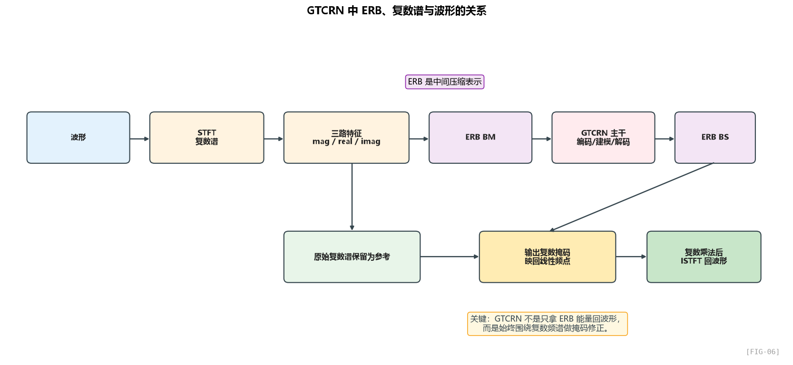
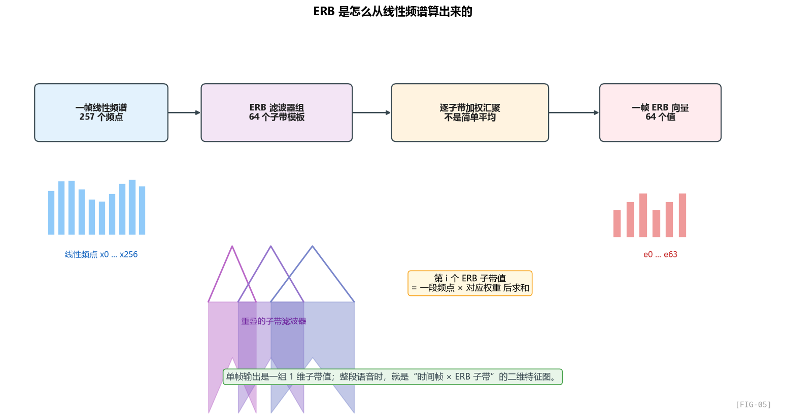
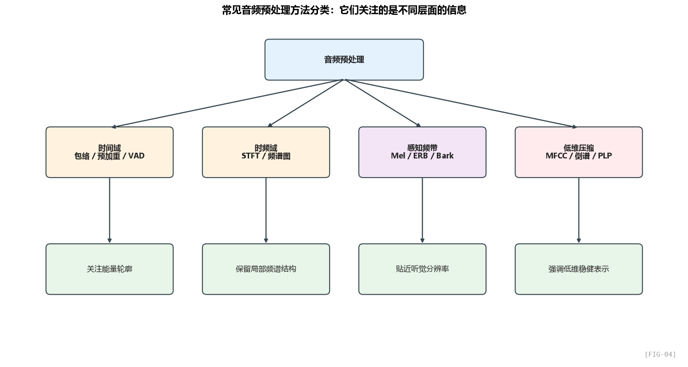

# ERB频带分解到底是什么，以及它在 GTCRN 里是怎么工作的

> 这篇文章专门回答一个容易卡住的问题：
>
> `ERB` 到底算出来的是什么？
> 它是不是把频率分组后做平均？
> 在 `GTCRN` 里，既然进了 `ERB` 域，最后为什么还能回到复数频谱，甚至回到波形？

---

## 目录

- 1. 先说结论：你真正关心的是什么
- 2. ERB 分解后得到的到底是什么
- 3. ERB 是怎么从频谱算出来的
- 4. 它是不是“把一组频点平均一下”
- 5. 只有 ERB，能不能直接回到波形
- 6. GTCRN 里到底是怎么做的
- 7. GTCRN 里的相位到底丢没丢
- 8. GTCRN 为什么还能回到波形
- 9. 常见音频预处理手段放在一起看
- 10. 什么时候该用 ERB，什么时候不用
- 11. 总结

---

## 1. 先说结论：你真正关心的是什么

如果把你的问题翻成最直接的话，其实就是两个：

1. `ERB` 算出来的结果，到底是一组什么东西？
2. `GTCRN` 既然做了 `ERB` 频带压缩，为什么最后还能输出复数频谱，甚至还能重建回波形？

先给最短答案：

- `ERB` 分解后，通常得到的是**一组按听觉频带组织的子带值**；
- 单帧时，它通常是一组 **1 维向量**；
- 整段语音时，它通常是一张 **时间帧 × ERB 子带** 的二维特征图；
- 它不是简单平均，而更像是**用一组带权重的听觉滤波器，对频谱做加权汇聚**；
- 在 `GTCRN` 里，模型并不是“只保留 ERB 能量然后凭空回波形”，而是：
  - 一开始就保留了**复数频谱信息**；
  - 在中间只把表示压到 `ERB` 域里处理；
  - 最后再从 `ERB` 域映回线性频谱；
  - 再对原始复数谱做复数掩码修正；
  - 最后才能回波形。

也就是说：

> `GTCRN` 不是“ERB 直接回波形”，而是“复数频谱 -> ERB 域处理 -> 回到线性复数频谱 -> ISTFT 回波形”。

---

## 2. ERB 分解后得到的到底是什么

`ERB` 分解之后，最常见的结果就是：

- 每个子带输出一个值；
- 所有子带值排成一个向量。

所以如果你只看**一帧频谱**，那么 `ERB` 分解的输出通常就是：

- 一个长度为 `N` 的 1 维数组；
- `N` 是你设定的 ERB 子带数，比如 `32`、`64`、`128`。

如果原始线性频谱有 `257` 个频点，而你最后定义了 `64` 个 `ERB` 子带，那么：

- 输入是一串 `257` 个线性频点值；
- 输出是一串 `64` 个 ERB 子带值。

这个输出里的每个值，不代表“某一个精确频率点”，而代表：

> **某一段听觉频带上的综合响应强度。**

如果处理的是整段语音，那就不是一帧，而是很多帧。

这时结果就变成：

- 横轴是时间帧；
- 纵轴是 ERB 子带；
- 每个格子是该时刻、该子带上的值。

所以你可以把它理解成：

- 单帧时：一组 1 维数据；
- 多帧时：一张 ERB 时频图。

---

## 3. ERB 是怎么从频谱算出来的

这里要特别注意：

`ERB` 不是直接从波形上硬切一刀切出来的，它通常是从**频谱**来的。

最典型的过程是这样的：

1. 波形先做分帧、加窗；
2. 再做 `STFT`，得到线性频谱；
3. 在线性频谱上设计一组 `ERB` 滤波器；
4. 每个滤波器对一段频率范围做加权汇聚；
5. 每个滤波器输出一个子带值。

这一步完成后，你拿到的就是一帧 `ERB` 子带向量。

更口语一点说：

- 原来你有很多线性频点；
- 现在你拿一把“更像人耳”的尺子重新去量；
- 同一段听觉频带内的频点，被整合成一个值。

这就是 `ERB` 分解。

---

## 4. 它是不是“把一组频点平均一下”

可以说**接近这个意思，但更准确的是“加权汇聚”**。

如果只是最粗糙地理解，那么你可以把它先记成：

- 把一段频点合成一个子带值。

但从工程和实现角度讲，它通常不是“所有频点权重一样”的简单平均，而是：

- 每个 `ERB` 子带有一个滤波器形状；
- 中间频点权重大；
- 边缘频点权重小；
- 相邻子带通常还会重叠。

所以更准确的说法是：

> 每个 `ERB` 子带值，是一段线性频点乘上该子带滤波器权重之后的加权和。

如果这些权重恰好都一样，那才退化成“简单平均”。

但实际工程里，为了更像听觉滤波器，通常不会这么做。

这也是为什么图上常画成一串三角形或重叠滤波器：

- 它强调的不是生硬分桶；
- 而是带过渡的频带汇聚。

---

## 5. 只有 ERB，能不能直接回到波形

一般来说，**不能精确直接回**。

原因很简单：

- 线性频谱原来有很多细粒度频点；
- `ERB` 把它们压成更少的子带值；
- 子带内部的细节被合并了；
- 很多情况下，相位也不在这组子带值里。

所以如果你手里只有：

- 一组 `ERB` 子带能量；
- 没有更细的频谱分布；
- 没有相位；

那你通常**不能唯一地恢复原始波形**。

最接近的说法是：

- 你可以做近似重建；
- 但一般不能无损恢复原始波形。

这和把高清图缩成缩略图有点像：

- 缩小后你还能放大回来；
- 但放大后的图不可能完全等于原图。

`ERB` 也是类似逻辑：

- 它更像一种感知压缩表示；
- 不是天生严格可逆的完整表示。

---

## 6. GTCRN 里到底是怎么做的

这才是最核心的地方。

`GTCRN` 并不是这样做的：

- 波形 -> ERB 能量 -> 网络 -> 直接回波形

它真正做的是：

1. **先做 STFT**，拿到带噪语音的复数谱；
2. **从复数谱构造 3 路特征**：幅度、实部、虚部；
3. **对这 3 路特征一起做 ERB 压缩**；
4. 网络在 ERB 域里做编码、时频建模、解码；
5. 解码器输出的是一个**ERB 域里的复数掩码表示**；
6. 再通过 `BS` 把它从 `129` 个频带映回 `257` 个线性频点；
7. 最后这个掩码去乘原始复数谱，得到增强后的复数谱；
8. 再通过 `ISTFT` 回到波形。

这里最关键的不是“ERB 本身能不能回波形”，而是：

> `GTCRN` 在中间做的是“频谱表示压缩”，不是“把波形彻底变成只有 ERB 能量再重建”。

换句话说：

- `ERB` 在这里是中间表征空间；
- 真正支撑重建的是“原始复数谱 + 反映射后的复数掩码”。

---

## 7. GTCRN 里的相位到底丢没丢

这是你最关心的点，答案是：

**没有完全丢。**

原因在于 `GTCRN` 一开始就没有只保留幅度谱。

它输入给网络的不是单独的能量，而是三路特征：

- 幅度 `mag`
- 实部 `real`
- 虚部 `imag`

这意味着：

- 网络看到的不只是“多大声”；
- 还看到了复数谱的两个坐标分量；
- 也就间接保留了相位相关信息。

然后更重要的是最后一步。

`GTCRN` 的输出不是“直接生成干净波形”，也不是“只给一个幅度增益”，而是一个**复数掩码**。

所谓复数掩码，直观上就是：

- 一边改幅度；
- 一边改相位方向。

所以 `GTCRN` 和很多只做幅度掩码的传统方法不一样：

- 它不是把相位完全扔给原输入不管；
- 它是在复数域里直接做修正。

这也是为什么前面 `ERB` 压缩并没有把整个任务变成“纯能量建模”。

它始终还是一个**复数谱增强问题**。

---

## 8. GTCRN 为什么还能回到波形

现在就能解释这个问题了。

它之所以还能回波形，不是因为：

- `ERB` 子带值本身天然可逆；

而是因为：

1. 一开始就在频谱域里工作；
2. 网络保留了复数谱相关信息；
3. `ERB` 只是中途把线性频率轴压缩到更紧凑的表示；
4. 最后又把这份结果映回线性频谱分辨率；
5. 再用复数掩码作用到原始复数谱上；
6. 最终得到一个完整的增强复数谱；
7. 完整复数谱再做 `ISTFT`，自然就能回波形。

所以，真正的因果链是：

- **不是** `ERB -> 直接波形`
- **而是** `ERB 域里的中间处理结果 -> 线性复数频谱 -> 波形`

这两件事差别很大。

---

## 9. 常见音频预处理手段放在一起看

为了不把 `ERB` 看成一个孤立概念，可以顺手把常见音频预处理都放到同一张地图里看。

### 9.1 包络

包络关注的是：

- 一段声音整体是变强还是变弱；
- 起音、衰减、能量轮廓如何变化。

它强调时间趋势，不强调精细频谱。

### 9.2 Mel 频带

Mel 更偏向“感知音高刻度”下的子带能量表示。

它在语音识别、分类和声学建模里特别常见。

### 9.3 MFCC

MFCC 是在 Mel 能量基础上继续压缩出来的一组低维谱包络特征。

它适合：

- 传统语音识别；
- 小模型；
- 经典 DSP + ML 系统。

### 9.4 ERB

ERB 更强调“人耳在不同频段的分辨率”。

它特别适合：

- 语音增强；
- 助听器与耳机前端；
- 听觉滤波器建模；
- 轻量化时频压缩。

### 9.5 它们不是互相替代，而是关注点不同

最短记法：

- 包络：看时间能量轮廓；
- Mel：看感知音高尺度下的频带能量；
- MFCC：看低维谱包络；
- ERB：看更接近听觉滤波器分辨率的子带表示。

---

## 10. 什么时候该用 ERB，什么时候不用

### 更适合用 ERB 的场景

- 语音增强、降噪；
- 助听器、耳机、端侧轻量模型；
- 需要感知合理性和算力压缩同时成立；
- 想把“低频更重要、高频可更粗”这种听觉先验直接写进前端。

### 不一定非要用 ERB 的场景

- 你需要尽量保留最完整的线性频谱细节；
- 你做的是通用声学分类，现成 pipeline 都是 log-Mel；
- 你更关心传统 ASR 风格的低维手工特征，那可能直接上 MFCC；
- 你做的是高保真重建任务，不希望前端过早压缩频率细节。

所以真正的选择标准不是“ERB 高不高级”，而是：

> 你到底要一个更感知友好的压缩表示，还是一个更完整、更原始的频谱表示。

---

## 11. 总结

把整篇文章压缩成最关键的几句：

- `ERB` 分解后，通常得到的是**一组听觉子带值**；
- 单帧时，它通常就是**一组 1 维向量**；
- 它不是简单平均，而是**滤波器权重下的加权汇聚**；
- 单独的 ERB 子带值，通常**不足以精确恢复原始波形**；
- `GTCRN` 之所以还能回波形，是因为它并没有只保留 ERB 能量，而是始终围绕**复数频谱**在做事；
- `ERB` 在 `GTCRN` 里扮演的是**中间压缩表示**，不是最终可逆表示；
- 真正的重建链路是：
  - 复数频谱进入 ERB 域处理；
  - 再回到线性频谱；
  - 再通过复数掩码修正原谱；
  - 最后 `ISTFT` 回波形。

如果只保留一句最重要的话，那就是：

> `GTCRN` 不是“ERB 直接回波形”，而是“复数谱在 ERB 域里被压缩处理，再映回复数谱后重建波形”。
