# GTCRN：一个 23.7K 参数语音降噪网络的设计思路完整解读

> 作者从零讲起：背景、骨架、模块、训练、部署、设计哲学，一篇看完。
>
> 配套材料：GTCRN 论文与公开实现都可以作为辅助阅读材料，但本文尽量按原理本身展开，不依赖具体工程代码跳转。

---

## 目录

- 前言：这篇文章写给谁看
- 第一章 设计思路与背景：作者到底要解决什么问题？
- 第二章 整体架构：一张图看懂 GTCRN 是怎么搭起来的
- 第三章 输入处理与 ERB：怎么把 257 个频点压成 129 个还不丢信息？
- 第四章 GT-Conv 详解：ShuffleNetV2 + 时间空洞，省到极致的卷积块
- 第五章 DPGRNN 详解：双路径 + 分组，RNN 的极致瘦身
- 第六章 SFE 与 TRA：两个"点睛"模块
- 第七章 输出与损失函数：复数掩码 CRM 和"混合损失"的玄学
- 第八章 流式推理：从离线训练到逐帧实时
- 第九章 设计哲学总结：从 GTCRN 学到的可迁移工程思维

---

## 前言

如果你和我一样，是一名有信号处理（STFT、滤波器组、感知声学）和经典机器学习基础的工程师，能看懂代码，知道"卷积"、"RNN"、"注意力"大概是什么，但是看到 GTCRN 这样的网络结构图时会想：

- "作者**为什么**这么搭？这些模块之间凭什么能拼成一个能降噪的东西？"
- "23.7K 参数怎么做到打过 RNNoise（60K参数），并且打平甚至超过几百万参数的大模型的？"
- "如果让我从零设计，我能想到这些 trick 吗？我和作者之间差的是什么？"

那这篇文章可能对你有用。

我不打算把它写成论文复读机，那样毫无价值——论文你自己就能看。我想做的是 **还原作者的思考路径**：当他坐在工位上想"我要做一个能放在耳机里跑的降噪模型"，他第一步会想什么，第二步又怎么走到 ERB、ShuffleNet、DPRNN 这些组件上，每一个看起来很骚的设计背后到底解决的是什么实际问题。

读完这一系列，你应该能：

1. 理解 GTCRN 每个模块**解决的具体问题**，而不是只记住名字；
2. 看到一个新的 SE 模型时，能识别其中**哪些是骨架、哪些是 trick**；
3. 在自己的项目里能**做出取舍**：什么时候上 attention、什么时候用 grouped conv、什么时候 CRM 不如 mag-mask。

**阅读建议**：

- **顺序读**：每章都建立在前一章的基础上，跳读容易"知其然不知其所以然"。
- **对照原理读**：如果你手边恰好有实现，可以边看边对照；如果没有，也不影响理解本文。
- **不要急于求成**：一章读完后，建议**自己复述一遍这个模块解决的是什么问题**，然后再进入下一章。

---

## 第一章 设计思路与背景：作者到底要解决什么问题？

> 在动笔之前你要先认清——**任何一个好网络都不是从 PyTorch 的某个模块开始的，而是从一个真实的工程约束开始的**。GTCRN 也一样。

### 1.1 一切的起点：耳机里要塞下一个降噪算法

2023 年作者落笔写这篇论文的时候，深度学习语音降噪（Speech Enhancement, SE）领域早就过了"能不能用 DNN 把噪声压下去"的阶段。SOTA 模型的 PESQ 都做到 2.8 以上了，问题是——

**它们都跑在云端、或者至少在手机上跑。耳机里跑不动。**

我们看一下作者在论文里点名的几个对手：

| 模型 | 参数量 | 算力（每秒 MACs） | 备注 |
|:----:|:----:|:----:|:----:|
| RNNoise (2018) | 60K | 40M | 经典的 DSP + 小 GRU 混合方案 |
| PercepNet (2020) | 8M | 800M | 谷歌的全频带降噪 |
| DeepFilterNet (2022) | 1.8M | 350M | UNet + 深度滤波 |
| S-DCCRN (2022) | 2.34M | - | 复数卷积循环网络 |
| **GTCRN (本文)** | **23.7K** | **39.6M** | 比 RNNoise 还小一半 |

注意这张表里 RNNoise 和 GTCRN 的算力是同一个数量级（几十兆 MACs/秒），其他模型都在百兆甚至 G 级别。

这意味着什么？**目标设备是 TWS 耳机、助听器、IoT 设备这类靠纽扣电池供电的玩意儿。** 这些设备上跑一个 GMACs 级别的模型，要么 DSP 算不过来，要么算得过来但电池半小时就没了。

所以作者面对的不是一个"找到最高 PESQ"的学术游戏，是一个**带硬约束的工程优化题**：

> 在 < 50K 参数、< 50M MACs/秒 的预算内，把语音降噪做到尽可能接近大模型的水准。

这个约束直接决定了下面所有设计选择。**理解这一点，整篇论文的每个 trick 才有"动机"可言。**

### 1.2 已有的"轻量化"路子，作者为什么都不满意？

论文 Introduction 把现有轻量化方案归成三类，我们一类一类看作者怎么吐槽的：

#### 路线 A：压缩已有大模型（剪枝、量化）

代表工作：TinyLSTMs (2020)、Tan & Wang 模型压缩 (2021)。

**思路**：训练一个大模型，然后把没用的连接剪掉、把权重从 FP32 量化到 INT8。

**问题**：天花板被大模型定死了，剪到极致还是几百 K 参数，而且**剪枝后的网络结构往往不规则，部署时很难高效跑起来**（特别是 DSP）。

> 工程师的直觉：剪枝就像把一栋装修豪华的别墅拆掉一半承重墙改成单身公寓——能住，但结构本身就不是为单身公寓设计的，处处不顺手。

#### 路线 B：从零设计高效结构

代表工作：TRU-Net (2021)、Braun et al. (2021)。

**思路**：直接设计一个小网络。比如把 2D 卷积拆成"频域 1D 卷积 + 时域 1D 卷积"（depth-wise separable），用并行 GRU 之类的技巧。

**问题**：作者不是反对这条路——**GTCRN 自己就走的是这条路**。但作者觉得现有方案"还不够小"，依然在几百 K 到几 M 之间。

#### 路线 C：小网络 + 后处理 / 经典 DSP

代表工作：RNNoise、PercepNet、DeepFilterNet、DPCRN-CF。

**思路**：用 DNN 估一个粗糙的频带增益（spectral envelope gain），再用经典 DSP（比如 pitch comb filter）做细化处理（去除谐波之间的噪声）。

**问题**：除了 RNNoise，这一类的模型都太大了，**只有 RNNoise 真的小，但它效果太差**。

> 这里非常有意思——作者明确把 **RNNoise 当作"假想敌"**。整篇论文反复出现"我们比 RNNoise 好"，因为 RNNoise 是这个赛道里唯一一个被广泛部署、真的能在嵌入式设备上跑、并且大家都知道它效果有上限的对手。

#### 总结作者的"诊断"

可以把作者的判断压缩成三句话：

- 大模型压缩路线，最终还是容易卡在原始大结构上；
- 纯高效结构路线，当时多数方案仍停留在 `100K+` 参数量级；
- 小网络 + DSP 路线里，真正够小的只有 `RNNoise`，但效果又不够强。

所以作者瞄准的空白点是：**`< 50K` 参数，同时效果显著优于 `RNNoise`。**

这就是 GTCRN 的市场定位。

### 1.3 选定 baseline：为什么是 DPCRN？

作者既然要走"高效结构设计"路线，第一个问题是：**站在谁的肩膀上**？

他选了 **DPCRN**（Dual-Path Convolutional Recurrent Network）作为起点，理由（我替作者补充一下）：

1. **DPCRN 是 CRN（卷积循环网络）的代表作之一**，结构上是 U-Net 卷积编码器/解码器 + 中间一个 RNN 瓶颈，工程上稳定、训练好收敛；
2. **DPRNN（Dual-Path RNN）天然适合时频域特征**：一路 RNN 沿频率方向跑（建模"一帧之内的频谱模式"），另一路沿时间方向跑（建模"某个频点的时间演化"）。这种"双路径"思路对语音的结构非常贴合——语音既有频谱形态（共振峰、谐波），也有时间动态（音素持续、能量包络）；
3. **复数比例掩码（CRM）+ 复数频域处理**已经被验证是 SE 任务里最稳的输出形式。

但 DPCRN 直接拿来不行——它太大了（几 M 参数）。所以作者要做的事是：

> **拿 DPCRN 当骨架，用各种"瘦身术"把它砍下来，并且想办法在砍掉的地方用更轻的模块把性能补回来。**

这一句话就是 GTCRN 的设计总纲。后面所有模块都是围绕"砍 + 补"做的。

### 1.4 作者的"砍 + 补"工具箱

我们提前把工具列出来，后面每一章会逐一展开：

**砍（降低计算）**

| 工具 | 解决什么问题 | 灵感来源 |
|:----:|:----:|:----:|
| **ERB 频带合并 (BM/BS)** | STFT 输出 257 个频点太冗余，高频本来分辨率就不需要那么细 | 心理声学的 ERB 滤波器组 |
| **Grouped Convolution** | 标准卷积参数随通道数平方增长 | ShuffleNetV2 |
| **Grouped RNN (GRNN)** | 标准 GRU 参数随隐藏维平方增长 | Group RNN (NAACL 2018) |

**补（弥补性能）**

| 工具 | 解决什么问题 | 灵感来源 |
|:----:|:----:|:----:|
| **Dilated DD-Conv** | 小卷积感受野不够长，看不到 100ms 以上的时间依赖 | WaveNet 系列的空洞卷积 |
| **Subband Feature Extraction (SFE)** | Grouped conv 通道少，频域信息利用率低 | 作者原创——堆通道补信息 |
| **Temporal Recurrent Attention (TRA)** | 不同时刻信噪比不一样，需要时间维度的注意力 | 时频域注意力的简化版 |
| **Channel Shuffle** | Grouped conv 通道之间不交互信息会损失 | ShuffleNetV2 |

注意这张表里 **作者真正"原创"的只有 SFE 和 TRA 两个模块**，其余都是从计算机视觉或 NLP 借鉴来的成熟模块。

这是一个非常值得学习的设计哲学：

> **大部分时间不要自己发明轮子，组合已有的强模块、然后只在关键瓶颈处加一个自创的小模块，往往比从零设计更有效。**

### 1.5 设计目标分解：一张图把后面所有章节串起来

我们把 GTCRN 的设计目标分解成几个层次的子问题，每一层对应后面一章：

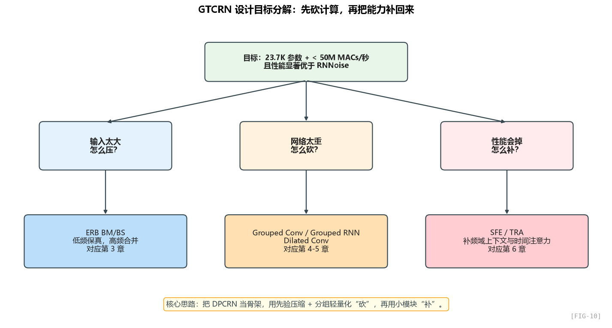

这张图把后面的章节关系串起来了：先解决**输入压缩**，再做**主干轻量化**，最后用少量模块把性能补回来。

### 1.6 一句话总结这一章

> GTCRN 不是"又一个新网络"，它是作者在"耳机能塞得下"这个硬约束下，把 DPCRN 通过 ERB / Grouped Conv / Grouped RNN 砍到极限，再用 SFE 和 TRA 把性能补回来的工程产物。
>
> **理解了"砍 + 补"这个二元结构，你就理解了 GTCRN 的灵魂。**

---

## 第二章 整体架构：一张图看懂 GTCRN 是怎么搭起来的

> 在拆模块之前，我们先看全景。一个网络的全景图，本质上就等价于它的一次完整前向计算过程。

### 2.1 先看入口：forward 在做什么

把整体计算过程抽象出来，其实可以压缩成下面这 8 个阶段：

1. 输入是带噪复数谱；
2. 先整理成幅度、实部、虚部三路输入特征；
3. 高频通过 ERB 压缩，低频原样保留；
4. 经过 SFE，把相邻频带的局部上下文打包到通道维；
5. 编码器把频率维压低、通道维拉高；
6. 两层 DPGRNN 在低维表示上补足全局时频建模；
7. 解码器恢复频率分辨率；
8. 最后输出复数掩码，乘回原谱，得到增强结果。

这就是全部。25 行里包含了 8 个语义阶段，我们一阶段一阶段看。

### 2.2 数据张量的"形变之旅"

理解一个网络最快的方式不是看模块定义，而是**追着张量的 shape 走一遍**。我们画一张表：

| 阶段 | 操作 | 输出 shape | 维度含义 |
|:----:|:----:|:----:|:----:|
| 输入 | STFT | `(B, 257, T, 2)` | B批次，257频点，T帧，2(实/虚) |
| ① 特征工程 | 拼成 [mag, real, imag] | `(B, 3, T, 257)` | 3通道，频率移到最后 |
| ② ERB BM | 高频(192点)→64带 | `(B, 3, T, 129)` | 频率维压缩 50% |
| ③ SFE | 每个频带堆相邻 3 个 | `(B, 9, T, 129)` | 通道 ×3，频率不变 |
| ④ Encoder | Conv ×2 + GT-Conv ×3 | `(B, 16, T, 33)` | 频率维降到 33，通道升到 16 |
| ⑤ DPGRNN ×2 | RNN建模时频依赖 | `(B, 16, T, 33)` | shape 不变，特征被增强 |
| ⑥ Decoder | DeConv 反向上采样 | `(B, 2, T, 129)` | 频率恢复到 129，通道降到 2(real/imag) |
| ⑦ ERB BS | 反变换 | `(B, 2, T, 257)` | 频率恢复到 257 |
| ⑧ 复数掩码 | 谱相乘 | `(B, 257, T, 2)` | 增强后的复数谱 |

**关键洞察**：网络的"瓶颈"在哪？看维度乘积——

- 输入：`3 × 257 = 771` 维特征
- ERB 后：`3 × 129 = 387` 维（砍掉一半）
- Encoder 后：`16 × 33 = 528` 维（高维通道弥补低维频率）

**作者的"信息守恒"策略已经隐含在 shape 里**：每一次砍掉频率维度，他都通过升通道把信息接回来。这是 U-Net 的经典思路，也是为什么 Encoder 最后一层 frequency=33、channel=16。

### 2.3 整体架构图：从代码反推出的全景

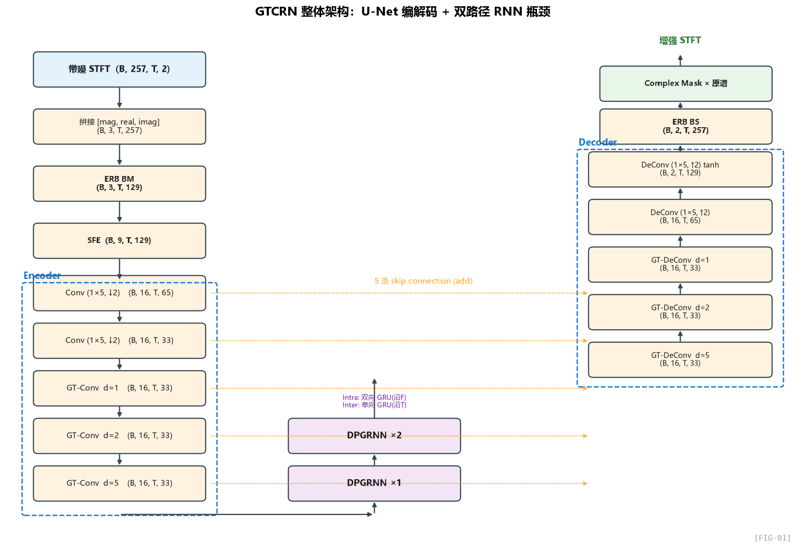

下面补一张更细的数据流图，把各阶段的 shape 和 skip connection 也一起标出来：

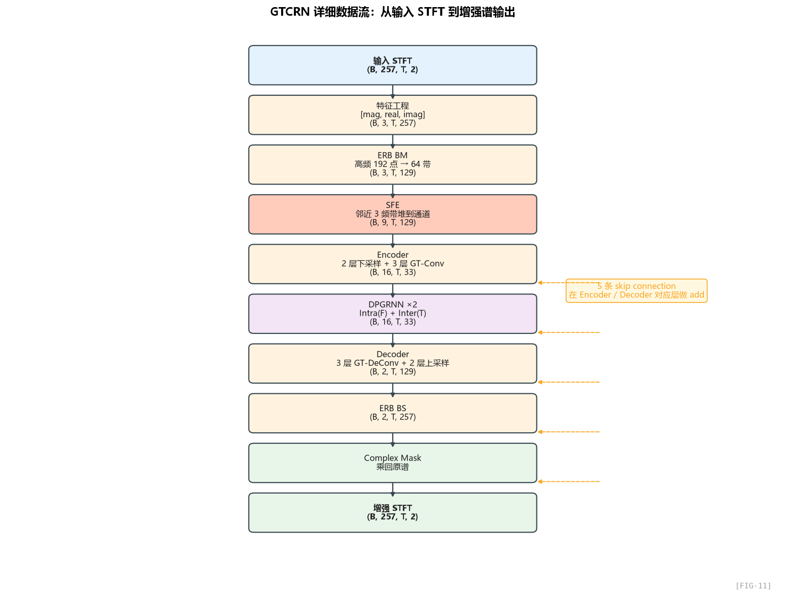

### 2.4 这个架构的几个核心设计抉择

读完上面这张图，我想让你注意到 5 个**作者做出的关键选择**——这些选择不是必然的，每一个都是在和"参数 / 算力 / 性能"做交易：

#### 抉择 1：U-Net 而不是纯 RNN/Transformer

为什么不直接像 RNNoise 那样用纯 GRU？因为 GRU 只能处理 1D 序列，无法显式建模"邻近频点之间的关系"——而这对去噪非常重要（噪声往往跨频带，谐波结构在频域局部）。

为什么不用 Transformer？参数和算力都打不住。Self-attention 的复杂度是 O(N²)。

**U-Net + RNN 是性价比最高的选择**：CNN 处理频谱局部模式，RNN 处理时序长距离依赖。

#### 抉择 2：编码器先压频率，后处理时间

注意到编码器里 **stride 只在频率维 (1, 2)**，时间维永远是 stride=1：

抽象地说，这里最关键的是：**只对频率维做步长压缩，不对时间维做下采样。**

为什么？因为**时间维度天然就需要保持精细分辨率**——你不能下采样时间，否则后面 RNN 看不见瞬态噪声。而**频率维度可以下采样**，因为相邻频点的信息有大量冗余（共振峰、谐波在频域是稀疏的）。

> 这是 SE 任务和图像分类任务最大的区别之一：图像 H/W 同质，可以同步下采样；语音 T/F 不对称，时间维要珍惜。

#### 抉择 3：中间瓶颈用 DPGRNN 而不是 1D RNN

DPCRN 论文的核心贡献就在这里：中间瓶颈不是一路 RNN 看全部，而是 **拆成两路 RNN**：

- **Intra-frame RNN（一帧内的 RNN）**：在固定时间 t，沿着频率方向 f=0..32 跑一遍 RNN。建模"频谱形态"。
- **Inter-frame RNN（跨帧 RNN）**：在固定频率 f，沿时间方向 t=0..T 跑一遍 RNN。建模"时间动态"。

这种"双路径"分解可以**用更少的隐藏维度达到接近全连接 RNN 的效果**。GTCRN 在此之上再加一层"group"——这是第 5 章的内容。

#### 抉择 4：解码器输出"掩码"而不是"干净谱"

注意最后一层会使用 `tanh`，把输出限制在 `(-1, 1)` 范围内。

这两个通道直接被当成**复数掩码**（CRM, Complex Ratio Mask）的实部和虚部：

这里的本质就是一次复数乘法：掩码并不是凭空生成干净谱，而是在原谱的基础上做“复数修正”。

这是一个**关键的设计哲学**：网络不直接预测干净谱，而是预测"对原谱应该做什么修改"。这相当于残差学习——网络只需要学"差异"，比直接重建容易得多。

CRM 比 IRM（理想比例掩码，只对幅度做掩码）的好处是**能同时修正相位**——这正是 DCCRN、DPCRN 等模型超越 RNNoise（只做幅度增益）的根本原因。

#### 抉择 5：所有 Conv 的 kernel 时间维都很小

仔细看所有卷积的 kernel：

- 编码器外层 `(1, 5)`：时间维 kernel=1，**不跨帧**
- GT-Conv `(3, 3)`：时间维 kernel=3

这意味着：**卷积本身不承担长时间依赖建模**，只看 1-3 帧的局部信息。**长时依赖全部交给 RNN**。

这是一个非常清晰的分工：

| 模块 | 负责 |
|:----:|:----:|
| Conv (1×k) | 频域局部模式（谐波、共振峰） |
| GT-Conv (3×k) | 时频局部模式 + 短时依赖（3帧≈48ms） |
| GT-Conv dilation=5 | 中等时间依赖（13帧≈208ms） |
| DPGRNN | 全局时间依赖（理论上无限远） |

**作者用 dilation 把卷积的时间感受野推到 200ms 左右，剩下的交给 RNN**。这个分工是很有讲究的——后面第 4 章会展开。

### 2.5 一个容易被忽略的细节：skip connection 的"加法"形式

注意它的 skip connection 采用的是“相加”而不是“拼接”：

也就是说，解码器每往前走一层，都会把对应编码层的特征直接**相加**回来。

经典 U-Net 的 skip 是 **concat（拼接）**，这里却用的是 **add（相加）**。

为什么？因为 **concat 会让通道数翻倍，参数翻倍**。GTCRN 是要省参数的，所以用 add。

但 add 有个前提：encoder 和 decoder 对应层的 channel 必须严格一致——所以你看 GT-Conv 的 in_channels 和 out_channels 都是 16，整个 encoder/decoder 主干都是 16 通道。**这是为了 add 而做的强约束**。

### 2.6 一个反直觉的设计：DPGRNN 在 encoder 和 decoder 之间，不是"瓶颈"

很多人看 U-Net 习惯把中间瓶颈叫"latent space"，但 GTCRN 的 DPGRNN 处的张量并不是最小的：

- Encoder 输出：(16, T, **33**)
- DPGRNN 输出：(16, T, **33**) - 没有进一步压缩

也就是说 **DPGRNN 不下采样，只增强特征**。它的作用更像是"在已经压缩好的低维表示上做时序建模"。这是 DPCRN 类网络区别于 DCCRN（DCCRN 的中间是 LSTM，会进一步压缩频率维）的设计差异。

### 2.7 这一章的小结

- GTCRN 的本质是 **U-Net + 双路径 RNN 的轻量化版本**；
- 张量在网络里走过的形变路径揭示了"砍频率、补通道"的核心策略；
- 时间维度精细保留、频率维度大胆压缩，是 SE 任务的关键先验；
- skip 用 add 而非 concat 是为了省参数；
- 输出复数掩码（CRM）而不是干净谱，是残差学习思想；
- 卷积负责短时局部，RNN 负责长时全局，分工清晰。

---

## 第三章 输入处理与 ERB：怎么把 257 个频点压成 129 个还不丢信息？

> 这一章我们要深入第一个"砍"的工具——**ERB 频带合并**。这是 GTCRN 节省算力的最大杠杆，也是把声学知识"硬编码"进网络的典型案例。

### 3.1 先看输入：从波形到 STFT，参数怎么定

从常见实现设定来看，输入端通常会先做一次标准 STFT：

从抽象过程看，输入端就是：用 `32 ms` 窗长、`16 ms` 帧移做一次标准 STFT，把波形转成 `257` 频点的复数时频表示。

几个关键超参数：

| 参数 | 取值 | 物理意义 |
|:----:|:----:|:----:|
| 采样率 | 16 kHz | 宽带语音标准 |
| `n_fft` | 512 | FFT 长度 |
| `win_length` | 512 | 加窗长度 = 32 ms |
| `hop_length` | 256 | 帧移 = 16 ms |
| 窗函数 | √Hann | 满足完美重构（COLA） |

#### 为什么是 32 ms 窗 / 16 ms 帧移？

这是语音处理的"行业默认值"，背后的物理逻辑是：

- **语音的短时平稳性大约在 10-40 ms 之间**。窗太短（比如 8ms），频率分辨率不够，看不清共振峰；窗太长（比如 100ms），把多个音素糊在一起，时间分辨率不够。32ms 是这个 tradeoff 的甜区。
- **帧移 = 窗长 / 2** 是 50% 重叠，配合 √Hann 窗满足 **COLA 条件**（Constant Overlap-Add），保证 ISTFT 重构是无损的（数学上 `Σ window²(n−k·hop) = 1`）。

> 工程提示：如果你要改窗长，必须同步改帧移、改窗函数，否则 ISTFT 会有人工 artifacts。GTCRN 用 √Hann 是为了让"分析窗 × 合成窗 = Hann"，这是 OLA 的标准配方。

#### STFT 输出 shape

对于 16kHz / 1秒音频，n_fft=512 / hop=256：

- 帧数 T ≈ 16000 / 256 ≈ 63 帧
- 频点数 F = 512/2 + 1 = **257**（奈奎斯特频率以下）

所以 `(B, 257, T, 2)` 就是这么来的。最后那个 `2` 是 [real, imag]。

### 3.2 第一步特征工程：三通道拼接

这一步可以概括成：从复数谱里拆出实部和虚部，再额外计算一个幅度谱，最后把三者堆成三通道输入。

这一步做了什么？把原始的 `(real, imag)` 两通道扩成 `(mag, real, imag)` 三通道。

**为什么要冗余加一个 mag？** 

- **mag 信号噪声比明显**：人耳对响度敏感，幅度谱（spectrogram）是降噪任务最直观的特征。直接给网络一个"被噪声污染"的 mag 比让它自己去 sqrt(real² + imag²) 更省事。
- **real / imag 携带相位信息**：单靠 mag 不够，相位也要修。但相位的"绝对值"对网络没用，所以保留 real/imag 这种笛卡尔形式。
- **冗余特征有助于训练稳定**：给网络多种"角度"的同一信号，让它自己挑哪个最有用——这是 multi-view 思想。

> 这里有一个细节：`+ 1e-12` 是为了避免 sqrt(0) 的梯度爆炸。这种数值技巧在大量算法里都很重要，但论文不会写。

### 3.3 核心来了：ERB 频带合并 (Band Merging)

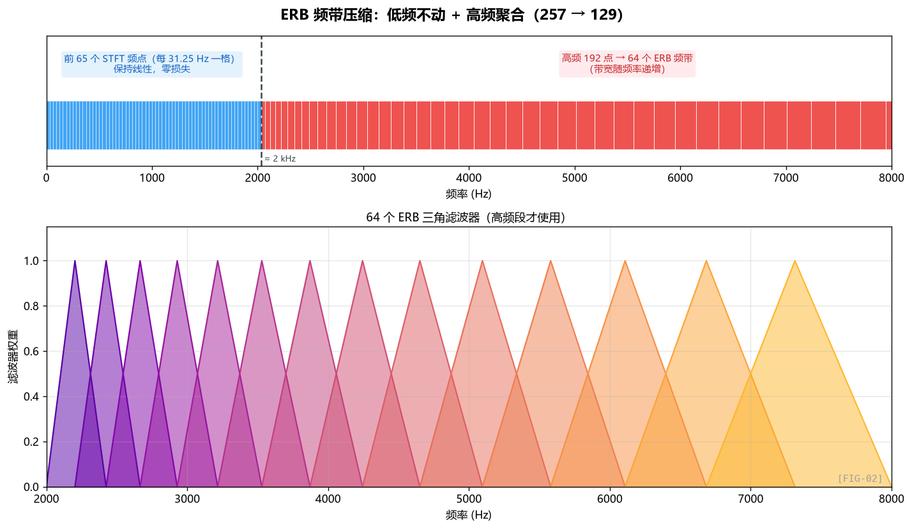

这一部分通常会被实现成一个固定的 `ERB` 频带变换模块。

#### 心理声学常识：什么是 ERB？

ERB（Equivalent Rectangular Bandwidth，等效矩形带宽）是描述人耳"频率分辨率"的尺度。

**人耳对低频敏感、对高频迟钝**——具体地：

- 100 Hz 附近，人耳能分辨大约 30 Hz 的差异
- 1000 Hz 附近，人耳能分辨大约 130 Hz 的差异
- 8000 Hz 附近，人耳能分辨大约 1300 Hz 的差异

也就是说，**线性 Hz 尺度对人耳来说是"过度精细"的**——在高频，相邻几个 Hz 的差异人耳根本听不出来。

ERB 标度（也包括 Bark、Mel 标度）就是把 Hz 重新映射成"人耳感知意义上等间距"的尺度。**在高频区，多个 Hz 的 STFT 频点会被合并成一个 ERB 频带，因为人耳反正分辨不出。**

ERB 这一套的数学本质其实只有一句话：**频率越高，人耳的分辨率越粗。** 所以高频可以合并，低频则必须保留更多细节。

#### GTCRN 的 ERB 怎么用？

这里作者做了一个**重要的工程取舍**：

> **低频不动，高频才合并。**

在 GTCRN 的设定里，可以把它理解成：

在 GTCRN 里，这可以直接理解成：低频保留 `65` 个线性频点，高频把 `192` 个频点压成 `64` 个感知频带。

参数含义：

- `erb_subband_1 = 65`：前 65 个 STFT 频点（0 ~ 2000 Hz）**保持原样**
- `erb_subband_2 = 64`：剩下的 192 个 STFT 频点（2000 ~ 8000 Hz）**合并成 64 个 ERB 频带**

总共输出 65 + 64 = **129 个频带**，比原始 257 砍了将近一半。

#### 为什么低频不合并？

这是论文 Sec 2.1 明确写的：

> "harmonics are more likely to be present in low-frequency bands and rarely occur in high-frequency bands"

**语音的谐波结构主要集中在低频（基频 80-400 Hz，前几个谐波在 1-2 kHz 之内）**。这些谐波之间的精细频率结构（比如基频附近 10 Hz 的差异）对人耳的语音感知至关重要——一旦合并，就会把基频信息搞糊。

而高频的谐波间距已经很大（10次谐波在 800 Hz 处差距是 80 Hz，但在 4000 Hz 处差距已经达到几百 Hz），人耳分辨不出，可以放心合并。

> 这就是把**声学专家知识**直接编码进网络的典型例子。如果让一个完全没有领域知识的人去设计，他可能会均匀地下采样所有频率，那性能就会塌掉。GTCRN 的小巧很大一部分来自这种"先验注入"。

#### ERB 滤波器组的具体形状：三角窗

如果继续往下拆，ERB 滤波器组的构造逻辑大致如下：

如果把 ERB 滤波器组的生成过程抽象成步骤，它就是：

1. 先在 ERB 尺度上均匀取点；
2. 再把这些点映射回 FFT 的 bin；
3. 最后在相邻 bin 之间搭出一组重叠的三角窗。

这段代码在做什么？**构造 64 个三角形权重函数**，每个三角形覆盖一段 FFT bin，并和相邻频带重叠：

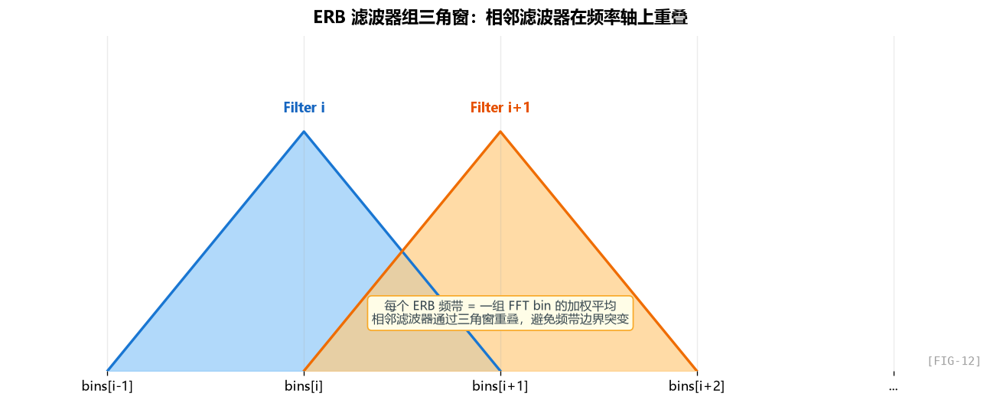

每个 ERB 频带 = 多个 FFT 频点的加权平均（三角窗加权）。这是 Mel/Bark/ERB 滤波器组的标准形式。

#### 怎么用：BM 和 BS 是一对反操作

所以 BM/BS 这一对操作可以理解成：低频直接直通，高频先压到 ERB 域里处理，最后再映射回原始线性频率轴。

注意这里的 ERB 映射虽然在实现上常被包成线性层，但它本质上仍然是一个固定变换。

这里最重要的是设计哲学：**ERB 是固定先验，不是靠训练学出来的。**

**`requires_grad=False`**——也就是说这两个矩阵**不参与训练**！

这就引出了一个有趣的细节：论文里说参数量是 23.7K，但 README 更新成了 48.2K。差的就是这部分 ERB 矩阵的“参数”（虽然不可训练）。论文后来还提到，低频部分如果直接视作拼接而不是矩阵乘法，整体算力还能继续往下省。

> **设计哲学**：把不可训练的、有解析形式的变换写成"不可学习的 Linear"，是把领域知识嵌入网络的优雅方式。后续如果想让 ERB 矩阵可学习（end-to-end 优化），只需要把 `requires_grad` 改成 True。

### 3.4 SFE 模块：把"邻近频带"塞进通道维

紧接着 ERB 之后是 SFE（Subband Feature Extraction），第 6 章会详细讲。这里先看它在整体流程里怎么用：

在 GTCRN 里，SFE 可以简单理解为“每次看 3 个相邻频带”。

`SFE` 的实现思路可以抽象成这样：

它做的事情只有一句话：在每个频带位置上，把“左邻居、自己、右邻居”的特征一起塞进通道维。

简单说：用一次滑窗提取，把每个频点的左右邻居拼到自己的通道维上。

输入 `(B, 3, T, 129)`，经过 SFE(k=3) → 输出 `(B, 9, T, 129)`：

因此从感知上看，一个频带不再只看到自己，而是一次性看到一个 3 频带宽的小局部上下文。

**为什么这样做？** 因为后面的卷积通道数只有 16，且使用了 grouped conv，每个 group 看到的频域上下文非常有限。SFE 提前把"邻居信息"打包好塞到通道维，让后面的 pointwise conv (1×1 conv) 直接就能用到。

详细原理留到第 6 章。

### 3.5 一个端到端的算账：ERB 节省了多少算力？

我们做个粗略估算：

**不用 ERB 的情况**：

- 输入 (B, 3, T, **257**)
- 第一层 Conv (3, 16, kernel=(1,5)): 算力 ≈ T × 257 × 5 × 3 × 16 / 2 (因 stride=2) ≈ T × 30,840 MACs

**用了 ERB 的情况**：

- 输入 (B, 9, T, **129**) ← SFE 后通道是 9
- 第一层 Conv (9, 16, kernel=(1,5)): 算力 ≈ T × 129 × 5 × 9 × 16 / 2 ≈ T × 46,440 MACs

哎，看起来反而更高？因为 SFE 把通道从 3 拓到 9 了。

但你要看整个网络——**后面所有的层都因为频率维从 257 砍到 129 而节省了一倍计算**：

- DPGRNN 输入维度从 ~129 降到 33（经过 4 次下采样：129→65→33）。如果不砍频率，最后 DPGRNN 要处理 ~64 维频率，参数量和计算量都翻倍。
- Encoder/Decoder 每一层都因频率维减半而省一半算力。

所以这是一个**头部花点小钱（SFE 通道扩张），换取整体省大钱（后面所有层频率维减半）**的交易。

### 3.6 ERB 模块的"工程感觉"总结

我们把这一章学到的东西凝成几条工程直觉：

1. **遇到"维度过高、信息冗余"的场景，第一反应应该是去找领域已有的标度（Mel、Bark、ERB）**——不要从零设计下采样策略。
2. **不可训练的领域变换可以直接固定下来**——既保留高效实现，又不占用训练参数预算。
3. **"砍维度 → 升通道"是一个反复出现的范式**：信息守恒，但表示形式变了。
4. **低频敏感、高频粗略**这种声学先验对语音相关网络极其重要，要主动找机会把这种先验编码进去。

### 3.7 一个值得思考的小问题

如果让你把这套 ERB 思路推广到 48 kHz 的全频带降噪（fullband SE），你会怎么改？

提示：

- 频点数会从 257 变成 1025（n_fft=2048 时）
- 低频还是 65 个不动？还是 130 个不动？
- 高频要压缩多少？

这是 DeepFilterNet、ULSE 等全频带模型实际要回答的问题。GTCRN 解决的是宽带（16kHz）的 case，是一个更窄的问题。

---

## 第四章 GT-Conv 详解：ShuffleNetV2 + 时间空洞，省到极致的卷积块

> GT-Conv 是 GTCRN 编码器/解码器的**主力计算单元**。理解它，就理解了 GTCRN 是怎么用极少的参数捕捉时频特征的。

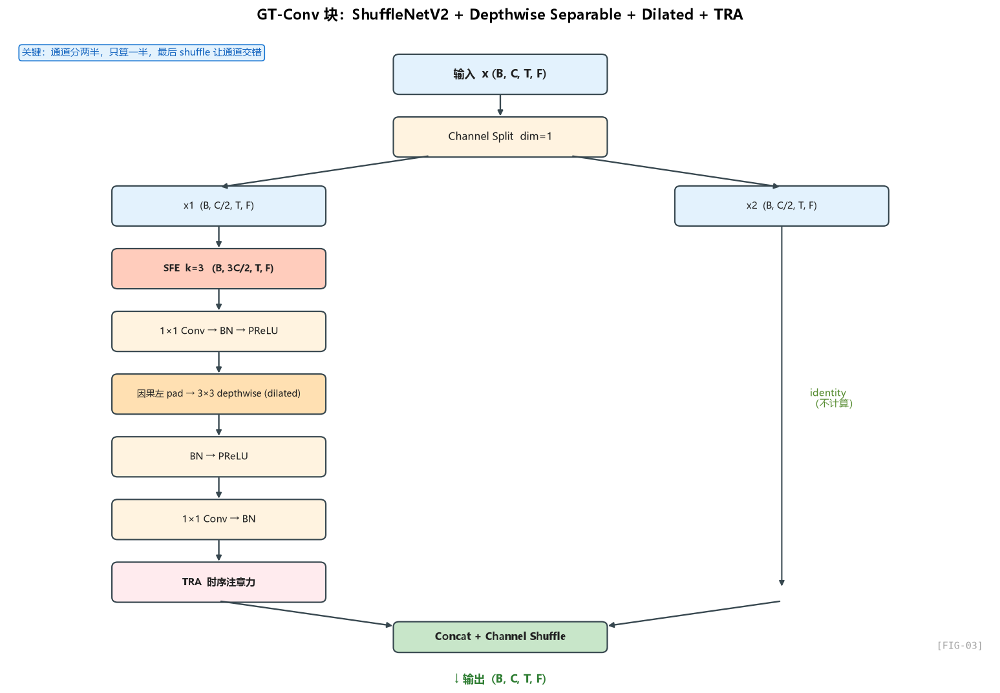

### 4.1 先看抽象结构：GT-Conv 到底在做什么

把 GT-Conv 完全抽象开来看，它就是一条很清楚的处理链：

1. 先把输入通道分成两半；
2. 一半完全不计算，直接直通；
3. 另一半先过 SFE，补上频域邻居信息；
4. 再走 `1×1 通道混合 → depthwise 局部卷积 → 1×1 压回去` 的轻量主链；
5. 主链末尾接 TRA，判断哪些时间帧更重要；
6. 最后把两半交错混合，作为下一层输入。

这是整篇网络里最复杂的模块，里面集成了 **4 个核心思想**：

1. **ShuffleNetV2 单元**：通道分两半，一半计算一半 identity
2. **Depth-wise Separable Convolution**：把 3×3 拆成"通道独立卷积 + 1×1 通道混合"
3. **Dilated Convolution**：用空洞卷积扩大时间感受野
4. **TRA**：时序注意力（下一章详讲）
5. **SFE + 因果填充**：子带特征 + 因果约束（部分细节）

我们一个一个拆。

### 4.2 ShuffleNetV2 单元：为什么"一半算一半不算"

#### 设计动机：参数和算力的"对半省"

标准 2D 卷积 `Conv2d(C, C, k=3)` 的参数量是 **C × C × 9**。当 C=16 时，参数 = 2304。如果直接做完整卷积，每个 GT-Conv 块就 2K+ 参数，整个网络 5 个 GT-Conv 就 10K，再加 DPGRNN 和编解码器，肯定超 50K。

**ShuffleNetV2 的关键观察**：在轻量化 CNN 里，**不需要所有通道都过一遍卷积**。把通道分成两半，只让一半参与计算，另一半直接传过去，最后做一次 channel shuffle 让两半信息混合——这样：

- 计算量减半（只算一半通道）
- 参数减半（卷积层输入输出通道都减半）
- 信息不损失（shuffle 让两半交换信息）

#### 抽象理解

这里真正重要的不是某个具体 API，而是：**只计算一半通道，另一半保留原样，再通过交错混合防止两路信息彻底断开。**

这里的“shuffle”可以直接理解成：把“算过的通道”和“直通的通道”交错排布，让下一层再分组时，每组都能拿到两边混合后的信息。

也就是说，输出通道排列是 `[x1[0], x2[0], x1[1], x2[1], ...]` 而不是 `[x1[0], x1[1], ..., x2[0], x2[1], ...]`。

**为什么要交错？** 因为下一层会再 `chunk(2, dim=1)`——交错排列后，**两个分支被强制混合**，下一次拆分时拿到的"前一半"是 x1 和 x2 的混合，"后一半"也是 x1 和 x2 的混合。这就是 channel shuffle 的本意：**强制信息在层与层之间交换**。

> 没有 shuffle 的话，x1 永远只在自己那半边传，x2 永远不变，相当于两个独立的子网络——那就完全不需要 shuffle 了。

### 4.3 Depth-wise Separable Convolution：把 3×3 拆成两步

GT-Conv 的核心是 "1×1 → 3×3(depthwise) → 1×1" 的三明治结构。这是 **MobileNet 系列发明的 depthwise separable conv** 的标准形式。

#### 标准卷积 vs Depthwise Separable

| 操作 | 标准 Conv(C_in, C_out, k×k) | Depthwise Separable |
|:----:|:----:|:----:|
| 步骤 1 | — | 1×1 conv: C_in → hidden |
| 步骤 2 | k×k conv: C_in → C_out | k×k depthwise conv: hidden → hidden (groups=hidden) |
| 步骤 3 | — | 1×1 conv: hidden → C_out |
| 参数量 | C_in × C_out × k² | C_in × hidden + hidden × k² + hidden × C_out |
| 算力 | 同上 | 大幅降低（depthwise 只算 hidden×k² 而不是 hidden²×k²） |

**关键：depthwise conv 的 `groups=hidden_channels`**，意味着每个通道独立做 3×3 卷积，通道之间不混合。混合的事情交给前后两个 1×1 conv。

这里你只需要记住一个抽象关系：标准卷积把“通道混合”和“局部感受野建模”绑在一起做；而 depthwise separable 是把这两件事拆开做，所以更省。

`groups=hidden_channels` 把卷积分成 `hidden_channels` 组，每组 1 个通道——这就是 depthwise。

#### GTCRN 里的具体数字

`hidden_channels=16`，`in_channels=16`：

- 第一个 1×1 conv：输入 `(in/2 * 3) = 24` 维（SFE 后的 8×3），输出 16 维 → 参数 = 24 × 16 = **384**
- depthwise 3×3：参数 = 16 × 9 = **144**
- 第二个 1×1 conv：16 → 8 → 参数 = 16 × 8 = **128**
- 加上 BN/PReLU 等少量参数

**单个 GT-Conv 块大约 1K 参数**。整个网络 6 个 GT-Conv（编码器 3 个 + 解码器 3 个）才 ~6K 参数。

对比一下：如果用标准 3×3 卷积 `Conv2d(16, 16, 3)`，参数就是 16 × 16 × 9 = 2304，6 个就是 ~14K，**省了一半多**。

### 4.4 Dilated Convolution：用空洞扩大时间感受野

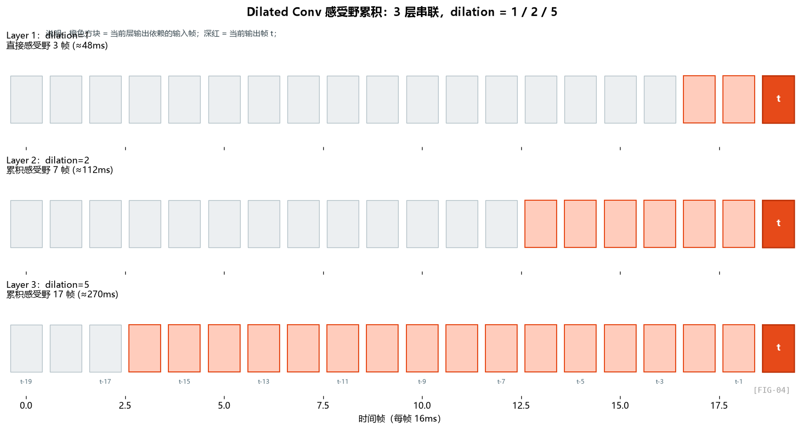

这里更重要的是 3 个 dilation 的功能分工：第一层看近邻，第二层看中距离历史，第三层把时间视野进一步拉长。

dilation 分别是 **1, 2, 5**，**而且只在时间维（第一个数）有 dilation，频率维 dilation 始终是 1**。

#### 什么是 dilation？

空洞卷积（dilated / atrous convolution）就是在卷积核之间插"空格"：

可以直接对照上面的 `FIG-04` 来理解：`dilation` 增大时，**参数个数不变，但采样点之间的间隔变大**，所以感受野会从 `3` 扩到 `5`、再扩到 `11`。

**参数量不变（还是 3 个权重），但感受野扩大**。

#### GTCRN 的时间感受野如何累积

三层 GT-Conv 串联，每层 kernel=3，dilation 分别 1/2/5：

- 第 1 层：感受野 = 3 帧（48ms）
- 第 2 层：每个输出依赖 3 个第 1 层的输出，但因为 dilation=2，跨度变成 5 帧。累积感受野 ≈ 3 + (3-1)×2 = 7 帧（112ms）
- 第 3 层：累积感受野 ≈ 7 + (3-1)×5 = 17 帧 ≈ 270ms

**网络的卷积部分能看到 270ms 的历史**——这覆盖了一个音节的典型长度，对捕捉短时的瞬态噪声（爆破音、咔哒声）足够了。

更长时间的依赖（一句话内的语义结构）交给后面的 DPGRNN。

#### 为什么频率维不用 dilation？

注意 `dilation=(2, 1)` 的第二个 1 是频率维——保持 dilation=1。

原因：**频率维已经被 ERB 压缩 + Encoder 下采样到 33 维**，频率范围很窄；而频率维上的"局部性"很强（共振峰、谐波的邻近相关性），用 dilation 反而会跳过有用的信息。

时间维则不同——语音的时间相关性可以延续到几百毫秒，需要 dilation 来扩展。

> **频率维要密，时间维要宽**——这是 SE 卷积设计的又一条不成文规则。

### 4.5 因果填充：保证流式部署

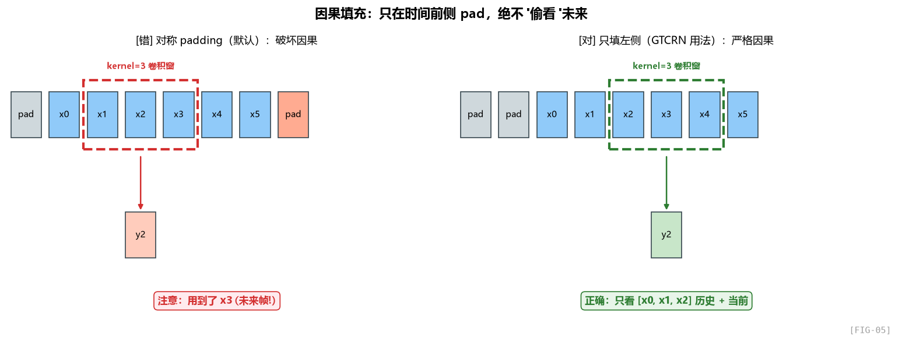

这里真正关键的不是某个函数名，而是：**只在时间轴左侧补历史，不在右侧补未来。**

`pad_size = (kernel_size[0] - 1) * dilation[0]`，对 kernel=3、dilation=5 来说 pad_size = 10。

填充的位置是 `[0, 0, self.pad_size, 0]`——分别对应（频左、频右、时间前、时间后）。**只在"时间前"填充，"时间后"不填**！

#### 为什么这样做？

考虑 kernel=3 的 1D 卷积：

如果使用普通对称 padding，那么输出时刻 `t` 会依赖 `t-1, t, t+1`，这就等于偷偷看了未来帧。

**这就破坏了因果性**——而 SE 模型要做实时降噪，绝对不能用未来的输入。

而 GTCRN 采用的左侧 padding 可以理解为：每个输出只拿到**历史帧 + 当前帧**，因此天然满足实时部署的因果约束。

这样每个输出只依赖于当前和过去，完美保证因果性。

工程上通常会额外写一个**因果性验证测试**：构造两段前半段相同、后半段不同的输入；如果模型真的是因果的，那么前半段输出也必须完全相同。

这个测试**就是用来验证"网络只看过去、不偷看未来"**的。如果有任何一层卷积或 RNN 双向了，前半段输出就会不一致。

> 工程上，**写完网络后立刻跑因果性测试**是个非常好的习惯。我见过太多论文里"声称是 causal 的"但实际上某个 BN 或 attention 偷偷用了 future frame 的情况。

### 4.6 PReLU 而不是 ReLU：一个小但重要的选择

注意这里的激活策略也很有针对性：中间层保留正负信息，最后一层再把掩码限制在一个稳定范围里。

PReLU 的直觉理解是：正半轴正常通过，负半轴也不被彻底截断，而是保留一个可学习的小斜率。

其中 `α` 是可学习的参数（每个通道一个）。当 α=0 时就是 ReLU；当 α=0.01 时就是 Leaky ReLU。

**为什么 SE 任务偏好 PReLU？**

1. **负值信息不丢失**：语音 STFT 的实部/虚部是有正负的，纯 ReLU 会把所有负值清零，丢一半信息。
2. **比固定的 LeakyReLU 更灵活**：每个通道自己学一个 α，可以根据特征类型自适应。
3. **参数代价极小**：每个通道就 1 个参数，对 16 通道的 GTCRN 来说，总共增加几十个参数，可以忽略不计。

**为什么最后一层用 tanh？**

因为最后一层输出是 CRM（复数比例掩码），数学上 CRM 的实部/虚部范围理论上是 (-∞, ∞)，但实践中限制在 (-1, 1) 之间会让训练更稳定，避免输出爆炸。

### 4.7 编码器/解码器的对称性

GTCRN 的解码器是编码器的**镜像**：

| 编码器 | 解码器 |
|:----:|:----:|
| Conv (1,5) stride=(1,2) → 频率 257→129 | DeConv (1,5) stride=(1,2) → 频率 129→257 |
| Conv (1,5) stride=(1,2), g=2 → 频率 65→33 | DeConv (1,5) stride=(1,2), g=2 → 频率 65→129 |
| GT-Conv dilation=1 | GT-DeConv dilation=1 |
| GT-Conv dilation=2 | GT-DeConv dilation=2 |
| GT-Conv dilation=5 | GT-DeConv dilation=5 |

**注意 dilation 顺序**：编码器里 dilation=1/2/5，解码器里也是 5/2/1（如果按 forward 顺序）。让 dilation 最大的 GT-Conv 处于编码器最深处和解码器最浅处——也就是**最靠近瓶颈的位置**。

这是因为**网络越深，特征越抽象，时间依赖越强**。在深层用 dilation=5 看 17 帧的历史，在浅层用 dilation=1 看 3 帧的历史，符合"特征抽象层级"的规律。

### 4.8 看看实际的算力账：单个 GT-Conv 多少 MACs？

我们以编码器最后一个 GT-Conv（dilation=5，输入 (16, T, 33)）为例：

- 输入：(16, T, 33)
- chunk → (8, T, 33)
- SFE k=3 → (24, T, 33)
- 1×1 conv (24, 16): 算力 ≈ T × 33 × 24 × 16 = T × 12,672
- depthwise 3×3 conv (16 groups): 算力 ≈ T × 33 × 16 × 9 = T × 4,752
- 1×1 conv (16, 8): 算力 ≈ T × 33 × 16 × 8 = T × 4,224
- TRA：少量（下一章详细分析）

**单个 GT-Conv 大约 22K MACs/帧**。1 秒 63 帧，约 1.4 MMACs/秒。

整个网络 6 个 GT-Conv 加起来 ≈ 8 MMACs/秒，**占了总算力（33 MMACs/秒）的 25%**。剩下的算力主要在 DPGRNN（下一章）和 1×1 卷积。

### 4.9 总结：GT-Conv 的设计哲学

把这一章的关键收束成几条工程信条：

1. **通道分两半，一半计算一半 identity** —— 参数减半，性能不显著下降（前提：channel shuffle）
2. **3×3 卷积 = 1×1 + depthwise + 1×1** —— Depthwise separable 是低算力 CNN 的标配
3. **时间维用 dilation 扩感受野，频率维保持 dense** —— 物理意义匹配
4. **只在时间前侧填充，保因果** —— 不要默认对称填充
5. **PReLU + Tanh 是 SE 任务的"默认激活方案"** —— 不要随便换 ReLU
6. **dilation 越大越靠近瓶颈** —— 抽象特征对应长时依赖

---

## 第五章 DPGRNN 详解：双路径 + 分组，RNN 的极致瘦身

> DPGRNN 是 GTCRN 的"灵魂"。如果说 GT-Conv 解决的是局部模式建模，那 DPGRNN 解决的就是**全局时频建模**——也是这个网络真正能"听懂"语音的关键。

### 5.1 为什么需要 RNN？卷积不够吗？

我们在第 4 章算过：3 层 GT-Conv 串联的感受野大约 17 帧 ≈ 270ms。这够吗？

对于**短时瞬态噪声**（爆破音、咔哒声）够了。但对于：

- **稳态噪声**（空调、风扇）需要看很长时间才能确认"这是稳定背景"
- **长元音/长辅音的连续判断**（"啊—————"）需要至少 500ms 的上下文
- **语义级噪声**（背景人声）甚至需要几秒的上下文才能区分前景说话人

这些都需要**理论上无限远的时间依赖建模**。CNN 想做到这点只能堆几十层（每层增加 dilation），但这对 23.7K 参数的网络来说不现实。

**RNN 天然适合做这种长程依赖**——它的隐藏状态可以传递任意远，只要训练得当。

### 5.2 第一个问题：标准 RNN 在频谱图上怎么用？

假设我们有一个 (B, C, T, F) 的特征图。一个 RNN 应该沿着哪个维度跑？

**选项 A：沿时间维跑（标准用法）**

把 (B, C, T, F) 重塑成 (B*F, T, C)，让 RNN 沿 T 跑。每个频点都有独立的时间序列，RNN 建模"这个频点随时间的演化"。

**缺点**：忽略了频点之间的关系。但语音的谐波结构、共振峰是横跨频域的——只看一个频点的时间序列，永远看不到"这是谐波结构"这个信息。

**选项 B：沿频率维跑**

把 (B, C, T, F) 重塑成 (B*T, F, C)，让 RNN 沿 F 跑。每一帧都被 RNN 扫一遍频率，建模"这一帧的频谱形态"。

**缺点**：完全没有时间依赖。语音的连续性、稳态噪声的持续性都看不到。

**选项 C：同时跑两个 RNN**

A 和 B 都跑！一个建模时间依赖，一个建模频谱结构。**这就是 Dual-Path RNN (DPRNN) 的核心思想。**

### 5.3 DPRNN 的工作流程

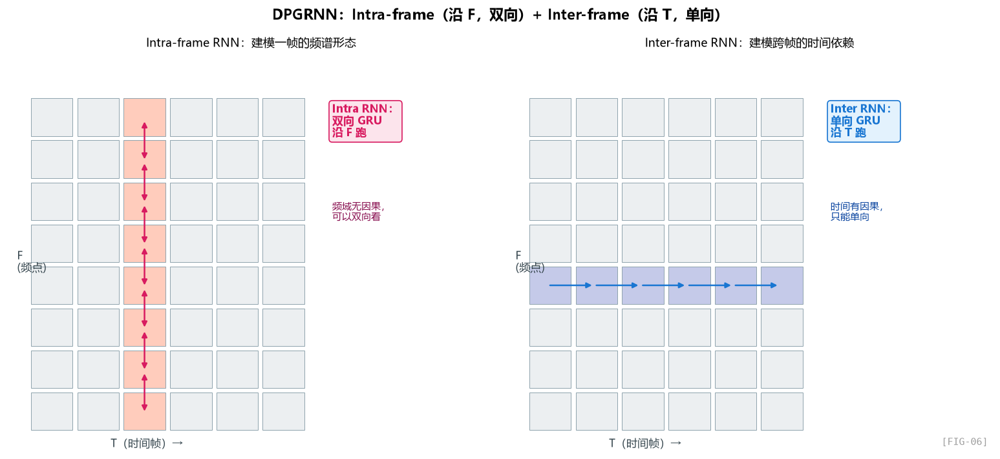

DPRNN 原本是 Luo et al. (2020) 提出来做时域单声道语音分离的，DPCRN 把它搬到时频域。GTCRN 进一步在每个 RNN 上加 grouped 优化。

把 DPGRNN 抽象出来，它其实只有两步：先做“帧内频率扫描”，再做“跨帧时间扫描”。每一步后面都跟一个轻量的特征混合层和归一化层。

两个 RNN，配两个 FC 和两个 LayerNorm。

#### Intra-frame RNN：建模"一帧的频谱形态"

Intra-frame 阶段可以理解成：把每一帧单独拿出来，沿频率轴从低到高扫一遍，让模型先理解“这一帧的频谱长什么样”。

关键操作：

1. **把 T 维度合并到 batch**：`(B, T, F, C) → (B*T, F, C)`。每一帧被当成一个独立的"序列"，序列长度 = F = 33。
2. **沿 F 方向跑 RNN**：RNN 看到 f=0 处的频点特征，更新隐藏状态，看到 f=1，再更新……跑完 33 步。
3. **双向 RNN**：因为是"帧内"——同一帧之内，f=10 处的信息可以参考 f=20 处的信息，反之亦然。**频域内没有因果性的概念**（你不能说"高频是未来"），所以可以双向。
4. **残差连接**：`intra_out = x + intra_x`。让 RNN 学"相对原特征的修正"，不要从零重建。

#### Inter-frame RNN：建模"跨帧的时间依赖"

Inter-frame 阶段则相反：固定某个频点，沿时间轴往前看，让模型理解“这个频点在一段时间里是怎么变化的”。

1. **把 F 维度合并到 batch**：`(B, F, T, C)`。每个频点被当成一个独立的"时间序列"。
2. **沿 T 方向跑 RNN**：对每个频点，RNN 看到 t=0 的特征，更新隐藏状态，看到 t=1……
3. **单向 RNN**：因为有因果性！实时降噪不能看未来。
4. **残差连接**：`inter_out = intra_out + inter_x`。

#### 一个非常关键的观察：两路 RNN 的"非对称"

注意 intra 用 **双向** GRU，inter 用 **单向** GRU。这是 GTCRN 保证因果性的关键。

- **频率方向可以双向**：同一帧内，所有 33 个频点都是同时刻获得的，所以 f=20 可以看 f=10 也可以看 f=30，**不破坏时序因果**。
- **时间方向必须单向**：不能用未来帧。

这种细致的"哪一维可以双向、哪一维必须单向"的考量，是 SE 模型设计里很容易踩坑的地方。看 DCCRN、CRN 等论文，很多都因为某个 BN 或者某个全局 pooling 暗中破坏了因果性。

### 5.4 第二个问题：GRNN 是什么？为什么要 "Grouped"？

Grouped RNN 也可以直接口语化理解：把一个“大 GRU”拆成两个“小 GRU”，每个只负责一半特征，最后再把两半结果拼起来。

#### 标准 GRU 的参数量

一个标准 GRU 的参数量，近似由“输入维度 × 隐藏维度”和“隐藏维度平方”两部分组成；这也是它很容易随宽度迅速膨胀的原因。

当 `input_size = hidden_size = 16` 时：参数 = 3 × (16×16 + 16×16) = **1536**。

如果 hidden_size = 32：参数 = 3 × (32×32 + 32×32) = **6144**。

参数量是 hidden_size 的**平方**——这就是为什么 RNN 的隐藏维度不能开太大。

#### Grouped RNN 的瘦身效果

GRNN 把一个 hidden_size=16 的 GRU 拆成两个 hidden_size=8 的 GRU：

- 单个小 GRU：3 × (8×8 + 8×8) = 384
- 两个加起来：768

**对比一下原来的 1536**，**省了一半参数**。

为什么省？因为标准 GRU 里 "input → hidden" 这个矩阵 (16×16) 假设了**所有输入都和所有隐藏维度有交互**。但实际上很多交互是冗余的——拆成 group 后，每个 group 只在自己内部交互，**等价于在权重矩阵上加了 block-diagonal 约束**：

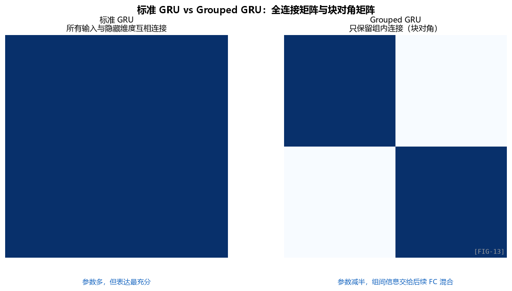

灰色"."表示置零的权重。

#### 这样做的代价是什么？

代价是 **group 之间没有信息交流**。`y1` 永远只依赖 `x1` 和 `h1`，`y2` 永远只依赖 `x2` 和 `h2`——两组隐藏状态独立演化。

那作者怎么补这个洞？

而后面的全连接层，本质上就是“重新把两组信息掺到一起”，避免分组后彻底各玩各的。

作者会在 GRNN 之后再补一个全连接混合层，专门负责做组间的信息交换。

这个 FC 层是全连接的（不是 grouped），所以它能让 group 1 和 group 2 的信息混起来。这就是论文里说的"implicit feature rearrangement"——本来 ShuffleNet 风格的 GRNN 会用一个显式的 "shuffle" 操作（不可学习），GTCRN 改成"FC 层自己学怎么 shuffle"，这样信息混合方式是数据驱动的。

> 这也是为什么作者在 README 里特别提到："The explicit feature rearrangement layer in the grouped RNN ... can result in an unstreamable model. Therefore, we discard it and implicitly achieve feature rearrangement through the following FC layer in the DPGRNN."
>
> **显式 shuffle 在流式部署时有问题**，所以作者改成用后续混合层隐式完成。这是一个工程驱动的设计调整。

### 5.5 LayerNorm 而不是 BatchNorm：为什么？

注意 DPGRNN 用的是层归一化，而 GT-Conv 用的是批归一化。这不是随便选的。

#### BatchNorm 的问题

BatchNorm 在训练时统计 **每个 batch 内** 当前层激活的均值/方差。在 CNN 里很 OK——空间和 batch 维一起统计，样本量足够大。

但 RNN 的特性是**时间维度上每一步状态都不一样**——如果用 BN 沿时间维归一化，会破坏 RNN 的"状态传递"。

而且 SE 模型最终要做流式推理，**流式时 batch size = 1**——BN 在 inference 阶段需要全局统计量（running mean / var），如果训练时和推理时的统计量分布有 mismatch，会出问题。

#### LayerNorm 的好处

LayerNorm 沿 **特征维度** 做归一化，每一帧、每一个频点独立归一化。

- 不依赖 batch size
- 不破坏时间维度
- 流式部署天然兼容

这里更重要的不是某个具体写法，而是归一化策略本身：CNN 段偏向用 BN，RNN 段偏向用 LN，因为后者更适合时间序列状态建模。

shape 是 `(width, hidden_size) = (33, 16)`——也就是对每一帧的 33 × 16 = 528 个特征做归一化。

> **经验法则**：CNN 用 BN，RNN/Transformer 用 LN。GTCRN 在两类层之间分别用合适的归一化，是细致的工程考量。

### 5.6 看看实际算账：DPGRNN 多少 MACs？

我们以一层 DPGRNN 为例，输入 `(B=1, C=16, T, F=33)`：

**Intra RNN（双向 GRU）**

- 输入序列长 33，每步输入维度 16，hidden_size = 8（双向所以两边各 8）
- GRNN 拆 2 组：每组 input=8, hidden=4，**实际是 2 × 双向 = 4 个 GRU**，每个参数 3 × (8×4 + 4×4) = 144
- 总参数 ≈ 576，加上 input bias 等约 700
- 每帧算力 ≈ 33 步 × 144 MACs × 4 GRU = 19,000 MACs

**Inter RNN（单向 GRU）**

- 输入序列长 T，每步输入维度 16，hidden_size = 16（单向）
- GRNN 拆 2 组：每组 input=8, hidden=8
- 参数 ≈ 768
- 每帧算力（每个频点，但所有频点共享 RNN 权重，相当于 33 次重复）≈ 33 × 384 = 12,672 MACs

**FC 层**

- 一个 `16 → 16` 的全连接混合层：约 256 个参数，每帧额外带来一小段可控算力

**LayerNorm**

- 算力很小，忽略

**单层 DPGRNN 大约 1.5K 参数，每帧 40K MACs**。

两层 DPGRNN 加起来约 **3K 参数，2.5 MMACs/秒**。

加上编解码器的 GT-Conv（~6K 参数 + 8 MMACs/秒），整个网络的主体计算就有 ~20 MMACs/秒，剩下的 13 MMACs/秒在 1×1 卷积、SFE、ERB 等辅助操作上。

### 5.7 一个直观的"为什么 DPRNN 有效"的解释

我们用一个具体例子说明 DPRNN 怎么帮到降噪：

**场景**：一个被空调白噪声污染的"啊—————"长元音

**Intra-frame RNN 看到的**：某一时刻 `t=50` 的 33 个 ERB 频带里，低频处往往有明显的基频和谐波结构，而高频段更接近平坦噪声底。它擅长识别这种**横向频谱形态**。

Intra RNN 沿 f 跑一遍，能学到"有规律的能量分布 = 语音，平坦分布 = 噪声"。它把这个**频谱模式信息**编码到隐藏状态里。

**Inter-frame RNN 看到的**：固定某个频点后，时间上会出现从静音到持续元音、再回到静音的能量轨迹。它擅长识别这种**纵向时间模式**。

Inter RNN 沿 t 跑，能学到"能量持续 90 帧高 = 语音，能量平稳持续 200 帧 = 稳态噪声"。它把这个**时间模式信息**编码到隐藏状态里。

**两者结合**：网络能同时识别"频谱上是元音模式 + 时间上是持续 100 帧的稳定激活" = 这是一个语音元音；而"频谱上是平坦分布 + 时间上恒定" = 这是稳态噪声。

**这就是为什么单路 RNN 不够、必须双路**：单维度的信息不足以区分语音和噪声。

### 5.8 对比：单路 RNN vs DPRNN

| 方案 | 参数 | 表达能力 | 备注 |
|:----:|:----:|:----:|:----:|
| 单 GRU 沿 T，hidden=64 | ~25K | 强（大隐藏维） | 太大 |
| 单 GRU 沿 T，hidden=16 | ~1.5K | 弱（看不到频谱结构） | 性能差 |
| **DPGRNN，hidden=16** | **~3K** | **强（双路覆盖）** | **GTCRN 的选择** |

**3K 参数达到了 25K 单路 GRU 的效果**——这就是结构创新的力量。

### 5.9 设计哲学：用结构换参数

DPGRNN 这个模块完美演绎了一个轻量化网络设计的核心思想：

> **不要靠堆参数提升表达能力，靠结构创新让有限的参数做更多事。**

类似的思想在 CNN 里就是 ResNet（残差结构提升训练稳定性）、DenseNet（密集连接复用特征）、ShuffleNet（分组 + 重排）；在 RNN 里就是 DPRNN、Group RNN、Transformer-XL 等。

**作为工程师，你应该养成的习惯**：当看到一个新模型用了某个特殊结构时，不要只问"这个结构是什么"，要问 **"它替代的是什么？省了什么代价？补了什么洞？"**。

### 5.10 小结

- **DPRNN = Intra-frame + Inter-frame 双路径** —— 一路看频谱，一路看时间
- **Grouped RNN** —— 把大 GRU 拆成多个小 GRU，参数减半，用 FC 补信息交流
- **Intra 双向，Inter 单向** —— 因果性的精细控制
- **LayerNorm 而不是 BatchNorm** —— RNN 的归一化选择
- **3K 参数搞定 25K 参数的事** —— 结构创新换计算

---

## 第六章 SFE 与 TRA：两个"点睛"模块

> 这两个模块是论文的原创贡献。它们不属于骨架——没有它们 GTCRN 依然能跑——但是它们让性能从"还行"变成"打过 RNNoise"。看消融实验里 PESQ 从 1.87 涨到 1.94，主要就靠它们俩。

### 6.1 先看消融实验：SFE 和 TRA 各贡献多少？

直接看论文 Table 1（DNS3 测试集）：

| SFE | TA | TRA | 参数 | MACs/秒 | SISNR | PESQ | STOI |
|:--:|:--:|:--:|:----:|:----:|:----:|:----:|:----:|
| ✗ | ✗ | ✗ | 13.35K | 33.91M | 9.87 | 1.87 | 0.834 |
| ✗ | ✓ | ✗ | 14.84K | 34.00M | 10.00 | 1.89 | 0.838 |
| ✗ | ✗ | ✓ | 21.65K | 34.47M | 10.25 | 1.91 | 0.840 |
| ✓ | ✗ | ✗ | 15.37K | 39.07M | 10.10 | 1.90 | 0.838 |
| ✓ | ✓ | ✗ | 16.86K | 39.16M | 10.29 | 1.92 | 0.841 |
| **✓** | ✗ | **✓** | **23.67K** | **39.63M** | **10.39** | **1.94** | **0.844** |

读这张表的几个关键点：

1. **裸 GTCRN（无 SFE 无 TRA）也有 13.35K 参数、PESQ 1.87**——比 RNNoise 1.87 已经持平
2. **加 SFE → PESQ +0.03**（1.87→1.90），参数 +2K，算力 +5M
3. **加 TRA → PESQ +0.04**（1.87→1.91），参数 +8K，算力 +0.5M
4. **SFE + TRA → PESQ +0.07**（1.87→1.94），效果叠加，是最优组合
5. **TRA 比 TA（标准时间注意力）好**：21.65K vs 14.84K，但 PESQ 1.91 vs 1.89——TRA 更值

总结：**SFE 是廉价的算力换性能（多 5M MACs，得 +0.03 PESQ），TRA 是昂贵但精准的参数换性能（多 8K 参数，得 +0.04 PESQ）**。两者互补。

### 6.2 SFE 模块：用一次滑窗重排改变特征布局

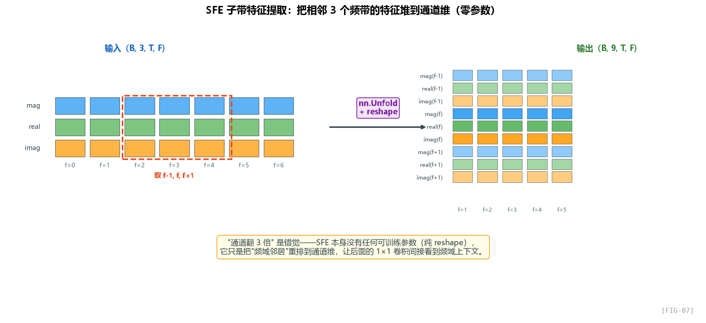

#### 看抽象过程

整个模块的本质并不复杂：它只是把频域上的一个小滑窗，重排到通道维里。

#### 滑窗重排是做什么的？

它做的是 **"滑动窗口提取"**——和卷积一样滑窗，但**只提取窗口内的值**，不做内积。

举个例子，输入是 1D 序列 `[a, b, c, d, e]`，`Unfold(k=3, padding=1)` 会依次提取 `[pad, a, b]`、`[a, b, c]`、`[b, c, d]`、`[c, d, e]`、`[d, e, pad]` 这 5 个长度为 3 的滑窗，并把它们排成一个滑窗矩阵。

也就是说，**Unfold 把"卷积的输入展开成滑窗矩阵"**——这是手写卷积时最关键的一步：im2col。

#### SFE 在 GTCRN 里做什么？

输入 `(B, 3, T, 129)` 之后，SFE 会把每个频带从“只看自己”变成“同时看左右邻居和自己”，于是单点特征从 3 维扩成 9 维。

也就是：**每个频带 f，把它和左右两个邻居 (f-1, f, f+1) 的特征 concat 到通道维**。

视觉上可以直接看前面的 `FIG-07`：SFE 之前，频带 `f=10` 只有自己的 3 维特征；SFE 之后，它会把 `f-1`、`f`、`f+1` 三个频带的特征一起堆到通道维，于是从 3 维扩成 9 维。

#### 为什么这样做有效？

这里我们要回到 GT-Conv 的设计。GT-Conv 的前置混合层是一个 **1×1 卷积**，而 1×1 卷积天然只会处理“当前位置的通道信息”，不会主动看到左右频带。

**1×1 卷积只能看到同一空间位置的特征**——也就是说，对频带 f，1×1 卷积只能看到 f 自己的通道，看不到 f-1 和 f+1 的信息。

如果不用 SFE，1×1 卷积就只能逐频带独立处理，**完全无法利用频域邻居信息**。这对降噪是致命的——因为很多频谱模式（共振峰、谐波）是横跨多个频带的局部模式。

**SFE 提前把邻居信息"打包"塞到通道维，让 1×1 卷积间接看到频域上下文**。

#### SFE 和 3×3 卷积的等价性

你可能会想：那为什么不直接用 3×3 卷积？不就一样了吗？

数学上确实等价：

从局部感受野的角度看，`SFE(k=3) + 1×1 Conv(3C → C')` 可以理解成一种把邻域信息先展开、再做通道混合的轻量替代形式。

但**计算成本不一样**：

- 3×3 卷积：参数 = `C × C' × 9`，每个位置算 `9 × C × C'` MACs
- SFE + 1×1：SFE 不带参数，1×1 卷积参数 = `3C × C'`，每个位置算 `3C × C'` MACs

看起来好像 3×3 卷积参数更多？等等——

**关键差异在于 SFE 后面跟的是 GT-Conv 的 grouped depthwise**！

如果没有 SFE，这条链路虽然仍然是 `1×1 → depthwise 3×3 → 1×1`，但第一个 `1×1` 看到的只是当前频带本身，缺少最关键的频域邻居信息。

也就是说，**没有 SFE 时，depthwise 3×3 看不到频域邻居（因为 depthwise 在通道维独立，且 padding 只让它看到时间维邻居）**。SFE 提前把频域邻居塞到通道维，让 depthwise 间接看到。

> 这是一个非常巧妙的设计——SFE 不是"在主干上加东西"，而是"**让 depthwise 卷积获得它本来缺失的频域上下文**"，用极小代价补全了一个能力。

#### 算力账：SFE 真的"廉价"吗？

SFE 自己不带参数，但它会让后续 1×1 卷积的输入通道从 `C` 变成 `3C`：

- 1×1 卷积参数：`3C × C'` 是 `C × C'` 的 **3 倍**
- 算力也是 3 倍

所以"廉价"不是"免费"——是相对于 3×3 卷积省了 3 倍计算（同时保留邻居信息）。

### 6.3 TRA 模块：时序注意力的轻量化实现

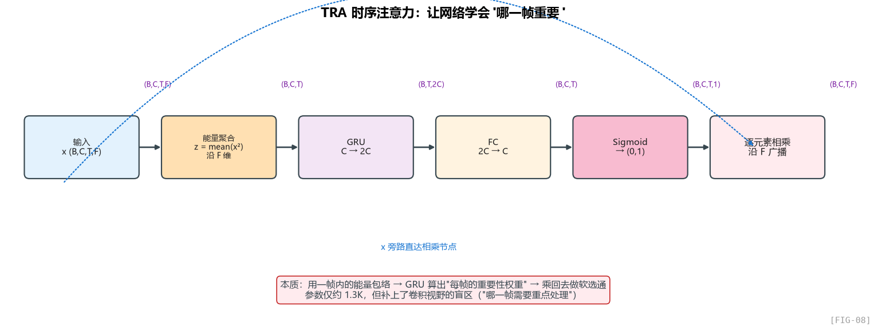

TRA 是 GTCRN 真正的原创贡献。我们一步一步看。

#### 设计动机：时间维度上的"重要性"是不均匀的

降噪任务里，并不是每一帧都同等重要：

- **语音活跃帧**（有人在说话）：网络应该精细处理，保留语音细节
- **静音帧**（没人说话，纯噪声）：网络应该大刀阔斧抑制
- **语音起始/结束帧**（瞬态过渡）：最难处理，需要特别关注

**作者希望网络能自动学到"这一帧有多重要"，给重要的帧分配更多关注**。这就是注意力机制的核心思想。

#### 标准注意力 vs 时间注意力 vs TRA

传统 self-attention 计算 query/key/value 之间的相似度，O(T²) 复杂度。对 16K 参数的网络来说太奢侈。

简化的"时间注意力"（TA, Time Attention）：用一个全连接层学出每个时刻的 attention weight，复杂度 O(T)。

**TRA 的创新**：把全连接层换成 GRU，让 attention weight 的计算**带有时间记忆**——这一帧的重要性不仅取决于这一帧本身，还取决于历史帧的状态。

#### 看抽象过程

TRA 的核心逻辑其实一句话就能说清：**先判断每一帧重不重要，再把这个重要性乘回去。**

#### 逐步拆解 TRA 的 5 个步骤

**步骤 1：先把频率维能量聚合掉**

为什么用平方再平均？**这是"短时能量"的定义**——`E_t = mean(|X_t|²)` 是 DSP 里描述帧能量的标准方式。

- 平方让正负值都变成正贡献
- 平均消除频率维度，得到"这一帧的总能量"

输出是 `(B, C, T)`——每个通道、每一帧的能量。

> 这里本质上只是做一个沿频率维的能量平均；实现方式可以很多，但作者显然更偏向部署友好的写法。

**步骤 2：再让一个小 GRU 看时间变化**

把 `(B, C, T)` 转成 `(B, T, C)`，喂给 GRU。GRU 输入维度 = C = 8 (`in_channels//2`)，输出维度 = 2C = 16。

为什么输出要翻倍？为了**增加表达能力**。注意 GRU 的隐藏维度越大，能记住的状态越复杂。但代价是参数翻倍。

**步骤 3：把时序描述压回原通道数**

把 GRU 输出从 2C 降回 C，对应原始的通道数。

**步骤 4：把它变成 0 到 1 的软权重**

Sigmoid 把任意实数压到 (0, 1)，作为"乘性权重"。值越接近 1，这一帧越重要；越接近 0，这一帧越被抑制。

**步骤 5：把这份权重广播乘回整张时频图**

`x` 的 shape 是 `(B, C, T, F)`，`At` 的 shape 是 `(B, C, T, 1)`。乘法时 `At` 沿 F 维度广播，**同一帧的所有频带共享同一个权重**。

这是一个**强假设**：注意力在频率维度上是"全局共享"的——也就是说，如果第 50 帧被认为是"重要帧"，那么 f=0 和 f=128 都被同样地重视。

**这个假设合不合理？** 对降噪任务来说基本合理，因为"语音活跃 vs 静音"是一个全频带的属性。但对更精细的任务（比如音乐源分离），可能要做"时频联合注意力"。GTCRN 为了省算力没这么做。

#### TRA 和 SE-Net 的关系

如果你看过 CV 里的 Squeeze-and-Excitation Network（SE-Net），会发现 TRA 和它非常像：

| SE-Net (CV) | TRA (GTCRN) |
|:----:|:----:|
| 沿 H,W 全局 pooling 得到 channel descriptor | 沿 F 全局 pooling 得到 (C,T) descriptor |
| FC → ReLU → FC → Sigmoid | GRU → FC → Sigmoid |
| 输出 channel attention weight | 输出 (channel, time) attention weight |
| 沿 H,W 广播相乘 | 沿 F 广播相乘 |

**TRA = 把 SE-Net 改成时序版本**——把 FC 换成 GRU（增加时间记忆），把广播维度从空间变成频率。

这是一个非常典型的"借鉴 CV 思想 + 改造为语音任务"的设计。

#### 为什么 GRU 而不是 LSTM？

GRU 比 LSTM 少一个门，参数更少。对于 16 通道的小网络，GRU 已经足够，没必要用 LSTM。

PyTorch 的 GRU 实现还有一个好处：**和很多嵌入式推理引擎（如 CMSIS-NN）天然兼容**。

#### TRA 的算力账

输入 `(B=1, C=8, T, F=33)`：

- 能量聚合：算力 = T × F × C = T × 264 MACs（很少）
- GRU(8→16)：参数 = 3 × (8×16 + 16×16) = 1152，每帧算力 ≈ 768 MACs
- FC(16→8)：参数 = 128，每帧算力 ≈ 128 MACs

**单个 TRA 大约 1.3K 参数，每帧 1K MACs**。

整个网络 6 个 GT-Conv，每个带一个 TRA，所以 TRA 总参数 ≈ 8K（和 Table 1 一致！）。

### 6.4 SFE + TRA 在 GT-Conv 中的位置

回到 GT-Conv 的主链路，你只需要记住两个位置：**SFE 在最前面补频域上下文，TRA 在最后面做时间重加权。**

注意位置：

- **SFE 在最前**：因为它的目的是"为 1×1 卷积提供频域上下文"，所以必须在第一个 1×1 之前
- **TRA 在最后**：因为它的目的是"对处理完的特征做时序加权"，所以放在 conv 链路结束后

如果倒过来（TRA 在前、SFE 在后），不仅不合逻辑，效果也会差——TRA 是基于"已经提取的高级特征"做注意力，输入太原始的话注意力学不到东西。

### 6.5 一些工程师容易忽略的细节

#### SFE 的 `padding=(0, (kernel_size-1)//2)`

这里更重要的不是某个 API，而是：SFE 在频率轴上左右对称取邻域，因为频率轴本来就没有因果性要求。

对 k=3，padding = 1。**两边都填 padding！** 不是只填一边。

这意味着 SFE **在频率维上是对称的**——没有因果性问题（因为频率维本来就没有因果）。这一点要和 GT-Conv 的时间维填充区分开：

- SFE：频率维**对称**填充
- GT-Conv depthwise：时间维**只填前**

#### TRA 的 `mean(x.pow(2))` 不是 `x.abs().mean()`

为什么用平方而不是绝对值？两者都能消除符号：

- **平方**：放大大值的影响，符合"能量"的定义，对突发噪声敏感
- **绝对值**：线性放大，对噪声不那么敏感

降噪任务希望对"能量分布"敏感（区分活跃帧和静默帧），所以用平方。

> 一个小测试：你可以试试改成 `x.abs().mean()`，看看 PESQ 会不会下降。我没跑过这个实验，但根据 Sigmoid 之后又被乘回原特征的设计，估计差别不大——但还是有差。

### 6.6 把 GT-Conv + SFE + TRA 看作一个整体

现在回头看 `FIG-03` 和 `FIG-08`，其实已经能把这个完整数据流拼起来了：`FIG-03` 给出 GT-Conv 主干，`FIG-08` 把末尾的 TRA 展开。合起来就是一条完整链路：

1. `chunk` 把通道拆成两半，一半走计算支路，一半走 identity 支路；
2. 计算支路先过 SFE，把频域邻居打包到通道维；
3. 再走 `1×1 → depthwise dilated conv → 1×1` 的轻量卷积链；
4. 最后接 TRA，给每一帧一个时序注意力权重；
5. 与 identity 支路做 shuffle 合并，恢复到 `(B, 16, T, F)`。

整个 GT-Conv 块的**信息流可以理解为**：

1. **拆通道**：节省计算
2. **SFE 注入频域上下文**：为 depthwise 补能力
3. **三明治卷积**：1×1 → depthwise → 1×1，省参数地建模局部时频模式
4. **TRA 应用时序注意力**：让网络聚焦重要帧
5. **Shuffle 合并**：让两路信息交流

### 6.7 这一章的设计哲学总结

- **不要追求"通用"，要追求"够用"**：TRA 在频率维度上共享注意力，是个简化，但对 SE 任务够用
- **借鉴成熟模块时要做"翻译"**：SE-Net 来自 CV，TRA 是它的语音域翻译版
- **每个模块解决一个具体瓶颈**：SFE 补 depthwise 的频域视野，TRA 补 grouped 的时间感知
- **算力分配要"精打细算"**：SFE 不带参数但增加 3 倍 conv 算力；TRA 带参数但算力极少。它们恰好互补

---

## 第七章 输出与损失函数：复数掩码 CRM 和"混合损失"的玄学

> 网络的输出形式和损失函数，看起来是"训练细节"，但实际上**决定了整个模型的优化目标**。同一个网络换不同的输出和损失，可能性能差一倍。这一章我们看 GTCRN 在这两个问题上的选择。

### 7.1 输出形式的三种选择

降噪模型的输出大致分三类：

#### 选择 A：直接预测干净谱（Direct Mapping）

网络输入是带噪谱，输出是干净谱，目标是让两者尽量接近。

**问题**：网络要从零重建整个频谱。**输入的有效信号也要重建**——这相当于网络做了"copy + 去噪"两件事。

#### 选择 B：预测幅度掩码（Magnitude Mask）

网络输出一个 0 到 1 的幅度掩码，只去调整强弱；相位则直接沿用带噪输入的相位。

**问题**：**相位不能修**——但相位失真在低 SNR 下非常显著，听感会"虚"。这是 RNNoise、Wiener filter 等经典方法的局限。

#### 选择 C：预测复数掩码（Complex Ratio Mask, CRM）

CRM 的核心理解其实不需要公式：它相当于给原始复数谱套了一个“复数修正器”，既能改强弱，也能改相位方向。

**优点**：同时修正幅度和相位。

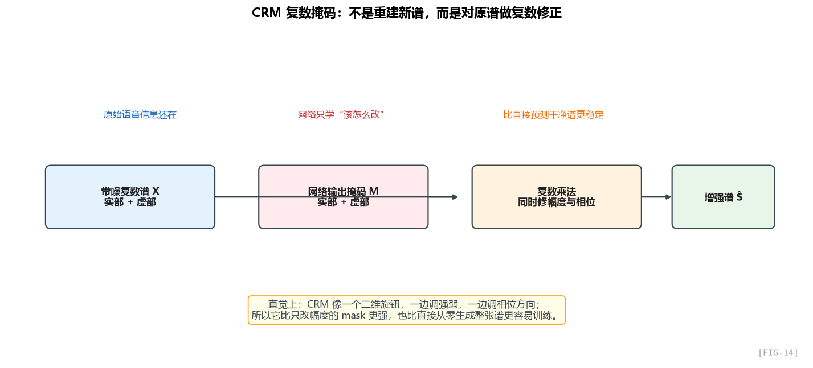

### 7.2 为什么是 CRM 而不是别的？

我们再深入一点，比较一下：

| 输出形式 | 修幅度 | 修相位 | 输出范围约束 | 训练难度 |
|:----:|:----:|:----:|:----:|:----:|
| Direct Mapping | ✓ | ✓ | 无限制 | 难（要完全重建） |
| 幅度掩码 | ✓ | ✗ | (0, 1) | 容易 |
| **CRM** | ✓ | ✓ | (-∞, ∞) 实际限制在 (-1, 1) | 中等 |
| Wiener Filter | ✓ | ✗ | (0, 1) | 经典方法 |

CRM 的"输出范围"是个微妙的问题。理论上 CRM 的实虚部可以是任意值，但实践中：

- **如果不约束，输出可能爆炸**：尤其是低能量频点除以 0 的情况
- **GTCRN 用 tanh** 把输出限制在 (-1, 1)，相当于约束 |M| ≤ √2

在输出头里，最后一层通常会把掩码压到一个更稳定的范围里，避免低能量区域被过度放大。

最后一层会把输出限制在一个稳定范围里，并生成两路结果，分别对应复数掩码的两个分量。

#### 为什么是 tanh 而不是 sigmoid？

Sigmoid 输出 (0, 1)，永远是正数。但 CRM 的实部和虚部**可以是负数**！考虑一个简单情况：

- 假设带噪谱在复平面上指向一个方向；
- 干净谱指向另一个方向；
- 那么中间这个“修正量”就可能带有负值分量。

如果目标方向和原始方向差得比较大，这个修正量就会出现负值；所以只会输出正数的激活函数不适合这里。

### 7.3 损失函数：单一损失为什么不行

最朴素的损失，就是直接比较增强结果和目标结果的数值差异。

直接拿增强后的波形和干净波形比较。**问题**是：

1. **MSE 对幅度敏感、对相位不敏感**：两个波形如果只是相位略有不同，听起来一样，但 MSE 很大
2. **MSE 在静音段被高估**：本来该静音的地方，模型多输出一点点噪声，MSE 还行；但本来该有声音的地方，模型缺一点点，MSE 不大但听感差

所以现代 SE 模型几乎都用 **混合损失**——多个损失项加权求和。

### 7.4 GTCRN 的混合损失

把训练目标抽象开来看，其实就是三路同时约束：一路看幅度轮廓，一路看压缩后的复数细节，一路看回到时域后的整体听感。

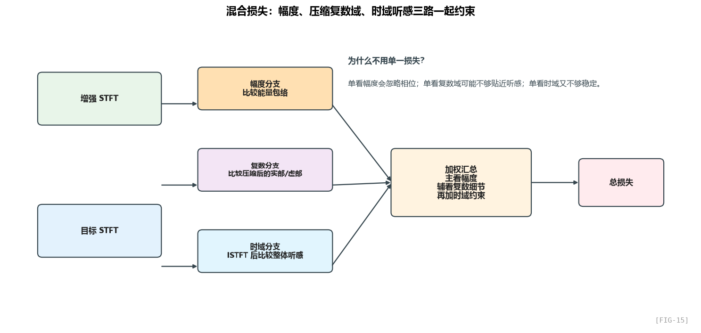

所以“混合损失”的本质不是背某个公式，而是：**不要只从一个角度要求模型做对。**

**注意论文和代码的权重不完全一致**——这是 SE 论文里常见的"代码比论文更新"的情况。我们以代码为准。

代码里的权重大意是：幅度约束最重，复数细节次之，时域一致性再做兜底。

也就是 **幅度损失权重最高（70），实虚部损失次之（各 30），SISNR 最低（1）**。

### 7.5 逐项拆解：每个损失项管什么

#### 幅度损失

这里最重要的不是某行实现，而是“先做功率压缩，再比较幅度”。

注意有个 `**(0.3)`——这是**功率压缩**（power compression）。

**为什么要压缩？**

语音的幅度谱**动态范围极大**。低频共振峰能量可能是高频噪声的 1000 倍。如果直接用 MSE，**大能量频点的损失会主导训练**，小能量频点（恰恰是高频细节）被忽略。

如果把幅度先做一次压缩：

- 小能量基本保持原状；
- 大能量会被明显压缩；
- 于是训练时不会总被少数超大能量频点牵着走。

**动态范围从 1:1000 压成 1:7.9**——网络对各个能量区间的关注更均衡。

> 0.3 这个数字来自经验（不同论文用 0.2-0.5 都有）。这种"非线性压缩"是 SE 训练里的标准 trick。

#### 复数细节损失

实部/虚部那一路也不是直接硬比，而是先映射到压缩域，再比较复数细节。

实虚部各除以 `|S|^0.7`，再做 MSE。

**为什么除以 |S|^0.7？** 注意：

直觉上，你可以把它理解成：幅度分支和复数分支都被拉到了同一个“压缩过的尺度”上，所以它们的损失权重才有可比性。

**这是一个非常巧妙的设计**：让幅度损失和实虚部损失在**同一个压缩域**里，权重才有可比性。否则原始 |S| 和 real 的数值范围相差悬殊，加权时小项会被淹没。

> 这种数学细节很容易被忽略，但是它对损失收敛有显著影响。

#### SISNR 时域损失

时域那一路则是在提醒模型：别只在频谱上“看起来像”，还要在波形层面“听起来像”。

SISNR 的直觉可以理解成：目标语音越集中、残余误差越少，分数就越高；而且它不太受整体增益放大缩小的影响。

“Scale-Invariant”的意思是：如果你只是把整段输出统一放大或缩小，这个指标不会被轻易骗过去。

**为什么时域和频域都要算？**

听感是时域的——耳朵听到的是波形。但训练通常在频域更稳定（频谱是稀疏的、有结构的）。**两者都算，互相约束**：

- 频域损失保证频谱细节正确
- SISNR 保证整体波形听感正确

如果只用频域损失，可能"频谱看起来对了，但反变换回波形听起来有人工 artifact"。

#### 权重的"玄学"

为什么是 30, 30, 70, 1 而不是别的？这个问题论文没回答，估计是作者跑了一堆消融实验试出来的。

经验法则：

- **幅度损失权重大**：因为人耳主要感受幅度
- **实虚部损失权重中等**：辅助修相位
- **SISNR 权重小**：时域损失量纲不同，权重不能太大

如果你要训自己的 SE 模型，这些权重是要根据数据集和任务调的。**不要直接照搬**。

### 7.6 损失函数的隐含约束

读完上面这些，你应该看出几个**隐含的设计哲学**：

#### 多角度约束 = 防止网络"作弊"

只用 MSE 时，网络可能找到一个"作弊路径"——比如总是输出零，幅度小但 MSE 不大。多个损失项让网络无法只满足一个，必须**全面学好**。

#### 损失项要"量纲相近"

如果一项是 0-1，另一项是 0-100，加起来的时候小项基本被忽略。压缩损失（用 |S|^0.3）就是在做"量纲对齐"。

#### 训练目标 ≠ 评测目标

注意一个有趣的现象：**损失里没有 PESQ、STOI**。但论文用 PESQ、STOI 评测。

为什么？因为 PESQ 是**不可导**的（基于复杂的感知模型），无法用作训练损失。所以训练时用一个**可导的代理损失**（MSE + SISNR），希望它和 PESQ 高度相关。

近年有些工作尝试做"感知损失"——用一个小神经网络模拟 PESQ，让 SE 模型在它上面 backprop。但 GTCRN 没用这种 trick，保持简洁。

### 7.7 一个被忽视的细节：损失 vs 训练数据匹配

打开论文 Sec 3.1，看训练数据：

> A total of 720,000 pairs of 10-second noisy-clean data are generated for training... mixing under the SNR range from -5 to 15 dB.

**SNR 从 -5 dB 到 15 dB**——非常宽的范围。这意味着网络需要在极差的信噪比（-5dB，噪声比语音还响）和较好的信噪比（15dB，语音清楚）下都能工作。

宽 SNR 训练对模型有什么影响？

- 模型学到"动态调整压制强度"——在低 SNR 时大刀阔斧，在高 SNR 时轻柔润色
- 训练难度更大，需要更多数据和 epoch

这就是为什么 GTCRN 用了 72 万条 10 秒的训练数据。这是工业级的训练规模。

### 7.8 关于 RIR：作者引入的"混响"成分

> the clean speech is convolved with a randomly selected RIR

RIR = Room Impulse Response，房间冲激响应。把干净语音和 RIR 卷积，得到"在某个房间里录的"语音，然后再加噪。

这意味着 GTCRN 训练时不只学了**去噪**，还学了**部分去混响**（dereverberation）。

但作者把"去混响目标"限制为前 100 ms 的早期反射：

> The training target is obtained by preserving the first 100 ms reflections.

这是因为**完全去混响**会让语音听起来"干"和不自然——早期反射对人耳来说是"自然的"，只去除后期混响（迟回声）才是合理目标。

### 7.9 训练流程的其他细节

- **优化器**：Adam，初始学习率 0.001
- **学习率调度**：5 个 epoch 验证损失不降就减半
- **Batch size**：VCTK-DEMAND 用 4，DNS3 用 16
- **DNS3 训练时**：每个 epoch 随机选 40K 条（不是用全部 72 万），加速训练

### 7.10 这一章的小结

- **CRM = 同时修幅度和相位**，是现代 SE 模型的标配
- **tanh 输出**保证掩码值合理，避免训练不稳定
- **混合损失** = 幅度损失 + 实虚部损失 + SISNR
- **功率压缩** (`|S|^0.3`) 让动态范围更均衡，是必备 trick
- **频域和时域损失互补**：频谱准 + 听感好
- **训练数据的 SNR 分布、混响策略，对最终模型行为至关重要**

---

## 第八章 流式推理：从离线训练到逐帧实时

> 离线训练的网络一次输入一段几秒的 STFT，输出整段增强后的 STFT。但实际部署时，**输入是逐帧来的**——每 16ms 一帧，必须立刻输出。这个转换不是 trivial 的，里面有很多工程细节。

### 8.1 流式 vs 离线：本质区别是什么？

我们对比两种推理模式：

| 模式 | 输入 | 推理 | 延迟 |
|:----:|:----:|:----:|:----:|
| **离线** | 整段音频的 STFT，shape `(1, 257, T, 2)` | 一次性前向计算 | 等整段都到了才能开始 |
| **流式** | 单帧 STFT，shape `(1, 257, 1, 2)` | 每帧调用一次 | 每 16 ms 出一帧 |

流式推理的核心问题是：**网络的有些层依赖历史帧**。怎么把"依赖历史"变成"用缓存（cache）保存历史状态"？

### 8.2 三类需要缓存的层

把流式版本的接口抽象出来，它通常会显式接收三类 cache：卷积历史帧、TRA 的隐藏状态、Inter-RNN 的隐藏状态。

3 类缓存：

1. **conv_cache**：dilated 卷积的历史帧缓存
2. **tra_cache**：TRA 模块的 GRU 隐藏状态
3. **inter_cache**：DPGRNN inter-frame RNN 的隐藏状态

我们逐类看。

### 8.3 缓存 1：Dilated Convolution 的卷积缓存

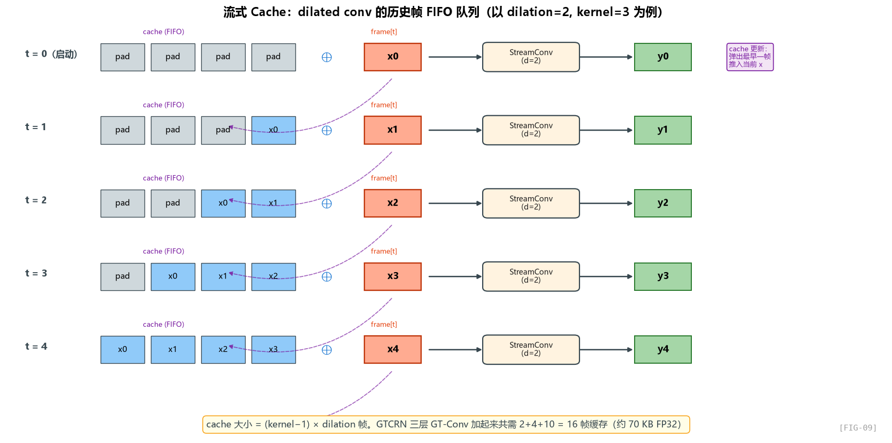

#### 离线训练时怎么做？

回顾第 4 章，离线训练时，这件事等价于“在时间轴左侧补足历史，再做当前卷积”。

对 kernel=3、dilation=5 的卷积，pad_size = 10。

也就是说，当处理第 t 帧的时候，**卷积会同时看到 t, t-5, t-10** 这三帧（dilation=5 时）。

#### 流式推理时怎么办？

流式时每次只有当前帧 `(1, 257, 1, 2)`，**没有历史帧可看**！

解决方法：**显式保存历史帧作为 cache**。

可以直接配合 `FIG-09` 来理解这个过程：启动时 cache 里全是 `pad`，随后每来一帧，就把当前帧压入 FIFO，把最老的一帧弹出。这样卷积每次看到的都是**历史帧窗口 + 当前帧**。

这就是 **conv_cache** 的逻辑——它是一个 FIFO 队列，保存最近的 `(kernel_size - 1) * dilation` 帧。

#### 看 StreamConv2d 的实现

流式卷积一般会封装成独立模块，但抽象逻辑其实都一样。

它的核心逻辑其实不复杂，本质上就是“取出历史 cache、和当前帧一起算、再把最新状态写回去”。

`StreamConv2d` 的接口签名是 `(x, conv_cache) → (out, new_cache)`。每次推理时把 cache 拼接到输入前面做卷积，然后更新 cache。

如果写成过程语言，流式卷积每一步都只做三件事：

1. 取出历史帧；
2. 拼上当前帧，算出当前输出；
3. 丢掉最老一帧，把当前帧塞回缓存。

#### cache 大小的计算

对 kernel=3、dilation=d，每层需要 `(kernel-1) * dilation = 2d` 帧的缓存：

| GT-Conv 层 | dilation | cache 帧数 |
|:----:|:----:|:----:|
| 1 | 1 | 2 |
| 2 | 2 | 4 |
| 3 | 5 | 10 |

总共就是 `2 + 4 + 10 = 16` 帧缓存。

第一个 `2` 是 encoder/decoder 各一份；`16` 是总缓存帧数。

工程上通常会把多层 cache 集中装进一个固定形状的大张量里，再按层切片分配出去，这样更适合部署接口。

切片 `[:2]`、`[2:6]`、`[6:16]` 对应三层 dilation 不同的 cache。这种"集中管理 cache"的方式对 ONNX 导出特别友好——只需要传一个固定 shape 的张量。

#### 一个性能优化的小细节

注意 `conv_cache` 是个 **5 维张量** `(2, 1, 16, 16, 33)`：

- 2: encoder/decoder
- 1: batch
- 16: 通道数
- 16: 总缓存帧数
- 33: 频率维

总元素数 = 2 × 1 × 16 × 16 × 33 = **16,896 个浮点数**，约 66 KB（FP32）。

再加上 TRA 和 Inter-RNN 的状态，整体 cache 大小仍然很小。

**所有 cache 加起来约 70 KB**——这对耳机的 RAM（通常几 MB）来说是可以接受的。

但如果你考虑量化（FP32 → INT8），cache 大小可以再砍到 1/4，约 17 KB。

### 8.4 缓存 2：TRA 的 GRU 隐藏状态

#### 离线 vs 流式的差异

离线时，TRA 的 GRU 会一次性看完整段时间序列。

输入 `(B, T, C)`，输出 `(B, T, 2C)`——GRU 内部从 t=0 跑到 t=T-1，自动管理隐藏状态。

流式时每次只有 T=1，GRU 跑一步就停了。**但隐藏状态必须保留到下一次调用**！

#### StreamTRA 的修改

如果把 TRA 改成流式版本，最关键的变化只有一个：**原来隐含在 GRU 里的状态，现在必须显式拿出来、传进去、再接回来。**

关键改动：

1. 每次推理都要显式传入上一次留下来的隐藏状态；
2. 本次计算结束后，还要把新的隐藏状态带出去。

也就是说，离线时由框架内部自动延续的状态，到了流式部署阶段，就变成了调用方手动维护的状态。

#### 6 个 TRA 的 cache 怎么管理

3 层 encoder GT-Conv + 3 层 decoder GT-Conv = 6 个 TRA。每个 TRA 一份 GRU cache `(1, B, C) = (1, 1, 8)`。

工程上通常也会把多个 TRA 的状态集中管理，避免部署接口变得很碎。

（注意这里实际上是 `(2, 3, 1, 1, 16)` 因为 GRU 输出维度是 2C=16，但隐藏状态维度也是 16。原作者参数命名稍有混乱，但 shape 是对的。）

### 8.5 缓存 3：DPGRNN inter-frame RNN 的状态

#### Intra RNN 不需要 cache，Inter RNN 需要

回顾第 5 章，DPGRNN 有两路：

- **Intra-frame RNN**：在每一帧内沿 F 跑。**每一帧独立处理**，不需要跨帧 cache。
- **Inter-frame RNN**：沿 T 跑。**必须 cache 跨帧的隐藏状态**。

同理，DPGRNN 的 inter-frame 路径也需要显式缓存；而 intra-frame 因为每帧独立做频率扫描，所以不需要跨帧状态。

#### 注意 Inter cache 的含义

为什么是 `BF`？因为 inter RNN 的 batch 维包括了所有频点——每个频点独立有一份隐藏状态。33 个频点 × 16 维隐藏状态 = 528 个值。

两层 DPGRNN，所以总 inter_cache shape 是 `(2, 1, 33, 16)`。

### 8.6 一个微妙的问题：Intra RNN 真的不需要 cache 吗？

值得停下来想一下。Intra RNN 在每一帧的 33 个频点上跑一遍 RNN，**理论上每一帧的隐藏状态都是独立初始化的**（从 h=0 开始）。

但是——这样每一帧的"频谱模式"是从零学起的。会不会**让相邻帧的频谱模式建模有不一致**？

答案：**会，但作者认为这是可以接受的**。原因：

1. Intra RNN 是双向 GRU——它在频域上能看到全局，单个频点的初始化误差被后续步骤平滑掉
2. 帧间的频谱模式应该是 **相似的**（语音的频谱是渐变的），所以每帧重新初始化也能学到相似的表示
3. 不引入 intra cache 大大简化了流式实现

如果你强迫症想引入"intra cache"，技术上可以——但实测对性能提升很小。

### 8.7 BN 在流式部署中的处理

卷积块里的 BatchNorm 在流式部署中也不需要特殊改写。

BatchNorm 在训练时统计运行均值和方差，推理时直接使用这些固定统计量；所以只要进入推理模式，它就天然兼容流式执行。

然后 BN 就会用训练阶段统计的 running statistics 做归一化，**和当前帧的内容无关**，所以流式天然兼容。

> 这也是为什么作者在 GT-Conv 里用 BN 而不是 GroupNorm 或者其他——BN 的"running stats"机制对流式部署最友好。

### 8.8 离线到流式的权重转换

一个比较优雅的工程做法是：训练时使用离线结构，部署前再把权重映射到流式结构上。

权重转换函数会把离线模型的参数逐一拷贝到流式模型对应模块上。**网络参数本身不变**，改变的只是推理时的状态管理方式。

这意味着：**你训练时不需要管"流式不流式"**，正常训练就行。只在推理时切换到 StreamGTCRN。这是一个非常优雅的设计——训练和部署的解耦。

> 当然，前提是网络本身是 **causal** 的，没有任何"偷看未来"的操作。如果用了双向 RNN 或者非因果卷积，就没法这么转。

### 8.9 ONNX 导出：让模型真的能跑在端侧

导出 ONNX 时，一般会把 cache 也一起做成显式输入输出，让外部调用方负责状态回传。

几个值得注意的点：

#### 输入输出包含 cache

ONNX 是个**无状态**的格式——它没有"隐藏状态"的概念。所有需要在调用间保持的状态，都必须显式作为输入输出。

所以 ONNX 这里的核心思想是：模型本身无状态，但所有需要跨调用保存的状态，都必须显式跟着输入输出一起走。

调用方负责在两次推理之间把 `*_out` 传回作为下次的 `*` 输入。

#### ONNX 版本选择

ONNX 的算子版本一般会选一个偏保守、兼容面更广的版本，这样更利于端侧落地。

**实战经验**：如果你要在嵌入式设备上跑，opset 越低越好（更多算子被支持）。GTCRN 选 11 是个保守但稳的选择。

#### 图简化

导出后通常还会再做一次图简化，删掉冗余节点，减少部署成本。

图简化工具会做常量折叠、删除冗余节点等优化，目的是把部署图进一步变瘦。

### 8.10 实测性能：RTF = 0.07

README 里说：

> A streaming GTCRN is provided in `stream` folder, which demonstrates an impressive real-time factor (RTF) of **0.07** on the 12th Gen Intel(R) Core(TM) i5-12400 CPU.

RTF (Real-Time Factor) = 推理时间 / 音频时长。RTF = 0.07 意味着**处理 1 秒音频只需 70ms**——CPU 上还能并行处理 14 路！

这背后的原因：

1. **网络小**：33 MMACs/秒，CPU 不到 1ms 就能跑完一帧
2. **cache 小**：70KB 全部在 L2 cache 内，没有 memory bottleneck
3. **结构简单**：没有奇怪的算子，ONNX runtime 充分优化

对比 RNNoise（也很轻量，C 实现），GTCRN 的 RTF 略低，但性能高一截。

### 8.11 实战部署的 checklist

如果你要把 GTCRN 部署到自己的项目，要按这个顺序做：

1. **训练离线版本**
2. **跑因果性测试**，确保没有偷看未来
3. **转换到流式版本**
4. **测离线 vs 流式输出一致性**：用同一段音频跑两遍，差异应该 < 1e-5
5. **导出 ONNX + simplify**
6. **在目标平台上 benchmark**（耳机 SoC、手机、PC...）
7. **量化**（可选，进一步减小模型体积）

任何一步出问题都要停下来排查。

### 8.12 一个常见的部署陷阱：STFT 也要流式

我们一直在讲网络流式，但**真正的端到端流式还包括 STFT/ISTFT**！

离线 STFT 是一次性处理整段音频。流式时，每收到一个新的 hop（256 个采样点），要：

1. 取最新的 win_length=512 个采样点（含历史 256 个）
2. 加窗、FFT，得到当前帧的复数谱 (257,)
3. 送入 StreamGTCRN，得到增强谱
4. ISTFT：和上一帧的输出做 OLA 拼接，输出 256 个增强后的采样点

这套 STFT/ISTFT 的端到端流式管线，通常还需要结合你自己的音频框架单独实现。

### 8.13 这一章的小结

- **流式推理 = 离线推理 + 显式缓存**
- **3 类 cache**：dilated conv 的历史帧、TRA GRU 状态、inter RNN 状态
- **训练完全不变，只改 inference forward**——优雅的解耦
- **BN 在 eval 模式下天然支持流式**（用 running stats）
- **ONNX 导出时所有 state 都要显式输入输出**
- **STFT/ISTFT 也要流式实现**，不要忽略
- **总 cache 不到 70KB**，对耳机来说毫无压力

---

## 第九章 设计哲学总结：从 GTCRN 学到的可迁移工程思维

> 走完 8 章，我们已经把 GTCRN 的每一处细节都拆开看过了。这一章，我想做一个升华——**从这个具体的网络中，提炼出可迁移到其他项目的设计思维**。

### 9.1 回到最初的问题：作者是怎么"想到"这些设计的？

很多人看完论文会觉得："作者好聪明啊，能想到这么多 trick"。但其实，**这些 trick 几乎没有一个是从天上掉下来的**。我们把每个模块的"思维路径"逆推一遍：

| 模块 | 想到的路径 |
|:----:|:----:|
| **ERB BM/BS** | "STFT 输出 257 维太多了，能不能压？" → "我学过 Mel/Bark/ERB 这些感知标度" → "ERB 直接拿来用" |
| **Grouped Conv** | "标准卷积参数 O(C²) 太多" → "ResNeXt/ShuffleNet 怎么解决的？" → "分组" |
| **Channel Shuffle** | "分组后通道间不交互怎么办？" → "ShuffleNet 已经给了答案" → "shuffle" |
| **Depthwise Separable** | "3×3 卷积还是太大" → "MobileNet 怎么做的？" → "1×1 + depthwise + 1×1" |
| **Dilated Conv** | "感受野不够长" → "WaveNet/TCN 怎么做的？" → "空洞卷积" |
| **DPRNN** | "RNN 怎么处理时频域特征" → "DPRNN 论文（Luo et al 2020）" → "拿来用" |
| **Grouped RNN** | "RNN 参数 O(H²) 太多" → "Gao et al 2018 提了 Group RNN" → "拿来用" |
| **CRM** | "纯幅度掩码不修相位不行" → "Williamson et al 2015 提了 CRM" → "拿来用" |
| **混合损失** | "纯 MSE 训不出好效果" → "看看 SE 领域大家都怎么写损失" → "拼一个" |
| **SFE** | "depthwise 看不到频域邻居" → "**这个问题没现成答案，我自己造一个**" |
| **TRA** | "时间维度上重要性不均匀" → "SE-Net 的思想 + GRU 替代 FC" → "**改造**" |

注意最后两行——**真正的"原创"只有 SFE 和 TRA**，而且都是"借鉴 + 改造"，不是凭空发明。

> 这才是工程师做研究的正确姿势：**90% 的功夫花在调研现有工作上，10% 用在解决调研后剩下的"小空白"**。

### 9.2 8 条可迁移的设计原则

#### 原则 1：先把问题约束写下来，再开始设计

GTCRN 的所有设计都源自一个约束："< 50K 参数 + < 50 MMACs/秒"。

**你的项目有什么约束？**

- 实时性要求？（RTF < 1）
- 内存预算？（嵌入式 SoC 通常几 MB）
- 算力预算？（CPU/GPU/NPU 各自不同）
- 延迟要求？（语音通话 < 50ms，离线转写无所谓）
- 准确率底线？

**把这些写在一张纸上，贴在显示器旁边。**之后每一个设计决策都要回到这张纸上问："这个 trick 是不是符合约束？"。

很多团队失败的根本原因是**没明确约束**——做着做着就追求"更高的 PESQ"，但忘了产品端只有 1MB 内存。

#### 原则 2：站在巨人肩膀上，但要"翻译"

GTCRN 借鉴了 ShuffleNetV2（CV）、MobileNet（CV）、SE-Net（CV）、DPRNN（语音分离）、Group RNN（NLP）等多个领域的工作。

但作者**没有照搬**——每个借鉴都有"翻译"：

- ShuffleNet 的 channel shuffle 在 RNN 上行不通（流式不友好），改成 FC 学到的隐式 shuffle
- SE-Net 的全局 pooling 是空间维，改成频率维；FC 改成 GRU
- 标准 DPRNN 的 RNN 用全连接，GTCRN 全部换成 grouped

**翻译的核心是：理解被借鉴的"灵魂"，而不是"形式"**。Channel shuffle 的灵魂是"促进 group 间信息交换"，所以 FC 也能达到。

#### 原则 3：领域知识 > 参数堆砌

GTCRN 最值得学的设计是 **ERB BM/BS** —— 不可训练的、纯粹基于心理声学的频率压缩。

如果让一个"纯 ML 工程师"设计，他可能想出"加一个可学习的下采样层"，效果可能也行，但要花 10K 参数。

**作者把感知声学知识直接编码进网络，省掉了所有参数**。

通用启示：**只要你的领域有成熟的"先验"（比如生物医学的解剖学、金融的技术指标、物理的守恒律），就把它们硬编码到网络里，而不是让网络自己学**。

#### 原则 4："砍 + 补"是降维设计的核心范式

GTCRN 全篇都在做"砍 + 补"：

| 砍掉什么 | 补什么 |
|:----:|:----:|
| 频率维（257→129） | 通道维（3→9，via SFE） |
| 卷积参数（标准→grouped） | Shuffle 让通道交流 |
| RNN 参数（标准→grouped） | FC 层让 group 间交流 |
| 浅层时间感受野（3 帧） | 深层 dilation 扩展到 17 帧 |

每"砍"一个维度，必有一个"补"的对应物。**不补的砍叫"塌"——性能会塌掉**。

设计一个新模块时，养成这个思维习惯：

> "如果我把 X 砍掉，原本由 X 承载的能力转移到哪里去了？"

如果答不上来，这个砍就有问题。

#### 原则 5：因果性是个全局属性，不是局部检查

GTCRN 的因果性体现在：

- 所有时间维 dilated conv 只填左侧 padding
- Inter RNN 用单向 GRU
- Intra RNN 用双向但只在频率维（不影响时序）
- BN 在 eval 模式用 running stats

任何一处疏忽（比如某层 BN 用了 batch stats，或者某个 pooling 跨了时间维），整个模型就不 causal。

**自动化检查**：这种因果性测试应该**纳入 CI**。每次改完模型都跑一遍。

#### 原则 6：训练/推理解耦

GTCRN 的代码结构有一个非常优雅的设计：

- 离线版本：用于训练
- 流式版本：用于部署
- 权重转换工具：负责把离线权重映射到流式结构

**训练时不需要管流式**——网络写法就是"看整段输入输出整段"，简单直观，loss 容易写。

**推理时不需要管训练**——cache 由 inference 框架管理，无 backprop 干扰。

很多团队把这两层混在一起，结果**训练代码里塞满了 cache 管理逻辑**，调试一个小 bug 要看几百行无关代码。

#### 原则 7：消融实验是设计的指南针

论文 Table 1 的消融实验非常重要——它告诉我们：

| 配置 | PESQ | 价值 |
|:----:|:----:|:----:|
| 裸 GTCRN | 1.87 | baseline |
| + SFE | 1.90 (+0.03) | SFE 的边际贡献 |
| + TRA | 1.91 (+0.04) | TRA 的边际贡献 |
| + SFE + TRA | 1.94 (+0.07) | 两者叠加 |

**消融不仅是写论文的需要，更是研发过程的反馈**。每加一个模块，跑一次消融。如果某模块加上 PESQ 只涨 0.001，那它可能就该被砍掉。

**养成"消融驱动开发"的习惯**：

1. 设计一个新模块 `M`
2. 训练 baseline 模型
3. 加 `M` 再训练一个版本
4. 对比 `PESQ / STOI / SISNR`
5. 决定保留还是砍掉

不要"我感觉这个 trick 应该有用"——感觉是不可靠的。

#### 原则 8：好的代码 = 好的设计

GTCRN 的代码非常干净：

- 每个模块一个清晰职责
- 一个文件 350 行就把所有逻辑写完
- 模块命名和职责映射关系清楚

**这反映了作者本身的设计思路就很清晰**。看作者代码，比看论文更能学到设计思维——因为代码不能藏锅。

如果你写出来的代码自己都看不懂，那大概率是设计也有问题。

### 9.3 一个反思：GTCRN 还能怎么改进？

读完整个网络，我们也可以反过来想：**它还有什么可以优化的？**

#### 思考方向 1：更激进的频域压缩

现在 ERB 把 192 高频点压成 64 带。能不能压到 32 带？甚至更少？

代价：高频细节丢失（铿锵的辅音可能受影响）。需要消融验证。

#### 思考方向 2：自适应的 SFE kernel size

现在 SFE k=3 是固定的。能不能让不同层用不同 k？

- 浅层用 k=5（看更宽的频域上下文）
- 深层用 k=3（特征已经抽象，不需要那么宽）

#### 思考方向 3：DPGRNN 减少到 1 层

现在 2 层 DPGRNN 占了不少算力。如果只用 1 层会怎么样？

直觉：可能 PESQ 掉 0.05。如果对你的应用够用，能省 1.5K 参数 + 1.2 MMACs/秒。

#### 思考方向 4：用 SSM 替换 RNN

最近的 Mamba/Mamba-2 等状态空间模型（SSM）在长序列上比 RNN 更高效。理论上可以用 SSM 替换 DPGRNN，但 SSM 在嵌入式端的支持还不成熟。

#### 思考方向 5：多分辨率输入

现在 STFT 用 32ms 窗。能不能并行用 16ms / 64ms 两个窗，让网络在不同时间尺度上同时建模？

代价：算力翻倍。除非这个能换来显著性能，否则不值。

### 9.4 给读者的"刻意练习"建议

如果你想真正掌握 GTCRN 级别的网络设计能力，**光读论文和代码不够**，要"动手 + 反思"。我建议你按这个顺序练习：

#### 练习 1：复现裸 GTCRN 并跑通

不用任何 SFE / TRA，把 GTCRN 砍成最简版本，自己写训练代码，在 VCTK-DEMAND 上训出 PESQ ≥ 1.8 的模型。

**目标**：熟悉训练 pipeline，不要担心性能。

#### 练习 2：加上 SFE / TRA，验证消融实验

在练习 1 的基础上，逐个加 SFE 和 TRA，复现论文的 Table 1 结果。

**目标**：验证你对每个模块的理解。

#### 练习 3：换一个数据集，重新训练

VCTK-DEMAND 太干净（英文女声+男声，纯语音）。试试在中文数据集（如 AIShell + MUSAN 噪声）上训练，看哪些模块需要调整。

**目标**：理解模型对数据分布的依赖。

#### 练习 4：把 GTCRN 砍到 10K 参数

挑战：在 10K 参数限制下，最高 PESQ 能达到多少？

可能的策略：

- 砍掉 DPGRNN 第二层
- 减小 hidden_channels
- 砍掉一层 GT-Conv

**目标**：体会"约束驱动设计"的乐趣。

#### 练习 5：流式推理 + 端侧部署

把 GTCRN 转 ONNX，量化到 INT8，在 Raspberry Pi 上跑实时降噪。

**目标**：经历完整的"训练→部署"链路，体会工程上有哪些细节。

### 9.5 最后的话

GTCRN 不是一个"惊为天人"的网络。它没有任何颠覆性的发明——所有模块都来自已有工作。

但它是一个**极其优秀的工程作品**——把每个已知技术用对地方、组合得恰到好处、在严格的工程约束下做出了 SOTA 的轻量化效果。

> **真正好的工程，往往不是发明新东西，而是把现有的东西用对、用好。**

如果你做完这个系列，能把"砍 + 补"这种思维方式内化，能在拿到一个新需求时第一反应是"先把约束写下来"，能把领域知识硬编码到模型里、能在每一层都做消融实验来验证——那这篇文章就达到目的了。

至于以后你设计的网络是不是叫 "XYZ-CRN"、能不能上 ICASSP——那是次要的事。

---

## 全文回顾

| 章节 | 核心要点 |
|:----:|:----:|
| 第一章 设计思路与背景 | 耳机约束 + DPCRN 骨架 + 砍补哲学 |
| 第二章 整体架构 | U-Net + DPRNN，时间维珍惜频率维大胆压缩 |
| 第三章 输入处理与 ERB | ERB 低频不动高频合并，把声学知识写进网络 |
| 第四章 GT-Conv 详解 | ShuffleNet + depthwise + dilation + 因果 padding |
| 第五章 DPGRNN 详解 | 双路径 + 分组 RNN，3K 参数完成 25K 的事 |
| 第六章 SFE 与 TRA | 子带注入通道维 + 时序注意力，性能点睛 |
| 第七章 输出与损失函数 | CRM + tanh + 混合损失 + 功率压缩 |
| 第八章 流式推理 | 3 类 cache，训练推理解耦，ONNX 部署 |
| 第九章 设计哲学总结 | 8 条可迁移原则 + 反思 + 刻意练习 |

---

> **致谢**：感谢 GTCRN 作者 Xiaobin Rong 等人提供了如此清晰的论文和开源代码。本文的所有观点和分析仅代表本人理解，如有偏差以原论文为准。
