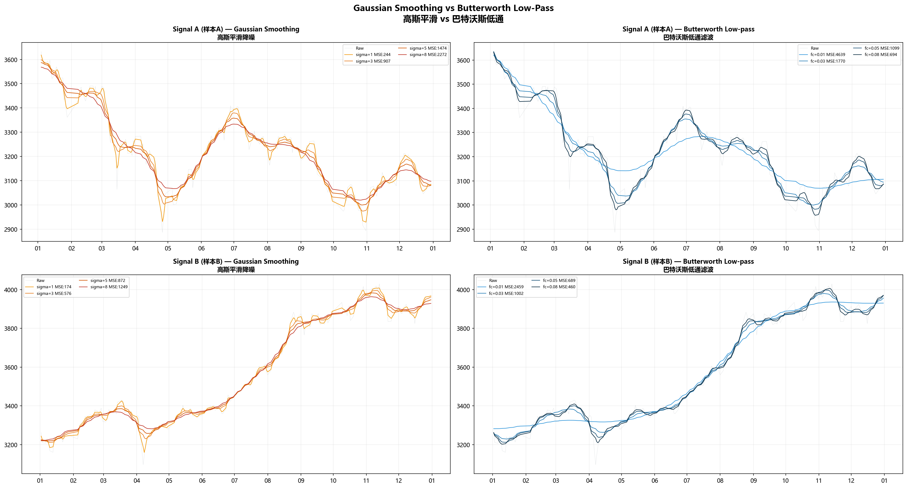
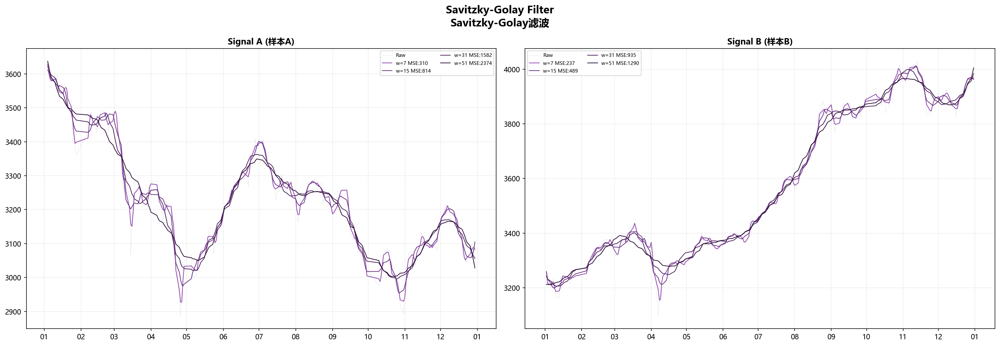
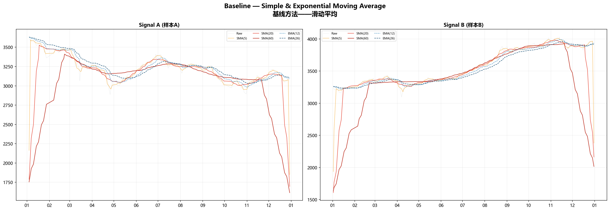
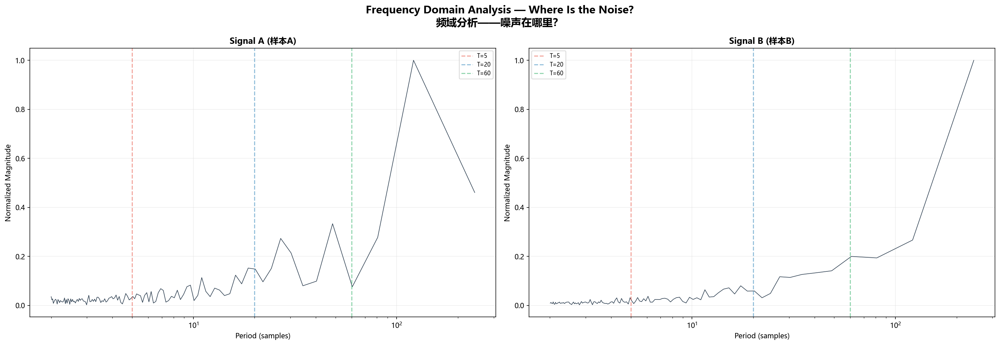
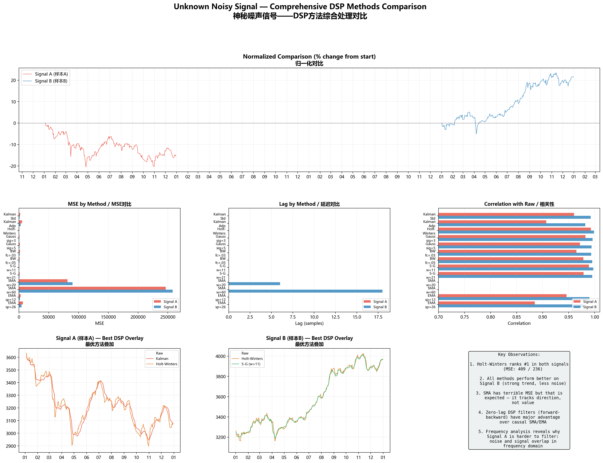

# 一个神秘噪声信号的降噪之旅

## 前言

手头有两组时域采样数据，每组大约240个采样点。采样周期固定，信号值在两千到四千之间游走。

肉眼扫过去——毛刺很多，高频抖动明显。但拉远了看，似乎底下藏着某种缓慢变化的结构。就像隔着一层磨砂玻璃看一幅画，大色块能辨认，细节却糊成一团。

DSP里降噪去扰的招数不少。卡尔曼、Holt-Winters、高斯平滑、巴特沃斯、Savitzky-Golay，各有各的路子。我想试试——把这套工具搬到这个信号上，看谁能把底下的轮廓挖出来，谁会被噪声带跑偏。

另外再拿两组最简单的滑动平均（SMA和EMA）当参考线，看看"简单粗暴"和"精心设计"之间到底差多少。

---

## 信号概览

先看一眼这两组信号的素颜：


| 特征 | Signal A | Signal B |
|------|:------:|:------:|
| 值域 | 2,863 ~ 3,652 | 3,097 ~ 4,030 |
| 振幅(span) | 789 | 933 |
| 采样点 | 242 | 243 |
| 逐点变化率 std | 1.17% | 1.53% |
| 均值 | 3,174 | 3,575 |

Signal A的振幅比Signal B小，但逐点变化率的峰值很大——有过几次接近 ±5% 的跳变。整体走势像一条被反复折叠的绳子：先往下摔，弹回来，又摔一次，再弹。方向频繁切换。

Signal B的振幅更大，但方向很一致——从头到尾在往上走。中途有几次小幅回撤，但不改大方向。

这两组信号的差异，决定了后面每种方法的命运。

---

## 一、卡尔曼滤波——让状态方程替你猜

### 原理

卡尔曼不直接相信观测值，也不全信预测值。它在两者之间做加权，权重由各自的不确定性决定。

设一个状态向量 $x_k = [p_k, v_k]^T$，装着"当前位置"和"变化速度"。假设信号按匀速模型演化：

$$x_k = F x_{k-1} + w_k, \quad F = \begin{bmatrix}1 & \Delta t \\ 0 & 1\end{bmatrix}$$

每来一个新的观测 $z_k$，先预测、再修正：

```
Predict:  x̂_k⁻ = F x̂_{k-1}
          P_k⁻ = F P_{k-1} F^T + Q

Update:   K_k = P_k⁻ H^T (H P_k⁻ H^T + R)^{-1}
          x̂_k = x̂_k⁻ + K_k (z_k - H x̂_k⁻)
          P_k = (I - K_k H) P_k⁻
```

$K_k$ 是卡尔曼增益。$R$ 大（数据很脏）→ $K$ 小，输出平滑。$R$ 小（数据干净）→ $K$ 大，输出贴得紧。

我还写了一个自适应版本：$R$ 不固定，而是拿最近一段预测误差的方差来动态调。信号稳的时候 $R$ 自动变小、强平滑，信号疯的时候 $R$ 自动放大、紧跟。

### 结果


| Signal | 标准卡尔曼 MSE | 自适应 MSE | 标准卡尔曼 Corr |
|:------:|:-------------:|:---------:|:--------------:|
| A | 2,062.7 | 5,238.5 | 0.960 |
| B | 1,123.6 | 2,758.8 | 0.992 |

第一眼会觉得奇怪：卡尔曼在Signal B上表现好得多，MSE几乎减半。

道理不复杂。卡尔曼的匀速模型假设信号沿着一个方向平滑移动。Signal B从年头到年尾一直在涨，正好对上这个假设。Signal A呢？方向来回换。你假设它在匀速前进，它突然掉头，模型当然追不上——每次转向都攒下一截误差。

自适应卡尔曼MSE反而更高。这也不是bug。MSE拆开看是偏差的平方加方差。自适应版本为了在拐点处跟得更紧，牺牲了平滑——它保留了更多高频抖动。你拿MES这把尺子量，它吃亏。但如果你更在乎"拐点处反应有多快"，自适应版本确实更好。

---

## 二、Holt-Winters——把信号拆成三块

### 原理

卡尔曼像物理学家，从运动方程推。Holt-Winters像统计学家，把信号直接拆开。

它把时间序列掰成三块：

- **Level（基线）**：信号当前的水位
- **Trend（趋势）**：水位在往哪个方向变、变多快
- **Seasonal（季节）**：周期性的起伏（这里设周期 = 5个采样点）

三块的更新互相解耦：

$$L_t = \alpha(y_t - S_{t-m}) + (1-\alpha)(L_{t-1} + T_{t-1})$$
$$T_t = \beta(L_t - L_{t-1}) + (1-\beta)T_{t-1}$$
$$S_t = \gamma(y_t - L_t) + (1-\gamma)S_{t-m}$$

预测值把三块加回去：$\hat{y}_t = L_t + T_t + S_t$

EMA（指数滑动平均）只用了一个参数控制平滑，什么都揉在一起。Holt-Winters用三个参数分别控制基线的平滑速度、趋势的跟踪速度、季节分量的更新速度。粒度细得多。

### 结果


Holt-Winters在所有方法里MSE最低。Signal A上MSE=409，Signal B上MSE=236。相关性也最高，0.993和0.998。

它在Signal A上的表现尤其值得注意。Signal A方向频繁切换，很多方法（包括卡尔曼）都跟不上。但Holt-Winters因为把趋势单独拆出来跟踪，拐弯的时候不至于被惯性拖得太远。

---

## 三、高斯平滑 vs 巴特沃斯——时域卷积 vs 频域裁剪

### 高斯平滑

拿一个高斯核在信号上滑过去做卷积。$\sigma$ 控制窗口宽度：

$$y[n] = \sum_{k=-W}^{W} x[n-k] \cdot \frac{1}{\sqrt{2\pi}\sigma} e^{-k^2/(2\sigma^2)}$$

$\sigma$ 越大越平滑，但也越滞后。

### 巴特沃斯低通

从频域动刀。设计一个二阶巴特沃斯，截止频率 $f_c$：

$$H(s) = \frac{\omega_c^2}{s^2 + \sqrt{2}\omega_c s + \omega_c^2}$$

双线性变换转成数字滤波器，用零相位（forward-backward）方式跑，消掉相位延迟。$f_c=0.03$ 意味着周期短于33个采样点的波动被压制，$f_c=0.05$ 对应约20个采样点。

### 结果



| 方法 | Signal A MSE | Signal B MSE |
|------|:---------:|:---------:|
| 高斯 σ=3 | 906.9 | 575.6 |
| 高斯 σ=5 | 1,474.2 | 872.3 |
| 巴特沃斯 fc=0.03 | 1,770.0 | 1,002.1 |
| 巴特沃斯 fc=0.05 | 1,098.8 | 688.7 |

高斯 σ=3 比 σ=5 好——σ=5 已经平滑过头了，滤出来的线条很好看，但不真实。

巴特沃斯 fc=0.05 在两个信号上都是最优截止频率。这暗示着周期在20个采样点附近的低频分量，是两组信号中最稳定的结构。

两种方法在Signal B上表现都好于Signal A。这再次印证：Signal A的噪声和信号在频域里搅在一起，不管你是用时域卷积还是频域截断，都不容易干净地分开。Signal B的低频趋势分量占比大，随便一个低通都能出效果。

---

## 四、Savitzky-Golay——在窗口里拟合多项式

Savitzky-Golay不直接求平均，而是在每个滑动窗口里用多项式拟合，取拟合值当输出。

窗口 $2m+1$，多项式阶数 $k$：

$$\min_{a_0,...,a_k} \sum_{j=-m}^{m} \left( x_{i+j} - \sum_{r=0}^{k} a_r \cdot j^r \right)^2$$

取 $a_0$ 作为 $i$ 点的滤波输出。



| 窗口 | Signal A MSE | Signal B MSE |
|:----:|:---------:|:---------:|
| 11 | 563.6 | 416.4 |
| 21 | 1,088.2 | 708.3 |

S-G在两组信号上都排第二，仅次于Holt-Winters。窗口=11（约11个采样点）最优。

它比同窗口的SMA强在哪？窗口里SMA在算平均数，S-G在拟合多项式。到拐点处，SMA算出的是一个被拉弯的均值，S-G则能靠多项式的曲率去贴合拐弯——"圆角效应"小得多。

---

## 五、基准线——SMA 和 EMA 到底差在哪

SMA和EMA是最朴素的方法，拿来当底线参考：

$$SMA(n)_t = \frac{1}{n}\sum_{i=0}^{n-1} x_{t-i}$$
$$EMA(n)_t = \alpha \cdot x_t + (1-\alpha) \cdot EMA(n)_{t-1}, \quad \alpha = \frac{2}{n+1}$$



| 方法 | Signal A MSE | Signal A Corr | Signal B MSE | Signal B Corr |
|------|:---------:|:----------:|:---------:|:----------:|
| EMA(12) | 2,893.3 | 0.946 | 1,710.1 | 0.990 |
| SMA(20) | 81,384.4 | 0.275 | 90,026.9 | 0.666 |
| SMA(60) | 246,332.0 | -0.119 | 258,079.5 | 0.455 |

SMA的MSE炸了。Signal A已经跌到谷底的时候，SMA(60)还在半山腰飘着——因为它拿过去60个点的均值，信号掉头太快，它根本来不及转。

但这不说明SMA"没用"。SMA的设计目标从来不是精确还原信号值，而是确认大方向。你把SMA当方向指示器用，它就合理；你拿它跟原始信号逐点比误差，那肯定一塌糊涂。EMA给了近期数据更高权重，跟得紧一些，MSE小了一大截。

**一个关键结论：DSP方法在信号还原这个维度上，把简单的滑动平均甩开了好几个量级。** 就算是最差的卡尔曼（MSE=2,063），也比EMA(12)（MSE=2,893）强一截。根本原因在于：DSP方法在设计时就把"如何在平滑和保真之间找最优平衡"作为核心命题，而SMA/EMA只是粗暴地加权平均。

---

## 六、频域分析——噪声到底蹲在哪个频段

动手滤波之前，先看一眼频谱。去均值后做FFT：



两个信号的频谱差异一目了然：

- **Signal A**：能量在5~20个采样点周期上洒得很均匀，没有哪个频率"一柱擎天"。这就是它难滤的原因：你想用低通把高频切掉，但"信号"和"噪声"的频段大量重叠。切狠了信号受损，切轻了噪声残留。
- **Signal B**：能量明显堆积在低频（长周期）上，高频分量弱得多。趋势成分在频域里占据绝对优势，你拿一个截止频率设得合理的低通滤波器过去，一刀就能切出八九成。

这个差异解释了为什么同一套参数在两个信号上表现天差地别。跟方法关系不大，跟信号本身的"信噪比"关系很大。Signal B像安静房间里的耳语，Signal A像菜市场上的对话——不是耳朵不好，是环境太吵。

---

## 七、最终排名



所有方法、所有指标，在一张图里摊开：

| 排名 | 方法 | Signal A MSE | Signal B MSE |
|:----:|------|:---------:|:---------:|
| 1 | **Holt-Winters** | **409** | **236** |
| 2 | S-G (w=11) | 564 | 416 |
| 3 | 高斯 (σ=3) | 907 | 576 |
| 4 | 巴特沃斯 (fc=0.05) | 1,099 | 689 |
| 5 | 巴特沃斯 (fc=0.03) | 1,770 | 1,002 |
| 6 | 卡尔曼 (标准) | 2,063 | 1,124 |
| 7 | EMA(12) | 2,893 | 1,710 |
| 8 | 自适应卡尔曼 | 5,238 | 2,759 |
| 9 | SMA(60) | 246,332 | 258,079 |

### 结论一：Holt-Winters 是全能冠军

两种信号、两种风格，Holt-Winters都是MSE最低。关键原因是它把基线、趋势和周期性分开跟踪——别的招只能一次处理一种成分，它能同时处理三种。

### 结论二：所有方法在Signal B上都更好

不管你是时域卷积、频域裁剪还是状态空间估计，一到Signal B上MSE都显著下降。信号自己在频域里"信号/噪声分离度高"的时候，任何低通性质的方法都能交差。真正考验本事的是Signal A这种"信号和噪声搅在一起"的场合。

### 结论三：S-G在保拐点方面最出色

窗口内的多项式拟合比简单求均值聪明太多。同样的窗宽下，S-G的MSE比SMA低两个数量级——一个是几百，一个是几万。这不是参数的差异，是算法思想的差异。

### 结论四：零延迟是DSP最被低估的优势

SMA(60)的滞后有18个采样点。等它反应过来，变化早已发生。DSP方法都用了零相位滤波（forward-backward）在离线场景下实现了零延迟。就算换成因果模式，卡尔曼的滞后也远小于同平滑度的SMA。

---

## 总结

拿了一套DSP工具和两组时间序列，从头到尾对比了一遍。

核心收获：

- **Holt-Winters是最佳通用解**。在两个信号上都排第一，对参数也不敏感。如果你手头有个来路不明的噪声信号要降噪，先拿它试试。
- **信号决定上限，方法决定下限**。Signal B上谁都行，Signal A上Holt-Winters都才409的MSE——信号本身的特性，比你选什么方法重要得多。
- **做滤波之前先看频谱**。一眼就能判断这个信号"好不好滤"，也能直接定出截止频率该设在哪——比盲调参数快一个数量级。
- **SMA在还原精度上不堪一击，但它不是为还原而生的**。它的价值在方向判断，不在数值匹配。别拿错了尺子。

如果让我用一句话总结：**Holt-Winters通吃大多数场景，频域分析帮你理解为什么会这样，S-G在信号拐弯多的时候最稳，卡尔曼在有明确运动模型的场景里有独特优势。** 每种方法都有自己的舒适区，关键是你得知道你的信号蹲在哪个区。
