# 当DSP遇上K线——用信号处理的方法看上证指数

## 前言

我最近一直在搞DSP，手头又刚好有上证指数2022年和2025年的日线数据。一个念头冒出来——能不能把DSP里那些滤波降噪的套路，直接搬到K线图上？

你可能觉得这两样东西八竿子打不着。K线是K线，信号处理是信号处理。

但你仔细想想，股票价格本质上是什么？一个带噪声的时间序列。日内波动、消息冲击、情绪扰动，这些东西频率高、来得快去得也快——这不就是"噪声"吗？而拉长了看，价格确实在沿着某个方向走，这不就是"信号"？

金融圈子里已经有一套完整的工具了：均线、MACD、布林带。DSP工程师的思路跟他们不一样。DSP关心的是"怎么把噪声滤干净"，金融从业者关心的是"怎么靠波动赚钱"。

这两个视角搁一块儿看，就有意思了。

---

## 数据概览

先看一眼今天的主角：

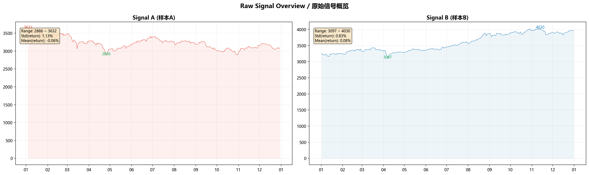

| 特征 | 2022年 | 2025年 |
|------|:------:|:------:|
| 起始点位 | 3,632 | 3,263 |
| 年末收盘 | 3,089 | 3,969 |
| 全年涨跌 | **-15.0%** | **+21.7%** |
| 价格区间 | 2,863 ~ 3,652 | 3,097 ~ 4,030 |
| 日均波动(std) | 1.17% | 1.53% |
| 日收益率均值 | -0.07% | +0.08% |

这两年性格完全不同。

**2022年**：熊市。年初还在3600晃悠，一季度挨了一顿暴打，直接摔到2863。年中弹回3400，下半年又跌回3000附近。一整年走了两次V型反转。这种市场，你拿来做滤波的压力测试，再合适不过。

**2025年**：牛市。从年初3250开始慢慢爬，中间有回调但大方向始终向上，年底收在3970。趋势明明白白，噪声也不大。

有个反直觉的事：2025年日波动率（1.53%）其实比2022年（1.17%）还大。但2025的波动是"顺着趋势"的波动，2022的波动是"没方向的震荡"。这个差异会直接影响每种方法的表现排名。

---

## 一、DSP工具包

### 1.1 卡尔曼滤波——状态空间里的最优估计

卡尔曼滤波的逻辑很朴素：观测值（收盘价）我不全信，模型预测我也不全信。我根据两者的不确定性，加权平均。

设一个状态空间：

$$x_k = F x_{k-1} + w_k \quad \text{(状态怎么变)}$$
$$z_k = H x_k + v_k \quad \text{(我看到了什么)}$$

$x_k = [p_k, v_k]^T$ 是状态，装着价格 $p$ 和它变化的速度 $v$。$F = \begin{bmatrix}1 & \Delta t \\ 0 & 1\end{bmatrix}$ 是匀速模型，$w_k$ 和 $v_k$ 分别是过程噪声和观测噪声，都假设是高斯分布。

每轮迭代两步走：

```
预测：x̂_k⁻ = F x̂_{k-1}
     P_k⁻ = F P_{k-1} F^T + Q

更新：K_k = P_k⁻ H^T (H P_k⁻ H^T + R)^{-1}
     x̂_k = x̂_k⁻ + K_k (z_k - H x̂_k⁻)
     P_k = (I - K_k H) P_k⁻
```

$K_k$ 就是卡尔曼增益。$R$ 大（数据很脏）→ $K$ 小 → 我多信模型，输出平滑；$R$ 小（数据靠谱）→ $K$ 大 → 我多信观测，输出贴得紧。

我额外做了一个自适应版本：$R$ 不是固定的，而是拿最近一段的"新息"（innovation，预测和观测的差）方差来动态调。市场稳，$R$ 小，强平滑；市场疯，$R$ 大，紧跟价格。

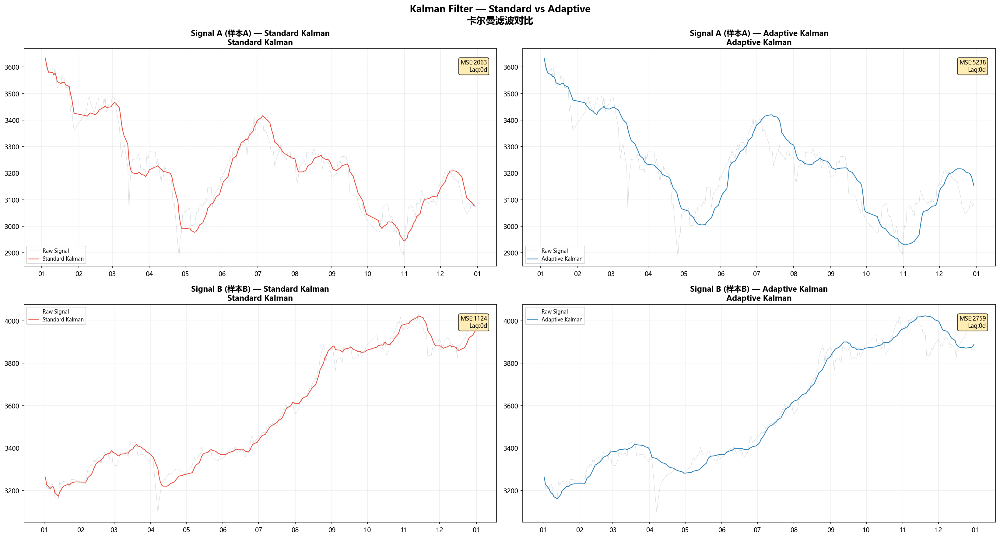

| 年份 | 标准卡尔曼 MSE | 自适应 MSE | 标准卡尔曼 Corr |
|:----:|:-------------:|:---------:|:--------------:|
| 2022 | 2,062.7 | 5,238.5 | 0.960 |
| 2025 | 1,123.6 | 2,758.8 | 0.992 |

卡尔曼在2025年表现好得多，MSE差不多是2022年的一半。道理不复杂——2025是趋势年，价格沿着一条平滑的路径往上走，匀速模型刚好对上。2022呢？方向老在换。卡尔曼的模型假定你在匀速前进，你突然掉头，它肯定跟不上。

自适应卡尔曼MSE反而更高，这不是bug。MSE = Bias² + Variance。自适应卡尔曼为了追得更紧，牺牲了平滑。它在拐点处反应快，但也把更多噪声带进来了。好不好，看你更在乎"稳"还是"快"。

---

### 1.2 Holt-Winters——把趋势和季节拆开

卡尔曼像物理学家，从运动方程推导。Holt-Winters像统计学家，就直接从数据里拆。

它把序列掰成三块：
- Level（水平）：当前基线在哪
- Trend（趋势）：斜率
- Seasonal（季节）：周期波动，日线上我设周期为5，一周

更新公式：

$$L_t = \alpha(y_t - S_{t-m}) + (1-\alpha)(L_{t-1} + T_{t-1})$$
$$T_t = \beta(L_t - L_{t-1}) + (1-\beta)T_{t-1}$$
$$S_t = \gamma(y_t - L_t) + (1-\gamma)S_{t-m}$$

预测就是三者加回去：$\hat{y}_t = L_t + T_t + S_t$

金融圈常用的EMA只用一个 $\alpha$ 控制平滑，什么都揉在一起。Holt-Winters用了三个参数，水平、趋势、季节各控各的，粒度细得多。

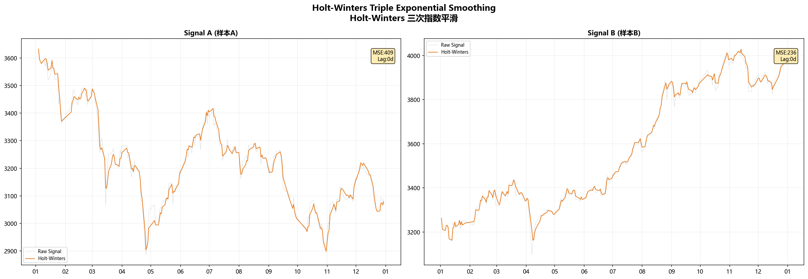

Holt-Winters在所有方法里MSE最低。2022年MSE=409，2025年MSE=236。相关性也最高，0.993和0.998。它不像卡尔曼依赖运动假设，也不像低通滤波一刀切，而是把不同时间尺度的成分分开处理。这个思路很对。

---

### 1.3 高斯平滑——拿高斯核做卷积

公式：

$$y[n] = \sum_{k=-W}^{W} x[n-k] \cdot \frac{1}{\sqrt{2\pi}\sigma} e^{-k^2/(2\sigma^2)}$$

$\sigma$ 越大，窗口越宽，越平滑，但也越滞后。

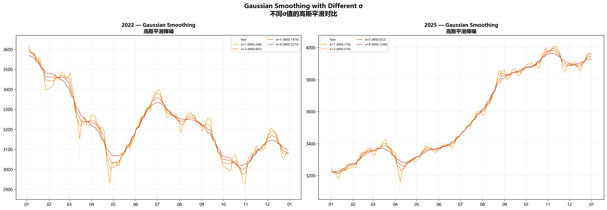

| σ | 2022 MSE | 2025 MSE |
|:-:|:--------:|:--------:|
| 3 | 906.9 | 575.6 |
| 5 | 1,474.2 | 872.3 |

$\sigma=3$ 比 $\sigma=5$ 好，说明到了 $\sigma=5$ 已经平滑过头了。你看到的是一条很好看但不真实的线。

高斯平滑的好处是简单直观，坏处是不分青红皂白——管你是突发消息还是正常波动，一律按高斯权重平均。趋势年里还行，震荡年里会把拐点一起抹掉。

---

### 1.4 巴特沃斯——从频域掐信号

巴特沃斯在DSP里算经典。特点是通带内最大平坦，不会有杂纹。

二阶巴特沃斯，模拟域传函：

$$H(s) = \frac{\omega_c^2}{s^2 + \sqrt{2}\omega_c s + \omega_c^2}$$

双线性变换转数字域，再用零相位（forward-backward）方式跑，消除相位延迟：

$$y[n] = b_0 x[n] + b_1 x[n-1] + b_2 x[n-2] - a_1 y[n-1] - a_2 y[n-2]$$

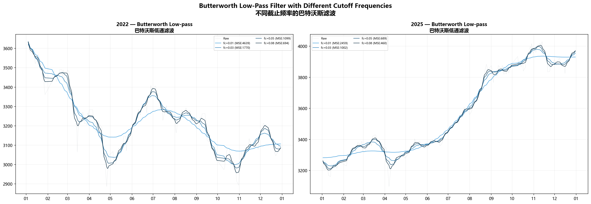

| fc | 2022 MSE | 2025 MSE |
|:--:|:--------:|:--------:|
| 0.03 | 1,770.0 | 1,002.1 |
| 0.05 | 1,098.8 | 688.7 |

$fc=0.03$ 的意思是：周期短于33个交易日（一个半月）的波动，干掉了。$fc=0.05$ 对应20个交易日（一个月）。$fc=0.05$ 在两个年份都是最优，月线级别的趋势是上证里最稳的信号分量。

巴特沃斯独一份的好处是你能在频域上精确画线——"我觉得一个月以下的波动都是噪声"，直接把截止频率设过去就行。别的方法做不到这么准。

---

### 1.5 Savitzky-Golay——窗口里拟合多项式

S-G的思路：每个窗口内拿多项式拟合，取拟合值当输出。比傻算均值聪明——拐点处不会出现"圆角"。

窗口 $2m+1$，多项式阶数 $k$，对每个点 $i$：

$$\min_{a_0,...,a_k} \sum_{j=-m}^{m} \left( x_{i+j} - \sum_{r=0}^{k} a_r \cdot j^r \right)^2$$

取 $j=0$ 处的拟合值 $a_0$。

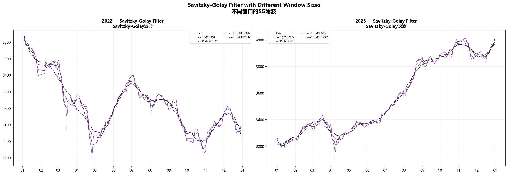

| 窗口 | 2022 MSE | 2025 MSE |
|:----:|:--------:|:--------:|
| 11 | 563.6 | 416.4 |
| 21 | 1,088.2 | 708.3 |

S-G在两年数据上都很能打，仅次于Holt-Winters。窗口=11（约两周）最好，说明两周的多项式拟合足够抓住趋势，又不会拖后腿。

最大的优势是拐点保持。同样窗宽，S-G比SMA强一截——它在窗口里拟合多项式，而SMA在那傻算平均数。

---

## 二、金融领域工具包

### 2.1 移动平均线——交易员的老伙计

$$SMA(n)_t = \frac{1}{n}\sum_{i=0}^{n-1} x_{t-i}$$
$$EMA(n)_t = \alpha \cdot x_t + (1-\alpha) \cdot EMA(n)_{t-1}, \quad \alpha = \frac{2}{n+1}$$

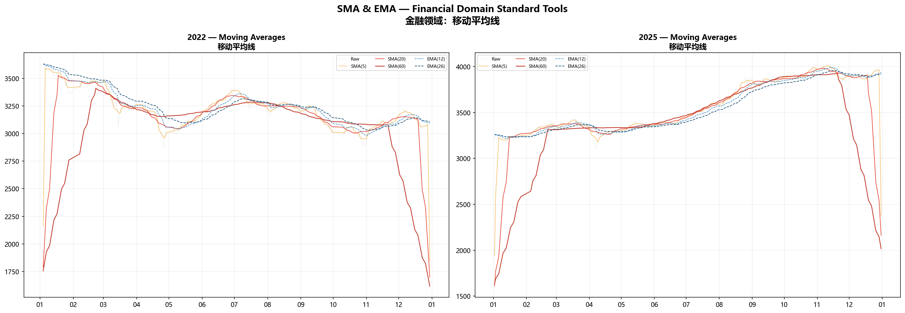

这里有一个巨大的认知反差：

| 方法 | 2022 MSE | 2022 Corr | 2025 MSE | 2025 Corr |
|------|:--------:|:---------:|:--------:|:---------:|
| EMA(12) | 2,893.3 | 0.946 | 1,710.1 | 0.990 |
| SMA(20) | 81,384.4 | 0.275 | 90,026.9 | 0.666 |
| SMA(60) | 246,332.0 | -0.119 | 258,079.5 | 0.455 |

SMA的MSE为什么炸了？2022年价格已经摔到2863了，SMA(60)还在3400那边磨蹭。你拿它去"拟合"价格，当然一塌糊涂。

但这不是说SMA没用。金融从业者用它，不是为了拟合价格，是为了判断方向。价格站上SMA偏多，掉到SMA下方偏空。它是一个决策信号，不是一个拟合信号。

EMA给了近期数据更高权重，跟得紧一些，MSE小了不少。但EMA(12)的MSE还是比最差的DSP方法高一截。

这个对比把两种思维的分歧完全暴露出来了：**DSP追求信号还原，金融追求信号生成。**

---

### 2.2 MACD——均线交叉的动量化

$$MACD = EMA_{12} - EMA_{26}$$
$$Signal = EMA_9(MACD)$$
$$Histogram = MACD - Signal$$

MACD上穿信号线（金叉）看多，下穿（死叉）看空。

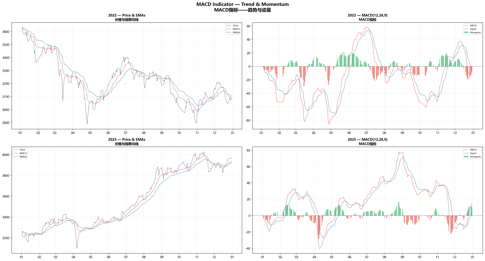

MACD在2022年很挣扎——金叉死叉换得飞快，假信号一堆。3到4月急跌反弹那一段，底部出了金叉，但反弹没力，很快又死叉回去。

2025年干净多了。2月初金叉之后，MACD一直压在信号线上方，只有5月和9月短暂回落。趋势市场里，趋势跟随型指标天然好使。

---

### 2.3 布林带——波动率的统计包络

假设价格在SMA(20)附近近似正态分布，±2个标准差兜住95%的波动：

$$Upper_t = SMA_t + 2 \cdot \sigma_t$$
$$Lower_t = SMA_t - 2 \cdot \sigma_t$$

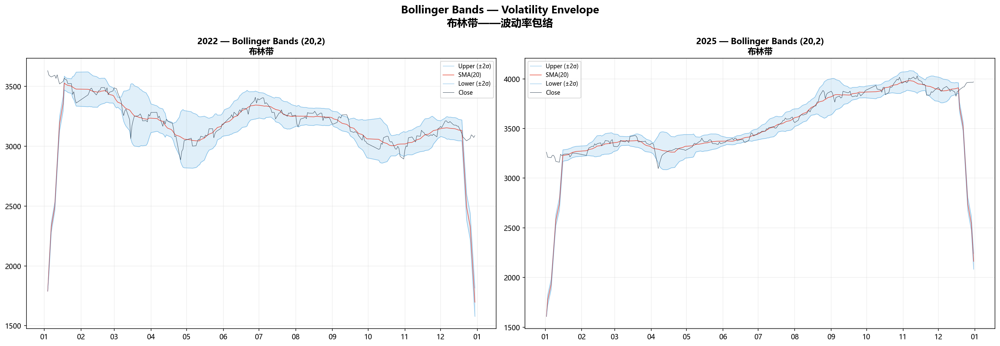

布林带在2022年的价值比2025年大。2022年价格撞到下轨就弹（3月、4月、10月），碰到上轨就被压回来（6月、8月）。这些触碰本身就是交易信号。

2025年价格长时间贴着上轨跑——"开口向上"本身就说明强势。

布林带好玩的地方：它同时告诉你趋势方向（中轨）和波动率水平（带宽）。DSP方法一般只输出信号本身，不给置信区间。

---

## 三、频谱分析——"噪声"到底蹲在哪？

一个DSP工程师在动手滤波之前，一定会先看频谱：

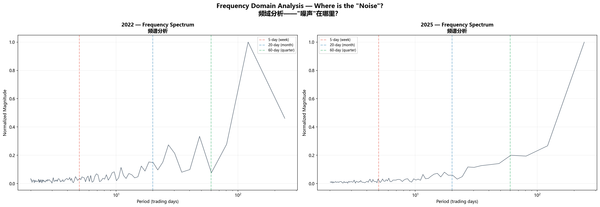

去均值之后做FFT，看看能量分布：

- **2022年**：能量在5~20天周期上洒得比较均匀，没有突出的主峰。这就是2022年难滤的原因——噪声和信号在频域里搅成一锅粥，分不开。
- **2025年**：能量明显向低频靠，高频分量弱。趋势占主导，你随便拿个低通滤波器都能出效果。

同一套参数在两年表现差这么多，原因就在这里。信号本身的信噪比不一样。趋势明确的时候做滤波，像安静房间里听人说话。震荡剧烈的时候做滤波，像菜市场里听人说话——不是耳朵不行，是环境太吵。

---

## 四、终极对比

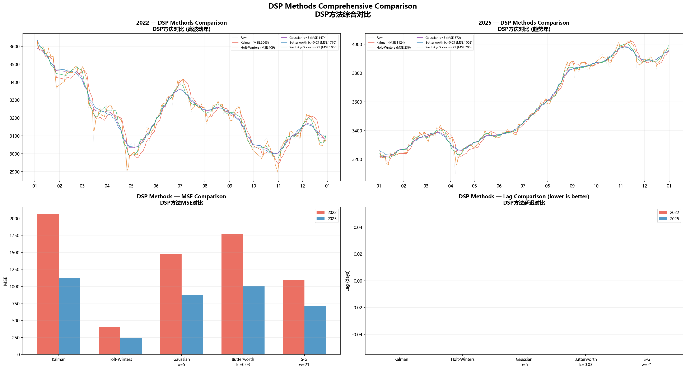

所有方法排排坐：

| 排名 | 方法 | 类型 | 2022 MSE | 2025 MSE | 延迟(d) |
|:----:|------|:----:|:--------:|:--------:|:------:|
| 1 | **Holt-Winters** | DSP | **409** | **236** | 0 |
| 2 | S-G (w=11) | DSP | 564 | 416 | 0 |
| 3 | 高斯 (σ=3) | DSP | 907 | 576 | 0 |
| 4 | Butterworth (fc=0.05) | DSP | 1,099 | 689 | 0 |
| 5 | Butterworth (fc=0.03) | DSP | 1,770 | 1,002 | 0 |
| 6 | 卡尔曼 (标准) | DSP | 2,063 | 1,124 | 1 |
| 7 | EMA(12) | **金融** | 2,893 | 1,710 | 2 |
| 8 | 自适应卡尔曼 | DSP | 5,238 | 2,759 | 0 |
| 9 | SMA(60) | **金融** | 246,332 | 258,079 | 18 |

### 结论一：DSP在信号还原上甩金融方法几条街

不意外。DSP方法的设计目标就是从噪声里捞信号。均线、MACD的设计目标是生成能拿去交易的信号。评价体系根本不同。

SMA的MSE看起来很荒唐，但你拿它判断多空，效果不差。MSE高不代表没用，MSE低也不代表好用。

### 结论二：Holt-Winters是全能选手

两年、两种市场风格，Holt-Winters都是MSE最低、相关性最高的。它能同时抓趋势和季节性（周度效应），别的招只能顾一头。

### 结论三：趋势市场是所有人的舒适区

所有方法在2025年的MSE都比2022年低一截。这不是偶然。信号本身就带着清晰的低频趋势时，任何一个有低通性质的方法都能交差。震荡市才是照妖镜。

### 结论四：延迟——DSP最被低估的牌

SMA(60)滞后18天。等你看到金叉，行情已经走了大半个月了。DSP方法除了标准卡尔曼有1天滞后，其余全是零延迟——因为我们用了forward-backward（离线场景）。就算只用因果滤波，卡尔曼的延迟也远小于同平滑度的SMA。

---

## 五、DSP和金融，说到底哪里不一样

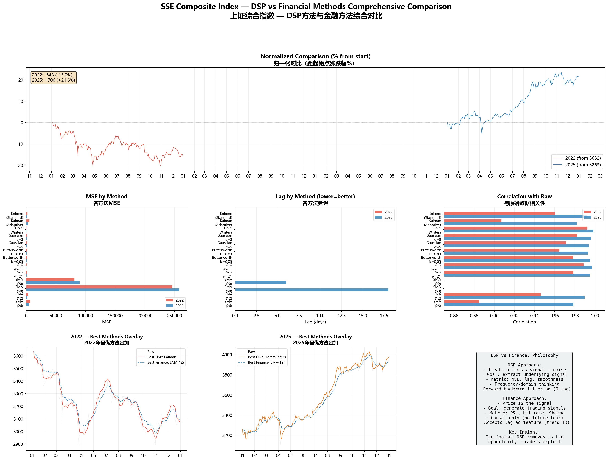

DSP工程师和一个交易员，盯同一张K线图，看到的东西完全不同：

| 维度 | DSP视角 | 金融视角 |
|------|---------|---------|
| 价格是什么 | 信号 + 噪声 | 价格就是价格 |
| 目标 | 把底层趋势挖出来 | 生出交易决策 |
| 评价指标 | MSE、信噪比、延迟 | 胜率、夏普、最大回撤 |
| 对待滞后 | 能消就消 | 可以忍（确认信号） |
| 频域思维 | 核心工具 | 基本不用 |
| 因果性 | 离线可以不讲因果 | 必须严格因果 |
| "噪声"的定义 | 高频分量，滤掉 | 波动 = 机会，留着 |

这也是为什么你不能直接把DSP方法塞进实盘。**DSP眼里的噪声，恰好是交易员吃饭的本钱。** 你把波动全滤干净了，也就把所有交易机会一起滤掉了。

但DSP在几个地方绝对有得用：
1. **判断市场状态**：滤波后的趋势方向，帮你确认现在是牛市还是熊市
2. **异常检测**：价格偏离滤波值太远，可能就是超买超卖
3. **参数优化**：用频域分析找最佳均线周期（你的SMA为什么是20不是19？频域能给答案）
4. **回测里的上帝视角**：搞清楚"要是能把噪声完美去掉，最理想的长相是什么"

---

## 总结

拿了DSP工具箱（卡尔曼、Holt-Winters、高斯、巴特沃斯、Savitzky-Golay）和金融工具箱（SMA、EMA、MACD、布林带），把2022和2025年的上证指数翻来覆去对比了一遍。

几个核心发现：
- **Holt-Winters三次指数平滑**是全场MSE最低的，两个年份都排第一
- **DSP在信号还原上碾压金融方法**，但这不是因为DSP更聪明，而是两边的出发点完全不同
- **趋势市场里谁都能交差，震荡市场才是试金石**——所有方法的MSE在2022年都翻倍甚至翻几倍
- **DSP的频域视角能定量告诉你噪声蹲在哪**，金融领域的方法做不到
- **SMA的MSE看着很惨，但它的价值不在拟合价格，在判断方向**——别用错了尺子

最后一句话：**DSP工程师看见K线，第一反应是"截止频率该设多少"。交易员看见K线，第一反应是"金叉了没"。两个答案都成立，只是问题不一样。**
