# 音频，实部与虚部——从极坐标到解析信号的一条主线

## 写在前头

这份笔记面向这样一种状态：会调 FFT，也知道频谱是复数，但对"实部虚部到底是什么"的理解停留在"FFT 输出的两列数"上。在这种状态下，教科书里的"频谱的相位"、论文里的"复数域处理"、工程文档里的"旋转自由度"，读起来都只是修辞——因为"频谱是复数、复数有模有角、乘复数就是旋转"这套语言还没有真正内化。

所以这篇笔记把地基重新打一遍，回答五个问题：

1. 数字信号是实数序列，极坐标是怎么被引入的？它有什么含义？
2. 欧拉公式在这里起什么作用？
3. FFT 里，实部和虚部各自扮演什么角色？
4. 幅度、相位、共轭对称，这些都是什么？
5. 解析信号、希尔伯特变换与 I/Q 信号又是怎么一回事？

先把结论放在这里，后面每一节都在展开它：

> 虚部不是物理量。麦克风从来没有采到过虚部。它是我们为了让"旋转"变得可计算而引入的记账工具——一旦引入，幅度和相位这对极坐标，反而比实部虚部更贴近正弦波的物理语义。

---

## 1. 极坐标是怎么进来的

### 1.1 麦克风只给实数

一段数字音频就是一列实数：$x(0), x(1), x(2), \dots$，每个数是振膜在那一刻的位移。这里没有复数，没有虚部，没有任何神秘的东西。所以第一个要澄清的观念是：复数不是信号里固有的，是分析者带进来的。问题只在于：为什么带它进来是划算的。

### 1.2 正弦波天然有两个自由度

答案藏在正弦波的参数化里。一个频率给定的正弦波：

$$
x(n) = A\cos(\omega n + \varphi)
$$

要完全确定它，需要两个数：幅度 $A$（多强）和初相位 $\varphi$（波形从哪个"角度"起步）。注意这两个数的性质：$A$ 是一个长度，$\varphi$ 是一个角度——一长一角，这本身就是极坐标的格式。也就是说，早在引入任何复数之前，"描述一个正弦波"这件事就已经天然地长成极坐标的样子了。

问题是 $(A, \varphi)$ 这对数不好直接做算术。两个同频正弦波相加，结果还是同频正弦波，但新的 $(A, \varphi)$ 和旧的两对 $(A_1, \varphi_1), (A_2, \varphi_2)$ 之间是一堆三角恒等式，又繁琐又不直观。需要一个空间，让"幅度-相位对"可以像普通数一样加减乘除。

### 1.3 复平面：给 (A, φ) 一个能做算术的家

这个空间就是复平面。一个复数 $z = a + jb$ 是平面上的一个点，它有两种等价的读法，如图 Fig001(a)：

- 直角坐标：横坐标 $a$（实部）、纵坐标 $b$（虚部）；
- 极坐标：到原点的距离 $r = \sqrt{a^2+b^2}$（模）、与实轴的夹角 $\theta = \arctan(b/a)$（辐角）。

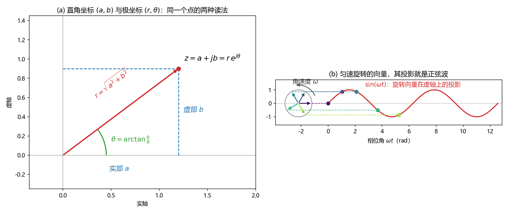

*图 Fig001：(a) 同一个复数 $z=1.2+j0.9$ 的两种坐标读法；(b) 以角速度 $\omega$ 匀速旋转的单位向量，其在虚轴上的投影恰好是 $\sin(\omega t)$，五个彩色时刻在圆上与波形上一一对应。*

关键的一步是让这个点动起来。让一个长度为 $A$ 的向量以角速度 $\omega$ 匀速旋转，初始角度为 $\varphi$，那么它在实轴上的投影就是 $A\cos(\omega n + \varphi)$——正是我们要描述的正弦波（图 Fig001(b) 画的是虚轴投影，对应正弦；实轴投影对应余弦，只差 90°）。于是对应关系建立了：

| 正弦波的参数 | 旋转向量的参数 | 极坐标含义 |
|:---:|:---:|:---:|
| 幅度 $A$ | 向量长度 | 模 $r$ |
| 初相位 $\varphi$ | 起始角度 | 辐角 $\theta$ |
| 频率 $\omega$ | 旋转的角速度 | 辐角随时间的变化率 |

这就回答了第一个问题的"含义"部分：极坐标没有发明新信息，它是把"正弦波的两个自由度"重新安置到了一个几何空间里。在这个空间里：

- 同频正弦波相加 = 向量相加（平行四边形法则，不再需要三角恒等式）；
- 调整音量 = 缩放向量长度；
- 延迟信号 = 旋转向量角度。

最后这条是整个 DSP 里最值钱的直觉，第 4 节还会回来细说。

### 1.4 一个常见的心理障碍

很多人卡在"虚数不存在，怎么能用来描述真实声音"上。换个说法就通了：复平面的纵轴不是什么"虚幻的轴"，它只是第二个维度。正弦波需要两个数来描述，我们就用一个二维的点来装它——"虚部"这个名字是历史包袱，把它读成"纵坐标"就没有任何神秘感了。真正在物理世界里存在的始终只有实轴上的投影；纵轴是记账用的草稿纸，最后交卷时（回到时域）总会把它抹掉（见 2.6 节的负频率）。

---

## 2. 欧拉公式：把旋转变成代数

上一节说"旋转向量"，但旋转是个几何动作，计算机不会转圈，需要把它代数化。做这件事的就是欧拉公式：

$$
e^{j\theta} = \cos\theta + j\sin\theta
$$

但这行公式大概是全文最容易"看懂了但没懂"的地方：$j$ 和 $\theta$ 好像是凭空冒出来的，指数函数又凭什么和三角函数扯上关系？大多数教材用泰勒级数展开两边验证它成立——但验证不等于理解。本节先给 $j$ 和 $\theta$ 各发一张身份证，再解释指数函数为什么会跑到圆上去，最后把常用的变换整理成一本几何词典。

### 2.0 它不是突然冒出来的：从 $a+jb$ 一步步走到 $e^{j\theta}$

先不问欧拉公式怎么证明，只问一个更贴近上下文的问题：为什么要把熟悉的直角坐标形式换成指数形式？也就是，已经有了 $a+jb$，为什么还要把它写成 $e^{j\theta}$？

从你熟悉的直角坐标开始。复数 $z=a+jb$ 对应平面上的点 $(a,b)$。如果这个点到原点的距离是 $r$，与实轴夹角是 $\theta$，根据三角函数的定义：

$$
a=r\cos\theta, \qquad b=r\sin\theta
$$

代回 $z=a+jb$：

$$
z=r\cos\theta+jr\sin\theta
 =r(\cos\theta+j\sin\theta)
$$

到这里完全没有指数函数，只是把同一个点从直角坐标 $(a,b)$ 改写成极坐标 $(r,\theta)$。括号里的

$$
U(\theta)=\cos\theta+j\sin\theta
$$

表示单位圆上角度为 $\theta$ 的点，也可以把它理解为“从实轴正方向出发，逆时针转 $\theta$ 后得到的单位向量”。于是任何复数都可以先写成：

$$
z=rU(\theta)
$$

现在关键来了：看看两个这样的单位向量相乘会发生什么。直接展开，并使用正弦、余弦的和角公式：

$$
\begin{aligned}
U(\alpha)U(\beta)
&=(\cos\alpha+j\sin\alpha)(\cos\beta+j\sin\beta)\\
&=(\cos\alpha\cos\beta-\sin\alpha\sin\beta)
 +j(\sin\alpha\cos\beta+\cos\alpha\sin\beta)\\
&=\cos(\alpha+\beta)+j\sin(\alpha+\beta)\\
&=U(\alpha+\beta)
\end{aligned}
$$

也就是说，这个 $U$ 有一个非常漂亮的性质：

$$
U(\alpha)U(\beta)=U(\alpha+\beta)
$$

左边是乘法，右边是角度相加。几何上就是“先转 $\alpha$，再转 $\beta$，等于一次转 $\alpha+\beta$”。而我们早就认识一种专门把“加法变成乘法”的函数——指数函数：

$$
e^x e^y=e^{x+y}
$$

所以数学家并不是毫无缘由地把一个指数硬塞进来，而是发现：单位圆上的旋转 $U(\theta)$，在运算结构上表现得和指数函数一模一样。角度每增加一点，就相当于继续乘上一个“小旋转”；许多小旋转连续累积，正是指数函数最擅长描述的过程。

为什么指数里还要放一个 $j$，写成 $e^{j\theta}$，而不是 $e^\theta$？因为普通的 $e^\theta$ 描述沿实轴增长或缩小，长度会改变；这里需要的是沿圆周运动，长度保持为 1。观察 $U(\theta)$ 在 $\theta=0$ 附近的变化：

$$
U(0)=1, \qquad U'(0)=j
$$

也就是说，它从点 $1$ 出发，最初的运动方向正是虚轴正方向 $j$；更一般地，每一刻的变化方向都是“当前位置乘 $j$”，即相对当前位置左转 90°。因此 $j$ 不是装饰，而是在告诉指数机器：不要沿半径向外增长，而要沿切线方向旋转。后面的 2.1～2.3 节会把这个运动过程展开。

于是我们给 $U(\theta)$ 换上指数记号：

$$
U(\theta)=e^{j\theta}
$$

再代回前面的 $z=rU(\theta)$，就得到复数最常用的极坐标形式：

$$
\boxed{z=a+jb=r(\cos\theta+j\sin\theta)=re^{j\theta}}
$$

这里三种写法描述的是同一个点、同一根向量：

| 写法 | 强调什么 | 适合做什么 |
|---|---|---|
| $a+jb$ | 横坐标与纵坐标 | 相加、读取实部虚部 |
| $r(\cos\theta+j\sin\theta)$ | 半径与角度的几何来源 | 理解单位圆和投影 |
| $re^{j\theta}$ | 缩放 $r$ 加旋转 $\theta$ | 相乘、连续旋转、分析正弦波 |

例如 $z=1+j\sqrt{3}$，它的模为 $2$、角度为 $\pi/3$，所以：

$$
1+j\sqrt{3}
=2\left(\cos\frac{\pi}{3}+j\sin\frac{\pi}{3}\right)
=2e^{j\pi/3}
$$

这不是把原来的复数“变成了另一种东西”，只是把“横向 1、纵向 $\sqrt{3}$”改读成“长度 2、角度 60°”。

图 Fig012 把这次“换读法”画了出来。左右两幅图的红色向量完全相同，终点也完全相同；左图用横、纵两个分量描述它，右图用长度和角度描述它。因此从 $a+jb$ 走到 $re^{j\theta}$，首先只是换坐标，并没有增加或删除信息。

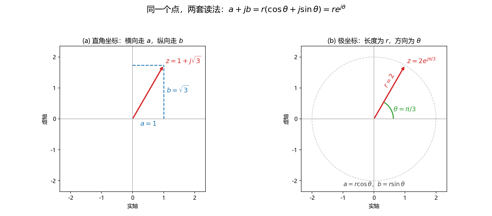

*图 Fig012：同一个复数 $z=1+j\sqrt{3}$ 的两种坐标读法。(a) 直角坐标给出 $a=1$、$b=\sqrt{3}$；(b) 极坐标给出 $r=2$、$\theta=\pi/3$。两种读法满足 $a=r\cos\theta$、$b=r\sin\theta$，所以 $1+j\sqrt{3}=2e^{j\pi/3}$。*

图 Fig013 再把“为什么偏偏使用指数记号”单独画出来。左图展示先旋转 $\alpha$、再乘 $U(\beta)$ 继续旋转 $\beta$；右图对照了旋转函数与指数函数的运算规律。两者都把“参数相加”表现成“结果相乘”，所以 $e^{j\theta}$ 正好是旋转最自然的代数记号。

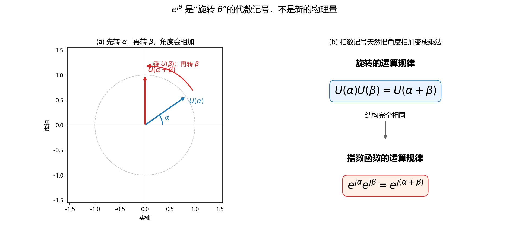

*图 Fig013：旋转乘法与指数记号的对应。(a) $U(\alpha)U(\beta)=U(\alpha+\beta)$，几何含义是先转 $\alpha$ 再转 $\beta$；(b) 指数律 $e^{j\alpha}e^{j\beta}=e^{j(\alpha+\beta)}$ 具有相同结构，因此用 $e^{j\theta}$ 表示旋转后，连续旋转可以直接用普通乘法完成。图中取 $\alpha=35°$、$\beta=55°$。*

如果这个字母公式仍然抽象，就代入一组具体数字：

$$
U(30°)U(45°)=U(75°)
$$

这里最容易误解的地方是：这不是把两根向量相加，也不是把 30° 那根箭头和 45° 那根箭头首尾相接。在复数乘法里，右边的 $U(45°)$ 更像一个“旋转操作”：它作用在 $U(30°)$ 上，把原本朝向 30° 的向量再逆时针旋转 45°，所以结果朝向 75°。两个因子的模都为 1，因此旋转前后长度仍然为 1。

图 Fig015 把几何过程和直角坐标计算放在一起。你可以先只看中图：蓝色向量原本在 30°，乘 $U(45°)$ 后沿绿色弧线转到红色的 75°。如果再看右图，会发现按普通复数乘法算出的结果是 $0.259+j0.966$，而这恰好就是 $(\cos75°,\sin75°)$。

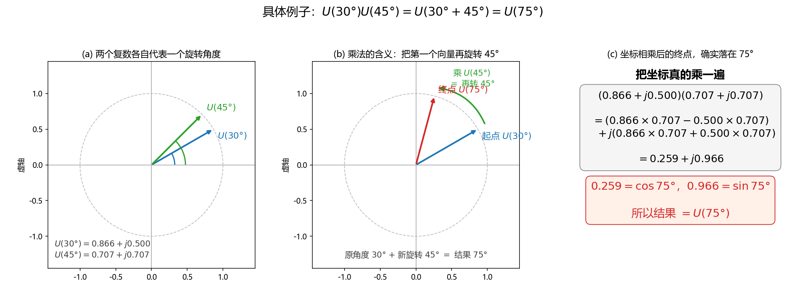

*图 Fig015：$U(30°)U(45°)=U(75°)$ 的具体例子。(a) 两个单位复数分别携带 30° 和 45°；(b) 在乘法中，$U(45°)$ 充当旋转操作，把 $U(30°)$ 再转 45°，得到 $U(75°)$；(c) 直接计算 $(0.866+j0.500)(0.707+j0.707)=0.259+j0.966$，结果正好等于 $\cos75°+j\sin75°$。由于两个模都是 1，乘积的模仍为 1。*

从 DSP 角度看，指数记号真正方便的地方，是它能把“角度随时间不断增加”写得极其紧凑。不过这里容易产生一个误会：似乎我们先有一根复向量，然后莫名其妙地把它“转换成了采样”。实际顺序恰好相反：我们先有一个随时间振动的真实正弦波，再用旋转向量给它建立一个更方便计算的二维模型，最后只在采样时刻读取这个模型在实轴上的投影。

#### 第一步：先从真实的连续时间正弦波出发

假设麦克风接收到一个理想余弦分量：

$$
x(t)=A\cos(\Omega t+\varphi)
$$

这里：

- $A$ 是振幅；
- $\Omega$ 是连续时间角频率，单位为 rad/s；
- $\varphi$ 是 $t=0$ 时的初相位；
- $\Omega t+\varphi$ 是时刻 $t$ 的总相位。

为什么相位写成 $\Omega t+\varphi$？因为 $\Omega$ 表示“每秒增加多少弧度”。经过 $t$ 秒，累计增加的角度就是“角速度乘时间” $\Omega t$；再加上出发时已经具有的初始角度 $\varphi$，总角度便是 $\Omega t+\varphi$。

这和匀速运动中的“位置 = 初始位置 + 速度 × 时间”是同一个结构：

$$
\text{当前角度}=\text{初始角度}+\text{角速度}\times\text{经过时间}
$$

#### 第二步：用旋转向量描述这个正弦波

现在构造一根长度为 $A$、角度为 $\Omega t+\varphi$ 的旋转向量：

$$
z(t)=Ae^{j(\Omega t+\varphi)}
$$

根据欧拉公式：

$$
z(t)=A\cos(\Omega t+\varphi)+jA\sin(\Omega t+\varphi)
$$

因此它的实部正好是原来的真实信号：

$$
x(t)=\operatorname{Re}\{z(t)\}
$$

这里不是说麦克风真的测到了 $z(t)$，也不是说声音先变成复数再被采样。麦克风仍然只测量实数 $x(t)$。$z(t)$ 是分析者额外建立的二维记账模型：实轴投影保存原信号，虚轴分量帮助我们记录旋转方向和相位。

为什么值得多建立一个虚轴？因为只看实数样本，很难直接表达“下一时刻相位前进了多少”；放到复平面后，相位前进就变成了普通的复数乘法。连续时间前进 $\Delta t$ 秒时：

$$
\begin{aligned}
z(t+\Delta t)
&=Ae^{j[\Omega(t+\Delta t)+\varphi]}\\
&=Ae^{j(\Omega t+\varphi)}e^{j\Omega\Delta t}\\
&=z(t)e^{j\Omega\Delta t}
\end{aligned}
$$

也就是说，时间每前进 $\Delta t$，只需把当前复向量乘上 $e^{j\Omega\Delta t}$，就能得到新的位置。这个乘数的模为 1，所以不改变振幅；它的角度为 $\Omega\Delta t$，所以只负责旋转。

#### 第三步：采样只是定时读取实轴投影

数字系统不会读取所有连续时刻，而是每隔 $T_s$ 秒读取一次，其中 $T_s$ 是采样周期，采样率为：

$$
f_s=\frac{1}{T_s}
$$

第 $n$ 个采样发生在：

$$
t_n=nT_s
$$

把这个采样时刻代入连续信号：

$$
\begin{aligned}
x[n]
&=x(nT_s)\\
&=A\cos(\Omega nT_s+\varphi)
\end{aligned}
$$

定义离散时间角频率：

$$
\omega=\Omega T_s=2\pi\frac{f}{f_s}
$$

它的单位是 rad/sample，含义是“每前进一个采样，旋转多少弧度”。于是：

$$
x[n]=A\cos(\omega n+\varphi)
$$

对应的复数记账形式就是：

$$
z[n]=Ae^{j(\omega n+\varphi)}
$$

注意，$n$ 只是整数采样序号，不是角度。真正的角度是 $\omega n+\varphi$：从第 0 个采样走到第 $n$ 个采样，一共前进了 $n$ 步；每一步转 $\omega$，所以累计旋转 $n\omega$，再加初始角度 $\varphi$。

相邻采样之间满足：

$$
z[n+1]=e^{j\omega}z[n]
$$

推导也很直接：

$$
\begin{aligned}
z[n+1]
&=Ae^{j[\omega(n+1)+\varphi]}\\
&=Ae^{j(\omega n+\varphi)}e^{j\omega}\\
&=e^{j\omega}z[n]
\end{aligned}
$$

这句话的含义非常具体：每前进一个采样，就执行一次固定角度的旋转。代数上是乘一次 $e^{j\omega}$，几何上是再旋转 $\omega$。它在实轴上的投影是实际可见的余弦信号：

$$
\operatorname{Re}\{z[n]\}=A\cos(\omega n+\varphi)
$$

#### 一个具体的 8 点采样例子

假设：

$$
A=1,\qquad \omega=\frac{\pi}{4},\qquad \varphi=0
$$

这表示初始向量从实轴正方向出发，每个采样逆时针旋转 $\pi/4$，也就是 45°。前八个采样如下：

| 采样序号 $n$ | 向量角度 $\omega n$ | 复向量 $z[n]$ | 实际实数采样 $x[n]=\operatorname{Re}\{z[n]\}$ |
|:---:|:---:|:---:|:---:|
| 0 | 0° | $1+j0$ | $1$ |
| 1 | 45° | $0.707+j0.707$ | $0.707$ |
| 2 | 90° | $0+j1$ | $0$ |
| 3 | 135° | $-0.707+j0.707$ | $-0.707$ |
| 4 | 180° | $-1+j0$ | $-1$ |
| 5 | 225° | $-0.707-j0.707$ | $-0.707$ |
| 6 | 270° | $0-j1$ | $0$ |
| 7 | 315° | $0.707-j0.707$ | $0.707$ |

从复平面看，这八个 $z[n]$ 是单位圆上依次前进 45° 的八个点；从真实采样看，只保留每个点的横坐标，得到：

$$
x[n]=\left[1,\ 0.707,\ 0,\ -0.707,\ -1,\ -0.707,\ 0,\ 0.707\right]
$$

这正好是一个周期余弦波的八个等间隔采样。所谓“用旋转向量表示采样信号”，不是把复向量送进 ADC，而是用圆周运动解释这些余弦样本为什么按这样的顺序出现。

#### 为什么 DSP 偏爱这种写法

如果只写余弦，每次处理相位变化都要使用三角恒等式；用复指数时，许多操作直接变成乘法：

| 信号操作 | 复指数中的写法 | 几何含义 |
|---|---|---|
| 前进一个采样 | 乘 $e^{j\omega}$ | 旋转 $\omega$ |
| 增加初相位 $\phi$ | 乘 $e^{j\phi}$ | 整体旋转 $\phi$ |
| 振幅变为原来的 $G$ 倍 | 乘实数 $G$ | 长度缩放 $G$ 倍 |
| 延迟 $n_0$ 个采样 | 乘 $e^{-j\omega n_0}$ | 相位向后旋转 $\omega n_0$ |

因此我们这样做不是因为真实信号必须是复数，而是因为复指数把“正弦波随时间推进”改写成“反复乘同一个旋转因子”。对于计算机和后面的 DFT、滤波器分析来说，这种写法比反复展开正弦、余弦公式省事得多。

图 Fig014 把这句话按采样点逐个展开。左图中的编号 0～7 是连续八个采样时刻：每走一步，复向量就在单位圆上旋转固定角度 $\omega$；右图只读取每根向量的横坐标，得到的八个数就组成了一段余弦序列。也就是说，复指数保存的是完整的“转圈过程”，实数音频保存的是这个过程在实轴上的“影子”。

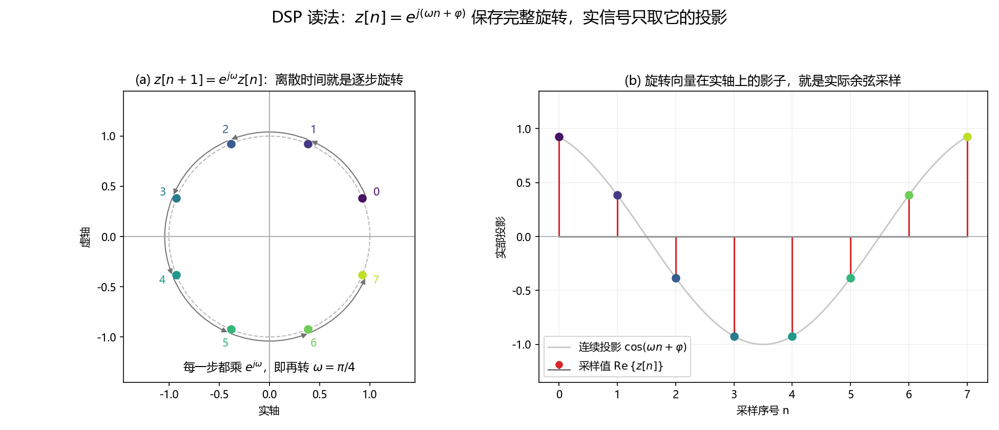

*图 Fig014：复指数的离散时间读法。参数取 $A=1$、$\omega=\pi/4$ rad/sample、$\varphi=\pi/8$；(a) 相邻采样满足 $z[n+1]=e^{j\omega}z[n]$，因此每步固定旋转 45°；(b) 取每个复向量的实部，得到 $\cos(\omega n+\varphi)$ 的离散采样。左右两图中相同颜色表示同一个采样时刻。*

所以在 DSP 里，$e^{j\theta}$ 不是从天而降的新物理量，而是给“旋转了 $\theta$ 的单位向量”取的一个特别好算的名字；$e^{j\omega n}$ 则是给“每个采样都转 $\omega$ 的旋转向量”取的名字。DFT/FFT 后面要做的，正是拿许多不同转速的 $e^{-j\omega_k n}$ 去检测输入信号里有多少对应的旋转成分。

### 2.1 先给 $j$ 发身份证：乘 $j$ = 逆时针转 90°

先忘掉"虚数单位"这个名字，只看乘法效果：

| 运算 | 结果 | 几何效果 |
|:---:|:---:|---|
| $1 \times j$ | $j$ | 点 $(1,0)$ 转到 $(0,1)$ —— 逆时针 90° |
| $j \times j$ | $-1$ | 点 $(0,1)$ 转到 $(-1,0)$ —— 又 90° |
| $-1 \times j$ | $-j$ | 再 90°，到 $(0,-1)$ |
| $-j \times j$ | $1$ | 再 90°，转满一圈回到起点 |

看出来了吗：乘以虚数单位，就是逆时针旋转 90°。这里的虚数单位是 $j$。而 $j^2 = -1$ 这个看起来神秘的定义，几何上完全平凡——转两次 90° 就是转 180°，而转 180° 恰好就是"取相反数"。这不是 1、$j$、$-1$、$-j$ 四个特殊点的巧合：对任意 $z = a + jb$，

$$
j \cdot (a + jb) = ja + j^2 b = -b + ja
$$

横纵坐标互换并变号——这正是平面解析几何里"把向量逆时针转 90°"的标准操作，长度不变，方向左转一个直角：

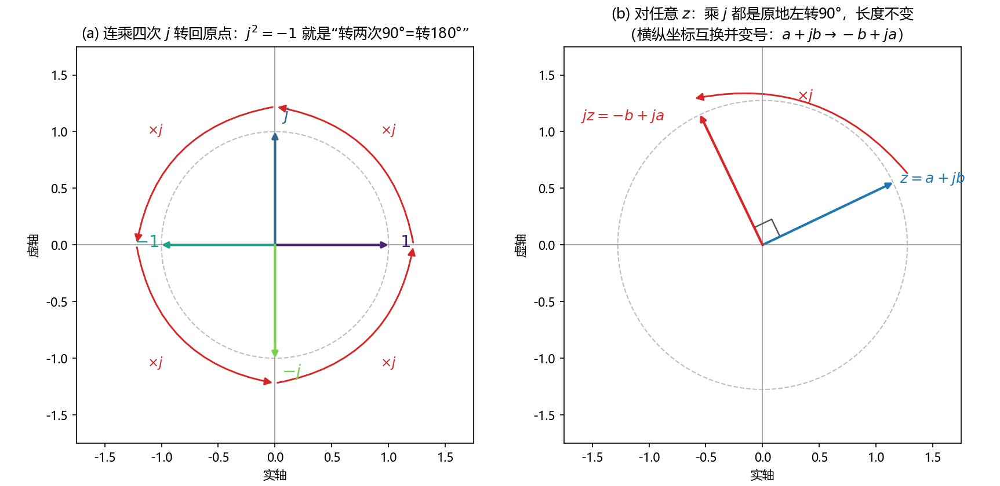

*图 Fig009：(a) 从 1 出发连乘四次 $j$，每次逆时针转 90°，转满一圈回到原点——$j^2=-1$ 只是"转两次 90° 等于转 180°"；(b) 对任意 $z=a+jb$，乘 $j$ 得 $-b+ja$：横纵坐标互换并变号，效果是原地左转 90°、长度不变。*

所以 $j$ 根本不是被"发明"出来的怪数，它是平面旋转在代数里的名字。当年数学家确实是从"$x^2=-1$ 有没有解"这条纯代数的路撞进来的，但工程上真正让它站稳脚跟的，是这个旋转读法。

### 2.2 再看等号右边：$\cos\theta + j\sin\theta$ 只是圆上一个点

$\theta$ 也不是新东西，它就是单位圆上的角度。角度为 $\theta$ 的那个点，横坐标是 $\cos\theta$，纵坐标是 $\sin\theta$——这是三角函数在单位圆上的定义本身。按第 1 节的写法把这对坐标装进一个复数：

$$
\underbrace{\cos\theta}_{\text{横坐标}} + j\cdot\underbrace{\sin\theta}_{\text{纵坐标}}
$$

所以欧拉公式的右边没有任何新内容：它就是"单位圆上角度为 $\theta$ 的点"的坐标写法。真正需要解释的是左边——凭什么指数函数 $e^{j\theta}$ 会等于这个点？

### 2.3 等号左边才是谜底：$e$ 管"怎么动"，$j$ 管"往哪动"

回忆 $e$ 的本性。$e^{at}$ 之所以特殊，是因为它满足：

$$
\frac{d}{dt}e^{at} = a \cdot e^{at}
\qquad\text{即}\qquad
\textbf{速度} = a \times \textbf{当前位置}
$$

- 当 $a$ 是正实数：速度和位置同方向，位置越大跑得越快——沿实轴指数爆炸，这是"利滚利"；
- 当 $a = j$：速度 = $j\times$位置 = 把位置向量转 90°（2.1 节的结论！）——也就是说，速度永远垂直于位置。

现在问一个纯物理问题：一个质点，速度始终垂直于它到原点的连线，速度大小始终等于连线长度，它走出什么轨迹？答案是匀速圆周运动。速度垂直于半径，意味着它永远不靠近也不远离原点——半径锁死，只能绕圈。从 $\theta=0$ 时的起点 $e^{0}=1$（即点 $(1,0)$）出发，以单位角速度转过角度 $\theta$ 之后，它在哪？在单位圆上角度为 $\theta$ 的位置，坐标 $(\cos\theta, \sin\theta)$。这就是欧拉公式：左边讲过程（"从 1 出发，速度永远是位置转 90°，走了 $\theta$ 这么久"），右边讲结果（"单位圆上角度 $\theta$ 处的点"），两边描述的是同一个点。

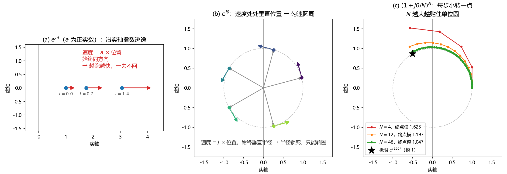

*图 Fig010：$e$ 的两种跑法。(a) 实指数 $e^{at}$：速度与位置同向，沿实轴越跑越快；(b) $e^{j\theta}$：速度 $= j\times$位置，处处垂直半径，于是半径锁死、只能匀速转圈；(c) 用 $(1+j\theta/N)^N$ 逼近 $e^{j\,120°}$：每一步都小转一点并微微向外偏，$N$ 从 4 增到 48 时终点的模从 1.623 收敛到 1.047，极限恰好落在单位圆上。*

如果嫌导数抽象，用 $e$ 的极限定义也能看到同一件事：

$$
e^{j\theta} = \lim_{N\to\infty}\left(1 + \frac{j\theta}{N}\right)^{N}
$$

括号里的 $1 + \frac{j\theta}{N}$ 是"自己（$\times 1$）加上一点点垂直方向的分量"。乘一次它，就相当于把向量沿切线方向推一小步——转一个约 $\frac{\theta}{N}$ 的小角度。连乘 $N$ 次，小角度累积成 $\theta$；$N\to\infty$ 时每一步的"向外偏移"趋于零，轨迹严丝合缝地贴在圆上（图 Fig010(c) 里三条折线的收敛过程）。指数函数的连乘本性，加上虚数单位的旋转本性，结果就是转圈。这里的虚数单位仍然是 $j$。

现在可以给三个符号各发一张身份证了：

| 符号 | 它是什么 | 它管什么 |
|:---:|---|---|
| $e$ | "速度正比于当前位置"的连乘机器 | 让运动连续累积 |
| $j$ | "逆时针转 90°"的代数名字 | 方向：把"沿自己方向跑"（爆炸）扫成"垂直自己方向跑"（转圈） |
| $\theta$ | 转过的角度（也是单位圆上走过的弧长） | 进度：转到哪儿了 |

所以 $e^{j\theta}$ 应该整体读成一句话：“以旋转的方式，行进指定的角度”。这个指定角度就是 $\theta$。它不是三个符号的神秘堆叠，而是一台机器（$e$，连乘机）装上了一个方向盘（$j$，始终打 90°），跑了 $\theta$ 的里程。

### 2.4 一本随身几何词典：常见的变换

欧拉公式一旦站稳，指数律立刻把一批常用变换全部变成几何动作。根基是这一条：

$$
e^{j\theta_1} \cdot e^{j\theta_2} = e^{j(\theta_1 + \theta_2)}
$$

乘法 = 角度相加 = 旋转。在 2.3 节的图像里这是显然的："先转 $\theta_1$ 再转 $\theta_2$"当然等于"转 $\theta_1+\theta_2$"。由它派生出的常用条目，整理成一张词典表：

| 代数写法 | 几何动作 | 备注 |
|---|---|---|
| 乘 $e^{j\varphi}$ | 逆时针旋转 $\varphi$，长度不变 | 纯旋转 |
| 乘 $e^{-j\varphi}$ | 顺时针旋转 $\varphi$ | 指数上的负号 = 反方向 |
| 乘 $j$ | 逆时针转 90° | $j = e^{j\pi/2}$ 的特例 |
| 乘 $-1$ | 转 180° | $e^{j\pi} = -1$，欧拉恒等式 |
| 乘 $M = \|M\|e^{j\theta_M}$ | 缩放 $\|M\|$ 倍并旋转 $\theta_M$，一步完成 | $MX = \|M\|\|X\|\,e^{j(\angle X + \theta_M)}$，模相乘、角相加 |
| 取共轭 $z^*$ | 关于实轴翻镜像 | $re^{j\theta} \to re^{-j\theta}$，即反向旋转 |
| $z\,z^*$ | 得 $\|z\|^2$ | 正反旋转抵消，只剩长度平方 |
| $(e^{j\theta})^n = e^{jn\theta}$ | 转 $n$ 次 $\theta$ = 转 $n\theta$ | 棣莫弗定理 |

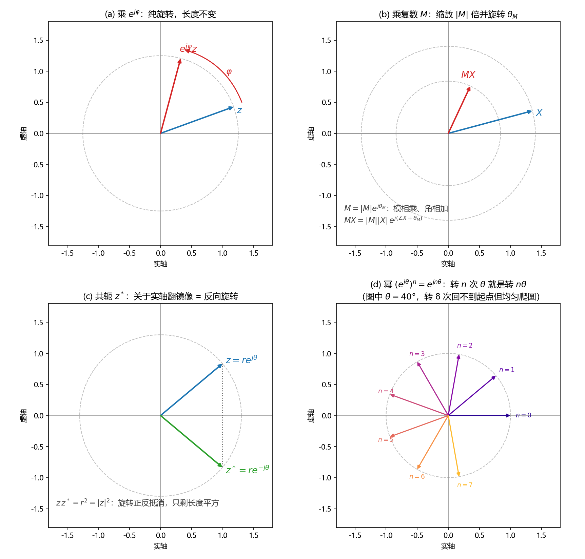

*图 Fig011：词典里最常用的四条。(a) 乘 $e^{j\varphi}$ 是纯旋转；(b) 乘复数 $M$ 是缩放加旋转一步完成；(c) 共轭是关于实轴的镜像，$zz^*$ 只剩长度平方；(d) 幂运算沿圆周均匀爬行（棣莫弗定理）。*

这本词典后文会反复翻：第 3 节 DFT 的模板 $e^{-j2\pi kn/N}$ 就是"反向旋转"那一条；第 4 节的共轭对称就是"镜像"那一条；5.4 节降噪例子里的复数掩码，就是"乘 $M$"那一条。

### 2.5 $e^{j\omega t}$ 是一根螺旋线

把角度换成随时间匀速增长的 $\omega t$，$e^{j\omega t}$ 就是那个旋转向量本身。如果把时间摊开成第三个轴，它是一根螺旋线，而 $\cos$ 和 $\sin$ 是这根螺旋线投在两面墙上的影子，如图 Fig002(a)：

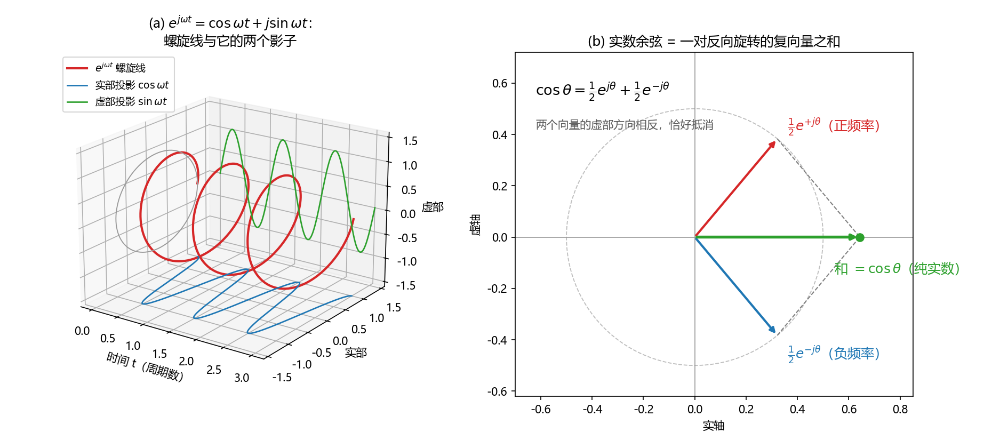

*图 Fig002：(a) $e^{j\omega t}$ 在（时间, 实部, 虚部）空间中是螺旋线，实部投影为余弦、虚部投影为正弦；(b) $\cos\theta = \frac{1}{2}e^{j\theta} + \frac{1}{2}e^{-j\theta}$，一对反向旋转的向量，虚部时时刻刻互相抵消，和始终落在实轴上。*

这张图值得多看一会儿，因为它把"实部虚部"和"正弦余弦"的关系一次性画完了：复指数是完整的旋转，实信号只是它的一个影子。只看影子会丢信息——你看到影子在某处过零，无法区分向量是转到了 90° 还是 270°。这就是为什么"从实信号恢复完整旋转"会成为一个专门的问题（第 5 节的解析信号）。

### 2.6 负频率：让影子成立的记账项

反过来，用两个复指数可以拼出一个纯实的余弦：

$$
\cos\theta = \frac{e^{j\theta} + e^{-j\theta}}{2}
$$

几何图像见图 Fig002(b)：一个向量逆时针转（正频率 $+\omega$），一个顺时针转（负频率 $-\omega$），两者虚部大小相等方向相反，随时抵消，和永远落在实轴上。

负频率不是一种物理振动，它是"信号必须是实数"这个约束在复数记账系统里的体现。每一个真实的正弦成分，在复频谱里都记成 $\pm\omega$ 两笔，各记一半。这一笔账在第 4 节会长成共轭对称性，在第 5 节会成为解析信号要"删掉"的那一半。三个概念其实是同一件事。

### 2.7 顺便：为什么工程界离不开 $e^{j\omega}$

除了旋转的代数化，复指数还有一条工程上的硬通货性质：它是线性时不变（LTI）系统的特征函数。一个正弦进 LTI 系统，出来还是同频正弦，只改幅度和相位——用复数说，就是输出等于输入乘一个复常数 $H(\omega)$。滤波器的频率响应、传递函数、卷积定理，全部建立在这条性质上。用 $\cos/\sin$ 也能推，但每一步都要拆三角函数；用 $e^{j\omega}$，卷积直接变乘法。这不是数学审美问题，是几十年工程实践选出来的最省事的记号系统。

---

## 3. DFT/FFT 到底在做什么，实部和虚部从哪里来

### 3.0 前置回顾：DFT 完整速览

这一节是给"会调用 FFT、但公式和含义已经模糊"的读者的全景速查：DFT 是什么、公式怎么读、输出怎么理解、有哪些性质、工程上要注意什么，一口气全部过一遍。如果只允许记住一句话，那就是：**DFT 把"一段波形"翻译成"一张频率清单"，清单上的每一项是一个复数**。本节回答"是什么"，3.1 节起再回答"为什么"。

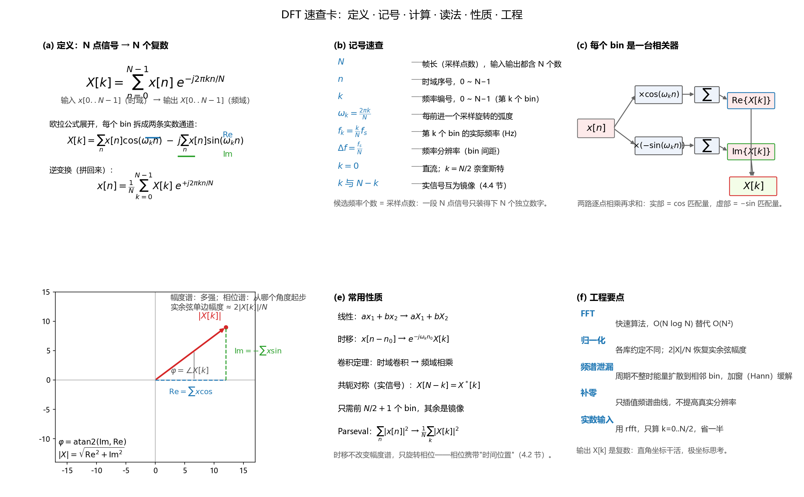

*图 Fig020：DFT 速查卡。(a) 定义公式；(b) 记号；(c) 一个 bin 的内部计算；(d) 复数读法；(e) 常用性质；(f) 工程要点。本节六个小节与这六块一一对应。*

#### 3.0.1 定义：一段 N 点信号换来 N 个复数

DFT（离散傅里叶变换）把一段有限长的离散信号换成另一组数：

$$
X[k]=\sum_{n=0}^{N-1}x[n]\,e^{-j2\pi kn/N}, \qquad k=0,1,\dots,N-1
$$

输入 $x[0],x[1],\dots,x[N-1]$ 按采样序号排列，称为时域数据；输出 $X[0],X[1],\dots,X[N-1]$ 按候选频率排列，称为频域数据。第 $k$ 个输出可以这样读：把输入逐点乘上"转速为 $k$"的复指数模板，再全部求和——输入里该频率的成分越多、相位与模板越一致，结果就越大（3.5 节）。

逆变换把清单原样拼回波形：

$$
x[n]=\frac{1}{N}\sum_{k=0}^{N-1}X[k]\,e^{+j2\pi kn/N}
$$

注意正变换用 $-j$、逆变换用 $+j$。正逆变换互为精确往返：任何 $N$ 点序列都拆得开、也拼得回，不丢信息——这件事能够成立，靠的是 3.1 节说的"傅里叶断言"。

#### 3.0.2 记号与频率含义

| 符号 | 含义 |
|---|---|
| $N$ | 一帧的采样点数（输入、输出都含 $N$ 个数） |
| $n$ | 时域序号，$0$ 到 $N-1$ |
| $k$ | 频率编号，$0$ 到 $N-1$；第 $k$ 个 bin 即第 $k$ 个候选频率 |
| $\omega_k=2\pi k/N$ | 该候选频率每前进一个采样旋转的弧度 |
| $f_k=k\,f_s/N$ | 该 bin 对应的实际频率（Hz） |
| $\Delta f=f_s/N$ | 频率分辨率，两个相邻 bin 的频率间隔 |

要点：候选频率个数 = 采样点数。$k=0$ 是直流（信号的均值），$k=N/2$ 是奈奎斯特频率；对实数信号，$k$ 与 $N-k$ 的 bin 互为镜像，只有约一半独立（4.4 节）。例：$N=32$、$f_s=16000$ Hz 时 $\Delta f=500$ Hz，$k=3$ 对应 1500 Hz。更完整的记号讨论见 3.4 节。

#### 3.0.3 计算流程：每个 bin 是一台相关器

用欧拉公式把复指数模板拆成两条实数通道（图 Fig020(c)）：

$$
X[k]=\sum_n x[n]\cos(\omega_k n)-j\sum_n x[n]\sin(\omega_k n)
$$

于是：

$$
\operatorname{Re}\{X[k]\}=\sum_n x[n]\cos(\omega_k n), \qquad
\operatorname{Im}\{X[k]\}=-\sum_n x[n]\sin(\omega_k n)
$$

实部是"输入与余弦模板的匹配量"，虚部是"输入与正弦模板的匹配量"。为什么一定要两条模板？因为单条模板测不出相位：输入是正弦、模板是余弦时，两者同频但正交，逐点乘积相加恒为零，会误判"这个频率不存在"。两条正交模板各测一个坐标，正好确定复平面上的一个点——这就是"为什么输出是复数"的答案（3.6–3.7 节）。

#### 3.0.4 读法：一个复数，两种读法

每个 $X[k]$ 可以按直角坐标读，也可以按极坐标读（第 1 节的语言在这里兑现）：

$$
|X[k]|=\sqrt{\operatorname{Re}\{X[k]\}^2+\operatorname{Im}\{X[k]\}^2}, \qquad
\angle X[k]=\operatorname{atan2}\big(\operatorname{Im}\{X[k]\},\ \operatorname{Re}\{X[k]\}\big)
$$

- 幅度谱 $|X[k]|$ 回答"这个频率有多强"；
- 相位谱 $\angle X[k]$ 回答"这个频率从哪个角度起步"。

归一化提醒：相关求和会随点数 $N$ 累积，恢复实余弦的单边幅度要乘 $2/N$（3.8 节）；不同 FFT 库对归一化的约定不同，比较数值前先查文档。

#### 3.0.5 常用性质速查

| 性质 | 表述 | 一句话用途 |
|---|---|---|
| 线性 | $a x_1+b x_2$ 的 DFT 是 $a X_1+b X_2$ | 混合信号的频谱可分开算 |
| 时移 | $x[n-n_0]$ 的 DFT 是 $e^{-j\omega_k n_0}X[k]$ | 延迟只旋转相位，幅度谱不动（4.2 节） |
| 卷积定理 | 时域卷积对应频域相乘 | 滤波可以在频域做乘法 |
| 共轭对称 | 实信号满足 $X[N-k]=X^*[k]$ | 只需存一半频谱（4.4 节） |
| Parseval | $\sum_n|x[n]|^2=\frac{1}{N}\sum_k|X[k]|^2$ | 能量守恒的频域写法 |

#### 3.0.6 工程要点

- **FFT**：DFT 的快速算法，把复杂度从 $O(N^2)$ 降到 $O(N\log N)$；平时调用 FFT 库拿到的就是 DFT 定义的结果（3.2 节）。
- **rfft**：输入是实数时只需算 $k=0..N/2$ 共 $N/2+1$ 个 bin，存储和算力各省一半。
- **频谱泄漏**：信号周期与帧长不整时，能量会扩散到相邻 bin，谱线变钝；加窗（Hann 等）减轻泄漏，代价是主瓣变宽。
- **补零**：帧尾补零再做 FFT，只让频谱曲线更平滑（插值），不提高真实分辨率——分辨率由 $\Delta f=f_s/N$ 决定。
- **归一化差异**：numpy / scipy / MATLAB 的 FFT 输出可能差一个常数因子，跨库比较前先对齐约定。

#### 3.0.7 读完回顾之后

速查只给了"是什么"。想追"为什么"——为什么波形一定能拆成频率清单（3.1–3.3）、为什么是两条模板而不是一条（3.5–3.6）、又为什么打包成复数（3.6–3.7）、读数和工程上还有哪些坑（3.8–3.10）——继续往下读即可；第 4、5 章在频谱之上讲共轭对称与解析信号。

### 3.1 它不是突然冒出来的：从"一根旋转向量"到"一排旋转向量"

第 2 节结尾留了一句话：DFT/FFT 后面要做的，"正是拿许多不同转速的 $e^{-j\omega_k n}$ 去检测输入信号里有多少对应的旋转成分"。本章就把这句话展开成一个完整的问题，并一步步回答它。在进入公式之前，先交代三个背景：前两章解决了什么、我们为什么非要把信号拆开、以及"拆成正弦"这件事凭什么可行。

**前两章解决的是"一根正弦"的问题**。第 1、2 节的语言始终是单数：一段音频被想象成一根旋转向量，幅度是它的长度，相位是它的角度，延迟就是旋转一下。这套语言处理"我已经知道信号就是一根正弦"的情况很舒服，但它有一个隐含前提——你手上得先有一根正弦。真实音频从来不是：鼓点、人声、和弦，随便截 0.1 秒都是几十个频率叠加的结果。多个正弦相加时，每根旋转向量在实轴上的投影各自叠加，得到的波形不再"像"任何一根正弦——图 Fig016(c) 就是两个余弦相加后的样子，光看波形已经读不出成分。这时"这段信号是什么频率"就不再是一个有效的问题：答案不是一个频率，而是一组频率。

**目的：我们为什么非要把混合信号拆开**。频率内容人耳听得出来，时域波形却看不出来；更要紧的是，一大批音频处理操作在时域里根本无从下手：想掐掉 500 Hz 的哼声、想把某个乐器的部分单独挑出来、想按频率做动态压缩——这些命令都无法直接下达给一列混合的采样点。它们的共同前提是先把混合拆开：弄清每个频率各有多少、相位如何，改完再重新拼回去。这就是"分解"这个需求的来源，也正是本章要解决的问题。

**发展："拆成正弦"凭什么可行——傅里叶的断言**。把任意波形"拆成正弦"听上去是个合理的愿望，但它不是自明的：凭什么所有波形都能这样拆？两百多年前傅里叶把它变成了一个可检验的数学命题，后来被证明为真——任何有限长的离散信号，都可以**精确**地写成一串固定频率的复指数之和。注意是精确：不是近似、不是拟合，而是分毫不差的等式（逆变换原样把它们拼回来）。因此"频率清单"不是比喻，而是一个定义良好的数学问题：清单上的候选频率是固定的，剩下的全部工作就是逐个回答"信号里含有多少这个频率"。清单的长度也由信号自己决定：一段 $N$ 点的采样最多只能携带 $N$ 个独立数字的信息，装不下无限多个频率，所以候选频率恰好就是 $N$ 个——$k=0,1,\dots,N-1$。DFT 不创造新信息，它只是把这 $N$ 个数字从"按时间排列"改写成"按频率排列"（对实数信号，这 $N$ 格还有一半是镜像重复，见 4.4 节）。

**本章的三步走**。把上面的话再压缩成三个递进的问题，后面每一节都在填它们：

1. **动机**（要回答什么）：输入是一段混合波形，输出是一份"频率清单"——对每个候选频率回答"有没有、多强、什么相位"（§3.3）；
2. **方法**（怎么回答）：拿模板去和信号"对暗号"——逐点相乘再求和（相关），像得像，结果就大（§3.5–3.6）；
3. **实部和虚部的来源**（为什么输出是复数）：一条模板会漏掉相位信息，必须用 cos/sin 两条正交模板各测一个坐标；两个坐标打包成一个复数，实部是 cos 模板的匹配量，虚部是 sin 模板的匹配量（§3.7–3.9）。

路线图：§3.2 先分清 DFT 和 FFT 两个名字 → §3.3 明确动机 → §3.4 认识记号 → §3.5–3.6 从一条模板走到两条模板 → §3.7–3.8 看它如何变成一个复数 → §3.9 读最终答案 → §3.10 扫清误解。

### 3.2 先区分 DFT 和 FFT

DFT 是 Discrete Fourier Transform，中文叫离散傅里叶变换。它是一条数学定义，规定如何把一段有限长的离散采样：

$$
x[0],x[1],\ldots,x[N-1]
$$

转换成另一组数：

$$
X[0],X[1],\ldots,X[N-1]
$$

输入 $x[n]$ 按采样序号排列，通常称为时域数据；输出 $X[k]$ 按候选频率排列，通常称为频域数据。

FFT 是 Fast Fourier Transform，中文叫快速傅里叶变换。它不是另一种变换，而是快速计算 DFT 的算法。可以类比为：DFT 是“要算什么”，FFT 是“怎样更快算出来”。平时调用 FFT 库，得到的结果就是 DFT 定义的 $X[k]$。

### 3.3 DFT 的目的：把混合波形整理成频率清单

如果输入只有一个纯余弦，频率很容易从波形上看出来。但真实音频是许多频率相加的结果。在时域中，这些成分叠在一起，波形可能非常复杂；DFT 的目的就是把混合结果重新拆成一张清单：第 0 个候选频率有多少、第 1 个候选频率有多少，一直检查到这一帧能够表示的最高频率。

注意"清单"这个词要读全：一份完整的清单不只是"有哪些频率"，还包括"每个频率多强"和"每个频率什么相位"——这正是第 1 节里正弦波的两个自由度 $(A, \varphi)$。如果只回答"有没有"，那就丢掉了一半信息。

图 Fig016 使用两个余弦相加的例子。一个成分在 32 个采样内转 3 圈，另一个转 7 圈。相加后的时域波形已经不容易直接读出成分，而 DFT 输出会在 $k=3$ 和 $k=7$ 处给出两个明显结果。

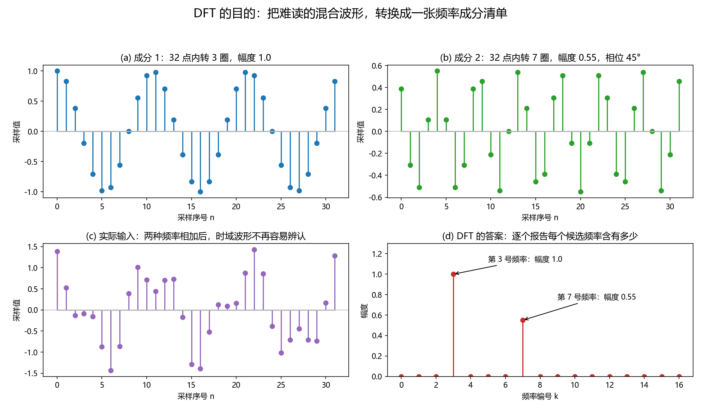

*图 Fig016：DFT 的输入与输出。(a) 幅度为 1、在 32 点内完成 3 个周期的余弦；(b) 幅度为 0.55、在 32 点内完成 7 个周期且初相位为 45° 的余弦；(c) 两者相加后的时域采样；(d) DFT 将混合波形转换为频率清单，在 $k=3$ 和 $k=7$ 处恢复两个成分。该图使用无噪声、频率恰好落在 DFT 格点上的教学示例。*

### 3.4 $N$、$n$、$k$ 和 bin 分别是什么意思

| 符号 | 含义 |
|---|---|
| $N$ | 这一帧一共有多少个采样点 |
| $n$ | 输入采样的序号，范围为 $0$ 到 $N-1$ |
| $k$ | DFT 要检查的频率编号，范围也为 $0$ 到 $N-1$ |
| bin | frequency bin 的简称，即一个离散频率格子；第 $k$ 个 bin 就是第 $k$ 个候选频率 |

第 $k$ 个候选频率的离散角频率为：

$$
\omega_k=\frac{2\pi k}{N}
$$

它表示每前进一个采样，旋转 $2\pi k/N$ 弧度。走完 $N$ 个采样后，总角度是 $2\pi k$，也就是恰好转 $k$ 个完整圆。因此 $k=0$ 是直流，$k=1$ 表示在 $N$ 点内转 1 圈，$k=3$ 表示转 3 圈。

如果采样率是 $f_s$，第 $k$ 个 bin 对应的实际频率为：

$$
f_k=\frac{k}{N}f_s
$$

例如 $N=32$、$f_s=16000$ Hz 时，每个 bin 相隔 500 Hz，所以 $k=3$ 对应 1500 Hz，$k=7$ 对应 3500 Hz。

### 3.5 DFT 怎样检查某个频率：拿模板去匹配

假设想知道输入中有没有 $k=3$。最直接的办法是生成一条 $k=3$ 的标准余弦作为测试模板，然后让输入与模板逐点相乘，最后把所有乘积加起来。这个过程称为相关，这里可以先把它理解为相似度检测。

输入和模板同频、同相时，波峰对波峰、波谷对波谷，大量乘积为正，求和后得到较大的数。频率不同时，乘积一会儿为正、一会儿为负，求和时大体抵消，结果接近零。

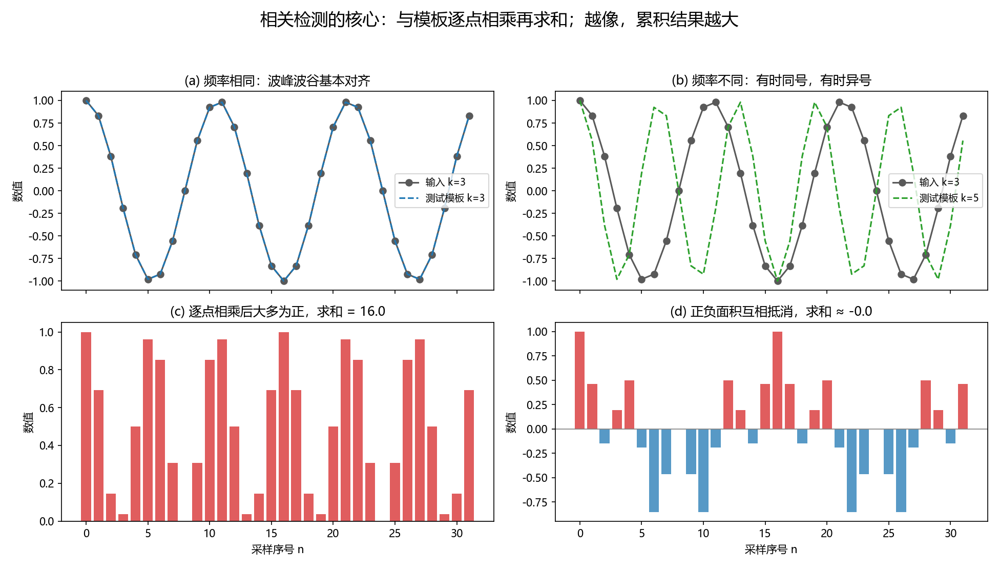

*图 Fig017：相关检测的基本原理。输入为 32 点内完成 3 个周期的余弦。(a)(c) 使用同频的 $k=3$ 模板，逐点乘积大多同号，求和得到 16；(b)(d) 使用异频的 $k=5$ 模板，逐点乘积正负交替，完整观察区间内求和为 0。真实信号不一定得到严格的 0，但匹配频率通常会产生更强的累积结果。*

所以可以想象 DFT 内部放着一排检测器：第 0 个检测器检查 $k=0$，第 1 个检查 $k=1$，一直检查到所有候选频率。这就是"DFT 是一排相关器"的含义。

但只拿一条模板当检测器，马上会撞上一个尴尬的问题——见下一节。

### 3.6 为什么只用一条余弦模板还不够

频率相同，并不代表相位一定相同。假设输入是 $\sin(\omega_k n)$，检测模板是 $\cos(\omega_k n)$。它们虽然频率完全相同，但在完整周期内满足：

$$
\sum_n \sin(\omega_k n)\cos(\omega_k n)=0
$$

如果只看余弦相关器，就会错误地判断"这个频率不存在"。问题不在频率，而在输入相对余弦模板错开了 90°。

因此每个频率必须准备两条模板：

$$
\cos(\omega_k n),\qquad \sin(\omega_k n)
$$

任意初相位的同频正弦波都能拆成这两个模板的组合：

$$
A\cos(\omega_k n+\varphi)
=A\cos\varphi\cos(\omega_k n)
-A\sin\varphi\sin(\omega_k n)
$$

两个相关结果分别回答输入中有多少与余弦模板同相的部分，以及有多少与正弦模板正交的部分。这和前两章的复平面完全相同：一个坐标只能描述一条轴，两个坐标才能确定平面上的一个点。

到这里路径已经走到一半：**每个候选频率要交回两个数**（cos 匹配量和 sin 匹配量）。下一节回答最后一问：这两个数是怎么被装进一个复数里的。

### 3.7 为什么使用复指数，又为什么按欧拉公式拆开

现在才来看 DFT 定义：

$$
X[k]=\sum_{n=0}^{N-1}x[n]e^{-j2\pi kn/N}
$$

其中 $e^{-j2\pi kn/N}$ 是第 $k$ 个频率的测试模板。根据欧拉公式：

$$
e^{-j\theta}=\cos\theta-j\sin\theta
$$

DFT 不是先选了一条神秘的复数公式，后来才强行拆开。恰恰相反：我们本来就需要余弦和正弦两条正交模板，而欧拉公式正好能把它们打包成一个复指数：

$$
e^{-j\omega_k n}=\cos(\omega_k n)-j\sin(\omega_k n)
$$

代回 DFT，再利用求和分配律：

$$
\begin{aligned}
X[k]
&=\sum_n x[n]\left(\cos\omega_k n-j\sin\omega_k n\right)\\
&=\sum_n x[n]\cos\omega_k n-j\sum_n x[n]\sin\omega_k n
\end{aligned}
$$

因此：

$$
\operatorname{Re}\{X[k]\}=\sum_n x[n]\cos(\omega_k n)
$$

$$
\operatorname{Im}\{X[k]\}=-\sum_n x[n]\sin(\omega_k n)
$$

按欧拉公式拆开，是为了直接看见复指数模板内部的两条实数检测通道：实部保存余弦相关结果，虚部保存负正弦相关结果。

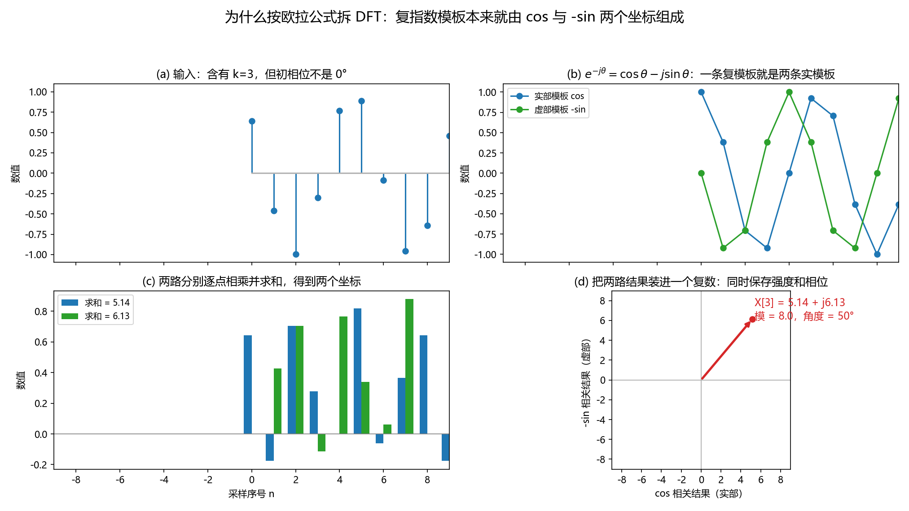

*图 Fig018：一个 DFT bin 的内部结构。输入为 $N=16$、$k=3$、初相位 50° 的余弦。(a) 输入与余弦模板并不同相；(b) 复指数 $e^{-j\theta}$ 同时携带 $\cos\theta$ 和 $-\sin\theta$ 两条模板；(c) 两路分别逐点相乘并求和；(d) 两个结果组成 $X[3]$ 的实部和虚部，其模表示该频率的强度，其角度恢复输入初相位。*

指数上的负号也有明确含义。输入中的正频率可以看作逆时针旋转，而模板 $e^{-j\omega_k n}$ 顺时针旋转。两者同频时，旋转互相抵消，乘积变成方向固定的向量，连续求和会越加越长；不同频时，乘积仍在旋转，绕一圈后各方向互相抵消。这是相关检测在复平面中的版本。

### 3.8 用一个完整例子串起全流程

前面用 $N=16$ 的小例子（Fig018）看了机制，这里用 $N=32$、初相位 60° 的例子（Fig003）把整条流水线从头到尾走一遍——输入、两条模板、两个求和、合成复数、读出幅度和相位，一步不缺：

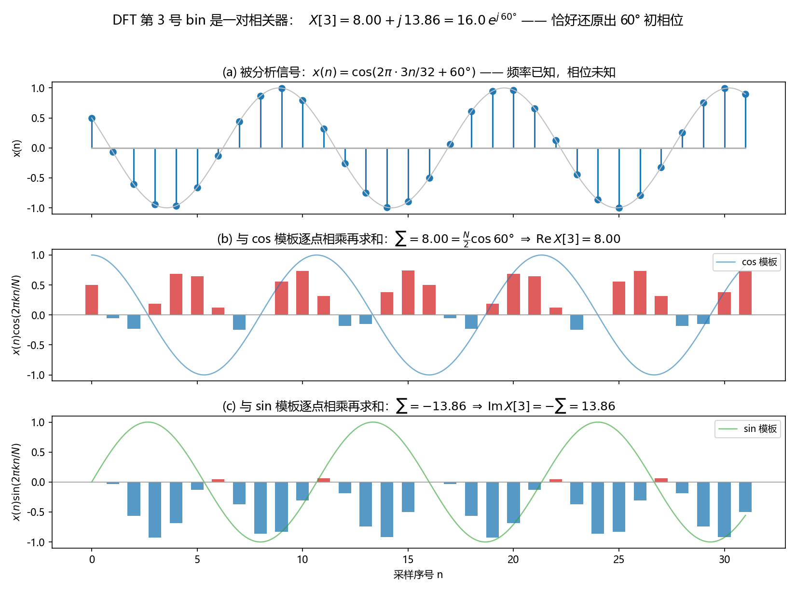

*图 Fig003：$N=32$、$k=3$、初相位 60° 的单 bin 计算。(a) 是待检测输入；(b) 是输入乘余弦模板后的 32 个乘积，求和得到实部 8；(c) 是输入乘正弦模板后的 32 个乘积，求和为 −13.86，DFT 公式前面还有一个负号，所以虚部为 +13.86。最终 $X[3]=8+j13.86=16e^{j60°}$。*

按面板逐个读：

1. 图 (a) 是输入 $x[n]$。它在 32 个采样内完成 3 个周期，因此频率编号是 $k=3$；但它带有 60° 初相位，所以与标准余弦模板并不完全对齐。
2. 图 (b) 计算 $x[n]\cos(2\pi 3n/32)$。每根柱子是一个逐点乘积，不是原信号本身。把 32 根柱子相加得到 8，这个数成为 $X[3]$ 的实部。
3. 图 (c) 计算 $x[n]\sin(2\pi 3n/32)$。柱子求和得到 −13.86；由于 DFT 模板是 $\cos-j\sin$，所以虚部等于这个求和结果再取负，得到 +13.86。
4. 把两个坐标合在一起，得到 $X[3]=8+j13.86$。它在复平面上的长度是 16，角度是 60°。长度乘单边归一化系数 $2/N$ 后得到原信号幅度 1，角度则恢复原来的初相位 60°。

为什么原始模是 16 而不是 1？因为相关器把 32 个采样的匹配结果累加起来了。对于频率恰好落在 bin 上、幅度为 $A$ 的实余弦，正频率一侧的 DFT 模通常是 $NA/2$。因此恢复单边幅度时要乘 $2/N$：

$$
A=\frac{2}{N}|X[k]|
$$

这里先记住“DFT 系数会随点数累加，因此读取实际幅度时需要归一化”即可；不同 FFT 库和单双边频谱可能采用不同归一化约定。

### 3.9 DFT 最终交回了什么

DFT 对每一个候选频率 $k$ 都交回一个复数：

$$
X[k]=X_r[k]+jX_i[k]
$$

它可以用两种方式读取：

- 直角坐标读法：$X_r[k]$ 是余弦相关结果，$X_i[k]$ 是负正弦相关结果；
- 极坐标读法：$|X[k]|$ 表示这个频率有多强，$\angle X[k]$ 表示这个频率成分的相位。

因此 DFT 的完整目的不是只找"有哪些频率"，而是对每个候选频率同时估计两个自由度：强度和相位。FFT 只是更快地完成同一批估计。

把这一章的路径用一张图收起来。从输入波形出发，经过"一排相关器"——每个 bin 内部有 cos 和 sin 两条模板——每个 bin 交回一个复数；这些复数合起来就是频谱。实部和虚部从头到尾只有一个来源：**它们分别是两条模板的匹配量**：

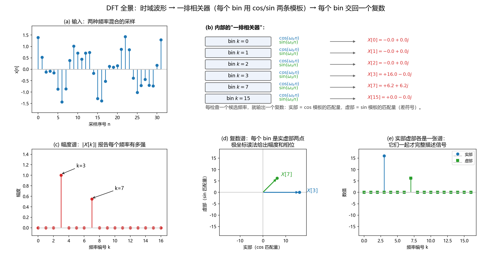

*图 Fig019：DFT 全景。(a) 输入是两种频率混合的采样；(b) 内部是一排相关器，每个 bin 用 cos/sin 两条模板各测一个量，输出一个复数（图中只展开部分 bin）；(c) 幅度谱报告每个频率有多强；(d) 复数平面上每个 bin 是一个点，极坐标读法给出幅度与相位；(e) 实部谱和虚部谱各自都只是一半信息，合在一起才完整。*

这张图值得作为"DFT 到底在做什么"的答案收藏：**左边是时域波形，中间是一排相关器，右边是复数谱**。实部虚部不是从天上掉下来的，而是每个 bin 里那两条模板的乘积求和结果。

### 3.10 澄清几个常见误解

| 误解 | 事实 |
|---|---|
| "虚部是计算误差/数值残渣" | 虚部是 sin 相关器的输出，与实部地位完全平等 |
| "实部是信号，虚部是附属品" | 单独的实部或虚部都不完整；对相位为 ±90° 的成分，实部恰好为零 |
| "能量在实部里" | 能量在模里：$|X|^2 = \text{Re}^2 + \text{Im}^2$，实虚部各持一部分，比例由相位决定 |
| "做降噪只需要幅度谱，实虚部可以丢" | 丢掉的是相位；低信噪比下这正是失真的主要来源（见 4.3 节与 5.4 节） |

顺带一提，不少深度学习音频模型会把 $[\,|X|, X_r, X_i\,]$ 三样东西并成三通道一起输入：$X_r, X_i$ 是无损的原始坐标，$|X|$ 是把"能量"这个非线性组合显式算好送给网络——原始信息和衍生特征各给一份。

---

## 4. 幅度、相位、共轭对称

### 4.1 幅度和相位：直角坐标的极坐标读法

FFT 交回的 $(X_r, X_i)$ 是直角坐标。换成极坐标读：

$$
|X| = \sqrt{X_r^2 + X_i^2}, \qquad \angle X = \operatorname{atan2}(X_i,\; X_r)
$$

$|X|$ 回答"这个频率成分有多强"，$\angle X$ 回答"它的波形从哪个角度起步"。对照第 1 节：这正是当初正弦波的 $(A, \varphi)$ 兜了一圈回来了——FFT 用直角坐标干活（因为相关器天然输出直角坐标），人类和算法用极坐标思考（因为物理语义在极坐标上）。

图 Fig004 展示了两种坐标的关系：四条幅度相同、初相位不同的正弦波，在复平面上是同一个圆上的四个点。相位滑动时，实部虚部按 $A\cos\varphi$ / $A\sin\varphi$ 此消彼长，模始终不变：

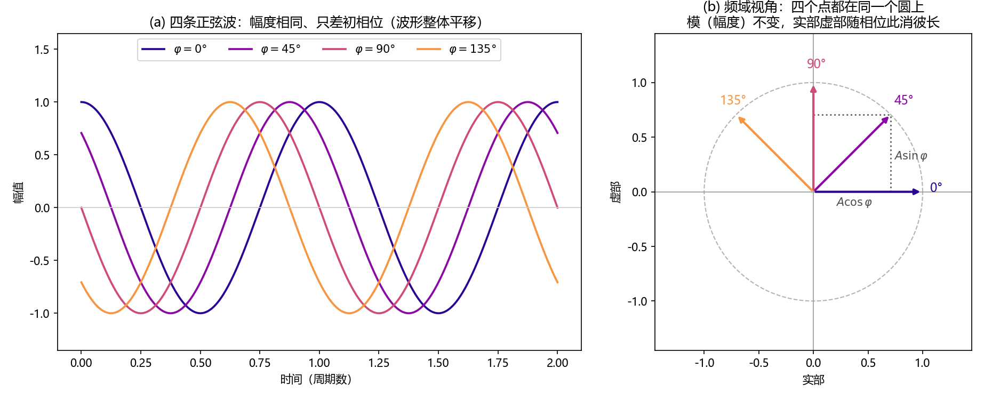

*图 Fig004：(a) 幅度均为 1、初相位分别为 0°/45°/90°/135° 的四条正弦波，时域上只是整体平移；(b) 频域里它们是同一圆周上的四个点——幅度是圆的半径，相位决定点在圆上的位置。*

### 4.2 相位携带的是"时间位置"

图 Fig004(a) 已经暗示了答案：改变相位，波形只是整体平移。这不是巧合，是傅里叶变换的时移定理：

$$
x(n - n_0) \;\longleftrightarrow\; e^{-j\omega n_0}\, X(\omega)
$$

把信号延迟 $n_0$ 个采样，每个频率成分的幅度纹丝不动，相位则按各自的频率转过 $\omega n_0$。倒过来读更有味道：幅度谱记录"有哪些频率、各有多强"，相位谱记录"这些成分在时间轴上如何对齐"。一声鼓点之所以是"一声"而不是弥散的嗡嗡声，是因为它的各频率成分在那一瞬间相位对齐、同时冲到峰值；把相位打乱，同样的幅度谱会摊成一片持续的噪声。

### 4.3 一个真实音频实验：交换幅度和相位

上面的论断可以做实验验证。取两段 16kHz 采样的语音，各截 4 秒，分别记为 A 和 B（两段语音的发声时段刻意错开），整段 FFT 后把幅度谱和相位谱交叉重组再逆变换：

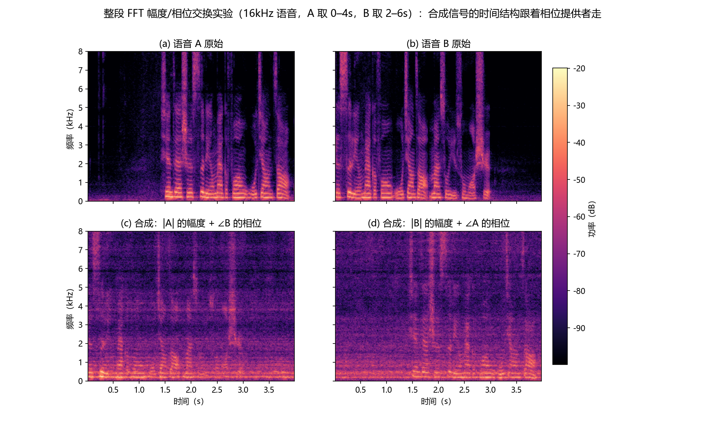

*图 Fig006：整段 FFT 幅度/相位交换实验，四张语谱图共用同一色标。(a)(b) 为原始语音，A 的能量集中在 1.5s 之后，B 的能量集中在 3s 之前。(c) 用 A 的幅度配 B 的相位，语音活动的时间分布跟随 B；(d) 反之跟随 A。*

结果很直白：合成信号的时间结构跟着相位提供者走。(c) 里 A 的幅度谱被 B 的相位重新"排版"后，能量出现的时刻、谐波扫过的轨迹都变成了 B 的样子；幅度提供者只留下一层统计意义上的频谱色彩。对整段长 FFT 来说，相位就是内容的骨架。

两点诚实的说明，避免把结论推过头：

1. 这是整段一次 FFT 的结果。此时"什么时刻发生了什么"这一信息几乎全部由相位编码，所以相位压倒性胜出。换成短帧 STFT（每帧 10–30ms）再逐帧交换，结论会反过来偏向幅度——因为短帧内部时间结构少，"哪一帧有能量"已经由幅度谱的帧序列记录了。相位和幅度谁重要，取决于分析窗口装进了多少时间结构，两个极端都不能单独当普遍真理。
2. 这也正是"人耳对相位不敏感"这句老话的适用边界：它说的是短时帧内的绝对相位，不是帧与帧之间的相位连续性。降噪场景里 ISTFT 重叠相加时，帧间相位不一致会直接造成波形错位、能量相消，听感上就是那种含混发闷的"水下音"失真。

### 4.4 共轭对称：实信号的一半频谱是免费的

第 2.6 节的负频率记账在 DFT 里长成一条精确的对称性。对任意实数信号：

$$
X[N-k] = X^*[k]
$$

即第 $N-k$ 号 bin 永远是第 $k$ 号 bin 的复共轭（实部相同、虚部取反）。推导只需一行：在 DFT 定义里把 $k$ 换成 $N-k$，利用 $e^{-j2\pi(N-k)n/N} = e^{+j2\pi kn/N}$，而 $x(n)$ 是实数，求和结果恰好是原来的共轭。图 Fig005 用一段随机实信号验证——注意是随机信号，说明这条对称性不挑信号，只要求"实数"：

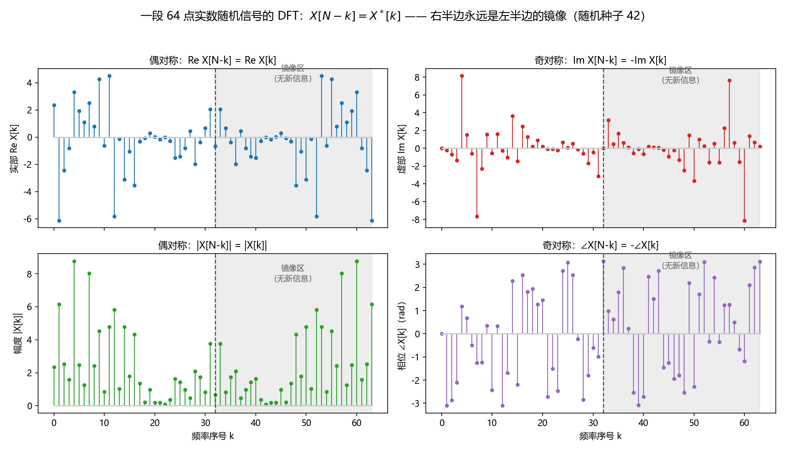

*图 Fig005：64 点实数随机信号的 DFT。实部与幅度关于 $k=N/2$ 偶对称，虚部与相位奇对称，灰色镜像区不含任何新信息。*

四个量的对称性汇总：

| 量 | 对称性 | 关系式 |
|:---:|:---:|:---:|
| 实部 $\text{Re}\,X$ | 偶 | $\text{Re}\,X[N-k] = \text{Re}\,X[k]$ |
| 虚部 $\text{Im}\,X$ | 奇 | $\text{Im}\,X[N-k] = -\text{Im}\,X[k]$ |
| 幅度 $\|X\|$ | 偶 | $\|X[N-k]\| = \|X[k]\|$ |
| 相位 $\angle X$ | 奇 | $\angle X[N-k] = -\angle X[k]$ |

直觉解释：实信号的每个频率成分都由 $\pm\omega$ 一对反向旋转的向量拼成（图 Fig002(b)），一个逆时针转、一个顺时针转，任意时刻两者的角度互为相反数、长度相同——这就是"共轭"，也正是 2.4 节词典里"镜像"那一条。

工程后果立竿见影：对于 $N$ 点 FFT，实信号只有约一半频谱是独立的。$k=0$（直流）和 $k=N/2$（奈奎斯特）两个 bin 的虚部恒为零，剩下 $N/2-1$ 个复数 bin 独立，其余全是镜像。这就是各类 FFT 库专门提供 `rfft`/`irfft` 接口的原因：1024 点实数 FFT 只需返回 513 个 bin（$\frac{1024}{2}+1$），256 点只需返回 129 个——存储和算力都在收这笔"免费的一半"。反方向同样成立：想让 IFFT 的输出是实数音频，构造频谱时必须手工维持共轭对称，差一个 bin 输出就会带上虚部残渣——工程实现 ISTFT 时这是必查项。

---

## 5. 解析信号、希尔伯特变换与 I/Q

### 5.1 动机：想给实信号配上"瞬时幅度"和"瞬时相位"

前面所有的幅度和相位都是频域概念——先做 FFT，再谈某个 bin 的 $|X|$ 和 $\angle X$。但有些问题发生在时域：这段语音此刻的包络多大？这个调频信号此刻的频率是多少？对一个实信号 $x(n)$，这些问题没有良定义的答案——单看一个实数样本 $x(n) = 0.3$，你分不清它是"大幅度波形正路过零附近"还是"小幅度波形正处在峰值"。

回到图 Fig002(a) 的语言：实信号是螺旋线的影子，影子丢掉了一半信息。想要瞬时幅度和瞬时相位，就得把影子还原成完整的螺旋线——给实信号配一个恰当的虚部，让 $(x, \hat{x})$ 重新构成一个旋转向量，模就是瞬时幅度，辐角就是瞬时相位。

### 5.2 解析信号：删掉负频率

哪个虚部才是"恰当"的？频域上看答案很干净。实信号的频谱正负对称（第 4.4 节），负半边是纯冗余；把负频率删掉、正频率翻倍，得到的复信号称为解析信号：

$$
X_a(\omega) =
\begin{cases}
2X(\omega), & \omega > 0 \\
X(0), & \omega = 0 \\
0, & \omega < 0
\end{cases}
$$

时域上它等价于：

$$
x_a(n) = x(n) + j\,\hat{x}(n)
$$

其中 $\hat{x}$ 是 $x$ 的希尔伯特变换——一个幅度全通、把每个正频率成分统一移相 −90° 的滤波器。为什么恰好是 −90°？因为 $\cos$ 移相 90° 就是 $\sin$：对每个成分 $A\cos(\omega n + \varphi)$，希尔伯特变换产出 $A\sin(\omega n + \varphi)$，于是

$$
x_a(n) = A\cos(\omega n + \varphi) + jA\sin(\omega n + \varphi) = A\,e^{j(\omega n + \varphi)}
$$

——每个余弦影子都被补全成了完整的复指数螺旋。此时 $|x_a(n)|$ 就是瞬时包络，$\angle x_a(n)$ 就是瞬时相位，相位对时间求导再除以 $2\pi$ 就是瞬时频率。图 Fig007 用一个 50Hz 载波 × 3Hz 调幅的信号做了验证：

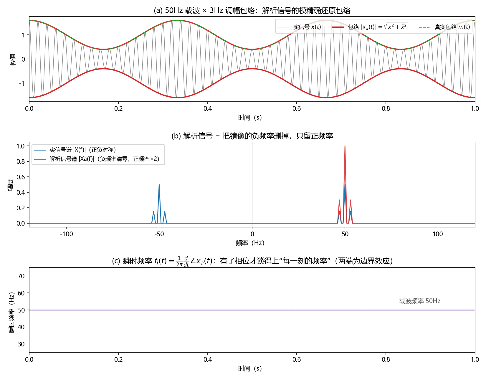

*图 Fig007：(a) 希尔伯特变换求得的解析信号，其模（红线）与真实包络 $m(t)$（绿虚线）重合；(b) 实信号谱正负对称，解析信号谱负半轴清零、正半轴翻倍；(c) 从解析信号相位求导得到的瞬时频率稳定在载波 50Hz，两端偏差为边界效应。*

一点使用须知：理想希尔伯特变换是非因果、无限长的，任何实现（FFT 法、FIR 逼近）都有边界效应和带宽限制，图 Fig007(c) 两端的毛刺就是证据。另外"瞬时频率"只对窄带信号有清晰语义——宽带语音直接上希尔伯特变换得到的瞬时频率会剧烈跳动，没有直接的解释力，这是它不能替代 STFT 的原因。

### 5.3 I/Q 信号：解析信号的工程形态

I/Q（In-phase / Quadrature，同相/正交）是通信领域的说法，本质就是上面这套东西的可实现版本。窄带信号通常写成"载波 + 缓变调制"：

$$
x(t) = a(t)\cos\big(2\pi f_c t + \varphi(t)\big)
$$

关心的信息全在缓变的 $a(t)$ 和 $\varphi(t)$ 里，高速旋转的载波只是运输工具。I/Q 解调用一对正交本振把信息卸下来：信号分两路，一路乘 $2\cos(2\pi f_c t)$、一路乘 $-2\sin(2\pi f_c t)$，各自低通滤波去掉倍频项，得到：

$$
I(t) = a(t)\cos\varphi(t), \qquad Q(t) = a(t)\sin\varphi(t)
$$

$I + jQ = a(t)e^{j\varphi(t)}$ 正是解析信号剥掉载波后剩下的复包络。图 Fig008 给出完整的仿真链路：

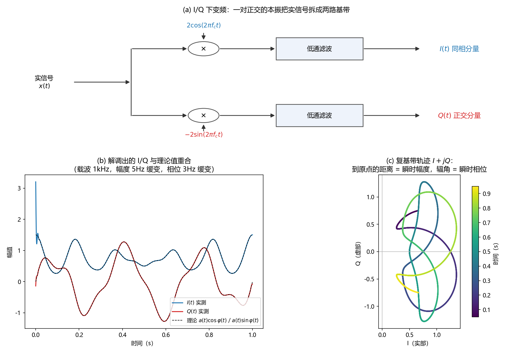

*图 Fig008：(a) I/Q 下变频结构；(b) 载波 1kHz、幅度按 5Hz 缓变、相位按 3Hz 缓变的仿真信号，解调出的 I/Q（实线）与理论值 $a\cos\varphi$ / $a\sin\varphi$（黑虚线）重合，低通为 5 阶 Butterworth、截止 100Hz、零相位滤波；(c) 复基带轨迹 $I+jQ$，到原点的距离是瞬时幅度，辐角是瞬时相位，颜色表示时间。*

注意 I/Q 和第 3 节的呼应：乘 cos 取同相分量、乘 sin 取正交分量——这就是 DFT 相关器在时域连续运行的版本。事实上 STFT 的每一个 bin 都可以严格地读成一条 I/Q 通道：加窗相当于低通滤波，与 $e^{-j\omega_k n}$ 相乘相当于混频，第 $k$ 个 bin 的实部虚部就是以 $\omega_k$ 为"载波"的那个窄带的 I 和 Q。语谱图上的一个复数格子和无线电接收机里的一对 I/Q 采样，是同一个数学对象。

### 5.4 收束：一个降噪场景的完整读法

把全文的语言在一个具体场景里过一遍。频域降噪的基本框架是：对带噪语音做 STFT，在每个时频点上乘一个掩码，再逆变换回波形。时频点 $X(t,k)$ 是该频带的 I/Q 对；带噪语音 $X = S + D$（干净语音加噪声）在这个 I/Q 平面上是向量相加，噪声把干净语音的向量拽偏了一个角度。

如果掩码是实数增益 $G$，那么 $G \cdot X$ 只改模不改辐角——输出被锁死在 $X$ 的方向上，被拽偏的角度永远修不回来；谱减法、维纳滤波这类经典算法都属于这一档。如果掩码是复数 $M = |M|e^{j\theta_M}$，乘上去模相乘、辐角相加（第 2.4 节词典里"乘 $M$"那一条），缩放和旋转一步到位。所谓"修相位"，就是在每个 bin 的 I/Q 平面上把向量转回去——实数掩码是一个音量旋钮，复数掩码是音量旋钮加一个方向盘。

底层的语言就这么多：极坐标提供语义，欧拉公式提供运算，相关器提供坐标，共轭对称提供约束，解析信号把这套语言从频域搬回时域。

---

## 6. 把这条线收起来

五个问题，各用一句话作答：

| 问题 | 一句话答案 |
|---|---|
| 极坐标怎么引入的？ | 正弦波天然由（幅度，初相位）两个数描述，本来就是"一长一角"的极坐标格式；复平面只是给这对数一个能做算术的空间 |
| 欧拉公式的角色？ | 把"旋转"代数化：$e^{j\theta_1}e^{j\theta_2}=e^{j(\theta_1+\theta_2)}$，乘复数 = 缩放并旋转 |
| FFT 中实部虚部？ | 一对相关器的输出：实部是 cos 份额，虚部是 sin 份额；两个坐标缺一不可，否则 ±90° 相位的成分会被漏判 |
| 幅度、相位、共轭对称？ | 幅相是同一复数的极坐标读法——幅度管"多强"，相位管"何时"；共轭对称是"信号为实数"在频域的等价表述，实信号频谱只有一半独立 |
| 解析信号、希尔伯特、I/Q？ | 给实信号补一个 −90° 移相的虚部，把"影子"还原成完整旋转，从而获得瞬时幅度/相位；I/Q 是它剥掉载波后的工程形态，STFT 的每个 bin 就是一条 I/Q 通道 |

以及那条贯穿全文的主线，值得再抄一遍：

> 麦克风只采实数。虚部是为了让旋转可计算而补上的第二个坐标；补上之后，幅度和相位反而成了更贴近物理的读法。凡是要"修相位"的算法——从维纳滤波修不了，到复数掩码修得了——差别都在于手里握的是一个实数旋钮，还是一个完整的复数。

*笔记完。*
