# 频域维纳滤波降噪算法——设计思路与工程手记

## 写在前头

这份笔记记录的是一个面向实时语音通信的频域降噪算法。它的设计目标很明确：在 48kHz 采样率下，以 10ms 帧长实时处理单通道语音，把稳态和准稳态背景噪声压下去，同时尽量不伤语音。算法脱胎于 WebRTC 的 Noise Suppression 模块，但经过了面向嵌入式的重构——所有动态分配被消除，所有 C++ 模板和虚函数被拍平成纯 C 结构体。

我按照信号流经的顺序来谈。先说为什么要这么做，再说具体怎么做。

---

## 1. 信号模型

一切降噪算法的出发点都是同一个假设：麦克风采集到的信号 $x(n)$ 是干净语音 $s(n)$ 和加性噪声 $d(n)$ 的叠加：

$$
x(n) = s(n) + d(n)
$$

这个模型简单到近乎天真，但它成立的前提条件其实很苛刻：噪声和语音不相关，噪声在短时间尺度上是准平稳的。实际工程中，空调嗡嗡声、风扇声、马路上的低频轰鸣，在几十毫秒内确实变化不大——这就够了。

我们的目标是从 $x(n)$ 中恢复 $\hat{s}(n)$。在频域里，这意味着对每个频率 bin 施加一个增益 $G(k)$：

$$
\hat{S}(k) = G(k) \cdot X(k)
$$

问题归结为：怎么求这个 $G(k)$？

---

## 2. 为什么选频域

时域降噪（比如 LMS 自适应滤波）需要参考信号，这在单麦克风场景下不现实。频域方法的好处是：

1. **频率分辨率**。噪声和语音在不同频段的能量分布差异很大。白噪声全频段平坦，语音能量集中在 300Hz–4kHz。频域处理可以逐 bin 调节衰减深度。

2. **短时平稳假设更容易满足**。一帧 10ms 内，噪声功率谱几乎不变，这给估计器提供了稳定的观测窗口。

3. **计算量可控**。256 点 FFT 在嵌入式平台上是成熟操作，远比时域长 FIR 滤波器经济。

代价是引入了帧延迟和频谱泄漏，这些后面会谈。

---

## 3. 总体处理流程

一帧 480 个采样点（48kHz × 10ms）进来后，经过以下环节：

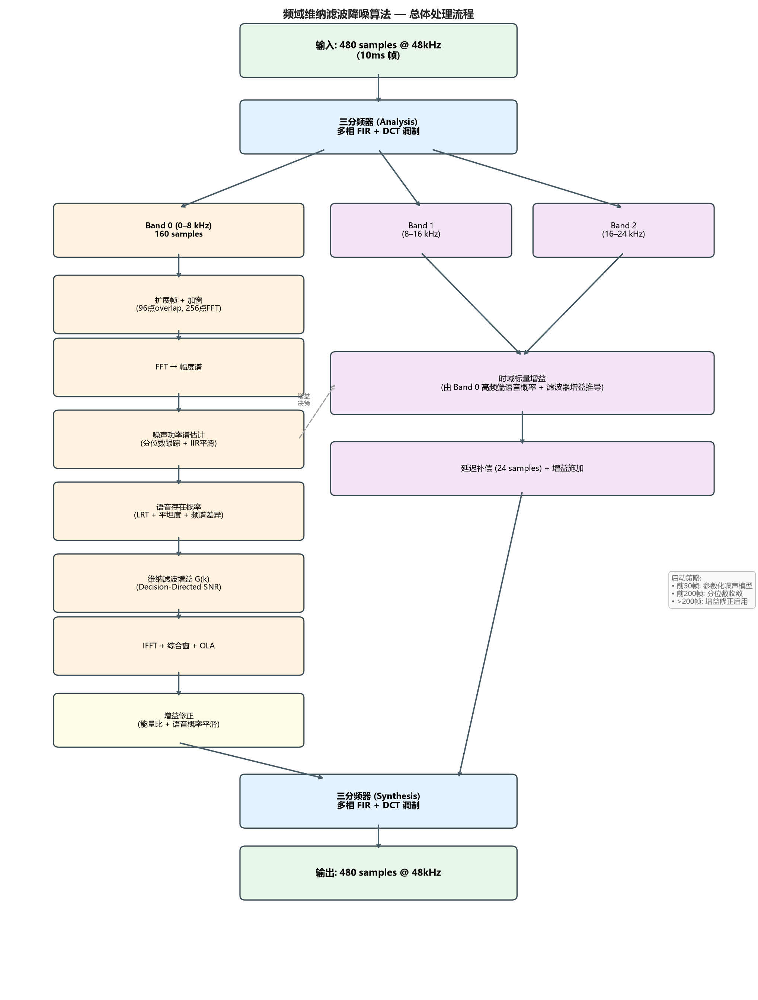

*图 Fig001：算法总体处理流程。左侧为 Band 0 频域主链路，右侧为高频段时域增益处理。*

核心思想：**只在最低子带做完整的频域处理，高频段只施加一个标量增益**。这是工程上的折中——人耳对高频噪声的敏感度低于低频，而高频做逐 bin 处理既费算力又容易引入音乐噪声。

---

## 4. 三分频器：多相滤波 + DCT 调制

### 4.1 为什么要分频

直接对 48kHz 信号做 FFT 当然可以，但有两个问题：

- 256 点 FFT 在 48kHz 下频率分辨率只有 187.5Hz/bin，低频段太粗。
- 语音能量集中在 8kHz 以下，高频段几乎是噪声的天下。分频后对低频段做精细处理，高频段粗放处理，算力用在刀刃上。

分频后每个子带等效采样率为 16kHz，256 点 FFT 的频率分辨率变为 62.5Hz/bin——对语音基频（通常 80–400Hz）来说足够细了。

因此，三分频器先把 $0\sim24$kHz 的正频率范围切成三段：

| 子带 | 原始频率范围 | 输出采样率 | 后续处理 |
|:---:|:---:|:---:|:---|
| Band 0 | $0\sim8$kHz | 16kHz | 256 点 FFT，逐 bin 维纳滤波 |
| Band 1 | $8\sim16$kHz | 16kHz | 只乘一个高频标量增益 |
| Band 2 | $16\sim24$kHz | 16kHz | 只乘一个高频标量增益 |

这里不是把 8kHz 以上的频率扔掉，而是把三个频段分别装进三条 16kHz 的低速率通道。处理完成后，再由综合滤波器组把它们拼回一路 48kHz 信号。

直接每 3 个采样取 1 个会产生混叠，所以每条支路必须先把自己负责的频段滤出来，再做 3:1 降采样，如图 Fig009 所示：

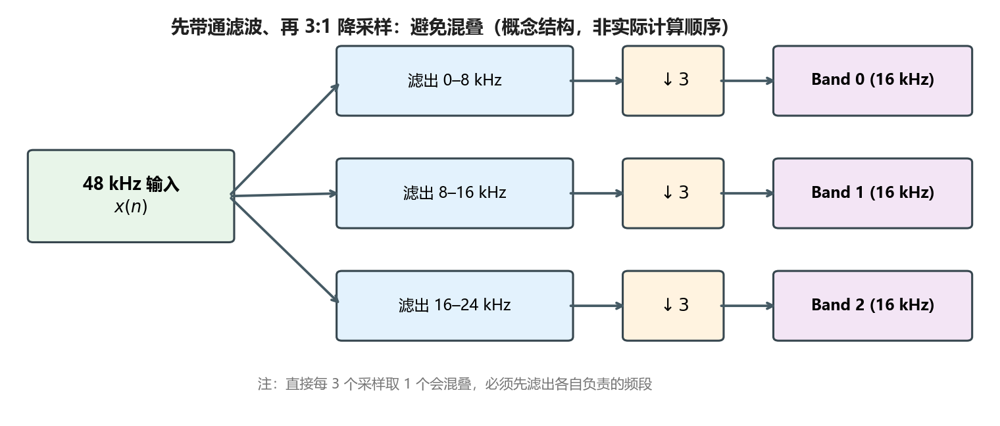

*图 Fig009：三分频器的概念结构。每条支路先带通滤波、再 3:1 降采样。注意这只是概念结构，实际实现顺序见 4.4 节的图 Fig010。图片由 `scripts/generate_fig009_fig010.py` 生成。*

Band 1、Band 2 降到 16kHz 后，原来的高频内容会折叠到 $0\sim8$kHz。这里的折叠是有意的：带通滤波器已经提前去掉了其他频段，因此没有不同频段互相叠加，信息只是换了一个低速率表示；综合时还能搬回原位。

### 4.2 多相分解

三分频器的原型是一个低通 FIR 滤波器 $H(z)$，通带截止 7kHz，阻带起始 9.2kHz，阻带衰减 40dB。利用 Noble Identity 做多相分解：

$$
H(z) = H_0(z^3) + z^{-1} H_1(z^3) + z^{-2} H_2(z^3)
$$

多相分解解决的是一个纯粹的计算浪费：如果先在 48kHz 下算出 FIR 的每一个输出，再 ↓3，就会立即丢掉其中 $2/3$ 的结果。多相结构把卷积按采样相位重新分组，只计算 ↓3 后真正会保留的那些输出，再利用 Noble Identity 把主要滤波工作搬到 16kHz 低速率侧。

可以把它理解为：原方案是“做完三盘菜，只端走一盘”；多相方案则是“提前知道要端哪一盘，只做那一盘”。两者数学结果相同，只是计算顺序不同。

| 对比 | 普通 FIR 后 ↓3 | 多相 FIR |
|---|---:|---:|
| 滤波运行速率 | 48kHz | 16kHz |
| 是否计算随后被丢弃的输出 | 是，约 $2/3$ | 否 |
| 单路 48-tap 的等效乘法量 | 48 | 约 16 |

但这只解决了“算了又扔”的问题。三条子带如果各自运行一套带通 FIR，仍然会重复做三遍形状相似的滤波。DCT 调制接下来解决这第二层浪费。

### 4.3 DCT 调制

三个目标滤波器的形状基本相同，只是中心频率分别位于 4、12、20kHz。与其独立设计三个带通，不如只设计一个低通原型 $h(n)$，再利用调制定理把它搬到不同频率：

$$
h_k(n)=h(n)\cos(\omega_kn+\varphi_k)
$$

时域乘余弦，对应频域产生两份平移副本：

$$
h(n)\cos(\omega_0n)
\;\longleftrightarrow\;
\frac{1}{2}\left[H(\omega-\omega_0)+H(\omega+\omega_0)\right]
$$

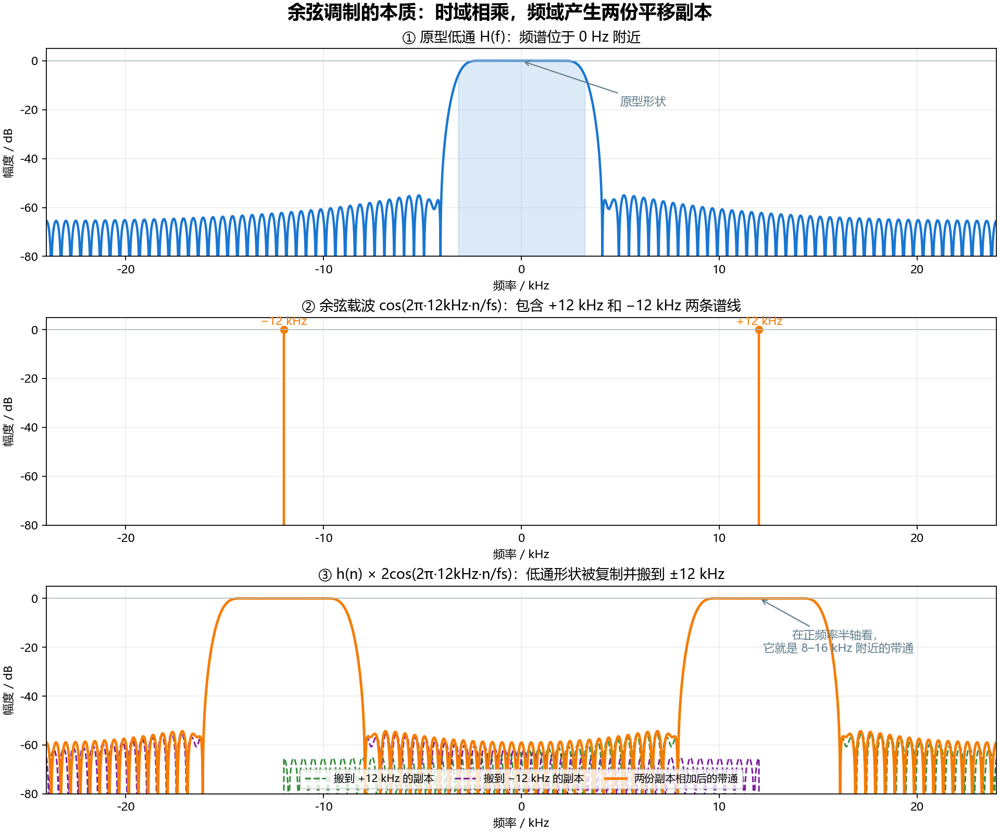

这张图按“原型 → 搬运地址 → 搬运结果”从上往下读：

1. 原型低通集中在 $0$Hz 附近，决定滤波器的形状和宽度；
2. 实数余弦包含 $+f_0$ 和 $-f_0$ 两条谱线，给出两个搬运地址；
3. 相乘后，低通形状被复制并搬到 $\pm f_0$。只看正频率半轴，就得到一个以 $f_0$ 为中心的带通滤波器。

对本算法，三个中心频率为：

$$
f_0=4\text{kHz},\qquad f_1=12\text{kHz},\qquad f_2=20\text{kHz}
$$

也就是 $f_s/12$、$3f_s/12$、$5f_s/12$。同一个原型分别乘这三个余弦，就得到覆盖三个频段的分析滤波器：

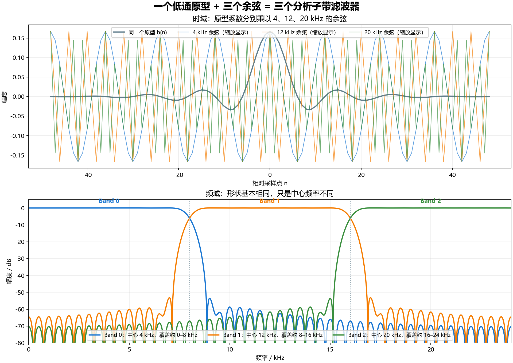

图的上半部分是时域系数相乘，下半部分是最终频率响应。三条响应轮廓相同、位置不同，因此**滤波器设计只做一次，中心频率由余弦决定**。

### 4.4 为什么最后会变成一个 DCT 小矩阵

表面上，使用一个原型生成三套系数后，运行时似乎仍要执行三次完整卷积。真正的优化是把“所有子带共有的原型滤波”和“各子带不同的余弦权重”拆开：

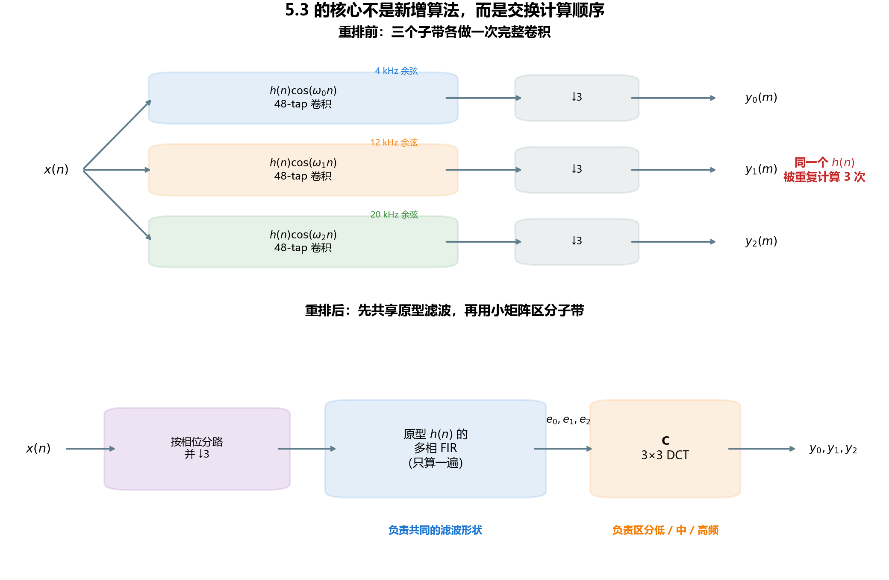

- **重排前**：三条支路分别用 $h(n)\cos(\omega_kn)$ 做卷积，共享的原型部分被重复计算；
- **重排后**：先按相位分路、↓3，并完成一次共享多相 FIR，得到中间量 $e_0,e_1,e_2$；然后才用各子带的余弦常数组合这些中间量。

这只是利用乘法分配律做因式分解，并没有改变系统输出。可以把它记成：**多相 FIR 负责共同的“滤”，末端矩阵负责不同的“分”。**

调制频率对应的余弦序列以 12 个采样为周期，权重只会重复出现 $0$、$\pm\frac12$、$\pm\frac{\sqrt3}{2}$、$\pm1$ 等少数值。因此，原本散落在 48 个系数里的调制运算可以合并成一个 3 点 DCT 常数矩阵：

$$
\mathbf C=
\begin{bmatrix}
2 & 2 & 2 \\
\sqrt{3} & 0 & -\sqrt{3} \\
1 & -2 & 1
\end{bmatrix}
$$

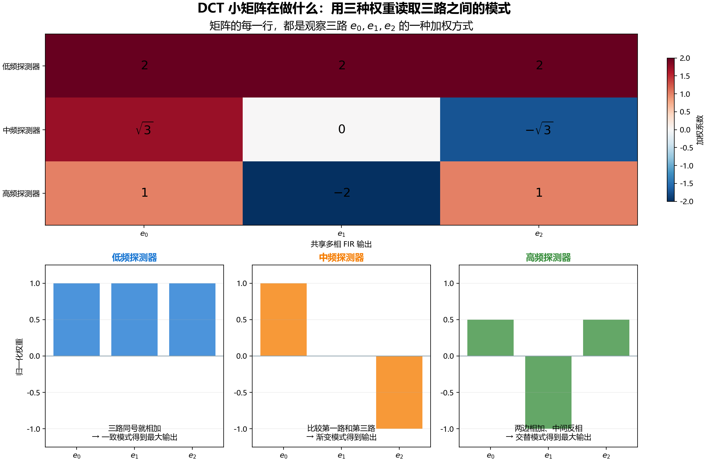

矩阵的三行可以看成三个模式探测器：

| DCT 行 | 加权方式 | 偏好的三路模式 | 输出 |
|---|---|---|---|
| $[2,2,2]$ | 三路同号相加 | 三路近似一致 | Band 0，低频 |
| $[\sqrt3,0,-\sqrt3]$ | 第一路减第三路 | 三路逐渐变化 | Band 1，中频 |
| $[1,-2,1]$ | 两边相加、中间反相 | 正负交替明显 | Band 2，高频 |

例如，当共享多相输出近似为 $e_0=e_1=e_2=1$ 时：

$$
\mathbf C
\begin{bmatrix}1\\1\\1\end{bmatrix}
=
\begin{bmatrix}6\\0\\0\end{bmatrix}
$$

三路一致的模式只进入低频输出。对于更高频的输入，相邻采样变化更快，三路之间会表现为渐变或符号交替，于是中频行、高频行得到更大的输出。

实际 48-tap 原型结合周期 12 的调制权重后，可整理为 12 个 4-tap 短分支，其中 2 个分支因余弦权重恒为零而消失，只需保存和运行 10 个非零分支。

分析侧的数据流最终可以概括为图 Fig010 上半部分：先按相位分路并 ↓3，共享的短多相 FIR 完成“滤”，末端的 3×3 DCT 矩阵完成“分”。

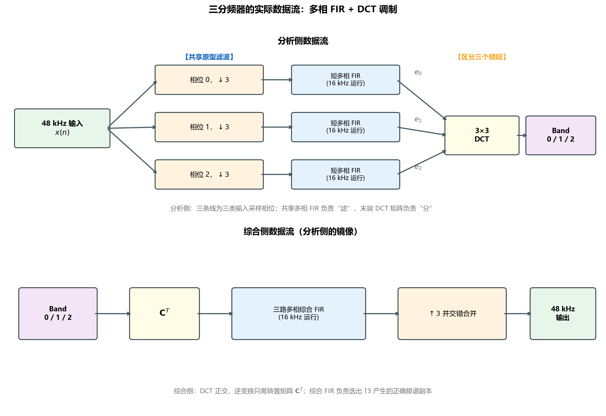

*图 Fig010：三分频器的实际数据流。上半部分为分析侧（多相 FIR + DCT），下半部分为综合侧（分析侧的镜像）。图片由 `scripts/generate_fig009_fig010.py` 生成。*

这里三条线表示三类输入采样相位；“12 个短分支”则是把 48 个原型系数结合调制周期进一步展开后的实现计数，两者处于不同层次，并不矛盾。

### 4.5 综合：三个子带如何拼回 48kHz

综合侧执行分析侧的镜像操作（见图 Fig010 下半部分）：三个子带先经 $\mathbf C^T$ 逆变换，再通过三路多相综合 FIR，最后 ↑3 交错合并回一路 48kHz 信号。

归一化 DCT 是正交变换，因此逆变换可由转置矩阵 $\mathbf C^T$ 完成，不必额外设计一套复杂逆矩阵。↑3 会产生频谱镜像，综合 FIR 负责选择正确的频谱副本；三路叠加后，各子带回到原来的频率位置。

### 4.6 工程代价

这个滤波器组**不满足完美重建条件**。直接分析再综合（中间不做任何处理），SNR 大约只有 9.5dB。这是有意为之——用重建精度换滤波器复杂度和延迟。对降噪应用来说，这个损失可以接受，因为我们的目标本来就不是无损还原。

滤波器组引入 24 个采样点的群延迟（0.5ms @ 48kHz），高频段需要额外延迟补偿来对齐。

这一节的完整数学推导，包括 Noble Identity、带通降采样为什么可逆、余弦周期如何收缩成 DCT 矩阵，见附录：[三分频器与 DCT 调制](../算法附录/三分频器与DCT调制.md)。正文只保留理解后续降噪信号流所需的主线。

---

## 5. 帧分割与加窗

### 5.1 帧参数

分频后的子带信号（160 samples/帧）不能直接送 FFT，需要：

- **扩展帧**：将当前 160 点与上一帧尾部 96 点拼接，形成 256 点的扩展帧。
- **加窗**：对扩展帧施加一个混合窗——前 96 点是升 Hanning，中间 65 点是平坦段（增益为 1），后 95 点是降 Hanning。

这个窗的设计意图：中间平坦段保证帧中心区域的信号不被衰减，两端的 Hanning 渐变抑制频谱泄漏。数学上，窗函数 $w(n)$ 满足：

$$
w(n) = \begin{cases}
\sin\left(\frac{\pi}{2} \cdot \frac{n}{96}\right), & 0 \le n < 96 \\
1, & 96 \le n < 161 \\
\sin\left(\frac{\pi}{2} \cdot \frac{256-n}{96}\right), & 161 \le n < 256
\end{cases}
$$

### 5.2 Overlap-Add

IFFT 之后得到 256 点时域信号，再乘一次同样的窗（分析窗 × 综合窗 = COLA 条件），然后取前 160 点与上一帧残余 96 点叠加：

$$
y(n) = \underbrace{w(n) \cdot \text{IFFT}\{G(k) \cdot \text{FFT}\{w(n) \cdot x_{ext}(n)\}\}}_{\text{当前帧贡献}} + \underbrace{m(n)}_{\text{上帧残余}}
$$

其中 $m(n)$ 是上一帧 256 点输出的后 96 点。这保证了帧间连续性，避免块效应。

---

## 6. 噪声功率谱估计

这是整个算法里最关键、也最容易形成反馈误差的环节。维纳增益依赖噪声谱：噪声估低了，残余噪声会漏出来；噪声估高了，语音谐波会被当成噪声削掉。更麻烦的是，我们从来没有单独观测到噪声，只看到了混合频谱 $X(k)$。

### 6.1 先把概念说清楚：估计的到底是什么

理论上的功率谱密度（PSD）通常写成：

$$
P_x(k) = |X(k)|^2
$$

但本项目的实现先计算的是带正偏置的**幅度谱**：

$$
A_x(k) = |X(k)| + 1
$$

后续噪声估计、SNR 比值和维纳增益都在这套幅度量纲下保持一致。因此代码中的变量虽然叫 `noise_spectrum`，严格说估计的是**噪声幅度谱** $\hat{A}_d(k)$，不是平方意义上的 PSD。文档沿用工程习惯称它为“噪声功率谱估计”，但推导中用 $A$ 而不是 $P$，以免量纲混淆。

对第 $t$ 帧、第 $k$ 个频率 bin，有：

$$
A_x(t,k) \approx A_s(t,k) + A_d(t,k)
$$

这里的加法只是便于理解的近似；复数频谱存在相位相消，严格来说幅度并不能直接相加。算法真正依赖的是下面这个统计事实：

> 对固定频率 bin 来看，背景噪声通常持续存在且缓慢变化，而语音只会间歇性地把观测幅度向上抬高。

所以，噪声估计不是寻找“平均能量”，而是在时间轴上寻找一个缓慢移动的**低包络**或**噪声底**。

### 6.2 为什么不能直接取均值或最小值

假设连续观察某个 bin 约 2 秒：纯噪声帧的幅度围绕 1 波动，语音出现时会突然升到 3、5 甚至更高。

- **取均值**：语音帧会把均值明显抬高，最终把语音的一部分学进噪声模型。
- **取最小值**：偶然出现的一次极小随机值就可能把估计拉得过低，而且之后很难恢复。
- **取低分位数**：既偏向低值，又利用一批样本的统计信息，对单个异常值不敏感。

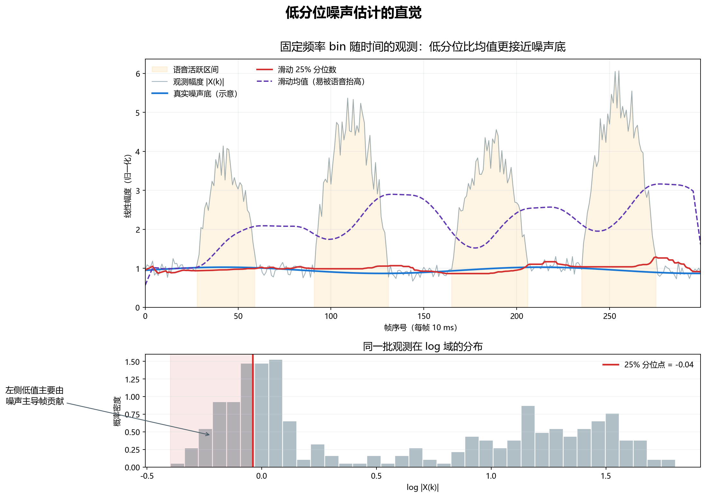

*图 Fig002：固定频率 bin 的模拟观测。语音只把幅度向上抬高，因此滑动均值容易被污染，而 25% 分位数更贴近真实噪声底；在 log 域直方图中，它位于观测分布的左侧。图片由 `scripts/generate_noise_estimation_figures.py` 生成。*

设随机变量 $Y=\log A_x(t,k)$，它的 $p$ 分位数 $q_p$ 满足：

$$
\Pr\{Y \le q_p\}=p
$$

本算法取 $p=0.25$。直观地说，把历史观测从小到大排列，取位于 25% 位置的值作为噪声候选。它隐含了一个重要前提：**在统计窗口内，该 bin 至少有约四分之一的时间不是被强语音持续占据的。** 如果某个频率长期存在连续纯音或长时间强语音，这个前提会被破坏，估计仍可能偏高。

为什么放在 log 域？主要有三点：

1. 频谱幅度跨越多个数量级，取对数后更容易用统一步长更新。
2. 乘性波动会变成加性波动，分布通常更集中。
3. 向上和向下的相对变化更对称，不会让大幅值 bin 主导数值范围。

### 6.3 不保存历史：在线分位数更新

嵌入式设备不适合为 129 个 bin 保存数百帧历史再排序。实现中每个 bin 只维护两个状态：

- $\hat{q}_s(k)$：第 $s$ 组估计器的 log 分位数。
- $\hat{f}_s(k)$：分位点附近的概率密度估计，用于调整步长。

这一节解决的不是“25% 分位数是什么”，而是一个工程问题：**已经知道想要每个 bin 的 25% 分位数，怎样在不保存历史、不排序的情况下算出它？**

普通做法需要为某个 bin 保存一串历史幅度：

```text
历史样本：[1.1, 4.0, 0.9, 1.0, 3.2, ...]
                    ↓ 保存并排序
排序结果：[0.9, 1.0, 1.1, 3.2, 4.0, ...]
                    ↑ 读取 25% 位置
```

6.3 把这套操作换成一个**会移动的游标** $\hat q$。每个 bin 都有自己的游标；每来一帧，它只做三件事：

1. 读取这一帧该 bin 的幅度，并取 log，得到新样本 $y$；
2. 比较 $y$ 在当前游标 $\hat q$ 的左边还是右边；
3. 根据比较结果把游标移动一点，然后忘掉这个样本。

因此它不需要记住“过去有哪些数”，只需要记住“游标现在在哪里”。

每来一帧，先令 $y(t,k)=\log A_x(t,k)$，再做随机逼近：

$$
\hat{q}_s(k) \leftarrow \hat{q}_s(k) +
\begin{cases}
p\mu_s(k), & y(t,k)>\hat{q}_s(k) \\
-(1-p)\mu_s(k), & y(t,k)\le\hat{q}_s(k)
\end{cases}
$$

其中：

$$
p=0.25, \qquad
\mu_s(k)=\frac{\delta_s(k)}{N_s+1}, \qquad
\delta_s(k)=
\begin{cases}
40/\hat{f}_s(k), & \hat{f}_s(k)>1 \\
40, & \hat{f}_s(k)\le 1
\end{cases}
$$

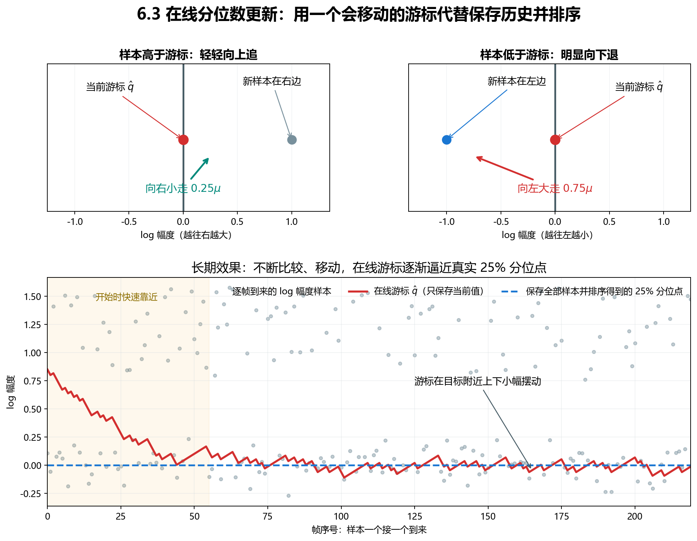

*图 Fig004：上半部分是单帧更新规则；下半部分是连续更新的效果。灰点是逐帧到来的样本，红线是只保存一个状态的在线游标，蓝色虚线是保存全部样本并排序后得到的真实 25% 分位点。红线最终会在蓝线附近摆动。图片由 `scripts/generate_noise_estimation_figures.py` 生成。*

先看图的上半部分。这里的“上”和“下”指的是**幅度数值变大或变小**，不是频率轴，也不是帧中的时间位置：

- 若 $y>\hat q$，新样本比当前估计大，游标向大值方向移动 $0.25\mu$；
- 若 $y\le\hat q$，新样本比当前估计小，游标向小值方向移动 $0.75\mu$。

用一个具体数字看更直观。假设当前 $\hat q=1.00$，暂时令 $\mu=0.04$：

| 新样本 $y$ | 比较结果 | 游标变化 | 新的 $\hat q$ |
|---:|:---:|---:|---:|
| 3.00 | 在右边 | $+0.25\times0.04=+0.01$ | 1.01 |
| 4.00 | 在右边 | $+0.01$ | 1.02 |
| 0.90 | 在左边 | $-0.75\times0.04=-0.03$ | 0.99 |
| 2.50 | 在右边 | $+0.01$ | 1.00 |

这四帧中有三帧落在游标上方、一帧落在下方。三次向上移动的总量是 $3\times0.01=0.03$，一次向下移动的总量也是 $0.03$，正好抵消。于是游标知道：“当前位置下面约有 1/4 的样本”，也就是已经站在 25% 分位点附近。

这个看似“不对称”的更新正是分位数能够成立的原因：样本在估计值上方时只向上走 $0.25\mu$，在下方时却向下走 $0.75\mu$。达到平衡后，设样本落在下方的概率为 $r$，期望更新量应为零：

$$
(1-r)\cdot 0.25\mu-r\cdot 0.75\mu=0
\quad\Longrightarrow\quad r=0.25
$$

也就是说，更新规则会自动把 $\hat{q}$ 推到 25% 分位点，而不需要保存历史样本。

还可以从游标偏离目标时的“受力方向”理解：

- **游标太低**：绝大多数新样本都在它上方，虽然每次只向上走 $0.25\mu$，但向上事件非常多，所以它会逐渐升高；
- **游标太高**：落在它下方的样本变多，而每次向下会走较大的 $0.75\mu$，所以它会迅速降低；
- **游标恰当**：约 75% 的样本在上方、25% 在下方，长期向上与向下的总移动量相等，游标就在附近小幅摆动。

这里最容易误解的一点是：$\hat q$ **不是当前帧的噪声幅度**，而是这个 bin 跨许多帧逐步形成的统计状态。当前帧只负责把它轻推一步。129 个 bin 各自维护这样的状态，最终才组成整条噪声谱。

$N_s$ 越大，步长越小：启动时快速靠近目标，收敛后减少抖动。$\hat{f}_s(k)$ 则描述分位点附近“样本有多密集”：密度大时，再除以 $\hat{f}$ 可避免在密集区域来回震荡；代码只在 $|y-\hat{q}|<0.01$ 时更新这项密度。

最后执行指数变换，回到线性幅度域：

$$
\hat{A}_{q,s}(k)=\exp\big(\hat{q}_s(k)\big)
$$

> **6.3 小结**：如果内存充足，可以“保存很多帧 → 排序 → 取 25% 位置”；本算法为了节省内存，改成“每个 bin 保存一个游标 → 每帧比较一次 → 不对称地移动一步”。$\hat f$ 和随 $N_s$ 缩小的 $\mu$ 只是在控制移动速度：开始走得快，接近目标后走得稳；它们不改变“最终寻找 25% 分位点”这个目标。

### 6.4 为什么要 3 组估计器错峰运行

单个在线估计器存在两难：一直不重置，旧环境会留下很长记忆；周期性重置，又会在重置后经历一段不可靠的重新收敛期。

当前代码用 $S=3$ 组估计器解决这个问题。每组周期都是 200 帧（2 秒），初始计数器分别放在约 $1/3$、$2/3$ 和完整周期处，相当于错开约 67 帧。某组走满 200 帧时清零并开始新一轮，同时输出刚完成完整周期的那一组。这样既不断吸收新环境，又避免所有估计器同时处于“刚重置”状态。

需要注意：错峰并不是把三组结果每帧平均，而是**轮流交接一组已完成统计周期的结果**。启动的前 200 帧是例外，此时固定使用最后一组的当前结果，保证输出不为零。

### 6.5 启动阶段：先用简单模型托底

设备刚启动时，6.3 的在线分位数游标还没有看过足够多的帧。此时它给出的 25% 分位点可能离真实噪声底很远；若立即拿它计算维纳增益，前几百毫秒可能出现忽强忽弱或衰减不足。6.5 因此增加了一条**短启动支路**：前 50 帧（500ms）先用少量参数画出一条平滑的噪声频谱轮廓，给正在收敛的分位数估计托底。

这一节不是简单地“介绍白噪声和粉噪声”，而是在做下面这件事：每帧同时维护白、粉两套候选参数，再从中选一套生成平滑的参数噪声谱，最后与尚未收敛的 25% 分位数谱渐变混合。完整决策流程如图 Fig007 所示：

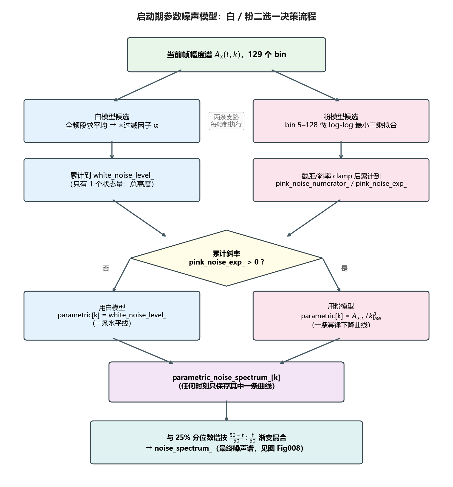

*图 Fig007：启动期参数噪声模型的完整决策流程。每帧频谱同时进入白、粉两条累计支路；菱形判断框根据累计斜率 `pink_noise_exp_` 二选一，填充参数谱 `parametric_noise_spectrum_`；最后与分位数谱渐变混合得到最终噪声谱（细节见 6.5.5）。图片由 `scripts/generate_fig007_fig008.py` 生成。*

#### 6.5.1 白噪声和粉噪声分别“长什么样”

**白噪声**的名字来自白光：白光近似包含各种可见频率，白噪声也近似在各频率上具有相同的功率谱密度。对本算法使用的幅度谱来说，可以把它直观理解为一条大致水平的频谱：

$$
\hat A_{white}(k)=C
$$

它的主要特征是：

- **频域**：低频和高频的平均强度近似相同，频谱整体较平；
- **时域**：相邻样本相关性弱，波形快速、无规则地抖动；
- **听感**：类似持续的“嘶——”声；
- **模型参数**：只需一个高度 $C$，因此极易在少量数据下估计。

**粉噪声**则是低频强、高频弱的噪声。标准定义通常是功率谱密度近似按 $1/f$ 下降；换成幅度谱时理想斜率会相应变化。本项目没有强行固定为某一个理论斜率，而是采用更一般的幂律幅度模型：

$$
\hat A_{pink}(k)=\frac{A}{k^\beta},\qquad 0\le\beta\le1
$$

它的主要特征是：

- **频域**：频率越高，平均幅度越小，曲线从左向右下降；
- **时域**：因为低频成分更强，波形通常比白噪声起伏得更缓慢；
- **听感**：比白噪声更低沉、更接近风声或远处轰鸣；
- **模型参数**：$A$ 决定整体高度，$\beta$ 决定下降有多陡。$\beta=0$ 时不再下降，模型就退化成平坦谱。

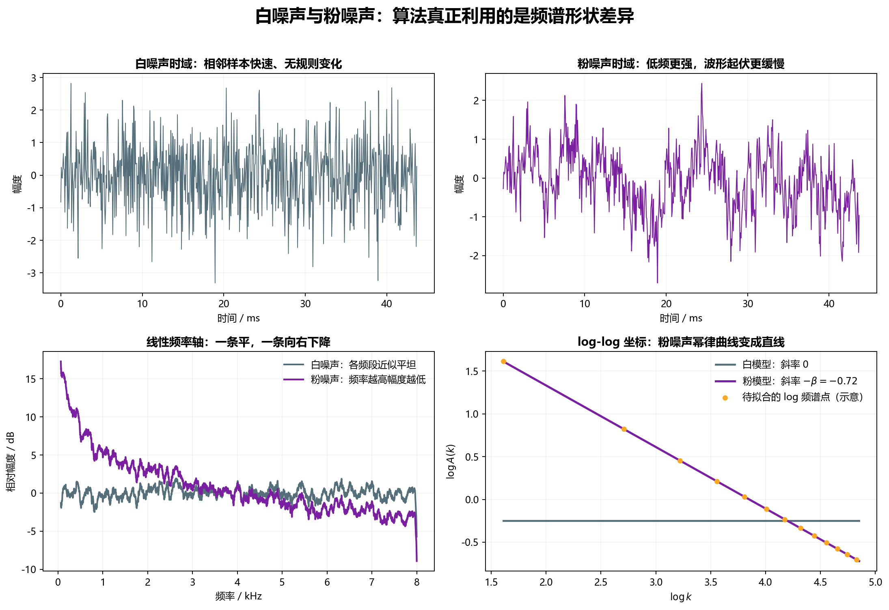

*图 Fig005：上半部分比较时域波形，下半部分比较频谱形状。算法真正利用的是下半部分：白模型近似水平，粉模型随频率下降；在 log-log 坐标中，幂律曲线会变成直线，因此可以用最小二乘快速拟合。图片由 `scripts/generate_noise_estimation_figures.py` 生成。*

需要注意：代码中的名字虽然叫 `pink_noise`，它实际表示的是**广义的下降幂律噪声模型**。算法并不是在严谨判定“麦克风里一定存在标准粉噪声”，而只是问：当前频谱的整体轮廓更像一条水平线，还是一条低频高、高频低的平滑曲线？

#### 6.5.2 白噪声模型如何估计

白模型要回答的问题非常简单：**如果暂时认为噪声谱是平的，这条水平线应该画多高？**

输入不是 256 个时域采样点，而是当前帧 FFT 后的 129 个非负频率幅度：

$$
A_x(t,0),A_x(t,1),\ldots,A_x(t,128)
$$

其中 $t$ 是帧序号，$k$ 是频率 bin。以 16kHz 采样率、256 点 FFT 为例，每个 bin 相隔 62.5Hz，因此这 129 个值覆盖 $0\sim8$kHz。

**第一步：把当前帧压缩成一个平均高度。**

代码把当前帧所有 bin 相加，再除以 129：

$$
\bar A_x(t)=\frac{1}{129}\sum_{k=0}^{128}A_x(t,k)
$$

这样，无论当前频谱原来有什么起伏，白模型都只保留一个数 $\bar A_x(t)$。例如为了便于演示，假设某一帧只有 5 个 bin：

```text
当前幅度谱：[1.0, 1.2, 0.9, 1.1, 0.8]
平均高度  ：(1.0 + 1.2 + 0.9 + 1.1 + 0.8) / 5 = 1.0
白模型    ：[1.0, 1.0, 1.0, 1.0, 1.0]
```

白模型不是判断这 5 个值“是不是随机”，而是直接抹掉频率方向上的形状，只保留总体平均强度。

**第二步：乘过减因子。**

当前降噪档位提供过减因子 $\alpha$：

$$
\bar A_{white}(t)=\alpha\bar A_x(t)
$$

本项目四个档位的 $\alpha$ 分别为 1、1、1.1、1.25。强档位会把启动噪声高度略微抬高。例如 $\bar A_x=1.0$、$\alpha=1.25$ 时，白模型按 1.25 而不是 1.0 计算。这样后续滤波会更积极，但也更可能伤及弱语音，所以它只是一项受档位控制的工程折中。

这里的 $\alpha$ 就叫**过减因子**（over-subtraction factor）。这个名字来自经典频谱减法。假设观测幅度由语音和噪声组成：

$$
A_x(k)\approx A_s(k)+A_d(k)
$$

最直接的做法是减去一份估计噪声：

$$
\hat A_s(k)=\max\big(A_x(k)-\hat A_d(k),0\big)
$$

但真实噪声会随机波动，$\hat A_d(k)$ 只是平均意义上的估计。只减一份经常减不干净，仍会留下断断续续的残余噪声。过减法因此故意减去 $\alpha$ 份噪声：

$$
\hat A_s(k)=\max\big(A_x(k)-\alpha\hat A_d(k),0\big),
\qquad \alpha\ge1
$$

“过减”中的“过”，指的就是**比当前估计的噪声再多减一点**，为估计误差和随机波动留出余量，而不是把时域样本重复相减。

例如某个 bin 的观测幅度为 5，估计噪声为 2：

| 过减因子 $\alpha$ | 被当作噪声扣除的量 | 剩余幅度 |
|:---:|---:|---:|
| 1.00 | $1.00\times2=2.0$ | 3.0 |
| 1.10 | $1.10\times2=2.2$ | 2.8 |
| 1.25 | $1.25\times2=2.5$ | 2.5 |

因此 $\alpha$ 越大：

- 噪声假设越保守，相当于认为“实际噪声可能比估计值更大”；
- 滤波器增益通常越小，残余噪声更少；
- 弱语音也更容易被误减，声音可能变薄并出现更多失真。

本算法最终不是直接使用上面的硬频谱减法，而是把相同思想放进维纳增益。稳态增益可写成：

$$
G(k)=\frac{\xi(k)}{\alpha+\xi(k)}
$$

其中 $\xi(k)$ 是先验 SNR。在相同 $\xi$ 下，$\alpha$ 越大，分母越大，增益越小。例如 $\xi=1$ 时：

$$
\alpha=1\Rightarrow G=0.50,
\qquad
\alpha=1.25\Rightarrow G\approx0.44
$$

所以它在维纳框架中的作用仍然是“多压一点噪声”，只是通过降低增益实现，而不是显式执行一次减法。

在启动阶段，代码中 $\alpha$ 有两处相关作用：

1. 构造白噪声候选时，用 $\alpha\bar A_x(t)$ 抬高白模型累计高度；
2. 构造启动增益时，再从累计观测谱中扣除 $\alpha\hat A_{param}(k)$。

第一处只直接出现在白模型累计中；粉模型的高度来自 log-log 拟合，没有在 `NoiseEstimator_PreUpdate()` 中额外乘 $\alpha$。但白、粉参数谱进入 `WienerFilter_Update()` 后，启动增益都会使用过减因子。也就是说，$\alpha$ 既控制稳态维纳增益的保守程度，也控制启动期参数噪声被扣除的力度。

> **过减因子一句话记忆**：噪声估计只是平均值，为防止“减不干净”，算法把它乘以一个不小于 1 的安全系数再参与抑制；系数越大，降噪越强，但伤害弱语音的风险也越高。

**第三步：跨启动帧累计，而不是覆盖旧值。**

代码将每一帧的结果加到 `white_noise_level_`：

$$
C_{acc}(t)\leftarrow C_{acc}(t-1)+\alpha\bar A_x(t)
$$

若前三帧的平均幅度分别为 1.0、1.2、0.8，且 $\alpha=1$，则：

| 帧 $t$ | 当前帧均值 $\bar A_x(t)$ | 累计量 $C_{acc}(t)$ | 截至当前帧的平均高度 $C_{acc}/(t+1)$ |
|:---:|---:|---:|---:|
| 0 | 1.0 | 1.0 | 1.0 |
| 1 | 1.2 | 2.2 | 1.1 |
| 2 | 0.8 | 3.0 | 1.0 |

累计的目的不是让噪声随着时间不断变大，而是先保存“前面所有帧的总和”。需要实际平均高度时，再除以已经观察的帧数 $t+1$：

$$
\bar C(t)=\frac{C_{acc}(t)}{t+1}
$$

多帧平均会减少单帧随机波动：某一帧整体偏高，下一帧可能偏低，累计后得到的水平线更稳定。

**第四步：展开成 129 个相同值。**

在代码数组 `parametric_noise_spectrum_` 中，白模型给每个 bin 写入相同的累计高度：

$$
\hat A_{param}(t,k)=C_{acc}(t),
\qquad k=0,1,\ldots,128
$$

也就是说，数组长这样：

```text
[C_acc, C_acc, C_acc, ..., C_acc]   共 129 项
```

这里存入累计高度而不是 $\bar C(t)$，是因为 6.5.5 的启动混合会再除以 $t+1$。这两步必须配套看：

```text
这里：保存累计总和 C_acc
后面：使用时除以 t+1
结果：得到前 t+1 帧的平均白噪声高度
```

对应代码逻辑可以简化成：

```c
frame_mean = sum_of_129_bins / 129;
white_accumulator += frame_mean * over_subtraction_factor;

for (k = 0; k < 129; ++k) {
    parametric_noise_spectrum[k] = white_accumulator;
}
```

因此，白模型的完整含义是：**每帧先对频率求平均，启动期间再对时间求平均，最后得到一条跨所有频率都相同的稳定水平线。**它牺牲了所有频谱形状信息，换取只用一个状态变量就能快速启动。

#### 6.5.3 粉噪声模型如何拟合

白模型只有一个高度，无法表示“低频明显比高频强”的噪声。粉模型因此多估计一个参数 $\beta$，让曲线可以向右下降：

$$
\hat A_{pink}(k)=\frac{A}{k^\beta}
$$

这里两个参数分工明确：

- $A$ 控制整条曲线的总体高度；
- $\beta$ 控制从低频到高频下降得有多快。

例如，在相同 $A=10$ 下：

| $\beta$ | 模型 | 频谱形状 |
|:---:|---|---|
| 0 | $10/k^0=10$ | 完全水平，等价于白模型 |
| 0.5 | $10/\sqrt{k}$ | 缓慢下降 |
| 1 | $10/k$ | 下降最明显 |

本节的难点是：代码如何从一帧的 124 个频谱点中求出 $A$ 和 $\beta$。

**第一步：只取 bin 5–128。**

拟合使用的数据点是：

$$
\big(k,A_x(t,k)\big),\qquad k=5,6,\ldots,128
$$

一共 $M=124$ 个点。跳过 bin 0–4 有三个原因：

1. $k=0$ 无法计算 $\log k$；
2. DC 和极低频容易受到麦克风直流偏置、窗函数泄漏和机械振动影响；
3. 少数异常低频点可能把整条拟合曲线拉歪。

**第二步：把幂律曲线变成直线。**

直接对 $A/k^\beta$ 做非线性拟合比较麻烦。对等式两边取自然对数：

$$
\log \hat A_{pink}(k)=\log A-\beta\log k
$$

令：

$$
x_k=\log k,\qquad y_k=\log A_x(t,k)
$$

就得到普通直线：

$$
y_k=b+mx_k,\qquad b=\log A,\quad m=-\beta
$$

原来弯曲的幂律曲线，在 log-log 坐标中变成一条直线。因此问题变成：找一条直线 $y=b+mx$，让它尽可能贴近 124 个点 $(x_k,y_k)$。

例如有三个简化观测：

```text
k                 5       10       20
A_x(k)          4.0      2.8      2.0

取 log 后：
x = log(k)      1.61     2.30     3.00
y = log(A)      1.39     1.03     0.69
```

$x$ 每增加约 0.69，$y$ 下降约 0.35，拟合斜率大约为 $m=-0.5$，所以 $\beta\approx0.5$。这表示幅度大致按 $1/\sqrt{k}$ 下降。

**第三步：用最小二乘计算截距和斜率。**

代码逐 bin 累加四个统计量：

$$
S_x=\sum x_k,\qquad
S_{xx}=\sum x_k^2,\qquad
S_y=\sum y_k,\qquad
S_{xy}=\sum x_ky_k
$$

然后计算公共分母：

$$
D=M S_{xx}-S_x^2
$$

直线截距 $b$ 和下降指数 $\beta=-m$ 分别为：

$$
b=\frac{S_{xx}S_y-S_xS_{xy}}{D}
$$

$$
\beta=\frac{S_xS_y-M S_{xy}}{D}
$$

这正对应 `noise_estimator.c` 中的两次 `num / denom`。第一组分子求截距，第二组分子求负斜率。

为什么要用最小二乘，而不是只看频谱两端？因为一帧频谱里有随机起伏、语音谐波和局部峰值。最小二乘同时参考 124 个点，让所有点共同决定整体趋势；一个孤立尖峰会有影响，但通常无法完全控制整条直线。

**第四步：限制参数范围。**

单帧拟合可能得到不合理结果。例如高频偶然比低频更强，会得到 $\beta<0$，代表曲线向右上升；某些异常帧也可能得到过陡斜率。代码因此执行：

$$
b\leftarrow\max(b,0),\qquad
\beta\leftarrow\min\big(\max(\beta,0),1\big)
$$

这里代码累计的 `pink_noise_numerator_` 实际是 log 域截距 $b=\log A$，变量名容易让人误以为它已经是线性域分子 $A$。只有生成参数谱时才通过指数函数把它变回线性域。

**第五步：跨帧累计的是参数，不是逐 bin 频谱。**

第 $t$ 帧拟合得到 $b_t$ 和 $\beta_t$ 后，代码执行：

$$
B_{acc}(t)=\sum_{j=0}^{t}b_j,
\qquad
\Beta_{acc}(t)=\sum_{j=0}^{t}\beta_j
$$

然后求截至当前帧的平均参数：

$$
\bar b(t)=\frac{B_{acc}(t)}{t+1},
\qquad
\bar\beta(t)=\frac{\Beta_{acc}(t)}{t+1}
$$

再将平均 log 截距转回线性域：

$$
\bar A(t)=\exp\big(\bar b(t)\big)
$$

注意，$\exp(\text{平均 log 幅度})$ 对应的是各帧高度参数的**几何平均**，不是算术平均。几何平均对偶然特别大的单帧值更不敏感，适合频谱这种跨数量级变化的数据。

为了与启动支路中的累计尺度匹配，代码实际构造的线性分子为：

$$
A_{acc}(t)=(t+1)\exp\big(\bar b(t)\big)
$$

**第六步：逐 bin 生成完整粉噪声参数谱。**

对每个 bin，代码先定义：


$$
k_{use}=\max(k,5)
$$

再生成累计尺度的参数谱：

$$
\hat A_{param}(t,k)=
\frac{A_{acc}(t)}{k_{use}^{\bar\beta(t)}}
$$

因此：

- bin 0–4 都按 $k=5$ 计算，形成相同高度的低频平台；
- bin 5 以后随 $k$ 增大逐渐下降；
- $\bar\beta=0$ 时分母恒为 1，曲线变成水平线；
- $\bar\beta$ 越接近 1，下降越明显。

实际代码不是每一帧在白模型和粉模型之间来回切换。`pink_noise_exp_` 保存的是从启动开始累计的非负 $\beta$；只要累计值仍为 0，就使用白模型。一旦前面某些帧拟合出正下降趋势，使累计值大于 0，后续启动期就使用粉模型，并通过平均 $\bar\beta$ 调整曲线陡峭程度。

对应代码可以简化为：

```c
for (k = 5; k < 129; ++k) {
    x = log(k);
    y = log(signal_spectrum[k]);
    accumulate(x, x*x, y, x*y);
}

intercept = least_squares_intercept();
beta = least_squares_negative_slope();
intercept = max(intercept, 0);
beta = clamp(beta, 0, 1);

intercept_accumulator += intercept;
beta_accumulator += beta;

mean_intercept = intercept_accumulator / (t + 1);
mean_beta = beta_accumulator / (t + 1);
accumulated_height = exp(mean_intercept) * (t + 1);

for (k = 0; k < 129; ++k) {
    use_bin = max(k, 5);
    parametric_noise_spectrum[k] =
        accumulated_height / pow(use_bin, mean_beta);
}
```

因此，粉模型的完整含义是：**每帧先在频率方向上拟合“总体高度 + 下降斜率”，再在时间方向上平均这两个参数，最后重新画出一条覆盖 129 个 bin 的平滑下降曲线。**它不是逐 bin 精确估计，而是用两个自由度概括整条噪声谱的大轮廓。

#### 6.5.4 不是只拟合一帧，而是跨前 50 帧累计

单帧频谱可能包含语音谐波和随机波动，直接相信某一帧的直线会很不稳定。因此在前 50 帧里，代码每帧都计算一次白模型高度、粉模型截距和斜率，并把这些参数继续累计；构造当前参数谱时再按已分析帧数做归一化。这样做相当于让多帧共同决定一条平滑轮廓，而不是让某一帧的尖峰决定整个模型。

但它仍不是严格的“纯噪声学习”：启动时算法还不知道哪些帧含语音，所以语音也可能进入拟合。这里依靠的是模型自由度很低——只有整体高度和一个斜率，孤立谐波很难被完整拟合进去。代价是它也无法描述风扇谐波、啸叫等窄带尖峰。

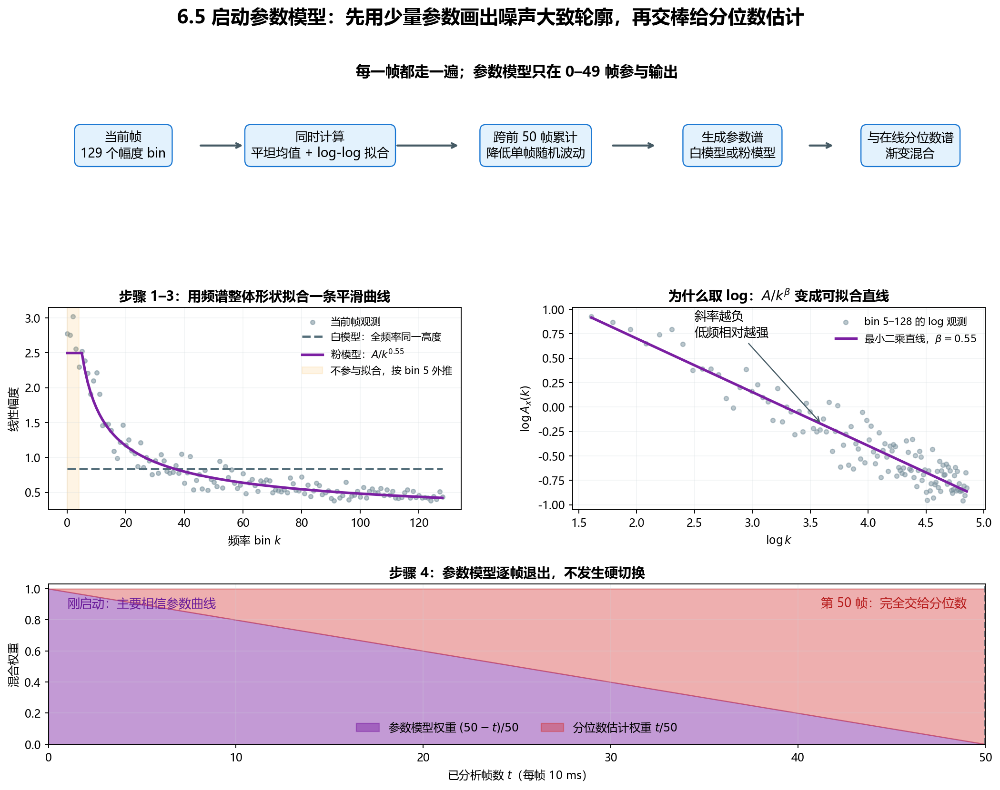

*图 Fig006：上方给出代码处理链；中间左图比较当前频谱、白模型与粉模型，中间右图展示 log-log 直线拟合；下方展示参数模型如何在前 50 帧逐渐把控制权交给分位数估计。图片由 `scripts/generate_noise_estimation_figures.py` 生成。*

#### 6.5.5 最终的噪声谱是怎么组成的

6.5.2 讲了白模型，6.5.3 讲了粉模型。读者很自然会问：**两个模型都算了，到底用哪一个？它们是怎么变成最终噪声谱的？**

---

**第一步：白与粉，二选一。**

白模型和粉模型**不是混合的**，而是根据累计统计量做一个二选一的判断（见 6.5 节开头的图 Fig007 中部菱形分支）。每帧两条支路都在累计：白模型只存一个累计总高度 `white_noise_level_`；粉模型存累计截距 `pink_noise_numerator_` 和累计斜率 `pink_noise_exp_`。生成参数谱时才做选择：

- **$Beta_{acc} = 0$**：前 $t$ 帧每次拟合出的斜率都被 clamp 到 0（频谱没有明显的"低频高、高频低"趋势）→ 调用白模型，`parametric_noise_spectrum_[全部 bin] = white_noise_level_`（一条水平线）。
- **$Beta_{acc} > 0$**：至少有一些帧出现了正下降趋势 → 调用粉模型，`parametric_noise_spectrum_[k] = A_{acc}(t) / k_{use}^{\bar\beta(t)}`（一条随频率下降的幂律曲线）。

因此，**`parametric_noise_spectrum_[k]` 里存的始终只是一条曲线**——要么平（白），要么下降（粉）。它不会同时包含两条曲线。6.5.2 和 6.5.3 是这条曲线的**两种候选生成方式**，不是两份独立的并行输出。

> **一句话**：算法同时维护白模型和粉模型的累计参数，但每帧只从两者中**选一个**来填充 `parametric_noise_spectrum_`。白模型是"兜底默认"，粉模型是"检测到下降趋势后的升级版"。

---

**第二步：参数谱与分位数谱渐变混合。**

选定的参数谱 `parametric_noise_spectrum_[k]` 本身只是启动期的临时草图。真正的最终噪声估计 $\hat A_d(t,k)$（即代码中 `noise_spectrum_` 数组）还需要把它和正在收敛的 25% 分位数估计 $\hat A_q(t,k)$ 混合起来，如图 Fig008 所示：

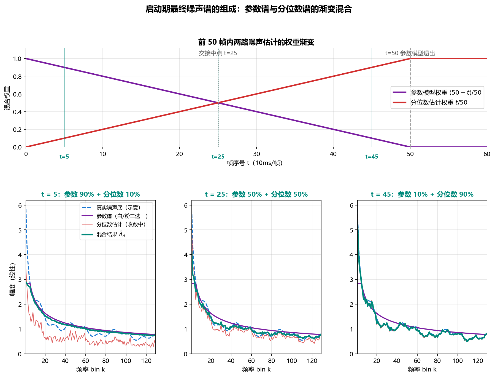

*图 Fig008：启动期最终噪声谱的组成（合成仿真示意）。上：两路估计的混合权重在前 50 帧内线性交接，$t=25$ 为中点，$t=50$ 后参数模型完全退出。下：三个时刻的频谱快照——$t=5$ 时混合结果（青线）几乎贴合平滑的参数谱（紫线），此时分位数估计（红线）尚未收敛、整体偏低；$t=45$ 时混合结果已基本跟随收敛后的分位数估计，能够呼应真实噪声底（蓝色虚线）的局部起伏。图片由 `scripts/generate_fig007_fig008.py` 生成。*

代码中的混合公式（简化形式）为：

$$
\hat A_d(t,k)=
\frac{t}{50}\hat A_q(t,k)
+\frac{50-t}{50(t+1)}\hat A_{param}(t,k),
\qquad 0\le t<50
$$

这里有一个容易混淆的点：代码中 `parametric_noise_spectrum_` 存的是**累计值**（不是平均值），所以公式里参数项额外除以 $t+1$ 来还原为平均尺度。若定义更容易理解的平均参数谱：

$$
\bar A_{param}(t,k)=\frac{\hat A_{param}(t,k)}{t+1}
$$

公式就变成更直观的线性渐变形式：

$$
\hat A_d(t,k)=
\frac{t}{50}\hat A_q(t,k)
+\frac{50-t}{50}\bar A_{param}(t,k)
$$

权重随时间的变化：

| 帧 $t$ | 分位数权重 $t/50$ | 参数模型权重 $(50-t)/50$ | 含义 |
|:---:|:---:|:---:|:---|
| 0 | 0% | 100% | 完全依靠参数模型（白或粉） |
| 10 | 20% | 80% | 参数模型仍主导 |
| 25 | 50% | 50% | 两者等权，交接中点 |
| 40 | 80% | 20% | 分位数估计接近接管 |
| 49 | 98% | 2% | 参数模型即将退出 |
| $\ge 50$ | 100% | 0% | 参数模型完全退出，分位数估计独立运行 |

这种渐变避免了第 50 帧发生噪声谱硬跳变——从"粗糙但稳定的参数模型"到"精确但需要时间收敛的分位数估计"之间没有断崖。

---

**第三步：最终噪声谱还经过一道"语音门控"平滑。**

上述混合产生的 $\hat A_d(t,k)$ 还不是终点。它作为初始估计进入 6.6 节的**后验更新**环节：用当前帧的语音存在概率 $P_s(k)$ 来控制 IIR 平滑的速度——噪声段快速跟踪，语音段几乎冻结。因此最终参与维纳滤波的噪声谱 = 上述混合结果再经过一次语音门控的指数平滑。

---

**用途二：给启动期维纳增益提供另一条稳定路径。**

除了参与噪声谱估计，参数模型还有一个独立用途：第 8.5 节会详细介绍，前 50 帧中维纳滤波器还会根据累计观测谱减去参数噪声谱，形成一个启动增益 $G_{init}(k)$，再与常规 decision-directed 维纳增益渐变混合。因此参数模型不仅影响“噪声估多少”，也直接帮助“刚启动时增益怎么算”。

#### 6.5.6 它能描述什么，不能描述什么

| 噪声形态 | 白/粉参数模型的表现 | 原因 |
|---|---|---|
| 宽带平坦底噪、电子嘶声 | 较好 | 白模型就是平坦谱 |
| 风声、空调轰鸣、低频偏强底噪 | 大致可用 | 粉模型能表达整体下降趋势 |
| 风扇转速谐波、50/60Hz 电源谐波 | 较差 | 少数参数无法画出多个尖锐谱峰 |
| 键盘、敲击等突发噪声 | 较差 | 模型假设频谱轮廓在短启动期内相对稳定 |
| 启动时立即出现强语音 | 可能偏高 | 算法尚无可靠语音判决，语音可能进入参数累计 |

> **6.5 小结**：白模型用一个数描述“整条谱有多高”，粉模型用两个数描述“整条谱有多高、向高频下降多快”。前 50 帧中，代码同时累计这两类信息；若下降指数为正，就用幂律曲线，否则退化为平坦曲线。得到的参数谱不是最终精确噪声估计，而是一张快速、平滑但粗糙的启动草图，随后在 500ms 内逐步交棒给逐 bin 的 25% 分位数估计。

### 6.6 后验更新：用语音概率控制“学习速度”

分位数估计给出稳健的长期噪声底，但当空调档位突然变化、风扇转速升高时，只靠低分位跟踪会响应偏慢。算法在计算出逐 bin 语音存在概率 $P_s(t,k)$ 后，再进行一次门控 IIR 更新。本节所有更新均**逐 bin 独立进行**：129 个 bin 各自维护一条时间轴上的递推，互不干扰。

先说动机。想跟上噪声变化，最直接的写法是普通 IIR，把当前观测直接喂给平滑器：

$$
\hat{A}_d(t,k)=\lambda\,\hat{A}_d(t-1,k)+(1-\lambda)\,A_x(t,k)\qquad\text{（有漏洞的写法）}
$$

漏洞在于：**如果这一帧其实是语音呢？** $A_x$ 里混着语音能量，直接喂进去，语音就会一点点渗入噪声模型——噪声估计被抬高，后续维纳滤波就会把语音当噪声压掉。所以在喂料之前要先做一道“安检”：按语音概率把观测“消毒”成一个允许被学习的版本，这就是候选噪声 $A_{cand}$ 的全部使命。

先把本节公式里的符号对齐（$t$ 是帧序号，$k$ 是频率 bin 序号）：

| 符号 | 含义 | 来自哪里 |
|------|------|------|
| $A_x(t,k)$ | 当前帧的**观测幅度谱**，即 6.1 节定义的 $\|X(k)\|+1$。下标 $x$ 表示带噪观测（语音+噪声混在一起的原始输入） | 每帧 FFT 后直接算出，代码中的 `signal_spectrum` |
| $\hat{A}_d(t,k)$ | **噪声幅度谱的估计值**。下标 $d$ 表示噪声（disturbance），戴帽子 $\hat{\ }$ 表示这是估计值而非真值 | 本章一路维护的主角，代码中的 `noise_spectrum_` |
| $A_{cand}(t,k)$ | **候选噪声**（candidate），本节新造的中间量：把“这一帧的观测中允许被当作噪声学进模型的部分”先算出来，再交给平滑器 | 仅在本节公式中出现 |
| $P_s(t,k)$ | 逐 bin 语音存在概率，取值 $[0,1]$ | 第 7 章的输出，代码中的 `speech_probability` |
| $\lambda$ | 一阶 IIR 的平滑系数（保留旧值的比例） | 代码中的局部变量 `gamma`（文档改用 $\lambda$，避免与第 7、8 章的后验 SNR $\gamma$ 撞名） |

第一步，把当前观测改写成“允许学习的候选噪声”：

$$
A_{cand}(t,k)=\big(1-P_s(t,k)\big)A_x(t,k)
+P_s(t,k)\hat{A}_d(t-1,k)
$$

这是一个按语音概率加权的插值，相当于对送进平滑器的“讲义”做把关：

- 当 $P_s\approx 0$：认为当前主要是噪声，候选值接近当前观测 $A_x$——这帧可以放心学。
- 当 $P_s\approx 1$：认为当前主要是语音，候选值退回上一帧噪声 $\hat{A}_d(t-1,k)$——平滑器照常执行一次更新，但吸收进去的几乎全是旧值，**等于没学**。
- 中间值：按比例各取一部分，语音概率越高，学得越少。

第二步，对候选值做一阶平滑（IIR），得到本帧的噪声估计：

$$
\hat{A}_d(t,k)=\lambda\,\hat{A}_d(t-1,k)+(1-\lambda)A_{cand}(t,k)
$$

$\lambda$ 是“保留旧值的比例”：$\lambda$ 越大，新观测进得越慢，估计越稳但响应越慢。它由语音概率控制：

$$
\lambda=
\begin{cases}
0.99, & P_s(t,k)>0.2 \\
0.90, & P_s(t,k)\le 0.2
\end{cases}
$$

因此纯噪声段每帧吸收约 10% 的新观测，能较快适应变化；疑似语音段只吸收约 1%，近似冻结。按 10ms 帧长粗略计算，$\lambda=0.90$ 的 $1/e$ 时间常数约为 95ms，$\lambda=0.99$ 则约为 995ms。

值得说透的是：$A_{cand}$ **并不是一个新的物理量，而是一个计算技巧**。把第一步代入第二步展开，会发现两步合起来仍是一个普通 IIR，只是学习速率变成了可变的：

$$
\hat{A}_d(t,k)=\big[\lambda+(1-\lambda)P_s\big]\hat{A}_d(t-1,k)
+\underbrace{(1-\lambda)(1-P_s)}_{\text{有效学习速率}}A_x(t,k)
$$

| 情形 | 有效学习速率（取 $\lambda=0.90$） | 效果 |
|------|:------:|------|
| $P_s=0$，纯噪声 | $10\%$ | 全速学习 |
| $P_s=0.5$，拿不准 | $5\%$ | 半速学习 |
| $P_s=1$，语音 | $0\%$ | 完全冻结，$\hat{A}_d(t)=\hat{A}_d(t-1)$ |

也就是说，语音概率在这里扮演一个连续的“学习阀门”：$P_s$ 越高，这一帧向噪声模型写入的比例越低，语音段自动刹车。写成“先构造候选、再平滑”两步，只是让公式和代码更好读。

代码还做了一个很实用的保护：如果按 $\lambda=0.99$ 得到的结果比 $\lambda=0.90$ 更高，就取两者较小值。含义是**语音段不允许噪声估计快速向上追赶语音，但允许它向下修正**。向上估错会伤语音，向下估错通常只是暂时多漏一点噪声，代价更可控。

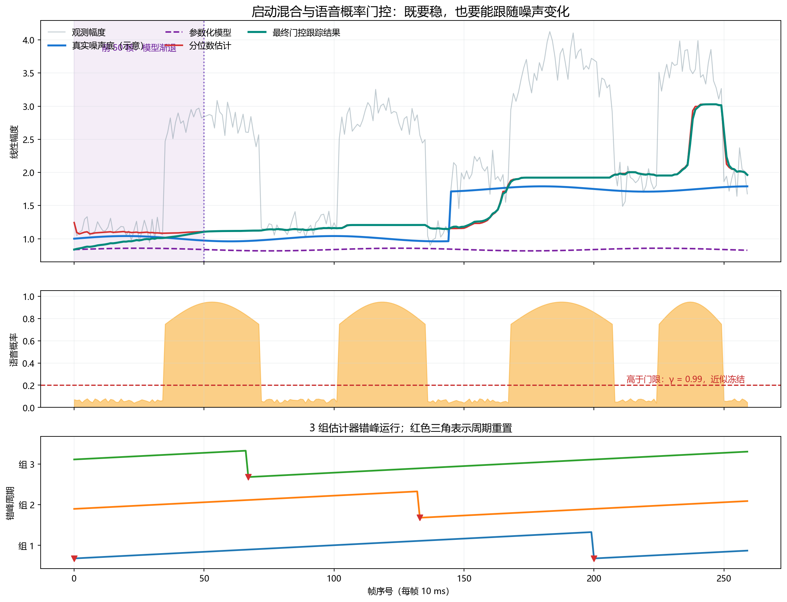

*图 Fig003：三个时间尺度的协同。前 50 帧由参数模型托底并渐退；分位数估计负责长期噪声底；后验 IIR 根据语音概率决定是否学习当前观测。底部示意当前实现中的 3 组分位数估计器如何错峰重置。图片由 `scripts/generate_noise_estimation_figures.py` 生成。*

### 6.7 保守噪声谱：给语音判决留一把“慢尺子”

除了直接用于维纳滤波的 $\hat{A}_d(k)$，代码还维护一份 `conservative_noise_spectrum`：

$$
\hat{A}_{cons}(t,k)\leftarrow
\hat{A}_{cons}(t-1,k)+0.05\big[A_x(t,k)-\hat{A}_{cons}(t-1,k)\big]
$$

但它只在 $P_s(t,k)<0.2$ 时更新。它的步长更小、条件更严格，因此不是为了快速追踪，而是作为较稳定的“噪声长相”模板。第 7 节的频谱差异特征会比较当前频谱与这把慢尺子：越不像长期噪声模板，越可能存在语音。

这也形成了一个闭环：噪声谱帮助计算语音概率，语音概率又控制噪声谱更新。闭环的风险是一次误判可能自我强化，所以系统同时使用分位数下界、参数化启动模型、门控 IIR 和保守模板，而不是把所有希望压在一个估计器上。

### 6.8 一张表看懂三类估计量

| 估计量 | 主要作用 | 更新速度 | 防止的问题 |
|------|------|:------:|------|
| 参数化噪声谱 | 前 50 帧启动托底 | 快 | 启动时样本不足、输出为零 |
| 3 组错峰分位数谱 | 提供长期稳健噪声底 | 慢 | 语音把均值抬高、单次异常值干扰 |
| 语音概率门控 IIR | 跟踪环境噪声缓慢变化 | 自适应 | 噪声变化跟不上、语音污染噪声模型 |
| 保守噪声谱 | 提供长期噪声形状模板 | 更慢 | 语音概率判决缺少稳定参照 |

### 6.9 什么时候会估不准

理解失效条件比记住公式更重要：

1. **长时间连续语音**：低分位窗口里没有足够的纯噪声帧，噪声底可能被逐渐抬高。
2. **突发噪声**：敲键盘、关门等持续时间很短，分位数估计不会立即承认它是新噪声，因此会短暂漏过；这其实是保护语音所付出的代价。
3. **噪声突然持续升高**：门控 IIR 能加速跟踪，但仍需要若干帧；跟得太快反而容易把语音起始误学进去。
4. **窄带强干扰**：参数化白/粉噪声模型无法描述尖锐谱峰，启动前 500ms 在对应频率上可能偏差较大。
5. **语音概率误判**：把语音判成噪声会污染估计；把噪声判成语音会冻结更新。阈值 0.2 偏保守，设计上宁愿暂时多留一点噪声，也尽量不伤语音。

可以把整套机制概括为一句话：**低分位数负责找“底”，参数模型负责启动，语音概率负责决定什么时候可以相信当前观测，保守谱负责给判决提供长期参照。**

---

## 7. 语音存在概率

### 7.1 为什么需要它

第 6 章留了一个口子：噪声谱的门控更新（6.6 节）需要知道“当前帧是不是语音”，而判断是不是语音又需要先有噪声谱——这是一个鸡生蛋的闭环。算法的解法是：不做硬判决，而是维护一个逐帧、逐 bin 的**语音存在概率** $P_s(t,k)$，让所有下游模块按概率加权行事：

- 噪声估计（6.6 节）用它决定每个 bin 的更新步长——概率高就少学、概率低就多学；
- 高频段处理（第 10 章）用 Band 0 高频端的平均概率推导标量增益；
- 增益修正（第 9 章）用全局先验概率在“语音场景”和“噪声场景”两套缩放之间过渡。

之所以能打破循环，是因为语音概率用的是**上一帧的滤波结果和噪声谱**（时间上错开一帧），加上大量平滑，闭环不会正反馈失稳。7.6 节会回头看这个环。

### 7.2 三个特征：从不同角度看“像不像语音”

单一指标总有失效场景，所以算法并联三个物理意义完全不同的特征。三者都是**每帧一个标量**（其中 LRT 有逐 bin 的中间量，7.5 节还会用到），刻画的是“整帧像不像语音”。以下记后验 SNR 为 $\gamma(k)$、先验 SNR 为 $\xi(k)$（两者怎么算见 8.3–8.4 节，这里只需知道：$\gamma$ 是“观测超出噪声底多少”，$\xi$ 是它的平滑版）。

**（a）似然比特征（LRT 均值）——从统计模型看**

把问题摆正：每个频点有两个候选解释——$H_0$：只有噪声；$H_1$：噪声叠加语音。统计学的标准工具是似然比检验：算一算观测在两个假设下的概率密度之比。在高斯假设下，对数似然比可用 $\gamma,\xi$ 表达为：

$$
\ell(k) = (\gamma(k) + 1) \cdot \frac{2\xi(k)}{1 + 2\xi(k)} - \log(1 + 2\xi(k))
$$

不必背这个式子，读懂它的行为就够：只有噪声时 $\gamma\approx 0$、$\xi\approx 0$，两项都趋于零，$\ell\approx 0$；有语音时 $\gamma$ 和 $\xi$ 同时变大，第一项增长快于第二项的对数增长，$\ell$ 显著为正。

每个 bin 的 $\ell(k)$ 再做时间平滑（新旧各占一半）：

$$
\bar{\ell}(k) \leftarrow 0.5\,\bar{\ell}(k) + 0.5\,\ell(k)
$$

全频段均值 $L = \frac{1}{129}\sum_k \bar{\ell}(k)$ 就是 LRT 特征。注意逐 bin 的 $\bar{\ell}(k)$ 没有被丢掉——7.5 节的逐 bin 后验概率就靠它。

**（b）频谱平坦度——从谱形状看**

$$
F = \frac{\exp\left(\frac{1}{129}\sum_k \log A_x(k)\right)}{\frac{1}{129}\sum_k A_x(k)}
\quad\text{（跳过直流 bin）}
$$

几何均值除以算术均值。均值不等式保证 $F \le 1$，且只有所有 bin 完全相等时取等号。几何均值对“谱上有深谷”极其敏感（乘法里一个接近零的因子会拖垮全局），而算术均值不敏感——于是：白噪声谱平坦，$F$ 接近 1；语音有谐波峰和谐波间的谷，$F$ 明显小于 1。实现上还有一个细节：只要有任何一个 bin 为零，就直接把 $F$ 向 0 衰减（谱上有洞，肯定不平坦）。时间平滑步长 0.3。

失效场景要记住：背景噪声本身不平坦（风噪、电源嗡嗡声）时，“平坦=噪声”的前提不成立——这正是 7.3 节引入“特征拒绝”机制的原因。

**（c）频谱差异——与噪声模板比形状**

把当前谱对保守噪声模板（6.7 节）做一次最小二乘回归，看残差方差有多大：

$$
D = \frac{\text{Var}(A_x) - \text{Cov}(A_x, \hat A_d^{cons})^2 / \text{Var}(\hat A_d^{cons})}{E_{norm}}
$$

直觉：如果当前帧只是“噪声模板 × 某个音量”，线性回归可以完美解释它，残差接近 0；语音会引入模板解释不了的形状差异，残差变大。换句话说，这个特征对“音量变化”免疫——噪声变响不会触发它，只有**谱形状变化**才会。分母 $E_{norm}$ 是运行时维护的长期能量均值，保证 $D$ 对绝对音量不敏感。时间平滑步长同为 0.3。

### 7.3 阈值不写死：让环境自己教

三个特征算出来后还不能直接判决——多少算“大”？办公室、车内、街道的特征分布完全不同，写死阈值等于假设了使用环境。

算法的做法是：为三个特征各维护一个 **1000-bin 直方图**，累积最近 500 帧（5 秒）的取值分布，每 500 帧提取一次阈值与权重，然后清空重新累积：

| 特征 | 阈值提取方法 | 拒绝条件（权重置零） |
|---|---|---|
| LRT | 取直方图低段（0〜1 区间）均值 ×1.2，夹到 $[0.2, 1.0]$；若波动极小直接设 1.0 | 不拒绝（永远参与） |
| 平坦度 | 找分布主峰位置 ×0.9，夹到 $[0.1, 0.95]$ | 主峰样本占比 < 30%，或主峰位置 < 0.6 |
| 频谱差异 | 找分布主峰位置 ×1.2，夹到 $[0.16, 1.0]$ | 主峰样本占比 < 30%，或 LRT 波动极小 |

几个设计细节值得琢磨：

- **为什么用主峰位置当阈值基准**：一段正常音频里大部分帧是噪声或停顿，直方图主峰自然落在“纯噪声时该特征的典型值”附近。平坦度阈值取主峰 ×0.9（往语音方向收一点），差异阈值取主峰 ×1.2（要明显超出噪声典型值才算语音）。
- **LRT 波动极小 → 阈值抬到 1.0**：如果 5 秒内 LRT 几乎不动，说明环境里根本没有语音，把阈值抬高让 LRT 指示函数难以触发，避免把噪声误判成语音；同时这个状态也会连带拒绝频谱差异特征。
- **平坦度主峰 < 0.6 时拒绝**：说明背景噪声本身就不平坦，这个特征在当前环境里没有区分力，用了反而添乱。
- **权重均分**：留下的特征各占 $1/(1 + use_{flat} + use_{diff})$——LRT 永远在场，另外两个按环境可用性进出。

这就是“自适应”的具体含义：**判决规则的形状是固定的，但阈值和特征组合每 5 秒由当前环境重新标定一次。**

### 7.4 tanh 软判决与融合

有了阈值，也不做硬判决（硬判决在阈值附近会频繁翻转），而是每个特征过一个 tanh 软映射到 $[0,1]$：

$$
I_0 = \frac{1}{2}\left[\tanh\big(w \cdot (L - \theta_{lrt})\big) + 1\right],\qquad
I_1 = \frac{1}{2}\left[\tanh\big(w \cdot (\theta_{flat} - F)\big) + 1\right],\qquad
I_2 = \frac{1}{2}\left[\tanh\big(w \cdot (D - \theta_{diff})\big) + 1\right]
$$

两个细节：

- $I_1$ 里是 $\theta_{flat} - F$（反向），因为平坦度越**低**越像语音。
- **判决斜率是不对称的**：特征落在阈值的“噪声侧”时，tanh 宽度 $w$ 从 4 加倍到 8。原因是噪声侧的取值范围很窄（比如 LRT 在噪声段挤在 $0\sim\theta_{lrt}$ 之间），斜率放大一倍才能在这个窄区间内拉开区分度。

加权求和后做一阶平滑，得到全局先验语音概率：

$$
P_{prior} \leftarrow P_{prior} + 0.1 \cdot \big(w_0 I_0 + w_1 I_1 + w_2 I_2 - P_{prior}\big)
$$

步长 0.1 对应约 100ms 的时间常数。结果强制夹在 $[0.01, 1]$——下限 0.01 不是随手写的：7.5 节的先验 odds $(1-P)/P$ 在 $P\to 0$ 时会爆炸，地板保证它最多放大到 99 倍。

### 7.5 逐 bin 后验概率

全局先验只说“这一帧大概有没有人说话”，落实到每个 bin 靠贝叶斯公式：后验 odds = 先验 odds × 似然比。每个 bin 的似然比正是 $e^{\bar{\ell}(k)}$（7.2a 已经算好的平滑对数似然比），整理成概率形式：

$$
P_s(k) = \frac{1}{1 + \frac{1 - P_{prior}}{P_{prior}} \cdot e^{-\bar{\ell}(k)}}
$$

三种情形读一遍就懂了：

- $\bar{\ell}(k) \gg 0$（这个 bin 明显高于噪声底）：$e^{-\bar\ell}\to 0$，$P_s\to 1$，不管先验多小；
- $\bar{\ell}(k) \approx 0$（这个 bin 自己说不清）：$e^0 = 1$，$P_s = P_{prior}$，完全交给全局先验；
- $\bar{\ell}(k) < 0$：$P_s$ 被压到先验以下。

也就是说：**全局特征定基调，逐 bin 似然比做微调**。一帧语音里，谐波所在的 bin 概率高、谐波之间的 bin 概率低，形成逐 bin 的精细门控——这比整帧一刀切的 VAD 细腻得多。

### 7.6 全景与闭环

完整流程如图 Fig011：

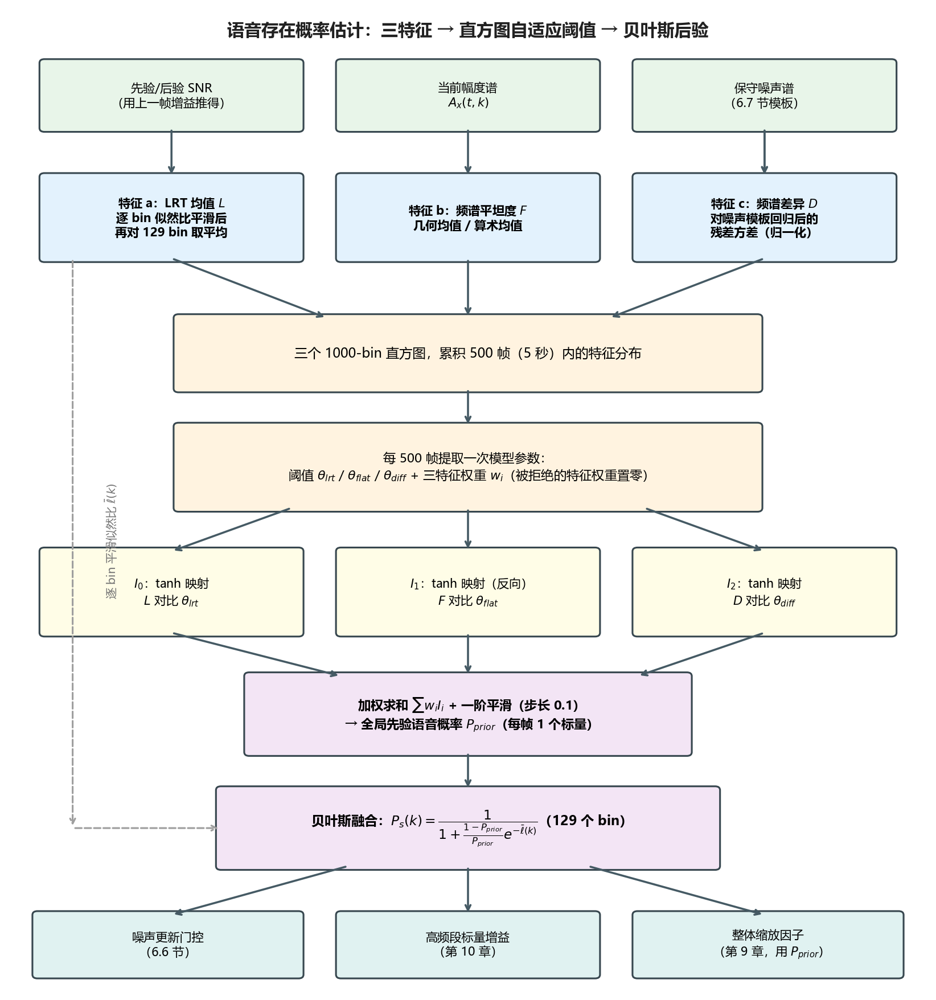

*图 Fig011：语音存在概率估计的完整流程。三个特征分别从统计模型、谱形状、模板差异三个角度提取；直方图每 500 帧自适应标定阈值与权重；tanh 软判决融合为全局先验 $P_{prior}$，再与逐 bin 似然比做贝叶斯融合得到 $P_s(k)$。图片由 `scripts/generate_fig011_fig012.py` 生成。*

最后回看 7.1 的鸡生蛋问题。整个系统实际是一个反馈环：

> 噪声谱 → 算出 $\xi,\gamma$ → LRT/语音概率 → 门控噪声更新 → 新的噪声谱 → …

环里每一步都有平滑（$\bar\ell$ 的 0.5、特征的 0.3、$P_{prior}$ 的 0.1、噪声谱的 IIR、下一章 DD 的 0.98），任何单帧误判都会被稀释；而直方图每 5 秒重标定一次阈值，长期上又能跟着环境走。**短平滑保稳定、长窗口保适应**，是这一章反复出现的模式。

---

## 8. 维纳滤波器

维纳滤波器是降噪的**执行环节**：前面几章辛苦算出的噪声谱（第 6 章）和 SNR，最终都汇到这里，变成 129 个逐 bin 的乘法增益 $G(k)$，直接乘在频谱上——乘完再逆变换回时域，就是降噪后的声音。和第 6 章一样，本章所有计算逐 bin 独立进行。

先把本章公式里的符号对齐：

| 符号 | 含义 | 来自哪里 |
|------|------|------|
| $G(k)$ | 第 $k$ 个 bin 的**乘法增益**，取值 $[G_{min},1]$：1 = 完全保留，越小压得越狠 | 本章的输出，代码中的 `filter_` |
| $A_x(t,k)$ | 当前帧观测幅度谱（6.1 节的 $\|X(k)\|+1$） | `signal_spectrum` |
| $\hat{A}_d(t,k)$ | 噪声幅度谱估计 | 第 6 章的输出，`noise_spectrum_` |
| $\xi(k)$ | **先验 SNR**：干净语音与噪声之比 $S/N$。增益公式真正需要的量，但干净语音不可观测，只能估计（8.3–8.4 节） | DD 递推得到，`snr_prior` |
| $\gamma(k)$ | **后验 SNR**：观测超出噪声底的部分，可由 $A_x/\hat{A}_d$ 直接算出 | 每帧现算，`current_tsa` |
| $\alpha$ | 过减因子（over-subtraction factor），控制压噪激进度 | 降噪档位参数，`suppression_params.c` |
| $G_{min}$ | 增益下限（地板），不让任何 bin 被彻底静音 | 降噪档位参数，`suppression_params.c` |

### 8.1 全景：一帧之内发生什么

在扎进公式之前，先建立全局图景。每帧（10ms）维纳滤波器内部只做五件事：

1. **拿输入**：当前帧观测幅度谱 $A_x(t,k)$，以及第 6 章刚更新好的噪声谱 $\hat A_d(t,k)$；
2. **算新证据**：后验 SNR $\gamma(k)$——“观测超出噪声底多少”（8.2.2 节）；
3. **估先验 SNR**：把“上一帧的判决”与“本帧新证据”按 98%/2% 融合成 $\xi(k)$（8.3–8.4 节，全章核心）；
4. **算增益并应用**：$\xi$ 套进增益公式得到 $G(k)$，乘到频谱上（8.2 节）；
5. **回写缓存**：把本帧的 $A_x$、$\hat A_d$、$G$ 存下来，成为下一帧眼中的"上一帧"。

第 5 步存的东西，正是下一帧第 3 步要读的——这构成一个**跨帧闭环**，是理解本章的钥匙：

> **每一帧的输出，会变成下一帧估计的输入。**

完整数据流如图 Fig013。第一遍看不必纠结每个公式，只要看清两件事：左右两条通道在"DD 融合"处汇合；底部橙色虚线绕回顶部，把流程图变成了一个环：

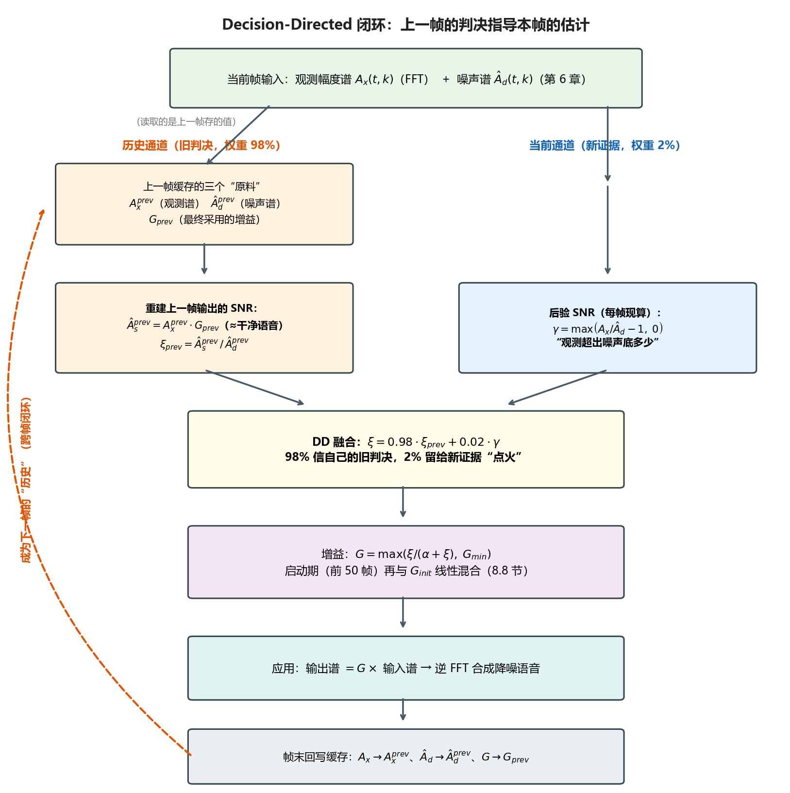

*图 Fig013：Decision-Directed 闭环的一帧数据流。左列"历史通道"从缓存重建上一帧输出的 SNR（权重 98%），右列"当前通道"用本帧观测现算后验 SNR（权重 2%），两者融合成先验 SNR 后依次经过增益计算、频谱相乘；帧末把三个"原料"回写缓存（橙色虚线），成为下一帧历史通道的输入。图片由 `scripts/generate_fig013.py` 生成。*

下面按“增益公式怎么来（8.2）→ 公式需要的 SNR 从哪来（8.3–8.4）→ 启动怎么办（8.5）→ 实现细节（8.6）”的顺序展开。

### 8.2 增益公式：从理想到工程

#### 8.2.1 理想维纳增益——语音占多少，就保留多少

先回到最理想化的问题：已知某个 bin 上语音功率 $S$、噪声功率 $N$，用一个乘法增益 $G$ 去逼近干净语音，使均方误差最小。解就是经典的维纳增益：

$$
G = \frac{S}{S+N} = \frac{\xi}{1+\xi},\qquad \xi = \frac{S}{N}
$$

它的行为非常符合直觉：**这个 bin 里语音占多少比例，就保留多少比例**。代几个数感受一下：

| 先验 SNR $\xi$ | 含义 | 理想增益 $G$ | 效果 |
|:---:|:---|:---:|:---|
| 9 | 语音功率是噪声 9 倍 | 0.90 | 几乎不动 |
| 1 | 语音和噪声一样强 | 0.50 | 压掉一半 |
| 0.1 | 噪声远强于语音 | 0.09 | 大幅压低 |

这张表就是整个维纳滤波器的"世界观"：**增益 = 语音在观测中的占比**。如果能在每个 bin 上准确知道这个占比，降噪就完成了。问题在于——$\xi = S/N$ 里的 $S$（干净语音功率）根本不可观测。

#### 8.2.2 后验 SNR——能直接算的量

既然 $S$ 不可观测，我们先退而求其次，算一个能直接观测的量——**后验 SNR**：

$$
\gamma(k) = \max\left(\frac{A_x(k)}{\hat{A}_d(k)} - 1,\; 0\right)
$$

逐项拆开看每一项的物理含义：

- **$A_x/\hat{A}_d$**：当前观测比噪声底高多少倍。纯噪声帧这个比值在 1 附近波动；有语音时显著大于 1。
- **$-1$**：观测里本身含着噪声（$A_x \approx A_s + A_d$），减掉 1 就是把噪声自身的那份贡献扣除，剩下的才是"疑似语音超出噪声底的部分"。
- **$\max(\cdot, 0)$**：比值小于 1 说明观测甚至低于噪声底——这只可能是随机波动或噪声估高了。SNR 不存在负值，截断到 0。

$\gamma$ 可以理解为"本帧、本 bin 上，**观测信号超出噪声底的份额**"。它是每帧现算的"新证据"。

但 $\gamma$ 直接当 $\xi$ 用会出大问题：噪声是随机的，$\gamma$ 逐帧剧烈抖动，增益跟着抖，每个 bin 各抖各的——听感上就是臭名昭著的**音乐噪声**（musical noise）：残留噪声变成一串一串随机出现的纯音短促"水泡音"。

我们需要一种方法，从抖动的 $\gamma$ 中提取出稳定的 $\xi$ 估计。这就是 8.3–8.4 节的核心任务。

#### 8.2.3 工程版增益公式——两个旋钮

在拿到稳定的 $\xi$ 估计之前，先把增益公式的完整形态摆出来。工程实现在理想解基础上加了两个旋钮：

$$
G(k) = \max\left(\frac{\xi(k)}{\alpha + \xi(k)},\; G_{min}\right)
$$

图 Fig014 把这个公式拆成四步流水线，展示从 $\xi$ 到最终 $G(k)$ 的完整变换：

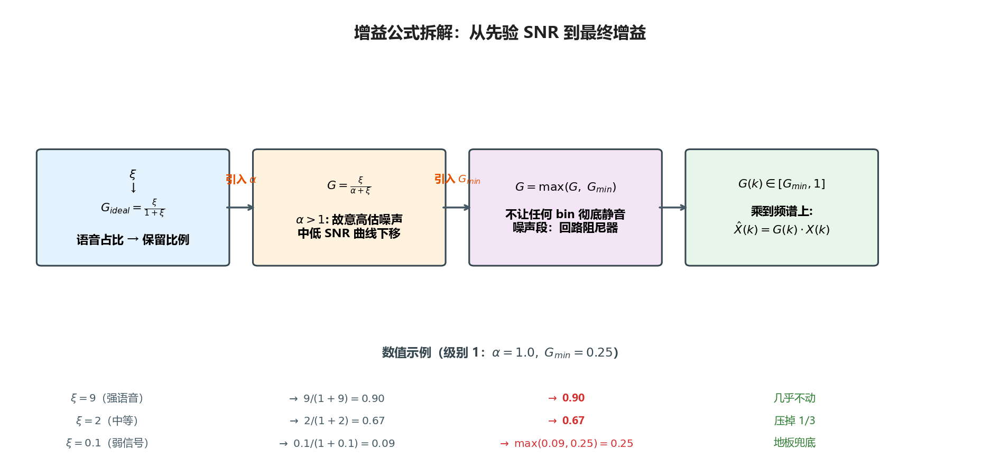

*图 Fig014：增益公式的四级流水线。$\xi$ 先进入理想维纳公式，再经 $\alpha$ 过减修正，然后被 $G_{min}$ 地板截断，最终得到每个 bin 的乘法增益。底部数值示例展示了三种典型 SNR 下的计算过程。图片由 `scripts/generate_fig014_fig015_fig016.py` 生成。*

两个旋钮各自的作用：

- **过减因子 $\alpha$**：$\alpha > 1$ 相当于把噪声"高估"一点，同样的 $\xi$ 下增益更低，压噪更狠，代价是低 SNR 的语音成分也被多削一点。
- **增益下限 $G_{min}$**：不让任何 bin 被完全静音。留一层"噪声地板"听感上反而更自然——完全静音会产生不连续的"真空感"，且增益在 0 附近抖动时音乐噪声最刺耳。另外它在 8.4 节还有一个关键的隐藏角色：**噪声段的回路阻尼器**。

#### 8.2.4 四个降噪档位

两个参数由初始化时选定的降噪级别决定（`suppression_params.c`）：

| 级别 | $\alpha$ | $G_{min}$ | 最大衰减 | 启用增益修正（第 9 章） |
|:---:|:---:|:---:|:---:|:---:|
| 0 | 1.0 | 0.5 | ≈6 dB | 否 |
| 1 | 1.0 | 0.25 | ≈12 dB | 是 |
| 2 | 1.1 | 0.125 | ≈18 dB | 是 |
| 3 | 1.25 | 0.09 | ≈21 dB | 是 |

最大衰减 = $-20\log_{10}(G_{min})$ dB。

增益曲线对比见图 Fig012 左半部分：$\alpha$ 只在中低 SNR 区域把曲线往下推，$G_{min}$ 决定地板高度；高 SNR 端四条曲线汇合到 0dB——**不管哪个级别，强语音都不动**。

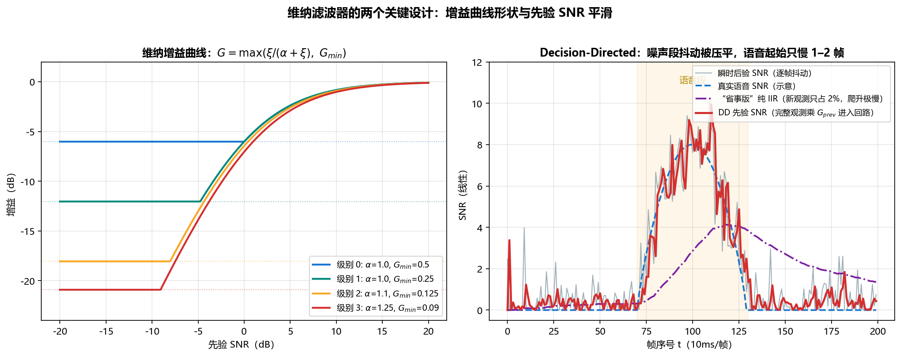

*图 Fig012：左——四个降噪级别的增益曲线，虚线为各自的 $G_{min}$ 地板；右——合成信号上的先验 SNR 估计对比（见 8.4 节）：紫色点划线是"省事版"纯 IIR 平滑，语音起始爬升极慢、结束后拖尾；红色是真实 DD 递推，噪声段抖动被增益地板压平，语音段只滞后 1–2 帧。图片由 `scripts/generate_fig011_fig012.py` 生成。*

**一个具体例子帮你感受 $\alpha$ 和 $G_{min}$ 各自干什么：**

假设某 bin 的 $\xi = 2$（语音功率是噪声 2 倍）：

- $\alpha = 1.0$：$G = 2/(1+2) = 0.67$
- $\alpha = 1.25$：$G = 2/(1.25+2) = 0.62$，多压了一点
- 若算出来 $G = 0.05$ 但 $G_{min} = 0.25$：最终 $G = \max(0.05, 0.25) = 0.25$，地板兜底

### 8.3 核心难题：先验 SNR 的"先有鸡还是先有蛋"

#### 8.3.1 问题的本质

增益公式需要 $\xi = S/N$，但 $S$ 不可观测。如果我们已经有了增益 $G$，倒是可以反推：$S \approx A_x \cdot G$（滤波输出就是"干净语音"的估计）。但 $G$ 本身又依赖 $\xi$——这是一个循环依赖：

$$
\xi \to G \to \hat{S} \to \xi \to \cdots
$$

**要算增益需要先知道 SNR，要算 SNR 需要先有增益。**

#### 8.3.2 Decision-Directed 的巧妙解法

Ephraim & Malah (1985) 的定向判决（Decision-Directed）方法用**时间**来打破这个循环：**用上一帧的滤波结果当作"干净语音"的代理**，从而绕过当前帧的循环依赖。

核心思想：上一帧已经做过了"估计 $\xi \to$ 算出 $G \to$ 滤波得到输出"这一整套流程。那个输出 $A_x^{prev} \cdot G_{prev}$ 就是上一帧算法认为的"干净语音"。拿它的 SNR 作为本帧 $\xi$ 的主体估计，再用 2% 的本帧新证据 $\gamma$ 微调：

$$
\xi(k) = 0.98 \cdot \underbrace{\frac{A_x^{prev}(k)}{\hat{A}_d^{prev}(k)} \cdot G_{prev}(k)}_{\text{历史项：上一帧的"干净"SNR 估计}} + 0.02 \cdot \underbrace{\gamma(k)}_{\text{新证据：本帧后验 SNR}}
$$

三个带 $prev$ 的量都是上一帧的状态，代码在每帧末尾存下来：

- $A_x^{prev}$：上一帧的观测幅度谱（`spectrum_prev_process_`）
- $\hat{A}_d^{prev}$：上一帧的噪声估计（`prev_noise_spectrum`）
- $G_{prev}$：上一帧最终采用的增益（更新前的 `filter_`）

**历史项的拆解**：$A_x^{prev} \cdot G_{prev}$ 就是上一帧滤波器的输出幅度，即算法当时认为的"干净语音"；再除以噪声底 $\hat{A}_d^{prev}$，得到"上一帧干净语音的 SNR"。

这个递推的关键在于：它不是简单的 IIR 平滑。历史项里乘了上一帧增益 $G_{prev}$——正是这个 $G_{prev}$，让系统同时做到了"噪声段稳、语音段快"。

### 8.4 为什么 DD 又稳又快：增益回路的双面角色

这是全章最关键的一节。理解了这个机制，整个维纳滤波器的行为就不再神秘。

#### 8.4.1 噪声段：$G_{prev}$ 是阻尼器

在纯噪声段，上一帧的增益 $G_{prev}$ 被压在 $G_{min}$（比如 0.25）。这意味着：

$$
\text{历史项} = \frac{A_x^{prev}}{\hat{A}_d^{prev}} \cdot \underbrace{G_{prev}}_{\approx 0.25} \approx 1.0 \times 0.25 = 0.25
$$

$A_x^{prev}/\hat{A}_d^{prev}$ 在噪声段大约是 1（观测 ≈ 噪声底），但乘以 $G_{min}$ 后被压到了 0.25。即使 $A_x/\hat{A}_d$ 在帧间剧烈抖动（比如从 0.5 到 2.0），乘以 0.25 后波动范围缩小到 $[0.125, 0.5]$。再加上 98% 的权重和 2% 的 $\gamma \approx 0$，$\xi$ 被牢牢压在低位。

结果：增益稳稳坐在地板上，不会随噪声随机波动而跳来跳去。**音乐噪声就这样被消灭了。**

#### 8.4.2 语音起始：2% 的"点火"

当语音突然到来时，$\gamma$ 大幅跳升（比如从 0 跳到 4.0）。虽然 2% 看起来微不足道，但：

$$
\xi = 0.98 \times 0.25 + 0.02 \times 4.0 = 0.245 + 0.08 = 0.325
$$

增益从 $0.25$（地板）升到了 $0.325/(1+0.325) = 0.245$——看起来变化不大，但关键是 $\xi$ 已经**离开了零点**。

下一帧情况就大不相同了。此时 $A_x^{prev}/\hat{A}_d^{prev}$ 已经是高值（比如 5.0），$G_{prev}$ 也开始抬升：

$$
\xi = 0.98 \times (5.0 \times 0.25) + 0.02 \times \gamma = 0.98 \times 1.25 + \cdots \approx 1.27
$$

增益跳到 $1.27/(1+1.27) = 0.56$——已经离开地板，开始跟踪真实 SNR。

**整个过程只滞后 1–2 帧（10–20ms），人耳完全察觉不到。**

#### 8.4.3 数值实例：逐帧跟踪

让我们把上面的过程展开成一张完整的表，看看 DD 递推在语音起始的几帧里是如何工作的。假设级别 1（$\alpha=1.0, G_{min}=0.25$），噪声段 $A_x/\hat{A}_d \approx 1.0$：

| 帧 | $A_x/\hat{A}_d$ | $\gamma$ | 历史项 | $\xi = 0.98\times\text{历史} + 0.02\times\gamma$ | $G$ |
|:---:|:---:|:---:|:---:|:---:|:---:|
| 69（噪声） | 1.0 | 0 | $1.0\times0.25=0.25$ | $0.98\times0.25+0=0.245$ | 0.25（地板） |
| 70（噪声） | 1.1 | 0.1 | $1.1\times0.25=0.275$ | $0.98\times0.275+0.02\times0.1=0.271$ | 0.25（地板） |
| **71（语音来了）** | **5.0** | **4.0** | $1.0\times0.25=0.25$ | $0.98\times0.25+0.02\times4.0=\mathbf{0.325}$ | 0.25（地板） |
| **72（语音持续）** | **5.0** | **4.0** | $5.0\times0.25=1.25$ | $0.98\times1.25+0.02\times4.0=\mathbf{1.305}$ | **0.57** |
| 73（语音持续） | 5.0 | 4.0 | $5.0\times0.57=2.85$ | $0.98\times2.85+0.02\times4.0=2.87$ | 0.74 |
| 74（语音持续） | 5.0 | 4.0 | $5.0\times0.74=3.70$ | $0.98\times3.70+0.02\times4.0=3.71$ | 0.79 |

注意第 71 帧到第 72 帧的跳变：历史项从 $1.0\times0.25=0.25$ 突然变成 $5.0\times0.25=1.25$——因为 $A_x^{prev}/\hat{A}_d^{prev}$ 从上帧的"噪声段 1.0"跳到了"语音段 5.0"。这个 5 倍的跳变是 $\xi$ 快速上升的真正驱动力。

到第 74 帧（仅 30ms 后），增益已经从 0.25 爬升到了 0.79，接近稳态值。

#### 8.4.4 对比：为什么"省事版"不行

一个自然的替代方案是**不做 DD**，直接对 $\gamma$ 做 IIR 平滑：

$$
\xi_{naive}(k) = 0.98 \cdot \xi_{naive}^{prev}(k) + 0.02 \cdot \gamma(k)
$$

这看起来和 DD 公式结构一样，只是少了 $G_{prev}$ 这个因子。但行为天差地别：

- **噪声段**：$\xi_{naive}$ 在 0 附近缓慢累积。因为 0.98 的权重把历史值几乎原样保留，新观测只有 2% 的影响。$\xi$ 会慢慢偏离 0，导致增益偶尔离开地板——音乐噪声。
- **语音起始**：$\xi_{naive}$ 从接近 0 开始，仅靠 2% 的 $\gamma$ 往上爬。即使 $\gamma=4$，每帧只增加 $0.02\times4=0.08$。需要**十几帧**才能爬到合理值——语音起始被严重拖慢，辅音被吃掉。

**DD 比朴素 IIR 好的根本原因**：DD 的历史项不是 $\xi$ 本身，而是 $(A_x^{prev}/\hat{A}_d^{prev}) \times G_{prev}$。在噪声段，$G_{prev}=G_{min}$ 是一个固定的衰减因子，把历史项自动压到 $\xi \cdot G_{min}$ 的平衡点，$\xi$ 不会乱跑。在语音段，$A_x^{prev}/\hat{A}_d^{prev}$ 的跳变直接放大了历史项，形成正反馈——新观测只需要"点火"，增益回路自身会迅速跟上。

图 Fig015 用三个面板完整展示了这一机制：

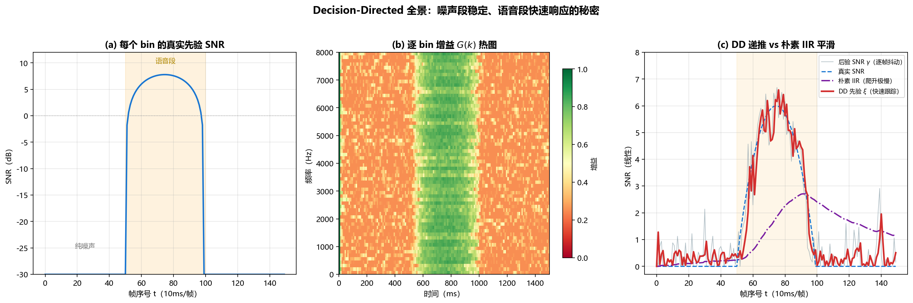

*图 Fig015：Decision-Directed 的三视角全景。(a) 每个 bin 的真实先验 SNR 时序——噪声段为零，中间为语音隆起；(b) 逐 bin 增益 $G(k)$ 的热图——注意噪声段增益均匀贴在地板（暗色），语音段增益迅速抬升（亮色）且各 bin 分布均匀，没有音乐噪声特有的斑驳闪烁；(c) DD 先验 SNR（红线）对比朴素 IIR（紫点划线）和瞬时后验 SNR（灰色细线）——DD 在噪声段紧贴零轴不抖动，语音起始仅滞后 1–2 帧，而朴素 IIR 爬升极慢。图片由 `scripts/generate_fig014_fig015_fig016.py` 生成。*

图 Fig016 进一步把噪声段和语音起始的回路行为拆开对比：

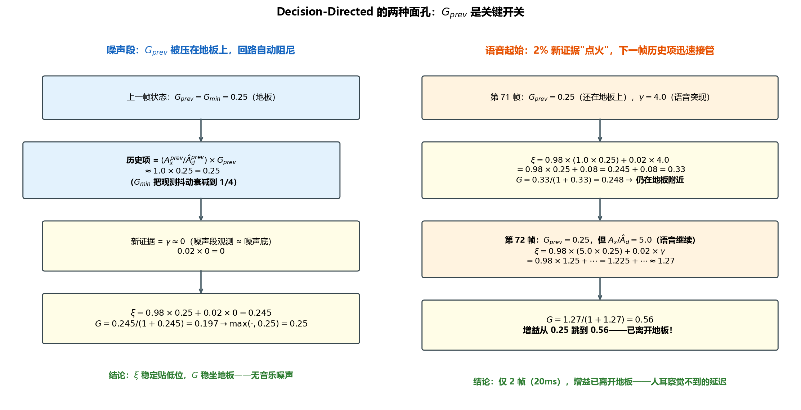

*图 Fig016：DD 回路在两种场景下的数值对比。左列（蓝色）：噪声段——$G_{prev}$ 被压在地板上，历史项被衰减到 0.25，$\xi$ 稳定贴低位。右列（橙色）：语音起始——2% 的新证据"点火"后，下一帧历史项因 $A_x/\hat{A}_d$ 跳变而迅速放大，仅 2 帧增益即离开地板。图片由 `scripts/generate_fig014_fig015_fig016.py` 生成。*

**一句话总结：0.98/0.02 这个看似极端的比例能成立，不是因为 98% 的平滑有多强，而是因为增益回路自身在噪声段提供了天然的阻尼，在语音段提供了天然的正反馈。2% 的新观测只负责"点火"。**

### 8.5 启动阶段：没有"上一帧"怎么办

#### 8.5.1 问题

DD 递推依赖"上一帧"的缓存。但算法刚启动时：

- 没有上一帧的观测谱、噪声谱、增益——全是零或初始值；
- 噪声谱本身也还在用参数模型托底（6.5 节），不够可靠。

如果直接跑 DD 递推，前几帧的 $\xi$ 和 $G$ 会非常粗糙，可能产生启动伪影（"咔哒"声）。

#### 8.5.2 谱减法式初始增益

前 50 帧额外算一个基于**累积谱**的谱减法式初始滤波器：

$$
G_{init}(k) = \frac{\sum_{n\le t} A_x^{(n)}(k) - \alpha \cdot \hat{A}_{d}^{param}(k)}{\sum_{n\le t} A_x^{(n)}(k)}
\quad\text{（同样夹到 } [G_{min}, 1]\text{）}
$$

符号与含义：

- $\sum_{n\le t} A_x^{(n)}(k)$：从第 0 帧累加到当前帧的观测幅度谱总和（代码中的 `initial_spectral_estimate_`，每帧 `+=`），相当于"到目前为止这个 bin 上听到的总能量"。用累积量代替逐帧观测，天然比单帧稳；
- $\hat{A}_{d}^{param}(k)$：6.5 节的白/粉参数化噪声谱（`parametric_noise_spectrum`），启动期唯一拿得出手的噪声估计；
- $\alpha$：与 8.2 同一个过减因子，把噪声故意高估一点再减，宁可多压不可漏压；
- 整个分式的结构就是谱减法：**分子 = 累积谱减去噪声份额 ≈ 语音份额，除以累积谱 = 语音占比**——而"语音占比"正是增益的本意（对比 8.2.1 的 $G=S/(S+N)$，形式完全一致，只是用累积量粗糙地代替了期望）。

它不依赖任何历史状态，启动第一帧就能给出合理增益。

#### 8.5.3 线性交接

最终滤波器按帧序号 $t$（从 0 到 50）线性交接，与 6.5.5 节噪声谱的渐变混合完全同构：

$$
G(k) = \frac{t}{50} \cdot G_{DD}(k) + \frac{50-t}{50} \cdot G_{init}(k)
$$

其中 $G_{DD}$ 是 8.2 节算出的维纳增益，$t$ 是已分析帧数，50 帧对应 500ms（与 6.5 节的启动期同一个常量 `kShortStartupPhaseBlocks`）。

| 帧序号 $t$ | $G_{DD}$ 权重 | $G_{init}$ 权重 | 主导者 |
|:---:|:---:|:---:|:---|
| 0 | 0% | 100% | 纯谱减法 |
| 10 | 20% | 80% | 谱减法为主，DD 开始渗透 |
| 25 | 50% | 50% | 两者平分 |
| 40 | 80% | 20% | DD 为主，谱减法退场 |
| 50 | 100% | 0% | 纯 DD |

前 500ms 由粗糙但可用的谱减法撑场，DD 滤波器边收敛边接管，$t=50$ 后完全由 DD 主导。


### 8.6 实现细节备忘

以下三个细节容易在阅读代码时产生困惑，在此集中说明：

1. **用的是幅度谱而非功率谱**：本实现（沿自 WebRTC）中 $A_x$、$\hat A_d$ 都是幅度，所有"SNR"实为幅度比。相当于对教科书功率 SNR 开了根号，判决曲线更平缓，工程上行为一致，只是参数标定需要按幅度域理解。

2. **同一套 DD 公式在两处各算一遍**：`ComputeSnr`（供第 7 章语音概率用，在分析阶段调用）和 `WienerFilter_Update`（更新增益本身）各自维护独立的上一帧状态，结构完全相同。两处的 DD 估计互不共享缓存——这不是偷懒，而是因为两处调用的时序不同，共享反而会导致状态混乱。

3. **"上一帧的干净估计"不是缓存现成结果，而是每帧现场重建**：代码只缓存三个"原料"——上一帧观测谱（`spectrum_prev_process_`，每帧末尾 `memcpy`）、上一帧噪声谱（`prev_noise_spectrum_`）、上一帧增益（`filter_` 本身就是持久状态，覆盖前读到的就是旧值），下一帧用一次乘除把 $(A_x^{prev}/\hat A_d^{prev})\cdot G_{prev}$ 重建出来。

   不直接缓存乘好的结果，是因为 `filter_` 在 DD 更新之后还可能被修改：启动期（前 50 帧）它会再和 $G_{init}$ 做线性混合（8.5 节），混合后才是本帧真正乘到频谱上的增益。若在 DD 更新时就把乘积存下，缓存的会是"混合前的半成品增益"，启动期的回路行为就错了；而现场重建读到的永远是上一帧的**最终**增益，代价仅为每帧 129 次乘法。

4. **DD 回路的边界**：回馈的是频域代理 $A_x \cdot G$，后续的整体缩放（第 9 章）、高频段增益（第 10 章）都不在 DD 回路里。这让回路行为更容易分析——DD 闭环里只有 $\xi \to G \to A_x \cdot G \to \xi$ 这一条链路，不受下游模块干扰。

---

## 9. 增益修正：让降噪"听起来自然"

### 9.1 问题

纯维纳滤波有一个听感问题：在语音段，增益接近 1，没问题；但在语音和噪声的过渡区域，增益变化太快，会产生"呼吸效应"——噪声突然消失又突然出现。

### 9.2 解决方案

算法计算滤波前后的能量比：

$$
g = \sqrt{\frac{E_{after}}{E_{before}}}
$$

然后根据 $g$ 和全局语音概率 $P_{prior}$ 做一个双向缩放：

- 当 $g > 0.5$（滤波前后能量差别不大，说明是语音段）：$S_1 = 1 + 1.3(g - 0.5)$，轻微放大，补偿维纳滤波对语音的少量衰减。

- 当 $g < 0.5$（能量被大幅削减，说明是噪声段）：$S_2 = 1 - 0.3(0.5 - \max(g, G_{min}))$，轻微缩小，但不过度——避免静音段出现“抽吸感”。

最终缩放因子：

$$
S = P_{prior} \cdot S_1 + (1 - P_{prior}) \cdot S_2
$$

用语音概率做平滑过渡，而不是硬切换。

---

## 10. 高频段处理

Band 1 和 Band 2 不做 FFT，只施加一个标量增益。这个增益从 Band 0 的信息推导：

1. 取 Band 0 最高 32 个 bin 的平均语音概率 $\bar{P}_s$ 和平均滤波器增益 $\bar{G}$。
2. 如果中间有 AEC 等模块削了信号，用分析/处理频谱比修正 $\bar{P}_s$。
3. 通过 tanh 映射得到基础增益：$g_{base} = \frac{1}{2}\big[1 + \tanh(2\bar{P}_s - 1)\big]$
   
4. 与低频增益混合：
   - 若 $\bar{P}_s \ge 0.5$（语音为主）：$g = 0.25 g_{base} + 0.75 \bar{G}$
   - 若 $\bar{P}_s < 0.5$（噪声为主）：$g = 0.5 g_{base} + 0.5 \bar{G}$

语音段更信任低频滤波器的逐 bin 结果（权重 0.75），噪声段更信任概率判决（各 0.5）。

高频段还施加了一个延迟补偿（24 samples），对齐三分频器的群延迟。

---

## 11. 启动策略

算法有两个启动阶段：

| 阶段 | 帧数 | 时长 | 行为 |
|------|:----:|:----:|------|
| 短启动 | 0–50 | 0–500ms | 参数化噪声模型渐退，维纳滤波器混合 |
| 长启动 | 0–200 | 0–2s | 分位数估计器收敛，信号能量归一化建立 |
| 稳态 | >200 | >2s | 所有模块独立运行，增益修正启用 |

前 200 帧内，增益修正（第 9 节）被禁用——因为能量统计还不稳定，贸然缩放会引入伪影。

零帧检测：如果输入全零（比如静音段），直接跳过分析。这防止了统计量被零信号拉偏——否则阈值会适应到"零就是噪声"，等真正的信号来了反而全被当语音放过。

---

## 12. 降噪档位

算法提供 4 个预设档位，通过两个参数控制降噪深度：

| 档位 | 过减因子 $\alpha$ | 增益下限 $G_{min}$ | 最大衰减 | 增益修正 |
|:----:|:---:|:---:|:---:|:---:|
| 0 | 1.0 | 0.5 | 6 dB | 关 |
| 1 | 1.0 | 0.25 | 12 dB | 开 |
| 2 | 1.1 | 0.125 | 18 dB | 开 |
| 3 | 1.25 | 0.09 | 21 dB | 开 |

最大衰减 = $-20\log_{10}(G_{min})$ dB。

工程选择建议：嵌入式通话场景用档位 1 或 2。档位 3 在极低 SNR 下会引入明显的语音失真（"水下音"），除非噪声真的很大否则不推荐。

---

## 13. 关键设计决策回顾

**为什么用 256 点 FFT 而不是 512 点？**

160 点帧长（10ms @ 16kHz 等效）加 96 点 overlap 刚好凑 256。512 点会提高频率分辨率但增加算法延迟到 20ms+，对实时通话不可接受。256 点在 62.5Hz 分辨率下已经能区分基频谐波。

**为什么噪声估计用 3 组并行？**

单组分位数估计器在重置后需要重新收敛。3 组错开约 67 帧运行，轮流交接已完成 200 帧统计周期的结果，避免所有估计器同时处于启动状态。这是用存储换连续性：`log_quantile_` 和 `density_` 两组状态共占约 3KB（$3\times129\times2\times4$ bytes），再加输出数组和计数器，仍适合当前嵌入式目标。

**为什么高频段不做频域处理？**

三个原因：(1) 算力——每多一个频段做 FFT/IFFT，MIPS 翻倍；(2) 高频段语音能量低，逐 bin 增益的估计误差大，容易产生音乐噪声；(3) 人耳对高频噪声的掩蔽效应强，粗放处理听感差异不大。

**为什么 Decision-Directed 的平滑因子是 0.98？**

这是 Ephraim-Malah 论文里的经典值。0.98 对应约 500ms 时间常数。太小（如 0.9）→ 增益波动大，音乐噪声明显；太大（如 0.999）→ 对语音起始响应太慢，会吃掉辅音。0.98 是大量主观听音实验的折中。

---

## 14. 数值实现备忘

- 幅度谱计算加了 +1 的偏置（$|X(k)| + 1$），防止后续除法出现零除和 log(0)。
- 所有 log/exp 用快速近似（查表 + 线性插值），不用标准库。在 ARM Cortex-M4 上，`logf` 要 80+ cycles，查表只要 5 cycles。
- SNR 计算中的分母加了 0.0001 的 epsilon，这是 Q15 定点时代的遗留习惯，浮点下其实可以更小。
- 增益下限 $G_{min}$ 同时充当"噪声门"的角色——即使算出来的增益更低，也不会让信号低于这个电平。这避免了完全静音段出现"数字死寂"的不自然感。

---

## 15. 算法局限性

坦率地说，这个算法有几个已知的短板：

1. **非稳态噪声**。突然的关门声、键盘敲击，分位数跟踪器来不及反应，会有 200-500ms 的泄漏窗口。
2. **多说话人**。算法假设只有一个目标说话人，第二个人的声音会被部分当作噪声处理。
3. **音乐噪声**。尽管 DD 方法和增益下限都在抑制，极低 SNR（< 0dB）下仍然能听到零星的"鸟鸣声"。
4. **滤波器组不完美重建**。即使不降噪，分析-综合链路也有约 9.5dB 的 SNR 损失。对高保真应用不可接受，对通话场景勉强够用。
5. **启动时间**。完整收敛需要 2 秒。如果设备频繁开关，前 2 秒的降噪效果是不稳定的。

这些是经典频域方法的固有局限。要根本性解决，得上深度学习方案（RNNoise、DTLN 之类），但那就是另一个量级的算力和内存需求了。

---

*笔记完。整理于嵌入式降噪移植项目。*
