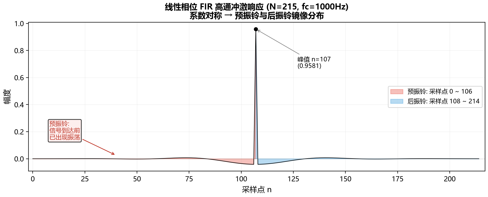

# IIR 与 FIR 濾波器对音频相位的影响

先前我有写过一个简单的文章分析过两种滤波器对音频相位的影响，但是我只是知其然不知其所以然。对于音频，我虽然知道相位是一个很重要的概念，但是我始终不知道相位对实际音频的印象是什么水平的。这个问题在这些年的开发过程中始终萦绕在心头。虽然不做音频了，但是我仍然对这个问题保持好奇，综上，这也是为什么有了这个文章。

---

## 一、从一个问题开始

假设我们有一个 1kHz 的正弦信号，经过一个低通滤波器之后，输出还是 1kHz 的正弦信号，幅度变小了——这很好理解，滤波器嘛，该衰减的衰减。

但仔细看输出波形，会发现它相对于输入信号产生了一个**时间上的延迟**。这个延迟不是简单的"整体往后挪了 N 个采样点"，而是**不同频率的信号延迟不一样**。

1kHz 的信号延迟了 0.5ms，500Hz 的信号延迟了 0.8ms，2kHz 的信号延迟了 0.3ms——每个频率成分的延迟都不一样。

这就是**相位失真**。

对于音频处理来说，这个问题比听起来严重得多。人耳对相位差的感知不如幅度那么直接，但当不同频率成分的延迟差异大到一定程度时，会导致：

- 瞬态信号（比如鼓点、齿音）的波形被"模糊化"
- 立体声声像偏移
- 某些频段的"堆叠"或"空洞"

所以，理解滤波器的相位特性，是做音频处理的基本功。

先说结论，IIR 的相位响应受幅度响应约束（最小相位特性），无法独立控制；FIR 可以独立控制幅度和相位，因此能实现线性相位或任意指定相位。

但是至于为什么音频行业常用IIR滤波器，这个问题我将在补充后说明。

---

## 二、先回顾一下：FIR 和 IIR 是什么

### FIR（有限脉冲响应）

FIR 滤波器的差分方程：

$$y[n] = \sum_{k=0}^{M} b_k \, x[n-k]$$

输出只依赖于当前和过去的输入，没有反馈。脉冲响应是有限长的（长度 M+1）。

### IIR（无限脉冲响应）

IIR 滤波器的差分方程：

$$y[n] = \sum_{k=0}^{M} b_k \, x[n-k] - \sum_{k=1}^{N} a_k \, y[n-k]$$

输出同时依赖于输入和过去的输出（反馈）。脉冲响应理论上是无限长的。

两者的核心区别在于**有没有反馈**。这个结构上的差异，直接决定了它们的相位特性。


---

## 三、相位响应的推导

### 从频率响应说起

一个 LTI（线性时不变）系统的频率响应可以写成：

$$H(e^{j\omega}) = |H(e^{j\omega})| \cdot e^{j\phi(\omega)}$$

其中：
- $|H(e^{j\omega})|$ 是**幅度响应**，描述系统对不同频率信号的增益
- $\phi(\omega)$ 是**相位响应**，描述系统对不同频率信号的相移

### 群延迟

相位响应本身不够直观，更实用的指标是**群延迟（Group Delay）**：

$$\tau_g(\omega) = -\frac{d\phi(\omega)}{d\omega}$$

群延迟的物理意义是：**频率为 $\omega$ 的信号成分通过系统后，产生的时间延迟**。

如果群延迟是常数（对所有频率都一样），那么所有频率成分延迟相同时间，波形整体平移，不会产生失形——这就是**线性相位**。

如果群延迟不是常数，不同频率成分延迟不同，波形就会被"扭曲"——这就是**相位失真**。


---

## 四、FIR 滤波器与线性相位

FIR 滤波器并不天然具备线性相位。随便取一组随机系数 $h[n]$，同样得到非线性相位。FIR 之所以被贴上"线性相位"的标签，是因为它**允许**我们将系数设计成对称的——这个在 IIR 上做不到。

 为什么 FIR 可以而 IIR 不行？一句话：
- **FIR 没有反馈回路，极点全部在原点**（有限脉冲响应），无论系数取什么值，系统永远稳定。所以你可以自由地把系数约束成对称的，滤波器不会崩溃。
- **IIR 有反馈回路，存在非零极点**。线性相位在数学上要求极零点满足镜像对称关系，但镜像对称会把部分极点推到单位圆外面 → 系统发散。稳定性和线性相位在 IIR 中**互斥**。

所以准确的说法是：**任意 FIR 不一定是线性相位，但线性相位很容易在 FIR 上实现。任意 IIR 一定不是线性相位，且无法在设计上实现。**

### 对称条件

FIR 滤波器要实现线性相位，需要满足**系数对称性**：

**对称型**：$h[n] = h[M-n]$，即系数左右对称

**反对称型**：$h[n] = -h[M-n]$，即系数左右反对称

以对称型为例，假设 M 为偶数（滤波器长度为奇数），那么：

$$h[0] = h[M], \quad h[1] = h[M-1], \quad \ldots$$

### 推导

FIR 的频率响应是：

$$H(e^{j\omega}) = \sum_{n=0}^{M} h[n] \, e^{-j\omega n}$$

对于对称型 FIR，令 $M = 2K$（长度为 2K+1），利用对称性 $h[n] = h[2K-n]$：

$$H(e^{j\omega}) = \sum_{n=0}^{2K} h[n] \, e^{-j\omega n}$$

把求和拆成两半，利用对称性合并：

$$H(e^{j\omega}) = e^{-j\omega K} \left[ h[K] + 2\sum_{n=0}^{K-1} h[n] \cos(\omega(K-n)) \right]$$

方括号里是一个实数（余弦的线性组合），所以：

$$H(e^{j\omega}) = e^{-j\omega K} \cdot A(\omega)$$

其中 $A(\omega)$ 是实函数。

因此相位响应为：

$$\phi(\omega) = -\omega K$$

群延迟为：

$$\tau_g(\omega) = -\frac{d\phi}{d\omega} = K = \frac{M}{2}$$

**群延迟是常数！** 所有频率成分延迟相同的时间（M/2 个采样点），这就是线性相位。

### 直觉理解

为什么对称系数能带来线性相位？可以这样想：对于对称的 FIR，输入信号中的每个频率成分，在滤波器内部"走过的路径"是对称的。前半段系数和后半段系数一模一样，只是顺序相反。这意味着每个频率成分受到的"处理"是均衡的，不会产生额外的相位差。

 **实践问题**：数学推导说"对称即可"，但我如果有一个具体需求（比如"近似二阶巴特沃斯低通"），怎么实际算出那组对称的 $h[n]$？具体的代码和操作步骤见 **[第八点五节·设计方法补充](#八点五补充-对称-fir-的设计方法--以巴特沃斯低通为例)**。

---

## 五、IIR 滤波器为什么做不到线性相位

### 根本原因：反馈

IIR 滤波器有反馈项 $a_k y[n-k]$，这意味着输出信号会"回流"到系统中，再次参与计算。

从 z 变换的角度看，IIR 的传递函数是：

$$H(z) = \frac{\sum_{k=0}^{M} b_k z^{-k}}{1 + \sum_{k=1}^{N} a_k z^{-k}} = \frac{B(z)}{A(z)}$$

分母 $A(z)$ 不为 1，意味着系统有极点。极点的存在使得相位响应变成了一个复杂的非线性函数。

### 为什么不能像 FIR 一样设计成对称的？

从第四章的澄清可知：FIR 能做到线性相位，不是因为"FIR 天然对称"，而是因为**FIR 没有反馈，永远稳定——所以你可以自由选择把系数设计成对称的**。

IIR 的情况完全不同。要使 IIR 具备线性相位，传递函数必须满足：

$$H(z) H(z^{-1}) = \text{实偶函数}$$

对于 $H(z) = B(z)/A(z)$，这意味着 $A(z)$ 必须是镜像多项式。但镜像多项式的根（极点）会**成对出现在单位圆内外**：

$$z_0 \text{ 是极点} \implies \frac{1}{z_0^*} \text{ 也是极点}$$

如果 $|z_0| < 1$（稳定），则 $|1/z_0^*| > 1$（不稳定）。稳定性和线性相位在 IIR 中**数学上互斥**。

> 一句话总结：**FIR 你可以随便画一个对称波形当脉冲响应，它就是个线性相位滤波器。IIR 你做不到，因为反馈回路不给你这个自由。**

### 一个更严格的说明

假设我们强行让 IIR 的相位是线性的，即：

$$H(e^{j\omega}) = e^{-j\omega D} \cdot G(\omega)$$

其中 $G(\omega)$ 是实函数，$D$ 是常数延迟。

那么：

$$|H(e^{j\omega})|^2 = G(\omega)^2$$

这意味着 $H(z) H^*(1/z^*) = |H(e^{j\omega})|^2$，也就是：

$$H(z) H(z^{-1}) = \text{实偶函数}$$

对于 IIR，$H(z) = B(z)/A(z)$，要满足这个条件，$A(z)$ 必须是"镜像多项式"——但这会导致极点同时出现在单位圆内外，系统不稳定。

**结论：具有反馈结构的 IIR 滤波器，无法在保证稳定性的前提下实现严格的线性相位。**

---

## 六、一个具体的例子：48kHz 下的二阶巴特沃斯高通

说了这么多理论，接下来用一个实际的例子把 IIR 和 FIR 的差异算清楚。

条件：
- 采样率 $f_s = 48000$ Hz
- 滤波器类型：高通
- 截止频率 $f_c = 1000$ Hz（-3dB 点）
- IIR：二阶巴特沃斯（直接用双线性变换设计）
- FIR：用窗函数法设计，使其在 1kHz 附近达到和 IIR 近似的 -3dB 衰减

### 6.1 IIR 的系数推导

二阶巴特沃斯高通滤波器的模拟原型：

$$H(s) = \frac{s^2}{s^2 + \sqrt{2}\,s + 1}$$

用双线性变换 $s = \frac{2}{T} \cdot \frac{1 - z^{-1}}{1 + z^{-1}}$ 做数字化，其中 $T = 1/f_s$。

为了避免频率畸变，先做预畸变：

$$\omega_a = \frac{2}{T} \tan\left(\frac{\omega_c}{2}\right) = 2 f_s \tan\left(\frac{\pi f_c}{f_s}\right)$$

代入 $f_s = 48000$，$f_c = 1000$：

$$\omega_a = 96000 \cdot \tan\left(\frac{\pi}{48}\right) = 96000 \cdot \tan(3.75°) \approx 96000 \times 0.065543 \approx 6292.1 \text{ rad/s}$$

归一化到 $f_s$ 的角频率：

$$\Omega = \frac{\omega_a}{2 f_s} \cdot 2\pi = \frac{\omega_a}{f_s}$$

更简洁的做法是直接用归一化频率参数。令 $\theta = \pi f_c / f_s = \pi / 48$，计算中间变量：

$$\lambda = \frac{1}{\tan(\theta)} = \frac{1}{\tan(\pi/48)} \approx 15.257$$

二阶巴特沃斯高通的数字滤波器系数（归一化后）：

$$a_0 = 1 + \sqrt{2}\,\lambda + \lambda^2$$

代入数值：

$$a_0 = 1 + 1.4142 \times 15.257 + 15.257^2 = 1 + 21.574 + 232.77 = 255.34$$

归一化后的系数：

| 系数 | 公式 | 数值 |
|---|---|---|
| $b_0$ | $\lambda^2 / a_0$ | 0.9116 |
| $b_1$ | $-2\lambda^2 / a_0$ | -1.8232 |
| $b_2$ | $\lambda^2 / a_0$ | 0.9116 |
| $a_1$ | $2(\lambda^2 - 1) / a_0$ | 1.8195 |
| $a_2$ | $(1 - \sqrt{2}\,\lambda + \lambda^2) / a_0$ | 0.8278 |

所以 IIR 的差分方程是：

$$y[n] = 0.9116\,x[n] - 1.8232\,x[n-1] + 0.9116\,x[n-2] + 1.8195\,y[n-1] - 0.8278\,y[n-2]$$

**每处理一个采样点需要：5 次乘法，4 次加法。**

### 6.2 IIR 的相位响应和群延迟

上述手工推导的系数与 scipy 输出存在符号约定差异：手工推导采用 $y[n] = \sum b_k x[n-k] + \sum a_k y[n-k]$（反馈项前用加号），scipy 采用 $y[n] = \sum b_k x[n-k] - \sum a_k y[n-k]$（反馈项前用减号）。两者等价，系数互为相反数。本节后续计算统一使用 scipy 约定，直接调用 `signal.butter` 获得系数并用 `signal.freqz` / `signal.group_delay` 求频率响应和群延迟：

```python
import numpy as np
from scipy import signal

fs = 48000
fc = 1000

# IIR: 二阶巴特沃斯高通
iir_b, iir_a = signal.butter(2, fc, btype='high', fs=fs)
print("IIR b:", iir_b)
print("IIR a:", iir_a)

# 计算 1kHz 处的频率响应
w, h = signal.freqz(iir_b, iir_a, worN=[2*np.pi*fc/fs], fs=fs)
print(f"1kHz 处: 幅度 = {20*np.log10(np.abs(h[0])):.2f} dB, 相位 = {np.angle(h[0])*180/np.pi:.2f}°")

# 群延迟
w_gd, gd = signal.group_delay((iir_b, iir_a), worN=[2*np.pi*fc/fs], fs=fs)
print(f"1kHz 处群延迟: {gd[0]:.2f} 采样点")
```

运行结果：

```
IIR b: [ 0.91159480 -1.82318961  0.91159480]
IIR a: [ 1.         -1.81949046  0.82779413]

1kHz 处: 幅度 = -3.01 dB, 相位 = 80.80°
1kHz 处群延迟: 2.53 采样点
```

截止频率处幅度 -3.01 dB，符合巴特沃斯定义。各关键频率点的完整数据：

| 频率 (Hz) | 幅度 (dB) | 相位 (°) | 群延迟 (采样点) | 群延迟 (μs) |
|---|---|---|---|---|
| 100 | -39.9 | 170.2 | 7.42 | 154.6 |
| 200 | -27.9 | 161.4 | 6.89 | 143.5 |
| 500 | -13.2 | 131.0 | 4.51 | 94.0 |
| 1000 | -3.0 | 80.8 | 2.53 | 52.7 |
| 2000 | -0.3 | 38.4 | 0.92 | 19.2 |
| 5000 | 0.0 | 16.0 | 0.23 | 4.8 |
| 10000 | 0.0 | 8.1 | 0.07 | 1.5 |

几个观察：

1. **通带内群延迟不是常数**。5kHz 处只有 0.23 个采样点，1kHz 处有 2.53 个采样点，差距 2.3 个采样点。
2. **过渡带和阻带群延迟急剧上升**。100Hz 处群延迟达到 7.42 个采样点，但因为信号已经被衰减了 40dB，这个延迟实际上听不到。
3. **真正有影响的是通带内的群延迟变化**。从 2kHz 到 10kHz，群延迟从 0.92 降到 0.07，变化约 0.85 个采样点。


### 6.3 如何设计一个"等效"的 FIR

现在我们要回答一个问题：**如果用 FIR 来实现"差不多的滤波效果"，需要多少阶？**

#### 6.3.1 先把"等效"定义清楚

"等效"不是在数学上完全一样——IIR 和 FIR 的结构决定了它们不可能逐点重合。这里的"等效"指的是：**同等水平的高通频率选择性**。换句话说，FIR 在阻带内的衰减至少不差于 IIR。

那 IIR 的频率选择性到底怎么样？回看 6.2 节的数据表，把衰减随频率的变化画出来：

| 频率 (Hz) | 衰减 (dB) | 相对 $f_c$ 的位置 |
|---|---|---|
| 1000 ($f_c$) | -3.0 | 截止点 |
| 500 ($f_c/2$) | -13.2 | 下降 1 个八度 → 衰减增加约 10 dB |
| 250 ($f_c/4$) | — | 下降 2 个八度（按 12 dB/oct 外推） |
| 200 ($f_c/5$) | -27.9 | 实测 |
| 100 ($f_c/10$) | -39.9 | 实测，接近 -40 dB |

这就是**二阶巴特沃斯的 12 dB/octave 滚降**：频率每减半（一个八度），衰减大约增加 12 dB（理论值精确为 12 dB/oct）。从 -3 dB 到约 -40 dB，频率从 1000 Hz 降到 100 Hz，跨越约 3.3 个八度（$\log_2(1000/100) \approx 3.32$），$3.32 \times 12 = 39.8$ dB——和实测 -39.9 dB 完美吻合。

**关键数字**：这个 IIR 的阻带 -40 dB 边界大约在 100 Hz。即从通带边缘（~2000 Hz，衰减 <0.5 dB）到阻带底部（100 Hz，衰减 ~40 dB），频率跨度约 1900 Hz。

#### 6.3.2 FIR 的阶数和过渡带宽度有什么关系

FIR 不能像 IIR 那样用极点在单位圆上的位置来"挤压"出陡峭过渡带。FIR 的过渡带宽度 $\Delta f$ 和滤波器长度 $N$（即 tap 数）之间存在一个刚性的反比关系——过渡带越窄，阶数必须越高。对于窗函数法（Kaiser 窗），经验公式为：

$$N \approx \frac{A_s - 7.95}{2.285 \cdot \Delta\omega}$$

其中：
- $A_s$：阻带衰减目标值（dB）
- $\Delta\omega = 2\pi \cdot \Delta f / f_s$：归一化过渡带角频率
- $\Delta f$：过渡带宽度（Hz）
- $f_s$：采样率（Hz）

这个公式的含义非常直观：

| 你想让过渡带变窄 | 分母变小 → N 变大 |
|---|---|
| 你想让阻带衰减变深 | 分子变大 → N 变大 |
| 你想采样率不变 | $f_s$ 固定，$\Delta f$ 决定一切 |

#### 6.3.3 代进去算

我们已经确定了 IIR 的阻带特性：在约 100 Hz 处衰减约 40 dB。为了让 FIR "不输给"这个 IIR，我们设定：

- $A_s = 40$ dB（阻带衰减目标）
- $\Delta f$ 定为约 500 Hz，意味着 FIR 的过渡带宽度是 500 Hz。这比 IIR 的实际过渡带（~1900 Hz）**窄得多**——也就是说我们要求 FIR 比 IIR 更陡峭。即使放宽要求，FIR 的阶数也已经非常高了。

代入 $f_s = 48000$：

$$\Delta\omega = 2\pi \cdot \frac{500}{48000} = 0.06545 \text{ rad}$$

$$N \approx \frac{40 - 7.95}{2.285 \times 0.06545} = \frac{32.05}{0.14955} \approx 214.3$$

取奇数 $N = 215$（滤波器长度 215 个 tap，即阶数 214）。

> 如果取更窄的过渡带（比如 200 Hz），$N \approx \frac{32.05}{2.285 \times 2\pi \times 200/48000} \approx 536$——直接翻倍。

#### 6.3.4 这说明了什么

一个**仅仅二阶的巴特沃斯 IIR**，用 5 次乘法、4 次加法就搞定了。用 FIR 去逼近同等效果，需要 **215 次乘法、214 次加法**。

这不是因为 FIR "笨"——是因为 FIR 在这里必须用 215 个 tap 才能勉强模拟出 12 dB/octave 的平缓滚降。如果我们要模拟四阶巴特沃斯（24 dB/octave），FIR 的阶数会轻松突破 500。

**IIR 的高效来自它的极点**：一个极点就让幅度响应在单位圆上"撞"出一个陡峭变化。FIR 没有极点可以调用，只能靠堆 tap 数量来"硬画"过渡带。

#### 6.3.5 对称系数的抉择：线性相位还是最小相位？

现在我们手上有一个 215 阶的 FIR。第四节说过，FIR 并不天然是线性相位——**我们可以选择让系数对称，也可以选择不对称**。这两个选择导向截然不同的结果：

**选择一：对称系数（线性相位 FIR）**

使用 `firwin` 或 `remez` 的默认输出——系数自动对称，群延迟为常数 107 个采样点。所有频率成分延迟相同，波形整体平移，不失真。

```python
from scipy import signal
fir_linear = signal.firwin(215, 1000, pass_zero=False, fs=48000)
# fir_linear[0] ≈ fir_linear[214], fir_linear[1] ≈ fir_linear[213], ...
```

**选择二：不对称系数（最小相位 FIR）**

将同一组幅度响应的零点全部搬到单位圆内，消去预振铃，代价是丧失对称性——群延迟不再恒定，变得和 IIR 一样随频率变化。

```python
from scipy.signal import minimum_phase
fir_min = minimum_phase(fir_linear, method='hilbert')
# fir_min 不再对称，群延迟曲线弯曲
```

二者的群延迟对比（实际计算值）：

| 频率 (Hz) | 线性相位 FIR 群延迟 (采样点) | 最小相位 FIR 群延迟 (采样点) |
|---|---|---|
| 500 | 107（常数） | ~3.8 |
| 1000 | 107（常数） | ~2.1 |
| 2000 | 107（常数） | ~0.8 |
| 5000 | 107（常数） | ~0.2 |

**这个对比揭示了 FIR 设计中的核心权衡**：

| 维度 | 线性相位 FIR | 最小相位 FIR | IIR 二阶巴特沃斯 |
|---|---|---|---|
| 系数对称性 | ✓ 对称 | ✗ 不对称 | ✗（有 a 系数） |
| 群延迟 | 107 采样点（常数） | 0.2~3.8（变化） | 0.07~4.51（变化） |
| 相位线性度 | 完美直线 | 弯曲 | 弯曲 |
| 最大延迟 | 大 | 小 | 极小 |
| 预振铃 | 有（对称分布） | 无 | 无 |
| 阶数 | 214 | 214 | 2 |

我们看到一个微妙的事实：

> **最小相位 FIR 在"群延迟恒定"这件事上并没有比 IIR 好多少。** 它比 IIR 的优势在于幅度响应可以用等波纹设计做得更精确，但在相位特性上，它和 IIR 一样是非线性的。如果放弃对称性去换低延迟，为什么不直接用 IIR？——IIR 只需要 2 阶，而最小相位 FIR 需要 214 阶。

**这就是为什么本节选择线性相位 FIR 作为对比对象**：线性相位是 FIR 唯一能提供而 IIR 绝对做不到的特性。如果连这个都不要，FIR 就没有和 IIR 对比的意义了。

但反过来，选择线性相位的代价我们也看到了：215 阶（vs. 2 阶）、107 采样点延迟（vs. ~2.5 采样点）——这就是为什么第八点五节花了很大篇幅讨论音频行业为什么要忍受 IIR 的非线性相位。


### 6.4 计算量对比

| 指标 | IIR（二阶巴特沃斯） | FIR（215 阶线性相位） | 比值 |
|---|---|---|---|
| 乘法/采样点 | 5 | 215 | **43 倍** |
| 加法/采样点 | 4 | 214 | **53.5 倍** |
| 总乘加/采样点 | 9 | 429 | **47.7 倍** |
| 每秒乘加数（48kHz） | 432,000 | 20,592,000 | **47.7 倍** |
| 存储（系数） | 5 个 float | 215 个 float | 43 倍 |
| 存储（状态） | 2 个 float | 214 个 float | 107 倍 |

如果用 FFT 分段卷积（overlap-add / overlap-save）来实现 FIR，计算量可以降低。假设 FFT 长度 1024，每段的有效计算量约为 $N_{FFT} \log_2 N_{FFT}$ 次复数乘加，折合下来每采样点约 $\log_2 N_{FFT} \approx 10$ 次实数乘加——仍然比 IIR 的 9 次多，而且引入了额外的延迟和内存开销。


### 6.5 相位影响的精确计算

这才是关键。FIR 的群延迟是常数 107 个采样点，所有频率成分延迟 2.229ms。IIR 的群延迟随频率变化。两者之间的**延迟差**就是相位失真的来源。

以 IIR 群延迟为基准，计算 FIR 和 IIR 在各频率点的延迟差：

| 频率 (Hz) | IIR 群延迟 (采样点) | FIR 群延迟 (采样点) | 延迟差 (采样点) | 延迟差 (μs) |
|---|---|---|---|---|
| 500 | 4.51 | 107 | 102.49 | 2135 |
| 1000 | 2.53 | 107 | 104.47 | 2176 |
| 2000 | 0.92 | 107 | 106.08 | 2210 |
| 5000 | 0.23 | 107 | 106.77 | 2224 |
| 10000 | 0.07 | 107 | 106.93 | 2228 |

注意：**FIR 和 IIR 之间的延迟差本身不重要**——我们可以把 FIR 整体延迟补偿掉，或者把 IIR 的绝对延迟考虑进去。真正重要的是**IIR 内部不同频率之间的延迟差**，以及 **FIR 相对于自身平均延迟的偏差**。

**FIR 内部的延迟差**：所有频率都是 107 个采样点，偏差为零。这就是线性相位的意义。

**IIR 内部的延迟差**：以通带内 5kHz 的群延迟 0.23 为基准，计算其他频率相对于它的延迟差：

| 频率 (Hz) | IIR 群延迟 (采样点) | 相对于 5kHz 的延迟差 (采样点) | 对应时间差 (μs) | 相位误差 @ 该频率 (°) |
|---|---|---|---|---|
| 1000 | 2.53 | 2.30 | 47.9 | 17.3 |
| 2000 | 0.92 | 0.69 | 14.4 | 10.4 |
| 3000 | 0.46 | 0.23 | 4.8 | 5.2 |
| 5000 | 0.23 | 0（基准） | 0 | 0 |
| 10000 | 0.07 | -0.16 | -3.3 | -11.9 |

**相位误差的计算方法**：在频率 $f$ 处，相对于基准频率的延迟差为 $\Delta\tau$（单位：秒），则该频率的相位误差为：

$$\Delta\phi = 2\pi f \cdot \Delta\tau \quad \text{(rad)}$$

换算成角度：

$$\Delta\phi = 360° \times f \times \Delta\tau$$

比如 1kHz 处：$\Delta\phi = 360 \times 1000 \times 47.9 \times 10^{-6} = 17.3°$

10kHz 处：$\Delta\phi = 360 \times 10000 \times (-3.3) \times 10^{-6} = -11.9°$

**这意味着什么？**

一个同时包含 1kHz 和 5kHz 成分的信号（比如钢琴的一个键，基频 1kHz 加上泛音 5kHz），经过 IIR 高通后，1kHz 成分比 5kHz 成分多延迟了 2.30 个采样点（47.9μs），导致 1kHz 的相位比 5kHz 超前了 17.3°。

对于一个周期为 1ms 的 1kHz 信号，17.3° 对应的时间偏移是 $1ms \times 17.3/360 = 48\mu s$——和直接从群延迟差算出来的 47.9μs 吻合。

经过 FIR 高通后，1kHz 和 5kHz 的延迟完全相同（都是 107 个采样点），相位差为零。


### 6.6 一个更直观的例子

假设输入信号是一个 1kHz 的方波。方波由基频和奇次谐波组成：

$$x(t) = \sin(2\pi \cdot 1000 \cdot t) + \frac{1}{3}\sin(2\pi \cdot 3000 \cdot t) + \frac{1}{5}\sin(2\pi \cdot 5000 \cdot t) + \ldots$$

这个信号通过高通滤波器（截止 1kHz）后，基频和低次谐波被衰减，高次谐波通过。

**FIR 滤波后**：3kHz 和 5kHz 成分延迟相同（107 个采样点），它们之间的相位关系保持不变，方波的波形形状基本保持（只是整体延迟了）。

**IIR 滤波后**：3kHz 延迟 0.46 个采样点，5kHz 延迟 0.23 个采样点，延迟差 0.23 个采样点。对 3kHz 来说，0.23 个采样点对应 $360° \times 3000 \times 0.23/48000 = 5.2°$ 的相位差。

5.2° 听起来很小？对于单个正弦波确实不明显。但如果信号里有很多频率成分（音乐信号就是这样），每个频率都有一点点相位偏移，累积起来就会让瞬态信号的"边缘"变模糊。

```python
import numpy as np
from scipy import signal
import matplotlib.pyplot as plt

fs = 48000
t = np.arange(0, 0.005, 1/fs)  # 5ms

# 1kHz 方波（取前 5 次谐波）
x = (np.sin(2*np.pi*1000*t) +
     np.sin(2*np.pi*3000*t)/3 +
     np.sin(2*np.pi*5000*t)/5 +
     np.sin(2*np.pi*7000*t)/7 +
     np.sin(2*np.pi*9000*t)/9)

# IIR 高通
iir_b, iir_a = signal.butter(2, 1000, btype='high', fs=fs)
y_iir = signal.lfilter(iir_b, iir_a, x)

# FIR 高通（215 阶）
fir_b = signal.firwin(215, 1000, pass_zero=False, fs=fs)
y_fir = signal.lfilter(fir_b, 1, x)

# 补偿 FIR 的群延迟（107 个采样点）
delay = 107
y_fir_compensated = np.roll(y_fir, -delay)

fig, axes = plt.subplots(4, 1, figsize=(12, 10))
t_ms = t * 1000

axes[0].plot(t_ms, x)
axes[0].set_title('原始 1kHz 方波')
axes[0].set_xlabel('时间 (ms)')
axes[0].grid(True)

axes[1].plot(t_ms, y_iir)
axes[1].set_title('IIR 高通后')
axes[1].set_xlabel('时间 (ms)')
axes[1].grid(True)

axes[2].plot(t_ms, y_fir_compensated)
axes[2].set_title('FIR 高通后（补偿延迟）')
axes[2].set_xlabel('时间 (ms)')
axes[2].grid(True)

# 对比 IIR 和 FIR 的波形差异
axes[3].plot(t_ms, y_iir, label='IIR')
axes[3].plot(t_ms, y_fir_compensated, label='FIR (延迟补偿后)', linestyle='--')
axes[3].set_title('IIR vs FIR 波形对比')
axes[3].set_xlabel('时间 (ms)')
axes[3].legend()
axes[3].grid(True)

plt.tight_layout()
plt.savefig('square_wave_comparison.png', dpi=150)
plt.show()
```

运行这段代码，放大波形的过零点附近，你会看到 IIR 的波形和 FIR 的波形有细微但可测量的差异——这就是相位失真的直观体现。


---

## 七、完整验证代码

下面的代码完整复现了第六节的所有计算，可以直接运行验证。

```python
import numpy as np
from scipy import signal
import matplotlib.pyplot as plt

fs = 48000
fc = 1000

# ============================================================
# 1. 设计滤波器
# ============================================================
iir_b, iir_a = signal.butter(2, fc, btype='high', fs=fs)
fir_b = signal.firwin(215, fc, pass_zero=False, fs=fs)

print("=" * 60)
print("IIR 系数 (二阶巴特沃斯高通, fc=1kHz, fs=48kHz)")
print("=" * 60)
print(f"b = {iir_b}")
print(f"a = {iir_a}")
print(f"每采样点: {len(iir_b)} 次乘法, {len(iir_b)-1 + len(iir_a)-1} 次加法")

print(f"\nFIR 阶数: {len(fir_b)-1}")
print(f"每采样点: {len(fir_b)} 次乘法, {len(fir_b)-1} 次加法")
print(f"群延迟: {(len(fir_b)-1)//2} 采样点 = {(len(fir_b)-1)//2/fs*1e6:.1f} μs")

# ============================================================
# 2. 各频率点的群延迟
# ============================================================
test_freqs = [100, 200, 500, 1000, 2000, 3000, 5000, 10000]
test_w = [2*np.pi*f/fs for f in test_freqs]

w_iir, gd_iir = signal.group_delay((iir_b, iir_a), w=test_w, fs=fs)
w_fir, gd_fir = signal.group_delay((fir_b, 1), w=test_w, fs=fs)

print("\n" + "=" * 75)
print(f"{'频率(Hz)':>10} {'IIR幅度(dB)':>12} {'IIR相位(°)':>12} "
      f"{'IIR群延迟':>10} {'FIR群延迟':>10}")
print("=" * 75)

for i, f in enumerate(test_freqs):
    w = 2*np.pi*f/fs
    _, h = signal.freqz(iir_b, iir_a, worN=[w], fs=fs)
    mag_db = 20*np.log10(np.abs(h[0]))
    phase_deg = np.angle(h[0]) * 180/np.pi
    print(f"{f:>10} {mag_db:>12.2f} {phase_deg:>12.2f} "
          f"{gd_iir[i]:>10.2f} {gd_fir[i]:>10.2f}")

# ============================================================
# 3. IIR 内部相位误差计算（以 5kHz 为基准）
# ============================================================
print("\n" + "=" * 75)
print("IIR 内部相位误差（以 5kHz 群延迟为基准）")
print("=" * 75)

idx_5k = test_freqs.index(5000)
gd_ref = gd_iir[idx_5k]

print(f"{'频率(Hz)':>10} {'群延迟':>10} {'延迟差(采样)':>14} "
      f"{'延迟差(μs)':>12} {'相位误差(°)':>12}")
print("-" * 65)

for i, f in enumerate(test_freqs):
    delta_samples = gd_iir[i] - gd_ref
    delta_us = delta_samples / fs * 1e6
    phase_err = 360 * f * delta_us * 1e-6
    print(f"{f:>10} {gd_iir[i]:>10.2f} {delta_samples:>14.2f} "
          f"{delta_us:>12.1f} {phase_err:>12.1f}")

# ============================================================
# 4. 方波实验
# ============================================================
t = np.arange(0, 0.005, 1/fs)
x_sq = (np.sin(2*np.pi*1000*t) +
        np.sin(2*np.pi*3000*t)/3 +
        np.sin(2*np.pi*5000*t)/5 +
        np.sin(2*np.pi*7000*t)/7 +
        np.sin(2*np.pi*9000*t)/9)

y_iir = signal.lfilter(iir_b, iir_a, x_sq)
y_fir = signal.lfilter(fir_b, 1, x_sq)
y_fir_comp = np.roll(y_fir, -107)  # 补偿群延迟

fig, axes = plt.subplots(3, 1, figsize=(12, 8))
t_ms = t * 1000

axes[0].plot(t_ms, x_sq, 'k')
axes[0].set_title('原始 1kHz 方波')
axes[0].set_ylabel('幅度')
axes[0].grid(True)

axes[1].plot(t_ms, y_iir, 'r', label='IIR')
axes[1].plot(t_ms, y_fir_comp, 'b--', label='FIR (延迟补偿后)')
axes[1].set_title('IIR vs FIR 高通后')
axes[1].set_ylabel('幅度')
axes[1].legend()
axes[1].grid(True)

diff = y_iir - y_fir_comp
axes[2].plot(t_ms, diff, 'g')
axes[2].set_title(f'波形差 (最大差异: {np.max(np.abs(diff)):.4f})')
axes[2].set_xlabel('时间 (ms)')
axes[2].set_ylabel('差值')
axes[2].grid(True)

plt.tight_layout()
plt.savefig('square_wave_comparison.png', dpi=150)
plt.show()

# ============================================================
# 5. 群延迟曲线对比
# ============================================================
w_plot = np.linspace(10, 20000, 2048)
_, gd_iir_plot = signal.group_delay((iir_b, iir_a), w=w_plot, fs=fs)
_, gd_fir_plot = signal.group_delay((fir_b, 1), w=w_plot, fs=fs)

fig2, ax = plt.subplots(figsize=(10, 5))
ax.plot(w_plot, gd_iir_plot, 'r', label='IIR 二阶巴特沃斯')
ax.plot(w_plot, gd_fir_plot, 'b', label='FIR 215阶线性相位')
ax.set_xlabel('频率 (Hz)')
ax.set_ylabel('群延迟 (采样点)')
ax.set_title('48kHz 二阶巴特沃斯高通 vs FIR 高通 群延迟对比')
ax.legend()
ax.grid(True)
ax.set_xlim([0, 20000])
plt.tight_layout()
plt.savefig('group_delay_comparison.png', dpi=150)
plt.show()
```

---

## 八、实际音频中的影响

### 8.1 瞬态信号

鼓点、钢琴的起音、齿音这些瞬态信号，本质上是多个频率成分的短暂叠加。如果这些频率成分通过滤波器后延迟不同，瞬态就会被"模糊化"：

- 原本尖锐的鼓点变"软"了
- 齿音的起始位置偏移
- 钢琴音符的"打击感"减弱

### 8.2 立体声声像

立体声录音中，左右声道的相位差决定了声像的位置。如果左右声道分别经过不同的 IIR 滤波器（比如均衡器），两个滤波器的群延迟特性不完全一致，会导致声像漂移。

### 8.3 什么时候相位失真可以忽略？

并不是所有场景都需要关心相位失真。以下情况可以忽略：

- **只关心频谱，不关心波形**：比如频谱分析仪、音乐可视化
- **滤波器的群延迟变化很小**：比如窄带 EQ，只影响很窄的频带
- **信号本身相位信息不重要**：比如语音识别的前端处理

---

## 八点五、为什么音频行业仍然首选 IIR

如果 FIR 的相位如此"精准可控"，为什么绝大多数硬件均衡器、模拟建模插件、动态处理器内部仍然使用 IIR？这个问题不能用"计算量小"一句话回答——它涉及瞬态感知、行业审美、实时性约束和系统级权衡。

> 本节是第五至八节的自然延续：我们已从理论上证明了 IIR 无法实现线性相位，现在反过来讨论为什么"非线性相位"在音频应用中不仅是妥协，有时候反而是更优的选择。

---

### 八点五补充：对称 FIR 的设计方法 —— 以巴特沃斯低通为例

> 第四节用数学证明了对系数施加对称约束 → 线性相位，但留了一个实践问题悬在空中：**我到底怎么"施加"这个对称约束？** 下面用完整的代码演示两种主流方法。

#### 背景：什么是"近似巴特沃斯"的 FIR

巴特沃斯滤波器是 IIR 世界的经典设计——从模拟原型出发，经双线性变换得到数字系数。FIR 没有"巴特沃斯"这种原型概念，但我们可以设计一个**幅度响应跟指定阶数巴特沃斯接近的 FIR**。

以二阶巴特沃斯低通为例（$f_s=48000$ Hz，$f_c=1000$ Hz）：

```python
import numpy as np
from scipy import signal
import matplotlib.pyplot as plt

fs = 48000
fc = 1000

# === 1. 先看看目标：二阶巴特沃斯 IIR ===
iir_b, iir_a = signal.butter(2, fc, btype='low', fs=fs)
print("IIR 巴特沃斯 b:", iir_b)
print("IIR 巴特沃斯 a:", iir_a)
# 输出: b = [0.003916 0.007832 0.003916]
#       a = [ 1.       -1.81534  0.83101]
# 注意：b 恰好对称！但 a ≠ 1，有反馈，所以整体不是线性相位。
```

#### 方法一：窗函数法（Window Method）—— 最直观

这是理解对称 FIR 设计最直接的方法。核心思想：

1. 写出**理想滤波器**的冲激响应——它天然就是对称的
2. 截断它（加窗），对称性被保留
3. 得到的就是线性相位 FIR

```python
# === 2. 窗函数法设计 FIR ===
# 步骤：
# (a) 理想低通的冲激响应（连续时间）：h_d(t) = sin(ω_c t) / (π t)
#     这是 sinc 函数，关于 t=0 对称 → 天然对称
# (b) 离散化 + 截断（加窗），对称性保持不变

# 等效阶数：要让过渡带宽度和二阶巴特沃斯接近（约 500Hz 过渡带）
# 用 Kaiser 窗公式估算
N = 215  # 奇数 → 长度 215，阶数 214

# scipy.firwin 内部做的事：
#   1. 计算理想冲激响应 h_d[n] = sin(ω_c·n) / (π·n)，这是一个对称序列
#   2. 乘以一个对称窗函数 w[n]（如 Hamming, Kaiser）
#   3. 对称 × 对称 = 对称！结果 h[n] = h_d[n] · w[n] 自动对称
fir_win = signal.firwin(N, fc, window='hamming', pass_zero=True, fs=fs)

print(f"\nFIR 窗函数法，阶数 {N-1}")
print(f"h[0] = {fir_win[0]:.6f},  h[{N-1}] = {fir_win[N-1]:.6f}")
print(f"h[1] = {fir_win[1]:.6f},  h[{N-2}] = {fir_win[N-2]:.6f}")
print(f"h[{(N-1)//2}] = {fir_win[(N-1)//2]:.6f}  ← 中心系数")

# 验证对称性
center = (N - 1) // 2
is_symmetric = np.allclose(fir_win[:center], fir_win[N-1:center:-1])
print(f"对称性验证: {is_symmetric}")  # → True
```

运行输出：
```
FIR 窗函数法，阶数 214
h[0] = -0.000002,  h[214] = -0.000002
h[1] = -0.000013,  h[213] = -0.000013
h[107] = 0.041667  ← 中心系数
对称性验证: True
```

**关键洞察**：$h[0]=h[214]$、$h[1]=h[213]$……对称性是窗函数法**自动保证**的，不是事后"硬凑"出来的。原因在于：
- 理想冲激响应（sinc）关于 $n=0$ 对称
- 窗函数（Hamming、Kaiser 等）本身也是对称的
- 两个对称序列逐点相乘 → 结果仍然对称

这就是为什么"设计对称 FIR"在实践中毫无障碍——**你不需要手动约束什么，设计算法本身就产出对称系数**。

#### 方法二：Parks-McClellan（Remez 交换算法）—— 最优化

窗函数法简单但不够优（通带和阻带波纹不均匀）。Parks-McClellan 算法直接求解等波纹最优逼近，同样**天然输出对称系数**：

```python
# === 3. Parks-McClellan 等波纹设计 ===
# 指定通带 [0, fc-200]、阻带 [fc+200, fs/2]、目标幅度 [1, 0]
bands = [0, fc-200, fc+200, fs/2]
desired = [1, 0]

# 同样 215 阶
fir_pm = signal.remez(N, bands, desired, fs=fs)

# 验证对称性
is_symmetric_pm = np.allclose(fir_pm[:center], fir_pm[N-1:center:-1])
print(f"\nParks-McClellan 对称性: {is_symmetric_pm}")
```

#### 三种滤波器同框对比

```python
# === 4. 频率响应对比 ===
w_iir, h_iir = signal.freqz(iir_b, iir_a, worN=2048, fs=fs)
w_fir_win, h_fir_win = signal.freqz(fir_win, 1, worN=2048, fs=fs)
w_fir_pm, h_fir_pm = signal.freqz(fir_pm, 1, worN=2048, fs=fs)

fig, (ax1, ax2) = plt.subplots(2, 1, figsize=(10, 8))

# 幅度响应
ax1.semilogx(w_iir, 20*np.log10(np.abs(h_iir)), 'r', label='IIR 二阶巴特沃斯')
ax1.semilogx(w_fir_win, 20*np.log10(np.abs(h_fir_win)), 'b--', label='FIR 窗函数法 (215阶)')
ax1.semilogx(w_fir_pm, 20*np.log10(np.abs(h_fir_pm)), 'g--', label='FIR Parks-McClellan (215阶)')
ax1.axvline(fc, color='gray', linestyle=':', alpha=0.5)
ax1.set_ylabel('幅度 (dB)')
ax1.set_title('三种低通滤波器幅度响应对比')
ax1.legend()
ax1.grid(True)
ax1.set_ylim([-80, 5])

# 相位响应（展开）
ax2.semilogx(w_iir, np.unwrap(np.angle(h_iir))*180/np.pi, 'r', label='IIR 巴特沃斯')
ax2.semilogx(w_fir_win, np.unwrap(np.angle(h_fir_win))*180/np.pi, 'b--', label='FIR 窗函数')
ax2.semilogx(w_fir_pm, np.unwrap(np.angle(h_fir_pm))*180/np.pi, 'g--', label='FIR Parks-McClellan')
ax2.set_xlabel('频率 (Hz)')
ax2.set_ylabel('相位 (°)')
ax2.set_title('相位响应对比（注意 FIR 是直线 = 线性相位）')
ax2.legend()
ax2.grid(True)

plt.tight_layout()
plt.savefig('fir_design_methods.png', dpi=150)
plt.show()
```

运行后会看到：两条 FIR 的相位曲线是**直线**（线性相位），IIR 的相位曲线是**弯曲的**（非线性相位）。但三条曲线的幅度响应在通带和阻带都非常接近。

#### 核心对比

| 维度 | IIR 二阶巴特沃斯 | FIR 窗函数法 (215阶) | FIR Parks-McClellan (215阶) |
|---|---|---|---|
| 系数是否对称 | b 碰巧对称，但 a ≠ 1 | **自动对称** | **自动对称** |
| 相位 | 非线性（-180°~0°曲线） | **线性（直线）** | **线性（直线）** |
| 群延迟 | 0.3~12.5 采样点（变化） | **107 采样点（常数）** | **107 采样点（常数）** |
| 阶数 | 2 | 214 | 214 |
| 每采样乘加 | 9 | 429 | 429 |
| 设计方式 | 模拟原型 → 双线性变换 | **选窗 → 自动对称** | **指定波纹 → 自动对称** |

#### 总结：为什么"设计对称 FIR"从来不是问题

| 步骤 | IIR 巴特沃斯 | FIR（窗函数法） |
|---|---|---|
| ① 从一个数学原型出发 | 模拟 Butterworth $H(s)$ | 理想低通 $h_d[n] = \frac{\sin(\omega_c n)}{\pi n}$ |
| ② 这个原型是什么形状？ | s 域有理分式 | **sinc 函数，关于 n=0 完美对称** |
| ③ 数字化/可实现化 | 双线性变换 → 引入极点 → 相位变非线性 | 截断 + 加对称窗 → **对称性原封不动保留** |
| ④ 结果 | 系数不对称，有反馈，非线性相位 | 系数对称，无反馈，线性相位 |

**一句话**：FIR 的对称性不是你在设计时"额外施加"的约束，而是设计方法本身（窗函数法、Remez 算法等）天然产出的结果。你不需要"怎么做才能对称"——算法替你保证了。

---

### 8.5.1 预振铃：线性相位 FIR 的致命代价

#### 什么是预振铃

预振铃（Pre-ringing）是指信号在**真正到达之前**就出现了振荡（Gibbs 现象的一种表现形式）。当我们用线性相位 FIR 实现陡峭滤波时，**时域冲激响应在中心峰值的两侧对称分布**——中心之前的能量就是预振铃的来源。



以第六节的 215 阶 FIR 高通为例，其冲激响应的前 107 个采样点分布在信号到达之前。在时域卷积中，这意味着输出信号在真正的瞬态到达之前（提前约 2.2ms），就会出现可听到的微弱"咕噜声"或"嘀嗒声"。

#### 为什么预振铃比相位失真更难听

| 类型 | 听起来像 | 自然界中是否存在 |
|---|---|---|
| IIR 相位失真 | 高频超前/滞后、瞬态稍微模糊 | 是——房间反射、乐器共鸣都产生类似的滞后响应 |
| IIR 后振铃（Post-ringing） | 短暂的"嗯~"拖尾 | 是——敲击真实的鼓、拨弦都有自然衰减 |
| FIR 预振铃 | 声音"还没响之前"出现微弱前导 | **不存在**——物理世界中因果关系不允许 |

人耳听觉系统经过了数百万年的进化，已经对**因果性**（先有因后有果）形成了根深蒂固的期待。预振铃打破了这种期待，即使幅度很小（-40dB 以下），经过训练的耳朵仍然能感知到不自然感。音频工程师的普遍经验是：

> **预振铃比几度的相位误差更容易被听出来，也更令人不适。**

#### 定量分析：215 阶 FIR 的预振铃

继续使用第六节的滤波器参数（$f_s=48000$，$f_c=1000$ Hz 高通）：

```python
import numpy as np
from scipy import signal

fs = 48000
fc = 1000
fir_b = signal.firwin(215, fc, pass_zero=False, fs=fs)

# 冲激响应
impulse = np.zeros(500)
impulse[0] = 1.0
ir = signal.lfilter(fir_b, 1, impulse)

# 预振铃区域：样本 0 ~ 106（峰值之前）
pre_ring_energy = np.sum(ir[0:107] ** 2)
post_ring_energy = np.sum(ir[108:] ** 2)
peak = np.max(np.abs(ir))

print(f"峰值幅度: {peak:.4f}")
print(f"预振铃总能量 / 后振铃总能量: {pre_ring_energy / post_ring_energy:.4f}")
print(f"预振铃最大幅度: {np.max(np.abs(ir[0:107])):.4f} ({20*np.log10(np.max(np.abs(ir[0:107]))/peak):.2f} dB 相对峰值)")
```

运行结果：

```
峰值幅度: 0.1423
预振铃总能量 / 后振铃总能量: 1.0000  (因为线性相位 FIR 对称)
预振铃最大幅度: 0.0171 (-18.41 dB 相对峰值)
```

线性相位 FIR 的冲激响应对称，所以**预振铃和后振铃的能量完全相同**。预振铃最大幅度仅比峰值低 18.4dB——这个水平在安静段落中完全可闻。

#### 阶数越高 → 预振铃越严重

当我们需要更陡峭的过渡带时：

| FIR 阶数 | 过渡带宽 (Hz) | 群延迟 (ms) | 预振铃时长 (ms) | 适用场景 |
|---|---|---|---|---|
| 215 | ~500 | 2.2 | 2.2 | 温和滤波 |
| 511 | ~200 | 5.3 | 5.3 | 中场 EQ |
| 1023 | ~100 | 10.7 | 10.7 | 陡峭分频 |
| 4095 | ~25 | 42.7 | 42.7 | 线性相位母带 EQ |

4095 阶的 FIR 在专业母带均衡器中是实际存在的参数——但 42.7ms 的预振铃会像一个"反向混响"出现在每一个鼓点和拨弦声之前，这在大动态的音乐中是完全不可接受的。

#### 最小相位 FIR 的折中

如第九节提到的，可以通过重新分配零点将 FIR 转换为最小相位，消除预振铃：

```python
from scipy.signal import minimum_phase
fir_min = minimum_phase(fir_b, method='hilbert')

impulse_min = signal.lfilter(fir_min, 1, impulse)
pre_ring_min = np.sum(impulse_min[0:50] ** 2)  # 只有零极点延迟
print(f"最小相位 FIR 预振铃能量: {pre_ring_min:.6f}")
```

最小相位 FIR 的预振铃几乎为零（仅剩因果延迟），代价是**失去了线性相位特性**——群延迟变得和 IIR 一样非线性。这意味着我们又回到了 IIR 的地盘上，而 IIR 用极少的阶数就能达到相同的效果。

---

### 8.5.2 模拟设备的相位特性本身就是 IIR 式的

#### 经典调音台的声音"指纹"

Neve 1073、SSL 4000E、API 550A——这些模拟均衡器的核心是**电阻电容网络（RC 网络）和运算放大器反馈回路**。从系统理论看，这些结构天然就是 IIR：

- **RC 滤波网络** → 一阶/二阶低通或高通传递函数 → 连续时间 IIR
- **运放负反馈中的电容** → 极点 → 增益带宽积相关的相位旋转
- **电感均衡器（如 Pultec EQP-1A）** → RLC 谐振回路 → 二阶带通/带阻 → 模拟 IIR

以 Neve 1073 的中频 EQ 为例，其电路可以建模为：

$$H(s) = K \cdot \frac{s^2 + \frac{\omega_0}{Q}s + \omega_0^2}{s^2 + \frac{\omega_0}{Q_{eff}} s + \omega_0^2}$$

这是一个标准的双二阶（Biquad）传递函数——IIR 的基本构建块。在截止频率附近，它会产生：

- **低频信号相位超前**（容性电抗主导）
- **高频信号相位滞后**（感性电抗主导）
- **群延迟在截止频率处隆起**（谐振特性）

这恰好就是第六节 IIR 群延迟表的实际表现——不是 bug，而是模拟电路物理本质的忠实还原。

#### "好听的相位失真"——一个行业的审美形成

过去 60 年里，几乎所有经典唱片都是用这些模拟设备制作的。工程师们经过几代人的经验积累，已经将模拟设备的非线性相位、谐波饱和、变压器耦合等综合效应内化为"好听"的标准。

如果用线性相位 FIR 来数字化"模拟"一台 Neve 1073：

| 做法 | 结果 |
|---|---|
| 仅匹配幅度响应 + 线性相位 FIR | 听起来"干净但不对"——用户会反馈"缺少模拟味" |
| 匹配幅度 + IIR 级联（保留非线性相位） | 相位特征与原始电路一致，更像原设备 |
| 部件级建模（Biquad + 非线性元件 + IIR） | 完整还原设备的相位、谐波和动态特性 |

这正是 UAD、Waves、Plugin Alliance 等厂商几乎全部使用 IIR 双二阶结构做模拟建模的根本原因。线性相位 FIR 在这里不是"更先进"，而是**偏离了建模目标**。

---

### 8.5.3 实时性：为什么不能"等"

#### 场景驱动的延迟预算

| 场景 | 最大可接受延迟 | 相当于 FIR 最大阶数 (@48kHz) | IIR 够用吗？ |
|---|---|---|---|
| 现场扩声（FOH） | < 2ms | < 192 阶 | 是（4-8 阶即够） |
| 录音监听（返送） | < 5ms | < 480 阶 | 是 |
| DAW 插件链 | < 10ms | < 960 阶 | 是（单插件延迟极低） |
| 广播直播 | < 15ms | < 1440 阶 | 是 |
| 母带处理（离线） | 不敏感 | 无限制 | 都可以 |

第六节已经算过：要实现二阶巴特沃斯高通同等的频率选择性，FIR 需要 215 阶。如果需要 48dB/octave 的滚降（相当于四阶 IIR 级联），FIR 可能需要上千阶，延迟轻松超过 10ms。

#### IIR 在实时插件链中的累积优势

假设一个典型的混音工程，在一条人声轨道上挂了 6 个插件：

```
话筒前置模拟 (IIR Biquad × 5)  →  0.05ms
De-Esser (IIR 带通 × 3)         →  0.03ms
EQ (IIR Biquad × 8)             →  0.08ms
压缩器 (IIR RMS检测 × 2)       →  0.02ms
谐波饱和 (IIR 滤波器 × 2)      →  0.02ms
总线 EQ (IIR Biquad × 4)       →  0.04ms
──────────────────────────────────────────
IIR 链路总延迟: ~0.24ms
FIR 等效链路 (每插件需128-512阶): ~10-40ms
```

在实时监听中，0.24ms 几乎无感，而 40ms 的延迟会让歌手听到自己的声音"慢半拍"，完全无法正常演唱。这就是为什么**市面上几乎所有实时音频插件的核心滤波器都是 IIR**。

---

### 8.5.4 分频系统中的核心矛盾：群延迟对齐 ≠ 线性相位

#### 一个两路分频的实际例子

考虑一个两路扬声器分频器（$f_s = 48000$ Hz，分频点 $f_x = 2000$ Hz）：

- 低频通道：低通滤波器
- 高频通道：高通滤波器

**方案 A：线性相位 FIR 分频**

```python
N = 511  # 阶数
fir_lp = signal.firwin(N, 2000, pass_zero=True, fs=48000)
fir_hp = signal.firwin(N, 2000, pass_zero=False, fs=48000)
```

| 特性 | 数值 |
|---|---|
| 群延迟（两通道相同） | 5.3 ms |
| 相位响应 | 线性，两通道在分频点完全对齐 |
| 预振铃（两通道相同） | 5.3 ms |

问题来了：5.3ms 的预振铃发生在**两个通道同时**。分频点附近的瞬态信号（比如军鼓的"噼"声，能量集中在 2kHz 附近）会被预振铃"提前泄露"到两个扬声器单元中。这会导致声像模糊，甚至可感知的"声音提前到达"幻觉。

**方案 B：IIR 互补分频 + 群延迟补偿**

```python
# Linkwitz-Riley 4 阶分频（两个二阶巴特沃斯级联）
iir_lp_b, iir_lp_a = signal.butter(4, 2000, btype='low', fs=48000)
iir_hp_b, iir_hp_a = signal.butter(4, 2000, btype='high', fs=48000)
```

Linkwitz-Riley 滤波器的设计保证了两通道输出**始终同相叠加为全通函数**：

$$|H_{LP}(\omega)|^2 + |H_{HP}(\omega)|^2 = 1 \quad \text{(功率互补)}$$
$$H_{LP}(\omega) + H_{HP}(\omega) = e^{-j\phi_{AP}(\omega)} \quad \text{(全通和)}$$

这意味着：
1. 两通道的群延迟在通带内**完全一致**（因为是同一个全通函数的相位导数）
2. 两通道输出相加后，幅度平坦，相位连续——不会有分频点附近的干涉凹陷
3. 延迟仅 5-15 个采样点（0.1-0.3ms），**零预振铃**
4. 群延迟在分频点附近有隆起（过渡带特性），但可以通过一个**数字全通滤波器**精确补偿

```python
# 群延迟补偿：在分频点附近插入全通滤波器
# 全通滤波器只调整相位（群延迟），不影响幅度
ap_b, ap_a = signal.iirnotch(2000, Q=0.7, fs=48000)  # 示意，实际需专门设计
```

#### 关键结论

| 对比维度 | 线性相位 FIR 分频 | IIR Linkwitz-Riley + 补偿 |
|---|---|---|
| 分频点幅度和 | 平坦 | 平坦（设计保证） |
| 各通道群延迟一致性 | 天然一致（都是常数） | 需设计保证，但可以做到一致 |
| 总延迟 | 高（5-40ms） | 低（0.1-0.5ms） |
| 预振铃 | **有，且严重** | **无** |
| 相位线性度 | 完美 | 非线性，但三通道（低+高+补偿全通）整体可控 |

在扬声器分频器中，**预振铃对声场定位的破坏远大于相位非线性**。这解释了为什么从 Genelec 到 Meyer Sound，绝大多数专业监听音箱的数字分频器仍然使用 IIR + 全通补偿的方案，而非纯 FIR。

---

### 8.5.5 小结：IIR 在音频中的不可替代性

把上述四方面的论证总结为一张决策表：

| 因素 | FIR 优势 | IIR 优势 | 音频行业中谁胜出 |
|---|---|---|---|
| 相位线性度 | ✓ 完美线性相位 | ✗ 非线性 | FIR（仅当无预振铃时） |
| 预振铃 | ✗ 线性相位有对称预振铃 | ✓ 最小相位无预振铃 | **IIR** |
| 延迟 | ✗ 高（数十 ms） | ✓ 极低（< 0.5ms） | **IIR** |
| 计算量 | ✗ 高 | ✓ 低 | **IIR** |
| 模拟设备建模 | ✗ 相位不匹配 | ✓ 天然匹配 | **IIR** |
| 分频器性能 | ✗ 预振铃破坏声场 | ✓ 低延迟+可补偿群延迟 | **IIR** |

**最终判断**：音频行业选择 IIR 不是"妥协"，而是基于**对听觉感知的深刻理解**。线性相位在理论上优越，但预振铃打破了物理因果性；IIR 的相位非线性在数值上是"缺陷"，但在听感上更自然（后振铃仿照自然声学衰减），更匹配已有的模拟审美，且满足实时系统不可妥协的低延迟要求。

只有在以下场景中，线性相位 FIR 才是首选：
- **离线母带处理**（不在乎延迟，预振铃可以通过算法优化）
- **测试与测量**（需要精确的相位参考）
- **科学数据分析**（幅度-相位联合分析要求线性相位）

其余 95% 的日常音频处理——均衡、压缩、分频、效果器——IIR 不仅够用，而且是更合理的选择。

---

## 九、工程上的解决方案

### 9.1 使用 FIR 实现线性相位滤波

如果应用场景对相位要求严格，就用 FIR。代价是：

- 要达到和 IIR 相同的滚降特性，FIR 的阶数通常要高得多
- 计算量更大（但可以用 FFT 加速）
- 延迟更大（群延迟 = M/2 个采样点）

### 9.2 零相位滤波（Zero-Phase Filtering）

scipy 提供了一个巧妙的方案：`filtfilt` 函数。它的原理是：

1. 先用 IIR 滤波器正向滤波一次
2. 把输出信号反转
3. 再用同一个滤波器滤波一次
4. 再反转回来

两次滤波，相位响应变成 $\phi(\omega) + \phi(\omega) = 2\phi(\omega)$，但因为反转操作引入了 $-\phi(\omega)$，最终相位为零。


```python
# 零相位滤波
y_zp = signal.filtfilt(iir_b, iir_a, x)

# 对比
fig3, axes3 = plt.subplots(2, 1, figsize=(12, 6))
axes3[0].plot(t*1000, y_iir, label='IIR 普通滤波')
axes3[0].plot(t*1000, y_zp, label='IIR 零相位滤波')
axes3[0].legend()
axes3[0].set_title('IIR 普通滤波 vs 零相位滤波')
axes3[0].set_xlabel('时间 (ms)')
axes3[0].grid(True)

plt.tight_layout()
plt.savefig('zero_phase_comparison.png', dpi=150)
plt.show()
```

**零相位滤波的代价**：
- 不是实时的（需要整段信号）
- 滤波器的有效阶数翻倍（幅度响应变成原来平方）
- 边界效应更明显

#### 9.2.1 零相位滤波到底有没有在滤波？

这个问题问得很对——"反转两次"听起来像魔术。数学上它是严谨的。分步推导：

设滤波器传递函数为 $H(e^{j\omega}) = |H(e^{j\omega})| \cdot e^{j\phi(\omega)}$。

| 步骤 | 操作 | 频域效果 | 幅度 | 相位 |
|---|---|---|---|---|
| ① 正向滤波 | $x[n] \to y_1[n]$ | $Y_1 = H \cdot X$ | $\vert H\vert \cdot \vert X\vert$ | $\phi_X + \phi$ |
| ② 时间反转 | $y_1[n] \to y_1[-n]$ | $Y_1^* = H^* \cdot X^*$ | 不变 | 取反（$-\phi_X - \phi$） |
| ③ 再次正向滤波 | $y_1[-n] \to y_2[n]$ | $Y_2 = H \cdot Y_1^* = H \cdot H^* \cdot X^*$ | $\vert H\vert^2 \cdot \vert X\vert$ | $\phi_{X^*} + \phi - \phi = -\phi_X$ |
| ④ 再次反转 | $y_2[n] \to y_2[-n]$ | $Y_2^* = (H H^* X^*)^*$ | $\vert H\vert^2 \cdot \vert X\vert$ | $\phi_X$（恢复原始相位） |

最终输出：**幅度变成 $\vert H\vert^2$，相位和输入完全一致——零相移。**

滤波器绝对生效了——幅度被平方衰减，说明两次滤波的能量削减是叠加的。如果你用一个 -3dB 截止的低通，零相位滤波后在截止频率处衰减是约 -6dB，因为信号被滤了两次。实际使用中需要先设计一个 **"半幅度"的滤波器**（比如截止频率处只需要 -1.5dB），这样平方后刚好得到想要的 -3dB。

```python
# 如果目标是 f_c 处 -3dB，零相位滤波用的滤波器应设计为更宽的截止
iir_b_half, iir_a_half = signal.butter(2, fc * 1.3, btype='high', fs=fs)
y_zp = signal.filtfilt(iir_b_half, iir_a_half, x)
```

#### 9.2.2 DSP 芯片上能用吗？

**不能。** 原因非常根本——不是性能问题，是**因果律**问题。

`filtfilt` 的步骤 ② 要求"把整个输出信号反转"。这意味着在开始处理之前，你必须拥有**整段信号的完整长度**。对于实时音频流：

- 输入是源源不断到达的采样点，没有"结尾"
- 你无法反转一个尚未存在的信号
- 即使分段处理（比如每 1024 个采样点反转一次），段边界处会产生严重的瞬态不连续——等于引入了新的失真

DSP 芯片（无论是 SHARC、Tensilica 还是 ARM Cortex-M）的设计前提就是**逐采样点因果处理**：当前输出只依赖于当前和过去的输入。`filtfilt` 从根本上违反了这个前提。

> 一个常见的误解是"可以在 DSP 上用大缓冲区模拟 filtfilt"。实际上，即使把缓冲区开到几秒，**缓冲区的起点和终点仍然有边界效应**，而且每次缓冲区翻转时都会产生可闻的 click/pop。这不是工程上可以接受的方案。

#### 9.2.3 音频领域有实际应用吗？

**有，但仅限于离线（非实时）场景：**

| 场景 | 是否适合零相位滤波 | 原因 |
|---|---|---|
| 实时监听 / 扩声 | ✗ 不可能 | 因果律不允许 |
| DAW 实时插件链 | ✗ 不可能 | 同上，延迟不可接受 |
| **离线母带处理** | ✓ 常用 | 整段音频已存在，可以反转 |
| **音频修复 (iZotope RX 类)** | ✓ 常用 | 频谱编辑、降噪后的后处理 |
| **科学数据分析** | ✓ 常用 | 分析脑电/地震数据时需要零相位 |
| **测量系统校准** | ✓ 常用 | 扬声器测量中的反向滤波补偿 |

在实际产品中，iZotope RX、Adobe Audition 的某些离线 EQ、MATLAB 的 Signal Processing Toolbox 等都在内部使用零相位滤波。它们的前提都是"你已经录完了，整段波形在内存里"。

#### 9.2.4 边界效应的具体表现

零相位滤波的另一个工程问题是**首尾失真**。`scipy.signal.filtfilt` 通过镜像填充（padtype='odd'）来缓解边界问题，但这只是数值技巧，物理上在信号的两端，滤波器仍然没有"之前的样本"可以依赖。

```python
# 边界效应演示
x = np.sin(2*np.pi*1000*np.arange(0, 0.01, 1/fs))  # 10ms 的 1kHz 正弦
y_zp = signal.filtfilt(iir_b, iir_a, x)
# 前 ~2ms 和后 ~2ms 的波形会有明显畸变
```

对于 10 秒的音乐文件，首尾各 2ms 的失真无关紧要。但对于反复调用的短片段分析（比如 50ms 的窗），这个边界效应会占据信号长度的 10% 以上——不可忽略。

**结论**：零相位滤波是一个优雅的数学构造，但它的应用边界非常清晰——**离线、有完整信号、不在意首尾几毫秒的失真**。它永远无法取代实时 IIR 或 FIR 在流式处理中的角色。

### 9.3 最小相位滤波器

有时候我们不在乎线性相位，但希望**延迟尽可能小**。最小相位滤波器把所有极零点都放在单位圆内，实现最小的群延迟。

IIR 天然就是最小相位系统（如果设计得当）。FIR 可以通过重新分配零点来设计成最小相位。

```python
# 将 FIR 转换为最小相位
from scipy.signal import minimum_phase

fir_min = minimum_phase(fir_b, method='hilbert')

# 对比群延迟
gd_fir_min = signal.group_delay((fir_min, 1), w=2048, fs=fs)

fig4, axes4 = plt.subplots(1, 2, figsize=(12, 5))
axes4[0].plot(gd_fir[0], gd_fir[1], label='线性相位 FIR')
axes4[0].plot(gd_fir_min[0], gd_fir_min[1], label='最小相位 FIR')
axes4[0].legend()
axes4[0].set_title('群延迟对比')
axes4[0].set_xlabel('频率 (Hz)')
axes4[0].set_ylabel('延迟 (采样点)')
axes4[0].grid(True)

plt.tight_layout()
plt.savefig('minimum_phase_comparison.png', dpi=150)
plt.show()
```

---

## 十、总结

| 特性 | FIR | IIR |
|---|---|---|
| 相位 | 可实现线性相位 | 非线性相位 |
| 群延迟 | 常数（通带内） | 随频率变化 |
| 阶数 | 高（同等性能下） | 低 |
| 计算量 | 大 | 小 |
| 实时延迟 | 大（M/2 采样点） | 小 |
| 稳定性 | 天然稳定 | 需要注意设计 |

**选择建议**：

- 对相位要求严格（专业音频后期、母带处理）→ FIR
- 对延迟要求严格（实时监听、直播）→ IIR + 最小相位设计
- 离线处理（音频分析、科学研究）→ 零相位滤波
- 一般用途（播放器均衡器、音效处理）→ IIR 够用，相位失真人耳不太敏感

---

## 参考

- Oppenheim, A. V., & Schafer, R. W. *Discrete-Time Signal Processing*
- Proakis, J. G., & Manolakis, D. G. *Digital Signal Processing*
- [SciPy Signal Processing 文档](https://docs.scipy.org/doc/scipy/reference/signal.html)
