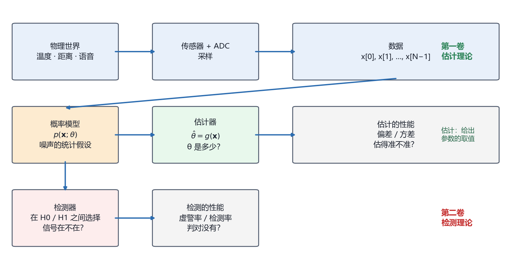

# Vol1 Ch01 引言：整本书只讲一个问题——从一堆带噪声的数据里"猜"参数

> 对应原书：第一卷《估计理论》第 1 章（书内第 11~13 页，本扫描 PDF 第 18~28 页；本扫描卷首无印刷页码，页码映射规则见文末"阅读备忘"）。
> 系列文档：`Document/统计信号处理/Documents/` 第 1 篇；全局导览见 `00_阅读指南.md`。

## 写在前头

这是《统计信号处理基础——估计与检测理论》（Steven M. Kay 著，中译本）讲解系列的第一篇，对应原书第一章《引言》。本章在全书中的位置很特殊：它不引入任何新的估计方法，只做一件事——**把"估计"这个问题本身定义清楚，并约定全书评价估计量的尺子**。后面 14 章的所有方法（MVU、CRLB、最大似然、贝叶斯、卡尔曼……）都是围绕这把尺子展开的。

用一句话概括本章的设计目标：**让读者在 15 页之内建立起三个观念——估计量是随机变量、数据必须配概率模型、好坏要用偏差与方差来衡量。** 这三个观念就是整个第一卷的地基。

**实测声明**：本文所有内容与数字均经 OCR 核对原书扫描件（PDF 第 18~28 页，OCR 文本存于 `Temp/chapters_ocr/ch01/`），不是凭印象转述。正文中的例子编号（例 3.13、例 7.15 等）均为原书编号，可对照原书查阅。作图数据为本系列自建数值实验（脚本 `Temp/scripts/make_fig001.py`），与原书无冲突。

---

## 1. 三个系统，一个问题

### 1.1 问题驱动：雷达、声纳、语音识别有什么共同点？

雷达要测飞机的距离，声纳要测潜艇的方位，语音识别要判断说的是 /a/ 还是 /e/。表面上八竿子打不着，但 Kay 在本章一开头就把它们并排摆出来，因为它们卡在**同一个问题上**。

先看雷达。机场监视雷达发射一个电磁脉冲，脉冲碰到飞机反射回来，接收端测到回波比发射晚了 $\tau_0$ 秒。电磁波走了一个来回，所以

$$
\tau_0 = \frac{2R}{c}
$$

其中 $R$ 为飞机到雷达的距离（待求量），$c$ 为电磁波传播速度（已知常数）。**翻译成人话：测出双程延迟 $\tau_0$，距离 $R$ 就到手了。** 但问题在于：回波经过传播损耗幅度会衰减，还会被环境噪声搅得模糊不清，接收机电子器件还会引入额外时延——所以 $\tau_0$ 没法直接"读"出来，只能从一段被噪声污染的波形里"估"出来。

再看声纳。被动声纳自己不发射信号，而是听潜艇机器和螺旋桨辐射出的噪声。两个相隔 $d$ 的传感器收到的信号之间存在时延 $\tau_0$，目标方位角 $\beta$ 满足

$$
\beta = \arccos\!\left(\frac{c\,\tau_0}{d}\right)
$$

其中 $c$ 为水中声速（中译本此处印作"光速"，按物理含义应为声速，见文末备忘），$d$ 为传感器间距。**又是同一个套路：要的物理量（方位）被藏在一个带噪声的观测量（时延）里。**（这个问题的完整估计方案在本系列第 7 篇的例 7.17 中给出，本章先埋下伏笔。）

最后看语音。要区分元音 /a/ 和 /e/，直接比波形不行——同一个人说三遍，音高（周期）都在变。但语音的**谱包络**基本不随音高变化：周期只影响频域采样的间隔，不影响包络的值。谱包络又由线性预测编码（LPC，linear predictive coding）模型的参数决定。**于是"识别元音"就变成了"估计 LPC 参数"——又一次把物理问题翻译成了参数估计问题。**（LPC 参数的估计方法是第 7 章例 7.18 的主题。）

下表把三个系统并排放在一起，共同点一目了然：

| 系统 | 想要的物理量 | 观测量 | 谁在捣乱 | 完整方案所在 |
|------|------------|--------|---------|------------|
| 雷达 | 距离 $R$ | 回波延迟 $\tau_0 = 2R/c$ | 环境噪声、接收机时延 | 例 3.13 / 例 7.15 |
| 被动声纳 | 方位角 $\beta$ | 传感器间时延 $\tau_0$ | 海洋噪声 | 例 3.15 / 例 7.17 |
| 语音识别 | LPC 参数（谱包络） | 采样的语音波形 | 音高变化、噪声 | 例 3.16 / 例 7.18 |

### 1.2 为什么这本书以"离散数据"为对象？

上一节的所有系统有一个共同的现代化动作：**用模数转换器（ADC）把连续波形采样成离散序列，送进数字计算机处理。** 采样之后，问题就统一成了：手里有 $N$ 个点 $x[0], x[1], \ldots, x[N-1]$，它们和某个未知参数 $\theta$ 有关系，要找一个函数

$$
\hat{\theta} = g\bigl(x[0], x[1], \ldots, x[N-1]\bigr)
$$

其中 $g$ 为某个（由我们设计的）函数，$\hat{\theta}$ 为对 $\theta$ 的估计值，加帽符号 $\hat{}$ 表示"估计量"。

**为什么把对象从连续波形换成离散序列？** 两个工程理由。第一，当代系统的数据通道本来就是数字的（ADC 之后一切皆序列）；第二，数字计算机里数据长度必然有限，$g(\cdot)$ 必然是一个有限长序列的函数——这正是统计估计理论能落地的形态。Kay 还顺带指出，这个问题历史上可以追溯到 **1795 年高斯用最小二乘数据分析方法预测行星运动**的年代——也就是说，本章定义的这个问题，比"数字信号处理"这个词老了近两百年（关于高斯与最小二乘的正式登场，见第 8 章）。

**一句话总结：全书只讲一件事——设计 $\hat{\theta} = g(x[0],\ldots,x[N-1])$ 这个函数，并回答"这个函数好不好"。**

---

## 2. 把问题写成数学：为什么必须给数据配一个概率模型

### 2.1 问题驱动：为什么不直接"解方程"，非要引入概率？

读者有 DSP 基础，可能会本能地问：$x[n] = A + w[n]$ 这种式子，把 $w[n]$ 当成误差项，用最小二乘之类的方法一解不就完了吗？为什么 Kay 在 §1.2 的第一步要郑重其事地引入概率密度函数（PDF）？

**因为数据里那部分"搅局"的成分本质上是随机的。** 噪声 $w[n]$ 每次实验都不同，它不是某个确定但未知的常数——如果它是，我们完全可以多采几个点把它解出来。随机意味着：同一个真值 $A$，同一套设备，两次采集得到的数据不一样。**对随机的东西，唯一完整的描述方式是概率**：不是说"噪声是多少"，而是说"噪声取各种值的可能性分布"。

于是数据的数学模型写成一个带参数的 PDF：

$$
p(\mathbf{x}; \theta)
$$

其中 $\mathbf{x} = [x[0], x[1], \ldots, x[N-1]]^T$ 为数据矢量，$\theta$ 为未知参数，分号"；"表示 $\theta$ 是 PDF 的参数而不是随机变量——这是本章埋下的一个记号伏笔，§2.3 会解释为什么这个分号如此关键。

**翻译成人话：$p(\mathbf{x};\theta)$ 是一族 PDF——$\theta$ 每取一个值，就对应一条"数据长什么样的概率曲线"；我们观测到了数据，反过去推断哪条曲线最可能。**

举一个 $N=1$ 的最小例子。若 $x[0]$ 的均值是 $\theta$（方差 $\sigma^2$ 已知），则

$$
p(x[0]; \theta) = \frac{1}{\sqrt{2\pi\sigma^2}} \exp\!\left[-\frac{(x[0]-\theta)^2}{2\sigma^2}\right]
$$

其中 $\sigma^2$ 为已知方差，$\theta$ 为待估均值。如果观测到 $x[0]$ 是负数，那么 $\theta = 1$ 的说法就值得怀疑，$\theta = -1$ 之类的负值更合理——**这就是"从数据推断参数"的原始形态：PDF 的形状决定了哪些参数值能解释数据、哪些不能。**

### 2.2 建模的自由与代价：道琼斯指数例子

实际工程中 PDF 不会从天上掉下来。Kay 用假想的道琼斯工业平均指数数据（原文图 1.6）演示了建模的全过程：

1. 观察数据：虽然起伏很大，但平均而言在上升；
2. 猜测结构：数据 = 一条直线 + 随机噪声，即 $x[n] = A + Bn + w[n]$，$n = 0, 1, \ldots, N-1$；
3. 猜噪声：$w[n]$ 为白高斯噪声（WGN），每个样本服从 $\mathcal{N}(0, \sigma^2)$（均值为 0、方差为 $\sigma^2$ 的高斯分布），且样本间互不相关；
4. 凑成参数矢量：$\boldsymbol{\theta} = [A, B]^T$，其中 $A$ 模拟"指数停留在 3000 点附近"，$B > 0$ 模拟"正在上升"。

由此写出数据矢量的 PDF（原书式 1.3）：

$$
p(\mathbf{x}; \boldsymbol{\theta}) = \frac{1}{(2\pi\sigma^2)^{N/2}} \exp\!\left[-\frac{1}{2\sigma^2}\sum_{n=0}^{N-1}\bigl(x[n] - A - Bn\bigr)^2\right]
$$

其中 $\sigma^2$ 为已知噪声方差，$N$ 为数据长度，求和项为"数据与直线模型差多少"的平方和——**注意这个式子的结构：数据偏离模型越多，概率越低；指数上的平方和正是日后最小二乘的原型**（第 8 章会揭晓这一点）。

建模的代价要照实说：**估计量的性能会随假定的 PDF 走**。我们选 WGN 是因为它能导出闭合形式的漂亮估计量，但如果真实噪声与 WGN 差得远，估计量性能就会退化。Kay 的原话是希望估计量"稳健"（robust），即 PDF 的微小变化不至于让性能崩掉；真正保守的做法是专门的稳健统计方法（Huber 1981），但那超出了本书范围。**"用什么样的概率假设"换"得到什么样的估计量"——这笔交易贯穿全书，后面每一章都要重新做一次。**

### 2.3 经典路线与贝叶斯路线：分号与竖线的差别

道琼斯例子还牵出全书最重要的一个岔路口。按 §2.1 的做法，$A$ 和 $B$ 是**确定但未知**的参数，PDF 写作 $p(\mathbf{x};\theta)$——这叫**经典估计**。

但工程师手里往往还有先验知识：道琼斯指数应该在 3000 点附近，估出 2000 或 4000 都离谱。经典路线对此无计可施——它的模型里根本没有"参数本身大概是多少"的位置。**贝叶斯路线**的解法是：把参数也当成随机变量，给它配一个先验 PDF（例如 $A$ 在 $[2800, 3200]$ 上均匀分布），数据的完整描述变成联合 PDF

$$
p(\mathbf{x}, \theta) = p(\mathbf{x} \mid \theta)\, p(\theta)
$$

其中 $p(\theta)$ 为先验 PDF（观测数据之前对 $\theta$ 的已有知识），$p(\mathbf{x}\mid\theta)$ 为条件 PDF（已知 $\theta$ 时数据提供的信息），竖线"|"表示"在 $\theta$ 给定的条件下"。

**记号的分野就是世界观的分野：$p(\mathbf{x};\theta)$ 把 $\theta$ 当固定数（分号后是参数），$p(\mathbf{x}\mid\theta)$ 把 $\theta$ 当随机变量（竖线后是条件）。** 两种路线导出的估计量表面相似、骨子里不同——这个话题在第 10 章（贝叶斯原理）正式展开，本章只在第 4 节的地图里给它留好位置。

---

## 3. 凭什么说一个估计量好：估计量是随机变量

### 3.1 问题驱动：样本均值输给"第一个样本"，谁更好？

§1.3 是全章的高潮，也是全书观念的转折点。场景：观测 $x[n] = A + w[n]$，$w[n]$ 为零均值噪声，要估计直流电平 $A$。直观上样本均值

$$
\hat{A}_1 = \frac{1}{N}\sum_{n=0}^{N-1} x[n]
$$

是合理的选择（噪声零均值，平均能把它"洗掉"）。另一个候选是 $\hat{A}_2 = x[0]$——只取第一个样本。

Kay 给出了一个让初学者尴尬的实况：对原书图 1.7 的那一组数据，样本均值算出 $\hat{A}_1 = 0.9$，首样本 $\hat{A}_2 = x[0] = 0.95$，而真值是 $A = 1$。**首样本反而更接近真值！那是不是说明首样本更好？**

答案是否定的，理由就是本章最重要的一个观念：

> **估计量是数据的函数，而数据是随机变量，所以估计量本身也是随机变量。** 它有很多可能的取值，某一次实验"更接近"只是撞上了，不是水平。

**翻译成人话：比单次考试的分数没用，要比就得比"长期平均表现"。** 于是评价要进入统计视角：把实验重复很多次（固定 $A=1$，每次换一组噪声现实），每次计算两个估计量的值，画直方图（原书图 1.8 是 100 次现实的直方图）。直方图显示：样本均值的结果密集地堆在 $A=1$ 附近，首样本的结果稀稀拉拉散成一片——**这才是"样本均值更好"的证据**。

### 3.2 从直方图到两个数字：偏差与方差

但直方图之争没有尽头：你画 100 次，怀疑者要 1000 次；你画 1000 次，他要 10000 次。**靠模拟永远吵不赢，必须上数学。** 对样本均值做两步计算（计算过程见原书，这里只取结论）：

1. 期望（平均）：
   $$
   E[\hat{A}_1] = E\!\left[\frac{1}{N}\sum_{n=0}^{N-1} x[n]\right] = \frac{1}{N}\sum_{n=0}^{N-1} E[x[n]] = A
   $$
   其中 $E[\cdot]$ 表示取期望（按噪声的随机性平均）。**平均而言正中靶心——这叫无偏。**
2. 方差（离散程度）：利用噪声样本互不相关，
   $$
   \mathrm{var}(\hat{A}_1) = \mathrm{var}\!\left(\frac{1}{N}\sum_{n=0}^{N-1} x[n]\right) = \frac{\sigma^2}{N}
   $$
   其中 $\sigma^2$ 为噪声方差，$N$ 为样本数。**数据越长，估计量越稳定。**

而首样本 $\hat{A}_2 = x[0]$ 的期望同样是 $A$（也无偏），但方差是 $\mathrm{var}(\hat{A}_2) = \sigma^2$——**一个点也没"洗掉"噪声。** 两个估计量同样无偏，样本均值方差小 $N$ 倍，胜负就此落定。

**一句话总结：无偏回答"瞄得准不准"，方差回答"手抖不抖"；无偏的前提下方差越小越好。**

如果噪声还是高斯的，还能进一步证明：给定期望幅度误差的概率，样本均值始终比首样本小（原书习题 2.7）——但那是第 2 章的活，这里只需要记住两个数字：**$E[\hat{A}] = A$，$\mathrm{var}(\hat{A}) = \sigma^2/N$。**

### 3.3 蒙特卡洛的边界：模拟永远给不了"证明"

本节还顺手立了两条规矩，值得每个做算法验证的工程师刻在桌上：

1. **计算机模拟永远得不出明确结论**——它能给你洞察、帮你猜方向，但最好的情况也只是"以希望的精度逼近真实性能"；试验次数不够或模拟写错，还会给出错误结论（蒙特卡洛技术的正式介绍在原书附录 7A）。
2. **性能和计算复杂度永远在互相拉扯**——样本均值性能好，但要 $N-1$ 次加法和一次除法；首样本几乎零计算，性能却差 $N$ 倍。全书后面会反复出现"最佳估计量难实现、准最佳估计量易实现"的取舍：**用户必须自己决定，省下的计算量值不值得那点性能损失。**

这条"模拟只能给洞察、不能给证明"的提醒，在本系列第 7 篇（最大似然估计）会用真实的蒙特卡洛实验（Fig003）再验证一遍——到时候读者会看到模拟结果和理论曲线严丝合缝，但那也只是"印证"而非"证明"。

---

## 4. 全书地图：估计理论卷（和检测理论卷）怎么走

第一章的任务是把地图发到读者手里。下图（Fig001）是全书的信息流全景：

*图 Fig001：统计信号处理全景图——从物理世界到估计/检测的数据流。看三行：第一行是"数据怎么来"（物理量 → 传感器+ADC 采样 → N 点数据序列）；第二行是估计路线的闭环（概率模型 → 估计器 → 偏差/方差评价），箭头从"数据"斜指向"概率模型"，表示建模是把数据变成可推断对象的关键一步；第三行是检测路线（在 H0/H1 之间做选择，性能用虚警率/检测率评价）。这张图说明：两卷书共用一个地基——数据与概率模型——然后分岔成"参数是多少"（估计）和"信号在不在"（检测）两个问题。*

沿图走一遍估计理论卷的章节路线（章号为原书第一卷章号）：

- **第 2 章 最小方差无偏估计（MVU）**：先给"最好的估计量"下定义——无偏 + 方差最小；
- **第 3 章 Cramér-Rao 下限（CRLB）**：任何无偏估计量的方差都不可能低于某个下限，这就是精度的物理天花板；
- **第 4 章 线性模型**：在"数据 = 已知矩阵 × 参数 + 噪声"这个最常用场景下，MVU 有现成答案；
- **第 5 章 充分统计量**：数据里"关于参数的全部信息"可以压缩进几个数，不丢东西；
- **第 6 章 最佳线性无偏估计（BLUE）**：只知道噪声的一、二阶矩（不必是高斯）时，最优的线性估计；
- **第 7 章 最大似然估计（MLE）**：实用主义的主力——MVU 求不出时的默认选项，渐近最优；
- **第 8 章 最小二乘（LS）**：不需要任何概率假设的万能办法（代价：不是最优）；
- **第 9 章 矩方法**：用样本矩匹配理论矩的朴素办法；
- **第 10~12 章 贝叶斯路线**：把先验知识请进来——贝叶斯原理、MMSE/MAP、线性 MMSE 与维纳滤波器；
- **第 13 章 卡尔曼滤波器**：贝叶斯思想在动态系统上的集大成者；
- **第 14 章 估计量总结**：所有方法的"选型指南"；
- **第 15 章 复数据扩展**：把整套理论搬到复信号上——做通信、阵列、频域处理的读者会在这里收账。

第二卷《检测理论》回答另一个问题："信号到底在不在？"（虚警率、检测率、ROC 曲线、匹配滤波器……），其信息流是图 Fig001 的第三行。检测里大量复用估计的工具（最大似然、GLRT），所以**先学估计再学检测**，两卷的顺序不可颠倒。

作者在 §1.4 交代的写作路线也值得记住：**先求最佳，求不出或实现不了就退而求其次（准最佳）**；繁琐推导一律压进附录；**先讲标量再讲矢量**，避免矩阵代数淹没主线。本系列文档遵循同样的约定：结论性公式保留，推导注明原书出处。

---

## 5. 本章建立的三条观念（关键观念回顾）

把散在正文里的"为什么"收拢成三条，它们就是后面所有章节的默认前提：

| # | 观念 | 当初不这么立会怎样 | 对应的后续章节 |
|---|------|------------------|--------------|
| 1 | **估计量是随机变量**，好坏只能用统计量（偏差/方差）描述 | 会陷入"某次实验谁更接近"的扯皮，永远无法给出可复现的评价 | 第 2 章（MVU 定义）、第 3 章（CRLB） |
| 2 | **数据必须配概率模型** $p(\mathbf{x};\theta)$ | 无法量化"哪些参数值更能解释数据"，估计问题无从谈起 | 第 4~9 章（经典路线）、第 10~13 章（贝叶斯路线） |
| 3 | **无偏 + 最小方差是尺子，但不是唯一尺子** | 会忽略"复杂度"这一维——最佳估计量常常算不起，准最佳才有工程生命 | 第 7 章（MLE 渐近最优）、第 8 章（LS 无概率假设） |

## 6. 阅读备忘（对照原书时的坑）

1. **页码映射**：本扫描 PDF 的第 1 章正文位于 PDF 第 18~28 页。自 PDF 第 27 页（印刷页"12"）起，**书内页码 = PDF 页码 − 15**（PDF 145 → 书内 130、PDF 197 → 书内 182，均实测吻合）；第 1 章开头几页无印刷页码，且印刷目录所载"第 1 章起始于第 11 页"与本扫描的卷首页编排不完全吻合（疑似目录与正文为不同印次拼装）。**引用以 PDF 页码为准**，全文保持一致。
2. **记号约定**：$\hat{\theta}$ 的帽子表示估计量；$p(\mathbf{x};\theta)$（分号）是经典记号，$p(\mathbf{x}\mid\theta)$（竖线）是贝叶斯记号；原书不区分随机变量与其取值的大小写，靠上下文判断。
3. **中译本笔误**：§1.1 声纳例中"c 是水中的光速"应为"水中的声速"（该处讨论的是声波在水中传播；英文原版为 speed of sound）。
4. **数字细节**：§1.3 的实况数据（$\hat{A}_1 = 0.9$、$\hat{A}_2 = 0.95$、真值 $A=1$）出自原书图 1.7 的那一组数据；直方图（图 1.8）是 100 次现实的统计结果。

## 7. 本章的局限（坦诚交代）

- 本章只定义问题，**没有给出任何"如何设计好估计量"的方法**——那是第 2 章以后的事；读到本章末尾"还不会估任何参数"是完全正常的。
- 偏差/方差这对指标是经典路线的尺子，**贝叶斯路线另有风险函数等指标**（第 11 章），本章刻意未展开，避免概念打架。
- 三个应用例子（雷达/声纳/语音）在本章只有定性描述，定量方案全部推迟到第 3 章（CRLB）和第 7 章（MLE）——这是作者有意为之的伏笔结构，不是遗漏。

## 8. 建议自测的问题

1. 用你自己的话解释：为什么"估计量是随机变量"这句话推翻了"首样本这次更接近真值所以首样本更好"的论证？（提示：见 §3.1）
2. 若噪声方差 $\sigma^2 = 1$，分别取 $N = 4$ 和 $N = 100$，样本均值的方差各是多少？这说明"多采数据"的收益是什么量级的？
3. 经典估计与贝叶斯估计的分界点是什么？请各举一个更适合的场景。
4. 原书习题 1.3：设 $x = \theta + w$，$w$ 的 PDF 为 $p(w)$。若 $\theta$ 是确定性参数，写出 $p(x;\theta)$；若 $\theta$ 是与 $w$ 独立的随机变量，写出 $p(x\mid\theta)$ 和 $p(x,\theta)$。两种记号的含义差别是什么？

---

**一句话收尾：这一章什么都没"估计"，但它把"估计是什么、好坏怎么看"钉死了——后面 14 章，不过是在这条钉死的赛道上换着法子跑。**

*实测核对声明：本章事实性内容核对自原书扫描件 OCR 文本 `Document/统计信号处理/Temp/chapters_ocr/ch01/ocr_page_018~029.txt`（PDF 第 18~29 页）；公式编号（1.1）（1.2）（1.3）与原书一致；Fig001 由 `Temp/scripts/make_fig001.py` 生成并经程序化碰撞检测通过。*
