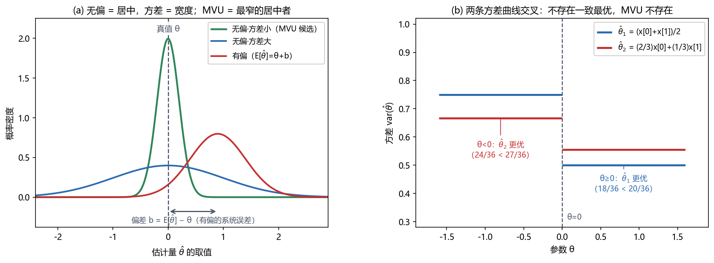

# Vol1 Ch02 最小方差无偏估计：好估计量先要"瞄准靶心"，再比谁"手最稳"

> 对应原书：第一卷《估计理论》第 2 章（书内第 14~22 页，本扫描 PDF 第 29~37 页）。
> 前置阅读：本系列 `Vol1_Ch01_引言.md`（估计量是随机变量、偏差/方差、样本均值 $E[\hat{A}]=A$、$\mathrm{var}(\hat{A})=\sigma^2/N$）；本文自包含，涉及的前置概念就地插播。

## 写在前头

这是讲解系列的第 2 篇，对应原书第二章《最小方差无偏估计》。在全书链条里的位置很关键：**第 1 章定义了"估计"这个问题、立好了偏差与方差两把尺子，但没回答"那什么样的估计量才算最好"**。本章来补上这个定义——它给"最好的估计量"下一个正式的名字：最小方差无偏（MVU）估计量。

但读完本章你会有一个略感扫兴的收获：**这个"最好"的定义很好下，要把它"求出来"却需要后面三四五章的机器**。Kay 在本章就明确摊牌——不存在一种"转动摇把"式、对任何问题都能输出 MVU 的通用流程。所以本章的真正角色，是**先把靶子画在墙上**，后面各章都是朝这个靶子打的不同枪法。

用一句话概括本章的设计目标：**在"无偏"这条硬约束下，把"最好"定义为"方差最小"，并讲清楚三件事——为什么偏偏要锁死无偏、这个最好估计量何时存在、存在时有哪些路可走。**

**实测声明**：本文所有内容与数字均经 OCR 核对原书扫描件（PDF 第 29~37 页，OCR 文本存于 `Temp/chapters_ocr/ch02/ocr_page_029~037.txt`），不是凭印象转述。公式编号（2.1）~（2.7）、例 2.1~2.3、图 2.1~2.5、习题 2.1~2.11 均为原书编号，可对照原书查阅。例 2.3 的方差数值（18/36、20/36、24/36、27/36）与习题 2.11 的分布，OCR 有缺字，据 Kay 英文原版校订（详见文末"实现备忘"）。Fig005 为本系列自建示意图（脚本 `Temp/scripts/make_fig005.py`），只用于把概念画清楚，与原书无冲突。

---

## 1. 为什么需要"无偏"这条约束：有偏估计的陷阱

### 1.1 问题驱动：什么叫"平均而言不偏"？

第 1 篇已经建立了一个观念：**估计量是数据的函数，而数据是随机变量，所以估计量本身也是随机变量**，好坏要用统计量描述，不能比"某一次谁更接近真值"。顺着这个观念，最朴素的愿望就是：**让估计量的平均值正好落在真值上**。这个愿望有个正式名字——无偏。

原书 §2.3 的定义（式 2.1）就一句话：

$$
E[\hat{\theta}] = \theta, \qquad \text{对 } a < \theta < b \text{ 内的所有 } \theta
$$

其中 $E[\cdot]$ 为取期望（按噪声的随机性平均），$\hat{\theta}$ 为估计量，$\theta$ 为未知的真值，区间 $(a,b)$ 为 $\theta$ 的可能取值范围。**翻译成人话：不管真值藏在区间里的哪个位置，估计量的平均值都正好打中它。**

### 1.2 例 2.1：WGN 中直流电平的样本均值——无偏的标准样板

场景沿用第 1 篇的"猜直流电平"：观测

$$
x[n] = A + w[n], \qquad n = 0, 1, \ldots, N-1
$$

其中 $A$ 为待估的直流电平（可取 $-\infty < A < \infty$ 的任意值），$w[n]$ 为白高斯噪声（WGN，white Gaussian noise——每个样本独立、均值为 0、方差为 $\sigma^2$ 的高斯噪声）。一个合理的估计是样本均值（式 2.2）：

$$
\hat{A} = \frac{1}{N}\sum_{n=0}^{N-1} x[n]
$$

其中 $N$ 为样本数。由期望的线性性，对所有 $A$ 都有 $E[\hat{A}] = \frac{1}{N}\sum_{n} E[x[n]] = \frac{1}{N}\sum_{n} A = A$，所以样本均值**无偏**。

这里有两个第 1 篇已经建立、本章直接调用的数字：样本均值的期望是 $A$，方差是 $\sigma^2/N$。它的完整 PDF 是 $\mathcal{N}(A, \sigma^2/N)$（即均值为 $A$、方差为 $\sigma^2/N$ 的高斯分布，原书图 2.1，证明见习题 2.3）。**这两个数字就是本章后面所有论证的地基。**

### 1.3 "对所有 $\theta$ 都成立"这句，才是无偏的定义核心

定义式（2.1）里最容易被读漏、也最关键的限定是"**对 $(a,b)$ 内的所有 $\theta$**"。把估计量写成数据的函数 $\hat{\theta} = g(\mathbf{x})$（$\mathbf{x} = [x[0], x[1], \ldots, x[N-1]]^T$ 为数据矢量），无偏要求的就是（式 2.3）：

$$
E[\hat{\theta}] = \int g(\mathbf{x})\, p(\mathbf{x}; \theta)\, d\mathbf{x} = \theta, \qquad \text{对所有 } \theta
$$

其中 $p(\mathbf{x};\theta)$ 为数据的 PDF（分号后 $\theta$ 是参数），积分号表示对数据的所有可能取值平均。**翻译成人话：不是"某个特定真值下不偏"，而是"任何真值下都不偏"。**

为什么这句话要单独拎出来强调？因为**一个估计量可能对某些 $\theta$ 无偏、对另一些 $\theta$ 有偏**，而工程上你永远不知道真值具体是多少——所以"只在 $A=0$ 处无偏"等于没说。原书例 2.2 就是这样一个陷阱：

$$
\hat{A} = \frac{1}{2N}\sum_{n=0}^{N-1} x[n]
$$

其中 $2N$ 是分母（把样本均值再除以 2）。直接算期望得 $E[\hat{A}] = A/2$：**只有当 $A=0$ 时才满足（2.1），其余所有 $A$ 都是系统性偏低一半**。这就是有偏——而且偏得很难看：不管数据多长，它永远只给你真值的一半。

> **前置概念：偏差。** 偏差（bias）定义为 $b(\theta) = E[\hat{\theta}] - \theta$——估计量平均值与真值的差。**翻译成人话：偏差是"瞄准时枪口本身的固定偏移"，不是"手抖"。** 例 2.2 的偏差是 $b(A) = A/2 - A = -A/2$，随 $A$ 变化，这正是它致命的根源（§2.2 会展开）。

### 1.4 无偏不是矫情：把几个估计量一平均，差别就现形了

单看一个估计量，"无偏"只是"平均而言不偏"，好像没有多么要紧。但原书用一个极有说服力的场景点破它的分量：**当你手里有多个独立估计，想平均出一个更好的估计时**（式 2.4）：

$$
\hat{\theta} = \frac{1}{n}\sum_{i=1}^{n} \hat{\theta}_i
$$

其中 $n$ 为待组合的估计量个数，$\hat{\theta}_i$ 为第 $i$ 个估计量。假定每个估计量无偏、方差相同（记为 $\sigma^2$）且互不相关，则 $E[\hat{\theta}] = \theta$，而

$$
\mathrm{var}(\hat{\theta}) = \frac{\sigma^2}{n}
$$

其中 $\mathrm{var}$ 表示取方差。**翻译成人话：平均的估计越多，方差越小，$n \to \infty$ 时平均估计收敛到真值——无偏让"人多力量大"真正成立。**

反过来，如果每个估计量有偏（$E[\hat{\theta}_i] = \theta + b(\theta)$），那么无论平均多少个，$E[\hat{\theta}] = \theta + b(\theta)$，**永远差着那个固定的偏差 $b(\theta)$，加多少人都抹不掉**。原书图 2.2 画的就是这个对比：无偏者平均后越来越集中在真值，有偏者平均后稳定地停在一个偏掉的位置。这也顺带给出无偏的第二个工程理由：**无偏性在估计量被组合、级联、复用的时候会保值，偏差却会一路传播**（原书习题 2.4 用"心率监测仪多测几次再平均"演示了同一个道理）。

**一句话总结：无偏回答的是"枪口有没有瞄准"——不瞄准，你平均一百次也打不中；瞄准了，平均才能帮你把手抖抖掉。**

---

## 2. 无偏还不够：最小方差准则，以及 MSE 为什么被放弃

### 2.1 问题驱动：既然要最好，为什么不直接最小化"误差平方的平均"？

一个工程师面对"最好的估计量"时，第一反应几乎一定是**均方误差（MSE）**——估计量离真值越近越好，那就算误差平方的平均（式 2.5）：

$$
\mathrm{mse}(\hat{\theta}) = E\bigl[(\hat{\theta} - \theta)^2\bigr]
$$

其中 $\mathrm{mse}$ 为均方误差，它度量"估计量偏离真值的平方偏差的统计平均值"。这个准则直觉上无懈可击，但**它的致命伤是：按它求出来的"最优估计量"往往无法实现**。这值得停下来想清楚，因为它是整章逻辑的转折点。

### 2.2 拆开看：MSE = 方差 + 偏差的平方

把 MSE 拆成两部分（式 2.6）：

$$
\mathrm{mse}(\hat{\theta}) = \mathrm{var}(\hat{\theta}) + b^2(\theta)
$$

其中 $\mathrm{var}(\hat{\theta})$ 为估计量方差，$b(\theta) = E[\hat{\theta}] - \theta$ 为偏差。**翻译成人话：MSE 里同时住着两笔账——"手抖"（方差）和"枪口没瞄准"（偏差平方）。** 这个拆解就是一切的答案：只要涉及偏差项，而偏差项一般是 $\theta$ 的函数，那么"最小化 MSE"求出的解就会**依赖真值 $\theta$**——而真值是你要估的东西，这等于让估计量"先知道自己要估什么"，逻辑上做不到。

原书用一个具体例子把这句话做实。在例 2.1 里，把样本均值乘一个待定系数 $\alpha$，得到一族候选估计量：

$$
\check{A} = \frac{\alpha}{N}\sum_{n=0}^{N-1} x[n]
$$

其中 $\alpha$ 为待定的比例系数。因为 $E[\check{A}] = \alpha A$、$\mathrm{var}(\check{A}) = \alpha^2\sigma^2/N$，代入式（2.6）：

$$
\mathrm{mse}(\check{A}) = \frac{\alpha^2\sigma^2}{N} + (\alpha - 1)^2 A^2
$$

其中第一项来自方差（乘 $\alpha$ 后方差放大 $\alpha^2$ 倍），第二项来自偏差 $b = (\alpha - 1)A$ 的平方。对 $\alpha$ 求导并令其为零，解出"最优"系数：

$$
\alpha_{\mathrm{opt}} = \frac{A^2}{A^2 + \sigma^2/N}
$$

其中 $\sigma^2$ 为已知噪声方差，$N$ 为样本数。**问题就在这里：$\alpha_{\mathrm{opt}}$ 里明晃晃地含着待估量 $A$。** 真值 $A$ 越大，最优的 $\alpha$ 越接近 1（越不该压缩）；$A$ 越小，最优的 $\alpha$ 越接近 0（越该往零里压）。你没法在不知道 $A$ 的情况下选 $\alpha$，所以这个"最小 MSE 估计量"**不可实现**。

原书由此下了一个带总结性质的判断：**任何与偏差项沾边的准则，通常都会导出不可实现的估计量**（偶尔能找到可实现的 MSE 估计量，但那属于少数例外，见文末参考文献）。这一句是整章的"扳机"。

### 2.3 锁死偏差为零：MVU 应运而生

既然偏差项是捣乱的根源，那就**干脆把它设成零**——在"无偏"这个约束之内，再挑方差最小的那个。这就是**最小方差无偏（MVU）估计量**：在所有无偏估计量里，方差最小者。

这一刀切下去，立刻带来两个干净的性质：

1. **无偏估计量的 MSE 恰好就是它的方差**（因为 $b=0$，式（2.6）只剩 $\mathrm{var}$）。于是"方差最小"和"均方误差最小"在无偏的圈子里是同一件事，不再打架。
2. **MVU 使估计误差 $(\hat{\theta} - \theta)$ 的 PDF 尽可能集中在零附近**——原书习题 2.7 证明：若两个无偏估计量都是高斯的，方差小者满足"误差绝对值超过任意阈值 $\epsilon$"的概率也更小。**翻译成人话：方差最小的估计量，大偏差出现的可能性最小，这是"方差小 = 更好"的严格背书。**

### 2.4 回调第 1 篇：首样本 vs 样本均值，就是"无偏还不够"的活教材

到这里，"无偏还不够，还要方差最小"这个逻辑可以立刻用第 1 篇的老例子兑现：估计 $A$ 时，**首样本** $\hat{A}_2 = x[0]$ 和**样本均值** $\hat{A}_1 = \frac{1}{N}\sum x[n]$ **都无偏**（两者的期望都是 $A$），但样本均值的方差是 $\sigma^2/N$，首样本的方差是 $\sigma^2$——**差 $N$ 倍**。两个都"瞄准了靶心"，样本均值"手更稳"，所以它才是更接近 MVU 的那个候选。这一组对比就是本章 §1 与 §2 想说明的全部道理的一个缩影：**无偏只是入场券，方差才是分高下的赛场。**

### 2.5 本章概念的示意总图：无偏 = 居中、方差 = 宽度，以及 MVU 可能不存在（Fig005）

*图 Fig005：本章两个核心结论的示意（自建图，脚本 `Temp/scripts/make_fig005.py`）。(a) 左面板——真值 $\theta=0$（灰色虚线）下三条估计量 PDF：绿色"无偏·方差小"（MVU 候选，又窄又居中）、蓝色"无偏·方差大"（居中但散）、红色"有偏"（均值整体右移，底部双箭头标出偏差 $b=E[\hat{\theta}]-\theta$）。看两件事：① 无偏 = 曲线峰值落在真值线上，有偏 = 曲线整体平移一段系统误差；② 方差 = 曲线的"胖瘦"，MVU = 所有"居中"曲线里最瘦的那条。(b) 右面板——原书例 2.3 的两条方差曲线随 $\theta$ 交叉（数值 18/36、20/36、24/36、27/36），$\theta<0$ 时 $\hat{\theta}_2$ 方差更小、$\theta\ge0$ 时 $\hat{\theta}_1$ 方差更小，说明不存在"处处方差都最小"的无偏估计量，即 MVU 不存在（详见 §3）。*

**一句话总结：MSE 这个"最自然"的准则，因为解里藏着真值而不可实现；锁死无偏、转而在无偏圈子里比方差，MVU 的定义才站得住。**

---

## 3. MVU 一定存在吗？——存在性是一个真问题

### 3.1 问题驱动：凭什么假设"方差处处最小"的那个估计量一定在？

上一节定义了 MVU，但定义和存在是两回事。一个更尖锐的问题是：**有没有可能，两个无偏估计量"你在这个区段方差小、我在那个区段方差小"，谁都不是全场的方差最小者？** 答案是：完全可能，而且原书用一个干净的数值例子把它坐实了。

先看图 2.3 的两种情形（原书）。图 2.3(a)：三个无偏估计量中，有一个的方差对所有 $\theta$ 都最小——MVU 存在。图 2.3(b)：估计量 $\hat{\theta}_1$ 在 $\theta < \theta_0$ 时方差最小，$\hat{\theta}_2$ 在 $\theta \ge \theta_0$ 时方差最小——**MVU 不存在**。为了强调"对所有 $\theta$ 都最小"这一点，MVU 有时也被称为**一致最小方差无偏估计量**。这个"一致"两个字不是装饰：它划清了"处处最小"与"偶尔最小"的界线。

### 3.2 例 2.3：一个 MVU 不存在的数值反例

原书例 2.3 的关键在于：**当 PDF 的形状随 $\theta$ 变化时，最佳估计量也会随 $\theta$ 变化**。假定有两个独立观测 $x[0]$、$x[1]$，其 PDF 为：

$$
x[0] \sim \mathcal{N}(\theta, 1), \qquad
x[1] \sim \begin{cases} \mathcal{N}(\theta, 1), & \theta \ge 0 \\ \mathcal{N}(\theta, 2), & \theta < 0 \end{cases}
$$

其中 $\mathcal{N}(\theta, v)$ 表示均值为 $\theta$、方差为 $v$ 的高斯分布。**注意：$x[1]$ 的方差在 $\theta \ge 0$ 时是 1、在 $\theta < 0$ 时是 2——PDF 的"胖瘦"随真值的正负号而变。** 考虑两个估计量：

$$
\hat{\theta}_1 = \frac{1}{2}\bigl(x[0] + x[1]\bigr), \qquad
\hat{\theta}_2 = \frac{2}{3}x[0] + \frac{1}{3}x[1]
$$

其中 $\hat{\theta}_1$ 为等权平均，$\hat{\theta}_2$ 为加权平均（给方差更小的 $x[0]$ 更大权重）。因为 $E[x[0]] = E[x[1]] = \theta$ 对任何 $\theta$ 都成立（无论方差是 1 还是 2），两者都**无偏**。但方差随 $\theta$ 的正负号分岔（计算过程见原书，这里只取结论）：

| 区间 | $\mathrm{var}(\hat{\theta}_1)$ | $\mathrm{var}(\hat{\theta}_2)$ | 更优者 |
|:---:|:---:|:---:|:---:|
| $\theta \ge 0$（$x[1]$ 方差=1） | $\frac{1+1}{4}=\frac{18}{36}$ | $\frac{4}{9}+\frac{1}{9}=\frac{20}{36}$ | $\hat{\theta}_1$ |
| $\theta < 0$（$x[1]$ 方差=2） | $\frac{1+2}{4}=\frac{27}{36}$ | $\frac{4}{9}+\frac{2}{9}=\frac{24}{36}$ | $\hat{\theta}_2$ |

表里的分子分母：以 $\theta \ge 0$ 行为例，$\hat{\theta}_1$ 的方差为 $\frac{1}{4}(1+1)=\frac{1}{2}=\frac{18}{36}$，$\hat{\theta}_2$ 的方差为 $\frac{4}{9}\cdot1+\frac{1}{9}\cdot1=\frac{5}{9}=\frac{20}{36}$（权重 $\frac{2}{3}$ 的平方是 $\frac{4}{9}$）。原书图 2.4 画的就是这两条阶梯状的方差曲线：**在 $\theta<0$ 一侧 $\hat{\theta}_2$ 更小（24/36 < 27/36），在 $\theta\ge0$ 一侧 $\hat{\theta}_1$ 更小（18/36 < 20/36），两条曲线在 $\theta=0$ 处交叉**——这正是 Fig005(b) 画的内容。

更进一步的结论写在习题 3.6（下章）：对 $\theta \ge 0$，无偏估计量方差的最小可能值是 18/36；对 $\theta < 0$，是 24/36。也就是说，**这两个估计量已经分别摸到了各自区段的天花板，但没有任何一个估计量能同时摸到两边的天花板**。因此，不存在一个"一致地小于或等于"图 2.4 所示最小值曲线的单一估计量——**MVU 不存在**。

### 3.3 更糟的情况：连一个无偏估计量都可能不存在

存在性的坑还不止"两个候选分庭抗礼"。原书在习题 2.11 给出更极端的情形：**有时连一个无偏估计量都造不出来**。

给定从 $\mathcal{U}(0, 1/\theta)$ 分布（区间 $[0, 1/\theta]$ 上的均匀分布）取一个单一观测 $x[0]$，要估 $\theta$（$\theta > 0$）。设估计量为 $\hat{\theta} = g(x[0])$，无偏要求 $E[g(x[0])] = \theta$，即

$$
\int_0^{1/\theta} g(u)\, \frac{1}{1/\theta}\, du = \theta
\quad\Longrightarrow\quad
\int_0^{1/\theta} g(u)\, du = 1
$$

其中 $g$ 为待找的估计函数，$1/(1/\theta) = \theta$ 是均匀分布在这个区间上的密度值。**这个等式必须对所有的 $\theta>0$ 同时成立**——但它的左端积分上限 $1/\theta$ 随着 $\theta$ 扫过整个 $(0,\infty)$，要求积分值恒等于 1 是不可能的（令 $v=1/\theta$ 扫过 $(0,\infty)$，对 $\int_0^v g(u)du = 1$ 两边求导得 $g(v)=0$，代回积分又得 $0=1$，矛盾）。**于是任何函数 $g$ 都无法满足无偏条件，无偏估计量压根不存在**。此时"找 MVU"的任何努力都是无果的——原书在结束存在性讨论时，专门把这条写出来当警告。

**一句话总结：MVU 不是免费的午餐——它可能不存在（例 2.3），甚至可能连"无偏"这个入场资格都没有（习题 2.11）；存在性必须在动手求之前先想清楚。**

---

## 4. MVU 存在时怎么求：三条路线，没有"转动摇把"

### 4.1 问题驱动：为什么没有一个万能算法，输入问题、输出 MVU？

既然 MVU 是个好靶子，那有没有一套"转动摇把"（turn-the-crank）式的流程，任何问题摇一摇就出 MVU？原书 §2.6 的答案很干脆：**没有。** 即使 MVU 存在，也可能求不出来；没有一种总是能得到它的通用方法。这句话值得反复咀嚼，因为它直接决定了后面第 3、4、5、6 章的编排——**正因为没有万能算法，才需要按问题的结构分类，每一类配一把专用工具。**

原书列出的三条路线如下（对应后续章节）：

| # | 方法 | 依赖的理论 | 后续章节 | 能否保证得到 MVU |
|:---:|------|-----------|---------|----------------|
| 1 | 求 CRLB，检查是否有估计量达到它 | Cramér-Rao 下限 | 第 3、4 章 | 达到即 MVU |
| 2 | 求充分统计量，再用 RBLS 定理 | Rao-Blackwell-Lehmann-Scheffe 定理 | 第 5 章 | 可以（对 PDF 稍加限制） |
| 3 | 限定"线性无偏"，在类内求方差最小（BLUE） | 线性约束下的优化 | 第 6 章 | 仅当 MVU 恰为线性时 |

三条路线的分工，原书用图 2.5 讲得很清楚：

- **路线 1（CRLB）**：CRLB 给出"任意无偏估计量的方差都大于等于某个值"的下限。**如果存在一个估计量，对每个 $\theta$ 其方差都恰好等于 CRLB，那它一定是 MVU**——这时套 CRLB 理论立刻出结果。但也可能出现"没有任何估计量的方差达到这个下限，而 MVU 仍然存在"的情况（图 2.5 里的 $\hat{\theta}_3$ 就是这种：方差贴着下限上方，但比谁都低）。
- **路线 2（RBLS）**：当 CRLB 够不着（没估计量达标）时，改用充分统计量路线——先找出**充分统计量**（sufficient statistic），即"压缩了数据里关于 $\theta$ 的全部信息"的一个统计量，再对它的无偏函数稍加处理；对数据 PDF 稍作限制后，这条路线能保证得到 MVU。
- **路线 3（BLUE）**：前两条都失败时，退一步**额外要求估计量是数据的线性函数**，在这个更小的圈子里找方差最小者。代价明说：它只在"MVU 恰好就是线性估计量"的数据集上才能给出真 MVU，否则只是"最佳线性"这个子集里的最优，不是全局最优。

### 4.2 伏笔与回调：从 MVU 这一侧看后续章节

这一节埋下了全书最重要的几颗种子，值得当场标清楚：

- **CRLB 是下一章（第 3 章）的主角**：本章只说"有个下限"，第 3 章才给出下限的具体公式与"达到下限的充分必要条件"——那正是判断 MVU 是否可达的第一把尺子。
- **充分统计量是第 5 章的主角**：本章只抛出"数据可以无损压缩成几个数"的直觉（Fig009 会在第 5 篇把它画出来），第 5 章用 Neyman-Fisher 因子分解定理把它变成可操作的求法。
- **与第 7 篇（MLE）的呼应**：本系列第 7 篇已经引用过两个结论——"例 3.3 样本均值是有效估计量（方差达到 CRLB 的无偏估计量）"与"习题 7.12：有效估计量存在，则 MLE 必能把它求出来"。**从本章这一侧看，这两句话的含义是：当 MVU 恰好能由路线 1（CRLB 达标）求得时，最大似然估计不会错过它**；而当 MVU 求不出时，第 7 章会搬出 MLE 这台"摇把"机器来兜底——所以本章的"没有转动摇把"与第 7 章的"转动摇把"是一对首尾呼应的对照：**MVU 没有万能求法，MLE 有，代价是只保证渐近最优（第 7 篇 §4 已讲）。**
- **例 2.3 的呼应**：习题 3.6 会用 CRLB 把"$\theta\ge0$ 时方差下限 18/36、$\theta<0$ 时 24/36"这条结论重新证一遍——**本章的"不存在 MVU"到了第 3 章会有一把下限之尺来精确刻画"为什么不存在"。**

**一句话总结：求 MVU 没有万能算法，只有按结构分类的三条路——CRLB（第 3、4 章）、RBLS（第 5 章）、BLUE（第 6 章）；这条路走不通的遗憾，正是后面三章存在的理由。**

---

## 5. 扩展到矢量参数：每个分量各自无偏、各自最小方差

### 5.1 问题驱动：要估的不止一个数时，定义怎么搬？

工程里几乎从不是只估一个标量：直流电平 + 噪声方差、正弦的幅度 + 频率 + 相位……原书 §2.7 要回答的就是：**当参数是一个矢量 $\boldsymbol{\theta} = [\theta_1, \theta_2, \ldots, \theta_p]^T$ 时，"无偏"和"最小方差"怎么定义？**

答案是**逐分量**定义，原书式（2.7）：

$$
E[\hat{\theta}_i] = \theta_i, \qquad i = 1, 2, \ldots, p
$$

其中 $p$ 为参数个数，$\hat{\theta}_i$ 为第 $i$ 个分量估计量。**翻译成人话：参数矢量的无偏，就是每一个分量分别无偏。** 写成矢量形式 $E[\hat{\boldsymbol{\theta}}] = \boldsymbol{\theta}$ 也行，但逐分量写法的好处是**直接暴露"每个分量都要对号入座"的要求**——第 $i$ 个估计量只对第 $i$ 个参数负责。

MVU 的矢量版也顺势逐分量定义：**在所有的无偏估计量中，对每一个 $i$，$\hat{\theta}_i$ 的方差都是最小的。** 这里有一个口径要留意：它是"每个分量各自的方差"最小，而不是"某个合成误差"最小——后者要等第 11 章贝叶斯路线（MMSE/MAP）才正式登场。

### 5.2 一个立刻能算的对照：$A$ 与 $\sigma^2$ 联合估计

矢量定义的妙处，用原书习题 2.10 的例子一句话就能体会。在例 2.1 里，若除了 $A$，噪声方差 $\sigma^2$ 也未知，要联合估计 $\boldsymbol{\theta} = [A, \sigma^2]^T$。一个自然的选择是

$$
\hat{A} = \frac{1}{N}\sum_{n=0}^{N-1} x[n], \qquad
\hat{\sigma}^2 = \frac{1}{N-1}\sum_{n=0}^{N-1}\bigl(x[n] - \hat{A}\bigr)^2
$$

其中 $\hat{A}$ 为样本均值，$\hat{\sigma}^2$ 为样本方差。前者无偏（§1.2）；后者用 $N-1$ 归一化，也正是无偏的（$E[\hat{\sigma}^2] = \sigma^2$）。**这里的 $N-1$ 不是笔误，而是无偏性逼出来的口径**：若换成 $\frac{1}{N}$ 归一化，$E[\hat{\sigma}^2] = \frac{N-1}{N}\sigma^2$，就差那一个自由度。这个 $\frac{1}{N}$ 与 $\frac{1}{N-1}$ 的分歧，会在第 7 篇（MLE）里再次撞见——MLE 出于"最大化似然"给出的是 $\frac{1}{N}$（有偏、但渐近无偏），本章从"无偏"这一侧给出的则是 $\frac{1}{N-1}$。**同一个方差，两种口径，对应两种不同的"最好"定义——这条对照值得记到备忘里。**

**一句话总结：矢量参数的无偏与最小方差都是"逐分量"继承标量定义，干净但保守——它不引入分量之间的权衡，那种权衡要留给贝叶斯路线。**

---

## 6. 关键设计决策回顾

把散在正文里的"为什么"收拢。每个决策都是一个真实的岔路口：

| # | 决策 | 为什么这么选 | 换一个选择会怎样 |
|---|------|------------|----------------|
| 1 | 用**无偏**作硬约束，而非直接最小化 MSE | MSE 分解为"方差 + 偏差²"，最小化它会得到依赖真值 $A$ 的 $\alpha_{\mathrm{opt}}$，估计量不可实现 | 继续用 MSE，只能得到纸上谈兵、无法落地的"最优"（§2.2） |
| 2 | 无偏要求"**对所有 $\theta$ 成立**" | 真值未知，估计量不能只在个别点上不偏（例 2.2 只在 $A=0$ 无偏） | 只保证部分 $\theta$ 无偏，换个真值就系统性偏，估计量形同虚设（§1.3） |
| 3 | MVU 定义为"**一致**最小方差"（对所有 $\theta$ 都最小） | 最佳估计量可能随 $\theta$ 变化（例 2.3 两条方差曲线交叉） | 按"某个 $\theta$ 上最小"定义，解依赖真值，同样不可实现（§3） |
| 4 | 求 MVU 用**三条分类路线**，而非一个万能算法 | 不存在"转动摇把"方法；问题结构不同，工具不同 | 幻想万能算法，在例 2.3 这类问题上必然落空（§4） |
| 5 | 矢量参数**逐分量**定义无偏/最小方差 | 保持与标量一致、每个分量可单独评估，且暴露"对号入座"要求 | 只给整体定义，会掩盖"某个分量有偏但整体看似无偏"的隐患（§5） |

## 7. 实现备忘（对照原书时的坑）

1. **页码映射**：本章书内第 14~22 页对应 PDF 第 29~37 页（**书内页码 = PDF 页码 − 15**，与第 1 篇约定一致）。实测：PDF 30 页顶栏印"15"、PDF 37 页顶栏印"22"，吻合。
2. **例 2.3 的 OCR 缺字（据 Kay 英文原版校订）**：OCR 把 $x[0] \sim \mathcal{N}(\theta,1)$ 认成"$x[0] \sim N(3,1)$"、把 $x[1]$ 的条件方差认成"$N(0,1)$ / $N(0,2)$"（应为 $N(\theta,1)$ / $N(\theta,2)$，均值是 $\theta$ 不是 0）。四个方差值 18/36、20/36、24/36、27/36 由 OCR 页 33~34 可确认（分母 36 是通分结果），图 2.4 竖轴上的"82"是 OCR 噪点，忽略。
3. **习题 2.11 的分布与条件（据英文原版校订）**：OCR 作"从分布 u[0,119]"，应为 $\mathcal{U}(0, 1/\theta)$（区间 $[0, 1/\theta]$ 的均匀分布）；无偏条件 OCR 作"$\int g(u)du = 1$"，上限应为 $1/\theta$，即 $\int_0^{1/\theta} g(u)\,du = 1$（对 $\theta$ 的均匀 PDF 密度是 $\theta$，乘开即得）。"找不到函数 $g$"的论证见 §3.3。
4. **$\frac{1}{N}$ 与 $\frac{1}{N-1}$ 口径**：习题 2.10 的样本方差用 $\frac{1}{N-1}$ 才无偏；第 7 篇 MLE 用的是 $\frac{1}{N}$（有偏、渐近无偏）。引用方差估计时必须写明归一化，别混。
5. **$\alpha_{\mathrm{opt}}$ 的推导口径**：$\mathrm{mse}(\check{A}) = \alpha^2\sigma^2/N + (\alpha-1)^2 A^2$，对 $\alpha$ 求导令零得 $\alpha_{\mathrm{opt}} = A^2/(A^2 + \sigma^2/N)$——**注意最优系数随 $A$ 变化，这是"不可实现"的出处**，不是笔误。
6. **记号口径**：$\hat{\theta}$ 的帽子表示估计量；$b(\theta) = E[\hat{\theta}] - \theta$ 是偏差；$\mathrm{mse}$ 是均方误差；"一致最小方差无偏"中的"一致"强调"对所有 $\theta$ 都最小"。
7. **组合估计量的方差**：式（2.4）下"方差 = $\sigma^2/n$"成立的前提是各估计量**无偏、方差相同、互不相关**；三者缺一（尤其"互不相关"），结论要改。

## 8. 局限（坦率交代，并预告后续）

1. **MVU 是"尺子"不是"工具"**：本章只下了定义，没有给出任何"如何求出 MVU"的完整方法——读完本章"还不会求 MVU"是正常的，那是第 3~6 章的活。这是本章最大的局限，也是它"承上启下"的定位本身。
2. **MVU 可能不存在**（例 2.3），**甚至无偏估计量都可能不存在**（习题 2.11）——此时"找 MVU"无解。这个洞正是第 3 章 CRLB 存在的原因之一：即使求不出 MVU，也要知道"精度的物理天花板"在哪、离它多远。
3. **MVU 依赖完整的概率模型**：定义里 $p(\mathbf{x};\theta)$ 必须精确已知。若只知道噪声的一、二阶矩（不必是高斯），第 6 章 BLUE 才适用；若连概率假设都不想下，第 8 章最小二乘是退路（代价：不是最优）。**"用什么样的概率假设"换"得到什么样的估计量"这笔交易，第 1 篇预警过，这里正式开第一单。**
4. **锁死无偏是有代价的**：无偏约束等于放弃了"偏差换方差"的腾挪空间。少数情形下，一个（可实现的）有偏估计量的 MSE 反而比 MVU 更低（原书 §2.4 承认这种例外存在）。经典路线在这里主动牺牲了一点灵活性，换来的是可实现的、可组合的估计量——这个取舍在后文会反复出现（第 7 章 MLE 的 $\frac{1}{N}$ 有偏方差就是"敢偏一点"的继承者）。
5. **无偏+最小方差是经典路线的尺子**，不含先验知识、不含分量间的权衡。贝叶斯路线（第 10~12 章）会另立 MMSE/MAP 等指标——那些指标能利用先验、能处理矢量分量间的相关性，但那是另一个世界观的事，本章刻意不越界。

---

## 9. 建议自测的问题

1. 用你自己的话解释：例 2.2 的 $\hat{A} = \frac{1}{2N}\sum x[n]$ 为什么"只在 $A=0$ 无偏"？它违反了式（2.1）的哪个限定？（提示：见 §1.3）
2. 原书习题 2.6：对例 2.1，试一般线性估计量 $\hat{A} = \sum_{n=0}^{N-1} a[n] x[n]$，求系数 $a[n]$ 使估计量无偏且方差最小（提示：无偏性作约束方程，用拉格朗日乘子；答案应回到样本均值 $a[n] = 1/N$）。
3. 原书习题 2.1：$x[0],\ldots,x[N-1]$ 为 IID 的 $\mathcal{N}(0,\sigma^2)$，用 $\hat{\sigma}^2 = \frac{1}{N}\sum x^2[n]$ 估计方差。它无偏吗？方差是多少？$N \to \infty$ 时怎样？（提示：$E[x^2]=\sigma^2$，$x^2/\sigma^2 \sim \chi_1^2$）
4. 例 2.3 中两个估计量都无偏，为什么还说"MVU 不存在"？请指出每个估计量各自在哪一段方差更小，并解释"一致最小方差"的"一致"为何是关键。
5. 原书习题 2.11：单一观测 $x[0] \sim \mathcal{U}(0, 1/\theta)$，$\theta>0$。写出无偏条件并说明为什么不存在满足它的函数 $g$（提示：对 $\int_0^{1/\theta} g(u)du = 1$ 关于 $\theta$ 求导会怎样？）。

---

**一句话收尾：这一章给"最好的估计量"画好了靶子——无偏且方差最小——并坦白它可能不存在、也不存在万能求法；它不是一把能直接估参数的尺子，而是后面 13 章所有方法都拿来自我对照的那把标尺。**

*实测核对声明：本章事实性内容核对自原书扫描件 OCR 文本 `Document/统计信号处理/Temp/chapters_ocr/ch02/ocr_page_029~037.txt`（PDF 第 29~37 页，书内第 14~22 页）；公式编号（2.1）~（2.7）、例 2.1~2.3、图 2.1~2.5、习题 2.1~2.11 与原书一致；例 2.3 的方差数值与习题 2.11 的分布/条件据 Kay 英文原版校订（见"实现备忘"第 2、3 条）。Fig005 由 `Temp/scripts/make_fig005.py` 生成（无随机数，纯示意），经 `plotutil.check_figure` 程序化碰撞检测通过。*
