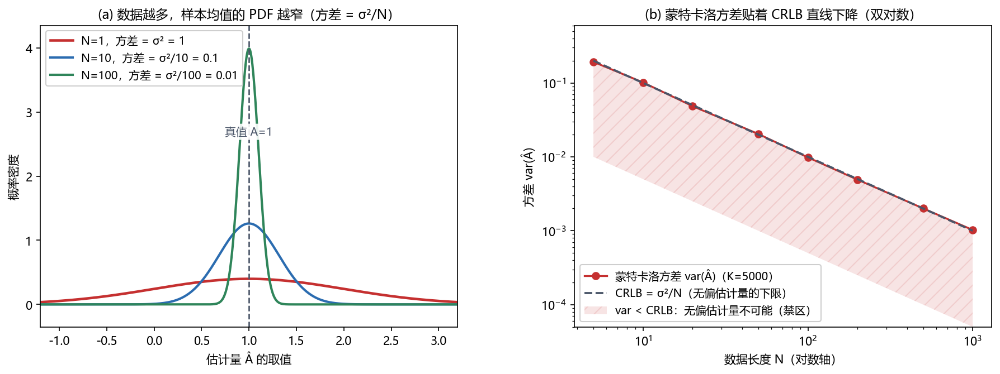
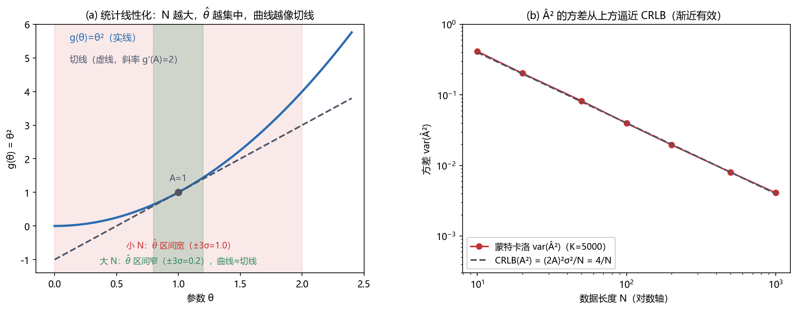

# Vol1 Ch03 Cramér-Rao 下限：怎么知道一个估计量已经"好到顶"，或者离顶还差多远

> 对应原书：第一卷《估计理论》第 3 章（书内第 23~69 页，本扫描 PDF 第 38~84 页）。
> 前置阅读：本系列 `Vol1_Ch01_引言.md`（随机变量观、偏差/方差）、`Vol1_Ch02_最小方差无偏估计.md`（MVU 定义与存在性）；本文自包含，涉及的前置概念就地插播。

## 写在前头

这是讲解系列的第 3 篇，对应原书第三章《Cramér-Rao 下限》。它在全书链条里的位置是**承上启下的枢纽**：第 2 章给"最好的估计量"下了定义（无偏 + 方差最小的 MVU），却坦白了两件扫兴的事——**MVU 可能不存在（例 2.3），而且不存在"转动摇把"式求出它的通用流程**。于是摆在读者面前的是两个具体悬案：

1. **怎么证明**某个估计量已经是 MVU？总不能把所有无偏估计量都造出来、逐个比方差——第 2 章已经说过没有这种枚举法。
2. MVU 不存在、或求不出来时，**怎么知道"还能多好"**？工程可行性研究里，一个"精度物理天花板"的价值，往往不亚于一个具体的估计量。

本章给这两个问题同一个答案：**任何无偏估计量的方差都不可能低于某个可以算出来的下限——Cramér-Rao 下限（CRLB）**。摸到这条线的估计量就是 MVU（证明完成）；摸不到的，CRLB 告诉你离顶还有多远（可行性研究完成）。这就是 Kay 在 §3.1 开篇写的那句定位：最好的情况，它直接判出 MVU；最坏的情况，它给你一把比较无偏估计量的标尺。

**本章一句话设计目标：把"数据里到底藏着多少关于参数的信息"翻译成一个可计算的量（Fisher 信息），再把它倒数变成方差的下限——从而用一把尺子同时解决"证明最优"和"量化天花板"两件事。**

**实测声明**：本文全部内容与数字核对自原书扫描件 OCR 文本 `Temp/chapters_ocr/ch03/ocr_page_038~084.txt`（PDF 第 38~84 页，即书内第 23~69 页），不是凭印象转述。公式编号（3.1）~（3.45）、定理 3.1/3.2、例 3.1~3.16、图 3.1~3.9、习题 3.1~3.20 均为原书编号，可对照原书查阅。OCR 缺字/残断处（例 3.8、3.11、3.12 的最终数值与例 3.16 的式（3.44）结构）据 Kay 英文原版校订，逐条记录在"实现备忘"与 `Temp/素材核对/Vol1_Ch03_核对.md`。Fig006/Fig007 为本系列自建蒙特卡洛实验（脚本 `Temp/scripts/make_fig006.py`、`make_fig007.py`，随机种子 20260815），实验结论只用于示意，与理论公式相互印证。

---

## 1. 问题从哪来：没有下限，就没有"最优"的证明手段

### 1.1 问题驱动：为什么第 2 章留下了一个"证明缺口"？

第 2 章把 MVU 定义为"所有无偏估计量里方差最小者"，定义本身干净利落。但这个定义有一个致命的操作难题：**"所有无偏估计量"是一个无穷大的集合，你没法把它们一一造出来比方差。** 原书 §2.6 已经明说"不存在转动摇把的方法"，求 MVU 只能按问题结构分类走三条路——而路线 1 恰恰就是本章的 CRLB。

路线 1 的逻辑（第 2 篇 §4 讲过）是：**先算出一个方差的下限，再检查有没有估计量的方差恰好等于它；有，就是 MVU。** 这条逻辑要成立，需要一个**只依赖概率模型、不依赖具体估计量**的下限公式——这就是 CRLB 的全部意义。换句话说，CRLB 把"证明最优"从"枚举无穷集合"降成了"算一个积分（或期望）+ 检查一个因子分解条件"。

### 1.2 第 2 章埋下的伏笔，本章兑现

第 2 篇 §4.2 预告过两颗种子，这里当场兑现：

- **例 2.3 的 MVU 不存在，到了本章有了一把精确的尺子来刻画"为什么"**。例 2.3 里两个估计量在 $\theta\ge0$ 与 $\theta<0$ 两段各有胜负，习题 3.6 用 CRLB 证明：$\theta\ge0$ 时无偏方差下限是 $18/36$、$\theta<0$ 时是 $24/36$——两个估计量各自摸到了自己区段的天花板，但**没有任何一个估计量能同时摸到两边的天花板**（第 7 节会把这个回调彻底结清）。
- **习题 2.11 的无偏估计量不存在，对应本章的"正则条件失效"**。习题 2.11 里数据服从 $\mathcal{U}(0,1/\theta)$，连无偏估计量都造不出来；本章习题 3.1 揭示同一病灶的另一面：这个模型的 PDF 支撑集随参数 $\theta$ 移动，**CRLB 的正则条件直接不成立，下限公式根本不能套**（第 13 节"局限"展开）。第 2 章的"存在性悲剧"与本章的"正则条件"是同一个硬币的两面。

**一句话总结：CRLB 不是又一种估计方法，而是一把"免枚举"的尺子——它让"证明最优"和"量化天花板"从不可能变成可计算。**

---

## 2. 直觉：精度藏在 PDF 的"尖锐"里，Fisher 信息就是这个尖锐度

### 2.1 问题驱动：为什么"估计精度"这个物理量，能和一个积分画上等号？

在动手写公式之前，先要说服自己一件反直觉的事：**估计一个参数的精度上限，居然只由数据的 PDF 决定**。Kay 在 §3.3 开头给了理由：所有关于参数的信息都通过观测数据以及数据的 PDF 表现出来，所以"估计精度直接与 PDF 有关"；如果 PDF 对参数根本不敏感（甚至与参数无关），我们就不该指望估得准。**翻译成人话：PDF 越随参数变化，数据越"有话说"，估计越容易。**

### 2.2 例 3.1：同一个数据点，两个 PDF，谁更"有话说"

原书例 3.1 用一个单样本把直觉钉死。观测

$$
x[0] = A + w[0], \qquad w[0] \sim \mathcal{N}(0, \sigma^2)
$$

其中 $A$ 为待估的未知均值，$w[0]$ 为零均值高斯噪声，$\sigma^2$ 为已知方差。若 $\sigma^2$ 很小，估计会好；$\sigma^2$ 大，估计就差。原书图 3.1 画出两条似然函数（固定 $x[0]=3$，把 PDF 看成 $A$ 的函数）：$\sigma^2=1/3$ 的那条在 $A=3$ 附近尖得像针，$\sigma^2=1$ 的那条摊成一大片。**尖的那条意味着：只有 $A\approx3$ 才能"解释"观测，$A>4$ 几乎不可能；平的那条意味着：$A$ 从 $0$ 到 $6$ 都还说得过去。** 候选值的区间越窄，估计越精确。

> **前置概念：似然函数。** 把 PDF $p(\mathbf{x};\theta)$ 里的数据 $\mathbf{x}$ 固定、把参数 $\theta$ 当自变量，这个"以参数为横轴"的函数就叫似然函数。**翻译成人话：观测已经到手了，现在反过来问——不同的参数值各自有多大的"解释力"。** 第 7 篇（MLE）就是找这个函数的峰值，本章则关心这个峰的"尖锐程度"。

### 2.3 从"尖不尖"到"曲率"再到"信息"：三步把直觉变成公式

"尖锐度"要用什么定量描述？Kay 的做法分三步：

1. **单次曲率**：对数似然在峰值处的负二阶导数。对例 3.1，一阶导数与负二阶导数分别为（原书式 3.2、3.3）

$$
\frac{\partial \ln p(x[0];A)}{\partial A} = \frac{x[0]-A}{\sigma^2}, \qquad
-\frac{\partial^2 \ln p(x[0];A)}{\partial A^2} = \frac{1}{\sigma^2}
$$

其中 $\ln$ 为自然对数，$\sigma^2$ 为已知噪声方差。**注意二阶导数是常数 $1/\sigma^2$：$\sigma^2$ 越小，曲率越大。** 而 $x[0]$ 的估计量 $\hat{A}=x[0]$ 的方差恰是 $\sigma^2$（式 3.4），所以"方差 = 曲率的倒数"——曲率越大，方差越小。

2. **平均曲率**：但一般问题里二阶导数会依赖数据 $x$（例 3.4 就会见到），单个数据点的曲率不够用。于是取期望（式 3.5）：

$$
-\mathbb{E}\!\left[\frac{\partial^2 \ln p(x[0];A)}{\partial A^2}\right]
$$

其中 $\mathbb{E}[\cdot]$ 表示对数据按 $p(x[0];A)$ 取期望。**翻译成人话：别只看这一次数据的曲线有多弯，要看"平均而言有多弯"。** 期望这一步同时把"随机变量"的属性显式化了——似然函数本身是随机的（它依赖 $x$），取完期望后才只剩参数 $A$ 的函数。

3. **命名**：这个"对数似然的平均曲率"就是 **Fisher 信息** $I(\theta)$（式 3.13）：

$$
I(\theta) = -\mathbb{E}\!\left[\frac{\partial^2 \ln p(\mathbf{x};\theta)}{\partial \theta^2}\right]
$$

其中 $\mathbf{x}$ 为数据矢量，$\theta$ 为未知参数，导数在 $\theta$ 的真值处计算，期望对 $p(\mathbf{x};\theta)$ 求取。**翻译成人话：$I(\theta)$ 度量的是"数据里关于 $\theta$ 的信息含量"——PDF 越随 $\theta$ 剧烈变化，信息越多。**

**一句话总结：CRLB 的全部直觉可以压缩成一句话——数据里关于参数的信息越多（对数似然平均越尖），能估到的精度上限越高（方差下限越低）。** 下一节把这个直觉变成定理。

---

## 3. 标量 CRLB 定理与"达界"判据：下限怎么算，谁有资格摸到它

### 3.1 问题驱动：下限公式长什么样？摸到它的估计量长什么样？

上一节有了信息量 $I(\theta)$，现在要回答两个问题：**下限的公式**（方差至少多大）和**达界的条件**（什么样的估计量能把方差压到下限）。原书定理 3.1 把两件事一起给出。

> **前置概念：正则条件（regularity condition）。** 定理要求 $\mathbb{E}[\partial\ln p(\mathbf{x};\theta)/\partial\theta]=0$ 对所有的 $\theta$ 成立，期望对 $p(\mathbf{x};\theta)$ 求取。**翻译成人话：对数似然的斜率，平均而言是零——在参数真值附近，数据"没有系统性偏向某一侧"。** 这个条件通常在"导数和积分可交换顺序"时成立（附录 3A）；只有当 PDF 的**非零支撑区域**依赖未知参数时才会失效（习题 3.1，第 13 节展开）。

**定理 3.1（CRLB——标量参数）**：若正则条件成立，则任何无偏估计量 $\hat{\theta}$ 的方差满足（式 3.6）

$$
\mathrm{var}(\hat{\theta}) \ge \frac{1}{-\mathbb{E}\!\left[\dfrac{\partial^2 \ln p(\mathbf{x};\theta)}{\partial \theta^2}\right]}
$$

其中 $\mathrm{var}$ 表示方差，分母在 $\theta$ 的真值处计算。**翻译成人话：方差的倒数，最多是"对数似然的平均曲率"——曲率再大，方差也压不到这条线以下。** 分母记作 Fisher 信息 $I(\theta)$（式 3.13），于是 $\mathrm{var}(\hat{\theta})\ge 1/I(\theta)$。

**达界条件（式 3.7）**：当且仅当存在某个函数 $g$ 与某个量 $I$（与 $\mathbf{x}$ 无关）使得

$$
\frac{\partial \ln p(\mathbf{x};\theta)}{\partial \theta} = I(\theta)\bigl(g(\mathbf{x}) - \theta\bigr)
$$

时，才存在无偏估计量达到下限；**达到下限的估计量就是 $\hat{\theta}=g(\mathbf{x})$，它是 MVU，最小方差 $1/I(\theta)$。** 这个"因子分解形式"是全书最实用的一条判据——**它不要求你去找 $g$，只要对数似然的导数能凑成"常数 $\times$（某个统计量 − 参数）"的样子，那个统计量就是达界估计量。**

### 3.2 例 3.3：样本均值是有效估计量——全书最重要的一个正面例子

从例 3.1 的单个样本推广到 $N$ 个观测（式 3.8 之前）：

$$
x[n] = A + w[n], \qquad n=0,1,\ldots,N-1
$$

其中 $w[n]$ 为方差 $\sigma^2$ 的 WGN（白高斯噪声——独立、零均值、方差 $\sigma^2$）。对数似然对 $A$ 求一阶导得（式 3.8）

$$
\frac{\partial \ln p(\mathbf{x};A)}{\partial A} = \frac{N}{\sigma^2}\bigl(\bar{x} - A\bigr)
$$

其中 $\bar{x}=\frac{1}{N}\sum_{n=0}^{N-1}x[n]$ 为样本均值。二阶导数是常数 $-N/\sigma^2$，代入（3.6）得 CRLB（式 3.9）：

$$
\mathrm{var}(\hat{A}) \ge \frac{\sigma^2}{N}
$$

**对比（3.8）与（3.7）**：$\frac{\partial\ln p}{\partial A}=\frac{N}{\sigma^2}(\bar{x}-A)$ 恰好就是 $I(A)(g(\mathbf{x})-A)$ 的形式，其中 $I(A)=N/\sigma^2$、$g(\mathbf{x})=\bar{x}$。所以**样本均值 $\bar{x}$ 达到下限，方差 $\sigma^2/N$ 就是最小方差，$\bar{x}$ 是 MVU**。这也顺带验证了第 1、2 篇反复使用的结论：样本均值的方差 $\sigma^2/N$ 不是"碰巧不错"，而是**已经顶到天花板、一分都压不下去**。Fig006 把这条"达界"用数据摆出来：

*图 Fig006：样本均值 $\bar{x}$ 的方差与 CRLB（自建蒙特卡洛，脚本 `Temp/scripts/make_fig006.py`，种子 20260815，$A=1$、$\sigma^2=1$、每点 $K=5000$ 次独立实验）。(a) 左面板——估计量 $\hat{A}=\bar{x}$ 的 PDF 随 $N=1,10,100$ 逐级变窄（宽度即方差 $\sigma^2/N$，从 1 到 0.1 到 0.01），三条曲线都居中在真值 $A=1$ 上（无偏）；看"数据越多，手越稳"。(b) 右面板——双对数下 $\mathrm{var}(\bar{x})$ 的蒙特卡洛点（红）贴着 $\mathrm{CRLB}=\sigma^2/N$ 的直线（灰虚线）一路下降；直线下方涂斜线的区域是"无偏估计量的禁区"（$\mathrm{var}<\mathrm{CRLB}$ 不可能）。结论：样本均值不是"接近"下限，而是**精确落在**下限上——这正是"有效估计量"的几何含义。*

这个例子还给出一个贯穿全书的术语：**有效估计量（efficient estimator）** = 无偏且方差达到 CRLB 的估计量。原书随后证明了一个小引理（式 3.10）：当达界时，$\mathrm{var}(\hat{\theta})=1/I(\theta)$。

### 3.3 例 3.4：相位估计——CRLB 算得出来，但没有任何无偏估计量达界

反面例子同样重要。观测 WGN 中的正弦相位：

$$
x[n] = A\cos(2\pi f_0 n + \phi) + w[n], \qquad n=0,1,\ldots,N-1
$$

其中 $A$（幅度）与 $f_0$（频率）已知，$\phi$ 为待估相位。对 $f_0$ 不在 $0$ 或 $1/2$ 附近的情况（习题 3.7 证明此时 $\sum\cos(4\pi f_0 n+2\phi)\approx 0$），CRLB 为

$$
\mathrm{var}(\hat{\phi}) \ge \frac{2\sigma^2}{N A^2}
$$

**等价地，Fisher 信息 $I(\phi)=NA^2/(2\sigma^2)$。** 但原书明确点出：**本例不满足达界条件（3.7），因此不存在无偏且达到 CRLB 的相位估计量**——换句话说，没有"有效估计量"。**然而 MVU 仍然可能存在**，只是本章的工具回答不了"它在不在、怎么求"——这是第 5 章（充分统计量）的活。

### 3.4 有效与 MVU 不是一回事：图 3.2 的两种情形

这一对例子（3.3 达界、3.4 不达界）引出一个必须想清楚的区分：

- **有效 ⇒ MVU**：方差已经压到下限，没人能更低，自然是 MVU（图 3.2(a)）。
- **MVU ⇏ 有效**：MVU 可以只是"比所有其他无偏估计量方差都小"，但仍**贴在下限上方**没摸到线（图 3.2(b)）。这时 MVU 存在，但没有估计量是"有效"的。

**翻译成人话：CRLB 是地板，不是所有 MVU 都能贴着地板躺下。** 这条区分在工程上很要命：很多时候你能算出 CRLB，但找不到摸到它的估计量，于是只能接受"贴线下方的 MVU"或退而求其次（第 7 章 MLE 的渐近达标）。

**一句话总结：定理 3.1 给了下限公式（3.6）与达界判据（3.7）；例 3.3 是达界的标准样板，例 3.4 证明"下限存在"与"有人达界"是两回事。**

---

## 4. Fisher 信息的性质：为什么它有资格叫"信息"

### 4.1 问题驱动：一个"曲率"，凭什么自称信息？

$I(\theta)$ 被 Kay 称作"信息"，这不是随便起的名字。原书 §3.4 末尾给了两条它满足的性质，恰好是信息测度应有的品格：

1. **非负性**：由恒等式（式 3.11，附录 3A 证明）

$$
\mathbb{E}\!\left[\left(\frac{\partial \ln p(\mathbf{x};\theta)}{\partial\theta}\right)^2\right] = -\mathbb{E}\!\left[\frac{\partial^2 \ln p(\mathbf{x};\theta)}{\partial\theta^2}\right]
$$

可知 $I(\theta)$ 是一个平方的期望，非负。**信息量不能是负的。**
2. **独立观测的可加性**：对 $N$ 个独立同分布（IID）样本，对数似然可拆成 $\ln p(\mathbf{x};\theta)=\sum_n \ln p(x[n];\theta)$，于是

$$
I(\theta) = N\,i(\theta)
$$

其中 $i(\theta)=-\mathbb{E}[\partial^2\ln p(x[n];\theta)/\partial\theta^2]$ 是**单个样本**的 Fisher 信息。**翻译成人话：$N$ 个独立样本的信息量是单个样本的 $N$ 倍，所以 CRLB 随 $N$ 按 $1/N$ 下降——这是"多采数据就变准"的定量表达。**

### 4.2 完全相关样本的警告：信息不会凭空多出来

可加性有个扎眼的反面（习题 3.9）：若 $N$ 个样本**完全相关**（$x[0]=x[1]=\cdots=x[N-1]$，即同一个随机数抄了 $N$ 份），则 $I(\theta)=i(\theta)$——**加再多样本，信息一点不增，CRLB 不随 $N$ 下降。** 理由很朴素：$N$ 份一模一样的数据，和一份数据没有信息差别。

这条警告在工程上极有用：**"样本数"只有在样本独立（或不完全相关）时才等于"信息量"**。若你的 $N$ 个采样点高度相关（例如过采样一个慢变信号），CRLB 不会按 $1/N$ 下降，别被样本数骗了。这个思想在第 9 节的 WSS 渐近 CRLB 里会以"相关时间 vs 数据长度"的形式再次出现（伏笔）。

### 4.3 备选形式（3.12）：计算更烦，但理论分析有用

恒等式（3.11）顺带给出 CRLB 的另一种写法（式 3.12）：

$$
\mathrm{var}(\hat{\theta}) \ge \frac{1}{\mathbb{E}\!\left[\left(\dfrac{\partial\ln p(\mathbf{x};\theta)}{\partial\theta}\right)^2\right]}
$$

其中分母是一阶导数平方的期望。**代价与收益照实说**：这个形式通常比（3.6）难算（要多算一个平方的期望），所以 Kay 明说"（3.6）在计算上更方便"；它的价值在理论推导里（一阶导形式在很多证明中更顺手，比如定理 7.1 的渐近分析会用同类结构）。**两条公式在正则条件下完全等价，选哪条只看手头哪个好积。**

**一句话总结：Fisher 信息满足"非负 + 独立可加"两条信息准则，所以配得上"信息"之名；但也因此，相关样本不会带来信息增量——样本多不等于信息多。**

---

## 5. WGN 中信号的一般 CRLB：一条通式，覆盖一大类工程问题

### 5.1 问题驱动：每次都要重新算对数似然求导，太累；能不能一次算完？

§3.4 的例 3.3、3.4 每次都要写对数似然、求两次导、取期望。但工程上最常见的场景是高度统一的：**高斯白噪声里的确定性信号**。Kay 在 §3.5 直接把这类问题的 CRLB 一次推到底，得到一个通式。

### 5.2 通式（3.14）

观测模型：

$$
x[n] = s[n;\theta] + w[n], \qquad n=0,1,\ldots,N-1
$$

其中 $s[n;\theta]$ 为含未知参数 $\theta$ 的确定性信号（记号显式标出对 $\theta$ 的依赖），$w[n]$ 为方差 $\sigma^2$ 的 WGN。CRLB 为（式 3.14）

$$
\mathrm{var}(\hat{\theta}) \ge \frac{\sigma^2}{\displaystyle\sum_{n=0}^{N-1}\left(\frac{\partial s[n;\theta]}{\partial\theta}\right)^2}
$$

其中 $\partial s[n;\theta]/\partial\theta$ 为信号对参数的偏导数（在真值处计算）。**翻译成人话：信号随参数变化得越"剧烈"（导数的能量越大），噪声的干扰相对就越小，下限越低。** 把 $s[n;\theta]=\theta$（即例 3.3 的 DC 电平）代进去，分母是 $\sum 1 = N$，立刻回到 $\sigma^2/N$；读者也可以用它重新验证例 3.4 的 $2\sigma^2/(NA^2)$。

### 5.3 例 3.5：正弦频率估计，以及"频率趋零下限爆掉"的原因

信号 $s[n;f_0]=A\cos(2\pi f_0 n+\phi)$，幅度 $A$ 与相位 $\phi$ 已知，估频率 $f_0$。代入（3.14）得（式 3.15）

$$
\mathrm{var}(\hat{f}_0) \ge \frac{\sigma^2}{\displaystyle A^2\sum_{n=0}^{N-1}\bigl(2\pi n \sin(2\pi f_0 n+\phi)\bigr)^2}
$$

其中 $\partial s/\partial f_0 = -A\,2\pi n\sin(2\pi f_0 n+\phi)$（$n$ 从 0 到 $N-1$）。原书图 3.3 画出 CRLB 随 $f_0$ 变化的曲线（SNR $A^2/\sigma^2=1$，$N=10$，$\phi=0$），并点出一个反直觉的现象：**$f_0\to 0$ 时 CRLB 趋向无穷大**。

为什么？**因为当频率趋近零，正弦在观测窗口里几乎变成一条平线，频率的微小变化几乎不改变信号**（$\partial s/\partial f_0$ 里那个 $2\pi n$ 在 $f_0\approx0$ 时被 $\sin(2\pi f_0 n+\phi)\approx\sin\phi$ 压住，分母变小）。**翻译成人话：信号自己都不"对频率敏感"，数据里自然没多少频率信息——CRLB 爆掉是必然的。** 这个"信号对参数敏感 → 下限低"的直觉，在例 3.7（第 7 节）会以斜率 $B$ 的放大效应再出现一次。

**一句话总结：（3.14）把 WGN 中一大类问题的 CRLB 压缩成"信号导数能量"的分母，信号对参数越敏感，精度天花板越高。**

---

## 6. 参数的变换：非线性变换如何"破坏"有效性，又如何渐近修复

### 6.1 问题驱动：想估的是 $A^2$、功率、dB，不是 $A$ 本身，怎么办？

工程里真正要的常常不是原始参数：给了 WGN 里的直流电平 $A$，我们要的可能只是它的功率 $A^2$；给了方差 $\sigma^2$，通信工程师要的是 $10\log_{10}\sigma^2$。§3.6 回答：**想估 $\alpha=g(\theta)$，它的 CRLB 不用重推，直接由 $\theta$ 的 CRLB 加上一个"变换的斜率"得到**（式 3.16，附录 3A 证明）：

$$
\mathrm{var}(\hat{\alpha}) \ge \frac{\left(\dfrac{\partial g(\theta)}{\partial\theta}\right)^2}{-\mathbb{E}\!\left[\dfrac{\partial^2 \ln p(\mathbf{x};\theta)}{\partial\theta^2}\right]} = \frac{[g'(\theta)]^2}{I(\theta)}
$$

其中 $g'(\theta)=\partial g/\partial\theta$ 为变换函数在真值处的斜率。**翻译成人话：参数变换把下限按"斜率的平方"缩放——斜率越陡，$\theta$ 的一点抖动被放大成 $\alpha$ 的更大抖动，下限越高。** 注意：这个下限仍是用 $\theta$ 表示的（因为 $I(\theta)$ 是 $\theta$ 的函数），要换成 $\alpha$ 得回代 $\theta=g^{-1}(\alpha)$。

### 6.2 例：$A^2$ 的 CRLB 与"样本均值平方不是有效估计量"

以 $\alpha=g(A)=A^2$ 为例，$g'(A)=2A$，代入（3.16）得（式 3.17）：

$$
\mathrm{var}(\hat{A}^2) \ge \frac{(2A)^2\sigma^2}{N} = \frac{4A^2\sigma^2}{N}
$$

其中用到了例 3.3 的 $I(A)=N/\sigma^2$。**但"样本均值平方" $\bar{x}^2$ 并不是 $A^2$ 的有效估计量——它甚至不是无偏的。** 因为 $\bar{x}\sim\mathcal{N}(A,\sigma^2/N)$，所以（式 3.18）

$$
\mathbb{E}[\bar{x}^2] = A^2 + \frac{\sigma^2}{N}
$$

其中第二项 $\sigma^2/N$ 是 $\bar{x}$ 的方差。**翻译成人话：$\bar{x}^2$ 平均而言比真值 $A^2$ 偏大一个方差——平方这个非线性操作，把"手抖"也算进了"功率"里。**

### 6.3 非线性破坏有效性，仿射变换保留有效性

原书随即给了一条重要结论：**非线性变换会破坏估计量的有效性**（例：$\bar{x}$ 有效，$\bar{x}^2$ 却既不无偏也不达界）；而**仿射变换 $g(\theta)=a\theta+b$（$a,b$ 为常数）保留有效性**——因为 $\hat{\alpha}=a\hat{\theta}+b$ 满足 $\mathbb{E}[\hat{\alpha}]=a\theta+b=g(\theta)$（无偏），且 $\mathrm{var}(\hat{\alpha})=a^2\mathrm{var}(\hat{\theta})$，若 $\hat{\theta}$ 达界则 $\hat{\alpha}$ 也达界。**代价照实说**：这条"保有效"只对仿射变换成立，跨出线性一步都不行。

### 6.4 统计线性化：大 $N$ 时非线性又"近似变回线性"

但工程上不能因为"非线性不保有效"就放弃估 $A^2$。原书给出的出路是**统计线性化（statistical linearization）**，这是本章被后续章节（尤其第 7 篇例 7.2）反复借用的思想：

- 当 $N\to\infty$ 时，$\bar{x}$ 的 PDF 越来越集中在 $A$ 附近（宽度 $\propto 1/\sqrt{N}$），于是 $\bar{x}$ 的实际取值几乎总落在 $A$ 的一个小邻域里（原书图 3.4 画的是 $\pm3$ 标准差区间）。
- 在这个小邻域里，非线性函数 $g(\theta)$ 可以用它在 $A$ 处的一阶泰勒展开近似：

$$
g(\hat{\theta}) \approx g(A) + g'(A)\,(\hat{\theta}-A)
$$

其中 $g'(A)$ 为切线斜率。于是 $\mathbb{E}[g(\hat{\theta})]\approx g(A)$（**渐近无偏**），$\mathrm{var}[g(\hat{\theta})]\approx [g'(A)]^2\,\mathrm{var}(\hat{\theta})$（**方差按斜率平方传播**）。

对 $A^2$ 的情形，$g(A)=A^2$、$g'(A)=2A$，方差传播给出 $[2A]^2\cdot\sigma^2/N=4A^2\sigma^2/N$——**恰好就是（3.17）的 CRLB。** 换句话说：**只要数据够多、$\hat{\theta}$ 够集中，切线就能代替曲线，非线性变换就"渐近有效"。**

Fig007 把这条逻辑画了出来：

*图 Fig007：非线性变换的统计线性化（自建图，脚本 `Temp/scripts/make_fig007.py`，种子 20260815）。(a) 左面板——$g(\theta)=\theta^2$ 的曲线与它在 $A=1$ 处的切线（虚线，斜率 $g'(A)=2$）。看两个输入区间：小 $N$ 时 $\hat{\theta}$ 的 $\pm3\sigma$ 区间宽（红色，$\pm3\sigma=1.0$），这段区间里的曲线明显弯曲，切线与曲线差得远；大 $N$ 时区间窄（绿色，$\pm3\sigma=0.2$），曲线几乎与切线重合。结论：$N$ 越大，$\hat{\theta}$ 越集中，非线性变换越像线性。(b) 右面板——$\mathrm{var}(\bar{x}^2)$ 的蒙特卡洛点（$K=5000$，$A=1$，$\sigma^2=1$）随 $N$ 变化，双对数下从上方逼近渐近 CRLB $\mathrm{CRLB}(A^2)=(2A)^2\sigma^2/N=4/N$。看两件事：① 点始终略高于直线（$\bar{x}^2$ 是有偏的，方差多一项 $2\sigma^4/N^2$，式 3.19）；② $N$ 越大越贴近直线。结论：非线性变换只在 $N\to\infty$ 时"渐近达界"，有限样本上它达不到 CRLB。*

### 6.5 精确方差与"渐近"的含义

$\bar{x}^2$ 的**精确**方差可以算出来（用高斯四阶矩，原书式 3.19）：

$$
\mathrm{var}(\bar{x}^2) = \frac{4A^2\sigma^2}{N} + \frac{2\sigma^4}{N^2}
$$

其中第一项就是 CRLB（4A²σ²/N），第二项是偏置带来的额外项，**随 $N$ 以更快的速度（$1/N^2$）消失**。这正是 Fig007(b) 里"点从上方逼近直线"的出处。**翻译成人话："渐近有效"意味着方差不等于 CRLB，而是 $=$ CRLB $+$ 一个衰减更快的尾巴。**

**一句话总结：参数变换把 CRLB 按 $[g'(\theta)]^2$ 缩放；线性变换精确保有效，非线性变换只在"统计线性化"成立的大 $N$ 极限下渐近保有效——第 7 篇例 7.2 正是靠这套工具论证了一个非线性估计量的渐近最优性。**

---

## 7. 矢量 CRLB：每个分量各自有下限，分量之间还会互相"抬价"

### 7.1 问题驱动：要估的不止一个参数时，下限怎么分？

工程问题几乎全是矢量参数：直流电平 $+$ 噪声方差、直线的斜率 $+$ 截距、正弦的幅度 $+$ 频率 $+$ 相位。§3.7 把标量结论搬到矢量：**每个分量的方差各自有一条下限，由 Fisher 信息矩阵的逆的对角元给出**（式 3.20、3.21）：

$$
\mathrm{var}(\hat{\theta}_i) \ge [\mathbf{I}^{-1}(\boldsymbol{\theta})]_{ii}
$$

其中 $\boldsymbol{\theta}=[\theta_1,\ldots,\theta_p]^T$ 为 $p\times1$ 参数矢量，$\mathbf{I}(\boldsymbol{\theta})$ 为 $p\times p$ Fisher 信息矩阵，其元素为（式 3.21）

$$
[\mathbf{I}(\boldsymbol{\theta})]_{ij} = -\mathbb{E}\!\left[\frac{\partial^2 \ln p(\mathbf{x};\boldsymbol{\theta})}{\partial\theta_i\,\partial\theta_j}\right], \qquad i,j=1,\ldots,p
$$

导数在 $\boldsymbol{\theta}$ 真值处计算。**翻译成人话：矩阵取逆之后，第 $i$ 个对角元就是第 $i$ 个参数的方差下限。** 标量情形 $p=1$ 时 $\mathbf{I}(\theta)=I(\theta)$，自动退回（3.6）。

### 7.2 例 3.6：$A$ 与 $\sigma^2$ 联合估计——矩阵恰好对角

把例 3.3 扩展成 $A$ 与噪声方差 $\sigma^2$ **都未知**，$\boldsymbol{\theta}=[A,\sigma^2]^T$。算出的 Fisher 信息矩阵恰好是对角的：

$$
\mathbf{I}(\boldsymbol{\theta}) = \begin{bmatrix} N/\sigma^2 & 0 \\ 0 & N/(2\sigma^4) \end{bmatrix}
$$

于是两个下限分别是

$$
\mathrm{var}(\hat{A}) \ge \frac{\sigma^2}{N}, \qquad \mathrm{var}(\hat{\sigma}^2) \ge \frac{2\sigma^4}{N}
$$

**注意一个细节：$\sigma^2$ 未知并没有抬高 $A$ 的下限**——因为信息矩阵对角，两个参数"各管各的"。但原书紧接着提醒：**这只是本例的巧合，一般信息矩阵不是对角的，一个参数未知会抬另一个参数的下限**——例 3.7 立刻演示。

### 7.3 例 3.7：直线拟合——非对角矩阵如何"互相抬价"

观测

$$
x[n] = A + Bn + w[n], \qquad n=0,1,\ldots,N-1
$$

其中 $A$（截距）、$B$（斜率）待估，$w[n]$ 为 WGN。利用恒等式（式 3.22）$\sum n = N(N-1)/2$、$\sum n^2 = N(N-1)(2N-1)/6$，求出 Fisher 信息矩阵并求逆，得到两个下限：

$$
\mathrm{var}(\hat{A}) \ge \frac{2(2N-1)\,\sigma^2}{N(N+1)}, \qquad
\mathrm{var}(\hat{B}) \ge \frac{12\,\sigma^2}{N(N^2-1)}
$$

两个观察都很有工程味：

1. **$A$ 的下限被 $B$ 抬高了**。若 $B$ 已知（只有 $A$ 要估），$\mathrm{var}(\hat{A})=\sigma^2/N$；现在 $B$ 未知，$\mathrm{var}(\hat{A})\approx 2(2N-1)\sigma^2/[N(N+1)]\approx 4\sigma^2/N$（大 $N$），**几乎抬了 4 倍**。原因是：$B$ 不确定时，$A$ 与 $B$ 会"抢着解释"数据里那个同时含 $A$ 和 $nB$ 的项。
2. **$B$ 比 $A$ 好估得多**：$B$ 的 CRLB $\propto 1/N^3$，$A$ 的 $\propto 1/N$。原书的解释（图 3.5）直白：$\partial x[n]/\partial A = \Delta A$（$A$ 变化多少，数据就平移多少），而 $\partial x[n]/\partial B = n\Delta B$（**$B$ 的变化被下标 $n$ 放大了 $n$ 倍**）。**信号对 $B$ 更敏感，$B$ 的信息更多，下限更低**——这正是（3.14）"信号敏感度决定下限"在矢量情形的回响（伏笔兑现）。

### 7.4 定理 3.2 与达界条件：矢量版把"协方差矩阵"整个压低

矢量版定理（定理 3.2，式 3.24、3.25）：正则条件下，任何无偏估计量的协方差矩阵满足

$$
\mathbf{C}_{\hat{\boldsymbol{\theta}}} - \mathbf{I}^{-1}(\boldsymbol{\theta}) \ge \mathbf{0}
$$

其中 $\mathbf{C}_{\hat{\boldsymbol{\theta}}}$ 为估计量的协方差矩阵，"$\ge\mathbf{0}$"表示半正定（即对任意矢量 $\mathbf{a}$，$\mathbf{a}^T(\mathbf{C}-\mathbf{I}^{-1})\mathbf{a}\ge0$）。**翻译成人话：估计量的协方差矩阵"整个地"不小于信息矩阵的逆——取对角元就得到（3.20）。** 达界条件（式 3.25）与标量版同构：

$$
\frac{\partial \ln p(\mathbf{x};\boldsymbol{\theta})}{\partial \boldsymbol{\theta}} = \mathbf{I}(\boldsymbol{\theta})\bigl(g(\mathbf{x})-\boldsymbol{\theta}\bigr)
$$

达到时 $\hat{\boldsymbol{\theta}}=g(\mathbf{x})$ 是 MVU，协方差矩阵恰为 $\mathbf{I}^{-1}(\boldsymbol{\theta})$。

例 3.7 就是达界的正面例子：把对数似然梯度重写后（式 3.27~3.29），它恰好能凑成 $\mathbf{I}(\boldsymbol{\theta})([\hat{A},\hat{B}]^T-\boldsymbol{\theta})$ 的形式，其中 $\hat{A},\hat{B}$ 是数据 $x[n]$ 与 $n x[n]$ 的线性组合。**所以 $[\hat{A},\hat{B}]^T$ 是有效估计量、MVU。** 原书特意指出：这套"达界 + 线性模型"的套路在第 4 章会系统化为"线性模型"理论（伏笔）。

### 7.5 回调：例 2.3 的悬案，用 CRLB 结清

第 2 章例 2.3 的 MVU 不存在之谜，到这里终于有了解法。习题 3.6 问：对例 2.3 算 CRLB，与第 2 章的结果一致吗？算一遍（两个独立观测 $x[0]\sim\mathcal{N}(\theta,1)$，$x[1]\sim\mathcal{N}(\theta,1)$（$\theta\ge0$）/ $\mathcal{N}(\theta,2)$（$\theta<0$））：

$$
I(\theta) = \frac{1}{1}+\frac{1}{\mathrm{var}(x[1])} =
\begin{cases} 1+1 = 2, & \theta\ge0 \\[2pt] 1+\tfrac12 = \tfrac32, & \theta<0 \end{cases}
$$

于是 $\mathrm{var}(\hat{\theta})\ge 1/2 = 18/36$（$\theta\ge0$）与 $\mathrm{var}(\hat{\theta})\ge 2/3 = 24/36$（$\theta<0$）。**这正是第 2 章两个估计量各自摸到的区段最小值。** 结论与第 2 章完全一致：每个区段里都有估计量达界（$\hat{\theta}_1$ 在 $\theta\ge0$ 达 18/36，$\hat{\theta}_2$ 在 $\theta<0$ 达 24/36），但**不存在一个估计量同时在两段都达界**——于是 MVU 不存在。**CRLB 在这里扮演的角色不是"找到 MVU"，而是"精确刻画为什么找不到"。**

**一句话总结：矢量 CRLB 是"逐分量下限 + 分量间互相抬价"；信息矩阵对角与否，决定了"多估一个参数"要不要付额外代价。**

---

## 8. 矢量变换的 CRLB：雅可比矩阵接管"斜率平方"

### 8.1 问题驱动：$\alpha=g(\boldsymbol{\theta})$ 是多维函数时，$[g']^2$ 换成什么？

§3.6 的标量变换搬到矢量，唯一的改动是把"标量斜率 $g'$"换成**雅可比矩阵**。若 $\boldsymbol{\alpha}=g(\boldsymbol{\theta})$ 是 $r$ 维函数，则（式 3.30，附录 3B 证明）：

$$
\mathbf{C}_{\hat{\boldsymbol{\alpha}}} - \frac{\partial g(\boldsymbol{\theta})}{\partial \boldsymbol{\theta}}\;\mathbf{I}^{-1}(\boldsymbol{\theta})\;\left(\frac{\partial g(\boldsymbol{\theta})}{\partial \boldsymbol{\theta}}\right)^T \ge \mathbf{0}
$$

其中 $\partial g/\partial\boldsymbol{\theta}$ 为 $r\times p$ 雅可比矩阵（第 $i$ 行第 $j$ 列是 $\partial g_i/\partial\theta_j$），上标 $T$ 为转置。**翻译成人话：把 $\boldsymbol{\theta}$ 的方差下限"夹"在雅可比矩阵和它的转置中间，就是 $\boldsymbol{\alpha}$ 的协方差下限。**

### 8.2 例 3.8：SNR 的 CRLB

一个漂亮的例子是信噪比 $\alpha = A^2/\sigma^2$（可视为单样本 SNR），$\boldsymbol{\theta}=[A,\sigma^2]^T$。雅可比矩阵是 $\partial g/\partial\boldsymbol{\theta} = [2A/\sigma^2,\; -A^2/\sigma^4]$，代入（3.30）并化简，最终（据 Kay 英文原版校订，OCR 此页残断，见"实现备忘"）：

$$
\mathrm{var}(\hat{\alpha}) \ge \frac{4\alpha + 2\alpha^2}{N}
$$

其中 $\alpha=A^2/\sigma^2$ 为待估 SNR。**注意下限本身也是 SNR 的函数**：SNR 越大，它的估计精度下限越松（相对项 $2\alpha^2$ 占主导）。这与直觉一致——大 SNR 时一个固定的绝对误差换算成相对误差更小，但下限的**绝对值**仍随 $\alpha$ 增长。

**一句话总结：矢量变换用雅可比矩阵做"斜率平方"的高维推广；线性变换精确保有效，非线性只渐近保有效（§3.6 的结论原样继承）。**

---

## 9. 一般高斯与 WSS 渐近 CRLB：当"均值、方差都含参数"或"数据是随机过程"

### 9.1 问题驱动：信号不一定是"确定性 + 白噪声"，怎么办？

（3.14）假设信号是确定性的、噪声是白高斯的。但很多问题里：① 数据的均值**和协方差**都含参数（如随机信号的功率）；② 数据来自有色噪声里的随机过程。§3.9、§3.10 分别给两条更通用的路。

### 9.2 一般高斯情形（式 3.31、3.32）

设 $\mathbf{x}\sim\mathcal{N}(\boldsymbol{\mu}(\boldsymbol{\theta}),\mathbf{C}(\boldsymbol{\theta}))$——均值矢量与协方差矩阵都可能依赖参数。Fisher 信息矩阵为（式 3.31，附录 3C 证明）：

$$
[\mathbf{I}(\boldsymbol{\theta})]_{ij} = \frac{\partial \boldsymbol{\mu}^T(\boldsymbol{\theta})}{\partial\theta_i}\,\mathbf{C}^{-1}(\boldsymbol{\theta})\,\frac{\partial \boldsymbol{\mu}(\boldsymbol{\theta})}{\partial\theta_j} \;+\; \frac{1}{2}\,\mathrm{tr}\!\left[\mathbf{C}^{-1}(\boldsymbol{\theta})\frac{\partial \mathbf{C}(\boldsymbol{\theta})}{\partial\theta_i}\;\mathbf{C}^{-1}(\boldsymbol{\theta})\frac{\partial \mathbf{C}(\boldsymbol{\theta})}{\partial\theta_j}\right]
$$

其中 $\mathrm{tr}$ 为矩阵迹（对角元之和）。**翻译成人话：第一项是"均值随参数变化"的信息（（3.14）的矢量版），第二项是"协方差随参数变化"的信息——两项相加，分别对应"信号形状"与"噪声/随机性形状"里的信息。** 标量情形简化为（式 3.32）：

$$
I(\theta) = \left(\frac{\partial \boldsymbol{\mu}(\boldsymbol{\theta})}{\partial\theta}\right)^T \mathbf{C}^{-1}(\boldsymbol{\theta})\left(\frac{\partial \boldsymbol{\mu}(\boldsymbol{\theta})}{\partial\theta}\right) + \frac{1}{2}\,\mathrm{tr}\!\left[\left(\mathbf{C}^{-1}(\boldsymbol{\theta})\frac{\partial \mathbf{C}(\boldsymbol{\theta})}{\partial\theta}\right)^2\right]
$$

例 3.9、3.10 用这条通式重新导出前面的结果（WGN 信号 →（3.14）；噪声方差 → $N/(2\sigma^4)$），验证其一致性。

### 9.3 例 3.11：随机 DC 电平——无限数据也压不下去的下限

一个最能体现"协方差项"价值的例子：观测

$$
x[n] = A + w[n], \qquad n=0,1,\ldots,N-1
$$

其中 $w[n]$ 为 WGN，而 $A$ 是**高斯随机变量**（均值 0、方差 $\sigma_A^2$），与 $w[n]$ 独立；待估参数是 $\sigma_A^2$（信号的功率/方差）。此时 $\mathbf{x}$ 零均值，协方差矩阵为 $\mathbf{C}(\sigma_A^2)=\sigma_A^2\mathbf{1}\mathbf{1}^T+\sigma^2\mathbf{I}$（$\mathbf{1}$ 为全 1 矢量）。用 Woodbury 恒等式求逆、代入（3.32），得（据 Kay 英文原版校订）：

$$
\mathrm{var}(\hat{\sigma}_A^2) \ge 2\left(\sigma_A^2 + \frac{\sigma^2}{N}\right)^2
$$

**这里藏着一个反直觉的结论：当 $N\to\infty$ 时，CRLB 不趋零，而是趋近 $2\sigma_A^4$。** 为什么？因为 $A$ 是**同一个随机数出现在所有样本里**——多采一个样本，看到的是**同一个 $A$**，不会带来关于 $A$ 的方差的新信息（这正是第 4 节"完全相关样本信息不增"的随机过程版）。**翻译成人话：想估一个随机量的方差，而每次实验它只摇出来一次，那么样本数再大，这个方差也估不到零误差——下限被"每实验一次现实"锁死在 $2\sigma_A^4$。** 习题 3.14 用条件于 $A$ 的论证把这条结论进一步做实。

### 9.4 WSS 高斯过程的渐近 CRLB（式 3.34）

§3.10 处理另一种麻烦：（3.31）需要 $N\times N$ 协方差矩阵求逆，长数据下解析算不动。对于**零均值 WSS（宽平稳）高斯随机过程**，当 $N\to\infty$ 时，Fisher 信息的元素有一个漂亮的频域近似（式 3.34，附录 3D 证明）：

$$
[\mathbf{I}(\boldsymbol{\theta})]_{ij} \approx \frac{N}{2}\int_{-1/2}^{1/2} \frac{\partial \ln P_{xx}(f;\boldsymbol{\theta})}{\partial\theta_i}\,\frac{\partial \ln P_{xx}(f;\boldsymbol{\theta})}{\partial\theta_j}\,df
$$

其中 $P_{xx}(f;\boldsymbol{\theta})$ 为过程的功率谱密度（PSD，含参数 $\boldsymbol{\theta}$），$f$ 为归一化频率，积分在 $[-1/2,1/2]$ 上。**翻译成人话：与其和时域的 $N\times N$ 矩阵搏斗，不如在频域把"PSD 随参数的变化"逐频率平方积分——信息就藏在 PSD 对参数的敏感度里。**

**代价必须明说**：这个形式**只在 $N\to\infty$ 渐近成立**，是个"根本性缺陷"（原书原话）。实际中只有当**数据记录长度远大于过程的相关时间**时，它才是好近似。相关时间 = 自相关函数 $r_{xx}[k]=\mathbb{E}[x[n]x[n+k]]$ 非零的最大步长；宽带过程（PSD 宽、相关时间短）中等 $N$ 就够，窄带过程（PSD 尖、相关时间长）要很长的记录。**第 4 节"相关样本信息不增"的伏笔，在这里以"相关时间决定渐近近似是否成立"兑现。**

### 9.5 例 3.12：过程中心频率——越窄带，越好估

一个典型应用是估 PSD 的中心频率 $f_c$，PSD 形如 $P_{xx}(f;f_c)=Q(f-f_c)+Q(-f-f_c)+\sigma^2$（$Q$ 为已知形状，$\sigma^2$ 为加性白噪声功率）。对高斯形、带宽 $\sigma_f\ll1/2$ 的 $Q(f)$，在 $Q\gg\sigma^2$（高 SNR）时（据 Kay 英文原版校订，OCR 仅存"12α1"残字）：

$$
\mathrm{var}(\hat{f}_c) \ge \frac{12\,\sigma_f^2}{N}
$$

其中 $\sigma_f^2$ 为带宽参数（PSD 的"频率方差"）。**带宽越窄（$\sigma_f$ 越小），中心频率的 CRLB 越低**——因为窄带 PSD 随 $f_c$ 的移动变化得更剧烈，信息更多。这与第 7 节"斜率 $B$ 放大敏感度"是同一原理在频域的化身。

**一句话总结：（3.31）把 CRLB 推广到"均值+协方差都含参数"的一般高斯，（3.34）把零均值 WSS 过程搬到频域——代价是渐近性，前提是"记录长度 $\gg$ 相关时间"。**

---

## 10. 信号处理四例：CRLB 是这些经典估计的"渐近方差"

### 10.1 问题驱动：雷达时延、正弦参数、声纳方位、语音 AR——CRLB 长什么样？

§3.11 是本章的收账时刻，把第 1 章埋下的三个系统（雷达、声纳、语音）加上正弦参数，全部用 CRLB 结清。读法：**每个例子的 CRLB 公式，就是第 7 篇对应 MLE 的渐近方差**（回调第 7 篇定理 7.1：$\hat{\theta}\xrightarrow{a}\mathcal{N}(\theta, I^{-1}(\theta))$）。

### 10.2 例 3.13 距离估计（雷达时延）→ 相关器

双程时延 $\tau_0=2R/c$（$c$ 为传播速度），接收波形 $x(t)=s(t-\tau_0)+w(t)$。在奈奎斯特速率（采样间隔 $\Delta=1/(2B)$，$B$ 为带宽）采样后，噪声方差 $\sigma^2=N_0B$（$N_0/2$ 为噪声 PSD）。时延的 CRLB 为（式 3.37，把求和近似成积分）：

$$
\mathrm{var}(\hat{\tau}_0) \ge \frac{\sigma^2}{\displaystyle\int \left(\frac{ds(t)}{dt}\right)^2 dt}
$$

其中 $s(t)$ 为发射脉冲，积分在信号非零区间上。用信号能量与"均方带宽"改写（式 3.38、3.39）：

$$
\mathrm{var}(\hat{\tau}_0) \ge \frac{1}{\overline{F}^2\cdot \dfrac{E}{N_0/2}}, \qquad
\overline{F}^2 = \frac{\displaystyle\int (2\pi F)^2 |S(F)|^2 dF}{\displaystyle\int |S(F)|^2 dF}
$$

其中 $E=\int s^2(t)dt$ 为信号能量，$S(F)$ 为 $s(t)$ 的傅里叶变换，$\overline{F}^2$ 为**均方带宽**（信号带宽的度量），$E/(N_0/2)=2E/N_0$ 为 SNR。再由 $R=c\tau_0/2$ 套（3.16），距离的 CRLB 为（式 3.40）：

$$
\mathrm{var}(\hat{R}) \ge \frac{c^2/4}{\overline{F}^2\cdot E/(N_0/2)}
$$

**翻译成人话：脉冲的均方带宽越大（脉冲越窄）、SNR 越高，测距越准。** 第 7 篇例 7.15 会看到，这个问题的 MLE 是"把数据与回波模板做互相关"，而它的渐近方差正是这里的 CRLB。

### 10.3 例 3.14 正弦三参数（幅度+频率+相位）→ 周期图峰值

数据 $x[n]=A\cos(2\pi f_0 n+\phi)+w[n]$，$A>0$、$0<f_0<1/2$，三参数都未知。在 $f_0$ 不靠近 0 或 1/2 的近似下（习题 3.7），利用（式 3.22）的求和恒等式，得到三个 CRLB（式 3.41）：

$$
\mathrm{var}(\hat{A}) \ge \frac{2\sigma^2}{N}, \qquad
\mathrm{var}(\hat{f}_0) \ge \frac{12}{(2\pi)^2\,\eta\,N(N^2-1)}, \qquad
\mathrm{var}(\hat{\phi}) \ge \frac{2(2N-1)}{\eta\,N(N+1)}
$$

其中 $\eta=A^2/(2\sigma^2)$ 为 SNR。**频率的 CRLB $\propto 1/N^3$，对数据长度极其敏感**——这是"频率估计是全书最难估的参数之一"的定量证据（对比：幅度 $\propto 1/N$、相位 $\propto 1/N$）。第 7 篇例 7.16 会看到频率的 MLE 是"周期图峰值"，其渐近方差正是这个 $1/N^3$ 的下限。

### 10.4 例 3.15 方位估计（声纳）→ 波束形成

等间距线阵（阵元间距 $d$，$M$ 个阵元）接收目标辐射的正弦信号，空间频率 $f_s=(F_0 d/c)\cos\beta$（$F_0$ 为时间频率，$c$ 为水中声速，$\beta$ 为方位角）。单快拍下的数据是频率为 $f_s$ 的空间正弦（式 3.42）。方位 $\beta$ 是 $f_s$ 的函数，由矢量变换公式（3.30）套上例 3.14 的 $f_0$ 下限，得（式 3.43）：

$$
\mathrm{var}(\hat{\beta}) \ge \frac{12}{(2\pi)^2\,\eta\,M(M^2-1)}\cdot\frac{\lambda^2}{d^2\sin^2\beta}
$$

其中 $\lambda=c/F_0$ 为波长。三个定性结论都藏在分母里：**$\beta=90°$（正侧向）最容易估（$\sin\beta=1$ 最大）；$\beta=0°$ 根本估不了（$\sin\beta=0$，下限爆掉）；阵长与波长之比 $L/\lambda$（$L=(M-1)d$）越大，下限越低。** 第 7 篇例 7.17 会看到方位 MLE 是"波束形成扫描"，其渐近方差即此下限。

### 10.5 例 3.16 AR 参数（语音 LPC）→ Yule-Walker

语音常用 AR(p) 模型（图 3.9）：白噪声 $u[n]$ 激励全极点滤波器，PSD 为 $P_{xx}(f)=\sigma_u^2/|A(f)|^2$，其中 $A(f)=1+\sum_{m=1}^{p}a[m]e^{-j2\pi fm}$，$\sigma_u^2$ 为激励方差。AR 参数的**精确** CRLB 很难算（原书指向 Box-Jenkins、Porat-Friedlander），但 §3.10 的渐近 CRLB 在 $N=100$ 短记录下就已相当精确（极点不太靠近单位圆时）。结果（式 3.44、3.45）：

$$
\mathrm{var}(\hat{a}[k]) \ge \frac{\sigma_u^2}{N}\,[\mathbf{R}_{xx}^{-1}]_{kk},\qquad k=1,\ldots,p, \qquad
\mathrm{var}(\hat{\sigma}_u^2) \ge \frac{2\sigma_u^4}{N}
$$

其中 $\mathbf{R}_{xx}$ 为 $p\times p$ Toeplitz 自相关矩阵（$[\mathbf{R}_{xx}]_{ij}=r_{xx}[i-j]$）。$p=1$ 时化简为 $\mathrm{var}(\hat{a}[1])\ge(1-a^2[1])/N$——**$|a[1]|\to1$（极点靠近单位圆）时更容易估**，因为过程 PSD 变得尖锐、对参数更敏感（与例 3.12 同源）。第 7 篇例 7.18 会看到 AR 参数的近似 MLE 正是 Yule-Walker 方程的解。

下表把四个例子与第 7 篇的对应 MLE 并排收拢：

| 原书例子 | 待估参数 | CRLB 的关键结构 | 对应第 7 篇 MLE | 工程结构 |
|---------|---------|---------------|---------------|---------|
| 例 3.13 | 时延 $\tau_0$（→ 距离 $R$） | $1/(\overline{F}^2\cdot$ SNR) | 例 7.15 | 相关器/匹配滤波 |
| 例 3.14 | $A,f_0,\phi$ | 频率 $\propto 1/N^3$ | 例 7.16 | 周期图峰值 |
| 例 3.15 | 方位 $\beta$ | $\propto 1/(L/\lambda)^2\sin^2\beta$ | 例 7.17 | 波束形成 |
| 例 3.16 | AR 系数 $a[k]$ | $\propto \sigma_u^2/N\cdot\mathbf{R}_{xx}^{-1}$ | 例 7.18 | Yule-Walker/LPC |

**一句话总结：匹配滤波、周期图峰值、波束形成、LPC——四个经典工程结构，它们的精度天花板分别由四个 CRLB 公式钉死；而第 7 章的 MLE 在渐近意义下恰好都达到这些下限（定理 7.1 的兑现）。**

---

## 11. 关键设计决策回顾

把散在正文里的"为什么"收拢。每个决策都是一个真实岔路口：

| # | 决策 | 为什么这么选 | 换一个选择会怎样 |
|---|------|------------|----------------|
| 1 | 用**方差下限**（CRLB）判定最优，而非枚举所有无偏估计量 | 第 2 章已证明无枚举法；下限只依赖概率模型，一次算定 | 回到枚举，在无穷估计量集合上无解（§1） |
| 2 | 用**对数似然的平均曲率**（Fisher 信息）度量"信息" | 单次曲率依赖数据（随机），取期望才只剩参数；且满足非负+可加两条信息准则 | 用单次曲率，得到一个随数据波动的量，无法当下限（§2） |
| 3 | 达界条件写成**因子分解** $\partial\ln p/\partial\theta=I(\theta)(g(\mathbf{x})-\theta)$ | 给出"是否达界"的可检验判据，且直接读出达界估计量 $g$ | 只有下限公式、无判据，则"谁达界"仍要瞎猜（§3） |
| 4 | 参数变换用**统计线性化**处理非线性 | 非线性只破坏有限样本有效，但大 $N$ 时切线近似恢复有效 | 一律要求线性变换，则功率/dB/SNR 等工程量无下限可用（§6） |
| 5 | 矢量版用**信息矩阵逆的对角元**作逐分量下限 | 保持与标量一致、逐分量可评估，且自然暴露"非对角→互相抬价" | 只给整体标量指标，掩盖"多估一个参数抬了谁的下限"（§7） |
| 6 | 一般高斯用**（3.31）通式**；WSS 过程改用**频域渐近（3.34）** | （3.31）通用但要求 $N\times N$ 求逆；（3.34）避求逆、可解析、可洞察，代价是渐近性 | 长数据下坚持精确（3.31），CRLB 沦为纸面公式算不动（§9） |

---

## 12. 实现备忘（对照原书与复现时的坑）

1. **页码映射**：本章书内第 23~69 页对应 PDF 第 38~84 页（**书内页码 = PDF 页码 − 15**，与第 1、2 篇一致）。实测：PDF 40 页顶栏"25"、PDF 42 页"27"、PDF 84 页"69"，吻合。
2. **例 3.8（SNR）的最终数值（据 Kay 英文原版校订）**：OCR 页 54 把结果认成"4 ÷ 22"与"4c + 202"，实际应为 $\mathrm{var}(\hat{\alpha})\ge(4\alpha+2\alpha^2)/N$，其中 $\alpha=A^2/\sigma^2$。校订依据：直接由（3.30）计算，雅可比 $[2A/\sigma^2,\,-A^2/\sigma^4]$、信息矩阵逆 $\mathrm{diag}(\sigma^2/N,\,2\sigma^4/N)$，乘开即得。
3. **例 3.11（随机 DC 电平）的最终数值（据 Kay 英文原版校订）**：OCR 页 57 的推导残断，最终 $\mathrm{var}(\hat{\sigma}_A^2)\ge2(\sigma_A^2+\sigma^2/N)^2$，且 $N\to\infty$ 时下限趋 $2\sigma_A^4$（不趋零）。校订依据：$\mathbf{C}=\sigma_A^2\mathbf{1}\mathbf{1}^T+\sigma^2\mathbf{I}$，Woodbury 求逆后 $\mathbf{C}^{-1}\partial\mathbf{C}/\partial\sigma_A^2=\mathbf{1}\mathbf{1}^T/(\sigma^2+N\sigma_A^2)$，代入（3.32）得 $I=N^2/[2(\sigma^2+N\sigma_A^2)^2]$。
4. **例 3.12（中心频率）的常数（据 Kay 英文原版校订）**：OCR 页 59 仅存"12α1"残字，最终 $\mathrm{var}(\hat{f}_c)\ge12\sigma_f^2/N$。尺度（$\propto\sigma_f^2/N$）与"带宽越窄下限越低"的定性结论可由（3.34）可靠确认；常数 12 依赖高斯形 $Q(f)$ 的具体形状，请以英文原版为准再核一次。
5. **例 3.16 的式（3.44）结构（据 Kay 英文原版校订）**：Fisher 信息矩阵分块对角——AR 系数块为 $(N/\sigma_u^2)\mathbf{R}_{xx}$（$\mathbf{R}_{xx}$ 为 $p\times p$ Toeplitz 自相关矩阵），激励方差块为 $N/(2\sigma_u^4)$；（3.45）随之给出 $\mathrm{var}(\hat{a}[k])\ge(\sigma_u^2/N)[\mathbf{R}_{xx}^{-1}]_{kk}$。校订依据：$p=1$ 时须退化为 $\mathrm{var}(\hat{a}[1])\ge(1-a^2[1])/N$，这要求自相关块除以 $\sigma_u^2$ 归一化（OCR 页 67 的"$r[0]$"与 $1-a^2$ 关系可确认）。
6. **"例 3.5"的 OCR 噪点**：OCR 页 45 把"例 3.5 正弦频率估计"认成"例3.51"（多出一个"1"）。正文按"例 3.5"引用，无碍。
7. **（3.12）与（3.6）的等价性前提**：二者等价依赖正则条件（3.11）恒等式。**正则条件失效时（习题 3.1，支撑集随参数移动），两个公式都不能用**——此时 CRLB 理论整个失效，别硬套。
8. **$\sigma^2=N_0B$ 的口径（例 3.13）**：以奈奎斯特速率（$\Delta=1/(2B)$）采样后，离散噪声方差 $\sigma^2=N_0B$（$N_0/2$ 为连续噪声 PSD）。引用时延/距离 CRLB 数值时，务必区分连续量（$N_0/2$、$E$、$\overline{F}^2$）与离散量（$\sigma^2$），二者通过 $\Delta$ 换算。
9. **自建图的口径**：Fig006 显示 $\mathrm{var}(\hat{A})=\sigma^2/N$ 严格落在 CRLB 线上（样本均值有限样本就达界，不是渐近）；Fig007 显示 $\mathrm{var}(\bar{x}^2)=4A^2\sigma^2/N+2\sigma^4/N^2$ **从上方**逼近 CRLB $4A^2\sigma^2/N$（因为 $\bar{x}^2$ 有偏）。两图的"达界"与"渐近达界"之别，正是 §3 与 §6 的核心区分，别混。

---

## 13. 局限（坦率交代，并预告后续）

1. **CRLB 是无偏估计量的界，有偏估计量可以低于它。** 这是本章最容易被误用的边界。CRLB 的全部推导都从"无偏"出发，一个有偏估计量完全可能方差比 CRLB 小——第 7 篇的表 7.2 就有实况：相位估计在 $N=20$ 时"方差低于 CRLB，这是可能的，因为它是有偏估计量"（原书 §7.6 原话）。**所以引用 CRLB 时必须先确认估计量无偏；对有偏估计量，CRLB 根本不构成约束。**
2. **正则条件可能失效。** 习题 3.1：数据 IID 服从 $\mathcal{U}(0,\theta)$（均匀分布，支撑集上界就是待估参数 $\theta$）时，$\mathbb{E}[\partial\ln p/\partial\theta]\ne0$，正则条件不成立，**CRLB 不能应用**。病根是 PDF 的非零区域（支撑集）随参数移动，导数与积分不可交换（附录 3A 明确指出）。这类"参数在支撑集边界"的问题（与第 2 章习题 2.11 的无偏估计量不存在同源）需要别的工具。
3. **CRLB 可能达不到。** 例 3.4（相位）有 CRLB 却无有效估计量；第 7 节的例 2.3 更是在两个区段各自达界、整体无 MVU。**CRLB 给的是"天花板"，不保证有人摸到**；摸不到时，"MVU 存不存在、怎么求"要交给第 5 章充分统计量。
4. **CRLB 完全押在概率模型上。** 模型 $p(\mathbf{x};\theta)$ 错了，下限也跟着错——第 1 篇预警过的"建模代价"在这里兑现。不需要概率假设的替代品是第 8 章最小二乘（代价：不是最优）。
5. **渐近 CRLB（3.34）只在大 $N$ 成立。** 它要求"数据记录长度 $\gg$ 相关时间"；窄带过程（相关时间长）需要很长的记录才逼近。**这不是可忽略的瑕疵，而是"根本性缺陷"（原书原话）**——用它做短数据/窄带的可行性研究要打问号。
6. **CRLB 是"下限"，不提供估计量。** 即使算出下限、甚至知道它可达，达界估计量 $g(\mathbf{x})$ 也可能没有闭式解、难以实现。本章只画"靶子"，"怎么打中靶子"是第 4~7 章的事。

---

## 14. 建议自测的问题

1. 用你自己的话解释：为什么"估计精度"能用一个积分（Fisher 信息）描述？PDF 对参数"不敏感"时会发生什么？（提示：§2）
2. 原书习题 3.3 的变体：观测 $x[n]=A r^n+w[n]$（$r>0$ 已知，$w[n]$ 为 WGN），求 $A$ 的 CRLB，并检查是否存在有效估计量。（提示：用（3.14），分母是 $\sum r^{2n}$；$|r|<1$ 时 $N\to\infty$ 方差会怎样？）
3. 原书习题 3.6：对例 2.3 计算 CRLB，验证它等于 18/36（$\theta\ge0$）与 24/36（$\theta<0$），并解释为什么"每个区段都有人达界、整体却没有 MVU"。（提示：见 §7.5）
4. 为什么 $\bar{x}^2$ 不是 $A^2$ 的有效估计量？它的精确方差比 CRLB 多出的那一项是什么、随 $N$ 衰减多快？（提示：§6.5，式 3.19）
5. 原书习题 3.9 的定性版：两个完全相关的观测能带来比一个观测更多的信息吗？这如何体现在 CRLB 上？（提示：§4.2）

---

**一句话收尾：CRLB 是"信息"这个词第一次在估计理论里落地——它把"数据里藏着多少关于参数的信息"算成一个数，取倒数就成了任何无偏估计量都跨不过去的方差下限；于是"证明最优"与"量化天花板"两个悬案，被同一把尺子一次量完。**

*实测核对声明：本章事实性内容核对自原书扫描件 OCR 文本 `Document/统计信号处理/Temp/chapters_ocr/ch03/ocr_page_038~084.txt`（PDF 第 38~84 页，书内第 23~69 页）；公式编号（3.1）~（3.45）、定理 3.1/3.2、例 3.1~3.16、图 3.1~3.9、习题 3.1~3.20 与原书一致。OCR 残断处——例 3.8 的 $(4\alpha+2\alpha^2)/N$、例 3.11 的 $2(\sigma_A^2+\sigma^2/N)^2$、例 3.12 的 $12\sigma_f^2/N$、例 3.16 的式（3.44）结构——据 Kay 英文原版校订，理由逐条见"实现备忘"与 `Temp/素材核对/Vol1_Ch03_核对.md`。Fig006/Fig007 由 `Temp/scripts/make_fig006.py`、`make_fig007.py` 生成（随机种子 20260815，$K=5000$ 次独立实验），均经 `plotutil.check_figure` 程序化碰撞检测通过。*
