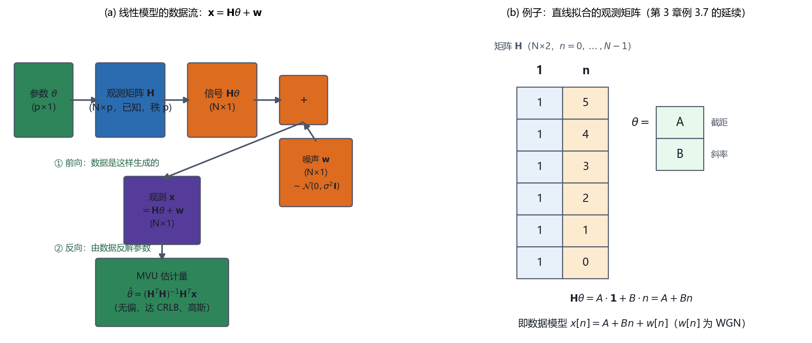

# Vol1 Ch04 线性模型：当数据 = 已知矩阵 × 参数 + 高斯噪声，MVU 有现成答案

> 对应原书：第一卷《估计理论》第 4 章（书内第 70~84 页，本扫描 PDF 第 85~99 页）。
> 前置阅读：本系列 `Vol1_Ch01_引言.md`（随机变量观）、`Vol1_Ch02_最小方差无偏估计.md`（MVU 定义）、`Vol1_Ch03_CramerRao下限.md`（CRLB 与达界条件）；本文自包含，涉及的前置概念就地插播。

## 写在前头

这是讲解系列的第 4 篇，对应原书第四章《线性模型》。它在全书链条里的位置，是**第一次从"逐题推导"切换到"模式识别"**：第 2 章给了 MVU 的定义却坦白"不存在转动摇把的通用求法"，第 3 章给了方差天花板（CRLB）和一把达界判据，但每次都要老老实实写对数似然、求导、凑因子分解——**换一个模型就重来一遍，太累**。本章的答案是：**大量信号处理问题其实都能塞进同一个模子 "数据 = 已知矩阵 × 参数 + 高斯噪声"，而一旦塞进去，MVU 估计量、它的协方差、它的完整 PDF 全都一次给齐，不用再推导。**

Kay 给这个模子起名叫**线性模型**。本章一句话设计目标：**把"高斯白噪声里、观测对参数线性"这一大类问题，打包成一条定理（定理 4.1）和一个现成解 θ̂=(HᵀH)⁻¹Hᵀx，再通过"白化"扩展成任意已知协方差噪声下的一般线性模型（定理 4.2）。**

**实测声明**：本文全部内容与数字核对自原书扫描件 OCR 文本 `Temp/chapters_ocr/ch04/ocr_page_085~099.txt`（PDF 第 85~99 页，即书内第 70~84 页），不是凭印象转述。公式编号（4.1）~（4.32）、定理 4.1/4.2、例 4.1~4.5、图 4.1~4.3、习题 4.1~4.14 均为原书编号。OCR 对矩阵块、上下标识别很差（如 HᵀH 的表达式、例 4.2 的对角矩阵），均据 Kay 英文原版校订并在"实现备忘"与 `Temp/素材核对/Vol1_Ch04_核对.md` 逐条记录。Fig008 为本系列自建结构图（脚本 `Temp/scripts/make_fig008.py`，无随机数），仅用于把 x=Hθ+w 的结构画清楚。

---

## 1. 为什么需要"一类模型的现成答案"：从逐题推导到模式识别

### 1.1 问题驱动：前两章的方法都要求"每换一个问题就重推一遍"，能不能一次搞定一类？

回顾前两章的求 MVU 流程。第 2 章说：不存在"转动摇把"式的通用流程，只能按问题结构分类走三条路（路线 1 就是 CRLB）。第 3 章把路线 1 做成了可操作的判据：**先算 CRLB，再检查对数似然导数能不能凑成 `I(θ)(g(x)−θ)` 的因子分解形式；能，则 `g(x)` 就是达界的 MVU。**

这个流程每用一次，都要：写出 PDF → 取对数 → 求一阶导 → 凑因子分解 → 读出 I(θ) 和 g(x)。对单个问题不算难，但对工程师来说，**同一个结构被反复重推，是纯粹的重复劳动**。Kay 在 §4.1 开头点破了这个痛点："MVU 估计量的确定一般来说是一项很困难的任务。然而幸运的是，大量的信号处理问题都可以通过一种允许我们很容易确定这个估计量的数据模型来描述——这种模型就是线性模型。"（PDF 第 85 页）

**翻译成人话：与其每道题都重新做一遍饭，不如把"常见食材"做成一个半成品料理包——只要你的数据符合"线性模型"，答案直接出锅。**

### 1.2 一个早就埋下的伏笔：第 3 章的直线拟合已经"撞上"了线性模型

第 3 篇 §7.3（例 3.7）讲直线拟合时，数据模型是

$$
x[n] = A + Bn + w[n], \qquad n=0,1,\ldots,N-1
$$

其中 $A$ 为截距、$B$ 为斜率、$w[n]$ 为 WGN。当时为了求 $A,B$ 的 CRLB，原书写了整整三页矩阵推导（式 3.27~3.29 把梯度凑成 $\mathbf{I}(\boldsymbol\theta)([\hat{A},\hat{B}]^T-\boldsymbol\theta)$ 的形式）。第 3 篇 §7.4 末了特意留了一句伏笔：**"这套'达界 + 线性模型'的套路在第 4 章会系统化为'线性模型'理论。"**

本章就是来兑现这句伏笔的。把直线拟合写成矩阵形式（原书式 4.1）：

$$
\mathbf{x} = \mathbf{H}\boldsymbol\theta + \mathbf{w}
$$

其中 $\mathbf{x}=[x[0],x[1],\ldots,x[N-1]]^T$ 为 $N\times1$ 观测矢量，$\mathbf{H}$ 为 $N\times2$ 的已知**观测矩阵**（第 1 列全 1、第 2 列是 $0,1,\ldots,N-1$），$\boldsymbol\theta=[A,B]^T$ 为待估参数，$\mathbf{w}$ 为噪声矢量。**翻译成人话：$\mathbf{H}\boldsymbol\theta$ 就是"由参数 $A,B$ 生成的那条直线 $A+Bn$"，观测 $\mathbf{x}$ 是这条直线被噪声污染后的版本。** 第 3 章费了大力气才证明 $[\hat{A},\hat{B}]$ 是有效估计量，而本章要证明：**只要长成 $\mathbf{x}=\mathbf{H}\boldsymbol\theta+\mathbf{w}$ 的样子，答案就固定是那个矩阵式子，一次推导终身受用。**

**一句话总结：线性模型的价值不在"新结论"，而在"把逐题推导压缩成一次模式识别"——识别出 H 和 θ，MVU 就自动到手。**

---

## 2. 线性模型的定义：每个符号各管什么

### 2.1 问题驱动：为什么这个模型敢自称"线性"？"线性"到底线性在谁身上？

"线性模型"这个词容易让人误会是"数据是一条直线"。其实它指的是**数据对参数是线性的**——观测 $\mathbf{x}$ 是参数 $\boldsymbol\theta$ 的**线性函数**（$\mathbf{H}\boldsymbol\theta$），噪声 $\mathbf{w}$ 以加性方式混入。至于 $\mathbf{H}$ 的列可以是什么，那是另一个自由度：它可以是 $n$（直线）、$t_n^2$（抛物线）、$\cos(2\pi kn/N)$（正弦）——**基函数随便选，只要参数 $\boldsymbol\theta$ 是线性的系数。** 这是理解本章全部例子（曲线拟合、傅里叶、系统辨识）的钥匙：同一个模子，不同的 $\mathbf{H}$。

正式定义（原书定理 4.1 的前提，式 4.8）：

$$
\mathbf{x} = \mathbf{H}\boldsymbol\theta + \mathbf{w}
$$

逐个符号：

| 符号 | 维数 | 含义 |
|------|------|------|
| $\mathbf{x}$ | $N\times1$ | 观测矢量（$N$ 个采样点） |
| $\mathbf{H}$ | $N\times p$ | 观测矩阵，**已知**，秩 $p$，且 $N>p$ |
| $\boldsymbol\theta$ | $p\times1$ | 待估计的参数矢量 |
| $\mathbf{w}$ | $N\times1$ | 噪声矢量，$\mathbf{w}\sim\mathcal{N}(\mathbf{0},\sigma^2\mathbf{I})$ |

其中 $\mathcal{N}(\mathbf{0},\sigma^2\mathbf{I})$ 表示均值为零矢量、协方差矩阵为 $\sigma^2\mathbf{I}$ 的高斯分布（$\mathbf{I}$ 为 $N\times N$ 单位矩阵），即**各分量独立同分布、零均值、方差 $\sigma^2$** 的白高斯噪声（WGN）。

> **前置概念：观测矩阵与秩。** $\mathbf{H}$ 叫"观测矩阵"是因为它把参数"翻译"成数据——$H\theta$ 的第 $n$ 行就是"第 $n$ 个采样点应该测到多少"。**秩 $p$ 意味着 $\mathbf{H}$ 的 $p$ 个列矢量线性无关**（没有一列能由其他列线性表出）；$N>p$ 意味着数据点比参数多——**这是"能从噪声里估出参数"的最低要求**：少于 $p$ 个数据点，$p$ 个未知数连"解方程"都不够，更别提抗噪声了。秩和 $N>p$ 的作用在第 4 节会展开。

**翻译成人话：$\mathbf{H}$ 是"已知的换算表"，$\boldsymbol\theta$ 是"要猜的系数"，$\mathbf{w}$ 是"随机捣乱"，$\mathbf{x}$ 是"手里拿到的读数"。**

Fig008 的左图把这个结构画成了数据流：

*图 Fig008：线性模型的结构与一个具体例子（自建图，脚本 `Temp/scripts/make_fig008.py`，经程序化碰撞检测通过）。(a) 左面板——数据流：参数 $\theta$ 经观测矩阵 $\mathbf{H}$ 变成信号 $\mathbf{H}\theta$，加噪声 $\mathbf{w}$ 得观测 $\mathbf{x}$；再由 $\mathbf{x}$ 经 $\hat{\theta}=(\mathbf{H}^T\mathbf{H})^{-1}\mathbf{H}^T\mathbf{x}$ 反解参数（MVU、达 CRLB、高斯）。看两点：① 前向（数据生成）和反向（估计）共用同一个 $\mathbf{H}$；② 噪声只在前向出现，估计器只用数据 $\mathbf{x}$。(b) 右面板——直线拟合的 $\mathbf{H}$：第 1 列全 1、第 2 列是 $n=0,\dots,N-1$，$\theta=[A,B]^T$，于是 $\mathbf{H}\theta=A+Bn$ 就是那条拟合直线。结论：$\mathbf{H}$ 的列是基函数、$\theta$ 是系数，换一组基函数就换一个例子，模子不变。*

**一句话总结：线性模型 = "已知矩阵 × 参数 + 白高斯噪声"；"线性"线性在参数上，基函数（H 的列）随便换。**

---

## 3. 解 θ̂=(HᵀH)⁻¹Hᵀx 的来历与性质：为什么它就是 MVU

### 3.1 问题驱动：这个矩阵式子凭什么就是最优解？它从哪冒出来的？

上一节只是定义了模型，还没说解。解不是"猜"出来的，而是**从第 3 章的达界判据（式 4.2）一路推下来的**。这一步值得完整走一遍，因为它是全章唯一需要动笔的地方，而且走完你就明白为什么是那个矩阵式子。

> **前置概念：达界判据（第 3 篇 §3.1 的回放）。** 若对数似然的导数能凑成
>
> $$
> \frac{\partial \ln p(\mathbf{x};\boldsymbol\theta)}{\partial \boldsymbol\theta} = \mathbf{I}(\boldsymbol\theta)\bigl(g(\mathbf{x})-\boldsymbol\theta\bigr)
> $$
>
> 其中 $\mathbf{I}(\boldsymbol\theta)$ 为 Fisher 信息矩阵（与 $\mathbf{x}$ 无关）、$g(\mathbf{x})$ 为某个统计量，那么 $g(\mathbf{x})$ 就是达界（有效）的 MVU 估计量。**翻译成人话：只要把"对数似然的斜率"写成"信息矩阵 ×（某个统计量 − 参数）"，那个统计量就是最优解。** 本节就是给线性模型做这一步。

对模型（4.8），数据 PDF 是

$$
p(\mathbf{x};\boldsymbol\theta) = \frac{1}{(2\pi\sigma^2)^{N/2}}\exp\!\left[-\frac{1}{2\sigma^2}(\mathbf{x}-\mathbf{H}\boldsymbol\theta)^T(\mathbf{x}-\mathbf{H}\boldsymbol\theta)\right]
$$

其中 $(\mathbf{x}-\mathbf{H}\boldsymbol\theta)^T(\mathbf{x}-\mathbf{H}\boldsymbol\theta)$ 为"数据与模型差多少"的平方和。取对数、对 $\boldsymbol\theta$ 求梯度，用矩阵求导恒等式 $\partial(\boldsymbol\theta^T\mathbf{A}\boldsymbol\theta)/\partial\boldsymbol\theta=2\mathbf{A}\boldsymbol\theta$（$\mathbf{A}$ 对称），得（原书式 4.3 附近，OCR 页 86 给出的形式）：

$$
\frac{\partial \ln p(\mathbf{x};\boldsymbol\theta)}{\partial \boldsymbol\theta} = \frac{1}{\sigma^2}\bigl(\mathbf{H}^T\mathbf{x} - \mathbf{H}^T\mathbf{H}\,\boldsymbol\theta\bigr)
$$

其中 $\mathbf{H}^T$ 为 $\mathbf{H}$ 的转置。**翻译成人话：对数似然的斜率 =（数据与模型的"相关"之差）除以噪声方差。** 把 $\mathbf{H}^T\mathbf{H}$ 提到外面（假定它可逆，第 4 节讨论这个假定），写成：

$$
\frac{\partial \ln p(\mathbf{x};\boldsymbol\theta)}{\partial \boldsymbol\theta} = \frac{\mathbf{H}^T\mathbf{H}}{\sigma^2}\Bigl[\underbrace{(\mathbf{H}^T\mathbf{H})^{-1}\mathbf{H}^T\mathbf{x}}_{g(\mathbf{x})} - \boldsymbol\theta\Bigr]
$$

其中 $(\mathbf{H}^T\mathbf{H})^{-1}$ 为 $\mathbf{H}^T\mathbf{H}$ 的逆。**对比达界判据（4.2）**：$\mathbf{I}(\boldsymbol\theta)=\mathbf{H}^T\mathbf{H}/\sigma^2$，$g(\mathbf{x})=(\mathbf{H}^T\mathbf{H})^{-1}\mathbf{H}^T\mathbf{x}$。**于是 MVU 估计量当场读出**（原书式 4.5）：

$$
\hat{\boldsymbol\theta} = \bigl(\mathbf{H}^T\mathbf{H}\bigr)^{-1}\mathbf{H}^T\mathbf{x}
$$

Fisher 信息矩阵与协方差矩阵随之给出（原书式 4.6、4.7）：

$$
\mathbf{I}(\boldsymbol\theta)=\frac{\mathbf{H}^T\mathbf{H}}{\sigma^2}, \qquad
\mathbf{C}_{\hat{\boldsymbol\theta}} = \mathbf{I}^{-1}(\boldsymbol\theta) = \sigma^2\bigl(\mathbf{H}^T\mathbf{H}\bigr)^{-1}
$$

其中 $\mathbf{C}_{\hat{\boldsymbol\theta}}$ 为估计量的协方差矩阵。**翻译成人话：$\hat{\boldsymbol\theta}$ 的协方差 = 噪声方差 ×（HᵀH 的逆）；H 的列"越分散、能量越大"（HᵀH 越大），估计越稳。**

### 3.2 定理 4.1 与它的三条性质：有限样本就"三合一"

原书把这套推导总结成定理（定理 4.1，OCR 页 87）：

> **定理 4.1（线性模型的 MVU）**：若观测可表示为 $\mathbf{x}=\mathbf{H}\boldsymbol\theta+\mathbf{w}$，其中 $\mathbf{x}$ 为 $N\times1$ 观测、$\mathbf{H}$ 为已知 $N\times p$ 观测矩阵（$N>p$，秩 $p$）、$\boldsymbol\theta$ 为 $p\times1$ 参数、$\mathbf{w}\sim\mathcal{N}(\mathbf{0},\sigma^2\mathbf{I})$，则 MVU 估计量为
>
> $$
> \hat{\boldsymbol\theta} = \bigl(\mathbf{H}^T\mathbf{H}\bigr)^{-1}\mathbf{H}^T\mathbf{x}
> $$
>
> 协方差矩阵为 $\mathbf{C}_{\hat{\boldsymbol\theta}}=\sigma^2(\mathbf{H}^T\mathbf{H})^{-1}$。

这个估计量有三条性质，每一条都值得单独说：

1. **无偏**：把 $\mathbf{x}=\mathbf{H}\boldsymbol\theta+\mathbf{w}$ 代入，$\hat{\boldsymbol\theta}=(\mathbf{H}^T\mathbf{H})^{-1}\mathbf{H}^T(\mathbf{H}\boldsymbol\theta+\mathbf{w})=\boldsymbol\theta+(\mathbf{H}^T\mathbf{H})^{-1}\mathbf{H}^T\mathbf{w}$，而 $E[\mathbf{w}]=\mathbf{0}$，故 $E[\hat{\boldsymbol\theta}]=\boldsymbol\theta$。**翻译成人话：平均而言正中靶心——噪声被"乘 $(\mathbf{H}^T\mathbf{H})^{-1}\mathbf{H}^T$"这一步洗掉了均值。**

2. **达 CRLB（有效）**：因为它就是从达界判据读出来的，协方差恰好等于 $\mathbf{I}^{-1}(\boldsymbol\theta)$。**翻译成人话：方差已经顶到物理天花板，一分都压不下去。**

3. **PDF 完全确定，精确高斯**（原书式 4.11）：因为 $\hat{\boldsymbol\theta}$ 是高斯矢量 $\mathbf{x}$ 的线性变换，

$$
\hat{\boldsymbol\theta} \sim \mathcal{N}\!\bigl(\boldsymbol\theta,\ \sigma^2(\mathbf{H}^T\mathbf{H})^{-1}\bigr)
$$

其中 $\mathcal{N}(\boldsymbol\mu,\mathbf{C})$ 表示均值为 $\boldsymbol\mu$、协方差为 $\mathbf{C}$ 的高斯分布。**这是线性模型最奢侈的一条**：大多数估计量只知道均值和方差（甚至只知道渐近的），而线性模型的 MVU **连完整 PDF 都精确知道**——你能算任意置信区间、任意误差概率（习题 4.4 就是让读者求 $\hat{\mathbf{s}}=\mathbf{H}\hat{\boldsymbol\theta}$ 的 PDF）。

**注意一个关键措辞：这三条是"有限样本"成立，不是"渐近"成立。** 无论 $N$ 是多少（只要 $N>p$），无偏、达界、高斯都精确成立。这与第 7 章 MLE 的"渐近最优"形成鲜明对照——第 7 篇 §6.4 专门讲了这个对照：**在线性模型上，MLE 的"渐近最优"提前兑现为"有限样本最优"**。

### 3.3 与第 7 篇定理 7.5 的对齐（回调）

这里要做一次交叉引用对齐。第 7 篇 §6.4 在讲线性模型的 MLE 时说："这正是第 4 章证明过的 MVU 估计量"，并把它标为**定理 7.5**（式 7.46）。第 7 篇引用的正文，就是本节的**定理 4.1**（白噪声版）与第 6 节的**定理 4.2**（有色噪声版，见下）。口径一致的关系是：

- 定理 4.1/4.2 回答"MVU 是谁、方差多少"（本章，从 CRLB 达界判据出发）；
- 定理 7.5 回答"在高斯线性模型上，MLE 恰好也吐出这同一个估计量"（第 7 章，从似然最大化出发）。

**两条路殊途同归**：从"达界"推和从"最大化似然"推，落在同一个 $\hat{\boldsymbol\theta}$ 上。这也顺带预告了第 8 章——最小二乘在**不做任何概率假设**时也会吐出形式上相同的式子，但那时它只保证"拟合误差最小"，不再自带"MVU、达 CRLB"的头衔（代价差异详见第 8 篇）。

**一句话总结：θ̂=(HᵀH)⁻¹Hᵀx 不是配方而是定理——它由达界判据（4.2）一路推出，且有限样本就同时给出无偏、达 CRLB、精确高斯三条性质。**

---

## 4. 为什么 H 必须满秩：参数可识别性

### 4.1 问题驱动：前面偷偷假定"HᵀH 可逆"，这个假定什么时候会崩？

§3.1 推导时，把 $\mathbf{H}^T\mathbf{H}$ 提到括号外，前提是它**可逆**。这个前提不是装饰：**$\mathbf{H}^T\mathbf{H}$ 可逆 ⟺ $\mathbf{H}$ 的列线性无关**（习题 4.2 让读者证明这等价于 $\mathbf{H}^T\mathbf{H}$ 正定）。如果 $\mathbf{H}$ 的列线性相关，会发生什么？原书用图 4.1 给了一个触目惊心的反例。

### 4.2 不可识别性：列相关时，参数根本"分不出来"

考虑直线拟合但**两列完全相同**的退化情形：$\mathbf{H}$ 的两列都是全 1 矢量。这时对任意观测点，模型是

$$
x[n] = A + B, \qquad n=0,1,\ldots,N-1
$$

其中 $A,B$ 分别是 $\boldsymbol\theta$ 的两个分量。**翻译成人话：$A$ 和 $B$ 这两个参数，在数据里永远以"和 $A+B$"的形式出现，永远拆不开。** 无噪声时 $\mathbf{x}=\mathbf{H}\boldsymbol\theta$ 落在 $\mathbf{H}$ 的列张成的子空间里，但 $\mathbf{x}$ 只告诉我们 $A+B$ 是多少；满足 $A+B=$ 常数的 $(A,B)$ 有无穷多组，都产生**同一个观测**。原书原话（OCR 页 87）："对 A 和 B 可以做出无穷多个选择，但都将导致相同的观测……即使在没有噪声的情况下，模型参数也是不可识别的。"

**翻译成人话：数据里根本没有区分 A 和 B 的信息，估计问题从根上就不成立——加噪声只会更糟。** 这就是为什么定理 4.1 必须写"秩 $p$、$N>p$"：**秩 $p$ 保证参数可识别，$N>p$ 保证数据点够多。**

原书还补了一句实操提醒（习题 4.3）：即使 $\mathbf{H}$ 列名义上独立，若 $\mathbf{H}^T\mathbf{H}$ **病态**（近奇异，比如两列几乎共线），估计量也会极度放大噪声。习题 4.3 让读者取 $\mathbf{H}=[1\ 1;\ 1\ 1+\epsilon]$（$\epsilon$ 很小），算出 $(\mathbf{H}^T\mathbf{H})^{-1}$ 随 $\epsilon\to0$ 爆炸——**"几乎不可识别"和"不可识别"在数值上只有一线之隔。**

**一句话总结：秩 $p$ 不是技术细节，而是"参数能否从数据里分辨出来"的生死线；列相关 = 参数不可识别，病态 = 估计量方差爆炸。**

---

## 5. 三个例子：同一个模子，三种基函数

本节是定理 4.1 的"收账时刻"。读法：每个例子先认 $\mathbf{H}$（基函数），再看 $\mathbf{H}^T\mathbf{H}$ 长什么样（决定方差），最后读出估计量。

### 5.1 例 4.1 曲线拟合：基函数换成 1, t, t²

实验里要拟合一条抛物线（原书图 4.2 的电压测量）：

$$
x(t_n) = \theta_1 + \theta_2 t_n + \theta_3 t_n^2 + w(t_n), \qquad n=0,1,\ldots,N-1
$$

其中 $\theta_1,\theta_2,\theta_3$ 为二次曲线的三个系数、$t_n$ 为采样时刻、$w(t_n)$ 为 WGN。$\mathbf{H}$ 是 $N\times3$ 的 **Vandermonde 矩阵**（第 $n$ 行是 $[1,\ t_n,\ t_n^2]$）。一般地，用 $(p-1)$ 阶多项式拟合时，$\mathbf{H}$ 的第 $n$ 行是 $[1,\ t_n,\ t_n^2,\ldots,t_n^{p-1}]$，$\boldsymbol\theta=[\theta_1,\ldots,\theta_p]^T$，MVU 仍是 $\hat{\boldsymbol\theta}=(\mathbf{H}^T\mathbf{H})^{-1}\mathbf{H}^T\mathbf{x}$。

**代价要照实说**：$\mathbf{H}^T\mathbf{H}$ 是 $p\times p$ 的稠密矩阵（幂基 $\{1,t,t^2,\ldots\}$ 不正交），求逆要 $O(p^3)$；且 $p$ 越大，$\mathbf{H}^T\mathbf{H}$ 越病态（高次幂基彼此接近）。**"基函数不正交"这笔账，在例 4.2 会被正交基当场省掉——这是下一例存在的动机之一。**

### 5.2 例 4.2 傅里叶分析：正交基让 HᵀH 变成对角矩阵

周期信号里要测"哪些谐波分量强"。数据模型（原书式 4.12）：

$$
x[n] = \sum_{k=1}^{M} a_k \cos\!\left(\frac{2\pi k n}{N}\right) + \sum_{k=1}^{M} b_k \sin\!\left(\frac{2\pi k n}{N}\right) + w[n], \qquad n=0,1,\ldots,N-1
$$

其中 $a_k,b_k$ 为第 $k$ 次谐波的余弦/正弦幅度（待估），频率是基频 $1/N$ 的整数倍 $k/N$，$w[n]$ 为 WGN。参数矢量 $\boldsymbol\theta=[a_1,\ldots,a_M,b_1,\ldots,b_M]^T$（维数 $p=2M$），$\mathbf{H}$ 的列就是这 $2M$ 个余弦/正弦序列，维数 $N\times2M$。**为了 $N>p$，要求 $M<N/2$**（$p=2M<N$）。

**为什么这个例子是"教科书级"的？因为 $\mathbf{H}$ 的列两两正交**（习题 4.5 证明，依据离散傅里叶变换的正交性，见式 4.13），于是

$$
\mathbf{H}^T\mathbf{H} = \frac{N}{2}\,\mathbf{I}_{2M}
$$

其中 $\mathbf{I}_{2M}$ 为 $2M\times2M$ 单位矩阵。**翻译成人话：HᵀH 从"要 $O(p^3)$ 求逆的稠密矩阵"退化成"乘个 $2/N$ 就完事"的对角矩阵。** 于是 MVU 估计量（原书式 4.14）：

$$
\hat{a}_k = \frac{2}{N}\sum_{n=0}^{N-1} x[n]\cos\!\left(\frac{2\pi k n}{N}\right), \qquad
\hat{b}_k = \frac{2}{N}\sum_{n=0}^{N-1} x[n]\sin\!\left(\frac{2\pi k n}{N}\right)
$$

其中求和项正是**离散傅里叶变换（DFT）的系数**。协方差矩阵（原书式 4.15、4.16 附近）：

$$
E[\hat{a}_k]=a_k,\quad E[\hat{b}_k]=b_k, \qquad
\mathbf{C}_{\hat{\boldsymbol\theta}} = \frac{2\sigma^2}{N}\,\mathbf{I}_{2M}
$$

其中最后一个式子意味着**各幅度估计两两独立**（协方差对角），且每个方差都是 $2\sigma^2/N$。**翻译成人话：傅里叶分析 = 线性模型 + 正交基；正交性让"求逆"变成"标量除法"，让"各分量相关"变成"各分量独立"——这就是 FFT 工程里那张频谱图的统计出身。**（原书还指出：若频率任意选择而非 $k/N$ 的整数倍，正交性不成立，这个化简就没了。）

### 5.3 例 4.3 系统辨识：H 的列是"输入信号的时移"，探测信号选 PRN

工程里常要从输入/输出数据辨识系统的冲击响应（FIR/TDL 模型，原书图 4.3）：

$$
x[n] = \sum_{k=0}^{p-1} h[k]\,u[n-k] + w[n], \qquad n=0,1,\ldots,N-1
$$

其中 $u[n]$ 为**已知**探测输入（$n<0$ 时 $u[n]=0$）、$h[k]$ 为待估的 $p$ 个滤波器权重、$w[n]$ 为 WGN。写成矩阵（式 4.18），$\mathbf{H}$ 的第 $n$ 行是 $[u[n],u[n-1],\ldots,u[n-p+1]]$——**$\mathbf{H}$ 的列是输入信号的时移，$\mathbf{H}^T\mathbf{H}$ 的元素是输入的自相关**（式 4.19）：

$$
[\mathbf{H}^T\mathbf{H}]_{ij} = \sum_{n} u[n-i]\,u[n-j]
$$

其中 $i,j=1,\ldots,p$。MVU 估计量仍是 $\hat{\mathbf{h}}=(\mathbf{H}^T\mathbf{H})^{-1}\mathbf{H}^T\mathbf{x}$。

**关键工程问题：探测信号 $u[n]$ 怎么选？** 原书用 Cauchy-Schwarz 不等式论证（OCR 页 92~93）：**使各权重方差最小的充要条件是 $\mathbf{H}^T\mathbf{H}$ 为对角矩阵**（对角时 $(\mathbf{H}^T\mathbf{H})^{-1}$ 也对角，各权重估计独立、方差最小）。而 $[\mathbf{H}^T\mathbf{H}]_{ij}$ 正是 $u[n]$ 的自相关（大 $N$ 近似，式 4.20）。**于是结论：选自相关近似冲激的输入——伪随机噪声（PRN）**。此时 $\mathbf{H}^T\mathbf{H}\approx N r_{uu}[0]\,\mathbf{I}$，估计量退化为（式 4.22、4.23）：

$$
\hat{h}[i] = \frac{\sum_{n=0}^{N-1-i} u[n]\,x[n+i]}{N r_{uu}[0]}
$$

其中分子是输入输出的**互相关函数**，$r_{uu}[0]=\frac{1}{N}\sum_n u^2[n]$ 为输入的零滞后自相关。**翻译成人话：用 PRN 探测系统，冲击响应的 MVU 估计就是"输入输出互相关"——这是系统辨识课本里的标准结论，如今它有了"高斯噪声下 MVU"的严格出身。**

**一句话总结：曲线拟合、傅里叶分析、系统辨识是三套不同的 $\mathbf{H}$（幂基 / 正余弦基 / 时移基），但估计量都是同一个 $\hat{\boldsymbol\theta}=(\mathbf{H}^T\mathbf{H})^{-1}\mathbf{H}^T\mathbf{x}$；差别只在于 $\mathbf{H}^T\mathbf{H}$ 好不好求逆——正交基（例 4.2）和 PRN（例 4.3）正是"让 $\mathbf{H}^T\mathbf{H}$ 对角化"的两种手段。**

---

## 6. 一般线性模型：噪声有色、数据含已知信号分量

### 6.1 问题驱动：噪声不是白的、数据里还混着已知信号，前面的结论还能用吗？

定理 4.1 的两个假设都可能不成立：① 噪声 $\mathbf{w}$ 的协方差不一定是 $\sigma^2\mathbf{I}$（可能是有色的 $\mathbf{C}$）；② 数据里可能还混着一个**已知**的信号分量 $\mathbf{s}$（比如已知的干扰、已知的指数项）。§4.5 回答：**都能处理，而且几乎不用重新推导。**

### 6.2 白化：把"有色噪声"翻译回"白噪声"

一般模型假定 $\mathbf{w}\sim\mathcal{N}(\mathbf{0},\mathbf{C})$，$\mathbf{C}$ 不必与单位矩阵成比例。解法是**白化（whitening）**（原书式 4.24）：

$$
\mathbf{C}^{-1} = \mathbf{D}^T\mathbf{D}
$$

其中 $\mathbf{D}$ 为 $N\times N$ 可逆矩阵（$\mathbf{C}$ 正定，故 $\mathbf{C}^{-1}$ 正定、可这样分解）。把 $\mathbf{D}$ 乘到数据上，$\mathbf{x}'=\mathbf{D}\mathbf{x}=\mathbf{D}\mathbf{H}\boldsymbol\theta+\mathbf{D}\mathbf{w}$，噪声变成 $\mathbf{w}'=\mathbf{D}\mathbf{w}$，其协方差为

$$
E[\mathbf{w}'\mathbf{w}'^T] = \mathbf{D}\mathbf{C}\mathbf{D}^T = \mathbf{D}(\mathbf{D}^T\mathbf{D})^{-1}\mathbf{D}^T = \mathbf{I}
$$

其中用到了 $\mathbf{C}^{-1}=\mathbf{D}^T\mathbf{D}$ 即 $\mathbf{C}=(\mathbf{D}^T\mathbf{D})^{-1}$。**翻译成人话：$\mathbf{D}$ 是一副"矫正镜"，把有色噪声 $\mathbf{w}$ 变成白噪声 $\mathbf{w}'$——于是问题变回定理 4.1。** 对白化后的线性模型 $\mathbf{x}'=\mathbf{H}'\boldsymbol\theta+\mathbf{w}'$（$\mathbf{H}'=\mathbf{D}\mathbf{H}$）套（4.9），再把 $\mathbf{D}^T\mathbf{D}=\mathbf{C}^{-1}$ 代回，得（原书式 4.25）：

$$
\hat{\boldsymbol\theta} = \bigl(\mathbf{H}^T\mathbf{C}^{-1}\mathbf{H}\bigr)^{-1}\mathbf{H}^T\mathbf{C}^{-1}\mathbf{x}
$$

协方差（式 4.26）：

$$
\mathbf{C}_{\hat{\boldsymbol\theta}} = \bigl(\mathbf{H}^T\mathbf{C}^{-1}\mathbf{H}\bigr)^{-1}
$$

其中 $\mathbf{C}^{-1}$ 为噪声协方差的逆。**翻译成人话：噪声有色时，把原来的 $\mathbf{H}^T\mathbf{H}$ 全部换成"加权版" $\mathbf{H}^T\mathbf{C}^{-1}\mathbf{H}$、$\mathbf{H}^T\mathbf{x}$ 换成 $\mathbf{H}^T\mathbf{C}^{-1}\mathbf{x}$——$\mathbf{C}^{-1}$ 扮演"按噪声精度加权"的角色。** 若 $\mathbf{C}=\sigma^2\mathbf{I}$，$\mathbf{C}^{-1}=\mathbf{I}/\sigma^2$，自动退回（4.9）（4.10）。

### 6.3 例 4.4：色噪声里的 DC 电平——加权平均取代简单平均

数据 $x[n]=A+w[n]$，$\mathbf{w}$ 有色（协方差 $\mathbf{C}$）。取 $\mathbf{H}=\mathbf{1}=[1,1,\ldots,1]^T$，代入（4.25）得

$$
\hat{A} = \frac{\mathbf{1}^T\mathbf{C}^{-1}\mathbf{x}}{\mathbf{1}^T\mathbf{C}^{-1}\mathbf{1}}, \qquad
\mathrm{var}(\hat{A}) = \frac{1}{\mathbf{1}^T\mathbf{C}^{-1}\mathbf{1}}
$$

其中 $\mathbf{1}$ 为全 1 矢量。**对照白噪声情形**：$\mathbf{C}=\sigma^2\mathbf{I}$ 时 $\hat{A}$ 退化为样本均值、方差退化为 $\sigma^2/N$——与第 3 篇例 3.3 完全一致。**翻译成人话：噪声有色时，"简单平均"升级为"按 $\mathbf{C}^{-1}$ 加权的平均"——噪声方差大的样本权重小，噪声方差小的样本权重大，先均衡噪声再平均。** 原书（式 4.27）还给出更直观的解释：把 $\mathbf{C}^{-1}=\mathbf{D}^T\mathbf{D}$ 代回，$\hat{A}$ 就是"先预白化、再加权平均"——**预白化去相关，权重均衡各方差**（习题 4.10 让读者对"方差不相等但不相关"的 $\mathbf{C}=\mathrm{diag}(\sigma_0^2,\ldots,\sigma_{N-1}^2)$ 求出具体权重，并问"某个 $\sigma_n^2=0$ 会怎样"）。

### 6.4 已知信号分量：先减掉，再估计

另一个扩展是数据里混着**已知**信号 $\mathbf{s}$（$N\times1$）：

$$
\mathbf{x} = \mathbf{H}\boldsymbol\theta + \mathbf{s} + \mathbf{w}
$$

其中 $\mathbf{s}$ 已知。**解法一句话：令 $\mathbf{x}'=\mathbf{x}-\mathbf{s}$，就变回 $\mathbf{x}'=\mathbf{H}\boldsymbol\theta+\mathbf{w}$**，于是（式 4.28）：

$$
\hat{\boldsymbol\theta} = \bigl(\mathbf{H}^T\mathbf{H}\bigr)^{-1}\mathbf{H}^T(\mathbf{x}-\mathbf{s}), \qquad
\mathbf{C}_{\hat{\boldsymbol\theta}} = \sigma^2\bigl(\mathbf{H}^T\mathbf{H}\bigr)^{-1}
$$

其中 $\mathbf{x}-\mathbf{s}$ 为"扣掉已知信号后的数据"。**翻译成人话：已知的东西先减掉，剩下的部分按线性模型处理——估计量和协方差都只需把 $\mathbf{x}$ 换成 $\mathbf{x}-\mathbf{s}$。**

例 4.5：$x[n]=A+r^n+w[n]$，其中 $r$ 已知、$A$ 待估、$w[n]$ 为 WGN。已知信号 $\mathbf{s}=[1,r,\ldots,r^{N-1}]^T$，$\mathbf{H}=\mathbf{1}$，于是

$$
\hat{A} = \frac{1}{N}\sum_{n=0}^{N-1}\bigl(x[n]-r^n\bigr), \qquad \mathrm{var}(\hat{A}) = \frac{\sigma^2}{N}
$$

其中 $r^n$ 为已知指数项。**翻译成人话：把每个数据点里的已知指数分量扣掉，剩下全是"A + 噪声"，直接平均就是 MVU。**

### 6.5 定理 4.2：两个扩展合成一条定理

把"有色噪声"和"已知信号分量"合起来，就是**一般线性模型**（定理 4.2，式 4.30~4.32）：

> **定理 4.2（一般线性模型的 MVU）**：若 $\mathbf{x}=\mathbf{H}\boldsymbol\theta+\mathbf{s}+\mathbf{w}$，其中 $\mathbf{s}$ 为已知信号、$\mathbf{w}\sim\mathcal{N}(\mathbf{0},\mathbf{C})$（$\mathbf{C}$ 已知正定），其余同定理 4.1，则 MVU 估计量为
>
> $$
> \hat{\boldsymbol\theta} = \bigl(\mathbf{H}^T\mathbf{C}^{-1}\mathbf{H}\bigr)^{-1}\mathbf{H}^T\mathbf{C}^{-1}(\mathbf{x}-\mathbf{s})
> $$
>
> 协方差矩阵 $\mathbf{C}_{\hat{\boldsymbol\theta}}=(\mathbf{H}^T\mathbf{C}^{-1}\mathbf{H})^{-1}$。**该估计量是有效估计量，达到 CRLB。**

**这就是第 7 篇定理 7.5（式 7.46）引用的正文**（§3.3 预告过的回调，现在兑现）：第 7 章从"最大化似然"出发，在同一个模型上得到的 MLE 就是这个 $\hat{\boldsymbol\theta}$，且有限样本就无偏、达 CRLB、高斯。

**一句话总结：一般线性模型 = 白化（对付有色噪声）+ 减已知信号（对付混入分量），估计量统一为 $\hat{\boldsymbol\theta}=(\mathbf{H}^T\mathbf{C}^{-1}\mathbf{H})^{-1}\mathbf{H}^T\mathbf{C}^{-1}(\mathbf{x}-\mathbf{s})$——这是全书出现频率最高的单个公式之一。**

---

## 7. 关键设计决策回顾

把散在正文里的"为什么"收拢。每个决策都是一个真实岔路口：

| # | 决策 | 为什么这么选 | 换一个选择会怎样 |
|---|------|------------|----------------|
| 1 | 把"达界判据"作为求 MVU 的入口，而非直接猜估计量 | 达界判据（4.2）是第 3 章已证明的充要条件，代入线性模型一步读出解；且顺带证明"达 CRLB" | 直接猜"样本均值"之类，还得逐个验证无偏性、方差、达界性，回到逐题推导（§1） |
| 2 | 用矩阵形式 $\mathbf{x}=\mathbf{H}\boldsymbol\theta+\mathbf{w}$ 统一表述 | 矩阵形式把"基函数选什么"（H 的列）与"参数怎么估"（固定公式）解耦，一次推导覆盖所有例子 | 每个例子写标量求和形式，则直线、抛物线、正弦、FIR 各推一遍（§2、§5） |
| 3 | 要求 $N>p$ 且 $\mathbf{H}$ 秩 $p$ | 保证参数可识别、数据点够多、$\mathbf{H}^T\mathbf{H}$ 可逆 | 去掉秩条件，参数不可识别（图 4.1 的 $x[n]=A+B$ 拆不开）；去掉 $N>p$，数据不够估 $p$ 个参数（§4） |
| 4 | 有色噪声用**白化** $\mathbf{C}^{-1}=\mathbf{D}^T\mathbf{D}$ 处理 | 把"有色"翻译回"白"，复用定理 4.1，不用重推 | 对有色噪声重新从 PDF 求导，推导量翻倍且容易出错（§6.2） |
| 5 | 已知信号分量用**先减再估** | 一句"令 $\mathbf{x}'=\mathbf{x}-\mathbf{s}$"就归约到定理 4.1，最省事 | 把 $\mathbf{s}$ 塞进模型重推，白费力气（§6.4） |

---

## 8. 实现备忘（对照原书与复现时的坑）

1. **页码映射**：本章书内第 70~84 页对应 PDF 第 85~99 页（**书内页码 = PDF 页码 − 15**，与第 1、2、3 篇一致）。实测：PDF 85 页是章标题页（书内 70）、PDF 86 页顶栏"71"、PDF 99 页顶栏"84"。
2. **OCR 对矩阵块识别极差，需据英文原版校订**：① 式（4.1）~（4.3）的矩阵/梯度在 OCR 页 85~86 只剩残字（"M + H = X"等），据 Kay 英文原版应为 $\mathbf{x}=\mathbf{H}\boldsymbol\theta+\mathbf{w}$ 与 $\partial\ln p/\partial\boldsymbol\theta=(\mathbf{H}^T\mathbf{x}-\mathbf{H}^T\mathbf{H}\boldsymbol\theta)/\sigma^2$；② 例 4.2 的 $\mathbf{H}^T\mathbf{H}=(N/2)\mathbf{I}$ 与 $\mathbf{C}_{\hat{\boldsymbol\theta}}=(2\sigma^2/N)\mathbf{I}$ 在 OCR 页 90~91 只剩"120""N-2""(学)"残字，据式（4.14）的 $2/N$ 因子与"协方差对角、独立"的定性结论校订；③ 式（4.25）（4.31）的矩阵在 OCR 页 94、96 被认成"（H"" H）-H"x"等，据英文原版校订为 $(\mathbf{H}^T\mathbf{C}^{-1}\mathbf{H})^{-1}\mathbf{H}^T\mathbf{C}^{-1}\mathbf{x}$ 与 $(\mathbf{H}^T\mathbf{C}^{-1}\mathbf{H})^{-1}\mathbf{H}^T\mathbf{C}^{-1}(\mathbf{x}-\mathbf{s})$。
3. **$\sigma^2$ 的口径**：本章噪声方差 $\sigma^2$ 是"已知"的（定理 4.1/4.2 的前提）。若 $\sigma^2$ 也未知，则进入第 5 篇例 5.11 的"联合估计"（充分统计量路线），估计量与本章不同。引用时务必区分"$\sigma^2$ 已知"还是"待估"。
4. **$\mathbf{C}$ 的口径**：一般线性模型要求 $\mathbf{C}$ **完全已知**（至多差一个已知比例因子，见第 6 篇 BLUE 的对照）。若 $\mathbf{C}$ 未知，则（4.25）不可用。
5. **例 4.2 的 $M<N/2$**：这是 $p=2M$ 且 $N>p$ 的直接推论，也是 DFT 正交性（无混叠）的前提。复现时若 $M\ge N/2$，$\mathbf{H}^T\mathbf{H}=(N/2)\mathbf{I}$ 不成立。
6. **例 4.4 的加权平均**：$\hat{A}=\mathbf{1}^T\mathbf{C}^{-1}\mathbf{x}/(\mathbf{1}^T\mathbf{C}^{-1}\mathbf{1})$。复现时注意这是"每个样本按 $\mathbf{C}^{-1}$ 加权"，不是简单平均；白噪声时 $\mathbf{C}^{-1}=\mathbf{I}/\sigma^2$，权重退化为相等，才回到样本均值。
7. **自建图口径**：Fig008 是静态结构图（无随机数），右图 H 矩阵只画了 $N=6$ 作示意，实际 $N$ 任意（$N>p=2$ 即可）。

---

## 9. 局限（坦率交代，并预告后续）

1. **$\mathbf{H}$ 必须完全已知且确定。** 实际中观测矩阵常有误差或不确定（比如基函数频率只知道大概）。习题 4.13 考察"$\mathbf{H}$ 随机但与 $\mathbf{w}$ 独立"的情形：$\hat{\boldsymbol\theta}=(\mathbf{H}^T\mathbf{H})^{-1}\mathbf{H}^T\mathbf{x}$ 仍无偏，但协方差变成 $\sigma^2\,E_{\mathbf{H}}[(\mathbf{H}^T\mathbf{H})^{-1}]$（要对 $\mathbf{H}$ 的分布取平均），比"已知 $\mathbf{H}$"时的 $\sigma^2(\mathbf{H}^T\mathbf{H})^{-1}$ 更大。**"$\mathbf{H}$ 不精确"的完整处理是系统辨识/稳健估计的话题，原书在此只是点一下。**
2. **噪声必须高斯、协方差 $\mathbf{C}$ 必须已知。** 若只知道噪声的一、二阶矩（不必高斯），线性模型的"MVU + 达 CRLB"结论失效——**那是第 6 章 BLUE（最佳线性无偏估计）的专场**：BLUE 在高斯假设下与本章解重合，但只依赖一、二阶矩。这是本章到第 6 篇的直接衔接。
3. **$\mathbf{H}$ 不满秩（或病态）时定理失效。** 秩亏 → 参数不可识别（图 4.1）；病态 → 方差爆炸（习题 4.3）。**需要"约束"才能解的场合，是第 8 章约束最小二乘、第二卷第 7 章经典线性模型（GLRT）的活。**
4. **"线性"是强假设。** 若真实关系非线性（或基函数选错），$\hat{\boldsymbol\theta}$ 的偏差直接体现——这是所有参数化模型的通病。但注意：**线性是"对参数线性"**，基函数可以是非线性的（$t^2$、$\cos$），所以能覆盖很广；真正超出的是"参数非线性进入"（如 $\cos(A n)$，$A$ 在余弦里），那种是第 7 章 MLE、第 8 章非线性最小二乘的地盘。
5. **计算代价集中在求逆。** $\hat{\boldsymbol\theta}=(\mathbf{H}^T\mathbf{H})^{-1}\mathbf{H}^T\mathbf{x}$ 求逆是 $O(p^3)$（$p$ 为参数个数）。好在 $p\ll N$ 通常成立；例 4.2 的正交基把求逆降成 $O(p)$ 的标量除法——**"让 $\mathbf{H}^T\mathbf{H}$ 对角化"（正交基、PRN 探测）就是把算力账省下来的标准手段**，这是"能省的钱一分不多花"的实例。

---

## 10. 建议自测的问题

1. 用你自己的话解释：为什么"达界判据（4.2）的因子分解"能一步读出线性模型的 MVU 解 $\hat{\boldsymbol\theta}=(\mathbf{H}^T\mathbf{H})^{-1}\mathbf{H}^T\mathbf{x}$？（提示：§3.1，比较斜率表达式与判据形式。）
2. 原书习题 4.2：证明 $\mathbf{H}^T\mathbf{H}$ 可逆 ⟺ $\mathbf{H}$ 的列线性无关（⟺ $\mathbf{H}^T\mathbf{H}$ 正定）。并用自己的话说说"列相关"为什么导致参数不可识别。
3. 例 4.2 中，为什么要求 $M<N/2$？如果 $\mathbf{H}$ 的列不正交（频率任意选择），$\mathbf{H}^T\mathbf{H}$ 还会是对角矩阵吗？估计量还简单吗？
4. 例 4.4 中，若噪声样本不相关但方差不相等，$\mathbf{C}=\mathrm{diag}(\sigma_0^2,\ldots,\sigma_{N-1}^2)$，$\hat{A}$ 的具体加权形式是什么？某个 $\sigma_n^2=0$（某个样本完全无噪声）时会发生什么？（提示：习题 4.10）
5. 一般线性模型（4.25）与第 8 章加权最小二乘形式相同，二者各自的"代价"差异在哪？（提示：本章自带"高斯 + C 已知"的概率假设换来的 MVU/达界；最小二乘不做概率假设，只保证拟合误差最小。）

---

**一句话收尾：线性模型是全书最高频的模子——只要数据能写成"已知矩阵 × 参数 + 高斯噪声"，MVU 就固定是 $\hat{\boldsymbol\theta}=(\mathbf{H}^T\mathbf{C}^{-1}\mathbf{H})^{-1}\mathbf{H}^T\mathbf{C}^{-1}(\mathbf{x}-\mathbf{s})$，还附赠精确高斯 PDF；它的全部代价，就是你必须老实交代 $\mathbf{H}$ 和 $\mathbf{C}$ 这两个"已知"。**

*实测核对声明：本章事实性内容核对自原书扫描件 OCR 文本 `Document/统计信号处理/Temp/chapters_ocr/ch04/ocr_page_085~099.txt`（PDF 第 85~99 页，书内第 70~84 页）；公式编号（4.1）~（4.32）、定理 4.1/4.2、例 4.1~4.5、习题 4.1~4.14 与原书一致。矩阵块与例 4.2 对角矩阵据 Kay 英文原版校订（详见 `Temp/素材核对/Vol1_Ch04_核对.md`）。Fig008 由 `Temp/scripts/make_fig008.py` 生成并经 `plotutil.check_figure` 程序化碰撞检测通过。*
