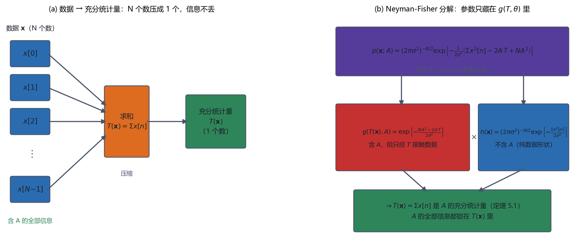

# Vol1 Ch05 一般最小方差无偏估计：把数据"压缩"到信息不丢，再求最优解

> 对应原书：第一卷《估计理论》第 5 章（书内第 85~109 页，本扫描 PDF 第 100~124 页）。
> 前置阅读：本系列 `Vol1_Ch03_CramerRao下限.md`（CRLB 与有效估计量）、`Vol1_Ch04_线性模型.md`（一类模型的现成解）；本文自包含，涉及的前置概念就地插播。

## 写在前头

这是讲解系列的第 5 篇，对应原书第五章《一般最小方差无偏估计》。它在全书链条里的位置，是**从"特殊模型"回到"一般理论"**：第 4 章的线性模型给了现成解，但它只覆盖"数据 = 已知矩阵 × 参数 + 高斯噪声"这一种形状。**一般的 PDF 怎么办？** 第 3 章的 CRLB 路线有个致命前提——只有**存在有效估计量**（有人达界）时，CRLB 才帮你找到 MVU；第 3 篇例 3.4（相位估计）已经演示了"CRLB 算得出来，但没人达界"的尴尬。**当有效估计量不存在时，MVU 还可能存在，但怎么把它找出来？**

本章给出的答案是两件套工具：**充分统计量（sufficient statistic）+ Rao-Blackwell-Lehmann-Scheffe（RBLS）定理**。核心直觉一句话：**先把数据"无损压缩"成少数几个统计量 T(x)——压缩过程中不丢掉任何关于参数的信息——然后在压缩后的空间里构造无偏估计量，那就是 MVU。**

**本章一句话设计目标：把"求 MVU"从"在 N 维数据里大海捞针"降成"先压缩到低维 T(x)、再解一个无偏方程"，并说清楚这条路什么时候走得通、什么时候卡住。**

**实测声明**：本文全部内容与数字核对自原书扫描件 OCR 文本 `Temp/chapters_ocr/ch05/ocr_page_100~124.txt`（PDF 第 100~124 页，即书内第 85~109 页），不是凭印象转述。公式编号（5.1）~（5.12）、定理 5.1~5.4、例 5.1~5.11、图 5.1~5.5、习题 5.1~5.19 均为原书编号。OCR 对数学式识别很差，凡残断处均据 Kay 英文原版校订并在"实现备忘"与 `Temp/素材核对/Vol1_Ch05_核对.md` 逐条记录。Fig009 为本系列自建示意图（脚本 `Temp/scripts/make_fig009.py`，无随机数），仅用于把"无损压缩"与"Neyman-Fisher 分解"画清楚。

---

## 1. 问题：CRLB 找不到有效估计量时，MVU 还在不在、怎么求

### 1.1 问题驱动：第 3 章留下了一个悬案

第 3 章把"求 MVU"做成了两条腿：**算 CRLB**（得到方差天花板）+ **检查达界**（对数似然导数能否凑成 $I(\theta)(g(\mathbf{x})-\theta)$）。达界时，$g(\mathbf{x})$ 就是 MVU。但第 3 篇 §3.3 的例 3.4（估计 WGN 中正弦的相位 $\phi$）明确演示了第二条腿会断：CRLB 算得出来（$\mathrm{var}(\hat\phi)\ge 2\sigma^2/(NA^2)$），但**不存在任何无偏估计量达到它**——没有有效估计量。

当时第 3 篇留了一句伏笔："**然而 MVU 仍然可能存在**，只是本章的工具回答不了'它在不在、怎么求'——这是第 5 章（充分统计量）的活。"本章就来结这个悬案。

### 1.2 一个更根本的问题：数据里哪些部分与参数有关？

在动手之前，先退一步问一个更朴素的问题。看 WGN 中的 DC 电平 $x[n]=A+w[n]$，$A$ 待估、$w[n]$ 为方差 $\sigma^2$ 的 WGN。样本均值 $\bar{x}=\frac1N\sum x[n]$ 是 MVU（方差 $\sigma^2/N$，第 3 篇例 3.3 证明它达界）；而只取第一个样本 $\hat{A}=x[0]$ 虽然也**无偏**，方差却是 $\sigma^2$——差了 $N$ 倍。原书 §5.3 开头点破原因："较差的性能是由于放弃了数据点 $x[1],x[2],\ldots,x[N-1]$ 而导致的直接结果，这些数据点携带有关 $A$ 的信息。"

**于是自然要问：数据里到底哪些部分携带关于 $A$ 的信息？能不能把这部分单独拎出来？** 原书接着列了三个候选数据集：$S_1=\{x[0],\ldots,x[N-1]\}$（原始数据）、$S_2=\{x[0]+x[1],x[2],\ldots,x[N-1]\}$（合并前两个）、$S_3=\{\sum_n x[n]\}$（全加起来成一个数）。**它们都能"用来计算 A"**——$S_1$ 是原始数据，$S_2$、$S_3$ 是越来越狠的压缩。**$S_3$ 只保留一个数，却仍然足够——这就是"充分"二字的来源。**

**一句话总结：本章的全部出发点是一个问题——数据里关于参数的信息能压缩到多小而不丢；答案是"充分统计量"。**

---

## 2. 充分统计量：数据的无损压缩

### 2.1 定义与直觉：压缩之后，数据里"关于 θ 的部分"被抽干了

**充分统计量**的正式定义（原书 §5.3）：若给定 $T(\mathbf{x})$ 之后，数据的条件分布 $p(\mathbf{x}\mid T(\mathbf{x}))$ **与参数 $\theta$ 无关**，则称 $T(\mathbf{x})$ 是 $\theta$ 的充分统计量。

> **前置概念：条件分布。** $p(\mathbf{x}\mid T(\mathbf{x})=t_0)$ 是"已经知道 $T(\mathbf{x})$ 等于 $t_0$"之后，$\mathbf{x}$ 还剩下多少不确定性。**翻译成人话：充分统计量就是——一旦你知道 $T$，剩下的数据里就再也榨不出关于 $\theta$ 的任何新信息了。** 原书图 5.1 画的就是两种情形：$T(\mathbf{x})$ 不充分时，观测到 $T$ 之后数据里还有关于 $\theta$ 的信息（图 5.1(a)）；充分时，观测到 $T$ 之后数据里没有信息了（图 5.1(b)）。

**类比**：充分统计量像"快递单上的运单号"——所有关于"包裹在哪"的信息都锁在这个号里，知道它之后，包裹上的其他文字（地址、电话）就不再提供关于"位置"的新信息。**类比之后补严谨**：这当然不是比喻能代替的，下面立刻用条件分布把它钉死。

### 2.2 例 5.1：直接算条件分布，证明 T=Σx[n] 是充分统计量

DC 电平模型的数据 PDF（原书式 5.1）：

$$
p(\mathbf{x};A) = \frac{1}{(2\pi\sigma^2)^{N/2}}\exp\!\left[-\frac{1}{2\sigma^2}\sum_{n=0}^{N-1}\bigl(x[n]-A\bigr)^2\right]
$$

其中 $A$ 为待估均值、$\sigma^2$ 已知。要证明 $T(\mathbf{x})=\sum_{n=0}^{N-1}x[n]$ 充分，按定义要算条件分布 $p(\mathbf{x}\mid T(\mathbf{x})=t_0;A)$ 并看它是否与 $A$ 无关。原书（例 5.1，OCR 页 101~102）完整走了一遍：先写联合 PDF（在约束 $T(\mathbf{x})=t_0$ 的超曲面上用 Dirac $\delta$ 函数），再除以 $T$ 的 PDF（$T\sim\mathcal{N}(NA,N\sigma^2)$），逐项整理后，**指数上所有含 $A$ 的项全部抵消**，剩下的条件 PDF 只与数据 $\mathbf{x}$ 和 $t_0$ 有关、与 $A$ 无关。结论：**$T(\mathbf{x})=\sum_n x[n]$ 是 $A$ 的充分统计量。**

**代价要照实说**：例 5.1 是"定义式验证"——先猜一个统计量，再算条件分布去验证。原书明说这"计算条件 PDF 非常棘手"，而且"先猜后验"在实际中不可行。**我们需要的是一台"转动摇把"式机器，看一眼 PDF 就能读出充分统计量——这正是下一节的 Neyman-Fisher 因子分解定理。**

### 2.3 最小充分统计量与"一对一变换内唯一"

在进入定理之前，先把一个容易忽略的口径说清。原书指出：**充分统计量不唯一**——$\sum_n x[n]$ 是充分的，$2\sum_n x[n]$ 也是充分的，原始数据 $\mathbf{x}$ 自己也（平凡地）总是充分的（因为令 $r=N$、$T_{n+1}(\mathbf{x})=x[n]$ 即可）。**真正有信息的是"最小"充分统计量——维数最低的那个。** 且充分统计量**只在"一对一变换"内唯一**：$T$ 和 $2T$ 携带同样的信息（一对一可逆），但 $T^2$（非一对一）就可能丢信息（习题 5.12 让读者体会这一点）。

**一句话总结：充分统计量是"给定它之后数据不再含 θ 信息"的统计量；它是数据的无损压缩，且只在一对一变换的意义下唯一。**

---

## 3. 求充分统计量：Neyman-Fisher 因子分解定理

### 3.1 定理 5.1：把"算条件分布"换成"看一眼 PDF 的因式分解"

例 5.1 的"先猜后验"太笨。定理 5.1（Neyman-Fisher 因子分解）把"证明充分"变成一道**因式分解题**（OCR 页 103）：

> **定理 5.1（Neyman-Fisher 因子分解）**：若 PDF 能分解为
>
> $$
> p(\mathbf{x};\theta) = g\bigl(T(\mathbf{x}),\theta\bigr)\,h(\mathbf{x})
> $$
>
> 其中 $g$ 是"只通过 $T(\mathbf{x})$ 才与 $\mathbf{x}$ 有关"的函数、$h$ 是"只与 $\mathbf{x}$ 有关"的函数，则 $T(\mathbf{x})$ 是 $\theta$ 的充分统计量；反之，若 $T(\mathbf{x})$ 充分，则 PDF 必能这样分解。

**翻译成人话：把 PDF 拆成两半——含参数 $\theta$ 的那一半 $g$ 里，数据 $\mathbf{x}$ 只能以 $T(\mathbf{x})$ 的形式出现；不含 $\theta$ 的那一半 $h$ 随便。能拆开，$T$ 就是充分的。** 证明在附录 5A（标量版），核心是用 Dirac $\delta$ 函数处理"$T(\mathbf{x})=t_0$"这个约束曲面，此处不展开。

Fig009 把这个"分解"和"压缩"并排画了出来：

*图 Fig009：充分统计量的"无损压缩"与 Neyman-Fisher 分解（自建图，脚本 `Temp/scripts/make_fig009.py`，经程序化碰撞检测通过）。(a) 左面板——数据 $\mathbf{x}$ 的 $N$ 个数汇入求和，压成 1 个数 $T(\mathbf{x})=\Sigma x[n]$；关键是"无损"：给定 $T$ 后条件分布 $p(\mathbf{x}\mid T)$ 与参数 $A$ 无关。(b) 右面板——DC 电平模型的因子分解（定理 5.1）：$p(\mathbf{x};A)=(2\pi\sigma^2)^{-N/2}\exp[-\frac{1}{2\sigma^2}(\Sigma x^2[n]-2A\,T+NA^2)]$ 拆成 $g(T,A)\cdot h(\mathbf{x})$，其中 $g$ 含 $A$ 但只经 $T=\Sigma x[n]$ 接触数据、$h$ 不含 $A$。结论：$A$ 的全部信息都锁在 $T(\mathbf{x})$ 里，压缩是无损的。*

### 3.2 例 5.2：WGN 中的 DC 电平——一眼读出 T=Σx[n]

用定理 5.1 重做例 5.1。把式（5.1）的指数展开（OCR 页 103）：

$$
\sum_{n=0}^{N-1}\bigl(x[n]-A\bigr)^2 = \sum_{n=0}^{N-1}x^2[n] - 2A\sum_{n=0}^{N-1}x[n] + NA^2
$$

其中第一项只含数据、第二项含 $A$ 与 $\sum x[n]$、第三项只含 $A$。于是 PDF 拆成：

$$
p(\mathbf{x};A) = \underbrace{\exp\!\left[\frac{A}{\sigma^2}\sum_n x[n] - \frac{NA^2}{2\sigma^2}\right]}_{g(T(\mathbf{x}),A)}\;\cdot\;\underbrace{\frac{1}{(2\pi\sigma^2)^{N/2}}\exp\!\left[-\frac{1}{2\sigma^2}\sum_n x^2[n]\right]}_{h(\mathbf{x})}
$$

其中 $T(\mathbf{x})=\sum_n x[n]$。**$g$ 里含 $A$，但数据只以 $T$ 的形式出现；$h$ 里不含 $A$。** 于是 $T(\mathbf{x})=\sum_n x[n]$ 是 $A$ 的充分统计量——**一个"看指数展开"的动作就完成，不再算任何条件分布。**

### 3.3 例 5.3：WGN 的功率——T=Σx²[n]

同一个 PDF，把待估参数换成功率（方差）$\sigma^2$（令 $A=0$）：

$$
p(\mathbf{x};\sigma^2) = \frac{1}{(2\pi\sigma^2)^{N/2}}\exp\!\left[-\frac{1}{2\sigma^2}\sum_{n=0}^{N-1}x^2[n]\right]
$$

其中 $\sigma^2$ 为待估的未知方差。**看结构：参数 $\sigma^2$ 只通过 $\sum_n x^2[n]$ 接触数据**，于是 $T(\mathbf{x})=\sum_n x^2[n]$ 是 $\sigma^2$ 的充分统计量。**翻译成人话：估"功率"时，数据里关于功率的全部信息都在"平方和"这一个数里——这和例 5.2 估"均值"时信息都在"和"里，是同一个套路在不同参数上的投影。**（第 7 篇例 7.1 会再见到这个 $\sum x^2[n]$，见第 5 节回调。）

### 3.4 例 5.4：正弦相位——单一充分统计量不存在

再看第 3 篇例 3.4 的悬案：估 WGN 中正弦的相位 $\phi$（幅度 $A$、频率 $f_0$、方差 $\sigma^2$ 已知）。PDF 的指数展开后（OCR 页 103~104）：

$$
\sum_n \bigl(x[n]-A\cos(2\pi f_0 n+\phi)\bigr)^2
= \sum_n x^2[n] - 2A\cos\phi\sum_n x[n]\cos(2\pi f_0 n) + 2A\sin\phi\sum_n x[n]\sin(2\pi f_0 n) + \cdots
$$

其中 $\phi$ 为待估相位。**注意：含 $\phi$ 的项里，数据以两个不同的组合出现**——$\sum_n x[n]\cos(2\pi f_0 n)$ 和 $\sum_n x[n]\sin(2\pi f_0 n)$，它们被 $\cos\phi$、$\sin\phi$ 分别乘着。**无法把它们合并成一个 $T(\mathbf{x})$，因此不存在单一的充分统计量。** 但把 Neyman-Fisher 定理稍作推广（式 5.4，允许多个统计量）：

$$
p(\mathbf{x};\phi) = g\bigl(T_1(\mathbf{x}),T_2(\mathbf{x}),\phi\bigr)\,h(\mathbf{x})
$$

其中

$$
T_1(\mathbf{x})=\sum_n x[n]\cos(2\pi f_0 n), \qquad T_2(\mathbf{x})=\sum_n x[n]\sin(2\pi f_0 n)
$$

则 $T_1,T_2$ 是 $\phi$ 的**联合充分统计量**（jointly sufficient）。**翻译成人话：相位这个参数"藏"在两个正交投影（余弦投影、正弦投影）里，一个统计量装不下，得两个一起装。**

**这个例子埋下两个伏笔**：① 相位"无有效估计量"（第 3 篇例 3.4）与"需要两个充分统计量"（本例）是同一件事的两面——相位信息分散在两个投影里，任何单一统计量都装不全；② 第 7 篇例 7.6 的相位 MLE $\hat\phi=-\arctan(T_2/T_1)$ 正是拿这两个充分统计量做比值（回调，见 §9）。

**一句话总结：Neyman-Fisher 定理把"求充分统计量"变成"把 PDF 因式分解、读出参数接触数据的唯一通道 T"；通道是几个，充分统计量就有几个——一个（均值/功率）或两个（相位）都可能。**

---

## 4. 用充分统计量求 MVU：RBLS 定理与完备性这把钥匙

### 4.1 例 5.5：拿到充分统计量之后，怎么变出 MVU？两种方法

有了 $T(\mathbf{x})$，下一步是在它上面构造无偏估计量。例 5.5（DC 电平）演示两条路（OCR 页 105~106）：

**方法 1：条件期望法。** 取**任意**无偏估计量，比如 $\hat{A}=x[0]$，再求它的条件期望 $\tilde{A}=E[\hat{A}\mid T(\mathbf{x})]$。用条件高斯 PDF 的性质（式 5.5，$E[x\mid y]=E[x]+\frac{\mathrm{cov}(x,y)}{\mathrm{var}(y)}(y-E[y])$，附录 10A 证明），代入 $x=x[0]$、$y=\sum_n x[n]$、$\mathrm{cov}(x[0],\sum_n x[n])=\sigma^2$、$\mathrm{var}(\sum_n x[n])=N\sigma^2$，得

$$
\tilde{A} = A + \frac{\sigma^2}{N\sigma^2}\Bigl(\sum_n x[n] - NA\Bigr) = \frac{1}{N}\sum_n x[n] = \bar{x}
$$

其中 $\bar{x}$ 为样本均值。**翻译成人话：把一个无偏估计量"投影"到充分统计量上，得到的就是更好的无偏估计量——本例投影出来正是样本均值。**

**方法 2：解无偏方程。** 直接找函数 $g$，使 $g(T(\mathbf{x}))$ 无偏。观察 $E[\sum_n x[n]]=NA$，所以 $g(T)=T/N=\bar{x}$ 无偏。**翻译成人话：算 $T$ 的期望，凑一个让期望恒等于 $\theta$ 的函数——这比方法 1 的条件期望好算得多，实际中通常用它。**

### 4.2 定理 5.2：RBLS——"条件期望"这台机器能保证什么

原书把方法 1 提炼成定理（定理 5.2，OCR 页 106）：

> **定理 5.2（Rao-Blackwell-Lehmann-Scheffe）**：若 $\hat{\theta}$ 是 $\theta$ 的无偏估计量、$T(\mathbf{x})$ 是 $\theta$ 的充分统计量，则 $\tilde{\theta}=E[\hat{\theta}\mid T(\mathbf{x})]$ 是
> 1. 一个可用的估计量（与 $\theta$ 无关，只是 $T$ 的函数）；
> 2. 无偏的；
> 3. 方差不超过 $\hat{\theta}$（对所有 $\theta$）。
>
> **另外，如果充分统计量是完备的，那么 $\tilde{\theta}$ 是 MVU 估计量。**

前三条是 Rao-Blackwell 部分（附录 5B 证明）：**把任意无偏估计量做"条件期望投影"，方差只会降不会升，且保持无偏。** 几何直觉（原书图 5.2）：所有无偏估计量构成一个"类"，条件期望运算把类里的每个点都投影到"只依赖 $T$"的子集上，方差单调下降。**翻译成人话：条件期望是"方差压缩器"——喂进去一个无偏估计量，吐出一个方差更小（或相等）的无偏估计量。**

关键在最后一句的"**如果充分统计量是完备的**"——**这是定理从"方差减小"升级到"方差最小（MVU）"的那把钥匙。** 下面专讲它。

### 4.3 完备性：为什么它能补上"最小"这最后一跳

先看为什么光有 Rao-Blackwell 不够。方法 1 的结果 $\tilde{\theta}=E[\hat{\theta}\mid T]$ 是 $T$ 的**唯一**函数（式 5.6）：

$$
\tilde{\theta} = E\bigl[\hat{\theta}\mid T(\mathbf{x})\bigr] = \int \hat{\theta}\,p(\hat{\theta}\mid T)\,d\hat{\theta} = g\bigl(T(\mathbf{x})\bigr)
$$

其中 $g$ 为某个函数（积分掉 $\hat{\theta}$ 后只留下 $T$）。**问题来了：你换一个初始的无偏估计量 $\hat{\theta}'$，会得到另一个 $T$ 的函数 $g'(T)$——它俩谁更好？** 如果"只存在**一个** $T$ 的无偏函数"，那么不管从哪个 $\hat{\theta}$ 出发，投影结果都是**同一个**，而它方差最小（因为任何别的无偏估计量投影到它之后方差只降不升）——**这就是"完备性"要保证的事。**

**完备性定义**（式 5.8，OCR 页 109）：若

$$
\int v(T)\,p(T;\theta)\,dT = 0 \quad \text{对一切 }\theta
$$

只对"几乎处处为零"的函数 $v$ 成立，则称 $T$ 是**完备**的充分统计量。**翻译成人话：完备 = 充分统计量的函数里，除了零函数，没有任何函数的期望恒为零；换句话说，"期望恒为零"就逼着函数本身为零——于是"无偏的 $T$ 函数"至多一个（否则两个之差就是非零但期望为零的函数）。**

> **前置概念：完备性的实用判断。** 完备性"与 $\mathbf{x}$ 的 PDF 有关"，对许多我们关心的情形都成立——**特别是指数族 PDF**（习题 5.14 的定义，高斯、瑞利、指数等都在族内，习题 5.15 证明其 $\sum B(x[n])$ 完备）。所以实际中常能直接引用"高斯/指数族 ⇒ 完备"的结论，不必每次手算。但**证明完备性通常困难**（原书指向 Kendall & Stuart 1979），例 5.8 就"省略证明"。

### 4.4 例 5.6 vs 例 5.7：完备与不完备的一正一反

**例 5.6（高斯，完备）**：回到 DC 电平，$T=\sum_n x[n]\sim\mathcal{N}(NA,N\sigma^2)$。要证完备：设 $v(T)$ 满足 $\int v(T)p(T;A)dT=0$ 对一切 $A$。换元 $u=T/N$、$V(u)=v(Nu)$，这个积分变成 $V(u)$ 与高斯脉冲 $W(A-u)$ 的**卷积**恒为零（原书图 5.3）：卷积为零 ⇒ 两边傅里叶变换之积为零 ⇒ $V(f)W(f)=0$；而 $W(f)$（高斯脉冲的变换）也是高斯、恒非零，故 $V(f)\equiv0$ ⇒ $V\equiv0$ ⇒ $v\equiv0$。**结论：$T$ 完备，RBLS 的"另外"一句成立，$\bar{x}$ 确认为 MVU。**

**例 5.7（均匀，不完备）**：换一个 PDF 立刻翻车。观测 $x[0]=A+w[0]$，$w[0]\sim U[-1/2,1/2]$（均匀分布）。充分统计量只能是 $T=x[0]$（只有一个数据点），且 $x[0]$ 是 $A$ 的无偏估计。但它完备吗？取 $v(T)=\sin(2\pi T)$——它是非零函数，但

$$
\int v(T)\,p(T;A)\,dT = \int_{A-1/2}^{A+1/2} \sin(2\pi T)\,dT = 0 \quad \text{对一切 } A
$$

其中积分区间为均匀分布的支撑 $[A-1/2, A+1/2]$，正弦在一个整周期上积分为零。**翻译成人话：$\sin(2\pi T)$ 是"期望恒为零但函数不为零"的反例——完备性被破坏。** 于是 $h(T)=T-\sin(2\pi T)$ 给出**另一个**无偏估计量 $\hat{A}=x[0]-\sin(2\pi x[0])$，与 $x[0]$ 不同。**完备性不成立，RBLS 的"另外"一句失效，无法断言 $x[0]$ 是 MVU**（原书图 5.4 画的正是这个"积分恒为零但函数非零"的情形）。

**一句话总结：完备性是 RBLS 从"方差减小"升级为"方差最小"的钥匙；高斯（指数族）通常完备、均匀分布（支撑随参数移动）可能不完备——钥匙在不在，决定了这条路通不通。**

### 4.5 例 5.8：均匀噪声的均值——样本均值竟然不是 MVU！

这是全章最"反直觉"的一个例子，也最能说明这套工具的真本事。观测 $x[n]=w[n]$，$w[n]$ 为 IID 噪声、PDF 为 $U(0,\beta)$（$\beta>0$），要估均值 $\theta=\beta/2$。

1. **CRLB 路线直接失效**：PDF 的支撑 $[0,\beta]$ 随参数移动，正则条件不满足（第 3 篇习题 3.1 的同款病灶），CRLB 不能套。
2. **自然估计量是样本均值 $\bar{x}$**：它无偏，方差（式 5.9）

$$
\mathrm{var}(\bar{x}) = \frac{\beta^2}{12N}
$$

其中 $\beta$ 为均匀分布上界（等价地，因 $\theta=\beta/2$，$\mathrm{var}(\bar{x})=\theta^2/(3N)$）。
3. **充分统计量不是样本均值，而是最大值 $T(\mathbf{x})=\max_n x[n]$**。用 Neyman-Fisher 分解（数据 PDF 只在 $0<x[n]<\beta$ 即 $0<\min x[n]$ 且 $\max x[n]<\beta$ 时非零）可得 $T=\max_n x[n]$ 充分，且可证完备（原书省略证明）。
4. **求 $T$ 的无偏函数**：算 $T$ 的 CDF $\Pr\{T\le\xi\}=(\xi/\beta)^N$、PDF、期望，得 $E[T]=N\beta/(N+1)=2N\theta/(N+1)$。于是令

$$
\hat{\theta} = \frac{N+1}{2N}\,\max_n x[n]
$$

其中 $\max_n x[n]$ 为样本最大值。这是无偏的，因而是 MVU。其方差（式 5.10）：

$$
\mathrm{var}(\hat{\theta}) = \frac{\beta^2}{4N(N+2)}
$$

其中 $\beta$ 为均匀分布上界（等价地 $\theta^2/[N(N+2)]$）。**对比**：$\mathrm{var}(\hat{\theta})$ 随 $N$ 按 $1/N^2$ 下降，而样本均值按 $1/N$ 下降——**$N$ 大时，MVU 比样本均值好一个数量级**（对 $N\ge2$，MVU 方差严格更小）。

**翻译成人话：均匀分布有"硬上界" $\beta$，样本里最大的那个点承载了关于 $\beta$（从而关于 $\theta$）的最多信息；样本均值把这一结构完全浪费了。** 这就是充分统计量 + RBLS 的威力：**它给出一个"看起来更怪"的估计量（缩放的样本最大值），却比"看起来更合理"的样本均值更优。** 直觉上，均匀分布的数据"聚在一个盒子里"，盒子的右壁位置就是 $\beta$，而 $\max x[n]$ 是离右壁最近的一个点。

---

## 5. 回调第 7 篇例 7.1：完备性为什么是"卡住"的机理

第 7 篇 §1.1 讲过一个"正规军全部折戟"的例子（例 7.1）：$x[n]=A+w[n]$，$w[n]\sim\mathcal{N}(0,A)$——同一个参数 $A$ 既是均值又是噪声方差。第 7 篇里有一句："由 Neyman-Fisher 因子分解定理可证 $T(\mathbf{x})=\sum_n x^2[n]$ 是 $A$ 的充分统计量，但下一步要找它的无偏函数……原书算了 $E[\sum x^2[n]]=N(A+A^2)$ 之后卡住了。"

**现在可以用本章的语言说清楚"卡住"的机理**：充分统计量 $T=\sum x^2[n]$ 是有了（例 5.3 的功率套路），但 RBLS 定理的"另外"一句要求**完备性**成立、且要找到一个 $T$ 的无偏函数 $g$ 使 $E[g(T)]=A$。这个 $A$ 藏在 $N(A+A^2)$ 的**非线性关系**里（要解 $A$ 得开根号，见第 7 篇式 7.6），而**完备性没证出来、无偏函数也凑不出来**——于是"充分统计量路线"到此为止，RBLS 用不上。这正是本章 §4.3 反复强调的：**"充分"只是第一步，"完备 + 能解无偏方程"才是通往 MVU 的后两步；后两步卡住，这条路就断了。** 第 7 章的做法是干脆放弃"有限样本 MVU"，退到 MLE 的"渐近最优"（第 7 篇 §1.2）——**这就是本章与第 7 章的接力关系：本章给"完美解"的工具，第 7 章给"求不出完美解时"的退路。**

**一句话总结：充分统计量 + RBLS 是"有限样本求 MVU"的完整路线图，但它的终点（MVU）只在"完备 + 无偏方程可解"时到达；到不了时，就轮到第 7 章 MLE 的渐近最优登场。**

---

## 6. 矢量参数扩展：充分统计量的个数要与参数个数对上

### 6.1 定理 5.3、5.4：定义与定理原样照搬

把标量结论搬到 $p\times1$ 参数 $\boldsymbol\theta$，唯一的改动是"标量统计量"换成"$r\times1$ 统计量矢量 $T(\mathbf{x})=[T_1,\ldots,T_r]^T$"。定理 5.3（矢量 Neyman-Fisher，式 5.11）：

$$
p(\mathbf{x};\boldsymbol\theta) = g\bigl(T(\mathbf{x}),\boldsymbol\theta\bigr)\,h(\mathbf{x})
$$

其中 $g$ 只通过 $T(\mathbf{x})$ 接触 $\mathbf{x}$。定理 5.4（矢量 RBLS）：$\hat{\boldsymbol\theta}$ 无偏、$T$ 充分 ⇒ $\tilde{\boldsymbol\theta}=E[\hat{\boldsymbol\theta}\mid T]$ 是可用、无偏、逐分量方差不增的估计量；**若 $T$ 完备（式 5.12：$E[v(T)]=0$ 对一切 $\boldsymbol\theta$ 逼出 $v\equiv0$），则 $\tilde{\boldsymbol\theta}$ 是 MVU。**

**一个实操纪律**（原书 §5.6 强调）：**充分统计量的个数 $r$ 与参数个数 $p$ 的关系决定难易**。理想情形是 $r=p$——这时"把 $T$ 变换成无偏"通常直接给出 MVU（下两例）；若 $r>p$（统计量比参数多）或 $r<p$（统计量比参数少），方法不总是可行（习题 5.16 给了 $r<p$ 的反例，习题 5.10 是 $r=2>p=1$ 时需"猜组合函数"的麻烦）。

### 6.2 例 5.9：正弦参数——频率未知时，分解直接失败

观测 $x[n]=A\cos(2\pi f_0 n)+w[n]$，$\boldsymbol\theta=[A,f_0,\sigma^2]^T$ 全未知。指数项展开后含 $\sum_n x[n]\cos(2\pi f_0 n)$——**其中 $f_0$ 未知，导致 $\cos$ 项依赖未知参数**，无法把 PDF 整理成（5.11）的形式。**结论：当且仅当 $f_0$ 已知时（此时 $\boldsymbol\theta=[A,\sigma^2]$），$T(\mathbf{x})=[\sum_n x[n]\cos(2\pi f_0 n),\ \sum_n x^2[n]]^T$ 才是充分统计量**（习题 5.17 让读者据此求 MVU）。

**翻译成人话：参数一旦"钻进基函数里"（频率在余弦里），Neyman-Fisher 分解就做不动——这是充分统计量路线的边界，也是第 7 章 MLE 不得不接管的地方（频率的 MLE 要搜周期图峰值）。**

### 6.3 例 5.10、5.11：DC 电平 + 未知功率——MVU 存在但不有效

数据 $x[n]=A+w[n]$，$\boldsymbol\theta=[A,\sigma^2]^T$ 都未知。由例 5.2 和 5.3 各自的结果，联合充分统计量为（$r=p=2$，理想情形）：

$$
T(\mathbf{x}) = \begin{bmatrix} T_1 \\ T_2 \end{bmatrix} = \begin{bmatrix} \sum_n x[n] \\[2pt] \sum_n x^2[n] \end{bmatrix}
$$

其中 $T_1$ 为数据之和、$T_2$ 为平方和。取期望 $E[T_1]=NA$、$E[T_2]=N(\sigma^2+A^2)$，凑无偏变换（OCR 页 114~115，注意 $E[\bar{x}^2]=A^2+\sigma^2/N$ 这个小坑）：

$$
\hat{A} = \frac{T_1}{N} = \bar{x}, \qquad
\hat{\sigma}^2 = \frac{1}{N-1}\Bigl(T_2 - \frac{T_1^2}{N}\Bigr) = \frac{1}{N-1}\sum_{n=0}^{N-1}\bigl(x[n]-\bar{x}\bigr)^2
$$

其中 $\bar{x}$ 为样本均值、求和项为样本方差（平方和）。**两个都是 MVU**（高斯属指数族，完备性成立，OCR 页 117 引用 Kendall & Stuart）。

**最值得记住的结论**（OCR 页 115~116）：

1. **方差估计量用 $1/(N-1)$ 归一化**——因为估计均值 $\bar{x}$ 时"丢失了一个自由度"。这是 $1/(N-1)$（而非 $1/N$）在统计里反复出现的真正原因。
2. **它不有效**：$\hat{A}$ 与 $\hat{\sigma}^2$ 独立，且 $(N-1)\hat{\sigma}^2/\sigma^2\sim\chi^2_{N-1}$（卡方分布，自由度 $N-1$），故 $\mathrm{var}(\hat{\sigma}^2)=2\sigma^4/(N-1)$，**比 CRLB $2\sigma^4/N$（第 3 篇例 3.6）略大**。**翻译成人话：$\hat{\sigma}^2$ 是 MVU，但贴在下限上方没摸到线——"MVU" 与 "有效" 是两回事**（第 3 篇 §3.4 的图 3.2(b) 情形，此处兑现）。与之对照，第 7 篇 §6.2 的方差 MLE 用 $1/N$ 归一化、有偏、但渐近达界——**"有限样本无偏的 MVU"与"渐近有效的 MLE"在 $1/(N-1)$ 与 $1/N$ 这个归一化上分道扬镳。**

**一句话总结：矢量情形照搬标量定理，但要把"充分统计量个数 $r$ 与参数个数 $p$ 对上"当纪律；例 5.11 还给出了一个珍贵的反例——MVU 存在却不有效，$1/(N-1)$ 的来历与"MVU≠有效"在此同时结清。**

---

## 7. 关键设计决策回顾

把散在正文里的"为什么"收拢。每个决策都是一个真实岔路口：

| # | 决策 | 为什么这么选 | 换一个选择会怎样 |
|---|------|------------|----------------|
| 1 | 用**充分统计量**把求 MVU 分成"压缩 + 构造"两步 | 有效估计量可能不存在（例 3.4），CRLB 路线会断；压缩后问题降到低维，可构造 | 坚持 CRLB 达界路线，则例 5.8（正则条件失效）和例 3.4（无达界者）直接无解（§1） |
| 2 | 用 **Neyman-Fisher 分解**求充分统计量，而非算条件分布 | 因式分解是"看 PDF 一眼"的机械动作；条件分布计算"非常棘手"（例 5.1） | 回到"先猜统计量再验条件分布"，每个问题都卡在积分上（§2.2、§3.1） |
| 3 | RBLS 用**条件期望**作为"方差压缩器" | 条件期望投影方差单调下降且保无偏，有定理保证（附录 5B） | 直接在低维空间瞎猜估计量，没有"方差一定更小"的保证（§4.2） |
| 4 | 把**完备性**立为 RBLS 的最后一步 | 完备 ⇒ 无偏的 $T$ 函数唯一 ⇒ 投影结果与初始估计量无关 ⇒ 方差最小 | 缺完备性，则存在多个无偏的 $T$ 函数（例 5.7 的 $T-\sin 2\pi T$），无法断定谁最小（§4.3） |
| 5 | 矢量情形要求**"统计量个数 = 参数个数"**（$r=p$） | $r=p$ 时"把 $T$ 变换成无偏"直接给 MVU，最省事 | $r\ne p$ 时要么猜组合函数（$r>p$）、要么方法失效（$r<p$）（§6.1） |

---

## 8. 实现备忘（对照原书与复现时的坑）

1. **页码映射**：本章书内第 85~109 页对应 PDF 第 100~124 页（**书内页码 = PDF 页码 − 15**）。实测：PDF 100 页是章标题页（书内 85）、PDF 101 页顶栏"86"、PDF 124 页顶栏"109"。
2. **例 5.8 的 $\beta$ 与 $\theta$ 口径（据 Kay 英文原版校订）**：OCR 页 110 的式（5.9）分母为"12N"、页 112 的式（5.10）为"32"残字，分子均无法分辨是 $\beta^2$ 还是 $\theta^2$。据英文原版：数据 $w[n]\sim U(0,\beta)$，$\theta=\beta/2$，**式（5.9）为 $\mathrm{var}(\bar{x})=\beta^2/(12N)$、式（5.10）为 $\mathrm{var}(\hat{\theta})=\beta^2/[4N(N+2)]$**（等价于 $\theta$ 口径的 $\theta^2/(3N)$ 与 $\theta^2/[N(N+2)]$）。校订依据：$\mathrm{var}(\bar{x})=\beta^2/(12N)$ 是 $U(0,\beta)$ 方差的直接结果；$\mathrm{var}(\hat{\theta})=\beta^2/[4N(N+2)]$ 由 $E[T]=N\beta/(N+1)$、$\mathrm{var}(T)=N\beta^2/[(N+1)^2(N+2)]$、$\hat{\theta}=\frac{N+1}{2N}T$ 直接算得，且与"MVU 随 $1/N^2$、样本均值随 $1/N$"的定性结论自洽。
3. **例 5.11 的归一化与自由度**：$\hat{\sigma}^2=\frac{1}{N-1}\sum(x[n]-\bar{x})^2$ 用 $1/(N-1)$（不是 $1/N$），因为估计 $\bar{x}$ 吃掉一个自由度。复现时务必用 $N-1$，否则不是无偏的（也就不是 MVU）。
4. **"MVU ≠ 有效"的口径**：例 5.11 的 $\hat{\sigma}^2$ 是 MVU 但 $\mathrm{var}=2\sigma^4/(N-1)$ 大于 CRLB $2\sigma^4/N$。引用时别把"方差最小"与"达 CRLB"混为一谈（第 3 篇 §3.4 的区分在此兑现）。
5. **完备性常靠"指数族"结论引而不证**：例 5.6 是手算（卷积+傅里叶变换），例 5.8 与例 5.11 都"省略证明"、直接引指数族完备性（习题 5.14/5.15，Kendall & Stuart）。**复现时若自己证完备性，要做好"很困难"的心理准备。**
6. **充分统计量的一对一唯一性**：$T$ 与 $2T$ 等价，$T^2$ 不等价（丢信息）。引用充分统计量时，若遇到"谁才是充分统计量"的争议，先确认双方是否只差一个一对一变换。
7. **例 5.7 的不完备反例**：$v(T)=\sin(2\pi T)$ 在 $[A-1/2,A+1/2]$ 上积分为零，是"均匀分布支撑随参数平移"导致不完备的典型。这个反例与第 3 篇习题 3.1（正则条件失效）同源——**支撑集依赖参数，是经典估计里反复出现的病灶。**
8. **自建图口径**：Fig009 是静态示意图（无随机数），(b) 面板的因子分解是例 5.2 的 DC 电平模型（$T=\sum x[n]$）。

---

## 9. 局限（坦率交代，并预告后续）

1. **完备性是"钥匙"，但它可能不在（或不证明）。** 例 5.7 演示了不完备时 RBLS 失效；例 7.1（第 7 篇）演示了完备性证不出、无偏方程解不出时"充分统计量路线卡住"。**完备性依赖 PDF 族（指数族满足，均匀等未必），且证明通常困难——这是本章方法的最大软肋。**
2. **充分统计量可能不存在（单一的），或个数与参数对不上。** 例 5.4 的相位需要两个联合统计量；例 5.9 的频率未知时分解直接失败；$r\ne p$ 时方法不总是可行（习题 5.10、5.16）。**参数"钻进基函数"（频率在余弦里）时，这条路基本走不通——第 7 章 MLE 接手。**
3. **条件期望难算，实际靠"猜无偏函数"。** 方法 1（条件期望）数学上"通常不易处理"（原书原话）；方法 2（解无偏方程）省事但依赖"凑出 $g$"的巧思，没有通用流程。
4. **MVU 不保证有效。** 例 5.11 的 $\hat{\sigma}^2$ 是 MVU 却不达 CRLB——**"最小方差"与"达到 CRLB"是两回事**，别以为求出 MVU 就摸到物理天花板了。
5. **它仍然只回答"无偏 + 最小方差"这一种最优。** 若你愿意接受有偏估计量（换更小的均方误差）、或想引入先验知识，本章框架都不适用——**那是第 7 章 MLE（渐近）、第 10~11 章贝叶斯（MMSE/MAP）的地盘**。本章守的是"经典路线里最严格的那把尺子"。

---

## 10. 建议自测的问题

1. 用你自己的话解释：为什么"给定 $T(\mathbf{x})$ 后 $p(\mathbf{x}\mid T)$ 不含 $\theta$"意味着"$T$ 已装下关于 $\theta$ 的全部信息"？（提示：§2.1 的运单号类比 + 条件分布定义。）
2. 例 5.4 中，为什么相位 $\phi$ 不存在单一充分统计量、而需要 $T_1,T_2$ 两个？这与第 3 篇例 3.4"相位无有效估计量"是什么关系？（提示：§3.4 与 §5 的伏笔/回调。）
3. 例 5.8 中，样本均值为什么不是均匀噪声均值的 MVU？MVU 估计量 $\frac{N+1}{2N}\max x[n]$ 的方差为何随 $N$ 按 $1/N^2$ 下降（样本均值只按 $1/N$）？
4. 原书习题 5.3：IID 指数分布样本（PDF 为 $\lambda e^{-\lambda x[n]}$，$x[n]>0$），求 $\lambda$ 的充分统计量，并（假定完备）求 MVU。（提示：与例 5.2/5.3 的"看指数展开"同一套路。）
5. 例 5.11 中，方差估计量为什么用 $1/(N-1)$ 而非 $1/N$ 归一化？它为什么是 MVU 却不是有效估计量（$\mathrm{var}=2\sigma^4/(N-1)>2\sigma^4/N$）？

---

**一句话收尾：充分统计量把"N 维数据里的 MVU"降维成"压缩后的低维无偏方程"——Neyman-Fisher 分解负责压缩、RBLS 负责构造、完备性负责收尾；三件套齐全时 MVU 直接到手，缺了完备性这把钥匙，路线就卡在半路，而第 7 章的 MLE 就在那里等着接手。**

*实测核对声明：本章事实性内容核对自原书扫描件 OCR 文本 `Document/统计信号处理/Temp/chapters_ocr/ch05/ocr_page_100~124.txt`（PDF 第 100~124 页，书内第 85~109 页）；公式编号（5.1）~（5.12）、定理 5.1~5.4、例 5.1~5.11、习题 5.1~5.19 与原书一致。例 5.8 的 $\beta/\theta$ 口径等据 Kay 英文原版校订（详见 `Temp/素材核对/Vol1_Ch05_核对.md`）。Fig009 由 `Temp/scripts/make_fig009.py` 生成并经 `plotutil.check_figure` 程序化碰撞检测通过。*
