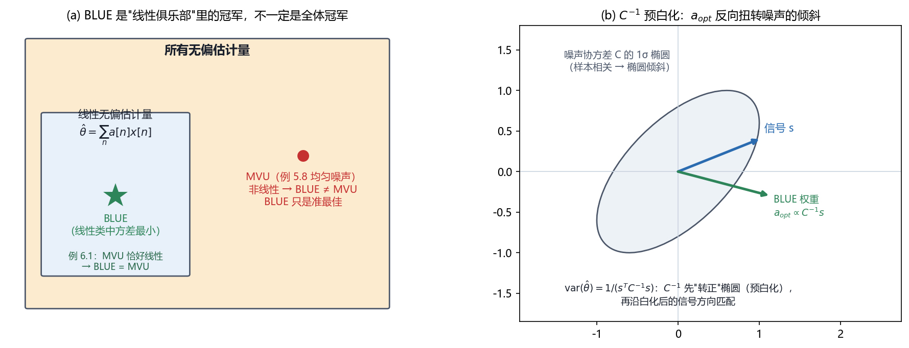

# Vol1 Ch06 最佳线性无偏估计量：不知道 PDF 也能求"最优"？——代价是"最优"只在线性俱乐部内成立

> 对应原书：第一卷《估计理论》第 6 章（书内第 110~128 页，本扫描 PDF 第 125~143 页）。
> 前置阅读：本系列 `Vol1_Ch01_引言.md`（随机变量观）、原书第 2 章（MVU 定义）、第 4 章（线性模型）；本文自包含，涉及的前置概念就地插播。

## 写在前头

这是讲解系列的第 6 篇，也是**第一卷从"追求完美"转向"追求可计算"的第一站**。前五章的隐含前提始终是：要想找到最小方差无偏（MVU）估计量，你得**知道数据的完整概率密度函数（PDF）**——第 3 章的 CRLB 要对 PDF 求导，第 5 章的充分统计量要对 PDF 做因子分解。可工程现场常常连 PDF 的影子都没有：我们只知道噪声是零均值、协方差矩阵是 $\mathbf{C}$，至于它是不是高斯、偏不偏、尾巴多厚，一概不知。**于是问题来了：只靠一、二阶矩这两样东西，能不能也求出一个"最优"估计量？**

Kay 的答案是"能，但要付出一个代价"：**先把估计量锁死在"数据的线性函数"这一类里，再在这个小类里求无偏 + 最小方差**。得到的估计量就是本章主角——最佳线性无偏估计量（BLUE，best linear unbiased estimator）。"代价"二字要写大一点：**BLUE 的"最优"只在线性估计量这一类里成立，不是全体估计量里的最优**；非线性估计量可能严格更好。这条边界是本章最容易读错的地方，也是全文的核心。

**本章一句话设计目标：在"只用噪声的一、二阶矩"与"估计量必须是线性"这两重约束下，求出可计算的最优估计量，并精确划清它与 MVU 的分野——什么时候 BLUE 就是 MVU，什么时候它只是准最佳。**

**实测声明**：本文所有内容与数字均经 OCR 核对原书扫描件 `Temp/chapters_ocr/ch06/ocr_page_125~143.txt`（PDF 第 125~143 页，即书内第 110~128 页），不是凭印象转述；正文中的公式编号（6.1）~（6.29）沿用原书编号。例 6.3 三天线线阵的最终协方差矩阵在扫描件中仅存碎片（"2cos²α""3/2""(1−sinα)²"），本文据 Kay 原书英文版重新推导校订，推导过程见 §5.2 与文末核对文件。Fig010 为本系列自建示意（脚本 `Temp/scripts/make_fig010.py`），数值为本系列推导结果，与原书结论一致。

---

## 1. 为什么需要 BLUE：MVU 的三个死穴

### 1.1 问题驱动：MVU 又漂亮又难求，工程上卡在哪？

MVU 的定义极其诱人：无偏 + 方差最小，是第 2 章立下的黄金标准。但本章一开头就泼了盆冷水（原书 §6.1 原文大意）：

> 在实际中通常出现的情况是，MVU 估计量即使存在也无法求出。

**翻译成人话：黄金标准很漂亮，但大多数时候够不着。** 具体卡在三个死穴上：

1. **求 MVU 需要完整 PDF。** CRLB（第 3 章）要对 $\ln p(\mathbf{x};\theta)$ 求导，充分统计量（第 5 章）要对 PDF 做因子分解——**两者都离不开 $p(\mathbf{x};\theta)$ 这个我们常常没有的东西。**
2. **即使 PDF 已知，充分统计量路线也不保证得到 MVU。** 第 5 章的方法是"找充分统计量 → 找它的无偏函数"，可找无偏函数这一步没有通用算法，常常卡死（本系列第 7 篇的例 7.1 就演示了这种卡死：充分统计量 $T(\mathbf{x})=\sum x^2[n]$ 找到了，但想不出哪个 $T$ 的函数期望恒等于 $A$）。
3. **MVU 求出来了也可能是非线性、难实现的。** 非线性估计量常常要数值搜索，实时系统不待见它。

### 1.2 退而求"准最佳"，以及一个必须坦白的不确定性

于是原书提出务实的退路：**放弃"求 MVU"，转而求"准最佳估计量"**（suboptimal estimator）。但这里埋着一个诚实的警告，值得每个做算法的人刻在桌上：

> 在确定准最佳估计量的时候，永远也不能确定我们可能失去多少性能（由于 MVU 估计量的最小方差是未知的）。

**翻译成人话：MVU 的方差本身就是未知的（否则你早就求出来了），所以选了个准最佳方案后，你无法量化它比 MVU 差多少。** 能做的只有一条：把准最佳估计量的方差**算出来**，看它满不满足系统要求；满足就用，不满足就换一个准最佳方案再试。

**一个常用的准最佳方案，就是本章的 BLUE：限制估计量为数据的线性函数，求其中无偏且方差最小的那个。** 它的命门在于——后面 §3 会看到——**确定 BLUE 只需要 PDF 的一、二阶矩（均值 + 协方差），不需要完整 PDF**。这正是它在工程上站得住脚的根本理由：**需要知道的东西越少，能落地的地方就越多。**

**一句话总结：MVU 需要完整 PDF 这条硬前提，把很多工程问题挡在门外；BLUE 的价值，就是把"知识需求"从"整个 PDF"降到"均值 + 协方差"两样。**

---

## 2. BLUE 的定义，与"最优"的精确含义

### 2.1 问题驱动：BLUE 的"最优"到底是对谁最优？

这一节回答本章最容易被误读的一句话。BLUE 的"B"是 best，可它到底"最好"到什么程度？答案是：**它只在"线性估计量"这个小圈子里最好，不是所有估计量里的最好。** 不理解这一点，就会把 BLUE 当成 MVU 的等价物——这是错的。

先摆定义。原书把 BLUE 的候选集限定为**线性估计量**（式 6.1）：

$$
\hat{\theta} = \sum_{n=0}^{N-1} a_n\, x[n]
$$

其中 $x[n]$ 为观测数据（$n=0,1,\ldots,N-1$），$a_n$ 为待定的加权系数（本章不讨论带附加常数项的仿射估计量，那种扩展见原书习题 6.6）。**翻译成人话：估计量就是给 $N$ 个数据各配一个权重，加权求和——不许平方、不许取对数、不许做非线性运算。**

在这个线性候选集里，BLUE 定义为**无偏（式 6.2）且方差最小（式 6.3）**的那个：

$$
E(\hat{\theta}) = \sum_{n=0}^{N-1} a_n\, E\bigl(x[n]\bigr) = \theta
$$

$$
\mathrm{var}(\hat{\theta}) = \mathbf{a}^T \mathbf{C}\, \mathbf{a}
$$

其中 $\mathbf{a} = [a_0, a_1, \ldots, a_{N-1}]^T$ 为权重矢量，$\mathbf{C}$ 为数据 $\mathbf{x}$ 的协方差矩阵（$N \times N$）。（6.3）的来历一句话：$\mathrm{var}(\hat{\theta})=E[(\mathbf{a}^T\mathbf{x}-\mathbf{a}^TE[\mathbf{x}])^2]=\mathbf{a}^T E[(\mathbf{x}-E[\mathbf{x}])(\mathbf{x}-E[\mathbf{x}])^T]\mathbf{a}=\mathbf{a}^T\mathbf{C}\mathbf{a}$。

### 2.2 "线性俱乐部冠军"与"全体冠军"的区别

现在看"最优"二字的精确边界。原书用图 6.1 讲了两组对照，我把它们抽象成 Fig010(a)（图见 §3.3）：

- **情形一（WGN 中的直流电平，第 3 章例 3.3）**：MVU 是样本均值 $\frac1N\sum x[n]$，**它本身就是线性的**。于是把候选集限定在线性一类里，什么都没丢——MVU 就在线性俱乐部里，BLUE 恰好等于 MVU。
- **情形二（均匀分布噪声的均值，第 5 章例 5.8）**：MVU 是 $\frac12\bigl(\max_n x[n] + \min_n x[n]\bigr)$（最大值与最小值的中点），**它是非线性的**。此时线性俱乐部里的冠军（样本均值）就不是全体冠军——**BLUE 只是准最佳**，性能比真 MVU 差，而且原书在例 5.8 里证明这个差距可以很大。

**翻译成人话：BLUE 是"线性俱乐部"里的冠军；只有当选出的全场冠军恰好也在这个俱乐部里时，BLUE 才等于 MVU。** 而"全场冠军在不在俱乐部里"，没有 PDF 你根本判断不了——这正是 §1.2 那个"无法量化损失"的另一种表述。

### 2.3 一个更狠的反例：BLUE 可能连"无偏"都做不到

原书还举了一个让 BLUE 直接失效的场景，用来警告"线性"这个限制有时过于苛刻。考虑 **WGN 功率的估计**：$x[n]\sim\mathcal{N}(0,\sigma^2)$，要估 $\sigma^2$。MVU 是 $\frac1N\sum x^2[n]$（第 3 章例 3.6），它是非线性的。如果强迫估计量形如（6.1）那样线性，则

$$
E\!\left[\sum_{n=0}^{N-1} a_n x[n]\right] = \sum_{n=0}^{N-1} a_n \underbrace{E[x[n]]}_{=0} = 0
$$

**期望恒为零——无论权重怎么取，线性估计量的期望都跟 $\sigma^2$ 沾不上边，连"无偏"这条最低要求都满足不了。** 此时 BLUE 对这个问题"总的来说是不合适的"（原书原话大意）。但原书紧接着给出活路：**换数据**——定义 $y[n]=x^2[n]$，对新数据 $y[n]$ 求线性 BLUE，就能估出 $\sigma^2$（原书习题 6.5 用类似的对数变换方法处理了另一个无偏约束不满足的例子）。

**一句话总结：BLUE 的"最优"是在线性无偏估计量这个小集合里比出来的；它既可能等于 MVU（MVU 恰好线性时），也可能只是准最佳（MVU 非线性时），甚至可能因为线性约束太死而根本不存在（此时要换数据/换变换）。**

---

## 3. 求 BLUE：拉格朗日乘子与"预白化"的几何

### 3.1 问题驱动：怎么在"无偏"约束下最小化方差？

上一节把问题定义清楚了：在 $\mathbf{a}^T\mathbf{C}\mathbf{a}$ 里找最小的 $\mathbf{a}$，但要满足无偏约束。这里先补一个**关键前提**——不是所有问题都能套 BLUE。无偏约束（6.2）要求 $\sum a_n E[x[n]] = \theta$ 对所有 $\theta$ 成立，这迫使均值 $E[x[n]]$ 必须与 $\theta$ 成线性（式 6.4）：

$$
E\bigl(x[n]\bigr) = s[n]\,\theta
$$

其中 $s[n]$ 为**已知**的序列（对直流电平它就是 $s[n]=1$）。**翻译成人话：数据的均值必须正比于待估参数，比例系数 $s[n]$ 已知。** 若均值不是这种形式——比如 $E[x[n]]=\cos\theta$——那无偏约束 $\sum a_n \cos\theta = \theta$ 对任何权重都不可能对所有 $\theta$ 成立，BLUE 直接不存在。把（6.4）代回去，$x[n]$ 可写成

$$
x[n] = s[n]\,\theta + w[n]
$$

其中 $w[n] = x[n] - E[x[n]]$ 为**零均值噪声**（把 $x[n]$ 偏离其均值的部分当噪声）。**于是 BLUE 适用的问题，本质都是"已知信号形状 $s[n]$ 的幅度 $\theta$ 被零均值噪声污染"这一类。**

无偏约束随之化简成（原书 §6.4）：

$$
\mathbf{a}^T \mathbf{s} = 1, \qquad \mathbf{s} = [s[0], s[1], \ldots, s[N-1]]^T
$$

其中 $\mathbf{s}$ 为信号形状矢量。**翻译成人话：权重与信号形状的内积必须等于 1——这把"无偏"翻译成了一个漂亮的内积约束。** 于是求 BLUE 就变成一个干净的约束优化问题：

$$
\min_{\mathbf{a}} \; \mathbf{a}^T \mathbf{C}\, \mathbf{a} \quad \text{s.t.} \quad \mathbf{a}^T \mathbf{s} = 1
$$

### 3.2 拉格朗日乘子一步到位（附录 6A 的骨架）

解法用拉格朗日乘子（推导细节见原书附录 6A，这里只走骨架）。构造拉格朗日函数

$$
J = \mathbf{a}^T \mathbf{C}\, \mathbf{a} + \lambda\bigl(\mathbf{a}^T \mathbf{s} - 1\bigr)
$$

其中 $\lambda$ 为拉格朗日乘子（实数）。对 $\mathbf{a}$ 求梯度并令其为零：

$$
\nabla_{\mathbf{a}} J = 2\,\mathbf{C}\mathbf{a} + \lambda \mathbf{s} = \mathbf{0}
\;\Longrightarrow\; \mathbf{a} = -\frac{\lambda}{2}\,\mathbf{C}^{-1}\mathbf{s}
$$

把约束 $\mathbf{a}^T\mathbf{s}=1$ 代回去解出 $\lambda = -2/(\mathbf{s}^T\mathbf{C}^{-1}\mathbf{s})$，于是最优权重与 BLUE 分别为（式 6.5、6.6）：

$$
\hat{\theta} = \frac{\mathbf{s}^T \mathbf{C}^{-1} \mathbf{x}}{\mathbf{s}^T \mathbf{C}^{-1} \mathbf{s}}
\qquad\qquad
\mathrm{var}(\hat{\theta}) = \frac{1}{\mathbf{s}^T \mathbf{C}^{-1} \mathbf{s}}
$$

其中 $\mathbf{C}^{-1}$ 为噪声协方差矩阵的逆。**附录 6A 还验证了这确实是全局最小而非局部最小**：把方差改写为 $\mathbf{a}^T\mathbf{C}\mathbf{a} = (\mathbf{a}-\mathbf{a}_{\mathrm{opt}})^T\mathbf{C}(\mathbf{a}-\mathbf{a}_{\mathrm{opt}}) + \frac{1}{\mathbf{s}^T\mathbf{C}^{-1}\mathbf{s}}$，因为 $\mathbf{C}$ 正定，右边第一项对任何 $\mathbf{a}\neq\mathbf{a}_{\mathrm{opt}}$ 都 $\ge 0$，所以（6.5）是唯一最小点。

**这个结果说明什么性质？** 三个要点：① 要确定 BLUE，**只需要 $\mathbf{s}$（均值形状）和 $\mathbf{C}$（协方差）**，也就是一、二阶矩——不需要完整 PDF；② 方差（6.6）**当场给出**，所以 §1.2 说的"算方差看够不够用"在这里一步到位；③ 结果成立的条件是 $\mathbf{C}$ **正定可逆**（否则 $\mathbf{C}^{-1}$ 不存在）。

### 3.3 白化的几何：$\mathbf{C}^{-1}$ 到底在干什么？

公式（6.5）里那个反复出现的 $\mathbf{C}^{-1}$ 值得停下来看透。原书在例 6.2 之后点破了一句很关键的话（大意）：**BLUE 中 $\mathbf{C}^{-1}$ 的出现，起着在平均前对数据"预白化"的作用**（第 4 章例 4.4 估计有色高斯噪声中的直流电平时就见过这个结构）。

**翻译成人话：数据里的噪声样本如果彼此相关（有"共模"成分），直接平均会被这种相关拖累；$\mathbf{C}^{-1}$ 的作用是先把噪声的"倾斜"转正（白化），再在转正后的世界里做匹配。** Fig010(b) 画出了这个几何直觉：正相关噪声（相关系数 $\rho=0.6$）的 $1\sigma$ 协方差椭圆是倾斜的，信号 $\mathbf{s}=(1,0.4)$ 指向右上；而最优权重 $\mathbf{a}_{\mathrm{opt}}\propto\mathbf{C}^{-1}\mathbf{s}=(1.1176,-0.2941)$ 被 $\mathbf{C}^{-1}$ "反向扭转"到了右下——**它在正相关噪声下故意做成"差分"（第二项取负），以抵消两个样本里共同的噪声成分。** 这个结论的严谨形式：方差（6.6）等于 $1/(\mathbf{s}^T\mathbf{C}^{-1}\mathbf{s})$，即**白化后信号能量的倒数**——信号在"转正"后的世界里能量越大，估计越稳。

*图 Fig010：BLUE 的两层含义。(a) 集合嵌套（原书图 6.1 的抽象化）——所有无偏估计量里套着"线性无偏估计量"这个小集合，BLUE 是这个线性小集合里方差最小者（★）；MVU 可能落在小集合之外（例 5.8 均匀噪声，(max+min)/2 非线性），此时 BLUE 只是准最佳；只有 MVU 恰好线性时（例 6.1 WGN 直流电平），BLUE 才等于 MVU。(b) $\mathbf{C}^{-1}$ 预白化的几何意义——正相关噪声（$\rho=0.6$）的 $1\sigma$ 协方差椭圆倾斜，信号 $\mathbf{s}=(1,0.4)$ 与 BLUE 权重 $\mathbf{a}_{\mathrm{opt}}\propto\mathbf{C}^{-1}\mathbf{s}=(1.1176,-0.2941)$ 不再同向：$\mathbf{C}^{-1}$ 把权重"反向扭转"到差分方向，抵消正相关噪声的共模成分。结论：BLUE 的"最优"只在 (a) 的线性小集合内成立；(b) 中 $\mathbf{C}^{-1}$ 的作用就是先把噪声"转正"再匹配。*

### 3.4 两个例子：白噪声与不相关但方差不同的噪声

**例 6.1（白噪声中的直流电平）。** 数据 $x[n]=A+w[n]$，$w[n]$ 方差 $\sigma^2$ 的白噪声（**不要求高斯**，甚至不要求样本独立，只要求不相关）。均值 $E[x[n]]=A$，所以 $s[n]=1$，$\mathbf{s}=\mathbf{1}$。代入（6.5）：

$$
\hat{A} = \frac{\mathbf{1}^T \mathbf{C}^{-1}\mathbf{x}}{\mathbf{1}^T\mathbf{C}^{-1}\mathbf{1}} = \frac{(1/\sigma^2)\sum x[n]}{N/\sigma^2} = \frac{1}{N}\sum_{n=0}^{N-1} x[n] = \bar{x}
$$

其中 $\bar{x}$ 为样本均值。最小方差 $\mathrm{var}(\hat{A}) = \sigma^2/N$。**结论：样本均值是 BLUE，且这个结论与数据的 PDF 无关**——只要噪声零均值、方差 $\sigma^2$、样本不相关，不管噪声是什么分布，样本均值都是线性无偏估计里的方差最小者。若噪声恰好是高斯，第 3 章例 3.3 已知它还是有效估计量（MVU），于是 BLUE = MVU。

**例 6.2（不相关但方差不同的噪声中的直流电平）。** 现在 $w[n]$ 零均值、不相关，但每个样本方差不同：$\mathrm{var}(w[n])=\sigma_n^2$。协方差矩阵是对角的 $\mathbf{C}=\mathrm{diag}(\sigma_0^2,\ldots,\sigma_{N-1}^2)$，其逆也是对角的 $\mathbf{C}^{-1}=\mathrm{diag}(1/\sigma_0^2,\ldots,1/\sigma_{N-1}^2)$。代入（6.5）、（6.6）得（式 6.7、6.8）：

$$
\hat{A} = \frac{\displaystyle\sum_{n=0}^{N-1} \frac{x[n]}{\sigma_n^2}}{\displaystyle\sum_{n=0}^{N-1} \frac{1}{\sigma_n^2}}
\qquad\qquad
\mathrm{var}(\hat{A}) = \frac{1}{\displaystyle\sum_{n=0}^{N-1} \frac{1}{\sigma_n^2}}
$$

其中 $\sigma_n^2$ 为第 $n$ 个样本的噪声方差。**这个结果说了一句人话：方差小的样本，权重就大（权重正比于 $1/\sigma_n^2$），好样本多听、坏样本少听，然后按权重归一化保证无偏。** 分母 $\sum 1/\sigma_n^2$ 就是那个"保证无偏"的比例因子（§3.2 里 $\mathbf{a}^T\mathbf{s}=1$ 的兑现）。**代价照实说**：若所有 $\sigma_n^2$ 相等，例 6.2 退化为例 6.1 的等权平均；一旦方差不齐，BLUE 自动从"等权平均"切换成"按精度的加权平均"，这正是 $\mathbf{C}^{-1}$ 在干的事。

**一句话总结：BLUE 的闭式解（6.5）只吃一、二阶矩，$\mathbf{C}^{-1}$ 把"相关 + 方差不等"的噪声先白化、再匹配；白噪声里它就是普通样本均值，方差不齐时它就是按精度的加权平均。**

---

## 4. 矢量参数与高斯–马尔可夫定理

### 4.1 问题驱动：参数是一串时，前面的结论还剩多少？

工程问题几乎全是矢量参数：源定位要估 $(x_s, y_s)$ 两个坐标，正弦估计要估幅度频率相位三个量。原书 §6.5 的回答和上一章矢量扩展的路子一致：**把标量权重换成矩阵，把无偏约束换成一族约束，结论照搬。**

矢量线性估计量（式 6.9）写成矩阵形式：

$$
\hat{\boldsymbol{\theta}} = \mathbf{A}\,\mathbf{x}
$$

其中 $\boldsymbol{\theta}$ 为 $p\times 1$ 待估参数矢量，$\mathbf{A}$ 为 $p\times N$ 加权矩阵（第 $i$ 行对应第 $i$ 个参数的权重）。无偏要求 $E(\hat{\boldsymbol{\theta}}) = \mathbf{A}E(\mathbf{x}) = \boldsymbol{\theta}$（式 6.11），这又要求均值对参数线性（式 6.12）：

$$
E(\mathbf{x}) = \mathbf{H}\,\boldsymbol{\theta}
$$

其中 $\mathbf{H}$ 为**已知**的 $N\times p$ 矩阵（第 $j$ 列是"第 $j$ 个参数怎么影响各数据均值"）。代入无偏条件得约束 $\mathbf{A}\mathbf{H}=\mathbf{I}$（式 6.13，$\mathbf{I}$ 为单位阵）。每个参数分量的方差是 $\mathrm{var}(\hat\theta_i)=\mathbf{a}_i^T\mathbf{C}\mathbf{a}_i$（式 6.15，$\mathbf{a}_i$ 为 $\mathbf{A}$ 的第 $i$ 行）。

对每个 $i$ 在约束下最小化方差（推导见附录 6B），得到的矢量 BLUE 及其协方差为（式 6.16、6.17）：

$$
\hat{\boldsymbol{\theta}} = \bigl(\mathbf{H}^T \mathbf{C}^{-1} \mathbf{H}\bigr)^{-1} \mathbf{H}^T \mathbf{C}^{-1} \mathbf{x}
\qquad\qquad
\mathbf{C}_{\hat{\boldsymbol{\theta}}} = \bigl(\mathbf{H}^T \mathbf{C}^{-1} \mathbf{H}\bigr)^{-1}
$$

其中 $\mathbf{C}$ 为噪声协方差矩阵，$\mathbf{C}_{\hat{\boldsymbol{\theta}}}$ 为估计量的协方差矩阵（对角线第 $i$ 个元素是 $\mathrm{var}(\hat\theta_i)$）。**翻译成人话：矢量 BLUE 就是"先白化再最小二乘"的矩阵形式——$\mathbf{C}^{-1}$ 白化、$(\mathbf{H}^T\mathbf{C}^{-1}\mathbf{H})^{-1}\mathbf{H}^T\mathbf{C}^{-1}$ 匹配，和第 4 章一般线性模型 MVU 长得一模一样。**

### 4.2 高斯–马尔可夫定理：不赌分布，也敢说"最优"

把上面的结论收拢成整章最重要的定理（原书定理 6.1）：

> **高斯–马尔可夫（Gauss–Markov）定理。** 若数据具有线性模型形式
> $$
> \mathbf{x} = \mathbf{H}\boldsymbol{\theta} + \mathbf{w}
> \tag{6.18}
> $$
> 其中 $\mathbf{H}$ 为已知 $N\times p$ 矩阵，$\boldsymbol{\theta}$ 为 $p\times 1$ 待估参数矢量，$\mathbf{w}$ 为 $N\times 1$ 的零均值、协方差 $\mathbf{C}$ 的噪声矢量（**$\mathbf{w}$ 的 PDF 任意**），则 $\boldsymbol{\theta}$ 的 BLUE 是
> $$
> \hat{\boldsymbol{\theta}} = \bigl(\mathbf{H}^T \mathbf{C}^{-1} \mathbf{H}\bigr)^{-1} \mathbf{H}^T \mathbf{C}^{-1} \mathbf{x}
> \tag{6.19}
> $$
> 各分量的最小方差为 $\mathrm{var}(\hat\theta_i)=\bigl[(\mathbf{H}^T\mathbf{C}^{-1}\mathbf{H})^{-1}\bigr]_{ii}$（式 6.20），协方差矩阵为 $\mathbf{C}_{\hat{\boldsymbol{\theta}}}=(\mathbf{H}^T\mathbf{C}^{-1}\mathbf{H})^{-1}$（式 6.21）。

这个定理的威力与边界都要说清楚：

- **威力：它不要求 $\mathbf{w}$ 是高斯。** 这是高斯–马尔可夫定理与第 4 章线性模型 MVU 的关键差别——第 4 章的 MVU 需要 $\mathbf{w}\sim\mathcal{N}(\mathbf{0},\mathbf{C})$，而定理 6.1 只需要 $\mathbf{w}$ 的均值与协方差。**"只靠一、二阶矩也能求出线性类最优"这件事，到这里被正式立为定理。**
- **边界：它保证的只是"线性无偏类里最优"。** 若 $\mathbf{w}$ 非高斯，非线性估计量可能更好（§2.2 的均匀噪声例 5.8 就是铁证）。
- **衔接点：若 $\mathbf{w}$ 恰好是高斯，则 BLUE = MVU。** 因为第 4 章已证，高斯线性模型的 MVU 正是 $(\mathbf{H}^T\mathbf{C}^{-1}\mathbf{H})^{-1}\mathbf{H}^T\mathbf{C}^{-1}\mathbf{x}$，而它恰好是线性的——落在线性俱乐部里，所以 BLUE（俱乐部冠军）就是它。**这是"高斯时 BLUE=MVU"的精确出处，也是 §2.2 那句"什么时候 BLUE 就是 MVU"的完整回答。**

**一句话总结：高斯–马尔可夫定理把 BLUE 从"一个技巧"升格为"一条定理"——噪声 PDF 随便是什么，只要均值零、协方差 $\mathbf{C}$ 已知、信号结构线性，线性类里最优的就是（6.19）；再叠一个高斯假设，它才升级成全局最优的 MVU。**

---

## 5. 信号处理的例子：TDOA 源定位（例 6.3）

### 5.1 问题驱动：一个真实非线性问题，BLUE 怎么派上用场？

§6.6 用源定位演示 BLUE 在真实系统里的价值。场景（原书图 6.2）：飞机发射信号，地面多个天线接收，根据**到达时差（TDOA）**估飞机位置 $(x_s, y_s)$。原书特意点明为什么这里非用 BLUE 不可：**若测量是"自相关函数"之类（比如光干涉仪输出的是光子数），说它服从高斯往往不现实**——高斯过程的自相关函数必然非高斯（Anderson 1971）；而且精确 PDF 往往数学上难处理、根本求不出来。**翻译成人话：PDF 拿不到，正是 BLUE 的主场。**

模型（式 6.22）：第 $i$ 个天线的到达时间

$$
t_i = T_0 + \frac{R_i}{c} + \varepsilon_i, \qquad i = 0,1,\ldots,N-1
$$

其中 $T_0$ 为源发射时刻（未知），$c$ 为传播速度，$\varepsilon_i$ 为测量噪声（零均值、方差 $\sigma^2$、互不相关，**PDF 不作假设**），$R_i$ 为源到第 $i$ 个天线的距离（式 6.23）：

$$
R_i = \sqrt{(x_s - x_i)^2 + (y_s - y_i)^2}
$$

其中 $(x_i, y_i)$ 为第 $i$ 个天线的已知位置。**问题在于：$R_i$ 对未知位置 $(x_s,y_s)$ 是非线性的，直接套高斯–马尔可夫定理没门。**

### 5.2 三步把非线性"翻译"成线性模型

原书的三步走是本章最漂亮的工程示范：

**第一步：在标称位置处做一阶泰勒线性化（式 6.24）。** 假定有一个"靠近真实位置的标称位置"$(x_n, y_n)$ 可用（跟踪场景里它来自上一次测量）。令待估量为偏移量 $\boldsymbol{\theta}=[x_s-x_n,\; y_s-y_n]^T=[\delta x_s,\;\delta y_s]^T$，把 $R_i$ 当 $(x_s,y_s)$ 的二维函数在标称值处展开：

$$
R_i \approx R_{ni} + \cos\alpha_i\,\delta x_s + \sin\alpha_i\,\delta y_s
$$

其中 $R_{ni}=\sqrt{(x_n-x_i)^2+(y_n-y_i)^2}$ 为标称距离，$\cos\alpha_i=(x_n-x_i)/R_{ni}$、$\sin\alpha_i=(y_n-y_i)/R_{ni}$ 为源相对第 $i$ 个天线的方向余弦。**翻译成人话：距离的变化量 ≈ 位置偏移量在"源指向天线"方向上的投影。**

**第二步：把已知的标称距离项吸收进测量，得到线性模型（式 6.25）。** 令 $\tau_i = t_i - R_{ni}/c$（已知常数 $R_{ni}/c$ 并入），代入得

$$
\tau_i = T_0 + \frac{\cos\alpha_i}{c}\,\delta x_s + \frac{\sin\alpha_i}{c}\,\delta y_s + \varepsilon_i
$$

**第三步：做 TDOA 差分，消掉未知的发射时刻 $T_0$（式 6.26）。** 为什么必须消 $T_0$？因为精确的时钟同步要求源与接收机之间做代价高昂的对时，工程上应避免（原书原话大意）。相邻天线的到达时差为

$$
\tau_i - \tau_{i-1} = \frac{\cos\alpha_i - \cos\alpha_{i-1}}{c}\,\delta x_s + \frac{\sin\alpha_i - \sin\alpha_{i-1}}{c}\,\delta y_s + (\varepsilon_i - \varepsilon_{i-1})
$$

其中 $i=1,2,\ldots,N-1$。**代价照实说：差分之后噪声不再是独立的——新噪声矢量 $\mathbf{w} = \mathbf{A}\boldsymbol{\varepsilon}$（$\mathbf{A}$ 为 $(N-1)\times N$ 的差分矩阵，每行一个 $+1$ 一个 $-1$），协方差变成 $\mathbf{C}=\sigma^2\mathbf{A}\mathbf{A}^T$（不再是 $\sigma^2\mathbf{I}$）。** 这正是高斯–马尔可夫定理要的形态：均值线性、噪声零均值协方差 $\mathbf{C}$ 已知、PDF 任意。

于是套（6.19）直接得源定位的 BLUE（式 6.27）与协方差（式 6.29）：

$$
\hat{\boldsymbol{\theta}} = \bigl[\mathbf{H}^T(\mathbf{A}\mathbf{A}^T)^{-1}\mathbf{H}\bigr]^{-1}\mathbf{H}^T(\mathbf{A}\mathbf{A}^T)^{-1}(\text{TDOA 差分矢量})
$$

$$
\mathbf{C}_{\hat{\boldsymbol{\theta}}} = \sigma^2 \bigl[\mathbf{H}^T(\mathbf{A}\mathbf{A}^T)^{-1}\mathbf{H}\bigr]^{-1}
$$

其中 $\mathbf{H}$ 为 $(N-1)\times 2$ 矩阵，第 $i$ 行为 $\frac1c[\cos\alpha_i-\cos\alpha_{i-1},\;\sin\alpha_i-\sin\alpha_{i-1}]$（$\sigma^2$ 在（6.27）中消掉，因为权重只依赖 $\mathbf{C}$ 的形状）。

**三天线线阵的闭式结果（据 Kay 英文原版校订）。** 原书用图 6.4 的三天线对称线阵（定位所需最小天线数）给出具体数字：三天线相对标称源的方向角取 $\alpha$、$90^\circ$、$180^\circ-\alpha$ 时，$\mathbf{H}=\frac1c\begin{bmatrix}-\cos\alpha & 1-\sin\alpha\\ -\cos\alpha & -(1-\sin\alpha)\end{bmatrix}$，差分矩阵 $\mathbf{A}=\begin{bmatrix}-1&1&0\\0&-1&1\end{bmatrix}$，代入（6.29）得协方差矩阵为对角阵，两个坐标偏移的方差为

$$
\mathrm{var}(\widehat{\delta x_s}) = \frac{\sigma^2 c^2}{2\cos^2\alpha}, \qquad
\mathrm{var}(\widehat{\delta y_s}) = \frac{3\,\sigma^2 c^2}{2\,(1-\sin\alpha)^2}
$$

其中 $\sigma^2$ 为到达时间测量噪声方差，$c$ 为传播速度，$\alpha$ 为源相对最外侧天线的方向角。**推导核对**：本扫描 OCR 此处只剩碎片"2cos²α""3/2""(1−sinα)²"，本文按 $\mathbf{H}$、$\mathbf{A}$ 的定义从（6.29）重新推导，结果与碎片完全吻合（推导细节见 `Temp/素材核对/Vol1_Ch06_核对.md`）。

**这个结果说明什么？** ① 定位精度与**基线几何**有关：原书结论是"希望 $\alpha$ 小，这可以通过加大天线间隔（加大阵的基线）来实现"——当 $\alpha\to 90^\circ$（天线向源的正前方收缩、基线失效）时两个方差都趋向无穷；当 $\alpha\to 0$（基线拉长）时方差趋于各自的有限最小值 $\sigma^2c^2/2$ 与 $3\sigma^2c^2/2$。② 定位精度还与距离有关，近距离或小 $\alpha$ 精度最好。**翻译成人话：这套 BLUE 公式把"天线摆得越开、目标越近，定位越准"这种工程直觉，量化成了可计算的方差。**

### 5.3 这个例子示范了什么，又藏了什么

示范了三件事：**非线性模型如何靠一阶泰勒线性化套进 BLUE、如何用 TDOA 差分消掉多余参数 $T_0$、以及差分引入的噪声相关如何被 $\mathbf{C}$ 正确吸收。** 藏的两个代价也要点破：**线性化是一阶近似**——标称位置离真值越远，误差越大（完整的非线性处理是第 8 章的主题）；**TDOA 差分牺牲了一个自由度**（$N$ 个天线只产出 $N-1$ 个独立时差），但换来免时钟同步，这笔交易对定位系统是划算的。

**一句话总结：例 6.3 是 BLUE 的完整使用说明书——PDF 未知 → 只信一、二阶矩；模型非线性 → 泰勒线性化；含多余参数 → 差分消掉；剩下的交给高斯–马尔可夫定理（6.19）。**

---

## 6. 关键设计决策回顾

把散落在正文里的"为什么"收拢。每个决策都是一个真实的岔路口：

| # | 决策 | 为什么这么选 | 换一个选择会怎样 |
|---|------|------------|----------------|
| 1 | MVU 求不出时，**不硬凑、改求"准最佳"** | 求 MVU 需要完整 PDF（死穴 1），且充分统计量路线不保证成功（死穴 2）；准最佳至少能算出方差、能交付 | 硬凑 MVU 在无 PDF 时无解可交付；工程上只能卡死 |
| 2 | 准最佳方案里选 **"线性 + 无偏 + 最小方差"**（=BLUE） | 线性估计量好实现、好实时；且确定它只要一、二阶矩，知识需求最低 | 换"非线性准最佳"（如矩方法、最小二乘）要么知识需求更高，要么性能无保证 |
| 3 | 明确 BLUE 的"最优"**只在线性类内** | 不这么说就会把 BLUE 误当 MVU；例 5.8 证明非线性 MVU 可以严格更好 | 模糊表述会让读者在非高斯场景错误套用 BLUE 并高估性能 |
| 4 | 无偏约束逼出 **$E(x[n])=s[n]\theta$** 的均值假设 | 无偏约束对所有权重可解的前提，就是均值对参数线性 | 均值非线性时（$E[x[n]]=\cos\theta$ 或 $\sigma^2=A$ 类）BLUE 直接不存在，只能换数据/换变换 |
| 5 | 求法用 **拉格朗日乘子 + 白化几何解释** | 乘子法一步出闭式解；白化解释（$\mathbf{C}^{-1}$）讲透了"为什么方差小的样本权重大" | 不做白化解释，公式（6.5）就只是一串符号，读者记不住也扩展不了 |
| 6 | 源定位里**泰勒线性化 + TDOA 差分** | 非线性模型套不进高斯–马尔可夫定理；$T_0$ 需要精确对时、工程上要避免 | 直接对非线性 $R_i$ 建模就得回到第 8 章非线性最小二乘；保留 $T_0$ 则要求昂贵的时钟同步 |

---

## 7. 实现备忘（复现与移植时的坑）

1. **协方差 $\mathbf{C}$ 必须已知——这是 BLUE 的第一条适用边界。** （6.5）里明晃晃地写着 $\mathbf{C}^{-1}$；若 $\mathbf{C}$ 依赖未知参数，权重就算不出来。**本系列第 7 篇的例 7.1 正是踩这条线**：噪声方差 = 待估参数 $A$，协方差随未知参数而变，标准 BLUE 框架不适用。这是本章与下一章之间最要紧的一处衔接。
2. **$\mathbf{C}$ 已知到一个比例因子就够（对估计量本身而言）。** 若 $\mathbf{C}\to k\mathbf{C}$（$k$ 为已知标量），（6.5）的分子分母同除 $k$ 不变，$\hat{\theta}$ 不变；只有方差（6.6）会乘 $k$。**"协方差已知（至多差一个已知比例因子）"是对 BLUE 适用前提的精确口径。**
3. **均值必须对参数线性，否则先换数据。** 例：$E[x[n]]$ 与参数非线性（如 $\cos\theta$）→ 无偏约束无解；或线性估计量期望恒为 0（§2.3 的功率估计）→ 换 $y[n]=x^2[n]$（或对数变换，见习题 6.5）。**硬套只会得到错误结论。**
4. **线性化（例 6.3）是一阶近似，别当精确解。** 泰勒展开的截断误差随"标称位置离真值"增大而恶化；需要精确非线性处理时看第 8 章。**引用例 6.3 的定位精度数字时，必须注明它是一阶线性化下的结果。**
5. **矢量 BLUE 与第 8 章加权最小二乘是同一个人（习题 6.13）。** 二者形同（都是 $(\mathbf{H}^T\mathbf{C}^{-1}\mathbf{H})^{-1}\mathbf{H}^T\mathbf{C}^{-1}\mathbf{x}$），分野在概率假设上：BLUE 只信一、二阶矩，加权最小二乘连矩都不赌。**写代码时可以复用同一个矩阵表达式，但文档里要写清你站在哪种假设下。**
6. **页码映射**：本章书内 110~128 对应 PDF 125~143（**书内页码 = PDF 页码 − 15**，与第 1 篇约定一致）；正文从 PDF 125（"6.1 引言"，无印刷页码）起，PDF 126=书内 111、PDF 143=书内 128。附录 6A 在 PDF 140（应属书内 125）、附录 6B 在 PDF 142（应属书内 127），两页扫描件均无印刷页码。
7. **例 6.3 的 $\mathbf{C}=\sigma^2\mathbf{A}\mathbf{A}^T$ 不再对角**：TDOA 差分把独立噪声变成了相关噪声，千万别图省事把 $\mathbf{C}$ 当 $\sigma^2\mathbf{I}$ 用——那样等于漏掉了"差分引入的相关"这个关键信息，定位精度会算错（这正是高斯–马尔可夫定理里 $\mathbf{C}$ 要精确代入的原因）。

---

## 8. 局限（坦率交代，并预告后续）

1. **BLUE 只是"线性类"最优，非线性 MVU 可能严格更好，且无法量化损失。** 例 5.8（均匀噪声）里 MVU 是 $(max+min)/2$，性能比线性 BLUE（样本均值）好得多；但没 PDF 时你连"好多少"都算不出。**这条局限正是第 7 章 MLE 存在的理由之一——MLE 用完整 PDF 去逼近真正的（渐近）最优。**
2. **需要 $\mathbf{C}$ 已知。** 真实系统里噪声协方差常常也需要估计，或干脆未知。**协方差未知时的出路在后续章节**：第 7 章 MLE（把 $\mathbf{C}$ 当未知参数一起估）、第 8 章最小二乘（干脆不赌任何分布与矩）、第 12 章维纳滤波（贝叶斯路线下的线性最优）。BLUE 没有覆盖这个空缺。
3. **需要 $E(\mathbf{x})$ 对参数线性。** 非线性关系只能靠泰勒线性化（例 6.3）或数据变换（§2.3），而线性化引入近似误差——**精确非线性估计是第 8 章非线性最小二乘、第 7 章 MLE 的专场。**
4. **BLUE 只在"无偏 + 最小方差"这把尺子下最优。** 换一把尺子（比如贝叶斯的最小均方误差 MMSE、或允许有偏换更小方差）它就未必最优——**有偏换方差、先验换风险的讨论，交给第 10~12 章的贝叶斯路线。**
5. **BLUE 对野值（outlier）不鲁棒。** 线性加权平均对个别超大/超小样本敏感；若真实噪声尾巴很厚（远非高斯），"线性"这个约束本身就可能不合适。**非高斯噪声下的系统性处理，在第二卷（检测）与稳健统计里有专门的延伸，本卷未展开。**

---

## 9. 建议自测的问题

1. 用你自己的话解释：为什么说"BLUE 是线性俱乐部里的冠军，不一定是全体冠军"？请分别举一个"BLUE = MVU"和"BLUE ≠ MVU"的例子（提示：§2.2）。
2. 例 6.2 的加权平均（6.7）：为什么方差 $\sigma_n^2$ 小的样本权重更大？如果所有 $\sigma_n^2$ 都相等，它退化成什么？（提示：§3.4 与白化解释。）
3. 高斯–马尔可夫定理（定理 6.1）的前提是什么？为什么它不要求噪声是高斯？在什么追加条件下 BLUE 才等于 MVU？（提示：§4.2。）
4. 原书习题 6.1：$x[n]=Ar^n+w[n]$（$r$ 为已知常数，$w[n]$ 零均值方差 $\sigma^2$ 白噪声），求 $A$ 的 BLUE 和最小方差；$N\to\infty$ 时最小方差趋于零吗？（提示：$s[n]=r^n$，套（6.5）（6.6）。）
5. 例 6.3 源定位为什么必须做 TDOA 差分消掉 $T_0$？这个差分的代价是什么（对噪声协方差的影响）？（提示：§5.2 第三步。）

---

**一句话收尾：BLUE 用"把估计量锁死在线性一类 + 只信均值与协方差"这两笔代价，换来了"没有完整 PDF 也能求出可计算的最优（线性）估计"——它精确划定了自己在 MVU 与最小二乘之间的位置：高斯时它就是 MVU，非高斯时它是线性类里的天花板，而代价是永远够不着非线性估计可能带来的那份更好。**

*实测核对声明：本章事实性内容核对自原书扫描件 OCR 文本 `Document/统计信号处理/Temp/chapters_ocr/ch06/ocr_page_125~143.txt`（PDF 第 125~143 页，即书内第 110~128 页）；公式编号（6.1）~（6.29）与原书一致。例 6.3 三天线线阵的协方差矩阵碎片（"2cos²α""3/2""(1−sinα)²"）据 Kay 原书英文版重新推导校订，推导过程见 `Temp/素材核对/Vol1_Ch06_核对.md`。Fig010 由 `Temp/scripts/make_fig010.py` 生成并经 `plotutil.check_figure` 程序化碰撞检测通过。*
