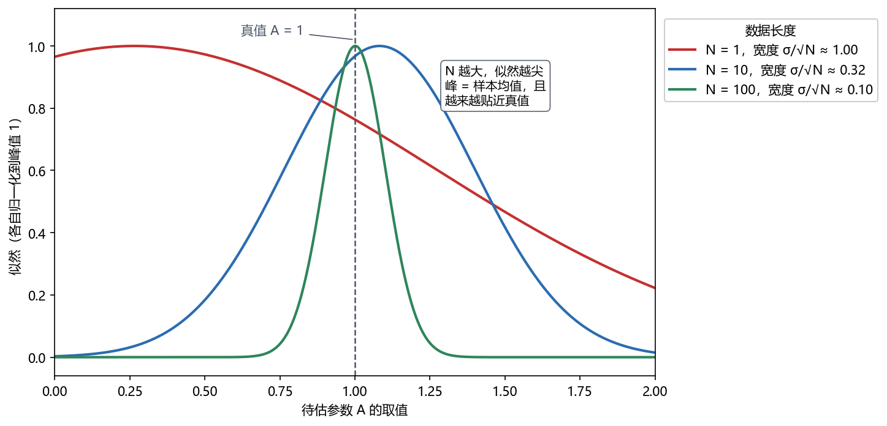
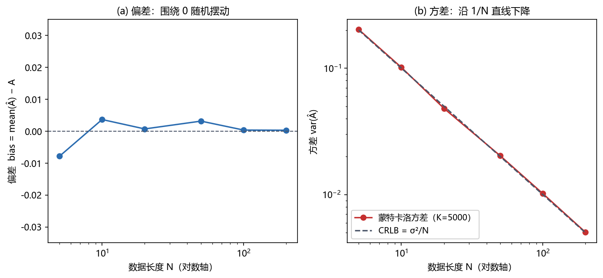
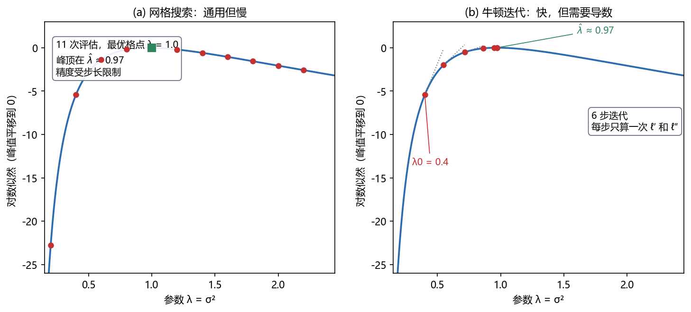

# Vol1 Ch07 最大似然估计：MVU 求不出来时，工程界的默认答案

> 对应原书：第一卷《估计理论》第 7 章（书内第 129~181 页，本扫描 PDF 第 144~196 页）。
> 前置阅读：本系列 `Vol1_Ch01_引言.md`（随机变量观）、原书第 3 章（CRLB）、第 5 章（充分统计量）；本文自包含，涉及的前置概念就地插播。

## 写在前头

这是讲解系列的第 7 篇，也是**整个第一卷的实用主义转折点**。前六章一直在追求"完美"：第 2 章定义最小方差无偏（MVU）估计量，第 3 章给出方差的天花板（CRLB），第 4~6 章给出各种场景下找到 MVU 的工具。但工程现实是：**很多问题里 MVU 要么不存在、要么求不出来**。本章回答的问题就是：求不出 MVU 时怎么办？

Kay 给的答案是最大似然估计（MLE，maximum likelihood estimator），并给它做了一个精准的定位：**MLE 是"转动摇把"式的方法**——几乎不靠巧思，套流程就能求出估计量；对绝大多数实际问题，当数据足够多时，它是渐近最优的（渐近无偏、渐近达到 CRLB、渐近高斯）。正因为这套组合拳，原书断言："几乎所有实用的估计都是基于最大似然原理。"

**本章一句话设计目标：把"猜哪个参数最能解释观测数据"这个朴素直觉，锻造成一套有理论保证、有数值算法、能落地到雷达/声纳/语音的估计方法。**

**实测声明**：本章事实性内容核对自原书扫描件 OCR 文本 `Temp/chapters_ocr/ch07/ocr_page_144~197.txt`（PDF 第 144~197 页，即书内第 129~182 页）；表 7.1 数值经 600 dpi 局部重扫核验；公式编号沿用原书编号（7.1）~（7.70），未编号者为本系列推导补充。Fig002~Fig004 为本系列自建数值实验（脚本 `Temp/scripts/make_fig002.py` 等，随机种子 20260004 与 20260814），实验结论只用于示意，与理论公式相互印证。

---

## 1. 为什么需要 MLE：一个 MVU 走投无路的例子

### 1.1 问题驱动：所有"正规军"手段都失效时，你手里还剩什么？

原书例 7.1 精心构造了一个让读者"碰壁"的问题。观测数据为

$$
x[n] = A + w[n], \qquad n = 0, 1, \ldots, N-1
$$

其中 $A > 0$ 为待估的未知电平（直流分量），$w[n]$ 为**方差等于 $A$** 的白高斯噪声（WGN）。也就是说，同一个参数 $A$ 既是信号均值、又是噪声方差——**你越想知道均值，噪声就越大**。数据 PDF 为（原书式 7.1）

$$
p(\mathbf{x}; A) = \frac{1}{(2\pi A)^{N/2}} \exp\!\left[-\frac{1}{2A}\sum_{n=0}^{N-1}\bigl(x[n] - A\bigr)^2\right]
$$

其中 $\mathbf{x}$ 为 $N$ 点数据矢量，求和项为数据与均值 $A$ 的偏差平方和。

按前几章学过的正规流程走一遍：

1. **查有效估计量是否存在**（第 3 章）：对 $\ln p(\mathbf{x}; A)$ 求导，得到的表达式无法分解成 $I(A)(g(\mathbf{x}) - A)$ 的形式（$I$ 为 Fisher 信息，$g$ 为某个统计量）——**有效估计量不存在**。CRLB 倒是算得出来（原书式 7.2，推导见原书习题 7.1）：

$$
\mathrm{var}(\hat{A}) \ge \frac{A^2}{N(A + \tfrac{1}{2})}
$$

其中 $N$ 为数据长度。**翻译成人话：任何无偏估计量的方差都不可能低于这个数；这个数就是本题的精度天花板。**

2. **试充分统计量路线**（第 5 章）：由 Neyman-Fisher 因子分解定理可证 $T(\mathbf{x}) = \sum_{n=0}^{N-1} x^2[n]$ 是 $A$ 的充分统计量，但下一步要找它的无偏函数——原书算了 $E\bigl[\sum x^2[n]\bigr] = N(A + A^2)$ 之后卡住了：**想不出一个 $T(\mathbf{x})$ 的函数能让期望恒等于 $A$**。用 Rao-Blackwell 思路（取条件期望）去修也无从下手，计算难度太大。

3. **BLUE 路线**（第 6 章）：BLUE 的适用前提是噪声协方差矩阵**已知**（至多差一个已知的比例因子）；本题噪声方差就是待估参数 $A$ 本身，协方差随未知参数而变，标准 BLUE 框架不适用——正规军到此全部折戟。

**于是问题变成：MVU 求不出来，但我们总得给个估计量吧？"凑合但有理有据"的估计量长什么样？** 这正是本章的存在理由。

### 1.2 退一步的智慧：先放弃"有限样本最优"，只要求"数据多了越来越好"

原书例 7.2 提出一个看似随手拍的估计量（式 7.6）：

$$
\hat{A} = \sqrt{\frac{1}{N}\sum_{n=0}^{N-1} x^2[n] + \frac{1}{4}} - \frac{1}{2}
$$

其中根号内第一项为数据的二阶样本矩（平均功率的估计），$+\tfrac{1}{4}$ 和 $-\tfrac{1}{2}$ 是两个精心挑选的修正常数。这个估计量的来历并不神秘：$x[n]$ 的均值是 $A$、方差是 $A$，所以 $E[x^2[n]] = A + A^2$；解方程 $u = A + A^2$ 得 $A = \sqrt{u + \tfrac14} - \tfrac12$，再用样本矩 $\hat{u} = \frac1N\sum x^2[n]$ 替换真矩 $u$——**这就是第 9 章"矩方法"的雏形，但本章的关注点不是它的出身，而是它的品性**。

直接算它的期望会碰到非线性（根号和平方），但可以绕开：**统计线性化**（原书 §3.6 的方法）——把 $\hat{A} = g(\hat{u})$ 在 $\hat{u}$ 的期望值 $u_0 = A + A^2$ 附近做一阶泰勒展开。当 $N$ 很大时，$\hat{u}$ 集中在 $u_0$ 附近，线性化近似成立，于是可得两个结论（推导过程见原书 §7.3，其中用到 $E[x^2] = A + A^2$ 与 $\mathrm{var}(x^2) = 4A^3 + 2A^2$，后者由 §3.6 给出）：

$$
E[\hat{A}] \to A, \qquad \mathrm{var}(\hat{A}) \to \frac{A^2}{N(A + \tfrac{1}{2})}
$$

对比式（7.2）：**极限方差恰好等于 CRLB。** 再进一步，$N$ 大时 $\hat{A}$ 是高斯随机变量 $\hat{u}$ 的线性函数，所以 $\hat{A}$ 自己也渐近高斯。

原书给这两个性质起了名字：满足 $E[\hat{A}] \to A$ 的叫**渐近无偏**；渐近无偏且方差趋近 CRLB 的叫**渐近有效**。例 7.2 的估计量两者皆是。

**一句话总结：MVU 求不出时，退而求"渐近最优"——有限样本上不保证最好，但数据一多，它自动逼近无偏、逼近 CRLB、逼近高斯。** 这是本章全部理论的种子：下一节会看到，MLE 这台机器自动产出这样的估计量。

> **前置概念：渐近记号"$\to$"与"$\xrightarrow{a}$"。** 本文中 $E[\hat{A}] \to A$ 表示"当数据长度 $N \to \infty$ 时，期望趋近 $A$"；符号 $\xrightarrow{a}$ 表示"渐近服从某分布"（$N \to \infty$ 时分布收敛）。渐近性质是对"数据量"取极限得到的理想化描述，**它不告诉你 $N$ 多大才够**——这个坑会在 §4.2 里被原书自己点破。

---

## 2. MLE 是什么：把"哪个参数最能解释数据"写成数学

### 2.1 定义与直觉

标量参数 $\theta$ 的 MLE 定义为：**在 $\theta$ 的允许取值范围内，使 $p(\mathbf{x}; \theta)$ 最大的那个 $\theta$ 值**，记作

$$
\hat{\theta} = \arg\max_{\theta} p(\mathbf{x}; \theta)
$$

其中 $\arg\max$ 表示"取使函数最大的自变量值"，$p(\mathbf{x};\theta)$ 中 $\mathbf{x}$ 固定（已观测到的数据）、$\theta$ 是自变量——此时 $p(\mathbf{x};\theta)$ 换个名字叫**似然函数**：固定数据、视参数为变量。

直觉（原书图 7.1 的原理）：观测到 $\mathbf{x} = \mathbf{x}_o$ 之后，考虑两个候选参数 $\theta_1$ 和 $\theta_2$。数据落在以 $\mathbf{x}_o$ 为中心的小邻域内的概率约为 $p(\mathbf{x}_o; \theta)\,d\mathbf{x}$。如果 $p(\mathbf{x}_o;\theta_1)$ 很大而 $p(\mathbf{x}_o;\theta_2)$ 很小，那么"$\theta_1$ 是真值"时观测到 $\mathbf{x}_o$ 很自然，"$\theta_2$ 是真值"时观测到 $\mathbf{x}_o$ 则是小概率事件——**所以我们宁可信 $\theta_1$。** 类比：刑侦里的"谁最有机会作案"——不是证明谁有罪，而是按"谁能解释现场证据"排序，选解释力最强的那位。

**类比之后补严谨**：MLE 给出的不是一个概率命题（它不声称 $\theta_1$ 是"真值"的概率高——在经典框架里 $\theta$ 根本不是随机变量），而是一个选择规则：固定数据，最大化似然。这一区分是经典与贝叶斯的分水岭（见第 1 篇 §2.3 与第 10 章）。

### 2.2 似然函数"变尖"的演示：数据越多，答案越明显

似然函数对数据的依赖值得先看一眼。取例 7.4 的模型（$x[n] = A + w[n]$，$w[n]$ 为方差 $\sigma^2 = 1$ 的 WGN，真值 $A = 1$），对同一组数据分别只用前 $N = 1$、$10$、$100$ 个点，画出以 $A$ 为自变量的似然曲线（各自归一化到峰值 1），见 Fig002：

*图 Fig002：高斯白噪声中直流电平 $A$ 的似然函数随数据长度 $N$ 变尖（自建实验，种子 20260004，$\sigma=1$，真值 $A=1$）。看三件事：① 每条曲线的峰值位置等于样本均值 $\bar{x}_N$（$N=1$ 时峰在 $0.266$，$N=10$ 时在 $1.082$，$N=100$ 时在 $1.001$）；② 曲线宽度按 $\sigma/\sqrt{N}$ 收缩（$1 \to 0.32 \to 0.1$）；③ 峰值位置随 $N$ 增大越来越贴近真值竖线。结论：数据越多，似然函数越"尖"，最大值的位置越可信——这为第 4 节"方差按 $1/N$ 下降"提供了几何直觉。*

### 2.3 例 7.3：MLE 怎么把 §1 那个难题解出来

回到例 7.1 的模型（噪声方差 $= A$）。固定 $\mathbf{x}$，把式（7.1）看成 $A$ 的函数，取对数（对数单调递增，最大化位置不变）得对数似然：

$$
\ln p(\mathbf{x}; A) = -\frac{N}{2}\ln(2\pi A) - \frac{1}{2A}\sum_{n=0}^{N-1}\bigl(x[n] - A\bigr)^2
$$

其中第一项来自归一化系数（因方差含 $A$，所以这一项不能丢），第二项为偏差平方和除以 $2A$。对 $A$ 求导并令其为零，整理得到一个二次方程（过程见原书 §7.4）：

$$
A^2 + A - \frac{1}{N}\sum_{n=0}^{N-1} x^2[n] = 0
$$

解出并取正根（因为约束 $A > 0$）：

$$
\hat{A} = \sqrt{\frac{1}{N}\sum_{n=0}^{N-1} x^2[n] + \frac{1}{4}} - \frac{1}{2}
$$

**结果正是例 7.2 里那个"随手拍"的估计量。** 这才是本节最值得记住的事：例 7.2 中那个要靠统计线性化辛苦论证"渐近有效"的估计量，MLE 流程一步就吐了出来——**而且原书在 §7.3 已证明它渐近无偏、渐近达到 CRLB、渐近高斯。** 这就是 Kay 说的"转动摇把"：不需要巧思，求导、令零、解方程，渐近最优的估计量就出来了。

### 2.4 例 7.4：有效估计量存在时，MLE 不会错过它

再看教科书最熟悉的场景：$x[n] = A + w[n]$，$w[n]$ 为方差 $\sigma^2$ **已知**的 WGN。对数似然对 $A$ 求导、令零，直接得到

$$
\hat{A} = \frac{1}{N}\sum_{n=0}^{N-1} x[n] = \bar{x}
$$

即样本均值——而样本均值正是这个问题的**有效估计量**（第 3 章例 3.3：方差达到 CRLB 的无偏估计量）。原书由此总结出一条一般性结论（证明思路见原书习题 7.12）：

> **如果有效估计量存在，那么用 MLE 一定能把它求出来。**

**一句话总结：MLE 是一台"下限保底"的机器——有完美解（MVU）时它吐完美解，没有完美解时它吐渐近最优解。**

---

## 3. 变换参数的 MLE：不变性——MLE 最省事的一条性质

### 3.1 问题驱动：想估计的是 $A^2$、$\exp(A)$、功率的 dB 值，怎么办？

工程里真正关心的常常不是原始参数：给 WGN 里的直流电平 $A$，我们可能只要它的功率 $A^2$；给方差 $\sigma^2$，通信工程师要的是 $10\log_{10}\sigma^2$（dB）。按定义重新建模、重新求导、重新解方程？每个变换都来一遍，MLE 的"摇把"就不省力了。**原书 §7.6 的答案是：完全不用重来。**

例 7.8：设 $\alpha = \exp(A)$。把 PDF（7.21）用 $A = \ln\alpha$ 重新参数化，得到以 $\alpha$ 为参数的一族 PDF，对它求最大，结果干净利落：

$$
\hat{\alpha} = \exp(\bar{x}) = \exp(\hat{A})
$$

其中 $\bar{x}$ 为样本均值、$\hat{A}$ 为 $A$ 的 MLE。**先求原参数的 MLE，再把它套进变换函数里，就是变换后参数的 MLE。** 例 7.10 把同一招用到 dB 上：WGN 方差 $\sigma^2$ 的 MLE 是 $\hat{\sigma}^2 = \frac1N\sum x^2[n]$，于是以 dB 计的功率 MLE 为

$$
\hat{P} = 10\log_{10}\!\left(\frac{1}{N}\sum_{n=0}^{N-1} x^2[n]\right)
$$

其中 $P = 10\log_{10}\sigma^2$ 为待估量。一步到位，无需对 dB 函数求导。

### 3.2 非一一变换的坑：修正似然函数

但 $\alpha = A^2$ 这种变换不是一对一的（$A$ 和 $-A$ 都映射到同一个 $\alpha$），直接"套变换"会出问题：原书例 7.9 演示了标准似然函数 $p_T(\mathbf{x};\alpha)$ 在这种情况下**根本没有定义**（一个 $\alpha$ 对应两条不同的 PDF）。解法是定义**修正似然函数**：对每个 $\alpha$，取所有满足 $g(\theta) = \alpha$ 的 $\theta$ 中使 $p(\mathbf{x};\theta)$ 最大的那个值：

$$
\tilde{p}_T(\mathbf{x}; \alpha) = \max_{\{\theta :\, g(\theta) = \alpha\}} p(\mathbf{x}; \theta)
$$

其中 $g$ 为参数变换函数（例 7.9 中 $g(\theta) = \theta^2$）。**翻译成人话：$\alpha$ 值的好坏，按"它手下最好的那个 $\theta$"来打分。** 对这个修正似然求最大，例 7.9 的结果仍是 $\hat{\alpha} = \hat{A}^2$。原书把这个结论总结为定理 7.2（MLE 的不变性）：

$$
\hat{\alpha} = g(\hat{\theta})
$$

其中 $\hat{\theta}$ 为 $\theta$ 的 MLE，$\hat{\alpha}$ 为 $\alpha = g(\theta)$ 的 MLE；若 $g$ 非一一，则 $\hat{\alpha}$ 使修正似然 $\tilde{p}_T$ 最大。

**代价要照实说**：不变性省的是**推导**，不省**风险**。$\hat{\alpha} = g(\hat{\theta})$ 的统计性质（偏差、方差）一般不能由 $\hat{\theta}$ 的性质直接搬运——例 7.9 中 $\hat{A}^2$ 就不是无偏的（$E[\hat{A}^2] = A^2 + \mathrm{var}(\hat{A})$，比真值偏大一个方差）。要看它的性能，还得回到 §3.6 的统计线性化那一套（这正是例 7.2 走过的路）。**不变性给的是"答案"，不是"免费的性能证明"。**

---

## 4. MLE 到底多好：渐近性质、蒙特卡洛、以及它失效的边界

### 4.1 定理 7.1：MLE 的渐近最优性

原书把 §1~2 的观察提炼成整章的核心定理（式 7.11）：

$$
\hat{\theta} \xrightarrow{a} \mathcal{N}\bigl(\theta,\; I^{-1}(\theta)\bigr)
$$

其中 $I(\theta)$ 为 Fisher 信息（在参数真值处计算），$\mathcal{N}(\mu, \sigma^2)$ 表示均值为 $\mu$、方差为 $\sigma^2$ 的高斯分布。**翻译成人话：数据足够多时，MLE 的分布逼近一个以真值为中心、以 CRLB 为方差的高斯——渐近无偏、渐近达到 CRLB、渐近高斯，三者一次给齐。** 这就是"渐近有效 = 渐近最优"的含义。

定理的前提是"正则条件"（原书附录 7B）：对数似然的导数存在、Fisher 信息非零等。**这些条件不是装饰**——§4.3 会展示不满足时定理如何崩塌。

### 4.2 例 7.5：N 到底要多大？——原书的蒙特卡洛实况

定理 7.1 是极限陈述，工程上真正的问题是：**$N$ 多大才算"足够多"？** 原书例 7.5 对例 7.2 的估计量（$\sigma^2 = A$ 模型）做了蒙特卡洛：取 $A = 1$，每个数据长度下产生 $M = 1000$ 个估计量现实，统计均值与方差；对 $N = 20$ 又用 $M = 5000$ 复查（括号内数值）。原书表 7.1 的数据转录如下：

| 数据长度 $N$ | 均值 $E[\hat{A}]$ | $N \cdot \mathrm{var}(\hat{A})$ |
|:---:|:---:|:---:|
| 5 | 0.954 | 0.624 |
| 10 | 0.976 | 0.648 |
| 15 | 0.991 | 0.696 |
| 20 | 0.996（0.987） | 0.707（0.669） |
| 25 | 0.994 | 0.656 |
| 理论渐近值 | 1 | 0.667 |

（表 7.1 转写自原书，经 600 dpi 局部重扫核对；$N \cdot \mathrm{var}$ 形式是因为渐近方差 $\propto 1/N$，乘 $N$ 后应趋于常数 $A^2/(A+\tfrac12) = 0.667$，便于看收敛。括号值为 $M=5000$ 的复查结果。）

从表里能读出三条经验：① **均值在 $N \approx 20$ 附近收敛到 1**；② **标准化方差围绕 0.667 跳动**——跳动本身是模拟的统计起伏（甚至可能混有随机数生成器的瑕疵），不是算法问题；③ 括号复查值（0.669）几乎贴在理论值上，说明**把现实数从 1000 加到 5000，方差估计立刻安稳**。原书随后画了 $N=5$ 与 $N=20$ 的直方图对比理论渐近 PDF（原书图 7.2）：$N=5$ 时直方图明显左偏（对应表中均值 0.954 偏小），$N=20$ 时已与理论曲线吻合良好。

**本节埋一个伏笔**：蒙特卡洛的均值/方差公式（7.9）（7.10）与直方图工具，原书在附录 7A 里连 Fortran 程序都给全了——**模拟只能给洞察、不能给证明**这条第 1 章立下的规矩，在这里被原书自己践行：表 7.1 是"印证"，定理 7.1 才是"证明"。

我们用自建实验把同一套流程跑在更干净的模型上（例 7.4：$\sigma^2$ 已知，MLE = 样本均值），结果见 Fig003：

*图 Fig003：MLE（样本均值）渐近性能的蒙特卡洛验证（自建实验，真值 $A=1$、$\sigma^2=1$，每个 $N$ 做 $K=5000$ 次独立实验，种子 20260814）。左图：偏差 $\mathrm{bias} = E[\hat{A}] - A$ 随 $N$ 在半对数轴上围绕 0 随机摆动（最大幅度约 0.008，随 $K$ 增大还会更小）——印证渐近无偏；右图：方差沿 $1/N$ 直线下降，数据点与理论 CRLB $\sigma^2/N$ 重合——印证渐近有效。结论：定理 7.1 的三项承诺（无偏、达 CRLB、高斯）前两项在此模型上任何 $N$ 都严格成立（样本均值本来就是有限样本有效），蒙特卡洛只是用数据把理论曲线"描"了出来。*

### 4.3 门限效应与失效边界：定理 7.1 不是无条件成立的

**（1）门限效应：低 SNR 时渐近性质要价更高。** 原书例 7.6 估计噪声中正弦信号的相位（$x[n] = A\cos(2\pi f_0 n + \phi) + w[n]$，$A$、$f_0$ 已知，$\phi$ 待估），导出近似 MLE（式 7.17）：

$$
\hat{\phi} = -\arctan\!\left(\frac{\sum_{n=0}^{N-1} x[n]\sin(2\pi f_0 n)}{\sum_{n=0}^{N-1} x[n]\cos(2\pi f_0 n)}\right)
$$

其中 $f_0$ 为已知频率。这个估计量的 Fisher 信息 $I(\phi) = NA^2/(2\sigma^2)$，定义 SNR 为 $\eta = (A^2/2)/\sigma^2$，则渐近方差 $\mathrm{var}(\hat{\phi}) \to 2\sigma^2/(NA^2) = 1/(N\eta)$。原书表 7.2 的模拟（$A=1$，$f_0 = 0.08$，$\phi = \pi/4 \approx 0.785$，$\sigma^2 = 0.05$）显示：**$N = 80$ 时均值和方差才到达渐近值**（均值 0.789 vs 理论 0.785，$N\!\cdot\!\mathrm{var}$ 为 0.0990 vs 理论 0.1），$N$ 较小时偏差很大——部分原因正是导出（7.17）时用到的近似（7.15）在小 $N$ 下不成立。更值得警惕的是原书图 7.3/7.4：固定 $N=80$ 改变 SNR，**均值大约在 SNR > −10 dB 才收敛到渐近值，方差在低 SNR 时明显高于 CRLB**。原因见图 7.5 的对数似然现实：低 SNR 时噪声会拱出一些比真值附近还高的假峰，MLE 一旦选中假峰，误差就不是"小抖动"而是"大翻车"——原书称之为**野值（outlier）**，并指出**非线性估计几乎总是表现出这种门限效应**。

**（2）正则条件失效：MLE 可以彻底不是渐近高斯。** 原书例 7.7 的反例更狠：$x[n] = A + w[n]$，噪声 $w[n]$ 的 PDF 对称、在 0 处最大，但**所有噪声样本完全相等**（$w[0] = w[1] = \cdots = w[N-1]$，非独立）。此时 MLE 退化为一目了然的形式

$$
\hat{A} = x[0]
$$

期望为 $A$（对称性），但方差恒等于噪声方差——**与 $N$ 无关，数据再加长误差也不减小**；PDF 是噪声 PDF 的平移，**非高斯**；$N \to \infty$ 时甚至**不是一致估计**。原书的解释一针见血：**估计量里没有"平均"这一项**（所有样本是同一个随机数，平均无效），支撑渐近高斯性的中心极限定理根本派不上用场。§6.3 的例 7.13 会给出第二个同因反例。

**一句话总结：MLE 的渐近最优性是一份"有条件合同"——正则条件 + 足够数据 +（对非线性估计）足够 SNR，三者缺一，定理就可能失效；好在这份合同覆盖了绝大多数实用场景。**

---

## 5. 闭式解不存在时：MLE 的数值求法

### 5.1 问题驱动：$\hat{\theta}$ 解不出来怎么办？

前几节的 MLE 都有闭式解，是因为似然函数乖。工程里常见的是：求导令零得到一个**非线性方程，解不出解析形式**。原书 §7.7 开头给了一个定心丸：**MLE 的一个独特优点是，对给定数据集，它总是能在数值上求出来**——因为似然是已知函数，求最大值总有数值手段。手段分两族，见下。

### 5.2 网格搜索：最笨、最稳、最诚实的办法

若参数范围是有限区间 $[\theta_a, \theta_b]$，最"安全"的方法是在区间上铺等间隔格点，逐个算似然，取最大者（原书图 7.8）。**代价与收益一目了然：精度受步长限制（最优格点离真峰顶最多半个步长），但保证不跑飞、不吃初始值**；缺点是参数范围无限时（如方差 $\sigma^2 \ge 0$）不可行，而且每来一组新数据都得重新搜一遍。

### 5.3 Newton-Raphson 与得分法：快，但各有各的脾气

迭代法的通用思路：求 $\partial \ln p(\mathbf{x};\theta)/\partial \theta = 0$ 的根。Newton-Raphson 迭代（式 7.29）为

$$
\theta_{k+1} = \theta_k - \left[\frac{\partial^2 \ln p(\mathbf{x}; \theta)}{\partial \theta^2}\right]^{-1} \frac{\partial \ln p(\mathbf{x}; \theta)}{\partial \theta}\Bigg|_{\theta = \theta_k}
$$

其中 $\theta_k$ 为第 $k$ 次迭代值，方括号为对数似然的二阶导数（曲率），分式为对数似然的斜率除以曲率。**翻译成人话：每一步沿着"切线指向横轴交点"的方向跨一步——曲率大（峰尖）跨小步，曲率小（峰平）跨大步。** 原书列了两条必须记住的注意事项：① 二阶导数很小时修正项会剧烈震荡，**迭代可能不收敛**；② 即使收敛，落点可能是**局部极值甚至极小值**——**建议多起始点，取收敛后似然最大者**。

得分法（式 7.33）把二阶导数换成它的期望的负值（即 $-I(\theta)$，Fisher 信息）：

$$
\theta_{k+1} = \theta_k + I^{-1}(\theta_k)\, \frac{\partial \ln p(\mathbf{x}; \theta)}{\partial \theta}\Bigg|_{\theta = \theta_k}
$$

其中 $I(\theta_k)$ 为 Fisher 信息在 $\theta_k$ 处的值。依据是：对 IID 样本，$-\frac1N \frac{\partial^2 \ln p}{\partial\theta^2}$ 依大数定律趋近 $I(\theta)$——**用"平均曲率"代替"当次曲率"，通常更稳**，但收敛问题与 Newton-Raphson 同源。

原书例 7.11 的实况最能说明两种脾气：观测 $x[n] = r^n + w[n]$（$r > 0$ 待估，$w[n]$ 为方差 $\sigma^2$ 的 WGN），取 $N = 50$、真值 $r = 0.5$、$\sigma^2 = 0.01$。真实 MLE 出现在 $\hat{r} = 0.493$（原书图 7.10）。用 Newton-Raphson 从不同起点出发，结果如下（原书表 7.3 转录）：

| 起始值 $r_0$ | 迭代过程 | 结果 |
|:---:|:---|:---:|
| 0.8 | 0.723 → 0.638 → 0.561 → 0.510 → 0.494 → 0.493 | 6 步收敛 |
| 0.2 | 0.799 → 0.722 → 0.637 → 0.560 → 0.510 → 0.494 → 0.493 | 7 步收敛 |
| 1.2 | 1.187 → 1.174 → … → 1.074 → … | 29 步才收敛 |
| < 0.18 或 > 1.2 | 迭代越过 1 并继续增大 | **计算机溢出，不收敛** |

**这张表就是 Newton-Raphson 的脾气全貌：起点靠近 MLE 时又快又好，起点远了慢如蜗牛甚至翻车。** 所以工程实践的顺序是：**先网格粗搜定起点，再迭代精修**——两种方法不是二选一，是配合。

自建实验 Fig004 把网格搜索与 Newton 迭代放在同一个问题上对比（估计高斯数据的方差 $\lambda = \sigma^2$，其对数似然不是抛物线，需要真迭代）：

*图 Fig004：MLE 数值确定的两种路线对比（自建实验：$N=20$ 个零均值高斯样本，参数 $\lambda = \sigma^2$，似然峰值平移到 0，真 MLE $\hat{\lambda} = 0.972$，种子 20260814）。左图：网格搜索在 $[0.2, 2.2]$ 上步长 0.2 共 11 次评估，最优格点 1.0，离峰顶 0.972 还差约 0.03——精度被步长锁死；右图：牛顿迭代从 $\lambda_0 = 0.4$ 出发，虚线为前三条切线，切线与横轴交点即下一步取值（0.4 → 0.548 → 0.715 → 0.864 → 0.951 → 0.971 → 0.972），6 步内逼近峰顶。结论：网格搜索通用但精度受步长限制；牛顿迭代快，但每步需要导数，且远离峰值时可能不收敛（对比原书表 7.3）。*

### 5.4 EM 算法：第三种路线的预告

原书还介绍了 EM（expectation-maximization）算法（Dempster, Laird, Rubin 1977）：在"完备数据"的似然好求、但完备数据不可得时，用**条件期望**构造代理似然，两步循环——E 步求完备数据对数似然的条件期望（式 7.56），M 步最大化之（式 7.57）。它的优点很实在：**每步迭代保证似然不减，至少收敛到局部极大**；代价是：需要设计"完备数据"的分解（不唯一，考验设计者灵巧），且不保证全局最优。原书用多正弦频率估计展示了 E/M 步的显式形式（式 7.58/7.59）。本系列在 §6.5 与第 8 章还会再见它。

---

## 6. 矢量参数：把标量结论搬到高维，并看清"渐近"的又一层边界

### 6.1 问题驱动：要估的参数不止一个时，前面的结论还剩多少？

工程问题几乎全是矢量参数：直流电平 $+$ 噪声方差、正弦信号的幅度 $+$ 频率 $+$ 相位、LPC 的一串系数……原书 §7.8 的回答是：**定义、求法、渐近性质、不变性全部照搬，只是把"标量求导"换成"梯度"，把 Fisher 信息换成 Fisher 信息矩阵。**

矢量 MLE 定义为在允许范围内使 $p(\mathbf{x};\boldsymbol{\theta})$ 最大的 $\boldsymbol{\theta}$，若似然可导，则由梯度方程求（式 7.35）：

$$
\frac{\partial \ln p(\mathbf{x}; \boldsymbol{\theta})}{\partial \boldsymbol{\theta}} = \mathbf{0}
$$

其中 $\boldsymbol{\theta}$ 为 $p \times 1$ 参数矢量。**多解时取使似然最大者**——这一条是矢量化后新增的纪律。

### 6.2 例 7.12：直流电平与噪声方差联合估计

数据 $x[n] = A + w[n]$，$w[n]$ 为方差 $\sigma^2$ 的 WGN，$\boldsymbol{\theta} = [A, \sigma^2]^T$ 两者都未知。联立两个偏导方程解得

$$
\hat{A} = \bar{x}, \qquad \hat{\sigma}^2 = \frac{1}{N}\sum_{n=0}^{N-1}\bigl(x[n] - \bar{x}\bigr)^2
$$

其中 $\bar{x}$ 为样本均值。**注意方差的 MLE 用的是 $1/N$ 归一化，不是无偏估计惯用的 $1/(N-1)$**——这是个有偏估计量（$E[\hat{\sigma}^2] = \frac{N-1}{N}\sigma^2$），偏置随 $N \to \infty$ 消失。**MLE 优先保证渐近最优，不为有限样本无偏性让步**——这条代价在"实现备忘"里还要再算一笔账。

### 6.3 定理 7.3 与两个"渐近失效"的反例

矢量版渐近定理（式 7.36）：

$$
\hat{\boldsymbol{\theta}} \xrightarrow{a} \mathcal{N}\bigl(\boldsymbol{\theta},\; \mathbf{I}^{-1}(\boldsymbol{\theta})\bigr)
$$

其中 $\mathbf{I}(\boldsymbol{\theta})$ 为 $p \times p$ Fisher 信息矩阵（在真值处计算）。对例 7.12，原书给出精确分布作佐证：$\hat{A} \sim \mathcal{N}(A, \sigma^2/N)$，且 $\sum(x[n]-\bar{x})^2/\sigma^2 \sim \chi^2_{N-1}$（卡方分布，自由度 $N-1$），二者独立；$N$ 大时由中心极限定理 $\chi^2_N \xrightarrow{a} \mathcal{N}(N, 2N)$，代入即得（7.36）的形式。**有精确分布时，渐近分布只是它的极限影子——这个例子展示了"渐近"如何从精确分布中浮现。**

但矢量版同样有失效边界，且机理更直观。原书例 7.13：噪声为 IID 拉普拉斯分布，而**待估参数就是 $N$ 个信号样本本身** $\mathbf{s} = [s[0], \ldots, s[N-1]]^T$。MLE 是 $\hat{s}[n] = x[n]$——参数个数与数据点数一样多，**估计量里没有任何平均**，所以即使 $N \to \infty$，MLE 的 PDF 仍是拉普拉斯（非高斯），（7.36）不成立。**与例 7.7 同一个病灶：渐近高斯性的燃料是"平均"，把燃料抽掉，定理就熄火。**

### 6.4 线性模型：MLE 的"有限样本即最优"专场

一般高斯情形（均值与协方差都含参数）的得分方程是（7.40），大多数时候没有闭式解。但有一个重量级例外——第 4 章的**线性模型**：

$$
\mathbf{x} = \mathbf{H}\boldsymbol{\theta} + \mathbf{w}
$$

其中 $\mathbf{H}$ 为已知 $N \times p$ 满秩矩阵，$\mathbf{w} \sim \mathcal{N}(\mathbf{0}, \mathbf{C})$（$\mathbf{C}$ 为已知噪声协方差矩阵）。MLE 等价于最小化二次型 $J(\boldsymbol{\theta}) = (\mathbf{x} - \mathbf{H}\boldsymbol{\theta})^T \mathbf{C}^{-1}(\mathbf{x} - \mathbf{H}\boldsymbol{\theta})$，解得（式 7.46，定理 7.5）：

$$
\hat{\boldsymbol{\theta}} = \bigl(\mathbf{H}^T \mathbf{C}^{-1} \mathbf{H}\bigr)^{-1} \mathbf{H}^T \mathbf{C}^{-1} \mathbf{x}
$$

这正是第 4 章证明过的 **MVU 估计量**：有限样本即无偏、即达到 CRLB，PDF 精确高斯。**这是 MLE 全书最漂亮的一场：在线性模型上，"渐近最优"提前兑现为"有限样本最优"。**（顺带一提：这个式子与第 8 章最小二乘的加权形式同形——MLE 和 LS 在高斯线性模型上殊途同归，代价差异在概率假设上，详见第 8 篇。）

### 6.5 矢量数值方法与渐近似然：两条降本路线

矢量版 Newton-Raphson（7.48）与得分法（7.50）形式上照搬标量版，但**实现时不要求 Hessian 的逆**——改写为（7.49）解一个 $p$ 元线性方程组即可，原书特意提醒这一点。EM 算法在矢量场合的典型用例是**多正弦频率估计**（式 7.51~7.59）：把混在一起的 $p$ 个正弦拆成 $p$ 份"完备数据"，$p$ 维最小化就拆成 $p$ 个一维最小化——**EM 的价值在于把大问题分解成好解的小问题**（算法细节与 E/M 步显式见原书 §7.8 及附录 7C）。

另一个降本武器是 §7.9 的**渐近 MLE**：对零均值 WSS 高斯过程，精确似然需要反复求 $N \times N$ Toeplitz 协方差矩阵的逆，代价是 $O(N^3)$ 级别；而渐近对数似然（式 7.60，由附录 3D 证明）把问题搬进频域：

$$
\ln p(\mathbf{x}; \boldsymbol{\theta}) \approx -\frac{N}{2}\ln 2\pi - \frac{N}{2}\int_{-1/2}^{1/2}\left[\ln P_{xx}(f) + \frac{I(f)}{P_{xx}(f)}\right] df
$$

其中 $I(f)$ 为数据的周期图，$P_{xx}(f)$ 为过程的功率谱密度（PSD，含参数 $\boldsymbol{\theta}$）。**翻译成人话：与其在时域和 $N \times N$ 矩阵搏斗，不如在频域把数据的周期图和模型的 PSD 逐频率比一比。** 例 7.14（MA(2) 过程）用它把参数估计化成了对零点 $z_1, z_2$ 的网格搜索。这个"频域渐近似然"的思想在第 8 章之后的多处还会回响，本系列第 15 篇（复数据）会再见它的复形式。

---

## 7. 信号处理落地四例：MLE 就是这些经典结构的"统一解释"

§7.10 是本章的收账时刻：第 1 章埋下的三个系统（雷达、声纳、语音）加上正弦参数估计，全部在这里用 MLE 结清。读法：每个例子先认"结构"，再看"结构从哪来"。

**例 7.15 雷达时延 → 相关器（匹配滤波的雏形）。** 回波时延 $n_0$（离散化后，连续时延 $\tau_0 = n_0\Delta$，$\Delta$ 为采样间隔）的 MLE 由最大化

$$
\sum_{n=n_0}^{n_0+M-1} x[n]\, s[n - n_0]
$$

其中 $x[n]$ 为接收数据、$s[n]$ 为已知发射脉冲波形、$M$ 为脉冲长度。**把数据与"假设时延对应的回波模板"做互相关，相关最大的时延就是 MLE。** 再由不变性（定理 7.2），距离的 MLE 直接是 $\hat{R} = (c\Delta/2)\,\hat{n}_0$。**这解释了为什么雷达接收机里永远有一级"匹配滤波"——它不是哪个工程师的灵光一现，而是高斯噪声假设下最大似然的必然产物**（匹配滤波器作为检测器最优的完整论证在第二卷第 4 章）。

**例 7.16 正弦三参数 → 周期图峰值。** 幅度 $A$、频率 $f_0$、相位 $\phi$ 全部未知时，先用变量替换 $\alpha_1 = A\cos\phi$、$\alpha_2 = -A\sin\phi$ 把问题化成线性模型（固定 $f_0$ 时），消去 $\alpha_1, \alpha_2$ 后，频率的 MLE 是使周期图（式 7.66）

$$
I(f) = \frac{1}{N}\left|\sum_{n=0}^{N-1} x[n]\, e^{-j2\pi f n}\right|^2
$$

最大的 $f$（$f_0$ 不在 0 或 1/2 附近时近似成立）；幅相随之由 DFT 系数给出：$\hat{A} = \frac{2}{N}\bigl|\sum x[n]e^{-j2\pi\hat{f}_0 n}\bigr|$、$\hat{\phi} = -\arctan\bigl(\sum x\sin / \sum x\cos\bigr)$。**翻译成人话：找正弦 = 找频谱最高峰——FFT 工程里最熟的那张图，就是 MLE 的化身。**

**例 7.17 声纳方位 → 波束形成。** 空间频率 $f_s = (F_0 d / c)\cos\beta$（其中 $F_0$ 为已知时间频率、$d$ 为阵元间距、$c$ 为水中声速），估计出 $\hat{f}_s$ 后由不变性直接得 $\hat{\beta} = \arccos\bigl(c\hat{f}_s/(F_0 d)\bigr)$；而 $\hat{f}_s$ 的求法是在 $M$ 个阵元上做空间周期图（式 7.67 的阵元版）——**这就是阵列处理里的"波束形成扫描"**。第 1 章声纳例的 $\beta = \arccos(c\tau_0/d)$ 与这里的公式是同一个几何的两个写法（时延口径 vs 空间频率口径），在本章合流。

**例 7.18 AR 参数 → Yule-Walker 方程。** AR(p) 过程的 PSD 为 $P_{xx}(f) = \sigma_u^2/|A(f)|^2$（$A(f) = 1 + \sum_{k=1}^{p} a[k]e^{-j2\pi fk}$，$\sigma_u^2$ 为驱动白噪声方差）。把（7.60）的渐近似然最大化，等价于最小化 $\int |A(f)|^2 I(f)\,df$，令导数归零整理得到**估计的 Yule-Walker 方程组**（式 7.69）：

$$
\sum_{l=1}^{p} \hat{a}[l]\, \hat{r}_{xx}[k - l] = -\hat{r}_{xx}[k], \qquad k = 1, 2, \ldots, p
$$

其中 $\hat{r}_{xx}[k] = \frac1N\sum_{n=0}^{N-|k|-1} x[n]x[n+|k|]$ 为估计的自相关函数。**这就是语音 LPC 分析里的自相关法**——第 1 章那个"用 LPC 谱包络识别元音"的方案，至此从"工程惯例"升级为"高斯假设下 AR 参数的近似 MLE"。矩阵的特殊 Toeplitz 结构可用 **Levinson 递推**快速求解，驱动方差的最优值由（7.70）给出。**代价照实说**：这是"渐近似然 + 估计 ACF"的近似 MLE，不是精确 MLE；精确 MLE 需要对非线性方程组做迭代求解（渐近似然只是把每一步的代价从 $O(N^3)$ 矩阵求逆压成了频域积分）。

下表把四个例子的"工程结构 ↔ MLE 来源"并排收拢：

| 原书例子 | 待估参数 | MLE 的计算形式 | 对应工程结构 | 与第 1 章的关系 |
|---------|---------|--------------|------------|---------------|
| 例 7.15 | 时延 $n_0$ | 最大化互相关 $\sum x[n]s[n-n_0]$ | 相关器/匹配滤波 | 雷达测距的兑现 |
| 例 7.16 | $A, f_0, \phi$ | 最大化周期图 $I(f)$ | FFT 峰值搜索 | 正弦估计的通用解 |
| 例 7.17 | 方位 $\beta$ | 空间周期图 + 不变性 | 波束形成 | 声纳测向的兑现 |
| 例 7.18 | AR 系数 $a[k]$ | 渐近似然 → Yule-Walker | LPC 自相关法 + Levinson | 语音谱包络的兑现 |

**一句话总结：匹配滤波、周期图峰值、波束形成、LPC——四个信号处理课本上的"标准结构"，在 MLE 的视角下是同一台机器在四种模型上的输出。**

---

## 8. 关键设计决策回顾

把本章散落的"为什么"收拢。每个决策都是一个真实岔路口：

| # | 决策 | 为什么这么选 | 换一个选择会怎样 |
|---|------|------------|----------------|
| 1 | MVU 求不出时，**不硬凑、改用渐近最优** | 例 7.1 证明正规军（有效估计、充分统计量）确实走不通；渐近最优在 $N \to \infty$ 时有严格保证（定理 7.1） | 硬凑"无偏 + 最小方差"只能得到无法实现的估计量，工程上无解可交付 |
| 2 | 用**似然最大化**作为统一原则，而非逐题设计 | "哪个参数最能解释数据"是所有问题的公共直觉；一套流程（求导→令零→解方程）通吃 | 逐题设计相当于回到第 5 章的巧思路线，每换一个模型就要重想一遍 |
| 3 | 把**不变性**（定理 7.2）立为正式性质 | 工程上关心的量（功率、dB、距离）几乎都是参数的函数；不变性免去重复推导 | 每个变换重推导一遍，MLE 的"摇把"优势消失，且容易在非一一变换上出错（例 7.9） |
| 4 | 数值求解时**网格搜索优先、迭代兜底** | 网格搜索保证收敛、不吃初始值，代价只是精度受步长限制；迭代快但可能发散（表 7.3） | 上来就用 Newton-Raphson，起点不当则 29 步慢爬甚至溢出（原书实况） |
| 5 | 方差 MLE 用 **$1/N$ 归一化**（有偏） | MLE 的定义就是最大化似然，最大化给出的就是 $1/N$；无偏性让位于渐近最优 | 换成 $1/(N-1)$ 就不是 MLE（也失去"有效估计量存在时必由 MLE 求出"的对齐性） |
| 6 | 高斯 WSS 数据用**频域渐近似然**（7.60） | 避开 $N \times N$ Toeplitz 矩阵求逆，把高维问题化成逐频率积分 | 精确似然在长数据上算不起，MLE 沦为纸面方法（例 7.14 的动机） |

## 9. 实现备忘（复现与移植时的坑）

1. **$\hat{\sigma}^2$ 的 $1/N$ 口径**：例 7.12 的方差 MLE 是有偏的（偏置 $-1/N$ 量级）。若下游代码按无偏口径（$1/(N-1)$）实现，会与"这是 MLE"的说法对不上账。**两者都是常用口径，但引用方差数值时必须写明归一化。**
2. **Newton-Raphson 初始值敏感**：原书表 7.3 实况——起点 $<0.18$ 或 $>1.2$ 直接溢出。实现时要么先网格粗搜定起点，要么做参数范围钳制；**别信"迭代总会收敛"的教科书印象。**
3. **渐近性不附赠 $N$ 的取值指南**：定理 7.1 是极限陈述。原书例 7.5 里 $N=5$ 的均值还差 4.6%；例 7.6 要 $N=80$ 才收敛。**凡是引用渐近性质评估有限样本性能的地方，必须做蒙特卡洛验证（原书附录 7A 有全套工具）。**
4. **正则条件清单**（失效案例对照）：对数似然可导（例 7.7 的反例在于非独立导致无平均）、Fisher 信息非零且有限、参数个数远小于数据点数（例 7.13）。**任何一个不满足，先检查"平均"是否还存在，再谈渐近。**
5. **近似 MLE 的代价**：例 7.6 的（7.17）与例 7.16 的周期图峰值都建立在 $f_0$ 不在 0 或 1/2 附近、$N$ 足够大的近似（7.15）上——**小 $N$ 或频率贴近 0/1/2 时它们不是 MLE**，原书表 7.2 的早期偏差部分源自此。精确 MLE 需要回到（7.13）的最小化。
6. **页码映射**：本章原书页码 129~181 对应 PDF 页码 144~196（**书内页码 = PDF 页码 − 15**，与第 1 篇的约定一致）；表 7.1~7.3 分别位于 PDF 150、154、164 页。

## 10. 局限（坦率交代，并预告后续）

1. **门限效应是结构性的，MLE 治不了**：低 SNR 下假峰导致的野值让方差飙升（图 7.4），这是非线性估计的通病。后续的贝叶斯路线（第 11 章 MMSE/MAP）用先验压制野值，才在低 SNR 区夺回性能——**这是贝叶斯方法存在的最强工程理由之一，第 11 篇兑现。**
2. **局部极值与收敛性没有全局保证**：Newton-Raphson、得分法、EM 都只保证"局部"，EM 每步似然不减但同样可能停在局部极大。原书也明说"不能保证收敛到 MLE"。
3. **$N$ 多大才够没有解析答案**：只能靠蒙特卡洛个案验证（例 7.5、7.6 的做法）。这不是本章的漏洞，而是渐近理论的天性。
4. **概率模型错了，MLE 全盘皆错**：MLE 完全建立在对 $p(\mathbf{x};\theta)$ 的假设上；模型偏差直接转化为估计偏差（第 1 篇 §2.2 预警过的代价在这里兑现）。不需要概率假设的替代品是第 8 章最小二乘——**性能上不最优，但模型假设少得多，下一章就是它的专场。**
5. **精确 MLE 的算力账单**：一般高斯模型（7.40）无闭式解，精确似然的协方差求逆是 $O(N^3)$；渐近似然（7.60）把这笔账压成频域积分，但牺牲了有限样本最优性。**算力与精度的这笔交易，在第 12 篇（维纳滤波）和第 13 篇（卡尔曼滤波）会以"递推"的形式再次出现。**

---

## 11. 建议自测的问题

1. 用你自己的话解释"渐近有效"的三个组成部分，并各举一个本章的例子（提示：§1.2、§4.1）。
2. 原书习题 7.2 的简化版：对例 7.1 的模型，样本均值 $\bar{x}$ 的方差是多少？与 CRLB（7.2）比是大是小？$N \to \infty$ 时如何？
3. 为什么例 7.7 的 MLE（$\hat{A} = x[0]$）不满足定理 7.1？它违反了哪条正则条件？
4. 对例 7.11 的信号模型，如果你只能用 10 次似然评估，你会怎么分配网格搜索与牛顿迭代？（提示：结合 §5.2~5.3 的代价对比。）
5. 原书习题 7.21：从 $\mathcal{N}(A, \sigma^2)$ 观测 $N$ 个 IID 样本，$A$、$\sigma^2$ 皆未知，求 SNR $\alpha = A/\sigma^2$ 的 MLE（提示：先求矢量 MLE，再套不变性）。

---

**一句话收尾：MLE 把"哪个参数最能解释数据"这个朴素直觉锻造成了工程上最通用的估计机器——有闭式解给闭式解，没闭式解给数值解，数据一多自动逼近最优；它唯一的要求，是你要敢对数据下概率假设。**

*实测核对声明：本章内容核对自原书扫描件 OCR 文本 `Document/统计信号处理/Temp/chapters_ocr/ch07/ocr_page_144~197.txt`（PDF 第 144~197 页）；表 7.1 数值经 600 dpi 局部重扫核验（`Temp/chapters_ocr/ch07/p150_table2.png`），表 7.2/7.3 转录自 PDF 154/164 页 OCR；公式编号（7.1）~（7.70）与原书一致。Fig002/003/004 由 `Temp/scripts/make_fig002.py`、`make_fig003.py`、`make_fig004.py` 生成（种子 20260004 / 20260814），均经 `plotutil.check_figure` 程序化碰撞检测通过。*
