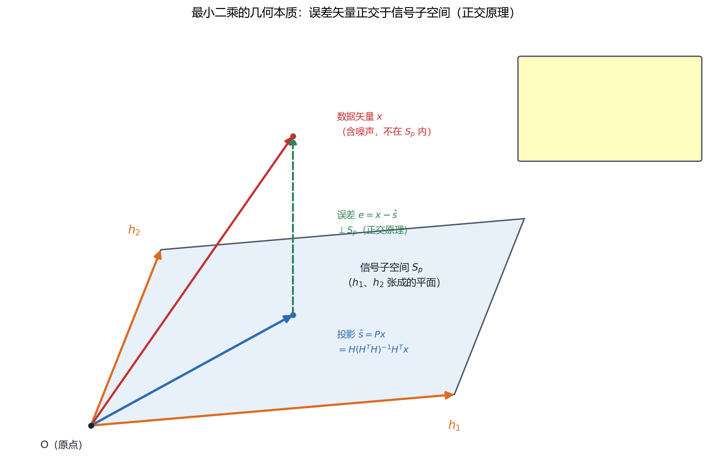
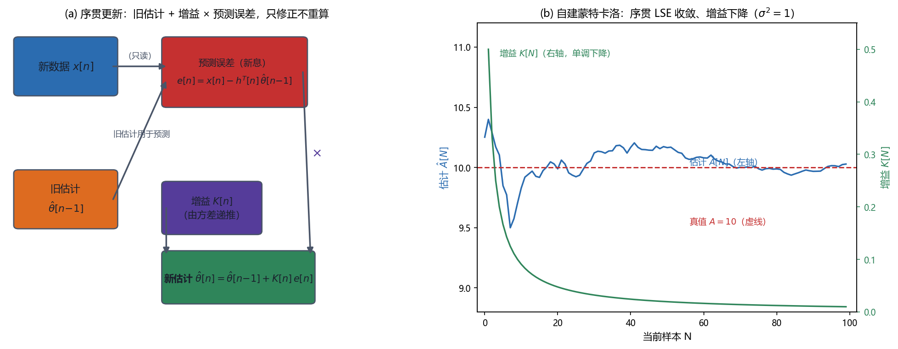

# Vol1 Ch08 最小二乘估计：不要概率假设、性能不最优但永远可用的估计法

> 对应原书：第一卷《估计理论》第 8 章（书内第 182~237 页，本扫描 PDF 第 197~252 页，全书最长章之一）。
> 前置阅读：本系列 `Vol1_Ch07_最大似然估计.md`（§6.4 埋的"与 LS 同形"伏笔）、原书第 4 章（线性模型）、第 6 章（BLUE）；本文自包含，涉及的前置概念就地插播。

## 写在前头

这是讲解系列的第 8 篇，也是**第一卷的一个"世界观转折点"**。前面七章——MVU（第 2 章）、CRLB（第 3 章）、线性模型的 MVU（第 4 章）、充分统计量（第 5 章）、BLUE（第 6 章）、MLE（第 7 章）——**全部建立在一个公共前提上：你必须给数据配一个概率模型（PDF）**。MVU 要按 PDF 求期望、CRLB 要按 PDF 求 Fisher 信息、MLE 干脆就是最大化 PDF。第 1 篇在 §2.1 就问过"为什么不直接解方程、非要引入概率"，当时的回答是"噪声本质随机，必须用概率描述"——这句话没有错，但工程上有一个它回答不了的下一个追问：**如果我对噪声一无所知，连它的 PDF 都写不出来，怎么办？**

本章给出的答案是最小二乘估计（LS，least squares）：**不需要任何概率假设，只需要一个信号模型 $s[n;\theta]$，选 $\theta$ 使数据与模型的平方误差最小。** 原书把它的来历追溯到 **1795 年高斯用它研究行星运动**——这正是第 1 篇 §1.2 埋下的伏笔"1795 年高斯用最小二乘数据分析方法预测行星运动（第 8 章正式登场）"，本章兑现。

用一句话概括本章的设计目标：**在"没有概率模型"这个最贫瘠的条件下，用"最小平方误差"这一条几乎不需要理由的准则，造出一台永远能转、极易实现的估计机器——代价是它不最优、性能无法评价。** 原书 §8.1 的原话定位："其突出特点是对观测数据没有做任何概率假设，只需假设一个信号模型……其优点在于这种方法的应用范围更加广泛。其不足在于它不是最佳的；而且，如果没有对数据的概率结构做某些特定的假设，那么统计性能是无法评价的。"

**实测声明**：本章事实性内容核对自原书扫描件 OCR 文本 `Temp/chapters_ocr/ch08/ocr_page_197~252.txt`（PDF 第 197~252 页，即书内第 182~237 页）；公式编号沿用原书（8.1）~（8.66），未编号者为本系列推导补充。Fig011/Fig012 为本系列自建示意图与数值实验（脚本 `Temp/scripts/make_fig011.py`、`make_fig012.py`，种子 20260815），实验只用于示意，与理论公式相互印证。

---

## 1. 为什么需要一种"不要概率假设"的估计法

### 1.1 问题驱动：前七章的公共前提，什么时候会塌掉？

前七章的全部工具都假设手里有 $p(\mathbf{x};\theta)$。但原书 §8.3 一开头就点破这个前提的三个真实失效场景：

1. **数据的精确统计特性未知**——工程上常常只知道"有个噪声在捣乱"，却说不出它是高斯、拉普拉斯还是别的；
2. **最佳估计量根本求不到**——即使 PDF 已知，MVU 也可能像例 7.1 那样走投无路；
3. **最佳估计量太复杂不能应用**——MLE 可能没有闭式解，精确似然还要求 $N\times N$ 矩阵求逆（第 7 篇 §6.5 的算力账单）。

在这三种处境里，前七章的正规军全部熄火。LS 的入场券是：**它只要求一个"信号模型" $s[n;\theta]$（无噪声时数据应该长什么样），对噪声 $w[n]$ 不做任何分布假设。** 原书 §8.3 明确说："这种方法对于高斯以及非高斯噪声是同样有效的。"

### 1.2 LS 准则：让数据与"无噪声信号"的平方差最小

问题的几何直觉（原书图 8.1）：数据 $x[n]$ 是"确定性信号 $s[n]$ 被扰动后的版本"，扰动来自观测噪声或模型不精确。LS 要做的，就是选参数使信号最靠近数据——"靠近度"用平方误差度量：

$$
J(\theta) = \sum_{n=0}^{N-1}\bigl(x[n] - s[n]\bigr)^2 \tag{8.1}
$$

其中 $J(\theta)$ 为 LS 误差指标，$x[n]$ 为观测数据，$s[n]$ 为与未知参数 $\theta$ 有关的信号模型，观测区间为 $n=0,1,\ldots,N-1$。**使 $J(\theta)$ 最小的 $\theta$ 就是 LSE（least squares estimator）。**

**这个准则说明什么性质？** 它把估计问题降格成了一道**纯几何/代数题**：$J$ 越小，信号与数据越贴近；完全没有"概率""最优"这些词。**它何时失效？** 两条隐藏前提必须点破（这是原书 §8.3 亲口坦白的代价）：

- **噪声必须零均值、且信号模型必须正确。** 例 8.1 里 $s[n]=A$，LSE 就是样本均值 $\bar{x}$（对 $A$ 求导令零即得）。但如果噪声非零均值，把 $x[n]$ 写成 $x[n]=A+E(w[n])+\tilde{w}[n]$（$\tilde{w}$ 为零均值），那么样本均值实际估计的是 $A+E(w[n])$，不是 $A$；如果真实数据是 $x[n]=A+Bn+w[n]$ 而我们仍套 $s[n]=A$，模型误差直接让 LSE 有偏。**翻译成人话：LS 不要噪声的 PDF，但要求"模型对、噪声均值为零"——概率假设省掉了，模型假设一分不能省。**

### 1.3 线性 vs 非线性：参数是否线性决定 LS 是"闭式解"还是"迭代苦战"

同一个"平方误差"准则，因信号对参数的关系不同而难易悬殊（原书例 8.2、8.3）：

- 例 8.2：$s[n]=\cos 2\pi f_0 n$，频率 $f_0$ 待估。$J(f_0)$ 是 $f_0$ 的**高度非线性**函数，无闭式解——非线性 LS 问题。
- 例 8.3：$s[n]=A\cos 2\pi f_0 n$，$f_0$ 已知、幅度 $A$ 待估。$J(A)$ 是 $A$ 的二次型，求导即得——线性 LS 问题。

**关键判别：信号本身不要求线性，只要求"未知参数"是线性的。** 更妙的是"可分离 LS"：若 $A$ 与 $f_0$ 都待估，$J(A,f_0)$ 对 $A$ 是二次、对 $f_0$ 不是。这时给定 $f_0$ 能闭式求出 $A$ 的最小值，从而把二维最小化压缩成只对 $f_0$ 的一维搜索。**一句话总结：线性 LS 是本章的"主场"，非线性 LS 是"客场"——主场用公式，客场用迭代（见 §7）。**

---

## 2. 线性 LS 的闭式解：与 MVU/BLUE"同形不同义"

### 2.1 问题驱动：为什么 $\hat{\boldsymbol\theta}=(H^TH)^{-1}H^Tx$ 这个式子会再次出现？

读者看到这个式子一定眼熟：第 4 章线性模型的 MVU 是它，第 6 章 BLUE 也是它，第 7 篇 §6.4 高斯线性模型的 MLE 还是它。**同一串符号反复出现，是不是同一回事？** 原书 §8.4 的答案斩钉截铁：不是。

先给出推导（矢量参数，原书 §8.4）。信号模型为线性形式

$$
\mathbf{s} = \mathbf{H}\boldsymbol\theta \tag{8.8}
$$

其中 $\mathbf{s}$ 为 $N\times 1$ 信号矢量，$\mathbf{H}$ 为已知的 $N\times p$ 满秩观测矩阵（$N>p$），$\boldsymbol\theta$ 为 $p\times 1$ 参数矢量。LS 误差（8.9）为 $J(\boldsymbol\theta)=(\mathbf{x}-\mathbf{H}\boldsymbol\theta)^T(\mathbf{x}-\mathbf{H}\boldsymbol\theta)$，其中 $\mathbf{x}$ 为数据矢量。这是 $\boldsymbol\theta$ 的二次型，梯度为零解得

$$
\hat{\boldsymbol\theta} = \bigl(\mathbf{H}^T\mathbf{H}\bigr)^{-1}\mathbf{H}^T\mathbf{x} \tag{8.10}
$$

其中 $(\mathbf{H}^T\mathbf{H})^{-1}$ 的存在由 $\mathbf{H}$ 满秩保证。**求解用到的方程 $\mathbf{H}^T\mathbf{H}\hat{\boldsymbol\theta}=\mathbf{H}^T\mathbf{x}$ 称为"标准方程"（normal equations）。** 最小误差的几种等价形式（8.11）~（8.13），其中（8.13）最简洁：$J_{\min}=(\mathbf{x}-\mathbf{H}\hat{\boldsymbol\theta})^T\mathbf{x}=\mathbf{x}^T(\mathbf{x}-\mathbf{H}\hat{\boldsymbol\theta})$；另有不等式（8.7）：$0\le J_{\min}\le \sum_{n=0}^{N-1}x^2[n]$——拟合后误差介于"完美拟合（0）"与"不拟合（原始能量）"之间。

**现在回答"同形不同义"。** 原书 §8.4 的原话：式（8.10）与"对数据做出假设所得到的估计量是不相同的"——

| 方法 | 对噪声的假设 | 结论 |
|------|------------|------|
| 第 4 章 MVU（有效估计量） | $\mathbf{x}\sim\mathcal{N}(\mathbf{H}\boldsymbol\theta,\sigma^2\mathbf{I})$ | 有限样本无偏、达 CRLB |
| 第 6 章 BLUE | 只要求 $E[\mathbf{x}]=\mathbf{H}\boldsymbol\theta$、$\mathbf{C}=\sigma^2\mathbf{I}$（一、二阶矩） | 线性类中最小方差 |
| 第 8 章 LSE | **不做任何概率假设** | 只是"平方误差最小"，谈不上最优 |

**翻译成人话：同一个公式，第 4 章有"最优"的含金量，第 6 章有"线性类最优"的含金量，第 8 章什么都没有——它只是把平方误差最小这件事算出来了。** 反过来的红利是：**一旦补上高斯假设，LS 立刻升级成 MVU/MLE；不补假设，它也照常可用。** 这就是第 7 篇 §6.4 预告的"殊途同归、差异在概率假设"——本章在此兑现：**同形是几何上的巧合（都是"数据向信号空间投影"），不同义是概率假设的有无。**

### 2.2 加权 LS：给"更可靠的数据"更大的话语权

工程上常有一些数据点比另一些更可信。原书 §8.4 把（8.9）推广为加权形式：

$$
J(\boldsymbol\theta) = (\mathbf{x}-\mathbf{H}\boldsymbol\theta)^T \mathbf{W}(\mathbf{x}-\mathbf{H}\boldsymbol\theta) \tag{8.14}
$$

其中 $\mathbf{W}$ 为 $N\times N$ 正定（因此对称）加权矩阵。加权 LSE 为

$$
\hat{\boldsymbol\theta} = \bigl(\mathbf{H}^T\mathbf{W}\mathbf{H}\bigr)^{-1}\mathbf{H}^T\mathbf{W}\mathbf{x} \tag{8.16}
$$

**为什么引入权重？** 原书的理由是"强调那些被认为是更可靠的数据样本的贡献"。例 8.1 的延续最能说明：若 $x[n]=A+w[n]$，$w[n]$ 零均值、方差为 $\sigma_n^2$ 的不相关噪声，取 $w_n=1/\sigma_n^2$，则（8.15）给出

$$
\hat{A} = \frac{\sum_{n=0}^{N-1}\frac{x[n]}{\sigma_n^2}}{\sum_{n=0}^{N-1}\frac{1}{\sigma_n^2}}
$$

其中 $\sigma_n^2$ 为第 $n$ 个样本的噪声方差。**这个熟悉的估计量正是 BLUE**（因为噪声不相关时 $\mathbf{W}=\mathbf{C}^{-1}$，习题 6.2）。**代价照实说：权重矩阵 $\mathbf{W}$ 需要额外信息（各样本的可靠性），而这已经是在"偷偷引入"噪声的二阶矩知识了——LS 的"无概率假设"在加权版里松动了一步。** 不过这是一笔划算的交易：§5 的序贯 LS 会看到，$\mathbf{W}=\mathbf{C}^{-1}$ 恰好是让"逐样本更新"成为可能的钥匙。

**一句话总结：线性 LS 给了全书最省事的闭式解 $\hat{\boldsymbol\theta}=(H^TH)^{-1}H^Tx$，但省事的代价是"它不含最优性"——这式子值不值钱，取决于你肯不肯补概率假设。**

---

## 3. 几何解释：正交原理——LS 的灵魂

### 3.1 问题驱动：$J=\|\mathbf{x}-\mathbf{H}\boldsymbol\theta\|^2$ 最小化，到底在做什么？

§8.5 用几何视角重看线性 LS，收益是"看清本质 + 导出正交原理 + 白拿一堆投影工具"。原书先定义欧氏长度：对矢量 $\boldsymbol\epsilon=[\epsilon_1\ \epsilon_2\ \cdots\ \epsilon_N]^T$，其长度 $\|\boldsymbol\epsilon\|=\sqrt{\boldsymbol\epsilon^T\boldsymbol\epsilon}$。于是（8.19）：

$$
J(\boldsymbol\theta) = \|\mathbf{x}-\mathbf{H}\boldsymbol\theta\|^2 = \Bigl\|\mathbf{x}-\sum_{i=1}^{p}\theta_i \mathbf{h}_i\Bigr\|^2
$$

其中 $\mathbf{h}_i$ 为 $\mathbf{H}$ 的第 $i$ 列，$\theta_i$ 为 $\boldsymbol\theta$ 的第 $i$ 个分量。**翻译成人话：$\mathbf{H}$ 的列张成一个 $p$ 维子空间 $S_p$（信号子空间），所有可能的信号矢量都住在里面；而数据 $\mathbf{x}$ 一般不住在里面（它被噪声"拱"出了子空间）。LS 就是在 $S_p$ 里找离 $\mathbf{x}$ 欧氏距离最近的那个矢量。**

### 3.2 正交原理：最近的那个矢量，就是 $\mathbf{x}$ 的正交投影

直观上（原书图 8.2，$N=3$、$p=2$ 的示意），$S_2$ 中欧氏意义上最靠近 $\mathbf{x}$ 的矢量是 $\mathbf{x}$ 在 $S_2$ 上的**正交投影** $\hat{\mathbf{s}}$——这意味着误差矢量 $\boldsymbol\epsilon=\mathbf{x}-\hat{\mathbf{s}}$ 与 $S_2$ 中的所有矢量正交。用正交条件重推 LSE（令 $\hat{\mathbf{s}}=\theta_1\mathbf{h}_1+\theta_2\mathbf{h}_2$，由 $(\mathbf{x}-\hat{\mathbf{s}})^T\mathbf{h}_i=0$ 联立），得

$$
(\mathbf{x}-\mathbf{H}\hat{\boldsymbol\theta})^T\mathbf{H} = \mathbf{0}^T \tag{8.20}
$$

若记误差矢量 $\boldsymbol\epsilon=\mathbf{x}-\mathbf{H}\hat{\boldsymbol\theta}$，则（8.21）：

$$
\boldsymbol\epsilon^T\mathbf{H} = \mathbf{0}^T \tag{8.21}
$$

**这就是著名的正交原理（orthogonality principle）：误差矢量必定与观测矩阵 $\mathbf{H}$ 的每一列正交。** 原书点破它的意义：$\boldsymbol\epsilon$ 表示"不能用信号模型描述的那部分 $\mathbf{x}$"。**伏笔：原书明说"在第 12 章研究随机参数估计时，也出现了类似的正交原理"——同一张几何图，经典 LS 与线性贝叶斯（LMMSE/维纳滤波）各用一次，第 12 篇兑现。**

Fig011 把这个几何直观画了出来：

*图 Fig011：最小二乘的几何本质（自建示意图，对应原书图 8.2 的抽象化）。平行四边形是信号子空间 $S_p$（由基矢量 $h_1$、$h_2$ 张成）；数据矢量 $x$（红色）指向子空间外——它含噪声、不被模型描述；投影 $\hat{s}=Px$（蓝色）是 $x$ 在子空间上的正交投影，即 LSE 对应的信号估计；误差 $e=x-\hat{s}$（绿色虚线）垂直指向子空间。看三点：① LSE 就是"找子空间里离 $x$ 最近的点"，最近点必是正交投影；② 误差与子空间垂直，即正交原理 $(x-H\hat\theta)^TH=0^T$；③ 最小误差就是 $e$ 的长度的平方。结论：LS 不是"代数解方程"，而是"几何投影"——这为按阶递推（§4）和序贯更新（§5）提供了统一的直观。*

### 3.3 投影矩阵：把"投影"这个动作写成矩阵

把 LSE 代回信号估计得 $\hat{\mathbf{s}}=\mathbf{H}\hat{\boldsymbol\theta}=\mathbf{H}(\mathbf{H}^T\mathbf{H})^{-1}\mathbf{H}^T\mathbf{x}=\mathbf{P}\mathbf{x}$，其中

$$
\mathbf{P} = \mathbf{H}\bigl(\mathbf{H}^T\mathbf{H}\bigr)^{-1}\mathbf{H}^T
$$

称为**正交投影矩阵**（简称投影矩阵）。原书列出的性质（习题 8.11、8.12 证明）：① $\mathbf{P}^T=\mathbf{P}$（对称）；② $\mathbf{P}^2=\mathbf{P}$（等幂——已投影的矢量再投影不变）；③ 奇异（秩为 $p$）——所以从投影 $\hat{\mathbf{s}}$ 无法恢复 $\mathbf{x}$（许多 $\mathbf{x}$ 共享同一投影，原书图 8.4）；④ $\mathbf{P}^\perp=\mathbf{I}-\mathbf{P}$ 也是投影矩阵，投向**正交于 $S_p$ 的补子空间**。于是最小误差是 $J_{\min}=\|\mathbf{P}^\perp\mathbf{x}\|^2=\mathbf{x}^T\mathbf{P}^\perp\mathbf{x}$（因 $\mathbf{P}^\perp$ 等幂，$(\mathbf{P}^\perp)^T\mathbf{P}^\perp=\mathbf{P}^\perp$）。

**这个视角能省多少钱？** 原书 §8.5 用正交列示范：若 $\mathbf{h}_1\perp\mathbf{h}_2$（例 8.5 傅里叶分析，$f_0=k/N$ 时正余弦列正交且 $h_1^Th_2=0$、$h_i^Th_i=N/2$），则 $\mathbf{H}^T\mathbf{H}=(N/2)\mathbf{I}$，$(\mathbf{H}^T\mathbf{H})^{-1}=(2/N)\mathbf{I}$，于是 $\hat{\boldsymbol\theta}=(2/N)\mathbf{H}^T\mathbf{x}$——**不需要求逆矩阵**。**一句话总结：正交投影是 LS 的几何本体；列正交时，投影退化成"各方向独立投影再相加"，求逆免费。** 这条性质直接为下一节的按阶递推铺路。

---

## 4. 按阶递推 LS：当模型的阶数本身是未知数

### 4.1 问题驱动：$s[n]=A$、$s[n]=A+Bn$、$s[n]=A+Bn+Cn^2$……试到几阶为止？

§8.6 提出一个此前被忽略的工程问题：**信号模型往往不是给定的，而是要猜的。** 原书图 8.5 的一组试验数据，用单参数 $s_1(t)=A_1$ 拟合效果差，用双参数 $s_2(t)=A_2+B_2t$ 拟合效果好得多。自然的追问：要不要再加二次项 $Cn^2$？加进去拟合"理应更好"，但**因为数据有误差，加太高的阶会连噪声一起拟合**——这不是我们想要的，但"模型阶数未知"时某种程度上不可避免。

原书图 8.6 给出判断工具：画出最小 LS 误差 $J_{\min}$ 随参数数目的关系，在"阶数继续增加而 $J_{\min}$ 下降不多"处收手。图 8.6 的数据真值是 $s(t)=1+0.03t$、噪声为方差 $\sigma^2=0.1$ 的 WGN——在阶数 $=2$ 处 $J_{\min}$ 大幅下降，之后只缓慢下降，说明"阶数 2 是真实阶数，$J_{\min}\approx N\sigma^2=10$"得到验证（若 $A,B$ 估计得很好，$J_{\min}$ 应等于 $\sum w^2[n]\approx N\sigma^2$）。

**问题于是变成：要为多个候选阶数各算一次 LSE，能否让"阶数 +1"的重算便宜一点？** 这就是按阶递推（order-recursive）LS。

### 4.2 按阶更新方程：新加一列，老估计怎么改

把 $k$ 阶观测矩阵记为 $\mathbf{H}_k$（$N\times k$），其 LSE 为 $\hat{\boldsymbol\theta}_k=(\mathbf{H}_k^T\mathbf{H}_k)^{-1}\mathbf{H}_k^T\mathbf{x}$（8.25），最小误差 $J_{\min,k}$（8.26）。加一列得到 $\mathbf{H}_{k+1}=[\mathbf{H}_k\ \ \mathbf{h}_{k+1}]$（8.27）。更新方程（8.28）~（8.31）归纳如下（代数推导见附录 8A，用分块矩阵求逆 + Woodbury 恒等式）。新估计是一个 $k+1$ 维矢量：前 $k$ 个分量是老估计加一个修正，最后一个分量是新增参数（8.28）：

$$
\hat{\boldsymbol\theta}_{k+1} = \begin{bmatrix} \hat{\boldsymbol\theta}_k \\ 0 \end{bmatrix} + \begin{bmatrix} -\mathbf{D}_k\mathbf{H}_k^T\mathbf{h}_{k+1} \\ 1 \end{bmatrix} \cdot \frac{\mathbf{h}_{k+1}^T\mathbf{P}_k^\perp\mathbf{x}}{\mathbf{h}_{k+1}^T\mathbf{P}_k^\perp\mathbf{h}_{k+1}} \tag{8.28}
$$

其中 $\mathbf{P}_k^\perp=\mathbf{I}-\mathbf{H}_k(\mathbf{H}_k^T\mathbf{H}_k)^{-1}\mathbf{H}_k^T$ 是投影到"与 $\mathbf{H}_k$ 列张成子空间正交的补子空间"上的矩阵，$\mathbf{D}_k=(\mathbf{H}_k^T\mathbf{H}_k)^{-1}$（8.29）。为避免求 $\mathbf{D}_k$ 的逆，$\mathbf{D}_{k+1}$ 用递推公式（8.30）更新；最小误差更新为（8.31）：

$$
J_{\min,k+1} = J_{\min,k} - \frac{\bigl(\mathbf{h}_{k+1}^T\mathbf{P}_k^\perp\mathbf{x}\bigr)^2}{\mathbf{h}_{k+1}^T\mathbf{P}_k^\perp\mathbf{h}_{k+1}} \tag{8.31}
$$

**说明什么性质？** ① **$J_{\min}$ 随阶数单调下降**（（8.31）减去的项非负）——这解释了图 8.6 的形状；② **老估计的前 $k$ 个分量在新列正交时不变**（此时 $\mathbf{H}_k^T\mathbf{h}_{k+1}=\mathbf{0}$，几何上就是图 8.3(a) 的"各方向独立投影"）；③ **$\mathbf{P}_k^\perp\mathbf{x}$ 是残差**（$x$ 中尚未被 $k$ 阶模型解释的部分），**$\mathbf{P}_k^\perp\mathbf{h}_{k+1}$ 是新列带来的新信息**（图 8.8）。

**何时失效？** 原书点了三个坑：① 若新列 $\mathbf{h}_{k+1}$ 几乎落在旧列张成的空间里，则 $\mathbf{h}_{k+1}^T\mathbf{P}_k^\perp\mathbf{h}_{k+1}\approx 0$，递推会"放大"（$\mathbf{H}_{k+1}$ 近似奇异）——**实际要监视这一项，把产生小值的列从递推中剔除**；② 最小误差的下降幅度由"残差与新信息的相关"决定，写成 $J_{\min,k+1}=J_{\min,k}(1-r_{k+1}^2)$，其中 $r_{k+1}^2$ 是 $\mathbf{P}_k^\perp\mathbf{x}$ 与 $\mathbf{P}_k^\perp\mathbf{h}_{k+1}$ 的相关系数平方（8.32、8.33），$0\le r_{k+1}^2\le 1$；③ 投影矩阵本身也能递推更新（8.34）：$\mathbf{P}_{k+1}=\mathbf{P}_k+\frac{(\mathbf{I}-\mathbf{P}_k)\mathbf{h}_{k+1}\mathbf{h}_{k+1}^T(\mathbf{I}-\mathbf{P}_k)}{\mathbf{h}_{k+1}^T(\mathbf{I}-\mathbf{P}_k)\mathbf{h}_{k+1}}$——用单位长度新信息矢量 $\mathbf{u}_{k+1}$ 简写成 $\mathbf{P}_{k+1}=\mathbf{P}_k+\mathbf{u}_{k+1}\mathbf{u}_{k+1}^T$。

例 8.6 用直线拟合（$\mathbf{H}_1=\mathbf{1}$、$\mathbf{h}_2=[0\ 1\ \cdots\ N-1]^T$）把整套递推算到底：$B_2=\frac{\mathbf{h}_2^T\mathbf{P}_1^\perp\mathbf{x}}{\mathbf{h}_2^T\mathbf{P}_1^\perp\mathbf{h}_2}=\frac{12}{N(N^2-1)}\bigl(\sum n\,x[n]-\bar{x}\sum n\bigr)$，与（8.24）的批式公式一致。**一句话总结：按阶递推的账是"阶数 +1 只算一次增量"，白送所有低阶模型的 LSE——当阶数未知时，这比每个阶数都从头求逆划算得多。**

---

## 5. 序贯 LS：新数据到来，只修正、不重算

### 5.1 问题驱动：数据是源源不断采进来的，难道每来一点就重解一次标准方程？

§8.7 的场景：连续采样，数据随时间增长。可选"等全部采完再批处理"，或"按时间顺序处理"。序贯 LS 选后者：**基于 $x[0..N-1]$ 求出 LSE 后，来了新样本 $x[N]$，不必重解（8.10），只做一次修正。**

先从最简单的 DC 电平（例 8.1）看起。基于前 $N+1$ 个点的 LSE 是 $\hat{A}[N]=\frac{1}{N+1}\sum_{n=0}^{N}x[n]$。利用旧估计 $\hat{A}[N-1]=\frac{1}{N}\sum_{n=0}^{N-1}x[n]$，整理得（8.36）：

$$
\hat{A}[N] = \hat{A}[N-1] + \frac{1}{N+1}\bigl(x[N]-\hat{A}[N-1]\bigr) \tag{8.36}
$$

**翻译成人话：新估计 = 老估计 + 一个小修正；修正量正比于"新样本与老估计之差"（即用老数据预测 $x[N]$ 的误差），比例随 $N$ 增大而下降。** 因为老估计基于很多样本、应给更大权重；若预测误差为零，则不修正。最小误差也能递推（8.43），其中（8.43）的一个有趣现象：$J_{\min}$ 随新点加入而"增加"——因为同样的参数要拟合更多点，这不奇怪。

### 5.2 加权版的增益因子：把"修正多少"交给方差说话

更漂亮的例子在加权 LS（$w_n=1/\sigma_n^2$，即噪声不相关时 $\mathbf{W}=\mathbf{C}^{-1}$）。序贯形式（8.37）与（8.36）同构，只是增益因子变成（8.38）：

$$
K[N] = \frac{\mathrm{var}(\hat{A}[N-1])}{\mathrm{var}(\hat{A}[N-1])+\sigma_N^2} \tag{8.38}
$$

其中 $\mathrm{var}(\hat{A}[N-1])$ 为旧估计的方差（此时 LSE 就是 BLUE，方差已知），$\sigma_N^2$ 为新样本的噪声方差。**$0\le K[N]\le 1$ 的意义是"新样本相对旧数据的置信度"**：新样本噪声极大（$\sigma_N^2\to\infty$）则 $K\to 0$、不修正；新样本无噪声（$\sigma_N^2\to 0$）则 $K\to 1$、丢弃旧数据。方差更新为（8.39）：$\mathrm{var}(\hat{A}[N])=(1-K[N])\,\mathrm{var}(\hat{A}[N-1])$。把三者合起来就是原书的序贯三件套（8.40）~（8.42）：**估计更新、增益、方差更新**，初始化 $\hat{A}[0]=x[0]$、$\mathrm{var}(\hat{A}[0])=\sigma_0^2$。原书图 8.9 用蒙特卡洛（$A=10$、$\sigma^2=1$）演示：增益和方差都降到零（$\mathrm{var}(\hat{A}[N])=\sigma^2/(N+1)$），估计收敛到真值 $A=10$。

Fig012 把"预测—修正"流程与收敛实况并排画出：

*图 Fig012：序贯 LS 的"预测—修正"结构与收敛（自建，种子 20260815，真值 $A=10$、$\sigma^2=1$）。左图：新数据 $x[n]$ 与旧估计 $\hat\theta[n-1]$ 合成预测误差（新息）$e[n]=x[n]-h^T[n]\hat\theta[n-1]$，乘以增益 $K[n]$ 后修正旧估计，得 $\hat\theta[n]=\hat\theta[n-1]+K[n]e[n]$——全程只做一次乘法修正，不重解标准方程。右图：蒙特卡洛实现中估计 $\hat{A}[N]$（蓝线）随样本数收敛到真值 10（红线虚线），增益 $K[N]$（绿线，右轴）单调下降——对应原书图 8.9。结论：序贯 LS 用"旧估计 + 增益 × 新息"这个两步循环取代了批式求逆，这正是 §5.3 要说的"卡尔曼的确定性前身"。*

### 5.3 矢量序贯 LS：卡尔曼滤波器的"确定性前身"

矢量版的推导在附录 8C。前提是噪声不相关（$\mathbf{C}$ 对角，否则不能按时间序贯）。批估计（8.44）$\hat{\boldsymbol\theta}[n]=(\mathbf{H}^T[n]\mathbf{C}^{-1}[n]\mathbf{H}[n])^{-1}\mathbf{H}^T[n]\mathbf{C}^{-1}[n]\mathbf{x}[n]$，协方差（8.45）$\boldsymbol\Sigma[n]=(\mathbf{H}^T[n]\mathbf{C}^{-1}[n]\mathbf{H}[n])^{-1}$（注意：$\mathbf{C}[n]$ 是噪声协方差，$\boldsymbol\Sigma[n]$ 是 LSE 的协方差，两者别混）。序贯三件套（8.46）~（8.48）：

$$
\hat{\boldsymbol\theta}[n] = \hat{\boldsymbol\theta}[n-1] + \mathbf{K}[n]\bigl(x[n]-\mathbf{h}^T[n]\hat{\boldsymbol\theta}[n-1]\bigr) \tag{8.46}
$$

$$
\mathbf{K}[n] = \frac{\boldsymbol\Sigma[n-1]\,\mathbf{h}[n]}{\sigma_n^2+\mathbf{h}^T[n]\boldsymbol\Sigma[n-1]\mathbf{h}[n]} \tag{8.47}
$$

$$
\boldsymbol\Sigma[n] = \bigl(\mathbf{I}-\mathbf{K}[n]\mathbf{h}^T[n]\bigr)\boldsymbol\Sigma[n-1] \tag{8.48}
$$

其中 $\mathbf{h}^T[n]$ 为 $\mathbf{H}[n]$ 的新行，$\mathbf{K}[n]$ 为 $p\times 1$ 增益矢量，$\boldsymbol\Sigma[n]$ 为 $p\times p$ 协方差矩阵。**最令人感兴趣的是：不需要矩阵求逆运算**（原书原话）。初始化两条路：① 用批估计（8.44）（8.45）先求出 $\hat{\boldsymbol\theta}[p-1]$、$\boldsymbol\Sigma[p-1]$（需 $n\ge p$，即 $\mathbf{H}[n-1]$ 满秩）；② 设 $\hat{\boldsymbol\theta}[-1]=\mathbf{0}$、$\boldsymbol\Sigma[-1]=\alpha\mathbf{I}$（$\alpha$ 取大，$\alpha\to\infty$ 时与批初始化结果一致，习题 8.23）。**代价照实说：序贯的代价是"噪声必须不相关（$\mathbf{C}$ 对角）"**——相关噪声下简单序贯失效。

**这里埋一个重量级伏笔。** 观察（8.46）~（8.48）的结构："预测误差 $x[n]-h^T[n]\hat\theta[n-1]$"×"增益 $K[n]$"+"协方差递推"，与第 13 章卡尔曼滤波器的"预测—更新"循环同构。区别在于：**序贯 LS 是确定性的（信号模型无动态、无过程噪声、增益由 LS 方差驱动），卡尔曼是贝叶斯的（参数随时间演化、有状态方程）。** 换句话说，序贯 LS 是卡尔曼滤波器的"确定性前身"——第 13 篇会把这个伏笔收账。原书例 8.7 用傅里叶分析（$s[n]=a\cos 2\pi f_0n+b\sin 2\pi f_0n$）把 $p=2$ 的序贯算通，例 8.13 把它用到自适应噪声对消（见 §8）。

**一句话总结：序贯 LS 用"旧估计 + 增益 × 新息"这一条循环，把"数据来了就重算"换成了"数据来了只修正"，代价是噪声必须不相关——它和第 13 章的卡尔曼只有一步之遥（差一个动态模型）。**

---

## 6. 约束 LS：当参数之间有"已知关系"时

### 6.1 问题驱动：已知两个幅度相等，凭什么还把它们当两个未知数？

§8.8 的场景：待估参数受约束。例：估计几个信号幅度，预先知道其中部分相等——利用先验知识，被估参数总数应当减少。约束写成线性形式（8.50）：

$$
\mathbf{A}\boldsymbol\theta = \mathbf{b} \tag{8.50}
$$

其中 $\mathbf{A}$ 为已知 $r\times p$ 矩阵（满秩，$r<p$），$\mathbf{b}$ 为已知 $r\times 1$ 矢量。$r$ 个约束必须相互独立（排除 $\theta_1+\theta_2=0$ 与 $2\theta_1+2\theta_2=0$ 这种冗余）。注意：约束后实际只有 $p-r$ 个独立参数。

用拉格朗日乘子求最小（$J_c=(\mathbf{x}-\mathbf{H}\boldsymbol\theta)^T(\mathbf{x}-\mathbf{H}\boldsymbol\theta)+\boldsymbol\lambda^T(\mathbf{A}\boldsymbol\theta-\mathbf{b})$，$\boldsymbol\lambda$ 为 $r\times 1$ 乘子矢量），解得约束 LSE（8.52）：

$$
\hat{\boldsymbol\theta}_c = \hat{\boldsymbol\theta} - \bigl(\mathbf{H}^T\mathbf{H}\bigr)^{-1}\mathbf{A}^T\bigl[\mathbf{A}\bigl(\mathbf{H}^T\mathbf{H}\bigr)^{-1}\mathbf{A}^T\bigr]^{-1}\bigl(\mathbf{A}\hat{\boldsymbol\theta}-\mathbf{b}\bigr) \tag{8.52}
$$

其中 $\hat{\boldsymbol\theta}=(\mathbf{H}^T\mathbf{H})^{-1}\mathbf{H}^T\mathbf{x}$ 为无约束 LSE。**翻译成人话：约束 LSE = 无约束 LSE 减去一个"把违背约束的量投影回约束平面"的修正项；若无约束 LSE 恰好满足约束（$\mathbf{A}\hat{\boldsymbol\theta}=\mathbf{b}$），两者相同。**

例 8.8 最简单也最说明问题：信号 $s[0]=\theta_1$、$s[1]=\theta_2$，无约束 LSE 是 $\hat{\theta}_1=x[0]$、$\hat{\theta}_2=x[1]$；若已知 $\theta_1=\theta_2$（即 $\mathbf{A}=[1\ {-}1]$、$\mathbf{b}=0$），约束 LSE 变成 $\hat{\theta}_{1,c}=\hat{\theta}_{2,c}=\tfrac12(x[0]+x[1])$——**正好取两个观测的平均**。原书给出几何图景（图 8.11）：约束信号估计 $\hat{\mathbf{s}}_c$ 是**无约束信号估计 $\hat{\mathbf{s}}$ 在约束子空间上的正交投影**——这就是（8.52）修正项的几何含义。**代价照实说：约束 LS 只处理"线性"约束**；非线性约束要另想办法（§7 的非线性工具）。**一句话总结：约束 LS 把"先验的线性关系"直接焊进估计量，等效于在子空间里再投影一次——白省 $r$ 个自由度。**

---

## 7. 非线性 LS：能线性化就线性化，不能就迭代

### 7.1 问题驱动：$s(\theta)$ 不是 $H\theta$ 时，平方误差的最小化还有救吗？

§8.9 面对最难的情形：$s(\theta)$ 是 $\theta$ 的非线性函数，$J=(x-s(\theta))^T(x-s(\theta))$ 的最小化"十分困难，或者不可能求得"。**先记一个关键的等价：若 $x\sim\mathcal{N}(s(\theta),\sigma^2I)$，则 LSE 就是 MLE**（因为最大化高斯似然 = 最小化平方误差，这呼应第 7 篇 §2 的似然直觉）。非线性 LS 在统计学上叫"非线性回归"（Bard 1974；Seber and Wild 1989）。只有 $\theta$ 维数很小（$p\le 5$）时，网格搜索才实际可行——这与第 7 篇 §5.2 的结论一致。

原书先给两条**降复杂度**的优先路线，再给两条**迭代**兜底路线：

**路线 1：参数变换（例 8.9）。** 找一一变换 $\boldsymbol\alpha=g(\boldsymbol\theta)$，使信号在新参数下线性：$s=g^{-1}$ 形式下 $s=\mathbf{H}\boldsymbol\alpha$。例 8.9 正弦参数：$s[n]=A\cos(2\pi f_0 n+\phi)$（$A$、$\phi$ 待估，$f_0$ 已知）本是非线性 LS，但利用 $A\cos(2\pi f_0n+\phi)=\alpha_1\cos 2\pi f_0n+\alpha_2\sin 2\pi f_0n$（$\alpha_1=A\cos\phi$、$\alpha_2=-A\sin\phi$）化成线性模型，求出 $\hat{\boldsymbol\alpha}=(\mathbf{H}^T\mathbf{H})^{-1}\mathbf{H}^T\mathbf{x}$ 后再逆变换 $\hat{A}=\sqrt{\hat\alpha_1^2+\hat\alpha_2^2}$、$\hat{\phi}=\arctan(-\hat\alpha_2/\hat\alpha_1)$。**代价：这样的变换"通常相当难找，只有一部分非线性 LS 问题能套用"**（原书原话）。

**路线 2：参数分离（例 8.10）。** 信号形如 $s=\mathbf{H}(\boldsymbol\alpha)\boldsymbol\beta$：对 $\boldsymbol\beta$ 线性、对 $\boldsymbol\alpha$ 非线性。对 $\boldsymbol\beta$ 最小化后，LS 误差只剩 $\boldsymbol\alpha$ 一个变量（8.53、8.54）。例 8.10 阻尼指数 $s[n]=A_1r_1^n+A_2r_2^n$（$0<r_1,r_2<1$，幅度 $\boldsymbol\beta=[A_1\ A_2\ A_3]^T$ 线性，阻尼因子 $\boldsymbol\alpha=[r_1\ r_2]$ 非线性）——二维问题压成一维网格搜索。**翻译成人话：把"线性参数"先解析地消掉，只对"非线性参数"做搜索，这是把高维非线性最小化变便宜的通用套路（第 7 篇例 7.16 的频率估计同款）。**

### 7.2 迭代兜底：Newton-Raphson 与 Gauss-Newton

若变换、分离都行不通，只能迭代。必要条件（8.55）是 $\frac{\partial s(\theta)^T}{\partial\theta}(x-s(\theta))=0$——一组 $p$ 个联立非线性方程（线性模型时 $\partial s/\partial\theta=\mathbf{H}$，退化成标准方程）。用第 7 篇 §5.3 的 Newton-Raphson 迭代求解（8.57），代入雅可比与二阶导数后得（8.61）：

$$
\theta_{k+1} = \theta_k + \Bigl[\mathbf{H}^T(\theta_k)\mathbf{H}(\theta_k) - \sum_{n=0}^{N-1}\mathbf{G}_n(\theta_k)\bigl(x[n]-[s(\theta_k)]_n\bigr)\Bigr]^{-1}\mathbf{H}^T(\theta_k)\bigl(\mathbf{x}-\mathbf{s}(\theta_k)\bigr) \tag{8.61}
$$

其中 $\mathbf{H}(\theta)$ 为信号对参数的雅可比（8.58，$[\mathbf{H}(\theta)]_{ij}=\partial s[i]/\partial\theta_j$），$\mathbf{G}_n(\theta)$ 为二阶偏导矩阵（8.59，$[\mathbf{G}_n(\theta)]_{ij}=\partial^2 s[n]/\partial\theta_i\partial\theta_j$）。**若 $s=H\theta$，则 $\mathbf{G}_n=0$、$\mathbf{H}(\theta)=\mathbf{H}$，迭代一步就到 $(\mathbf{H}^T\mathbf{H})^{-1}\mathbf{H}^T\mathbf{x}$——一步收敛**，因为 LS 误差是精确二次型、$g(\theta)$ 是线性函数。

省略（8.61）里的二阶导数项 $\mathbf{G}_n$，就是 **Gauss-Newton 方法**（8.62）：

$$
\theta_{k+1} = \theta_k + \bigl(\mathbf{H}^T(\theta_k)\mathbf{H}(\theta_k)\bigr)^{-1}\mathbf{H}^T(\theta_k)\bigl(\mathbf{x}-\mathbf{s}(\theta_k)\bigr) \tag{8.62}
$$

**说明什么性质、何时失效？** 两者都是"在当前点线性化"的迭代，**都存在收敛问题，原书直言"两种方法都不足以可靠地进行使用"**（第 7 篇 §5.3 的 Newton-Raphson 初始值敏感、可能溢出或停在局部极值，这里同源）。Gauss-Newton 省略二阶导数的代价是收敛更慢或更易翻车，但每步更便宜。例 8.14 锁相环（载波恢复，$s[n]=\cos(2\pi f_0n+\phi)$，对称区间 $n=-M,\ldots,M$）用 Gauss-Newton 线性化，最终收敛解可用锁相环实现（Proakis 1983），习题 8.29 证明高 SNR 下收敛到真值。**一句话总结：非线性 LS 的优先级是"变换 > 分离 > 迭代"——能消掉的参数先消掉，消不掉的才硬迭代，且迭代不保证收敛。**

---

## 8. 信号处理例子：LS 的四个实战身份

§8.10 是收账时刻。四个例子共同的处境：**最佳 MVU 求不到、MLE 太复杂不能实现、噪声统计特性未知**——正是 §1.1 列的三个失效场景。读法照旧：先认结构，再问结构从哪来。

**例 8.11 数字滤波器设计 → LS Prony 方法。** 要设计 IIR 滤波器使冲击响应匹配期望响应 $h_d[n]$。直接最小化 $J=\sum(h_d[n]-h[n])^2$ 因为分母 $A(z)$ 的存在而变成非线性 LS（$h[n]=b[0](-a[1])^n$ 时 $J$ 对 $a[1]$ 非线性）。原书的妙招（图 8.12）：**用 $A(z)$ 对 $h_d[n]$ 和 $h[n]$ 同时滤波**，把误差改成滤波误差，于是对系数 $\mathbf{a}$、$\mathbf{b}$ 都变回二次型——这就是 **LS Prony 方法**（Parks and Burrus 1987）。例中设计低通滤波器（截止 $f_c=0.1$，延迟 $n_0=25$，$N=50$，$p=q=10$），通带内有尖峰、阻带平滑下降，取更大 $p,q$ 可改善。**注意一个口径：这里 $h_d[n]$ 扮演"数据"，$h[n]$ 扮演"信号"，"噪声"是建模误差、统计特性未知**——LS 恰恰在"噪声统计未知"时上场。

**例 8.12 ARMA 模型的 AR 参数估计 → 修正 Yule-Walker 方程。** ARMA 的 ACF 满足差分方程 $\sum_{k=0}^{p}a[k]r_{xx}[n-k]=0$（$n\ge q+1$，$a[0]=1$），即**修正的 Yule-Walker 方程**（8.63）。用估计 ACF $\hat{r}_{xx}[k]$ 代入（8.63）得到（8.64）的方程误差模型，AR 参数 $\mathbf{a}$ 的 LSE 就是**最小二乘修正的 Yule-Walker 方程**。**与例 7.18 的联系**：AR 过程（$q=0$）时，这些方程就是普通 Yule-Walker 方程（第 7 篇例 7.18 的渐近 MLE 也是解它）。**一个口径要记牢：这里 LS 用的是"估计的 ACF"当数据，观测矩阵 $\mathbf{H}$ 是随机矩阵（不再是确定矩阵）**，所以 LSE 的统计特性极难求——原书也承认这一点。另注意 $M$（用到的最大 ACF 延迟）不能太大，因为高延迟 ACF 估计不可靠（只用 $N-k$ 个乘积平均）。

**例 8.13 自适应噪声对消器（ANC）→ 带遗忘因子的序贯加权 LS。** 抑制 60 Hz 干扰、母体心电里消母体心跳（Widrow and Stearns 1985）。基本通道含待消噪声 $x[n]$，参考通道是"类似但不完全相同"的序列 $r[n]$，用自适应滤波器匹配。**非平稳干扰**（图 8.16(b)）要求滤波器快速变系数，于是加入**遗忘因子 $\lambda$（$0<\lambda<1$）**，把误差指标改成 $J[n]=\sum_{k=0}^{n}\lambda^{n-k}e^2[k]$——指数压低旧误差权重，换来快速适应，代价是权值估计波动更大。这正好落到 §5.3 的序贯加权 LS（权重 $w_k=\lambda^{n-k}$）。原书实况：$x[n]=10\cos(2\pi(0.1)n+\pi/4)$、参考 $r[n]=\cos(2\pi(0.1)n)$、$p=2$、$\lambda=0.99$、初始化 $\hat\theta[-1]=0$、$\boldsymbol\Sigma[-1]=10^5\mathbf{I}$，稳态权值 $h[0]=16.8$、$h[1]=-12.0$（由 $H(e^{j2\pi(0.1)})=10e^{j\pi/4}$ 解出——参考信号幅度 1 要放大 10 倍、相位加 $\pi/4$ 才能匹配干扰）。干扰被对消，权值快速收敛（图 8.17）。

**例 8.14 锁相环（PLL）→ 载波恢复。** 相干解调要恢复淹没在噪声中的载波 $s[n]=\cos(2\pi f_0n+\phi)$，$f_0$、$\phi$ 待估，对称区间 $n=-M,\ldots,M$。用 Gauss-Newton（8.62）线性化，$M\gg1$ 时 $\mathbf{H}^T(\theta)\mathbf{H}(\theta)$ 近似对角（用到 $\sum n^i\cos(4\pi f_0n+2\phi)\approx0$，Stoica et al. 1989），高 SNR 下迭代收敛到真值，可用锁相环实现（Proakis 1983）。**翻译成人话：锁相环——通信接收机里的那个经典模块——是高斯噪声假设下、正弦载波参数的非线性 LS 的迭代实现。** 这呼应第 7 篇例 7.15/7.16 的"相关器/周期图是 MLE 的化身"：**LS 和 MLE 在正弦参数问题上再次殊途同归（高斯假设下两者本就是同一个）。**

下表把四个例子的"工程结构 ↔ LS 来源"并排收拢：

| 原书例子 | 待估参数 | LS 的计算形式 | 对应工程结构 | 关键口径 |
|---------|---------|--------------|------------|---------|
| 例 8.11 | IIR 系数 $\mathbf{a},\mathbf{b}$ | $A(z)$ 滤波后线性 LS | LS Prony 滤波器设计 | $h_d$ 是"数据"，建模误差是"噪声" |
| 例 8.12 | AR 参数 $\mathbf{a}$ | 修正 Yule-Walker 的 LSE | ARMA 谱估计 | 用估计 ACF 当数据，$\mathbf{H}$ 随机 |
| 例 8.13 | ANC 权值 | 遗忘因子序贯加权 LS | 自适应噪声对消 | $\lambda=0.99$ 换快速适应 |
| 例 8.14 | 载波 $f_0,\phi$ | Gauss-Newton 迭代 | 锁相环 | 高 SNR 收敛到真值 |

---

## 9. 关键设计决策回顾

把本章散落的"为什么"收拢。每个决策都是一个真实岔路口：

| # | 决策 | 为什么这么选 | 换一个选择会怎样 |
|---|------|------------|----------------|
| 1 | 用**平方误差** $J=\sum(x-s)^2$，而非概率似然 | 噪声 PDF 未知时，似然无从写起；平方误差是"贴近度"最自然的度量，对高斯/非高斯噪声同样有效 | 硬上 MLE 就得先猜 PDF，猜错则估计全盘皆错（第 7 篇 §10.4 的代价）；LS 至少保证"平方误差最小" |
| 2 | 线性模型 $s=H\theta$ 求**闭式解**（8.10） | 二次型最小化有解析解，实现极易 | 参数非线性时无闭式解，只能进 §7 的迭代苦战 |
| 3 | 引入**几何/正交原理**视角 | 揭示 LSE 本质是投影，白拿投影矩阵、补子空间、列正交免费求逆等工具 | 纯代数推导会丢失"残差/新信息"这些直觉，按阶递推无从谈起 |
| 4 | **按阶递推**更新 | 模型阶数未知时逐阶试探，白送全部低阶解 | 每个阶数从头求逆，阶数搜索变成算力灾难 |
| 5 | **序贯更新**（旧估计 + 增益 × 新息） | 数据源源到来时只修正不重算，且无需求逆 | 每来一点重解标准方程，无法实时；且错过"卡尔曼前身"这一演进线索 |
| 6 | 约束 LS 用**拉格朗日乘子** | 线性约束可解析合并，几何上是"再投影一次" | 把约束硬塞进模型（例 8.8 的简化模型）有时可行，但一般问题需要系统工具 |
| 7 | 非线性 LS 优先级：**变换 > 分离 > 迭代** | 变换/分离能把高维最小化降维，迭代只兜底 | 上来就 Gauss-Newton，维数高、无收敛保证，工程上不可靠 |

---

## 10. 实现备忘（复现与移植时的坑）

1. **"同形不同义"的口径**：$\hat{\boldsymbol\theta}=(H^TH)^{-1}H^Tx$（8.10）在第 4 章是 MVU、第 6 章是 BLUE、第 8 章是 LSE。**引用时必须写明概率假设**，否则"这是最优估计量"与"这只是 LS"对不上账。只有 $\mathbf{x}\sim\mathcal{N}(\mathbf{H}\boldsymbol\theta,\sigma^2\mathbf{I})$ 时三合一。
2. **LSE 的统计性质在非高斯下极难求**：原书只在"补高斯假设"后给 PDF（习题 8.6 求 $\mathbf{x}\sim\mathcal{N}(H\theta,\sigma^2I)$ 时的 LSE PDF）。**别指望 LS 自带性能报告**——它不自带任何性能，除非你补假设。
3. **例 8.1 的隐藏前提**：LS 要求"确定性信号 + 零均值噪声 + 模型正确"。非零均值噪声 → 估计 $A+E(w)$；模型缺项（$A+Bn$ 套 $A$）→ 有偏。**"无概率假设"≠"无模型假设"。**
4. **加权 LS 的权重口径**：$\mathbf{W}=\mathbf{C}^{-1}$ 时加权 LSE = BLUE（习题 6.2、8.8）。若噪声不相关，$\mathbf{W}$ 是对角矩阵 $w_n=1/\sigma_n^2$。**权重不是随便设的，它已经在偷用二阶矩知识。**
5. **序贯 LS 的初始化陷阱**：批初始化要求 $n\ge p$（$\mathbf{H}[n-1]$ 满秩）；或用 $\hat\theta[-1]=0$、$\boldsymbol\Sigma[-1]=\alpha\mathbf{I}$（$\alpha$ 大）——后者在 $\alpha\to\infty$ 时与批初始化一致（习题 8.23）。**两种初始化影响小样本有偏性，别混用。**
6. **序贯要求 $\mathbf{C}$ 对角（噪声不相关）**：相关噪声不能按时间序贯（§5.3 明说）。相关噪声的递推是第 12 章 LMMSE / 第 13 章卡尔曼的活。
7. **按阶递推的奇异监视**：新列几乎落在旧空间时 $\mathbf{h}_{k+1}^T\mathbf{P}_k^\perp\mathbf{h}_{k+1}\approx0$，递推放大。**实现时监视这一项，剔除小值列。**
8. **Prony 方法的口径**：$b[n]=0$（$n>q$），所以 $b[n]$ 只出现在前 $q+1$ 项；分母系数由（8.64）式（$x$ 是 $h_d[q+1..N-1]$）求。例 8.11 参数：$f_c=0.1$、$n_0=25$、$N=50$、$p=q=10$。
9. **ANC 的稳态值**：例 8.13 的 $h[0]=16.8$、$h[1]=-12.0$ 由 $H(e^{j2\pi(0.1)})=10e^{j\pi/4}$ 解出（参考信号幅度 1 放大 10 倍、相位加 $\pi/4$）。$\lambda=0.99$ 是遗忘因子的典型取值。
10. **页码映射**：本章书内 182~237 对应 PDF 197~252（**书内页码 = PDF 页码 − 15**，与全系列一致）。例 8.1 在 PDF 198、正交原理在 PDF 204、序贯三件套（8.40）~（8.42）在 PDF 217。

---

## 11. 局限（坦率交代，并预告后续）

1. **性能无法评价，除非补概率假设。** 这是 LS 与生俱来的代价（§8.1 明说）：没有 PDF，就没有"无偏、最小方差、达 CRLB"这些概念。**工程上要性能，就得补高斯假设（LS 升级为 MVU/MLE）或做蒙特卡洛。** 后续第 14 章（估计量总结）会明确"什么时候 LS 够用、什么时候必须 MLE"。
2. **模型敏感：模型错则估计偏。** 例 8.1 的 $A+Bn$ 反例说明，"不要噪声 PDF"省下的假设，会在"信号模型"上还债。**这是 LS 与 MLE 的共同软肋，只是 LS 连"噪声分布错了"的缓冲都没有（MLE 至少还有概率意义上的定义）。**
3. **序贯 LS 只认不相关噪声。** 噪声协方差 $\mathbf{C}$ 非对角时，逐样本序贯失效。**相关噪声的递推估计是第 12 章（LMMSE）与第 13 章（卡尔曼）的领域——这就是序贯 LS 作为"确定性前身"的边界。**
4. **非线性 LS 的迭代无收敛保证。** Newton-Raphson/Gauss-Newton 与第 7 章 MLE 数值法同源同病（局部极值、溢出、初始值敏感）。**这是结构性的，不是本章偷懒。**
5. **约束 LS 只处理线性约束。** 非线性约束（如 $\theta_1^2+\theta_2^2=1$）无法用（8.52）的拉格朗日线性框架。
6. **LSE 的统计性质（PDF、方差）在非高斯下几乎无解析结果。** 习题 8.6/8.7 只能在高斯假设下给出干净答案；非高斯下只有"平方误差最小"这一个事实可报。

---

## 12. 建议自测的问题

1. 用你自己的话解释"$\hat{\boldsymbol\theta}=(H^TH)^{-1}H^Tx$ 在第 4/6/8 章同形不同义"（提示：见 §2.1 的表格，关键是"概率假设的有无"）。
2. 例 8.1：若噪声均值 $E[w[n]]=b\ne0$，样本均值的 LSE 估计的是什么量？如何用 LS 的框架把它改成无偏？（提示：把 $b$ 也放进模型。）
3. 用正交原理（8.21）重新推导线性 LSE（8.10），并说明 $J_{\min}=\|\mathbf{P}^\perp\mathbf{x}\|^2$ 的含义。
4. 序贯 LS 为什么要求噪声协方差 $\mathbf{C}$ 对角？增益 $K[N]$ 的取值范围是什么，取 0 和取 1 各对应什么物理情形？
5. 对非线性 LS，什么情况下优先用参数变换/参数分离，什么情况下只能用 Gauss-Newton 迭代？各自的代价是什么？
6. 原书习题 8.8：证明（8.15）的加权 LSE 是 BLUE（提示：$W=C^{-1}$）。

---

**一句话收尾：最小二乘是一台"不要概率、只要模型"的万能估计机——它不承诺最优，但在你写不出 PDF 的那一刻，它是唯一还在运转的方法；而它埋下的"投影—正交—序贯更新"三条线索，一路通向第 12 章的维纳滤波与第 13 章的卡尔曼滤波。**

*实测核对声明：本章事实性内容核对自原书扫描件 OCR 文本 `Document/统计信号处理/Temp/chapters_ocr/ch08/ocr_page_197~252.txt`（PDF 第 197~252 页）；公式编号（8.1）~（8.66）与原书一致，其中（8.28）（8.61）（8.62）等矩阵表达式据 Kay 原书英文版（Vol I, Ch.8）校订 OCR 残字；Fig011/Fig012 由 `Temp/scripts/make_fig011.py`、`make_fig012.py` 生成（Fig012 种子 20260815），均经 `plotutil.check_figure` 程序化碰撞检测通过。*
