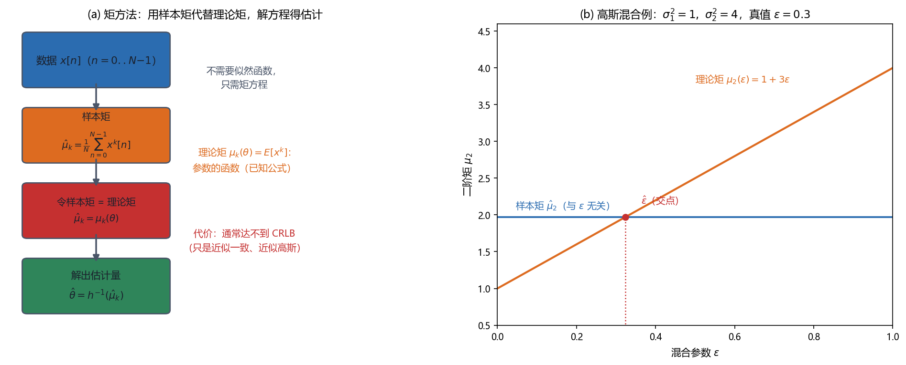

# Vol1 Ch09 矩方法：连误差平方和都不想优化时，最朴素的那一招

> 对应原书：第一卷《估计理论》第 9 章（书内第 238~252 页，本扫描 PDF 第 253~267 页）。
> 前置阅读：本系列 `Vol1_Ch07_最大似然估计.md`（§1.2 例 7.2 埋的"矩方法雏形"伏笔）、`Vol1_Ch08_最小二乘估计.md`（例 8.12 的修正 Yule-Walker）；本文自包含，涉及的前置概念就地插播。

## 写在前头

这是讲解系列的第 9 篇，也是**第一卷"实用主义三连"的最后一站**。第 7 章 MLE 要最大化似然函数，第 8 章 LS 要最小化误差平方和——它们都还需要"求导、令零、解方程"这套动作。本章的问题更往下退一步：**如果连优化都懒得做（或者做不动），最朴素的估计法是什么？**

答案是矩方法（method of moments）：**让样本矩等于理论矩，解方程得到参数。** 原书 §9.1 的定位精准得近乎谦虚："这种方法引入了一种容易确定和实现简单的估计量。尽管估计量不是最佳的，但是如果数据记录足够长，那么它是很有用的。这是因为矩方法的估计量通常是一致的。"更妙的是它的第二重用途：**如果估计性能不满足要求，可以作为起始估计，随后通过 MLE 的 Newton-Raphson 实现来对其进行改善**——这正好接上第 7 篇 §5.3 的数值迭代（迭代需要一个好起点，矩方法白送一个）。

用一句话概括本章的设计目标：**用"样本矩 = 理论矩"这一个几乎不用思考的方程，造出全书最容易实现、且数据一多就自动收敛到真值的估计量；代价是有限样本上通常达不到 CRLB。** 而那个"样本矩匹配"的念头，其实早在第 7 篇例 7.2 就出现过——本章兑现那个伏笔。

**实测声明**：本章事实性内容核对自原书扫描件 OCR 文本 `Temp/chapters_ocr/ch09/ocr_page_253~267.txt`（PDF 第 253~267 页，即书内第 238~252 页）；公式编号沿用原书（9.1）~（9.22），未编号者为本系列推导补充。Fig013 为本系列自建示意图与数值实验（脚本 `Temp/scripts/make_fig013.py`，种子 20260816），实验只用于示意，与理论公式相互印证。

---

## 1. 矩方法是什么：把"样本矩 = 理论矩"写成数学

### 1.1 问题驱动：最朴素的一招，凭什么有效？

第 7 章 MLE 的起点是"哪个参数最能解释数据"（最大化似然）；第 8 章 LS 的起点是"让信号最贴近数据"（最小化平方误差）。本章再退一步：**连"解释""贴近"这些词都不用，只问一个最原始的问题——数据的一阶矩（均值）、二阶矩（功率）……大概是多少？** 而理论告诉我们，这些矩是参数的函数。于是"样本矩 = 理论矩"就成了一个方程，解出来就是估计量。

这套话听着朴素得近乎天真，但它背后有一条硬道理：**样本矩依大数定律收敛到真实矩**。数据一多，样本矩就自动逼近理论矩，于是解出的参数也自动逼近真值——这就是 §3 要论证的"一致性"。

### 1.2 定义与第一个例子：高斯混合 PDF

原书 §9.3 用高斯混合 PDF 开场（习题 6.14 的延续）：观测 $x[n]$（$n=0,\ldots,N-1$）是 IID 样本，来自

$$
p(x[n];\varepsilon) = (1-\varepsilon)\,\phi_1(x[n]) + \varepsilon\,\phi_2(x[n])
$$

其中 $\varepsilon$ 为待估的混合参数（$0<\varepsilon<1$），$\phi_1$、$\phi_2$ 是两个已知方差 $\sigma_1^2$、$\sigma_2^2$ 的高斯 PDF（均值都为零）。**翻译成人话：每个样本以概率 $\varepsilon$ 来自"胖"的高斯（方差 $\sigma_2^2$），以 $1-\varepsilon$ 来自"瘦"的高斯（方差 $\sigma_1^2$）；要估的是"胖的那个占多大比例"。**

对 $\varepsilon$ 的 MLE 是非线性函数最大化（只能网格搜索），但矩方法一步到位。因为 PDF 是偶函数，一阶矩为零，改用**二阶矩**。理论二阶矩（9.1）：

$$
E\bigl[x^2[n]\bigr] = (1-\varepsilon)\sigma_1^2 + \varepsilon\sigma_2^2 \tag{9.1}
$$

其中 $E[x^2[n]]$ 为二阶矩（功率的期望）。**这说明什么性质？** 二阶矩是 $\varepsilon$ 的线性函数——$E[x^2]=\sigma_1^2+\varepsilon(\sigma_2^2-\sigma_1^2)$，所以方程好解。用样本矩 $\hat{\mu}_2=\frac{1}{N}\sum_{n=0}^{N-1}x^2[n]$ 代替 $E[x^2[n]]$，解出（9.3）：

$$
\hat{\varepsilon} = \frac{\frac{1}{N}\sum_{n=0}^{N-1}x^2[n] - \sigma_1^2}{\sigma_2^2 - \sigma_1^2} \tag{9.3}
$$

其中分子是"样本二阶矩减去瘦高斯的方差"，分母是"两个方差之差"。**这个例子恰好无偏**（原书指出，通常不是这样），方差由（9.4）给出——用到 $E[x^4]=(1-\varepsilon)\cdot3\sigma_1^4+\varepsilon\cdot3\sigma_2^4$ 与（9.1）。**何时失效？** 若 $\sigma_1^2=\sigma_2^2$（两个高斯一样），分母为零、$\varepsilon$ 不可识别——这也直觉：两个分量长得一模一样，"混合比例"本来就无从谈起。

Fig013 把这个流程与交点意义画了出来：

*图 Fig013：矩方法的流程与"交点即估计"（自建，种子 20260816）。左图：四步流程——数据 → 算样本矩 $\hat\mu_k=(1/N)\sum x^k[n]$ → 令样本矩等于理论矩 $\mu_k(\theta)$ → 解出 $\hat\theta=h^{-1}(\hat\mu_k)$，全程不需要似然函数。右图：高斯混合例（$\sigma_1^2=1$、$\sigma_2^2=4$，真值 $\varepsilon=0.3$，$N=2000$）——理论矩 $\mu_2(\varepsilon)=1+3\varepsilon$ 是 $\varepsilon$ 的斜线，样本矩 $\hat\mu_2$ 是与 $\varepsilon$ 无关的水平线（本次实测 $\hat\mu_2\approx1.97$），两者交点即矩估计 $\hat\varepsilon\approx0.323$。看两点：① 矩方法 = 找"样本矩水平线"与"理论矩曲线"的交点；② 样本矩估计的误差直接反映成交点的左右偏移。结论：矩方法把估计化成了"匹配一个数"，简单到不需要任何优化。*

### 1.3 标量参数的统一套路

原书 §9.3 把上面流程总结成三步（（9.5）~（9.7））。设第 $k$ 阶矩 $\mu_k=E[x^k[n]]$ 与未知参数 $\theta$ 的关系为 $\mu_k=h(\theta)$（9.5），先解出 $\theta=h^{-1}(\mu_k)$（假定 $h$ 的反函数存在），再用样本矩 $\hat{\mu}_k=\frac{1}{N}\sum_{n=0}^{N-1}x^k[n]$（9.6）替换理论矩，得矩方法估计量

$$
\hat{\theta} = h^{-1}\bigl(\hat{\mu}_k\bigr) \tag{9.7}
$$

其中 $h^{-1}$ 为理论矩关系的反函数。两个例子立住这个套路：

- **例 9.1 WGN 中的 DC 电平**：$x[n]=A+w[n]$，$\mu_1=E[x[n]]=A$，即 $h$ 是恒等变换，$\hat{A}=\frac{1}{N}\sum x[n]$ = 样本均值。**与第 8 章例 8.1 的 LSE、第 7 章例 7.4 的 MLE 三方撞车——因为对 DC 电平，三种方法都指向同一个"洗掉噪声"的平均。**
- **例 9.2 指数 PDF**：$p(x;\lambda)=\lambda e^{-\lambda x}$（$x>0$，$\lambda>0$）。一阶矩 $\mu_1=E[x[n]]=1/\lambda$，解出 $\lambda=1/\mu_1$，替换得 $\hat{\lambda}=1/\bar{x}$（$\bar{x}$ 为样本均值）。**翻译成人话：指数分布的平均值就是它的"寿命"的倒数，所以拿样本平均值一除，就是 $\lambda$ 的估计。**

**回调伏笔**：第 7 篇例 7.2 那个"看似随手拍"的估计量 $\hat{A}=\sqrt{\hat{u}+\tfrac14}-\tfrac12$（其中 $\hat{u}=\frac1N\sum x^2[n]$），正是这里的三步套路——**理论矩 $E[x^2]=A+A^2$ 是 $A$ 的函数，解方程 $u=A+A^2$ 得 $A=\sqrt{u+\tfrac14}-\tfrac12$，再用样本矩 $\hat{u}$ 替换 $u$**。第 7 篇 §1.2 明说"这就是第 9 章矩方法的雏形"，本章在此兑现：**例 7.2 不是随手拍，它是矩方法在高斯方差 $=A$ 模型上的一个实例。**

**一句话总结：矩方法 = 三步走——写出理论矩 $\mu_k=h(\theta)$，求反函数 $\theta=h^{-1}(\mu_k)$，把样本矩塞进去。简单到无需任何优化，代价是它一般不是最佳。**

---

## 2. 矢量参数与更多例子：要多估几个参数，就多匹配几个矩

### 2.1 问题驱动：参数不止一个时，"一个矩解一个未知数"还够吗？

§9.4 把套路推广到 $p\times 1$ 矢量参数 $\boldsymbol\theta$。要解 $p$ 个未知数，就需要 $p$ 个方程——即 $p$ 阶理论矩（9.8），写成矢量形式 $\boldsymbol\mu=\mathbf{h}(\boldsymbol\theta)$（9.9），解出 $\boldsymbol\theta=\mathbf{h}^{-1}(\boldsymbol\mu)$（9.10），矩方法估计量（9.11）：

$$
\hat{\boldsymbol\theta} = \mathbf{h}^{-1}\bigl(\hat{\boldsymbol\mu}\bigr) \tag{9.11}
$$

其中 $\hat{\boldsymbol\mu}$ 为样本矩矢量（各分量 $\hat\mu_k=\frac1N\sum x^k[n]$）。

**两条纪律要立住（原书明说）：** ① **尽量用最低阶的矩**——矩估计量的方差一般随阶数增大，而且低阶矩的方程更可能是线性或弱非线性、更好解；② **前 $p$ 阶矩可能不够**（例 9.3 就是），这时要另找 $p$ 个矩方程，可能还要用到**互相关矩**（§4 的频率例子）。

例 9.3 高斯混合三参数：除了 $\varepsilon$，两个方差 $\sigma_1^2$、$\sigma_2^2$ 也未知，要估三个参数。PDF 偶对称使奇数阶矩全为零，于是用二、四、六阶矩（$E[x^2]=(1-\varepsilon)\sigma_1^2+\varepsilon\sigma_2^2$、$E[x^4]=3(1-\varepsilon)\sigma_1^4+3\varepsilon\sigma_2^4$、$E[x^6]=15(1-\varepsilon)\sigma_1^6+15\varepsilon\sigma_2^6$）——非线性方程组，但可用 $\nu=\sigma_1^2\sigma_2^2$ 的技巧（Rider 1961）先解出 $\nu=\frac{\mu_6-5\mu_4\mu_2}{5\mu_4-15\mu_2^2}$，再回代求 $\sigma_1^2$、$\sigma_2^2$（解 $u^2-\sqrt{u^2-4\nu}$ 形式），最后混合参数由（9.3）给出。**代价照实说：这个例子方程已经非线性到需要巧解了——"矩方法总是简单"是错觉，矢量参数、高阶矩会把简单性吃掉。** 这正是原书提醒"尽量用低阶矩"的原因。

**一句话总结：矢量参数的矩方法 = 多匹配几个矩、解一个方程组；能用低阶矩就别用高阶矩，能用线性方程就别解非线性方程——简单性是矩方法的命根子，别自己把它作没了。**

---

## 3. 一致性：矩方法"数据一多就有用"的根子

### 3.1 问题驱动：凭什么说"数据记录足够长时矩方法有用"？

§9.1 的承诺是"通常一致"。这个承诺的证明骨架（原书 §9.3 给的是定性论证，严格版是习题 7.5 的大数定律）：

1. **样本矩依大数定律收敛**：$\hat{\mu}_k=\frac1N\sum x^k[n]\to E[x^k[n]]=\mu_k$（当 $N\to\infty$），只要 $E[x^k[n]]$ 存在（有限）。这是独立同分布样本的均值收敛到期望。
2. **连续映射下一致**：估计量 $\hat{\theta}=h^{-1}(\hat{\mu}_k)$ 是 $\hat{\mu}_k$ 的连续函数（$h^{-1}$ 连续时），所以 $\hat{\mu}_k\to\mu_k$ 推出 $\hat{\theta}\to h^{-1}(\mu_k)=\theta$。

原书例 9.2 的指数 PDF 顺带验证：$N\to\infty$ 时 $\hat{\lambda}=1/\bar{x}\to1/E[x]=\lambda$。**这正是例 7.2 用过的同一逻辑**（第 7 篇 §1.2：$\hat{u}$ 依大数定律收敛到 $u$，连续映射下 $\hat{A}$ 收敛到 $A$）——**矩方法的一致性，就是例 7.2 那条论证的一般化。**

**说明什么性质、何时失效？** 一致性是"$N\to\infty$"的极限陈述，**它不告诉你 $N$ 多大才够**（第 7 篇 §4.2 预警过的同一个坑）。而且它有前提：① 用到的矩必须有限（重尾分布的高阶矩可能不存在，矩方法直接失效）；② $h^{-1}$ 连续（否则"样本矩收敛"推不出"参数收敛"）。**一句话总结：矩方法不最优，但"一致"保底——数据一多，它至少不会停在错误答案上，这是它和"随便拍脑袋"的本质区别。**

---

## 4. 统计评价：统计线性化——矩方法的性能怎么算

### 4.1 问题驱动：矩方法一般不是最佳，那它到底差多少？

§9.5 面对一个尴尬：$\hat{\theta}=h^{-1}(\hat{\boldsymbol\mu})=g(\mathbf{T})$（9.13，$\mathbf{T}$ 为若干统计量）这种非线性函数的 PDF 通常"数学上难以处理"，精确均值和方差求不出来。原书给的解法是**统计线性化**（原书 §3.6 的方法，也是例 7.2 用过的那招）：在 $\mathbf{T}$ 的均值 $\boldsymbol\mu$ 附近做一阶泰勒展开（9.14），于是

$$
E[\hat{\theta}] \approx g(\boldsymbol\mu) \tag{9.15}
$$

$$
\mathrm{var}(\hat{\theta}) \approx \left.\frac{\partial g}{\partial \mathbf{T}}\right|_{\mathbf{T}=\boldsymbol\mu}^{T} \mathbf{C}_T \left.\frac{\partial g}{\partial \mathbf{T}}\right|_{\mathbf{T}=\boldsymbol\mu} \tag{9.16}
$$

其中 $\boldsymbol\mu=E[\mathbf{T}]$ 为统计量的均值，$\mathbf{C}_T$ 为 $\mathbf{T}$ 的协方差矩阵，$\partial g/\partial\mathbf{T}$ 为 $g$ 对统计量各分量的偏导（在 $\mathbf{T}=\boldsymbol\mu$ 处取值）。**翻译成人话：把"估计量 $=$ 统计量的非线性函数"在均值附近拉直成一条直线，直线的截距给近似均值、斜率×统计量方差给近似方差。** （9.15）式意味着"期望与非线性函数 $g$ 可交换"——这是近似的核心。

**前提与失效边界（原书点明）：** 泰勒级数成立的前提是"$g$ 在 $p(\mathbf{T};\theta)$ 非零的 $\mathbf{T}$ 范围内近似线性"。两种情况天然满足：① **数据记录足够大**（$\mathbf{T}$ 的 PDF 集中在均值附近）；② **高 SNR**（噪声只让无噪声时的估计值轻微抖动）。例 9.4 指数 PDF（继续）：$\hat{\lambda}=1/T_1$（$T_1=\frac1N\sum x[n]$），近似均值 $\approx\lambda$（近似无偏），近似方差 $\approx\lambda^2/N$；而本例 $\hat{\lambda}$ 恰好也是 MLE，其渐近 PDF 是 $\mathcal{N}(\lambda,\lambda^2/N)$（（7.8）式）——**说明只有当 $N\to\infty$ 时近似才精确**。原书把这条写得很硬：**要确定近似公式成立的 $N$ 究竟多大，必须做蒙特卡洛计算机模拟**（第 7 篇附录 7A 的工具再次登场）。

### 4.2 高 SNR 版：噪声小抖动，估计量小抖动

第二种情况（9.17）~（9.19）针对"噪声中的信号"：$x[n]=s[n;\theta]+w[n]$，估计量 $\hat{\theta}=g(\mathbf{x})=h(\mathbf{w})$。在 $\mathbf{w}=\mathbf{0}$（无噪声）附近展开，得近似均值（9.18）$E[\hat{\theta}]\approx h(\mathbf{0})=g(\mathbf{s}(\theta))=\theta$（高 SNR 下近似无偏），近似方差（9.19）由 $\partial h/\partial\mathbf{w}$ 在 $\mathbf{w}=0$ 处与噪声协方差 $\mathbf{C}$ 组合。例 9.5 白噪声中指数信号：$x[n]=r^n+w[n]$（阻尼因子 $r$ 待估，观测 $n=0,1,2$ 三个点），提出估计量 $\hat{r}=\frac{x[1]+x[2]}{x[0]+x[1]}$（无噪声时 $=\frac{r+r^2}{1+r}=r$），用（9.18）（9.19）算得近似无偏，方差与噪声方差 $\sigma^2$ 成正比。**翻译成人话：高 SNR 时，"估计量 = 无噪声真值 + 噪声的小线性扰动"，于是均值和方差都能用线性化算出来。**

**这里要照实说矩方法的代价（原书 §9.2 也明说）：** 统计线性化算出的方差**通常达不到 CRLB**——矩方法不是渐近有效的（MLE 才是）。例 9.2 的 $\hat{\lambda}$ 恰好是 MLE 所以达界，那是特例；一般矩方法比 MLE 差。**矩方法的定位是"易实现 + 一致"，不是"渐近最优"。** 这一条会在 §5 的频率例子里用 $1/N^2$ vs $1/N^3$ 的对比赤裸裸地体现出来。

**一句话总结：矩方法性能靠统计线性化来估——它在"大样本 / 高 SNR"下近似无偏、近似高斯，但方差通常达不到 CRLB；这"通常达不到"就是矩方法必须付出的代价。**

---

## 5. 频率估计：矩方法在信号处理上的一个完整收账

### 5.1 问题驱动：不搜周期图峰值，频率还能怎么估？

第 7 篇例 7.16 说频率的 MLE 是周期图峰值，但"搜索峰值位置"要遍历频率、算得起却也不便宜。§9.6 问：**能不能用一个不搜索的闭式公式估频率？** 答案是能——矩方法。

先把相位 $\phi$ 假设成与噪声独立、均匀分布 $\phi\sim\mathcal{U}[0,2\pi]$ 的随机变量，使信号 $s[n]=A\cos(2\pi f_0n+\phi)$ 成为 WSS 随机过程的一个现实。ACF 为 $r_{ss}[k]=\frac{A^2}{2}\cos(2\pi f_0k)$（均值 $E[s[n]]=0$），观测 ACF 为 $r_{xx}[k]=\frac{A^2}{2}\cos(2\pi f_0k)+\sigma^2\delta[k]$。**令幅度已知为 $A=\sqrt2$**，则 $r_{xx}[1]=\cos 2\pi f_0$（噪声只在 $k=0$ 处贡献，$k=1$ 时无噪声项）。于是"匹配二阶矩（ACF 的滞后 1）"给出（9.20）：

$$
\hat{f}_0 = \frac{1}{2\pi}\arccos\!\Bigl(\hat{r}_{xx}[1]\Bigr), \qquad \hat{r}_{xx}[1] = \frac{1}{N-1}\sum_{n=0}^{N-2}x[n]x[n+1] \tag{9.20}
$$

其中 $\hat{r}_{xx}[1]$ 为 ACF 滞后 1 的估计，求和从 $n=0$ 到 $N-2$。**翻译成人话：相邻两个样本相乘再平均，得到一个"相邻样本有多相关"的数，它就是 $\cos2\pi f_0$ 的估计；取反余弦、除以 $2\pi$，频率就出来了——不用任何搜索。** 这正是 §2.1 说的"矢量参数还要用互相关矩"：频率藏在**相邻样本的互相关矩**里，不是藏在单个样本的矩里。

**失效边界（原书点明）：** 低 SNR 时 $\arccos$ 的自变量可能超出 $[-1,1]$，估计无意义、表明估计不可靠。而且（9.20）是在"相位随机"假设下导出的；若相位确定但未知，估计仍有效（习题 9.11 证明 $N\to\infty$ 时 $\frac{2}{N-1}\sum x[n]x[n+1]\to\cos2\pi f_0$，即 $A=\sqrt2$ 时（9.20）依然一致）。

### 5.2 性能：方差按 $1/N^2$ 掉，而 CRLB 按 $1/N^3$ 掉

用 §4.2 的高 SNR 统计线性化（在 $\mathbf{w}=0$ 展开），近似均值（9.21）$E[\hat{f}_0]\approx f_0$（高 SNR 下无偏），近似方差（9.22）：

$$
\mathrm{var}(\hat{f}_0) \approx \frac{\sigma^2}{(2\pi)^2(N-1)^2\sin^2 2\pi f_0}\Bigl[s^2[0] + 4\cos^2 2\pi f_0\sum_{n=1}^{N-2}s^2[n] + s^2[N-2]\Bigr] \tag{9.22}
$$

其中 $s[n]=\sqrt2\cos(2\pi f_0n+\phi)$ 为无噪声信号，$\sigma^2$ 为噪声方差。**这个式子说明两件事，都是要害：**

1. **方差随 $N$ 以 $1/N^2$ 的速度下降，而频率估计的 CRLB 以 $1/N^3$ 下降**（原书引（3.41）式）。**翻译成人话：矩方法的频率估计"差了一个 $N$"——数据加长，它收敛得比最优估计慢一个数量级。** 这就是 §4.2 说的"通常达不到 CRLB"在频率问题上的具体账。
2. **$f_0$ 在 0 或 $1/2$ 附近时方差暴增**。原因在图 9.1：$\arccos$ 在自变量 $\pm1$ 附近斜率陡峭（导数 $\to\infty$），自变量（$\cos2\pi f_0$ 的估计）的一点点抖动，都会让 $\arccos$ 的值大幅起伏；而 $f_0\to0$ 或 $1/2$ 时 $\cos2\pi f_0\to\pm1$，正好落在陡峭区。**翻译成人话：频率贴到直流或奈奎斯特频率时，这个矩方法估计量会变得极不可靠。**

原书图 9.2 的蒙特卡洛（$A=\sqrt2$、SNR$=A^2/2\sigma^2=1/\sigma^2$、$f_0=0.2$、$\phi=0$、$N=50$、1000 个现实）验证：高 SNR 下均值贴近 $f_0=0.2$（理论值），方差曲线与（9.22）吻合（实际曲线与理论曲线"显然具有相同的特性"）。**一个细节**：理论均值与 $f_0$ 的轻微差异，来自推导时忽略倍频项（$\sin(4\pi f_0n+2\phi)$ 求和近似为 0）的近似——$N$ 足够大时这个近似才精确。

### 5.3 收账：矩方法把第 7、8 章的 Yule-Walker 线索也接通了

AR 过程的参数估计是矩方法的又一经典现场。ARMA 过程的 ACF 满足修正 Yule-Walker 差分方程 $\sum_{k=0}^{p}a[k]r_{xx}[n-k]=0$（$n\ge q+1$，$a[0]=1$）——第 8 篇例 8.12 已经用 LS 解过它。**从矩方法的视角看，同一件事可以换个说法**：ACF（即过程的自相关矩）是 AR 参数的函数，把"样本矩"（估计的 ACF $\hat{r}_{xx}[k]$）代进去解方程，就得到 AR 参数的矩方法估计量——这就是习题 9.5 的内容。对纯 AR 过程（$q=0$），这组方程退化为普通 Yule-Walker 方程。**于是三条线在此合流：第 7 篇例 7.18 的"渐近 MLE → Yule-Walker"、第 8 篇例 8.12 的"LS → 修正 Yule-Walker"、本章的"矩方法 → Yule-Walker"，三种方法在 AR 参数上殊途同归**——因为"匹配自相关矩"这一件事，既是最朴素的矩方法，也是高斯假设下 AR 参数的近似最优解。**翻译成人话：LPC 分析里的那个 Yule-Walker 方程，是全书唯一一处"MLE、LS、矩方法三家会师"的地方。**

---

## 6. 关键设计决策回顾

| # | 决策 | 为什么这么选 | 换一个选择会怎样 |
|---|------|------------|----------------|
| 1 | 用**样本矩 = 理论矩**，而非最大化似然/最小化误差 | 矩方程往往线性或弱非线性，易解、易实现；且样本矩依大数定律收敛，保证一致性 | 上 MLE 或 LS 需要求导/迭代，实现成本高；矩方法用"匹配一个数"白送一致估计 |
| 2 | **尽量用最低阶矩** | 低阶矩方差小、方程更可能线性 | 用高阶矩，估计方差随阶数增大，还可能解出非线性方程组（例 9.3 的教训） |
| 3 | 矢量参数时**补足 $p$ 个方程**（含互相关矩） | 一个矩解一个未知数，参数多了就要多匹配几个矩 | 只匹配前 $p$ 阶矩，可能不足以确定所有参数（例 9.3），估计量不存在 |
| 4 | 性能评价用**统计线性化**（一阶泰勒） | 非线性函数 $g(\mathbf{T})$ 的精确 PDF 难求，线性化给近似均值/方差 | 硬求精确 PDF，数学上通常行不通；蒙特卡洛则只能个案验证 |
| 5 | 频率估计用 **ACF 滞后 1** 而非搜索峰值 | 一个闭式 $\arccos$ 公式，不搜索、省算力 | 搜索周期图峰值（MLE）渐近最优但贵；矩方法用 $1/N^2$ 的方差换不搜索的便宜 |

---

## 7. 实现备忘（复现与移植时的坑）

1. **一致性 ≠ 无偏**：矩方法保证 $N\to\infty$ 时收敛，但有限样本常有偏（例 9.2 的 $\hat{\lambda}=1/\bar{x}$ 就是有偏的）。**引用矩方法性能时别把"一致"说成"无偏"。**
2. **低阶矩优先的代价**：例 9.1 DC 电平只匹配一阶矩（均值），若噪声方差也未知就得匹配二阶矩——那时矩方法会"错过"方差信息，不如 MLE 干净。
3. **高斯混合的识别条件**：$\sigma_1^2=\sigma_2^2$ 时分母为零、$\varepsilon$ 不可识别。**实现前先检查矩方程的分母/反函数存在性。**
4. **统计线性化的前提别忘**：（9.15）（9.16）只在"大样本 / 高 SNR"下精确。**低 SNR 或小样本下，近似均值和方差可能严重失真，必须蒙特卡洛复查**（原书 §9.5 明说）。
5. **频率估计的 $1/(N-1)$ 归一化**：（9.20）里 $\hat{r}_{xx}[1]=\frac{1}{N-1}\sum_{n=0}^{N-2}x[n]x[n+1]$（据英文原版校订归一化；OCR 页 262 该处残断）。**用错 $1/N$ 口径会导致小幅偏差，引用时写明归一化。**
6. **$\arccos$ 定义域钳制**：低 SNR 时 $\hat{r}_{xx}[1]$ 可能越出 $[-1,1]$。**实现时要么钳制到 $[-1,1]$，要么（原书做法）判为"估计不可靠"并弃用。**
7. **$f_0$ 贴 0 或 1/2 的方差爆炸**：（9.22）的 $\sin^2 2\pi f_0$ 在分母。**频率太靠边时换别的估计器（周期图峰值），别硬用矩方法。**
8. **相位口径**：§9.6 的（9.20）在"相位随机"假设下导出，但"相位确定未知"时仍一致（习题 9.11）。**两者结论可通用，但推导口径不同，别混。**
9. **页码映射**：本章书内 238~252 对应 PDF 253~267（**书内页码 = PDF 页码 − 15**）。高斯混合（9.1）~（9.3）在 PDF 254，统计线性化（9.15）（9.16）在 PDF 258，频率估计（9.20）~（9.22）在 PDF 262~263。

---

## 8. 局限（坦率交代，并预告后续）

1. **通常达不到 CRLB。** 这是矩方法与 MLE 最本质的差距：矩方法只用了"矩"这一部分信息，丢掉的信息就是方差的损失（§5.2 的 $1/N^2$ vs $1/N^3$）。**渐近有效是 MLE 的专属（定理 7.1），矩方法只有"一致"。**
2. **"简单性"随矢量参数/高阶矩迅速蒸发。** 例 9.3 三参数已经要解非线性方程组（靠 Rider 1961 的巧解）。**矩方法的命根子是"方程好解"，一旦方程变非线性，它的存在理由就动摇——那时不如直接上 MLE 的迭代。**
3. **性能只有近似公式，没有精确 PDF。** （9.15）（9.16）是大样本/高 SNR 的近似，$N$ 多大才够没有解析答案，只能蒙特卡洛。**这是渐近理论的天性（第 7 篇 §10.3 的同款局限），不是本章特有。**
4. **重尾分布的高阶矩可能不存在。** 若某阶矩无限，匹配该阶矩的矩方法直接失效。**这是"尽量用低阶矩"的另一层原因。**
5. **低 SNR 的硬失效。** 频率估计的 $\arccos$ 定义域越界、贴边方差爆炸，都是低 SNR 下"矩方法不可靠"的具体表现。**低 SNR 的救兵是周期图峰值（MLE）或第 11 章的贝叶斯路线。**

---

## 9. 建议自测的问题

1. 用三步套路（写理论矩 → 求反函数 → 代样本矩）重新推导例 7.2 的 $\hat{A}=\sqrt{\hat{u}+\tfrac14}-\tfrac12$，并说明它是矩方法的哪个特例。
2. 为什么矢量参数的矩方法要"尽量用最低阶矩"？用例 9.3 的六阶矩方程说明代价。
3. 矩方法"一致"的证明骨架是什么？它为什么不保证"无偏"和"达 CRLB"？
4. 统计线性化（9.15）（9.16）成立的前提是什么？在哪种两个场景下天然成立（提示：§4.1）？
5. 为什么矩方法的频率估计量方差按 $1/N^2$ 掉而 CRLB 按 $1/N^3$ 掉？$f_0$ 贴 0 或 $1/2$ 时为什么方差爆炸（提示：$\arccos$ 的斜率）？
6. 原书习题 9.4：对 $\mathcal{N}(\mu,\sigma^2)$ 的 IID 观测，求 $\boldsymbol\theta=[\mu,\ \sigma^2]^T$ 的矩方法估计量。

---

**一句话收尾：矩方法把"估计"退化成"匹配一个数"——样本矩对上理论矩、解个方程就完事；它不最优、不无偏，但实现最简单、数据一多就自动收敛，还能白送给 MLE 迭代当起点——这是全书唯一"几乎不用动脑就能用"的估计法。**

*实测核对声明：本章事实性内容核对自原书扫描件 OCR 文本 `Document/统计信号处理/Temp/chapters_ocr/ch09/ocr_page_253~267.txt`（PDF 第 253~267 页）；公式编号（9.1）~（9.22）与原书一致，其中（9.20）的 $1/(N-1)$ 归一化与例 9.5 的估计量 $\hat{r}=(x[1]+x[2])/(x[0]+x[1])$ 据 Kay 原书英文版（Vol I, Ch.9）校订 OCR 残字；Fig013 由 `Temp/scripts/make_fig013.py` 生成（种子 20260816），经 `plotutil.check_figure` 程序化碰撞检测通过。*
