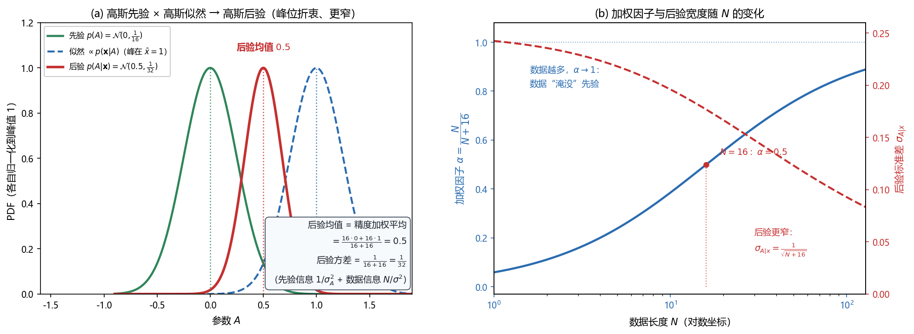

# Vol1 Ch10 贝叶斯原理：参数从"确定但未知"变成"随机变量带先验"

> 对应原书：第一卷《估计理论》第 10 章（书内第 253~276 页，本扫描 PDF 第 268~291 页）。
> 前置阅读：本系列 `Vol1_Ch01_引言.md`（§2.3 埋过"经典 vs 贝叶斯、道琼斯先验 [2800,3200]"的伏笔）、原书第 2 章（MSE 准则与 MVU）、第 4 章（线性模型）；本文自包含，涉及的前置概念就地插播。

## 写在前头

这是讲解系列的第 10 篇，也是**整个第一卷的世界观切换章**。前九章（第 2~9 章）走的是经典路线：参数 $\theta$ 是"确定但未知"的常量，数据模型写成 $p(\mathbf{x};\theta)$（分号）。从本章起，参数是"随机变量"，数据模型写成 $p(\mathbf{x}\mid\theta)$（竖线），我们要估计的是它的一个现实。第 1 篇 §2.3 埋的伏笔——"记号的分野就是世界观的分野"——在这一章正式兑现。

Kay 给贝叶斯方法列了两个出场理由：**第一，手里有先验知识（"3000 点附近"）时，经典路线装不下它，贝叶斯路线能装，从而改善精度；第二，MVU 估计量不存在时（无偏估计量的方差并不一致地小于其他估计量），贝叶斯方法总能给一个"平均意义下"最优的估计量。** 本章的任务就是把"我有先验知识"这句工程直觉，锻造成一套可计算的机器：先验 PDF、后验 PDF、后验均值估计量。

**本章一句话设计目标：把"参数是随机的、且我预先知道它大概在哪"这件事，写成一个联合模型 $p(\mathbf{x},\theta)=p(\mathbf{x}\mid\theta)p(\theta)$，并证明"后验 PDF 的均值"就是最小贝叶斯 MSE 估计量。**

**实测声明**：本章事实性内容核对自原书扫描件 OCR 文本 `Temp/chapters_ocr/ch10/ocr_page_268~291.txt`（PDF 第 268~291 页，即书内第 253~276 页）；公式编号（10.1）~（10.40）沿用原书编号。Fig014 为本系列自建数值实验（脚本 `Temp/scripts/make_fig014.py`，示意值 $\mu_A{=}0$、$\sigma_A^2{=}1/16$、$\sigma^2{=}1$、$N{=}16$、$\bar{x}{=}1$），与原书无冲突，仅用于把公式画成图形。

---

## 1. 为什么经典路线装不下"先验知识"：截断估计量的一次小型起义

### 1.1 问题驱动：样本均值估出 4000 点，你信吗？

第 1 篇的道琼斯例子说过：指数"3000 点附近"，估出 2000 或 4000 都离谱。但在经典框架里，这个"离谱"没有数学位置——模型 $p(\mathbf{x};\theta)$ 只描述了"给定参数后数据长什么样"，对"参数本身大概是多少"一个字都没说。原书 §10.3 用一个小例子把这份尴尬钉死在纸面上。

例 3.1（第 3 章）证明过：$x[n]=A+w[n]$（$w[n]$ 为 WGN）里直流电平 $A$ 的 MVU 估计量是样本均值 $\bar{x}$。但那个证明的前提是 **$A$ 可以取 $-\infty<A<\infty$ 上的任何值**。一旦物理条件告诉你 $A$ 实际被限制在 $[-A_0,A_0]$ 内，$\bar{x}$ 就可能因噪声而落到范围之外（原书图 10.1(a)）。

于是有人提出"截断样本均值"——把 $\bar{x}$ 超出 $[-A_0,A_0]$ 的值硬夹回边界（原书式 10.1）：

$$
\check{A}=\begin{cases}-A_0 & \bar{x}\le -A_0\\ \bar{x} & -A_0<\bar{x}<A_0\\ A_0 & \bar{x}\ge A_0\end{cases}
$$

其中 $\bar{x}$ 为样本均值，$A_0$ 为已知范围边界。它的 PDF 由 $\bar{x}$ 的 PDF 折叠而成（原书式 10.1 的完整写法含单位阶跃函数 $u(\cdot)$ 与两个 $A_0$ 处的概率质量）。

**关键观察：$\check{A}$ 是有偏的**（夹断改变了均值），但把两种估计量的 MSE 一算，对区间内任何 $A$，$\check{A}$ 的 MSE 都小于等于 $\bar{x}$ 的 MSE。**用一句工程话说：允许一点偏差，换来了更小的均方误差。** 这在经典框架里是件别扭的事——第 2 章里"最小 MSE"准则会导出不可实现的估计量（那个著名的教训），于是经典路线只能退守"无偏 + 最小方差"；可眼前明明有一个"有偏但 MSE 更小"的活生生的好估计量，经典框架却没法正式接纳它。

**一句话总结：先验知识（范围限制）能实打实地改善估计，但经典框架里没有安放它的位置——这是贝叶斯路线登场的根本动因。**

### 1.2 重建数据模型：把"选择 $A$ 的过程"也建模成随机事件

贝叶斯的解法是釜底抽薪：**既然要系统利用先验知识，就把"$A$ 是怎么被选出来的"本身建模进去。** 原书 §10.3 的做法是：

1. 把"选择 $A$ 的真值"看成一次随机事件，给它配一个先验 PDF $p(A)$；
2. 若只知道 $A\in[-A_0,A_0]$、对区间内任何值没有偏向，就取均匀先验 $p(A)=U[-A_0,A_0]$；
3. 数据的完整描述变成**联合 PDF**（原书图 10.2 的数据建模图）：

$$
p(\mathbf{x}, A) = p(\mathbf{x}\mid A)\, p(A)
$$

其中 $p(A)$ 为**先验 PDF**（观测数据之前对 $A$ 的已有知识），$p(\mathbf{x}\mid A)$ 为**条件 PDF**（给定 $A$ 后数据提供的信息），竖线"|"表示"在 $A$ 给定的条件下"。这就是贝叶斯方法与经典方法的**唯一本质区别**：经典把 $A$ 当固定数，贝叶斯把 $A$ 当随机变量。

> **前置概念：先验 PDF 与后验 PDF。** "先验"（prior）= 观测数据**之前**你对参数的了解，写成 $p(\theta)$；"后验"（posterior）= 观测数据**之后**你对参数的了解，写成 $p(\theta\mid\mathbf{x})$。翻译成人话：先验是你出门前对"参数大概在哪"的估计，后验是你看到了数据、把新证据叠上去之后的修正版。把先验更新成后验的那条规则，就是下一节的贝叶斯公式。

---

## 2. 贝叶斯 MSE 与后验均值：MMSE 估计量是后验的"重心"

### 2.1 问题驱动：有了联合模型，怎么定义"好估计量"？

现在参数是随机的了，"估计量的偏差/方差"这套经典尺子得换。原书 §10.3 定义**贝叶斯 MSE**（式 10.2）：

$$
\mathrm{Bmse}(\hat{A}) = E\bigl[(A-\hat{A})^2\bigr]
$$

其中 $A$ 为随机参数，$\hat{A}$ 为估计量。**注意两个细节**：① 误差写成 $A-\hat{A}$（与经典的 $\hat{A}-A$ 相反），这是为后面第 11 章"误差矢量"的几何解释铺路；② 期望是对**联合 PDF $p(\mathbf{x},A)$** 求的——这是贝叶斯 MSE 与经典 MSE 的本质区别。

把它和经典 MSE 并排看（式 10.3、10.4）：

$$
\mathrm{mse}(\hat{A})=\int\bigl(\hat{A}-A\bigr)^2 p(\mathbf{x};A)\,d\mathbf{x}
\qquad\text{vs}\qquad
\mathrm{Bmse}(\hat{A})=\iint\bigl(A-\hat{A}\bigr)^2 p(\mathbf{x},A)\,d\mathbf{x}\,dA
$$

其中前者的积分只对数据 $\mathbf{x}$（$A$ 固定），后者的积分对 $\mathbf{x}$ 和 $A$ 都要做（$A$ 按先验 $p(A)$ 平均）。**连做蒙特卡洛的流程都不一样**：经典路线固定一个 $A$，重复 $M$ 次抽 $w[n]$ 加到同一个 $A$ 上；贝叶斯路线每次先按 $p(A)$ 抽一个 $A$，再产生 $w[n]$，重复 $M$ 次。**经典路线对每个假定的 $A$ 给一个 MSE；贝叶斯路线只给一个单一的 MSE，它是把 $A$ 的 PDF 整个平均掉之后的数。** 原书特意警告：把经典估计和贝叶斯估计直接比，就像"拿苹果和桔子比"——两者的性能指标压根不是一个口径。

### 2.2 结论：使贝叶斯 MSE 最小的估计量是后验均值

利用贝叶斯规则 $p(\mathbf{x},A)=p(A\mid\mathbf{x})\,p(\mathbf{x})$，贝叶斯 MSE 可以重写成

$$
\mathrm{Bmse}(\hat{A})=\int\Bigl[\int\bigl(A-\hat{A}\bigr)^2 p(A\mid\mathbf{x})\,dA\Bigr]p(\mathbf{x})\,d\mathbf{x}
$$

因为 $p(\mathbf{x})\ge 0$，只要对每个 $\mathbf{x}$ 都把方括号内的积分最小化，整体就最小。对 $\hat{A}$ 求导、令零（推导见原书 §10.3，只用到一个事实：条件 PDF 积分等于 1），得

$$
\hat{A}=E(A\mid\mathbf{x})=\int A\,p(A\mid\mathbf{x})\,dA \tag{10.5}
$$

其中 $p(A\mid\mathbf{x})$ 为后验 PDF。**翻译成人话：使贝叶斯 MSE 最小的估计量，就是后验 PDF 的均值——后验分布的"重心"。** 原书从本章起把它命名为 **MMSE（minimum mean square error，最小均方误差）估计量**。

**性质与限制**：① MMSE **总是存在**——这是它相对经典 MVU（未必存在）的硬优势，第 8 节会再展开；② 但"存在"不等于"算得出来"——后验均值可能需要积分，下一节就撞上这个墙；③ 直觉上，观测数据把后验集中在真值附近（原书图 10.3：先验宽、后验窄），因为数据减少了关于 $A$ 的不确定性——"数据知道得越多，后验越尖"。

**好处与优势**：MMSE 把"怎么用先验知识"从一句口号变成了一个明确的算子——后验均值。代价是：你得先有后验 PDF，而求后验要过贝叶斯公式这一关（式 10.6）：

$$
p(A\mid\mathbf{x})=\frac{p(\mathbf{x}\mid A)\,p(A)}{\int p(\mathbf{x}\mid A)\,p(A)\,dA} \tag{10.6}
$$

其中分母是与 $A$ 无关的归一化因子（保证后验积分为 1）。**这个式子就是"先验更新成后验"的机器：分子 = 似然 × 先验，分母 = 把它归一化。**

### 2.3 均匀先验的尴尬：后验是截断高斯，均值算不出来

回到均匀先验 $p(A)=U[-A_0,A_0]$ 的例子。给定 $A$ 后，$w[n]$ 的 PDF 不受 $A$ 选择的影响（$w[n]$ 与 $A$ 独立），条件 PDF 是标准高斯似然（式 10.7）。代入式（10.6），后验变成

$$
p(A\mid\mathbf{x})=\begin{cases}
\dfrac{\exp\Bigl[-\frac{N}{2\sigma^2}(A-\bar{x})^2\Bigr]}{\displaystyle\int_{-A_0}^{A_0}\exp\Bigl[-\frac{N}{2\sigma^2}(A-\bar{x})^2\Bigr]dA} & |A|\le A_0\\[6pt]
0 & |A|>A_0
\end{cases} \tag{10.8}
$$

其中 $\sigma^2$ 为噪声方差，$N$ 为数据长度，$\bar{x}$ 为样本均值（推导用到了 $\sum(x[n]-A)^2=\sum(x[n]-\bar{x})^2+N(A-\bar{x})^2$）。**这是"截断高斯"**（原书图 10.3(b)）：高斯曲线在 $[-A_0,A_0]$ 之外被砍掉，再重新归一化。它的均值（MMSE 估计量）是

$$
\hat{A}=E(A\mid\mathbf{x})=\frac{\displaystyle\int_{-A_0}^{A_0} A\exp\Bigl[-\frac{N}{2\sigma^2}(A-\bar{x})^2\Bigr]dA}{\displaystyle\int_{-A_0}^{A_0}\exp\Bigl[-\frac{N}{2\sigma^2}(A-\bar{x})^2\Bigr]dA} \tag{10.9}
$$

**这个积分没有闭合形式。** 原书点出它的行为：除非 $A_0\gg\sigma^2/N$（几乎无截断），否则 $\hat{A}\ne\bar{x}$，而是被拉向先验均值 $E(A)=0$。**数据的影响是把后验均值定位在"先验均值 0"和"样本均值 $\bar{x}$"之间——先验知识与数据知识的一场折衷。** 当 $N$ 增大，$\sigma^2/N$ 缩小，后验越来越集中在 $\bar{x}$ 周围（原书图 10.4），先验被数据"淹没"。

**一句话总结：MMSE 估计量 = 后验均值；它的存在性不成问题，真正的瓶颈是"后验均值能不能显式算出来"——均匀先验已经让它撞墙了。**

---

## 3. 先验怎么选：均匀先验的"难算"与高斯先验的"再生性"

### 3.1 问题驱动：后验均值算不出来，怎么办？

上一节的均匀先验给了个下马威：后验均值要数值积分。**这引出一个实战问题——先验 PDF 有没有办法选得"好算"一点？** 原书 §10.4 的答案是：选高斯先验。

> **前置概念：共轭先验（conjugate prior）。** 如果选一个先验 $p(\theta)$，使得它与似然 $p(\mathbf{x}\mid\theta)$ 相乘后得到与 $p(\theta)$ **同族**的 PDF，那么后验 $p(\theta\mid\mathbf{x})$ 就自动保持先验的形式（只是均值和方差变了），这个先验就叫**共轭先验**。翻译成人话：先验和似然"门当户对"，生出来的后验和爸妈一个姓，于是闭式解就有了。原书习题 10.10 给了另一个例子（指数似然 × 伽马先验 → 伽马后验）。

### 3.2 例 10.1：高斯先验 × 高斯似然 → 高斯后验（本章的招牌结论）

仍看 $x[n]=A+w[n]$（$w[n]$ 为方差 $\sigma^2$ 的 WGN），但把先验换成高斯 $A\sim\mathcal{N}(\mu_A,\sigma_A^2)$：

$$
p(A)=\frac{1}{\sqrt{2\pi\sigma_A^2}}\exp\Bigl[-\frac{(A-\mu_A)^2}{2\sigma_A^2}\Bigr]
$$

其中 $\mu_A$ 为先验均值（你预先认为 $A$ 大概在哪），$\sigma_A^2$ 为先验方差（你这份先验有多确定）。代入式（10.6），指数上是 $A$ 的二次型，配平方后可得后验仍是高斯，其均值即 MMSE 估计量（式 10.11）：

$$
\hat{A}=\alpha\bar{x}+(1-\alpha)\mu_A,\qquad \alpha=\frac{\sigma_A^2}{\sigma_A^2+\sigma^2/N} \tag{10.11}
$$

其中 $\bar{x}$ 为样本均值，$\alpha$ 为加权因子（$0<\alpha<1$）。**这是本章最重要的一个式子，值得停下来看清它的结构。** 把它换成"精度"（precision，即方差倒数）口径会清晰十倍：

$$
\hat{A}=\frac{\dfrac{N}{\sigma^2}\,\bar{x}+\dfrac{1}{\sigma_A^2}\,\mu_A}{\dfrac{N}{\sigma^2}+\dfrac{1}{\sigma_A^2}}
$$

其中 $N/\sigma^2$ 为**数据精度**（样本均值的方差是 $\sigma^2/N$，其倒数就是它），$1/\sigma_A^2$ 为**先验精度**。**翻译成人话：MMSE 估计量 = 先验均值与样本均值的"精度加权平均"，谁的精度高（谁更可信），就往谁那边靠。** 这就是"先验知识与数据的折衷"的精确数学形态。

看两个极端（原书图 10.5 正是画这个）：数据少时 $\sigma^2/N$ 大，$\alpha$ 小，$\hat{A}\approx\mu_A$（信先验）；数据多时 $\alpha\to1$，$\hat{A}\approx\bar{x}$（信数据）；**$N\to\infty$ 时 $\hat{A}\to\bar{x}$，先验被彻底"淹没"**。反过来，若根本没有先验知识（$\sigma_A^2\to\infty$），则 $\alpha\to1$，对任何数据长度都有 $\hat{A}\to\bar{x}$——**退化成经典估计量**。

### 3.3 精度账与"信息相加"：先验到底买来了什么

后验方差（式 10.12）也有一句漂亮的人话。由配平方结果：

$$
\mathrm{var}(A\mid\mathbf{x})=\frac{\sigma^2\sigma_A^2}{N\sigma_A^2+\sigma^2}=\frac{1}{\dfrac{1}{\sigma_A^2}+\dfrac{N}{\sigma^2}} \tag{10.12}
$$

其中分子分母的化简就是"后验精度 = 先验精度 + 数据精度"。**后验方差随 $N$ 减小**——数据越多，后验越尖。而最小贝叶斯 MSE 是后验方差对 $\mathbf{x}$ 的 PDF 平均（式 10.13）：

$$
\mathrm{Bmse}(\hat{A})=\int\mathrm{var}(A\mid\mathbf{x})\,p(\mathbf{x})\,d\mathbf{x}
$$

因为本例中 $\mathrm{var}(A\mid\mathbf{x})$ 恰与 $\mathbf{x}$ 无关（高斯后验方差是常数），所以直接得（式 10.14）：

$$
\mathrm{Bmse}(\hat{A})=\frac{\sigma^2\sigma_A^2}{N\sigma_A^2+\sigma^2}<\frac{\sigma^2}{N} \tag{10.14}
$$

其中 $\sigma^2/N$ 是**没有先验知识时**（$\sigma_A^2\to\infty$）的最小 MSE。**结论：在贝叶斯意义下，任何（正确的）先验知识都严格改善估计性能。** 原书用一个电压表的比喻收束本节：把电源设定成 10V，先验 $A\sim\mathcal{N}(10,\sigma_A^2)$（$\sigma_A^2$ 反映对电源的信任），电压表误差是方差 $\sigma^2$ 的 WGN（$\sigma^2$ 反映对表的信任），真实电压的 MMSE 就是式（10.11）——**先验方差 $\sigma_A^2$ 和数据方差 $\sigma^2/N$ 的比值，直接决定你信谁多一点**。

Fig014 把这一节的核心画成了图：

*图 Fig014：高斯-高斯共轭（自建实验，$\mu_A{=}0$、$\sigma_A^2{=}1/16$、$\sigma^2{=}1$、$N{=}16$、$\bar{x}{=}1$，三条曲线各自归一化到峰值 1）。左图看三件事：① 先验（绿，峰在 0）与似然（蓝虚线，峰在 1）相乘再归一化得到后验（红，峰在 0.5）——后验峰落在先验均值与数据均值之间；② 后验比先验窄得多（后验方差 $1/32$ vs 先验方差 $1/16$），数据让不确定性减半；③ 因先验精度 $16$ 与数据精度 $N/\sigma^2{=}16$ 恰好相等，后验均值恰为精度加权中点 $0.5$。右图看加权因子 $\alpha=N/(N+16)$ 随 $N$ 上升（蓝，左轴）与后验标准差 $1/\sqrt{N+16}$ 随 $N$ 下降（红，右轴）：$N$ 小则 $\alpha$ 小（信先验），$N$ 大则 $\alpha\to1$（数据"淹没"先验）。结论：高斯先验 × 高斯似然 → 高斯后验，且后验均值 = 精度加权平均、后验精度 = 两者之和。*

**一句话总结：高斯先验 × 高斯似然 = 高斯后验；后验均值是"先验精度"与"数据精度"的加权平均，后验精度是两者之和——这就是共轭先验给工程师的免费午餐。**

---

## 4. 高斯 PDF 的共轭性质：从二维到多维（定理 10.1、10.2）

### 4.1 问题驱动：例 10.1 的结论能推广到任意联合高斯吗？

例 10.1 只有一个标量 $A$。但工程问题几乎全是矢量参数（正弦的幅度+相位、直线的截距+斜率）。**例 10.1 背后的规律——"联合高斯 → 后验高斯"——到底有多普适？** 原书 §10.5 的回答是：非常普适，而且它顺手把"相关性"这个直觉讲透了。

考虑联合高斯随机矢量 $[x\ y]^T$（二维高斯 PDF，式 10.15），均值矢量 $[E(x)\ E(y)]^T$，协方差矩阵

$$
C=\begin{bmatrix}\mathrm{var}(x) & \mathrm{cov}(x,y)\\ \mathrm{cov}(y,x) & \mathrm{var}(y)\end{bmatrix}
$$

它的恒定密度等值线是椭圆（原书图 10.6）。**一旦观测到 $x=x_0$，$y$ 的条件 PDF 就是沿着竖线 $x=x_0$ 切过这个"概率山"所得横截面的归一化版本**——因为指数是 $y$ 的二次型，这个横截面必然也是高斯。这就是**定理 10.1（二维高斯条件 PDF）**（式 10.16、10.17）：

$$
E(y\mid x)=E(y)+\frac{\mathrm{cov}(x,y)}{\mathrm{var}(x)}\bigl(x-E(x)\bigr) \tag{10.16}
$$

$$
\mathrm{var}(y\mid x)=\mathrm{var}(y)-\frac{\mathrm{cov}^2(x,y)}{\mathrm{var}(x)} \tag{10.17}
$$

引入相关系数 $\rho=\mathrm{cov}(x,y)/\sqrt{\mathrm{var}(x)\mathrm{var}(y)}$（$|\rho|\le 1$，式 10.19），后验方差可写成（式 10.18）：

$$
\mathrm{var}(y\mid x)=\mathrm{var}(y)\bigl(1-\rho^2\bigr) \tag{10.18}
$$

**翻译成人话：观测 $x$ 之后，$y$ 的不确定性从 $\mathrm{var}(y)$ 缩到 $\mathrm{var}(y)(1-\rho^2)$——$x$ 和 $y$ 越相关（$|\rho|$ 越接近 1），缩得越狠；$\rho=0$（完全无关）时一个比特都不缩。** 把 $x,y$ 都归一化成零均值单位方差后，MMSE 估计量简化成（式 10.21）：

$$
\hat{y}_n=\rho\, x_n
$$

其中 $x_n,y_n$ 为归一化随机变量。**这就是"用相关性估计"的几何本义：估计量 = 相关系数 × 观测值**（原书图 10.7：等高线的峰值落在直线 $y=\rho x$ 上）。最小贝叶斯 MSE 也随之给出（式 10.22）：

$$
\mathrm{Bmse}(\hat{y})=\mathrm{var}(y)\bigl(1-\rho^2\bigr)
$$

**性质与限制**：① 条件均值是 $x$ 的**线性函数**、条件方差与 $x$ 的取值**无关**——这两条是高斯专属的好脾气，非高斯一般不成立；② "相关性"是估计的燃料——$\rho=0$ 时 MMSE 退化成 $E(y)$（数据完全没用），这是后文（第 12 章线性 MMSE、第 13 章卡尔曼）反复用到的极限情形。

### 4.2 定理 10.2：多维版本的闭式

把二维结论推广到矢量：若 $x$（$k\times1$）与 $y$（$l\times1$）联合高斯，分块协方差矩阵为

$$
C=\begin{bmatrix}C_{xx} & C_{xy}\\ C_{yx} & C_{yy}\end{bmatrix}
$$

则条件 PDF $p(y\mid x)$ 也是高斯，且（定理 10.2，式 10.24、10.25）：

$$
E(y\mid x)=E(y)+C_{yx}C_{xx}^{-1}\bigl(x-E(x)\bigr) \tag{10.24}
$$

$$
C_{y\mid x}=C_{yy}-C_{yx}C_{xx}^{-1}C_{xy} \tag{10.25}
$$

其中 $C_{yx}=\mathrm{cov}(y,x)$ 为互协方差矩阵，$C_{xx}$ 为 $x$ 的自协方差矩阵。推导见附录 10A，核心动作是"高斯矢量的线性变换仍为高斯矢量"+ 分块矩阵求逆。**这个定理是后面一切闭式解的发动机：贝叶斯线性模型（下一节）、维纳滤波（第 12 章）、卡尔曼滤波（第 13 章）全都靠它把后验均值/协方差一次写出。**

**一句话总结：联合高斯 → 条件（后验）高斯；条件均值是数据的线性函数，条件协方差与观测值无关——这两条性质是贝叶斯路线所有闭式解的燃料。**

---

## 5. 贝叶斯线性模型：经典线性模型的"随机参数版"（定理 10.3）

### 5.1 问题驱动：把"高斯先验"和"线性模型"合起来，后验有没有闭式？

第 4 章的线性模型 $\mathbf{x}=\mathbf{H}\boldsymbol{\theta}+\mathbf{w}$ 是全书的常客，但那里 $\boldsymbol{\theta}$ 是确定量。**现在 $\boldsymbol{\theta}$ 是随机矢量带高斯先验，还能不能像例 10.1 那样写出后验均值和协方差的闭式？** 原书 §10.6 给出肯定答案，并定义**贝叶斯一般线性模型**（式 10.26）：

$$
\mathbf{x}=\mathbf{H}\boldsymbol{\theta}+\mathbf{w} \tag{10.26}
$$

其中 $\mathbf{x}$ 为 $N\times1$ 数据矢量，$\mathbf{H}$ 为已知 $N\times p$ 矩阵，$\boldsymbol{\theta}$ 为 $p\times1$ 随机矢量、先验 $\boldsymbol{\theta}\sim\mathcal{N}(\boldsymbol{\mu}_{\theta},C_{\theta})$，$\mathbf{w}$ 为 $N\times1$ 噪声矢量、$\mathbf{w}\sim\mathcal{N}(\mathbf{0},C_w)$ 且与 $\boldsymbol{\theta}$ 独立。**它与经典一般线性模型的唯一区别：$\boldsymbol{\theta}$ 是带高斯先验的随机矢量。**

证明思路极其简洁：令 $z=[\mathbf{x}^T\ \boldsymbol{\theta}^T]^T$，因 $\boldsymbol{\theta}$ 与 $\mathbf{w}$ 独立且各自高斯，$z$ 是高斯矢量的线性变换，故联合高斯，直接套定理 10.2。算得 $C_{xx}=HC_{\theta}H^T+C_w$、$C_{x\theta}=C_{\theta}H^T$，代入即得**定理 10.3（贝叶斯一般线性模型的后验 PDF）**（式 10.28、10.29）：

$$
E(\boldsymbol{\theta}\mid\mathbf{x})=\boldsymbol{\mu}_{\theta}+C_{\theta}H^T\bigl(HC_{\theta}H^T+C_w\bigr)^{-1}\bigl(\mathbf{x}-H\boldsymbol{\mu}_{\theta}\bigr) \tag{10.28}
$$

$$
C_{\theta\mid x}=C_{\theta}-C_{\theta}H^T\bigl(HC_{\theta}H^T+C_w\bigr)^{-1}HC_{\theta} \tag{10.29}
$$

**一个必须点名的关键性质**：与经典一般线性模型相比，这里 **$H$ 不必满秩**——因为 $C_{\theta}$ 的加入保证了 $HC_{\theta}H^T+C_w$ 可逆。翻译成人话：**贝叶斯路线允许"参数个数 $\ge$ 数据个数"**，而这在经典路线里是不可想象的（参数比数据还多，MVU 不存在）。这一条性质正是第 11 章维纳滤波器（$H=I$，参数数=数据数）能成立的根本原因，先在这里埋下伏笔。

### 5.2 例 10.2 与"信息相加"的另一种写法

回到标量 DC 电平例子：$\mathbf{x}=\mathbf{1}A+\mathbf{w}$（$\mathbf{1}$ 为全 1 矢量）。套定理 10.3，再用 Woodbury 恒等式化简，得（式 10.31）：

$$
E(A\mid\mathbf{x})=\mu_A+\frac{\sigma_A^2}{\sigma_A^2+\sigma^2/N}\bigl(\bar{x}-\mu_A\bigr)
$$

这与式（10.11）完全等价，但形式上是**"序贯修正"型**的：先取先验均值 $\mu_A$，再用"增益因子 $\sigma_A^2/(\sigma_A^2+\sigma^2/N)$ ×（数据均值与先验均值之差）"去修正。**增益因子反映你对旧估计和当前数据的相对置信度**——这个"预测-修正"结构在第 13 章卡尔曼滤波里会以动态形式复活，先记下这个形状。

定理 10.3 还有一个更优雅的等价形式（式 10.32、10.33，由矩阵求逆引理导出）：

$$
E(\boldsymbol{\theta}\mid\mathbf{x})=\boldsymbol{\mu}_{\theta}+\bigl(C_{\theta}^{-1}+H^TC_w^{-1}H\bigr)^{-1}H^TC_w^{-1}\bigl(\mathbf{x}-H\boldsymbol{\mu}_{\theta}\bigr) \tag{10.32}
$$

$$
C_{\theta\mid x}=\bigl(C_{\theta}^{-1}+H^TC_w^{-1}H\bigr)^{-1} \tag{10.33}
$$

**这个形式自带"信息"解读**：后验精度 = 先验精度 $C_{\theta}^{-1}$ + 数据信息 $H^TC_w^{-1}H$。对 DC 电平例子，后验方差就是 $1/(1/\sigma_A^2+N/\sigma^2)$——先验信息 $1/\sigma_A^2$ 与数据信息 $N/\sigma^2$ 相加再取倒数。**"精度相加"是贝叶斯高斯模型里最省脑的内存口诀。**

**一句话总结：贝叶斯线性模型把"高斯先验 × 线性高斯似然"的后验压缩成两条公式——均值 = 先验均值 + 修正项，协方差 = 信息矩阵的逆——而且 $H$ 不必满秩，这为"参数比数据多"的问题打开了大门。**

---

## 6. 多余参数与确定性参数：贝叶斯的两头边界

### 6.1 问题驱动（上）：要估 $\theta$，但还有多余参数 $\alpha$ 挡路

很多问题里有一堆未知参数，但你只关心其中几个，剩下的叫**多余参数**（nuisance parameter）。例如想估 WGN 的方差 $\sigma^2$，但均值 $A$ 也未知——$A$ 就是多余参数。经典路线里，多余参数常让估计量失效（要在估计之外另想办法消掉它）。**贝叶斯怎么办？** 原书 §10.7 的答案：**积分掉它**。

设要估 $\theta$，多余参数为 $\alpha$，后验 PDF 是 $p(\theta,\alpha\mid\mathbf{x})$，则 $\theta$ 的边缘后验是（式 10.35）：

$$
p(\theta\mid\mathbf{x})=\int p(\theta,\alpha\mid\mathbf{x})\,d\alpha \tag{10.35}
$$

等价地可写成 $p(\theta\mid\mathbf{x})\propto p(\mathbf{x}\mid\theta)p(\theta)$，其中（式 10.37，独立时 10.38）：

$$
p(\mathbf{x}\mid\theta)=\int p(\mathbf{x}\mid\theta,\alpha)\,p(\alpha\mid\theta)\,d\alpha
$$

其中 $p(\alpha\mid\theta)$ 为多余参数的先验（若 $\alpha$ 与 $\theta$ 独立则为 $p(\alpha)$）。**翻译成人话：先把多余参数从条件 PDF 里积分掉，得到只含 $\theta$ 的 $p(\mathbf{x}\mid\theta)$，再照常套贝叶斯公式。** 例 10.3（比例协方差矩阵）演示了这个积分：数据 $p(\mathbf{x}\mid\theta,\alpha^2)=\mathcal{N}(\mathbf{0},\alpha^2C(\theta))$，$\alpha^2$ 是多余参数、逆伽马先验，积出来的 $p(\mathbf{x}\mid\theta)$ 是学生 t 型的重尾形式（式 10.37 之后的结果）。**性质与限制**：多余参数被积分掉、不影响最终估计量的"存在性"，但它们的影响通过 $p(\mathbf{x}\mid\theta)$ 仍残留（因为它与先验 $p(\alpha)$ 有关）——贝叶斯只是把"多余参数问题"从"让估计量失效"降级成了"多算一个积分"。

### 6.2 问题驱动（下）：参数其实是确定性的，还能用贝叶斯吗？

严格说，贝叶斯只能用于 $\theta$ 是随机变量的场合。**但实践中，MVU 不存在时人们常常"借用"贝叶斯估计量去估一个确定性参数**——原书 §10.8 明确讨论了这条捷径及其风险。

以例 10.1 的 $\hat{A}=\alpha\bar{x}+(1-\alpha)\mu_A$ 为例。若 $A$ 其实是确定性参数，用式（2.6）的经典 MSE 公式 $\mathrm{mse}=\mathrm{var}+\mathrm{bias}^2$ 算（式 10.40）：

$$
\mathrm{mse}(\hat{A})=\alpha^2\frac{\sigma^2}{N}+(1-\alpha)^2\bigl(\mu_A-A\bigr)^2 \tag{10.40}
$$

其中第一项是方差（被 $\alpha^2$ 压缩了），第二项是偏差平方（$b=\alpha A+(1-\alpha)\mu_A-A=(1-\alpha)(\mu_A-A)$）。**看清楚这笔账：贝叶斯估计量减小了方差，但引入了偏差，偏差随"$A$ 离先验均值 $\mu_A$ 多远"而放大。** 原书图 10.8 画出关键结论：**贝叶斯估计量只在 $A$ 接近 $\mu_A$ 时 MSE 才小于 MVU；$A$ 远离 $\mu_A$ 时它是更差的估计量。** 它并不具备"对所有 $A$ 都一致地好"的性质，只是在**平均意义**（对 $p(A)$ 平均）下好——$\mathrm{Bmse}(\hat{A})=E_A[\mathrm{mse}(\hat{A})]$ 较小，是因为"$A$ 远离 $\mu_A$ 的情形"在先验里出现得少。

**代价要照实说（这是贝叶斯的命门）**：若没有先验知识却硬用贝叶斯（比如拍脑袋设 $\mu_A$），就会引入一个永远偏着的偏差。缓解办法是**无信息先验**（non-informative prior）：令 $\sigma_A^2\to\infty$，则 $\hat{A}\to\bar{x}$、$\mathrm{mse}(\hat{A})\to\mathrm{mse}(\bar{x})$——先验"不注入任何信息"。原书直言：如何为一个问题选择先验超出了本书范围（习题 10.15~10.17 用熵/互信息给出了一个思路），且"除非先验建立在物理约束之上，否则还是用经典估计比较合适"。

**一句话总结：贝叶斯对多余参数"积分消除"、对确定性参数"借用先验但承认风险"——两者都要求你诚实：先验是你对世界的假设，选错了，估计量就整体偏掉。**

---

## 7. 关键设计决策回顾

把散落在正文里的"为什么"收拢。每个决策都是一个真实岔路口：

| # | 决策 | 为什么这么选 | 换一个选择会怎样 |
|---|------|------------|----------------|
| 1 | 把参数建模成**随机变量**（而非常量） | 先验知识（范围、大概位置）在经典模型 $p(\mathbf{x};\theta)$ 里没有安放位置；只有把"选择 $\theta$ 的过程"也建模成随机事件，先验才能进入模型 | 继续用经典路线，则"道琼斯 3000 点附近"这类知识被浪费，截断估计量那样的好估计量无从系统导出 |
| 2 | 用**贝叶斯 MSE**（对联合 PDF 平均）而非经典 MSE | 先验知识需要一个"平均意义"下的目标函数；经典 MSE 在最优准则下常导出不可实现估计量（第 2 章教训） | 用经典 MSE，则又回到"无偏 + 最小方差"的老路，先验无法进入评价 |
| 3 | 误差写成 **$A-\hat{A}$** 而非 $\hat{A}-A$ | 为第 11 章"误差矢量"的几何解释铺路（估计误差作为空间里的矢量） | 沿用 $\hat{A}-A$ 不影响本章数值，但后续矢量几何解释要改记号 |
| 4 | 例 10.1 用**高斯先验**而非均匀先验 | 均匀先验的后验是截断高斯，均值无闭式；高斯先验与高斯似然共轭，后验均值/方差闭式 | 用均匀先验，MMSE 要数值积分（矢量参数时是 $p$ 维积分，实战不可行） |
| 5 | 用**后验均值**作为估计量 | 它使贝叶斯 MSE 最小（式 10.5），且总是存在 | 用其他统计量（中值、众数）最小化的是别的代价函数——那是第 11 章的风险函数视角 |
| 6 | 贝叶斯线性模型**不要求 $H$ 满秩** | $C_{\theta}$ 的加入保证了 $HC_{\theta}H^T+C_w$ 可逆，于是允许参数个数 $\ge$ 数据个数 | 若坚持满秩，则维纳滤波（$H=I$）、参数多于数据的估计问题全被排除在门外 |

## 8. 实现备忘（复现与移植时的坑）

1. **页码映射**：本章书内第 253~276 页对应 PDF 第 268~291 页（**书内页码 = PDF 页码 − 15**，与第 1 篇约定一致）；定理 10.1/10.2/10.3 分别位于 PDF 279/280/281 页附近。
2. **记号口径**：经典用分号 $p(\mathbf{x};\theta)$（$\theta$ 是参数），贝叶斯用竖线 $p(\mathbf{x}\mid\theta)$（$\theta$ 是随机变量）；误差在贝叶斯里写 $A-\hat{A}$、经典里写 $\hat{A}-A$——本章刻意反转，引用时别混。
3. **蒙特卡洛口径**：经典路线固定 $A$ 重复抽噪声；贝叶斯路线每次先抽 $A$ 再抽噪声。**凡是引用贝叶斯 MSE 数值，必须写清这个口径**，否则读者会用经典 MSE 的理解去套，得出"苹果比桔子"的错误比较。
4. **无先验极限是 $\sigma_A^2\to\infty$，不是删掉先验项**：式（10.11）里 $\sigma_A^2\to\infty$ 使 $\alpha\to1$、$\hat{A}\to\bar{x}$。复现时若直接"去掉 $(1-\alpha)\mu_A$ 项"而不同时把 $\alpha$ 设成 1，会得到错误的加权。
5. **式（10.14）的 $<$ 是"贝叶斯意义下"**：$\mathrm{Bmse}(\hat{A})<\sigma^2/N$ 是对 $p(A)$ 平均后的结论，不是逐点优于（图 10.8 是关键提醒：$A$ 远离 $\mu_A$ 时贝叶斯估计量逐点更差）。
6. **两种等价形式别混用**：式（10.28）/（10.29）含 $HC_{\theta}H^T+C_w$ 的逆，式（10.32）/（10.33）含 $C_{\theta}^{-1}+H^TC_w^{-1}H$ 的逆，二者由矩阵求逆引理联系。复现代码时按"哪个矩阵更容易求逆"选一种，别来回换。
7. **OCR 校订**：本章 OCR 把 $\theta$ 大量误识为 "6"、$\bar{x}$ 误识为 "元"、$\sigma$ 误识为 "g" 等，本文已按 Kay 原书英文版（*Fundamentals of Statistical Signal Processing*, Vol I, Prentice Hall）校订符号；式（10.11）（10.12）（10.14）（10.28）（10.29）（10.32）（10.33）（10.40）均与英文原版一致。

## 9. 局限（坦率交代，并预告后续）

1. **先验选错 → 估计量整体偏**：这是贝叶斯的命门（§6.2 的确定性参数视角）。原书明说"除非先验建立在物理约束之上，否则用经典估计更合适"。这一代价贯穿第 11、12、13 章。
2. **本章只定义了"后验 + 后验均值"，还没讨论后验之上还能玩什么**：MAP（后验峰）、风险函数、误差椭圆等都在第 11 章——本章的 MMSE 只是后验的一个统计量。
3. **非共轭先验（如均匀先验）后验无闭式**：只能数值积分，矢量参数时是 $p$ 维积分，实战不可行（§2.3 的墙）。第 11 章的 MAP 部分绕过积分、第 12 章线性 MMSE 只需二阶矩，都是在给这道墙找出口。
4. **贝叶斯 MSE 与经典 MSE 不能直接比较**（苹果 vs 桔子）：性能指标依赖先验 $p(A)$，换个先验，同一个估计量的贝叶斯 MSE 就变。
5. **本章的闭式解全部依赖"联合高斯"假设**：非高斯情形要回到数值积分或近似。第 12 章的线性 MMSE 放宽到"只需二阶矩"（不必高斯），是对这条局限的直接回应。

---

## 10. 建议自测的问题

1. 用自己的话解释：为什么贝叶斯 MSE 的期望是对联合 PDF $p(\mathbf{x},A)$ 求，而经典 MSE 是对 $p(\mathbf{x};A)$ 求？两者做蒙特卡洛的流程有何不同？
2. 例 10.1 代入数值：$\sigma_A^2=1/16$、$\sigma^2=1$、$N=16$、$\bar{x}=1$，求 MMSE 估计量与最小贝叶斯 MSE。（答案：$0.5$ 与 $1/32$，见 Fig014）
3. 定理 10.2 说条件协方差 $C_{y\mid x}$ 与 $x$ 的取值无关——这在什么条件下成立？若 $x,y$ 不是联合高斯，还成立吗？（提示：见 §4.1 的"性质与限制"）
4. 原书习题 10.1：对确定性参数设先验 $p(\theta)=\delta(\theta-\theta_0)$（$\theta_0$ 为真值），在此先验下求 MMSE 估计量并解释结果。
5. 为什么贝叶斯线性模型不要求 $H$ 满秩？这条性质为哪类问题（参数个数 $\ge$ 数据个数）打开了大门？（预告：第 11 章的维纳滤波器）

---

**一句话收尾：这一章把"我有先验知识"从一句工程直觉锻造成了可计算的机器——先验 PDF、后验 PDF、后验均值估计量；代价只有一条，却重如千钧：你的先验必须是对的。**

*实测核对声明：本章事实性内容核对自原书扫描件 OCR 文本 `Document/统计信号处理/Temp/chapters_ocr/ch10/ocr_page_268~291.txt`（PDF 第 268~291 页）；公式编号（10.1）~（10.40）与原书一致，符号经 Kay 英文原版校订；Fig014 由 `Temp/scripts/make_fig014.py` 生成并经 `plotutil.check_figure` 程序化碰撞检测通过。*
