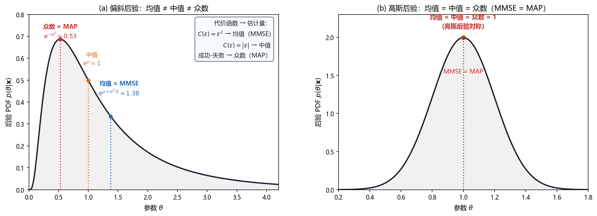

# Vol1 Ch11 一般贝叶斯估计量：后验分布之上，怎么把它变成一个数

> 对应原书：第一卷《估计理论》第 11 章（书内第 277~305 页，本扫描 PDF 第 292~320 页）。
> 前置阅读：本系列 `Vol1_Ch10_贝叶斯原理.md`（后验 PDF、贝叶斯线性模型）、原书第 7 章（MLE）；本文自包含，涉及的前置概念就地插播。

## 写在前头

这是讲解系列的第 11 篇，贝叶斯路线的第二篇。第 10 章做了一件事：把"先验知识"锻造成了**后验 PDF** $p(\boldsymbol{\theta}\mid\mathbf{x})$。但后验是一个**分布**，工程上你要交付的是一个**数**（"距离 12.3 公里""电压 9.8 伏"）。**本章回答的问题：有了后验分布，怎么把它变成一个数值估计，并且说清这个数有多好？**

答案是两种主流玩法，对应两个不同的"好"的定义：

- **MMSE**（最小均方误差）：取后验的**重心**（条件均值），使平方误差的平均值最小——第 10 章已经见过，本章把它推广到矢量并说清性能；
- **MAP**（最大后验）：取后验的**峰**（众数），本质是"最大似然 + 先验修正项"——不碰积分，好算，但付出了"非线性变换不可交换"的代价。

本章还兑现了第 7 篇 §4.3 埋下的伏笔：**低 SNR 下 MLE 会被假峰（野值）带跑，贝叶斯路线用先验压制野值，在低 SNR 区夺回性能**——这个机理在本章的维纳滤波例子里落地（§5）。

**本章一句话设计目标：在后验分布之上建立"重心"（MMSE）与"峰"（MAP）两种玩法，用风险函数把它们统一，再用误差 PDF / 误差椭圆说清它们的性能。**

**实测声明**：本章事实性内容核对自原书扫描件 OCR 文本 `Temp/chapters_ocr/ch11/ocr_page_292~320.txt`（PDF 第 292~320 页，即书内第 277~305 页）；公式编号（11.1）~（11.40）沿用原书编号。Fig015 为本系列自建数值实验（脚本 `Temp/scripts/make_fig015.py`），仅用于把"均值≠中值≠众数"与"高斯后验三者重合"画成图形。例 11.4 的 $\sigma^2$ MAP 公式因 OCR 残缺，据 Kay 英文原版校订（见实现备忘）。

---

## 1. 风险函数：把"估计好坏"统一成"平均代价"

### 1.1 问题驱动：为什么非要惩罚平方误差？

第 10 章从头到尾只用一个准则：最小化均方误差 $E[(A-\hat{A})^2]$。**凭什么误差要平方？误差大一点、小一点，代价真的该按平方增长吗？** 原书 §11.3 用"代价函数"的视角把这件事说透。

设估计误差为 $\varepsilon=\hat{\theta}-\theta$（估计量减去真值），给它配一个**代价函数** $C(\varepsilon)$：误差越大，代价越大。**平均代价**就叫**贝叶斯风险**（式 11.1）：

$$
R=E\bigl[C(\varepsilon)\bigr] \tag{11.1}
$$

其中期望对联合 PDF $p(\mathbf{x},\theta)$ 求取。原书图 11.1 给了三种代价函数：

| 代价函数 | 形状 | 含义 |
|---------|------|------|
| $C(\varepsilon)=\varepsilon^2$ | 二次型 | 误差按平方惩罚，小误差几乎不罚、大误差重罚 |
| $C(\varepsilon)=|\varepsilon|$ | 绝对误差 | 误差按比例惩罚（式 11.2） |
| 成功-失败（hit-or-miss） | 门限 | $\|\varepsilon\|<\delta$ 时代价为 0，否则为 1（式 11.3） |

其中第三种（式 11.3）对超过门限 $\delta$ 的任何误差都记"一次失败"，$\delta$ 取很小。"二次型好算"是它流行的主因，但**换一个代价函数，"最佳估计量"就换一个**——这是本章的第一个观念升级。

### 1.2 三种代价 → 三个估计量：均值、中值、众数

把式（11.1）写开（式 11.4），仿照第 10 章"对每个 $\mathbf{x}$ 最小化内层积分"的做法，逐一代价函数求最佳：

- **二次型** → 第 10 章已证：$\hat{\theta}=E(\theta\mid\mathbf{x})$，**后验均值**（MMSE）；
- **绝对误差** → 对 $\hat{\theta}$ 求导（用 Leibnitz 准则），得 $\int_{-\infty}^{\hat{\theta}}p(\theta\mid\mathbf{x})d\theta=\int_{\hat{\theta}}^{\infty}p(\theta\mid\mathbf{x})d\theta$，即 $\Pr\{\theta\le\hat{\theta}\mid\mathbf{x}\}=\tfrac12$——**后验中值**；
- **成功-失败** → 内层积分为 $1-\int_{\hat{\theta}-\delta}^{\hat{\theta}+\delta}p(\theta\mid\mathbf{x})d\theta$，要使它最小就要使 $\int_{\hat{\theta}-\delta}^{\hat{\theta}+\delta}p(\theta\mid\mathbf{x})d\theta$ 最大；对任意小的 $\delta$，选 $p(\theta\mid\mathbf{x})$ 最大值位置即**后验众数**——这就是 **MAP（maximum a posteriori，最大后验）估计量**。

**翻译成人话：最小化"平方代价"取后验的重心（均值），最小化"绝对代价"取后验的中点（中值），最小化"成功-失败代价"取后验的最高点（众数）。** 原书图 11.2 把这个对应关系画成两幅小图：一般偏斜后验下三者位置不同；高斯后验（对称）下三者重合于一点。

**性质与限制**：① 三种代价函数都**关于 $\varepsilon$ 对称**（正负误差同样处罚）——这是默认假设，现实中代价未必对称（比如"估计偏低比偏高危险得多"），非对称代价属于更高级的话题，本书不展开；② "最佳"不是绝对的，**你选什么代价函数，就得到什么估计量**——这句话要刻进肌肉记忆。

Fig015 把"三者不同/重合"画了出来：

*图 Fig015：MMSE（均值）与 MAP（众数）在同一后验下的位置对比（自建实验，对数正态 $\mu{=}0$、$\sigma{=}0.8$ 与高斯 $\mathcal{N}(1,0.04)$）。左图看一个偏斜的后验：众数（MAP，$e^{-\sigma^2}{=}0.53$）、中值（$e^{\mu}{=}1$）、均值（MMSE，$e^{\mu+\sigma^2/2}{=}1.38$）三者明显不同——分别对应成功-失败、绝对误差、二次型三种代价函数的最优点；右图看高斯后验：对称性让均值=中值=众数=1，即 MMSE=MAP。结论：一般后验下 MMSE 与 MAP 是两个不同的数，只在高斯（对称）后验下重合。*

**一句话总结："最佳估计量"不是唯一概念——代价函数一换，最佳估计量就换；二次型/绝对/成功-失败分别对应后验的均值/中值/众数。**

---

## 2. MMSE：矢量扩展、线性可交换、独立数据叠加

### 2.1 问题驱动：参数是矢量怎么办？

第 10 章的 MMSE 基本是标量的。参数是 $p$ 维矢量 $\boldsymbol{\theta}$ 时怎么办？原书 §11.4 的回答：**逐分量取后验均值，其余分量当多余参数积分掉**。

要估 $\theta_1$，就把 $\theta_2,\dots,\theta_p$ 看成多余参数，求边缘后验（式 11.5）：

$$
p(\theta_1\mid\mathbf{x})=\int p(\boldsymbol{\theta}\mid\mathbf{x})\,d\theta_2\cdots d\theta_p \tag{11.5}
$$

于是（式 11.7、11.10）：

$$
\hat{\theta}_i=E(\theta_i\mid\mathbf{x}),\quad i=1,\dots,p
\qquad\Longleftrightarrow\qquad
\hat{\boldsymbol{\theta}}=E(\boldsymbol{\theta}\mid\mathbf{x})=\int \boldsymbol{\theta}\,p(\boldsymbol{\theta}\mid\mathbf{x})\,d\boldsymbol{\theta} \tag{11.10}
$$

其中期望对矢量后验 PDF $p(\boldsymbol{\theta}\mid\mathbf{x})$ 求取。**矢量 MMSE 没有新内容：就是逐分量取后验均值，每个分量独立地使自己的 MSE 最小。**

最小贝叶斯 MSE 也随之推广（式 11.12、11.13）：

$$
\mathrm{Bmse}(\theta_i)=\int\bigl[C_{\theta\mid x}\bigr]_{ii}\,p(\mathbf{x})\,d\mathbf{x},\qquad
C_{\theta\mid x}=E\bigl[(\boldsymbol{\theta}-E(\boldsymbol{\theta}\mid\mathbf{x}))(\boldsymbol{\theta}-E(\boldsymbol{\theta}\mid\mathbf{x}))^T\bigr] \tag{11.12, 11.13}
$$

其中 $C_{\theta\mid x}$ 为后验协方差矩阵，$[\cdot]_{ii}$ 取第 $i$ 个对角元。**翻译成人话：$\theta_i$ 的最小贝叶斯 MSE，就是"后验方差矩阵第 $i$ 个对角元"对数据 PDF 的平均。**

### 2.2 例 11.1 贝叶斯傅里叶分析：先验把经典解按一个比例因子收缩

一个能算到底的例子：单频正弦加噪声（$M{=}1$ 的简化，原书例 4.2 的贝叶斯版）

$$
x[n]=a\cos 2\pi f_0 n+b\sin 2\pi f_0 n+w[n],\qquad n=0,1,\dots,N-1
$$

其中 $f_0$ 是 $1/N$ 的倍数（且非 $0$ 或 $1/2$），$w[n]$ 为方差 $\sigma^2$ 的 WGN。待估 $\boldsymbol{\theta}=[a\ b]^T$，先验 $\boldsymbol{\theta}\sim\mathcal{N}(\mathbf{0},\sigma_A^2 I)$ 且与 $w[n]$ 独立。**这个模型叫"瑞利衰落正弦信号"**，描述通过色散介质传播的正弦（幅相随机）。这是贝叶斯线性模型 $\mathbf{x}=\mathbf{H}\boldsymbol{\theta}+\mathbf{w}$，其中 $\mathbf{H}$ 的两列是 $\cos$ 与 $\sin$ 基（各列正交，$\mathbf{H}^T\mathbf{H}=\tfrac{N}{2}I$）。

套定理 10.3 的替代形式（10.32），得 MMSE 估计量

$$
\hat{\boldsymbol{\theta}}=\bigl(\mathbf{H}^T\mathbf{H}+\tfrac{\sigma^2}{\sigma_A^2}I\bigr)^{-1}\mathbf{H}^T\mathbf{x}
=\frac{1}{1+\dfrac{2\sigma^2}{N\sigma_A^2}}\cdot\bigl(\mathbf{H}^T\mathbf{H}\bigr)^{-1}\mathbf{H}^T\mathbf{x}
$$

其中 $(\mathbf{H}^T\mathbf{H})^{-1}\mathbf{H}^T\mathbf{x}$ 正是**经典线性模型的 MVU 估计量**。**结论：贝叶斯 MMSE = 经典 MVU × 比例因子 $1/(1+2\sigma^2/(N\sigma_A^2))$。** 当先验知识少（$\sigma_A^2\gg 2\sigma^2/N$）时比例因子趋近 1，两者相同；先验越强（$\sigma_A^2$ 小），收缩越狠。后验协方差与 $\mathbf{x}$ 无关：

$$
C_{\theta\mid x}=\Bigl(\tfrac{1}{\sigma_A^2}I+\tfrac{N}{2\sigma^2}I\Bigr)^{-1},\qquad
\mathrm{Bmse}(a)=\mathrm{Bmse}(b)=\frac{1}{\dfrac{1}{\sigma_A^2}+\dfrac{N}{2\sigma^2}}
$$

**一个值得记住的极限**（式 11.14）：无先验知识时 $C_{\theta}^{-1}\to\mathbf{0}$，MMSE 退化为 $(H^TC_w^{-1}H)^{-1}H^TC_w^{-1}\mathbf{x}$——正是经典一般线性模型的 MVU（第 4 章）。**贝叶斯与经典在此合流：不是对立的路线，而是一条路线在"先验强度 → 0"时的极限。**

### 2.3 MMSE 的三条好脾气

原书接着列了 MMSE 的三条性质（§11.4，习题 11.8/11.9 的配套）：

1. **线性（仿射）变换可交换**（式 11.15、11.16）：要估 $\boldsymbol{\alpha}=A\boldsymbol{\theta}+b$（$A$ 已知矩阵、$b$ 已知矢量），则 $\hat{\boldsymbol{\alpha}}=A\hat{\boldsymbol{\theta}}+b$。因为期望是线性算子，**对任何联合 PDF 都成立**，不限于高斯。
2. **独立数据集的叠加性**（式 11.17）：若 $\mathbf{x}_1,\mathbf{x}_2$ 独立且都与 $\boldsymbol{\theta}$ 联合高斯，则 $\hat{\boldsymbol{\theta}}=E(\boldsymbol{\theta})+C_{\theta x_1}C_{x_1}^{-1}(\mathbf{x}_1-E(\mathbf{x}_1))+C_{\theta x_2}C_{x_2}^{-1}(\mathbf{x}_2-E(\mathbf{x}_2))$——**先验 + 两批独立数据的贡献直接相加**。这是第 13 章序贯 MMSE（卡尔曼）的地基。
3. **联合高斯下 MMSE 是数据的线性函数**（式 11.17 直接可见）：这让误差 PDF 唾手可得（§4）。

**一句话总结：矢量 MMSE 就是"逐分量取后验均值"；它在线性变换下可交换、对独立数据可叠加、联合高斯下是线性的——这三条性质让第 13 章的序贯估计成为可能。**

---

## 3. MAP：后验的峰，MLE 的先验修正版

### 3.1 问题驱动：MMSE 要积分，有没有不碰积分的玩法？

MMSE 的后验均值是积分，非共轭先验下根本算不出闭式（第 10 章 §2.3 的墙）。**有没有只要求"最大化"、不用积分的估计量？** 有，就是 MAP（式 11.18）：

$$
\hat{\theta}=\arg\max_{\theta}\, p(\theta\mid\mathbf{x})=\arg\max_{\theta}\, p(\mathbf{x}\mid\theta)\,p(\theta) \tag{11.18}
$$

或取对数（式 11.19）：

$$
\hat{\theta}=\arg\max_{\theta}\bigl[\ln p(\mathbf{x}\mid\theta)+\ln p(\theta)\bigr] \tag{11.19}
$$

其中第二步是因为后验的分母 $p(\mathbf{x})$ 与 $\theta$ 无关。**看清楚这个式子：$\ln p(\mathbf{x}\mid\theta)$ 就是第 7 章的对数似然，$\ln p(\theta)$ 是先验项。MAP = MLE + 一个先验修正项。** 除先验项外，它就是 MLE 的再现。

### 3.2 三个例子：MAP 长什么样

**例 11.2 指数 PDF。** 观测 IID 指数分布 $p(x[n]\mid\theta)=\theta\exp(-\theta x[n])$（$x[n]>0$），先验也是指数 $p(\theta)=\lambda\exp(-\lambda\theta)$。对数后验 $g(\theta)=N\ln\theta-\theta\sum x[n]+\ln\lambda-\lambda\theta$，求导令零得

$$
\hat{\theta}=\frac{N}{\sum_{n=0}^{N-1}x[n]+\lambda}
$$

其中 $\lambda$ 为先验参数。**两个极限**：$N\to\infty$ 时 $\hat{\theta}\to 1/\bar{x}$（$E[x[n]\mid\theta]=1/\theta$，所以 $1/\bar{x}\to\theta$，自洽）；$\lambda\to0$（先验近似均匀）时 $\hat{\theta}\to N/\sum x[n]=1/\bar{x}$——**这就是贝叶斯 MLE**（原书图 11.3：$\lambda$ 很小时条件 PDF 支配先验，最大值不受先验影响）。

**例 11.3 WGN 中 DC 电平——均匀先验。** 第 10 章的均匀先验例子：MMSE 是截断高斯的均值，无闭式。**MAP 却一步到位**：后验 PDF 是截断高斯（分母与 $A$ 无关），最大值位置一目了然（式 11.20，原书图 11.4）：

$$
\hat{A}=\begin{cases}-A_0 & \bar{x}<-A_0\\ \bar{x} & |\bar{x}|\le A_0\\ A_0 & \bar{x}>A_0\end{cases} \tag{11.20}
$$

**翻译成人话：MAP 就是"把经典估计量 $\bar{x}$ 夹进已知范围 $[-A_0,A_0]$"——数据若落在合理区间就用数据，落出去了就放弃数据、只信先验。** 这正是第 10 章 §1.1 那个"截断样本均值"的正式登场：它在经典框架里是"有偏但 MSE 更小"的野路子，在贝叶斯框架里就是均匀先验下的 MAP。**MAP 不需要积分、只求最大，通常比 MMSE 好算**——但"求最大"也有第 7 章 §7.7 提醒过的坑（局部极值、不收敛），代价要照实说。

**例 11.4 WGN 中 DC 电平——未知方差（共轭先验）。** 现在 $\boldsymbol{\theta}=[A\ \sigma^2]^T$ 都未知。取共轭先验：$p(A\mid\sigma^2)=\mathcal{N}(\mu_A,\sigma^2)$（$A$ 的先验方差恰好等于 $\sigma^2$）、$p(\sigma^2)$ 为逆伽马（例 10.3 的 $p(\sigma^2)\propto(\sigma^2)^{-2}\exp(-\lambda/\sigma^2)$ 情形）。联合最大化 $p(\mathbf{x}\mid A,\sigma^2)p(A\mid\sigma^2)p(\sigma^2)$ 得（据 Kay 英文原版校订，OCR 该页公式残缺）：

$$
\hat{A}=\frac{N\bar{x}+\mu_A}{N+1},\qquad
\hat{\sigma}^2=\frac{\sum_{n=0}^{N-1}\bigl(x[n]-\hat{A}\bigr)^2+\bigl(\hat{A}-\mu_A\bigr)^2+2\lambda}{N+5}
$$

其中 $\bar{x}$ 为样本均值、$\lambda$ 为先验参数。$N\to\infty$ 时 $\hat{A}\to\bar{x}$、$\hat{\sigma}^2\to\tfrac1N\sum(x[n]-\bar{x})^2$——**MAP 又退化成（贝叶斯）MLE**。原书由此点出一般规律：**$N\to\infty$ 时数据 PDF 支配先验，MAP 变成贝叶斯 MLE**；若似然形式与经典似然族相同，则三者（MAP、贝叶斯 MLE、经典 MLE）形式一致。

### 3.3 MAP 的性质与两条命门

原书 §11.5 收尾列出 MAP 的关键性质：

1. **高斯后验下 MAP = MMSE**：后验对称时峰与重心重合。所以第 10 章的贝叶斯线性模型里，MMSE 和 MAP 是同一个估计量——**高斯共轭是两者"合流"的场景**。
2. **MAP 对非线性变换不可交换**（例 11.5）：估计 $\beta=1/\theta$ 时，$\hat{\beta}\ne1/\hat{\theta}$。原因是 $\theta$ 是随机变量，先验 PDF 变换要带雅可比因子 $|d\theta/d\beta|=1/\beta^2$（即 $p_\beta(\beta)=p_\theta(1/\beta)/\beta^2$），于是 $\hat{\beta}=(\sum x[n]+\lambda)/(N+2)$ 而不是 $1/\hat{\theta}=(\sum x[n]+\lambda)/N$。**对照 MLE 的不变性（第 7 章定理 7.2）：MLE 对任意变换都不变，MAP 只对线性变换不变（习题 11.12）——这是 MAP 相对 MLE 的一份代价。**
3. **矢量 MAP ≠ 逐分量标量 MAP**（式 11.22 vs 11.23，原书图 11.5）：逐分量标量 MAP 要每个分量的边缘后验（含积分），矢量 MAP 则直接最大化联合后验 $\hat{\boldsymbol{\theta}}=\arg\max p(\boldsymbol{\theta}\mid\mathbf{x})=\arg\max p(\mathbf{x}\mid\boldsymbol{\theta})p(\boldsymbol{\theta})$（式 11.23、11.24）。**两者通常不同**（图 11.5 的矩形/正方形例子：矢量 MAP 落在正方形内，标量 MAP 落在 $1<\theta_2<2$ 区间）。原书约定：以后说的 MAP 指矢量 MAP（它使一个稍不同的贝叶斯风险最小，见习题 11.11）。

**一句话总结：MAP 是"加了先验正则项的最大似然"——保留"最可能"的直观、绕开积分，但牺牲了对非线性变换的稳定性，也牺牲了 MMSE 的"平均最优"保证。**

---

## 4. 性能描述：误差 PDF、贝叶斯 MSE 矩阵、误差椭圆

### 4.1 问题驱动：随机参数下，"估计量的方差"还有意义吗？

经典路线里，估计量是随机变量（数据随机），性能用均值、方差描述。**贝叶斯路线里，参数本身也随机，估计量的 PDF 对每个 $\theta$ 的现实都不同**（原书图 11.6）。怎么统一说清性能？原书 §11.6 的答案：**改用"误差 $\varepsilon=\hat{\theta}-\theta$"的 PDF**——它把参数的随机性也吸收进去了，好估计量意味着这个 PDF 集中在零附近。

对 MMSE 估计量 $\hat{\theta}=E(\theta\mid\mathbf{x})$，误差的均值是零：

$$
E_{\mathbf{x},\theta}(\varepsilon)=E_{\mathbf{x}}\bigl[\theta-E(\theta\mid\mathbf{x})\bigr]=E_{\mathbf{x}}\bigl[E(\theta\mid\mathbf{x})-E(\theta\mid\mathbf{x})\bigr]=0
$$

误差的方差恰等于最小贝叶斯 MSE：$\mathrm{var}(\varepsilon)=E_{\mathbf{x},\theta}(\varepsilon^2)=\mathrm{Bmse}(\theta)$。若误差是高斯分布，则（式 11.26）：

$$
\varepsilon\sim\mathcal{N}\bigl(0,\mathrm{Bmse}(\theta)\bigr) \tag{11.26}
$$

**例 11.6**（WGN 中 DC 电平、高斯先验）：$\hat{A}$ 与 $\mathbf{x}$ 线性相关、$\mathbf{x}$ 与 $A$ 联合高斯，所以 $\varepsilon=\hat{A}-A$ 是高斯，$\varepsilon\sim\mathcal{N}(0,\mathrm{Bmse}(\hat{A}))$。$N\to\infty$ 时 PDF 塌陷到零——**这就是"贝叶斯意义下的一致估计"**：数据足够多时，$\hat{A}$ 无论 $A$ 的现实是什么都收敛到它。

### 4.2 矢量版：贝叶斯 MSE 矩阵与误差椭圆

矢量误差 $\boldsymbol{\varepsilon}=\hat{\boldsymbol{\theta}}-\boldsymbol{\theta}$ 的协方差矩阵记为 $\mathbf{M}=E(\boldsymbol{\varepsilon}\boldsymbol{\varepsilon}^T)$，**其对角线元素正是各分量的最小贝叶斯 MSE**（§11.4 的式 11.12），因此也叫**贝叶斯 MSE 矩阵**。对贝叶斯线性模型（定理 10.3），因后验协方差与 $\mathbf{x}$ 无关，有（式 11.27~11.29）：

$$
\mathbf{M}_{\theta}=C_{\theta}-C_{\theta}H^T\bigl(HC_{\theta}H^T+C_w\bigr)^{-1}HC_{\theta}=\bigl(C_{\theta}^{-1}+H^TC_w^{-1}H\bigr)^{-1} \tag{11.28, 11.29}
$$

且误差矢量精确高斯（式 11.30）：

$$
\boldsymbol{\varepsilon}\sim\mathcal{N}(\mathbf{0},\mathbf{M}_{\theta}) \tag{11.30}
$$

**性质与限制**：这个精确高斯结论**只在贝叶斯线性模型（联合高斯）下成立**——误差是 $\mathbf{x}$ 与 $\boldsymbol{\theta}$ 的线性变换，联合高斯线性变换仍高斯。非高斯场合要另想办法。

**例 11.7（例 11.1 继续）**把性能画成了**误差椭圆**。由 $\mathbf{H}^T\mathbf{H}=\tfrac{N}{2}I$，$\mathbf{M}_{\theta}=(\tfrac1{\sigma_A^2}+\tfrac{N}{2\sigma^2})^{-1}I$，误差分量独立、$\mathrm{Bmse}(a)=\mathrm{Bmse}(b)$。误差矢量落在椭圆（式 11.31）

$$
\boldsymbol{\varepsilon}^T\mathbf{M}_{\theta}^{-1}\boldsymbol{\varepsilon}=c^2 \tag{11.31}
$$

内的概率为 $P=\Pr(\boldsymbol{\varepsilon}^T\mathbf{M}_{\theta}^{-1}\boldsymbol{\varepsilon}\le c^2)$。因 $\boldsymbol{\varepsilon}^T\mathbf{M}_{\theta}^{-1}\boldsymbol{\varepsilon}$ 是 $\chi^2_2$ 随机变量（习题 11.13），可得 $P=1-\exp(-c^2/2)$，或反解 $c^2=-2\ln(1-P)$。原书取 $\sigma_A^2{=}1$、$\sigma^2/N{=}1/2$（此时 $\mathbf{M}_{\theta}=\tfrac12 I$），误差圆半径随概率增大而扩张（原书图 11.7）：

| 概率 $P$ | 0.5 | 0.9 | 0.99 |
|:---:|:---:|:---:|:---:|
| 误差圆半径（半轴） | 0.83 | 1.52 | 2.15 |

**翻译成人话：误差椭圆是"误差矢量以概率 $P$ 落进去的那个区域"——它把贝叶斯 MSE 矩阵从一串数字画成了一个可视的精度几何。** 一般地，$\mathbf{M}_{\theta}$ 不比例于单位矩阵时，等值线是椭圆（习题 11.14、11.15）。

最后原书把本节收成**定理 11.1（贝叶斯线性模型下 MMSE 估计量的性能）**（式 11.32~11.36）：MMSE 估计量由式（11.32）/（11.33）给出，误差 $\boldsymbol{\varepsilon}=\hat{\boldsymbol{\theta}}-\boldsymbol{\theta}$ 高斯、零均值、协方差即最小 MSE 矩阵 $\mathbf{M}_{\theta}$，其对角元 $[\mathbf{M}_{\theta}]_{ii}=\mathrm{Bmse}(\theta_i)$。

**一句话总结：MMSE 的性能用"误差协方差矩阵 $\mathbf{M}_{\theta}$"一句话说清——高斯、零均值、协方差等于最小贝叶斯 MSE 矩阵；误差椭圆把这条矩阵结论画成了概率几何。**

---

## 5. 信号处理的例子：解卷积与维纳滤波的诞生（兑现第 7 篇的伏笔）

### 5.1 问题驱动：贝叶斯线性模型在信号处理里能干什么？

§11.7 是全章的收账时刻。通信里发射 $s(t)$ 经过冲击响应 $h(t)$ 的信道，输出被噪声污染（原书图 11.8）；地震勘探里 $s(t)$ 是爆炸信号、$h(t)$ 是地层；图像里 $s$ 是清晰图像、$h$ 是失焦。**问题：从被噪声污染的、失真拉长的观测 $x(t)$ 里，把 $s(t)$ 估出来——这叫"解卷积"**（deconvolution）。

连续模型（式 11.37）：

$$
x(t)=\int h(t-\tau)\,s(\tau)\,d\tau+w(t),\qquad 0\le t\le T
$$

其中 $w(t)$ 为零均值 WSS 高斯噪声。**关键假设**：① $h(t)$ 已知（否则是"盲解卷积"，原书明说那是"相当难的问题"）；② $s(t)$ 是随机过程的一个现实（语音信号随说话人变化，这个假设合理）——**于是贝叶斯框架天然适用**。

离散化（附录 11A：采样 $\Delta=1/(2B)$，$B$ 为带宽）后变成卷积和（式 11.38 的矩阵形式）：

$$
\mathbf{x}=\mathbf{H}\mathbf{s}+\mathbf{w}
$$

其中 $\mathbf{H}$ 由 $h[n]$ 构成、**因果性使其为下三角矩阵**，$\mathbf{w}$ 为 WGN（方差 $\sigma^2=N_0B$）。这正是 $p{=}n_s$（参数数=信号点数）的贝叶斯线性模型。设信号零均值、WSS，先验 $\mathbf{s}\sim\mathcal{N}(\mathbf{0},C_s)$（$[C_s]_{ij}=r_{ss}[i-j]$，由 ACF/PSD 确定），则 MMSE 估计量（式 11.39）：

$$
\hat{\mathbf{s}}=C_sH^T\bigl(HC_sH^T+\sigma^2 I\bigr)^{-1}\mathbf{x} \tag{11.39}
$$

### 5.2 H=I：当"参数个数 = 数据个数"，经典失效、贝叶斯救命

透明信道 $h[n]=\delta[n]$（$\mathbf{H}=I$）是最有教育意义的特例，此时 $\mathbf{x}=\mathbf{s}+\mathbf{w}$。**经典线性模型要求 $N>p$（数据比参数多），但这里参数数=数据数 $n_s$，经典 MVU 退化成 $\hat{\mathbf{s}}=\mathbf{x}$——没有任何"平均"，估计量就是原始数据。** 贝叶斯路线因为有先验，$N=p$ 甚至 $N<p$ 都照常工作，MMSE 估计量（式 11.40）：

$$
\hat{\mathbf{s}}=C_s\bigl(C_s+\sigma^2 I\bigr)^{-1}\mathbf{x}=\mathbf{A}\mathbf{x} \tag{11.40}
$$

其中 $\mathbf{A}=C_s(C_s+\sigma^2 I)^{-1}$ 就是**维纳滤波器**（第 12 章详述）。看标量版最直观：据 $x[0]$ 估 $s[0]$，

$$
\hat{s}[0]=\frac{r_{ss}[0]}{r_{ss}[0]+\sigma^2}\,x[0]=\frac{\eta}{\eta+1}\,x[0]
$$

其中 $\eta=r_{ss}[0]/\sigma^2$ 为 SNR。**高 SNR（$\eta$ 大）时 $\hat{s}[0]\approx x[0]$（信数据）；低 SNR（$\eta\to0$）时 $\hat{s}[0]\to0$（收缩到先验均值 0，放弃数据）。** 原书用 AR(1) 过程做了数值演示（图 11.9 的 PSD、图 11.10 的滤波前后）：加 5 dB SNR 的 WGN 后，维纳滤波把噪声起伏平滑掉了，**代价是信号也被平滑了——这是典型的折衷**，而且维纳滤波器起低通作用（习题 11.18）。

### 5.3 兑现第 7 篇的伏笔：先验如何压制野值

第 7 篇 §4.3 埋过一句话：**低 SNR 下非线性估计的 MLE 会被假峰（野值）带跑，贝叶斯路线用先验压制野值，在低 SNR 区夺回性能。** 现在把机理亮出来：低 SNR 意味着 $\sigma^2$ 相对信号功率很大，于是收缩因子 $\eta/(\eta+1)$ 趋近 0，估计值 $\hat{s}[0]$ 被硬生生拉向先验均值 0。**噪声拱出的那些假尖峰（野值），在收缩之后被大幅压低——先验扮演了"常识刹车"的角色，不让单个极端样本把估计值带飞。** 代价（第 7 篇也预告过、这里再强调）就是信号自身也被收缩，低 SNR 下你拿不到"噪声全滤掉、信号全保留"的白魔法——只能在这两者之间按 SNR 做加权折衷。

**一句话总结：当"参数个数 $\ge$ 数据个数"时，经典路线束手无策，贝叶斯先验把估计问题从"不可能"变成"平滑 + 收缩"——这就是维纳滤波器的出身，也是第 7 篇"先验压制野值"伏笔的兑现。**

---

## 6. 关键设计决策回顾

把散落在正文里的"为什么"收拢。每个决策都是一个真实岔路口：

| # | 决策 | 为什么这么选 | 换一个选择会怎样 |
|---|------|------------|----------------|
| 1 | 用**风险函数** $R=E[C(\varepsilon)]$ 统一"好坏" | "最佳估计量"依赖代价函数，需要一个统一框架把 MMSE/MAP/中值装进去 | 只认二次型代价，就永远发现不了"中值、众数也是最优（在各自代价下）" |
| 2 | MAP 用**最大化**而非积分 | 非共轭先验下后验均值无闭式（第 10 章 §2.3 的墙）；最大化绕开积分 | 用 MMSE，则均匀先验例（例 11.3）只能数值积分 |
| 3 | 矢量 MAP 定义为**联合后验的峰**（而非逐分量边缘峰） | 逐分量标量 MAP 需要每个分量的边缘后验（含 $p-1$ 维积分）；联合峰免去积分 | 用逐分量标量 MAP，矢量场合又退回积分，且与联合峰不一致（图 11.5） |
| 4 | 性能用**误差 PDF / 误差椭圆**描述 | 随机参数下"估计量方差"随 $\theta$ 现实而变；误差 PDF 把参数随机性吸收进去 | 沿用经典"估计量的均值/方差"，对随机参数没有统一口径 |
| 5 | 例 11.4 用**共轭先验**（高斯-逆伽马） | 让未知方差下的联合 MAP 有闭式 | 用任意先验，联合最大化要数值迭代 |
| 6 | 解卷积假定 **$h(t)$ 已知** | 盲解卷积"相当难"（原书原话），已知 $h$ 才能落进贝叶斯线性模型 | 挑战盲解卷积，超出本书范围、无法给闭式 |

## 7. 实现备忘（复现与移植时的坑）

1. **页码映射**：本章书内第 277~305 页对应 PDF 第 292~320 页（**书内页码 = PDF 页码 − 15**）；定理 11.1 在 PDF 310 页附近。
2. **例 11.4 的 $\sigma^2$ MAP 公式经英文原版校订**：OCR 该页公式严重残缺，本文给出的 $\hat{\sigma}^2=(\sum(x[n]-\hat{A})^2+(\hat{A}-\mu_A)^2+2\lambda)/(N+5)$ 依据 Kay 英文原版（先验 $p(\sigma^2)\propto(\sigma^2)^{-2}e^{-\lambda/\sigma^2}$，即逆伽马形状参数 $\alpha{=}1$）。分母 $N{+}5=N{+}3{+}2\alpha$、分子 $2\lambda$ 由此而来。复现时若把形状参数换成别的值，分母跟着变。
3. **误差椭圆半径是"半轴"不是 $c$**：例 11.7 中 $\mathbf{M}_{\theta}=\tfrac12 I$，椭圆半径 $=c/\sqrt2$；$P{=}0.5/0.9/0.99$ 对应 $c^2=-2\ln(1-P)$，半径 $0.83/1.52/2.15$。引用这组数时别把它当成 $c$ 本身。
4. **矢量 MAP ≠ 标量边缘 MAP**：式（11.22）与（11.23）是两个不同的估计量（图 11.5）。复现代码时若按"逐分量取 argmax"实现，得到的是标量 MAP，与原书此后所称的"MAP"（矢量 MAP）不一致。
5. **MAP 对非线性变换不互换**：例 11.5 中 $\hat{\beta}=(\sum x[n]+\lambda)/(N+2)\ne1/\hat{\theta}$。实现"先估 $\theta$ 再算 $\beta=1/\theta$"的捷径会错——先验变换必须带雅可比 $1/\beta^2$。线性（可逆）变换没问题（习题 11.12）。
6. **维纳滤波器是"收缩"算子**：$\mathbf{A}=C_s(C_s+\sigma^2 I)^{-1}$ 高 SNR 接近单位阵（几乎原样保留数据）、低 SNR 接近零矩阵（几乎全收缩到先验均值）。复现时看到"估计值比观测值幅度小"不是 bug，是收缩的必然。
7. **OCR 校订**：本章 OCR 把 $\theta$ 误识为 "6"、$\bar{x}$ 误识为 "元"、"众数/中值"偶有错位，本文已按 Kay 英文原版校订符号；式（11.1）~（11.40）与英文原版一致。

## 8. 局限（坦率交代，并预告后续）

1. **MAP 没有"平均最优"保证**：它最小化的是成功-失败代价，不是 MSE；且求最大有局部极值、不收敛的风险（第 7 章 §7.7 的坑原样继承）。
2. **误差椭圆只在贝叶斯线性模型（联合高斯）下精确成立**：非高斯场合 $\boldsymbol{\varepsilon}\sim\mathcal{N}(\mathbf{0},\mathbf{M}_{\theta})$ 失效，要数值方法。
3. **维纳滤波器是"批处理"**：式（11.39）（11.40）需要整个数据块、要做矩阵求逆。序贯/递推形式交给第 12 章（序贯 LMMSE）与第 13 章（卡尔曼）。
4. **本章解卷积假定 $h(t)$ 已知**：盲解卷积是原书明确回避的更难问题。
5. **先验（尤其 $C_s$）难以精确指定**：错误先验同样导致整体偏差——这是第 10 章 §9 局限的延续，也是贝叶斯路线的通病；第 12 章线性 MMSE 把要求放宽到"只需二阶矩"，部分缓解了这条。

---

## 9. 建议自测的问题

1. 三种代价函数（二次型/绝对/成功-失败）分别对应后验的哪个统计量？高斯后验下为什么三者重合？（提示：§1.2 与 Fig015）
2. 例 11.2 指数 PDF 的 MAP：$\lambda\to0$（先验近似均匀）时结果是什么？$N\to\infty$ 时呢？（答案：都是 $1/\bar{x}$，即贝叶斯 MLE）
3. 为什么 MAP 对 $\beta=1/\theta$ 不满足不变性，而 MLE 满足？（提示：先验 PDF 变换带雅可比 $|d\theta/d\beta|$）
4. 贝叶斯线性模型下误差协方差 $\mathbf{M}_{\theta}=(C_{\theta}^{-1}+H^TC_w^{-1}H)^{-1}$，当 $C_{\theta}^{-1}\to0$（无先验）时它变成什么？与经典一般线性模型的方差有何关系？
5. $H=I$、$\mathbf{x}=\mathbf{s}+\mathbf{w}$ 时，为什么经典 MVU 失效而贝叶斯 MMSE 有效？（提示：参数数=数据数，无平均可用；先验提供了收缩）

---

**一句话收尾：这一章在后验分布之上立起了两种玩法——MMSE 取重心、MAP 取峰——并用风险函数说清了它们各自在为什么样的"好"卖命；当参数多到经典路线无路可走时，贝叶斯先验把估计变成了一次"收缩"，维纳滤波器就此诞生。**

*实测核对声明：本章事实性内容核对自原书扫描件 OCR 文本 `Document/统计信号处理/Temp/chapters_ocr/ch11/ocr_page_292~320.txt`（PDF 第 292~320 页）；公式编号（11.1）~（11.40）与原书一致，符号经 Kay 英文原版校订；例 11.4 的 $\sigma^2$ MAP 公式据英文原版校订（OCR 残缺）；Fig015 由 `Temp/scripts/make_fig015.py` 生成并经 `plotutil.check_figure` 程序化碰撞检测通过。*
