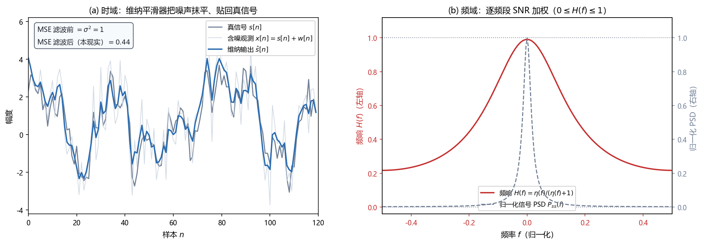

# Vol1 Ch12 线性贝叶斯估计量：只肯给出一、二阶矩时，最优线性估计长什么样

> 对应原书：第一卷《估计理论》第 12 章（书内第 306~337 页，本扫描 PDF 第 321~352 页）。
> 前置阅读：本系列 `Vol1_Ch10_贝叶斯原理.md`（后验 PDF、贝叶斯线性模型）、`Vol1_Ch11_一般贝叶斯估计量.md`（MMSE/MAP、维纳滤波器的诞生）；本文自包含，涉及的前置概念就地插播。

## 写在前头

这是讲解系列的第 12 篇，贝叶斯路线的第三篇，也是**把贝叶斯估计从"理论上最优"拉回"工程上可算"的转折章**。第 10 章把先验知识锻造成了后验 PDF，第 11 章把后验变成了一个数（MMSE 取重心、MAP 取峰）。但第 11 章结尾留了一堵墙没拆：**MMSE 要做多重积分，MAP 要做多维最大值求解，两者都只在"联合高斯"假设下才给出闭式解**（第 10 章 §2.3 已经撞过一次墙）。工程上，我们往往只给得出数据与参数的前两阶矩——均值与协方差——却给不出完整的联合 PDF。怎么办？

Kay 给的答案是**退一步：保留 MMSE 准则，但把估计量限定在线性函数类里**。线性约束让估计量只依赖一、二阶矩，闭式解唾手可得，代价是它只在线性类里最优（准最佳）。这个估计量就是 **LMMSE（线性最小均方误差）估计量**，它在实践中有一个响亮的名字——**维纳滤波器**。

**本章一句话设计目标：在"只知道均值与协方差"的前提下，求出线性类里使贝叶斯 MSE 最小的估计量，并把它落地成滤波/平滑/预测三大信号处理结构。**

**实测声明**：本章事实性内容核对自原书扫描件 OCR 文本 `Temp/chapters_ocr/ch12/ocr_page_321~352.txt`（PDF 第 321~352 页，即书内第 306~337 页）；公式编号（12.1）~（12.68）沿用原书编号，符号经 Kay 英文原版校订（OCR 大量把 θ 误识为 "6"、σ 误识为 "g"、"正交/投影"偶有错位，见文末备忘）。Fig016 为本系列自建数值实验（脚本 `Temp/scripts/make_fig016.py`，种子 20260916），参数自选、与原书无冲突，仅用于把维纳滤波的"时域前后对比 + 频域收缩"画成图形。

---

## 1. 为什么必须限定线性：MMSE 与 MAP 的两堵墙

### 1.1 问题驱动：联合高斯之外，MMSE/MAP 都算不动

第 11 章的结论摆在桌上：MMSE 估计量是后验均值（含积分），MAP 是后验峰（含最大化）。对联合高斯的数据和参数，这两者都退化成数据的线性函数，闭式解一次到位。但**一旦离开联合高斯**，比如第 10 章例 10.1 的均匀先验 DC 电平，后验是"截断高斯"，MMSE 的均值就没有解析式（只能数值积分）；MAP 虽然好算，却牺牲了"平均最优"的保证（第 11 章 §3.3 的代价）。

更麻烦的是，工程里很多场合**根本不知道完整的联合 PDF**——只知道"信号均值是多少、方差多大、信号和噪声协方差长什么样"。**为了区区一、二阶矩就去凑一个联合高斯假设，往往是不敢下、也不该下的赌注。**

### 1.2 解法：不换准则，换估计量的形状

Kay 的做法很有分寸感：**MMSE 准则（二次型代价）不动，只把"估计量可以长什么样"这一自由度锁死为线性**。线性（严格说是仿射）估计量写成

$$
\hat{\theta} = \sum_{n=0}^{N-1} a_n x[n] + a_N \tag{12.1}
$$

其中 $\hat{\theta}$ 为对随机参数 θ 的估计量，$x[0],\ldots,x[N-1]$ 为数据样本，$a_0,\ldots,a_{N-1}$ 为各样本的加权系数，$a_N$ 为常偏置项（允许数据与参数均值非零，若均值全为零则该系数自动消失，后面会证明）。选择这些系数使贝叶斯 MSE

$$
\mathrm{Bmse}(\hat{\theta}) = E\bigl[(\theta - \hat{\theta})^2\bigr] \tag{12.2}
$$

最小，其中期望对联合 PDF $p(\mathbf{x},\theta)$ 求取。**注意误差写成 $\theta - \hat{\theta}$**（与经典路线的 $\hat{\theta}-\theta$ 相反），这是第 10 章就定下的记号，为的是让后面的几何解释里"误差矢量"和"数据矢量"能直接做内积。

**翻译成人话：与其在"所有函数"里找最好的估计量（要积分、要最大化），不如在"线性函数"这个好算的子集里找最好的——线性函数只有 N+1 个系数要定，而确定它们只需要二阶矩。** 这个思路和经典路线里的 BLUE（第 6 章）如出一辙：BLUE 也是"无偏 + 线性"里找最小方差，二者是同一个哲学在经典与贝叶斯两个世界观下的镜像。

### 1.3 代价先亮出来：LMMSE 是"准最佳"，且对"不相关参数"无能为力

限定线性是有代价的，本章开头就把两笔账摆明。

**第一笔账：除非 MMSE 恰好是线性的，否则 LMMSE 不是全局最优。** 原书 §12.3 给了一个一针见血的反例：设单一数据 $x[0]\sim\mathcal{N}(0,\sigma^2)$，待估参数是它的功率 $\theta = x^2[0]$。**理想的估计量就是 $\hat{\theta} = x^2[0]$，最小 MSE 等于零**——但它是非线性的。若强行套 LMMSE（$\hat{\theta}=a_0x[0]+a_N$），求导令零后会发现 $a_0=0$、$a_N=E(\theta)=\sigma^2$，于是 LMMSE 退化成一个**与数据无关的常数 $\hat{\theta}=\sigma^2$**，最小 MSE 为 $2\sigma^4$（原书算的是 $E[x^4]-2\sigma^2E[x^2]+\sigma^4=3\sigma^4-2\sigma^4+\sigma^4=2\sigma^4$）。**原因一目了然：$\theta=x^2[0]$ 与 $x[0]$ 不相关**（$E[x^3[0]]=0$），线性估计量靠的就是相关性，相关性为零，线性就无计可施。

**第二笔账：LMMSE 完全依赖"相关性"这个燃料。** 和数据不相关的参数不可能被线性地估计——上例里 θ 与数据不相关，LMMSE 只能给先验均值。**这两笔账就是本章后续一切结论的边界：LMMSE 只在"相关性存在 + 线性类够用"时才是好工具。**

**一句话总结：LMMSE = 保留 MMSE 准则 + 限定线性形状；换来"只需二阶矩"的闭式解，付出"准最佳"与"不相关参数无解"两份代价。**

---

## 2. 标量 LMMSE 闭式解：均值修正 + 协方差收缩

### 2.1 问题驱动：系数怎么定？

把（12.1）代入（12.2），对 $a_N$ 求导令零，先得（推导见原书 §12.3）：

$$
a_N = E(\theta) - \sum_{n=0}^{N-1} a_n E(x[n]) \tag{12.3}
$$

其中 $E(\theta)$、$E(x[n])$ 分别为参数与数据的均值。**翻译成人话：偏置项 $a_N$ 负责把"非零均值"对消掉**——若均值全为零，$a_N=0$，后面只处理零均值情形即可。把（12.3）代回去，问题化简为对零均值变量求 $\mathbf{a}=[a_0,\ldots,a_{N-1}]^T$，得到二次型（式 12.4），对其梯度令零（用第 4 章式 4.3 的梯度公式），得到**正规方程**

$$
C_{xx}\mathbf{a} = C_{x\theta} \tag{12.5}
$$

其中 $C_{xx}$ 为数据的 $N\times N$ 协方差矩阵，$C_{x\theta}$ 为 $N\times 1$ 互协方差矢量（$C_{x\theta}=E[\mathbf{x}\theta]$，性质 $C_{x\theta}=C_{\theta x}^T$）。解得 $\mathbf{a}=C_{xx}^{-1}C_{x\theta}$，代回（12.1）并整理，得到**标量 LMMSE 估计量**：

$$
\hat{\theta} = E(\theta) + C_{\theta x}\,C_{xx}^{-1}\bigl(\mathbf{x} - E(\mathbf{x})\bigr) \tag{12.6}
$$

其中 $C_{\theta x}=E[(\theta-E(\theta))(\mathbf{x}-E(\mathbf{x}))^T]$ 为 $1\times N$ 互协方差矢量，$C_{xx}$ 为数据协方差矩阵，$E(\mathbf{x})$ 为数据均值矢量。**这个式子的形状必须记住：先取先验均值 $E(\theta)$，再用"互协方差 × 数据协方差逆 ×（数据与均值的偏差）"去修正。** 零均值时简化为

$$
\hat{\theta} = C_{\theta x}\,C_{xx}^{-1}\,\mathbf{x} \tag{12.7}
$$

**性质与限制**：① 这个式子与联合高斯下的 MMSE（第 10 章式 10.24）**在形式上完全相同**——因为高斯情形下 MMSE 恰好是线性的，自动满足线性约束；② 但它**不需要高斯假设**，只需要 $C_{xx}$、$C_{\theta x}$、两个均值共二阶矩；③ 失效边界就是 §1.3 的两笔账：$C_{\theta x}=0$（不相关）时 LMMSE 退化成先验均值，完全没用。

最小贝叶斯 MSE 也一并给出（式 12.8）：

$$
\mathrm{Bmse}(\theta) = C_{\theta\theta} - C_{\theta x}\,C_{xx}^{-1}\,C_{x\theta} \tag{12.8}
$$

其中 $C_{\theta\theta}$ 为参数方差。**翻译成人话：参数的先验不确定性 $C_{\theta\theta}$，减去"数据相关性消除掉的那部分" $C_{\theta x}C_{xx}^{-1}C_{x\theta}$，剩下的就是估完之后还残存的不确定性。** 相关性越强，扣得越多，残差越小。

### 2.2 例 12.1：均匀先验 DC 电平——LMMSE 一步出闭式，MMSE 要积分

回到第 10 章那个让 MMSE 撞墙的例子：$x[n]=A+w[n]$，$n=0,1,\ldots,N-1$，其中 $A\sim U[-A_0,A_0]$（均匀先验），$w[n]$ 为方差 $\sigma^2$ 的 WGN，$A$ 与 $w[n]$ 独立。**MMSE 因积分无闭式（式 10.9），LMMSE 却一步到位。** 首先 $E(A)=0$ 故 $E(x[n])=0$，数据协方差为 $C_{xx}=\sigma_A^2\mathbf{1}\mathbf{1}^T+\sigma^2 I$（其中 $\mathbf{1}$ 为 $N\times 1$ 全 1 矢量，$\sigma_A^2=E(A^2)$），互协方差为 $C_{\theta x}=E(A\mathbf{x}^T)=E(A^2)\mathbf{1}^T=\sigma_A^2\mathbf{1}^T$。代入（12.7），形式与例 10.2 相同，得到（式 12.9）：

$$
\hat{A} = \frac{\sigma_A^2}{\sigma_A^2+\sigma^2/N}\,\bar{x}, \qquad \sigma_A^2 = \frac{A_0^2}{3} \tag{12.9}
$$

其中 $\bar{x}$ 为样本均值，$\sigma_A^2=(2A_0)^2/12=A_0^2/3$ 为均匀先验的方差。**看清楚这个式子的结构：它和第 10 章式 10.11 的高斯先验 MMSE 长得一模一样，都是"先验精度与数据精度的加权平均"——但这里压根没假设 $A$ 是高斯，甚至没假设 $w[n]$ 是高斯。** 原书 §12.3 专门点明这四层"不用"：不用知道 $A$ 的分布形状（只要均值方差）、不用知道 $w[n]$ 是高斯（只要白且方差 $\sigma^2$）、不用 $A$ 与 $w$ 独立（只要不相关）、不用求积分。**总之，确定 LMMSE 只要 $p(\mathbf{x},\theta)$ 的前两阶矩。**

**代价照实说**：式（12.9）的 LMMSE 是准最佳的——本题真正的最优是（10.9）那个截断高斯后验均值（要数值积分）。**LMMSE 用"闭式 + 只需二阶矩"换掉了"最优性"**，两者在"数据多到先验被淹没"时趋于一致，有限样本下 LMMSE 略差。

**一句话总结：LMMSE 的闭式解（12.6）是"先验均值 + 协方差加权修正"，它和高斯 MMSE 同形、却只需二阶矩——例 12.1 把 MMSE 撞墙的均匀先验题，用 LMMSE 一步解了出来。**

---

## 3. 几何解释：为什么"误差 ⊥ 数据"是最优的充要条件

### 3.1 问题驱动：为什么最优线性估计量必须让误差与数据正交？

上一节的推导是"求导令零"的代数游戏，能得到答案，但看不到**为什么**。原书 §12.4 给了第二个视角：把随机变量看成矢量空间的元素，用几何重推一遍——这个视角不但讲透了"正交原理"，还是后面序贯估计（§5）和卡尔曼滤波（第 13 章）的推导地基。

> **前置概念：把随机变量当"矢量"。** 零均值随机变量 $x$ 的"长度"定义为 $\|x\|=\sqrt{E(x^2)}$，即标准差的平方根；两个零均值随机变量 $x,y$ 的"内积"定义为
>
> $$
> (x,y) = E(xy) \tag{12.10}
> $$
>
> 于是 $\|x\|^2=(x,x)=E(x^2)$ 与长度定义自洽，而"正交"就是内积为零：
>
> $$
> (x,y)=E(xy)=0 \tag{12.12}
> $$
>
> **翻译成人话：在这个空间里，"正交"= "不相关"**（零均值时内积就是协方差）。方差越大矢量越长；方差为零的"随机变量"长度为零，就是恒等于零。这个空间是更一般的希尔伯特空间的特例（原书引 Luenberger 1969）。

### 3.2 投影定理：误差最短当且仅当它垂直于数据张成的子空间

现在要估 $\theta$，把它和数据 $x[0],\ldots,x[N-1]$ 都当成空间里的矢量。**估计量 $\hat{\theta}=\sum a_nx[n]$ 是所有数据样本的线性组合，也就是数据张成的子空间里的一个矢量。** 最小化贝叶斯 MSE $E[(\theta-\hat\theta)^2]$ 就是**最小化误差矢量 $\varepsilon=\theta-\hat\theta$ 的长度的平方**。几何直觉（原书图 12.3）：一个矢量到子空间里所有点的连线中，**最短的那条是垂线**。于是最优估计量满足

$$
\varepsilon \;\bot\; x[0],\; x[1],\;\ldots,\; x[N-1] \tag{12.13}
$$

即对每个数据样本，误差与它正交：

$$
E\bigl[(\theta-\hat{\theta})\,x[n]\bigr] = 0, \qquad n=0,1,\ldots,N-1 \tag{12.14}
$$

**这就是"正交原理"（投影定理）**：**用数据线性组合估计随机变量时，当且仅当误差与每一个数据样本正交（不相关），估计量才是线性类里 MSE 最小的那个。** 把（12.14）展开，得到的正是正规方程（12.15/12.16）$C_{xx}\mathbf{a}=C_{x\theta}$——和代数推导殊途同归，但多了一句话的几何意义：**误差里凡是还和数据"沾边"（相关）的部分，都是可以继续利用、继续压低 MSE 的残量；直到误差与数据彻底正交，线性估计才"榨干了"数据。**

### 3.3 两个推论：不相关就无计可施、正交数据可拆开投影

推论一呼应 §1.3：若某数据 $x$ 与 $\theta$ 正交（不相关），则它在 $\theta$ 方向没有分量，用它估计 $\theta$ 的最佳系数是零（原书图 12.2）。**相关性是线性估计的唯一燃料。**

推论二（例 12.2）：若 $x[0]$、$x[1]$ 彼此正交但都与 $\theta$ 相关，那么 $\theta$ 的 LMMSE 估计量就是它在这两个正交方向上的**投影之和**：

$$
\hat{\theta} = \frac{E(\theta x[0])}{E(x^2[0])}\,x[0] + \frac{E(\theta x[1])}{E(x^2[1])}\,x[1]
$$

其中每一项是"投影长度 × 该方向单位矢量"。**能这么简单地拆开相加，靠的正是 $x[0]\perp x[1]$（即 $C_{xx}$ 对角）。** 这为 §5 埋下伏笔：数据不正交时，先把它正交化（Gram-Schmidt），就能套用同样的拆开相加，这正是序贯估计的几何根源。

**一句话总结：正交原理说，最优线性估计量的误差必须与每个数据样本不相关——它把"求导令零"翻译成了"垂线最短"，并顺手为序贯估计铺好了路。**

---

## 4. 矢量 LMMSE 与贝叶斯高斯-马尔可夫定理

### 4.1 问题驱动：参数是矢量时，前面结论还剩多少？

工程里几乎全是矢量参数（正弦的幅度+相位、滤波器的整组抽头）。原书 §12.5 的回答是：**逐分量做标量 LMMSE，再拼成一个矢量**。对每个分量 $\theta_i$ 套（12.6），合并成

$$
\hat{\boldsymbol{\theta}} = E(\boldsymbol{\theta}) + C_{\theta x}\,C_{xx}^{-1}\bigl(\mathbf{x}-E(\mathbf{x})\bigr) \tag{12.20}
$$

其中 $\boldsymbol{\theta}$ 为 $p\times1$ 参数矢量，$C_{\theta x}$ 为 $p\times N$ 互协方差矩阵，$C_{xx}$ 为数据协方差矩阵。最小贝叶斯 MSE 矩阵为（式 12.21）

$$
\mathbf{M}_{\theta} = E\bigl[(\boldsymbol{\theta}-\hat{\boldsymbol{\theta}})(\boldsymbol{\theta}-\hat{\boldsymbol{\theta}})^T\bigr] = C_{\theta\theta} - C_{\theta x}\,C_{xx}^{-1}\,C_{x\theta} \tag{12.21}
$$

其中 $C_{\theta\theta}$ 为 $p\times p$ 参数协方差矩阵，且各分量最小贝叶斯 MSE 是它的对角元（式 12.22）：

$$
\mathrm{Bmse}(\theta_i) = [\mathbf{M}_{\theta}]_{ii} \tag{12.22}
$$

**翻译成人话：矢量 LMMSE 没有任何新内容，就是 p 个标量 LMMSE 竖着码成一列；性能矩阵 $\mathbf{M}_{\theta}$ 的对角元就是各分量的最小贝叶斯 MSE。**

### 4.2 两条好脾气：线性变换可交换、未知量之和可叠加

LMMSE 有两条对后续推导极其有用的性质（习题 12.8）：

1. **线性（仿射）变换可交换**：若 $\boldsymbol{\alpha}=A\boldsymbol{\theta}+\mathbf{b}$（$A$、$\mathbf{b}$ 已知），则
   $$
   \hat{\boldsymbol{\alpha}} = A\hat{\boldsymbol{\theta}} + \mathbf{b} \tag{12.23}
   $$
2. **可叠加**：若 $\boldsymbol{\alpha}=\boldsymbol{\theta}_1+\boldsymbol{\theta}_2$，则
   $$
   \hat{\boldsymbol{\alpha}} = \hat{\boldsymbol{\theta}}_1 + \hat{\boldsymbol{\theta}}_2 \tag{12.24}
   $$

**这两条性质是第 13 章卡尔曼滤波推导的两块基石**（届时会反复用"预测是 $a\hat{s}$ 的线性变换""$x[n]=s[n]+w[n]$ 的估计是两部分之和"），这里先埋下伏笔。**性质与限制**：这两条对任何联合 PDF 都成立（只依赖线性/可加性），不限于高斯——这正是 LMMSE 比 MMSE 更"低要求"的地方。

### 4.3 定理 12.1（贝叶斯高斯-马尔可夫定理）：不要高斯，也要闭式

把 LMMSE 套到贝叶斯线性模型 $\mathbf{x}=H\boldsymbol{\theta}+\mathbf{w}$ 上，得到本章的招牌定理。它和第 10 章定理 10.3 的区别只有一个字：**不要求高斯**。

> **定理 12.1【贝叶斯高斯-马尔可夫定理】** 若数据由贝叶斯线性模型描述
>
> $$
> \mathbf{x} = H\boldsymbol{\theta} + \mathbf{w} \tag{12.25}
> $$
>
> 其中 $\mathbf{x}$ 为 $N\times1$ 数据矢量，$H$ 为已知 $N\times p$ 观测矩阵，$\boldsymbol{\theta}$ 为 $p\times1$ 待估随机矢量（均值 $E(\boldsymbol{\theta})$、协方差 $C_{\theta}$），$\mathbf{w}$ 为 $N\times1$ 噪声（零均值、协方差 $C_w$，且与 $\boldsymbol{\theta}$ **不相关**——联合 PDF $p(\mathbf{w},\boldsymbol{\theta})$ 任意）。则 $\boldsymbol{\theta}$ 的 LMMSE 估计量为
>
> $$
> \hat{\boldsymbol{\theta}} = E(\boldsymbol{\theta}) + C_{\theta}H^T\bigl(HC_{\theta}H^T+C_w\bigr)^{-1}\bigl(\mathbf{x}-HE(\boldsymbol{\theta})\bigr) \tag{12.26}
> $$
>
> 或等价地（矩阵求逆引理）
>
> $$
> \hat{\boldsymbol{\theta}} = E(\boldsymbol{\theta}) + \bigl(C_{\theta}^{-1}+H^TC_w^{-1}H\bigr)^{-1}H^TC_w^{-1}\bigl(\mathbf{x}-HE(\boldsymbol{\theta})\bigr) \tag{12.27}
> $$
>
> 估计误差 $\boldsymbol{\varepsilon}=\hat{\boldsymbol{\theta}}-\boldsymbol{\theta}$ 均值为零，协方差矩阵为
>
> $$
> C_{\varepsilon} = C_{\theta} - C_{\theta}H^T\bigl(HC_{\theta}H^T+C_w\bigr)^{-1}HC_{\theta} = \bigl(C_{\theta}^{-1}+H^TC_w^{-1}H\bigr)^{-1} \tag{12.28, 12.29}
> $$
>
> 且对角元就是各分量的最小贝叶斯 MSE：
>
> $$
> [\mathbf{M}_{\theta}]_{ii} = [C_{\varepsilon}]_{ii} = \mathrm{Bmse}(\theta_i) \tag{12.30}
> $$

**性质与限制**：① 这个定理与第 11 章定理 11.1 的唯一差别是**误差不必是高斯**——那里要求联合高斯，这里只要不相关；② 它仍然只是**线性类里最优**（准最佳），除非 $E(\boldsymbol{\theta}\mid\mathbf{x})$ 恰好是线性的（联合高斯正是如此）；③ 形式（12.29）自带"信息相加"解读：后验精度 $C_\varepsilon^{-1}$ = 先验精度 $C_\theta^{-1}$ + 数据信息 $H^TC_w^{-1}H$，与第 10 章完全同构。

**好处与优势**：**不要求高斯，只要二阶矩，闭式解照给**——这是本章"降级不降质"的高光时刻。代价前面已重复两遍：准最佳，且相关性强弱决定成败。

**一句话总结：定理 12.1 把第 10 章的贝叶斯线性模型从"高斯"放宽到"任意 PDF、只要二阶矩"，闭式解（12.26）~（12.30）原样成立，代价只是把"MMSE"降级为"线性类里的 MMSE"。**

---

## 5. 序贯 LMMSE：数据一块一块来，只修正、不重算

### 5.1 问题驱动：数据是一块一块到的，每次全量重算太亏

前四节的 LMMSE 都是**批处理**：拿到整个数据矢量 $\mathbf{x}$ 才能算 $\hat{\theta}$，每来一个新样本就要重解一次 $C_{xx}$ 的逆。工程上数据是流式到达的（雷达逐帧、语音逐窗），**能不能把新样本对旧估计的贡献"增量地"加进去，而不是推翻重来？** 第 8 章的序贯 LS 已经演示过这个思路，原书 §12.6 把同一招搬到 LMMSE——**这是本章为第 13 章卡尔曼滤波铺的最关键一块地基。**

### 5.2 先看一个算得动的例子：白噪声中的 DC 电平

取例 10.1（高斯先验 DC 电平，$x[n]=A+w[n]$，$A\sim\mathcal{N}(0,\sigma_A^2)$，$w[n]$ 方差 $\sigma^2$），从代数上直接推。基于 $x[0..N-1]$ 的 LMMSE 记为 $\hat{A}[N-1]$，它的最小 MSE 由式 10.14 给出（式 12.31）：

$$
\mathrm{Bmse}(\hat{A}[N-1]) = \frac{\sigma^2\sigma_A^2}{N\sigma_A^2+\sigma^2} \tag{12.31}
$$

当新样本 $x[N]$ 到来，把旧估计 $\hat{A}[N-1]$ 更新为（式 12.32）：

$$
\hat{A}[N] = \hat{A}[N-1] + K[N]\bigl(x[N]-\hat{A}[N-1]\bigr) \tag{12.34}
$$

其中增益因子（式 12.33/12.35）

$$
K[N] = \frac{\mathrm{Bmse}(\hat{A}[N-1])}{\mathrm{Bmse}(\hat{A}[N-1])+\sigma^2} \tag{12.35}
$$

最小 MSE 也递推更新（式 12.36）：

$$
\mathrm{Bmse}(\hat{A}[N]) = (1-K[N])\,\mathrm{Bmse}(\hat{A}[N-1]) \tag{12.36}
$$

**看清楚（12.34）的形状：新估计 = 旧估计 + 增益 ×（新观测 − 旧估计）。** 括号里的 $x[N]-\hat{A}[N-1]$ 是"新数据里没有被旧估计解释掉的那部分"，叫**新息**（innovation）。增益 $K[N]=\frac{\text{旧估计的不确定性}}{\text{旧估计的不确定性}+\text{新样本的噪声}}$，**谁更不确定就少信谁**：$N\to\infty$ 时 $\mathrm{Bmse}(\hat{A}[N-1])\to0$，$K[N]\to0$（旧估计越来越可信，新数据越来越被无视）。这和第 10 章式 10.11 的"精度加权"是同一个思想，只是换成了递推的皮。

### 5.3 几何根源：新息正交化，投影可拆开相加

为什么"旧估计 + 增益 × 新息"这种简单形状成立？用 §3 的矢量空间看就透亮了（原书图 12.5）。$x[0]$、$x[1]$ 一般不正交，所以不能把两个估计简单相加。但可以**先求 $x[1]$ 基于 $x[0]$ 的估计 $\hat{x}[1|0]$，得到新息 $x[1]-\hat{x}[1|0]$，它与 $x[0]$ 正交**（正交原理：误差 ⊥ 数据）。于是 $\theta$ 的估计 = 在 $x[0]$ 上的投影 + 在新息上的投影，两项可拆开相加。**这个过程就是 Gram-Schmidt 正交化**：把相关数据 $x[0],x[1],\ldots$ 逐步换成彼此正交的新息序列，投影逐项相加。对白噪声 DC 电平，$\hat{x}[N|0..N-1]=\hat{A}[N-1]$（因为 $A$ 在观测区间不变、$w[N]$ 与过去不相关），所以新息恰好是 $x[N]-\hat{A}[N-1]$，与（12.34）严丝合缝。

### 5.4 矢量序贯 LMMSE：卡尔曼的"半成品"

把上面这套推广到矢量（附录 12A），要求数据是贝叶斯线性模型、噪声协方差 $C_w$ 对角（$w[n]$ 不相关、方差 $\sigma_n^2$）。得到序贯矢量 LMMSE（式 12.47~12.49）：

$$
\hat{\boldsymbol{\theta}}[n] = \hat{\boldsymbol{\theta}}[n-1] + K[n]\bigl(x[n]-h^T[n]\hat{\boldsymbol{\theta}}[n-1]\bigr) \tag{12.47}
$$

$$
K[n] = \frac{M[n-1]\,h[n]}{\sigma_n^2 + h^T[n]M[n-1]h[n]} \tag{12.48}
$$

$$
M[n] = \bigl(I - K[n]h^T[n]\bigr)M[n-1] \tag{12.49}
$$

其中 $\hat{\boldsymbol{\theta}}[n]$ 为基于 $x[0..n]$ 的估计，$h^T[n]$ 为观测矩阵的第 $n$ 行，$K[n]$ 为 $p\times1$ 增益矢量，$M[n]$ 为最小 MSE 矩阵，$\sigma_n^2$ 为第 $n$ 个噪声样本的方差。**初始化：$\hat{\boldsymbol{\theta}}[-1]=E(\boldsymbol{\theta})$、$M[-1]=C_{\theta}$**（没有观测数据时，最好的估计就是先验均值，MSE 就是先验协方差）。

原书 §12.6 提醒三点：① 无先验知识时令 $C_{\theta}\to\infty$，得到与序贯 LSE 相同的形式（尽管本质不同）；② **不要求矩阵求逆**（增益只除一个标量 $\sigma_n^2+h^TMh$）；③ 增益 $K[n]$ 由"新样本置信度 $\sigma_n^2$"与"旧数据置信度 $M[n-1]$"折衷决定。例 12.3 用这套序贯公式重做了例 11.1 的贝叶斯傅里叶分析（$h^T[0]=[1\ 0]$，$h^T[n]=[\cos2\pi f_0n\ \sin2\pi f_0n]$）。

**一句话总结：序贯 LMMSE = 新息正交化 + 逐项投影相加，把"每次重解矩阵逆"降成"每来一个样本做一次向量修正"——但它的状态 $\hat{\boldsymbol{\theta}}$ 不随时间演化，这一步在第 13 章由卡尔曼补齐。**

---

## 6. 维纳滤波器：LMMSE 在 WSS 信号上的稳态落地

### 6.1 问题驱动：信号是平稳随机过程时，LMMSE 变成什么？

前五节的参数 $\theta$ 是"一个固定的随机现实"（DC 电平、一组系数）。现在换场景：数据 $x[n]=s[n]+w[n]$ 里，信号 $s[n]$ 和噪声 $w[n]$ 都是**零均值 WSS（宽平稳）随机过程**，要估的是整个信号序列 $s[n]$。此时数据协方差矩阵是**对称 Toeplitz** 结构（式 12.50）：

$$
[C_{xx}]_{ij} = r_{xx}[i-j], \qquad r_{xx}[k]=r_{ss}[k]+r_{ww}[k]
$$

其中 $r_{xx}[k]$ 为观测的 ACF，$r_{ss}[k]$、$r_{ww}[k]$ 为信号与噪声的 ACF（假设信号噪声不相关，故观测 ACF 是两者之和）。**LMMSE 在这个稳态场景的落地形式，就是大名鼎鼎的维纳滤波器。** 原书 §12.7 按"能用到哪些数据"分了三类问题（图 12.7）：

| 问题 | 待估 | 可用数据 | 因果性 |
|------|------|---------|--------|
| 滤波（filtering） | $s[n]$ | $x[0..n]$（当前+过去） | 因果 |
| 平滑（smoothing） | $s[n]$ | $x[0..N-1]$（含未来） | 非因果 |
| 预测（prediction） | $s[N-1+l]$（$l\ge1$） | $x[0..N-1]$（过去） | 因果 |

### 6.2 平滑：$W=R_{ss}(R_{ss}+R_{ww})^{-1}$，频域一句人话

平滑问题用整块数据估每个 $s[n]$，是最对称的情形。套（12.20），有 $C_{xx}=R_{ss}+R_{ww}$、$C_{sx}=R_{ss}$，得到（式 12.53）

$$
\hat{\mathbf{s}} = R_{ss}\bigl(R_{ss}+R_{ww}\bigr)^{-1}\mathbf{x} \tag{12.53}
$$

其中 $\mathbf{x}=[x[0],\ldots,x[N-1]]^T$，$R_{ss}$、$R_{ww}$ 为信号与噪声的自相关矩阵。矩阵

$$
W = R_{ss}\bigl(R_{ss}+R_{ww}\bigr)^{-1} \tag{12.54}
$$

叫**维纳平滑矩阵**，最小 MSE 矩阵为（式 12.55）$\mathbf{M}_s=(I-W)R_{ss}$。$N=1$ 的最小例子最直观（式 12.56）：

$$
W = \frac{r_{ss}[0]}{r_{ss}[0]+r_{ww}[0]} = \frac{\eta}{\eta+1}, \qquad \eta = \frac{r_{ss}[0]}{r_{ww}[0]} \tag{12.56}
$$

其中 $\eta$ 为 SNR（信号功率与噪声功率之比）。**高 SNR（$\eta$ 大）时 $W\to1$，$\hat{s}[0]\to x[0]$（信数据）；低 SNR 时 $W\to0$，$\hat{s}[0]\to0$（收缩到先验均值 0，放弃数据）。** 这就是第 11 章 §5.2 已经见过的"收缩算子"，也是第 7 篇"先验压制野值"伏笔的再次兑现。

**更漂亮的结论在频域。** 无限维纳平滑器（用全部过去和未来的数据，非因果）满足卷积方程 $h[n]\star r_{xx}[n]=r_{ss}[n]$（式 12.62），对 $r_{ss}[n]+r_{ww}[n]$ 取傅里叶变换，直接解出频率响应

$$
H(f) = \frac{P_{ss}(f)}{P_{ss}(f)+P_{ww}(f)} \tag{12.62 频域}
$$

其中 $P_{ss}(f)$、$P_{ww}(f)$ 为信号与噪声的 PSD。**翻译成人话：维纳平滑器在频域是"逐频段的收缩"——定义"局部 SNR" $\eta(f)=P_{ss}(f)/P_{ww}(f)$（中心频率 $f$ 的一个窄带内的 SNR），则 $H(f)=\eta(f)/(\eta(f)+1)$，恒有 $0\le H(f)\le1$：信号 PSD 高的频段 $H\approx1$（保留），噪声占优的频段 $H\approx0$（衰减）。** 这和（12.56）的标量结论一字不差，只是从"整体 SNR"细化为"逐频段 SNR"。

**代价照实说（本节最重要的坦白）**：这个漂亮的频域解 $H(f)$ 是**非因果的**——它是实偶函数（PSD 实偶），对应双边无限冲激响应，估计 $s[n]$ 时要用到未来数据。**能做这个的前提是"先把整段数据收齐再离线处理"**；实时流式场景里未来数据不存在，只能用 §6.3 的因果滤波器。

### 6.3 滤波：维纳-霍夫方程，非因果代价的正面清单

滤波只许用当前+过去数据（因果），标量估计为（式 12.57）

$$
\hat{s}[n] = \mathbf{r}^T\bigl(R_{ss}+R_{ww}\bigr)^{-1}\mathbf{x}, \qquad \mathbf{r} = [r_{ss}[n]\ r_{ss}[n-1]\ \cdots\ r_{ss}[0]]^T
$$

其中 $\mathbf{r}$ 是"待估样本 $s[n]$ 与各数据样本的互协方差"排成的矢量。把它整理成时变 FIR 滤波（式 12.58），冲激响应 $h^{(n)}[k]$ 满足**维纳-霍夫（Wiener-Hopf）滤波方程**（式 12.59）：

$$
\sum_{k=0}^{n} h[k]\,r_{xx}[l-k] = r_{ss}[l], \qquad l=0,1,\ldots,n
$$

其中 $r_{xx}[k]=r_{ss}[k]+r_{ww}[k]$。**翻译成人话：这是"滤波版"的正规方程，每个 $n$ 都要解一次**（每来一个新样本，滤波器都要重新算）。求解用 Levinson 递推（原书引 Marple 1987）。当 $n$ 足够大，滤波器趋于时不变（§6.4），只需一个解；更一般地，无限维纳滤波器（用无限过去数据）满足（式 12.60）

$$
\sum_{k=0}^{\infty} h[k]\,r_{xx}[l-k] = r_{ss}[l], \qquad l=0,1,\ldots
$$

**这条方程只对 $l\ge0$ 成立（因果性把 $l<0$ 砍掉了），所以不能直接傅里叶变换**——解它需要谱分解（习题 12.16）。**这正是因果滤波比非因果平滑多付的代价：平滑一个傅里叶变换就出闭式，滤波却要解单边方程。**

### 6.4 预测：一步预测 = AR 参数，l 步预测按相关系数衰减

预测问题估 $s[N-1+l]$（$l$ 步前看）。套（12.51）得权矢量 $\mathbf{a}=R_{xx}^{-1}\mathbf{r}'$（式 12.63），其中 $\mathbf{r}'=[r_{xx}[l]\ r_{xx}[l+1]\ \cdots\ r_{xx}[N-1+l]]^T$，对应的维纳-霍夫预测方程是（式 12.65）。**一个漂亮的特例**：$l=1$ 的一步线性预测，其系数（取负）就是**线性预测系数**，广泛用于语音建模（原书引 Makhoul 1975），而且导出的方程与 AR(N) 过程的 **Yule-Walker 方程完全相同**（呼应第 7 章例 7.18）。

用 AR(1) 过程（$r_{xx}[k]=\sigma_u^2(-a[1])^k/(1-a^2[1])$，$|a[1]|<1$）算到底：一步预测器是 $\hat{x}[N]=-a[1]x[N-1]$，$l$ 步预测器是（式 12.67）

$$
\hat{x}[(N-1)+l] = \bigl(-a[1]\bigr)^{l}\,x[N-1] \tag{12.67}
$$

**预测值按 $(-a[1])^l$ 随 $l$ 指数衰减到零**——因为预测依据的样本与待预测样本之间的相关 $r_{xx}[l]$ 随 $l$ 衰减到零，相关没了，预测就退回先验均值（这里是零均值）。最小 MSE 也随 $l$ 增大而变大（$l=1$ 最小，趋于信号功率）。原书图 12.8 给了数值例：$a[1]=-0.95$、$\sigma_u^2=0.1$（低通 PSD），$N=11$，$l=1,2,\ldots,40$ 的预测值随 $l$ 衰减到零，**除了 $l$ 很小，预测值一般很差**——这是"预测的极限是相关性"的又一处印证。

### 6.5 一张图看全：维纳滤波的时域效果与频域收缩

Fig016 用自建仿真把 §6.2 的结论画出来：

*图 Fig016：维纳平滑器（非因果频域形式）的时域前后对比与频域收缩（自建实验，种子 20260916，AR(1) 信号 $s[n]=0.9s[n{-}1]+u[n]$、$\sigma_u^2{=}1$，观测噪声 $\sigma^2{=}1$，$N{=}256$）。左图看三件事：① 真信号（灰）被噪声（浅灰）糊得只剩轮廓；② 维纳输出（蓝）把噪声起伏抹平、贴回真信号；③ 峰谷也被轻微平滑——这是"降噪 vs 保真"折衷的可见代价。右图看频响 $H(f)=\eta(f)/(\eta(f){+}1)$（红，$0\le H\le1$）与归一化信号 PSD（灰虚线）：在信号 PSD 高的低频段 $H\approx1$（保留），PSD 低的频段 $H\to0$（衰减）。结论：维纳滤波 = 按"逐频段 SNR"做收缩，信号强的频段留、噪声强的频段砍。本现实 MSE 从 $1.07$（理论噪声功率 $\sigma^2{=}1$）降到 $0.44$。*

**一句话总结：维纳滤波器是 LMMSE 在 WSS 稳态下的化身——平滑/滤波/预测三个问题共用"相关性收缩"的同一个内核；非因果平滑有闭式频响 $H(f)=P_{ss}/(P_{ss}+P_{ww})$，因果滤波则要多付"解单边维纳-霍夫方程"的代价。**

---

## 7. 关键设计决策回顾

把散落在正文里的"为什么"收拢。每个决策都是一个真实岔路口：

| # | 决策 | 为什么这么选 | 换一个选择会怎样 |
|---|------|------------|----------------|
| 1 | **保留 MMSE 准则、限定线性**，而非换准则 | MMSE/MAP 在非高斯下要积分/最大化（§1.1 的墙）；限定线性后闭式解只依赖二阶矩 | 坚持全局 MMSE，则均匀先验（例 12.1）等大量问题只能数值积分，矢量时是高维积分 |
| 2 | 误差写成 **$\theta-\hat{\theta}$** 而非 $\hat{\theta}-\theta$ | 为几何解释铺路：误差矢量直接与数据矢量做内积 $E[(\theta-\hat\theta)x]$ | 沿用经典记号不影响数值，但正交原理的几何推导要改方向 |
| 3 | 用**几何正交原理**重推 LMMSE | "求导令零"看不到为什么；投影定理给出"误差⊥数据"的直观判据，且是序贯推导的地基 | 只靠代数推导，序贯 LMMSE（§5）与卡尔曼（第 13 章）的推导会繁琐到失去直觉 |
| 4 | 定理 12.1 **不要求高斯**（只要不相关+二阶矩） | 工程上常只给得出均值/协方差，凑高斯假设是赌注 | 坚持联合高斯，则贝叶斯高斯-马尔可夫定理的适用范围大幅缩水 |
| 5 | 序贯 LMMSE 用**新息正交化**（Gram-Schmidt） | 相关数据不能拆开投影，正交化后新息的贡献可逐项相加，避免重算 | 每次全量重解 $C_{xx}$ 的逆，流式数据场景算不起 |
| 6 | 维纳滤波按**因果性分三类**（滤波/平滑/预测） | 因果性是实时系统的硬约束，"能用哪些数据"决定了解的结构（单边 vs 双边方程） | 不区分因果性，把非因果平滑的频域闭式误当实时滤波器用，工程上无法落地 |
| 7 | 频域维纳解用**局部 SNR** $\eta(f)=P_{ss}(f)/P_{ww}(f)$ 表述 | 把收缩从"整体 SNR"细化为"逐频段 SNR"，$H=\eta/(\eta+1)$ 一句话说清频响 | 只给 $H=P_{ss}/(P_{ss}+P_{ww})$，看不到"信号强的频段留、噪声强的频段砍"的直觉 |

## 8. 实现备忘（复现与移植时的坑）

1. **页码映射**：本章书内第 306~337 页对应 PDF 第 321~352 页（**书内页码 = PDF 页码 − 15**）；例 12.1 在 PDF 324 页，定理 12.1 在 PDF 330 页，序贯公式（12.47）~（12.49）在 PDF 335 页，维纳频响在 PDF 341 页。
2. **记号口径**：贝叶斯里误差是 $\theta-\hat{\theta}$（不是 $\hat{\theta}-\theta$）；$C_{\theta x}$ 是 $1\times N$（或 $p\times N$）**行矢量/矩阵**，$C_{x\theta}=C_{\theta x}^T$ 是其转置——写代码时别把（12.6）里 $C_{\theta x}C_{xx}^{-1}(\mathbf{x}-E(\mathbf{x}))$ 的乘法顺序搞反。
3. **LMMSE 是"准最佳"**：例 12.1 的（12.9）不是本题全局最优（最优是截断高斯后验均值 10.9）。**凡是宣称"LMMSE 最优"的地方，都必须带上"在线性类里"这个限定词。**
4. **不相关 = 线性估计的无燃料**：$C_{\theta x}=0$ 时（12.6）退化成 $E(\theta)$。若你的问题里"要估的量与数据不相关"，LMMSE 给常数是**正确行为而非 bug**（§1.3 的功率估计反例）。
5. **序贯初始值**：$\hat{\boldsymbol{\theta}}[-1]=E(\boldsymbol{\theta})$、$M[-1]=C_{\theta}$。无先验知识是令 $C_{\theta}\to\infty$（不是"删掉先验项"），此时退化成序贯 LSE 形式（§5.4 原书提醒）。
6. **因果滤波不能直接 FFT**：无限维纳滤波方程（12.60）只对 $l\ge0$ 成立，傅里叶变换法只在**非因果平滑**（式 12.62，双边）成立。把平滑的 $H(f)$ 当因果滤波器用，等于偷偷用了未来数据。
7. **AR(1) 预测器按 $(-a[1])^l$ 衰减**：式（12.67）的 $l$ 步预测随 $l$ 指数衰减到零是**零均值信号的必然**（相关 $r_{xx}[l]$ 衰减），不是滤波器设计缺陷。原书图 12.8 的数值例（$a[1]=-0.95$、$\sigma_u^2=0.1$、$N=11$）正是这个现象。
8. **OCR 校订**：本章 OCR 把 $\theta$ 大量误识为 "6"、$\sigma$ 误识为 "g"、"正交/投影/新息"偶有错位，$\sigma_A^2$ 的表达式在例 12.1 处残缺；本文已按 Kay 英文原版（*Fundamentals of Statistical Signal Processing*, Vol I, Prentice Hall）校订符号与式（12.1）~（12.68），其中（12.9）的 $\sigma_A^2=A_0^2/3$ 由均匀分布方差 $(2A_0)^2/12$ 导出。

## 9. 局限（坦率交代，并预告后续）

1. **非高斯下只在线性类里最优**：LMMSE 是"准最佳"，除非 MMSE 恰好线性（联合高斯）。**更强的非线性估计量是存在的**（§1.3 的功率估计反例，最小 MSE 从 $2\sigma^4$ 压到 0），但要靠联合 PDF 和积分去拿。
2. **不相关参数线性估计无解**：$C_{\theta x}=0$ 时 LMMSE 退化成先验均值，完全没用。这是"相关性是线性估计唯一燃料"的结构性局限，不是实现问题。
3. **批处理形式要整块数据 + 矩阵求逆**：式（12.20）/（12.53）要 $C_{xx}$（$N\times N$，维纳滤波时是 $N\times N$ Toeplitz）的逆，长数据算不起。**序贯形式（12.47）~（12.49）免去矩阵求逆，但状态不随时间演化**——这一条留待第 13 章卡尔曼滤波补齐。
4. **非因果平滑要用未来数据**：漂亮的频域解 $H(f)=P_{ss}/(P_{ss}+P_{ww})$ 是实偶、双边冲激响应，**只能离线批处理**；实时场景退回因果滤波，要解单边维纳-霍夫方程（谱分解）。
5. **稳态假设是维纳滤波的前提**：$R_{ss}$、$R_{ww}$ 都是 WSS 的 ACF，信号/噪声非平稳时（时变方差、时变谱）这套 Toeplitz 结构失效。**第 13 章的卡尔曼滤波正是为"非平稳、时变"而生的推广**——原书第 13 章 §13.1 开宗明义："卡尔曼是维纳滤波的重要推广，能适应非平稳的矢量信号和噪声"。

---

## 10. 建议自测的问题

1. 用自己的话解释：为什么 LMMSE 在"参数与数据不相关"时会退化成先验均值？举 §1.3 功率估计的例子，说明理想估计量与 LMMSE 各是什么、MSE 各是多少。
2. 例 12.1 代入数值：$A_0=3$（故 $\sigma_A^2=3$）、$\sigma^2=1$、$N=12$，求 LMMSE 估计量的加权因子 $\alpha=\sigma_A^2/(\sigma_A^2+\sigma^2/N)$，并解释高 SNR 与低 SNR 两个极限下 $\hat{A}$ 趋向谁。
3. 用正交原理解释：为什么最优线性估计量的误差必须与每个数据样本不相关？若误差还与某个样本相关，说明什么？（提示：§3.2）
4. 原书习题 12.2：数据 $x[n]=Ar^n+w[n]$（$r$ 已知、$A$ 均值 $\mu_A$ 方差 $\sigma_A^2$ 与 $w[n]$ 独立），求 $A$ 的 LMMSE 估计量与最小贝叶斯 MSE。
5. 为什么无限维纳**平滑**器有闭式频响 $H(f)=P_{ss}/(P_{ss}+P_{ww})$，而无限维纳**滤波**器不能直接傅里叶变换？（提示：§6.3，因果性砍掉了 $l<0$）

---

**一句话收尾：LMMSE 用"限定线性"这一刀，把贝叶斯估计从"要积分、要最大化"的象牙塔里解放出来，只靠一、二阶矩就给出闭式解——维纳滤波器就是它落在平稳信号上的样子；而它"状态不演化"的短板，恰好是下一章卡尔曼滤波的起跑线。**

*实测核对声明：本章事实性内容核对自原书扫描件 OCR 文本 `Document/统计信号处理/Temp/chapters_ocr/ch12/ocr_page_321~352.txt`（PDF 第 321~352 页）；公式编号（12.1）~（12.68）与原书一致，符号经 Kay 英文原版校订；例 12.1 的 $\sigma_A^2=A_0^2/3$、§13 功率估计反例的 $2\sigma^4$ 等数值均逐条核对（见 `Temp/素材核对/Vol1_Ch12_核对.md`）。Fig016 由 `Temp/scripts/make_fig016.py` 生成（种子 20260916，AR(1) $a[1]{=}{-}0.9$、$\sigma_u^2{=}1$、$\sigma^2{=}1$），经 `plotutil.check_figure` 程序化碰撞检测通过，MSE 从 1.07 降至 0.44。*
