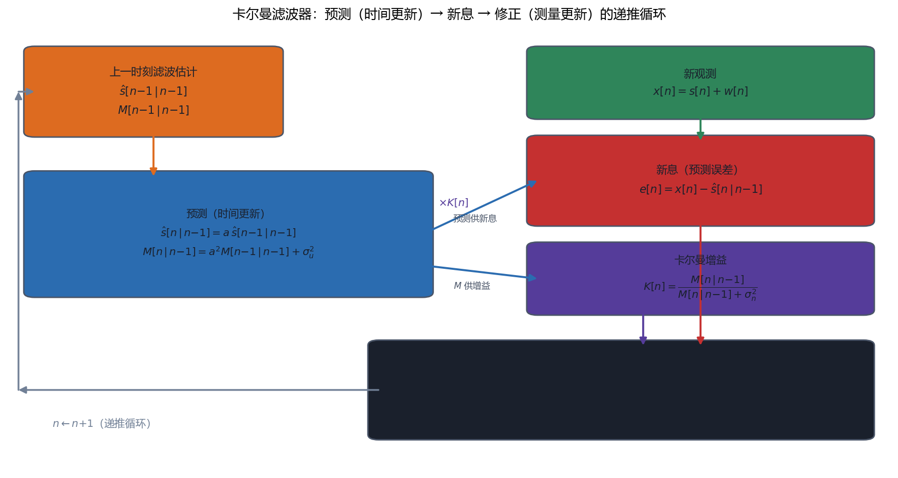
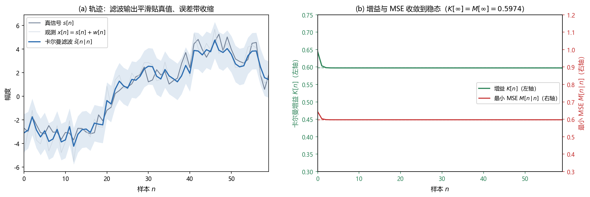

# Vol1 Ch13 卡尔曼滤波器：状态随时间跑，估计也跟着实时跑

> 对应原书：第一卷《估计理论》第 13 章（书内第 338~384 页，本扫描 PDF 第 353~399 页）。
> 前置阅读：本系列 `Vol1_Ch12_线性贝叶斯估计量.md`（序贯 LMMSE、正交原理、维纳滤波）、`Vol1_Ch10_贝叶斯原理.md`（定理 10.2/10.3）、原书第 7 章（§3.6 统计线性化）；本文自包含，涉及的前置概念就地插播。

## 写在前头

这是讲解系列的第 13 篇，贝叶斯路线的收官章，也是**整个第一卷工程价值最高的章节之一**。第 12 章的序贯 LMMSE 解决了"数据一块一块来，只修正不重算"，但它有个前提：**待估参数在观测区间内是不变的**（DC 电平、一组固定系数）。现实里，导弹的位置在动、语音的谱参数在漂、信道的衰落系数在变——**参数本身就是一个随时间演化的随机过程**。第 12 章的工具对"会动的状态"无能为力：每次状态一挪，旧估计就作废。

卡尔曼滤波器的答案是：**给状态配一个"动态方程"，描述它随时间怎么演化，然后把第 12 章的序贯 LMMSE 升级成"预测→观测→更新"的递推状态估计器。** 每一时刻只做两步：先按动态方程把上一时刻的估计"推"到当前（预测），再用新观测把预测"拉"回正确位置（修正）。这就是卡尔曼滤波器，全章五个方程、一个循环。

原书 §13.1 给它的定位一句话到位：**卡尔曼可以看成噪声中的序贯 MMSE 估计量，其中信号用动态/状态方程描述**；若信号与噪声联合高斯，它是**最佳 MMSE**，否则是**最佳 LMMSE**。§13.5 还证明：**维纳滤波器是卡尔曼的稳态极限，卡尔曼是时变/瞬态/序贯的维纳。**

**本章一句话设计目标：把"会演化的状态"塞进一个动态模型，用"预测 + 新息 + 增益"的循环把序贯 LMMSE 升级成能实时跑的状态估计器。**

**实测声明**：本章事实性内容核对自原书扫描件 OCR 文本 `Temp/chapters_ocr/ch13/ocr_page_353~399.txt`（PDF 第 353~399 页，即书内第 338~384 页）；公式编号（13.1）~（13.71）沿用原书编号，符号经 Kay 英文原版校订（OCR 大量把 θ 误识为 "6"、σ 误识为 "g"、s 与 x 混淆，见文末备忘）。§13.5 稳态数值（$K[\infty]{=}0.5974$、$M_p[\infty]{=}1.4839$、$M[\infty]{=}0.5974$）经自建仿真逐项复现核对（Fig018）。Fig017/Fig018 为本系列自建（脚本 `Temp/scripts/make_fig017.py`、`make_fig018.py`，Fig018 种子 20260913）。

---

## 1. 为什么需要动态模型：DC 电平其实不是"电平"

### 1.1 问题驱动：A 真的一直不变吗？

第 12 章反复用的模型是 $x[n]=A+w[n]$，一个恒定 DC 电平。但原书 §13.3 用一个电压表的例子把这条假设戳穿了：**电源标称输出恒定电压 $A$，可真实电压会因温度漂移、器件老化而随时间缓慢变化。** 精确模型应该是

$$
x[n] = A[n] + w[n]
$$

其中 $A[n]$ 是 $n$ 时刻的真实电压值。**代价立刻显现**：原来只估一个参数 $A$，现在要估一串 $A[0],A[1],\ldots$。若把 $A[n]$ 当确定性未知序列，它的 MVU 估计量就是 $\hat{A}[n]=x[n]$（每个样本自己估自己，没有任何平均），方差等于噪声方差 $\sigma^2$——原书图 13.1 展示的这种估计量在真值附近剧烈乱跳，**不可用**。

### 1.2 解法：把"样本之间的相关"建模进去

问题的转机在于一个朴素观察：**真实电压在 10 伏附近，且相邻样本差得不多——$A[n]$ 的各样本高度相关。** 这个"相关约束"正是要利用的东西：它逼着估计量不能随噪声乱跳（相邻时刻的估计也应当接近）。于是把 $A[n]$ 看成**随机过程的一个现实**，用贝叶斯估计——这正是第 12 章维纳滤波对信号 $s[n]$ 做过的事（那里 $s[n]$ 零均值 WSS）。本章沿用 $s[n]$ 记号（$s[n]=A[n]-E(A[n])$ 的零均值化，均值已知）。

描述"相邻样本相关"的最简模型是**一阶高斯-马尔可夫过程**（式 13.1）：

$$
s[n] = a\,s[n-1] + u[n], \qquad n\ge 0 \tag{13.1}
$$

其中 $a$ 为模型系数（$|a|<1$，稳定性要求），$u[n]$ 为方差 $\sigma_u^2$ 的 WGN（叫**驱动/激励噪声**——$s[n]$ 可看成线性时不变系统在 $u[n]$ 驱动下的输出），初值 $s[-1]\sim\mathcal{N}(\mu_s,\sigma_s^2)$ 且与所有 $u[n]$ 独立。

> **前置概念：状态（state）。** 控制文献里把 $n$ 时刻"连同未来输入一起决定未来输出"的信息量叫状态（原书引 Chen 1970）。对一阶模型，$s[n-1]$ 就是状态——它总结了所有过去输入对系统的影响。**翻译成人话：状态是"只需要记住它，就能预测未来"的那个最小信息量。**（不要把这里的"高斯-马尔可夫过程"与第 12 章定理 12.1 的"贝叶斯高斯-马尔可夫定理"混为一谈——原书专门提醒过。）

### 1.3 这个模型长什么样：均值/方差/稳态

把（13.1）展开成初值与驱动的显式函数（式 13.2）：

$$
s[n] = a^{n+1}s[-1] + \sum_{k=0}^{n} a^k u[n-k] \tag{13.2}
$$

其中第一项是初值的贡献，求和项是从起始到当前所有驱动噪声的贡献。**因为 $s[n]$ 是独立高斯变量的线性组合，$s[n]$ 是高斯过程**（习题 13.1）。它的统计可以算到底（式 13.4/13.5/13.6）：

$$
E(s[n]) = a^{n+1}\mu_s \tag{13.4}
$$

$$
c_s[m,n] = a^{m-n}\,\mathrm{var}(s[n]), \qquad m\ge n \tag{13.5}
$$

$$
\mathrm{var}(s[n]) = \sigma_u^2\frac{1-a^{2(n+1)}}{1-a^2} \tag{13.6}
$$

其中 $\mu_s=E(s[-1])$，$\mathrm{var}$ 表示方差，$c_s[m,n]$ 为样本 $m,n$ 的协方差。**性质与限制**：① 均值随 $n$ 变、协方差依赖 $m,n$ 而非只依赖 $m-n$，所以**过程不是 WSS**（这是它与 AR(1) 的唯一差别：在 $n=0$ 起始而非无限过去）；② 但 $n\to\infty$ 时（$|a|<1$）初值项 $a^{n+1}$ 衰减为零，均值趋于 0，方差趋于 $\sigma_u^2/(1-a^2)$，协方差退化成 AR(1) 的 ACF $r_{ss}[k]=\sigma_u^2a^k/(1-a^2)$——**起始条件的影响可忽略，过程实际上变成 WSS**；③ $a\to1$ 时过程强相关（样本高度粘连），$a\to0$ 时几乎不相关——**$a$ 是"相邻样本相关性"的旋钮**。

均值与方差还能写成更省脑的递推形式（式 13.7/13.8），叫**均值/方差传播方程**：

$$
E(s[n]) = a\,E(s[n-1]) \tag{13.7}
$$

$$
\mathrm{var}(s[n]) = a^2\,\mathrm{var}(s[n-1]) + \sigma_u^2 \tag{13.8}
$$

**翻译成人话：（13.8）说方差每一步被 $a^2$ 压一下（$|a|<1$，相关让它收缩），又被 $\sigma_u^2$ 顶一下（驱动噪声让它膨胀）；稳态时两者平衡，解得 $\mathrm{var}=\sigma_u^2/(1-a^2)$。** 原书图 13.3 画了 $a=0.98$、$\sigma_u^2=0.1$ 的均值/方差/稳态 ACF（图 13.2 的对应现实用 $\mu_s=5$、$\sigma_s^2=1$，均值从约 5 快速衰减到 0，是系统对大初值的暂态响应）。

**一句话总结：一阶高斯-马尔可夫过程用两个数（$a$、$\sigma_u^2$）刻画"状态如何随机演化"，$a$ 管相关强度、$\sigma_u^2$ 管演化噪声；它非 WSS 但趋于 AR(1)，均值与方差都有干净的递推形式。**

---

## 2. 矢量高斯-马尔可夫模型：状态不止一维

### 2.1 问题驱动：AR(p) 或矢量信号怎么办？

一阶模型只记住一个状态 $s[n-1]$。AR(p) 过程 $s[n]=-\sum_{k=1}^{p}a[k]s[n-k]+u[n]$（式 13.9）要记住前 $p$ 个样本。原书 §13.3 的做法是**把状态堆成矢量**（式 13.10）：

$$
\mathbf{s}[n-1] = [\,s[n-p]\ \ s[n-p+1]\ \ \cdots\ \ s[n-1]\,]^T
$$

然后把 AR(p) 重写成一次递推（式 13.11）：

$$
\mathbf{s}[n] = A\,\mathbf{s}[n-1] + B\,u[n] \tag{13.11}
$$

其中 $A$ 为 $p\times p$ 状态转移矩阵（最后一行为 $-a[p]\ \cdots\ -a[1]$，其余是移位恒等式），$B$ 为 $p\times1$ 矢量。**翻译成人话：把"记住 p 个过去值"这件事，编码成一个 p 维矢量的一步递推——高维状态换来马尔可夫性（下一步只依赖当前状态）。**

推广到一般矢量，得到**矢量高斯-马尔可夫模型**（式 13.12）：

$$
\mathbf{s}[n] = A\,\mathbf{s}[n-1] + B\,\mathbf{u}[n], \qquad n\ge0 \tag{13.12}
$$

其中 $A$ 为 $p\times p$ 常数状态转移矩阵，$B$ 为 $p\times r$ 常数矩阵，$\mathbf{s}[n]$ 为 $p\times1$ 状态矢量，$\mathbf{u}[n]$ 为 $r\times1$ 驱动噪声矢量。统计假设两条：① $\mathbf{u}[n]$ 为**矢量 WGN**（$E(\mathbf{u}[n])=0$，协方差 $E(\mathbf{u}[n]\mathbf{u}^T[n])=Q$，$Q$ 为 $r\times r$ 正定，样本间独立）；② 初态 $\mathbf{s}[-1]\sim\mathcal{N}(\boldsymbol{\mu}_s,C_s)$ 且与所有 $\mathbf{u}[n]$ 独立。

例 13.1（两个 DC 电源）演示了怎么搭：两个独立电源各用一个标量模型 $s_1[n]=a_1s_1[n-1]+u_1[n]$、$s_2[n]=a_2s_2[n-1]+u_2[n]$，拼成矢量后 $A=\mathrm{diag}(a_1,a_2)$；**若两个输出共享一个电路（相关），则让 $A$、$B$、$Q$ 非对角即可**——这是矢量模型比标量模型多出来的自由度。

### 2.2 定理 13.1：矢量模型的统计性质收拢

矢量版的均值、协方差、传播方程（式 13.13~13.18）与标量完全同构：

$$
\mathbf{s}[n] = A^{n+1}\mathbf{s}[-1] + \sum_{k=0}^{n} A^k B\,\mathbf{u}[n-k] \tag{13.13}
$$

$$
E(\mathbf{s}[n]) = A^{n+1}\boldsymbol{\mu}_s \tag{13.14}
$$

$$
E(\mathbf{s}[n]) = A\,E(\mathbf{s}[n-1]), \qquad C[n] = A\,C[n-1]A^T + BQB^T \tag{13.17, 13.18}
$$

其中 $C[n]$ 为 $\mathbf{s}[n]$ 的协方差矩阵。**（13.18）就是矢量版的"方差传播方程"：$AC[n-1]A^T$ 项让协方差收缩，$BQB^T$ 项让它膨胀。** 稳定性条件是**$A$ 的所有特征值幅度小于 1**（否则均值/方差随 $n$ 指数增长，习题 13.6）。稳态协方差 $C$ 满足 Lyapunov 方程（式 13.20）：

$$
C = A\,C\,A^T + BQB^T \tag{13.20}
$$

它的解 $C=\sum_{k=0}^{\infty}A^kBQB^TA^{kT}$（式 13.19）。原书把这套收拢成**定理 13.1（矢量高斯-马尔可夫模型）**（式 13.21~13.26）。**好处与优势**：矢量模型把"任意维度的相关状态演化"统一成一个 $A$、$B$、$Q$，后面的卡尔曼滤波器无论状态几维，公式长得都一样。**代价**：$A$ 必须稳定（特征值幅度 <1），否则过程无稳态——这是后面"模型失配"局限的根源之一。

**一句话总结：把状态堆成矢量、用 $A$ 做一步转移，任何 AR(p) 或矢量信号都变成同一种高斯-马尔可夫模型；$A$ 的特征值幅度小于 1 是它不爆炸的硬条件。**

---

## 3. 标量卡尔曼滤波器：五个方程，一个循环

### 3.1 问题驱动：状态在动，序贯 LMMSE 怎么改？

现在信号模型是 $s[n]=a\,s[n-1]+u[n]$，观测是 $x[n]=s[n]+w[n]$（式 13.27）：

$$
s[n] = a\,s[n-1]+u[n], \qquad x[n] = s[n]+w[n] \tag{13.27}
$$

其中 $u[n]$ 为零均值驱动噪声（$E(u^2[n])=\sigma_u^2$），$w[n]$ 为零均值观测噪声（$E(w^2[n])=\sigma_n^2$，样本独立——注意它只是"方差可随时间变"这一点上区别于 WGN），$s[-1]$、$u[n]$、$w[n]$ 三者相互独立。**问题：根据 $x[0..n]$ 估计 $s[n]$，且要递推**（新样本一到，只修正旧估计，不重算）。MMSE 估计量是后验均值 $\hat{s}[n|n]=E(s[n]\mid x[0..n])$（式 13.28）。

**为什么能递推？** 核心是第 12 章 §5 的"新息正交化"：把新观测 $x[n]$ 换成它与过去数据不相关的那部分——**新息** $z[n]=x[n]-\hat{x}[n|n-1]$（式 13.30，$\hat{x}[n|n-1]$ 是基于过去数据对 $x[n]$ 的预测）。因为 $x[n]=s[n]+w[n]$ 而 $w[n]$ 与过去无关，$\hat{x}[n|n-1]=\hat{s}[n|n-1]$（式 13.34 附近），所以新息就是 $x[n]-\hat{s}[n|n-1]$。于是（推导见原书 §13.4，用到第 11 章的 MMSE 可加性）：

$$
\hat{s}[n|n] = \hat{s}[n|n-1] + K[n]\bigl(x[n]-\hat{s}[n|n-1]\bigr) \tag{13.33}
$$

$$
\hat{s}[n|n-1] = a\,\hat{s}[n-1|n-1] \tag{13.34}
$$

其中 $\hat{s}[n|n-1]$ 为**预测**（按动态方程把上一时刻估计推过来），$K[n]$ 为卡尔曼增益。

### 3.2 五步递推：每步"为什么这么算"

把推导收成五个方程（式 13.38~13.42），$n\ge0$：

**① 预测（式 13.38）**

$$
\hat{s}[n|n-1] = a\,\hat{s}[n-1|n-1]
$$

**为什么**：$s[n]=a\,s[n-1]+u[n]$，而 $u[n]$ 与过去数据无关（$E(u[n])=0$），所以对 $s[n]$ 的最佳预测就是把上一时刻估计乘 $a$——**驱动噪声不可预测，只能贡献均值 0。**

**② 最小预测 MSE（式 13.39）**

$$
M[n|n-1] = a^2 M[n-1|n-1] + \sigma_u^2
$$

其中 $M[n|n-1]=E[(s[n]-\hat{s}[n|n-1])^2]$ 为一步预测误差方差。**为什么**：预测误差 $a(s[n-1]-\hat{s}[n-1|n-1])+u[n]$ 两项正交（误差与 $u[n]$ 无关），方差直接相加——$a^2$ 放大旧 MSE，$\sigma_u^2$ 是驱动噪声的新不确定性。**这正是（13.8）方差传播方程的估计版。**

**③ 卡尔曼增益（式 13.40）**

$$
K[n] = \frac{M[n|n-1]}{\sigma_n^2 + M[n|n-1]}
$$

**为什么**：新息 $x[n]-\hat{s}[n|n-1]=(s[n]-\hat{s}[n|n-1])+w[n]$ 的方差是 $\sigma_n^2+M[n|n-1]$，而它与 $s[n]$ 的协方差恰是 $M[n|n-1]$（用正交原理，见式 13.35~13.37）。**增益 = 预测不确定性与（预测不确定性 + 观测噪声）之比，谁更不确定就少信谁。**

**④ 修正（式 13.41）**

$$
\hat{s}[n|n] = \hat{s}[n|n-1] + K[n]\bigl(x[n]-\hat{s}[n|n-1]\bigr)
$$

**为什么**：新观测里只有"预测没解释掉的部分"（新息）才带来新信息，按增益 $K[n]$ 加权加回去。**高 SNR（$\sigma_n^2$ 小）时 $K\to1$，几乎全信新观测；低 SNR 时 $K\to0$，几乎守住预测。**

**⑤ 最小 MSE 更新（式 13.42）**

$$
M[n|n] = (1-K[n])\,M[n|n-1]
$$

**为什么**：修正把预测不确定性按比例 $(1-K)$ 压低——数据一到，不确定性就减（因为 $0\le K\le1$）。**初始化：$\hat{s}[-1|-1]=\mu_s$、$M[-1|-1]=\sigma_s^2$**（没有数据时，最好的估计是先验均值，MSE 是先验方差）。

Fig017 把这五步画成循环：

*图 Fig017：标量卡尔曼滤波器"预测→新息→修正"的递推循环（对应原书式 13.38~13.42）。看三件事：① 预测只走动态模型（$a$、$\sigma_u^2$），不碰新数据；② 新观测进来后，先和预测相减得新息 $e[n]=x[n]-\hat{s}[n|n-1]$，再乘以增益 $K[n]$ 加回预测，得到修正估计；③ 增益由"预测 MSE $M[n|n-1]$ 与观测噪声 $\sigma_n^2$"折衷，底部反馈线把修正结果送回去当下一时刻的旧估计——整个滤波器只存上一时刻的状态，是 O(1) 递推而非全量重算。*

### 3.3 八条性质：卡尔曼凭什么好用

原书 §13.4 列了八条性质，挑关键的说：

1. **退化到序贯 LMMSE**：令 $a=1$、$\sigma_u^2=0$（状态不演化），五步退化回第 12 章的序贯 LMMSE（原书式 13.43~13.45，即标量情形 $h[n]=1$ 的序贯 MMSE）——**卡尔曼是序贯 LMMSE 的"状态会动"推广**。
2. **不要求矩阵求逆**（标量情形）：对比批处理 $\hat{s}=C_{sx}C_{xx}^{-1}\mathbf{x}$，那个要对每个样本求 $(n+1)\times(n+1)$ 矩阵的逆，卡尔曼每步只做标量除法。
3. **卡尔曼是时变滤波器**：合并（13.38）（13.41）得 $\hat{s}[n|n]=a(1-K[n])\hat{s}[n-1|n-1]+K[n]x[n]$，一个**系数时变的一阶递归滤波器**（原书图 13.6）。
4. **自带性能度量**：$M[n|n]$ 就是最小贝叶斯 MSE，且**可在收数据前离线算**（$M$、$K$ 的递推只依赖模型参数，不依赖数据）。
5. **预测增误差、修正减误差**：预测把 $M$ 乘 $a^2$ 再加 $\sigma_u^2$（增大），修正乘 $(1-K)$（减小），稳态时两者平衡（原书图 13.7）。
6. **预测是滤波的副产物**：$\hat{s}[n+1|n]=a\hat{s}[n|n]$ 就是一步预测；$l$ 步预测 $\hat{s}[n+l|n]=a^l\hat{s}[n|n]$（习题 13.15）。
7. **新息驱动 + 白化**：滤波器输入是新息序列（与过去不相关），稳态时可看成白化滤波器（§4 详述）。
8. **高斯下最佳 MMSE，非高斯下最佳 LMMSE**：联合高斯时卡尔曼就是 MMSE；否则它是第 12 章意义上的线性类最优。

原书例 13.2 演示了五步递推的具体数字流程：一阶高斯-马尔可夫信号、**观测噪声方差随时间按 $(1/2)^n$ 衰减**（时变噪声，这是卡尔曼"允许噪声非平稳"的直观展示），初始化 $\hat{s}[-1|-1]=0$、$M[-1|-1]=1$，逐样本算出 $K[n]$、$\hat{s}[n|n]$、$M[n|n]$（具体中间算术见原书，扫描件该处数字残缺，本文不转录）。

**一句话总结：标量卡尔曼五步 = 预测（推状态）+ 预测 MSE（传不确定性）+ 增益（折衷信任）+ 修正（新息加权）+ MSE 更新；它不要求矩阵求逆、自带性能度量、是时变一阶滤波器——这就是"能实时跑的状态估计器"。**

---

## 4. 卡尔曼与维纳的关系：维纳是卡尔曼的稳态极限

### 4.1 问题驱动：两个降噪器，到底谁包含谁？

第 12 章的（因果无限）维纳滤波器用当前+无限过去数据估 $s[n]$，是**线性时不变**滤波器；卡尔曼滤波器用 $x[0..n]$ 有限数据，是**时变**滤波器，且信号/噪声不必 WSS。**它们是什么关系？** 原书 §13.5 给出答案：**当 $n\to\infty$、$\sigma_n^2=\sigma^2$ 恒定、信号趋于 WSS 时，卡尔曼滤波器趋于稳态，变成线性时不变滤波器，且等价于因果无限维纳滤波器。**

### 4.2 稳态 Riccati 方程：增益收敛到哪

稳态时 $M[n|n-1]\to M_p[\infty]$（一步预测 MSE）、$K[n]\to K[\infty]$。把（13.39）（13.40）（13.42）三式在稳态下联立，消去 $M[n|n]$，得到**稳态 Riccati 方程**（式 13.46，二次型）：

$$
M_p[\infty] = a^2\left( M_p[\infty] - \frac{M_p^2[\infty]}{\sigma^2 + M_p[\infty]}\right) + \sigma_u^2 \tag{13.46 结构}
$$

其中 $\sigma^2$ 为恒定的观测噪声方差。解出 $M_p[\infty]$ 后，$K[\infty]=M_p[\infty]/(\sigma^2+M_p[\infty])$，稳态滤波器变成一阶递归（式 13.47）：

$$
\hat{s}[n|n] = a\bigl(1-K[\infty]\bigr)\hat{s}[n-1|n-1] + K[\infty]\,x[n]
$$

其稳态传递函数为

$$
H_0(f) = \frac{K[\infty]}{1 - a(1-K[\infty])\,e^{-j2\pi f}} \tag{13.47}
$$

### 4.3 数值实况：a=0.9、σ_u²=1、σ²=1

原书给的例子（$a=0.9$、$\sigma_u^2=1$、$\sigma^2=1$）：由（13.46）解得 $M_p[\infty]=1.4839$（另一个解为负，舍去），于是 $K[\infty]=0.5974$、$M[\infty]=0.5974$，稳态频率响应（式 13.47）为

$$
H_0(f) = \frac{0.5974}{1 - 0.3623\,e^{-j2\pi f}}
$$

其中分母系数 $0.3623=a(1-K[\infty])=0.9\times0.4026$。原书图 13.11 把它与信号 PSD $P_{ss}(f)=1/|1-0.9e^{-j2\pi f}|^2$ 同画：**滤波器在信号 PSD 高（低频）处增益高、PSD 低处增益低——低通，与因果维纳滤波器的解一致。**

Fig018 用自建仿真把这个稳态过程"跑"出来：

*图 Fig018：标量卡尔曼滤波仿真（自建，种子 20260913，$a{=}0.9$、$\sigma_u^2{=}1$、$\sigma_n^2{=}1$，初值 $s[-1]\sim\mathcal{N}(0,1)$，滤波器初始化 $\hat{s}[-1|-1]{=}0$、$M[-1|-1]{=}1$）。左图：观测（浅灰）被噪声糊散，卡尔曼输出（蓝）平滑地贴住真信号（灰），浅蓝带 $\pm2\sqrt{M[n|n]}$ 随时间收缩——"自带性能度量"的可视化。右图：增益 $K[n]$（绿）与最小 MSE $M[n|n]$（红）都收敛到稳态 $0.5974$（虚线），预测 MSE 收敛到 $1.4839$，与原书 §13.5 用 $a{=}0.9$、$\sigma_u^2{=}1$、$\sigma_n^2{=}1$ 解稳态 Riccati 方程得到的数值一致。结论：卡尔曼的瞬态是时变的，稳态退化为一个固定增益的一阶滤波器——这正是它与维纳滤波器的衔接点。*

### 4.4 白化滤波器解释：稳态卡尔曼把观测变成白噪声

原书 §13.5 还给了个漂亮的收尾：新息 $z[n]=x[n]-\hat{s}[n|n-1]$（式 13.48）在稳态下由 $x[n]$ 经一个线性时不变滤波器产生，其传递函数为

$$
H_w(f) = \frac{1-0.9\,e^{-j2\pi f}}{1-0.3623\,e^{-j2\pi f}}
$$

而 $x[n]$ 的 PSD 是 $P_{xx}(f)=P_{ss}(f)+\sigma^2$。代入后 $H_w(f)$ 把 $x[n]$ 变成了**平坦 PSD**——高度恰为新息方差 $\sigma_z^2=M_p[\infty]+\sigma^2=2.4839\approx2.48$（原书图 13.12/13.13）。**翻译成人话：稳态卡尔曼滤波器同时是一个"白化滤波器"——它把相关的观测序列打成了不相关的新息序列，新息的功率 $2.48$ 就是它"榨剩"的预测误差。**

**一句话总结：卡尔曼与维纳不是两套东西，而是一条链的两端——维纳是"稳态 + 无限过去 + WSS"的卡尔曼；卡尔曼是"瞬态 + 有限过去 + 非平稳"的维纳；稳态 Riccati 方程是连接两者的桥。**

---

## 5. 矢量卡尔曼与扩展卡尔曼：状态高维、模型非线性

### 5.1 矢量状态-标量观测（式 13.49~13.54）

状态换成本章 §2 的矢量高斯-马尔可夫模型（定理 13.1），观测仍是标量（贝叶斯线性模型 + 对角噪声）：

$$
x[n] = \mathbf{h}^T[n]\,\mathbf{s}[n] + w[n] \tag{13.49}
$$

其中 $\mathbf{h}[n]$ 为已知 $p\times1$ 观测矢量（可时变），$w[n]$ 方差 $\sigma_n^2$。五步递推照搬（式 13.50~13.54）：

$$
\hat{\mathbf{s}}[n|n-1] = A\,\hat{\mathbf{s}}[n-1|n-1] \tag{13.50}
$$

$$
M[n|n-1] = A\,M[n-1|n-1]A^T + BQB^T \tag{13.51}
$$

$$
K[n] = \frac{M[n|n-1]\,\mathbf{h}[n]}{\sigma_n^2 + \mathbf{h}^T[n]M[n|n-1]\mathbf{h}[n]} \tag{13.52}
$$

$$
\hat{\mathbf{s}}[n|n] = \hat{\mathbf{s}}[n|n-1] + K[n]\bigl(x[n]-\mathbf{h}^T[n]\hat{\mathbf{s}}[n|n-1]\bigr) \tag{13.53}
$$

$$
M[n|n] = \bigl(I - K[n]\mathbf{h}^T[n]\bigr)M[n|n-1] \tag{13.54}
$$

其中 $K[n]$ 为 $p\times1$ 增益矢量，$M[n|n]=E[(\mathbf{s}[n]-\hat{\mathbf{s}}[n|n])(\mathbf{s}[n]-\hat{\mathbf{s}}[n|n])^T]$。**若 $A=I$、$B=0$，这组方程就是第 12 章的序贯 LMMSE（12.47）~（12.49）——状态不演化时两者合一。**

### 5.2 定理 13.2：矢量状态-矢量观测（最一般形式）

阵列处理里每个时刻有一组传感器输出（$M$ 维观测矢量）。观测用贝叶斯线性模型（式 13.57）：

$$
\mathbf{x}[n] = H[n]\,\mathbf{s}[n] + \mathbf{w}[n] \tag{13.57}
$$

其中 $H[n]$ 为 $M\times p$ 观测矩阵（可时变），$\mathbf{w}[n]\sim\mathcal{N}(\mathbf{0},C[n])$ 为 $M\times1$ 观测噪声（同一时刻各传感器间可相关、协方差 $C[n]$ 可时变；不同时刻样本独立）。**定理 13.2（矢量卡尔曼滤波器）** 给出递推（式 13.58~13.62）：

$$
\hat{\mathbf{s}}[n|n-1] = A\,\hat{\mathbf{s}}[n-1|n-1] \tag{13.58}
$$

$$
M[n|n-1] = A\,M[n-1|n-1]A^T + BQB^T \tag{13.59}
$$

$$
K[n] = M[n|n-1]H^T[n]\bigl(C[n]+H[n]M[n|n-1]H^T[n]\bigr)^{-1} \tag{13.60}
$$

$$
\hat{\mathbf{s}}[n|n] = \hat{\mathbf{s}}[n|n-1] + K[n]\bigl(\mathbf{x}[n]-H[n]\hat{\mathbf{s}}[n|n-1]\bigr) \tag{13.61}
$$

$$
M[n|n] = \bigl(I - K[n]H[n]\bigr)M[n|n-1] \tag{13.62}
$$

初始化 $\hat{\mathbf{s}}[-1|-1]=\boldsymbol{\mu}_s$、$M[-1|-1]=C_s$。**与标量情形的唯一实质区别：求 $K[n]$ 要算一个 $M\times M$ 矩阵的逆**（式 13.60）。**代价照实说**：若状态维数 $p$ 小于观测维数 $M$，有更省的"信息形式"卡尔曼（原书引 Anderson & Moore 1979）。原书还指出：这仍不是最一般的滤波器——**令 $A[n]$、$B[n]$、$Q[n]$ 时变，公式形式不变**；推广到有色观测噪声、带确定性输入、平滑方程等，见 Gelb 1974 / Mendel 1987。

**一句话总结：矢量卡尔曼只是把标量五步里的"数"换成"矢量/矩阵"，增益从标量除法变成 $M\times M$ 矩阵求逆——这是矢量观测多付的唯一实质代价。**

### 5.3 扩展卡尔曼（EKF）：模型非线性怎么办？

**问题从哪来**：状态或观测方程一旦非线性（飞行器测的是距离 $R=\sqrt{r_x^2+r_y^2}$ 与方位 $\beta=\arctan(r_y/r_x)$，式 13.63），线性卡尔曼五步直接失效。一般非线性模型（式 13.65/13.66）：

$$
\mathbf{s}[n] = \mathbf{a}\bigl(\mathbf{s}[n-1]\bigr) + B\mathbf{u}[n], \qquad \mathbf{x}[n] = \mathbf{h}\bigl(\mathbf{s}[n]\bigr) + \mathbf{w}[n] \tag{13.65, 13.66}
$$

其中 $\mathbf{a}$ 为 $p$ 维非线性状态函数（真实物理演化），$\mathbf{h}$ 为 $M$ 维非线性观测函数（状态到无噪观测的变换），$\mathbf{u}[n]$ 表示模型误差。**MMSE 在这里无解析解，只能线性化近似。**

**引入理论**：把 $\mathbf{a}$、$\mathbf{h}$ 分别在当前估计附近做一阶泰勒展开，雅可比矩阵（式 13.67 前的定义）：

$$
A[n-1] = \left.\frac{\partial \mathbf{a}}{\partial \mathbf{s}[n-1]}\right|_{\mathbf{s}[n-1]=\hat{\mathbf{s}}[n-1|n-1]}, \qquad
H[n] = \left.\frac{\partial \mathbf{h}}{\partial \mathbf{s}[n]}\right|_{\mathbf{s}[n]=\hat{\mathbf{s}}[n|n-1]}
$$

代入线性卡尔曼框架，得到**扩展卡尔曼滤波器**（式 13.67~13.71）：

$$
\hat{\mathbf{s}}[n|n-1] = \mathbf{a}\bigl(\hat{\mathbf{s}}[n-1|n-1]\bigr) \tag{13.67}
$$

$$
M[n|n-1] = A[n-1]M[n-1|n-1]A^T[n-1] + BQB^T \tag{13.68}
$$

$$
K[n] = M[n|n-1]H^T[n]\bigl(C[n]+H[n]M[n|n-1]H^T[n]\bigr)^{-1} \tag{13.69}
$$

$$
\hat{\mathbf{s}}[n|n] = \hat{\mathbf{s}}[n|n-1] + K[n]\bigl(\mathbf{x}[n]-\mathbf{h}(\hat{\mathbf{s}}[n|n-1])\bigr) \tag{13.70}
$$

$$
M[n|n] = \bigl(I - K[n]H[n]\bigr)M[n|n-1] \tag{13.71}
$$

**看它与线性卡尔曼的两处不同**：预测（13.67）直接用非线性 $\mathbf{a}(\cdot)$ 推状态；修正（13.70）用非线性 $\mathbf{h}(\cdot)$ 算预测观测。**这套线性化与第 7 章 §3.6 的"统计线性化"是同一招**——那里把 MLE 的非线性函数在期望附近展开，这里把状态/观测函数在估计值附近展开，呼应第 7 篇。

**性质与限制（代价要照实写）**：① EKF **不是最佳的**，只是线性化近似，性能取决于线性化精度——"动态线性化，事先无法确定性能"（原书原话）；② 增益和 MSE 矩阵**必须在线计算**（因为 $A[n-1]$、$H[n]$ 依赖状态估计，与线性卡尔曼"可离线算 MSE"相反）；③ "最小 MSE"这个说法其实名不副实——MMSE 估计量根本没实现，$M[n|n]$ 只是线性化下的近似；④ **线性化误差可能累积导致发散**（原书例 13.4 末尾坦白："这个模拟里起始估计差但线性化误差还可容忍，一般情况下没这么幸运"）。

例 13.4（飞行器跟踪）是 EKF 的招牌例子：状态 $[r_x,r_y,v_x,v_y]^T$（位置+速度），状态方程线性（式 13.74/13.75/13.76，恒速+速度扰动噪声），观测方程非线性（距离+方位，式 13.77）。参数：直线航迹 $r_x[n]=10-0.2n$、$r_y[n]=-5+0.2n$（$v_x=-0.2$、$v_y=0.2$、$\Delta=1$），驱动噪声 $\sigma_u^2=0.0001$，起始状态 $\mathbf{s}[-1]=[10,15,-0.2,0.2]^T$（式 13.78），测量噪声 $\sigma_R^2=0.1$、$\sigma_\beta^2=0.01$（弧度），起始估计故意远离真值、$M[-1|-1]=100I$。**结果：约 20 个样本后 EKF 锁上航迹**（原书图 13.22~13.25）。这里有个与第 12 章序贯 LMMSE 的关键对照（习题 13.23）：**序贯 LMMSE 的 MSE 随数据增多单调下降，但卡尔曼/EKF 的 MSE 可能先降后升**——因为每收一个新样本的同时也在估一个新状态，驱动噪声注入的新不确定性可能盖过新观测带来的知识。

**一句话总结：EKF 用"在当前估计处一阶泰勒展开"把非线性模型硬塞进线性卡尔曼框架，换来能跑，付出"非最佳 + 性能不可预知 + MSE 需在线算 + 可能发散"四笔代价。**

---

## 6. 信号处理例子：时变信道估计与飞行器跟踪

### 6.1 例 13.3 时变信道估计：矢量状态-标量观测的落地

通信/声纳里的**衰落色散（多径）信道**是时变 FIR 滤波器（式 13.72）：

$$
y[n] = \sum_{k=0}^{p-1} h_n[k]\,v[n-k]
$$

其中 $h_n[k]$ 为时变抽头（节拍延迟线 TDL 模型，原书引 Van Trees 1971）。观测是噪声污染的信道输出 $x[n]=\sum h_n[k]v[n-k]+w[n]$（式 13.73，$v[n]$ 为已知输入）。**难点**：每个新样本带来两个新参数（抽头随 $n$ 变），经典线性模型（第 4 章例 4.3 的时不变版）失效——参数太多。**解法**：把抽头看成高斯-马尔可夫状态 $\mathbf{h}[n]=A\mathbf{h}[n-1]+\mathbf{u}[n]$（不相关散射假设使 $A$、$Q$、$C_s$ 对角，退化成 $p$ 个独立标量模型），观测是 $x[n]=\mathbf{v}^T[n]\mathbf{h}[n]+w[n]$，用**矢量状态-标量观测卡尔曼**估计抽头。

原书做了 $p=2$ 的数值例：$A=\mathrm{diag}(0.99,0.999)$、$Q=\mathrm{diag}(0.0001,0.0001)$、观测噪声 $\sigma^2=0.1$、初始化 $\hat{\mathbf{h}}[-1|-1]=0$、$M[-1|-1]=100I$（起始知识少，用大 MSE 防滤波器偏信错误初值）。结果（原书图 13.16~13.20）：暂态之后卡尔曼**锁上并紧紧跟踪**真实抽头（$h_n[0]$ 衰减到 0、$h_n[1]$ 近似常数）；增益达到"周期稳态"（因 $\mathbf{v}[n]$ 时变，永远到不了真稳态）；**输入为零的时段（$0\le n\le4$）观测里只有噪声，卡尔曼把增益压成零，直接无视这些数据**——这是增益"按置信度折衷"的绝佳实况。最小 MSE 单调下降（虽然卡尔曼一般不必如此）。

### 6.2 例 13.4 飞行器跟踪：EKF 的落地（已在 §5.3 展开）

见 §5.3。**两句收尾**：① 测量噪声方差 $w_R$、$w_\beta$ 的设定可用经典 CRLB 来标定（若 $R[n]$ 是 MLE，长数据高 SNR 下方差达 CRLB，原书引例 3.13/3.15）——**卡尔曼的参数口径与前面各章的经典估计工具在这里接上**；② 例 13.4 的位置方差随 $n$ 增大趋于无穷（习题 13.22，因为恒速+速度噪声模型里位置是随机游走累积），所以该模型只对航迹的一部分有效——**这又是"模型失配"的一个具体来源。**

**一句话总结：时变信道用"抽头=高斯-马尔可夫状态 + 矢量卡尔曼"把参数过多的难题变成递推估计；飞行器跟踪用"位置+速度状态 + EKF"把非线性距离/方位观测线性化——两个例子分别是线性与非线性卡尔曼的落地样板。**

---

## 7. 关键设计决策回顾

把散落在正文里的"为什么"收拢。每个决策都是一个真实岔路口：

| # | 决策 | 为什么这么选 | 换一个选择会怎样 |
|---|------|------------|----------------|
| 1 | 把时变参数建模成**高斯-马尔可夫过程**（而非确定性序列） | 确定性序列的 MVU 是 $\hat{s}[n]=x[n]$（无平均、方差=噪声方差）；"相邻样本相关"只有随机过程能装下，且相关性逼着估计不乱跳 | 当确定性参数序列，估计量随噪声乱跳（图 13.1），不可用 |
| 2 | 用**矢量状态**（堆 $p$ 个过去值）而非高阶方程 | 高维状态换来马尔可夫性（下一步只依赖当前状态），五步递推对任意维状态形式不变 | 保留 AR(p) 高阶方程，均值/方差传播方程复杂到没法递推 |
| 3 | 状态转移 $A$ 要求**特征值幅度 <1** | 否则均值/方差随 $n$ 指数增长，无稳态（Lyapunov 方程无解） | 允许不稳定 $A$，过程爆炸，卡尔曼的稳态讨论（§13.5）全部失效 |
| 4 | 卡尔曼五步里**先预测后修正** | 预测用动态模型（不碰数据）、修正用新息（只碰预测没解释掉的部分），两者职责分离 | 直接把新数据混进动态模型，得不到"新息正交"的干净递推结构 |
| 5 | 增益 $K$ 用**预测 MSE 与观测噪声之比** | "谁更不确定就少信谁"，与第 10 章精度加权、第 12 章序贯增益一脉相承 | 用固定增益，则无法自适应"数据质量时变"（例 13.3 里输入为零时该无视观测） |
| 6 | 稳态讨论用 **Riccati 方程** | 它把"卡尔曼→维纳"的极限关系写成一个可解的二次方程，还给出 $K[\infty]$ | 不引入稳态分析，就说不清"卡尔曼是时变/瞬态/序贯的维纳、维纳是稳态极限"这条全书最漂亮的衔接 |
| 7 | EKF 用**一阶泰勒线性化** | 非线性 MMSE 无解析解，线性化能套进现成的五步框架（与第 7 章统计线性化同源） | 坚持非线性最优估计，工程上无闭式、无法实时 |

## 8. 实现备忘（复现与移植时的坑）

1. **页码映射**：本章书内第 338~384 页对应 PDF 第 353~399 页（**书内页码 = PDF 页码 − 15**）；定理 13.1 在 PDF 361~362 页，标量五步（13.38）~（13.42）在 PDF 366 页，§13.5 稳态数值在 PDF 372 页，定理 13.2 在 PDF 375~376 页，EKF（13.67）~（13.71）在 PDF 378 页。
2. **$|a|<1$ 是硬前提**：$\sigma_u^2/(1-a^2)$ 与 Lyapunov 方程都要求 $A$ 特征值幅度 <1。复现代码时若 $a\ge1$，方差会发散——这不是数值 bug，是模型不稳定。
3. **初始化口径**：$\hat{s}[-1|-1]=\mu_s$、$M[-1|-1]=\sigma_s^2$。**起始知识少时用大 MSE**（例 13.3 用 $100I$），防止滤波器偏信一个拍脑袋的初值（原书明说）。
4. **"最小 MSE"在 EKF 里是近似**：$M[n|n]$ 只是线性化下的估计，MMSE 估计量并未实现。**引用 EKF 的 $M$ 时别称它是"真正的贝叶斯 MSE"**。
5. **增益离线 vs 在线**：线性卡尔曼的 $K[n]$、$M[n|n]$ 可在收数据前离线算（只依赖模型参数）；EKF 的增益/MSE 依赖状态估计，**必须在线算**。移植时别把线性情形的离线优化照搬到 EKF。
6. **矢量观测的代价是 $M\times M$ 求逆**：式（13.60）要算 $(C[n]+H[n]M[n|n-1]H^T[n])^{-1}$。若 $p<M$，用信息形式卡尔曼更省（原书引 Anderson & Moore 1979）。
7. **例 13.2 的数字残缺**：该例观测噪声方差 $\sigma_n^2=(1/2)^n$ 清晰可辨，但中间算术（$K[n]$、$\hat{s}[n|n]$ 的具体分数）在扫描件中严重残缺，本文未转录，复现请以 Kay 英文原版为准。
8. **OCR 校订**：本章 OCR 把 $\theta$ 误识为 "6"、$\sigma$ 误识为 "g"、$s$ 与 $x$ 大量混淆、"卡尔曼/高斯-马尔可夫"偶有错字；本文已按 Kay 英文原版校订符号，式（13.1）~（13.71）与英文原版一致。§13.5 的 $M_p[\infty]{=}1.4839$、$K[\infty]{=}0.5974$、$M[\infty]{=}0.5974$ 经 Fig018 自建仿真复现核对（$K[N-1]{=}0.5974$、$M[N-1]{=}0.5974$、$M_p[N-1]{=}1.4839$）。

## 9. 局限（坦率交代，并预告后续）

1. **模型失配是全盘的命门**：卡尔曼的预测完全依赖状态方程 $A$、$B$、$Q$ 与观测方程 $H$、$C$。**模型错了（$a$ 估偏、噪声方差设错、遗漏确定性输入），估计就整体偏掉**——例 13.4 末尾已现身说法：恒速模型只在航迹一小段有效（位置方差随 $n$ 发散）。这是贝叶斯"先验必须对"这一通病（第 10 章 §9）在动态模型上的延续。
2. **EKF 非最佳且可能发散**：线性化误差在起始估计差或强非线性下会累积，性能"事先无法确定"（原书原话）。更强的非线性滤波（无迹卡尔曼 UKF、粒子滤波）超出本书范围。
3. **矢量观测要矩阵求逆**：$M\times M$ 求逆是矢量卡尔曼的主要算力账单（式 13.60）；$p<M$ 时可用信息形式缓解，但仍是 $O(M^3)$ 级别。
4. **稳态是理想化**：§13.5 的 Riccati 稳态只在"$A$ 稳定 + 噪声平稳 + 长时间运行"下成立；例 13.3 里 $\mathbf{v}[n]$ 时变，增益只能到"周期稳态"、永远到不了真稳态。
5. **本章仍限于"状态可观测/噪声高斯或至少二阶矩"**：非高斯观测噪声下卡尔曼退化为最佳 LMMSE（不是全局 MMSE）；更一般的最优非线性估计是更大的题目。这些短板在第二卷检测理论（估计器-相关器、随机信号检测）与更专门的滤波文献（Gelb、Anderson-Moore、Mendel）里继续展开。

---

## 10. 建议自测的问题

1. 用你自己的话解释：为什么一阶高斯-马尔可夫过程的方差传播方程是 $\mathrm{var}(s[n])=a^2\mathrm{var}(s[n-1])+\sigma_u^2$？稳态方差是多少？（提示：§1.3）
2. 原书习题 13.10：观测 $x[n]=A+w[n]$（$A\sim\mathcal{N}(0,\sigma_A^2)$，$w[n]$ 方差 $\sigma^2$ 的 WGN），用标量卡尔曼求 $A$ 的序贯估计 $A[n]$、增益与最小 MSE，并证明它等价于第 10 章例 10.1 的精度加权结果。
3. 卡尔曼增益 $K[n]=M[n|n-1]/(\sigma_n^2+M[n|n-1])$ 在高 SNR 与低 SNR 两个极限下各趋于什么？这分别对应"信观测"还是"信预测"？
4. 用自己的话说清"卡尔曼是维纳的稳态极限"：需要哪些条件（$n\to\infty$、噪声平稳、信号 WSS）？稳态 Riccati 方程解的是什么量？
5. 原书习题 13.21：对频率跟踪问题（$f_0[n]=a f_0[n-1]+u[n]$、观测 $x[n]=\cos(2\pi f_0[n])+w[n]$），写出 EKF 方程，并指出雅可比 $H[n]$ 是什么。（提示：§5.3 与例 13.4 的雅可比求法）

---

**一句话收尾：卡尔曼滤波器把"会演化的状态"装进一个动态模型，用"预测 + 新息 + 增益"的循环把第 12 章的序贯 LMMSE 升级成了能实时跑的状态估计器——维纳是它的稳态影子，EKF 是它伸向非线性世界的触手；它唯一的交换条件，是你必须把状态怎么演化这件事，老老实实写进 $A$、$B$、$Q$。**

*实测核对声明：本章事实性内容核对自原书扫描件 OCR 文本 `Document/统计信号处理/Temp/chapters_ocr/ch13/ocr_page_353~399.txt`（PDF 第 353~399 页）；公式编号（13.1）~（13.71）与原书一致，符号经 Kay 英文原版校订；§13.5 稳态数值 $M_p[\infty]{=}1.4839$、$K[\infty]{=}0.5974$、$M[\infty]{=}0.5974$ 经自建仿真复现（见 `Temp/素材核对/Vol1_Ch13_核对.md`）。Fig017 由 `Temp/scripts/make_fig017.py`、Fig018 由 `Temp/scripts/make_fig018.py` 生成（Fig018 种子 20260913，$a{=}0.9$、$\sigma_u^2{=}1$、$\sigma_n^2{=}1$），均经 `plotutil.check_figure` 程序化碰撞检测通过。*
