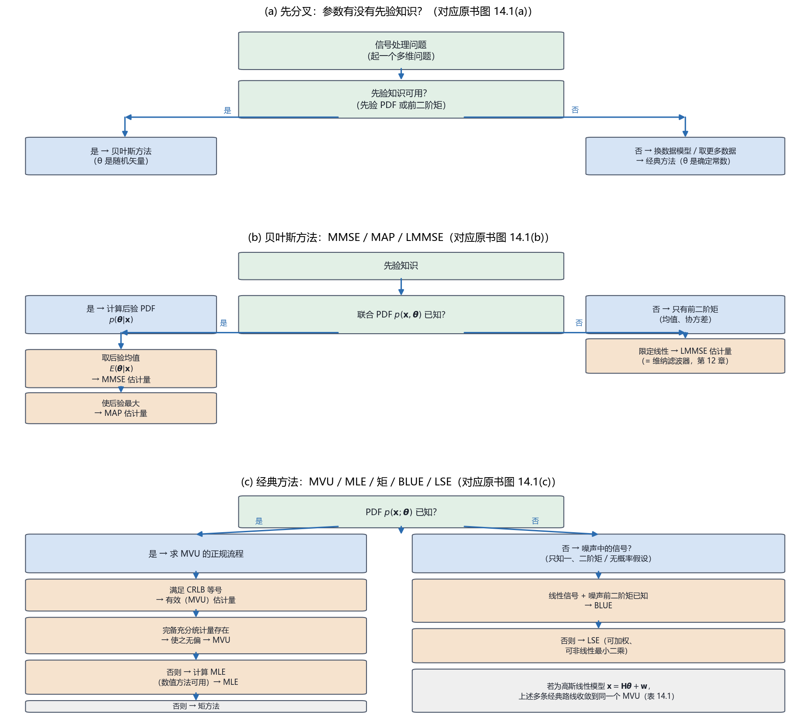

# Vol1 Ch14 估计量总结：手里有多少信息，就选哪把尺子

> 对应原书：第一卷《估计理论》第 14 章（书内第 385~396 页，本扫描 PDF 第 400~411 页）。
> 前置阅读：本系列 `Vol1_Ch02`~`Vol1_Ch13` 全部 12 篇（本章是它们的收账章）；本文自包含，涉及的方法会就地一句话点出"要什么、给什么"，读者不必逐篇回读。
> 全卷地图见 `00_阅读指南.md`。

## 写在前头

这是第一卷的**收账章**。前 13 章逐章推出了一种又一种估计方法：第 2 章定义 MVU、第 3 章给 CRLB、第 4 章线性模型、第 5 章充分统计量、第 6 章 BLUE、第 7 章 MLE、第 8 章 LS、第 9 章矩方法、第 10~11 章贝叶斯 MMSE/MAP、第 12 章 LMMSE、第 13 章卡尔曼滤波。**每章在讲自己时都是主角，但它们各自占山为王，缺少一张"我该用谁"的总地图。** 本章不引入任何新估计量，只做一件事：**把这 13 章的工具按"已知什么 → 推荐什么 → 付什么代价"收拢成一张选型指南。**

Kay 在本章 §14.1 开头就把这个痛点讲透了：选一个好估计量的前提是选一个好数据模型——"它的复杂性应该足以描述数据的基本特征，但是与此同时要简单得足以允许估计量是最佳的且易于实现"。这句话背后是全书反复出现的两堵墙：**第一，MVU 估计量不一定存在**（第 2 章承认过）；**第二，即使存在，也可能算不起**（贝叶斯 MMSE 的非高斯积分就是典型）。所以本章的姿态是务实的：**从"易于实现的最佳估计量"出发找，找不到就退到准最佳。**

**本章一句话设计目标：把"噪声 PDF 已知吗 / 有先验吗 / 参数在变吗 / 要最优还是要好实现"这四个问题，串成一条能落地到具体数据模型的选型决策链。**

**实测声明**：本文内容核对自原书扫描件 OCR 文本 `Temp/chapters_ocr/ch14/ocr_page_400~411.txt`（PDF 第 400~411 页，即书内第 385~396 页）；OCR 公式密集处（矩阵分式、上标）残损较多，已对照 Kay 原书英文版《Fundamentals of Statistical Signal Processing, Vol. I》§14.2~§14.3 校订并逐条注明。图 14.1 的三分支结构与表 14.1 的勾选关系均以 OCR 可辨内容为准。Fig019 为本系列自建决策流程图（脚本 `Temp/scripts/make_fig019.py`），只做信息重组，不引入原书没有的方法。

---

## 1. 先认人：13 章工具，各要什么、给什么

### 1.1 问题驱动：为什么必须先做一张"已知条件 → 估计量"的对照表？

工程师手里拿着一组数据，第一个问题从来不是"哪个估计量最好"，而是"**我到底知道什么**"。知道噪声是高斯、知道它的 PDF，和只知道它的一、二阶矩，是两种完全不同的处境——前者能用 CRLB/MLE，后者只能退回 BLUE/LSE。反过来，手里有没有参数的先验 PDF，又决定你是走经典路线还是贝叶斯路线。**这一节的任务就是：把每种方法对外宣称的"入场券"（需要什么已知条件）和"承诺"（给出什么性质）并排摊开，让读者一眼看出自己够不够格用它。**

原书 §14.2 的做法很规范：每种方法固定按六项交代——a. 数据模型/假设（要什么）、b. 估计量（怎么求）、c. 最佳/误差准则（好到什么程度）、d. 性能（方差等）、e. 说明（什么时候失效）、f. 参考（原书哪章）。本文照搬这个骨架，但把"代价与失效"这一栏提前到醒目位置——**这是本系列一贯的立场：方法的边界比方法的本事更值得记住。**

### 1.2 经典估计方法（参数是确定常数）

先看"经典"阵营。这六种方法的共同前提是：**参数 $\theta$ 是一个确定但未知的常数，数据信息全部总结在 PDF $p(\mathbf{x};\boldsymbol\theta)$ 里**（分号表示 $\theta$ 是参数，不是随机变量——这个记号分野在第 1 篇 §2.3 立过）。

| 方法 | 已知条件（入场券） | 估计量怎么来 | 最佳性承诺 | 性能（方差） | 代价 / 失效 |
|------|------------------|-------------|-----------|-------------|------------|
| **CRLB 达界** | PDF $p(\mathbf{x};\boldsymbol\theta)$ 完全已知 | 若等号条件 $\frac{\partial\ln p}{\partial\boldsymbol\theta}=\mathbf{I}(\boldsymbol\theta)(g(\mathbf{x})-\boldsymbol\theta)$ 成立，则 $\hat{\boldsymbol\theta}=g(\mathbf{x})$ | 达 CRLB = MVU = **有效估计量**，每个分量方差全局最小 | 无偏，$\mathrm{var}(\hat\theta_i)=[\mathbf{I}^{-1}(\boldsymbol\theta)]_{ii}$ | **有效估计量可能根本不存在**，此路直接堵死 |
| **Rao-Blackwell-Lehmann-Scheffe（RBLS）** | PDF 完全已知 | 由 $p=g(T(\mathbf{x}),\boldsymbol\theta)h(\mathbf{x})$ 求充分统计量 $T(\mathbf{x})$；若 $E[T]=\boldsymbol\theta$ 则 $\hat{\boldsymbol\theta}=T$，否则求 $g$ 使 $E[g(T)]=\boldsymbol\theta$ | MVU | 无偏；方差与 PDF 有关，无一般公式 | 必须查**完备性**；$p$ 维充分估计量可能不存在 |
| **BLUE** | $E(\mathbf{x})=\mathbf{H}\boldsymbol\theta$（$\mathbf{H}$ 已知 $N\times p$，$N>p$）+ 协方差 $\mathbf{C}$ 已知 | $\hat{\boldsymbol\theta}=(\mathbf{H}^T\mathbf{C}^{-1}\mathbf{H})^{-1}\mathbf{H}^T\mathbf{C}^{-1}\mathbf{x}$ | 在**所有线性无偏估计量**里方差最小 | 无偏，$\mathrm{var}(\hat\theta_i)=[(\mathbf{H}^T\mathbf{C}^{-1}\mathbf{H})^{-1}]_{ii}$ | 只保证"线性类"里最优；若 $\mathbf{w}\sim\mathcal{N}(\mathbf{0},\mathbf{C})$ 则它升级为 MVU |
| **MLE** | PDF 完全已知 | 使 $p(\mathbf{x};\boldsymbol\theta)$ 最大（可数值求解） | 一般无有限样本最优；**渐近有效 = 渐近 MVU** | 有限 $N$ 无一般公式；渐近 $\hat{\boldsymbol\theta}\xrightarrow{a}\mathcal{N}(\boldsymbol\theta,\mathbf{I}^{-1}(\boldsymbol\theta))$ | 渐近性要价"数据够多"；若有效估计量存在则 MLE 必得之 |
| **LSE** | 只需信号结构 $x[n]=s[n;\boldsymbol\theta]+w[n]$（$s$ 已知，$\mathbf{w}$ 零均值），**不需要噪声 PDF** | 使 $J(\boldsymbol\theta)=(\mathbf{x}-\mathbf{s}(\boldsymbol\theta))^T(\mathbf{x}-\mathbf{s}(\boldsymbol\theta))$ 最小 | 一般无最佳 | 性能与 $\mathbf{w}$ 的 PDF 有关，无一般公式 | **LS 误差最小 ≠ 估计误差最小**；仅当 $\mathbf{w}\sim\mathcal{N}(\mathbf{0},\sigma^2\mathbf{I})$ 时 LSE = MLE |
| **矩方法** | 只需 $p$ 阶矩 $\mu_i=E(x^i[n])$ 与 $\boldsymbol\theta$ 的已知关系，**整个 PDF 不必已知** | 若 $\boldsymbol\theta=\mathbf{h}(\boldsymbol\mu)$ 可逆，则 $\hat{\boldsymbol\theta}=\mathbf{h}^{-1}(\hat{\boldsymbol\mu})$（$\hat{\boldsymbol\mu}$ 为样本矩） | 一般无最佳 | 有限 $N$ 与 PDF 有关；渐近 $\mathrm{var}(\hat\theta_i)$ 由 $\partial g_i/\partial\mu$ 的二次型给出 | 通常**实现最容易**，但性能无保证、方差可能很大 |

上表把六种方法的"入场券"从贵到便宜排了一遍：**CRLB/RBLS/MLE 都要整份 PDF；BLUE 只要一、二阶矩；LSE 只要信号结构；矩方法连结构都可以省，只要几个矩。** 入场券越便宜，承诺就越弱——这是一个贯穿全章的交易结构，第 3 节会把它变成正式的决策链。

### 1.3 贝叶斯估计方法（参数是随机变量的一个现实）

贝叶斯阵营的共同前提是：**参数 $\boldsymbol\theta$ 是随机矢量的一个现实**，它的先验 PDF $p(\boldsymbol\theta)$ 携带"观测之前"的知识，与数据 PDF 合成联合 PDF $p(\mathbf{x},\boldsymbol\theta)=p(\mathbf{x}|\boldsymbol\theta)p(\boldsymbol\theta)$。

| 方法 | 已知条件（入场券） | 估计量怎么来 | 最佳性承诺 | 性能（方差） | 代价 / 失效 |
|------|------------------|-------------|-----------|-------------|------------|
| **MMSE** | 联合 PDF $p(\mathbf{x},\boldsymbol\theta)$ 已知 | $\hat{\boldsymbol\theta}=E(\boldsymbol\theta|\mathbf{x})$（后验均值）；联合高斯时 $\hat{\boldsymbol\theta}=E(\boldsymbol\theta)+\mathbf{C}_{\theta x}\mathbf{C}_{xx}^{-1}(\mathbf{x}-E(\mathbf{x}))$（14.1） | 使贝叶斯 MSE $\mathrm{Bmse}(\hat\theta_i)=E[(\theta_i-\hat\theta_i)^2]$ 最小（14.2） | 误差零均值，$\mathrm{var}(e_i)=\mathrm{Bmse}(\hat\theta_i)=\int[\mathbf{C}_{\theta|x}]_{ii}\,p(\mathbf{x})d\mathbf{x}$（14.3） | **非高斯下要做多重积分，实现非常困难** |
| **MAP** | 同 MMSE | 使后验 $p(\boldsymbol\theta|\mathbf{x})$ 最大（= 使 $p(\mathbf{x}|\boldsymbol\theta)p(\boldsymbol\theta)$ 最大） | 使 hit-or-miss 代价函数最小 | 与 PDF 有关，无一般公式 | 均值与峰（模式）重合时（如高斯）才与 MMSE 相同 |
| **LMMSE** | 只需联合 PDF 的**前二阶矩**（$E(\boldsymbol\theta)$、$\mathbf{C}_{\theta\theta}$、$\mathbf{C}_{\theta x}$、$E(\mathbf{x})$） | $\hat{\boldsymbol\theta}=E(\boldsymbol\theta)+\mathbf{C}_{\theta x}\mathbf{C}_{xx}^{-1}(\mathbf{x}-E(\mathbf{x}))$ | 在**所有线性估计量**里贝叶斯 MSE 最小 | 误差零均值，$\mathrm{var}(e_i)=\mathrm{Bmse}(\hat\theta_i)=[\mathbf{C}_{\theta\theta}-\mathbf{C}_{\theta x}\mathbf{C}_{xx}^{-1}\mathbf{C}_{x\theta}]_{ii}$ | 联合高斯时才升级为 MMSE=MAP |

**这里有一处原书特意交代的口径，值得单独拎出来：表中没有卡尔曼滤波器。** 原书 §14.2 的原话是"我们省略了卡尔曼滤波器的小结，这是因为它是 MMSE 估计量的特定实现，所以包含在相应的讨论中"。翻译成人话：**卡尔曼不是第九种并列方法，而是 MMSE 在"状态随时间演化的动态模型"上的一个实现**——它拿到的"入场券"（动态状态方程 + 观测方程 + 高斯噪声）本质上就是一份带时间索引的贝叶斯线性模型。所以本章不单列它，但第 3 节决策链里"参数在变吗"这一问，会把它作为动态情形的出口点名。

### 1.4 一句话收拢两阵营

**经典阵营问"我猜得准不准"（无偏 + 方差），贝叶斯阵营问"我平均起来亏多少"（贝叶斯 MSE）；前者把 $\theta$ 当固定靶，后者把 $\theta$ 当随机靶。** 这个分野决定了后面所有的选型分叉：有先验走贝叶斯，没先验走经典，两边各有各的"入场券等级"。

---

## 2. 线性模型：为什么这么多方法在这里"殊途同归"

### 2.1 问题驱动：为什么值得单开一节讲线性模型？

上一节那 9 种方法看起来各说各话，但工程上最高频的数据模型只有一个——**线性模型 $\mathbf{x}=\mathbf{H}\boldsymbol\theta+\mathbf{w}$**（数据 = 已知矩阵 × 参数 + 噪声）。原书 §14.3 单开一节的原因很实在：**一旦数据能塞进这个模子，上一节那些"入场券不同、承诺不同"的方法会集体收敛到同一个闭式估计量**，而"谁拿什么名分"就变成了一个精确的对照问题。这一节做两件事：先看经典线性模型下六种方法怎么合流（表 14.1），再看贝叶斯线性模型下 MMSE/MAP/LMMSE 怎么合流。

### 2.2 经典一般线性模型：一个估计量，五个头衔

经典一般线性模型假定（原书 §14.3）：

$$
\mathbf{x} = \mathbf{H}\boldsymbol\theta + \mathbf{w}
$$

其中 $\mathbf{x}$ 为 $N\times1$ 观测矢量，$\mathbf{H}$ 为秩 $p$ 的已知 $N\times p$ 观测矩阵（$N>p$），$\boldsymbol\theta$ 为 $p\times1$ 待估参数，$\mathbf{w}$ 为 $N\times1$ 噪声、PDF 为 $\mathcal{N}(\mathbf{0},\mathbf{C})$。此时数据的 PDF 记为（14.4）。

原书逐条核对的结果如下（公式编号沿用原书）：

1. **CRLB 达界**：对数似然导数可凑成 $\frac{\partial\ln p}{\partial\boldsymbol\theta}=(\mathbf{H}^T\mathbf{C}^{-1}\mathbf{H})(\hat{\boldsymbol\theta}-\boldsymbol\theta)$，其中

$$
\hat{\boldsymbol\theta}=(\mathbf{H}^T\mathbf{C}^{-1}\mathbf{H})^{-1}\mathbf{H}^T\mathbf{C}^{-1}\mathbf{x} \tag{14.5}
$$

所以 $\hat{\boldsymbol\theta}$ 是 MVU（也是有效的），协方差 $\mathbf{C}_{\hat\theta}=\mathbf{I}^{-1}(\boldsymbol\theta)=(\mathbf{H}^T\mathbf{C}^{-1}\mathbf{H})^{-1}$。

2. **RBLS**：PDF 因式分解后，充分统计量 $T(\mathbf{x})=\hat{\boldsymbol\theta}$，它无偏且完备，故 $\hat{\boldsymbol\theta}$ 是 MVU。

3. **BLUE**：由于 $\hat{\boldsymbol\theta}$ 已经是 $\mathbf{x}$ 的线性函数，它自动就是 BLUE。**但注意分水岭：若 $\mathbf{w}$ 非高斯，$\hat{\boldsymbol\theta}$ 仍是 BLUE、却不再是 MVU。**

4. **MLE**：使（14.4）最大等价于最小化 $(\mathbf{x}-\mathbf{H}\boldsymbol\theta)^T\mathbf{C}^{-1}(\mathbf{x}-\mathbf{H}\boldsymbol\theta)$，解出同样的（14.5）——因为有效估计量存在，MLE 必得之（第 7 章 §2.4 的结论在这里兑现）。

5. **LSE**：把 $\mathbf{H}$ 看成信号矢量 $\mathbf{s}(\boldsymbol\theta)$，最小化 $J(\boldsymbol\theta)=(\mathbf{x}-\mathbf{H}\boldsymbol\theta)^T(\mathbf{x}-\mathbf{H}\boldsymbol\theta)$ 得 $\hat{\boldsymbol\theta}=(\mathbf{H}^T\mathbf{H})^{-1}\mathbf{H}^T\mathbf{x}$。**只有 $\mathbf{C}=\sigma^2\mathbf{I}$ 时它才是 MVU**；否则要改加权 LS（$\mathbf{W}=\mathbf{C}^{-1}$）才回到（14.5）；若 $\mathbf{w}$ 非高斯，加权 LSE 也只是 BLUE。

6. **矩方法**：原书直接省略——"最佳估计量已经知道"，矩方法在这里没有存在感。

把这六条收成一张表，就是原书表 14.1（勾选关系经 OCR 核对，"*"表示满足该性质）：

| 性质（估计量 $\hat{\boldsymbol\theta}=(\mathbf{H}^T\mathbf{C}^{-1}\mathbf{H})^{-1}\mathbf{H}^T\mathbf{C}^{-1}\mathbf{x}$） | $\mathbf{w}$ 高斯（线性模型） | $\mathbf{w}$ 非高斯 |
|------|:---:|:---:|
| 有效估计量 | * | |
| 充分统计量 | * | |
| MVU | * | |
| BLUE | * | * |
| MLE | * | |
| WLS（$\mathbf{W}=\mathbf{C}^{-1}$） | * | * |

**这张表是全章最该背下来的一句话图景：高斯假设买到了五个头衔（有效、充分、MVU、MLE、WLS），非高斯假设下只剩两个（BLUE、WLS）。** 换句话说，**"是否高斯"决定的是"能不能叫最优"，而"线性 + 一、二阶矩已知"决定的是"至少还能叫 BLUE"。** 这正是第 6 章 BLUE 存在的意义：它不要高斯，只要一、二阶矩，代价是把"MVU"降级为"线性类里的 MVU"。

### 2.3 贝叶斯线性模型：MMSE = MAP = LMMSE 的合流

贝叶斯线性模型假定 $\boldsymbol\theta\sim\mathcal{N}(\boldsymbol\mu_\theta,\mathbf{C}_\theta)$、$\mathbf{w}\sim\mathcal{N}(\mathbf{0},\mathbf{C}_w)$，二者独立。后验 PDF $p(\boldsymbol\theta|\mathbf{x})$ 仍是高斯，其均值与协方差为（原书式 14.6~14.9）：

$$
E(\boldsymbol\theta|\mathbf{x}) = \boldsymbol\mu_\theta + \mathbf{C}_\theta\mathbf{H}^T(\mathbf{H}\mathbf{C}_\theta\mathbf{H}^T+\mathbf{C}_w)^{-1}(\mathbf{x}-\mathbf{H}\boldsymbol\mu_\theta) \tag{14.6}
$$

$$
\qquad\qquad = \boldsymbol\mu_\theta + (\mathbf{C}_\theta^{-1}+\mathbf{H}^T\mathbf{C}_w^{-1}\mathbf{H})^{-1}\mathbf{H}^T\mathbf{C}_w^{-1}(\mathbf{x}-\mathbf{H}\boldsymbol\mu_\theta) \tag{14.7}
$$

$$
\mathbf{C}_{\theta|x} = \mathbf{C}_\theta - \mathbf{C}_\theta\mathbf{H}^T(\mathbf{H}\mathbf{C}_\theta\mathbf{H}^T+\mathbf{C}_w)^{-1}\mathbf{H}\mathbf{C}_\theta \tag{14.8}
$$

$$
\qquad\qquad = (\mathbf{C}_\theta^{-1}+\mathbf{H}^T\mathbf{C}_w^{-1}\mathbf{H})^{-1} \tag{14.9}
$$

其中 $\mathbf{C}_{\theta|x}$ 为后验协方差矩阵。三种贝叶斯估计量在这里**合流**：MMSE = 后验均值（14.6/14.7），最小贝叶斯 MSE 为 $\mathrm{Bmse}(\hat\theta_i)=[\mathbf{C}_{\theta|x}]_{ii}$；MAP = 后验峰，而高斯 PDF 的峰恰等于均值，故 MAP = MMSE；LMMSE 也因为 MMSE 恰好是 $\mathbf{x}$ 的线性函数而与之相同。

**一句话总结：在线性模型里，"高斯假设"是那个让所有方法对齐的开关——经典侧它把估计量对齐成 MVU=MLE=WLS，贝叶斯侧它把估计量对齐成 MMSE=MAP=LMMSE。**

### 2.4 一个必须点破的"伪等价"：先验趋于零时

原书 §14.3 末尾有一个很容易被误读的细节：在贝叶斯线性模型里令"无先验信息"（$\mathbf{C}_\theta^{-1}\to\mathbf{0}$），（14.7）退化成

$$
\hat{\boldsymbol\theta} = (\mathbf{H}^T\mathbf{C}_w^{-1}\mathbf{H})^{-1}\mathbf{H}^T\mathbf{C}_w^{-1}\mathbf{x}
$$

**形式上与经典 MVU（14.5）一模一样。** 原书立刻泼了盆冷水：**"当然，估计量不能真正地进行比较，因为它们是在不同的数据模型假设下推导出来的"**（并引习题 11.7）。翻译成人话：经典模型把 $\boldsymbol\theta$ 当固定常数，贝叶斯模型把 $\boldsymbol\theta$ 当随机变量——两个式子的**代数长相**相同，但**它们承诺的性质不同**（一个讲无偏/方差，一个讲后验/Bayes MSE），把它们画等号在统计上是错的。**这是本系列反复强调的"记号分野 = 世界观分野"（第 1 篇 §2.3）在收官章的再次兑现。**

---

## 3. 选型决策：四个问题，一条链

### 3.1 问题驱动：怎么把"已知什么"变成"用哪个"？

前两节铺好了路：第 1 节给了每种方法的"入场券"和"承诺"，第 2 节给了线性模型这个特例的合流结论。现在要回答工程师真正的问题：**拿到一个具体问题，第一步问什么、第二步问什么，才能不盲目地选定估计量？** 原书 §14.4 用一张流程图（图 14.1）回答了这个问题，本文把它重画为 Fig019。

先看原书 §14.4 的起手例子，它能暴露决策的动机。数据集

$$
x[n] = A[n] + w[n], \qquad n=0,1,\ldots,N-1
$$

其中未知参数是 $\{A[0],A[1],\ldots,A[N-1]\}$——**参数个数和数据点数一样多**。原书指出：这种情形"由于缺乏平均，我们可以预料估计性能是差的"。这正是决策的出发点：**参数维数比数据点数还"肥"时，任何经典方法都救不了你，因为估计量里没有"平均"这道工序（第 7 章例 7.13 的病灶在这里再次出现）。**

于是决策的第一个岔路口就出来了，见 Fig019：

*图 Fig019：估计量选型决策流程（本系列自建图，对应原书图 14.1 的三分支，脚本 `Temp/scripts/make_fig019.py`，经程序化碰撞检测通过）。(a) 根决策：先问"参数的先验知识可用吗"——有先验走贝叶斯（θ 是随机变量），无先验则要么换数据模型降维、要么取更多数据，再走经典（θ 是确定常数）。(b) 贝叶斯分支：联合 PDF 已知 → 后验均值 = MMSE / 后验最大 = MAP；只知前二阶矩 → LMMSE。(c) 经典分支：PDF 已知 → 先查 CRLB 等号 → 有效(MVU)；再试完备充分统计量 → MVU；再试 MLE；再试矩方法；PDF 未知（噪声中的信号）→ 线性信号 + 噪声前二阶矩已知 → BLUE，否则 → LSE。看点：三条链的共同逻辑是"入场券越贵、承诺越强、越先试"，退路永远是"准最佳"。*

### 3.2 四个问题串成的决策链

把 Fig019 拆成四个可以口头自问的问题，就是本章的选型指南正文：

**问题一：参数有没有先验知识（先验 PDF 或前二阶矩）？**

- **有 → 贝叶斯方法**。理由：先验知识是经典方法模型里装不下的信息（第 10 章 §10.3 的原动力）；把它请进来，"贝叶斯 MSE 将减少"（原书 §14.4 原话）。代价：你得敢对 $\boldsymbol\theta$ 下概率假设，且非高斯下 MMSE 要积分。
- **没有 → 先别急着经典**。原书在这里插了一个容易被忽略的动作：**先考虑"换数据模型降维"或"取更多数据"**。比如把 $A[n]=A$ 甚至 $A[n]=A+Bn$ 这种低维模型假设套上去——"模型不准确可能导致偏差，但是至少得到的估计量的可变性将减少"。**降维的本质是用"可接受的偏差"换"方差下降"**，这笔交易在第 1 篇 §2.2 就预警过，现在正式成为决策的一环。

**问题二（贝叶斯分支）：联合 PDF $p(\mathbf{x},\boldsymbol\theta)$ 已知吗？**

- **已知 → MMSE 或 MAP**。MMSE 取后验均值（$E(\boldsymbol\theta|\mathbf{x})$），使贝叶斯 MSE 最小；MAP 取后验峰，使 hit-or-miss 代价最小。两者在均值=峰（高斯）时重合。代价：非高斯下 MMSE 要多重积分（实现难），MAP 要最大化（可能数值化）。
- **只知前二阶矩 → LMMSE**。理由：只靠均值协方差就给出闭式线性估计。代价：只在**线性类**里最优（第 12 章 §1.3 的两笔账）。

**问题三（经典分支）：噪声 PDF $p(\mathbf{x};\boldsymbol\theta)$ 已知吗？**

- **已知 → 按"达界难度"逐级尝试**：① 先查 CRLB 等号条件，满足 → 有效（MVU）估计量，直接收工；② 不满足 → 试求充分统计量，若完备且无偏 → MVU；③ 还不行 → 算 MLE（解析或数值），渐近最优；④ 最后 → 矩方法，只求好实现。**这条链的顺序是"从最强承诺到最弱承诺"，每一步失败都自动落到更便宜的一档。**
- **未知，但问题是"噪声中的信号"→ BLUE 或 LSE**：信号是 $\boldsymbol\theta$ 的线性函数且噪声前二阶矩已知 → BLUE；否则 → LSE（可能是非线性 LS）。代价：BLUE 只保证线性类最优，LSE 连这个都不保证（只保证拟合误差最小）。

**问题四（贯穿始终）：参数在随时间变吗？**

- **在变 → 卡尔曼滤波**。理由：本章虽不单列它，但它是"贝叶斯 + 状态演化"的动态实现（第 13 章），当 $A[n]$ 随时间漂移、又配得上一个状态方程时，它就是那个"易于实现的最佳估计量"。代价：要建模状态转移方程，且只在（近似）高斯线性动态下闭式。

### 3.3 决策表：把四个问题压成一张速查

为方便扫读，把上面的链压成一张"问 → 答 → 推荐 → 代价"的速查表：

| 问 | 答 | 推荐方法 | 代价（照实说） |
|----|----|---------|--------------|
| 有先验知识吗？ | 有，且联合 PDF 已知 | MMSE / MAP | 非高斯下 MMSE 要积分、MAP 要最大化 |
| 有先验知识吗？ | 有，但只知前二阶矩 | LMMSE | 只在线性类里最优（准最佳） |
| 有先验知识吗？ | 没有 | 先降维/取更多数据，再走经典 | 降维的模型不准会引入偏差 |
| 噪声 PDF 已知吗？ | 已知，且达 CRLB | 有效（MVU）估计量 | 达界条件可能不满足，此路不通 |
| 噪声 PDF 已知吗？ | 已知，有完备充分统计量 | MVU（RBLS） | 完备性要验，$p$ 维充分量可能不存在 |
| 噪声 PDF 已知吗？ | 已知，上述都失败 | MLE | 有限样本无最优保证，渐近才兑现 |
| 噪声 PDF 已知吗？ | 不必全知，只要矩 | 矩方法 | 性能无保证，方差可能大 |
| 噪声 PDF 已知吗？ | 未知，线性信号+二阶矩 | BLUE | 只保证线性类最优 |
| 噪声 PDF 已知吗？ | 未知，别无假设 | LSE（可加权/非线性） | 只保证拟合误差最小，非最优 |
| 参数在变吗？ | 在变，且有状态方程 | 卡尔曼滤波 | 要建状态模型，高斯线性动态才闭式 |

**一句话总结：选估计量的正确姿势是"从易于实现的最佳估计量出发"——先问先验、再问 PDF、最后问实现，每一问都是"入场券"和"承诺"的重新对账，找不到最佳就大大方方退到准最佳。**

---

## 4. 关键设计决策回顾

把散在正文里的"为什么"收拢。每个决策都是一个真实岔路口：

| # | 决策 | 为什么这么选 | 换一个选择会怎样 |
|---|------|------------|----------------|
| 1 | 把"数据模型"立为选择估计量的第一前提，而非"方法名气" | 模型决定"哪些方法够格用"（§1.1）；模型过复杂则最优解算不起，过简单则估计量不最优 | 凭名气选方法，会拿"要整份 PDF 的 MLE"去套"只有二阶矩的问题"，模型与工具错配 |
| 2 | 按"经典 vs 贝叶斯"先分叉，判据是"有无先验" | 有无先验是**世界观**分叉（θ 是常数还是随机变量），不是技巧选择；分叉错了后面全错 | 把先验硬塞进经典框架（或反过来），会像 §2.4 那样得到"代数相同、语义不同"的伪等价 |
| 3 | 线性模型下把 6 种方法对齐到同一个估计量，并明确"高斯 vs 非高斯"的名分差异 | 线性模型是最高频模子，对齐后"谁叫 MVU、谁只叫 BLUE"一目了然（表 14.1） | 不点破名分差异，会把非高斯下的 BLUE 误当成 MVU，过度承诺性能 |
| 4 | 决策链里"PDF 未知"单独走 BLUE/LSE 支路 | "噪声中的信号"问题往往只给得出信号结构与二阶矩，PDF 常不可得 | 硬要 PDF 才能用的方法，则这类问题无解可交付；LSE 是"无概率假设"的兜底 |
| 5 | 把"降维换数据"插在经典分支之前 | 参数维数≈数据点数时缺乏平均、性能必差（§3.1），降维/加数据是唯一自救 | 直接套经典方法，估计量没有"平均"，渐近性质全部熄火（第 7 章例 7.13 同病灶） |
| 6 | 不单列卡尔曼，只作为 MMSE 的动态实现点名 | 卡尔曼的"入场券"是带时间索引的贝叶斯线性模型，不是第九种并列方法（§1.3 原书原话） | 把它当并列方法，会掩盖它与 MMSE/LMMSE 的血缘，破坏决策链的层级 |

## 5. 实现备忘（对照原书时的坑）

1. **页码映射**：本章书内第 385~396 页对应 PDF 第 400~411 页（**书内页码 = PDF 页码 − 15**，与全卷约定一致）。§14.2 方法清单在 PDF 400~406，§14.3 线性模型在 PDF 406~409，表 14.1 在 PDF 408，§14.4 决策在 PDF 409~411，图 14.1 在 PDF 410~411。
2. **OCR 公式残损**：本章 OCR 的矩阵分式、上下标残损严重（如 $\mathbf{H}^T\mathbf{C}^{-1}\mathbf{H}$ 被识成 `H"C-"H`），（14.1）~（14.9）均据 Kay 英文原版校订。**引用时以本文整理的公式为准，不要直接抄 OCR 文本。**
3. **"$\mathbf{w}$ 高斯 → MVU、非高斯 → 只 BLUE"的边界**：表 14.1 里非高斯列只勾了 BLUE 和 WLS 两项。**凡是声称"非高斯线性模型得到 MVU"的地方都是错的**——那只能是 BLUE。
4. **"无先验 → 经典等价"是伪命题**：§2.4 的 $\mathbf{C}_\theta^{-1}\to\mathbf{0}$ 极限给出与（14.5）同形的式子，但语义不同（习题 11.7）。**别在报告里写"贝叶斯无先验时退化为经典 MVU"而不加"数据模型不同、不能直接比较"的限定。**
5. **LSE 的加权才回到 MVU**：无加权 LSE 是 $(\mathbf{H}^T\mathbf{H})^{-1}\mathbf{H}^T\mathbf{x}$，只有 $\mathbf{C}=\sigma^2\mathbf{I}$ 时才等于 MVU；有色噪声下必须 $\mathbf{W}=\mathbf{C}^{-1}$ 的加权 LS 才是（14.5）。**实现时把加权矩阵漏了，估计量就不最优。**

## 6. 局限（坦率交代，并预告后续）

1. **本章不产生新方法，只做重组**：它假设读者已经掌握前 13 章；若某方法的具体推导忘了，本章只给结论、不回炉。这是总结章的定位使然，不是遗漏。
2. **决策链是"指南"，不是"算法"**：图 14.1 的每一步仍需要人的判断（比如"充分统计量完备吗""$N$ 够大吗"），不能自动执行。**它省的是"选错方向"的冤枉路，不省"验证"的功课。**
3. **所有性能都锚定在数据模型上**：模型错了，整条链导向的估计量全错（第 1 篇 §2.2 的老账）。本章没有"模型校验"环节，那属于更专门的模型选择问题。
4. **指向第二卷的伏笔**：估计工具在检测里被大量复用——第二卷的 GLRT 要 MLE、NP 准则要似然比、匹配滤波器要线性模型的最优解。**本章把"按已知信息选估计量"的肌肉练熟了，第二卷选检测器（其第 11 章也是同样的"选型指南"结构）时直接受益。** 这就是本章作为第一卷收账章的意义：它不是终点，是给第二卷备好的工具箱。

## 7. 建议自测的问题

1. 用你自己的话写出 9 种方法各自的"入场券"（最少需要知道什么），并按"贵→便宜"排序。（提示：§1.2~1.3 的表格。）
2. 对经典一般线性模型，为什么"$\mathbf{w}$ 高斯"时估计量集齐 5 个头衔，而"$\mathbf{w}$ 非高斯"只剩 BLUE 和 WLS 两个？（提示：表 14.1，联系第 6 章 BLUE 的定义。）
3. 一个数据集 $x[n]=A+w[n]$，你只知道 $A$ 的均值和方差、$w[n]$ 的均值与方差（都不知分布形状）。你该用哪种估计量？它的代价是什么？（提示：§3.2 问题二。）
4. 为什么"贝叶斯无先验 → 经典 MVU"是一个不能直接画等号的伪等价？（提示：§2.4，习题 11.7。）
5. 参数个数等于数据点数（$x[n]=A[n]+w[n]$）时，为什么经典方法全线失效？这时原书建议的两条自救路是什么？（提示：§3.1，第 7 章例 7.13 同病灶。）

---

**一句话收尾：第一卷学到第 14 章，你已经有了 13 把尺子——本章没有造新尺子，只是教会你按"手里有多少信息"决定先拿哪一把、拿不到最优就安心拿次优。**

*实测核对声明：本章事实性内容核对自原书扫描件 OCR 文本 `Document/统计信号处理/Temp/chapters_ocr/ch14/ocr_page_400~411.txt`（PDF 第 400~411 页，即书内第 385~396 页）；公式（14.1）~（14.9）与表 14.1 的勾选关系据 Kay 原书英文版校订（OCR 矩阵分式残损），未编造原书没有的数值。Fig019 由 `Temp/scripts/make_fig019.py` 生成并经 `plotutil.check_figure` 程序化碰撞检测通过。*
