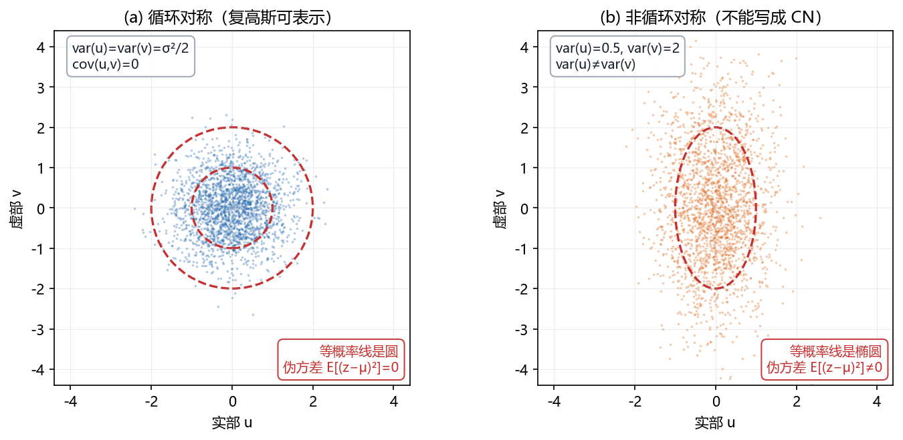

# Vol1 Ch15 复数据与复参数的扩展：把估计理论从实数轴搬到复平面

> 对应原书：第一卷《估计理论》第 15 章（书内第 397~454 页，本扫描 PDF 第 412~469 页；PDF 469 为空页）。
> 前置阅读：本系列 `Vol1_Ch03`（CRLB）、`Vol1_Ch07`（MLE，尤其例 7.6/7.16）、`Vol1_Ch10`~`Vol1_Ch12`（贝叶斯估计）；本文自包含，涉及的实版本结论会就地对照。
> 全卷地图见 `00_阅读指南.md`。

## 写在前头

这是第一卷的**收官章**，也是唯一一章"没有新原理"的章。原书 §15.1 开宗明义："在这一章里，我们要将以前的理论重新表示，以适应复数据和复参数，在进行这些处理时我们并不展开任何新的原理，只是为了处理复数据和复参数的代数运算。"翻译成人话：**第 1~14 章建立的那套估计机器全部保留，本章只做一件事——把"转置"换成"共轭转置"、把"标量"换成"复数"，让同一台机器在复平面上跑起来。**

为什么要专门搬这一趟？因为**通信、阵列、频域处理里的数据天生是复的**：带通信号的复包络、基带 I/Q 采样、DFT 系数、波束形成的"快拍"……全是复数。硬把它们拆成实部虚部两路当成实矢量处理，数学上可行（§15.3 例 15.2 会演示这条路有多啰嗦），但**复表示"更加直接，数学上易于处理"**——这就是全章存在的工程理由。

**本章一句话设计目标：证明"复高斯假设 + 共轭转置"这套替换，能让 CRLB、MLE、贝叶斯估计、渐近理论原样搬到复数域，并把代价（尤其是那个隐藏的"伪方差 = 0"约束）讲透。**

**实测声明**：本文内容核对自原书扫描件 OCR 文本 `Temp/chapters_ocr/ch15/ocr_page_412~469.txt`（PDF 第 412~469 页，即书内第 397~454 页）；公式编号（15.1）~（15.77）沿用原书编号。本章 OCR 公式残损严重（复共轭 `*`、矩阵分式、上下标大量错位），关键公式均对照 Kay 原书英文版校订并注明；OCR 无法辨清的细节（如例 15.8 估计量的完整代数式）宁可略去或只给结构结论，不编造。Fig020 为本系列自建数值实验（脚本 `Temp/scripts/make_fig020.py`，种子 20261515），只用于示意"循环对称 vs 非循环对称"的几何差别，与原书无冲突。

---

## 1. 为什么需要复数：带通信号与复包络

### 1.1 问题驱动：一个实带通信号，凭什么能用一个复低通信号完整表示？

雷达、声纳、通信的信号都是**带通**的：实信号 $s(t)$ 的傅里叶变换 $S(F)$ 只在以 $\pm F_0$ 为中心、带宽 $B$ 的频带内非零。直接按实信号处理，采样率必须到 $2(F_0+B/2)$——载频 $F_0$ 通常远高于带宽 $B$，**这么采样等于把大量采样点浪费在"没有信息"的载波振荡上**。原书 §15.3 的答案是：**实带通信号的全部信息都装在一个复低通信号——复包络——里。**

原书图 15.1 用一张频谱图讲清了这个关系：实带通信号的傅里叶变换 $S(F)$ 与复包络 $\tilde{s}(t)$ 的傅里叶变换 $\tilde{S}(F)$ 之间满足（原书式 15.1，其中 $\tilde{}$ 表示复数）：

$$
S(F) = \tilde{S}(F - F_0) + \tilde{S}^{*}\bigl(-(F + F_0)\bigr)
$$

其中 $\tilde{S}^{*}$ 为 $\tilde{S}$ 的复共轭，$F_0$ 为中心频率。对（15.1）做傅里叶反变换得（15.2）：

$$
s(t) = 2\,\mathrm{Re}\bigl[\tilde{s}(t)\exp(j2\pi F_0 t)\bigr]
$$

再把 $\tilde{s}(t)=\tilde{s}_R(t)+j\tilde{s}_I(t)$ 的实部虚部分开，就是熟悉的"窄带表示"（15.3）：

$$
s(t) = 2\tilde{s}_R(t)\cos(2\pi F_0 t) - 2\tilde{s}_I(t)\sin(2\pi F_0 t)
$$

其中 $\tilde{s}_R(t)$、$\tilde{s}_I(t)$ 分别是复包络的实部（同相分量）与虚部（正交分量）。**翻译成人话：实带通信号 = 复包络（一个低通复信号）乘上复载波 $\exp(j2\pi F_0 t)$ 再取实部。** 由于 $\tilde{s}_R(t)$、$\tilde{s}_I(t)$ 都是带限于 $B/2$ 内的低通信号，**处理带通信号只需以 $B$ 复样本/秒采样复包络，而不是 $2(F_0+B/2)$ 实样本/秒采样原信号**——这就是数字接收机里 I/Q 下变频（原书图 15.2）的全部动机。

### 1.2 例 15.1：正弦信号的复包络长什么样

最常用的带通信号是正弦叠加 $s(t)=\sum_i A_i\cos(2\pi F_i t+\phi_i)$，其中每个 $F_i$ 都在 $[F_0-B/2,\ F_0+B/2]$ 内。把它写成实部形式再套（15.2），复包络为

$$
\tilde{s}(t) = \sum_i A_i\exp(j\phi_i)\exp\bigl[j2\pi(F_i-F_0)t\bigr]
$$

按奈奎斯特速率 $F_s=1/\Delta=B$ 采样后得（令 $\tilde{x}[n]=\tilde{s}(n\Delta)$、$f_i=(F_i-F_0)\Delta$）：

$$
\tilde{x}[n] = \sum_i A_i\exp(j2\pi f_i n)
$$

**复包络是"频率为 $F_i-F_0$（可正可负）、复振幅为 $A_i\exp(j\phi_i)$"的复正弦叠加。** 于是带通信号处理的标准模型就固定为：**复正弦叠加 + 复噪声**（$f_i$ 现在可以取负频率，因为复正弦没有 Hermitian 对称性的约束）。原书在 §15.3 还顺带指出：复参数也随之而来——估计 $p$ 个正弦的幅度和相位，用 $p$ 个复参数 $\{A_i\exp(j\phi_i)\}$ 比 $2p$ 个实参数 $\{A_i,\phi_i\}$ 更紧凑；非对称 PSD 的 AR 谱模型也要求复的 AR 系数。

### 1.3 例 15.2：硬拆实部虚部做最小二乘，有多啰嗦？

要估复幅度 $A$ 使 $J(A)=\sum_{n=0}^{N-1}|\tilde{x}[n]-A\tilde{s}[n]|^2$ 最小（$\tilde{x},\tilde{s},A$ 全为复数）。**纯实数路线**：把每个量拆成实部虚部，$J$ 变成一个关于 $A_R,A_I$ 的实二次型，再堆矩阵、求导、解 $2\times2$ 方程组——原书用大半页才走完（OCR 第 401~402 页那一片矩阵就是这段推演）。而**复导数路线**：把 $A$ 和 $A^{*}$ 当成两个独立变量，对 $A^{*}$ 求导令零，两步就得到

$$
\hat{A} = \frac{\sum_{n=0}^{N-1}\tilde{x}[n]\tilde{s}^{*}[n]}{\sum_{n=0}^{N-1}|\tilde{s}[n]|^2}
$$

**结果与实数情形同形。** 原书此处的结论是本章的第一颗种子：**"使用某些容易证明的恒等式，可以使最小化的代数演算变得简单。"** 这颗种子在 §4（复导数）长成整套工具。

**一句话总结：复表示不是"炫技"，而是把"低通复包络 → 低采样率"的采样红利和"复参数 → 更紧凑的表示"的代数红利一起兑现；代价是要先讲清"复随机变量和它的 PDF 到底怎么定义"——下一节就是这件事。**

---

## 2. 复随机变量与复高斯 PDF：那个隐藏的"伪方差 = 0"

### 2.1 问题驱动：把实随机变量的一阶二阶矩直接搬过来，够不够？

复随机变量定义为 $\tilde{z}=u+jv$，其中 $u$、$v$ 是实随机变量。均值（15.7）、方差（15.9）（15.10）、协方差（15.11）（15.12）的定义都顺着直觉走：

$$
E(\tilde{z}) = E(u) + jE(v) \tag{15.7}
$$

$$
\mathrm{var}(\tilde{z}) = E\bigl(|\tilde{z}-E(\tilde{z})|^2\bigr) = E(|\tilde{z}|^2) - |E(\tilde{z})|^2 \tag{15.10}
$$

$$
\mathrm{cov}(\tilde{z}_1,\tilde{z}_2) = E\bigl[(\tilde{z}_1-E(\tilde{z}_1))^{*}(\tilde{z}_2-E(\tilde{z}_2))\bigr] \tag{15.11}
$$

其中 $|\cdot|$ 为复模长。**问题出在"这就够了吗"**：对一个实随机变量，一阶矩（均值）和二阶矩（方差）就把它刻画到了"能用高斯 PDF 建模"的程度；但对复随机变量，$u$ 和 $v$ 的**联合**分布里藏着一个方差不覆盖的自由度——**$E[(\tilde{z}-\mu)^2]$（不带共轭的那个"平方"）不一定为零**。这一节的任务，就是把这个隐藏自由度逼出来。

### 2.2 复高斯 PDF 的诞生：为什么必须"实部虚部独立且等方差"

复高斯 PDF 不是随便定义的。原书的定义方式很克制（§15.4）：**先承认任何完整的统计描述都必须包括 $u$ 和 $v$ 的联合 PDF，然后额外假定 $u$ 与 $v$ 独立、且分别服从 $\mathcal{N}(\mu_u,\sigma^2/2)$ 和 $\mathcal{N}(\mu_v,\sigma^2/2)$**——注意方差各是 $\sigma^2/2$（对半分）。于是标量复高斯 PDF（15.16）为

$$
p(\tilde{z}) = \frac{1}{\pi\sigma^2}\exp\!\left(-\frac{|\tilde{z}-\tilde{\mu}|^2}{\sigma^2}\right), \qquad \tilde{z}\sim\mathcal{CN}(\tilde{\mu},\sigma^2)
$$

其中 $\tilde{\mu}=E(\tilde{z})$，$\sigma^2=\mathrm{var}(\tilde{z})$，记号 $\mathcal{CN}$ 表示"复正态（complex normal）"。**翻译成人话：复高斯 PDF 就是把两个等方差、独立的实高斯 PDF 揉成"以复数为自变量、以复模长平方为指数"的一个紧凑式子。**

这里就是图 Fig020 想讲清的那件事：

*图 Fig020：复高斯（循环对称）与"伪方差≠0"的对照（本系列自建实验，种子 20261515，脚本 `Temp/scripts/make_fig020.py`，经程序化碰撞检测通过）。(a) 实部 $u$、虚部 $v$ 独立且等方差（$\mathrm{var}(u)=\mathrm{var}(v)=\sigma^2/2$，$\mathrm{cov}(u,v)=0$）时，$[u,v]$ 的等概率线是圆——这就是"循环对称"，对应的复变量可写成 $\mathcal{CN}(\mu,\sigma^2)$，伪方差 $E[(z-\mu)^2]=0$。(b) $\mathrm{var}(u)\ne\mathrm{var}(v)$ 时等概率线是椭圆，伪方差不为零，**不能**写成 $\mathcal{CN}$。看点：复高斯不是"任意实部虚部各来一个高斯"，它额外要求两个方差相等、互协方差为零——这一条就是"伪方差 = 0"。*

### 2.3 矢量情形与那个特殊形式：伪方差为零是"循环对称"的等价说法

推广到 $n$ 维复随机矢量 $\tilde{\mathbf{x}}=[\tilde{x}_1,\ldots,\tilde{x}_n]^T$，其中每个 $\tilde{x}_i=u_i+jv_i$。把 $2n$ 个实分量摞成 $\mathbf{x}=[u_1,\ldots,u_n,v_1,\ldots,v_n]^T$，它的实协方差矩阵若要允许我们定义一个复高斯 PDF，必须具有原书式（15.19）的特殊分块形式：

$$
\mathbf{C}_r = \begin{bmatrix} \mathbf{A} & -\mathbf{B} \\ \mathbf{B} & \mathbf{A} \end{bmatrix}
$$

其中 $\mathbf{A}$ 为 $n\times n$ 实对称矩阵，$\mathbf{B}$ 为 $n\times n$ 实斜对称矩阵（$\mathbf{B}^T=-\mathbf{B}$）。对 $n=2$ 的情形，这个形式等价于（15.20）：

$$
\mathrm{cov}(u_1,u_2)=\mathrm{cov}(v_1,v_2), \qquad \mathrm{cov}(u_1,v_2)=-\mathrm{cov}(v_1,u_2)
$$

**翻译成人话：实部之间的协方差必须等于虚部之间的协方差，且"实部与虚部"之间的协方差要满足一个反对称关系。** 原书随后把这个结果总结为**定理 15.1**：若实 $2n$ 维矢量 $\mathbf{x}=[u;v]$ 具有 $\mathcal{N}(\mathbf{m}_g,\mathbf{C}_r)$ 且 $\mathbf{C}_r$ 取（15.19）的形式，则复矢量 $\tilde{\mathbf{x}}=u+jv$ 的复多维高斯 PDF 为（15.22）：

$$
p(\tilde{\mathbf{x}}) = \frac{1}{\pi^n\det(\mathbf{C}_{\tilde x})}\exp\!\Bigl[-(\tilde{\mathbf{x}}-\tilde{\boldsymbol\mu})^H \mathbf{C}_{\tilde x}^{-1}(\tilde{\mathbf{x}}-\tilde{\boldsymbol\mu})\Bigr], \qquad \tilde{\mathbf{x}}\sim\mathcal{CN}(\tilde{\boldsymbol\mu},\mathbf{C}_{\tilde x})
$$

其中 $\mathbf{C}_{\tilde x}=\mathbf{A}+j\mathbf{B}$ 为复协方差矩阵，$(\cdot)^H$ 为共轭转置。

**这里必须点破那个"隐藏自由度"到底是什么。** 原书在定理 15.1 的性质 6 讨论里说得很直白：复高斯要求 $E(\tilde{x}_i\tilde{x}_j)=0$（对所有 $i,j$），而这正是"假定的实协方差矩阵特殊形式（15.19）"的来源。对单个复变量，这个约束就是

$$
E\bigl[(\tilde{z}-\tilde{\mu})^2\bigr] = \mathrm{var}(u)-\mathrm{var}(v)+2j\,\mathrm{cov}(u,v) = 0
$$

于是必须有 $\mathrm{var}(u)=\mathrm{var}(v)$ 且 $\mathrm{cov}(u,v)=0$。**翻译成人话：$E[(\tilde{z}-\mu)^2]$ 这个"不带共轭的平方"（统计文献里叫"伪方差"，pseudo-variance）必须为零；它为零，等价于 $[u,v]$ 的等概率线是圆——这就是"循环对称"（circular symmetry）。** 这条约束是复高斯与"随便两个实高斯拼起来"的**唯一区别**，也是全章最容易踩的坑：**实高斯随机过程并不是复高斯随机过程的特例**（原书 §15.5 末尾给的反例：实过程的二阶矩 $E(x[m]x[n])$ 不必为零，而复高斯要求它为零）。

### 2.4 复高斯的性质清单：和实高斯长得一样，但藏着一个"额外零"

原书 §15.4 总结的 7 条性质（证明见附录 15B），前 5 条和实高斯一一对应：① 子矢量仍是复高斯；② 不相关 ⇒ 独立；③ 独立复高斯之和仍是复高斯；④ 仿射变换 $\mathbf{y}=\mathbf{A}\tilde{\mathbf{x}}+\mathbf{b}$ 后 $\mathbf{y}\sim\mathcal{CN}(\mathbf{A}\tilde{\boldsymbol\mu}+\mathbf{b},\ \mathbf{A}\mathbf{C}_{\tilde x}\mathbf{A}^H)$（15.23）；⑤ 独立复高斯之和仍是复高斯。**性质 6 是复高斯独有的**：零均值复高斯随机矢量的四阶矩（15.24）

$$
E(\tilde{x}_1\tilde{x}_2\tilde{x}_3^{*}\tilde{x}_4^{*}) = E(\tilde{x}_1\tilde{x}_3^{*})E(\tilde{x}_2\tilde{x}_4^{*}) + E(\tilde{x}_1\tilde{x}_4^{*})E(\tilde{x}_2\tilde{x}_3^{*})
$$

且 $E(\tilde{x}_i\tilde{x}_j)=0$（伪方差为零）。**这条四阶矩是后面所有方差计算的燃料**——例 15.4 用它在两步之内算出 Hermitian 型 $Q=\tilde{\mathbf{x}}^H\mathbf{A}\tilde{\mathbf{x}}$ 的方差（$\tilde{\mathbf{x}}\sim\mathcal{CN}(\mathbf{0},\mathbf{C}_{\tilde x})$、$\mathbf{A}$ 为 Hermitian 矩阵）：

$$
E(Q) = \mathrm{tr}(\mathbf{A}\mathbf{C}_{\tilde x}) \tag{15.29}
$$

$$
\mathrm{var}(Q) = \mathrm{tr}(\mathbf{A}\mathbf{C}_{\tilde x}\mathbf{A}\mathbf{C}_{\tilde x}) \tag{15.30}
$$

其中 $\mathrm{tr}$ 为迹。性质 7 是条件 PDF 仍是复高斯（15.25）（15.26），形式上与实高斯（第 10 章式 10.24/10.25）一致。

**一句话总结：复高斯不是新理论，而是"实 2 维高斯 + 循环对称（伪方差 = 0）"的代数改写；代价是那条伪方差约束——违反它，等概率线就从圆变成椭圆，复高斯 PDF 不再成立。**

---

## 3. 复 WSS 过程：自相关函数与功率谱的共轭对称

### 3.1 问题驱动：复随机过程要"平稳"，约束和实过程有什么不同？

一个复随机过程 $\tilde{x}[n]=u[n]+jv[n]$ 要成为 WSS，和实过程一样要求均值与 $n$ 无关、协方差只与延迟有关。均值定义为 $E(\tilde{x}[n])=E(u[n])+jE(v[n])$，通常假定为零；ACF 定义为（15.31）

$$
r_{\tilde x\tilde x}[k] = E\bigl(\tilde{x}^{*}[n]\tilde{x}[n+k]\bigr)
$$

其中 $k$ 为延迟。**但和 §2 一样，WSS 这个条件本身还不足以让 $\tilde{x}[n]$ 成为复高斯 WSS 过程**——因为复高斯要求实协方差矩阵取（15.19）的特殊形式，这转成对 ACF 的额外约束。原书 §15.5 把它写成了对 $u,v$ 互相关函数（CCF）$r_{uv}[k]=E(u[n]v[n+k])$（15.32）的约束（15.33）：

$$
r_{uu}[k] = r_{vv}[k], \qquad r_{uv}[k] = -r_{vu}[k]
$$

对应到频域（15.34）：

$$
P_{uu}(f) = P_{vv}(f), \qquad P_{uv}(f) = -P_{vu}(f)
$$

其中 $P_{uu},P_{vv}$ 为自 PSD、$P_{uv},P_{vu}$ 为互 PSD。**翻译成人话：同相分量的自相关必须等于正交分量的自相关，且互相关要反对称；等价地，互 PSD 必须为纯虚数。** 满足（15.33）后，$\tilde{x}[n]$ 的 ACF 与 PSD 分别是（15.35）（15.36）：

$$
r_{\tilde x\tilde x}[k] = 2r_{uu}[k] + 2j\,r_{uv}[k]
$$

$$
P_{\tilde x\tilde x}(f) = 2\bigl(P_{uu}(f) + jP_{uv}(f)\bigr)
$$

### 3.2 例 15.5：带通高斯噪声的复包络，正好是 CWGN

原书用这个例子把"复 WSS 高斯过程"落到最常用的场景：一个零均值实带通 WSS 高斯过程 $x(t)$（带通"白"高斯噪声，PSD 在带宽 $B$ 内为 $N_0/2$）的复包络 $\tilde{z}(t)=u(t)+jv(t)$，其 $u(t),v(t)$ 恰好满足（15.33）的关系（希尔伯特变换 / 带通噪声的实部虚部天然如此）。以奈奎斯特速率 $F_s=1/\Delta=B$ 采样后，$\tilde{z}[n]$ 是**复白高斯噪声（CWGN）**：$\tilde{z}[n]\sim\mathcal{CN}(0,\sigma^2)$，所有样本相互独立。

**一句话总结：复 WSS 高斯过程的"入场券"是（15.33）那组 ACF/CCF 约束；而带通高斯噪声的复包络恰好自动满足它，所以 CWGN 是带通系统里最自然的噪声模型。**

---

## 4. 复导数与梯度：$\partial/\partial z$ 与 $\partial/\partial z^{*}$ 怎么定义、怎么用

### 4.1 问题驱动：实标量函数对复变量，凭什么能求导？

要确定 LSE 或 MLE，必须对一个**实标量函数**（如 LS 误差 $J$、负对数似然）关于**复参数**做最小化。但经典复分析里，$J(\tilde{z})=|\tilde{z}|^2=\alpha^2+\beta^2$ 这种实函数**根本不是解析函数，不能求导**。原书 §15.6 的做法是：**自己定义一个复导数**（15.40）：

$$
\frac{\partial J}{\partial \tilde{z}} = \frac{1}{2}\left(\frac{\partial J}{\partial\alpha} - j\frac{\partial J}{\partial\beta}\right)
$$

其中 $\tilde{z}=\alpha+j\beta$，$\alpha,\beta$ 分别是 $\tilde{z}$ 的实部虚部。**翻译成人话：这个定义把"复导数"写成了"实部方向导数 − j 乘虚部方向导数"的一半；用它的好处是，$\partial J/\partial\tilde{z}=0$ 当且仅当 $\partial J/\partial\alpha=\partial J/\partial\beta=0$——即复梯度为零恰好等价于实部虚部两个方向都到平稳点。**

### 4.2 关键技巧：把 $\tilde{z}$ 和 $\tilde{z}^{*}$ 当两个独立变量

有了（15.40），一个让计算量骤减的技巧浮出水面：**把 $J$ 看成 $\tilde{z}$ 和 $\tilde{z}^{*}$ 两个"独立"复变量的函数，求导时把另一个当常量**。原书给出三条核心公式（15.41）（15.42）（15.43）：

$$
\frac{\partial \tilde{z}}{\partial \tilde{z}} = 1, \qquad \frac{\partial \tilde{z}^{*}}{\partial \tilde{z}} = 0, \qquad \frac{\partial |\tilde{z}|^2}{\partial \tilde{z}^{*}} = \tilde{z}
$$

**翻译成人话：对 $\tilde{z}^{*}$ 求导时，把 $\tilde{z}$ 当常数，于是 $|\tilde{z}|^2=\tilde{z}\tilde{z}^{*}$ 对 $\tilde{z}^{*}$ 的导数就是 $\tilde{z}$。** 这一条"把共轭当独立变量"的技巧，是本章所有估计量推导的通用马达。

对线性形式和 Hermitian 形式，原书又给了三条（15.44）~（15.46）：

$$
\frac{\partial(\mathbf{b}^H\boldsymbol\theta)}{\partial\boldsymbol\theta} = \mathbf{b}^{*}, \qquad
\frac{\partial(\mathbf{b}^T\boldsymbol\theta)}{\partial\boldsymbol\theta} = \mathbf{0}, \qquad
\frac{\partial(\boldsymbol\theta^H\mathbf{A}\boldsymbol\theta)}{\partial\boldsymbol\theta} = \mathbf{A}^T\boldsymbol\theta^{*} = (\mathbf{A}\boldsymbol\theta)^{*}
$$

其中 $\mathbf{b},\boldsymbol\theta$ 为复矢量、$\mathbf{A}$ 为 Hermitian 矩阵。**注意（15.46）那处被原书点名"奇怪"的地方**：若 $\boldsymbol\theta$ 是实的，$\partial(\boldsymbol\theta^T\mathbf{A}\boldsymbol\theta)/\partial\boldsymbol\theta$ 应该是 $2\mathbf{A}\boldsymbol\theta$（第 4 章式 4.3），而复版本给的是 $(\mathbf{A}\boldsymbol\theta)^{*}$——**实数情形不再是复情形的特例**，这个 2 倍因子差是复梯度最容易算错的地方。原书表 15.1 汇总了这些定义与公式，另附两条对 CRLB/MLE 求导极有用的恒等式（15.47）（15.48）：

$$
\frac{\partial\ln\det\bigl(\mathbf{C}_{\tilde x}(\xi)\bigr)}{\partial\xi_i} = \mathrm{tr}\!\left(\mathbf{C}_{\tilde x}^{-1}\frac{\partial\mathbf{C}_{\tilde x}}{\partial\xi_i}\right)
$$

$$
\frac{\partial}{\partial\xi_i}\Bigl[\tilde{\mathbf{x}}^H\mathbf{C}_{\tilde x}^{-1}(\xi)\tilde{\mathbf{x}}\Bigr] = -\tilde{\mathbf{x}}^H\mathbf{C}_{\tilde x}^{-1}\frac{\partial\mathbf{C}_{\tilde x}}{\partial\xi_i}\mathbf{C}_{\tilde x}^{-1}\tilde{\mathbf{x}}
$$

### 4.3 例 15.6：Hermitian 型最小化，两步出解

用这套工具重做 §1.3 的 LS 问题（更一般的加权形式）：最小化 $J=(\tilde{\mathbf{x}}-\mathbf{H}\boldsymbol\theta)^H\mathbf{C}^{-1}(\tilde{\mathbf{x}}-\mathbf{H}\boldsymbol\theta)$，其中 $\mathbf{H}$ 为 $N\times p$ 复矩阵、$\mathbf{C}$ 为 $N\times N$ 复协方差矩阵、$\boldsymbol\theta$ 为 $p\times1$ 复参数。展开后用（15.44）~（15.46）令复梯度为零，直接得到（15.50）：

$$
\hat{\boldsymbol\theta} = \bigl(\mathbf{H}^H\mathbf{C}^{-1}\mathbf{H}\bigr)^{-1}\mathbf{H}^H\mathbf{C}^{-1}\tilde{\mathbf{x}}
$$

**与第 4 章/第 7 章的实数解长得一模一样，只是转置全换成共轭转置。** 对比 §1.3 例 15.2 那大半页的实部虚部推演，复导数把同一件事压缩成了三行。

### 4.4 例 15.7：带线性约束的最小化，和复均值的 BLUE

再补一个后续要用的工具：带约束 $\mathbf{B}\mathbf{a}=\mathbf{b}$ 的最小化 $\mathbf{a}^H\mathbf{W}\mathbf{a}$（$\mathbf{W}$ 正定 Hermitian），用复拉格朗日乘子解得（15.51）：

$$
\mathbf{a}_{\mathrm{opt}} = \mathbf{W}^{-1}\mathbf{B}^H\bigl(\mathbf{B}\mathbf{W}^{-1}\mathbf{B}^H\bigr)^{-1}\mathbf{b}
$$

原书立刻把它用到**复有色噪声中均值的 BLUE**（例 15.7）：$\tilde{x}[n]=A+\tilde{w}[n]$，$A$ 为待估复参数、$\tilde{w}[n]$ 为零均值协方差 $\mathbf{C}$ 的复噪声。BLUE 为

$$
\hat{A} = \frac{\mathbf{1}^T\mathbf{C}^{-1}\tilde{\mathbf{x}}}{\mathbf{1}^T\mathbf{C}^{-1}\mathbf{1}}
$$

形式上与实数情形（例 6.2）相同，但**一个细微差别要记牢**：这里的 $\mathrm{var}(\hat{A})$ 是 $E(|\hat{A}-E(\hat{A})|^2)$，它等于 $\mathrm{var}(\hat{A}_R)+\mathrm{var}(\hat{A}_I)$——**即复方差的定义天然把实部虚部两个分量的方差加起来**。

**一句话总结：复导数不是新微积分，而是一条约定 + 一条技巧——约定（15.40）让"复梯度为零 = 实部虚部都平稳"，技巧（把 $\tilde{z}^{*}$ 当独立变量）让所有求导变成"照抄实导数 + 把转置换成共轭转置"。**

---

## 5. 复数据的经典估计：CRLB、MLE 与复线性模型

### 5.1 问题驱动：实数版 CRLB/MLE 能不能照搬？

§15.7 把战场移到"复高斯数据 + 实/复参数"。原书先给了一个重要的组织约定：**被估参数写成实参数矢量 $\boldsymbol\xi$**（例如估计复幅度 $A$ 和频率 $f_0$ 时，写 $\boldsymbol\xi=[A_R,A_I,f_0]^T$），这样 MVU 的通常意义（无偏 + 每个分量方差最小）原样保留，CRLB 也有标准形式。

对复高斯 PDF，Fisher 信息矩阵由（15.52）给出（推导见附录 15C）：

$$
\bigl[\mathbf{I}(\boldsymbol\xi)\bigr]_{ij} = \mathrm{tr}\!\left(\mathbf{C}_{\tilde x}^{-1}\frac{\partial\mathbf{C}_{\tilde x}}{\partial\xi_i}\mathbf{C}_{\tilde x}^{-1}\frac{\partial\mathbf{C}_{\tilde x}}{\partial\xi_j}\right)
+ 2\,\mathrm{Re}\!\left(\frac{\partial\tilde{\boldsymbol\mu}^H}{\partial\xi_i}\mathbf{C}_{\tilde x}^{-1}\frac{\partial\tilde{\boldsymbol\mu}}{\partial\xi_j}\right)
$$

其中 $\tilde{\boldsymbol\mu}=\tilde{\boldsymbol\mu}(\boldsymbol\xi)$、$\mathbf{C}_{\tilde x}=\mathbf{C}_{\tilde x}(\boldsymbol\xi)$ 分别为复数据的均值与协方差。CRLB 的达界条件（15.53）沿用实数版：

$$
\frac{\partial\ln p(\tilde{\mathbf{x}};\boldsymbol\xi)}{\partial\boldsymbol\xi} = \mathbf{I}(\boldsymbol\xi)\bigl(g(\tilde{\mathbf{x}})-\boldsymbol\xi\bigr)
$$

**翻译成人话：复数据的 CRLB 比实数版多出一项"均值项的 $2\,\mathrm{Re}$"和一个"协方差项的迹"，其余结构完全一致——第 3 章的达界判据原样可用，只要把 PDF 换成复高斯 PDF。**

### 5.2 复 Fisher 信息的特殊形式：什么时候能"整块"用复数求

当参数是**复参数** $\tilde{\theta}=\alpha+j\beta$ 时，把实参数矢量取成 $\boldsymbol\xi=[\alpha,\beta]^T$，若它的实 Fisher 信息矩阵具有 $\mathbf{I}(\boldsymbol\xi)=2\begin{bmatrix}\mathbf{E}&-\mathbf{F}\\\mathbf{F}&\mathbf{E}\end{bmatrix}$ 的特殊形式，则达界条件可以写成（15.54）的紧凑复数形式：

$$
\frac{\partial\ln p(\tilde{\mathbf{x}};\tilde{\theta})}{\partial\tilde{\theta}^{*}} = \mathbf{I}(\tilde{\theta})\bigl(\hat{\tilde{\theta}}-\tilde{\theta}\bigr)
$$

其中复 Fisher 信息矩阵 $\mathbf{I}(\tilde{\theta})=\mathbf{E}+j\mathbf{F}$，而 $\hat{\tilde{\theta}}$ 的协方差矩阵为 $\mathbf{C}_{\hat\theta}=\mathbf{I}^{-1}(\tilde{\theta})$（15.56）。**翻译成人话：当实 Fisher 信息恰好分块成那个"循环对称"形式时，整块复数运算就能直接给出有效估计量的协方差——这和本文 §2"复高斯要求实协方差矩阵取特殊形式"是同一个结构的再次出现。**

### 5.3 例 15.9：复经典线性模型——有效 = MVU = MLE = 加权 LSE

本章的招牌结论是复线性模型的四合一。模型 $\tilde{\mathbf{x}}=\mathbf{H}\tilde{\boldsymbol\theta}+\tilde{\mathbf{w}}$，$\tilde{\mathbf{w}}\sim\mathcal{CN}(\mathbf{0},\mathbf{C})$，$\mathbf{H}$ 为已知 $N\times p$ 满秩复矩阵（$N>p$）。由复高斯性质 $\tilde{\mathbf{x}}\sim\mathcal{CN}(\mathbf{H}\tilde{\boldsymbol\theta},\mathbf{C})$，检验达界条件得（15.57）$\partial\ln p/\partial\tilde{\boldsymbol\theta}^{*}=\mathbf{H}^H\mathbf{C}^{-1}(\tilde{\mathbf{x}}-\mathbf{H}\tilde{\boldsymbol\theta})$，于是**有效估计量（也是 MVU）**为（15.58）：

$$
\hat{\tilde{\boldsymbol\theta}} = \bigl(\mathbf{H}^H\mathbf{C}^{-1}\mathbf{H}\bigr)^{-1}\mathbf{H}^H\mathbf{C}^{-1}\tilde{\mathbf{x}}
$$

协方差为（15.59）$\mathbf{C}_{\hat\theta}=(\mathbf{H}^H\mathbf{C}^{-1}\mathbf{H})^{-1}$。原书紧接着把四个名分点齐：**它也是 MLE**（令（15.57）梯度为零即得）、**也是加权 LSE**（$\mathbf{W}=\mathbf{C}^{-1}$，见例 15.6）；若 $\tilde{\mathbf{w}}$ 不是复高斯，$\hat{\tilde{\boldsymbol\theta}}$ 仍是 BLUE（习题 15.20）。**这与第 14 章表 14.1 的实数版结论逐字对应：高斯假设买头衔，线性结构保 BLUE。**

### 5.4 例 15.10：复正弦的相位 MLE——和实数版例 7.6 对照

数据 $\tilde{x}[n]=A\exp[j(2\pi f_0 n+\phi)]+\tilde{w}[n]$（$A,f_0$ 已知、$\phi$ 待估、$\tilde{w}[n]$ 为方差 $\sigma^2$ 的 CWGN）。用（15.60）的 MLE 方程令零，得相位 MLE：

$$
\hat{\phi} = \arctan\!\left(\frac{\mathrm{Im}\ X(f_0)}{\mathrm{Re}\ X(f_0)}\right), \qquad X(f_0)=\sum_{n=0}^{N-1}\tilde{x}[n]\exp(-j2\pi f_0 n)
$$

其中 $X(f_0)$ 为数据在频率 $f_0$ 处的 DFT 系数。原书在这里留了一句**明确的对照**："可以将其与例 7.6 的结果进行比较"——实数版的相位 MLE 是 $\hat{\phi}=-\arctan(\sum x\sin/\sum x\cos)$（第 7 篇 §4.3 式 7.17），复版本与之同构。**代价照实说**：本节所有"照搬"都建立在"复高斯 PDF"这个假设上；一旦伪方差不为零（循环对称破坏），（15.52）的 CRLB 和（15.60）的 MLE 方程就都不再成立。

**一句话总结：复经典估计 = 实数经典估计把"转置换成共轭转置、Fisher 信息换成（15.52）";复线性模型是那个最漂亮的四合一专场，但整块复数运算的前提是实 Fisher 信息取"循环对称"分块形式。**

---

## 6. 贝叶斯估计的复形式：MMSE / MAP 照搬，共轭转置上场

### 6.1 问题驱动：先验知识在复数域还灵不灵？

§15.8 的回答干净利落：**灵，而且形式几乎不动。** 若 $\tilde{\mathbf{x}},\tilde{\boldsymbol\theta}$ 联合复高斯，则后验 PDF $p(\tilde{\boldsymbol\theta}|\tilde{\mathbf{x}})$ 也是复高斯，其均值与协方差为（15.61）（15.62）：

$$
E(\tilde{\boldsymbol\theta}|\tilde{\mathbf{x}}) = E(\tilde{\boldsymbol\theta}) + \mathbf{C}_{\theta x}\mathbf{C}_{xx}^{-1}\bigl(\tilde{\mathbf{x}}-E(\tilde{\mathbf{x}})\bigr)
$$

$$
\mathbf{C}_{\theta|x} = \mathbf{C}_{\theta\theta} - \mathbf{C}_{\theta x}\mathbf{C}_{xx}^{-1}\mathbf{C}_{x\theta}
$$

其中 $\mathbf{C}_{\theta x}=E[(\tilde{\boldsymbol\theta}-E(\tilde{\boldsymbol\theta}))(\tilde{\mathbf{x}}-E(\tilde{\mathbf{x}}))^H]$ 等为互协方差矩阵。**与实数版（第 10 章式 10.24/10.25）唯一的差别是"转置"全变"共轭转置"。** 由于高斯 PDF 的峰等于均值，MAP = MMSE；MMSE 使复贝叶斯 MSE $\mathrm{Bmse}(\hat\theta_i)=E|\hat\theta_i-\theta_i|^2$ 最小（且这个"复 MSE"自动等于实部 MSE 与虚部 MSE 之和，习题 15.23）。

### 6.2 复贝叶斯线性模型：三个估计量合流

复贝叶斯线性模型（15.63）：$\tilde{\mathbf{x}}=\mathbf{H}\tilde{\boldsymbol\theta}+\tilde{\mathbf{w}}$，$\tilde{\boldsymbol\theta}\sim\mathcal{CN}(\boldsymbol\mu_\theta,\mathbf{C}_\theta)$、$\tilde{\mathbf{w}}\sim\mathcal{CN}(\mathbf{0},\mathbf{C}_w)$、二者独立。MMSE 估计量由（15.64）或（15.65）给出：

$$
\hat{\tilde{\boldsymbol\theta}} = \boldsymbol\mu_\theta + \mathbf{C}_\theta\mathbf{H}^H\bigl(\mathbf{H}\mathbf{C}_\theta\mathbf{H}^H+\mathbf{C}_w\bigr)^{-1}\bigl(\tilde{\mathbf{x}}-\mathbf{H}\boldsymbol\mu_\theta\bigr) \tag{15.64}
$$

$$
\qquad = \boldsymbol\mu_\theta + \bigl(\mathbf{C}_\theta^{-1}+\mathbf{H}^H\mathbf{C}_w^{-1}\mathbf{H}\bigr)^{-1}\mathbf{H}^H\mathbf{C}_w^{-1}\bigl(\tilde{\mathbf{x}}-\mathbf{H}\boldsymbol\mu_\theta\bigr) \tag{15.65}
$$

最小贝叶斯 MSE 为（15.66）或（15.67）$\mathrm{Bmse}(\hat\theta_i)=[\mathbf{C}_{\theta|x}]_{ii}$。**结论与第 14 章实数版逐字对应，只是"转置 → 共轭转置"**。例 15.11（CWGN 中的随机幅度 $\tilde{x}[n]=A\tilde{s}[n]+\tilde{w}[n]$，$A\sim\mathcal{CN}(0,\sigma_A^2)$）把它落到慢起伏点目标的标准模型上，结果与实数情形同形。

**一句话总结：贝叶斯估计搬进复数域，唯一要做的就是把所有"转置"换成"共轭转置"；复 MSE 还自带"实部虚部一起算"的便利。**

---

## 7. 渐近复高斯 PDF：大数据记录下的频域形式

### 7.1 问题驱动：$N\times N$ 复协方差矩阵求逆，还是算不起

和第 7 章 §6.5 的实版本同一个痛点：零均值复 WSS 高斯过程的长记录，精确似然要反复处理 $N\times N$ Toeplitz 协方差矩阵。原书 §15.9 给出渐近形式（15.68）：

$$
\ln p(\tilde{\mathbf{x}};\boldsymbol\xi) \approx -N\ln\pi - N\int_{-1/2}^{1/2}\left[\ln P_{\tilde x\tilde x}(f) + \frac{I(f)}{P_{\tilde x\tilde x}(f)}\right]df
$$

其中 $I(f)=\frac{1}{N}\left|\sum_{n=0}^{N-1}\tilde{x}[n]e^{-j2\pi f n}\right|^2$ 为周期图，$P_{\tilde x\tilde x}(f)$ 为过程 PSD（含参数 $\boldsymbol\xi$）。**对照第 7 篇式 7.60 的实版本（$\ln p\approx-\frac{N}{2}\ln2\pi-\frac{N}{2}\int[\ln P+I/P]df$）**：复版本把 $N/2$ 换成 $N$、把 $\frac{N}{2}\ln2\pi$ 换成 $N\ln\pi$——**因为复数据有 $N$ 个复频率点，而实数据只有 $N/2$ 个独立实频率点。** 这是复/实渐近似然之间唯一的结构性差别。

配套的渐近 CRLB（15.69）：

$$
\bigl[\mathbf{I}(\boldsymbol\xi)\bigr]_{ij} \approx N\int_{-1/2}^{1/2}\frac{\partial\ln P_{\tilde x\tilde x}(f;\boldsymbol\xi)}{\partial\xi_i}\frac{\partial\ln P_{\tilde x\tilde x}(f;\boldsymbol\xi)}{\partial\xi_j}\,df
$$

### 7.2 渐近独立性与周期图的不一致性

（15.68）的机理是：DFT 系数渐近独立且 $X(f_k)\xrightarrow{a}\mathcal{CN}(0,NP_{\tilde x\tilde x}(f_k))$（15.71）。原书用这个结论顺手算了**周期图的一致性**（例 15.12）：周期图 $\hat{P}(f_k)=I(f_k)$ 的均值渐近为 $P(f_k)$（渐近无偏），但

$$
\mathrm{var}\bigl(\hat{P}(f_k)\bigr) \approx P_{\tilde x\tilde x}^2(f_k)
$$

**方差不随 $N$ 减小——周期图不是一致估计**（原书图 15.4 展示了 $N=128$ 到 $N=1024$ 时谱估计越来越"粗"的实况）。这是第 8 章之后谱估计一系列话题的伏笔，本章只点这一句。

**一句话总结：渐近复高斯 PDF 是（7.60）的复版本，$N/2 \to N$ 是唯一的差异来源；它让频域的 CRLB/MLE 计算降本，但周期图方差不降的教训照旧成立。**

---

## 8. 信号处理落地：复正弦频率估计与自适应波束形成

### 8.1 例 15.13：复正弦的幅度 + 频率 MLE，与实数版例 7.16 对照

这是本章的收账时刻——把第 1 章的"正弦估计"搬到复数域，并和实数版（第 7 篇例 7.16）正面比对。模型 $\tilde{x}[n]=\tilde{A}\exp(j2\pi f_0 n)+\tilde{w}[n]$（$\tilde{A}$ 为复幅度、$f_0$ 为频率、$\tilde{w}[n]$ 为方差 $\sigma^2$ 的 CWGN），待估 $\tilde{A},f_0$。由于频率未知，线性模型用不上，改用 MLE，并用 CRLB 评估渐近性能。

令实参数矢量 $\boldsymbol\xi=[A,\phi,f_0]^T$（$A=|\tilde{A}|$、$\phi=\arg\tilde{A}$），由（15.52）算得 CRLB（15.72）：

$$
\mathrm{var}(\hat{A}) \ge \frac{\sigma^2}{2N}, \qquad
\mathrm{var}(\hat{f}_0) \ge \frac{6\sigma^2}{(2\pi)^2 A^2 N(N^2-1)}, \qquad
\mathrm{var}(\hat{\phi}) \ge \frac{2N-1}{\eta N(N+1)}
$$

其中 $\eta=A^2/\sigma^2$ 为 SNR。原书紧接着做了一次**精确的对照**："对于 $f_0$ 和 $\phi$，复情况的限是实情况的二分之一；对于 $A$，则是四分之一"（并提醒读者"由于数据模型不同，我们的比较就像是比较苹果和桔子"）。**翻译成人话：复正弦的复幅度把幅度和相位两个实参数打包成一个复参数，等价地每单位数据用上了两个自由度，所以频率/相位的 CRLB 是实版本的一半、幅度的 CRLB 是四分之一。**

MLE 的求法与实版本同构：固定 $f_0$ 时对 $\tilde{A}$ 是线性 LS，消去后频率的 MLE 是使周期图最大的位置（15.73）：

$$
\hat{f}_0 = \arg\max_f \left|\sum_{n=0}^{N-1}\tilde{x}[n]\exp(-j2\pi f n)\right|^2
$$

随之 $\hat{\tilde{A}}=\frac{1}{N}\sum_{n=0}^{N-1}\tilde{x}[n]\exp(-j2\pi\hat{f}_0 n)$，$\hat{\phi}=\arctan(\mathrm{Im}\ \hat{\tilde{A}}/\mathrm{Re}\ \hat{\tilde{A}})$（15.74）。**原书在这里点出一个比实数版更漂亮的差异：这个复 MLE 是精确的，"并不像在实的情况时要求的那样假定 $N$ 很大"**——因为实正弦的周期图里有正负两个复分量会互相干扰（频率贴近 0 或 1/2 时峰值偏移），而复正弦只有一个分量、没有这个病（原书图 15.5 演示了实正弦峰值偏移的实况，习题 15.21 把复版本推广到两个复正弦）。

### 8.2 例 15.14：自适应波束形成 = 复 BLUE 的约束最小化

最后一个例子把第 1 章的声纳测向升级为**考虑噪声色度的自适应波束形成**。$M$ 元线阵的快拍 $\tilde{\mathbf{x}}(t)=\tilde{A}\exp(j2\pi F_0 t)\mathbf{e}+\tilde{\mathbf{w}}(t)$，其中 $\mathbf{e}=[1\ \exp(j2\pi f_s)\ \cdots\ \exp(j2\pi f_s(M-1))]^T$ 为方向导向矢量（$f_s$ 为空间频率）。要设计复加权 $\mathbf{a}$ 使信号无失真通过（约束 $\mathbf{e}^H\mathbf{a}=1$）且输出噪声功率 $\mathbf{a}^H\mathbf{C}\mathbf{a}$ 最小。这正是 §4.4 例 15.7 的约束最小化（令 $\mathbf{W}=\mathbf{C},\mathbf{B}=\mathbf{e}^H,b=1$），解得（15.75）：

$$
\hat{\tilde{s}}(t) = \frac{\mathbf{e}^H\mathbf{C}^{-1}\tilde{\mathbf{x}}(t)}{\mathbf{e}^H\mathbf{C}^{-1}\mathbf{e}}
$$

**这就是 MVDR（最小方差无失真响应）波束形成器**——它同时就是 $\tilde{A}\exp(j2\pi F_0 t)$ 在给定 $t$ 的 BLUE。若 $\mathbf{C}=\sigma^2\mathbf{I}$（空间白化），它退化成**常规波束形成器**（各阵元移相校准后平均）。"自适应"之名来自实现：$\mathbf{C}$ 通常未知，要在信号出现前估计（原书引 Cox 1973 指出"当估计协方差时如果信号出现，那么性能可能很差"）。有干扰 $\tilde{\mathbf{x}}(t)=\tilde{A}\exp(j2\pi F_0 t)\mathbf{e}+\tilde{B}\exp(j2\pi F_0 t)\mathbf{i}+\tilde{\mathbf{u}}(t)$（15.76）时，用 Woodbury 恒等式把 $\mathbf{C}^{-1}$ 展开，可证波束形成器**试图减去干扰**，减去量取决于干噪比与信号/干扰到达角间距——当干扰与信号同向（$\beta_i=\beta_s$）时无法衰减（原书图 15.6）。

**一句话总结：复正弦频率估计和自适应波束形成，是复估计理论的两张名片——前者证明"复表示让 MLE 更精确、CRLB 更低"，后者证明"波束形成器就是复 BLUE 的一个约束最小化解"。**

---

## 9. 关键设计决策回顾

把散在正文里的"为什么"收拢。每个决策都是一个真实岔路口：

| # | 决策 | 为什么这么选 | 换一个选择会怎样 |
|---|------|------------|----------------|
| 1 | 用**复包络**而非实带通信号建模 | 复包络是低通信号，采样率 $B$ 远低于 $2(F_0+B/2)$，且复参数更紧凑（§1） | 直接处理实带通信号，采样点大量浪费在载波上，算力白白多花 |
| 2 | 复高斯定义**额外要求实部虚部独立且等方差**（伪方差 = 0） | 只有这样才能把实 2 维高斯紧凑地写成 $\mathcal{CN}$ 的代数形式（§2.2/2.3） | 不要求等方差，则实协方差矩阵不取（15.19）形式，$\mathcal{CN}$ 记号无意义，复估计理论塌方 |
| 3 | 复导数用（15.40）的**约定 + 把 $\tilde{z}^{*}$ 当独立变量** | 让"复梯度为零 = 实虚部都平稳"，且求导可照抄实导数（§4） | 逐题拆实部虚部，例 15.2 大半页推演只是最小二乘一个题的代价 |
| 4 | 被估参数**统一写成实参数矢量 $\boldsymbol\xi$** 再谈 CRLB | 让"无偏 + 每分量方差最小"的 MVU 意义原样保留，CRLB 有标准形式（§5.1） | 直接在复参数上谈 CRLB，会把实虚部混在一起，达界条件说不清 |
| 5 | 复 Fisher 信息**只在"特殊分块形式"时整块复数化** | 这是（15.54）能成立的前提，也是"整块复数运算"的边界（§5.2） | 不问前提就用（15.54），会在伪方差不为零时算出错的协方差 |
| 6 | 渐近似然把**$N/2$ 换成 $N$** | 复数据有 $N$ 个复频率点，实数据只有 $N/2$ 个独立实频率点（§7.1） | 照抄（7.60）不换系数，频域似然的归一化错一倍 |

## 10. 实现备忘（对照原书时的坑）

1. **页码映射**：本章书内第 397~454 页对应 PDF 第 412~469 页（**书内页码 = PDF 页码 − 15**，与全卷一致）；PDF 469 为空页。§15.3~15.4 在 PDF 413~421，定理 15.1 在 PDF 423，表 15.1 在 PDF 434，CRLB（15.52）在 PDF 437，复线性模型在 PDF 440，渐近 PDF（15.68）在 PDF 445，例 15.13/15.14 在 PDF 448~455。
2. **OCR 公式残损极重**：复共轭 `*`、共轭转置 `H`、矩阵分式大量错位（如 $\mathbf{H}^H\mathbf{C}^{-1}\mathbf{H}$ 被识成 `H"C-1H`）。本章所有关键公式（15.16）（15.19）（15.22）（15.46）（15.50）（15.52）（15.58）（15.64）~（15.67）（15.72）均据 Kay 英文原版校订。**引用时以本文为准，不要抄 OCR。**
3. **伪方差（循环对称）是复高斯的命门**：$E[(\tilde{z}-\mu)^2]=0$ 等价于 $\mathrm{var}(u)=\mathrm{var}(v)$、$\mathrm{cov}(u,v)=0$。**凡是在复数据上用（15.16）或（15.22），先验条件就是这条**；实高斯过程并不自动是复高斯（原书 §15.5 的反例）。
4. **（15.46）的 2 倍因子差**：$\partial(\boldsymbol\theta^H\mathbf{A}\boldsymbol\theta)/\partial\boldsymbol\theta=(\mathbf{A}\boldsymbol\theta)^{*}$，而实版本是 $2\mathbf{A}\boldsymbol\theta$。**复梯度下实数情形不再是特例，混用会差一个 2。**
5. **复方差的定义**：$\mathrm{var}(\hat{A})=E|\hat{A}-E(\hat{A})|^2=\mathrm{var}(\hat{A}_R)+\mathrm{var}(\hat{A}_I)$（例 15.7）。**比较"实/复估计量方差"时，务必确认是"每分量方差"还是"实虚部方差之和"，否则口径对不上。**
6. **例 15.8 估计量的代数式**：OCR 残损到无法可靠转录（`[这He[2 ... N2` 等），本文只保留"有效但方差不随 $N$ 递减、非一致，对比习题 3.14"的结构结论，**不转录具体公式**，读者需精确形式时请查英文原版。

## 11. 局限（坦率交代，并预告后续）

1. **本章没有新原理，只有代数搬运**：原书自己声明"不展开任何新的原理"。它解决的是"复数据的代数运算"，不是"更优的估计方法"。**若读者期待"复数域里有更强的估计"，会失望——CRLB 变低不是因为复数神奇，而是复表示打包了实部虚部两个自由度（§8.1 的"苹果和桔子"提醒）。**
2. **一切结论锚定在"循环对称"假设上**：伪方差 = 0 是复高斯 PDF 的入场券。**非循环对称的复数据（如某些通信信号、非对称谱过程）不适用本章的 $\mathcal{CN}$ 工具**——这类"非圆（non-circular）"推广超出本书范围，原书未展开。
3. **渐近似然（15.68）仍是渐近**：要求 $N$ 比相关时间大很多（原书引 Dzhaparidze 1986 的严格条件），有限样本下精确似然仍需矩阵求逆；周期图方差不降的教训（例 15.12）说明频域近似不是万灵药。
4. **指向第二卷的伏笔**：复数据/复矢量的检测与阵列处理，是第二卷第 13 章《复矢量扩展及阵列处理》的专场——**本章的复高斯 PDF、复线性模型、复 CRLB 都是那章的预备工具**，两卷在这一章正式接轨。这也是本章作为第一卷收官章的意义：它把估计工具箱"复数化"交付出去，第二卷直接调用。

## 12. 建议自测的问题

1. 用你自己的话解释：为什么"实带通信号可以用一个复低通信号（复包络）完整表示"？采样率分别需要多少？（提示：§1.1，图 15.1/15.2。）
2. 写出"伪方差 = 0"的式子，并说明它如何逼出 $\mathrm{var}(u)=\mathrm{var}(v)$ 和 $\mathrm{cov}(u,v)=0$。（提示：§2.3。）
3. 复线性模型的估计量（15.58）与实数版（14.5）唯一差别是什么？它在什么情况下"只是 BLUE 而不是 MVU"？（提示：§5.3，习题 15.20。）
4. 为什么复正弦的频率/相位 CRLB 是实正弦的一半、幅度是四分之一？"苹果和桔子"提醒的是什么？（提示：§8.1，式 15.72。）
5. 复渐近似然（15.68）与实渐近似然（7.60）差在哪两个系数？为什么？（提示：§7.1，$N$ 个复频率点 vs $N/2$ 个实频率点。）

---

**一句话收尾：第 15 章把前 14 章的估计机器从实数轴搬到了复平面——方法一个不多、原理一个不新，唯一真正多出来的是那条"伪方差 = 0"的循环对称约束，它既是复高斯能成立的理由，也是这套工具失效的边界。**

*实测核对声明：本章事实性内容核对自原书扫描件 OCR 文本 `Document/统计信号处理/Temp/chapters_ocr/ch15/ocr_page_412~469.txt`（PDF 第 412~469 页，即书内第 397~454 页；PDF 469 为空页）；公式编号（15.1）~（15.77）沿用原书编号，关键公式据 Kay 原书英文版校订（OCR 公式残损），未编造原书没有的数值。Fig020 由 `Temp/scripts/make_fig020.py` 生成（种子 20261515）并经 `plotutil.check_figure` 程序化碰撞检测通过。*
