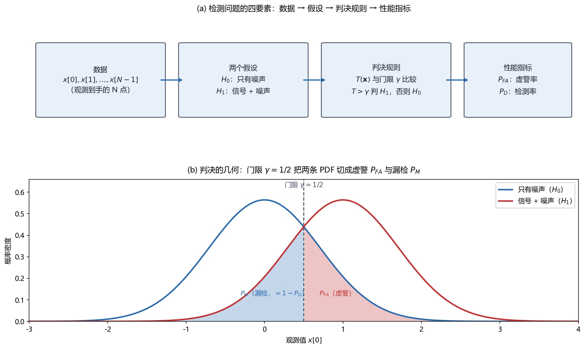

# Vol2 Ch01 引言：第一卷问"参数是多少"，这一卷问"信号在不在"

> 对应原书：第二卷《检测理论》第 1 章（书内第 457~469 页，本扫描 PDF 第 472~484 页；页码映射"书内 = PDF − 15"在本章再次实测成立：PDF 473 顶栏"458"、PDF 484 顶栏"469"）。
> 前置阅读：本系列 `Vol1_Ch01_引言.md`（估计问题的定义与"估计量是随机变量"观）、`00_阅读指南.md`（两卷分工）。本文自包含，涉及的前置概念就地插播。

## 写在前头

这是讲解系列**第二卷的第 1 篇**，对应原书第二卷《检测理论》第一章。它在第二卷里的角色，与第一卷的 Ch01 完全对称：**不引入任何具体的检测器，只把"检测"这个问题定义清楚，并约定评价检测器的两把尺子——虚警率 $P_{FA}$ 与检测率 $P_D$。** 后面 12 章的所有检测器（匹配滤波器、能量检测器、GLRT、CFAR……）都是围绕这两把尺子展开的。

第一卷回答了"参数是多少"（估计），这一卷回答"信号在不在"（检测）。用一句话概括本章的设计目标：**让读者在十几页之内建立起四个观念——检测是判决、判决在 $H_0/H_1$ 两个假设之间进行、判决靠"统计量比门限"、好坏看 $P_{FA}$ 与 $P_D$。** 这四个观念就是整个第二卷的地基。

**实测声明**：本文所有内容与数字均经 OCR 核对原书扫描件（PDF 第 472~484 页，OCR 文本存于 `Temp/chapters_ocr/v2ch01/`），不是凭印象转述。公式编号（1.1）~（1.8）、例子/图编号均为原书编号。文末注明由模型自算的派生数字（如各噪声方差下的 SNR 与 $P_{FA}$），与 OCR 原书数字严格区分。图 Fig021 为本系列自建示意图（脚本 `Temp/scripts/make_fig021.py`，经 `plotutil.check_figure` 程序化碰撞检测通过），参数与原书图 1.6(b) 一致。

---

## 1. 检测和估计是两件事：为什么"信号在不在"要单独立一卷

### 1.1 问题驱动：雷达、通信、语音识别的第一步都不是"测"，而是"判"

原书 §1.1 一上来摆了八个应用领域：雷达、通信、语音、声纳、图像处理、生物医学、控制、地震学。它们表面上毫不相干，但 Kay 指出它们有一个**相同的目标**：先确定"感兴趣的事件在什么时候发生"，然后才去提取"该事件更多的信息"。**前半句是判决（检测），后半句是信息提取（估计）——本书第一卷只讲了后半句，前半句留给第二卷。**

先看雷达。我们要判断的是"有没有飞机正在靠近"。发射一个电磁脉冲，如果脉冲被大的运动目标反射回来，就说明有飞机。**如果飞机出现，接收波形 = 反射脉冲（延迟一段时间）+ 周围辐射 + 接收机电子噪声；如果飞机没出现，接收波形 = 纯噪声。** 信号处理器的任务，就是从波形里判断"只有噪声"还是"噪声里埋着回波"。原书图 1.1(b) 画了两种情形的接收波形：有回波时波形"有些不同，尽管差别不是很大"——因为回波经过传播损耗被衰减、多次反射相互作用产生失真。**翻译成人话：检测面对的信号，常常是"埋得很浅"的信号，不是一眼就能看出来的。**

这里 Kay 埋了一句关键的伏笔：雷达问题的最佳检测器是**第 3 章要介绍的 Neyman-Pearson 检测器**，而"适合不确定信号的更一般的实际检测器将在第 7 章介绍"。**检测的难度分级（信号知道多少）从第一章就定了调，见 §5 的表 1.1。**

再看数字通信（图 1.2）：二元相移键控（BPSK）系统用来传输数据源输出的"0"或"1"。调制器把"0"转换成波形 $s_0(t) = \cos 2\pi F_0 t$，把"1"转换成 $s_1(t) = \cos(2\pi F_0 t + \pi) = -\cos 2\pi F_0 t$——**正弦的相位（0° 还是 180°）就代表了发的是 0 还是 1**。接收端解调去掉载波后，检测器输入端剩下基带的正/负脉冲，再被信道带宽受限和加性噪声搞失真。**注意：通信和雷达不同——通信里"总是有一个信号出现"，问题变成了"哪一个信号出现"。** 解法也在第 4 章。

第三个例子是语音识别：在一组可能的单词里确定说的是哪一个，比如在数字"0"到"9"里识别。原书图 1.3 画了"0"和"1"的波形，由同一个发音者重复 3 次——**同一个字每次发音都有轻微变化，这种自然变化被当作噪声**。给定一次发音，要判断它是 0 还是 1（二元），更一般的是在 10 个数字里选一个（多元）。

三个例子的共同点，收拢成一句话：

> **检测问题 = 根据一段被噪声污染的观测，在"信号在 / 信号不在"（或"信号是 A / 信号是 B"）之间做选择；它先于估计，且必须正视噪声的随机性。**

### 1.2 为什么必须用统计方法：噪声每次都不一样

读者有 DSP 基础，可能会本能地问：把接收波形和发射脉冲做相关、看峰值过不过门限，不就完了吗？为什么要上升到"统计假设检验"？

**因为噪声是随机的，不是某个确定但未知的常数。** 同一套设备、同样的信号，两次采集的接收波形不会一模一样。对随机的东西，唯一完整的描述方式是概率。原书 §1.2 点明：这些问题"根据观测数据集需要在两个或多个可能的假设中做出判决"，由于噪声固有随机特性（以及语音模式的自然变化），**必须采用统计的方法**——而"根据数据做判决"正是**统计假设检验**（statistical hypothesis testing）的中心内容，其理论基础可追溯到 Kendall and Stuart 1976~1979、Lehmann 1959。

在"两个假设里选一个"时，叫**二元假设检验**；"两个以上"时叫**多元假设检验**（如 10 个数字的分类，也叫模式识别/分类问题，见 Fukunaga 1990）。**二元是多元的砖，全书先用二元把概念讲透。**

---

## 2. 一个最小的检测问题：DC 电平在不在

### 2.1 问题驱动：只有一次观测，怎么判？

原书 §1.3 用一个最小例子把检测问题"解剖"到最细：**在方差为 $\sigma^2$ 的高斯白噪声 $w[n]$ 里，检测一个幅度 $A = 1$ 的直流电平**，而且**只有一次观测 $x[0]$ 可用**。这是全书"标准例子"——Kay 在 §1.6 特意说明，这个"噪声中的 DC 电平"问题几乎贯穿所有检测方法的介绍。

两个假设写作（原书式 1.4）：

$$
H_0:\ x[0] = w[0], \qquad H_1:\ x[0] = 1 + w[0]
$$

其中 $H_0$ 表示"只有噪声"（信号不存在），$H_1$ 表示"噪声中有信号"，$w[0]$ 为零均值、方差 $\sigma^2$ 的高斯噪声。**翻译成人话：$H_0$ 下 $x[0]$ 的均值是 0，$H_1$ 下 $x[0]$ 的均值是 1；噪声把它们各自糊成一个以 0 或 1 为中心的钟形。**

一个朴素而合理的判决规则是：取真值的中点作门限。既然两个假设下的期望分别是 0 和 1，就看 $x[0]$ 离谁近：

$$
x[0] > \tfrac{1}{2}\ \Rightarrow\ \text{判 } H_1\ \text{（信号存在）}\qquad \text{(1.1)}
$$

$$
x[0] < \tfrac{1}{2}\ \Rightarrow\ \text{判 } H_0\ \text{（只有噪声）}\qquad \text{(1.2)}
$$

其中 $\tfrac12$ 是 0 和 1 的中点，$x[0] = \tfrac12$ 恰好发生的概率为零，怎么判都行（原书随后省略这种情况）。**翻译成人话：$x[0]$ 偏大就信"信号在"，偏小就信"只有噪声"——这是人类面对噪声时的本能，把它写成了式子。**

### 2.2 判决规则与两种错误：为什么"永远不错"是不可能的

这套规则会犯错，而且**两种错都有**：

- **虚警（false alarm）**：$H_0$ 为真（只有噪声），但噪声 $w[0] \ge \tfrac12$，于是误判 $H_1$；
- **漏检（miss）**：$H_1$ 为真（有信号），但噪声 $w[0] < -\tfrac12$ 把 $x[0] = 1 + w[0]$ 拽到门限以下，于是误判 $H_0$。

（原书把这两种错误留给习题 1.1 计算，并指出"我们不能期望在所有时刻都正确，但有希望保证在大多数情况下正确"——**"大多数情况"怎么量化，就是 §3.2 的两把尺子。**）

噪声的 PDF 是（原书式 1.3）：

$$
p(w[0]) = \frac{1}{\sqrt{2\pi\sigma^2}} \exp\!\left(-\frac{w^2[0]}{2\sigma^2}\right)
$$

其中 $\sigma^2$ 为噪声方差。噪声越"散"（$\sigma^2$ 越大），$w[0]$ 越容易越过门限，错误越多。

### 2.3 噪声变大，错误变多：检测性能取决于 PDF 的分离程度

原书用一组模拟实验把这个直觉钉死。对 $100$ 个 $w[0]$ 的现实，分别在信号存在/不存在时观测 $x[0]$，画成散点（图 1.4）和直方图（图 1.5）：

- $\sigma^2 = 0.05$ 时（图 1.4(a)），"只有噪声"的点（$0$ 附近）和"信号+噪声"的点（$1$ 附近）**分得很开**，按（1.1）（1.2）判，错误十分稀少；
- $\sigma^2 = 0.5$ 时（图 1.4(b)），两组点**严重重叠**，错误机会显著增加。

原因就是 $w[0]$ 现实的扩散随 $\sigma^2$ 增大。把散点升级成 PDF（图 1.6），两个假设下的 PDF 分别是（原书式 1.5 的两个式子）：

$$
p(x[0]; H_0) = \frac{1}{\sqrt{2\pi\sigma^2}} \exp\!\left(-\frac{x^2[0]}{2\sigma^2}\right), \qquad
p(x[0]; H_1) = \frac{1}{\sqrt{2\pi\sigma^2}} \exp\!\left(-\frac{(x[0]-1)^2}{2\sigma^2}\right)
$$

其中分号后的 $H_0/H_1$ 表示"该 PDF 是哪条假设下的"。

**一句话总结：检测性能取决于两条 PDF 分得开不开——或者等效地说，取决于信噪比 $A^2/\sigma^2$ 的大小。** 原书原文是"检测器的性能随着 PDF 距离的增加，或随 $A^2/\sigma^2$（信噪比，SNR）的增加而有所改善"。这正是 §6 里偏移系数的种子。

---

## 3. 检测问题的四个要素：数据、假设、判决规则、性能指标

### 3.1 把 §2 的例子抽象成四件套

把上一节的 DC 电平例子拆开，任何检测问题都由**四个要素**组成，缺一不可：

1. **数据** $\mathbf{x} = [x[0], x[1], \ldots, x[N-1]]^T$——观测到手的 $N$ 点序列（连续波形经 ADC 采样后的形态）；
2. **两个假设** $H_0$ 与 $H_1$——对"数据是怎么来的"两种互斥解释（只有噪声 vs 信号+噪声）；
3. **判决规则**——由数据算一个统计量 $T(\mathbf{x})$，再和门限 $\gamma$ 比较：$T(\mathbf{x}) > \gamma$ 判 $H_1$，否则判 $H_0$。确定函数 $T$ 并把它映射成判决，是检测理论的核心问题；
4. **性能指标**——$P_{FA}$（虚警率）与 $P_D$（检测率），回答"这套规则长期来看判得对不对"。

图 Fig021 把这四要素串成一条线，并画出第 2 条对应的判决几何：

*图 Fig021：检测问题全景图（自建示意，脚本 `Temp/scripts/make_fig021.py`，经程序化碰撞检测通过）。上图 (a) 是四要素流程：数据 → 两个假设 $H_0/H_1$ → 判决规则 $T(\mathbf{x})$ 与门限 $\gamma$ 比较 → 性能指标 $P_{FA}/P_D$；下图 (b) 是判决几何（参数取 $A=1$、门限 $\gamma=1/2$、噪声方差 $\sigma^2=0.5$，与原书图 1.6(b) 一致）：红色阴影是 $H_0$ 在门限右侧的尾部 = 虚警 $P_{FA}$，蓝色阴影是 $H_1$ 在门限左侧的尾部 = 漏检 $P_M = 1-P_D$。看两件事：① 门限一动，$P_{FA}$ 和 $P_D$ 反向变化（这就是第 3 章 ROC 曲线的几何根源）；② 两条 PDF 越分不开（$\sigma^2$ 越大），阴影区越大，性能越差。*

### 3.2 性能指标：虚警率 $P_{FA}$ 与检测率 $P_D$

"这套规则长期判得对不对"要靠两个概率回答（形式化定义在第 3 章的 Neyman-Pearson 准则给出，本章先用直觉引入）：

$$
P_{FA} = \Pr\!\big\{\text{判 } H_1 \mid H_0\ \text{为真}\big\}, \qquad P_D = \Pr\!\big\{\text{判 } H_1 \mid H_1\ \text{为真}\big\}
$$

其中 $P_{FA}$ 为**虚警率**（probability of false alarm：明明没有信号却喊"有"），$P_D$ 为**检测率**（probability of detection：真有信号时确实喊"有"）。**翻译成人话：$P_{FA}$ 是"狼来了"的概率，$P_D$ 是"狼真来了你喊对了"的概率。** 与之配对的是漏检率 $P_M = 1 - P_D$（狼来了却没喊）。

这四者（$P_{FA}$、$P_D$、$P_M$、门限 $\gamma$）是绑在一起的：**门限抬高一档，$P_{FA}$ 下降但 $P_D$ 也下降；门限放低一档，$P_D$ 上升但 $P_{FA}$ 也上升。** 不可能两个同时最优——这条"此消彼长"的约束就是第 3 章 ROC（接收机工作特性）曲线要描的那条曲线。本章只在图 Fig021(b) 里给出几何预告。

以 $\sigma^2 = 0.5$、门限 $\gamma = 1/2$ 为例（**本文自算，非 OCR 原书数字**，推导即习题 1.1/1.4）：$P_{FA} = Q(1/(2\sqrt{0.5})) = Q(0.7071) \approx 0.24$，$P_D = Q((0.5-1)/\sqrt{0.5}) = Q(-0.7071) \approx 0.76$，其中 $Q(x)$ 是标准正态的右尾概率（第 2 章 §2.2.1 有正式定义）。**一判四错一，这个 SNR 下检测相当吃力——这正是 §6 说"检测偏爱低 SNR、要靠长数据"的现实样本。**

### 3.3 换个角度看：检测就是"参数检验"

§1.3 后半段做了一个全书最漂亮的"换视角"：把两个假设的 PDF 并成一个**带参数 A 的 PDF 族**（原书式 1.6）：

$$
p(x[0]; A) = \frac{1}{\sqrt{2\pi\sigma^2}} \exp\!\left(-\frac{(x[0]-A)^2}{2\sigma^2}\right)
$$

其中 $A$ 是参量。**当 $A = 0$ 时它就是 $H_0$ 的 PDF，当 $A = 1$ 时它就是 $H_1$ 的 PDF。** 于是"信号在不在"等价于检验一个参数取哪个值（原书式 1.7）：

$$
H_0:\ A = 0, \qquad H_1:\ A = 1
$$

**翻译成人话：检测就是"参数检验"——先假设数据由一个含参 PDF 生成，再检验参数落在哪个值上。** 这个观点"在以后将会有用"，是全书最重要的伏笔之一：

> **当 $A$ 不是 0/1 两个已知值、而是完全未知时，怎么判？** 自然的思路是：先用估计的方法把 $A$ 估出来，再拿估计值去和门限比——这正是**第 6 章广义似然比检验（GLRT）**的思想，而 GLRT 里"估计 $A$"那一步用的就是第一卷第 7 章的**最大似然估计（MLE）**。**检测复用估计工具，两卷在此合流；这也是本卷第 6 篇（GLRT）要兑现的回调。**

### 3.4 贝叶斯视角：先验概率进场

还有一个岔路口值得在本章埋下。原书 §1.3 用**启闭键控（OOK）**数字通信举了个例子：把"没发射脉冲"当发"0"，把"发射幅度 $A=1$ 的脉冲"当发"1"，对应的假设检验正是（1.7）。实际的 OOK 系统发的是平稳数据位流，0 和 1 由信源**等可能**地产生，所以 $H_0$ 和 $H_1$ 各有一半时间为真——**把假设看成概率为 $1/2$ 的随机事件**，PDF 就写成条件形式 $p(x[0] \mid H_0)$、$p(x[0] \mid H_1)$（竖线表示"给定假设"）。

原书明说，这个分号/竖线的区别**"类似于参数估计中的经典方法与贝叶斯方法的区别"**（参见第一卷）。**记号的分野就是世界观的分野：分号把假设当确定事实，竖线给假设配上先验概率。** 带先验概率的最优判决（最小错误概率）是第 3 章的贝叶斯风险那一节的内容，本章只把坑挖好。

---

## 4. 全卷地图：从"什么都知道"到"什么都不知道"

§1.4 交代了第二卷的编排逻辑，一句话：**从简单到复杂，难易取决于"信号与噪声的特征你知道多少"——这些知识通过 PDF 体现。**

- **PDF 精确已知**：第 4、5 章。至少理论上能拿到**最佳检测器**。
- **PDF 不完全已知**：第 7~9 章。这时"好的检测器（但可能不是最佳的）"的确定会相当困难。
- **高斯 PDF 特别方便**：从理论和实际观点看，高斯假定是最常用的；但第 10 章把它换成一般的**非高斯 PDF**。

原书表 1.1 把信号（确定性/随机 × 已知/未知）和噪声（高斯/非高斯 × PDF 已知/未知）交叉成一个矩阵，标注每格在本卷哪一章讨论（其中"非高斯未知 PDF"一格标注"* 不讨论（超出本书范围）"）。**翻译成人话：这张表就是第二卷的目录矩阵——每一格代表"你对信号和噪声各知道多少"，越往右下角，你知道得越少、检测器越妥协、性能越差。** 阅读时始终问一句：这一章比上一章少知道了什么，检测器为此付了什么代价。

---

## 5. 渐近的作用：为什么检测偏爱低 SNR、长数据

### 5.1 问题驱动：信号很弱时怎么办？

§1.5 点出一个与估计理论形成对照的事实：**估计问题通常希望 SNR 高到足以保证精度；检测问题恰恰相反——我们感兴趣的是"信号很弱、信噪比很小"时把信号揪出来。** 如果信号根本没埋在噪声里，也就用不着检测理论了。**弱信号的救命稻草是数据长度 $N$：多采几个点，把噪声平均掉。**

原书把 DC 电平例子推广到 $N$ 次观测：

$$
H_0:\ x[n] = w[n], \quad H_1:\ x[n] = A + w[n], \qquad n = 0, 1, \ldots, N-1
$$

其中 $w[n]$ 为方差 $\sigma^2$ 的 WGN。一个合理的方法是对样本取平均，得统计量 $T = \frac1N\sum_{n=0}^{N-1}x[n]$，和门限比——**（1.1）式刚好是这个规则的 $N=1$、门限 $\gamma = 1/2$ 特例。** 图 1.7 画了 $\sigma^2 = 0.5$、$N=1$ 和 $N=10$ 时 $T$ 的直方图（各 100 次现实）：**$N$ 增大，两个直方图的重叠减少**——直观理解"数据越长检测越好"被坐实。

### 5.2 偏移系数 $d^2$：把"分得开"量化

为了定量表示"分得开"，原书引入**偏移系数**（deflection coefficient，中译本作"偏移系数"），当 $\mathrm{var}(T;H_0) = \mathrm{var}(T;H_1)$ 时定义为（原书式 1.8 的分子形式）：

$$
d^2 = \frac{\bigl(E(T;H_1) - E(T;H_0)\bigr)^2}{\mathrm{var}(T;H_0)}
$$

其中 $E(T;H_i)$ 为 $T$ 在假设 $H_i$ 下的均值，$\mathrm{var}(T;H_0)$ 为 $H_0$ 下的方差。**翻译成人话：$d^2$ 是两个假设下统计量"均值差"与"散布"的比值——均值差越大、散布越小，两条直方图分得越开，检测越容易。** 原书说"检测性能随 $d^2$ 增加而增加"（第 4 章给出完整论证）。

对当前问题（习题 1.6），$E(T;H_0) = 0$，$E(T;H_1) = A$，$\mathrm{var}(T;H_0) = \sigma^2/N$，代入得（原书式 1.8）：

$$
d^2 = \frac{A^2}{\sigma^2/N} = \frac{NA^2}{\sigma^2}
$$

其中 $N$ 为数据长度，$A^2/\sigma^2$ 为 SNR。**翻译成人话：$d^2 = N \times \mathrm{SNR}$——弱信号（SNR 小）可以用长数据（$N$ 大）补齐，两者是可交易的。** 习题 1.7 把这个交易做成一道算账题：要在 SNR = −20 dB 时靠 $d^2 = 100$ 拿到合适性能，需要多少样本——由 $d^2 = NA^2/\sigma^2 = 100$ 且 $A^2/\sigma^2 = 10^{-2}$（−20 dB），解出 $N = 10^4$。

### 5.3 中心极限定理：渐近分析为什么"够用"

$T = \frac1N\sum x[n]$ 若 $w[n]$ 是 IID **非高斯**噪声，$T$ 就没有高斯 PDF。但当 $N \to \infty$，**中心极限定理**（CLT）说 $T$ 渐近高斯，于是要确定检测性能，**只需要 $T$ 的前两阶矩**（均值、方差）。**翻译成人话：渐近分析把"非高斯问题"压回"高斯问题"，代价是它只在 $N \to \infty$ 成立、不告诉你 $N$ 多大才够——这是渐近理论的天性（第一卷 Ch07 的 MLE 渐近性里同样踩过这个坑）。** 正式的多维高斯 PDF 与渐近形式在第 2 章 §2.4 展开。

---

## 6. 关键设计决策回顾

把散在正文里的"为什么"收拢。每个决策都是一个真实的岔路口：

| # | 决策 | 为什么这么选 | 换一个选择会怎样 |
|---|------|------------|----------------|
| 1 | **先"判在不在"，再"问是多少"**，检测单独立卷 | 八个应用的第一步都是判决；估计需要信号已存在的假设才能有意义地做 | 把检测并入估计，会掩盖"判决的两类错误"这个与估计完全不同的评价维度（估计看偏差/方差，检测看 $P_{FA}/P_D$） |
| 2 | 用**统计假设检验**框架（$H_0/H_1$ + PDF）而非确定性相关 | 噪声是随机的，"长期判对"只能靠概率描述（§1.2） | 确定性方法无法量化"错判的概率"，也就无法设计"控制虚警率"的检测器 |
| 3 | 判决规则统一为 **$T(\mathbf{x}) \gtrless \gamma$** | 把无穷多种判决浓缩成一个统计量 + 一个门限，性能分析只需算 $T$ 在两假设下的分布 | 每个检测器各自为政，无法建立 $P_{FA}/P_D$ 的统一评价 |
| 4 | 用 **$P_{FA}$ 与 $P_D$** 两把尺子（而非单一"正确率"） | 两类错误的代价通常不同（虚警与漏检的后果不对称），必须分开控制 | 只用一个"总错误率"会掩盖"宁漏勿虚"或"宁虚勿漏"这类实际约束（第 3 章贝叶斯风险/最小错误概率的动机） |
| 5 | 把检测看成**参数检验** $H_0:A=0,\ H_1:A=1$ | 为"参数未知时先估计再判"（GLRT）铺路，检测与第一卷 MLE 无缝对接 | 不建立参数检验视角，GLRT 就成了无源之水，检测与估计两卷会断开 |
| 6 | 用**偏移系数 $d^2$** 量化可分性，而非直接上错误概率 | 错误概率依赖 $T$ 的完整分布，$d^2$ 只需前两阶矩，便于渐近分析（§5.3） | 直接算 $P_{FA}/P_D$ 在非高斯场合常常没有闭式解，工程上寸步难行 |

## 7. 阅读备忘（对照原书时的坑）

1. **页码映射**：本章正文 PDF 472~484 → 书内 457~469，**书内 = PDF − 15**（PDF 473 顶栏"458"、PDF 484 顶栏"469"，与 `全书目录整理.md` 第二卷第 1 章起始书内 457 一致）。引用以 PDF 页码为准。
2. **门限 $\gamma = 1/2$ 的来历**：原书没给门限一个符号，只说"$x[0] > 1/2$"。这个 $1/2$ 是 $H_0$（均值 0）与 $H_1$（均值 1）的中点，**只有当 $A=1$ 且两假设先验等可能时才是"中点"**；$A$ 变了，最优门限也要跟着变（习题 1.3、1.4 就是让读者自己算门限随 $A_0$ 的变化）。
3. **记号 $P_{FA}/P_D$ 在本章尚未正式定义**：原书第 1 章只用文字与习题 1.1 的 $P_{FA} = \Pr\{x[0]>1/2;H_0\}$ 引出，正式定义在第 3 章 Neyman-Pearson 准则。本文 §3.2 为便于讲解提前给出了定义，口径与原书一致。
4. **"偏移系数"的译名**：中译本作"偏移系数"，英文原版为 deflection coefficient（直译"偏转/挠度系数"）。本文沿用中译本译名，并注英文。
5. **图 1.7 的噪声方差**：OCR 页 481 标 "(b) o* = 0.5"，即图 1.7 用 $\sigma^2 = 0.5$、比较 $N=1$ 与 $N=10$；图 1.4/1.6 则是 $\sigma^2 = 0.05$ 与 $0.5$ 两个子图对比。三者别混。

## 8. 本章的局限（坦诚交代，并预告后续）

- 本章只定义问题，**没有给出任何一个"如何设计最优检测器"的方法**——门限 $1/2$ 是拍脑袋的中点，不是推导出来的。读到章末"还不会设计任何检测器"完全正常，那是第 3 章（NP 准则）起的活。
- **$P_{FA}$ 与 $P_D$ 的完整权衡（ROC 曲线）只给了几何预告**（图 Fig021(b)），没有定量画出"门限扫一遍得到整条曲线"——这是第 3 章的正式内容。
- 偏移系数 $d^2$ 只在 $\mathrm{var}(T;H_0) = \mathrm{var}(T;H_1)$ 时才有定义；**两假设下方差不等时 $d^2$ 失效**，原书随后不再依赖它（正文只提到这个前提，未展开不等情形的替代度量）。
- 三个应用（雷达/BPSK/语音）本章只有定性描述，定量方案推迟到第 3 章（NP 准则）、第 4 章（匹配滤波器）与第 7 章（未知参数信号）——**这是作者有意的伏笔结构，不是遗漏。**
- **贝叶斯先验、最小错误概率、多元假设**都只露了个头，正式展开在第 3 章后半；"非高斯未知 PDF"一格则明确**超出本书范围**（表 1.1）。

## 9. 建议自测的问题

1. 用你自己的话解释：为什么"信号在不在"要单独立一卷，不能并入"参数是多少"？（提示：§1，两类错误的评价维度不同）
2. 对 §2 的 DC 电平例子（$A=1$、$\sigma^2=0.05$、门限 $1/2$），$P_{FA} = \Pr\{x[0]>1/2;H_0\}$ 等于多少？（原书习题 1.1；提示：$P_{FA} = Q(1/(2\sqrt{0.05}))$，$Q$ 见第 2 章）
3. 门限从 $1/2$ 抬到 $3/4$，$P_{FA}$ 和 $P_D$ 各自变大还是变小？为什么二者不能同时最优？（提示：图 Fig021(b)）
4. 为什么"检测 = 参数检验"这个观点是 GLRT 的伏笔？（提示：§3.3，参数未知时先估 $A$ 再判，估计用 MLE）
5. 原书习题 1.7：SNR = −20 dB 时要求 $d^2 = 100$，用 $d^2 = NA^2/\sigma^2$ 求所需样本数 $N$ 是多少？（提示：§5.2）

---

**一句话收尾：这一章一个检测器都没造出来，但它把"检测是什么、判错了怎么算账"钉死了——后面 12 章，不过是在这张钉死的棋盘上，按"信号与噪声你知道多少"逐格下子。**

*实测核对声明：本章事实性内容核对自原书扫描件 OCR 文本 `Document/统计信号处理/Temp/chapters_ocr/v2ch01/ocr_page_472~484.txt`（PDF 第 472~484 页，书内 457~469 页）；公式编号（1.1）~（1.8）与原书一致；图编号 1.1~1.7、表 1.1 与原书一致。§3.2 的 $P_{FA}\approx0.24$、$P_D\approx0.76$ 与 §5.2 的 $N=10^4$ 为本文自算派生值，非 OCR 原书数字，已就地标注。Fig021 由 `Temp/scripts/make_fig021.py` 生成并经 `plotutil.check_figure` 程序化碰撞检测通过。*
