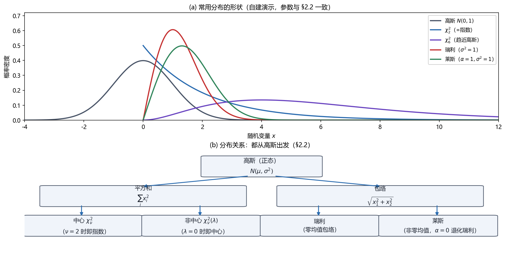

# Vol2 Ch02 重要 PDF 的总结：检测性能的"概率工具箱"，当手册查

> 对应原书：第二卷《检测理论》第 2 章（书内第 470~500 页，本扫描 PDF 第 485~515 页；页码映射"书内 = PDF − 15"实测成立：PDF 486 顶栏"471"、PDF 500 顶栏"485"）。
> 前置阅读：本系列 `Vol2_Ch01_引言.md`（$P_{FA}$/SNR 的直觉）；第一卷 Ch01/Ch07 的记号约定。本文自包含，是**参考手册风格**——分布速查表 + 性质清单为主，推导一律注明原书小节。

## 写在前头

这是第二卷的**工具章**，原书把它放在检测理论正文（第 3 章起）之前，用意很实在：**检测器性能的评估，取决于能不能解析地或数值地确定"数据样本函数的 PDF"；做不到时，就要靠蒙特卡洛模拟。** 熟悉常用 PDF 及其性质，是性能评估的必修课。原书自陈"由于篇幅限制，我们的讨论只是粗略介绍"，更详细的参考是 Abramowitz & Stegun 1970、Kendall & Stuart 1976~1979、Johnson, Kotz & Balakrishnan 1995。

一句话概括本章设计目标：**给读者一张"从高斯出发"的分布关系网——每个分布的构造来源、均值方差、右尾概率、与别的分布的关系，以及它在检测里的用途。** 这一章没有新检测器，但第 3~10 章每个检测器的性能分析都要回来查这张表。

**实测声明**：本文内容核对自原书扫描件 OCR 文本 `Temp/chapters_ocr/v2ch02/ocr_page_485~515.txt`（PDF 第 485~515 页，书内 470~500 页）；公式编号（2.1）~（2.38）沿用原书。数学式 OCR 识别残缺处（如瑞利均值、F 分布方差等）据 Kay 原书英文版（Fundamentals of Statistical Signal Processing, Vol II）校订并就地注明。各分布的"信号处理用途"是本系列的工程解读（把分布接到后续章节的检测器上），与 OCR 的"构造来源"分开标注。图 Fig022 为本系列自建演示（脚本 `Temp/scripts/make_fig022.py`，经 `plotutil.check_figure` 程序化碰撞检测通过）。

---

## 1. 为什么检测卷需要一章 PDF 速查（§2.1）

**问题驱动**：第 1 章 §3.2 已经看到，评价一个检测器要算 $P_{FA} = \Pr\{T > \gamma \mid H_0\}$ 和 $P_D = \Pr\{T > \gamma \mid H_1\}$——这两件事归根到底都是"算某个统计量 $T$ 的 PDF 的右尾概率"。**而 $T$ 几乎总是由数据经某种运算（平方和、相关、包络、比值）构造出来，它的 PDF 往往是几个标准分布之一，或它们的组合。** 所以，把"标准分布"的公式、矩、右尾概率都备齐，检测性能分析就能"查表 + 套公式"完成，而不是每次都从头积分。

原书把本章拆成五块：**基本 PDF（§2.2）→ 高斯二次型（§2.3）→ 渐近高斯 PDF（§2.4）→ 蒙特卡洛（§2.5）**，外加五个附录（2A 蒙特卡洛次数、2B 正态概率纸、2C 算 Q 函数、2D 算 χ² 右尾、2E 蒙特卡洛程序）。**翻译成人话：§2.2 给你"手工能算"的分布，§2.3 给你"把检测统计量接回 χ²"的统一线索，§2.4 给你"长数据时协方差矩阵的捷径"，§2.5 给你"算不出来时怎么办"的兜底方案。**

---

## 2. 高斯（正态）：一切的地基（§2.2.1）

**问题从哪来**：第 1 章的 DC 电平检测里，噪声就是高斯白噪声（WGN）。整个检测理论卷都默认"噪声是高斯"起步（第 10 章才换非高斯），所以高斯是必须第一个记住的。

**引入理论**：标量高斯 PDF（原书式 2.1）：

$$
p(x) = \frac{1}{\sqrt{2\pi\sigma^2}} \exp\!\left(-\frac{(x-\mu)^2}{2\sigma^2}\right)
$$

其中 $\mu$ 为均值，$\sigma^2$ 为方差，记作 $x \sim \mathcal{N}(\mu, \sigma^2)$，"$\sim$"表示"服从……分布"。

**性质**（原书式 2.2）：若 $\mu = 0$，则各阶矩为

$$
E(x^n) = \begin{cases} 1\cdot 3\cdot 5\cdots(n-1)\,\sigma^n, & n\ \text{为偶数}\\ 0, & n\ \text{为奇数}\end{cases}
$$

其中 $E(x^n)$ 为 $n$ 阶矩。**翻译成人话：零均值高斯的所有奇数阶矩都是 0（对称性），所有偶数阶矩都由方差 $\sigma^2$ 完全决定——高斯是"只靠二阶矩就能完全描述"的分布。** $\mu \neq 0$ 时用二项展开 $E\big((x+\mu)^n\big) = \sum_{k=0}^{n} \binom{n}{k} E(x^k)\mu^{n-k}$ 平移即可。

**Q 函数（右尾概率）**：检测里真正反复用到的是"超过门限的概率"，即右尾（原书式 2.3）：

$$
Q(x) = \int_x^\infty \frac{1}{\sqrt{2\pi}} \exp\!\left(-\frac{t^2}{2}\right) dt
$$

其中 $Q(x)$ 为标准正态 $\mathcal{N}(0,1)$ 的右尾概率，即 $Q(x) = 1 - \Phi(x)$（$\Phi$ 为累积分布函数 CDF），也叫**互补累积分布函数**。**它没有闭合形式解**——这就是后面 §2.5 蒙特卡洛和附录 2C 数值程序存在的原因。原书图 2.1 给出线性和对数刻度下的 $Q(x)$。

一个常用近似（原书式 2.4，习题 2.2 用分部积分导出）：

$$
Q(x) \approx \frac{1}{x\sqrt{2\pi}} \exp\!\left(-\frac{x^2}{2}\right)
$$

其中近似在 $x$ 较大时成立。**翻译成人话：右尾概率主要被指数项 $\exp(-x^2/2)$ 压死，$x$ 越大越准（原书图 2.2：$x > 4$ 时近似相当精确）。** 逆函数记 $Q^{-1}(P)$（$Q$ 严格单调递减，逆必存在），附录 2C 给了 MATLAB 程序 `Q.m`/`Qinv.m`。

> **前置概念：正态概率纸。** 有时要判断一个随机变量是否"近似高斯"，直接看 PDF 不够明显。把它的右尾概率画在**正态概率纸**（normal probability paper）上，高斯右尾会变成一条**直线**（原书图 2.3）；偏离直线就是偏离高斯（原书图 2.4 用混合高斯 PDF 演示，其右尾形式为 $Q(x)/2 + Q(x/\sqrt{2})/2$）。附录 2B 给出构造方法与 `plotprob.m`。

**多维高斯**（原书式 2.5）：$n \times 1$ 随机矢量 $\mathbf{x}$ 的 PDF 为

$$
p(\mathbf{x}) = \frac{1}{(2\pi)^{n/2} \det(\mathbf{C})^{1/2}} \exp\!\left[-\frac{1}{2}(\mathbf{x} - \boldsymbol{\mu})^T \mathbf{C}^{-1}(\mathbf{x} - \boldsymbol{\mu})\right]
$$

其中 $\boldsymbol{\mu}$ 为均值矢量（$[\boldsymbol{\mu}]_i = E(x_i)$），$\mathbf{C}$ 为协方差矩阵（$[\mathbf{C}]_{ij} = E\big[(x_i - E(x_i))(x_j - E(x_j))\big]$，紧凑形式 $\mathbf{C} = E\big[(\mathbf{x} - E(\mathbf{x}))(\mathbf{x} - E(\mathbf{x}))^T\big]$），记作 $\mathbf{x} \sim \mathcal{N}(\boldsymbol{\mu}, \mathbf{C})$，要求 $\mathbf{C}$ 正定（$\mathbf{C}^{-1}$ 存在）。

**一个特别有用的结论**（原书式 2.6，Isserlis 定理）：$\boldsymbol{\mu} = \mathbf{0}$ 时所有奇数阶联合矩为零，偶数阶矩可由二阶矩组合，尤其

$$
E(x_i x_j x_k x_l) = E(x_i x_j)E(x_k x_l) + E(x_i x_k)E(x_j x_l) + E(x_i x_l)E(x_j x_k)
$$

其中 $x_i, x_j, x_k, x_l$ 为零均值联合高斯的四个分量。**翻译成人话：高斯的四阶矩 = 三个"二阶矩乘积"之和。** 这条在算检测统计量的方差（常出现四次项）时几乎必用。

**性质与限制**：高斯对"线性运算"封闭（线性变换仍是高斯），这是它好用的根源；但它**只在噪声真是高斯时才严格成立**，且 $Q(x)$ 没有闭式解、只能查表或数值计算。**好处**：WGN 模型下检测/估计的几乎一切都能推导出闭式或半闭式答案，所以它是全书默认起点。

---

## 3. χ² 家族：高斯的平方和（§2.2.2 中心化 / §2.2.3 非中心化）

### 3.1 中心 χ²：为什么能量检测器离不开它

**问题从哪来**：第 1 章的检测统计量是样本均值；但很多检测器（能量检测器）的统计量是**数据的平方和** $\sum x^2[n]$。要算它的 PDF，就引出了 χ²。

**引入理论**（原书式 2.7）：自由度为 $\nu$ 的中心 χ² PDF：

$$
p(x) = \frac{1}{2^{\nu/2}\,\Gamma(\nu/2)}\, x^{\nu/2 - 1} \exp\!\left(-\frac{x}{2}\right), \qquad x > 0
$$

其中 $\nu$ 为自由度（整数，$\nu \ge 1$），$\Gamma(u)$ 为伽马函数：$\Gamma(u) = \int_0^\infty t^{u-1} e^{-t} dt$，满足 $\Gamma(u) = (u-1)\Gamma(u-1)$、$\Gamma(1/2) = \sqrt{\pi}$、$\Gamma(n) = (n-1)!$（$n$ 整数）。记作 $x \sim \chi^2_\nu$。

**来源**：若 $x_i \sim \mathcal{N}(0,1)$ 独立同分布（IID），则 $x = \sum_{i=1}^{\nu} x_i^2 \sim \chi^2_\nu$。**翻译成人话：χ² 就是"$\nu$ 个独立标准高斯取平方再求和"的分布——能量检测器在纯噪声假设 $H_0$ 下，统计量就长这样（差一个 $\sigma^2$ 缩放）。**

**矩**（原书式 2.8/2.9）：

$$
E(x) = \nu, \qquad \mathrm{var}(x) = 2\nu
$$

其中 $E(x)$ 为均值、$\mathrm{var}(x)$ 为方差。

**性质与关系**：
- 原书图 2.5：**$\nu$ 越大，χ² PDF 越接近高斯**（这是中心极限定理在"平方和"上的体现）；$\nu = 1$ 时在 $x = 0$ 处 PDF 为无穷大。
- $\nu = 2$ 时退化为**指数 PDF**：$p(x) = \tfrac12 e^{-x/2}$（即率参数 $1/2$ 的指数分布）。
- 右尾概率 $Q_{\chi^2_\nu}(x) = \int_x^\infty p(t) dt$ 有分奇偶的闭式（原书式 2.10/2.11）：$\nu$ 为偶数时 $Q_{\chi^2_\nu}(x) = e^{-x/2}\sum_{k=0}^{\nu/2-1} \frac{(x/2)^k}{k!}$；$\nu$ 为奇数时 $Q_{\chi^2_\nu}(x) = 2Q(\sqrt{x}) + \frac{e^{-x/2}}{\sqrt{\pi}}\sum_{k=1}^{(\nu-1)/2}\frac{(k-1)!\,(2x)^{k-1}}{(2k-1)!}$。附录 2D 的 `Qchipr2.m` 数值计算之。

**限制**：χ² 的构造要求各 $x_i$ 是**标准正态且独立**；若均值非零（有信号）就不成立了——这正是下一小节非中心 χ² 的出场理由。

### 3.2 非中心 χ²：有信号时能量检测器的分布

**问题从哪来**：能量检测器在 $H_1$（有信号）下，$x_i$ 的均值不再是 0，$\sum x_i^2$ 的分布就"偏了"。

**引入理论**：若 $x_i \sim \mathcal{N}(\mu_i, 1)$ 相互独立，则 $x = \sum_{i=1}^\nu x_i^2$ 服从自由度为 $\nu$、**非中心参量** $\lambda = \sum_{i=1}^\nu \mu_i^2$ 的非中心 χ² 分布，记作 $\chi'^2_\nu(\lambda)$。**翻译成人话：$\lambda$ 度量"信号能量把分布往右推了多少"。**

PDF 很复杂，用积分或无穷级数表示（原书式 2.12/2.15），中间用到**第一类修正贝塞尔函数** $I_r(u)$（原书式 2.13/2.14）：

$$
I_r(u) = \sum_{k=0}^{\infty} \frac{(u/2)^{2k+r}}{k!\,\Gamma(r+k+1)}
$$

其中 $r$ 为阶数。原书图 2.6：**$\nu$ 变大或 $\lambda$ 变大，非中心 χ² PDF 都趋向高斯**。

**矩**（原书式 2.16/2.17）：

$$
E(x) = \nu + \lambda, \qquad \mathrm{var}(x) = 2\nu + 4\lambda
$$

**关系**：$\lambda = 0$ 时非中心 χ² 退化为中心 χ²。右尾概率用 `Qchipr2.m` 计算（附录 2D）。

**信号处理用途（本系列解读）**：能量检测器 $T = \frac{1}{\sigma^2}\sum_{n=0}^{N-1} x^2[n]$ 在 $H_0$ 下 $\sim \chi^2_N$，在 $H_1$（信号幅度 $A$）下 $\sim \chi'^2_N(NA^2/\sigma^2)$——**同一个检测器，两个假设下分别是中心和非中心 χ²**，$P_{FA}$ 与 $P_D$ 由此对账。这个"成对出现"的结构在第 7 章（未知幅度确定性信号）反复使用。

---

## 4. F 家族：两个 χ² 之比（§2.2.4 中心化 / §2.2.5 非中心化）

**问题从哪来**：检测里常有"两个独立方差估计做比较"（方差比检验），统计量是两个 χ² 的比值。

**引入理论**（原书式 2.17）：若 $x_1 \sim \chi^2_{\nu_1}$、$x_2 \sim \chi^2_{\nu_2}$ 独立，则

$$
x = \frac{x_1/\nu_1}{x_2/\nu_2} \sim F_{\nu_1, \nu_2}
$$

其中 $\nu_1$ 为**分子自由度**、$\nu_2$ 为**分母自由度**。PDF 含 Beta 函数 $B(\nu_1/2, \nu_2/2)$（$B(u,v) = \Gamma(u)\Gamma(v)/\Gamma(u+v)$），原书图 2.7 给示例。

**矩**（原书式 2.18，据英文原版校订）：

$$
E(x) = \frac{\nu_2}{\nu_2 - 2}\ (\nu_2 > 2), \qquad \mathrm{var}(x) = \frac{2\nu_2^2(\nu_1 + \nu_2 - 2)}{\nu_1(\nu_2 - 2)^2(\nu_2 - 4)}\ (\nu_2 > 4)
$$

**关键关系**：$\nu_2 \to \infty$ 时 $F_{\nu_1,\nu_2} \to \chi^2_{\nu_1}/\nu_1$（习题 2.3）——**分母自由度无穷大时，比值退化成单纯的缩放 χ²。**

**非中心 F**（§2.2.5）：把分子换成非中心 χ²，即 $x_1 \sim \chi'^2_{\nu_1}(\lambda)$，则 $x \sim F'_{\nu_1,\nu_2}(\lambda)$（非中心 F，PDF 为无穷级数，原书式 2.19）。矩（原书式 2.20，据英文原版校订）：

$$
E(x) = \frac{\nu_2(\nu_1 + \lambda)}{\nu_1(\nu_2 - 2)}\ (\nu_2 > 2), \qquad \mathrm{var}(x) = 2\left(\frac{\nu_2}{\nu_1}\right)^2 \frac{(\nu_1 + \lambda)^2 + (\nu_1 + 2\lambda)(\nu_2 - 2)}{(\nu_2 - 2)^2(\nu_2 - 4)}\ (\nu_2 > 4)
$$

$\lambda = 0$ 时退化为中心 F；$\nu_2 \to \infty$ 时 $F'_{\nu_1,\nu_2}(\lambda) \to \chi'^2_{\nu_1}(\lambda)/\nu_1$。右尾概率数值计算见 Patnaik 1949。

**性质与限制**：F 分布只在 $\nu_2 > 2$（均值）/$\nu_2 > 4$（方差）时矩才存在，**自由度太小矩会发散**——查表时先看分母自由度。**用途（本系列解读）**：方差比检验的统计量分布，在"两个噪声方差是否相等"这类问题（第 9 章未知噪声参数）里出现。

---

## 5. 瑞利与莱斯：高斯的包络（§2.2.6 / §2.2.7）

**问题从哪来**：窄带信号处理里，一个正弦载波 + 窄带噪声，解调后常常关心的是**包络（幅度）**，而不是载波相位。包络是 $x = \sqrt{x_1^2 + x_2^2}$ 这种形式，其中 $x_1, x_2$ 是正交两路的高斯噪声（或信号+噪声）。

### 5.1 瑞利：没有直达分量的包络

**引入理论**（原书式 2.21）：$x_1 \sim \mathcal{N}(0, \sigma^2)$、$x_2 \sim \mathcal{N}(0, \sigma^2)$ 相互独立，则 $x = \sqrt{x_1^2 + x_2^2}$ 的 PDF 为

$$
p(x) = \frac{x}{\sigma^2} \exp\!\left(-\frac{x^2}{2\sigma^2}\right), \qquad x > 0
$$

其中 $\sigma^2$ 为每个正交分量的方差。原书图 2.8 画了 $\sigma^2 = 1$ 的情形。

**矩与右尾**（原书式 2.22/2.23，均值据英文原版校订）：

$$
E(x) = \sigma\sqrt{\frac{\pi}{2}}, \qquad \mathrm{var}(x) = \left(2 - \frac{\pi}{2}\right)\sigma^2, \qquad \Pr\{x > \gamma\} = \exp\!\left(-\frac{\gamma^2}{2\sigma^2}\right)
$$

其中 $\Pr\{x > \gamma\}$ 为右尾概率（式 2.23）。**翻译成人话：瑞利的右尾概率是高斯 $Q$ 函数的"平方指数"版——因为它和 χ² 有直系关系。**

**关键关系**：$x$ 是瑞利时，$x^2/\sigma^2 \sim \chi^2_2$。所以 $\Pr\{x > \gamma\} = \Pr\{x^2 > \gamma^2\} = Q_{\chi^2_2}(\gamma^2/\sigma^2) = \exp(-\gamma^2/(2\sigma^2))$。**一句话：瑞利是 $\chi^2_2$ 的"开根号"。**

### 5.2 莱斯：有直达分量（正弦）的包络

**引入理论**（原书式 2.24）：$x_1 \sim \mathcal{N}(\mu_1, \sigma^2)$、$x_2 \sim \mathcal{N}(\mu_2, \sigma^2)$ 独立，令 $\alpha^2 = \mu_1^2 + \mu_2^2$，则包络 $x = \sqrt{x_1^2 + x_2^2}$ 的 PDF 为

$$
p(x) = \frac{x}{\sigma^2} \exp\!\left(-\frac{x^2 + \alpha^2}{2\sigma^2}\right) I_0\!\left(\frac{\alpha x}{\sigma^2}\right), \qquad x > 0
$$

其中 $I_0(\cdot)$ 为 0 阶第一类修正贝塞尔函数（原书式 2.25：$I_0(u) = \frac{1}{\pi}\int_0^\pi e^{u\cos\theta} d\theta$），$\alpha^2 = \mu_1^2 + \mu_2^2$ 是"直达分量的能量"。**翻译成人话：莱斯 = 瑞利 + 一个非零均值（直达正弦）——直达越强（$\alpha$ 越大），包络越"挺"、越接近高斯。**

**关系与右尾**：$\alpha^2 = 0$ 时莱斯退化为瑞利。右尾概率与非中心 χ² 挂钩（原书式 2.26）：

$$
\Pr\{x > \gamma\} = Q_{\chi'^2_2(\lambda)}\!\left(\frac{\gamma^2}{\sigma^2}\right), \qquad \lambda = \frac{\alpha^2}{\sigma^2}
$$

其中 $Q_{\chi'^2_2(\lambda)}(\cdot)$ 为自由度 2、非中心参量 $\lambda$ 的非中心 χ² 右尾。**翻译成人话：莱斯的右尾不用新程序，套 `Qchipr2.m` 即可。** 矩要用合流超几何函数表示（见 Rice 1948、McDonough & Whalen 1995）。

**信号处理用途（本系列解读）**：窄带噪声的包络是瑞利；正弦信号 + 窄带噪声的包络是莱斯（"信号在不在"直接对应"包络是瑞利还是莱斯"）。这是第 4 章匹配滤波器性能分析（复高斯数据）与第 13 章阵列处理的常用工具。

---

## 6. 高斯二次型：把检测统计量接回 χ² 的统一线索（§2.3）

**问题从哪来**：§3~§5 的分布都是"标量构造"；实际检测统计量常是**二次型** $x = \mathbf{x}^T \mathbf{A} \mathbf{x}$（如 $\mathbf{x}^T \mathbf{C}^{-1} \mathbf{x}$，广义匹配滤波器的输出形式），其中 $\mathbf{A}$ 是对称 $n \times n$ 矩阵、$\mathbf{x} \sim \mathcal{N}(\boldsymbol{\mu}, \mathbf{C})$。**一般情形很难，但有三个特别有用的特殊情况**（证明见习题 2.4~2.6，更多见 Graybill 1983）：

1. 若 $\mathbf{A} = \mathbf{C}^{-1}$ 且 $\boldsymbol{\mu} = \mathbf{0}$，则（原书式 2.27）：

$$
\mathbf{x}^T \mathbf{C}^{-1} \mathbf{x} \sim \chi^2_n
$$

2. 若 $\mathbf{A} = \mathbf{C}^{-1}$ 且 $\boldsymbol{\mu} \neq \mathbf{0}$，则（原书式 2.28）：

$$
\mathbf{x}^T \mathbf{C}^{-1} \mathbf{x} \sim \chi'^2_n(\lambda), \qquad \lambda = \boldsymbol{\mu}^T \mathbf{C}^{-1} \boldsymbol{\mu}
$$

3. 若 $\mathbf{A}$ 是**幂等矩阵**（$\mathbf{A}^2 = \mathbf{A}$）且秩为 $r$、$\mathbf{C} = \mathbf{I}$、$\boldsymbol{\mu} = \mathbf{0}$，则（原书式 2.29）：

$$
\mathbf{x}^T \mathbf{A} \mathbf{x} \sim \chi^2_r
$$

其中 $n$ 为矢量维数、$r$ 为 $\mathbf{A}$ 的秩。

**翻译成人话**：这三条把"二次型"翻译成"χ²"——**检测统计量 $\mathbf{x}^T \mathbf{C}^{-1} \mathbf{x}$ 在 $H_0$（零均值）下是中心 χ²、在 $H_1$（非零均值）下是非中心 χ²，正好复刻了 §3 的"成对出现"结构，只是换成了矢量形式。** 这就是为什么 §3 的 χ² 家族能覆盖如此多检测器：它们大多最终落到某个二次型上。

**限制**：三条都要求 $\mathbf{A}$ 与 $\mathbf{C}$ 有精确关系（等于 $\mathbf{C}^{-1}$ 或幂等）；一般 $\mathbf{A}$ 下二次型的 PDF 没有这种简洁形式，要另想办法（渐近或蒙特卡洛，即 §7、§8）。

---

## 7. 渐近高斯 PDF：长数据时协方差矩阵的捷径（§2.4）

**问题从哪来**：多维高斯 PDF（2.5）要求算协方差矩阵的行列式与逆矩阵。当数据是**零均值广义平稳（WSS）高斯过程**的长记录（$N$ 很大）时，$\mathbf{C}$ 是 $N \times N$ Toeplitz 自相关矩阵 $\mathbf{R}$，直接求逆是 $O(N^3)$ 的量级——**工程上算不起。** 但 $\mathbf{R}$ 是 Toeplitz 的，$N \to \infty$ 时它的特征结构有漂亮的渐近解。

**引入理论**：$N \to \infty$ 时，$\mathbf{R}$ 的特征值 $\lambda_i$ 与特征矢量 $\mathbf{v}_i$ 为（原书式 2.30，$f_i = i/N$）：

$$
\lambda_i = P_{xx}(f_i), \qquad \mathbf{v}_i = \big[1\ \ e^{j2\pi f_i}\ \ e^{j4\pi f_i}\ \cdots\ e^{j2\pi(N-1)f_i}\big]^T
$$

其中 $P_{xx}(f)$ 为 $x[n]$ 的功率谱密度（PSD）。**翻译成人话：Toeplitz 自相关矩阵的特征矢量渐近地就是复指数（DFT 基底），特征值就是 PSD 在这些频率点的采样。** 前提是**数据长度远大于相关时间**（相关时间 = 自相关函数 ACF 的有效长度，习题 2.9 定义为 $|r_{xx}[M]|/r_{xx}[0]$ 小到 0.001 时的 $M$）。

由此可"很简单地"算出 $\mathbf{R}$ 的行列式与逆（原书式 2.33/2.34）：

$$
\det(\mathbf{R}) = \prod_{i=0}^{N-1} P_{xx}(f_i), \qquad \mathbf{R}^{-1} = \sum_{i=0}^{N-1} \frac{1}{P_{xx}(f_i)} \mathbf{v}_i \mathbf{v}_i^H
$$

其中 $\mathbf{v}_i^H$ 为共轭转置。代入（2.5）得到零均值 WSS 高斯数据的**渐近对数似然**（原书式 2.35，$N\to\infty$ 时写成积分式 2.36）：

$$
\ln p(\mathbf{x}) \approx -\frac{N}{2}\ln 2\pi - \frac{N}{2}\int_{-1/2}^{1/2}\left[\ln P_{xx}(f) + \frac{I(f)}{P_{xx}(f)}\right] df
$$

其中 $I(f) = \frac{1}{N}\bigl|\sum_{n=0}^{N-1} x[n] e^{-j2\pi fn}\bigr|^2$ 为**周期图**（periodogram，参考 Kay 1988 与本书第一卷）。**翻译成人话：与其在时域和 $N \times N$ 矩阵搏斗，不如在频域把数据的周期图 $I(f)$ 和模型的 PSD $P_{xx}(f)$ 逐频率比一比——对数似然就是这份"比对的积分"。** 这个式子在第一卷附录 3D 用另一条路推过，复数据版见第一卷 15.9 节。

**性质与限制**：这是**渐近**结果，只在 $N$ 远大于相关时间时好使（习题 2.9 的 $x[n] = A$（$A \sim \mathcal{N}(0,\sigma_A^2)$）这种"相关时间无穷"的过程就没有这个渐近特征分解）。**好处**：把 $O(N^3)$ 的矩阵求逆压成频域积分，是后续各章"渐近似然检测器"的计算引擎。

---

## 8. 蒙特卡洛：算不出来时的兜底（§2.5）

**问题从哪来**：当 $T$ 的 PDF 既不能解析算、也不能闭合数值算时，只能上**蒙特卡洛计算机模拟**。

**方法**（以 $T = \frac1N\sum_{n=0}^{N-1} x[n]$、$x[n] \sim \mathcal{N}(0,\sigma^2)$ IID 为例，想求 $\Pr\{T > \gamma\}$）：产生 $N$ 个 $\mathcal{N}(0,\sigma^2)$ 随机数（MATLAB：`x = sqrt(var)*randn(N,1)`）→ 算 $T$ → 重复 $M$ 次得 $M$ 个现实 $T_1, \ldots, T_M$ → 数超过 $\gamma$ 的次数 $M_c$ → 估计 $\hat{P} = M_c / M$。

**这个例子有精确解**（原书式 2.37）：$T \sim \mathcal{N}(0, \sigma^2/N)$，故

$$
\Pr\{T > \gamma\} = Q\!\left(\frac{\gamma}{\sqrt{\sigma^2/N}}\right)
$$

其中 $Q(\cdot)$ 为标准正态右尾。**拿有精确解的例子演示蒙特卡洛，正是为了看清模拟的统计误差**（原书图 2.10：$N=10$、$\sigma^2=10$，$M=1000$ 时轻微偏差，$M=10000$ 时与真实右尾（虚线）吻合好得多）。

**要多少个现实？** $\hat{P}$ 本身是随机变量（是 $M$ 个伯努利变量的样本均值），近似高斯，均值 $P$、方差 $P(1-P)/M$（附录 2A 推导）。要保证 $100(1-\alpha)\%$ 置信水平、相对误差绝对值 $|\hat{P} - P|/P \le \varepsilon$，需（原书式 2.38）：

$$
M \ge \frac{[Q^{-1}(\alpha/2)]^2 (1-P)}{\varepsilon^2 P}
$$

其中 $P$ 为被估计的真实概率、$Q^{-1}$ 为 $Q$ 的逆。**翻译成人话：要估的概率 $P$ 越小，需要的现实数 $M$ 越大——因为小概率事件本来就罕见。** 原书举例：$P = 0.16$、95% 置信、相对误差 1%，需要 $M \approx 2\times10^5$ 次；若 $P = 10^{-6}$，$M$ 必须远大于 $10^6$。当这个方法不可行时，用**重要采样**（importance sampling）削减计算量（Mitchell 1981）。

**限制**：蒙特卡洛给出的是**估计值** $\hat{P}$（戴帽子），不是精确值；且它"只能给洞察、不能给证明"（第一卷 Ch01 立过的规矩）。**好处**：万不得已时的万能兜底，任何复杂统计量都能估。

---

## 9. 速查总表

下表把 §2~§8 收拢成一张"从高斯出发"的分布关系与用途表（"构造来源"与"均值/方差"核对自 OCR，"用途"为本系列工程解读）：

| 分布 | 构造来源（OCR） | 均值 | 方差 | 信号处理用途（本系列解读） |
|------|----------------|------|------|--------------------------|
| 高斯 $\mathcal{N}(\mu,\sigma^2)$ | 噪声模型 / CLT | $\mu$ | $\sigma^2$ | WGN 噪声、检测/估计基准 |
| 中心 $\chi^2_\nu$ | $\sum_{i=1}^\nu x_i^2$，$x_i \sim \mathcal{N}(0,1)$ IID | $\nu$ | $2\nu$ | 能量检测器 $H_0$ 分布、样本方差 |
| 非中心 $\chi'^2_\nu(\lambda)$ | $\sum x_i^2$，$x_i \sim \mathcal{N}(\mu_i,1)$，$\lambda=\sum\mu_i^2$ | $\nu+\lambda$ | $2\nu+4\lambda$ | 能量检测器 $H_1$ 分布 |
| $F_{\nu_1,\nu_2}$ | $\frac{\chi^2_{\nu_1}/\nu_1}{\chi^2_{\nu_2}/\nu_2}$（独立） | $\frac{\nu_2}{\nu_2-2}$ | $\frac{2\nu_2^2(\nu_1+\nu_2-2)}{\nu_1(\nu_2-2)^2(\nu_2-4)}$ | 方差比检验 |
| 非中心 $F'_{\nu_1,\nu_2}(\lambda)$ | 分子换 $\chi'^2_{\nu_1}(\lambda)$ | $\frac{\nu_2(\nu_1+\lambda)}{\nu_1(\nu_2-2)}$ | 见 §4 | 有信号时的方差比 |
| 瑞利 | $\sqrt{x_1^2+x_2^2}$，$x_1,x_2\sim\mathcal{N}(0,\sigma^2)$ | $\sigma\sqrt{\pi/2}$ | $(2-\pi/2)\sigma^2$ | 复高斯包络（无直达） |
| 莱斯 | $\sqrt{x_1^2+x_2^2}$，非零均值，$\alpha^2=\mu_1^2+\mu_2^2$ | 合流超几何函数 | 同上 | 正弦+噪声包络（有直达） |
| 指数（$=\chi^2_2$） | $\chi^2_\nu$ 的 $\nu=2$ 特例 | $2$ | $4$ | 瑞利平方 / 双自由度 χ² |
| 二次型 $\mathbf{x}^T\mathbf{C}^{-1}\mathbf{x}$ | $\mathbf{A}=\mathbf{C}^{-1}$ | — | — | 广义匹配滤波器统计量（$\to\chi^2/\chi'^2$） |

（表格中 F 分布方差要求 $\nu_2>4$、均值要求 $\nu_2>2$；指数均/方差来自 $\chi^2_2$ 的 $\nu=2$。）

图 Fig022 把这张表的"形状"与"关系"画出来：

*图 Fig022：重要分布速查（自建演示，脚本 `Temp/scripts/make_fig022.py`，经程序化碰撞检测通过）。上图 (a) 是形状：高斯（对称钟形）、$\chi^2_2$（=指数，单调下降）、$\chi^2_6$（右偏、随 $\nu$ 增大趋近高斯）、瑞利与莱斯（定义在 $x\ge0$ 的"包络"，莱斯比瑞利右移——多了一个非零均值直达分量）。下图 (b) 是关系树：一切从高斯出发——**平方和 → χ² / 非中心 χ²；包络 → 瑞利 / 莱斯**。看两点：① 全部分布都能回溯到高斯，这是"高斯是地基"的图形化；② χ² 与瑞利是两条平行的生成线，分别在"能量"与"幅度"上工作。*

---

## 10. 阅读备忘（对照原书时的坑）

1. **页码映射**：本章 PDF 485~515 → 书内 470~500，**书内 = PDF − 15**（PDF 486 顶栏"471"、PDF 500 顶栏"485"，与目录"第 2 章起于 470、第 3 章起于 501"一致）。
2. **Q 函数无闭式解**：$Q(x)$ 与 $Q^{-1}(P)$ 都要数值算（附录 2C `Q.m`/`Qinv.m`，验证用例 $Q([0,1,2]) = [0.5, 0.1587, 0.0228]$、$Q^{-1}([0.5,0.1587,0.0228]) = [0, 0.9998, 1.9991]$）。别指望手算。
3. **$Q_{\chi^2_\nu}(x)$ 分奇偶**：偶数自由度（2.10）与奇数自由度（2.11）是两个不同公式；`Qchipr2.m` 内部也按奇偶分叉。验证用例：`(nu=1, lambda=2, x=0.5) → P=0.7772`、`(nu=5, lambda=6, x=10) → P=0.5063`、`(nu=8, lambda=10, x=15) → P=0.6161`（附录 2D，`lambda=0` 即中心 χ²）。
4. **瑞利/莱斯的参数口径**：瑞利用"每个正交分量的方差 $\sigma^2$"作参数（不是 $\chi^2$ 的"方差"）；莱斯的非中心参量 $\lambda = \alpha^2/\sigma^2$（式 2.26），$\alpha^2 = \mu_1^2 + \mu_2^2$——两处 $\sigma^2$ 别混。
5. **渐近特征分解的前提**：$N$ 要远大于相关时间（习题 2.9）；$x[n] = A$（常数随机过程）相关时间无穷，**不适用**（2.30）。这是 §7 的硬边界。
6. **蒙特卡洛例子的统计量是样本均值**：附录 2E `montecarlo.m` 用 `T = mean(x)`（$\frac1N\sum x[n]$，不是平方和），故（2.37）是 $Q(\gamma/\sqrt{\sigma^2/N})$；若统计量是平方和，右尾要用 $Q_{\chi^2_N}$，两者别混。
7. **数学式 OCR 校订**：瑞利均值、F/非中心 F 的均方差公式在 OCR 中残缺，已据 Kay 英文原版校订（见 `Temp/素材核对/Vol2_Ch02_核对.md` §2），其余编号（2.1）~（2.38）以 OCR 为准。

## 11. 局限（坦诚交代，并预告后续）

- 本章是**手册，不是推导课**：所有 PDF 的"为什么长这样"都压在习题（2.1~2.15）与参考文献里，正文只给结论。想补推导的读者要回到 Abramowitz & Stegun、Johnson 等原著。
- **非高斯分布基本缺席**：本章所有分布都长在高斯身上。第 10 章"非高斯噪声"需要的是另一套分布（如拉普拉斯、混合分布），本章只给了"用正态概率纸判偏离高斯"的工具（图 2.4）。
- **渐近结果是 $N\to\infty$ 的极限**：§7 的（2.33）~（2.36）只在长记录下成立，且不告诉你 $N$ 多大才够——这个"渐近不附赠 $N$ 指南"的坑，与第一卷 Ch07 的 MLE 渐近性同源。
- **蒙特卡洛对小概率事件代价高昂**：$P=10^{-6}$ 时 $M$ 要远大于 $10^6$，直接模拟不可行；重要采样（Mitchell 1981）只在正文里点了个名，未展开——需要时另查文献。
- **各分布的"用途"是解读而非原文**：原书 §2.2 给的是"构造来源"，本文 §9 表格的"用途"列是本系列把分布接到第 4~9 章检测器上的工程解读，正文已分区标注。

## 12. 建议自测的问题

1. 用你自己的话解释：为什么"能量检测器 $T = \sum x^2[n]$"在 $H_0$ 下是中心 χ²、在 $H_1$ 下是非中心 χ²？（提示：§3，$H_1$ 下各样本均值非零 → 非中心参量 $\lambda$）
2. 若 $x_1, x_2 \sim \mathcal{N}(0,1)$ 独立，$x = \sqrt{x_1^2 + x_2^2}$ 的右尾概率 $\Pr\{x > \gamma\}$ 等于什么？（提示：§5.1，$x$ 是瑞利，$x^2 \sim \chi^2_2$）
3. 原书习题 2.3：证明 $\nu_2 \to \infty$ 时 $F_{\nu_1,\nu_2} \to \chi^2_{\nu_1}/\nu_1$。（提示：分母 $\chi^2_{\nu_2}/\nu_2$ 依大数定律趋于 1）
4. 为什么 $Q(x)$ 没有闭式解，但 $\chi^2_\nu$ 的右尾概率（偶数自由度）却有闭式？（提示：§2 与 §3.1，对比式 2.3 与式 2.10）
5. 原书习题 2.15：要求 $P_D \ge 0.8$ 时，95% 置信度、相对误差不超过 0.01，蒙特卡洛实验次数应为多少？（提示：用式 2.38，$P = 0.8$）

---

**一句话收尾：这一章没有一个检测器，但它把检测性能分析要用的概率分布连成一张网——从高斯的平方和到包络、从二次型到渐近谱、从闭式右尾到蒙特卡洛，第 3 章起的每一笔 $P_{FA}/P_D$ 都要回到这张表里查。**

*实测核对声明：本章事实性内容核对自原书扫描件 OCR 文本 `Document/统计信号处理/Temp/chapters_ocr/v2ch02/ocr_page_485~515.txt`（PDF 第 485~515 页，书内 470~500 页）；公式编号（2.1）~（2.38）沿用原书；附录 2C/2D 的验证用例数值（$Q$ 与 $Q_{\chi^2}$ 的输入输出对）核对自 OCR 页 509、513；蒙特卡洛例 $N=10,\sigma^2=10,M=1000$ 及 $M\approx2\times10^5$ 核对自 OCR 页 499。瑞利均值、F/非中心 F 均方差公式据 Kay 英文原版校订。Fig022 由 `Temp/scripts/make_fig022.py` 生成并经 `plotutil.check_figure` 程序化碰撞检测通过。*
