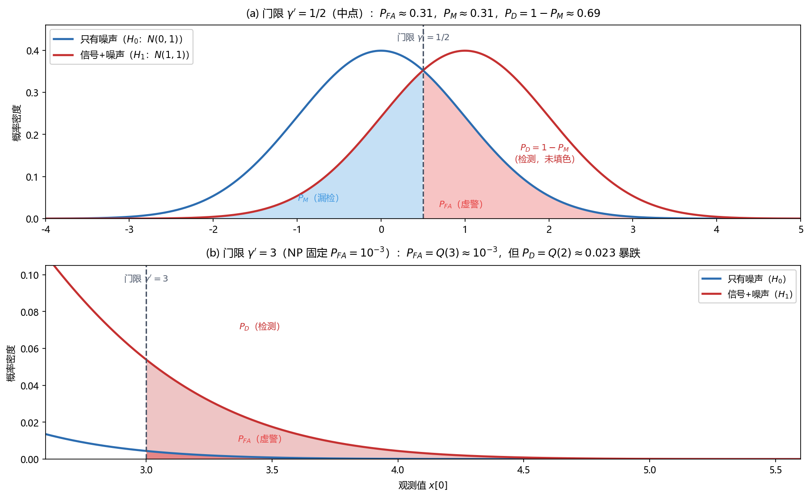
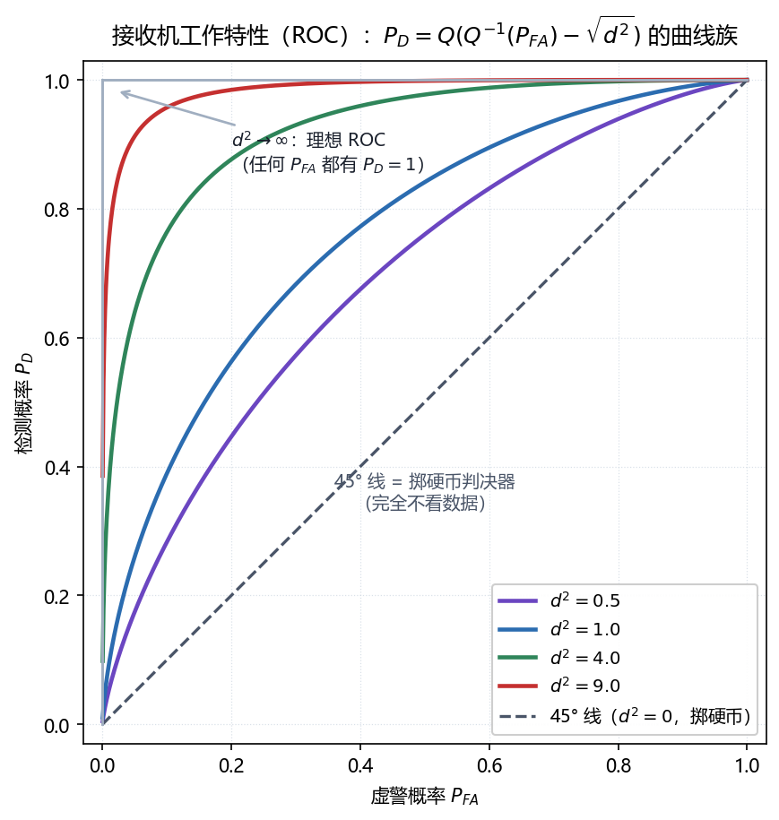

# Vol2 Ch03 统计判决理论 I：判决规则如何从"拍脑袋"变成"数学宪法"

> 对应原书：第二卷《检测理论》第 3 章（书内第 501~525 页，本扫描 PDF 第 516~540 页；页码映射"书内 = PDF − 15"，PDF 517 顶栏"502"、PDF 540 之后进入第 4 章）。
> 前置阅读：本系列 `Vol2_Ch01_引言.md`（检测四要素、$P_{FA}/P_D$ 记号、偏移系数 $d^2$ 的预告）、`Vol2_Ch02_重要PDF的总结.md`（$Q$ 函数与常用分布）；本文自包含，涉及的前置概念就地插播。

## 写在前头

这是讲解系列**第二卷的第 3 篇**，对应原书第二卷《统计判决理论 I》。本章在第二卷里的角色，是把第 1 章那个"拍脑袋定门限 $\tfrac12$"的朴素做法，升级成**有定理保证的最优判决规则**——这就是"判决理论"四个字的全部重量。

第 1 章埋下的三个伏笔，全部在本章兑现：

1. 第 1 章说"雷达问题的最佳检测器是第 3 章的 Neyman-Pearson 检测器"——本章 §3.3 给出定理 3.1（NP 定理）；
2. 第 1 章说"$P_{FA}$ 与 $P_D$ 的正式定义在第 3 章"——本章 §3.3 给出（3.2）式的精确口径；
3. 第 1 章说"带先验概率的最优判决是第 3 章贝叶斯风险"——本章 §3.7 给出（3.17）~（3.18）式。

用一句话概括本章的设计目标：**把"如何设计判决规则"这个原本靠直觉的问题，锻造成一门可以在"给定虚警率下使检测率最大"与"使平均代价最小"之间明确选择的数学。** 本章给出的检测器还都很简单（比门限、比似然比），但它是后面第 4 章匹配滤波器、第 5 章能量检测器、第 6 章 GLRT 所有具体检测器的共同地基——**先有判决的宪法，才有具体的法律条文。**

**实测声明**：本文所有内容与数字均经 OCR 核对原书扫描件（PDF 第 516~540 页，OCR 文本存于 `Temp/chapters_ocr/v2ch03/`），不是凭印象转述。公式编号（3.1）~（3.25）沿用原书编号；图 Fig023/Fig024 为本系列自建示意图（脚本 `Temp/scripts/make_fig023.py`、`make_fig024.py`），曲线公式与原书（3.10）一致、数值与例 3.1 一致。正文中少量由模型自算的派生数字（如 $Q(0.5)\approx0.31$）已就地标注，与原书 OCR 数字严格区分。

---

## 1. 为什么判决不能只看"判对率"：两类错误不是一回事

### 1.1 问题驱动：直接最小化"总错误率"不就行了吗？

第 1 章给了两把尺子 $P_{FA}$ 和 $P_D$，但读者可能会本能地问：**为什么不干脆只用一个数——"判对率"——把检测器设计成"总错误最小"？**

答案藏在两类错误的**不对称**里。原书 §3.3 用雷达给了最直白的解释：如果错误地认为敌人的飞机出现（虚警），"我们可能会发起一次攻击"——后果极其严重；反过来，如果敌人飞机真的出现却没喊（漏检），后果同样严重，但**性质完全不同、发生的频率要求也完全不同**。原书明说：虚警概率 $P_{FA}$"通常是一个很小的值，例如 $10^{-7}$"。**翻译成人话：宁肯漏几次，也不能动不动就拉响警报——因为虚警的代价是"发起攻击"这种不可逆动作，漏检的代价是"少一次预警"。**

两类错误不仅代价不同，而且**此消彼长**：第 1 章图 Fig021(b) 已经用几何预告过——门限一抬，$P_{FA}$ 下降但 $P_D$ 也下降；门限一放，$P_D$ 上升但 $P_{FA}$ 也上升。原书 §3.3 原话："两类错误概率同时减少是不可能的。" **既然不可能同时最优，就必然要"固定一个、优化另一个"——这正是 Neyman-Pearson（NP）方法的由来。**

### 1.2 入门例子：一次观测，两个高斯

原书用一个最小的例子把问题摆到桌面上（式 3.1）：观测单个样本 $x[0]$，它的 PDF 是 $\mathcal{N}(0,1)$ 或者 $\mathcal{N}(1,1)$，要判 $\mu=0$ 还是 $\mu=1$：

$$
H_0:\ \mu = 0, \qquad H_1:\ \mu = 1 \tag{3.1}
$$

其中 $H_0$ 称为**零假设**（只有噪声），$H_1$ 称为**备选假设**（信号+噪声），$\mathcal{N}(\mu,\sigma^2)$ 表示均值为 $\mu$、方差为 $\sigma^2$ 的高斯 PDF。**翻译成人话：两条钟形曲线，一条以 0 为中心、一条以 1 为中心，你只拿到一个点，要猜它是从哪条曲线抽出来的。**

一个朴素而合理的规则（第 1 章已经用过）是取中点 $\tfrac12$ 作门限：$x[0] > \tfrac12$ 判 $H_1$。这套规则会犯两种错：

- **第一类错误（虚警）**：$H_0$ 为真却判 $H_1$——噪声 $x[0]$ 碰巧越过 $\tfrac12$；
- **第二类错误（漏检）**：$H_1$ 为真却判 $H_0$——信号被负噪声拽到门限以下。

图 Fig024 把这两类错误的几何画了出来：

*图 Fig024：Neyman-Pearson 准则的门限—错误几何（自建示意，对应原书图 3.1~3.3，例 3.1 的 $\mathcal{N}(0,1)$ vs $\mathcal{N}(1,1)$）。(a) 门限 $\gamma'=\tfrac12$（中点）：$H_0$ 右尾（红）= 虚警 $P_{FA}\approx0.31$，$H_1$ 左尾（蓝）= 漏检 $P_M\approx0.31$，检测率 $P_D=1-P_M\approx0.69$——两类错误大致折中；(b) 门限 $\gamma'=3$（NP 固定 $P_{FA}=10^{-3}$）：$P_{FA}=Q(3)\approx10^{-3}$ 被压住了，但 $P_D=Q(2)\approx0.023$ 暴跌。看两件事：① 门限把每条 PDF 切成两类错误；② 门限一动，$P_{FA}$ 与 $P_D$ 反向变化——这就是"固定虚警、最大化检测"背后的此消彼长。*

**一句话总结：判决规则的本质是"在两条 PDF 之间画一条线"，这条线的位置决定了虚警与漏检各占多少；因为两类错误的代价不对称，所以最优的设计是"固定虚警率、最大化检测率"。**

---

## 2. NP 定理：固定虚警，检测率最大 = 似然比与门限比

### 2.1 问题从哪来：满足 $P_{FA}=\alpha$ 的判决域有无数个，选哪个？

先抽象一步。检测器是把 $N$ 点数据 $\mathbf{x}$ 映射到判决 $H_0/H_1$ 的函数；等价地，把数据空间 $\mathbb{R}^N$ 划成两块：**判定域**（critical region）$R_1 = \{\mathbf{x}:\ 判 H_1\}$ 和它的补集 $R_0$。原书（3.2）式把虚警约束写成：

$$
P_{FA} = \int_{R_1} p(\mathbf{x}; H_0)\, d\mathbf{x} = \alpha \tag{3.2}
$$

其中 $p(\mathbf{x};H_0)$ 为 $H_0$ 下的数据 PDF，积分在判定域 $R_1$ 上做。**翻译成人话：虚警率等于"$H_0$ 下数据落进判决域的概率"，要求它等于一个事先定好的 $\alpha$。**

关键的一步在这里：**满足（3.2）式的 $R_1$ 有无数个**（原书习题 3.2 就是让读者找几个出来）。既然虚警约束只限定了一个"面积"，那剩下的自由度就是——**把 $R_1$ 摆在哪里，才能让 $P_D$ 最大？** 直觉上应该把 $R_1$ 摆到"$H_1$ 下概率密度大、$H_0$ 下概率密度小"的地方，把有限的虚警预算花在刀刃上。Neyman-Pearson 定理把这个直觉钉成了定理。

### 2.2 定理 3.1：似然比检验（LRT）

**定理 3.1（Neyman-Pearson）**：给定虚警概率 $P_{FA}=\alpha$，使检测概率 $P_D$ 最大的判决是

$$
L(\mathbf{x}) = \frac{p(\mathbf{x}; H_1)}{p(\mathbf{x}; H_0)} > \gamma \tag{3.3}
$$

时判 $H_1$，其中 $\gamma$ 为门限，由约束

$$
\int_{\{L(\mathbf{x}) > \gamma\}} p(\mathbf{x}; H_0)\, d\mathbf{x} = \alpha
$$

求出（证明见原书附录 3A，本质是拉格朗日乘子法：把"每单位虚警概率"投入到"检测概率增益最大"的 $\mathbf{x}$ 点上）。

**符号逐一说明**：$L(\mathbf{x})$ 称为**似然比**（likelihood ratio）——对同一个数据 $\mathbf{x}$，它在 $H_1$ 下的可能性与在 $H_0$ 下的可能性之比；$\gamma$ 为似然比门限；积分下标 $\{L(\mathbf{x})>\gamma\}$ 表示"所有使似然比超过门限的 $\mathbf{x}$"。（3.3）式整套规则称为**似然比检验**（likelihood ratio test, LRT）。

**翻译成人话：$L(\mathbf{x})$ 是"数据更像信号、还是更像纯噪声"的比值。判决规则是——比值大到超过门限，就喊"有信号"。门限 $\gamma$ 不是拍脑袋定的，而是反解"虚警率恰好等于 $\alpha$"这个方程定出来的。**

### 2.3 例 3.1：$P_{FA}=10^{-3}$ 的门限怎么算出来

把入门例子套进（3.3）。两个高斯 PDF 之比化简为

$$
L(x[0]) = \frac{\exp\!\bigl[-\tfrac12(x[0]-1)^2\bigr]}{\exp\!\bigl[-\tfrac12 x^2[0]\bigr]} = \exp\!\Bigl(x[0] - \tfrac12\Bigr)
$$

对数是单调递增变换，不等号不变，所以"$L>\gamma$"等价于"$x[0] > \ln\gamma + \tfrac12$"。令 $\gamma' = \ln\gamma + \tfrac12$（直接作用在 $x[0]$ 上的门限），虚警约束变成

$$
P_{FA} = \Pr\{x[0] \ge \gamma'; H_0\} = Q(\gamma') = 10^{-3}
$$

其中 $Q(\cdot)$ 为标准正态的右尾概率（第 2 章 §2.2.1 定义）。查表解出 $\gamma' = 3$（因为 $Q(3)\approx 1.35\times10^{-3}\approx 10^{-3}$）。于是 NP 检测器是：$x[0] > 3$ 判 $H_1$。此时检测率

$$
P_D = \Pr\{x[0] \ge 3; H_1\} = Q(3-1) = Q(2) \approx 0.023
$$

**这是本章最值得记住的一笔账：虚警率确实被压到了 $10^{-3}$，但代价是检测率只剩 $2.3\%$。** 原书原话："检测性能是很差的。尽管我们能满足虚警的约束条件，但我们只能在很少的一部分时间内检测到信号。" 要改善，就得放虚警——原书接着给出 $P_{FA}=0.5$ 时门限降到 $\gamma'=0$，$P_D$ 随之回升。**固定虚警不是免费的，检测率是那张被"支付"出去的账单（本例 $10^{-3}$ 的虚警买回 $2.3\%$ 的检测率，见 Fig024(b)）。**

### 2.4 性质与限制：NP 定理的适用边界（重要）

NP 定理是本章的"宪法条文"，但它的适用条件必须刻在桌上：

1. **两个假设的 PDF 必须完全已知**——这种假设叫**简单假设**（原书 §3.1）。只要 PDF 里还有未知参数（比如噪声方差未知、信号幅度未知），定理 3.1 就**失效**，要等到第 6 章的复合假设检验（GLRT）才能处理。**这是全文最重要的限制：NP 定理是"简单假设"专用。**
2. **随机化判决**：当似然比恰好等于门限 $L(\mathbf{x})=\gamma$ 时，为精确凑出 $\alpha$ 可能需要"按概率随机判"（随机化检验，见习题 3.13 里"掷硬币选检测器"的构造）。连续 PDF 下这件事发生概率为零，工程上几乎从不使用——但它是定理完整性的一个脚注。
3. **$P_D$ 是"固定 $P_{FA}$ 下的最大"，不是"绝对最大"**：如果你愿意放虚警，$P_D$ 还能更高。NP 定理保证的是"在虚警这个约束下的最优"，不是"无约束的最优"。

**好处与优势**：NP 定理把"设计检测器"从"逐题拍脑袋"变成"写似然比、定门限"的标准流程；更重要的是，它给出了检测问题的一个**公共结构**——几乎所有最优检测器都是"某个统计量与门限比"，区别只在统计量怎么算。**下一节会看到，例 3.2 的样本均值、例 3.3 的功率和、第 4 章的匹配滤波器，都是同一个 LRT 在不同模型下的化身。**

---

## 3. 门限与 $P_{FA}$：$H_0$ 下检验统计量的分布

### 3.1 问题从哪来：例 3.1 的门限 $3$ 靠"查高斯表"，一般问题呢？

例 3.1 能直接查表，是因为 $x[0]$ 在 $H_0$ 下是标准高斯。但一般问题里，似然比化简出来的统计量未必是这么简单的随机变量。**原书例 3.2 的回答是：先化简似然比、认出一个检验统计量 $T(\mathbf{x})$，再算 $T$ 在 $H_0$ 下的分布，最后从 $P_{FA}=\alpha$ 反解门限。** 这条流程是后面所有检测器的通用套路，本节把它走一遍。

### 3.2 例 3.2：WGN 中 DC 电平的 NP 检测器

信号模型（第 1 章已经熟悉的那个）：

$$
H_0:\ x[n] = w[n], \qquad H_1:\ x[n] = A + w[n], \quad n = 0,1,\ldots,N-1
$$

其中 $A>0$ 为已知直流电平，$w[n]$ 为方差 $\sigma^2$ 的 WGN（白高斯噪声）。把两个高斯 PDF 代入似然比、取对数、整理（推导见原书 §3.3），NP 检测器化简为（式 3.5）：

$$
\bar{x} = \frac{1}{N}\sum_{n=0}^{N-1} x[n] > \frac{\sigma^2 \ln\gamma}{NA} + \frac{A}{2} \ \Rightarrow\ 判 H_1 \tag{3.5}
$$

其中 $\bar{x}$ 为样本均值，右边两项为门限（$\gamma$ 为似然比门限）。**翻译成人话：把 $N$ 个样本平均一下，均值足够大就喊"有信号"——直觉上和"估计直流电平再比门限"一模一样。** 原书点破了这层联系："$\bar{x}$ 可以看作为对 $A$ 的估计"；判不判信号，取决于"这个估计值大到了什么程度"，而门限由"我们有多怕噪声拱出大估计值"（即 $P_{FA}$）来定。

确定性能的下一步是算 $T(\mathbf{x})=\bar{x}$ 的分布。高斯随机变量的线性组合仍是高斯：

$$
T \sim \mathcal{N}\!\Bigl(0, \tfrac{\sigma^2}{N}\Bigr) \text{（}H_0\text{ 下）}, \qquad T \sim \mathcal{N}\!\Bigl(A, \tfrac{\sigma^2}{N}\Bigr) \text{（}H_1\text{ 下）}
$$

于是（式 3.6、3.7）：

$$
P_{FA} = Q\!\left(\frac{\gamma'}{\sqrt{\sigma^2/N}}\right), \qquad P_D = Q\!\left(\frac{\gamma' - A}{\sqrt{\sigma^2/N}}\right) \tag{3.6, 3.7}
$$

其中 $\gamma'$ 为作用在 $\bar{x}$ 上的门限。把 $\gamma'$ 从（3.6）解出再代入（3.7），得到检测性能的闭式（式 3.8）：

$$
P_D = Q\!\left(Q^{-1}(P_{FA}) - \sqrt{\frac{NA^2}{\sigma^2}}\right) \tag{3.8}
$$

其中 $Q^{-1}(\cdot)$ 为 $Q$ 函数的逆。**这个式子说明什么性质：检测性能由 $NA^2/\sigma^2$ 这一个量完全决定。** 原书称 $NA^2/\sigma^2$ 为**信号能量噪声比**（signal energy-to-noise ratio, ENR）——$NA^2$ 是信号能量、$\sigma^2$ 是噪声方差，比值越大，$Q$ 的自变量越小，$P_D$ 越大。**它成立的条件：噪声必须是白高斯的、$A$ 必须已知、$A>0$；当 $A<0$ 时不等号方向反转（习题 3.6），当噪声有色时不再适用（第 4 章广义匹配滤波器）。**

### 3.3 均值偏移高斯-高斯问题与偏移系数 $d^2$

原书把上面的结构抽象成一个"模板问题"，称为**均值偏移高斯-高斯问题**（mean shifted Gauss-Gauss）：检验统计量 $T$ 在两假设下都是高斯，方差相同、只差一个均值位移。对这类检测器，性能完全由**偏移系数**（deflection coefficient）确定（式 3.9）：

$$
d^2 = \frac{\bigl(E(T;H_1) - E(T;H_0)\bigr)^2}{\mathrm{var}(T;H_0)} \tag{3.9}
$$

其中 $E(T;H_i)$ 为 $T$ 在 $H_i$ 下的均值，$\mathrm{var}(T;H_0)$ 为 $H_0$ 下的方差。代入本例 $d^2 = NA^2/\sigma^2$（均值差 $A$ 的平方除以方差 $\sigma^2/N$），于是（3.8）式等价于更一般的（式 3.10）：

$$
P_D = Q\!\left(Q^{-1}(P_{FA}) - \sqrt{d^2}\right) \tag{3.10}
$$

**翻译成人话：$d^2$ 是"两条高斯分得开不开"的量化——均值差越大、散布越小，$d^2$ 越大，检测越容易。** 第 1 章 §5.2 已经预告过这个系数（当时写的是 $\mathrm{var}(T;H_0)=\mathrm{var}(T;H_1)$ 的前提），本章给了它"决定检测性能"的严格地位。**它的限制要说清：$d^2$ 只对"等方差的均值偏移高斯"严格成立；方差不等（例 3.3）或非高斯（第 10 章）时，$d^2$ 不再是性能的唯一决定量，只能当近似。**（第 4 章还会用 $d^2 = E/\sigma^2$ 直接算匹配滤波器的性能。）

### 3.4 充分统计量的收账：为什么 $\bar{x}$ 就够了

原书接着做了一个漂亮的"为什么"追问：例 3.2 靠样本均值 $\bar{x}$，例 3.3（方差变化）靠 $\frac1N\sum x^2[n]$——**为什么一个 $N$ 维问题能被压缩成一个标量统计量而不损失判决能力？** 答案回到第一卷第 5 章的**充分统计量**：如果参数 $\theta$ 的充分统计量 $T(\mathbf{x})$ 存在，则 PDF 可因式分解为 $p(\mathbf{x};\theta) = g(T(\mathbf{x}),\theta)h(\mathbf{x})$（Neyman-Fisher 分解定理），于是似然比里 $h(\mathbf{x})$ 约掉，**NP 检验只通过 $T(\mathbf{x})$ 依赖数据**。本例中 $\bar{x}$ 是 $A$ 的充分统计量（习题 3.10）；方差变化例中 $\frac1N\sum x^2[n]$ 是 $\sigma^2$ 的充分统计量。

**翻译成人话：充分统计量是"数据里关于判决的全部信息"的压缩包；NP 检验自动只读这个压缩包，别的一律不看。** 但原书立刻给出反面（例 3.4）：噪声是混合高斯等**非高斯**分布时，**$A$ 的充分统计量不存在**，似然比再也化简不成"一个统计量比门限"，只能保留原始数据的完整形式（第 10 章专门处理）。**这是一个重要的伏笔：高斯假设之所以处处好用，正是因为它让"充分统计量 + 线性统计量"这套压缩处处成立；一旦噪声非高斯，这套捷径就没了。**

**一句话总结：门限从 $P_{FA}$ 来，而 $P_{FA}$ 要算 $H_0$ 下检验统计量的分布；统计量能不能化简，取决于充分统计量是否存在——高斯模型下几乎总能化简，非高斯模型下常常不能。**

---

## 4. ROC：检测器的"能力曲线"

### 4.1 问题从哪来：$P_D$ 对 $P_{FA}$ 的完整权衡，怎么一眼看清？

第 3.2 节给了"一个 $P_{FA}$ 对应一个 $P_D$"的点。但检测器的**全部能力**是"门限扫一遍"得到的一条曲线——这就是**接收机工作特性**（receiver operating characteristic, ROC）。原书 §3.4 说得很直接：把（3.6）（3.7）（3.8）式合起来，ROC 就是（3.10）式那族曲线（图 3.8 画了 $d^2=1$ 的一条，图 3.9 画了一族）。

图 Fig023 是自建的 ROC 曲线族：

*图 Fig023：接收机工作特性（ROC）曲线族（自建，公式为（3.10）式 $P_D=Q(Q^{-1}(P_{FA})-\sqrt{d^2})$）。看四件事：① 每条 ROC 恒在 45° 虚线之上——45° 线是"掷硬币判决器"（完全不看数据）的下界；② $d^2$ 越大，曲线越凸向左上角，$d^2\to\infty$ 时逼近理想 ROC（任何 $P_{FA}$ 都有 $P_D=1$）；③ $d^2\to0$ 时退回 45° 线；④ 曲线上每一点对应一个门限 $\gamma$，门限一调，$(P_{FA},P_D)$ 就沿曲线移动。结论：ROC 是检测器的"能力曲线"，$d^2$（= 偏移系数 = 输出 SNR）是唯一的能力参数。*

### 4.2 两条基准线：掷硬币与理想检测

ROC 图上有两条线特别值得记住：

- **45° 线 = 掷硬币判决器**：一个完全忽略数据的检测器（掷硬币，正面判 $H_1$，$P\{\text{正面}\}=p$），对任何 $p$ 都有 $P_{FA}=P_D=p$，即落在 45° 线上。**它说明"不看数据"的检测器最多只能做到"虚警率 = 检测率"，这是检测器能力的下界；任何像样的检测器都必须在这条线上方。**
- **左上角 = 理想检测**：$P_{FA}=0$ 且 $P_D=1$。原书（习题 3.12）给出了一个达到理想检测的构造：两个假设的支撑集不重叠（如 $H_0$ 均匀分布在 $[-c,c]$、$H_1$ 均匀分布在 $[1-c,1+c]$，$c$ 选得让二者不交），此时可以零虚警、百分百检测。**理想检测的代价是：两个假设的 PDF 完全不重叠——这在现实里意味着信号比噪声大得离谱，不是常态。**

### 4.3 性质与限制：ROC 是凹函数

原书习题 3.13 要求证明 ROC 是 $[0,1]$ 上的**凹函数**（concave）：把 ROC 上任意两点 $(p_1,P_D(p_1))$、$(p_2,P_D(p_2))$ 用一个"掷硬币随机选择用哪个检测器"的办法混合，得到一个随机化检测器，其性能点在两点连线上；而 NP 定理说随机化检测器的 $P_D$ 不可能超过最优（NP）检测器，故 NP 的 ROC 曲线必在连线之上——**这就是凹性。** 这条性质的工程含义是：**ROC 凹向意味着"每多花一点虚警，检测率的边际收益递减"——越往右走，同样的虚警增量买回的检测率越少。** 它成立的前提是 NP 最优（PDF 完全已知）；PDF 未知时，实际检测器可能落在 NP 曲线之下，凹性也不再有保证。

---

## 5. 先验与代价进场：最小错误概率与贝叶斯风险

### 5.1 问题从哪来：什么时候可以不用"固定虚警"？

NP 方法有一个前提：**你愿意（且能够）把虚警率当成一个外生给定的数。** 但在数字通信里，情况不同：发送"0"和"1"通常**等可能**，两类错误的代价也差不多，这时候更自然的做法不是"固定虚警"，而是"**最小化总错误概率**"。原书 §3.6 点明：这需要给每个假设指定一个**先验概率** $P(H_0)$、$P(H_1)$——在雷达/声纳里指定先验"通常是不可能的"（敌潜艇出现的概率没法确定），但在通信/模式识别里却合情合理。**这正是 §3.1 预告的岔路口：NP 准则 vs 贝叶斯准则，选择取决于"你能利用多少先验知识"。**

### 5.2 最小错误概率：门限由先验决定

定义**错误概率**（式 3.12）：

$$
P_e = \Pr\{\text{判 }H_0,\ H_1\text{ 为真}\} + \Pr\{\text{判 }H_1,\ H_0\text{ 为真}\} = P(H_0|H_1)P(H_1) + P(H_1|H_0)P(H_0) \tag{3.12}
$$

其中 $P(H_i|H_j)$ 是 $H_j$ 为真时判 $H_i$ 的条件概率，$P(H_j)$ 是先验概率。最小化 $P_e$ 的判决是（式 3.13，推导见附录 3B）：

$$
\frac{p(\mathbf{x}|H_1)}{p(\mathbf{x}|H_0)} > \frac{P(H_0)}{P(H_1)} \ \Rightarrow\ 判 H_1 \tag{3.13}
$$

**翻译成人话：还是似然比检验，但门限从"由 $P_{FA}$ 反解"变成了"由先验概率之比直接给出"。** 若先验相等，门限为 1，退化为（式 3.14）：

$$
p(\mathbf{x}|H_1) > p(\mathbf{x}|H_0) \ \Rightarrow\ 判 H_1 \tag{3.14}
$$

即选**条件似然更大**的假设——原书称之为**最大似然（ML）检测器**（严格说是"最大条件似然"，这是习惯叫法）。

**例 3.5（WGN 中 DC 电平，最小 $P_e$ 准则）**：先验相等时，ML 检测器化简为 $\bar{x} > A/2$ 判 $H_1$——**和 NP 检测器（3.5）式形式完全相同，只是门限换成 $A/2$**（NP 的门限由 $P_{FA}$ 定，这里的门限由"中点"定）。错误概率（式 3.15）：

$$
P_e = Q\!\left(\sqrt{\frac{NA^2}{4\sigma^2}}\right) \tag{3.15}
$$

其中 $NA^2/(4\sigma^2)$ 是"平均分给两个假设"后的度量（对比（3.8）式：检测语境看 $P_D$，通信语境看 $P_e$，同一套几何的两张面孔）。

### 5.3 MAP 检测器：换一种写法，同一件事

由贝叶斯公式，$p(\mathbf{x}|H_i)P(H_i) = P(H_i|\mathbf{x})p(\mathbf{x})$（分母 $p(\mathbf{x})$ 与假设无关），所以最小 $P_e$ 规则等价于选**后验概率最大**的假设（式 3.16）：

$$
P(H_1|\mathbf{x}) > P(H_0|\mathbf{x}) \ \Rightarrow\ 判 H_1 \tag{3.16}
$$

其中 $P(H_i|\mathbf{x})$ 为**后验概率**（观测到 $\mathbf{x}$ 之后，$H_i$ 为真的概率）。这个形式叫**最大后验概率（MAP）检测器**。**翻译成人话：ML 问"哪个假设更能解释数据"，MAP 问"看了数据之后，哪个假设更可能是真的"——先验相等时两者合一；先验不等时，MAP 用先验把天平拨向更常见的那个假设。** 原书图 3.10 用两个判决域对比了先验的影响：$P(H_0)=P(H_1)=\tfrac12$ 时门限在 $\tfrac12$；$P(H_0)=\tfrac14$、$P(H_1)=\tfrac34$ 时门限左移（因为 $H_1$ 更常见，更愿意判它）。

### 5.4 贝叶斯风险：把"代价"也请进来

最小错误概率仍有一个隐含假设：**两类错误的代价相同**。原书 §3.7 用一个质检例子打破它：检验机器部件，$H_0$ = 放弃该部件、$H_1$ = 部件可用。**误弃合格件（判 $H_0$）的代价是"浪费一个部件"，误收不合格件（判 $H_1$）的代价可能是"整机报废"——$C_{10} > C_{01}$。** 于是引入代价矩阵 $C_{ij}$（$H_j$ 为真时判 $H_i$ 的代价），最小化**平均代价**即**贝叶斯风险**（式 3.17）：

$$
R = E(C) = \sum_{i=0}^{1}\sum_{j=0}^{1} C_{ij}\, P(H_i|H_j)\, P(H_j) \tag{3.17}
$$

其中 $C_{ij}$ 为代价、$P(H_j)$ 为先验。使 $R$ 最小的判决是（式 3.18）：

$$
\frac{p(\mathbf{x}|H_1)}{p(\mathbf{x}|H_0)} > \frac{(C_{10} - C_{00})P(H_0)}{(C_{01} - C_{11})P(H_1)} \ \Rightarrow\ 判 H_1 \tag{3.18}
$$

其中 $C_{00}, C_{11}$ 是"判对"的代价（通常取 0）。**翻译成人话：门限 = "代价加权后的先验之比"。** 当 $C_{00}=C_{11}=0$、$C_{01}=C_{10}=1$ 时，$R=P_e$，最小错误概率是贝叶斯风险的特例。**性质与限制：贝叶斯准则需要先验概率和代价矩阵都已知；雷达/声纳里这两样都没有，所以回到 NP。两种准则不是谁取代谁，而是"信息有多少，就用哪种准则"——原书 §3.1 的总结是：声纳和雷达用 NP，通信和模式识别用贝叶斯风险。**

**一句话总结：把先验和代价请进来，门限就从"虚警约束反解"变成"先验（与代价）之比"；先验相等时是 ML，代价相等时是 MAP，先验代价都全时是贝叶斯风险——它们是一条线上的不同简化。**

---

## 6. 多元假设检验：一个判决、多个候选

### 6.1 问题与答案（一句带过）

前面都是"两个假设选一个"（二元）。语音识别、灰度分类、M 元通信要"$M$ 个假设选一个"（多元）。原书 §3.8 说明：多元时 NP 准则虽然也能用但"实际上很少使用"（要同时控制多个虚警/漏检，复杂且不自然，参考 Lehmann 1959），**工程上用的是贝叶斯风险（最小错误概率）的推广**。结论（式 3.21~3.24，推导见附录 3C）：

- 使贝叶斯风险最小的规则：选使 $\ C_i(\mathbf{x}) = \sum_{j=0}^{M-1} C_{ij}P(H_j|\mathbf{x})\ $ 最小的 $H_i$（式 3.21）；
- 若代价为 $C_{ij}=0\,(i=j),\ 1\,(i\ne j)$（即只看错误率），退化为 MAP：选 $P(H_k|\mathbf{x})$ 最大的 $H_k$（式 3.22）；
- 若先验也相等，退化为 ML：选 $p(\mathbf{x}|H_k)$ 最大的 $H_k$（式 3.24）。

**例 3.6（WGN 中三个 DC 电平 $-A,0,+A$，先验各 $\tfrac13$）**：ML 规则给出判决 $\bar{x} < -A/2 \Rightarrow H_0$、$-A/2 < \bar{x} < A/2 \Rightarrow H_1$、$\bar{x} > A/2 \Rightarrow H_2$——**就是"样本均值离哪个电平最近就选哪个"。** 原书点明这是第 4 章**最小距离接收机**的特例（也是 3 电平 PAM 通信）。其错误概率（式 3.25）：

$$
P_e = \frac{4}{3}\,Q\!\left(\sqrt{\frac{NA^2}{4\sigma^2}}\right) \tag{3.25}
$$

**对比二元（3.15）式：多了个 $\tfrac43$ 因子，$P_e$ 变大——"要在更多假设里判决，出错机会自然更多"。** 一般 $M$ 元等先验 PAM 的推广在习题 3.20（$P_e = \frac{2M-2}{M}Q(\sqrt{NA^2/(4\sigma^2)})$，$M$ 越大错误越多）。多元假设检验是第 4 章最小距离接收机、模式识别分类的地基，这里只需记住"多元 = 选后验（或条件似然）最大者"这一条即可。

---

## 7. 关键设计决策回顾

把散在正文里的"为什么"收拢。每个决策都是一个真实岔路口：

| # | 决策 | 为什么这么选 | 换一个选择会怎样 |
|---|------|------------|----------------|
| 1 | 用 **$P_{FA}$ 与 $P_D$ 两把尺子**，而非单一"总错误率" | 两类错误代价不对称（虚警=发起攻击，漏检=少预警），且此消彼长、不能同时最小（§1.1） | 只最小化总错误率会掩盖"宁漏勿虚/宁虚勿漏"的实际约束，检测器无法按需求偏置 |
| 2 | 立 **NP 定理**：固定 $P_{FA}=\alpha$ 最大化 $P_D$ | 虚警率常是"外生给定的硬约束"（如 $10^{-7}$），且 NP 给出可操作的 LRT 形式（定理 3.1） | 无约束地最大化 $P_D$ 会把虚警也推向最大，检测器失去实用价值 |
| 3 | 判决统一为 **似然比检验 $L(\mathbf{x})\gtrless\gamma$** | 似然比是"数据更像哪个假设"的公共语言，门限统一由约束反解（§2） | 每个检测器各自为政，无法建立 $P_{FA}/P_D$ 的统一分析与 ROC 曲线 |
| 4 | 性能用 **偏移系数 $d^2$** 汇总（式 3.9/3.10） | 均值偏移高斯-高斯问题下，$d^2$ 是唯一能力参数，ROC 一族曲线一个参数扫到底（§4） | 直接逐点算 $P_{FA}/P_D$ 在一般场合无闭式解，工程上寸步难行（第 1 章 §5.2 已埋此伏笔） |
| 5 | 先验可用时改用 **最小错误概率 / MAP / 贝叶斯风险** | 通信/模式识别有先验与代价，此时"最小总错误"比"固定虚警"更贴题（§5） | 硬套 NP 会忽略本可利用的先验信息，白白损失性能 |
| 6 | 多元假设用 **选最大后验/似然**，不推 NP 推广 | 多元 NP 要同时控制多个量，复杂且不自然（§6，参考 Lehmann 1959） | 强行推广 NP 会陷入多维约束，工程上不可行 |

## 8. 实现备忘（对照原书时的坑）

1. **门限的双重记号**：原书（3.3）式的 $\gamma$ 是**似然比**的门限，而例子里化简后常另设 $\gamma'$（作用在检验统计量 $x[0]$、$\bar{x}$ 上的门限，如 $\gamma'=\ln\gamma+\tfrac12$）。二者差一个单调变换，混用会算错门限。本文全程区分 $\gamma$（似然比门限）与 $\gamma'$（统计量门限）。
2. **分号与竖线**：$P(H_1;H_0)$（分号）是 NP 记号（$H_0$ 为真时判 $H_1$，对 $H_0$ 为真不做概率假设）；$P(H_1|H_0)$（竖线）是贝叶斯记号（给定 $H_0$ 这一结果的条件概率）。原书 §3.6 特意点出"细微差别"，与第一卷经典/贝叶斯的分野同构（第一卷 Ch01 §2.3 的记号伏笔在此兑现）。
3. **例 3.1 的 $P_D=0.023$ 是 $Q(2)$**：$\gamma'=3$ 来自 $Q(\gamma')=10^{-3}$；$P_D=Q(3-1)=Q(2)\approx0.0228$。别把 $\gamma'=3$ 直接代成 $Q(3)$。**$10^{-3}$ 的虚警买回 $2.3\%$ 的检测率，是本例"固定虚警"代价的核心数字。**
4. **$d^2$ 只在等方差均值偏移高斯下严格成立**：例 3.3（方差变化）、非高斯（第 10 章）都不再是"均值偏移高斯-高斯"，（3.10）式只作近似。引用 $d^2$ 决定性能时必须先确认模型是否属于这一类。
5. **方差变化例的判决域**：例 3.3 在 $N=1$ 时判决域是 $|x[0]|>\gamma'$（双侧，图 3.7），不是单侧——因为方差大意味着样本"离零远"，与符号无关。$N>1$ 的完整性能留到第 5 章能量检测器（原书明示）。
6. **页码映射**：本章书内 501~525 对应 PDF 516~540（**书内 = PDF − 15**）。定理 3.1 在 PDF 519、图 3.8/3.9 在 PDF 527~528、式（3.18）贝叶斯风险门限在 PDF 532。

## 9. 局限（坦率交代，并预告后续）

1. **NP 定理只覆盖简单假设**：两个假设的 PDF 必须完全已知。只要有任何未知参数（未知幅度、未知到达时间、未知噪声方差），定理 3.1 直接失效。**这是本章最大的边界，也是第 6 章复合假设检验（GLRT）、第 7~9 章未知参数检测存在的全部理由。**
2. **"固定虚警"在雷达/声纳之外未必贴题**：它要求虚警率能作为外生给定；通信/模式识别里更自然的"最小总错误"需要先验与代价，而这两样在很多场合拿不到。**两种准则各自都有"信息不够就失效"的坑，没有万能准则。**
3. **门限要靠"算 $H_0$ 下统计量分布"才能定**：例 3.1 能查高斯表是因为统计量正好高斯；一般问题里这个分布可能没有闭式（例 3.4 非高斯噪声连统计量都化简不出来）。**高斯假设的便利在非高斯处反噬——第 10 章专题处理。**
4. **本章只有"判决规则"，没有"具体检测器"**：给出的统计量（样本均值、功率和）都还是玩具级的 DC 电平问题；真正的匹配滤波器（已知信号）、能量检测器（随机信号）要到第 4、5 章才登场。**读到本章末尾"还不会造一个能用的雷达检测器"完全正常。**
5. **贝叶斯风险要求"代价矩阵"可指定**：工程上代价常是模糊的（漏检一个敌机到底值多少钱？），$C_{ij}$ 定不准时，最优判决跟着漂。原书没有给出"代价不确定"时的稳健处理——那是更专门的决策论话题，超出本书范围。

---

## 10. 建议自测的问题

1. 用你自己的话解释：为什么"固定虚警率、最大化检测率"是雷达/声纳的自然选择，而"最小化总错误率"是数字通信的自然选择？（提示：§1.1、§5.1，代价与先验的可获得性）
2. 对例 3.1，若要求 $P_{FA}=0.1$，门限 $\gamma'$ 是多少？$P_D$ 是多少？与 $P_{FA}=10^{-3}$ 时相比，$P_D$ 改善了还是恶化了？（提示：$\gamma'=Q^{-1}(P_{FA})$，$P_D=Q(\gamma'-1)$；对应原书习题 3.1）
3. 为什么 $P_{FA}=10^{-3}$ 时门限是 $3$ 而不是别的数？把"似然比门限 $\gamma$"和"统计量门限 $\gamma'$"的区别讲清楚。（提示：§2.3，$\gamma'=\ln\gamma+\tfrac12$）
4. 例 3.2 里 $\bar{x}$ 为什么够用（不用看全部 $N$ 个样本）？换成非高斯噪声后为什么就不够了？（提示：§3.4 充分统计量，例 3.4）
5. 原书习题 3.13 的结论：ROC 是凹函数。这个凹性对工程实践意味着什么——"每多花一点虚警，检测率边际收益递减"这句话怎么从凹性看出来？（提示：§4.3）

---

**一句话收尾：这一章把"怎么判信号在不在"从拍脑袋的中点门限，锻造成了有定理、有代价、有先验的判决宪法——固定虚警就上 NP，有先验代价就上贝叶斯，而它们共同的母语，就是那句"似然比与门限比"。**

*实测核对声明：本章事实性内容核对自原书扫描件 OCR 文本 `Document/统计信号处理/Temp/chapters_ocr/v2ch03/ocr_page_516~540.txt`（PDF 第 516~540 页，书内 501~525 页）；公式编号（3.1）~（3.25）沿用原书编号；定理 3.1（式 3.3）、例 3.1 的 $P_{FA}=10^{-3}\Rightarrow\gamma'=3,\ P_D=0.023$、例 3.5 的 $P_e=Q(\sqrt{NA^2/(4\sigma^2)})$、例 3.6 的 $P_e=\tfrac43 Q(\sqrt{NA^2/(4\sigma^2)})$ 均与 OCR 一致。§3.2 的 $Q(0.5)\approx0.31$、$Q(2)\approx0.023$ 等为本文自算派生值，已就地标注。Fig023/Fig024 由 `Temp/scripts/make_fig023.py`、`make_fig024.py` 生成并经 `plotutil.check_figure` 程序化碰撞检测通过。*
