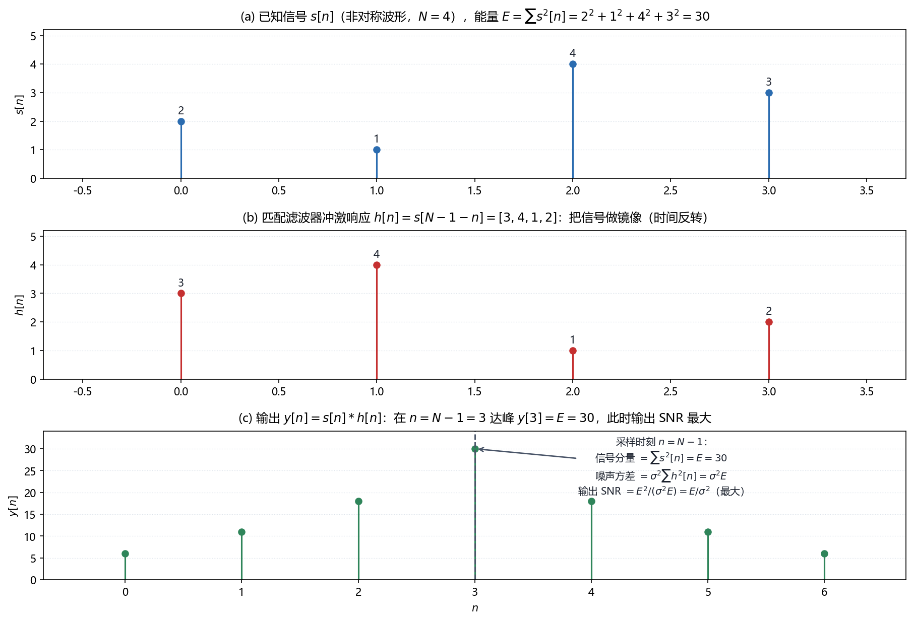

# Vol2 Ch04 确定信号：信号完全已知时，最优检测器就是匹配滤波器

> 对应原书：第二卷《检测理论》第 4 章（书内第 526~562 页，本扫描 PDF 第 541~577 页；页码映射"书内 = PDF − 15"，PDF 542 顶栏"527"、PDF 577 顶栏"562"）。
> 前置阅读：本系列 `Vol2_Ch03_统计判决理论I.md`（NP 定理、似然比检验、$P_{FA}/P_D$）、`Vol2_Ch02_重要PDF的总结.md`（$Q$ 函数）；回调 `Vol1_Ch07_最大似然估计.md` 例 7.15（匹配滤波是 MLE 的化身）。本文自包含，涉及的前置概念就地插播。

## 写在前头

这是讲解系列**第二卷的第 4 篇**，对应原书第二卷《确定信号》。它在第二卷里的角色是**第一个实战检测器**：第 3 章给了判决的"宪法"（NP 定理、似然比检验），本章把宪法第一条落实到第一个具体模型——**信号完全已知、只有噪声随机**——结果就是通信与雷达课本里大名鼎鼎的**匹配滤波器**。

本卷首篇（Vol2_Ch01）埋下的伏笔，本章兑现：第 1 章说"BPSK/通信里'哪一个信号出现'的解法在第 4 章"；第一卷 Ch07（第 7 篇）例 7.15 说"匹配滤波器是高斯噪声假设下最大似然的必然产物，作为检测器最优的完整论证在第二卷第 4 章"——**估计与检测在本章正式合流：同一个相关器结构，一边是时延的 MLE，一边是信号的 NP 检测器。**

用一句话概括本章的设计目标：**当信号波形 $s[n]$ 完全已知时，把"判信号在不在"这件事，做成一个"拿信号副本和数据做内积、再比门限"的检测器，并证明它就是使输出信噪比最大的那个滤波器。** 本章的匹配滤波器是后续所有检测器的基准——第 5 章（随机信号）把它换成"估计器-相关器"、第 7 章（未知到达时间）把它的"固定对齐"假设打掉、第 10 章（非高斯）承认它不是最优。

**实测声明**：本文所有内容与数字均经 OCR 核对原书扫描件（PDF 第 541~577 页，OCR 文本存于 `Temp/chapters_ocr/v2ch04/`），不是凭印象转述。公式编号（4.1）~（4.33）沿用原书编号；图 Fig025 为本系列自建示意图（脚本 `Temp/scripts/make_fig025.py`），参数为自选演示信号、结论与原书（4.10）式一致。正文中由模型自算的派生数字（如 $E=30$、$Q$ 取值）已就地标注。

---

## 1. 问题：信号已知、只有噪声随机，怎么判"信号在不在"

### 1.1 问题驱动：既然信号都知道了，为什么还需要检测？

本章处理的是检测问题里"最有利"的一种情形。原书 §4.3 的模型是（式 4.1）：

$$
H_0:\ x[n] = w[n], \qquad H_1:\ x[n] = s[n] + w[n], \quad n = 0,1,\ldots,N-1 \tag{4.1}
$$

其中 $s[n]$ 是**已知的确定性信号**，$w[n]$ 是方差 $\sigma^2$ 的 WGN（白高斯噪声，即零均值、自相关函数 $r_{ww}[k]=\sigma^2\delta[k]$ 的高斯过程），$x[n]$ 为接收数据。**翻译成人话：信号长什么样你清清楚楚（比如雷达的发射脉冲、通信的成型波形），唯一的随机性来自噪声；问题是"这段接收数据里，到底有没有埋着那个已知波形"。**

读者有 DSP 基础，可能会本能地问：**信号都已知了，直接把接收数据和信号模板对齐着比一比不就行了，为什么还要上第 3 章那一整套似然比？** 答案有两层：第一，即便"对齐着比"，"比到什么程度算有"这个门限还是要靠统计来定；第二——也是更深的理由——**第 3 章的 NP 定理已经证明，似然比检验是"固定虚警下检测率最大"的通用最优解，本章不是要另起炉灶，而是把最优解在"已知信号 + WGN"这个具体模型上算出来。** 原书 §4.1 说得直白：这类问题"最佳检验是众所周知的"——匹配滤波器就是 NP 准则的产物。

### 1.2 从似然比出发：最优解长什么样

把（4.1）的两个高斯 PDF 代入第 3 章的似然比（式 3.3），取对数（单调变换不改判决）、把与数据无关的项并进门限，整理（推导见原书 §4.3.1）得到：

$$
T(\mathbf{x}) = \sum_{n=0}^{N-1} x[n]\, s[n] > \gamma' \ \Rightarrow\ 判 H_1 \tag{4.3}
$$

其中 $\gamma'$ 为吸收进信号能量项后的新门限（由 $P_{FA}=\alpha$ 确定）。**翻译成人话：把接收数据和信号的"副本"逐点相乘再求和——数学上就是二者内积 $\mathbf{x}^T\mathbf{s}$——内积大到超过门限，就判"有信号"。** 原书把这个结构命名为**仿形-相关器**（replica-correlator）："replica"是"副本/仿形品"，我们手里拿着一份信号模板，和数据做相关。

**这一步就回答了"为什么是相关"**：不是工程师的灵光一现，而是 $N$ 点高斯 WGN 模型下**似然比的必然化简结果**——指数上的平方差展开后，与假设有关的项恰好只剩 $\sum x[n]s[n]$。

### 1.3 朴素做法为什么不最优：能量检测丢掉了波形信息

在往下走之前，先回答一个更根本的"为什么不用更简单的办法"。一个朴素的检测器是**能量检测器**：算数据的总能量 $\sum_{n} x^2[n]$，超过门限就喊"有信号"——它不需要知道信号波形，只认"信号会让总功率变大"。**这个办法"也行"，但它在高斯噪声下不是最优的**，因为它把波形这个白送的已知信息扔掉了。

代价要照实说：能量检测器对任何波形一视同仁，而匹配滤波器**按波形逐点加权**（§2 例 4.2 会看到，信号强的地方加权大、弱的地方加权小）。这笔"利用波形"的额外收益，原书在 §4.3.2 用**处理增益**量化：对 WGN 中的 DC 电平，单个样本的 SNR 是 $A^2/\sigma^2$，匹配滤波把 $N$ 个样本对齐叠加后 SNR 变成 $NA^2/\sigma^2$，**处理增益 $PG = 10\log_{10} N$ dB**——长 $N$ 倍，白赚 $10\log_{10}N$ dB 的 SNR。**多花的代价（要知道 $s[n]$ 并做 $N$ 次乘加）买到的能力，是"把信号能量对齐叠加、把噪声随机抵消"的处理增益；这正是"能省的钱一分不多花、该花的钱一分不省"的体现——波形信息就是那笔该花的信息。**

**一句话总结：信号已知时，NP 最优解自动写成"仿形-相关"——拿信号副本和数据做内积；它比只看能量的朴素做法多了"利用波形"这一层，代价是要知道 $s[n]$。**

---

## 2. 相关器为什么等于匹配滤波器：镜像的秘密

### 2.1 问题从哪来：相关是"静态对齐"，滤波器是"滑动卷积"，两者怎么打通？

（4.3）式的相关器有一个隐藏的操作顺序：它一次性把 $N$ 个样本和模板**对齐**（下标相同的相乘）。但工程实现里，数据是流式进来的，一个 FIR 滤波器天然做的是**卷积**——把模板倒过来、滑过去。原书 §4.3.1 的关键一步，是证明这两个操作在"某个采样时刻"上是同一件事。

FIR 滤波器（冲激响应 $h[n]$，$n=0,\ldots,N-1$ 非零）的输出是（式 4.4）：

$$
y[n] = \sum_{k=0}^{N-1} h[n-k]\, x[k] \tag{4.4}
$$

其中 $h[n-k]$ 为滤波器系数、$x[k]$ 为输入。**若令冲激响应是信号的镜像**（式 4.5）：

$$
h[n] = s[N-1-n], \qquad n = 0,1,\ldots,N-1 \tag{4.5}
$$

则在 $n=N-1$ 时刻的输出恰好是

$$
y[N-1] = \sum_{k=0}^{N-1} s[N-1-(N-1-k)]\, x[k] = \sum_{k=0}^{N-1} s[k]\, x[k] = T(\mathbf{x})
$$

**这就是"匹配滤波器"名字的由来：滤波器的冲激响应 $h[n]$ 是信号 $s[n]$ 的时间反转（镜像），它与信号"匹配"。** 原书图 4.1 并排画了两种实现：(a) 仿形-相关器（直接内积）、(b) 匹配滤波器（FIR 卷积 + 在 $n=N-1$ 采样）。

### 2.2 为什么必须"镜像"？

这是个初学者最容易含糊的点，值得单独说清。**卷积的数学定义里，滤波器系数是"倒着"滑过数据的**：$y[n]=\sum_k h[n-k]x[k]$。如果我们想让 $n=N-1$ 时刻的输出等于"模板和数据逐点对齐的内积"$\sum_k s[k]x[k]$，就必须让 $h[n]=s[N-1-n]$——**把信号倒过来**，这样滑到 $n=N-1$ 时，倒置的模板又"倒回来"恰好和数据对齐。**翻译成人话：卷积自带一次"反转"，所以滤波器系数要先预反转一次，两次反转抵消，才在采样时刻把波形对齐。**

图 Fig025 用自建的时域示意把这个镜像与对齐过程画了出来：

*图 Fig025：匹配滤波器的时域镜像与输出 SNR 最大化（自建示意，对应原书（4.5）（4.10）式，信号取 $N=4$ 的非对称波形 $s=[2,1,4,3]$）。(a) 已知信号 $s[n]$，能量 $E=\sum s^2[n]=30$；(b) 匹配滤波器冲激响应 $h[n]=s[N-1-n]=[3,4,1,2]$，是信号的镜像（时间反转）；(c) 输出 $y[n]=s[n]*h[n]$（自相关形状）在 $n=N-1=3$ 处达峰 $y[3]=E=30$。看三件事：① 镜像使卷积在 $n=N-1$ 时刻把信号能量逐点对齐叠加；② 此时信号分量 $=\sum s^2[n]=E$，噪声分量方差 $=\sigma^2\sum h^2[n]=\sigma^2E$，故输出 SNR $=E^2/(\sigma^2E)=E/\sigma^2$ 达上界；③ 由 Cauchy-Schwarz 不等式，任何其他 FIR 滤波器在此刻的输出 SNR 都不超过 $E/\sigma^2$。结论：匹配滤波器的镜像不是巧合，是"输出 SNR 最大化"的必然几何。*

### 2.3 频域视角：匹配滤波器强调信号功率大的频带

原书还从频域给了一个独立印证。匹配滤波器的频率响应（式 4.7）：

$$
H(f) = S^*(f)\, e^{-j2\pi f(N-1)} \tag{4.7}
$$

其中 $S(f)$ 为信号 $s[n]$ 的离散时间傅里叶变换，$S^*(f)$ 为其共轭，$e^{-j2\pi f(N-1)}$ 只是"采样时刻 $n=N-1$"带来的线性相位。由 Parseval 定理，无噪声时（$X(f)=S(f)$）匹配滤波器的输出正好是信号能量 $E=\int |S(f)|^2 df$（式 4.9）。**翻译成人话：$|H(f)|=|S(f)|$，滤波器在每个频率上放大信号谱强的成分、压制信号谱弱的成分——"信号功率大的频带，滤波器给更多权重"。** 这条性质在色噪声下会升级成"噪声功率小的频带给更多权重"（§5，式 4.19），是同一思想的推广。

**一个重要限制要现在就坦白**：匹配滤波器只在"信号恰好从 $n=0$ 开始"时才对。原书明确警告——如果信号实际被延迟了 $n_0$ 个样本（未知到达时间），而我们仍按 $n=0$ 对齐的匹配滤波器去采 $n=N-1$，输出会**大幅衰减甚至对消**（习题 4.3 用正弦信号算出了衰减随 $n_0$ 的关系）。**未知到达时间的信号不能直接用这个匹配滤波器，第 7 章会给出修正（对每个可能的时延都放一个匹配滤波、取最大）。**

**一句话总结：相关器和匹配滤波器是同一件事的两种实现——相关器是"静态对齐的内积"，匹配滤波器是"镜像后的卷积在 $n=N-1$ 采样"；镜像的本质是抵消卷积自带的反转，让信号能量在采样时刻对齐叠加。**

---

## 3. 匹配滤波器为什么最优：输出 SNR 最大化

### 3.1 问题从哪来：两个独立的理由都指向同一个滤波器

到目前为止，匹配滤波器是"从 NP 似然比化简出来的"，所以它 NP 意义下最优——这是**理由一**。但原书还给了**理由二**，一个与判决理论无关、纯 DSP 的论证：**匹配滤波器是使 FIR 滤波器输出信噪比最大的那个滤波器。** 两个理由独立地指向同一个 $h[n]=s[N-1-n]$，这个"殊途同归"是本章最漂亮的结构。

### 3.2 引入理论：Cauchy-Schwarz 给出 SNR 上界

考虑任意 FIR 滤波器 $h[n]$，在 $n=N-1$ 时刻的输出 $y[N-1]$。定义**输出 SNR**（式 4.10）：

$$
\eta = \frac{E^2(y[N-1]; H_1)}{\mathrm{var}(y[N-1]; H_1)} \tag{4.10}
$$

其中 $E^2(y[N-1];H_1)$ 是"信号分量能量的平方"（分子），$\mathrm{var}(y[N-1];H_1)$ 是"噪声分量的方差"（分母）。**翻译成人话：输出 SNR 是"输出里信号那部分的功率"除以"噪声那部分的功率"。** 把 $y[N-1]=\sum_k h[N-1-k]x[k]$ 代入，写成矢量形式 $\eta = (h^T s)^2/(\sigma^2 h^T h)$（其中 $h=[h[N-1],\ldots,h[0]]^T$ 为倒排系数矢量，$s=[s[0],\ldots,s[N-1]]^T$），由 Cauchy-Schwarz 不等式 $(h^T s)^2 \le (h^T h)(s^T s)$，得

$$
\eta \le \frac{s^T s}{\sigma^2} = \frac{E}{\sigma^2}
$$

其中 $E = s^T s = \sum s^2[n]$ 为信号能量。**等号当且仅当 $h \propto s$ 时成立**，即 $h[N-1-n] \propto s[n]$——正是匹配滤波器。**翻译成人话：没有任何 FIR 滤波器的输出 SNR 能超过 $E/\sigma^2$，而匹配滤波器恰好达到这个上界。**

### 3.3 能解决什么：检测性能的闭式表达

有了匹配滤波器的统计量，性能就好算了。$T(\mathbf{x})=\sum x[n]s[n]$ 是高斯样本的线性组合，仍为高斯（图 4.4）：

$$
T \sim \mathcal{N}(0, \sigma^2 E) \text{（}H_0\text{ 下）}, \qquad T \sim \mathcal{N}(E, \sigma^2 E) \text{（}H_1\text{ 下）}
$$

其中 $E$ 为信号能量。这正是第 3 章的"均值偏移高斯-高斯"模板，偏移系数 $d^2 = E/\sigma^2$（**恰是匹配滤波输出的 SNR**，式 4.15）。套用（3.10）式得（式 4.14）：

$$
P_D = Q\!\left(Q^{-1}(P_{FA}) - \sqrt{\frac{E}{\sigma^2}}\right) \tag{4.14}
$$

其中 $E/\sigma^2$ 为信号能量噪声比（ENR）。**这个式子说明什么性质：检测性能由 $E/\sigma^2$ 这一个量决定，与信号波形无关**——原书图 4.6 特意画了两个能量相同、形状不同的信号，它们的检测性能完全一样。**它成立的条件：WGN、信号完全已知；当噪声有色时，波形就变得重要了（§5，式 4.18），这正是"波形无关"这一结论的失效边界。**

### 3.4 性质与限制：非高斯噪声下匹配滤波不再是 NP 最优

原书在这里划了一条重要的界限（§4.3.1 末尾）：**对非高斯噪声，匹配滤波器不是 NP 意义下最优的，但仍然使任何线性 FIR 滤波器的输出 SNR 最大。** 原因是：非高斯噪声下 NP 检测器是**非线性**的（不再是简单的内积，见第 10 章），而匹配滤波器作为"最大 SNR 线性滤波器"的结论不依赖高斯假设（Cauchy-Schwarz 不关心噪声分布）。**翻译成人话：噪声一偏出高斯，匹配滤波器的"判决最优性"先掉，"SNR 最优性"还留着；对中等程度偏离高斯的噪声，它仍有好性能——第 10 章再细说。**

原书还用处理增益把收益算成实账（§4.3.2）：对 WGN 中 DC 电平，单样本 SNR $\eta_{in}=A^2/\sigma^2$，$N$ 样本匹配滤波后 $\eta_{out}=NA^2/\sigma^2$，$PG=10\log_{10}N$ dB。**一个具体的数字锚点**：据图 4.5，$P_{FA}=10^{-3}$ 下要 $P_D=0.5$ 约需 ENR 10 dB；要把 $P_D$ 提到 0.95，ENR 得再加 4 dB——**把数据长度 $N$ 乘 2.5 倍就凑出这 4 dB**（处理增益随之 +4 dB）。

**一句话总结：匹配滤波器在两个独立意义下最优——NP 判决最优（高斯假设下），与输出 SNR 最大（任何噪声分布下的线性滤波器）；前者依赖高斯，后者不依赖，所以它比"最优检测器"这个头衔更耐用。**

---

## 4. 色噪声：广义匹配滤波器 = 预白化 + 匹配

### 4.1 问题从哪来：噪声不是白的怎么办？

§3 的匹配滤波器假设噪声是 WGN。但原书 §4.4 指出："在许多情况下，将噪声看作为相关噪声则更为准确。" 噪声一旦相关（有记忆），上一节的结论就动摇：**信号间隔之外的噪声样本与间隔内相关，把它们纳入检测器可能改善性能**（习题 4.5 给出了白噪声时"间隔外样本无用"、相关噪声时"有用"的对照）。设噪声矢量 $\mathbf{w} \sim \mathcal{N}(\mathbf{0}, \mathbf{C})$，$\mathbf{C}$ 为 $N\times N$ 协方差矩阵（WSS 噪声下是对称 Toeplitz 矩阵，对角线元素相等）。

### 4.2 引入理论：广义匹配滤波器（式 4.16）

把两个高斯 PDF 代入似然比、取对数、并进门限，NP 检测器化简为（式 4.16）：

$$
T(\mathbf{x}) = \mathbf{x}^T \mathbf{C}^{-1} \mathbf{s} > \gamma' \ \Rightarrow\ 判 H_1 \tag{4.16}
$$

其中 $\mathbf{C}^{-1}$ 为噪声协方差矩阵的逆，$\mathbf{s}$ 为已知信号矢量。当 $\mathbf{C}=\sigma^2\mathbf{I}$（白噪声）时，$\mathbf{C}^{-1}=\mathbf{I}/\sigma^2$，退化为 §2 的相关器。**翻译成人话：色噪声下，最优检测器仍是"内积 + 门限"，但数据要先经过 $\mathbf{C}^{-1}$ 这个"去相关"的线性变换，再和信号做内积。** 原书称之为**广义仿形-相关器**或**广义匹配滤波器**，等效于"和一个被修改的信号 $\mathbf{s}' = \mathbf{C}^{-1}\mathbf{s}$ 做相关"。

### 4.3 预白化解释：先洗白噪声，再匹配

（4.16）式有一个非常直观的工程解释。$\mathbf{C}^{-1}$ 正定，可分解为 $\mathbf{C}^{-1} = \mathbf{D}^T\mathbf{D}$（$\mathbf{D}$ 非奇异），于是

$$
T(\mathbf{x}) = \mathbf{x}^T \mathbf{D}^T \mathbf{D} \mathbf{s} = \mathbf{x}'^T \mathbf{s}', \qquad \mathbf{x}' = \mathbf{D}\mathbf{x},\ \ \mathbf{s}' = \mathbf{D}\mathbf{s}
$$

可以证明变换后的噪声 $\mathbf{w}' = \mathbf{D}\mathbf{w}$ 是白噪声（$\mathrm{cov}(\mathbf{w}') = \mathbf{D}\mathbf{C}\mathbf{D}^T = \mathbf{I}$），故 $\mathbf{D}$ 称为**预白化矩阵**。**翻译成人话：广义匹配滤波器 = 先过一个预白化器把有色噪声洗成白噪声（代价是信号同时被失真成 $\mathbf{s}'$），再对失真后的信号做标准匹配滤波。** 原书图 4.7 画的就是"预白化器 → 匹配于失真信号的滤波器"两级结构。例 4.3（不等方差的不相关噪声，$\mathbf{C}=\mathrm{diag}(\sigma_0^2,\ldots,\sigma_{N-1}^2)$）把这个结构具体化：预白化就是逐样本除以 $\sigma_n$，检测器退化为 $\sum x[n]s[n]/\sigma_n^2$——**噪声小的样本给大权重，噪声大的样本给小权重。**

### 4.4 性能与信号设计：现在波形终于重要了

性能公式与白噪声情形同形（式 4.18）：

$$
P_D = Q\!\left(Q^{-1}(P_{FA}) - \sqrt{\mathbf{s}^T \mathbf{C}^{-1} \mathbf{s}}\right) \tag{4.18}
$$

其中 $\mathbf{s}^T\mathbf{C}^{-1}\mathbf{s}$ 是新的偏移系数 $d^2$（替代白噪声下的 $E/\sigma^2$）。**关键区别：检测概率随 $\mathbf{s}^T\mathbf{C}^{-1}\mathbf{s}$ 而不是 $E/\sigma^2$ 单调递增——在白噪声下波形无关，在色噪声下波形成了头号设计变量。** 原书顺势做起了信号设计：在固定能量 $\mathbf{s}^T\mathbf{s}=\mathcal{E}$ 约束下最大化 $\mathbf{s}^T\mathbf{C}^{-1}\mathbf{s}$，拉格朗日乘子法给出 $\mathbf{C}^{-1}\mathbf{s}=\lambda\mathbf{s}$，即**$\mathbf{s}$ 应取为 $\mathbf{C}$ 的最小特征值对应的特征矢量**（例 4.4 的直觉版：把能量集中到噪声方差最小的样本；例 4.5 的相关噪声版：两样本正相关时最优信号是差分波形 $s=[1,-1]\sqrt{\mathcal{E}/2}$，靠差分把相关噪声对消掉，$\rho\to1$ 时 $d^2\to\infty$）。

大 $N$、WSS 噪声时，原书（习题 4.12/4.13）把 $\mathbf{s}^T\mathbf{C}^{-1}\mathbf{s}$ 的渐近形式换成频域积分（式 4.19）：

$$
d^2 = \int_{-1/2}^{1/2} \frac{|S(f)|^2}{P_{ww}(f)}\, df \tag{4.19}
$$

其中 $P_{ww}(f)$ 为噪声功率谱密度（PSD）。**翻译成人话：把信号能量撒到噪声 PSD 小的频带，检测性能最好——色噪声下的"频率选择性注入能量"。** 这是匹配滤波频域直觉（§2.3"强调信号强频带"）的色噪声推广："强调信号强、噪声弱的频带"。

**一句话总结：色噪声不改变"内积 + 门限"的骨架，只把数据先预白化、把波形按噪声 PSD 重新分配能量；此时波形不再是无关变量，而成了决定性能的设计自由度。**

---

## 5. 多个信号：最小距离接收机，以及 PSK/FSK 的 3 dB 之争

### 5.1 问题从哪来：通信问的不是"在不在"，而是"是哪个"

雷达问"信号在不在"，通信问的是"**发射的是 $M$ 个信号里的哪一个**"——这是一个分类问题（原书 §4.5 仍沿用"检测"的叫法）。二元情形（式 4.20 的前身）：

$$
H_0:\ x[n] = s_0[n] + w[n], \qquad H_1:\ x[n] = s_1[n] + w[n]
$$

其中 $s_0[n], s_1[n]$ 都已知，$w[n]$ 为 WGN。通信里两类错误的代价大致相同，所以用**最小错误概率准则**（第 3 章 §3.6）。先验相等时，ML 检测器选"条件似然最大"的假设，代入高斯 PDF、取对数，等价于选**距离最小的假设**（式 4.20）：

$$
D_i^2 = \sum_{n=0}^{N-1} \bigl(x[n] - s_i[n]\bigr)^2, \qquad i = 0,1 \tag{4.20}
$$

**翻译成人话：把数据和每个候选信号都看成一个 $N$ 维空间里的矢量，谁的矢量离数据最近就选谁——这就是最小距离接收机。** 判决边界是两个信号矢量连线的**中垂线**（原书图 4.8）：数据落在中垂线哪一侧，就归给那侧的信号。展开平方项后，最小距离等价于选使

$$
T_i(\mathbf{x}) = \sum_{n=0}^{N-1} x[n]s_i[n] - \frac{1}{2}\sum_{n=0}^{N-1} s_i^2[n] \tag{4.21}
$$

最大的 $i$——**每个候选信号配一个仿形-相关器，再各加一个能量补偿项（因为信号能量可能不同），取最大者**（原书图 4.9）。这就是匹配滤波器在"多信号分类"里的自然形态。

### 5.2 二元信号性能与 3 dB 之争

二元最小距离接收机的错误概率（式 4.23、4.25）：

$$
P_e = Q\!\left(\sqrt{\frac{\bar{\mathcal{E}}(1-\rho_s)}{2\sigma^2}}\right) \tag{4.25}
$$

其中 $\bar{\mathcal{E}} = \tfrac12(s_0^T s_0 + s_1^T s_1)$ 为平均信号能量，$\rho_s$ 为信号相关系数（式 4.24：$\rho_s = s_1^T s_0 / [\tfrac12(s_1^T s_1 + s_0^T s_0)]$，满足 $|\rho_s|\le 1$，习题 4.20）。**这个式子的工程含义全在 $\rho_s$ 里：两个信号越"不相似"（$\rho_s$ 越小），$P_e$ 越小；$\rho_s=-1$（反相）时性能最优。**

原书用它比较了两种经典调制：

| 调制 | 信号 | $\rho_s$ | $P_e$ | 达到同一 $P_e$ 的能量 |
|------|------|:---:|------|------|
| **相干 PSK**（例 4.7） | $s_1 = -s_0$（反相，$\pm A\cos 2\pi f_0 n$） | $-1$ | $Q(\sqrt{E/\sigma^2})$ | $E$（基准） |
| **相干 FSK**（例 4.8） | 两个正交频率 $\cos 2\pi f_0 n$ vs $\cos 2\pi f_1 n$ | $\approx 0$ | $Q(\sqrt{E/(2\sigma^2)})$ | $2E$（多 3 dB） |

（表中 $E = NA^2/2$ 为单个正弦信号的能量；FSK 的正交性要求 $|f_1-f_0|\gg 1/(2N)$，习题 4.21。）

**翻译成人话：反相信号（PSK）把两个信号摆得最远（$\rho_s=-1$），正交信号（FSK）次之（$\rho_s=0$）；所以同样的错误率，FSK 要比 PSK 多花一倍能量，即多 3 dB。** 原书图 4.12 用一条"PSK vs FSK"的曲线把这个 3 dB 差距画得明明白白——**这就是通信里"波形设计值多少钱"的一笔实账：选反相还是正交，就差出 3 dB 的发射功率预算。** 例 4.7 还给出一个锚点：PSK 达到 $10^{-9}$ 量级错误率约需 15 dB 的平均 ENR。

### 5.3 M 元信号与线性模型：通往第 6 章的门

$M$ 元情形（式 4.26）仍是"最小距离/最大相关"：每个候选信号一个相关器，选输出最大者。等能量正交信号下错误概率有闭式（式 4.28，只依赖 $E/\sigma^2$），且**$M$ 越大错误越多**（图 4.14，因为要在更多信号里区分而信号间距离没变）。原书 §4.6 把这一切收进**线性模型**：数据 $\mathbf{x}=\mathbf{H}\boldsymbol{\theta}+\mathbf{w}$（$\mathbf{H}$ 为已知 $N\times p$ 满秩观测矩阵），检测问题变成 $H_0:\boldsymbol{\theta}=\mathbf{0}$ vs $H_1:\boldsymbol{\theta}=\boldsymbol{\theta}_1$。NP 检测器（式 4.29）：

$$
T(\mathbf{x}) = \mathbf{x}^T \mathbf{C}^{-1} \mathbf{H}\boldsymbol{\theta}_1 > \gamma' \tag{4.29}
$$

原书进一步证明（式 4.30）它等价于 $\hat{\boldsymbol{\theta}}^T \mathbf{C}_{\hat{\theta}}^{-1} \boldsymbol{\theta}_1$，其中 $\hat{\boldsymbol{\theta}}$ 是 $\boldsymbol{\theta}$ 的 **MVU 估计量**、$\mathbf{C}_{\hat{\theta}}$ 是其协方差矩阵——**检测器 = 把"参数的估计值"和"假设的参数值"做加权相关**（例 4.9 正弦检测就是"用 DFT 估出的 $\hat a,\hat b$ 与真值 $a,b$ 相关"）。这正好呼应第一卷 Ch07 例 7.15 埋的伏笔：**估计与检测在这里合流——检测里的"相关模板"就是估计里的"充分统计量/MVU"。** 更深的伏笔是：这里 $\boldsymbol{\theta}_1$ 已知；**一旦 $\boldsymbol{\theta}_1$ 未知（未知幅度、未知到达时间），就要先用 MLE 估出来再塞进似然比——这就是第 6 章 GLRT 的诞生点。** 附录 4A 还证明了线性模型可以把 $N$ 个样本无损压成 $p$ 个充分统计量 $\hat{\boldsymbol{\theta}}$，这是第 6、7 章"经典线性模型"的效率来源。

### 5.4 两个信号处理例子（简述）

原书 §4.7 把理论落地到两处。**例 4.10 信道容量**：用 $M=2^L$ 个正交信号做分组编码，$L$ 越大消息错误概率越低，但要求每位 ENR 超过门限 $PT/(\Delta\sigma^2) = 2\ln 2$（式 4.33），由此导出带限信道容量 $C = B\log_2(1+\mathrm{SNR})$（香农公式特例）——**检测性能的极限反过来定义了"无错通信的速率上限"。** **例 4.11 模式识别**：把图像按灰度分成 $M$ 类（像素 $x\sim\mathcal{N}(\mu_i, \sigma^2\mathbf{I})$），MAP/ML 分类器就是"选离 $x$ 最近的灰度中心 $\mu_i$"（最小距离）；对 $50\times50$ 四灰度图像加 $\sigma^2=0.5$ 噪声，用 $3\times3$ 或 $5\times5$ 窗口逐像素分类——**窗口越大噪声平滑越好、边缘越糊，这是分类问题里"平滑 vs 保边"的固有折中**（图 4.19 vs 4.20）。

---

## 6. 关键设计决策回顾

把散在正文里的"为什么"收拢。每个决策都是一个真实岔路口：

| # | 决策 | 为什么这么选 | 换一个选择会怎样 |
|---|------|------------|----------------|
| 1 | 已知信号检测**从 NP 似然比出发**，而非另起炉灶 | 第 3 章已证 LRT 是"固定虚警下检测率最大"的通用最优；§4 只是把它在 WGN+已知信号上算出来 | 另起炉灶会丢掉"最优性"保证，无法和 ROC/偏移系数体系对接 |
| 2 | 用**相关器（内积）**作为统计量，而非能量检测 | 内积按波形逐点加权，利用已知波形换来处理增益 $10\log_{10}N$ dB（§1.3） | 能量检测不利用波形，在同样数据长度下 SNR 增益为零（多花的信息钱白扔） |
| 3 | 相关器实现成**镜像的 FIR + $n=N-1$ 采样** | 卷积自带反转，系数预反转一次才能让能量在采样时刻对齐（§2.2，式 4.5） | 不做镜像，$n=N-1$ 时刻输出不是 $\sum x[n]s[n]$，检测器失效 |
| 4 | 用 **Cauchy-Schwarz** 把最优性立成"SNR 最大" | 给匹配滤波器一个不依赖高斯假设的第二重理由，且给出 SNR 上界 $E/\sigma^2$ | 只有 NP 论证，则"非高斯下还算不算好"没有独立依据（§3.4 的代价） |
| 5 | 色噪声下用 **$\mathbf{C}^{-1}$ 预白化**（式 4.16） | 把有色噪声洗白、退回标准匹配滤波，同时自然引出"按噪声 PSD 配能量"的信号设计 | 直接套白噪声匹配滤波，在相关噪声下性能退化，且浪费信号间隔外的相关样本 |
| 6 | 多信号用**最小距离接收机**（式 4.20/4.26） | 等代价 + 等先验下 ML 就是"离数据最近的信号"，几何直观、可逐信号并行 | 套 NP 会陷入"该控制哪个虚警"的多元困境（第 3 章 §3.8 已说明） |

## 7. 实现备忘（复现与移植时的坑）

1. **镜像的脚标**：$h[n]=s[N-1-n]$，是 $n=0,\ldots,N-1$ 的**完全反转**。实现时容易写成 $h[n]=s[n]$（不反转）或 $h[n]=s[-n]$（越界）。**卷积在 $n=N-1$ 采样时，只有完全反转才能得到 $\sum x[k]s[k]$。**
2. **采样时刻是 $n=N-1$ 不是 $n=0$**：FIR 输出要在最后一个样本进滤波器之后才对齐（图 4.3 的三角峰在 $N-1$）。采错时刻，信号分量不是 $E$，性能塌掉。
3. **信号能量 $E$ 的口径**：$E=\sum_{n=0}^{N-1} s^2[n]$（离散能量），与连续时间信号的能量 $E_c=\int s^2(t)dt$ 之间隔着采样间隔 $\Delta$。原书 §4.7 例 4.10 里写 $E\approx\sum s^2(n\Delta)$，引用能量数值时必须写明离散/连续口径。
4. **色噪声信号设计的"最小特征值"**：例 4.5 最优信号是 $\mathbf{C}$ 的**最小**特征值对应特征矢量（因为 $\mathbf{C}^{-1}$ 的最大特征值 $=\mathbf{C}$ 的最小特征值的倒数）。别和"最大特征值"搞反——直觉是"把能量放进噪声最弱的那个方向"。
5. **$\rho_s$ 不是标准余弦相关**：原书（4.24）式定义 $\rho_s = s_1^T s_0/[\tfrac12(s_1^T s_1 + s_0^T s_0)]$，分母是**平均能量**而不是 $||s_0||\,||s_1||$。它满足 $|\rho_s|\le1$（习题 4.20），但数值上与标准归一化互相关不同；引用或复算（4.25）式时务必用原书定义。
6. **FSK 的正交条件**：$|f_1-f_0|\gg 1/(2N)$（习题 4.21）。$N$ 小时两个频率信号未必正交，$\rho_s\ne0$，$P_e$ 公式（4.25）的 $\rho_s=0$ 近似失效。
7. **页码映射**：本章书内 526~562 对应 PDF 541~577（**书内 = PDF − 15**）。式（4.14）性能在 PDF 547、式（4.18）在 PDF 552、式（4.25）在 PDF 558、式（4.31）在 PDF 565。

## 8. 局限（坦率交代，并预告后续）

1. **信号必须完全已知、必须从 $n=0$ 对齐**：这是本章最大的假设。信号波形未知、幅度未知、到达时间未知，本章的匹配滤波器都不适用。**未知到达时间由第 7 章（对每个时延匹配取最大）解决；未知参数的一般框架是第 6 章 GLRT。**
2. **噪声必须是高斯的**：非高斯噪声下匹配滤波器不再是 NP 最优（§3.4），只保留"线性 FIR 里 SNR 最大"这半个最优性。**第 10 章给出非高斯下的非线性最优检测器。**
3. **色噪声下要已知 $\mathbf{C}$**：广义匹配滤波器需要噪声协方差矩阵的逆 $\mathbf{C}^{-1}$，实际中 $\mathbf{C}$ 要靠估计。**噪声参数未知的情形是第 9 章（CFAR 等）的主题。**
4. **匹配滤波对波形失配敏感**：§2.3 已预告，模板与实际信号有偏移（时延、多普勒、失真）时，相关峰会衰减甚至错位。这是"利用波形"的另一面代价——**知道得越精确，失配惩罚越重；第 7 章"未知参数"正是为了放宽这个精确性要求。**
5. **随机信号不适用**：本章信号是确定性的；若信号本身是随机过程（如被动声纳听的潜艇噪声），匹配滤波器就退化，**第 5 章"估计器-相关器"接手。**

---

## 9. 建议自测的问题

1. 用你自己的话解释：为什么匹配滤波器的冲激响应是 $s[N-1-n]$ 而不是 $s[n]$？（提示：§2.2 卷积自带反转；对照 Fig025）
2. 对 WGN 中已知信号，若 $N$ 从 10 加到 20，处理增益增加多少 dB？这对应 $P_D$ 曲线怎么移动？（提示：§1.3/§3.4，$PG=10\log_{10}N$）
3. 为什么 PSK 比 FSK 省 3 dB？从（4.25）式的 $\rho_s$ 出发解释。（提示：§5.2，反相 $\rho_s=-1$ vs 正交 $\rho_s=0$）
4. 色噪声下，为什么要把信号能量集中到噪声 PSD 小的频带？写出偏移系数 $d^2$ 的频域形式。（提示：§4.4，式 4.19）
5. 原书习题 4.3：信号 $s[n]=A\cos 2\pi f_0 n$ 被延迟 $n_0$ 后，原匹配滤波器在 $n=N-1$ 的输出与 $n_0$ 是什么关系？这暴露了匹配滤波器的什么局限？（提示：§2.3 的限制，第 7 章预告）

---

**一句话收尾：信号完全已知时，判决宪法（NP 定理）的第一个落地产物就是匹配滤波器——它把"拿信号副本和数据做内积"这个直觉，锻造成"输出信噪比最大"与"检测率最大"双重最优的机器，代价是要求你把信号和噪声都摸得一清二楚。**

*实测核对声明：本章事实性内容核对自原书扫描件 OCR 文本 `Document/统计信号处理/Temp/chapters_ocr/v2ch04/ocr_page_541~577.txt`（PDF 第 541~577 页，书内 526~562 页）；公式编号（4.1）~（4.33）沿用原书编号；式（4.14）$P_D=Q(Q^{-1}(P_{FA})-\sqrt{E/\sigma^2})$、式（4.18）$P_D=Q(Q^{-1}(P_{FA})-\sqrt{\mathbf{s}^T\mathbf{C}^{-1}\mathbf{s}})$、式（4.25）$P_e=Q(\sqrt{\bar{\mathcal{E}}(1-\rho_s)/(2\sigma^2)})$、PSK/FSK 的 3 dB 差距、例 4.10 的门限 $2\ln2$、例 4.11 的 $\sigma^2=0.5$ 四灰度图像均与 OCR 一致。§1.3 的 $PG=10\log_{10}N$、§3.4 的"$N$ 乘 2.5 凑 4 dB"、Fig025 的 $E=30$ 为本文自算/自建演示值，已就地标注。Fig025 由 `Temp/scripts/make_fig025.py` 生成并经 `plotutil.check_figure` 程序化碰撞检测通过。*
