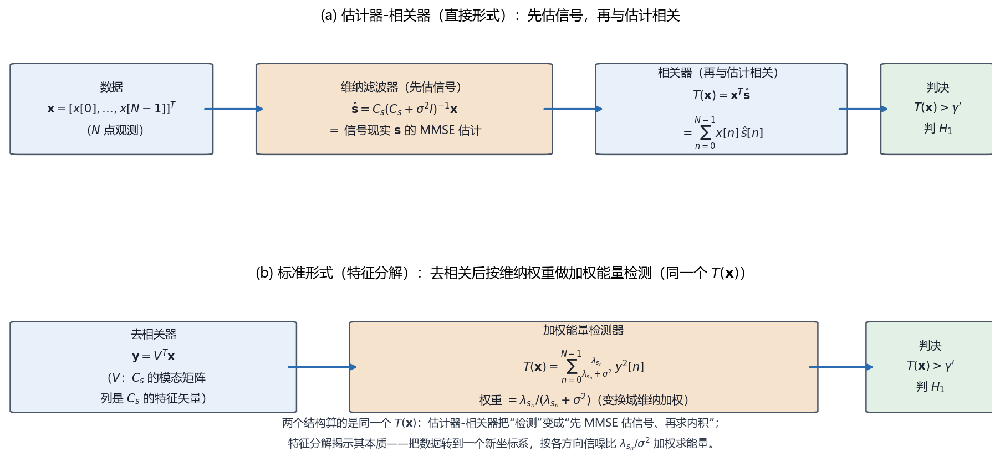

# Vol2 Ch05 随机信号：信号本身是随机的，检测器里长出了一个估计器

> 对应原书：第二卷《检测理论》第 5 章（书内第 563~597 页，本扫描 PDF 第 578~612 页；页码映射"书内 = PDF − 15"，PDF 579 顶栏"564"、PDF 612 顶栏"597"）。
> 前置阅读：本系列 `Vol2_Ch04_确定信号.md`（匹配滤波器、$E/\sigma^2$、$d^2$）、`Vol2_Ch03_统计判决理论I.md`（NP 定理、似然比检验）；回调 `Vol1_Ch07_最大似然估计.md`（渐近似然 §6.5、例 7.14）与第一卷第 12 章（维纳滤波器）。本文自包含，涉及的前置概念就地插播。

## 写在前头

这是讲解系列**第二卷的第 5 篇**，对应原书第二卷《随机信号》。它在第二卷里的角色，是把第 4 章"信号完全已知"这个最有利的假设打掉一半：**信号不再是一个已知波形，而是一个只知道协方差结构的随机过程。** 第 4 章的匹配滤波器检测的是"均值的变化"（信号出现 → 数据均值从 0 变成 $s[n]$）；本章要面对的是"信号出现不改均值、只改方差或协方差"的情形——**语音、混响、衰落信道输出这类信号，本身就是随机的，只能靠统计特性去认。**

本卷第 4 篇末尾埋的伏笔，本章兑现：Vol2_Ch04 §8 第 5 条说"随机信号不适用匹配滤波器，第 5 章'估计器-相关器'接手"。本章要讲的**估计器-相关器**正是接手的结果，而它最有哲学味的地方是——**检测器里长出了一个估计器：判决统计量 = 观测与"信号的条件均值估计"的内积，先估信号、再相关。** 检测（判"在不在"）和估计（问"是多少"）第一次在一台机器里合流。

用一句话概括本章的设计目标：**当信号是协方差已知的高斯随机过程时，把"判信号在不在"做成"先用维纳滤波器估出信号、再与数据求内积、最后比门限"的检测器，并把它化简成"去相关 + 加权能量检测"的标准形。** 本章是后续第 7、8 章（含未知参数的信号）的地基，也是第 13 章阵列处理"估计器-相关器"的复矢量前身。

**实测声明**：本文所有内容与数字均经 OCR 核对原书扫描件（PDF 第 578~612 页，OCR 文本存于 `Temp/chapters_ocr/v2ch05/`），不是凭印象转述。公式编号（5.1）~（5.38）沿用原书编号；图 Fig026 为本系列自建数据流示意图（脚本 `Temp/scripts/make_fig026.py`），结论对应原书（5.5）（5.6）（5.9）式、图 5.2/5.3。正文中由模型自算的派生数字（如能量检测器的卡方右尾、$\eta$ 代换）已就地标注，与原书 OCR 数字严格区分。

---

## 1. 问题：信号不再是一个已知波形，检测器靠什么认出它

### 1.1 问题驱动：为什么第 4 章的匹配滤波器在这一章会失灵？

第 4 章的模型是 $H_0: x[n]=w[n]$ 对 $H_1: x[n]=s[n]+w[n]$，其中 $s[n]$ 是**完全已知的确定性信号**。匹配滤波器的整个论证都建立在一件事上：**信号的出现改变了数据的均值**（从 $0$ 变成 $s[n]$），所以"拿已知波形去和数据对齐着做内积"就能把信号能量叠加出来。

原书 §5.1 用一个例子把这层假设打掉：**语音信号**。给定的一段声意波形（原文"声意"应为"声音/语音"之 OCR 讹误）与说话者的个性、内容、健康状况都有关，"假定信号是已知的是不符合实际的"。更合理的做法是——**假定信号是一个随机过程，它的协方差结构是已知的**。也就是说，我们知道"信号在统计上长什么样"（各频率分量平均有多强、样本间怎么相关），但不知道"这一秒具体是什么波形"。

**翻译成人话：第 4 章是"手里拿着嫌疑犯的照片去比对"；本章是"只知道嫌疑犯的身高体重肤色分布，照片没有"。** 后者必须换一套认人的标准。

### 1.2 检测的抓手：从"均值变化"换成"方差/协方差变化"

当信号是**零均值**随机过程时，它出现与否不改变数据的均值（$E[x[n]]=0$ 在两种假设下都一样），改的是**二阶统计量**。原书 §5.3 开头的模型是：

$$
H_0:\ x[n] = w[n], \qquad H_1:\ x[n] = s[n] + w[n], \quad n = 0, 1, \ldots, N-1
$$

其中 $s[n]$ 为零均值、协方差矩阵 $\mathbf{C}_s$ 的高斯随机过程，$w[n]$ 为方差 $\sigma^2$ 的 WGN（白高斯噪声，零均值、自相关 $r_{ww}[k]=\sigma^2\delta[k]$），且信号与噪声独立。

**翻译成人话：$H_0$ 下数据协方差是 $\sigma^2\mathbf{I}$（白），$H_1$ 下是 $\mathbf{C}_s+\sigma^2\mathbf{I}$（信号把它染上了结构）。** 检测的抓手就从"均值"变成了"协方差"——**数据里有没有"信号留下的相关结构"。**

> **前置概念①：白 vs 有色。** "白"（white）指功率谱平坦、样本间不相关（$r_{ww}[k]=\sigma^2\delta[k]$，$k\neq0$ 时自相关为 0）；"有色"（colored）指样本间相关（有记忆），协方差矩阵非对角。**翻译成人话：白噪声每个时刻独立掷骰子；有色信号上一个时刻的值会"拖累"下一个时刻。** 检测随机信号的关键，就是认出这种"拖累"结构。

**一句话总结：确定性信号靠"均值偏移"被认出，随机信号只能靠"协方差结构"被认出——检测器的形式因此彻底改变。**

---

## 2. 起点：能量检测器——当信号是白的，只剩"功率变大"可认

### 2.1 问题从哪来：最简单的随机信号，最朴素的检测器

先从最简单的情形入手：信号是**零均值白色 WSS 高斯过程**（方差 $\sigma_s^2$），即 $s[n]$ 本身是"白"的（原书例 5.1 特别说明：这里把信号叫作"噪声"其实是误称，但它确实是白的）。此时信号唯一的统计特征就是**功率** $\sigma_s^2$：它出现时，数据方差从 $\sigma^2$ 涨到 $\sigma_s^2+\sigma^2$。

把两个高斯 PDF 代入第 3 章的似然比、取对数、整理（推导见原书 §5.3），NP 检测器化简为：

$$
T(\mathbf{x}) = \sum_{n=0}^{N-1} x^2[n] \tag{5.1}
$$

其中 $\mathbf{x}=[x[0],\ldots,x[N-1]]^T$ 为 $N$ 点数据矢量，求和项为数据的总能量（各样本平方和）。**翻译成人话：信号若出现，接收数据的总能量会变大——所以算一下数据的能量，和门限比。** 原书称它为**能量检测器**。

### 2.2 能解决什么：性能用卡方分布写出来

统计量 $T(\mathbf{x})$ 是 $N$ 个高斯随机变量的平方和。由第 2 章的结论，$T(\mathbf{x})/\sigma^2$ 在 $H_0$ 下服从自由度为 $N$ 的**卡方分布** $\chi^2_N$；$T(\mathbf{x})/(\sigma_s^2+\sigma^2)$ 在 $H_1$ 下也服从 $\chi^2_N$。于是虚警率与检测率（原书式 5.2、5.3）：

$$
P_{FA} = \Pr\{T(\mathbf{x})>\gamma';\ H_0\} = Q_{\chi^2_N}\!\left(\frac{\gamma'}{\sigma^2}\right) \tag{5.2}
$$

$$
P_D = \Pr\{T(\mathbf{x})>\gamma';\ H_1\} = Q_{\chi^2_N}\!\left(\frac{\gamma'}{\sigma_s^2+\sigma^2}\right) \tag{5.3}
$$

其中 $Q_{\chi^2_N}(\cdot)$ 为 $\chi^2_N$ 分布的右尾概率，$\gamma'$ 为门限。**这个式子说明什么性质：门限由（5.2）式反解（习题 5.1 给出定点迭代），检测性能随信噪比 $\sigma_s^2/\sigma^2$ 单调递增**（原书 §5.3 给出了代数论证：固定 $P_{FA}$ 时 $P_D$ 的自变量 $=(\sigma^2/\sigma_s^2+1)^{-1}\times$ 常数，$\sigma_s^2/\sigma^2$ 越大自变量越小、右尾越大）。原书图 5.1 画了 $N=25$ 时能量检测器的性能曲线（SNR 从 −20 dB 到 10 dB，$P_{FA}$ 从 $10^{-5}$ 到 $0.9$）。

**翻译成人话：能量检测器是一把"功率计"——数据平均功率显著高于纯噪声时，就喊"有信号"。它认的是功率，不是波形。**

### 2.3 性质与限制：能量检测器的天花板

能量检测器的**好处**是极度简单：不要求知道信号波形，只算 $N$ 次平方和。但它的**限制**必须说清：

1. **它把波形信息全部扔掉**。第 4 章的匹配滤波器按波形逐点加权，换来处理增益 $10\log_{10}N$ dB；能量检测器对每个样本一视同仁，**不利用信号样本之间的相关结构**。当信号有色时（样本间相关），这个信息是白送的，扔掉它等于白丢检测能力。
2. **性能分析要算卡方分布**（而非第 3 章顺手的高斯 $Q$ 函数），因为 $T(\mathbf{x})$ 是平方和，不是线性统计量。$N$ 很大时可由中心极限定理把 $\chi^2_N$ 近似成高斯（习题 5.2 给出了 $Q_{\chi^2_N}$ 的近似表达式），但那只是近似。
3. **它只认"总功率变大"**，所以对"信号能量不变但结构变了"的情形（比如信号与噪声功率相同、只是相关性不同）完全失明。

**一句话总结：能量检测器是随机信号检测的"零阶近似"——只用方差、不用协方差；下一步的升级动机，就是"别把协方差结构白扔了"。**

---

## 3. 升级：估计器-相关器——检测器里长出了一个估计器

### 3.1 问题从哪来：信号有色了，怎么办？

上一节假设信号是白的（$\mathbf{C}_s=\sigma_s^2\mathbf{I}$）。现在把信号推广到**任意协方差矩阵 $\mathbf{C}_s$**（零均值高斯，信号有色）。原书 §5.3 重新代似然比、取对数，用**矩阵求逆引理**（原书式 5.4，见附录 1）整理，得到本章的核心结构：

$$
T(\mathbf{x}) = \mathbf{x}^T \mathbf{C}_s(\mathbf{C}_s+\sigma^2\mathbf{I})^{-1}\mathbf{x} \tag{5.5}
$$

或等价地写成内积形式

$$
T(\mathbf{x}) = \mathbf{x}^T\hat{\mathbf{s}} = \sum_{n=0}^{N-1} x[n]\,\hat{s}[n], \qquad \hat{\mathbf{s}} = \mathbf{C}_s(\mathbf{C}_s+\sigma^2\mathbf{I})^{-1}\mathbf{x} \tag{5.6}
$$

其中 $\hat{\mathbf{s}}$ 为由数据 $\mathbf{x}$ 算出的一个矢量。**翻译成人话：先由数据算出一个 $\hat{\mathbf{s}}$，再拿它和数据做内积、比门限。** 原书给这个结构起名**估计器-相关器**（estimator-correlator）："NP 检测器将接收到的数据与信号的估计 $\hat{s}[n]$ 进行相关运算"。

### 3.2 引入理论：那个 $\hat{\mathbf{s}}$ 就是维纳滤波器/MMSE 估计

这一步是本章最值得停下来看的地方。原书立刻点破 $\hat{\mathbf{s}}$ 的身份（式 5.7）：若 $\boldsymbol{\theta}$ 是要根据数据 $\mathbf{x}$ 估计的现实、二者联合高斯、零均值，则**最小均方误差（MMSE）估计器**是

$$
\hat{\boldsymbol{\theta}} = \mathbf{C}_{\theta x}\mathbf{C}_{xx}^{-1}\mathbf{x} \tag{5.7}
$$

其中 $\mathbf{C}_{\theta x}=E(\boldsymbol{\theta}\mathbf{x}^T)$ 为 $\boldsymbol{\theta}$ 与 $\mathbf{x}$ 的互协方差，$\mathbf{C}_{xx}=E(\mathbf{x}\mathbf{x}^T)$ 为数据的自协方差。令 $\boldsymbol{\theta}=\mathbf{s}$、$\mathbf{x}=\mathbf{s}+\mathbf{w}$（二者独立），代入即得 $\hat{\mathbf{s}}=\mathbf{C}_s(\mathbf{C}_s+\sigma^2\mathbf{I})^{-1}\mathbf{x}$——**正是（5.6）式。** 这正是第一卷第 12 章讲的**维纳滤波器**（线性 MMSE 估计器，联合高斯下 MMSE 估计恰好是线性的，原书 §5.3 还让读者在习题 5.5 里用变分法独立推导一遍）。

**翻译成人话：$\hat{\mathbf{s}}$ 不是随便一个"信号副本"，而是"给定这段含噪数据，信号最可能长什么样"的最优估计——维纳滤波器的输出。** 于是估计器-相关器的结构可以读成一句话：

> **检测器 = 先用维纳滤波器把信号估出来，再拿这个估计和数据求内积。判"信号在不在"这件事，被拆成了"先估信号、再相关"。**

这就是本章乃至全卷最有哲学味的结构：**检测问题里长出了一个估计器。** 第一卷辛辛苦苦建立的估计理论（MMSE、维纳滤波）在这里被检测器"征用"了。

### 3.3 能解决什么：把"协方差结构"变成"加权"用起来

为了看清估计器-相关器到底在干什么，原书把 $\mathbf{C}_s$ 做**特征分解** $\mathbf{V}^T\mathbf{C}_s\mathbf{V}=\boldsymbol{\Lambda}_s$（$\mathbf{V}$ 的列是 $\mathbf{C}_s$ 的特征矢量，$\boldsymbol{\Lambda}_s=\mathrm{diag}(\lambda_{s_0},\ldots,\lambda_{s_{N-1}})$ 是特征值），并令 $\mathbf{y}=\mathbf{V}^T\mathbf{x}$。因为加上 $\sigma^2\mathbf{I}$ 不改变特征矢量、只把每个特征值加 $\sigma^2$，于是检测器化成**标准形**（原书式 5.9）：

$$
T(\mathbf{x}) = \mathbf{y}^T \boldsymbol{\Lambda}_s(\boldsymbol{\Lambda}_s+\sigma^2\mathbf{I})^{-1}\mathbf{y}
= \sum_{n=0}^{N-1} \frac{\lambda_{s_n}}{\lambda_{s_n}+\sigma^2}\, y^2[n] \tag{5.9}
$$

其中 $y[n]$ 为数据在特征矢量方向上的投影，$\lambda_{s_n}$ 为该方向的信号方差。**翻译成人话：先把数据转到一个新坐标系（每个坐标轴是信号协方差的一个特征方向），然后在每个方向上算能量、按权重 $\lambda_{s_n}/(\lambda_{s_n}+\sigma^2)$ 加权求和。** 图 Fig026 把这个结构和直接形式并排画出：

*图 Fig026：估计器-相关器的两种实现（自建数据流示意，对应原书（5.5）（5.6）（5.9）式、图 5.2/5.3）。(a) 直接形式：数据 $\mathbf{x}$ → 维纳滤波器 $\hat{\mathbf{s}}=\mathbf{C}_s(\mathbf{C}_s+\sigma^2\mathbf{I})^{-1}\mathbf{x}$（先估信号）→ 相关器 $T(\mathbf{x})=\mathbf{x}^T\hat{\mathbf{s}}$（再与估计求内积）→ 与门限比判 $H_1$；(b) 标准形：数据先经 $\mathbf{C}_s$ 的模态矩阵去相关成 $\mathbf{y}$，再按权重 $\lambda_{s_n}/(\lambda_{s_n}+\sigma^2)$ 做加权能量检测。看两件事：① 两种实现算的是同一个 $T(\mathbf{x})$；② "先估信号、再相关"这步把检测器变成了一个估计器加一个相关器——这是本章的核心结构。*

### 3.4 权重 $\lambda_{s_n}/(\lambda_{s_n}+\sigma^2)$ 的工程直觉：按"方向信噪比"下注

这个权重是标准形的灵魂，值得单独讲透。原书例 5.3 用 $N=2$、相关系数 $\rho$ 的相关信号演示了它的意义：特征值 $\lambda_{s_0}=\sigma_s^2(1+\rho)$、$\lambda_{s_1}=\sigma_s^2(1-\rho)$，权重分别为 $(1+\rho)$ 和 $(1-\rho)$ 方向的比例。当 $\rho\to1$ 时，$s[1]\to s[0]$（两个样本几乎完全一样），于是**沿 $[1/\sqrt2,\ 1/\sqrt2]^T$ 方向的分量被保留、沿 $[1/\sqrt2,\ -1/\sqrt2]^T$ 方向的分量被放弃**（习题 5.7）。

**翻译成人话：特征方向 = 信号"能量集中"的方向；$\lambda_{s_n}$ 大，说明信号在这个方向抖得厉害，这个方向上的观测分量更"可信"，就给它更大权重。** 原书图 5.4 画了信号 PDF 与噪声 PDF 的等值线：信号 PDF 集中在 $\rho\approx1$ 的直线上（一个方向方差大、正交方向方差小），而噪声 PDF 是圆（无方向偏好）——**检测就是在"哪个方向信号抖得比噪声厉害"上做加权能量比较。**

**权重本身的身份**：$\lambda_{s_n}/(\lambda_{s_n}+\sigma^2)$ 正是变换域上的维纳滤波加权（习题 5.8）：对每个 $y[n]$，维纳滤波器乘一个在 0 和 1 之间的数——$\lambda_{s_n}\gg\sigma^2$（信号强的方向）时权重趋近 1（保留），$\lambda_{s_n}\ll\sigma^2$ 时权重趋近 0（放弃）。**一句话总结：估计器-相关器 = 去相关 + 按方向信噪比加权的能量检测器；它的"聪明"全在权重 $\lambda_{s_n}/(\lambda_{s_n}+\sigma^2)$ 里。**

### 3.5 性能与代价：检测性能难以闭式求解

估计器-相关器的检测性能**一般没有闭式解**。原因是（5.9）式的 $T(\mathbf{x})$ 是**独立的 $\chi^2_1$ 随机变量的加权和**（不再是单纯的 $\chi^2_N$），其 PDF 一般只能数值算。原书附录 5A 用特征函数导出了（5.10）（5.11）式的积分形式：

$$
P_{FA} = \int_{\gamma'}^{\infty}\mathcal{F}^{-1}\!\left[\prod_{n=0}^{N-1}\frac{1}{\sqrt{1-2j\alpha_n\omega}}\right] dt, \qquad
\alpha_n = \frac{\lambda_{s_n}\sigma^2}{\lambda_{s_n}+\sigma^2} \tag{5.10}
$$

$$
P_D = \int_{\gamma'}^{\infty}\mathcal{F}^{-1}\!\left[\prod_{n=0}^{N-1}\frac{1}{\sqrt{1-2j\lambda_{s_n}\omega}}\right] dt \tag{5.11}
$$

其中 $\mathcal{F}^{-1}[\cdot]$ 表示傅里叶反变换（特征函数的逆），被积函数是 $T(\mathbf{x})$ 的 PDF。**它说明什么性质：一般需要数值积分；只有特征值成对出现（例 5.4：信号由两个独立子矢量组成，如阵列处理的两个传感器、或时间上连续采得的两段）时才有闭式解（5.14）（5.15）。** 例 5.4 还指出一个重要的工程红利：**复数据下，若实部虚部独立，$\mathbf{C}_s$ 恰好是块对角形式，于是任意协方差矩阵的估计器-相关器性能都能从（5.14）（5.15）求出**（原书 §5.3 末尾、习题 13.8）——这是第 13 章阵列处理的一个铺垫。

**代价照实说**：能量检测器只需查 $\chi^2_N$ 表，估计器-相关器却要"特征分解 + 数值积分"或"部分分式展开"才能算出性能。**这是用协方差结构换性能、用计算复杂度付账的一笔交易。**

### 3.6 有色噪声：预白化后再估计-相关

估计器-相关器还可以推广到**观测噪声有色**的情形（噪声协方差 $\mathbf{C}_w$ 任意）。原书（习题 5.10）给出 NP 检测器为（式 5.16、5.17）：

$$
T(\mathbf{x}) = \mathbf{x}^T\mathbf{C}_w^{-1}\hat{\mathbf{s}}, \qquad \hat{\mathbf{s}} = \mathbf{C}_s(\mathbf{C}_s+\mathbf{C}_w)^{-1}\mathbf{x} \tag{5.16, 5.17}
$$

其中 $\mathbf{C}_w^{-1}$ 为噪声协方差之逆。**翻译成人话：它由"噪声预白化器（$\mathbf{C}_w^{-1}$ 项）+ 修正过的维纳滤波器"组成**——与第 4 章"预白化 + 匹配滤波"是同一个套路在随机信号上的翻版。标准形（习题 5.11）通过同时对角化 $\mathbf{C}_s$ 和 $\mathbf{C}_w$ 得到，公式更繁但结构不变。

**一句话总结：估计器-相关器把"检测随机信号"翻译成"先做最优信号估计、再求内积"，而它的本质是"去相关后按方向信噪比加权能量"；代价是性能一般要数值积分、且要求信号协方差 $\mathbf{C}_s$ 已知。**

---

## 4. 线性模型下的估计器-相关器：瑞利衰落正弦与周期图

### 4.1 问题从哪来：信号协方差 $\mathbf{C}_s$ 从哪来？

（5.5）（5.6）式要求 $\mathbf{C}_s$ 已知。工程上 $\mathbf{C}_s$ 很少直接给，更多时候**信号由一个参数化的模型生成**。原书 §5.4 引入**贝叶斯线性模型**：

$$
\mathbf{x} = \mathbf{H}\boldsymbol{\theta} + \mathbf{w}
$$

其中 $\mathbf{H}$ 为已知 $N\times p$ 观测矩阵，$\boldsymbol{\theta}$ 为 $p\times1$ 随机矢量（$\boldsymbol{\theta}\sim\mathcal{N}(\mathbf{0},\mathbf{C}_\theta)$），$\mathbf{w}\sim\mathcal{N}(\mathbf{0},\sigma^2\mathbf{I})$ 且与 $\boldsymbol{\theta}$ 独立。此时信号 $\mathbf{s}=\mathbf{H}\boldsymbol{\theta}\sim\mathcal{N}(\mathbf{0},\mathbf{H}\mathbf{C}_\theta\mathbf{H}^T)$，代入（5.5）得（式 5.18）：

$$
T(\mathbf{x}) = \mathbf{x}^T\mathbf{H}\mathbf{C}_\theta\mathbf{H}^T(\mathbf{H}\mathbf{C}_\theta\mathbf{H}^T+\sigma^2\mathbf{I})^{-1}\mathbf{x} \tag{5.18}
$$

原书指出它可化简为 $T(\mathbf{x})=\mathbf{x}^T\hat{\mathbf{s}}=\mathbf{x}^T\mathbf{H}\hat{\boldsymbol{\theta}}$（习题 5.15），其中 $\hat{\boldsymbol{\theta}}$ 是 $\boldsymbol{\theta}$ 的 MMSE 估计。**翻译成人话：先把参数 $\boldsymbol{\theta}$ 估计出来，再合成信号估计 $\hat{\mathbf{s}}=\mathbf{H}\hat{\boldsymbol{\theta}}$，再相关。** 这就是第 5.3 节"检测器里长出一个估计器"在参数化模型上的具体形态。

### 4.2 例 5.5 瑞利衰落正弦：匹配滤波的"随机化"版本

这是本章最经典的例子（原书例 5.5，估计视角见第一卷例 11.1）。多路径信道里，发射的正弦信号沿不同路径到达接收机，产生相长/相消干涉，导致**接收到的正弦幅度和相位不可预测**（原书图 5.5）。观测模型是：

$$
x[n] = A\cos(2\pi f_0 n + \Phi) + w[n], \quad n=0,1,\ldots,N-1
$$

其中 $0<f_0<1/2$ 为已知频率，$w[n]$ 为方差 $\sigma^2$ 的 WGN。关键在幅度 $A$ 与相位 $\Phi$ 的模型：把信号改写成 $s[n]=A\cos(2\pi f_0 n+\Phi)=a\cos 2\pi f_0 n + b\sin 2\pi f_0 n$（$a=A\cos\Phi,\ b=-A\sin\Phi$），并假定 $[a\ b]^T\sim\mathcal{N}(\mathbf{0},\sigma_A^2\mathbf{I})$。由中心极限定理（多路径到达的叠加性）这很自然。由此可证 $s[n]$ 是 WSS 高斯过程，自相关函数 $r_{ss}[k]=\sigma_A^2\cos 2\pi f_0 k$；幅度 $A=\sqrt{a^2+b^2}$ 的 PDF 是**瑞利分布**（故称"瑞利衰落"，$\Phi$ 在 $[0,2\pi]$ 均匀、与 $A$ 独立）。

代入（5.18）式，用矩阵求逆引理化简（$N$ 大时 $\mathbf{H}^T\mathbf{H}\approx(N/2)\mathbf{I}$），NP 检测器最终化为（式 5.20）：

$$
T'(\mathbf{x}) = \frac{1}{N}\left|\sum_{n=0}^{N-1} x[n]\, e^{-j2\pi f_0 n}\right|^2 \tag{5.20}
$$

其中 $|\cdot|$ 为复模，求和项为数据在频率 $f_0$ 处的 DFT 系数。**翻译成人话：算数据在已知频率 $f_0$ 处的周期图，和门限比。** 原书图 5.6 给了两种等价实现：(a) **正交/非相干匹配滤波器**——数据同时与 $\cos$（同相 I）和 $\sin$（正交 Q）相关，取平方和（因为相位随机，信号可能落在 I 或 Q 任一通道上，得两个都看）；(b) **周期图检测器**——DFT + 幅度平方 + 乘 $1/N$。**FFT 在雷达/声纳里无处不在，这里给出了它的检测理论出处。**

### 4.3 性能与代价：衰落让检测率增长得极慢

周期图检测器在 $H_0$ 下是指数分布（$T'(\mathbf{x})$ 均值为 $\sigma^2$），$H_1$ 下也是指数分布（均值 $N\sigma_A^2/2+\sigma^2$）。于是（式 5.21、5.22）：

$$
P_{FA} = \exp\!\left(-\frac{\gamma'}{\sigma^2}\right), \qquad
P_D = \exp\!\left(-\frac{\gamma'}{N\sigma_A^2/2+\sigma^2}\right) \tag{5.21, 5.22}
$$

消去门限 $\gamma'$，令 $\bar{\eta}=N\sigma_A^2/(2\sigma^2)$ 为**平均 ENR**（能量噪声比，对随机幅度 $A$ 取平均），得到极简洁的关系（式 5.23）：

$$
P_D = P_{FA}^{\,1/(1+\bar{\eta})} \tag{5.23}
$$

**这个式子说明什么性质：$P_D$ 随平均 ENR 的增加增长得非常慢**（原书图 5.7）。原因原书给得很透：正弦的幅度 $A$ 服从瑞利 PDF，**即使平均 ENR 很大，$A$ 取小值的概率依然很高**（图 5.8）——总有一半以上的现实是"信号弱得几乎不存在"，把这些现实平均进去，$P_D$ 就拉不起来。**这是衰落信道的结构性代价：不是检测器不努力，而是"信号本身经常很弱"这个随机性拖了后腿。**

### 4.4 例 5.6 非相干 FSK：衰落把通信打成什么样

同一个瑞利衰落模型用于通信（原书例 5.6）：信号是 $s_0[n]=\cos 2\pi f_0 n$ 或 $s_1[n]=\cos 2\pi f_1 n$ 通过瑞利衰落信道，检测问题是判"发的是 $f_0$ 还是 $f_1$"。等先验下，最小错误概率接收机化简为（式 5.24）：

$$
I(f_1) > I(f_0) \ \Rightarrow\ 判 H_1 \tag{5.24}
$$

其中 $I(f)=\frac1N\left|\sum_n x[n]e^{-j2\pi fn}\right|^2$ 为频率 $f$ 处的周期图。**翻译成人话：算两个频率的周期图，哪个大就判哪个**（原书图 5.9 的非相干 FSK 接收机）。错误概率（式 5.25）：

$$
P_e = \frac{1}{2+\bar{\eta}} \tag{5.25}
$$

其中 $\bar{\eta}=N\sigma_A^2/(2\sigma^2)$ 为平均 ENR。原书图 5.10 把它与理想信道（无衰落）的相干 PSK 性能并排画出：**衰落信道的 $P_e$ 随平均 ENR 下降得极慢**（反比关系，而非高斯 $Q$ 函数的指数式下降）。原书的结论直白："在许多通信系统中，这种高的错误概率是不能接受的。为了减少错误概率，必须依赖 5.7 节讨论的多种技术"（即分集）。

**一句话总结：线性模型把 $\mathbf{C}_s$ 的来源参数化；瑞利衰落正弦把匹配滤波"随机化"成了周期图检测器，而衰落的代价是 $P_D$ 与 $P_e$ 都只随 ENR 慢速改善——这为 5.7 节的分集埋下伏笔。**

---

## 5. 大数据记录的估计器-相关器：频域渐近似然（回调第一卷）

### 5.1 问题从哪来：矩阵求逆算不起

（5.6）式要算 $\mathbf{C}_s(\mathbf{C}_s+\sigma^2\mathbf{I})^{-1}\mathbf{x}$，对一个 $N\times N$ 矩阵求逆，代价是 $O(N^3)$ 量级——长数据下不可接受。当信号是 WSS 高斯随机过程、$N$ 很大时，原书 §5.5 用 $N\times N$ Toeplitz 矩阵的性质导出渐近形式。这条路和第一卷 Ch07 §6.5 的**渐近似然**（例 7.14）是同一个思想：**把时域的矩阵求逆搬进频域。**

### 5.2 引入理论：频域维纳滤波（式 5.26~5.29）

第一卷附录 3D 证明：若 $x[n]$ 是 PSD（功率谱密度）为 $P_{xx}(f)$ 的零均值 WSS 高斯过程，则大数据记录下对数 PDF 近似为

$$
\ln p(\mathbf{x}) \approx -\frac{N}{2}\ln 2\pi - \frac{N}{2}\int_{-1/2}^{1/2}\left[\ln P_{xx}(f) + \frac{I(f)}{P_{xx}(f)}\right] df \tag{5.26}
$$

其中 $I(f)=\frac1N\left|\sum_{n=0}^{N-1}x[n]e^{-j2\pi fn}\right|^2$ 为周期图，$P_{xx}(f)$ 为模型 PSD。代入 $H_0$（$P_{xx}(f)=\sigma^2$）与 $H_1$（$P_{xx}(f)=P_{ss}(f)+\sigma^2$），把与数据无关的项并进门限，得到渐近检测器（式 5.27）：

$$
T(\mathbf{x}) = N\int_{-1/2}^{1/2} \frac{P_{ss}(f)}{P_{ss}(f)+\sigma^2}\, I(f)\, df > \gamma' \tag{5.27}
$$

其中 $P_{ss}(f)$ 为信号的 PSD。原书解释（式 5.28、5.29）：

$$
H(f) = \frac{P_{ss}(f)}{P_{ss}(f)+\sigma^2}, \qquad
T(\mathbf{x}) = \int_{-1/2}^{1/2} X(f)\hat{S}^*(f)\, df \tag{5.28, 5.29}
$$

其中 $H(f)$ 是**无限长非因果维纳滤波器的频率响应**（第一卷 §12.7），$\hat{S}(f)=H(f)X(f)$ 是信号傅里叶变换的估计，$X(f)$ 是数据的傅里叶变换。**翻译成人话：大 $N$ 下，估计器-相关器变成——把数据过一遍频域维纳滤波器估出信号，再在频域和数据相关（由 Parseval 定理等价于时域 $\sum x[n]\hat{s}[n]$）。** 与（5.9）式对照：**频域的 $P_{ss}(f)/(P_{ss}(f)+\sigma^2)$ 就是时域权重 $\lambda_{s_n}/(\lambda_{s_n}+\sigma^2)$ 的连续版。**

### 5.3 能解决什么 + 限制

**好处**：把 $O(N^3)$ 的矩阵求逆换成频域积分（可用 FFT 高效算周期图），长数据下实用。**限制**：它是渐近形式，只在 $N$ 很大时成立；且 $H(f)$ 是非因果的（无限长），只能批处理、不能实时流式（这一代价第一卷 Ch12 维纳滤波早已坦白，这里在检测语境下再次兑现）。

**回调伏笔**：本系列 Vol1_Ch07 §6.5 的渐近似然（式 7.60）就是这里的（5.26）；第一卷用它在频域估参数，本章用它在频域做检测——**同一把"频域渐近"的刀，先切估计、再切检测。** 第 13 章阵列处理会把（5.27）的复矢量版再讲一遍。

**一句话总结：大数据记录下，估计器-相关器退化成"频域维纳滤波 + 频域相关"，把矩阵求逆这笔 $O(N^3)$ 的账，压成了 FFT 可解的频域积分。**

---

## 6. 一般高斯检测：均值与协方差同时可辨

### 6.1 问题从哪来：信号既有确定性分量、又有随机分量呢？

前面几节信号都是零均值（只改协方差）；第 4 章信号是确定性的（只改均值）。最一般的情形是两者都有：**信号 = 确定性分量（非零均值 $\boldsymbol{\mu}_s$）+ 随机分量（零均值、协方差 $\mathbf{C}_s$）**，且噪声协方差 $\mathbf{C}_w$ 也任意。原书 §5.6 给出一般高斯检测问题：

$$
H_0:\ \mathbf{x}=\mathbf{w}, \qquad H_1:\ \mathbf{x}=\mathbf{s}+\mathbf{w}
$$

其中 $\mathbf{w}\sim\mathcal{N}(\mathbf{0},\mathbf{C}_w)$，$\mathbf{s}\sim\mathcal{N}(\boldsymbol{\mu}_s,\mathbf{C}_s)$，二者独立。**翻译成人话：现在"信号在不在"可以从均值、也可以从协方差（或两者）识别出来。** 代似然比、取对数、用矩阵求逆引理整理，NP 检测器为（式 5.30）：

$$
T(\mathbf{x}) = \mathbf{x}^T(\mathbf{C}_s+\mathbf{C}_w)^{-1}\boldsymbol{\mu}_s + \frac{1}{2}\,\mathbf{x}^T\mathbf{C}_w^{-1}\mathbf{C}_s(\mathbf{C}_s+\mathbf{C}_w)^{-1}\mathbf{x} \tag{5.30}
$$

其中 $\boldsymbol{\mu}_s$ 为信号均值，$\mathbf{C}_s$、$\mathbf{C}_w$ 分别为信号、噪声协方差矩阵。**它说明什么性质：一般高斯检测器是"线性项 + 二次型"之和——线性项认均值、二次型认协方差。**

### 6.2 两个退化特例：匹配滤波与估计器-相关器在此合流

（5.30）式统一了前面所有检测器（原书 §5.6）：

| 情形 | 条件 | 检测器 | 对应章节 |
|------|------|--------|---------|
| 确定性信号 | $\mathbf{C}_s=\mathbf{0}$ | $T'(\mathbf{x})=\mathbf{x}^T\mathbf{C}_w^{-1}\boldsymbol{\mu}_s$（预白化 + 匹配滤波） | 第 4 章 |
| 零均值随机信号 | $\boldsymbol{\mu}_s=\mathbf{0}$ | $T(\mathbf{x})\propto\mathbf{x}^T\mathbf{C}_w^{-1}\hat{\mathbf{s}}$，$\hat{\mathbf{s}}=\mathbf{C}_s(\mathbf{C}_s+\mathbf{C}_w)^{-1}\mathbf{x}$（预白化 + 估计器-相关器） | 第 5 章 §5.3 |

**翻译成人话：匹配滤波器和估计器-相关器不是两套东西，而是（5.30）式的两个极端——一个只有均值、一个只有协方差；中间地带两个都要。**

原书例 5.7 给了一个中间地带的具体例子：$H_0$ 下 $x[n]=w[n]$，$H_1$ 下 $x[n]=s[n]+w[n]$，其中 $s[n]\sim\mathcal{N}(A,\sigma_s^2)$ 是 IID 的（确定性 DC 电平 $A$ + 方差 $\sigma_s^2$ 的白高斯分量）。代入（5.30）（$\mathbf{C}_w=\sigma^2\mathbf{I}$，$\boldsymbol{\mu}_s=A\mathbf{1}$，$\mathbf{C}_s=\sigma_s^2\mathbf{I}$），NP 检测器是：

$$
T(\mathbf{x}) = \frac{NA}{\sigma^2+\sigma_s^2}\,\bar{x} + \frac{\sigma_s^2}{2\sigma^2(\sigma^2+\sigma_s^2)}\sum_{n=0}^{N-1}x^2[n]
$$

其中 $\bar{x}$ 为样本均值。**翻译成人话：它 = 平均器 + 能量检测器之和——平均器按均值认信号，能量检测器按方差认信号。** 这就是（5.30）"线性项 + 二次型"的最直白写照。原书还点了一句：一般贝叶斯线性模型（$\mathbf{s}=\mathbf{H}\boldsymbol{\theta}$，$\boldsymbol{\theta}\sim\mathcal{N}(\boldsymbol{\mu}_\theta,\mathbf{C}_\theta)$）是（5.30）的一个特例（令 $\boldsymbol{\mu}_s=\mathbf{H}\boldsymbol{\mu}_\theta$、$\mathbf{C}_s=\mathbf{H}\mathbf{C}_\theta\mathbf{H}^T$）。

**一句话总结：一般高斯检测把"均值可辨"与"协方差可辨"装进一个式子（5.30）——线性项匹配均值、二次型匹配协方差；匹配滤波与估计器-相关器分别是它的两个极端。**

---

## 7. 落地：节拍延迟线信道与非相干多路径组合器

### 7.1 问题从哪来：宽带信号通过多路径衰落信道，检测器长什么样？

§5.7 把前面的机器用到无线通信的典型场景：**节拍延迟线（tapped delay line, TDL）信道**（原书图 5.11）。信道输出是发射信号的多个延迟副本的加权叠加（式 5.31）：

$$
s[n] = \sum_{k=0}^{p-1} h[k]\, u[n-k] \tag{5.31}
$$

其中 $u[n]$ 为已知发射信号，$h[k]$ 为第 $k$ 个节拍的加权，$p$ 为节拍数。TDL 加权 $h[k]$ 通常未知且随时间变化（信道特性变化）；假定在信号间隔内近似为常数，并假定（式 5.32）：

$$
\mathbf{h}=[h[0]\ h[1]\ \cdots\ h[p-1]]^T \sim \mathcal{N}(\mathbf{0},\mathbf{C}_h), \qquad \mathbf{C}_h=\mathrm{diag}(\sigma_{h_0}^2,\ldots,\sigma_{h_{p-1}}^2) \tag{5.32}
$$

其中各节拍**不相关散射**（不同延迟的加权独立）。$\sigma_{h_k}^2$ 是第 $k$ 个延迟的平均功率，声纳里叫"距离散射函数"、通信里叫"多路径延迟轮廓图"。**翻译成人话：信道被建模成一个随机 FIR 滤波器，各抽头的平均功率已知、具体值未知。**

### 7.2 结构：非相干多路径组合器

因为信道模型是线性的，这就是 §5.4 的贝叶斯线性模型 $\mathbf{x}=\mathbf{H}\boldsymbol{\theta}+\mathbf{w}$（$\boldsymbol{\theta}=\mathbf{h}$）。NP 检测器为（式 5.33）：

$$
T(\mathbf{x}) = \mathbf{x}^T\mathbf{H}\mathbf{C}_h\mathbf{H}^T(\mathbf{H}\mathbf{C}_h\mathbf{H}^T+\sigma^2\mathbf{I})^{-1}\mathbf{x} \tag{5.33}
$$

若发射信号是**伪随机噪声（PRN）序列**（时间自相关近似冲激，故 $\mathbf{H}$ 的列近似正交，$\mathbf{H}^T\mathbf{H}\approx\mathcal{E}\mathbf{I}$，式 5.34），用矩阵求逆引理化简，最终得到（式 5.35）：

$$
T(\mathbf{x}) = \sum_{k=0}^{p-1} \frac{\sigma_{h_k}^2}{\sigma_{h_k}^2+\sigma^2/\mathcal{E}}\, z^2[k], \qquad z[k] = \sum_n x[n]u[n-k] \tag{5.35}
$$

其中 $\mathcal{E}=\sum_n u^2[n]$ 为发射信号能量，$z[k]$ 是数据与"第 $k$ 个延迟的发射信号"的相关输出。**翻译成人话：对每个可能延迟放一个相关器，各相关器输出平方后再按 $\sigma_{h_k}^2/(\sigma_{h_k}^2+\sigma^2/\mathcal{E})$ 加权求和——这正是（5.9）标准形的化身，原书称之为"最佳非相干多路径组合器"（图 5.12）。** 加权系数就是维纳滤波权（式 5.36 把 $z[k]/\sqrt{\mathcal{E}}$ 分解成 $\sqrt{\mathcal{E}}h[k]+$ 噪声，权重 = 该延迟的信噪比）。

### 7.3 分集的回报：4.3 dB 的实账

原书用一个具体例子把"多路径分集"的价值算成了钱。取 $p=4$，$\sigma_{h_0}^2=\sigma_{h_1}^2=1/6$、$\sigma_{h_2}^2=\sigma_{h_3}^2=1/3$（延迟散射函数见图 5.13），信号协方差有两个不同的特征值对（$\mathcal{E}/6$ 与 $\mathcal{E}/3$，各重数 2），用例 5.4 的成对特征值结果（5.14）（5.15）算出检测性能（原书式 5.37/5.38，OCR 页 604 的中间分式大量残缺，此处不逐式转录，见文末核对清单）。原书图 5.14 把这个 TDL 信道的性能与单一瑞利衰落信道对比（$P_{FA}=10^{-5}$）：**在低平均 ENR 时性能略有下降，高平均 ENR 时明显改善；例如要达到 $P_D=0.95$，PRN 序列要求的信噪比要小 4.3 dB。** 原书的解释："这种差别是由宽带信号的频率分集或等效的是由可分辨的多路径非相干平均的结果"。

**翻译成人话：宽带信号的不同频率分量独立衰落，把它们（经多路径）非相干地平均起来，就买回了 4.3 dB 的检测增益。** 这正是 §4.4 例 5.6 埋下的伏笔的兑现——**衰落让单一正弦的 $P_e$ 慢速下降，而分集（多路径组合）是对抗衰落的武器。**

**一句话总结：TDL 信道把"随机信号检测"落到无线通信里，估计器-相关器变成"每个延迟一个相关器 + 按延迟信噪比加权的非相干组合"，分集换来了 4.3 dB 的实打实增益。**

---

## 8. 关键设计决策回顾

把散在正文里的"为什么"收拢。每个决策都是一个真实岔路口：

| # | 决策 | 为什么这么选 | 换一个选择会怎样 |
|---|------|------------|----------------|
| 1 | 随机信号检测**改认协方差、不认均值**（§1） | 语音、混响、衰落输出是零均值随机过程，信号出现不改均值只改二阶统计 | 沿用第 4 章"对齐波形"的匹配滤波，会因没有已知波形而彻底失效 |
| 2 | 检测器写成 **$\mathbf{x}^T\mathbf{C}_s(\mathbf{C}_s+\sigma^2\mathbf{I})^{-1}\mathbf{x}$** 并认出它就是**维纳滤波估计**（§3.2） | 矩阵求逆引理天然给出这个形式，而它就是信号的 MMSE 估计——"先估信号、再相关" | 若停留在"二次型"层面不认 $\hat{\mathbf{s}}$ 的身份，就丢了"检测复用估计工具"这条主线 |
| 3 | 用**特征分解**把检测器化成标准形（5.9）（§3.4） | 标准形揭示权重 $\lambda_{s_n}/(\lambda_{s_n}+\sigma^2)$ 的物理意义：按方向信噪比下注 | 不分解就看不出"去相关 + 加权能量"的机制，性能也无法用（5.10）（5.11）算 |
| 4 | 线性模型里用**贝叶斯线性模型** $\mathbf{x}=\mathbf{H}\boldsymbol{\theta}+\mathbf{w}$（§4.1） | 把未知的 $\mathbf{C}_s$ 参数化成 $\mathbf{H}\mathbf{C}_\theta\mathbf{H}^T$，检测器只依赖 $\mathbf{H}$ 与 $\mathbf{C}_\theta$ | 直接要 $\mathbf{C}_s$ 在工程上拿不到，检测器沦为纸面方法 |
| 5 | 大数据记录改用**频域渐近似然**（5.27）（§5） | 避开 $N\times N$ Toeplitz 矩阵求逆的 $O(N^3)$，换成 FFT 可解的频域积分 | 精确检测器在长数据下算不起（第一卷 Ch07 §6.5 已踩过同一个坑） |
| 6 | 一般高斯检测合并成**线性项 + 二次型**（5.30）（§6） | 信号既可能有均值也可能有协方差，统一式子才能覆盖匹配滤波与估计器-相关器两个极端 | 分两个检测器各管一半，中间地带（例 5.7 的 DC+白信号）就没法下手 |
| 7 | TDL 信道用 **PRN 序列 + 非相干多路径组合**（§7） | PRN 自相关近似冲激使 $\mathbf{H}$ 列正交、检测器拆成逐延迟相关器；组合器是分集 | 用窄带正弦（例 5.5）则无分集，$P_D$ 只能按 $P_{FA}^{1/(1+\bar\eta)}$ 慢速爬 |

## 9. 实现备忘（复现与移植时的坑）

1. **$\hat{\mathbf{s}}$ 是"信号现实的估计"不是"信号"**：原书 §5.3 特意强调——虽然 $s[n]$ 是随机过程，但 $\hat{\mathbf{s}}$ 应解释为"信号给定现实的估计"。工程实现里 $\hat{\mathbf{s}}$ 是数据的一个确定性函数，别把它当成随机过程本身。
2. **权重是 $\lambda_{s_n}/(\lambda_{s_n}+\sigma^2)$，不是 $\lambda_{s_n}/\sigma^2$**：分子分母都含 $\lambda_{s_n}$。这个权重恒在 $[0,1)$ 之间，是维纳滤波的"收缩"系数。写成 $\lambda_{s_n}/\sigma^2$ 就失去了"收缩到 1"的语义。
3. **能量检测器的性能要查 $\chi^2_N$ 不是 $Q$ 函数**：$T(\mathbf{x})=\sum x^2[n]$ 是平方和，不是线性统计量。（5.2）（5.3）用的是 $Q_{\chi^2_N}$（卡方右尾），只有 $N$ 很大时才可近似成高斯（习题 5.2）。
4. **周期图检测器的门限来自指数分布**：（5.21）$P_{FA}=\exp(-\gamma'/\sigma^2)$ 意味着 $H_0$ 下 $T'(\mathbf{x})$ 是均值为 $\sigma^2$ 的指数随机变量（$\chi^2_2/2\times\sigma^2$），不是高斯。别用 $Q$ 函数算门限。
5. **（5.23）的 $\bar\eta$ 是"平均"ENR（单边口径）**：$\bar\eta=N\sigma_A^2/(2\sigma^2)$，其中 $\sigma_A^2$ 是随机正弦系数 $a,b$ 的方差。瑞利衰落里幅度 $A=\sqrt{a^2+b^2}$ 满足 $E(A^2)=2\sigma_A^2$；周期图只在 $+f_0$ 一个频点取信号能量，故这个 $\bar\eta$ 是"单边"口径（约等于总信号能量的一半除以噪声方差）。引用时务必写明这是**平均**（对随机幅度取期望）不是瞬时 ENR。
6. **（5.30）的二次项系数是 $1/2$**：一般高斯检测器 $T(\mathbf{x})=\mathbf{x}^T(\mathbf{C}_s+\mathbf{C}_w)^{-1}\boldsymbol{\mu}_s+\tfrac12\mathbf{x}^T\mathbf{C}_w^{-1}\mathbf{C}_s(\mathbf{C}_s+\mathbf{C}_w)^{-1}\mathbf{x}$。这个 $\tfrac12$ 来自"取对数、乘比例因子"的整理，丢掉会导致门限口径错位。
7. **页码映射**：本章书内 563~597 对应 PDF 578~612（**书内 = PDF − 15**）。式（5.5）（5.6）在 PDF 581、式（5.9）标准形在 PDF 584、式（5.20）周期图在 PDF 591、式（5.23）在 PDF 593、式（5.27）在 PDF 597、式（5.30）在 PDF 598、式（5.35）在 PDF 602。

## 10. 局限（坦率交代，并预告后续）

1. **要求信号协方差 $\mathbf{C}_s$ 完全已知**：这是本章最大的假设。（5.5）（5.6）式需要 $\mathbf{C}_s$ 和噪声方差 $\sigma^2$ 都知道。工程上 $\mathbf{C}_s$ 往往是估出来的、甚至完全未知。**信号协方差不完全已知的情形由第 8 章"未知参数的随机信号"接手，噪声参数未知由第 9 章接手。**
2. **检测性能一般没有闭式解**：估计器-相关器是 $\chi^2_1$ 随机变量的加权和，性能靠（5.10）（5.11）数值积分（只有例 5.4 成对特征值等特殊结构有闭式）。**这是"用协方差换性能"的代价的另一半：性能难算。**
3. **频域形式只是渐近、且非因果**：（5.27）只在 $N$ 大时成立，$H(f)$ 是无限长非因果维纳滤波器，**只能批处理、不能实时流式**——第一卷 Ch12 维纳滤波的经典代价在检测语境下再次出现；要流式得等第 13 章卡尔曼滤波式的递推（本卷不作）。
4. **瑞利衰落的慢速检测率是结构性的**：（5.23）$P_D=P_{FA}^{1/(1+\bar\eta)}$ 决定了单一衰落正弦的检测率随 ENR 慢速增长，这不是检测器的错，而是信号幅度本身经常很小。**唯一出路是分集（§7 的 TDL 组合器），但也只能部分缓解。**
5. **TDL 信道假定节拍权在信号间隔内近似常数**：原书 §5.7 明说"在有些情况下，这种假定是没有根据的，所以我们必须使用线性时变滤波器"（参考第一卷例 13.3 的时变加权估计器）。**快变信道的检测器本章没有处理。**

---

## 11. 建议自测的问题

1. 用你自己的话解释：为什么随机信号检测认的是"协方差结构"而不是"均值"？这和确定性信号检测（第 4 章）的本质差别在哪？（提示：§1.2）
2. 能量检测器的统计量 $T(\mathbf{x})=\sum x^2[n]$ 在两种假设下分别服从什么分布？门限为什么不能用高斯 $Q$ 函数定？（提示：§2.2，卡方分布）
3. 为什么说"估计器-相关器里长出了一个估计器"？$\hat{\mathbf{s}}=\mathbf{C}_s(\mathbf{C}_s+\sigma^2\mathbf{I})^{-1}\mathbf{x}$ 与第一卷的维纳滤波/MMSE 估计是什么关系？（提示：§3.2，式 5.7）
4. 标准形（5.9）里的权重 $\lambda_{s_n}/(\lambda_{s_n}+\sigma^2)$ 的物理意义是什么？当 $\lambda_{s_n}\ll\sigma^2$ 和 $\lambda_{s_n}\gg\sigma^2$ 时它各趋近什么值？（提示：§3.4）
5. 原书习题 5.1：$P_{FA}=10^{-2}$、$N=6$ 时，用定点迭代 $\gamma'_{k+1}=-\sigma^2\ln P_{FA}+\sigma^2\ln\left[1+\sum_{r=1}^{N/2-1}\gamma'_k^r/(r!)\right]$ 求能量检测器的门限（从 $\gamma'_1=1$ 起步）。这题在练什么？（提示：卡方右尾没有解析逆，只能迭代）

---

**一句话收尾：随机信号把匹配滤波器的"比对照片"变成了"认统计特征"——而认统计特征的最优方式，就是先做一次信号的最优估计、再求内积；于是这一章在检测器的心脏里，安放了一台来自第一卷的维纳滤波器。**

*实测核对声明：本章事实性内容核对自原书扫描件 OCR 文本 `Document/统计信号处理/Temp/chapters_ocr/v2ch05/ocr_page_578~612.txt`（PDF 第 578~612 页，书内 563~597 页）；公式编号（5.1）~（5.38）沿用原书编号；式（5.5）（5.6）估计器-相关器、式（5.9）标准形、式（5.20）周期图检测器、式（5.23）$P_D=P_{FA}^{1/(1+\bar\eta)}$、式（5.25）$P_e=1/(2+\bar\eta)$、式（5.30）一般高斯、式（5.35）非相干多路径组合器、§7 的"4.3 dB"分集增益均与 OCR 一致。§2.2 的卡方右尾记号与 §4.3 的指数分布代换为本文自算派生表述，已就地标注。Fig026 由 `Temp/scripts/make_fig026.py` 生成并经 `plotutil.check_figure` 程序化碰撞检测通过。*
