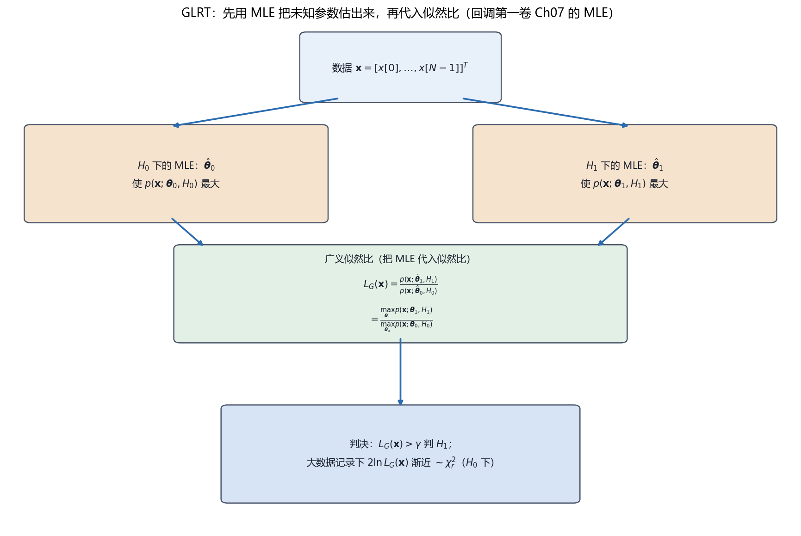

# Vol2 Ch06 统计判决理论 II：参数未知时，把 MLE 塞进似然比——GLRT

> 对应原书：第二卷《检测理论》第 6 章（书内第 598~645 页，本扫描 PDF 第 613~660 页；页码映射"书内 = PDF − 15"，PDF 614 顶栏"599"、PDF 660 顶栏"645"）。
> 前置阅读：本系列 `Vol2_Ch03_统计判决理论I.md`（NP 定理、似然比检验、$P_{FA}/P_D$）、`Vol2_Ch02_重要PDF的总结.md`（卡方/非中心卡方）；回调 `Vol1_Ch07_最大似然估计.md`（MLE 的渐近最优性）。本文自包含，涉及的前置概念就地插播。

## 写在前头

这是讲解系列**第二卷的第 6 篇**，对应原书第二卷《统计判决理论 II》。它在第二卷里的角色是**检测理论的"实用性转折"**：前几章（第 3~5 章）都默认"两个假设的 PDF 完全已知"，这是最理想、也最不现实的假设。本章要面对的是——**PDF 里含有未知参数（信号幅度、到达时间、相位、噪声方差……）**，这时的检测问题叫**复合假设检验**，而 NP 定理这把"宪法"直接失效了。

本章的核心答案是 **GLRT（广义似然比检验）**：既然参数未知，就用最大似然估计（MLE）把它估出来，再塞进似然比。**检测开始大规模借用估计工具——第一卷 Ch07 的 MLE，正是本章的"发动机"。** 这是两卷书第二次、也是最彻底的一次合流（第一次是 Vol2_Ch05 的估计器-相关器）。

用一句话概括本章的设计目标：**当 PDF 含未知参数时，把"判信号在不在"变成"先在两种假设下各求一次 MLE、再比似然、最后比门限"的检测器，并给出它在大数据记录下的渐近性能（卡方分布）与计算更省的等效形式（Wald / Rao / LMP）。** 本章是第 7~9 章（含未知参数的信号与噪声）所有具体检测器的通用武器库。

**实测声明**：本文所有内容与数字均经 OCR 核对原书扫描件（PDF 第 613~660 页，OCR 文本存于 `Temp/chapters_ocr/v2ch06/`），不是凭印象转述。公式编号（6.1）~（6.41）沿用原书编号；图 Fig027 为本系列自建流程示意图（脚本 `Temp/scripts/make_fig027.py`），结论对应原书（6.12）（6.14）式。正文中由模型自算的派生数字（如 $Q$ 函数取值）已就地标注，与原书 OCR 数字严格区分。例 6.9 的噪声 PDF 常数 OCR 不清处，据 Kay 原书英文版校订并注明（见 §5.4 与文末核对清单）。

---

## 1. 问题：PDF 不完全已知，NP 定理为什么会失效

### 1.1 问题驱动：从"宪法"到"宪法失效"只差一个未知参数

第 3 章的 NP 定理（定理 3.1）是整个第二卷的"判决宪法"：给定虚警率，似然比检验使检测率最大。但它有一个苛刻的前提——**两个假设下的 PDF 必须完全已知**（这种假设叫**简单假设**）。原书 §6.1 一上来就把这个前提的现实短板摆出来：雷达回波的到达时间因传播时间未知而未知、通信接收机对发射频率可能不完全已知、声纳里噪声方差随环境条件变化而无法预先知道——**"当 PDF 有未知参数时，最佳检测器的设计在实际中是非常重要的"。**

**翻译成人话：第 3 章的宪法只适用于"什么都知道"的理想国；现实里信号的幅度、到达时间、相位、噪声方差几乎总是未知的，宪法一条都用不上。**

### 1.2 复合假设：一族 PDF，而不是一条

当 PDF 含未知参数时，它不再是一条曲线，而是**一族曲线**（参数每取一个值就对应一条）。原书例 6.1 用 WGN 中未知幅度 $A$ 的 DC 电平演示（式 6.1、6.2）：

$$
H_0:\ x[n] = w[n], \qquad H_1:\ x[n] = A + w[n], \quad n=0,1,\ldots,N-1 \tag{6.2}
$$

其中 $A$ 未知（但已知 $A>0$），$w[n]$ 为方差 $\sigma^2$ 的 WGN。$H_1$ 下的 PDF 是

$$
p(\mathbf{x}; A, H_1) = \frac{1}{(2\pi\sigma^2)^{N/2}}\exp\!\left[-\frac{1}{2\sigma^2}\sum_{n=0}^{N-1}(x[n]-A)^2\right] \tag{6.1}
$$

**翻译成人话：$A$ 每取一个值，$p(\mathbf{x};A,H_1)$ 就是一条不同的曲线；"信号在不在"变成了"$A=0$ 还是 $A>0$"。** 原书点破关键：**"第一步就好像 $A$ 是已知的那样来设计 NP 检验。如果可能，应该控制检验，使得检验量与 $A$ 无关。"** 也就是说——先假装知道 $A$ 求出 NP 检验，再看它是否碰巧与 $A$ 无关；如果无关，就白捡一个最优检测器。

### 1.3 例 6.1：单边假设下，UMP 存在

对（6.2）式（$A>0$），把似然比化简（推导见原书 §6.3），得到统计量（式 6.3）：

$$
T(\mathbf{x}) = \bar{x} = \frac{1}{N}\sum_{n=0}^{N-1}x[n] > \gamma' \ \Rightarrow\ 判 H_1 \tag{6.3}
$$

其中 $\bar{x}$ 为样本均值，$\gamma'$ 为门限。**关键观察：检验统计量 $\bar{x}$ 与 $A$ 无关，而且门限其实也与 $A$ 无关**——因为 $H_0$ 下 $T(\mathbf{x})=\bar{x}\sim\mathcal{N}(0,\sigma^2/N)$，其 PDF 与 $A$ 无关，所以给定 $P_{FA}$ 反解出的门限是 $A$ 无关的（原书特意指出"门限与 $A$ 有关的印象是一种假象"）。检测率 $P_D=Q(Q^{-1}(P_{FA})-\sqrt{NA^2/\sigma^2})$ 随 $A$ 增大而增大（图 6.1）。

原书给这种检测器起了名字（式 6.4）：

$$
\bar{x} > \frac{\sigma^2\ln\gamma}{NA} + \frac{A}{2} \ \Rightarrow\ 判 H_1 \tag{6.4}
$$

**翻译成人话：如果检验统计量（和门限）都不依赖未知参数，那么这个 NP 检验对参数的所有取值都是最优的——这叫一致最大势（UMP）检验。** 图 6.2 画了 UMP 检验相对其他检测器的性能优势。

### 1.4 例 6.2：双边假设下，UMP 消失——透视检测器与可实现检测器

但 UMP **很少存在**。原书立刻给出反例：若 $A$ 可正可负（$-\infty<A<\infty$），则 $A>0$ 时最优检验是 $\bar{x}>\gamma'$（右尾），$A<0$ 时最优检验是 $\bar{x}<-\gamma'$（左尾，式 6.5）——**两个不同的检验，取决于未知参数 $A$ 的符号，NP 方法不产生唯一检验。**

把（6.2）改写为参数检验问题：

$$
H_0:\ A=0, \qquad H_1:\ A\neq 0 \tag{6.6}
$$

其中 $H_1$ 是**双边**（$A\neq0$）。（6.2）的 $A>0$ 是**单边**（$A>0$）。原书给出一条硬结论：**"对于存在 UMP 的参数检验必定是单边检验；双边检验永远也不会产生 UMP 检验"**（Kendall and Stuart 1979）。

于是原书引入两个重要概念：

1. **透视检测器（clairvoyant detector）**：假定未知参数完全已知时设计的 NP 检测器。它**不可实现**（因为它需要知道 $A$ 的符号），但它的性能是**上界**——就像第一卷的 CRLB 是估计方差的下界一样，透视检测器的 $P_D$ 是任何可实现检测器都超不过的（原书把这两个类比明确写出）。例 6.2 的透视检测器是：$A>0$ 时 $\bar{x}>\gamma'$，$A<0$ 时 $\bar{x}<-\gamma'$（图 6.3 画出性能）。
2. **可实现检测器**：不看 $A$ 符号，改用（式 6.8）

$$
|\bar{x}| > \gamma'' \ \Rightarrow\ 判 H_1 \tag{6.8}
$$

即"样本均值较大地偏离零"就判信号。它的检测率（式 6.9）：

$$
P_D = Q\!\left(Q^{-1}\!\left(\frac{P_{FA}}{2}\right) - \sqrt{\frac{NA^2}{\sigma^2}}\right) + Q\!\left(Q^{-1}\!\left(\frac{P_{FA}}{2}\right) + \sqrt{\frac{NA^2}{\sigma^2}}\right) \tag{6.9}
$$

图 6.4 把它与透视上界并排：**可实现检测器的性能靠近上界**。原书随后揭晓——这个"兼顾符号鲁棒性"的检测器正是 GLRT 的特例（例 6.4）。

**一句话总结：复合假设的困难在于"最优检测器依赖未知参数"；只有单边检验才可能有 UMP，双边检验没有 UMP——于是需要一条"不依赖参数也能接近最优"的通用路径，这就是 GLRT。**

---

## 2. 两条补救路线：贝叶斯 vs GLRT

### 2.1 问题从哪来：参数未知，怎么把它"处理掉"？

UMP 不存在时，原书 §6.4 给出两条路：**贝叶斯方法**把未知参数看成随机变量的现实、给一个先验 PDF、积分掉；**GLRT** 用 MLE 估计未知参数、代入似然比。原书明说选择依据：贝叶斯方法要求先验知识和多重积分（通常无闭式），**GLRT 因"实现起来容易且严格的假定较少，应用更为广泛"，后续章节（第 7~9 章）重点讲 GLRT**。

### 2.2 贝叶斯方法：先验 + 积分（式 6.10）

给未知参数 $\boldsymbol{\theta}_0,\boldsymbol{\theta}_1$ 配先验 PDF $p(\boldsymbol{\theta}_0),p(\boldsymbol{\theta}_1)$，数据 PDF 变成无条件形式：

$$
p(\mathbf{x};H_0)=\int p(\mathbf{x}|\boldsymbol{\theta}_0;H_0)\,p(\boldsymbol{\theta}_0)\,d\boldsymbol{\theta}_0, \qquad
p(\mathbf{x};H_1)=\int p(\mathbf{x}|\boldsymbol{\theta}_1;H_1)\,p(\boldsymbol{\theta}_1)\,d\boldsymbol{\theta}_1
$$

于是 NP 检测器是（式 6.10）：

$$
\frac{p(\mathbf{x};H_1)}{p(\mathbf{x};H_0)} = \frac{\int p(\mathbf{x}|\boldsymbol{\theta}_1;H_1)p(\boldsymbol{\theta}_1)d\boldsymbol{\theta}_1}{\int p(\mathbf{x}|\boldsymbol{\theta}_0;H_0)p(\boldsymbol{\theta}_0)d\boldsymbol{\theta}_0} > \gamma \tag{6.10}
$$

**翻译成人话：把未知参数用它的先验分布"平均掉"，问题就变回简单假设，NP 又能用了。** 例 6.3 是 DC 电平的贝叶斯版：设 $A\sim\mathcal{N}(0,\sigma_A^2)$（令 $\sigma_A^2\to\infty$ 表示无先验信息），积分后检测器化简为（式 6.11）：

$$
\bar{x}^2 > \gamma' \ \Rightarrow\ 判 H_1 \tag{6.11}
$$

与 §1 的可实现检测器同形。**代价照实说**：先验 PDF 的选择"很难证明"（没有先验就用无信息先验）；且积分是多重积分（维数 = 未知参数维数），"闭合形式的解通常是不可能的"。

### 2.3 GLRT：用 MLE 代替未知参数（式 6.12）

GLRT 的思路一句话：**既然参数未知，就用最大似然估计把它估出来，再代入似然比**（式 6.12）：

$$
L_G(\mathbf{x}) = \frac{p(\mathbf{x};\hat{\boldsymbol{\theta}}_1,H_1)}{p(\mathbf{x};\hat{\boldsymbol{\theta}}_0,H_0)} \tag{6.12}
$$

其中 $\hat{\boldsymbol{\theta}}_1$ 是"假设 $H_1$ 为真"时 $\boldsymbol{\theta}_1$ 的 MLE（使 $p(\mathbf{x};\boldsymbol{\theta}_1,H_1)$ 最大），$\hat{\boldsymbol{\theta}}_0$ 是"假设 $H_0$ 为真"时 $\boldsymbol{\theta}_0$ 的 MLE。原书补充：GLRT 虽然**不是最优的**，但"实际上它的性能很好"，且可证**在所有不变检验中 GLRT 是 UMP**（Lehmann 1959，渐近意义）。等价写法（式 6.14、6.15）：

$$
L_G(\mathbf{x}) = \frac{\max_{\boldsymbol{\theta}_1} p(\mathbf{x};\boldsymbol{\theta}_1,H_1)}{\max_{\boldsymbol{\theta}_0} p(\mathbf{x};\boldsymbol{\theta}_0,H_0)}, \qquad
L_G(\mathbf{x}) = \max_{\boldsymbol{\theta}_1} L(\mathbf{x};\boldsymbol{\theta}_1) \tag{6.14, 6.15}
$$

其中（6.15）是 $H_0$ 下 PDF 完全已知时的特例（在 $\boldsymbol{\theta}_1$ 上最大化似然比）。**翻译成人话：GLRT = "哪种假设下数据能被解释得最好，就信哪种"——每个假设各让参数取最会解释数据的值，再比谁的解释力强。** 图 Fig027 把这个流程画了出来：

*图 Fig027：GLRT 流程（自建示意，对应原书（6.12）（6.14）式）。数据 $\mathbf{x}$ 分两支：在 $H_0$ 下求 MLE $\hat{\boldsymbol{\theta}}_0$（使 $p(\mathbf{x};\boldsymbol{\theta}_0,H_0)$ 最大）、在 $H_1$ 下求 MLE $\hat{\boldsymbol{\theta}}_1$（使 $p(\mathbf{x};\boldsymbol{\theta}_1,H_1)$ 最大），两支会合于广义似然比 $L_G(\mathbf{x})=p(\mathbf{x};\hat{\boldsymbol{\theta}}_1,H_1)/p(\mathbf{x};\hat{\boldsymbol{\theta}}_0,H_0)$，再与门限 $\gamma$ 比、判 $H_1$。看两件事：① "先估参数、再比似然"是 GLRT 的核心动作——检测开始借用第一卷 Ch07 的 MLE；② 大数据记录下 $2\ln L_G(\mathbf{x})$ 渐近卡方分布（§4）。*

### 2.4 例 6.4：未知幅度的 GLRT——正是 §1 那个"可实现检测器"

例 6.4 回到 DC 电平（$A$ 未知、可正可负、$\sigma^2$ 已知）。$H_0$ 下无未知参数，$H_1$ 下 $\boldsymbol{\theta}_1=A$，其 MLE 为 $\hat{A}=\bar{x}$（第一卷已求得）。代入（6.12）取对数（推导见原书），得：

$$
2\ln L_G(\mathbf{x}) = \frac{N\bar{x}^2}{\sigma^2} \tag{6.13}
$$

**等价于 $|\bar{x}|>\gamma''$——正是 §1 例 6.2 那个"兼顾符号鲁棒性"的可实现检测器。** 原书在这里点破了伏笔：**直觉拍出的（6.8）式，原来就是 GLRT 算出来的（6.13）式。** 图 6.4 显示的"性能靠近透视上界"因此有了理论出处。

### 2.5 例 6.5：未知幅度与方差——多余参数进场

更现实的情形是**噪声方差 $\sigma^2$ 也未知**（例 6.5）。参数检验变成（式 6.16）：

$$
H_0:\ A=0,\ \sigma^2>0, \qquad H_1:\ A\neq0,\ \sigma^2>0 \tag{6.16}
$$

其中 $\sigma^2$ 是**多余参数**（nuisance parameter）——它未知、在两种假设下都出现、但不是我们想检验的对象，只是"挡在路上的未知量"。（6.13）式的门限与 $H_0$ 下的 PDF（从而与 $\sigma^2$）有关，因此无法实现——**必须在两种假设下都估计 $\sigma^2$**。GLRT 需要 $H_1$ 下 $\boldsymbol{\theta}_1=[A\ \sigma^2]^T$ 的 MLE（$\hat{A}=\bar{x}$，$\hat\sigma_1^2=\frac1N\sum(x[n]-\bar{x})^2$）和 $H_0$ 下 $\theta_0=\sigma^2$ 的 MLE（$\hat\sigma_0^2=\frac1N\sum x^2[n]$）。代入得（式 6.17）：

$$
2\ln L_G(\mathbf{x}) = N\ln\frac{\hat\sigma_0^2}{\hat\sigma_1^2} \tag{6.17}
$$

利用 $\hat\sigma_1^2=\hat\sigma_0^2-\bar{x}^2$（式 6.18），等价于（式 6.20）：

$$
T(\mathbf{x}) = \frac{\bar{x}^2}{\frac1N\sum_{n=0}^{N-1}(x[n]-\bar{x})^2} > \gamma'' \tag{6.20}
$$

**翻译成人话：给数据拟合"有信号"模型（$A=\bar{x}$）与"无信号"模型的误差之比，若前者明显更小，就判有信号。** 这个统计量是归一化的（分母用估计方差），门限与真实 $\sigma^2$ 无关（原书证明：令 $x[n]=\sigma u[n]$ 代入，$T(\mathbf{x})$ 的 PDF 与 $\sigma^2$ 无关，见例 9.2）。

**一句话总结：复合假设的两条路——贝叶斯"积分掉"参数（要先验、要多重积分），GLRT"估计掉"参数（要 MLE、免先验）；工程上 GLRT 更实用，因为它只要求你会算 MLE——而这正是第一卷 Ch07 的本行。**

---

## 3. GLRT 的大数据性能：卡方分布与 CFAR

### 3.1 问题从哪来：GLRT 不是最优的，那它到底多好？

GLRT 的优势是"好实现"，但它的**性能**在有限样本下一般难以解析求出（§6.2.1 小结表里 GLRT 的"渐近性能：没有一般结果"针对的是一般假设；参数检验则有大样本结果）。原书 §6.5 给出**大数据记录（$N\to\infty$）下 GLRT 的渐近性能**，前提是：① 数据记录大、信号弱（第 1 章 §1.5 的渐近语境）；② MLE 达到它的渐近 PDF（第一卷定理 7.1）。

### 3.2 引入理论：渐近卡方 / 非中心卡方（式 6.23）

把问题写成参数检验（式 6.21）：参数矢量 $\boldsymbol{\theta}=[\boldsymbol{\theta}_r^T\ \boldsymbol{\theta}_s^T]^T$（$\boldsymbol{\theta}_r$ 为 $r\times1$ 待检验参数，$\boldsymbol{\theta}_s$ 为 $s\times1$ 多余参数，$p=r+s$）：

$$
H_0:\ \boldsymbol{\theta}_r=\boldsymbol{\theta}_{r_0},\boldsymbol{\theta}_s, \qquad H_1:\ \boldsymbol{\theta}_r\neq\boldsymbol{\theta}_{r_0},\boldsymbol{\theta}_s \tag{6.21}
$$

GLRT（式 6.22）用 $H_1$ 下的**无约束 MLE** $\hat{\boldsymbol{\theta}}_1$ 与 $H_0$ 下的**约束 MLE** $\hat{\boldsymbol{\theta}}_0$（在 $\boldsymbol{\theta}_r=\boldsymbol{\theta}_{r_0}$ 下最大化）。原书定理（式 6.23）：

$$
2\ln L_G(\mathbf{x}) \xrightarrow{a} \begin{cases} \chi_r^2 & H_0 \text{ 下} \\ \chi_r^{\prime 2}(\lambda) & H_1 \text{ 下} \end{cases} \tag{6.23}
$$

其中 $\xrightarrow{a}$ 表示"渐近服从"，$\chi_r^2$ 为自由度 $r$ 的卡方分布，$\chi_r^{\prime2}(\lambda)$ 为自由度 $r$、非中心参量 $\lambda$ 的**非中心卡方分布**。非中心参量（式 6.24）：

$$
\lambda = (\boldsymbol{\theta}_{r_1}-\boldsymbol{\theta}_{r_0})^T \left[\mathbf{I}_{\boldsymbol{\theta}_r\boldsymbol{\theta}_r} - \mathbf{I}_{\boldsymbol{\theta}_r\boldsymbol{\theta}_s}\mathbf{I}_{\boldsymbol{\theta}_s\boldsymbol{\theta}_s}^{-1}\mathbf{I}_{\boldsymbol{\theta}_s\boldsymbol{\theta}_r}\right]^{-1}(\boldsymbol{\theta}_{r_1}-\boldsymbol{\theta}_{r_0}) \tag{6.24}
$$

其中 $\boldsymbol{\theta}_{r_1}$ 是 $H_1$ 下的真值，Fisher 信息矩阵按 $\boldsymbol{\theta}_r,\boldsymbol{\theta}_s$ 分块（式 6.25）：

$$
\mathbf{I}(\boldsymbol{\theta}) = \begin{bmatrix} \mathbf{I}_{\boldsymbol{\theta}_r\boldsymbol{\theta}_r} & \mathbf{I}_{\boldsymbol{\theta}_r\boldsymbol{\theta}_s} \\ \mathbf{I}_{\boldsymbol{\theta}_s\boldsymbol{\theta}_r} & \mathbf{I}_{\boldsymbol{\theta}_s\boldsymbol{\theta}_s} \end{bmatrix} \tag{6.25}
$$

**这个式子说明什么性质**：

1. **门限与未知参数无关 → CFAR**。$H_0$ 下的渐近 PDF 不依赖任何未知参数，所以能维持恒定虚警率——**这种检测器叫恒虚警率（CFAR）检测器**（constant false alarm rate）。原书明说 CFAR 性质"只对大数据记录成立"。
2. **多余参数的代价**。无多余参数时（式 6.27）$\lambda=(\boldsymbol{\theta}_1-\boldsymbol{\theta}_0)^T\mathbf{I}(\boldsymbol{\theta}_0)(\boldsymbol{\theta}_1-\boldsymbol{\theta}_0)$；有多余参数时（6.24）式方括号里多减一项，**非中心参量减小 → $P_D$ 减小**。原书点破："这是检测器中必须估计额外的参数所付出的代价。"

### 3.3 例 6.6：未知幅度——渐近结果对有限样本也精确

例 6.6 是 DC 电平、$\sigma^2$ 已知（无多余参数，$r=1$，$\theta=A$，$\theta_0=0$）。由（6.23）（6.27）：$2\ln L_G(\mathbf{x})$ 在 $H_0$ 下 $\sim\chi_1^2$，$H_1$ 下 $\sim\chi_1^{\prime2}(\lambda)$，$\lambda=A^2I(0)=NA^2/\sigma^2$（$I(A)=N/\sigma^2$）。原书指出**这个渐近结果对有限数据记录精确成立**——因为 $\bar{x}\sim\mathcal{N}(0,\sigma^2/N)$（$H_0$）与 $\mathcal{N}(A,\sigma^2/N)$（$H_1$）精确，故 $\sqrt{N}\bar{x}/\sigma\sim\mathcal{N}(0,1)$（$H_0$）与 $\mathcal{N}(\sqrt{NA^2/\sigma^2},1)$（$H_1$），平方后正是卡方/非中心卡方。原书点明：**经典线性模型下渐近统计特性对有限数据精确成立**（习题 6.15~6.17）。

### 3.4 例 6.7：未知幅度与方差——渐近结果、ROC 与蒙特卡洛

例 6.7 是 DC 电平、$\sigma^2$ 也未知（$r=s=1$，$\theta_r=A$、$\theta_s=\sigma^2$）。Fisher 信息矩阵 $\mathbf{I}(\boldsymbol{\theta})=\mathrm{diag}(N/\sigma^2,\ N/(2\sigma^4))$ 是**对角的**，所以（6.24）式的交叉项为零，$\lambda=A^2 I_{AA}=NA^2/\sigma^2$——**与例 6.6 相同**。原书点出一个有意思的结论：**"对于大的 $N$，GLRT 性能是相同的，无论 $\sigma^2$ 是否已知。这是因为 Fisher 信息矩阵的对角性质"**（第 9 章将进一步探讨）。代价是：例 6.6 的 PDF 是精确的，例 6.7 只在 $N$ 大时有效。

把 $H_0$ 下 $\chi_1^2$ 的右尾与 $H_1$ 下 $\chi_1^{\prime2}(\lambda)$ 的右尾写成 $Q$ 函数，得到 ROC（式 6.29）：

$$
P_D = Q\!\left(Q^{-1}\!\left(\frac{P_{FA}}{2}\right)-\sqrt{\lambda}\right) + Q\!\left(Q^{-1}\!\left(\frac{P_{FA}}{2}\right)+\sqrt{\lambda}\right), \qquad \lambda=\frac{NA^2}{\sigma^2} \tag{6.29}
$$

原书图 6.5 用蒙特卡洛检验了这个渐近 ROC：固定 $\lambda=5$、$\sigma^2=1$，$N=10$（$A=\sqrt{5/10}$）与 $N=30$（$A=\sqrt{5/30}$）各做一次。**结论：$N=30$ 时理论渐近曲线已较好地概括实际性能；$N=10$ 时偏差明显。** 这正是渐近理论的天性——它不告诉你 $N$ 多大才够（第一卷 Ch07 §4.2 早已踩过这个坑）。

**一句话总结：大 $N$ 下 $2\ln L_G(\mathbf{x})$ 渐近卡方（$H_0$）/非中心卡方（$H_1$），门限与未知参数无关（CFAR）；多余参数会吃掉一部分非中心参量，而经典线性模型下渐近结果对有限样本精确成立。**

---

## 4. 等效大数据记录检验：Wald 与 Rao

### 4.1 问题从哪来：GLRT 要算两个 MLE，能不能更省？

GLRT 要同时算 $H_0$ 和 $H_1$ 下的 MLE。原书 §6.6 给出两个**渐近性能与 GLRT 相同**的替代检验（有限样本不保证相同），它们的主要优点是"渐近统计量可以很容易地计算"。**Rao 检验尤其省：它不需要确定 $H_1$ 下的 MLE，只需要 $H_0$ 下的 MLE。**

### 4.2 Wald 检验与 Rao 检验（无多余参数）

无多余参数时（$H_0:\boldsymbol{\theta}=\boldsymbol{\theta}_0$ 对 $H_1:\boldsymbol{\theta}\neq\boldsymbol{\theta}_0$，$\boldsymbol{\theta}$ 为 $r\times1$）：

$$
T_W(\mathbf{x}) = (\hat{\boldsymbol{\theta}}_1-\boldsymbol{\theta}_0)^T \mathbf{I}(\hat{\boldsymbol{\theta}}_1)(\hat{\boldsymbol{\theta}}_1-\boldsymbol{\theta}_0) > \gamma \tag{6.30}
$$

$$
T_R(\mathbf{x}) = \left.\frac{\partial\ln p(\mathbf{x};\boldsymbol{\theta})}{\partial\boldsymbol{\theta}}\right|_{\boldsymbol{\theta}=\boldsymbol{\theta}_0}^{T} \mathbf{I}^{-1}(\boldsymbol{\theta}_0) \left.\frac{\partial\ln p(\mathbf{x};\boldsymbol{\theta})}{\partial\boldsymbol{\theta}}\right|_{\boldsymbol{\theta}=\boldsymbol{\theta}_0} > \gamma \tag{6.31}
$$

其中 $\hat{\boldsymbol{\theta}}_1$ 是 $H_1$（无约束）下的 MLE，$\mathbf{I}(\boldsymbol{\theta})$ 为 Fisher 信息矩阵，$\partial\ln p/\partial\boldsymbol{\theta}$ 为对数似然的梯度（得分）。**翻译成人话**：

- **Wald**：先把 $\boldsymbol{\theta}$ 估出来（$\hat{\boldsymbol{\theta}}_1$），看估计值离 $\boldsymbol{\theta}_0$ 有多远（按 Fisher 信息加权的距离）——**"估计结果离零假设有多远"**。
- **Rao**：不估 $\boldsymbol{\theta}$，只在 $\boldsymbol{\theta}_0$ 处算对数似然的**斜率**（得分），看它有多陡——**"零假设处似然有没有在爬升"**。如果 $\boldsymbol{\theta}_0$ 处斜率大，说明数据"想要"一个不同于 $\boldsymbol{\theta}_0$ 的参数值。

原书给的计算复杂度排序：**"在三种检验中，Rao 检验计算是最简单的"**（GLRT 要算 PDF 值、Wald 要算 $H_1$ 下 MLE、Rao 只要 $H_0$ 下 MLE 甚至 $H_0$ 完全已知时什么都不要）。

### 4.3 例 6.8：线性模型里三种检验完全相同

例 6.8 回到 DC 电平（$A$ 未知，$\sigma^2$ 已知）。Wald：$T_W=(N/\sigma^2)\bar{x}^2$；Rao：$\partial\ln p/\partial A|_{A=0}=N\bar{x}/\sigma^2$，$I(0)=N/\sigma^2$，故 $T_R=(N/\sigma^2)\bar{x}^2$——**与 GLRT 的（6.13）完全相同**。原书点明：这是线性模型的特例，**线性模型下三种检验统计量完全相同**（习题 6.15）。一般情况下三者不同，替代检验的优势在**非线性信号模型**和**非高斯噪声**上。

### 4.4 例 6.9：非高斯噪声里的 Rao 检验——三次矩检测器

这是本章最见功力的一例，原书用它演示"Rao 检验在 GLRT 算不动时救场"。场景：IID **非高斯**噪声（广义高斯/指数类 PDF，指数上是四次方项，形状比高斯更尖，见图 6.6）里检测未知 DC 电平 $A$。噪声 PDF 为

$$
p(w[n]) \propto \exp\!\left(-a^2 w^4[n]\right) \tag{6.32 的噪声部分}
$$

（据 Kay 原书英文版校订：噪声 PDF 是 $p(w[n])=a\exp[-a^2w^4[n]]$，常数 $a$ 使方差归一，OCR 标 $a=1.4464$、$\sigma^2=1$ 时作图。）此时 **MLE 不好求**：最大化 $\sum(x[n]-A)^4$ 要解三次方程（$J(A)$ 的导数令零得三次方程），GLRT 举步维艰。**Rao 检验则只需 $\partial\ln p/\partial A|_{A=0}$**（式 6.33），算出来是一个**三阶矩**：

$$
T_R(\mathbf{x}) \propto \left(\sum_{n=0}^{N-1} x^3[n]\right)^2 \tag{6.33 的含义}
$$

其中 $x^3[n]$ 为样本的三次方。Fisher 信息 $I(A)=6N/(a^4\sigma^2)$（与 $A$ 无关，式 6.33 后文）。**翻译成人话：非高斯噪声的 DC 电平检测，Rao 检验 = 样本三阶矩的平方乘比例因子**——因为噪声 PDF 对称，$H_0$ 下 $E[x^3[n]]=0$，$H_1$ 下非零，所以"三阶矩是否显著偏离零"就是检测量。

渐近性能由（6.23）（6.27）给出：$\lambda=A^2I(0)=6NA^2/(a^4\sigma^2)$。原书给了一个**反直觉但极重要**的结论：**由于 $6/a^4>1$，非中心参量比同方差高斯噪声更大，检测性能更好——因为"当噪声是高斯的时候 $I(A)$ 达到最小"**（习题 6.20，用 Cauchy-Schwarz 证明：在所有零均值单位方差 PDF 里，高斯的 Fisher 信息最小）。**翻译成人话：高斯噪声是"最难被利用"的噪声（对位置参数信息量最少）；噪声越偏离高斯，同样的 $A$ 反而越容易被检出。** 这是对"高斯假设最方便"的一个漂亮反转——高斯方便，但不意味着它最"好测"。

### 4.5 多余参数版：Rao 只需 $H_0$ 下的 MLE

含多余参数时（式 6.34、6.35）：

$$
T_W(\mathbf{x}) = (\hat{\boldsymbol{\theta}}_{r_1}-\boldsymbol{\theta}_{r_0})^T \left([\mathbf{I}^{-1}(\hat{\boldsymbol{\theta}}_1)]_{\boldsymbol{\theta}_r\boldsymbol{\theta}_r}\right)^{-1} (\hat{\boldsymbol{\theta}}_{r_1}-\boldsymbol{\theta}_{r_0}) \tag{6.34}
$$

$$
T_R(\mathbf{x}) = \left.\frac{\partial\ln p(\mathbf{x};\boldsymbol{\theta})}{\partial\boldsymbol{\theta}_r}\right|_{\boldsymbol{\theta}=\hat{\boldsymbol{\theta}}_0}^{T} [\mathbf{I}^{-1}(\hat{\boldsymbol{\theta}}_0)]_{\boldsymbol{\theta}_r\boldsymbol{\theta}_r} \left.\frac{\partial\ln p(\mathbf{x};\boldsymbol{\theta})}{\partial\boldsymbol{\theta}_r}\right|_{\boldsymbol{\theta}=\hat{\boldsymbol{\theta}}_0} \tag{6.35}
$$

其中 $[\mathbf{I}^{-1}]_{\boldsymbol{\theta}_r\boldsymbol{\theta}_r}$ 是 $\mathbf{I}^{-1}$ 的 $r\times r$ 左上分块，$\hat{\boldsymbol{\theta}}_0$ 是 $H_0$ 下的约束 MLE。**翻译成人话：Rao 检验只需在 $H_0$ 下估计多余参数（约束 MLE），$H_1$ 下什么都不用算**——当 $H_1$ 下 MLE 难求时（例 6.9），Rao 是救命的。例 6.10 把 Rao 用到"未知幅度 + 未知方差"的 DC 电平（例 6.5 的场景），得到 $T_R=N\bar{x}^2/\hat\sigma_0^2$（$\hat\sigma_0^2=\frac1N\sum x^2[n]$），与 GLRT（6.19）渐近相同；图 6.7 显示**即使 $N=10$ 这么短，Rao 与 GLRT 也几乎重合**（$\lambda=5$、$\sigma^2=1$）。代价照实说：Rao 的有限样本性能"可能不如 GLRT"（只是本例两者几乎一样）。

**一句话总结：Wald 用"估计离零假设多远"、Rao 用"零假设处似然多陡"，两者与 GLRT 渐近等效；Rao 最省——只要 $H_0$ 下的 MLE，在非高斯噪声（MLE 难求）时是唯一算得动的。**

---

## 5. 局部最大势检验：弱信号场景的渐近 UMP

### 5.1 问题从哪来：信号很弱时，能不能有一个"真最优"检验？

前面所有检验（GLRT/Wald/Rao）都是**渐近等效**的准最佳检验。原书 §6.7 问：弱信号场景下能不能拿到**渐近 UMP**？答案是**局部最大势（locally most powerful, LMP）检验**。场景：无多余参数、标量参数、**单边**检验

$$
H_0:\ \theta=\theta_0, \qquad H_1:\ \theta>\theta_0
$$

其中 PDF 以 $\theta$ 为参数，记 $p(\mathbf{x};\theta)$。**翻译成人话：我们只关心"信号很小（$\theta$ 靠近 $\theta_0$）"时的检测，LMP 就是"对所有接近 $\theta_0$ 的 $\theta$ 值，$P_D$ 最大"的检验。** 原书明说它对远离 $\theta_0$ 的 $\theta$ 不保证最优，"因此应该试用 GLRT"。

### 5.2 引入理论：LMP 就是"得分除以根号 Fisher 信息"（式 6.36）

推导思路：对 NP 检验 $\ln p(\mathbf{x};\theta)-\ln p(\mathbf{x};\theta_0)>\ln\gamma$，把 $\ln p(\mathbf{x};\theta)$ 在 $\theta_0$ 处做**一阶泰勒展开**（$\theta-\theta_0$ 小），得到检验统计量（式 6.36）：

$$
T_{LMP}(\mathbf{x}) = \left.\frac{\partial\ln p(\mathbf{x};\theta)}{\partial\theta}\right|_{\theta=\theta_0} \Big/ \sqrt{I(\theta_0)} \tag{6.36}
$$

其中 $\partial\ln p/\partial\theta|_{\theta_0}$ 是得分在 $\theta_0$ 处的值，$I(\theta_0)$ 是 Fisher 信息。**翻译成人话：LMP 检验 = 看"零假设处似然函数的斜率"——斜率越陡（数据越想离开 $\theta_0$），越判 $H_1$。** 它可看作"无多余参数、单边、标量"的 Rao 检验（Rao 通常是双边、要平方）。原书附录 6E 给了另一种推导：$P_D(\theta)$ 在 $\theta_0$ 处的一阶泰勒展开说明，LMP 使 $P_D$ 在 $\theta_0$ 处的**斜率**最大（即在 $\theta_0$ 附近最陡）。

### 5.3 渐近性能（式 6.37）

$$
T_{LMP}(\mathbf{x}) \xrightarrow{a} \mathcal{N}(0,1)\ \text{（}H_0\text{ 下）}, \qquad \mathcal{N}\!\left(\sqrt{I(\theta_0)}(\theta_1-\theta_0),\ 1\right)\ \text{（}H_1\text{ 下）} \tag{6.37}
$$

其中 $\theta_1$ 是 $H_1$ 下的真值。**翻译成人话：这是标准的"均值偏移高斯-高斯"模板（第 3 章），偏移系数 $d^2=(\theta_1-\theta_0)^2I(\theta_0)$**——LMP 的检测性能由 $(\theta_1-\theta_0)^2I(\theta_0)$ 这一个量决定。

### 5.4 例 6.11：相关检验（弱相关的 LMP）

例 6.11 演示 LMP 在 GLRT 难算时的价值。观测 $N$ 个 IID 二维高斯矢量 $\mathbf{x}[n]\sim\mathcal{N}(\mathbf{0},\mathbf{C})$，$\mathbf{C}=\sigma^2\begin{bmatrix}1&\rho\\\rho&1\end{bmatrix}$，检验 $H_0:\rho=0$ 对 $H_1:\rho>0$（弱相关）。GLRT 要求 $\rho$ 的 MLE——第一卷习题 9.3 表明**要解三次方程**，且单边检验的渐近 PDF 不能由（6.23）给出（习题 6.23）。于是转向 LMP（式 6.38）：

$$
T_{LMP}(\mathbf{x}) = \sqrt{N}\,\hat{\rho} > \gamma, \qquad \hat{\rho} = \frac{1}{N\sigma^2}\sum_{n=0}^{N-1}x_1[n]x_2[n] \tag{6.38}
$$

其中 $\hat{\rho}$ 是 $\rho$ 的估计（**不是 MLE**，MLE 要解三次方程），$I(0)=N$。渐近性能由（6.37）：$H_0$ 下 $\sim\mathcal{N}(0,1)$，$H_1$ 下 $\sim\mathcal{N}(\sqrt{N}\rho,1)$，偏移系数 $d^2=N\rho^2$。**翻译成人话：弱相关检验 = 把两个通道的样本相乘求和（估计互相关）、比门限；它绕开了三次方程，代价是只在 $\rho$ 靠近 0（弱信号）时最优。**

**一句话总结：LMP 是弱信号（参数靠近零假设）下的渐近 UMP，等于"得分除以根号 Fisher 信息"；它绕开了 MLE（例 6.11 的三次方程），但只在 $\theta$ 靠近 $\theta_0$ 时保最优。**

---

## 6. 多元假设：嵌套模型与最小描述长度

### 6.1 问题从哪来：GLRT 原理能搬到"多个假设"吗？

第 3 章 §3.8 的多元假设用"选最大后验/似然"。但当假设的 PDF 含未知参数时，能不能把 GLRT 的"先估再比"搬到多元？原书 §6.8 给了一个**反例**说明不能直接搬（式 6.39）：

$$
\max_i \max_{\boldsymbol{\theta}_i} p(\mathbf{x};\boldsymbol{\theta}_i;H_i) \ \Rightarrow\ 判 H_i \tag{6.39}
$$

问题出在**参数空间嵌套**：考虑 $H_0$（只有噪声）、$H_1$（DC 电平 $A$）、$H_2$（直线 $A+Bn$），$H_0$、$H_1$ 的参数是 $H_2$ 参数的子集。此时（6.39）式**永远选 $H_2$**——因为它用三个参数拟合，误差（最小二乘误差）一定最小。原书点破："当我们给模型增加更多的参数时，模型误差肯定减少"（第一卷 §8.6 已讲）。

### 6.2 补救：广义 ML 准则（式 6.40）与 MDL（式 6.41）

为了抵消"参数越多拟合越好"的倾向，给似然加一个**惩罚项**（式 6.40）：

$$
\xi_i = \ln p(\mathbf{x};\hat{\boldsymbol{\theta}}_i;H_i) - \frac{1}{2}\ln\det(\mathbf{I}(\hat{\boldsymbol{\theta}}_i)) \tag{6.40}
$$

其中 $\hat{\boldsymbol{\theta}}_i$ 是 $H_i$ 下的 MLE，$\mathbf{I}$ 为 Fisher 信息矩阵，$n_i$ 为 $\boldsymbol{\theta}_i$ 的维数。**翻译成人话：拟合误差越小越好，但参数越多越要扣分——第二项随参数个数增加而变得更负，抵消拟合项的增加。** 原书称之为**广义 ML 准则**（附录 6F 推导：在贝叶斯框架下给参数配宽的平坦先验，先验的信息量用负熵度量，并让所有假设的先验信息量相等）。

由信息论编码考虑可进一步近似成**最小描述长度（MDL）**准则（式 6.41，Rissanen 1978）：

$$
\mathrm{MDL}(i) = -\ln p(\mathbf{x};\hat{\boldsymbol{\theta}}_i;H_i) + \frac{n_i}{2}\ln N \tag{6.41}
$$

其中 $N$ 为数据长度，$n_i$ 为估计参数个数。**翻译成人话：MDL 选"拟合好 + 参数少"的假设；第二项 $\frac{n_i}{2}\ln N$ 是复杂度罚，$N$ 越大罚得越重。** 原书证明（6.40）与（6.41）渐近等价（把 $\ln\det(\mathbf{I}(\hat{\boldsymbol{\theta}}_i))$ 近似成 $n_i\ln N+$ 常数，见例 6.12 的 Fisher 信息行列式）。**性质与限制**：MDL 当 $N\to\infty$ 时一致（会选到正确假设，Bozdogan 1987），**但有限数据记录下不是最优的**；"欠拟合将导致参数较大偏差，过拟合则由于多余参数的估计增加了方差"——这是模型选择里偏差-方差权衡的经典表述。

### 6.3 例 6.12：DC 电平还是直线？（简述）

例 6.12 把（6.40）用到 $H_0$（噪声）/ $H_1$（DC）/ $H_2$（直线）的判决。为简化，取观测间隔对称（$\mathbf{H}^T\mathbf{H}$ 成对角、易求逆），$A$、$B$ 的 MLE 由第一卷例 8.6 给出；Fisher 信息行列式 $\det(\mathbf{I}_0)\propto N/(2\sigma^4)$、$\det(\mathbf{I}_1)\propto N^2/(2\sigma^4)$、$\det(\mathbf{I}_2)\propto N^3/(\cdots)$。代入（6.40）后，判据变成"拟合误差（负对数似然）+ 参数个数 $\times\frac12\ln N$"最小者——**正是 MDL 的形式**。原书强调：罚项随参数个数增加而增加、拟合项则减少，"选择的模型是在这两种相互矛盾的要求中进行选择"。

**一句话总结：多元复合假设不能直接"谁拟合得最好选谁"（嵌套模型永远选参数最多的），要加复杂度罚——广义 ML / MDL 就是在"拟合好"与"参数少"之间做权衡。**

---

## 7. 关键设计决策回顾

把散在正文里的"为什么"收拢。每个决策都是一个真实岔路口：

| # | 决策 | 为什么这么选 | 换一个选择会怎样 |
|---|------|------------|----------------|
| 1 | 复合假设先试 **UMP**（§1） | 若检验统计量与门限都不依赖未知参数，NP 检验直接最优（例 6.1） | 不先查 UMP 就上准最佳方法，会错过"免费的最优" |
| 2 | 双边假设**放弃求最优**，改用**透视上界 + 可实现检测器**（§1.4） | 双边无 UMP（定理）；透视检测器性能是上界，用来给可实现检测器打分 | 硬求"最优"会陷入"检测器依赖未知符号"的死胡同 |
| 3 | 两条路线里**主推 GLRT**（§2） | 免先验、免多重积分，只要会算 MLE（第一卷 Ch07 的本行） | 主推贝叶斯则处处要指定先验、做多重积分，工程上寸步难行 |
| 4 | 用 **MLE 代替未知参数**而非别的估计器 | MLE 有渐近最优性（第一卷定理 7.1），且不变性（定理 7.2）让 GLRT 形式稳定 | 用随便一个估计器代入似然比，失去渐近最优性的保证 |
| 5 | 大数据性能用**卡方/非中心卡方**（6.23）描述 | MLE 渐近高斯 → $2\ln L_G$ 渐近二次型 → 卡方；门限与未知参数无关（CFAR） | 有限样本精确性能一般无闭式，只能蒙特卡洛（图 6.5） |
| 6 | 提供 **Wald / Rao** 两个等效检验（§4） | Rao 只要 $H_0$ 下 MLE，非高斯噪声（MLE 难求，例 6.9）时是唯一算得动的 | 只有 GLRT，例 6.9 这种要解三次方程的场景就没法下手 |
| 7 | 弱信号用 **LMP**（§5） | 单边、标量、弱信号时它是渐近 UMP；绕开 MLE（例 6.11 三次方程） | 用 GLRT 在弱信号下既难算又无最优性保证 |
| 8 | 多元假设加**复杂度罚**（MDL，§6） | 嵌套模型下"谁拟合最好选谁"永远选参数最多的，必须惩罚复杂度 | 不加罚则 $H_2$（直线）永远胜出，模型选择无从谈起 |

## 8. 实现备忘（复现与移植时的坑）

1. **$2\ln L_G(\mathbf{x})$ 才是卡方，不是 $L_G$**：渐近分布（6.23）是对**修正的 GLRT 统计量 $2\ln L_G(\mathbf{x})$**（乘 2 取对数），不是原始似然比 $L_G$。门限口径、查表都要用 $2\ln$ 版本。
2. **非中心参量 $\lambda$ 有两种算法**：（6.24）含多余参数（要减 $\mathbf{I}_{\theta_r\theta_s}\mathbf{I}_{\theta_s\theta_s}^{-1}\mathbf{I}_{\theta_s\theta_r}$），（6.27）无多余参数（不减）。例 6.7 因为 Fisher 信息对角，两种算法结果一样（都是 $NA^2/\sigma^2$）——**别把对角特例当成一般结论。**
3. **双边检验的 $P_{FA}$ 要除以 2**：（6.29）里的 $Q^{-1}(P_{FA}/2)$ 来自"双边各摊一半虚警"。写成 $Q^{-1}(P_{FA})$ 就错了（那是单边）。
4. **Rao 检验的得分在 $\boldsymbol{\theta}_0$ 处、Fisher 信息在 $\boldsymbol{\theta}_0$ 处取**：$T_R$ 全程在 $H_0$（或约束 MLE $\hat{\boldsymbol{\theta}}_0$）处求值，不需要 $H_1$ 下的量。**例 6.10 里 $\hat\sigma_0^2=\frac1N\sum x^2[n]$ 是 $H_0$（$A=0$）下的方差 MLE，不是 $H_1$ 下的。**
5. **GLRT 的渐近卡方只对"参数域的内点"成立**：习题 6.23 是一个重要反例——若约束 $A>0$，MLE 为 $\hat{A}=\max(0,\bar{x})$，$2\ln L_G$ 的 PDF 在边界处退化（出现 $\delta$ 函数项），（6.23）失效（Chernoff 1954）。**参数落在边界上时，别套卡方。**
6. **例 6.9 的噪声常数**：OCR 标"常数 $a=1.4464$"，噪声 PDF 据 Kay 原书英文版为 $p(w)=a\exp(-a^2w^4)$（广义高斯/指数类，方差 $\sigma^2=1$ 时作图）。Fisher 信息 $I(A)=6N/(a^4\sigma^2)$、非中心参量 $\lambda=6NA^2/(a^4\sigma^2)$，关键结论是 $6/a^4>1$ 故优于高斯。**$a$ 的精确定义依赖归一化条件，OCR 未清，引用时建议回英文原版核对。**
7. **页码映射**：本章书内 598~645 对应 PDF 613~660（**书内 = PDF − 15**）。式（6.12）GLRT 在 PDF 624、式（6.23）渐近分布在 PDF 628、式（6.29）ROC 在 PDF 630、式（6.30）（6.31）Wald/Rao 在 PDF 631、式（6.36）LMP 在 PDF 637、式（6.41）MDL 在 PDF 643。

## 9. 局限（坦率交代，并预告后续）

1. **GLRT 不是有限样本最优，只有渐近意义**：原书明说 GLRT "不是最佳"（只在不变检验类里渐近 UMP）；有限样本下它可能与透视上界有差距（图 6.4 的"轻微损失"）。**渐近卡方也只是 $N$ 大时的近似，$N$ 多大才够没有解析答案（图 6.5 的 $N=10$ vs 30）。**
2. **贝叶斯方法要先验 + 多重积分**：先验 PDF 的选择"很难证明"，积分通常无闭式。**本章因此只把贝叶斯作为对照、主推 GLRT——这是"工程可行性"对"理论完整性"的让步。**
3. **LMP 只在弱信号（$\theta$ 靠近 $\theta_0$）时最优**：对远离 $\theta_0$ 的 $\theta$ 不保证，原书自己说"应该试用 GLRT"。**弱信号之外，LMP 的保证就失效。**
4. **CFAR 性质只对大数据记录成立**：渐近 PDF 与未知参数无关才有 CFAR；有限样本下门限可能仍与未知参数有关。
5. **本章是"方法库"，具体检测器要等后三章**：未知幅度的确定性信号（第 7 章）、未知参数的随机信号（第 8 章）、未知噪声参数（第 9 章）才把 GLRT/Rao/LMP 用到具体信号模型上——**本章读完"还不会造一个完整的雷达检测器"是正常的。**

---

## 10. 建议自测的问题

1. 用你自己的话解释：为什么双边检验（$A\neq0$）不存在 UMP，而单边检验（$A>0$）可能存在？（提示：§1.3、1.4，检验统计量随 $A$ 符号翻转）
2. GLRT 与贝叶斯方法的本质区别是什么？各有什么代价？为什么工程上主推 GLRT？（提示：§2，先验/积分 vs MLE）
3. 例 6.7 里多余参数 $\sigma^2$ 为什么没有减小非中心参量？换成 Fisher 信息非对角的模型会怎样？（提示：§3.4，对角 Fisher 信息）
4. Wald、Rao、GLRT 三者在什么模型下完全相同？什么时候 Rao 是唯一算得动的？（提示：§4.3 线性模型、§4.4 非高斯噪声）
5. 原书习题 6.9：噪声方差也未知时，衰减指数信号 $s[n]=Ar^n$ 的 $2\ln L_G(\mathbf{x})$ 和它的渐近 PDF 是什么？（提示：Fisher 信息矩阵 $I(\boldsymbol{\theta})$ 见习题 6.9，仿照例 6.5/6.7）

---

**一句话收尾：NP 定理管的是"什么都知道"的理想国；GLRT 把它带进现实——参数未知就先用 MLE 估、再比似然，于是第一卷的最大似然估计，成了第二卷所有"参数未知检测器"的通用发动机。**

*实测核对声明：本章事实性内容核对自原书扫描件 OCR 文本 `Document/统计信号处理/Temp/chapters_ocr/v2ch06/ocr_page_613~660.txt`（PDF 第 613~660 页，书内 598~645 页）；公式编号（6.1）~（6.41）沿用原书编号；式（6.12）GLRT、式（6.23）渐近卡方、式（6.29）ROC、式（6.30）（6.31）Wald/Rao、式（6.36）（6.37）LMP、式（6.41）MDL、例 6.6/6.7 的 $\lambda=NA^2/\sigma^2$、图 6.5 的 $\lambda=5$/$N=10,30$ 均与 OCR 一致。§4.4 例 6.9 的噪声常数 $a=1.4464$ 与 Fisher 信息 $6N/(a^4\sigma^2)$ 的精确归一化 OCR 不清，据 Kay 原书英文版校订并已在正文标注。Fig027 由 `Temp/scripts/make_fig027.py` 生成并经 `plotutil.check_figure` 程序化碰撞检测通过。*
