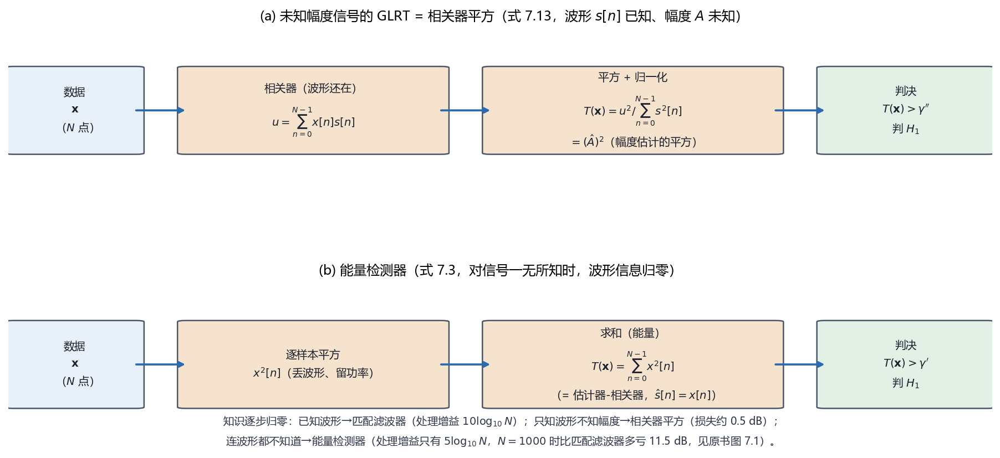

# Vol2 Ch07 具有未知参数的确定性信号：波形已知、参数未知时，GLRT 化成一排相关器

> 对应原书：第二卷《检测理论》第 7 章（书内第 646~688 页，本扫描 PDF 第 661~703 页；页码映射"书内 = PDF − 15"，PDF 662 顶栏"647"、PDF 703 顶栏"688"）。
> 前置阅读：本系列 `Vol2_Ch06_统计判决理论II.md`（GLRT、渐近卡方/非中心卡方）、`Vol2_Ch04_确定信号.md`（匹配滤波器、偏移系数 $d^2=E/\sigma^2$）；回调 `Vol1_Ch07_最大似然估计.md` 例 7.15（时延 MLE）与例 7.16（正弦参数 MLE）。本文自包含，涉及的前置概念就地插播。

## 写在前头

这是讲解系列**第二卷的第 7 篇**，对应原书第二卷《具有未知参数的确定性信号》。它在第二卷里的角色，是**GLRT 的第一个实战战场**：第 6 章把"参数未知就先用 MLE 估、再比似然"锻造成通用武器，本章把武器第一次批量用到具体信号上——**信号是确定性的、波形已知，但幅度、到达时间、频率这些参数未知**。这正是雷达与通信的日常：你知道发射的是哪个脉冲，但不知道回波的幅度（目标反射强弱未知）、不知道回波到达时间（距离未知）、有时连频率都未知（多普勒频移未知）。

本卷第 4 篇（Vol2_Ch04）埋下的伏笔，本章兑现：Vol2_Ch04 §2.3 说"未知到达时间的信号不能直接用匹配滤波器，第 7 章会给出修正（对每个可能的时延都放一个匹配滤波、取最大）"；Vol2_Ch04 §8 第 4 条说"匹配滤波对波形失配敏感，第 7 章'未知参数'正是为了放宽这个精确性要求"。**本章把第 4 章的"匹配滤波器"从"参数完全已知"的牢笼里解放出来。**

用一句话概括本章的设计目标：**当信号波形已知、少数参数未知时，把 GLRT 逐参数算出来——未知幅度给"相关器平方"、未知到达时间给"扫描相关取最大"、未知频率给"周期图峰值"，最后用经典线性模型把它们统一成一条"二次型比门限 + χ² 分布"的流水线；而知识归零的极限，就是能量检测器。**

**实测声明**：本文所有内容与数字均经 OCR 核对原书扫描件（PDF 第 661~703 页，OCR 文本存于 `Temp/chapters_ocr/v2ch07/`），不是凭印象转述。公式编号（7.1）~（7.40）沿用原书编号；图 Fig028 为本系列自建数据流示意图（脚本 `Temp/scripts/make_fig028.py`），结论对应原书（7.3）（7.13）式与图 7.1。正文中由模型自算的派生数字（如处理增益的 dB 换算、$Q$ 函数取值）已就地标注，与原书 OCR 数字严格区分。

---

## 1. 问题：信号"半已知"——波形在、参数不在

### 1.1 问题驱动：为什么"波形已知"还是不够？

第 4 章的匹配滤波器是整个检测理论里"最有利"的场景：信号 $s[n]$ **完全已知**（波形、幅度、到达时间一个不缺），噪声是方差 $\sigma^2$ 的 WGN。但原书 §7.1 一上来就把这个前提的现实短板摆出来：**实际中"最为重要的是不完全已知信号的检测"**——信号知识的缺乏可能来自移动无线电中的不确定辐射效应，也可能来自决定股票市场趋势的信号产生机制未知。原书 §7.3 给了一个更贴近检测场景的通用模型：

> 对于含有不确定因素的确定性信号，一般模型是"**除了少数参数之外完全已知**"的模型。例如 $s[n]=A\cos(2\pi f_0 n+\Phi)$，我们不知道参数集 $\{A,f_0,\Phi\}$ 的值，或这些参数的某个子集的值。

**翻译成人话：信号的长相（波形）我们知道，但"多大"（幅度 $A$）、"什么时候到"（时延 $n_0$）、"在哪个频率"（$f_0$）这些参数不知道。** 这就是复合假设检验（第 6 章）登场的地方——PDF 含未知参数，NP 定理（第 3 章"宪法"）直接失效。

### 1.2 两条路，以及为什么本章主走 GLRT

原书 §7.1 把第 6 章的两条补救路线再摆一遍：把未知参数当**确定但未知**的数 → 用 **GLRT**（估出来塞进似然比）；把未知参数当**随机变量的现实** → 用**贝叶斯方法**（给先验、积分掉）。两条路的基本原理不同，"直接的比较也是不可能的"，但原书给出了明确的工程取舍：

1. **UMP 通常不存在**：对典型的未知确定性信号参数，一致最大势（UMP）检验——对参数所有取值、给定 $P_{FA}$ 下 $P_D$ 最高的检验——**通常不存在**。GLRT 是准最佳的，但"通常能得到好的性能"，大数据记录下可证在不变检测器类中是 UMP（Lehmann 1959）。
2. **透视检测器是上界**：假定未知参数完全已知时设计的 NP 检测器，性能是任何可实现检测器的**上限**。原书说 GLRT 相对透视检测器的损失"相当小"（第 6 章在 WGN 中未知 DC 电平的例子已演示）。
3. **贝叶斯方法的代价**：导出检测器在 NP 意义下最佳（未知参数被积分掉了），但"困难在于要指定先验 PDF 以及执行积分运算"；而且如果未知参数注定是确定性的、或先验与真实不符，检测器"就不能声称是最佳的"。
4. **GLRT 的工程优势**：原书明说"从实际的观点来看，GLRT 通常是易于实现的，因为它只要求最大值而不是积分。将数值求最大值作为最后的一种手段通常是比较简单的。"

**一句话总结：本章的立场是——先承认"参数未知"让最优检测器消失，然后押注在"实现简单、性能接近上界"的 GLRT 上；需要先验和多重积分的贝叶斯方法只在少数可解析处露面（§2.2、§4 的对比）。**

---

## 2. 知识有多值钱：先立两块基准——匹配滤波器与能量检测器

### 2.1 问题从哪来：丢了参数，性能到底损失多少？

在动手推导具体检测器之前，原书 §7.3 先问了一个"为什么"级别的预算问题：**信号知识究竟值多少 dB？** 有了这个基准，后面每一节"丢了某个参数"的代价才能定量。

两个极端很好立。**上界**是匹配滤波器（透视检测器）：信号完全已知时，性能由（4.14）式给出，即

$$
P_D = Q\!\Bigl(Q^{-1}(P_{FA}) - \sqrt{d^2}\Bigr), \qquad d^2 = \frac{E}{\sigma^2} \tag{7.1}
$$

其中 $Q(\cdot)$ 为标准正态右尾，$Q^{-1}$ 为其逆，$d^2$ 为偏移系数（第 3 章 §3.3 的定义），$E=\sum_{n=0}^{N-1}s^2[n]$ 为信号能量，$\sigma^2$ 为噪声方差。**这个式子说明什么：检测性能由 $E/\sigma^2$ 这一个量（能量噪声比 ENR）决定；它成立的条件是信号完全已知 + WGN，一旦参数未知，它就退化成一个不可实现的上界。**

**下界**是能量检测器：原书 §7.3 先问"如果对信号一无所知怎么办"。设 $s[n]$ 确定但完全未知，此时 $H_1$ 下的 MLE 是 $\hat{s}[n]=x[n]$（每个信号样本直接用数据去估），代入似然比、取对数，得到（式 7.3）

$$
T(\mathbf{x}) = \sum_{n=0}^{N-1} x^2[n] > \gamma' \ \Rightarrow\ 判 H_1 \tag{7.3}
$$

其中 $\gamma'$ 为门限。**翻译成人话：对信号一无所知时，唯一能认的只有"信号会让总功率变大"，于是把数据平方求和、和门限比——这就是能量检测器。** 原书还点破（式 7.4）：它等价于估计器-相关器形式

$$
T(\mathbf{x}) = \sum_{n=0}^{N-1} x^2[n] = \sum_{n=0}^{N-1} x[n]\,\hat{s}[n], \qquad \hat{s}[n] = x[n] \tag{7.4}
$$

即"用数据自己当信号的估计，再和 数据相关"——第 5 章"检测器里长出一个估计器"的极端退化版（估计器直接就是恒等映射）。

### 2.2 引入理论：两笔"处理增益"的实账

原书用**偏移系数**把两种检测器的性能并排（推导见附录 7A，§7.3 正文给出结论）。匹配滤波器（透视）的偏移系数是（式 7.6）

$$
d^2_{MF} = \frac{E}{\sigma^2} \tag{7.6}
$$

而能量检测器在大数据记录下的偏移系数是（式 7.5，附录 7A 证明）

$$
d^2_{ED} = \frac{(E/\sigma^2)^2}{2N} \tag{7.5}
$$

其中 $N$ 为数据长度。**这两个式子放在一起，就是本章最重要的第一笔账。** 对 WGN 中的 DC 电平（$s[n]=A$，$E=NA^2$），给定同样的偏移系数 $d^2$（因而同样的检测性能 $P_D$），两种检测器要求的输入 SNR $\eta = A^2/\sigma^2$ 分别为（原书 §7.3，推导见正文）：

$$
10\log_{10}\eta_{MF} = 10\log_{10} d^2 - 10\log_{10} N \quad (\text{dB})
$$

$$
10\log_{10}\eta_{ED} = 5\log_{10} d^2 + 1.5 - 5\log_{10} N \quad (\text{dB})
$$

**翻译成人话：把数据长度 $N$ 加倍，匹配滤波器能省 10 dB 的输入 SNR，而能量检测器只省 5 dB。** 原书的结论一句话钉死：

> **匹配滤波器的处理增益是 $10\log_{10}N$，而能量检测器的处理增益是 $5\log_{10}N$。这也是由于缺乏信号的知识而要付出的代价。**

原书图 7.1 给了一个具体数字锚点：**$N=1000$ 时，能量检测器比匹配滤波器多亏 11.5 dB**。原因是本质性的——原书 §7.3 原话："匹配滤波器相干地组合数据（$T(\mathbf{x})=\sum x[n]s[n]$），而能量检测器是非相干地组合数据（$T(\mathbf{x})=\sum x^2[n]$）。相干组合迅速地减少了噪声（习题 7.8）。" **翻译成人话：匹配滤波先按波形加权再把符号对齐叠加，噪声正负抵消得快；能量检测先平方（丢掉符号）再叠加，噪声只增不减。**

### 2.3 性质与限制：能量检测器的天花板，和一个伏笔

能量检测器的**好处**是极度简单（不需要知道信号波形，$N$ 次平方求和）。但它的**限制**必须现在就说清，因为它是后面所有"部分已知"检测器的对照基准：

1. **它把波形信息全部扔掉**：处理增益只有 $5\log_{10}N$，比匹配滤波器少一半。对"部分已知"的信号（只有几个未知参数），原书明确说"我们可以期待得到介于匹配滤波器和能量检测器之间的检测性能"——这正是本章后续各节的位置。
2. **门限依赖噪声方差 $\sigma^2$**：$\gamma'$ 要按 $\sigma^2$ 标定（(7.3) 式是"平方和"统计量，其 $H_0$ 下分布是 $\chi^2_N$，门限 $=\sigma^2\times$ 标准门限）。**翻译成人话：噪声电平一漂，能量检测器的门限就得跟着重算；它自己不知道噪声变没变。** 这是后面要兑现的一个伏笔——**第 9 章（未知噪声参数、CFAR）存在的理由，正是"噪声方差也未知时怎么定门限"。**

图 Fig028 把两个极端并排画出：

*图 Fig028：未知参数确定性信号的两个检测器（自建数据流示意，对应原书（7.13）（7.3）式）。(a) 未知幅度信号的 GLRT = 相关器平方：数据与已知波形 $s[n]$ 相关、平方、除以信号能量 $\sum s^2[n]$，再与门限比——只丢了幅度符号；(b) 能量检测器：对信号一无所知时，逐样本平方再求和、与门限比。看一件事：**知识逐步归零，检测器从"按波形加权"退化成"只认功率"，处理增益从 $10\log_{10}N$ 掉到 $5\log_{10}N$**（$N=1000$ 时差 11.5 dB，原书图 7.1）——这是"信号知识值多少钱"的一笔实账。*

**一句话总结：匹配滤波器（知识满格）与能量检测器（知识归零）是性能的上界与下界；本章所有"部分已知"检测器都落在两者之间，而 GLRT 正是把它们逐个算出来的那台机器。**

---

## 3. 未知幅度：GLRT = 相关器平方——能量在信号方向上的投影

### 3.1 问题从哪来：幅度 $A$ 未知，符号也未知

现在处理第一个也是最常见的"部分已知"：信号 $s[n]$ 已知、幅度 $A$ 未知（式 7.8 前的模型）：

$$
H_0:\ x[n] = w[n], \qquad H_1:\ x[n] = A\,s[n] + w[n], \quad n=0,1,\ldots,N-1
$$

其中 $w[n]$ 为方差 $\sigma^2$ 的 WGN。原书 §7.4 先花了一点篇幅问"UMP 存在吗"：**如果 $A$ 的符号已知（比如 $A>0$），UMP 存在**——假定 $A$ 已知构造 NP 检验，会发现检验统计量 $\sum x[n]s[n]$ 与门限都与 $A$ 无关（式 7.9、7.10），所以这个相关器结构对 $A>0$（或 $A<0$）的所有取值都最优。**但如果 $A$ 的符号未知，UMP 不存在**：$A>0$ 时最优检验是 $\sum x[n]s[n]>\gamma'$（右尾），$A<0$ 时是 $\sum x[n]s[n]<-\gamma'$（左尾），两个不同的检验取决于未知符号（这正是第 6 章例 6.2 的"双边无 UMP"定理）。**翻译成人话：幅度未知已经很麻烦，符号也未知就彻底没有"一刀切最优"了，必须上 GLRT 或贝叶斯。**

### 3.2 引入理论：GLRT 化简成相关器平方

GLRT 的思路照搬第 6 章：在 $H_1$ 下求 $A$ 的 MLE，再代入似然比。$A$ 的 MLE（式 7.11，习题 7.11）是

$$
\hat{A} = \frac{\sum_{n=0}^{N-1} x[n]s[n]}{\sum_{n=0}^{N-1} s^2[n]} \tag{7.11}
$$

其中分子是数据与信号的内积、分母是信号能量。**翻译成人话：$\hat{A}$ 就是"数据里信号方向上的投影长度"——把数据投影到已知波形方向上，看这个方向上有多少能量。** 代入似然比、取对数、化简（推导见原书 §7.4.1），GLRT 判 $H_1$ 当且仅当

$$
T(\mathbf{x}) = \frac{\left(\sum_{n=0}^{N-1} x[n]s[n]\right)^2}{\sum_{n=0}^{N-1} s^2[n]} > \gamma'' \tag{7.13}
$$

其中 $\gamma''$ 为门限。**这就是"相关器平方"：先相关、再平方、除以信号能量。** 平方来自"幅度符号未知"——我们不在乎 $A$ 是正是负，只在乎"幅度估计值 $|\hat{A}|$ 是否显著偏离零"（原书原文："对于只有噪声的时候，我们期待 $\hat{A}\approx0$（由于 $E(\hat{A})=0$），并且当信号出现的时候，$|\hat{A}|$ 应该偏离零点。因此，基于幅度大小的估计的检测器也不是没有道理的。"）。

### 3.3 能解决什么：性能闭式，代价约 0.5 dB

（7.13）式的统计量 $u=\sum x[n]s[n]$ 是高斯样本的线性组合，仍为高斯：$H_0$ 下 $u\sim\mathcal{N}(0,\sigma^2\sum s^2[n])$，$H_1$ 下 $u\sim\mathcal{N}(A\sum s^2[n],\sigma^2\sum s^2[n])$。平方取绝对值后是双尾，虚警率为（式 7.15，双尾结构）

$$
P_{FA} = \Pr\{|u| > \sqrt{\gamma''};\ H_0\} = 2Q\!\left(\frac{\sqrt{\gamma''}}{\sqrt{\sigma^2\sum s^2[n]}}\right)
$$

于是检测率（式 7.16）

$$
P_D = Q\!\Bigl(Q^{-1}(P_{FA}/2) - \sqrt{d^2}\Bigr) + Q\!\Bigl(Q^{-1}(P_{FA}/2) + \sqrt{d^2}\Bigr), \qquad d^2 = \frac{A^2\sum_{n=0}^{N-1}s^2[n]}{\sigma^2} \tag{7.16}
$$

其中偏移系数 $d^2 = A^2\sum s^2[n]/\sigma^2 = E_A/\sigma^2$（$E_A$ 是实际幅度下的信号能量）。**这个式子说明什么性质：性能与"已知 $A$"的（7.1）式同形，只是门限从 $Q^{-1}(P_{FA})$ 变成 $Q^{-1}(P_{FA}/2)$**——因为双尾各摊一半虚警。原书图 7.3 把 GLRT 与透视检测器（已知 $A$）并排画出，结论是：**对低的 $P_{FA}$，在 ENR 上大约有 0.5 dB 的衰减**——"幅度知识的缺乏将使检测性能降低，但从相关器的性能来看只有轻微的下降。" **这是本章第一笔精确的"知识损失账"：不知道幅度符号，只值 0.5 dB。** 原书还指出，这个结果用 §6 的经典线性模型理论（定理 7.1）也能很简单地得出。

### 3.4 性质与限制

- **成立的代价**：GLRT 是准最佳的（不是有限样本最优），但原书说它性能接近透视上界；这个 0.5 dB 就是它相对透视检测器的代价。
- **（7.16）式的条件**：噪声必须是 WGN、$s[n]$ 完全已知、$f_0$ 不在 0 或 1/2 附近（这个限制在 §4 的正弦里会再出现，因为幅度 MLE（7.11）式在那个前提下才精确）。
- **贝叶斯对照**（§7.4.2）：若把 $A$ 看成随机变量 $A\sim\mathcal{N}(\mu_A,\sigma_A^2)$ 且与噪声独立，这是贝叶斯线性模型 $\mathbf{x}=\mathbf{s}A+\mathbf{w}$（$\mathbf{s}=[s[0]\cdots s[N-1]]^T$），由第 5 章（5.30）式可得 NP 检测器（式 7.18，据 Kay 原书英文版校订整理）：

$$
T(\mathbf{x}) = \frac{\mu_A}{\sigma^2+\sigma_A^2\,\mathbf{s}^T\mathbf{s}}\,\mathbf{x}^T\mathbf{s}
+ \frac{\sigma_A^2}{2\sigma^2(\sigma^2+\sigma_A^2\,\mathbf{s}^T\mathbf{s})}\,(\mathbf{x}^T\mathbf{s})^2 \tag{7.18}
$$

**翻译成人话：贝叶斯版是"相关器 + 平方相关器"的组合——$\mu_A\neq0$ 时相关器（线性项）认均值，$\sigma_A^2$ 项（二次项）认幅度随机性。** 若 $\mu_A=0$，退化成平方相关器。**代价照实说**：它要求 $\mu_A$ 和 $\sigma_A^2$ 的先验知识；信息可用时它是 NP 最优（强于 GLRT 的准最佳），信息不可用时（先验与真实不符）它"不能声称是最佳的"——这是贝叶斯方法一贯的"先验换最优"交易。

**一句话总结：未知幅度（符号也未知）时，GLRT 就是"相关器平方"——先投影到信号方向、再看投影长度的平方是否超门限；代价是相对透视检测器约 0.5 dB，而省下的是"不必知道 $A$ 的符号"。**

---

## 4. 未知到达时间：扫描互相关取最大（与第一卷例 7.15 合流）

### 4.1 问题从哪来：信号不知道什么时候到

雷达是教科书式的场景：一次检测指示一个目标飞行器，它的**双程延迟用来估计距离**（第一卷 §3，第 44~46 页）。原书 §7.5 的模型是

$$
H_0:\ x[n] = w[n], \qquad H_1:\ x[n] = s[n-n_0] + w[n], \quad n=0,1,\ldots,N-1
$$

其中 $s[n]$ 已知、在区间 $[0,M-1]$ 上非零，$n_0$ 是未知延迟，观测区间 $[0,N-1]$ 包含所有可能的延迟。**翻译成人话：你知道目标发来的脉冲长什么样，但不知道它压在哪一段数据上——于是"信号在不在"和"信号在哪"变成了同一个问题。**

### 4.2 引入理论：GLRT = 对每个可能时延相关、取最大

这一步直接和第 1 卷例 7.15 合流。原书指出：$n_0$ 的 MLE 已由第一卷（第 158~159 页）给出，是通过对所有可能的 $n_0$ 最大化

$$
\sum_{n=n_0}^{n_0+M-1} x[n]\,s[n-n_0] \tag{7.19}
$$

即"把数据与可能的延迟信号相关，选择使（7.19）式相关最大的 $n_0$"。代入似然比（推导见原书 §7.5），GLRT 判 $H_1$ 当且仅当（式 7.21）

$$
T(\mathbf{x}) = \max_{n_0 \in [0, N-M]} \sum_{n=n_0}^{n_0+M-1} x[n]\,s[n-n_0] > \gamma' \tag{7.21}
$$

**翻译成人话：对每一个可能的到达时间，把数据与"该时延对应的回波模板"做一次互相关，取最大的那个相关值，与门限比；超过门限就判"有信号"，并且峰值位置就是时延的 MLE。** 这正是第 4 章匹配滤波器"对每个时延放一个匹配滤波、取最大"的修正——原书图 7.4 画的就是"在 $n_0$ 上选最大值"的实现框图。

**回调**：第一卷第 7 篇（Vol1_Ch07）例 7.15 早已证明"时延 MLE = 相关最大的时延"，并说"匹配滤波器是高斯噪声假设下最大似然的必然产物，作为检测器最优的完整论证在第二卷第 4 章"。**本章在这里把估计与检测彻底合流：同一个"扫描相关取最大"的结构，既是时延的 MLE，又是信号的 GLRT 检测器。** 原书原话："GLRT 可以作为一个检测器或估计器。"

### 4.3 性质与限制：两个推广，一个"算不动"

原书接着给两个推广和一个坦白：

1. **非整数延迟**（式 7.22）：延迟必须小于采样区间时，（7.21）式不方便，可转到频域

$$
T(\mathbf{x}) = \max_{n_0} \int X(f)\bigl[S(f)\,e^{-j2\pi f n_0}\bigr]^{*}\,df \tag{7.22}
$$

其中 $X(f)=\sum x[n]e^{-j2\pi fn}$、$S(f)=\sum s[n]e^{-j2\pi fn}$ 是数据和信号的傅里叶变换（由 Parseval 定理证得，习题 7.14）。**翻译成人话：频域形式用 $e^{-j2\pi f n_0}$ 的连续相位实现任意分数延迟，不再受"采样点对齐"限制。**

2. **幅度也未知**（式 7.23）：如果 $n_0$ 和 $A$ 都未知，把 §3 的平方搬进来（习题 7.15）：

$$
T(\mathbf{x}) = \max_{n_0 \in [0, N-M]} \left(\sum_{n=n_0}^{n_0+M-1} x[n]\,s[n-n_0]\right)^2 > \gamma' \tag{7.23}
$$

即"相关取最大"升级成"相关平方取最大"。

3. **性能难以闭式求解**：原书坦率地说"GLRT 的检测性能的确定是很困难的"——根据（7.21）式，需要计算 $N-M+1$ 个相关高斯随机变量的**最大值**的 PDF，且它们**相关**（因为相同的噪声样本进入不同的和式）。原书对此"并不做进一步深究"，指向例 7.5 与习题 7.13。**这是"扫描取最大"的结构性代价：统计量是一个随机场的峰值，性能分析远比单个相关器难。**

**一句话总结：未知到达时间 = 对每个可能时延做相关、取最大；这把第 4 章匹配滤波器的"固定对齐"打掉，代价是统计量变成相关高斯随机变量的最大值、性能难算。**

---

## 5. 正弦信号检测：周期图峰值 vs 门限（与第一卷例 7.16 合流）

### 5.1 问题从哪来：正弦是"雷达/声纳/通信"的公共语言

原书 §7.6 开门见山："在 WGN 中的正弦信号检测是许多领域中的常见问题。由于其应用的广泛性……其结果形成了许多实际领域如雷达、声纳和通信系统的理论基础。" 一般模型是 $H_1:\ x[n]=A\cos(2\pi f_0 n+\Phi)+w[n]$，参数集 $\{A,f_0,\Phi\}$ 的**任意子集未知**。原书按"未知参数越来越多"排了四档，正好是一条"知识逐步归零"的阶梯：

| 档位 | 未知参数 | GLRT 统计量 | 原书编号 |
|------|---------|------------|---------|
| 1 | 幅度 $A$ | 相关器平方（固定 $f_0,\Phi$） | (7.24) |
| 2 | 幅度 $A$ + 相位 $\Phi$ | 周期图 $I(f_0)$（固定 $f_0$） | (7.25) |
| 3 | $A,\Phi$ + 频率 $f_0$ | 周期图峰值 $\max I(f)$ | (7.30) |
| 4 | $A,\Phi,f_0$ + 到达时间 $n_0$ | 谱图峰值 $\max I_{n_0}(f)$ | (7.33) |

这四档的推导链是本章最漂亮的地方：**每多一个未知参数，就在上一个统计量上多取一层"最大/平方"，直到最后变成"谱图峰值"——主动声纳和雷达的标准形式。**

### 5.2 幅度未知：相关器平方（§7.6.1）

信号 $A\,s[n]$ 且 $s[n]=\cos(2\pi f_0 n+\Phi)$ 已知，这就是 §3 的精确场景。GLRT（式 7.24）

$$
T(\mathbf{x}) = \left(\sum_{n=0}^{N-1} x[n]\cos(2\pi f_0 n+\Phi)\right)^2 > \gamma' \tag{7.24}
$$

性能由（7.16）式给出，偏移系数 $d^2 = NA^2/(2\sigma^2)$（因为 $\sum\cos^2\approx N/2$）。幅度 MLE 由（7.11）式给出，$f_0$ 不在 0 或 1/2 附近时成立。

### 5.3 幅度和相位未知：周期图（§7.6.2）

相位 $\Phi$ 也未知时，必须先限定 $A>0$（否则 $A$ 与 $\Phi$ 的两组值会产生相同信号，参数无法辨识——原书让读者想想 $A=1,\Phi=0$ 与 $A=-1,\Phi=\pi$ 的情况）。用参数变换 $\alpha_1=A\cos\Phi,\ \alpha_2=-A\sin\Phi$（第一卷例 7.16 的同一招），把信号重写成 $\alpha_1\cos(2\pi f_0 n)+\alpha_2\sin(2\pi f_0 n)$，消去 $\alpha_1,\alpha_2$ 后，GLRT 判 $H_1$ 当且仅当（式 7.25）

$$
I(f_0) > \gamma' , \qquad I(f_0) = \frac{1}{N}\left|\sum_{n=0}^{N-1} x[n]\,e^{-j2\pi f_0 n}\right|^2 \tag{7.25}
$$

其中 $I(f_0)$ 是数据在已知频率 $f_0$ 处的**周期图**。**翻译成人话：相位随机，信号可能落在同相（I）或正交（Q）任一通道上，所以两个通道都相关、取平方和——这就是"正交/非相干匹配滤波器"，等价于"算 $f_0$ 处的周期图"。** 原书图 7.5(b) 画了两种等价实现（正交匹配滤波器 vs 周期图）。**回调**：第一卷第 7 篇例 7.16 早已证明"找正弦 = 找频谱最高峰是 MLE 的化身"；本章把它升级成检测器——**同一个周期图，既是正弦三参数的 MLE 来源，又是 GLRT 的统计量。**

性能（式 7.26、7.28）：$I(f_0)/(\sigma^2/2)$ 在 $H_0$ 下服从中心 $\chi^2_2$、$H_1$ 下服从非中心 $\chi^2_2(\lambda)$，其中非中心参量 $\lambda = NA^2/(2\sigma^2)$。于是

$$
P_{FA} = \exp\!\left(-\frac{\gamma'}{\sigma^2}\right) \tag{7.26}
$$

$$
P_D = Q_{\chi^2_2(\lambda)}\!\left(2\ln\frac{1}{P_{FA}}\right), \qquad \lambda = \frac{NA^2}{2\sigma^2} \tag{7.28}
$$

其中 $Q_{\chi^2_2(\lambda)}(\cdot)$ 为自由度 2、非中心参量 $\lambda$ 的非中心卡方右尾（用附录 2D 的 MATLAB 程序 `Qchipr2.m` 计算）。**这个式子说明什么：$P_{FA}$ 是指数衰减（因为 $\chi^2_2$ 就是均值为 2 的指数分布），性能由 $\lambda=NA^2/(2\sigma^2)$ 一个量决定；它成立的条件是 $f_0$ 不在 0 或 1/2 附近（否则 $\sum\cos^2\approx N/2$ 的近似失效）。** 原书图 7.6(b) 画了性能曲线：**相对只知幅度的情形（图 7.6a），对小的 $P_{FA}$ 衰减小于 1 dB**——"相位未知"只再值不到 1 dB。

### 5.4 幅度、相位、频率都未知：周期图峰值（§7.6.3）

频率 $f_0$ 也未知时，GLRT 要在 $f_0$ 上最大化似然比，最终化简为（式 7.30）

$$
T(\mathbf{x}) = \max_{f_0} I(f_0) > \gamma' \tag{7.30}
$$

**翻译成人话：扫一遍频率，取周期图的峰值，和门限比；超过门限就判"有正弦"，峰值位置就是频率的 MLE。** 原书点破这一结构的分量："这就解释了为什么周期图或者它的快速傅里叶变换（FFT）实现几乎是所有窄带检测系统的基本组成部分。" 性能与 §5.3 几乎相同，"惟一的差别是 $P_{FA}$ 随搜索的频率数的增加而增加"——假定用 $N$ 点 FFT 在 $k/N$（$k=1,2,\ldots,N/2-1$）上取最大，则（式 7.31）

$$
P_D = Q_{\chi^2_2(\lambda)}\!\left(2\ln\frac{1}{1-(1-P_{FA})^{1/(N/2-1)}}\right) \tag{7.31}
$$

**翻译成人话：峰值要在 $N/2-1$ 个（近似独立的）频率单元里挑，所以每个单元的有效虚警被摊薄成 $1-(1-P_{FA})^{1/(N/2-1)}$，门限随之抬高——"搜索越宽，门限越高，这是为频率自由付出的代价"。**

### 5.5 到达时间也未知：谱图峰值（§7.6.4）

四参数全未知时，GLRT 对所有延迟和频率取周期图的最大值（式 7.33）

$$
T(\mathbf{x}) = \max_{n_0, f_0} I_{n_0}(f_0) > \gamma', \qquad I_{n_0}(f_0) = \frac{1}{M}\left|\sum_{n=n_0}^{n_0+M-1} x[n]\,e^{-j2\pi f_0 n}\right|^2 \tag{7.33}
$$

其中 $I_{n_0}(f_0)$ 称为**短时周期图或谱图**。**翻译成人话：把所有可能的延迟、所有可能的频率的周期图全算出来，取最大的那个峰值；峰值的位置同时给出延迟 MLE 和频率 MLE。** 原书说"这种检测器是主动式声纳和雷达的标准形式"。

原书图 7.7 给了一个实况（参数 $A=1$、$f_0=0.25$、$\Phi=0$、$M=128$、$n_0=128$、$N=512$、$\sigma^2=0.5$，SNR $=A^2/(2\sigma^2)=1$ 即 0 dB）：虽然低 SNR 下时间序列里看不出信号，但谱图峰值清楚地位于正确频率与时延处；且**频率估计 $\hat{f}_0=0.25$ 比时延估计 $\hat{n}_0=141$ 精确**（真实 $n_0=128$）。原书解释："由于谱峰的形状，频率估计要比时延估计精确。可以证明这一结论在一般情况下是对的，并且可以用 CRLB 预测。有关 CRLB 的讨论以及与信号模糊函数的关系请参考 [Van Trees 1971]。" **翻译成人话：谱峰在频率方向尖、在时延方向宽，所以频率估得准、时延估得粗——这是模糊函数的形状决定的，不是本例的偶然。**

**一句话总结：正弦检测的四档阶梯把"知识逐步归零"走了一遍——未知幅度给相关器平方、再加相位给周期图、再加频率给周期图峰值、再加时延给谱图峰值；每加一个未知参数，代价是从 0.5 dB 到 1 dB 到"门限随搜索单元数抬高"。**

---

## 6. 经典线性模型：χ² 分布与渐近性能的统一框架

### 6.1 问题从哪来：前面每个例子都"从头推一遍似然比"，能不能一次推完？

§3~§5 的每个检测器都是"代入高斯 PDF → 取对数 → 化简"，模式高度重复。原书 §7.7 问：**能不能把"线性模型 + 参数未知"的 GLRT 一次性写成通用公式？** 答案是**经典线性模型**（第一卷 §4）：数据 $\mathbf{x}=\mathbf{H}\boldsymbol{\theta}+\mathbf{w}$，其中 $\mathbf{H}$ 为已知 $N\times p$ 满秩观测矩阵、$\boldsymbol{\theta}$ 为 $p\times1$ 参数矢量、$\mathbf{w}\sim\mathcal{N}(\mathbf{0},\sigma^2\mathbf{I})$。检验问题（式 7.34）

$$
H_0:\ \mathbf{A}\boldsymbol{\theta} = \mathbf{b}, \qquad H_1:\ \mathbf{A}\boldsymbol{\theta} \neq \mathbf{b} \tag{7.34}
$$

其中 $\mathbf{A}$ 是已知 $r\times p$（$r\le p$）满秩矩阵、$\mathbf{b}$ 是已知 $r\times1$ 矢量，$\mathbf{A}\boldsymbol{\theta}=\mathbf{b}$ 是**一致**的线性方程组（至少一个解）。**翻译成人话：我们想检验"参数矢量的 $r$ 个线性组合是否等于某给定值"——未知幅度是 $r=1,\mathbf{A}=[1],\mathbf{b}=0$ 的特例（例 7.1）；未知幅度+相位正弦是 $r=2,\mathbf{A}=\mathbf{I},\mathbf{b}=\mathbf{0}$ 的特例（例 7.2）。**

### 6.2 引入理论：定理 7.1（本章的核心定理）

**定理 7.1（经典线性模型的 GLRT）**：对上述模型，GLRT 判 $H_1$ 当且仅当（式 7.35）

$$
T(\mathbf{x}) = 2\ln L_G(\mathbf{x}) = \frac{(\mathbf{A}\hat{\boldsymbol{\theta}}_1 - \mathbf{b})^T[\mathbf{A}(\mathbf{H}^T\mathbf{H})^{-1}\mathbf{A}^T]^{-1}(\mathbf{A}\hat{\boldsymbol{\theta}}_1 - \mathbf{b})}{\sigma^2} > \gamma' \tag{7.35}
$$

其中 $\hat{\boldsymbol{\theta}}_1 = (\mathbf{H}^T\mathbf{H})^{-1}\mathbf{H}^T\mathbf{x}$ 是 $H_1$ 下的（无约束）MLE。精确检测性能：$H_0$ 下 $T(\mathbf{x})\sim\chi^2_r$（中心卡方），$H_1$ 下 $T(\mathbf{x})\sim\chi^2_r(\lambda)$（非中心卡方），非中心参量

$$
\lambda = \frac{(\mathbf{A}\boldsymbol{\theta}_1 - \mathbf{b})^T[\mathbf{A}(\mathbf{H}^T\mathbf{H})^{-1}\mathbf{A}^T]^{-1}(\mathbf{A}\boldsymbol{\theta}_1 - \mathbf{b})}{\sigma^2}
$$

其中 $\boldsymbol{\theta}_1$ 是 $H_1$ 下的真值（推导见附录 7B）。**这个式子说明什么性质，逐条拆开：**

1. **结构 = "参数的估计值离 $\mathbf{b}$ 有多远"的加权二次型**。$\mathbf{A}\hat{\boldsymbol{\theta}}_1-\mathbf{b}$ 是"估计出的线性组合"与"零假设声称的值"之差，中间夹的 $[\mathbf{A}(\mathbf{H}^T\mathbf{H})^{-1}\mathbf{A}^T]^{-1}$ 是这个差值的协方差的逆（Fisher 信息加权）。**翻译成人话：GLRT 就是问"参数的 MLE 离零假设有多远，远到超过门限就判信号"。**
2. **自由度数 $r$ = 被检验的约束个数**，不是参数总数 $p$。只测一个约束（$A=0$）就是 $\chi^2_1$；测两个（$A=0,\Phi$ 任意）就是 $\chi^2_2$。**这与第 6 章（6.23）式的渐近卡方口径完全一致。**
3. **渐近 = 有限样本精确**：原书点出一个"有趣的"事实——经典线性模型的渐近 GLRT 性能（第 6 章）**与定理给出的有限数据记录精确地相同**（因为高斯线性模型下 $\hat{\boldsymbol{\theta}}_1$ 本身就是精确高斯的，不需要渐近）。**这是"渐近结果提前兑现为精确结果"的第二个实例**（第一个是第 6 章例 6.6）。

原书 §7.7 末尾给出两个重要的等价解释：检验 $\boldsymbol{\theta}=\mathbf{0}$ vs $\boldsymbol{\theta}\neq\mathbf{0}$ 时（$\mathbf{A}=\mathbf{I},\mathbf{b}=\mathbf{0}$），GLRT 化简为

$$
T(\mathbf{x}) = \frac{\hat{\mathbf{s}}^T\hat{\mathbf{s}}}{\sigma^2}, \qquad \hat{\mathbf{s}} = \mathbf{H}\hat{\boldsymbol{\theta}}_1
$$

即"**将估计信号的能量与门限进行比较**"，也可写成 $T(\mathbf{x})=\hat{\boldsymbol{\theta}}_1^T\mathbf{C}_{\hat{\theta}}^{-1}\hat{\boldsymbol{\theta}}_1$（$\mathbf{C}_{\hat{\theta}}=\sigma^2(\mathbf{H}^T\mathbf{H})^{-1}$ 是估计协方差）——**与已知信号的情况（第 4 章 §4.6）完全同形，只是信号由它的 MLE 代替**；另一种解释是估计器-相关器（习题 7.24）。

### 6.3 能解决什么：三个例子收账

- **例 7.3（未知幅度，续）**：$\mathbf{H}=[s[0]\cdots s[N-1]]^T$、$r=p=1$、$\mathbf{A}=[1]$、$\mathbf{b}=0$。代入（7.35）：$T(\mathbf{x})=(\sum x[n]s[n])^2/(\sigma^2\sum s^2[n])$，当门限取 $2\ln\gamma$ 时与（7.13）式完全一致；性能正是（7.16）式（推导见原书：$\chi^2_1(\lambda)$ 的平方根是 $z\sim\mathcal{N}(\sqrt{\lambda},1)$，双尾化即得两个 $Q$ 项）。
- **例 7.4（DC 偏移补偿，多余参数）**：若数据里还叠加了未知 DC 偏移 $\mu$（放大器偏压、图像像素非负、财经数据非负所致），模型 $H_0:\ x[n]=\mu+w[n]$，$H_1:\ x[n]=As[n]+\mu+w[n]$，其中 $A$、$\mu$ 都未知，$\mu$ 是**多余参数**。这是线性模型 $\mathbf{H}=[\mathbf{s}\ \mathbf{1}]$、$\boldsymbol{\theta}=[A\ \mu]^T$、$\mathbf{A}=[1\ 0]$、$\mathbf{b}=0$。代入（7.35）化简后，检验统计量变成

$$
T(\mathbf{x}) = \frac{\left(\sum_{n=0}^{N-1}(x[n]-\bar{x})s[n]\right)^2}{\sigma^2\sum_{n=0}^{N-1}s^2[n]}
$$

其中 $\bar{x}=\frac1N\sum x[n]$ 为样本均值。**翻译成人话：先减掉样本均值（把 DC 偏移估掉），再相关、平方——"我们在相关前减去数据的样本均值然后平方，可以得到直观的结果"。** 这是多余参数如何"顺路"进线性模型的一个样板：**我们对 $\mu$ 没兴趣，但它未知，所以必须先估计它。**

**一句话总结：经典线性模型把本章所有"部分已知"检测器收进一条公式（7.35）——二次型比门限 + χ²/非中心 χ² 分布，自由度数 = 被检验的约束个数；多余参数（例 7.4 的 $\mu$）只是让 $\mathbf{H}$ 多一列、$\mathbf{A}$ 多一个 0。**

---

## 7. 落地：主动声纳/雷达的距离-多普勒图，与正弦干扰抑制

### 7.1 问题从哪来：谱图峰值这个"标准形式"，性能怎么算？

§5.5 说"谱图峰值是主动声纳和雷达的标准形式"，但没给性能。原书例 7.5 补上这笔账（Knight, Pridham and Kay 1981）。实际实现用 FFT 计算各频率的傅里叶变换，且**用不重叠的数据块**（块间独立，便于分析；50% 重叠是常见做法，结果近似）。把信号长度记为 $N$（FFT 长度），第 $i$ 块、第 $k$ 个频率单元的 DFT 系数记 $X_i[k]$。原书点出物理对应："由于到目标的距离取决于延迟时间，$i$ 指第 $i$ 个距离单元，而 $f$ 与多普勒（Doppler）频移有关，所以是第 $k$ 个多普勒单元。那么，谱图称为**距离-多普勒图**。"（图 7.8）

### 7.2 引入理论：搜索 $L$ 个单元的虚警与检测（式 7.36~7.38）

$H_0$ 下，每个单元的周期图统计量 $T_{i,k}(\mathbf{x})=|X_i[k]|^2/(N\sigma^2/2)\sim\chi^2_2$，且各单元独立（不重叠块 + WGN）。于是虚警率（式 7.36）

$$
P_{FA} = 1 - \left(1-\exp\!\left(-\frac{\gamma'}{\sigma^2}\right)\right)^L \tag{7.36}
$$

其中 $L = I(N/2-1)$ 是考察的距离单元数 × 多普勒单元数（$I$ 为块数）。对小的 $P_{FA}$，用 $(1-x)^L\approx 1-Lx$ 得（式 7.37）

$$
P_{FA} \approx L\exp\!\left(-\frac{\gamma'}{\sigma^2}\right) = L\cdot P_{FA}(\text{单元}) \tag{7.37}
$$

**翻译成人话：峰值要在 $L$ 个单元里挑，总虚警率近似等于"每个单元的虚警率 × 单元数"——搜索单元越多，门限必须越高，才能把总虚警压住。** 检测率（式 7.38）

$$
P_D = Q_{\chi^2_2(\lambda)}\!\left(2\ln\frac{L}{P_{FA}}\right), \qquad \lambda = \frac{NA^2}{2\sigma^2} \tag{7.38}
$$

### 7.3 能解决什么：一个完整的设计算例（含具体数字）

原书给了一个主动声纳设计例子，数字值得原样记下：

- 目标：输入 SNR $A^2/(2\sigma^2)$ 低到 **−10 dB**（即 0.1）时，达到 $P_{FA}=10^{-4}$、$P_D=0.5$；
- 最大检测距离 **5000 码**（脚注：1 码 = 3 英尺 = 0.9144 米），水中声速约 **5000 英尺/秒**，故最大双程传播延迟 **6 秒**；
- 采样率 **2000 样本/秒**（适合 1000 Hz 低通带宽），故数据记录长度 $=6\times2000=12000$ 个样本；
- 代入 $L=(N/2-1)=NI/2=6000$ 与 $A^2/(2\sigma^2)=0.1$，由（7.38）式反解，**约需正弦脉冲长度 $N=350$**（原书图 7.9 画出 $P_D$ 随 $N$ 上升、$N\approx350$ 处达 0.5）。

**翻译成人话：为了在 −10 dB 的微弱回波下、6000 个搜索单元里把虚警压到 $10^{-4}$，每个发射脉冲至少要 350 个样本那么长。** 这是"搜索自由度"直接换算成"信号长度预算"的一笔实账。

### 7.4 例 7.6 正弦干扰中的检测：把干扰的 DFT 单元作废

最后一个例子是军事应用：在窄带正弦干扰存在时检测信号（式 7.6 前）

$$
H_0:\ x[n] = B\cos(2\pi f_I n+\Phi) + w[n], \qquad H_1:\ x[n] = A\,s[n] + B\cos(2\pi f_I n+\Phi) + w[n]
$$

其中信号 $s[n]$ 除幅度 $A$ 外已知；干扰的幅度 $B$、相位 $\Phi$ 未知，但干扰频率 $f_I$ 已知。用 $\alpha_1\cos(2\pi f_I n)+\alpha_2\sin(2\pi f_I n)$ 表示干扰，这是线性模型 $\mathbf{H}=[\mathbf{s}\ \cos\ \sin]$、$\boldsymbol{\theta}=[A\ \alpha_1\ \alpha_2]^T$、$\mathbf{A}=[1\ 0\ 0]$、$\mathbf{b}=0$。代入（7.35），并假定 $f_I=l/N$ 位于第 $l$ 个 DFT 单元中心，化简为（式 7.39、7.40）

$$
T(\mathbf{x}) = \frac{\sum_{k\neq l, N-l} X[k]S^*[k]}{\sum_{k\neq l,N-l}|S[k]|^2} \quad\text{或}\quad T(\mathbf{x}) = \sum_{k\neq l,N-l}X[k]S^*[k] > \gamma' \tag{7.39, 7.40}
$$

其中 $X[k]$、$S[k]$ 是数据与信号的 DFT 系数。**翻译成人话：存在正弦干扰时，GLRT 与未知幅度情况的差别，仅仅是"把含干扰的 DFT 单元作废"——在干扰频率处不相关、不累加。** 原书解释：由于 DFT 正弦的正交性，干扰在其余单元不出现（习题 7.26）；实际中因泄漏，用数据加窗来减少到邻近单元的泄漏（Kay 1988）。**这是一个漂亮的"多余参数即干扰"的实例：把干扰当成待估的多余参数，GLRT 自动把它投影掉。**

**一句话总结：距离-多普勒图把"搜索单元数 $L$"直接写进门限与检测率（式 7.38）；正弦干扰抑制则演示了线性模型最优雅的一面——把干扰当多余参数，GLRT 自动作废它的 DFT 单元。**

---

## 8. 关键设计决策回顾

把散在正文里的"为什么"收拢。每个决策都是一个真实岔路口：

| # | 决策 | 为什么这么选 | 换一个选择会怎样 |
|---|------|------------|----------------|
| 1 | 主走 **GLRT**，贝叶斯只在可解析处露面（§1.2） | GLRT 只要求最大值而非积分，实现简单、性能接近透视上界；贝叶斯要先验 + 多重积分 | 主推贝叶斯则处处要指定先验、做积分，且先验不符时"不能声称最佳" |
| 2 | 先用**匹配滤波器 vs 能量检测器**立两块基准（§2） | 处理增益 $10\log_{10}N$ vs $5\log_{10}N$ 定量回答了"信号知识值多少钱"，后续每节的损失都在两者之间 | 直接逐个推检测器，就失去了"丢哪个参数值多少 dB"的标尺 |
| 3 | 未知幅度用**相关器平方**（§3） | 符号未知 → 只认 $|\hat{A}|$，平方把符号抹掉；代价仅约 0.5 dB | 用单边相关器（$A>0$ 假设）在真实 $A<0$ 时检测率崩溃 |
| 4 | 未知到达时间用**扫描相关取最大**（§4） | 时延 MLE 就是相关最大的时延（第一卷例 7.15），检测与估计合流 | 固定对齐的匹配滤波器在时延失配时输出对消（Vol2_Ch04 §2.3 已警告） |
| 5 | 正弦检测按**未知参数阶梯**递进（§5） | 每加一个未知参数多一层"平方/取最大"，结构层层嵌套、可读可验 | 一次全推四参数，公式繁琐、看不出"每丢一个参数代价多少" |
| 6 | 统一进**经典线性模型定理 7.1**（§6） | 一次给通用二次型 + χ²/非中心 χ²，自由度数 = 约束数；多余参数只是 $\mathbf{H}$ 加一列 | 每个模型都从头推似然比，重复劳动且容易在多余参数上出错 |
| 7 | 谱图峰值性能用**搜索单元数 $L$** 计入（§7.3） | 峰值在 $L$ 个单元里挑，门限随 $L$ 抬高，设计算例才成立 | 忽略 $L$ 会严重低估虚警率，$N=350$ 的设计结论就不对 |

## 9. 实现备忘（复现与移植时的坑）

1. **相关器平方要除以信号能量**：$T(\mathbf{x})=(\sum x[n]s[n])^2/\sum s^2[n]$（式 7.13），不是 $(\sum x[n]s[n])^2$。除以 $\sum s^2[n]$ 才让统计量在 $H_0$ 下的方差归一，门限口径才对得上。原书（7.12）式到（7.13）式中间正是"两边同除 $\sum s^2[n]$"这一步。
2. **双尾检验的 $P_{FA}$ 除以 2**：未知幅度（符号未知）是双尾，$P_{FA}$ 项里是 $Q^{-1}(P_{FA}/2)$（式 7.16）。写成 $Q^{-1}(P_{FA})$ 就是单边（$A>0$ 已知）的（7.9）式，两者别混。这与第 6 章备忘第 3 条同源。
3. **$\chi^2_2$ 的 $P_{FA}$ 是指数**：未知幅度+相位正弦的（7.26）式 $P_{FA}=\exp(-\gamma'/\sigma^2)$ 来自 $\chi^2_2$（= 均值为 2 的指数分布）。周期图检测器的门限用指数分布反解，不用高斯 $Q$ 函数（与第 5 章备忘第 4 条一致）。
4. **非中心参量 $\lambda$ 的 $1/2$ 因子**：正弦的 $\lambda=NA^2/(2\sigma^2)$（式 7.28 后），不是 $NA^2/\sigma^2$。这个 $1/2$ 来自 $\sum\cos^2\approx N/2$（把正弦能量 $NA^2/2$ 摊到正负两个频点）。引用正弦检测的 $\lambda$ 务必写对口径。
5. **频率搜索的门限修正**：（7.31）式用 $1-(1-P_{FA})^{1/(N/2-1)}$ 反解单单元虚警，再套 $\chi^2_2$ 右尾。直接拿总 $P_{FA}$ 代（7.28）式会严重低估门限（搜索单元越多越离谱）。原书（7.37）式是同一修正的一阶近似 $P_{FA}\approx L\cdot P_{FA}(\text{单元})$。
6. **线性模型里多余参数的位置**：例 7.4 的 DC 偏移 $\mu$ 对应 $\mathbf{H}$ 多一列 $\mathbf{1}$、$\mathbf{A}=[1\ 0]$（检验 $A$、不检验 $\mu$）。**先减样本均值再相关**这个"直观结果"，是（7.35）式自动推出来的，不是额外拍的。别把 $\mathbf{A}$ 写成 $[1\ 1]$。
7. **干扰抑制的 DFT 单元作废**：（7.40）式求和要**跳过** $k=l$ 和 $k=N-l$ 两个单元（正负频率成对）。跳过漏一个，干扰就泄进来（除非加窗，但那是泄漏近似）。
8. **页码映射**：本章书内 646~688 对应 PDF 661~703（**书内 = PDF − 15**）。式（7.1）在 PDF 662、式（7.3）在 PDF 663、式（7.13）在 PDF 666、式（7.16）在 PDF 668、式（7.21）在 PDF 670、式（7.25）（7.28）在 PDF 675~676、式（7.30）（7.31）在 PDF 677、式（7.33）在 PDF 678、定理 7.1（式 7.35）在 PDF 681、式（7.36）~（7.38）在 PDF 688~689、式（7.39）（7.40）在 PDF 692。

## 10. 局限（坦率交代，并预告后续）

1. **GLRT 没有有限样本最优性保证**：本章所有检测器都是准最佳的，只在大数据记录下在不变类中 UMP（Lehmann 1959）。相对透视检测器的损失（0.5 dB、<1 dB）是"接近上界"，不是"达到上界"。**这是 GLRT 方法论的固有代价，第 6 章已预告，本章逐一兑现。**
2. **"扫描取最大"的性能难算**：未知到达时间（7.21）式的统计量是 $N-M+1$ 个**相关**高斯随机变量的最大值，PDF 一般没有闭式，原书直接"不做进一步深究"（指向例 7.5、习题 7.13）。**这是"峰值检测器"的结构性代价。**
3. **频率/时延估计受模糊函数形状限制**：图 7.7 显示频率估得准、时延估得粗（$\hat{n}_0=141$ vs 真值 128），这是谱峰形状决定的、非偶然。**精确的时延-频率联合精度由 CRLB 与模糊函数描述（Van Trees 1971），本章未展开。**
4. **能量检测器对噪声电平敏感**：§2 埋下的伏笔——（7.3）式的门限依赖 $\sigma^2$，噪声方差未知时门限定不了。**这是第 9 章（未知噪声参数、CFAR）存在的全部理由：本章所有检测器都默认 $\sigma^2$ 已知。**
5. **本章只覆盖"确定信号 + 参数未知"**：信号本身是随机过程（协方差含未知参数）的情形是第 8 章的主题；噪声参数未知是第 9 章；非高斯噪声是第 10 章。**读到本章末尾"还没解决'噪声方差也不知道'的问题"完全正常。**

---

## 11. 建议自测的问题

1. 用你自己的话解释：为什么未知幅度（符号未知）的 GLRT 是"相关器平方"而不是"相关器"？（提示：§3，双尾、只认 $|\hat{A}|$；对照（7.9）单边 vs（7.13）双边）
2. 能量检测器的处理增益为什么只有 $5\log_{10}N$ 而匹配滤波器是 $10\log_{10}N$？这个差距的物理来源是什么？（提示：§2.2，相干组合 vs 非相干组合；原书图 7.1）
3. 原书习题 7.1：DC 电平 $A=+1$ 或 $A=-1$ 未知时，UMP 存在吗？GLRT 统计量是什么？（提示：$\hat{A}=\mathrm{sgn}(\bar{x})$，$A=\mathrm{sgn}(\bar x)$ 后 GLRT 退化为 $|\bar{x}|>\gamma'$）
4. 正弦检测里，未知相位比未知幅度"多损失"多少？频率也未知时门限为什么要按搜索单元数抬高？（提示：§5.3 图 7.6 的 <1 dB；§5.4 式 7.31）
5. 原书习题 7.23：检测股票趋势 $x[n]=A+Bn+w[n]$，检验 $B=0$ 还是 $B\neq0$（$A$ 是多余参数）。用定理 7.1 求 GLRT 统计量，并说明若 $w[n]=0$ 时 $T(\mathbf{x})$ 会怎样。（提示：$\mathbf{H}=[\mathbf{1}\ \mathbf{n}]$，$\boldsymbol{\theta}=[A\ B]^T$，$\mathbf{A}=[0\ 1]$）

---

**一句话收尾：第 4 章证明了"信号完全已知时最优检测器是匹配滤波器"，本章回答的是"参数未知时这个匹配滤波器该长什么样"——未知幅度把它弯成相关器平方，未知到达时间让它扫起来取最大，未知频率把它变成周期图峰值，最后经典线性模型把这台"逐参数升级"的机器收进一条 χ² 流水线；而知识归零的极限，就是那台连波形都不要的能量检测器。**

*实测核对声明：本章事实性内容核对自原书扫描件 OCR 文本 `Document/统计信号处理/Temp/chapters_ocr/v2ch07/ocr_page_661~703.txt`（PDF 第 661~703 页，书内 646~688 页）；公式编号（7.1）~（7.40）沿用原书编号；式（7.1）$P_D=Q(Q^{-1}(P_{FA})-\sqrt{d^2})$、式（7.3）能量检测器、式（7.5）$d^2_{ED}=(E/\sigma^2)^2/(2N)$、式（7.6）$d^2_{MF}=E/\sigma^2$、"处理增益 $10\log_{10}N$ vs $5\log_{10}N$、$N=1000$ 时 11.5 dB"、式（7.13）相关器平方、式（7.16）双尾性能及"约 0.5 dB"、式（7.21）扫描相关取最大、式（7.25）（7.28）周期图及 $\lambda=NA^2/(2\sigma^2)$、式（7.31）频率搜索修正、式（7.33）谱图、定理 7.1（式 7.35）、式（7.36）~（7.38）及例 7.5 的"5000 码/5000 英尺每秒/6 秒/2000 样本每秒/12000 样本/L=6000/N≈350"、式（7.39）（7.40）干扰抑制均与 OCR 一致。§7.4.2 的（7.18）式据 Kay 原书英文版按（5.30）式 + Woodbury 恒等式校订整理（OCR 中该式严重残缺），已就地标注。图 7.7 的 $A=1,f_0=0.25,M=128,n_0=128,N=512,\sigma^2=0.5$、谱图频率估计 $\hat{f}_0=0.25$ 与延迟估计 $\hat{n}_0=141$ 均转录自 PDF 678~679 页 OCR。Fig028 由 `Temp/scripts/make_fig028.py` 生成并经 `plotutil.check_figure` 程序化碰撞检测通过。*
