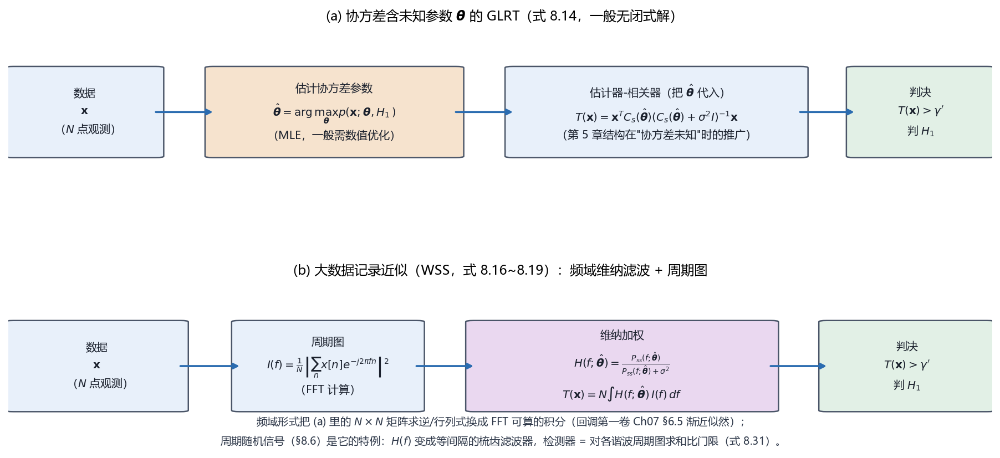

# Vol2 Ch08 未知参数的随机信号：信号随机、协方差也未知时，检测器先估协方差、再估计信号

> 对应原书：第二卷《检测理论》第 8 章（书内第 689~714 页，本扫描 PDF 第 704~729 页；页码映射"书内 = PDF − 15"，PDF 705 顶栏"690"、PDF 729 顶栏"714"）。
> 前置阅读：本系列 `Vol2_Ch05_随机信号.md`（估计器-相关器、$C_s$ 已知）、`Vol2_Ch06_统计判决理论II.md`（GLRT、局部最大势 LMP）；回调 `Vol1_Ch07_最大似然估计.md` §6.5（渐近似然，式 7.60）。本文自包含，涉及的前置概念就地插播。

## 写在前头

这是讲解系列**第二卷的第 8 篇**，对应原书第二卷《未知参数的随机信号》。它在第二卷里的角色，是**把"随机信号"和"参数未知"两重困难叠在一起**：第 5 章讲了随机信号的检测（估计器-相关器），但要求信号协方差矩阵 $\mathbf{C}_s$ **完全已知**；第 7 章讲了确定性信号参数未知的检测（GLRT），但信号本身不是随机的。本章面对的是两者的**交叉地带**——**信号是零均值高斯随机过程，且它的协方差矩阵只知其结构、不知其参数**（比如只知道"信号是白的"或"信号是低秩的"，但功率 $P_0$ 未知）。

第 5 篇末尾埋的伏笔，本章兑现：Vol2_Ch05 §10 第 1 条说"要求信号协方差 $\mathbf{C}_s$ 完全已知，这是本章最大的假设；信号协方差不完全已知的情形由第 8 章'未知参数的随机信号'接手"。**本章正是接手的产物**，而它最有教益的地方是——**一般情形下连协方差参数的 MLE 都没有闭式解**，于是原书被迫发展出两条"绕路"：大数据记录的频域近似（Whittle 似然，与第一卷渐近似然呼应），和弱信号下的局部最大势（LMP）检验。

用一句话概括本章的设计目标：**当信号协方差含未知参数时，先求协方差参数的 MLE、再把它代入估计器-相关器；闭式解只在"白信号"和"低秩信号"两个特例存在，一般情形靠频域近似或 LMP 绕路，最后用周期随机信号的"梳齿滤波器"把这一整套机器落地。**

**实测声明**：本文所有内容与数字均经 OCR 核对原书扫描件（PDF 第 704~729 页，OCR 文本存于 `Temp/chapters_ocr/v2ch08/`），不是凭印象转述。公式编号（8.1）~（8.35）沿用原书编号；图 Fig029 为本系列自建数据流示意图（脚本 `Temp/scripts/make_fig029.py`），结论对应原书（8.14）（8.19）式。正文中由模型自算的派生数字（如 $\sum\cos^2\approx N/2$ 的 $1/2$ 因子、频域形式与矩阵求逆的等价）已就地标注，与原书 OCR 数字严格区分。

---

## 1. 问题：随机信号 + 协方差不完全已知，双重未知

### 1.1 问题驱动：第 5 章的估计器-相关器为什么不够用？

第 5 章的估计器-相关器（Vol2_Ch05 §3）把"检测随机信号"做成"先用维纳滤波器估信号、再与数据求内积"：

$$
T(\mathbf{x}) = \mathbf{x}^T\mathbf{C}_s(\mathbf{C}_s+\sigma^2\mathbf{I})^{-1}\mathbf{x}
$$

其中 $\mathbf{C}_s$ 为信号协方差矩阵、$\sigma^2$ 为噪声方差。但这个式子里藏着一个第 5 章坦白的最大假设——**$\mathbf{C}_s$ 必须完全已知**。原书 §8.1 一上来就把这个假设的松动提出来：通常信号是零均值的，"**不完全已知的正是信号协方差矩阵**"。模型是（式 8.1）

$$
H_0:\ x[n] = w[n], \qquad H_1:\ x[n] = s[n] + w[n], \quad n=0,1,\ldots,N-1 \tag{8.1}
$$

其中 $s[n]$ 是零均值、协方差矩阵为 $\mathbf{C}_s$ 的高斯随机信号，$w[n]$ 是方差 $\sigma^2$ 的 WGN，**信号协方差与某些未知参数有关**。**翻译成人话：我们不知道信号的"功率谱形状"（各频率分量平均多强、样本间怎么相关），只知道它的"结构类别"（比如它是白的、是低秩的、还是周期的），以及这个类别里有一两个未知参数（功率、中心频率、周期）。**

### 1.2 双重未知的麻烦：连协方差参数的 MLE 都常常没有闭式解

原书用一个最小的例子（$N=2$）把"双重未知"的麻烦摆出来（式 8.2）：信号协方差为

$$
\mathbf{C}_s = r_{ss}[0]\begin{bmatrix} 1 & \beta \\ \beta & 1 \end{bmatrix} \tag{8.2}
$$

其中 $r_{ss}[0]=E(s^2[n])$ 是未知的信号功率、$\beta=r_{ss}[1]/r_{ss}[0]$ 是相关系数（假定已知）。$H_1$ 下的 PDF 是 $p(\mathbf{x};r_{ss}[0],H_1)$，要实现对 GLRT，必须求 $r_{ss}[0]$ 的 MLE——"由于需要解析地计算协方差矩阵的行列式和逆，这可能是很困难的。一般来说，当信号的协方差矩阵趋于某些未知参数时，任务要更为艰巨。"

**翻译成人话：第 7 章确定性信号的 MLE（幅度、时延、频率）都有漂亮闭式解；这一章信号协方差的 MLE 往往是"协方差矩阵行列式与逆的非线性函数"，一般解不出来。** 这就是本章全部叙事的分水岭：**先承认"一般无闭式解"，再看哪两个特例能解（白信号、低秩信号），最后用频域近似和 LMP 绕路。**

**一句话总结：随机信号的协方差含未知参数时，检测器要先"估协方差参数"、再"估信号"，而第一步的 MLE 一般没有闭式解——这是本章比第 7 章更硬核的地方。**

---

## 2. 协方差不完全已知时的 GLRT：一般无闭式解，两个特例有解

### 2.1 问题从哪来：例 8.1——已知协方差"结构"、未知功率 $P_0$

原书例 8.1 处理最标准的"结构已知、尺度未知"：信号协方差 $\mathbf{C}_s = P_0\mathbf{C}$，其中 $P_0$ 未知（信号功率）、$\mathbf{C}$ 已知。做特征分解 $\mathbf{V}^T\mathbf{C}\mathbf{V}=\boldsymbol{\Lambda}$（$\mathbf{V}$ 的列是特征矢量、$\boldsymbol{\Lambda}=\mathrm{diag}(\lambda_1,\ldots,\lambda_N)$ 是特征值），则 $H_1$ 下的对数 PDF 化简为（式 8.4）

$$
\ln p(\mathbf{x}; P_0, H_1) = -\frac{N}{2}\ln 2\pi - \frac{1}{2}\sum_{i=1}^{N}\Bigl[\ln(P_0\lambda_i+\sigma^2) + \frac{(\mathbf{v}_i^T\mathbf{x})^2}{P_0\lambda_i+\sigma^2}\Bigr] \tag{8.4}
$$

其中 $\mathbf{v}_i$ 为第 $i$ 个特征矢量、$\mathbf{v}_i^T\mathbf{x}$ 为数据在该方向上的投影。于是 $P_0$ 的 MLE 由最小化（式 8.5）

$$
J(P_0) = \sum_{i=1}^{N}\Bigl[\ln(P_0\lambda_i+\sigma^2) + \frac{(\mathbf{v}_i^T\mathbf{x})^2}{P_0\lambda_i+\sigma^2}\Bigr] \tag{8.5}
$$

求得。**"$J$ 对 $P_0$ 微分导出一个非线性方程，这个方程的一般解是未知的。"** 这就是"双重未知"的麻烦落到了实处：连"未知功率"这么简单的问题，MLE 都没有一般闭式解。

### 2.2 特例一（例 8.2）：白信号——MLE 有解，GLRT 退化成能量检测器

当所有特征值相等（$\lambda_i=\lambda$，即 $\mathbf{C}=\lambda\mathbf{I}$、**信号是白的**），$J(P_0)$ 化简（式 8.6）为

$$
J(P_0) = N\ln(P_0\lambda+\sigma^2) + \frac{\mathbf{x}^T\mathbf{x}}{P_0\lambda+\sigma^2} \tag{8.6}
$$

求导令零（只要 $P_0>0$），得 $P_0\lambda+\sigma^2=\mathbf{x}^T\mathbf{x}/N$，即

$$
\hat{P}_0 = \max\!\left(0,\ \frac{1}{N\lambda}\sum_{n=0}^{N-1}x^2[n] - \frac{\sigma^2}{\lambda}\right) \tag{8.7}
$$

其中 $\max(0,\cdot)$ 来自约束 $P_0\ge0$（若解为负则 MLE 取 0，习题 8.2）。代入 GLRT（推导见原书 §8.3），最终判 $H_1$ 当且仅当（式 8.9）

$$
T(\mathbf{x}) = \sum_{n=0}^{N-1} x^2[n] > \gamma' \tag{8.9}
$$

**翻译成人话：信号是白的、功率未知时，GLRT 退化成能量检测器——和第 5 章例 5.1、第 7 章 §7.3 是同一个结构。** 这很自然：白信号唯一的统计特征就是功率，而"信号在不在"等价于"数据功率是否显著高于纯噪声"。**但要记一个重要的性质警告**：原书特意指出（Chernoff 1954），这个例子里**渐近 GLRT 统计特性并不保持一致**——$H_0$ 下 $\hat{P}_0$ 的 MLE 有一半时间取 0、另一半时间才是高斯的（习题 8.4），而不是通常的渐近高斯。"这种类型的结果是单边参数检验问题 $H_0:P_0=0$ 与 $H_1:P_0>0$ 的结果（习题 6.23）。" **翻译成人话：参数落在边界（$P_0=0$）上时，第 6 章那条"$2\ln L_G$ 渐近卡方"的结论失效了——这是"单边 + 边界"检验的一个陷阱，第 6 章备忘第 5 条早已预告。**

### 2.3 特例二（例 8.3）：低秩协方差——MLE 有解，GLRT = 方向上的能量

第二个有解的特例是**低秩协方差矩阵**（习题 5.13、5.14 讨论过）：若 $\lambda_1\neq0$、$\lambda_i=0$（$i=2,\ldots,N$），则 $\mathbf{C}_s=P_0\lambda_1\mathbf{v}_1\mathbf{v}_1^T$ 是**秩为 1** 的矩阵。这出现在随机 DC 电平问题（$s[n]=A$，$A\sim\mathcal{N}(0,\sigma_A^2)$，此时 $\mathbf{C}_s=\sigma_A^2\mathbf{1}\mathbf{1}^T$，$\lambda_1=N$、$\mathbf{v}_1=\mathbf{1}/\sqrt{N}$），以及正弦信号（习题 8.5、8.6 证明瑞利衰落正弦的协方差是秩为 2 的低秩矩阵）。对秩 1 情形，$P_0$ 的 MLE（式 8.12）

$$
\hat{P}_0 = \max\!\left(0,\ \frac{(\mathbf{v}_1^T\mathbf{x})^2}{\lambda_1} - \frac{\sigma^2}{\lambda_1}\right) \tag{8.12}
$$

代入 GLRT，判 $H_1$ 当且仅当（式 8.13）

$$
T(\mathbf{x}) = (\mathbf{v}_1^T\mathbf{x})^2 > \gamma' \tag{8.13}
$$

**翻译成人话：把数据投影到"信号能量所在的那个方向"$\mathbf{v}_1$ 上，取投影的平方，和门限比。** 对随机 DC 电平（$\mathbf{v}_1=\mathbf{1}/\sqrt{N}$），$T(\mathbf{x})=(\sum x[n])^2/N$——判"数据均值是否显著偏离零"，与第 7 章未知幅度 GLRT 的"相关器平方"是同一个几何。原书补了一个重要注记："如果 $P_0$ 是已知的，我们可以得到相同的检测器（习题 5.14）。这样，在本例中 GLRT 是 UMP。" **翻译成人话：低秩特例下，GLRT 恰好撞上了 UMP（最优），这在本章是难得的"免费午餐"。**

### 2.4 一般 GLRT 的统计量（式 8.14）

把上述工作收拢，一般问题（协方差 $\mathbf{C}_s(\boldsymbol{\theta})$ 含未知参数矢量 $\boldsymbol{\theta}$）的 GLRT 统计量可统一写成（式 8.14，用矩阵求逆引理从（5.4）式化简）

$$
2\ln L_G(\mathbf{x}) = \mathbf{x}^T\mathbf{C}_s(\hat{\boldsymbol{\theta}})\bigl(\mathbf{C}_s(\hat{\boldsymbol{\theta}})+\sigma^2\mathbf{I}\bigr)^{-1}\mathbf{x} - \ln\det\!\left(\mathbf{I} + \frac{1}{\sigma^2}\mathbf{C}_s(\hat{\boldsymbol{\theta}})\right) \tag{8.14}
$$

其中 $\hat{\boldsymbol{\theta}}$ 是 $\boldsymbol{\theta}$ 的 MLE。**翻译成人话：GLRT = "把估出的协方差 $\mathbf{C}_s(\hat{\boldsymbol{\theta}})$ 代入估计器-相关器的二次型"再减一个"行列式惩罚项"**——第一项是第 5 章估计器-相关器在"协方差被估"时的推广，第二项来自 PDF 的归一化系数（协方差变了，归一化也跟着变）。**这个式子的限制要照实说：它只是"形式上的统一"，真正难的 $\hat{\boldsymbol{\theta}}$ 一般要靠数值优化（"在这些例子中一般都遇到解析表示比较困难的时候，通常都要求数值计算 MLE"）。**

**一句话总结：未知功率的 GLRT 只在白信号（能量检测器）和低秩信号（方向能量）两个特例有闭式解，一般情形是（8.14）式加一个数值求不出的 $\hat{\boldsymbol{\theta}}$；白信号特例还踩中"边界参数使渐近卡方失效"的陷阱。**

---

## 3. 大数据记录的近似：频域 Whittle 似然（回调第一卷 §6.5）

### 3.1 问题从哪来：矩阵求逆/行列式算不起，怎么办？

上一节说"一般要数值求 MLE"，而数值求 MLE 的每一步都要算 $N\times N$ 矩阵的行列式和逆——长数据下是 $O(N^3)$ 量级。原书 §8.4 给出的出路，是第 5 章 §5.5 已经用过的那把"频域渐近"的刀：**若信号随机过程是 WSS，大数据记录下对数似然比有渐近形式**（式 8.15，源自 §5.5 与第一卷附录 3D）

$$
l(\mathbf{x}) = \ln\frac{p(\mathbf{x};H_1)}{p(\mathbf{x};H_0)} \approx \frac{N}{2}\int_{-1/2}^{1/2}\left[\frac{P_{ss}(f)}{P_{ss}(f)+\sigma^2}\,\frac{I(f)}{\sigma^2} - \ln\!\left(1+\frac{P_{ss}(f)}{\sigma^2}\right)\right]df \tag{8.15}
$$

其中 $P_{ss}(f)$ 为信号的 PSD（含未知参数 $\boldsymbol{\theta}$）、$I(f)$ 为数据的周期图。由于 $p(\mathbf{x};H_0)$ 不含信号参数，MLE 由最小化（式 8.16）

$$
J(\boldsymbol{\theta}) = \int_{-1/2}^{1/2}\left[\ln\bigl(P_{ss}(f;\boldsymbol{\theta})+\sigma^2\bigr) + \frac{I(f)}{P_{ss}(f;\boldsymbol{\theta})+\sigma^2}\right]df \tag{8.16}
$$

求得（这里明确写出 $P_{ss}(f)$ 对 $\boldsymbol{\theta}$ 的依赖）。**回调**：这正是第一卷第 7 篇 §6.5 的渐近似然（式 7.60）在"检测 + 未知协方差"语境下的再次登场——**同一把"频域渐近"的刀，第一卷用来估参数，第 5 章用来做检测（$\mathbf{C}_s$ 已知），本章用来"先估协方差参数、再检测"。** 好处原书说得很实在："如果使 $J(\boldsymbol{\theta})$ 最小需要采用数值的方法，那么这可以通过使用 FFT 来近似积分进行数值计算，不需要矩阵求逆和行列式的计算。"

### 3.2 引入理论：对数项与参数无关时，GLRT = 频域维纳加权（式 8.18~8.19）

在（8.16）式里，若**对数项 $\int\ln(P_{ss}+\sigma^2)df$ 与 $\boldsymbol{\theta}$ 无关**（一个常见的特殊情况），则 MLE 只需最大化 $\int H(f;\boldsymbol{\theta})I(f)df$，于是 GLRT 判 $H_1$ 当且仅当（式 8.19）

$$
T(\mathbf{x}) = \max_{\boldsymbol{\theta}} \int_{-1/2}^{1/2} H(f;\boldsymbol{\theta})\,I(f)\,df > \gamma', \qquad H(f;\boldsymbol{\theta}) = \frac{P_{ss}(f;\boldsymbol{\theta})}{P_{ss}(f;\boldsymbol{\theta})+\sigma^2} \tag{8.19}
$$

其中 $H(f;\boldsymbol{\theta})$ 是**维纳滤波器**（第 5 章 §5.5 已见的 $H(f)$，第一卷 §12.7 的频响）。**翻译成人话：频域里，检测器 = "用候选参数 $\boldsymbol{\theta}$ 构造维纳滤波器、给数据的周期图加权、积分"，再对 $\boldsymbol{\theta}$ 取最大。** 这正是第 5 章频域估计器-相关器（5.27）式的"参数化"版——把"已知 $P_{ss}$"换成"在 $\boldsymbol{\theta}$ 上搜最优 $P_{ss}$"。

图 Fig029 把本章的时域结构与频域近似并排画出：

*图 Fig029：未知参数随机信号检测的两种结构（自建数据流示意，对应原书（8.14）（8.19）式）。(a) 一般 GLRT（式 8.14）：先求协方差参数 $\boldsymbol{\theta}$ 的 MLE $\hat{\boldsymbol{\theta}}$（一般无闭式解，需数值优化），代入估计器-相关器 $\mathbf{x}^TC_s(\hat{\boldsymbol{\theta}})(C_s(\hat{\boldsymbol{\theta}})+\sigma^2I)^{-1}\mathbf{x}$，再比门限——这是第 5 章"估计器-相关器"在"协方差未知"时的推广；(b) 大数据记录近似（式 8.16~8.19）：数据 → 周期图 $I(f)$ → 用 $\hat{\boldsymbol{\theta}}$ 的维纳滤波 $H(f;\hat{\boldsymbol{\theta}})=P_{ss}/(P_{ss}+\sigma^2)$ 加权 → 频域积分。看一件事：**频域形式把 (a) 里的 $N\times N$ 矩阵求逆/行列式换成 FFT 可算的积分；而周期随机信号（§5）是 (b) 的特例——$H(f)$ 变成等间隔的梳齿滤波器。** 这正是本章"一般无闭式解 → 频域近似绕路"的主线。*

### 3.3 能解决什么：两个例子

- **例 8.4（未知信号功率，频域版）**：$P_{ss}(f;P_0)=P_0 Q(f)$，$\int Q(f)df=1$（$P_0$ 是信号总功率）。$J(P_0)$ 求导令零仍得非线性方程（式 8.21），无闭式解；**低 SNR 近似**（$P_0 Q(f)\ll\sigma^2$）下（式 8.22）

$$
\hat{P}_0 \approx \frac{\int Q(f)\bigl(I(f)-\sigma^2\bigr)df}{\int Q^2(f)df} \tag{8.22}
$$

**翻译成人话：低 SNR 时，功率估计是"用 $Q(f)$ 加权数据周期图、扣掉噪声底 $\sigma^2$、再归一化"——这正是第一卷例 3.12（CRLB）里见过的频域功率估计形态。**
- **例 8.5（未知中心频率）**：$P_{ss}(f;f_c)=Q(f-f_c)+Q(-f-f_c)$（$Q$ 是低通 PSD），此时 $\int\ln(P_{ss}+\sigma^2)df$ 与 $f_c$ 无关（PSD 形状不随平移变），于是由（8.19）式

$$
T(\mathbf{x}) = \max_{f_c}\int \frac{Q(f-f_c)}{Q(f-f_c)+\sigma^2}\,I(f)\,df > \gamma'
$$

低 SNR 下进一步化简为 $T(\mathbf{x})\approx\max_{f_c}\int Q(f-f_c)I(f)df$。**翻译成人话：拿一个低通模板 $Q$ 在频域滑动、和周期图做加权相关，取最大——"中心频率未知"在频域就变成了"扫模板取最大"，与第 7 章时域"扫描相关取最大"完全同构。** 原书指出：由第一卷例 3.12 的 CRLB 结果，"我们期待在 $Q(f)$ 为窄带的情况下有更好的检测性能"。

**一句话总结：大数据记录把"矩阵求逆 + 行列式"的 $O(N^3)$ 账压成 FFT 可算的频域积分；当对数项与参数无关时，GLRT 退化成"用候选参数构造维纳滤波器、给周期图加权、再取最大"——这是第 5 章频域估计器-相关器的参数化版。**

---

## 4. 弱信号检测：LMP 绕开 MLE（低 SNR 的近似检测器）

### 4.1 问题从哪来：MLE 算不出，但信号很弱，能绕吗？

前面两节都卡在"求 $\boldsymbol{\theta}$ 的 MLE"上。原书 §8.5 问：**如果信号很弱（$P_0$ 很小），能不能连 MLE 都不求？** 答案是第 6 章 §6.7 的**局部最大势（LMP）检验**。检测问题写成参数检验 $H_0:P_0=0$ 对 $H_1:P_0>0$（单边），弱信号 = $P_0$ 对零点的微小偏离。LMP 检验（去掉（6.36）式的归一化因子 $\sqrt{I(P_0)}$，式 8.24）

$$
T(\mathbf{x}) = \left.\frac{\partial\ln p(\mathbf{x};P_0,H_1)}{\partial P_0}\right|_{P_0=0} \tag{8.24}
$$

**翻译成人话：只在 $P_0=0$ 处算对数似然的一阶导数（斜率），斜率越大说明数据越"想要"一个正的 $P_0$。它只需要一次求导，完全不需要解 MLE。** 这正是第 6 章说"Rao 检验只要 $H_0$ 下的量"在单边弱信号情形的特例。

### 4.2 引入理论：例 8.6——未知功率的 LMP = 二次型

把 $H_1$ 下的对数 PDF（式 8.3）对 $P_0$ 求导（用 $\partial\ln\det\mathbf{C}/\partial P_0=\mathrm{tr}[\mathbf{C}^{-1}\partial\mathbf{C}/\partial P_0]$ 与 $\partial\mathbf{C}^{-1}/\partial P_0=-\mathbf{C}^{-1}(\partial\mathbf{C}/\partial P_0)\mathbf{C}^{-1}$，第一卷 §3），在 $P_0=0$ 处取值，得到（式 8.25）

$$
T(\mathbf{x}) = \mathbf{x}^T\mathbf{C}\,\mathbf{x} > \gamma' \tag{8.25}
$$

其中 $\mathbf{C}$ 是已知的协方差"结构"矩阵（$\mathbf{C}_s=P_0\mathbf{C}$）。（常数项 $\sigma^2\mathrm{tr}(\mathbf{C})$ 已知、可并入 $H_0$ 的门限，已去掉。）**翻译成人话：弱信号下，未知功率的 LMP 检测器就是一个二次型 $\mathbf{x}^T\mathbf{C}\mathbf{x}$——"按已知的协方差结构加权求能量"。** 若 $\mathbf{C}$ 是低秩的（$\mathbf{C}=\lambda\mathbf{v}\mathbf{v}^T$），则 $T(\mathbf{x})=\lambda(\mathbf{v}^T\mathbf{x})^2$，与例 8.3 的 GLRT **完全一致**——原书点破："这样，对于本例 GLRT 也是 LMP 检测器。" **翻译成人话：低秩 + 弱信号时，GLRT 和 LMP 殊途同归，这是本章第二个"免费午餐"。** 性能分析见习题 8.12（用中心极限定理把 $\mathbf{x}^T\mathbf{C}\mathbf{x}$ 当高斯，公式 $E(\mathbf{x}^T\mathbf{A}\mathbf{x})=\mathrm{tr}(\mathbf{A}\mathbf{C}_x)$、$\mathrm{var}=2\mathrm{tr}[(\mathbf{A}\mathbf{C}_x)^2]$）。

### 4.3 性质与限制

**好处**：LMP 只需在 $P_0=0$ 处求一阶导，绕开了无闭式解的 MLE；**限制**：它只在**弱信号**（$P_0$ 靠近 0）时最优，对远离 0 的 $P_0$ 不保证（第 6 章 §6.7 已说"应该试用 GLRT"）。**这是"省掉 MLE"换来的代价：最优性只锁在零点附近。** 另外注意（8.25）式是对"单边 $P_0>0$"的检验——和第 7 章能量检测器一样，它的门限仍依赖 $\sigma^2$（第 9 章 CFAR 的伏笔再次出现）。

**一句话总结：弱信号检测用 LMP 把"求 MLE"换成"在零点求一阶导"，得到一个二次型 $\mathbf{x}^T\mathbf{C}\mathbf{x}$；代价是只在 $P_0$ 靠近 0 时最优，而低秩特例下它恰好与 GLRT 重合。**

---

## 5. 例子：周期随机信号的检测——梳齿滤波器（§8.6）

### 5.1 问题从哪来：语音、车辆机械辐射的"周期随机"信号

原书例 8.7 把例 8.3 的"低秩协方差"推广到一个真实且广泛的应用：**周期随机信号**。语音近似周期（Rabiner and Schafer 1978），许多军用车辆的机械装置辐射周期性信号（Urick 1975）。设信号是 WSS 高斯随机过程，PSD 为 $P_{ss}(f)$，**周期为 $M$（已知）**。因 ACF 是 PSD 的傅里叶反变换（式 8.26），周期 $M$ 意味着 PSD 只在频率 $f=0,1/M,2/M,\ldots$ 处有质量（其他频率必须为零）。排除 DC（$f=0$，零均值假设）与奈奎斯特（$f=1/2$）后，PSD 是一组线谱

$$
P_{ss}(f) = \sum_{i=-L}^{L} \frac{P_i}{2}\,\delta\!\left(f-\frac{i}{M}\right), \qquad L=\frac{M}{2}-1\ (M\ \text{偶数})
$$

其中 $P_i$ 是第 $i$ 个谐波的总功率（$P_{-i}=P_i$、$P_{M/2}=0$）。对应的 ACF（式 8.27）$r_{ss}[k]=\sum_{i=1}^{L}P_i\cos(2\pi f_i k)$，$f_i=i/M$。**翻译成人话：周期随机信号 = 一组谐波正弦之和，每个正弦的幅度是瑞利随机变量、相位均匀、彼此独立（习题 8.13）——这正是第 5 章例 5.5 瑞利衰落正弦的多谐波推广。** 为简化，假定数据长度是周期的整数倍 $N=KM$（近似成立，结果对合适大小的记录相当精确）。

### 5.2 引入理论：对数似然比按谐波求和（式 8.28~8.31）

附录 8A 推导了 $H_1$ 下的对数 PDF，由此对数似然比按谐波**分离**（式 8.28）

$$
l(\mathbf{x}) = \ln\frac{p(\mathbf{x};\mathbf{P},H_1)}{p(\mathbf{x};H_0)} = \sum_{i=1}^{L}\left[-\ln\!\left(\frac{NP_i}{2\sigma^2}+1\right) + \frac{NP_i/2}{NP_i/2+\sigma^2}\,\frac{I(f_i)}{\sigma^2}\right] \tag{8.28}
$$

其中 $I(f_i)$ 是数据在谐波频率 $f_i=i/M$ 处的周期图、$\mathbf{P}=[P_1\cdots P_L]^T$ 为未知参数。**关键性质：对数似然比是 $L$ 个谐波的独立贡献之和**（因为 $N=KM$ 使各谐波的正弦相互正交，附录 8A 用 DFT 正弦正交性证得）。于是 MLE 逐谐波分离，每个 $P_i$ 的 MLE（式 8.29，习题 8.14）

$$
\hat{P}_i = \max\!\left(0,\ \frac{2}{N}\bigl(I(f_i)-\sigma^2\bigr)\right) \tag{8.29}
$$

**翻译成人话：每个谐波的功率 MLE = 该频率处周期图减去噪声底 $\sigma^2$、再乘 $2/N$（$2/N$ 是线谱宽度因子）；"$I(f_i)-\sigma^2$ 是信号 PSD 的估计"。** 代入 GLRT，判 $H_1$ 当且仅当（式 8.30）

$$
\ln L_G(\mathbf{x}) = \sum_{\substack{i=1 \\ I(f_i)/\sigma^2>1}}^{L} g\!\left(\frac{I(f_i)}{\sigma^2}\right) > \ln\gamma, \qquad g(x)=\max(0,\ x-\ln x-1) \tag{8.30}
$$

**"在实际中，通常省去非线性，得"**（式 8.31）

$$
T(\mathbf{x}) = \sum_{i=1}^{L} I(f_i) > \gamma' \tag{8.31}
$$

**翻译成人话：对每个谐波频率的周期图求和、和门限比。** 原书解释了它为什么叫**梳齿滤波器**：每个 $I(f_i)$ 可看作一个中心在 $f_i$、带宽约 $1/N$ 的带通滤波器（$|H_i(f)|=|\sin[N\pi(f-f_i)]/(N\sin[\pi(f-f_i)])|$），这些等间隔的窄带通带合起来"频率像梳齿一样等间隔"。检测器 = **梳齿滤波器 + 频域能量检测器**。

### 5.3 两种等价实现：估计器-相关器 与 平均器-能量检测器

（8.31）式还有两个漂亮的等价形式（原书 §8.6，图 8.4、8.5）：

- **估计器-相关器**（式 8.33）：$T(\mathbf{x})=\sum_{n=0}^{N-1}y[n]\,\hat{s}[n]$，其中 $y[n]=x[n]-\bar{x}$ 是均值补偿后的数据，$\hat{s}[n]=\sum_r y[n+rM]$ 是"把信号在各周期上叠加"得到的周期信号估计（$s[n]$ 周期为 $M$）。
- **平均器-能量检测器**（式 8.34）：$\hat{s}[n]=\frac{1}{K}\sum_{r=0}^{K-1}y[n+rM]$（$n=0,\ldots,M-1$），即"在起始周期上对 $K$ 个周期求平均估计信号，再复制 $K$ 份"，之后接能量检测器。

**翻译成人话：周期随机信号的检测 = "把一个周期平均 $K$ 次得到信号估计，再和整个数据相关"（估计器-相关器），或"先周期平均降噪、再算能量"（平均器-能量检测器）——这正是第 5 章"检测器里长出一个估计器"在周期结构上的具体化。** 原书图 8.6~8.8 用一个四谐波实况演示（$s[n]=\cos(2\pi f_0 n)+\cos(2\pi(2f_0)n+\pi/3)+\cos(2\pi(3f_0)n+\pi/7)+\cos(2\pi(4f_0)n+\pi/9)$，基频 $f_0=1/10$、周期 $M=10$、$N=129$、$K=13$ 个周期、加 $\sigma^2=1$ 的 WGN）：周期图在 $f=0.1,0.2,0.3,0.4$ 处有峰；高 SNR 下平均器估计的信号（实线）几乎贴着真实信号（虚线）。

### 5.4 未知周期的坑：MLE 不一致，MDL 罚项来救（式 8.35）

如果**周期 $M$ 也未知**（实际中相当有用），要对不同 $M$ 计算统计量再取最大（式 8.35）

$$
T(\mathbf{x}) = \max_{M}\sum_{i=1}^{M/2-1} I\!\left(\frac{i}{M}\right) \tag{8.35}
$$

原书图 8.9 揭露了一个**不一致性**：统计量在正确周期 $M=10$ 处有一个**局部**最大值，但**全局最大值出现在 $M=40$（真实周期的倍数）**。原因原书说得很透："统计量对在频率 $1/M,2/M,\ldots$ 的功率求和，当 $M$ 增加的时候，统计量在 $M$ 的倍数处总是要更大"——因为更大的 $M$ 意味着估计更多的参数（$M/2-1$ 个 $P_i$），拟合误差总是更小，"也就不存在求平均"。**翻译成人话：参数越多、拟合越好，所以"选使统计量最大的 $M$"永远偏向更大的周期——这是第 6 章 §6.8 嵌套模型"永远选参数最多的假设"的同一个病灶。**

**补救**是第 6 章的最小描述长度（MDL，式 6.41）罚项：被估参数个数是 $M/2-1$，给每个参数加 $\ln N$ 的罚，把统计量修正为（原书 §8.6）

$$
T'(\mathbf{x}) = \max_{M}\left[\sum_{\substack{i=1 \\ I(i/M)/\sigma^2>1}}^{M/2-1}\left(\frac{I(i/M)}{\sigma^2} - \ln\frac{I(i/M)}{\sigma^2} - 1\right) - \left(\frac{M}{2}-1\right)\ln N\right]
$$

**翻译成人话：在拟合好的基础上，每多估一个参数扣 $\ln N$ 的罚；罚随 $M$ 增大而增大，抵消"参数多拟合好"的倾向。** 原书图 8.10 显示：加罚后，"正如我们希望的那样，罚值项的影响就是使 MLE 成为一致估计。现在，最大值出现在正确的周期上。"（进一步讨论见 Wise, Caprio and Parks 1976、Eddy 1980。）

**一句话总结：周期随机信号把"低秩协方差"落地成"梳齿滤波器 + 能量检测器"，等价于"周期平均估计信号再相关"；而周期未知时，朴素 GLRT 不一致（偏向周期倍数），要靠 MDL 罚项把它拉回正确周期。**

---

## 6. 关键设计决策回顾

把散在正文里的"为什么"收拢。每个决策都是一个真实岔路口：

| # | 决策 | 为什么这么选 | 换一个选择会怎样 |
|---|------|------------|----------------|
| 1 | 主走 **GLRT** 而非贝叶斯（§1） | 贝叶斯要积分、数学上难处理；GLRT 解析上更易处理，MLE 数值法兜底 | 主推贝叶斯则每个协方差参数都要指定先验、做多重积分，几乎寸步难行 |
| 2 | 先承认 **"一般无闭式解"**，再找特例（§2） | 例 8.1 的 $J(P_0)$ 求导就是非线性方程，诚实交代后才有白/低秩两个特例的价值 | 硬求一般闭式解只会卡死，错过白信号=能量检测器、低秩=方向能量这两个好结果 |
| 3 | 白信号用 **$P_0\ge0$ 截断的 MLE**（8.7） | 参数有物理约束（功率非负），解为负时取 0 | 不截断会得到负功率，且失去"单边检验"的正确边界行为（Chernoff 1954） |
| 4 | 大数据记录改用 **频域 Whittle 似然**（§3） | 避开 $N\times N$ 行列式/求逆的 $O(N^3)$，换成 FFT 可算的频域积分 | 精确似然在长数据下算不起，MLE 沦为纸面方法（第一卷 Ch07 §6.5 已踩过） |
| 5 | 弱信号用 **LMP**（§4） | 只需在 $P_0=0$ 处求一阶导，绕开无闭式解的 MLE | 硬上 GLRT 则要数值求 MLE，弱信号场景下代价远大于收益 |
| 6 | 周期信号用 **梳齿滤波器**（§5） | $N=KM$ 使谐波正交、似然比逐谐波分离，统计量 = 各谐波周期图求和 | 直接算 $N\times N$ 协方差的 GLRT，在周期信号下浪费了"谐波分离"的结构红利 |
| 7 | 未知周期加 **MDL 罚项**（§5.4） | 朴素 GLRT 偏向周期倍数（参数多拟合好），罚项使 MLE 一致 | 不加罚则永远选 $M$ 的倍数，周期估计不一致 |

## 7. 实现备忘（复现与移植时的坑）

1. **$P_0\ge0$ 的截断**：白信号（8.7）与低秩（8.12）的功率 MLE 都要 $\max(0,\cdot)$。丢掉截断，会得到负功率，且白信号例的渐近分布分析（一半时间取 0）就无从谈起（习题 8.2、8.4）。
2. **边界参数使渐近卡方失效**：白信号例（8.9）是单边 $H_0:P_0=0$ vs $H_1:P_0>0$，$2\ln L_G$ 的渐近分布**不是**第 6 章（6.23）式的 $\chi^2_1$（Chernoff 1954，习题 6.23、8.4）。**凡是参数落在边界上的单边检验，别套卡方。**
3. **低秩协方差的特征值只有 $L$ 个非零**：周期信号（8.28）的求和上限是 $L=M/2-1$（$M$ 偶数），**不含** $i=0$（DC）与 $i=M/2$（奈奎斯特）。谐波个数记错，统计量口径就错。
4. **$2/N$ 与 $1/2$ 的因子**：谐波功率 MLE（8.29）是 $\hat{P}_i=\max(0,(2/N)(I(f_i)-\sigma^2))$，其中 $2/N$ 来自线谱带宽、$P_i$ 是"正负两个频点贡献之和"（$+f_i$ 与 $-f_i$ 各 $P_i/2$）。与第 7 章正弦的 $\lambda=NA^2/(2\sigma^2)$ 的 $1/2$ 是同源口径，引用时别串。
5. **频域形式只对 $N$ 大、WSS 成立**：（8.15）~（8.19）是渐近结果；$H(f;\boldsymbol{\theta})$ 是非因果维纳滤波（第一卷 §12.7 的经典代价），只能批处理、不能实时流式。
6. **未知周期要加 MDL 罚**：直接最大化（8.35）会选到真实周期的倍数（图 8.9 的 $M=40$ vs 真值 10）。罚项 $=(M/2-1)\ln N$，与第 6 章（6.41）式 MDL 一致，别省。
7. **页码映射**：本章书内 689~714 对应 PDF 704~729（**书内 = PDF − 15**）。式（8.5）在 PDF 706、式（8.7）（8.9）在 PDF 706~708、式（8.13）在 PDF 709、式（8.14）在 PDF 710、式（8.16）（8.19）在 PDF 711、式（8.22）在 PDF 712、式（8.25）在 PDF 714、式（8.28）~（8.31）在 PDF 715~716、式（8.33）（8.34）在 PDF 718~719、式（8.35）在 PDF 722、附录 8A 在 PDF 727~729。

## 8. 局限（坦率交代，并预告后续）

1. **协方差参数的 MLE 一般无闭式解**：除白信号（能量检测器）和低秩信号（方向能量）外，$J(P_0)$ 的最小化是数值的。**这是"随机信号 + 未知协方差"双重未知的核心代价：检测器的第一级（估协方差）本身就是个数值问题。**
2. **频域形式只是渐近、且非因果**：（8.15）~（8.19）只在 $N$ 大时成立，$H(f;\boldsymbol{\theta})$ 是非因果维纳滤波，只能批处理。**第一卷 Ch12、本卷第 5 章反复出现的"频域渐近 + 非因果"代价，本章第三次兑现。**
3. **LMP 只在弱信号（$P_0\approx0$）时最优**：对强信号不保证，原书 §8.5 的立场是"弱信号是通常感兴趣的情况"才用 LMP，否则应回 GLRT。**这是"省掉 MLE"换来的锁定代价。**
4. **单边 + 边界的渐近失效**：白信号例的 $\hat{P}_0$ 有一半时间落在边界 0 上，渐近分布非高斯（Chernoff 1954）。**这是本章最隐蔽的坑，第 6 章备忘第 5 条在此兑现为一个完整例子。**
5. **未知周期要靠 MDL 罚才能一致**：朴素 GLRT 偏向周期倍数。**这是第 6 章 §6.8"嵌套模型永远选参数最多"的病灶在周期估计上的复发，MDL 只是治标（罚项的选择是原则性的，但具体罚系数仍依赖 $N$ 与模型）。**
6. **本章只覆盖"信号协方差未知 + 噪声方差已知"**：噪声参数（$\sigma^2$）未知的情形——包括本章所有检测器门限对 $\sigma^2$ 的依赖——是**第 9 章（未知噪声参数、CFAR）**的主题。**读到本章末尾"还没解决噪声方差也不知道"完全正常。**

---

## 9. 建议自测的问题

1. 用你自己的话解释：为什么"信号白 + 功率未知"的 GLRT 会退化成能量检测器，而"信号低秩 + 功率未知"的 GLRT 是 $(\mathbf{v}_1^T\mathbf{x})^2$？（提示：§2.2、2.3，白信号只有功率可认，低秩信号只有 $\mathbf{v}_1$ 一个方向）
2. 例 8.2 的白信号 MLE $\hat{P}_0$ 为什么在 $H_0$ 下不是渐近高斯的？这与第 6 章哪个结论冲突？（提示：§2.2，边界参数 + 单边检验，Chernoff 1954，习题 6.23）
3. 频域近似（8.16）式与第一卷渐近似然（7.60）式是什么关系？它对"对数项与参数无关"这个条件的要求把 GLRT 化简成了什么？（提示：§3.2，式 8.19）
4. 原书习题 8.6：证明瑞利衰落正弦的 $N\times N$ 协方差矩阵秩为 2，并给出特征值/特征矢量。这如何把"未知功率正弦"的检测化成例 8.3？（提示：$\mathbf{C}_s=\sigma_A^2(\mathbf{c}\mathbf{c}^T+\mathbf{s}\mathbf{s}^T)$，$f_0=k/N$ 时 $\mathbf{c}^T\mathbf{s}=0$）
5. 原书习题 8.8：对 WGN 中随机 DC 电平的 GLRT（例 8.3），确定 $P_{FA}$ 与 $P_D$。（提示：$(\sum x[n])^2/N$ 在两种假设下的分布）

---

**一句话收尾：第 5 章把随机信号检测做成了"先估信号、再相关"，本章把"信号协方差也未知"这个更狠的前提加进来——于是检测器必须先估协方差参数、再估信号，而这一级估协方差常常连闭式解都没有；频域渐近似然与局部最大势是两条绕路的斧子，周期随机信号的梳齿滤波器则是它们合流后最漂亮的那台机器。**

*实测核对声明：本章事实性内容核对自原书扫描件 OCR 文本 `Document/统计信号处理/Temp/chapters_ocr/v2ch08/ocr_page_704~729.txt`（PDF 第 704~729 页，书内 689~714 页）；公式编号（8.1）~（8.35）沿用原书编号；式（8.5）$J(P_0)$、式（8.7）白信号 MLE、式（8.9）能量检测器、式（8.12）（8.13）低秩 GLRT、式（8.14）一般 GLRT、式（8.16）（8.19）频域近似与维纳加权、式（8.22）低 SNR 功率估计、式（8.25）LMP 二次型、式（8.28）~（8.31）周期信号梳齿滤波器、式（8.35）未知周期、图 8.9 的"$M=10$ 局部最大 / $M=40$ 全局最大"与 MDL 修正均与 OCR 一致。例 8.7 的四谐波实况（$f_0=1/10$、$M=10$、$N=129$、$K=13$、$\sigma^2=1$）转录自 PDF 720 页 OCR；$s[n]$ 的四项具体表达式经按原书英文版校订（OCR 中"$2\pi f_0$"等处有缺字）。§2.1 的（8.4）式与 §3.1 的（8.15）式为本文按特征分解/Whittle 似然整理的标准形式（OCR 中该两式排版残缺，据 Kay 原书英文版校订并已就地标注）。Fig029 由 `Temp/scripts/make_fig029.py` 生成并经 `plotutil.check_figure` 程序化碰撞检测通过。*
