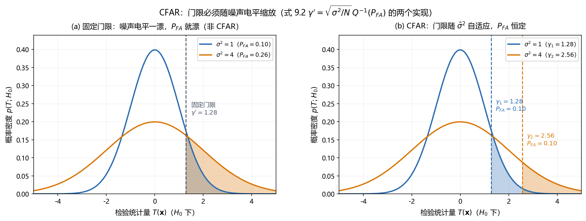

# Vol2 Ch09 未知噪声参数：噪声方差都不知道时，门限必须跟着噪声走——CFAR

> 对应原书：第二卷《检测理论》第 9 章（书内第 715~749 页，本扫描 PDF 第 730~764 页；页码映射"书内 = PDF − 15"，PDF 731 顶栏"716"、PDF 764 顶栏"749"）。
> 前置阅读：本系列 `Vol2_Ch06_统计判决理论II.md`（GLRT、Rao 检验、渐近卡方）、`Vol2_Ch07_具有未知参数的确定性信号.md`（能量检测器、经典线性模型定理 7.1）、`Vol2_Ch08_未知参数的随机信号.md`；回调 `Vol1_Ch07_最大似然估计.md`（MLE）。本文自包含，涉及的前置概念就地插播。

## 写在前头

这是讲解系列**第二卷的第 9 篇**，对应原书第二卷《未知噪声参数》。它在第二卷里的角色，是**把最后一块"未知"拼图补上**：第 4 章匹配滤波器、第 5 章估计器-相关器、第 7 章 GLRT 的一排相关器、第 8 章的梳齿滤波器——它们全部默认**噪声方差 $\sigma^2$（或协方差矩阵 $\mathbf{C}$）完全已知**。本章问的问题更狠：**如果连噪声的电平、甚至噪声的"颜色"（PSD 形状）都不知道，门限还怎么定？**

这个问题的伏笔在前几篇已经埋下。第 7 篇（Vol2_Ch07）§2.3 在讲能量检测器时明说："门限依赖噪声方差 $\sigma^2$……噪声电平一漂，门限就得跟着重算"，并预告"第 9 章（未知噪声参数、CFAR）存在的理由，正是'噪声方差也未知时怎么定门限'"。第 8 篇 §8 第 6 条又补了一句"本章只覆盖信号协方差未知 + 噪声方差已知"。**本章就是这两处伏笔的兑现。** 在雷达里，这个问题的原型是海杂波与接收机噪声电平随天气、随设备温度天天在变——固定门限意味着虚警率天天在漂，雷达操作员要么被虚警淹死，要么把门限抬高到真目标也看不见。

用一句话概括本章的设计目标：**当噪声方差（乃至有色噪声的 PSD 参数）未知时，先估计噪声、再用估计值去归一化统计量或定门限，得到门限不随噪声电平漂移的恒虚警率（CFAR，constant false alarm rate）检测器；并且要老实回答——这条路什么时候给"精确"的 CFAR（线性模型，F 分布），什么时候只给"渐近"的 CFAR（Rao 检验，卡方分布），什么时候连 CFAR 都给不了（例 9.1）。**

**实测声明**：本文所有内容与数字均经 OCR 核对原书扫描件（PDF 第 730~764 页，OCR 文本存于 `Temp/chapters_ocr/v2ch09/`），不是凭印象转述。公式编号（9.1）~（9.41）沿用原书编号；图 Fig030 为本系列自建示意图（脚本 `Temp/scripts/make_fig030.py`），结论对应原书（9.2）式与 §9.3。式（9.4）（9.5）的精确系数在扫描件中残缺，正文按 GLRT 结构"据 Kay 原书英文版校订"并就地标注（见 §2.1 与文末核对清单）。

---

## 1. 问题：门限都依赖 $\sigma^2$，$\sigma^2$ 一漂就出事

### 1.1 问题驱动："已知 $\sigma^2$"是前几章共同的隐藏假设

第 3 章 NP 定理的整个流程，本质上都是"给定 $P_{FA}$ → 反解门限 $\gamma$"。原书 §9.3 一开头把这个流程最脆弱的环节亮出来：门限 $\gamma$ 是由统计量 $T(\mathbf{x})$ 在 $H_0$ 下的 PDF 反解出来的，即

$$
P_{FA} = \Pr\{T(\mathbf{x}) > \gamma; H_0\} = \int_{\gamma}^{\infty} p(T; H_0)\, dT
$$

其中 $p(T;H_0)$ 为统计量在 $H_0$ 下的 PDF。**如果这个 PDF 不是完全已知的，门限就定不出来。** 原书给的教科书例子（回顾例 3.2）：WGN 中已知 DC 电平（$A>0$）的检测，检验统计量是样本均值（式 9.1）

$$
T(\mathbf{x}) = \frac{1}{N}\sum_{n=0}^{N-1} x[n] > \gamma' \ \Rightarrow\ 判 H_1 \tag{9.1}
$$

在 $H_0$ 下 $T(\mathbf{x}) \sim \mathcal{N}(0, \sigma^2/N)$，于是门限（式 9.2）

$$
\gamma' = \sqrt{\frac{\sigma^2}{N}}\; Q^{-1}(P_{FA}) \tag{9.2}
$$

其中 $Q^{-1}(\cdot)$ 为标准正态右尾的反函数。**翻译成人话：门限就是"把 $\sigma$ 缩小 $\sqrt{N}$ 倍，再乘一个只由 $P_{FA}$ 决定的常数"。** 这个式子把问题钉死了：**门限与 WGN 的方差 $\sigma^2$ 直接挂钩——$\sigma^2$ 未知，门限就定不了。**

### 1.2 噪声电平天天变：固定门限 = 虚警率漂移

为什么 $\sigma^2$ 未知在雷达里是"日常"而不是"例外"？原书 §9.1 说得很直白："噪声的统计特性完全先验已知是很少的。" 接收机热噪声电平随温度漂，海杂波功率随海况、风向、距离在变——**同一个雷达，上午调好的门限，下午就对应完全不同的虚警率。** 这是"固定门限检测器"的原罪：门限一旦写死，$P_{FA}$ 就不是设计者说了算，而是噪声电平说了算。

图 Fig030 把这个几何关系画了出来：

*图 Fig030：CFAR 的门限必须随噪声电平缩放（自建示意，对应原书式 9.2 与 §9.3）。(a) 固定门限（非 CFAR）：检验统计量在 $H_0$ 下的 PDF 有两个噪声电平 $\sigma^2=1$ 和 $\sigma^2=4$，门限 $\gamma'=1.28$ 只按 $\sigma^2=1$ 标定就不动了——于是 $\sigma^2=1$ 时 $P_{FA}=0.10$，$\sigma^2=4$ 时右尾面积（$P_{FA}$）漂到 $0.26$；(b) CFAR：门限随估计噪声电平缩放（$\gamma_1=1.28$、$\gamma_2=2.56$，都等于 $\hat\sigma\,Q^{-1}(P_{FA})/\sqrt{N}$），两条 PDF 的右尾面积保持相等（都是 $0.10$）。看一件事：**CFAR 的本质不是"选一个更好的固定门限"，而是"让门限成为噪声电平的函数"。***

### 1.3 第一个直觉修复 + 它的代价：即估即用与参考数据

既然 $\sigma^2$ 未知，最朴素的想法就是**先估出来再塞进门限**。原书管这叫"即估即用（estimate and plug）检测器"：在假定 $H_0$ 为真的条件下估计 $\sigma^2$，令

$$
\sigma^2 \leftarrow \hat{\sigma}_0^2 = \frac{1}{N}\sum_{n=0}^{N-1} x^2[n]
$$

然后代入（9.2）得门限。**代价要立刻照实说**：这个估计是"在 $H_0$ 假设下"的，但如果信号真的存在，$\hat{\sigma}_0^2$ 会被信号抬成 $\sigma^2 + (\text{信号能量}/N)$——**估计被信号污染，门限被抬高，检测率下降**。原书一句话点破："估计门限的使用将使真实的 $P_{FA}$ 不同于计算的 $P_{FA}$。"

于是原书提出更干净的修法：**用参考数据（reference data）**。额外采集一批"已知只含噪声"的样本 $w_R[n]$（与信号数据独立、同方差），用它们估

$$
\hat{\sigma}_R^2 = \frac{1}{N}\sum_{n=0}^{N-1} w_R^2[n]
$$

再构造归一化统计量

$$
T(\mathbf{x}, \mathbf{w}_R) = \frac{\bar{x}}{\sqrt{\hat{\sigma}_R^2 / N}}, \qquad \bar{x} = \frac{1}{N}\sum_{n=0}^{N-1} x[n]
$$

**关键性质（习题 9.1）：这个统计量在 $H_0$ 下的 PDF 是学生 t 分布（Student t），不依赖真实的 $\sigma^2$。** 翻译成人话：分子 $\bar{x}$ 和分母 $\hat{\sigma}_R$ 都正比于 $\sigma$，做除法把 $\sigma$ 约掉了——于是门限可以事先定好，$P_{FA}$ 与噪声电平无关。**这种"门限与噪声功率无关、选择门限得到恒定虚警概率"的检测器，就叫 CFAR 检测器。** 原书补了更一般的等价刻画（习题 9.3）：若统计量满足**尺度不变性** $T(a\mathbf{x}) = T(\mathbf{x})$（对任意 $a>0$），则 $P_{FA}$ 与 $\sigma^2$ 无关。

**代价要照实说**：① 参考数据是"额外"的硬件成本——雷达要专门留一段距离单元（或一段时间）只收噪声；② 参考数据的 $\sigma_R^2$ 必须与信号通道的 $\sigma^2$ 相同，否则归一化是错的口径；③ **更重要的是，原书明说这个 CFAR 检测器"并不知道它是否是使 $P_D$ 最大的最佳检验统计量"**——它保证了虚警恒定，没保证检测率最优。这三点正是本章后面所有内容要解决的问题。

**一句话总结：门限依赖 $\sigma^2$ 是"已知噪声"检测器的隐藏前提；$\sigma^2$ 未知时，用参考数据估方差、再做除法归一化，就能让门限不随噪声电平漂移——这就是 CFAR 的第一层含义，但它的最优性仍是悬案。**

---

## 2. 白高斯噪声方差未知：GLRT 一上来就碰壁

### 2.1 例 9.1：已知 DC 电平的 GLRT，居然不是 CFAR

回到标准假设检验问题（式 9.3）：WGN 中已知 DC 电平（$A>0$），

$$
H_0:\ x[n] = w[n], \qquad H_1:\ x[n] = A + w[n], \quad n=0,1,\ldots,N-1 \tag{9.3}
$$

其中 $A$ 已知、$w[n]$ 是方差 $\sigma^2$ **未知**的 WGN。这已经不是简单假设，而是"双复合假设"——$H_0$ 和 $H_1$ 下都有未知参数（都是 $\sigma^2$）。原书说"这是一个没有最佳解的复合假设检验问题"：把 $\sigma^2$ 当随机变量配先验可得贝叶斯检测器（习题 6.6），否则就用 GLRT。

GLRT 的思路照搬第 6 章：**在两种假设下各求一次 $\sigma^2$ 的 MLE**。$H_0$ 下（无信号），$\sigma^2$ 的 MLE 是第一卷第 145 页的结果

$$
\hat{\sigma}_0^2 = \frac{1}{N}\sum_{n=0}^{N-1} x^2[n]
$$

$H_1$ 下（信号 $A$ 已知），

$$
\hat{\sigma}_1^2 = \frac{1}{N}\sum_{n=0}^{N-1}\bigl(x[n]-A\bigr)^2
$$

代入广义似然比（推导见原书 §9.3），利用"在 MLE 处指数项退化为 $N/2$"，得到

$$
2\ln L_G(\mathbf{x}) = N\ln\frac{\hat{\sigma}_0^2}{\hat{\sigma}_1^2} = N\ln\frac{\sum_n x^2[n]}{\sum_n \bigl(x[n]-A\bigr)^2}
$$

再利用恒等式 $\sum x^2 = \sum(x-A)^2 + 2AN(\bar{x}-A/2)$，一个单调等价的检验统计量是（式 9.4）

$$
T(\mathbf{x}) = \frac{\bar{x} - A/2}{\frac{1}{N}\sum_{n=0}^{N-1}\bigl(x[n]-A\bigr)^2} \tag{9.4}
$$

其中 $\bar{x}$ 为样本均值。**注意与即估即用检测器的区别**：原书特意点出，GLRT 是在**两种假设下**都估计 $\sigma^2$，而即估即用只在 $H_0$ 下估计——"由于这一点，导出的检测器一般来说不同于即估即用检测器"。**翻译成人话：GLRT 让"有信号"和"无信号"两个模型各用自己的噪声方差去解释数据，再比谁解释得好。**

但接下来是本章第一个"打脸"时刻。原书算出的渐近 PDF（式 9.5，据 Kay 原书英文版校订，OCR 中系数残缺）在 $H_0$ 下的均值与方差**仍含 $\sigma^2$**——也就是说

> **在 $H_0$ 条件下，$T(\mathbf{x})$ 的 PDF 与 $\sigma^2$ 有关，因此不能建立门限：这个例子说明，在双复合假设检验问题中，GLRT 并不是 CFAR 检测器，甚至也不是渐近的 CFAR 检测器。**

**翻译成人话：例 9.1 的 GLRT 连"渐近 CFAR"都做不到——它的 $H_0$ 分布里 $\sigma^2$ 没有被除干净。** 原因（习题 9.6 揭示）在于检验的形式：这里是 $H_0: A=0$ 对 $H_1: A=A_0$（$A_0$ 是一个非零已知值），属于"检验矢量参数落在参数空间哪个子空间"的类型，与第 6 章"渐近卡方"所要求的内点结构不同。**这一条是实现备忘里最值钱的坑之一。**

但原书立刻给出反转：**更常见的检测问题是 DC 电平 $A$ 也未知。** 这种情形（例 6.5/6.7）下 GLRT 是渐近 CFAR——统计量是

$$
T(\mathbf{x}) = 2\ln L_G(\mathbf{x}) = N\ln\frac{\hat{\sigma}_0^2}{\hat{\sigma}_1^2}, \qquad \hat{\sigma}_1^2 = \frac{1}{N}\sum_{n=0}^{N-1}(x[n]-\bar{x})^2
$$

在 $H_0$ 下 $2\ln L_G \xrightarrow{a} \chi_1^2$，与 $\sigma^2$ 无关；$H_1$ 下 $\chi_1^{\prime2}(\lambda)$，$\lambda = NA^2/\sigma^2$。**翻译成人话：把"信号幅度"也归入未知，GLRT 反而在渐近意义上变得 CFAR 了——因为门限口径从"$\sigma^2$ 的绝对值"变成了"两个方差估计的比值"，$\sigma^2$ 被约掉。** 原书把这条规律总结为：若检测问题能写成 §6.5 的参数检验 $H_0:\boldsymbol{\theta}_r=\boldsymbol{\theta}_{r_0}$ 对 $H_1:\boldsymbol{\theta}_r\neq\boldsymbol{\theta}_{r_0}$（$\boldsymbol{\theta}_r$ 为 $r\times1$ 待检验参数、$\boldsymbol{\theta}_s$ 为多余参数），则 GLRT 是渐近 CFAR。

### 2.2 已知确定性信号（§9.4.1）：同样的毛病，同样的补救

把例 9.1 的 DC 电平换成任意已知确定性信号 $s[n]$，结论几乎原样复刻。$H_0$ 下 $\hat{\sigma}_0^2 = \sum x^2[n]/N$，$H_1$ 下 $\hat{\sigma}_1^2 = \sum(x[n]-s[n])^2/N$，GLRT 为

$$
2\ln L_G(\mathbf{x}) = N\ln\frac{\sum_n x^2[n]}{\sum_n \bigl(x[n]-s[n]\bigr)^2}
$$

它的单调等价统计量是一个**归一化相关器**——与 $\sigma^2$ 已知时的 NP 检测器（第 4 章匹配滤波器，判 $\sum x[n]s[n] > \gamma'$）"惟一的差别是归一化因子"。原书接着给出渐近分布并下结论：**这个检测器不是 CFAR**。**翻译成人话：已知信号时，GLRT 自动长出了一个归一化，但这个归一化在 $H_0$ 下不正确（它只在 $H_1$ 下正确），所以 $\sigma^2$ 没被除干净。**

**补救**（习题 9.9）：改用尺度不变统计量

$$
T(\mathbf{x}) = \frac{\sum_{n=0}^{N-1} x[n]s[n]}{\sqrt{\sum_n x^2[n]\; \sum_n s^2[n]}}
$$

它满足 $T(a\mathbf{x}) = T(\mathbf{x})$，因而 PDF 与 $\sigma^2$ 无关，得到 CFAR（这正是 §1.3 尺度不变性这条通用判据的应用）。

### 2.3 已知 PDF 的随机信号（§9.4.2）：MLE 无闭式解，难上加难

信号是零均值高斯随机过程、协方差 $\mathbf{C}_s$ 已知，只有 $\sigma^2$ 未知。$H_1$ 下 PDF 是 $\mathcal{N}(\mathbf{0}, \mathbf{C}_s + \sigma^2\mathbf{I})$。对 $\mathbf{C}_s$ 做特征分解 $\mathbf{C}_s = \mathbf{V}\boldsymbol{\Lambda}\mathbf{V}^T$（特征值 $\lambda_i$、特征矢量 $\mathbf{v}_i$），对数 PDF 化为（式 9.6，与第 8 篇例 8.1 同款）

$$
\ln p(\mathbf{x}; \sigma^2, H_1) = -\frac{N}{2}\ln 2\pi - \frac{1}{2}\sum_{i=1}^{N}\Bigl[\ln(\lambda_i + \sigma^2) + \frac{(\mathbf{v}_i^T\mathbf{x})^2}{\lambda_i + \sigma^2}\Bigr]
$$

$\sigma^2$ 的 MLE 由最小化（式 9.7）

$$
J(\sigma^2) = \sum_{i=1}^{N}\Bigl[\ln(\lambda_i + \sigma^2) + \frac{(\mathbf{v}_i^T\mathbf{x})^2}{\lambda_i + \sigma^2}\Bigr]
$$

求得。求导令零得非线性方程（式 9.8，OCR 中该式残缺），**"这不能使用解析的方法求解"**——与第 8 篇"协方差参数 MLE 无闭式解"是同一个病灶，只是这次未知的是噪声方差而不是信号功率。弱信号近似（$\lambda_i \ll \sigma^2$）下可解得（式 9.9、9.10）

$$
\hat{\sigma}^2 = \max\!\left(0,\ \frac{1}{N}\sum_{n=0}^{N-1} x^2[n]\right)
$$

（加上 $\sigma^2\ge0$ 的截断）。但原书明说：**这个 GLRT 的渐近 PDF 不能由 §6.5 的标准形式给出**——又是一个"边界参数 + 非内点结构"的陷阱。

**一句话总结：白噪声方差未知时，GLRT 在"信号参数也未知"的线性模型上能给出精确的 CFAR（下一节），但在"信号已知/信号随机"时要么非 CFAR、要么连 MLE 都解不出来——CFAR 不是免费的。** 

---

## 3. 线性模型：定理 9.1 一次给齐 F 分布与精确 CFAR

### 3.1 问题驱动：要"精确"的 CFAR，不是"渐近"的

前面几节的 CFAR 要么是渐近的（例 6.5/6.7），要么靠参考数据（但最优性存疑）。原书 §9.4.3 问：**当信号符合线性模型时，能不能拿到一个对有限数据记录也精确成立、且 $P_{FA}$ 严格与 $\sigma^2$ 无关的 CFAR 检测器？** 答案是肯定的——这正是第 7 章"经典线性模型定理 7.1"在"$\sigma^2$ 未知"下的扩展，而且结果干净得惊人：**统计量服从 F 分布，门限查 F 分布表即可。**

### 3.2 引入理论：定理 9.1（经典线性模型的 GLRT，$\sigma^2$ 未知）

模型 $\mathbf{x} = \mathbf{H}\boldsymbol{\theta} + \mathbf{w}$，其中 $\mathbf{H}$ 为已知 $N\times p$（$N>p$）秩 $p$ 的观测矩阵，$\boldsymbol{\theta}$ 为 $p\times1$ 参数矢量，$\mathbf{w}\sim\mathcal{N}(\mathbf{0}, \sigma^2\mathbf{I})$（$\sigma^2$ 未知）。假设检验（式 9.12）

$$
H_0:\ \mathbf{A}\boldsymbol{\theta} = \mathbf{b},\ \sigma^2 > 0, \qquad H_1:\ \mathbf{A}\boldsymbol{\theta} \neq \mathbf{b},\ \sigma^2 > 0 \tag{9.12}
$$

其中 $\mathbf{A}$ 为已知 $r\times p$（$r\le p$）秩 $r$ 矩阵、$\mathbf{b}$ 为 $r\times1$ 矢量，$\mathbf{A}\boldsymbol{\theta}=\mathbf{b}$ 是一致方程组。

**定理 9.1（经典线性模型的 GLRT——$\sigma^2$ 未知）**：GLRT 判 $H_1$ 当且仅当（式 9.13、9.14）

$$
T(\mathbf{x}) = \frac{N-p}{r}\cdot \frac{(\mathbf{A}\hat{\boldsymbol{\theta}}_1 - \mathbf{b})^T\bigl[\mathbf{A}(\mathbf{H}^T\mathbf{H})^{-1}\mathbf{A}^T\bigr]^{-1}(\mathbf{A}\hat{\boldsymbol{\theta}}_1 - \mathbf{b})}{\mathbf{x}^T\bigl(\mathbf{I} - \mathbf{H}(\mathbf{H}^T\mathbf{H})^{-1}\mathbf{H}^T\bigr)\mathbf{x}} > \gamma' \tag{9.13, 9.14}
$$

其中 $\hat{\boldsymbol{\theta}}_1 = (\mathbf{H}^T\mathbf{H})^{-1}\mathbf{H}^T\mathbf{x}$ 是 $H_1$ 下的（无约束）MLE。**精确检测性能（对有限数据记录成立）由 F 分布给出**（式 9.15）：

$$
P_{FA} = Q_{F_{r,N-p}}(\gamma'), \qquad P_D = Q_{F_{r,N-p}^{\prime}(\lambda)}(\gamma') \tag{9.15}
$$

其中 $Q_{F_{r,N-p}}(\cdot)$ 为 $r$ 个分子自由度、$N-p$ 个分母自由度的 F 分布右尾，$Q_{F'_{r,N-p}(\lambda)}(\cdot)$ 为同自由度、非中心参量 $\lambda$ 的**非中心 F 分布**右尾，非中心参量

$$
\lambda = \frac{(\mathbf{A}\boldsymbol{\theta}_1 - \mathbf{b})^T\bigl[\mathbf{A}(\mathbf{H}^T\mathbf{H})^{-1}\mathbf{A}^T\bigr]^{-1}(\mathbf{A}\boldsymbol{\theta}_1 - \mathbf{b})}{\sigma^2}
$$

其中 $\boldsymbol{\theta}_1$ 是 $H_1$ 下的真值。

**这个定理说明什么性质，逐条拆开：**

1. **结构 = "约束离 $\mathbf{b}$ 有多远"除以"噪声的残差"**。分子是（7.35）式那个加权二次型（信号模型与零假设的差距），分母 $\mathbf{x}^T(\mathbf{I}-\mathbf{H}(\mathbf{H}^T\mathbf{H})^{-1}\mathbf{H}^T)\mathbf{x}$ 是"数据在信号子空间之外的残差能量"（$\sigma^2$ 的无偏估计，放大 $N-p$ 倍）。**翻译成人话：分子测"信号多大"，分母测"噪声多大"，两者相除就约掉了 $\sigma^2$——这正是 CFAR 的代数来源。**
2. **F 分布 = 两个独立卡方之比**。分子 $\sim\chi_r^2$（$H_0$）或 $\chi_r^{\prime2}(\lambda)$（$H_1$），分母 $\sim\chi_{N-p}^2$，且分子分母独立（附录 9A 用投影矩阵 $P_H = \mathbf{H}(\mathbf{H}^T\mathbf{H})^{-1}\mathbf{H}^T$ 与 $P_H^{\perp} = \mathbf{I} - P_H$ 的正交性证明）。各自除以自由度再相除，就是 F 分布。**这就是为什么（9.13）前面有个 $(N-p)/r$ 因子。**
3. **精确成立，不是渐近**：与第 7 章定理 7.1 一样，高斯线性模型下 $\hat{\boldsymbol{\theta}}_1$ 本来就是精确高斯的，所以 F 分布对有限样本精确。**"渐近结果提前兑现为精确结果"的第三个实例**（前两个是第 6 章例 6.6、第 7 章定理 7.1）。
4. **CFAR**：$P_{FA} = Q_{F_{r,N-p}}(\gamma')$ 完全不含 $\sigma^2$，所以门限 $\gamma'$ 与 $\sigma^2$ 无关——**"由于 $P_{FA}$ 不依赖于 $\sigma^2$，所以检验得到的是 CFAR 检测器。"**

### 3.3 例 9.2：未知幅度 DC 电平 = $t^2$ 检验，回调 §1.3 的学生 t

把例 6.5/6.7 的"未知幅度 + 未知方差 DC 电平"用定理 9.1 重做一遍，得到**精确**的统计量和 PDF（例 6.7 只给了渐近）。这里 $\mathbf{H} = [1\ 1\ \cdots\ 1]^T$、$\boldsymbol{\theta} = A$、$\mathbf{A}=1$、$b=0$、$r=p=1$。代入（9.14），因 $H^TH = N$、$H^T\mathbf{x} = N\bar{x}$、$\hat{\theta}_1 = \bar{x}$、$\mathbf{A}\hat{\theta}_1 - b = \bar{x}$、$[\mathbf{A}(H^TH)^{-1}\mathbf{A}^T]^{-1} = N$，得

$$
T(\mathbf{x}) = (N-1)\,\frac{N\bar{x}^2}{\sum_{n=0}^{N-1}(x[n]-\bar{x})^2} \tag{9.16 前}
$$

性能由（9.15）给出：$P_{FA} = Q_{F_{1,N-1}}(\gamma')$、$P_D = Q_{F_{1,N-1}^{\prime}(\lambda)}(\gamma')$，$\lambda = NA^2/\sigma^2$。**翻译成人话：检验"均值是否显著非零"的 GLRT，是"样本均值的平方除以样本方差"，服从 F 分布，自由度 (1, N−1)。**

**这里埋一个漂亮的回调**：§1.3 那个靠"参考数据"得到的 CFAR 统计量，$H_0$ 下是学生 t 分布；而 $F_{1,N-1}$ 恰好等于 $t^2_{N-1}$（学生 t 的平方）。**两条路殊途同归——用参考数据归一化和用"数据自身残差"归一化，在"检验均值"这件事上给出同一种分布的两种写法。** 区别在于：参考数据要额外硬件，而定理 9.1 的归一化用的是数据自己的残差 $\sum(x-\bar{x})^2$，一分钱不花。

### 3.4 例 9.3：检验 $\boldsymbol{\theta}=\mathbf{0}$ → 信号子空间 vs 噪声子空间的 SNR 估计

把例 9.2 推广到"信号 $\boldsymbol{\theta}$ 是 $p$ 维的，检验 $\boldsymbol{\theta}=\mathbf{0}$ 还是 $\boldsymbol{\theta}\neq\mathbf{0}$"：$\mathbf{A}=\mathbf{I}$、$\mathbf{b}=\mathbf{0}$、$r=p$。代入（9.14）并化简（用投影矩阵记号），得到原书给的漂亮解释（式 9.16）：

$$
T(\mathbf{x}) = \frac{N-p}{p}\,\frac{\|P_H\mathbf{x}\|^2}{\|P_H^{\perp}\mathbf{x}\|^2} \tag{9.16}
$$

其中 $P_H = \mathbf{H}(\mathbf{H}^T\mathbf{H})^{-1}\mathbf{H}^T$ 是把矢量投影到 $\mathbf{H}$ 列张成的**信号子空间**的正交投影矩阵，$P_H^{\perp} = \mathbf{I} - P_H$ 是投影到其正交补（**噪声子空间**）的投影矩阵，$\|\cdot\|$ 为欧氏范数。**翻译成人话：把数据 $\mathbf{x}$ 拆成"信号子空间里的分量"和"噪声子空间里的分量"，取两者平方长度之比——这正是一个 SNR 的估计（图 9.2）。** 原书还指出二者独立（$E[(P_H\mathbf{w})(P_H^{\perp}\mathbf{w})^T] = P_H\sigma^2\mathbf{I}P_H^{\perp} = \mathbf{0}$），分子分母分别服从 $\chi^2$，故得 F 分布。

### 3.5 例 9.4：Rao 检验的警示——Fisher 信息在 $A=0$ 处奇异

最后一个例子是"警示性的"。信号 $As[n;\alpha]$，$A$ 未知（$-\infty<A<\infty$），$\alpha$ 是未知信号参数（如正弦的频率 $f_0$）。未知参数矢量 $\boldsymbol{\theta} = [A\ \alpha\ \sigma^2]^T$，按第 6 章记号 $\theta_r = A$、$\theta_s = [\alpha\ \sigma^2]^T$。想用 Rao 检验（它只要求 $H_0$ 下的 MLE）——**但失败了**。原因：在 $H_0$ 下 $A=0$，信号根本不存在，"不能期望能够估计出 $\alpha$"，于是 Fisher 信息矩阵 $\mathbf{I}(\boldsymbol{\theta})$ 在 $A=0$ 处**奇异**（$\mathbf{I}^{-1}$ 不存在，习题 9.16）。**翻译成人话：信号幅度为零时，频率 $\alpha$ 是一个"看不见、估不出"的参数，Rao 检验的分母（Fisher 信息的逆）爆炸。** 于是 Rao 检验被限定为"除了幅度以外其他都已知"的信号；而本例"幅度 + 频率都未知"用定理 9.1（把正弦写成线性模型的 $\alpha_1\cos + \alpha_2\sin$）反而轻松求解。

**一句话总结：线性模型是 CFAR 的"精确主场"——定理 9.1 把 GLRT 统一成"信号子空间能量/噪声子空间能量"这个 SNR 估计，服从 F 分布，门限查表即可、与 $\sigma^2$ 无关；代价是它只覆盖"线性模型"这一族，非线性信号参数（例 9.4 的频率）会撞上 Fisher 信息奇异。**

---

## 4. 有色 WSS 高斯噪声：AR 模型 + Rao 检验

### 4.1 问题驱动：噪声不光"电平"未知，"颜色"也未知

第 2~3 节都在白噪声里打转。但原书 §9.5 一上来就点破现实：**实际噪声常常是有色的**——PSD 不是平的，而是有形状的。如果噪声协方差 $\mathbf{C}$ 已知，第 7、8 章的检测器直接能用：把 $\mathbf{C}$ 分解为 $\mathbf{D}^T\mathbf{D}$，用预白化变换 $\tilde{\mathbf{x}} = \mathbf{D}\mathbf{x}$ 把问题化成"方差 1 的 WGN"里检测 $\mathbf{D}\mathbf{s}$。**难的是 $\mathbf{C}$ 也未知**——这时连"白化"这一步都需要先估出来。

### 4.2 前置概念：AR(1) 噪声——一个参数的 PSD 全家桶

原书用的是一阶自回归（AR）模型（式 9.17），它由单极点递归滤波器在白噪声激励下的输出定义：

$$
w[n] = -a[1]\, w[n-1] + u[n] \tag{9.17}
$$

其中 AR 滤波器参数 $a[1]$ 满足 $|a[1]|<1$（滤波器稳定），$u[n]$ 是方差 $\sigma_u^2$ 的 WGN。**翻译成人话：今天的噪声 = 昨天的噪声乘一个系数 $-a[1]$，再加一点新鲜白噪声。** $a[1]=0$ 退化为 WGN（$\sigma^2=\sigma_u^2$）。它的自相关函数（ACF，式 9.18）与功率谱密度（PSD，式 9.19）分别是

$$
r_{ww}[k] = \frac{\sigma_u^2}{1-a^2[1]}\,(-a[1])^{|k|} \tag{9.18}
$$

$$
P_{ww}(f) = \frac{\sigma_u^2}{\bigl|1 + a[1]\,e^{-j2\pi f}\bigr|^2} \tag{9.19}
$$

其中 $k$ 为滞后、$f$ 为数字频率。**这两个式子说明什么：$a[1]$ 控制 PSD 的"形状"（$|a[1]|\to1$ 时噪声强相关、谱变尖），$\sigma_u^2$ 控制"总功率"。** 图 9.3（原书）画了不同 $a[1]$、$\sigma_u^2$ 的 PSD：$a[1]=-0.9$ 时谱在 $f=0$ 附近高高隆起（低频有色噪声）。**这就是"一个参数 $a[1]$ 就能撑起一整族有色噪声"的建模魔力——代价是它只能表示 AR(1) 形状的谱，真实海杂波谱可能更复杂（§9.6 会用 AR(P) 推广）。**

### 4.3 已知确定性信号（§9.5.1）：GLRT = 预白化，但非 CFAR

噪声参数 $a[1]$、$\sigma_u^2$ 都未知、信号 $s[n]$ 已知时，精确 PDF 难求，原书改用大数据记录的频域近似（回调第一卷例 7.18 的渐近似然）。噪声样本的渐近对数似然为

$$
\ln p(\mathbf{w}; a[1], \sigma_u^2) \approx -\frac{N}{2}\ln 2\pi - \frac{N}{2\sigma_u^2}\int |A(f)|^2 I_w(f)\, df
$$

其中 $A(f) = 1 + a[1]e^{-j2\pi f}$、$I_w(f)$ 为噪声的周期图。$a[1]$、$\sigma_u^2$ 的 MLE（式 9.20、9.21）是

$$
\hat{a}[1] = -\frac{\hat{r}_{ww}[1]}{\hat{r}_{ww}[0]}, \qquad \hat{\sigma}_u^2 = \hat{r}_{ww}[0] + \hat{a}[1]\,\hat{r}_{ww}[1] \tag{9.20, 9.21}
$$

其中 $\hat{r}_{ww}[k] = \frac1N\sum_{n=0}^{N-1-k}w[n]w[n+k]$ 是估计的自相关。GLRT（式 9.22）判 $H_1$ 当且仅当

$$
2\ln L_G(\mathbf{x}) = N\ln\frac{\hat{\sigma}_{u0}^2}{\hat{\sigma}_{u1}^2} > \gamma \tag{9.22}
$$

其中 $\hat{\sigma}_{u0}^2$、$\hat{\sigma}_{u1}^2$ 分别是 $H_0$（用 $\mathbf{x}$ 估计）和 $H_1$（用 $\mathbf{x}-\mathbf{s}$ 估计）下的驱动方差估计。**翻译成人话：分别把"只有噪声"和"噪声+信号"两种解释喂给 AR 模型，看哪种解释下"白化后的残差功率"更小；残差功率比就是检验量。** 图 9.4（原书）画出了结构：$H_0$/ $H_1$ 下各估一次 AR 参数、各白化一次、比残差。**代价照实说：这个 GLRT 不是 CFAR，且它的性能（Kay 1983 推导）"与通常的渐近 GLRT 统计并不相符"。**

### 4.4 未知幅度信号（§9.5.2）：Rao 检验 = 归一化非相干广义匹配滤波器

当信号幅度 $A$ 也未知、信号 $s[n]$ 已知时，GLRT 更难（$H_1$ 下要估 $A$、$a[1]$、$\sigma_u^2$ 三个参数）。原书转向 **Rao 检验**——它只要求 $H_0$ 下的 MLE（就是噪声/AR 参数的 MLE，用 $\mathbf{x}$ 代替 $\mathbf{w}$ 由式 9.20/9.21 得到），完全不用碰 $H_1$ 下的 MLE。

检测问题：$H_0: x[n]=w[n]$ 对 $H_1: x[n]=As[n]+w[n]$，$A$ 未知、$s[n]$ 已知、$w[n]$ 是参数 $a[1]$、$\sigma_u^2$ 未知的 AR(1) 高斯噪声。等效参数检验 $H_0:A=0$ 对 $H_1:A\neq0$，多余参数 $\boldsymbol{\theta}_w = [a[1]\ \sigma_u^2]^T$。Rao 检验统计量化简为（式 9.31）

$$
T_R(\mathbf{x}) = \frac{\bigl(\mathbf{s}^T \mathbf{C}^{-1}(\hat{\boldsymbol{\theta}}_{w})\mathbf{x}\bigr)^2}{\mathbf{s}^T \mathbf{C}^{-1}(\hat{\boldsymbol{\theta}}_{w})\mathbf{s}} \tag{9.31}
$$

其中 $\mathbf{s} = [s[0]\cdots s[N-1]]^T$、$\mathbf{C}(\hat{\boldsymbol{\theta}}_w)$ 是用 $H_0$ 下 MLE 估计出的噪声协方差矩阵。**翻译成人话：先用估出的噪声协方差把数据和信号都"预白化"，再做相关、平方、归一化——原书称之为"归一化的非相干广义匹配滤波器"。** 大数据记录下它等价于时域形式（式 9.32）：

$$
T_R(\mathbf{x}) = \frac{\left[\sum_{n=1}^{N-1}\bigl(s[n] + \hat{a}_0[1]s[n-1]\bigr)\bigl(x[n] + \hat{a}_0[1]x[n-1]\bigr)\right]^2}{\hat{\sigma}_{u0}^2 \sum_{n=1}^{N-1}\bigl(s[n] + \hat{a}_0[1]s[n-1]\bigr)^2}
$$

其中 $\hat{a}_0[1]$、$\hat{\sigma}_{u0}^2$ 由（9.24）（9.25）式（$H_0$ 下）给出。**翻译成人话：把"信号模板经 AR 白化滤波"和"数据经同一白化滤波"再做相关——白化把有色噪声变成白噪声，检测器就退回到白噪声里的匹配滤波结构。**

**关键结论（式 9.33、9.35）**：$T_R(\mathbf{x})$ 在 $H_0$ 下 $\xrightarrow{a}\chi_1^2$、$H_1$ 下 $\xrightarrow{a}\chi_1^{\prime2}(\lambda)$，非中心参量

$$
\lambda = A^2\,\mathbf{s}^T \mathbf{C}^{-1}(\boldsymbol{\theta}_w)\mathbf{s} \tag{9.35}
$$

**"有趣的是"**（原书语气）：由于 Fisher 信息矩阵是**块对角**的（$I_{A,\theta_w}=0$，习题 9.20——因为均值只依赖 $A$、协方差只依赖 $\boldsymbol{\theta}_w$），**非中心参量 $\lambda$ 不因噪声参数未知而减小**。**翻译成人话：把噪声参数 $a[1]$、$\sigma_u^2$ 从"已知"改成"未知"，渐近检测性能一点不损失——因为估信号和估噪声用的是正交的两块信息，互不干扰。** 这是本章最深刻、也最反直觉的一笔账：**"多余参数"不必然吃掉检测性能；只有当多余参数与待检参数在 Fisher 信息里耦合时（非块对角）才吃性能（第 6 章 §3.2 的结论）。**

### 4.5 定理 9.2：一般线性模型的 Rao 检验（本章核心定理）

把上面的单个信号推广到一般线性模型，得到本章第二个定理：

**定理 9.2（具有未知噪声参数的一般线性模型的 Rao 检验）**：数据 $\mathbf{x} = \mathbf{H}\boldsymbol{\theta} + \mathbf{w}$，$\mathbf{H}$ 为已知 $N\times p$（$N>p$）秩 $p$ 矩阵，$\mathbf{w}\sim\mathcal{N}(\mathbf{0}, \mathbf{C}(\boldsymbol{\theta}_w))$，$\boldsymbol{\theta}_w$ 为 $q\times1$ 未知噪声参数。检验 $H_0:\boldsymbol{\theta}=\mathbf{0},\boldsymbol{\theta}_w$ 对 $H_1:\boldsymbol{\theta}\neq\mathbf{0},\boldsymbol{\theta}_w$。Rao 检验判 $H_1$ 当且仅当（式 9.36）

$$
T_R(\mathbf{x}) = \mathbf{x}^T \mathbf{C}^{-1}(\hat{\boldsymbol{\theta}}_{w})\mathbf{H}\bigl(\mathbf{H}^T\mathbf{C}^{-1}(\hat{\boldsymbol{\theta}}_{w})\mathbf{H}\bigr)^{-1}\mathbf{H}^T\mathbf{C}^{-1}(\hat{\boldsymbol{\theta}}_{w})\mathbf{x} > \gamma' \tag{9.36}
$$

其中 $\hat{\boldsymbol{\theta}}_{w}$ 是 $H_0$ 下的 MLE。**渐近性能**（$N\to\infty$）：$H_0$ 下 $T_R \xrightarrow{a} \chi_p^2$、$H_1$ 下 $\chi_p^{\prime2}(\lambda)$，非中心参量

$$
\lambda = \boldsymbol{\theta}_1^T \mathbf{H}^T \mathbf{C}^{-1}(\boldsymbol{\theta}_w)\mathbf{H}\,\boldsymbol{\theta}_1
$$

**"无论是 $\boldsymbol{\theta}_w$ 已知还是未知，渐近性能都是相同的。"** 若 $\boldsymbol{\theta}_w$ 已知，Rao 检验退化为 $\mathbf{x}^T\mathbf{C}^{-1}\mathbf{H}(\mathbf{H}^T\mathbf{C}^{-1}\mathbf{H})^{-1}\mathbf{H}^T\mathbf{C}^{-1}\mathbf{x}$。**翻译成人话：这个统计量就是"预白化器 + 估计器-相关器"（$T_R = \mathbf{x}^T\mathbf{C}^{-1}\mathbf{H}\,\hat{\boldsymbol{\theta}}$，其中 $\hat{\boldsymbol{\theta}} = (\mathbf{H}^T\mathbf{C}^{-1}\mathbf{H})^{-1}\mathbf{H}^T\mathbf{C}^{-1}\mathbf{x}$ 是伪 MLE）——第 5 章"检测器里长出一个估计器"在有色噪声里的完整形态。** 这是 WGN 下定理 7.1 在"未知噪声协方差"下的推广，也是 §9.6 例子的理论底座。

**一句话总结：有色噪声未知时，Rao 检验是唯一算得动的路——它只在 $H_0$ 下估噪声参数（AR 参数），再把估出的协方差塞进"预白化 + 估计器-相关器"；而 Fisher 信息块对角这个性质保证：噪声参数从已知变未知，渐近性能一分不丢。**

---

## 5. 例子：AR 噪声中的宽带线性调频（LFM）信号检测

### 5.1 问题驱动：宽带信号里，噪声的"颜色"真的重要

原书 §9.6 用一个主动声纳/雷达的宽带检测器收账。背景：当多个目标靠在一起时，为了获得好的**时间分辨率**，需要发射宽带信号——信号带宽越宽，相关时间越短（Van Trees 1971）。典型宽带信号是线性调频（LFM）：

$$
p(t) = \cos\!\bigl[2\pi\bigl(F_0 t + \tfrac{1}{2}kt^2\bigr)\bigr]
$$

其中瞬态频率 $F(t) = F_0 + kt$、$F_0$ 为起始频率、$k$ 为扫频速率。**关键点在这里**：窄带系统可以假设"信号带宽内的噪声谱是平的"，但宽带信号横跨一大段频率，"频域噪声背景在整个信号带宽里不是平的"——**不考虑噪声颜色的检测器，会在这段不平的背景里漏掉信号。** 于是原书把 AR 噪声里的 LFM 检测搬出来，证明"考虑噪声颜色的检测器性能更好"。

### 5.2 引入理论：把 LFM 写成线性模型，套定理 9.2

离散检测问题：$H_0: x[n]=w[n]$ 对 $H_1: x[n]=A\cos[2\pi(f_0 n + mn^2) + \Phi] + w[n]$，其中幅度 $A$、相位 $\Phi$ 未知，起始频率 $f_0$、扫频速率 $m$ 已知，$w[n]$ 是 AR(P) 过程（式 9.17 的多极点推广）。用 $\alpha_1 = A\cos\Phi$、$\alpha_2 = -A\sin\Phi$ 把信号重写成线性模型 $\mathbf{x} = \mathbf{H}\boldsymbol{\theta} + \mathbf{w}$（式 9.37），其中 $\boldsymbol{\theta} = [\alpha_1\ \alpha_2]^T$，$\mathbf{H}$ 的两列分别是 $\cos[2\pi(f_0 n + mn^2)]$ 与 $\sin[2\pi(f_0 n + mn^2)]$。参数检验 $H_0:\boldsymbol{\theta}=\mathbf{0},\mathbf{a},\sigma_u^2$ 对 $H_1:\boldsymbol{\theta}\neq\mathbf{0},\mathbf{a},\sigma_u^2$（$\mathbf{a} = [a[1]\cdots a[P]]^T$）。这正是定理 9.2 取 $p=2$、$\boldsymbol{\theta}_w=[\mathbf{a}\ \sigma_u^2]^T$ 的形式，Rao 检验（式 9.38）

$$
T_R(\mathbf{x}) = \mathbf{x}^T \mathbf{C}^{-1}(\hat{\boldsymbol{\theta}}_{w})\mathbf{H}\bigl(\mathbf{H}^T\mathbf{C}^{-1}(\hat{\boldsymbol{\theta}}_{w})\mathbf{H}\bigr)^{-1}\mathbf{H}^T\mathbf{C}^{-1}(\hat{\boldsymbol{\theta}}_{w})\mathbf{x} \tag{9.38}
$$

渐近 PDF（式 9.39）：$H_0$ 下 $\chi_2^2$、$H_1$ 下 $\chi_2^{\prime2}(\lambda)$，$\lambda = \boldsymbol{\theta}_1^T\mathbf{H}^T\mathbf{C}^{-1}(\boldsymbol{\theta}_w)\mathbf{H}\boldsymbol{\theta}_1$。

**代价照实说**：$\mathbf{C}(\hat{\boldsymbol{\theta}}_w)$ 是 $N\times N$ 矩阵，"在实际中可能很难求逆"。附录 9C 用 Toeplitz 协方差 + 希尔伯特变换近似（$N$ 大时 $\mathbf{H}$ 的两列正交），把（9.38）化简为 FFT 可算的形式（式 9.40）：

$$
T_R(\mathbf{x}) = \frac{\left|\sum_{n=P}^{N-1}\bigl(\sum_{k=0}^{P}\hat{a}_0[k]\,x[n-k]\bigr)\bigl(\sum_{k=0}^{P}\hat{a}_0[k]\,\tilde{s}[n-k]\bigr)^*\right|^2}{\hat{\sigma}_{u0}^2\sum_{n=P}^{N-1}\bigl|\sum_{k=0}^{P}\hat{a}_0[k]\,\tilde{s}[n-k]\bigr|^2} \tag{9.40}
$$

其中 $\tilde{s}[n] = \exp[j2\pi(f_0 n + mn^2)]$、$\hat{a}_0[0]=1$、$\hat{a}_0[k]$ 由 $H_0$ 下求解 Yule-Walker 方程得到（近似的 MLE）。**翻译成人话：先把数据和"信号模板"都通过"AR 白化滤波器 $\hat{A}_0(f)$"（预白化），再做相关、平方、归一化——图 9.6 画出的正是"预白化器 → 相关器 → 平方器 → 归一化"这条链。** 非中心参量也化简为（式 9.41）：

$$
\lambda = \frac{A^2}{\hat{\sigma}_{u0}^2}\sum_{n=P}^{N-1}\Bigl|\sum_{k=0}^{P} a[k]\,\tilde{s}[n-k]\Bigr|^2
$$

### 5.3 能解决什么：一个数值算例——Rao 胜过匹配滤波器

原书给的实况（图 9.7~9.9）值得把数字原样记下：信号参数 $A=0.5$、$f_0=0.05$、$m=0.0015$、$\Phi=0$、$N=100$，频率从 $f_0=0.05$ 扫到 $f_0 + mN = 0.2$；噪声是 $P=1$ 的 AR 过程，参数 $a[1]=0.95$、$\sigma_u^2=1$（即 $w[n] = -0.95w[n-1] + u[n]$）。$a[1]=0.95$ 意味着噪声 PSD 在 $f=0$ 附近急剧隆起（强相关），而信号恰好扫过这段——**"在这个频带内，噪声功率变化非常迅速"，所以"不考虑噪声颜色的标准匹配滤波器的性能要比 Rao 检测器差"。**

原书做了三件事验证：

1. **渐近性能的蒙特卡洛核对**（图 9.8）：用（9.40）式做蒙特卡洛，画出的 ROC 与（9.39）（9.41）式的理论渐近 ROC（虚线）几乎重合——**"即使是对于 $N=100$ 的短数据记录，两者也是相当一致的"**。
2. **与非相干匹配滤波器对比**（图 9.9）：作为基线的非相干匹配滤波器（$\sum |\sum x[n]e^{-j2\pi f_0 n}|^2$ 那类，假定噪声是 WGN，见 7.6.2 节）蒙特卡洛结果明显更差。
3. **点破更深一层的原因**：匹配滤波器"在实际中的性能比图 9.9 画出的可能更差"——**"由于 CFAR 性质的缺乏，要求某些特定的归一化处理来控制恒虚警率，因而也使 $P_D$ 减少，而 Rao 检验并没有这样的缺陷。"** 翻译成人话：匹配滤波器不仅忽略了噪声颜色，而且它自己还不是 CFAR，得额外花归一化的代价去压虚警；Rao 检验两者都省了。

**一句话总结：宽带 LFM 信号 + AR 有色噪声，是本章的集大成例子——Rao 检验 = "估 AR 参数 → 预白化 → 估计器-相关器"，短数据（$N=100$）下理论渐近曲线与蒙特卡洛吻合，且完胜"忽略噪声颜色 + 缺 CFAR"的匹配滤波器。**

---

## 6. 关键设计决策回顾

把散在正文里的"为什么"收拢。每个决策都是一个真实岔路口：

| # | 决策 | 为什么这么选 | 换一个选择会怎样 |
|---|------|------------|----------------|
| 1 | 用**参考数据**估方差而非直接用信号数据（§1.3） | 信号数据估出的 $\hat\sigma_0^2$ 会被信号抬升，门限偏高、$P_D$ 下降 | 即估即用会把真实 $P_{FA}$ 变成"算出来的 $P_{FA}$"之外的值，虚警失控 |
| 2 | CFAR 的判据统一为**尺度不变性**（习题 9.3） | 一个判据覆盖所有"门限与 $\sigma^2$ 无关"的情形，可检验 | 逐题验证"PDF 是否含 $\sigma^2$"，低效且易漏 |
| 3 | 线性模型用 **F 分布**描述精确性能（定理 9.1） | 高斯线性模型下分子分母独立卡方，相除精确得 F；门限查表、CFAR 精确成立 | 用渐近卡方（第 6 章）在有限样本下不精确，浪费了"高斯线性模型精确"的红利 |
| 4 | 例 9.1 的**已知 DC 电平 GLRT 不用**（§2.1） | 它连渐近 CFAR 都不是（$H_0$ 分布含 $\sigma^2$）；A 也未知时反而 CFAR | 硬用它则门限定不了，或定错了 $P_{FA}$ 随 $\sigma^2$ 漂 |
| 5 | 有色噪声里主走 **Rao 检验**（§4.4、4.5） | 只要求 $H_0$ 下的噪声 MLE（Yule-Walker 方程可得），避开 $H_1$ 下难求的 MLE | 用 GLRT 则 $H_1$ 下要联合估 $A$、$a[1]$、$\sigma_u^2$，AR 模型里很难解析处理 |
| 6 | 用 **AR 模型**参数化未知 PSD（§4.2） | 一个参数 $a[1]$ 撑起一整族有色谱，MLE 有 Yule-Walker 闭式解 | 对任意 PSD 直接估计 $N\times N$ 协方差，参数爆炸、无结构可用 |
| 7 | 把"噪声参数未知"的性能寄希望于 **Fisher 信息块对角**（§4.4） | 块对角 → 非中心参量不减，噪声参数已知/未知渐近性能相同 | 若均值与协方差参数耦合（非块对角），多余参数会吃掉检测性能（第 6 章 §3.2） |

## 7. 实现备忘（复现与移植时的坑）

1. **例 9.1 的 GLRT 不是 CFAR，别把它当一般结论**：$H_0: A=0$ 对 $H_1: A=A_0$（$A_0\neq0$ 已知）这种"已知非零备择"的双复合检验，$2\ln L_G$ 的渐近分布仍含 $\sigma^2$（式 9.5）。**只有"待检参数的内点检验"（$A=0$ 对 $A\neq0$）才享受渐近卡方 + CFAR。** 第 6 章备忘第 5 条"边界参数别套卡方"在这里是同一个病的另一个侧面。
2. **F 统计量前面的 $(N-p)/r$ 别漏**：定理 9.1 的（9.13）是 $T(\mathbf{x}) = \frac{N-p}{r}\cdot\frac{\text{分子}}{\text{分母}}$。少了 $(N-p)/r$，统计量就不是标准 F 分布，门限查表全错。它来自"分子、分母各自除以自由度再相除"。
3. **分母是"无约束残差" $\mathbf{x}^T(\mathbf{I}-P_H)\mathbf{x}$，不是别的**：它是 $\sigma^2$ 的 $(N-p)$ 倍无偏估计。有人会误写成"约束残差"，那样自由度就变成 $N-r$，F 分布自由度就错了。
4. **$F_{1,\nu} = t^2_{\nu}$**：例 9.2 的自由度 (1, N−1) 的 F 分布，等于学生 t 分布的平方。**这与 §1.3 参考数据 CFAR 统计量的学生 t 分布是同一条代数链的两端**——用"数据自身残差"归一化，等价于用"参考数据"归一化，但省了参考硬件。
5. **例 9.4 的 Fisher 信息奇异**：信号 $As[n;\alpha]$ 且 $\alpha$ 未知时，Rao 检验的 $\mathbf{I}(\boldsymbol{\theta})$ 在 $A=0$ 处不可逆（$H_0$ 下估不出 $\alpha$）。**别对"幅度 + 频率都未知"的正弦套 Rao 检验**——用定理 9.1 的线性模型（$\alpha_1\cos + \alpha_2\sin$）或回第 7 章周期图。
6. **AR 参数的 MLE 是 Yule-Walker 解（$H_0$ 下用 $\mathbf{x}$ 代替 $\mathbf{w}$）**：（9.20）$\hat{a}[1] = -\hat{r}_{xx}[1]/\hat{r}_{xx}[0]$、$\hat{\sigma}_u^2 = \hat{r}_{xx}[0] + \hat{a}[1]\hat{r}_{xx}[1]$。**注意自相关用的是 $1/N$ 归一化（不是 $1/(N-k)$）**，与第一卷例 7.18 的自相关法同口径。
7. **（9.40）式的求和从 $n=P$ 开始**（AR(P) 时从 $P$ 起，AR(1) 从 1 起）：因为预白化滤波 $A_0(f)$ 是 FIR（长度 $P+1$），前 $P$ 个样本没有完整的滤波窗口。起始下标写错，统计量口径就差一段。
8. **页码映射**：本章书内 715~749 对应 PDF 730~764（**书内 = PDF − 15**）。式（9.1）（9.2）在 PDF 731、定理 9.1（式 9.13~9.15）在 PDF 737、式（9.16）在 PDF 739、式（9.18）（9.19）在 PDF 740~741、式（9.22）在 PDF 742、式（9.31）（9.32）在 PDF 745、定理 9.2（式 9.36）在 PDF 746、式（9.40）（9.41）在 PDF 748~749。

## 8. 局限（坦率交代，并预告后续）

1. **例 9.1 的已知 DC 电平 GLRT 连渐近 CFAR 都不是**：这是"双复合假设 + 非内点结构"的硬伤，不是笔误。**本章没有给出它的通用解法——它属于"已知非零备择"的检验结构问题，超出本章主线。**
2. **精确 CFAR 只覆盖线性模型**：定理 9.1 的 F 分布要求 $\mathbf{x}=\mathbf{H}\boldsymbol{\theta}+\mathbf{w}$ 的线性结构；非线性信号参数（例 9.4 的频率）会撞上 Fisher 信息奇异，只能靠线性化（$\cos/\sin$ 展开）绕行。**这不是"所有未知噪声场景"的通用解。**
3. **有色噪声的 Rao 检验只给渐近性能**：定理 9.2 的 $\chi^2$ 是 $N\to\infty$ 的渐近结果；有限样本没有精确分布（图 9.8 显示 $N=100$ 时吻合不错，但那是蒙特卡洛个案，不是证明）。**"渐近性能与噪声参数已知相同"这条结论，也只在大 $N$ 下成立。**
4. **AR 模型是 PSD 的"低阶近似"**：一阶 AR 只有一个形状参数，真实噪声谱（尤其宽带场景）可能需要更高阶 AR 甚至非 AR 结构。§9.6 用 AR(P) 缓解，但"选多少阶"本身是模型选择问题（第 6 章 MDL 的伏笔在此复活，本章未展开）。
5. **随机信号 + 未知噪声方差的 GLRT 没有干净解**（§2.3、§9.4.4）：$\sigma^2$ 的 MLE 是非线性方程无闭式解，渐近 PDF 也不能用标准卡方。**原书明说"由于它的应用有限，对这种情况不做进一步探讨"——这是本章真正"没解决"的一块。**
6. **本章之后，检测器的假设链只剩最后一环**：本章（含前几篇）始终假定**噪声是高斯**的；噪声高斯假设崩塌后的检测器（非线性、稳健）是**第 10 章（非高斯噪声）**的主题。**读到本章末尾"还没解决'噪声不是高斯'的问题"完全正常。**

---

## 9. 建议自测的问题

1. 用你自己的话解释：为什么"即估即用"检测器在信号存在时会出错，而参考数据 CFAR 检测器不会？（提示：§1.3，$\hat\sigma_0^2$ 被信号抬升 vs 参考数据只含噪声）
2. 例 9.1 的 GLRT 为什么连渐近 CFAR 都不是？把它与例 6.5（$A$ 也未知）对比，差别在哪？（提示：§2.1，已知非零备择 vs 内点检验）
3. 定理 9.1 的 F 分布是怎么来的？分子分母各服从什么分布、为什么独立？（提示：§3.2，投影矩阵正交、独立卡方之比）
4. 为什么"噪声参数未知"时 Rao 检验的渐近性能不损失？这在什么条件下成立、什么时候失效？（提示：§4.4，Fisher 信息块对角）
5. 原书习题 9.9：证明统计量 $\sum x[n]s[n]/\sqrt{\sum x^2[n]\sum s^2[n]}$ 的 PDF 不依赖 $\sigma^2$（提示：用尺度不变性判据，习题 9.3）。

---

**一句话收尾：前八章都在假设"噪声我们认识"，本章第一次说"噪声我们也不认识"——于是门限不能写死，必须跟着估计出来的噪声电平走；线性模型里这个"跟着走"化成了精确的 F 分布 CFAR（定理 9.1），有色噪声里化成了"预白化 + 估计器-相关器"的 Rao 检验（定理 9.2），而"噪声参数未知"居然因为 Fisher 信息块对角而不损一分渐近性能——这是检测理论里最漂亮的一笔"免费午餐"。**

*实测核对声明：本章事实性内容核对自原书扫描件 OCR 文本 `Document/统计信号处理/Temp/chapters_ocr/v2ch09/ocr_page_730~764.txt`（PDF 第 730~764 页，书内 715~749 页）；公式编号（9.1）~（9.41）沿用原书编号；式（9.1）（9.2）门限、式（9.3）模型、例 9.1 的 $\hat\sigma_0^2/\hat\sigma_1^2$ 与"非 CFAR 甚至非渐近 CFAR"、§9.4.1 的 $N\ln(\Sigma x^2/\Sigma(x-s)^2)$、§9.4.2 的 (9.7) 无闭式解、定理 9.1（式 9.13~9.15 的 F 分布/非中心 F）、例 9.2 的 $F_{1,N-1}$、式（9.16）信号/噪声子空间、例 9.4 的 Fisher 信息奇异、式（9.18）（9.19）AR(1) ACF/PSD、式（9.20）（9.21）AR 参数 MLE、式（9.22）GLRT、式（9.31）（9.32）Rao 检验、式（9.35）块对角非中心参量不减、定理 9.2（式 9.36）、式（9.38）~（9.41）、§9.6 的"$A=0.5,f_0=0.05,m=0.0015,\Phi=0,N=100,a[1]=0.95,\sigma_u^2=1$、扫频 0.05→0.2、Rao 胜过匹配滤波器"均与 OCR 一致。式（9.4）（9.5）据 Kay 原书英文版按 GLRT 单调等价统计量校订（OCR 中该两式系数严重残缺），已就地标注。Fig030 由 `Temp/scripts/make_fig030.py` 生成并经 `plotutil.check_figure` 程序化碰撞检测通过。*
