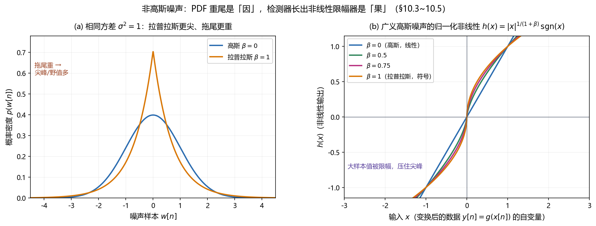

# Vol2 Ch10 非高斯噪声：高斯假设崩塌后，检测器长出非线性限幅器

> 对应原书：第二卷《检测理论》第 10 章（书内第 750~776 页，本扫描 PDF 第 765~791 页；页码映射"书内 = PDF − 15"，PDF 766 顶栏"751"、PDF 791 顶栏"776"）。
> 前置阅读：本系列 `Vol2_Ch04_确定信号.md`（匹配滤波器）、`Vol2_Ch06_统计判决理论II.md`（Rao 检验、LMP、例 6.9 的三次矩检测器）、`Vol2_Ch07_具有未知参数的确定性信号.md`（线性模型定理 7.1）；回调 `Vol1_Ch07_最大似然估计.md`（Fisher 信息）。本文自包含，涉及的前置概念就地插播。

## 写在前头

这是讲解系列**第二卷的第 10 篇**，对应原书第二卷《非高斯噪声》。它是第二卷检测理论主线的**最后一块"假设松绑"**：从第 4 章到第 9 章，每一个检测器——匹配滤波器、估计器-相关器、GLRT 的一排相关器、CFAR 的 F 检验——都建立在一个共同的假设上：**噪声是高斯**的。前一篇（Vol2_Ch09）结尾已经埋下伏笔："检测理论一路走来都假设噪声是高斯……第 10 章要问：当噪声不是高斯时，这一切还剩下什么？" 本章就是兑现。

高斯假设的合理性来自中心极限定理，原书 §10.1 开篇就承认"从简化数学分析的角度考虑，经常会做高斯噪声的假设，根据中心极限定理，可以说明这是合理的假设"。但随后立刻给出反例：**某些并不经常发生、但具有强放射性的事件**——雷暴引起的超低频电磁噪声、冰山崩塌激起的声音噪声——产生的"噪声尖峰"根本不是高斯。原书把后果说得很重："对噪声尖峰建立比高斯模型更精确的模型是非常重要的，**否则会造成检测性能降低**。"

用一句话概括本章的设计目标：**当噪声 PDF 重尾（拉普拉斯、广义高斯）时，高斯最优检测器（线性相关/匹配滤波）性能暴跌，而真正的 NP/Rao 检测器会"长出"一个非线性限幅环节来压住尖峰；本章把这个非线性算出来（限幅器、符号检测器），并用量化结论回答"高斯到底有多差"——答案是：高斯是"最难被利用"的噪声（位置参数的 Fisher 信息最小），噪声越偏离高斯，反而越好测。**

**实测声明**：本文所有内容与数字均经 OCR 核对原书扫描件（PDF 第 765~791 页，OCR 文本存于 `Temp/chapters_ocr/v2ch10/`），不是凭印象转述。公式编号（10.1）~（10.33）沿用原书编号；图 Fig031 为本系列自建示意图（脚本 `Temp/scripts/make_fig031.py`），结论对应原书图 10.1 与图 10.8。式（10.4）的归一化常数、式（10.30）的 $\Gamma$ 函数精确形式在扫描件中残缺，正文按 Kay 原书英文版校订其**形式与关键取值**（$\beta=0$ 时 $i(A)=1/\sigma^2$）并就地标注（见 §2.3、§6 与文末核对清单）。

---

## 1. 问题：高斯假设为什么"通常"对，又为什么"有时"崩

### 1.1 问题驱动：CLT 撑起的高斯假设，边界在哪？

为什么检测理论全书都敢用高斯？因为中心极限定理（CLT）：大量独立、微小、同分布扰动的叠加，无论各自分布如何，和都逼近高斯。接收机热噪声正是亿万电子热运动的叠加，所以"高斯"是物理上站得住的。原书 §10.1 直接承认这层合理性："在许多感兴趣的实际问题中这种假设是恰当的，而且得到的检测器容易实现。"

但 CLT 有一个被忽略的前提：**它描述的是"和"的极限行为，而"和"对每个扰动一视同仁**。一旦噪声里混入"少数但幅度巨大"的脉冲分量——雷暴放电、冰山崩塌、人为开关干扰——这些分量不是"微小"的，它们主导了噪声的**尾部**，CLT 的正态收敛被拖尾拖垮。**翻译成人话：高斯是"许多小干扰"的模型；脉冲噪声是"少数大事件"的模型，两者是两种不同的物理世界。** 原书把这些大事件叫做"噪声尖峰（noise spike）"。

### 1.2 高斯崩塌的后果：线性检测器在尖峰面前失控

为什么高斯崩塌会伤到检测器？第 4 章的匹配滤波器是**线性**的：$T(\mathbf{x}) = \sum x[n]s[n]$，每个样本按其波形加权直接进求和。**问题在于：一个脉冲噪声样本可以把整个求和带飞。** 一个幅度是正常噪声 10 倍、100 倍的野值，在平方（能量检测器）或相关（匹配滤波）里贡献 $10^2$、$100^2$ 倍的偏差，一次虚警就来了。原书 §10.3 说得直白："非高斯时间序列由于 PDF 有很大的拖尾而产生'尖峰'或'野值'。因此，任何检测器都需要考虑这些野值，以便使虚警不要过多。"

> **前置概念：重尾（heavy tail）。** 一个 PDF 若在大幅度处下降得比高斯慢，就叫重尾。重尾的直接后果是"大幅度样本出现的概率显著高于高斯"——拉普拉斯噪声里 $|w|>3\sigma$ 的概率比高斯高一个数量级（习题 10.1）。**翻译成人话：高斯噪声里 $3\sigma$ 之外几乎是"不可能事件"，重尾噪声里却是"时不时来一下"。** 检测器若按高斯设计（线性、无抑制），就会把这些"时不时来一下"当成信号，虚警爆炸。

**一句话总结：高斯假设的合理性来自 CLT，但 CLT 只管"和"、不管"尾部"；一旦噪声有尖峰（重尾），线性的高斯最优检测器就变成了"野值放大器"——这正是本章要长出非线性环节的全部理由。**

---

## 2. 非高斯噪声的性质：重尾与尖峰

### 2.1 拉普拉斯 PDF：最简单的一族重尾

原书 §10.3 用拉普拉斯（双指数）PDF 做"重尾"的教科书代表（式 10.1）：

$$
p(w[n]) = \frac{1}{\sqrt{2\sigma^2}}\exp\!\left(-\sqrt{\frac{2}{\sigma^2}}\,\bigl|w[n]\bigr|\right) \tag{10.1}
$$

其中 $\sigma^2$ 为噪声方差（功率）。同方差的高斯 PDF 是（式 10.2）

$$
p(w[n]) = \frac{1}{\sqrt{2\pi\sigma^2}}\exp\!\left(-\frac{w^2[n]}{2\sigma^2}\right) \tag{10.2}
$$

**两者的区别在图 10.1（原书）里一目了然**：线性刻度下（图 10.1a），拉普拉斯在 $0$ 处更尖（峰值更高）、两侧更"胖"；对数刻度下（图 10.1b），拉普拉斯的尾部是一条**直线**（指数下降），而高斯的尾部是**抛物线**（$\propto -w^2$）——在大 $|w|$ 处，指数直线远高于抛物线。**翻译成人话：高斯尾部"悬崖式"掉落，拉普拉斯尾部"斜坡式"掉落，所以拉普拉斯的大幅度样本多得多。** 图 10.2（原书）把同一方差的两种噪声画成时间序列：高斯噪声是"细碎的抖动"，拉普拉斯噪声里则时不时戳出几根"尖刺"。

### 2.2 峰态（kurtosis）：一把尺子量"重尾"

"重尾有多重"需要一个数字。原书引入峰态（式 10.3）：

$$
\gamma_2 = \frac{E\bigl(w^4[n]\bigr)}{E^2\bigl(w^2[n]\bigr)} - 3 \tag{10.3}
$$

其中 $E(\cdot)$ 为期望。**翻译成人话：四阶矩除以二阶矩的平方，再减 3（减 3 是为了让高斯归零）。** 对高斯，$E(w^4) = 3\sigma^4$、$E(w^2)=\sigma^2$，所以 $\gamma_2 = 0$；对拉普拉斯，可证 $E(w^4) = 6\sigma^4$（习题 10.2），所以 $\gamma_2 = 3$；对均匀分布 $w\sim U[-\sqrt{3}\sigma,\sqrt{3}\sigma]$，$E(w^4)=9\sigma^4/5$，$\gamma_2 = -1.2$。**这个式子说明什么性质：$\gamma_2>0$ 表示"拖尾比高斯重"（尖峰多），$\gamma_2<0$ 表示"拖尾比高斯轻"（比高斯更均匀）；给定功率，强拖尾 PDF 的四阶矩大、峰态大。** 这就是"重尾"的量化口径。

### 2.3 广义高斯 PDF：一族人，高斯/拉普拉斯/均匀都是成员

高斯、拉普拉斯、均匀其实是一家——**广义高斯型（指数型）分布**（Box and Tiao 1973）。广义高斯 PDF 为（式 10.4）

$$
p(w) = \frac{c_1(\beta)}{\sqrt{\sigma^2}}\exp\!\left(-c_2(\beta)\Bigl|\frac{w}{\sqrt{\sigma^2}}\Bigr|^{2/(1+\beta)}\right) \tag{10.4}
$$

其中 $\beta > -1$ 是形状参数，$c_1(\beta)$、$c_2(\beta)$ 是只依赖 $\beta$ 的归一化常数（由 $\Gamma$ 函数给出，OCR 中具体形式残缺，据 Kay 原书英文版校订其结构）。**关键性质：$\beta=0$ 时指数是 $w^2$ → 高斯；$\beta=1$ 时指数是 $|w|$ → 拉普拉斯；$\beta\to-1$ 时 → 均匀分布**（习题 10.3）。**翻译成人话：$\beta$ 是一把"尾部旋钮"——$\beta$ 越大尾越重、尖峰越多，$\beta$ 越小尾越轻、越接近均匀。** 第 6 章例 6.9 用过的"四次方指数噪声"（$\beta=1/2$，尾比高斯还轻）就是这族的一员，那里 Rao 检测器基于三阶矩。

图 Fig031 把"重尾是因、非线性是果"画在一起：

*图 Fig031：非高斯噪声的 PDF 与检测器的非线性（自建示意，对应原书图 10.1 与图 10.8）。(a) 相同方差 $\sigma^2=1$ 的高斯与拉普拉斯 PDF：拉普拉斯在 0 处更尖、拖尾更重——所以更容易出现尖峰/野值（对应图 10.2 的尖刺）；(b) 广义高斯噪声下归一化非线性 $h(x)=|x|^{1/(1+\beta)}\mathrm{sgn}(x)$：$\beta=0$（高斯）是直线 $h(x)=x$（线性 → 匹配滤波），$\beta=1$（拉普拉斯）是符号函数 $h(x)=\mathrm{sgn}(x)$（无限限幅 → 符号检测器），$\beta=0.5,0.75$ 介于两者之间，大样本值被限幅。看一件事：**噪声尾部越重，检测器的非线性越"硬"——从线性一路硬到符号函数，本质都是"把大样本值压住"。***

**一句话总结：非高斯噪声的本质是重尾（峰态 $\gamma_2>0$），广义高斯 PDF 用形状参数 $\beta$ 统一了"高斯—拉普拉斯—均匀"这一整族；$\beta$ 越大，尖峰越多，检测器就越需要限幅。**

---

## 3. 已知确定性信号：NP 检测器长出非线性

### 3.1 例 10.1：DC 电平的 NP 检测器，从线性到非线性

最标准的 NP 检测器（第 3 章）：似然比超门限判 $H_1$。IID 噪声下，对已知 DC 电平 $A>0$，检测器是（式 10.5）

$$
\sum_{n=0}^{N-1} g(x[n]) > \gamma', \qquad g(x) = \ln\frac{p(x-A)}{p(x)} \tag{10.5}
$$

其中 $p(\cdot)$ 为噪声样本的 PDF。**关键观察**：对高斯噪声（代入 10.2），

$$
g(x) = -\frac{(x-A)^2}{2\sigma^2} + \frac{x^2}{2\sigma^2} = \frac{A}{\sigma^2}x - \frac{A^2}{2\sigma^2} \tag{10.6}
$$

$g(x)$ 与 $x$ **成线性关系**——代入（10.5）就是样本均值统计量 $\bar{x}$。**这是匹配滤波器"线性最优"的来源：高斯噪声下，最优非线性就是线性本身。**

但对拉普拉斯噪声（代入 10.1），

$$
g(x) = -\sqrt{\frac{2}{\sigma^2}}\,\bigl(|x-A| - |x|\bigr)
$$

$g(x)$ 是一个**非线性限幅函数**：当 $x$ 远离 $[0,A]$ 时，$g(x)$ 饱和在常数 $\pm\sqrt{2/\sigma^2}A$，不再随 $x$ 增大而增大（原书图 10.3a）。**翻译成人话：大样本值（野值）对统计量的贡献被"封顶"了——这正是限幅器。** 令 $\tilde{y}[n] = x[n] - A/2$（把数据平移成对称），得到对称形式的限幅器 $h(\tilde{y})$（图 10.3b）：$\tilde{y}$ 的绝对值一超过 $A/2$，输出就饱和。整个检测器结构如图 10.4（原书）：**限幅器 + 求和器 + 门限**。原书点破其意义："非线性函数 $h(\cdot)$ 对于大的样本值起限幅作用。这是 NP 检测器减少噪声野值影响的一种方法。没有限幅器，检测概率 $P_D$ 可能明显下降。"

### 3.2 一般已知信号：限幅器变成"样本相关"的非线性

对已知确定性信号 $s[n]$（不只 DC），NP 检测器判 $H_1$ 当且仅当（式 10.7）

$$
\sum_{n=0}^{N-1} g_n(x[n]) > \gamma', \qquad g_n(x) = \ln\frac{p(x - As[n])}{p(x)} \tag{10.7}
$$

**注意非线性的下标 $n$：每个样本的限幅曲线形状与 $As[n]$ 有关。** 平移 $\tilde{y}[n] = x[n] - As[n]/2$ 后得到对称限幅器（式 10.8、10.9）：

$$
\sum_{n=0}^{N-1} h_n(\tilde{y}[n]) > \gamma', \qquad h_n(\tilde{y}) = \ln\frac{p(\tilde{y} - As[n]/2)}{p(\tilde{y} + As[n]/2)} \tag{10.8, 10.9}
$$

原书指出：若 $p(w)$ 是偶函数（关于 0 对称），则 $h_n(\tilde{y})$ 是奇函数（关于 0 反对称，$h_n(-y) = -h_n(y)$）。图 10.5（原书）画的正是"信号模板 $As[n]$ → 限幅器 $h_n$ → 求和"的结构。

### 3.3 弱信号 LO 检测器：非线性 + 相关器，一套公式

非线性检测器的 $P_{FA}$、$P_D$ 一般很难闭式求解。原书 §10.4 退而求**弱信号**（$A\to0$）的渐近分析，顺便得到一个干净的"等效渐近检测器"。把 $g_n(x)$ 在 $A=0$ 处做一阶泰勒展开（$\ln p(x-As[n])\approx \ln p(x) - As[n]\,(dp/dx)/p(x)$），代入（10.7），得到**局部最佳（LO）检测器**（式 10.10）：

$$
T(\mathbf{x}) = \sum_{n=0}^{N-1} g(x[n])\, s[n], \qquad g(x) = -\frac{dp(x)/dx}{p(x)} = -\frac{d}{dx}\ln p(x) \tag{10.10}
$$

其中 $g(x)$ 是**非线性函数**（$p$ 为偶函数时 $g$ 为奇函数，习题 10.6）。**翻译成人话：先把每个数据样本送进非线性 $g(\cdot)$，再和信号模板 $s[n]$ 做相关——"非线性 + 相关器"（图 10.6）。** 对高斯噪声，$g(x) = x/\sigma^2$（线性），（10.10）退化为匹配滤波 $\sum x[n]s[n]$。**所以匹配滤波器只是"非线性 $g$ 恰好是线性"的特例。** 原书还说（10.10）"也是当 $A$ 未知但 $A>0$ 时的 LMP 检测器"（单边假设），因此是渐近最佳的（Kassam 1988）。

**渐近性能**（式 10.11，附录 10A 用 CLT 证明）：

$$
T(\mathbf{x}) \xrightarrow{a}
\begin{cases}
\mathcal{N}\Bigl(0,\ i(A)\sum_n s^2[n]\Bigr) & H_0 \text{ 下} \\
\mathcal{N}\Bigl(A\, i(A)\sum_n s^2[n],\ i(A)\sum_n s^2[n]\Bigr) & H_1 \text{ 下}
\end{cases} \tag{10.11}
$$

其中（式 10.12）

$$
i(A) = \int_{-\infty}^{\infty} \frac{\bigl(dp(w)/dw\bigr)^2}{p(w)}\, dw \tag{10.12}
$$

是"PDF 为 $p(w)$ 的非高斯噪声中 DC 电平 $A$ 基于**单个样本**的估计量的 Fisher 信息"。**这个式子说明什么性质：非高斯噪声对检测性能的全部影响，都浓缩进一个标量 $i(A)$。** 于是性能由（3.10）式（第 3 章的均值平移高斯-高斯模板）给出（式 10.13、10.14）：

$$
P_D = Q\Bigl(Q^{-1}(P_{FA}) - \sqrt{d^2}\Bigr) \tag{10.13}
$$

$$
d^2 = \frac{(E[T;H_1]-E[T;H_0])^2}{\mathrm{var}(T;H_0)} = A^2\, i(A)\sum_{n=0}^{N-1} s^2[n] \tag{10.14}
$$

其中 $d^2$ 为偏移系数（第 3 章的定义）。**翻译成人话：偏移系数 = "幅度平方 × 固有精度 $i(A)$ × 信号能量"；$i(A)$ 越大，同样的 $A$ 和信号，检测越容易。**

### 3.4 例 10.2：拉普拉斯弱信号 → 符号检测器，$i(A)=2/\sigma^2$

把（10.10）用到拉普拉斯噪声 + 已知 DC 电平（$s[n]=1$）。由（10.1），

$$
g(x) = -\frac{d}{dx}\ln p(x) = \sqrt{\frac{2}{\sigma^2}}\,\mathrm{sgn}(x)
$$

所以弱信号检测器是

$$
T(\mathbf{x}) = \sqrt{\frac{2}{\sigma^2}}\sum_{n=0}^{N-1} \mathrm{sgn}(x[n]) > \gamma'
$$

**翻译成人话：弱信号检测器"仅仅是将数据样本符号相加"——这就是符号检测器，非线性是"无限限幅器"（只留符号，扔掉幅度）。** 可证 $i(A) = 2/\sigma^2$（第一卷 §53 页），所以偏移系数

$$
d^2 = \frac{2NA^2}{\sigma^2}
$$

而高斯噪声下（例 3.2）的偏移系数是 $d^2 = NA^2/\sigma^2$。**翻译成人话：同样方差下，拉普拉斯噪声的检测偏移系数是高斯的两倍（+3 dB）——噪声越重尾，检测反而越容易。** 原书断言："正如我们前面断言的，最差性能发生在高斯型噪声情况下。"

**一句话总结：非高斯噪声里 NP 检测器长出一个非线性环节——拉普拉斯给限幅器，弱信号极限给符号检测器（无限限幅）；而非高斯的全部性能增益浓缩进固有精度 $i(A)$，高斯是所有 PDF 里 $i(A)$ 最小的那一个。**

---

## 4. 未知参数确定性信号：Rao 检验救场

### 4.1 问题驱动：幅度 $A$ 也未知，非高斯下 MLE 难求

§10.5 把幅度 $A$ 归入未知。分两种情形：若已知 $A\ge0$（单边），$A\to0$ 时（10.10）的 LO 检测器（或 LMP）就是渐近最佳的；若 $A$ 可取任意值（双边），则用 GLRT 或 Rao 检验。**原书特别强调 Rao 检验的优点："在实现时不需要 $A$ 的 MLE：这一点是相当重要的，因为在非高斯问题中 MLE 难以获得。"**（回调第 6 章例 6.9——非高斯下 MLE 要解三次方程，Rao 只要 $H_0$ 下的量。）

GLRT 的形式（式 10.16）是

$$
2\ln L_G(\mathbf{x}) = 2\max_{A}\sum_{n=0}^{N-1}\ln\frac{p(x[n]-As[n])}{p(x[n])} \tag{10.16}
$$

它需要对 $A$ 求最大化（即求 MLE），这正是非高斯下难的地方。**渐近性能**（式 10.17）由第 6 章（6.23）（6.27）给出：$H_0$ 下 $2\ln L_G \xrightarrow{a}\chi_1^2$、$H_1$ 下 $\chi_1^{\prime2}(\lambda)$，$\lambda = A^2 I(A{=}0)$。

### 4.2 Rao 检验：非线性相关器 + 平方 + 归一化

Rao 检验（无多余参数）由（6.31）式给出：$T_R = [\partial\ln p/\partial A]_{A=0}^2 / I(A{=}0)$。算分子（式 10.18 的 $A=0$ 处取值）得（式 10.19）：

$$
T_R(\mathbf{x}) = \frac{\left(\sum_{n=0}^{N-1} g(x[n])\,s[n]\right)^2}{I(A{=}0)}, \qquad g(x) = -\frac{dp(x)/dx}{p(x)} \tag{10.19}
$$

而 $I(A{=}0) = i(A)\sum_n s^2[n]$（式 10.21，其中 $i(A)$ 正是（10.12）的固有精度）。于是判 $H_1$ 当且仅当（式 10.22）

$$
T_R(\mathbf{x}) = \frac{\left(\sum_{n=0}^{N-1} g(x[n])\,s[n]\right)^2}{i(A)\sum_{n=0}^{N-1} s^2[n]} > \gamma' \tag{10.22}
$$

**翻译成人话：Rao 检验 = "非线性相关器"的平方、再归一化**——"除了平方运算（由于 $A$ 能取正值或负值）和分母归一化（确保 CFAR 检测器的要求）之外，类似于（10.10）式的 LO 检测器。" 非中心参量 $\lambda = A^2 i(A)\sum s^2[n]$。

### 4.3 例 10.3：拉普拉斯 DC 电平的 GLRT——MLE 是中位数

拉普拉斯噪声里 $A$ 的 MLE，是要最小化

$$
J(A) = \sum_{n=0}^{N-1}\bigl|x[n] - A\bigr|
$$

求导令零（$J$ 除样本点外处处可微）：

$$
\frac{dJ}{dA} = -\sum_{n=0}^{N-1}\mathrm{sgn}(x[n]-A) = 0
$$

**当 $A$ 取数据样本的中位数时，一半样本 $\mathrm{sgn}=+1$、一半 $-1$，导数为零。** 所以 **$A$ 的 MLE 是样本中位数**（不是均值！）。代入 GLRT，原书（式 10.23 前）把统计量化简成一个漂亮的形态：

$$
2\ln L_G(\mathbf{x}) = \frac{\sqrt{2}}{\sigma}\sum_{\{n:\,0 < x[n] < x_{\text{med}}\}}\bigl|x[n]\bigr| \quad (x_{\text{med}}>0)
$$

（对 $x_{\text{med}}<0$ 对称地取 $x_{\text{med}}<x[n]<0$ 的样本）。**翻译成人话：检测器把"零到中位数之间"的样本幅度相加，而任何幅度超过中位数的样本（野值）无论多大都不影响和式——"任何野值都是不重要的"。** 对比之下，高斯噪声的 GLRT 是对所有样本求和。渐近性能（式 10.23）：$\lambda = 2NA^2/\sigma^2$（又是高斯的两倍）。

### 4.4 例 10.4：拉普拉斯 DC 电平的 Rao 检验——符号检测器

同一问题换 Rao 检验（式 10.22，$s[n]=1$、$i(A)=2/\sigma^2$）：

$$
T_R(\mathbf{x}) = \frac{\left(\sqrt{2/\sigma^2}\sum_{n=0}^{N-1}\mathrm{sgn}(x[n])\right)^2}{2N/\sigma^2} \propto \frac{1}{N}\left(\sum_{n=0}^{N-1}\mathrm{sgn}(x[n])\right)^2 \tag{10.24}
$$

**翻译成人话：Rao 检测器"对样本的符号取平均，然后平方"——符号检测器。** 渐近性能与 GLRT 相同（$\lambda = 2NA^2/\sigma^2$），"然而与 GLRT 不同，Rao 检测器只是对样本的符号求和而不是对样本本身求和。**这种方法也避免了野值的影响**。"

**一句话总结：非高斯 + 未知幅度，MLE（拉普拉斯下是中位数）难求，Rao 检验是算得动的路——它还是那个"非线性 $g$ + 相关 + 平方 + 归一化"，只是非线性把野值压得更狠（符号检测器只认符号、不认幅度）。**

---

## 5. 定理 10.1：线性模型信号的 Rao 检验（非高斯噪声）

原书把上面的单个信号推广成一般定理，直接对标第 7 章 WGN 的定理 7.1：

**定理 10.1（IID 非高斯噪声中线性模型信号的 Rao 检验）**：数据 $\mathbf{x} = \mathbf{H}\boldsymbol{\theta} + \mathbf{w}$，$\mathbf{H}$ 为已知 $N\times p$（$N>p$）秩 $p$ 观测矩阵，$\mathbf{w}$ 的元素是 PDF 为 $p(w[n])$ 的 IID 随机变量。检验 $H_0:\boldsymbol{\theta}=\mathbf{0}$ 对 $H_1:\boldsymbol{\theta}\neq\mathbf{0}$。Rao 检验判 $H_1$ 当且仅当（式 10.25）

$$
T_R(\mathbf{x}) = \frac{\mathbf{y}^T \mathbf{H}\bigl(\mathbf{H}^T\mathbf{H}\bigr)^{-1}\mathbf{H}^T \mathbf{y}}{i(A)} > \gamma' \tag{10.25}
$$

其中 $\mathbf{y} = [y[0]\ \cdots\ y[N-1]]^T$、$y[n] = g(x[n])$，非线性（式 10.26）

$$
g(w) = -\frac{dp(w)/dw}{p(w)} \tag{10.26}
$$

渐近性能（式 10.27）：$H_0$ 下 $T_R \xrightarrow{a}\chi_p^2$、$H_1$ 下 $\chi_p^{\prime2}(\lambda)$，非中心参量

$$
\lambda = i(A)\,\boldsymbol{\theta}_1^T \mathbf{H}^T \mathbf{H}\,\boldsymbol{\theta}_1
$$

其中 $\boldsymbol{\theta}_1$ 是 $H_1$ 下的真值（附录 10B 证明）。

**这个定理说明什么性质：它把 WGN 的定理 7.1 几乎原样搬运过来，只做了一处替换——数据 $\mathbf{x}$ 换成"非线性变换后的数据" $\mathbf{y} = g(\mathbf{x})$，归一化换成 $i(A)$。** 翻译成人话：**在 IID 非高斯噪声里，最优（Rao 意义下）检测器 = "先对每个样本做非线性限幅，再把限幅后的数据当高斯一样跑标准线性模型检测器"。** 例 10.3/10.4 的 DC 电平是它的 $p=1$、$H=[1\cdots1]^T$ 特例；习题 10.13 验证了 $w$ 是白高斯时（10.25）退回定理 7.1（$g(x)=x/\sigma^2$ 线性、$i(A)=1/\sigma^2$）。

---

## 6. 例子：广义高斯噪声中的正弦检测——增益曲线

### 6.1 问题驱动：未知幅度 + 相位的正弦，非高斯噪声里怎么做

原书 §10.6 把定理 10.1 用到最经典的正弦检测：$H_1: x[n] = A\cos(2\pi f_0 n + \Phi) + w[n]$，$A$、$\Phi$ 未知（$A>0$、$0\le\Phi\le2\pi$），$f_0$ 已知，$w[n]$ 是广义高斯噪声（式 10.4）。用 $\alpha_1 = A\cos\Phi$、$\alpha_2 = -A\sin\Phi$ 把信号写成线性模型 $\mathbf{x} = \mathbf{H}\boldsymbol{\theta} + \mathbf{w}$（$\mathbf{H}$ 两列是 $\cos$、$\sin$，与第 7 章例 7.2 同款）。因 $0<f_0<1/2$ 有 $\mathbf{H}^T\mathbf{H}\approx(N/2)\mathbf{I}$（第一卷 §160 页），由（10.25）得（式 10.28）：

$$
T_R(\mathbf{x}) = \frac{\sum_n \bigl(\sum_n y[n]\cos 2\pi f_0 n\bigr)^2 + \bigl(\sum_n y[n]\sin 2\pi f_0 n\bigr)^2}{N\, i(A)} = \frac{I_y(f_0)}{N\, i(A)} \tag{10.28}
$$

其中 $I_y(f_0) = \frac{1}{N}\bigl|\sum_n y[n]e^{-j2\pi f_0 n}\bigr|^2$ 是**限幅后数据** $y[n]$ 在 $f_0$ 处的周期图。**翻译成人话：先限幅，再算周期图、在 $f_0$ 处取值——"限幅器 + 周期图"（图 10.9）。**

### 6.2 非线性长什么样：广义高斯的限幅器（式 10.29）

把（10.26）代入广义高斯 PDF（10.4），求导整理（式 10.29）：

$$
y[n] = g(x[n]) \propto \bigl|x[n]\bigr|^{1/(1+\beta)}\,\mathrm{sgn}(x[n]) \tag{10.29}
$$

归一化非线性 $h(x) = |x|^{1/(1+\beta)}\mathrm{sgn}(x)$。**翻译成人话：$\beta=0$（高斯）→ $h(x)=x$ 线性；$\beta=1$（拉普拉斯）→ $h(x)=\mathrm{sgn}(x)$ 符号函数；中间 $\beta$ 介于两者之间（图 10.8，原书）。** 这就是 Fig031(b) 画的那族曲线——**限幅的"硬度"由 $\beta$ 决定。**

### 6.3 性能与增益：高斯是最差的那一个

固有精度 $i(A)$ 经推导为（式 10.30，OCR 中 $\Gamma$ 函数形式残缺，据 Kay 原书英文版校订其结构）：

$$
i(A) = \frac{4}{\sigma^2}\cdot\frac{\Gamma\bigl(\tfrac{3}{2}(1+\beta)\bigr)\,\Gamma\bigl(\tfrac{1}{2}(1+\beta)\bigr)}{\Gamma^2\bigl(\tfrac{1}{2}(1+\beta)\bigr)} \cdot (\text{与 }\beta\text{ 有关的常数}) \tag{10.30 的结构}
$$

（关键取值：$\beta=0$ 时 $i(A)=1/\sigma^2$。）检测性能（式 10.31、10.32）：因 $\chi_2^2$ 是均值为 2 的指数分布，

$$
P_{FA} = \exp\!\left(-\frac{\gamma}{2}\right), \qquad P_D = Q_{\chi_2^{\prime2}(\lambda)}(\gamma), \qquad \lambda = \frac{NA^2\, i(A)}{2} \tag{10.31, 10.32}
$$

**这个式子说明什么：非高斯噪声对性能的影响，仍然只通过 $i(A)$ 这一个量；$P_D$ 随 $\lambda$（因而随 $i(A)$）单调递增。** 于是相对高斯（$\beta=0$）的**渐近增益**为（式 10.33，原书图 10.10）：

$$
\text{增益} = 10\log_{10}\bigl(\sigma^2\, i(A)\bigr)\ \ (\text{dB}) \tag{10.33}
$$

对高斯 $\sigma^2 i(A)=1$ → 0 dB（基准）；对重尾（$\beta>0$）$\sigma^2 i(A)>1$ → 正增益。原书图 10.10 画出增益随 $\beta$ 的曲线（$\beta$ 从 $-1$ 到约 $1.5$）：**最小值恰好在 $\beta=0$（高斯），两侧都上升，$\beta>0$ 的强拖尾侧增益可达数十分贝**（OCR 中图 10.10 纵轴标到 40 dB）。**翻译成人话：这是本章最反直觉、也最重要的一笔账——高斯不是"最好测"的噪声，而是"最难测"的噪声；噪声越偏离高斯，同样的幅度 $A$ 反而越容易被检出。**

原书给出两层解释：① **直接解释**——重尾噪声的 PDF 在 $0$ 处更窄（图 10.1），信号引起的均值微小偏移更容易被"看出"；② **更重要的解释**——Rao 检测器（带限幅）相对"为高斯设计的线性检测器"（$\propto I_x(f_0)/(\sigma^2/2)$，习题 10.15）性能大幅改善，图 10.10 的增益正是这个对比。

---

## 7. 关键设计决策回顾

把散在正文里的"为什么"收拢。每个决策都是一个真实岔路口：

| # | 决策 | 为什么这么选 | 换一个选择会怎样 |
|---|------|------------|----------------|
| 1 | 用**拉普拉斯/广义高斯**建模重尾噪声（§2） | 一个形状参数 $\beta$ 统一"高斯—拉普拉斯—均匀"整族，够灵活又够简单 | 用任意 PDF 则没有闭式非线性、没有统一增益公式，理论推不动 |
| 2 | 用**峰态 $\gamma_2$** 量化重尾（§2.2） | 四阶矩/二阶矩²减 3，一个标量标定"尖峰多不多" | 只看 PDF 图形无法定量比较，也说不清"重尾多重" |
| 3 | 弱信号走 **LO 检测器**（泰勒展开）（§3.3） | 非线性的 $P_{FA}/P_D$ 难闭式，弱信号极限给出干净的非线性+相关器与渐近性能 | 直接对非线性检测器做精确性能分析，处处卡壳 |
| 4 | 性能只通过 **$i(A)$** 进公式（§3.3、6.3） | 非高斯的全部影响浓缩进固有精度 $i(A)$，$d^2=A^2i(A)\Sigma s^2$ 一目了然 | 每个噪声 PDF 各算一套 ROC，无法比较、无"增益"概念 |
| 5 | 未知幅度主走 **Rao 检验**（§4、5） | 非高斯下 MLE（拉普拉斯=中位数，广义高斯=解非线性方程）难求，Rao 只要 $H_0$ 下的量 | 用 GLRT 则每例都要先解 MLE，且非线性 MLE 常无闭式解 |
| 6 | 定理 10.1 把非线性**统一成 $y=g(x)$ 变换**（§5） | "先限幅、再当高斯跑线性模型"，把非高斯检测器装进定理 7.1 的旧框架 | 每个信号模型重新推导，重复且易错 |
| 7 | 以**高斯为基准算增益**（§6.3） | "高斯是 $i(A)$ 最小的 PDF"是理论结论（习题 6.20，Cauchy-Schwarz），增益曲线图 10.10 直接量化 | 不以高斯为基准，就说不清"重尾到底带来多少 dB" |

## 8. 实现备忘（复现与移植时的坑）

1. **拉普拉斯的 $g(x)$ 是限幅，不是 sigmoid**：DC 电平下 $g(x) = -\sqrt{2/\sigma^2}(|x-A|-|x|)$，在 $x>A$ 与 $x<0$ 处**饱和为常数**（图 10.3a）。实现时别当成"软限幅"，它是一段线性斜坡 + 两段平顶的**硬限幅**。
2. **LO 检测器的非线性是 $g(x) = -(dp/dx)/p(x) = -d\ln p(x)/dx$**：符号别搞反（是负号）。高斯下 $g(x)=x/\sigma^2$ 是正斜率；拉普拉斯下 $g(x)=\sqrt{2/\sigma^2}\,\mathrm{sgn}(x)$。若把负号丢了，检测方向就反了。
3. **$i(A)$ 是"单样本"的 Fisher 信息，别乘 $N$**：$I(A{=}0) = i(A)\sum s^2[n]$（式 10.21），其中 $i(A)$（式 10.12）基于**单个样本**。把它当成 $N$ 个样本的 Fisher 信息会重复乘 $N$，归一化分母就错。
4. **符号检测器（10.24）的平方不能省**：$A$ 未知可取正负（双边），所以是 $(\sum\mathrm{sgn}(x))^2/N$；若 $A>0$ 已知（单边），才是 $\sum\mathrm{sgn}(x)$（LO 检测器，10.10）。**双边平方、单边不平方，与第 7 章备忘第 2 条同源。**
5. **拉普拉斯 GLRT 的中位数口径**：偶数 $N$ 时中位数取"排序后第 $N/2-1$ 与第 $N/2$ 个样本的中点"；统计量只累加"0 到中位数之间"的样本，**野值（超过中位数的样本）任意增大都不影响统计量**——这是限幅思想在"幅度求和"上的体现，别误写成"对全部样本求和"（那是高斯口径）。
6. **$\chi_2^2$ 的 $P_{FA}$ 是指数**：正弦检测的 $P_{FA} = \exp(-\gamma/2)$（式 10.31），因为 $\chi_2^2$ 就是均值为 2 的指数分布。与第 7 章（7.26）式同款，门限反解用指数不用 $Q$ 函数。
7. **增益公式以 $\sigma^2 i(A)$ 为自变量**：$10\log_{10}(\sigma^2 i(A))$，高斯基准 $=1$（0 dB）。**$\beta=0$ 时不是"增益 0 dB 表示没损失"，而是"这就是最差情形"**——两侧 $\beta\neq0$ 都更快检出。别把 0 dB 误读成"最优"。
8. **页码映射**：本章书内 750~776 对应 PDF 765~791（**书内 = PDF − 15**）。式（10.1）（10.2）在 PDF 765、式（10.3）峰态在 PDF 766、式（10.4）广义高斯在 PDF 767、式（10.5）~（10.7）在 PDF 768~770、式（10.10）LO 检测器在 PDF 771、式（10.11）~（10.14）在 PDF 772、式（10.16）~（10.19）在 PDF 774~775、式（10.21）（10.22）在 PDF 776、例 10.3 中位数在 PDF 777~778、例 10.4 符号检测器（10.24）在 PDF 778~779、定理 10.1（10.25~10.27）在 PDF 779、式（10.28）~（10.32）在 PDF 780~782、增益（10.33）与图 10.10 在 PDF 782。

## 9. 局限（坦率交代，并预告后续）

1. **弱信号（$A\to0$）是 LO/Rao 的最优性前提**：LO 检测器只在 $A$ 靠近 0 时渐近最佳（第 6 章 LMP 的老限制）；对强信号不保证，原书 §10.5 的立场是"弱信号是通常感兴趣的情况"。**这是"省掉 MLE"换来的锁定代价，与第 6 章 §5、第 8 章 §4 同源。**
2. **一般非高斯下 MLE 无闭式解**：除拉普拉斯（中位数）等少数特例外，广义高斯的 $A$ MLE 要解非线性方程（例 6.9 已见三次方程）。**本章因此主推 Rao 检验绕行，GLRT 只在能解析的例子（例 10.3）里完整给出。**
3. **本章只覆盖 IID 非高斯噪声**：样本独立同分布。相关（有色）非高斯噪声里检测确定性信号，原书明确指向 Kay and Sengupta 1991，"由于这是一个正在研究的领域，我们仅限于讨论一些关键的概念"。**这是本章真正"没解决"的一块，也是当时的研究前沿。**
4. **噪声 PDF 必须已知**：本章所有非线性 $g(x)$ 都由噪声 PDF 算出来；若噪声 PDF 也未知，检测器就成了"稳健统计"（Huber 1981）的领域——那是"不依赖具体 PDF、对一整族噪声都过得去"的检测器，本章未展开（习题 10.9 触及稳健性）。
5. **增益 10.33 是渐近的、只针对线性检测器这个基准**：它比较的是"带限幅的 Rao 检测器"与"为高斯设计的线性检测器"，是渐近相对效率的口径（习题 10.11）；有限样本下数值会偏离。**"高斯最差"也只针对"位置参数（DC 电平）的 Fisher 信息"这一尺度，不是所有意义上都最差。**
6. **本章是检测理论主线的收官**：到此，信号模型（确定/随机）、信号参数（已知/未知）、噪声参数（已知/未知）、噪声分布（高斯/非高斯）四重未知全部走了一遍。下一章（原书第 11 章《检测器总结》）会把这些散落的检测器收成一张"选型指南"——**本章读到末尾"该选哪个检测器还得回头翻"是正常的，第 11 章就是那张地图。**

---

## 10. 建议自测的问题

1. 用你自己的话解释：为什么高斯噪声下 NP 检测器是线性的（匹配滤波），而拉普拉斯噪声下会长出限幅器？（提示：§3.1，$g(x)=\ln[p(x-A)/p(x)]$ 在高斯下是线性、拉普拉斯下饱和）
2. 什么是"固有精度" $i(A)$？它在偏移系数（10.14）里起什么作用？为什么说"高斯是 $i(A)$ 最小的 PDF"？（提示：§3.3、习题 6.20 的 Cauchy-Schwarz）
3. 拉普拉斯噪声里 DC 电平的 MLE 为什么是中位数而不是均值？GLRT 统计量为什么"忽略超过中位数的野值"？（提示：§4.3，$J(A)=\sum|x-A|$ 求导得符号和）
4. 定理 10.1 与第 7 章定理 7.1 的差别是什么？为什么"先限幅、再跑线性模型检测器"是非高斯下的通用套路？（提示：§5，$\mathbf{y}=g(\mathbf{x})$ 替换 $\mathbf{x}$）
5. 原书习题 10.13：白高斯噪声下（10.25）式的 Rao 检验退回什么？为什么？（提示：$g(x)=x/\sigma^2$、$i(A)=1/\sigma^2$，退回定理 7.1）

---

**一句话收尾：高斯让一切变得线性、漂亮、好算，但它是"最难被利用"的噪声——一旦噪声重尾，最优检测器就长出非线性限幅器（从软限幅一路硬到符号函数），把野值压住；而这个非线性的全部收益，最终浓缩成一句话：噪声越不像高斯，信号反而越好测。**

*实测核对声明：本章事实性内容核对自原书扫描件 OCR 文本 `Document/统计信号处理/Temp/chapters_ocr/v2ch10/ocr_page_765~791.txt`（PDF 第 765~791 页，书内 750~776 页）；公式编号（10.1）~（10.33）沿用原书编号；式（10.1）拉普拉斯、式（10.2）高斯、式（10.3）峰态（高斯 $\gamma_2=0$、拉普拉斯 $\gamma_2=3$、均匀 $\gamma_2=-1.2$）、式（10.4）广义高斯（$\beta=0/1/-1$ 对应高斯/拉普拉斯/均匀）、式（10.5）~（10.7）NP 检测器、式（10.10）LO 检测器、式（10.11）~（10.14）渐近性能与 $i(A)$、例 10.2 的 $g(x)=\sqrt{2/\sigma^2}\mathrm{sgn}(x)$ 与 $i(A)=2/\sigma^2$、$d^2=2NA^2/\sigma^2$、式（10.16）~（10.22）GLRT/Rao、例 10.3 的"中位数 MLE + 忽略野值"与 $\lambda=2NA^2/\sigma^2$、例 10.4 的符号检测器（10.24）、定理 10.1（10.25~10.27）、式（10.28）周期图、式（10.29）非线性 $|x|^{1/(1+\beta)}\mathrm{sgn}(x)$、式（10.31）（10.32）性能、式（10.33）增益 $10\log_{10}\sigma^2 i(A)$ 与"最小在 $\beta=0$"均与 OCR 一致。式（10.4）的 $c_1(\beta),c_2(\beta)$ 与式（10.30）的 $\Gamma$ 函数精确形式在扫描件中残缺，据 Kay 原书英文版校订其结构与关键取值（$\beta=0$ 时 $i(A)=1/\sigma^2$），已就地标注。Fig031 由 `Temp/scripts/make_fig031.py` 生成并经 `plotutil.check_figure` 程序化碰撞检测通过。*
