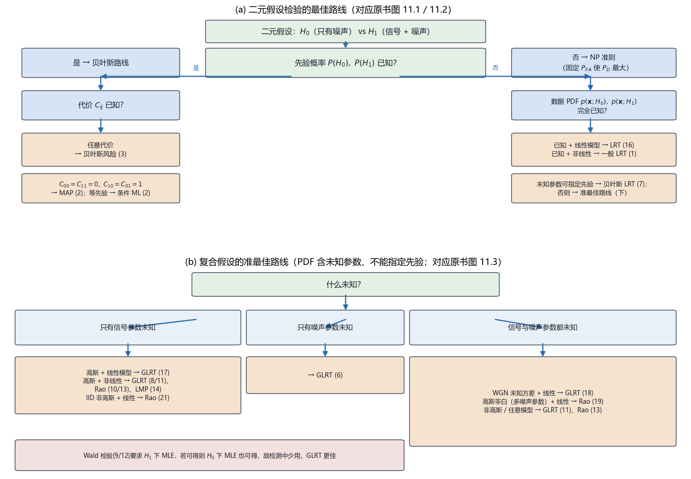

# Vol2 Ch11 检测器总结：手里有多少信息，就选多"贵"的检测器——全卷收账章

> 对应原书：第二卷《检测理论》第 11 章（书内第 777~796 页，本扫描 PDF 第 792~811 页；页码映射"书内 = PDF − 15"，PDF 793 顶栏"778"、PDF 811 顶栏"796"）。
> 前置阅读：本系列 `Vol2_Ch03_统计判决理论I.md`（NP、MAP、贝叶斯风险）、`Vol2_Ch04_确定信号.md`（匹配滤波器）、`Vol2_Ch05_随机信号.md`（估计器-相关器）、`Vol2_Ch06_统计判决理论II.md`（GLRT、Wald、Rao、LMP）；回调 `Vol1_Ch07_最大似然估计.md` 与 `Vol1_Ch12_线性贝叶斯估计量.md`（MMSE）。本文自包含，涉及的前置概念就地插播。

## 写在前头

这是讲解系列**第二卷的第 11 篇**，对应原书第二卷《检测器总结》。它在第二卷里的角色，与第一卷的《估计量总结》（原书第 14 章）完全对称——**是全卷的"收账章"**：前 10 章依次造出了二十来种检测器（NP、MAP、贝叶斯风险、GLRT、Wald、Rao、LMP、匹配滤波器、能量检测器、估计器-相关器、CFAR……），每一种都在"某种已知条件下"最优或准最佳。但工程上拿到一个新问题，真正难的不是"会不会算某个检测器"，而是**"这一堆里到底选谁"**。

原书 §11.1 一开头就把这个困境摆明：选一个检测器取决于"最佳准则的选择"和"数据的统计特性"两个因素；**实际的问题里，我们既不能保证求出最佳检测器，就算碰巧求出来了，也不能保证实现得了它。** 所以唯一的出路是：把每种方法的适用条件、判决形式、代价清单理清楚，做成一张"按已知信息 → 推荐方法 → 理由 → 代价"的选型地图。

**本章一句话设计目标：把散落前 10 章的 20 多种检测器，收拢成"先问四件事（先验已知吗？代价已知吗？数据 PDF 已知吗？什么参数未知？），每答一题就淘汰一批检测器"的决策流程，并给线性模型这一最常用场景配一套显式公式。** 读完本章，你手里应该有一张能在 5 分钟内给出"该试哪个检测器"的决策表。

**实测声明**：本文所有内容与数字均经 OCR 核对原书扫描件（PDF 第 792~811 页，OCR 文本存于 `Temp/chapters_ocr/v2ch11/`），不是凭印象转述。原书本章没有重新编号的公式（只有（11.1）~（11.3）三个 MAP/ML 准则），其余内容以"§11.2 的 15 个项目编号 + §11.3 的 6 个项目编号"组织，编号（1）~（21）与原书 §11.2/§11.3 的项目序号一致；正文引用沿用这些编号。图 Fig032 为本系列自建选型决策流程图（脚本 `Temp/scripts/make_fig032.py`），结论对应原书图 11.1~11.3。§11.3 第 21 项（非高斯线性模型的 Rao 检验）中 $g(w)$、$i(A)$ 的 OCR 不清处，据 Kay 原书英文版 §10.5 校订并注明。

---

## 1. 为什么需要一张"检测器地图"：二十种工具，一个选型问题

### 1.1 问题驱动：前 10 章造了这么多检测器，到底听谁的？

回想一下前 10 章留下的"家底"：第 3 章给了 NP 定理、MAP、贝叶斯风险（三个"最优准则"）；第 4 章给了匹配滤波器（信号完全已知）；第 5 章给了估计器-相关器（随机信号、协方差已知）；第 6 章给了 GLRT/Wald/Rao/LMP（参数未知）；第 7 章给了能量检测器与周期图检测（未知幅度/时延/频率）；第 8 章给了协方差未知的随机信号检测；第 9 章给了噪声参数未知时的 CFAR；第 10 章给了非高斯噪声的检测器。**二十多种检测器，每一种都说自己在"某种条件下"最优。**

问题来了：一个做雷达的工程师，手里的回波"波形已知、幅度未知、噪声方差未知"，该用匹配滤波器还是 GLRT 还是 CFAR？一个做语音分段的工程师，手里只有"信号在某些段里是平稳的"，又该选谁？**如果把每种检测器当成孤立公式，答案只能靠翻书碰运气；原书第 11 章的答案是把它们放进同一张坐标系里——这个坐标系的两个轴就是"判决准则"和"数据统计特性知道多少"。**

### 1.2 为什么"知道多少"是选型的第一问？

原书 §11.1 点破了选型的第一性原理：**检测器的好坏从来不是绝对的，而是"相对于你给它的信息量"而言的。** 你给它的信息越多（信号波形已知、参数已知、噪声统计已知），它能用的检测器越"强"（最优、性能最好）；你给的信息越少，它只能退到越"弱"的准最佳检测器。这跟工程上"花多少钱办多少事"是同一个道理：

> **前置概念：简单假设 vs 复合假设。** 两个假设的 PDF 里**没有任何未知参数**，叫**简单假设**——此时 NP 定理能给出真正的最优检测器（第 3 章"宪法"）。只要 PDF 里出现一个未知参数（幅度、方差、到达时间……），就叫**复合假设**——此时"最优检测器"通常不存在（第 6 章已论证），只能退到 GLRT/Rao/LMP 这些准最佳方法。**翻译成人话：简单假设是"什么都知道"的理想国，复合假设是"缺东少西"的现实；缺得越多，你能拿到的保证越弱。**

还要区分一个概念：**多余参数**（nuisance parameter）。它是"未知、但两种假设下都出现、又不是你真正想检验"的参数——最典型的是噪声方差 $\sigma^2$：你只想判"信号在不在"，但 $\sigma^2$ 也未知，它挡在路上。**多余参数不增加你要的答案，却增加你要估的量**——这是选型时最容易被忽略的一层代价（第 6 章 §3.2 已算过这笔账：多余参数会吃掉一部分非中心参量）。

**一句话总结：选检测器 = 先盘点"你知道什么"（先验、代价、信号、噪声、参数），再按"信息量递减"的顺序查表——信息越少，检测器越妥协。**

---

## 2. 检测方法总表：15 种方法按"已知条件"分四类

原书 §11.2 把全部方法压成 15 个项目（编号 1~15），每个项目统一按"数据模型/假设 → 检测器 → 最佳准则 → 性能 → 出处"五栏列出。我把它重新组织成四类，先给一张速查总表，再逐类点破"适用条件"。

### 2.1 总表：从"什么都知道"到"只知道一半"

| 类别 | 已知条件（关键词） | 项目 | 检测器（判决形式） | 最佳准则 | 性能 |
|------|------------------|------|------------------|---------|------|
| A 简单二元 | 两 PDF 完全已知 | 1 NP | $L(\mathbf{x})=\frac{p(\mathbf{x};H_1)}{p(\mathbf{x};H_0)}>\gamma$ | 固定 $P_{FA}$ 使 $P_D$ 最大 | 无一般结果 |
| A | 两 PDF 已知 + 先验 | 2 MAP | $L(\mathbf{x})>\frac{P(H_0)}{P(H_1)}$ 或 $P(H_1\mid\mathbf{x})>P(H_0\mid\mathbf{x})$（11.1） | 使错误概率 $P_e$ 最小 | 无一般结果 |
| A | 两 PDF 已知 + 先验 + 代价 | 3 贝叶斯风险 | $L(\mathbf{x})>\frac{(C_{10}-C_{00})P(H_0)}{(C_{01}-C_{11})P(H_1)}$ | 使贝叶斯风险 $R$ 最小 | 无一般结果 |
| B 简单多元 | 各 PDF 已知 + 先验 | 4 MAP | 判使 $P(H_k\mid\mathbf{x})$ 最大的 $H_k$（11.2） | 使 $P_e$ 最小 | 无一般结果 |
| B | 各 PDF 已知 + 先验 + 代价 | 5 贝叶斯风险 | 判使 $C_k(\mathbf{x})=\sum_j C_{kj}P(H_j\mid\mathbf{x})$ 最小的 $H_k$ | 使 $R$ 最小 | 无一般结果 |
| C 复合二元 | 两 PDF 含未知参数 | 6 GLRT | $L_G(\mathbf{x})=\frac{p(\mathbf{x};\hat{\boldsymbol{\theta}}_1,H_1)}{p(\mathbf{x};\hat{\boldsymbol{\theta}}_0,H_0)}>\gamma$ | 无 | 无一般结果 |
| C | 未知参数可配先验 | 7 贝叶斯 | 先积分掉参数再套 NP | 同 NP | 无一般结果 |
| C 参数检验（无多余） | $H_0:\boldsymbol{\theta}=\boldsymbol{\theta}_0$ 对 $H_1:\boldsymbol{\theta}\neq\boldsymbol{\theta}_0$ | 8 GLRT / 9 Wald / 10 Rao | 见 §2.3 | 无 | 渐近 $\chi^2_r$ / $\chi^{\prime2}_r(\lambda)$ |
| C 参数检验（有多余） | $\boldsymbol{\theta}=[\boldsymbol{\theta}_r,\boldsymbol{\theta}_s]$，$\boldsymbol{\theta}_s$ 多余 | 11 GLRT / 12 Wald / 13 Rao | 见 §2.4 | 无 | 渐近 $\chi^2_r$ / $\chi^{\prime2}_r(\lambda)$ |
| D 单边标量 | $H_0:\theta=\theta_0$ 对 $H_1:\theta>\theta_0$ | 14 LMP | $T_{LMP}(\mathbf{x})=\frac{\partial\ln p/\partial\theta\mid_{\theta_0}}{\sqrt{I(\theta_0)}}>\gamma'$ | 弱信号渐近 UMP | 渐近 $\mathcal{N}(0,1)$ / $\mathcal{N}(\sqrt{I(\theta_0)}(\theta_1-\theta_0),1)$ |
| D 复合多元 | 各 PDF 含参数、维数可不同 | 15 广义 ML | $\xi_i=\ln p(\mathbf{x};\hat{\boldsymbol{\theta}}_i;H_i)-\tfrac12\ln\det(\mathbf{I}(\hat{\boldsymbol{\theta}}_i))$ 最大 | 无 | 无一般结果 |

上表里 $\mathbf{x}=[x[0],x[1],\ldots,x[N-1]]^T$ 为 $N$ 点数据矢量；$L(\mathbf{x})$ 为似然比；$\gamma$ 为门限；$P_{FA}$ 为虚警率、$P_D$ 为检测率、$P_e$ 为错误概率；$C_{ij}$ 为"$H_j$ 为真时判 $H_i$"的代价；$R=E(C)$ 为期望代价。**读法：先看"已知条件"一列，再往右找"检测器"，最后看"性能"一列有没有保证——有"无一般结果"的，就是性能得个案算的。**

### 2.2 A/B 类：PDF 完全已知时，最优检测器存在

这一类的共同前提是**两个（或多个）假设的 PDF 完全已知**，没有任何未知参数。此时 NP 定理（第 3 章）直接适用，检测器是**最优的**。

三个判决准则的分工一目了然（原书项目 1~3）：

- **NP（项目 1）**：不要先验、不要代价，只要求"固定虚警 $P_{FA}=\alpha$ 时使 $P_D$ 最大"。这是**经典（非贝叶斯）立场**的代表——它把"信号在不在"当成确定事实，不承认"信号出现的概率"这个概念。**代价照实说：它需要 $P_{FA}$ 这个"心理价位"，但不需要 $P(H_0),P(H_1)$ 这种更难拿的先验。**
- **MAP（项目 2）**：把假设看成有先验概率 $P(H_0),P(H_1)$ 的随机事件，判后验概率最大者（式 11.1）。**代价：需要先验 $P(H_i)$**；先验相等时退化成条件 ML（式 11.3 的二元版），即"哪条 PDF 在数据处取值大就判谁"。
- **贝叶斯风险（项目 3）**：在 MAP 之上再加一层代价 $C_{ij}$，使期望代价 $R=E(C)$ 最小。**它是三者的"完全体"**——既要知道先验，又要给出每个错误（和正确）的代价。原书点破了一条漂亮的退化链：若 $C_{00}=C_{11}=0$（判对了不花钱）、$C_{10}=C_{01}=1$（判错了都花 1 块钱），则 $R=P_e$，贝叶斯风险准则**恰好化简为 MAP**。

**翻译成人话：NP 只问"虚警率多少"，MAP 加问"信号本身出现的概率多大"，贝叶斯风险再问"每种错判的损失多大"——信息一层层加，判决一层层变"贵"、也一层层变"准"。**

### 2.3 C 类：PDF 含未知参数，最优消失，退到 GLRT/Rao

一旦 PDF 出现未知参数（复合假设），第 6 章已经论证：**最优检测器通常不存在**（UMP 只存在于个别单边情形）。原书项目 6~13 给出了退路：

- **项目 6（GLRT，一般复合假设）**：在 $H_0$、$H_1$ 下各求一次 MLE（$\hat{\boldsymbol{\theta}}_0,\hat{\boldsymbol{\theta}}_1$），代入似然比。**"先估参数、再比似然"——这是全卷最通用的一招**，但**没有最优准则**（只是渐近意义下在不变检验类里 UMP，Lehmann 1959）。
- **项目 7（贝叶斯）**：给未知参数配先验 PDF、积分掉，问题又变回简单假设。**代价：要先验 + 多重积分，通常无闭式**——工程上"积分掉"远比"估计掉"难。
- **项目 8/9/10（参数检验，无多余参数）**：当问题能写成 $H_0:\boldsymbol{\theta}=\boldsymbol{\theta}_0$ 对 $H_1:\boldsymbol{\theta}\neq\boldsymbol{\theta}_0$（同一个 PDF、只差参数取值）时，有三个**渐近等效**的检验：

$$
T_G(\mathbf{x})=2\ln\frac{p(\mathbf{x};\hat{\boldsymbol{\theta}}_1)}{p(\mathbf{x};\boldsymbol{\theta}_0)},\quad
T_W(\mathbf{x})=(\hat{\boldsymbol{\theta}}_1-\boldsymbol{\theta}_0)^T\mathbf{I}(\hat{\boldsymbol{\theta}}_1)(\hat{\boldsymbol{\theta}}_1-\boldsymbol{\theta}_0),\quad
T_R(\mathbf{x})=\left.\frac{\partial\ln p(\mathbf{x};\boldsymbol{\theta})}{\partial\boldsymbol{\theta}}\right|_{\boldsymbol{\theta}_0}^{T}\mathbf{I}^{-1}(\boldsymbol{\theta}_0)\left.\frac{\partial\ln p(\mathbf{x};\boldsymbol{\theta})}{\partial\boldsymbol{\theta}}\right|_{\boldsymbol{\theta}_0}
$$

其中 $\hat{\boldsymbol{\theta}}_1$ 是 $H_1$ 下的 MLE，$\mathbf{I}(\boldsymbol{\theta})$ 是 Fisher 信息矩阵，$\partial\ln p/\partial\boldsymbol{\theta}$ 是得分（对数似然梯度）。**三者渐近 PDF 相同**：$H_0$ 下 $\sim\chi^2_r$，$H_1$ 下 $\sim\chi^{\prime2}_r(\lambda)$（$r$ 为 $\boldsymbol{\theta}$ 维数），非中心参量

$$
\lambda=(\boldsymbol{\theta}_1-\boldsymbol{\theta}_0)^T\mathbf{I}(\boldsymbol{\theta}_0)(\boldsymbol{\theta}_1-\boldsymbol{\theta}_0)
$$

其中 $\boldsymbol{\theta}_1$ 是 $H_1$ 下的真值。**翻译成人话：GLRT 比"两种解释哪种更像样"，Wald 比"估计值离零假设多远"，Rao 比"零假设处似然爬得多陡"——三条路殊途同归，但算起来 Rao 最省（只要 $H_0$ 处的量，甚至不用求 $H_1$ 下的 MLE）。**

- **项目 11/12/13（有多余参数）**：当参数拆成 $\boldsymbol{\theta}=[\boldsymbol{\theta}_r,\boldsymbol{\theta}_s]$（$\boldsymbol{\theta}_r$ 待检验、$\boldsymbol{\theta}_s$ 多余）时，三个检验照搬，只是 Fisher 信息要按 $\boldsymbol{\theta}_r,\boldsymbol{\theta}_s$ 分块取逆，非中心参量变成

$$
\lambda=(\boldsymbol{\theta}_{r_1}-\boldsymbol{\theta}_{r_0})^T\left[\mathbf{I}_{\theta_r\theta_r}-\mathbf{I}_{\theta_r\theta_s}\mathbf{I}_{\theta_s\theta_s}^{-1}\mathbf{I}_{\theta_s\theta_r}\right]^{-1}(\boldsymbol{\theta}_{r_1}-\boldsymbol{\theta}_{r_0})
$$

其中方括号里**多减的那一项，就是"不得不估计多余参数"付出的代价**——它让 $\lambda$ 变小、$P_D$ 变低（第 6 章 §3.2 已论证）。**项目 13（Rao）在这四种检验里最省：只要求 $H_0$ 下的约束 MLE，$H_1$ 下什么都不用算**——当 $H_1$ 下 MLE 难求（非高斯噪声，第 10 章）时，Rao 是唯一算得动的。

### 2.4 D 类：单边弱信号与多元复合

- **项目 14（LMP，局部最大势）**：专治**单边、标量、弱信号**的参数检验 $H_0:\theta=\theta_0$ 对 $H_1:\theta>\theta_0$。检测器就是"得分除以根号 Fisher 信息"：

$$
T_{LMP}(\mathbf{x})=\left.\frac{\partial\ln p(\mathbf{x};\theta)}{\partial\theta}\right|_{\theta=\theta_0}\Big/\sqrt{I(\theta_0)}>\gamma',\qquad \gamma'=Q^{-1}(P_{FA})\ \text{（}N\to\infty\text{）}
$$

其中 $Q^{-1}$ 为标准正态右尾的逆。**它是最优准则里唯一的"真最优"残余：对靠近 $\theta_0$ 的所有 $\theta$，给定 $P_{FA}$ 使 $P_D$ 最大（渐近 UMP）。代价：只在 $\theta$ 靠近 $\theta_0$（弱信号）时成立，信号一大就得回头用 GLRT。**

- **项目 15（广义 ML，复合多元假设）**：多元假设且各假设含未知参数时，不能直接"谁拟合最好选谁"（嵌套模型永远选参数最多的，第 6 章 §6 已论证），要给似然加一个复杂度罚：

$$
\xi_i=\ln p(\mathbf{x};\hat{\boldsymbol{\theta}}_i;H_i)-\tfrac{1}{2}\ln\det(\mathbf{I}(\hat{\boldsymbol{\theta}}_i))
$$

其中 $\hat{\boldsymbol{\theta}}_i$ 是假设 $H_i$ 下的 MLE，$\mathbf{I}$ 为 Fisher 信息矩阵。**翻译成人话：第一项是"拟合得多好"，第二项是"用了多少个参数"的罚；参数越多罚越重。** 它是贝叶斯与经典的混合，**没有与之关联的最优方法**（原书明说）。

**一句话总结：A/B 类"PDF 全知"才有最优；C 类"参数未知"最优消失、退到 GLRT/Wald/Rao/LMP 这组渐近等效的准最佳检验；D 类处理单边弱信号与多元复合假设这两个"边角"场景。**

---

## 3. 线性模型：统一框架下，六个检测器全都有显式公式

### 3.1 问题驱动：为什么单独给线性模型开一节？

§11.2 的 15 种方法都是"抽象机器"——它告诉你"先估参数再比似然"，但没告诉你"估出来具体长什么样"。**当数据服从线性模型时，MLE/MMSE 都有漂亮的闭式解，于是每个检测器都能落到显式公式上，性能也都能写成偏移系数的形式。** 这是本章最"接地气"的一节，也是工程上最高频的场景（第 4、5、7、8、9、10 章的信号模型大多是线性模型的特殊情形）。

经典线性模型（§11.3 开头）在 $H_1$ 下是：

$$
\mathbf{x}=\mathbf{H}\boldsymbol{\theta}+\mathbf{w}
$$

其中 $\mathbf{x}$ 为 $N\times1$ 观测矢量，$\mathbf{H}$ 为已知的 $N\times p$ 满秩观测矩阵（$N>p$），$\boldsymbol{\theta}$ 为 $p\times1$ 参数矢量，$\mathbf{w}\sim\mathcal{N}(\mathbf{0},\mathbf{C})$ 为噪声，$\mathbf{C}$ 为噪声协方差矩阵。数据的 PDF 为

$$
p(\mathbf{x};\boldsymbol{\theta})=\frac{1}{(2\pi)^{N/2}\det^{1/2}(\mathbf{C})}\exp\!\left[-\tfrac{1}{2}(\mathbf{x}-\mathbf{H}\boldsymbol{\theta})^T\mathbf{C}^{-1}(\mathbf{x}-\mathbf{H}\boldsymbol{\theta})\right]
$$

其中 $\det^{1/2}(\mathbf{C})$ 为 $\mathbf{C}$ 的行列式的平方根。**翻译成人话：数据 = 已知的"信号基底" $\mathbf{H}$ 乘上参数 $\boldsymbol{\theta}$，再加高斯噪声；这套式子就是第一卷 Ch04 线性模型在检测里的化身。**

### 3.2 经典线性模型：四个检测器（项目 16~19）

下表把 §11.3 的四个经典线性模型检测器收拢（符号沿用原书，$s=\mathbf{H}\boldsymbol{\theta}_1$ 为信号、$\hat{\mathbf{s}}=\mathbf{H}\hat{\boldsymbol{\theta}}_1$ 为信号 MLE）：

| 项目 | 已知/未知 | 检测器（判决形式） | 性能（偏移系数） | 出处 |
|------|----------|------------------|----------------|------|
| 16 已知确定信号 | $\boldsymbol{\theta}_1$ 已知 | $T(\mathbf{x})=\mathbf{x}^T\mathbf{C}^{-1}\mathbf{s}>\gamma'$，$\gamma'=\sqrt{\mathbf{s}^T\mathbf{C}^{-1}\mathbf{s}}\,Q^{-1}(P_{FA})$ | $P_D=Q\bigl(Q^{-1}(P_{FA})-\sqrt{\mathbf{s}^T\mathbf{C}^{-1}\mathbf{s}}\bigr)$ | §4.6 |
| 17 未知参数的确定信号 | $\boldsymbol{\theta}$ 未知，$\mathbf{C}=\sigma^2\mathbf{I}$ | $T(\mathbf{x})=\mathbf{x}^T\hat{\mathbf{s}}>\gamma'$，$\hat{\boldsymbol{\theta}}_1=(\mathbf{H}^T\mathbf{H})^{-1}\mathbf{H}^T\mathbf{x}$ | $\lambda=\boldsymbol{\theta}_1^T\mathbf{H}^T\mathbf{H}\boldsymbol{\theta}_1/\sigma^2$ | §7.7（定理 7.1 特例） |
| 18 未知参数 + 未知方差 | $\boldsymbol{\theta},\sigma^2$ 都未知 | $T(\mathbf{x})=\mathbf{x}^T\hat{\mathbf{s}}>\gamma'$，门限由 $F_{p,N-p}$ 分布给出 | $\lambda=\boldsymbol{\theta}_1^T\mathbf{H}^T\mathbf{H}\boldsymbol{\theta}_1/\sigma^2$ | §9.4.3（定理 9.1 特例） |
| 19 未知噪声参数 | $\boldsymbol{\theta}$ 未知，$\mathbf{C}(\boldsymbol{\theta}_w)$ 含未知噪声参数 | Rao：$T_R(\mathbf{x})=\mathbf{x}^T\mathbf{C}^{-1}(\hat{\boldsymbol{\theta}}_{w_0})\hat{\mathbf{s}}>\gamma'$ | $\lambda=\boldsymbol{\theta}_1^T\mathbf{H}^T\mathbf{C}^{-1}(\boldsymbol{\theta}_w)\mathbf{H}\boldsymbol{\theta}_1$ | §9.5 |

逐条点破"为什么长这样"：

- **项目 16（已知确定信号）**：$T(\mathbf{x})=\mathbf{x}^T\mathbf{C}^{-1}\mathbf{s}$ 就是**广义匹配滤波器**（或"仿形-相关器"，例 4.9）——把数据与已知信号按噪声协方差的逆加权做内积。**性能由 $\mathbf{s}^T\mathbf{C}^{-1}\mathbf{s}$ 这一个"加权信号能量"决定**，这是全卷性能最好、也最"贵"（要求信号与噪声全知）的检测器。
- **项目 17（未知参数的确定信号）**：$\hat{\boldsymbol{\theta}}_1=(\mathbf{H}^T\mathbf{H})^{-1}\mathbf{H}^T\mathbf{x}$ 就是 $H_1$ 下的 MLE（第一卷 Ch04 线性模型 MVU），代入后 $T(\mathbf{x})=\mathbf{x}^T\hat{\mathbf{s}}$ 具有**估计器-相关器的形式**（例 7.3）。**从项目 16 到 17，只丢了一个"参数已知"，检测器就从"匹配滤波"变成"先估信号再相关"——第 5 章"检测器里长出一个估计器"在这里兑现。**
- **项目 18（未知参数 + 未知方差）**：连噪声方差都未知时，门限不能再用 $\sigma^2$ 来定，改用 $H_0$ 下 $\sigma^2$ 的 MVU 估计 $\hat{\sigma}^2=(\mathbf{x}^T\mathbf{x}-\mathbf{x}^T\mathbf{H}\hat{\boldsymbol{\theta}}_1)/(N-p)$ 归一化，门限由 $F_{p,N-p}$ 分布给出——**这是"归一化估计器-相关器"（例 9.2），也是第 9 章 CFAR 思想的来源之一。** 注意：门限从"高斯尾 $Q^{-1}$"换成了"$F$ 分布尾"。
- **项目 19（未知噪声参数）**：噪声协方差 $\mathbf{C}(\boldsymbol{\theta}_w)$ 本身含未知参数 $\boldsymbol{\theta}_w$ 时，用 $H_0$ 下的 MLE $\hat{\boldsymbol{\theta}}_{w_0}$ 代入 $\mathbf{C}$，检测器是**广义估计器-相关器**（§9.6）。**为什么用 Rao 而不是 GLRT？** 因为一般情形下 $\boldsymbol{\theta}$ 与 $\boldsymbol{\theta}_w$ 联合的 MLE 没有闭式解，而 Rao 检验只要 $H_0$ 下的约束估计（第 9 章 §9.5 的结论）。**这是"MLE 难求时 Rao 救场"原则在噪声参数上的第一次批量应用。**

### 3.3 贝叶斯线性模型与非高斯线性模型（项目 20~21）

**项目 20（贝叶斯线性模型）**：把 $\boldsymbol{\theta}$ 也看成随机矢量 $\sim\mathcal{N}(\mathbf{0},\mathbf{C}_\theta)$，与噪声独立，数据在 $H_1$ 下为 $\mathbf{x}=\mathbf{H}\boldsymbol{\theta}+\mathbf{w}$，$\mathbf{x}$ 的 PDF 是 $\mathcal{N}(\mathbf{0},\mathbf{C}_\theta+\sigma^2\mathbf{I})$ 的高斯（无条件）。NP 检测器：

$$
T(\mathbf{x})=\mathbf{x}^T\hat{\mathbf{s}}>\gamma',\qquad \hat{\mathbf{s}}=\mathbf{H}\mathbf{C}_\theta\mathbf{H}^T(\mathbf{H}\mathbf{C}_\theta\mathbf{H}^T+\sigma^2\mathbf{I})^{-1}\mathbf{x}
$$

其中 $\hat{\mathbf{s}}$ 是 $\mathbf{s}=\mathbf{H}\boldsymbol{\theta}$ 的**最小均方误差（MMSE）估计量**——正是第一卷 Ch12 线性贝叶斯估计的公式。**从项目 17 到 20，估计器从 MLE 换成 MMSE：一个把 $\boldsymbol{\theta}$ 当确定数，一个把 $\boldsymbol{\theta}$ 当随机量（先验 $\mathbf{C}_\theta$ 请进来）。** 可扩展到一般已知噪声协方差 $\mathbf{C}$（例 5.5）。

**项目 21（非高斯线性模型）**：噪声换成 IID 非高斯（PDF 为 $p(w)$），此时 MLE 一般难求（要解非线性方程），Rao 检验给出一个漂亮结果：

$$
T_R(\mathbf{x})=\frac{\mathbf{y}^T\mathbf{H}(\mathbf{H}^T\mathbf{H})^{-1}\mathbf{H}^T\mathbf{y}}{i(A)}>\gamma'
$$

其中 $\mathbf{y}=[y[0],\ldots,y[N-1]]^T$，$y[n]=g(x[n])$，而 $g(w)=-\dfrac{d\ln p(w)}{dw}$（**得分函数**，噪声对数似然对位置的导数，取负号）；$i(A)=E\left[\left(\dfrac{d\ln p(w)}{dw}\right)^2\right]$ 是**位置参数的 Fisher 信息**（每样本），$\gamma'=Q^{-1}(P_{FA})$（$N\to\infty$）。渐近性能的偏移系数为 $\lambda=i(A)\,\boldsymbol{\theta}_1^T\mathbf{H}^T\mathbf{H}\boldsymbol{\theta}_1$。（本节 $g(w)$、$i(A)$ 的定义 OCR 不清，据 Kay 原书英文版 §10.5 校订。）**翻译成人话：把每个数据样本先过一个非线性函数 $g(\cdot)$（由噪声 PDF 决定），再套线性模型的二次型——高斯噪声时 $g(x)=x$（线性），非高斯时 $g(\cdot)$ 就是"把偏离高斯的那些大样本压下去"的非线性。** 第 10 章正是这一项的完整展开。

**一句话总结：线性模型把 6 个检测器全部落成显式二次型 + 偏移系数；"信号参数已知/未知、噪声参数已知/未知、参数确定/随机、噪声高斯/非高斯"这五个开关，正好对应项目 16→21 的六档递进。**

---

## 4. 选型决策流程：四个问题，一步步把候选检测器筛到一两个

### 4.1 问题驱动：能不能不背表，直接"走流程"？

§11.2 的表是"字典"，§11.4 的决策流程（原书图 11.1~11.4）是"导航"——它把"先问什么、再问什么"的顺序固定下来，保证你**不会在第一步就选错方向**。原书把二元假设检验的流程拆成三层：第一层选"最优准则家族"（贝叶斯还是 NP），第二层（NP 内）选"PDF 是否全知"（最优 LRT 还是准最佳），第三层（准最佳内）按"什么参数未知"落点。下图 Fig032 把它重画成一张图：

*图 Fig032：检测器选型决策流程（自建示意图，对应原书图 11.1~11.3）。(a) 最佳路线——先问"先验概率是否已知"：已知走贝叶斯（代价已知 → 贝叶斯风险(3)；0-1 代价 → MAP(2)；等先验 → 条件 ML(2)），未知走 NP（固定 $P_{FA}$ 使 $P_D$ 最大），再问"数据 PDF 是否完全已知"：已知且线性模型 → LRT(16)，未知参数可指定先验 → 贝叶斯 LRT(7)，否则落 (b)。(b) 复合假设准最佳路线——按"什么未知"分三支：只有信号参数未知 / 只有噪声参数未知 / 两者都未知，逐支落到 GLRT / Rao / LMP 的对应项。括号内数字为原书 §11.2/§11.3 的项目编号。看两件事：① 每个菱形问题都是一次"信息量分级"，答"是"拿到强检测器、答"否"掉到下一级；② 从 (a) 到 (b) 是"最优 → 准最佳"的单向降级，信息不够就再也回不到最优那一档。*

下面把原书 §11.4 的文字流程（OCR 页码 807~810）拆成四个问题，逐问附"理由 + 代价"。

### 4.2 问题一：先验概率 $P(H_0),P(H_1)$ 已知吗？

这是第一道、也是决定性的一道分岔（对应图 11.1）：

- **已知 → 走贝叶斯路线。** 理由是贝叶斯方法在"使错误概率（或风险）最小"的意义上是**最优的**。**代价：它要求条件 PDF 要么全知、要么能给未知参数指定先验；两个都做不到就白搭。**
- **未知 → 走 NP 准则。** 即"固定虚警 $P_{FA}$，使检测率 $P_D$ 最大"（图 11.2）。**这是没有先验时的默认立场**——雷达工程师通常说不出"这架飞机今天出现的概率"，但能拍板"我最多接受 $10^{-6}$ 的虚警"。

**原书给了一条硬性备注**：无论哪条路，"条件数据 PDF 必须已知，或者对未知参数必须指定先验 PDF，否则就不能采用贝叶斯方法，必须采用 NP 准则。"

### 4.3 问题二（贝叶斯路线内）：代价 $C_{ij}$ 已知吗？

进了贝叶斯路线（图 11.1 左侧），再问代价：

- **代价任意给定 → 贝叶斯风险准则（项目 3）。** 它需要全套代价矩阵。
- **正确判决不要代价（$C_{00}=C_{11}=0$）、错误判决代价相等（$C_{10}=C_{01}=1$）→ MAP（项目 2）。**
- **先验也相等 → 条件 ML（项目 2 的退化）。**

**代价照实说：$C_{ij}$ 未知时，"就不能继续讨论下去"（原书原意）——因为风险根本没法定义。** 这解释了为什么工程上 0-1 代价的 MAP/ML 比贝叶斯风险常用得多：大多数时候你给不出"漏检比虚警贵 3 倍"这种精确代价。

### 4.4 问题三（NP 路线内）：数据 PDF 完全已知吗？

进了 NP 路线（图 11.2），先问两个 PDF $p(\mathbf{x};H_0),p(\mathbf{x};H_1)$ 是否完全已知：

- **已知 + 线性模型 → LRT（项目 16）。** 理由：§3.2 已给出显式匹配滤波器，性能最好。
- **已知但线性模型不合适 → 一般 LRT（项目 1）。** 即回到最通用的似然比检验。
- **只有信号参数未知、但信号线性且参数能配先验 → 贝叶斯线性模型 LRT（项目 20）。**
- **有未知噪声参数、或线性模型没得用 → 更一般的 LRT（项目 7，即贝叶斯积分）。**
- **PDF 未知，也不能指定先验 → 掉到图 11.3 的准最佳路线（§4.5）。**

**这一问的关键结论：只要还留在"PDF 全知（或可积分）"这一档，得到的 LRT 就是最优的；一旦掉出去，就进入"准最佳"世界。**

### 4.5 问题四（准最佳路线内）：什么参数未知？

图 11.3 是"准最佳"的最终落点，按"什么未知"分三支（原书 §11.4 文字，OCR 第 809 页）：

1. **只有信号参数未知**：
   - 噪声高斯 + 线性信号模型 → **GLRT（项目 17）**；
   - 噪声高斯 + 非线性信号模型 → **GLRT（项目 8 或 11）、Rao（项目 10 或 13）、LMP（项目 14）都该试**；
   - IID 非高斯噪声 + 线性模型 → **Rao（项目 21）**；
   - 更一般的非高斯 + 一般未知信号参数 → **GLRT（8/11）、Rao（10/13）、LMP（14）都试**。

2. **只有噪声参数未知** → **GLRT（项目 6）**。

3. **信号与噪声参数都未知**：先判噪声是否高斯——
   - 高斯 + 白 + 未知方差 + 线性模型 → **GLRT（项目 18）**；
   - 任意信号模型 → **GLRT（项目 11）或 Rao（项目 13）**；
   - 高斯但非白（多个未知噪声参数）+ 线性模型 → **Rao（项目 19）**；
   - 非高斯 / 任意模型 → **GLRT（项目 11）或 Rao（项目 13）**。

**这里的"都该试"不是敷衍，而是一条诚实的工程结论**：准最佳方法之间没有谁永远压过谁，**原书明说"描述的检测器是准最佳的，也可能存在其他对于给定 $P_{FA}$ 使 $P_D$ 更大的检测器"**——所以图 11.3 是"候选清单"而非"唯一答案"。

### 4.6 两个容易漏掉的备注

1. **Wald 检验在检测里"很少采用"**（原书 §11.4 末尾，OCR 第 809 页）：它要求 $H_1$ 下的 MLE，"如果 MLE 可以得到，那么在 $H_0$ 条件下的 MLE 也是已知的，这是一个简单的问题。因此，GLRT 是一种更好的方法。"**翻译成人话：Wald 的算力要求比 GLRT 还高，却没带来好处，所以检测里基本不用它（估计理论里 Wald 倒有用武之地）。**
2. **多元假设走图 11.4**（OCR 第 810 页）：流程与二元几乎相同，贝叶斯风险(5)/MAP(4)/ML(4) 分别是风险最小/错误概率最小意义下的最佳；**如果这些用不了（通常是 PDF 有未知参数），就试广义 ML 准则（项目 15），但"没有与此相关的最佳方法"。**

**一句话总结：选型流程的本质是四道"信息量分级题"——先验（有/无）→ 代价（有/无）→ PDF（全知/可积分/都不行）→ 参数（信号/噪声/都未知）；每一问答"否"，就掉一级，检测器也随之从"最优匹配滤波"一路退到"准最佳 Rao/GLRT/LMP"。**

---

## 5. 与估计理论卷的对照：检测器 = 检验统计量 + 门限，统计量多是估计器的化身

这是总结章最有价值的"回头看"：**把第一卷的估计工具和第二卷的检测器并排看，会发现检测器里藏着的几乎都是估计器。** 下表把这条对应关系收拢：

| 检测器（第二卷） | 检验统计量里的"估计器" | 估计器出处（第一卷/检测卷） |
|----------------|----------------------|--------------------------|
| 匹配滤波器（项目 16） | 无（信号完全已知） | —— |
| 未知参数确定信号（项目 17） | $\hat{\boldsymbol{\theta}}_1=(\mathbf{H}^T\mathbf{H})^{-1}\mathbf{H}^T\mathbf{x}$ = **MLE** | Ch04 线性模型 MVU |
| 贝叶斯线性模型（项目 20） | $\hat{\mathbf{s}}$ = **MMSE**（线性贝叶斯） | Ch12 线性贝叶斯估计 |
| 未知参数 + 未知方差（项目 18） | **MLE**（信号）+ **MVU**（方差） | Ch04 + 例 9.2 |
| 未知噪声参数（项目 19） | $H_0$ 下 $\hat{\boldsymbol{\theta}}_{w_0}$ = **约束 MLE** | §9.5 |
| GLRT（项目 6/8/11） | 两种假设下各求一次 **MLE** | Ch07 MLE |
| Wald（项目 9/12） | $H_1$ 下 **MLE** + Fisher 信息 | Ch07 MLE |
| Rao（项目 10/13） | $H_0$ 下**得分**（对数似然梯度） | 免 MLE |
| LMP（项目 14） | **得分** $/\sqrt{I(\theta_0)}$ | 免 MLE |
| 非高斯 Rao（项目 21） | **得分函数** $g(w)$ 的逐样本非线性 | §10.5 |

**这张表说明什么**：检测与估计不是两门课，而是同一个"概率模型"上的两个操作——**估计回答"参数是多少"（给出一个数），检测回答"信号在不在"（给一个数 + 一个门限，比一下）。** 检验统计量里那一步"求估计"，正是第一卷 Ch07 的 MLE、Ch12 的 MMSE；检测理论自己新增的只是"门限 + 性能（$P_{FA}/P_D$）"这一套判决语言。

**代价的分野也要看清**：估计理论关心"估计量偏差/方差多小"，检测理论关心"$P_D$ 多高、$P_{FA}$ 多低"——两者由同一个偏移系数/非中心参量 $\lambda$ 串起来（第 3 章已建立）。**所以第一卷学得越扎实，第二卷的检测器就越"透明"——每个检测器都能一眼看出它的"发动机"是哪台估计器。** 这一条，就是任务书第 5 节要求的"检测器与估计工具建立明确关联"。

---

## 6. 其他方法与本章的边界（§11.5）

原书在 §11.5 坦率交代：还有一批"众所周知"的方法因为超出本书范围而被省略，只给了名字和出处。我把它们连同"为什么超纲"一并列出——**这既是本章的局限，也是后续教材的入口**：

| 方法 | 一句话 | 解决本章的哪个缺口 | 出处（原书 §11.5 所列） |
|------|--------|------------------|----------------------|
| 一致最大势不变检验（UMPI） | 把检测器限制为"对未知参数不变"的那一类，在类内最优 | 复合假设里"最优检测器消失"的缺口 | Lehmann 1959; Scharf 1991 |
| Wald 序贯检验 | 边观测边判决，样本数不固定，平均样本数更省 | "固定 $N$"的限制 | Kendall & Stuart 1976–79; Zacks 1981; Helstrom 1995 |
| 极小极大（minimax）方法 | 使最坏的可能风险最小，缓解对先验概率的选择 | 贝叶斯方法"先验难定"的缺口 | Van Trees 1968; McDonough & Whalen 1995 |
| 非参数检测器 | 不依赖 PDF 的精确知识，性能差但稳健 | "PDF 全知"这个最苛刻前提 | Cox & Hinkley 1974; Kendall & Stuart; Huber 1981 |

原书对非参数检测器的评价值得单独记住：**"这些检测器的性能要比最佳的 NP 和贝叶斯方法差，但性能相当稳健，对于很宽范围内的 PDF 都有类似的性能。"** 这正是工程上"稳健性 vs 最优性"的经典权衡——第 10 章非高斯噪声已经埋了这个伏笔，这里正式点名。

---

## 7. 关键设计决策回顾

把散在正文里的"为什么"收拢。每个决策都是一个真实岔路口：

| # | 决策 | 为什么这么选 | 换一个选择会怎样 |
|---|------|------------|----------------|
| 1 | 选型第一问放在**先验概率**上（§4.2） | 先验有无决定了"贝叶斯（最优）还是 NP（次优但免先验）"这条最大的分岔 | 先问代价/PDF，会陷入"贝叶斯里问 NP 的问题、NP 里问贝叶斯的问题"的错乱 |
| 2 | **NP 作为"没有先验时的默认"**（§4.2） | 工程上 $P_{FA}$ 可拍板、先验拍不了板 | 强行用贝叶斯，就得编一个没有根据的先验（第 6 章已论证"先验难证明"） |
| 3 | 复合假设退到 **GLRT/Rao/LMP 这组准最佳**（§2.3） | 最优检测器通常不存在（双边无 UMP）；这组检验渐近等效、实现最简单 | 死磕"最优"只会得到依赖未知参数的不可实现检测器 |
| 4 | 参数检验里给 **Rao 最高优先级**（§2.3/§4.6） | Rao 只要 $H_0$ 下的 MLE（甚至全不用），非高斯时是唯一算得动的 | 只用 GLRT，非高斯噪声（MLE 要解三次方程）就没法下手 |
| 5 | **Wald 在检测里弃用**（§4.6） | 它要求 $H_1$ 下 MLE，比 GLRT 更贵却没换来好处 | 用 Wald，等于多算一个 MLE 换同样性能 |
| 6 | 线性模型单独一节给**显式公式**（§3） | 线性模型 MLE/MMSE 有闭式解，检测器才能落成可实现的二次型 | 只留抽象机器，工程师拿不到"能直接写代码"的公式 |
| 7 | 多元复合假设用**复杂度罚**（§2.4 项目 15） | 嵌套模型下"谁拟合好选谁"永远选参数最多的 | 不加罚，模型选择无从谈起（第 6 章 §6 已论证） |

## 8. 实现备忘（复现与移植时的坑）

1. **项目编号是 §11.2/§11.3 的"项目序号"，不是公式号**：原书本章几乎不重编公式（只有 11.1/11.2/11.3 三个 MAP/ML 判据），其余内容靠 §11.2 的 1~15、§11.3 的 16~21 项目序号引用。**引用时别把"项目 17"当成"式 (11.17)"——本章没有 (11.17)。**
2. **贝叶斯风险的门限方向**：项目 3 的门限是 $\frac{(C_{10}-C_{00})P(H_0)}{(C_{01}-C_{11})P(H_1)}$，分子是"虚警代价差 × 先验"，分母是"漏检代价差 × 先验"；前提 $C_{10}>C_{00}$、$C_{01}>C_{11}$（判错比判对贵，据 Kay 原书英文版，OCR 此句残缺）。**分子分母写反，门限的"方向"就反了。**
3. **$2\ln L_G$ 才是卡方**：项目 8/11 的渐近 $\chi^2_r$ 是对**修正 GLRT 统计量 $2\ln L_G(\mathbf{x})$**（乘 2 取对数），不是 $L_G$ 本身（第 6 章 §8 备忘第 1 条已强调）。本章项目表里的"性能"一栏省略了这个"2ln"，落地时别漏。
4. **多余参数的非中心参量要减项**：项目 11 的 $\lambda$ 方括号里是 $\mathbf{I}_{\theta_r\theta_r}-\mathbf{I}_{\theta_r\theta_s}\mathbf{I}_{\theta_s\theta_s}^{-1}\mathbf{I}_{\theta_s\theta_r}$（多减一项），项目 8（无多余参数）不减。**Fisher 信息对角时两者一样（例 6.7），但别把对角特例当一般结论。**
5. **项目 18 的门限是 $F$ 分布不是高斯**：未知方差时门限由 $F_{p,N-p}$ 分布右尾给出（§9.4.3），$Q^{-1}$（高斯尾）只适用于方差已知的项目 16/17。**门限口径选错，$P_{FA}$ 直接失配。**
6. **项目 21 的 $g(w)$ 带负号**：$g(w)=-d\ln p(w)/dw$ 是"负得分"。高斯噪声下 $g(w)=w$（线性），非高斯下才是非线性。**漏掉负号，Rao 统计量的符号反了（对单边情形会判反方向）。**（$g(w)$、$i(A)$ 的 OCR 残缺，据 Kay 原书英文版 §10.5 校订。）
7. **页码映射**：本章书内 777~796 对应 PDF 792~811（**书内 = PDF − 15**）。§11.2 的 15 项方法在 PDF 792~801，§11.3 的 6 项在 PDF 802~807，§11.4 决策流程文字在 PDF 807~810，§11.5 其他方法在 PDF 810，参考文献在 PDF 811。

## 9. 局限（坦率交代，并预告后续）

1. **本章是"收账"不是"新方法"**：它没有引入任何新检测器，只是把前 10 章的成果重新组织成选型地图。**读完本章"还不会任何新东西"是正常的——它的价值在"会用已有的"。**
2. **准最佳方法的性能没有统一保证**：图 11.3 的落点只是"候选清单"，原书明说"可能存在其他 $P_D$ 更大的检测器"。**GLRT/Rao/LMP 之间谁更好，只能个案蒙特卡洛，没有通用排序。**
3. **非参数、序贯、极小极大、UMPI 全部超纲**（§6）：这四类方法分别对应"PDF 未知""样本数不固定""先验难定""要不变性"四个真实缺口，**本书只给名字和出处，真正的方法论要查 Van Trees、Lehmann、Scharf 等专著**。这是后续自学的入口。
4. **线性模型一节覆盖有限**：§11.3 只给了"经典/贝叶斯/非高斯"三类线性模型共 6 个检测器；**更一般的非线性信号模型没有显式公式**，只能回到 §11.2 的抽象机器（GLRT/Rao/LMP）个案推导。
5. **与估计卷的对照是"概念级"的**：§5 的表建立的是"检测器里藏着哪个估计器"的对应，但**没有把每个检测器的 $P_D/P_{FA}$ 公式与估计量的偏差/方差公式逐条对齐**——那需要回到第 3 章偏移系数与第一卷 CRLB 的深层对应，超出本章范围。

---

## 10. 建议自测的问题

1. 用你自己的话解释：为什么"先验概率已知吗"是选型的第一问？（提示：§4.2，贝叶斯最优 vs NP 免先验的分岔）
2. 一个雷达场景：信号波形已知、幅度未知、噪声方差未知。请沿着图 Fig032 走一遍，说出你最终会试哪些检测器（项目编号），每一步淘汰了谁。（提示：§4.5 第 3 支）
3. 原书项目 3（贝叶斯风险）在什么代价假设下化简为项目 2（MAP）？再什么条件下进一步化简为条件 ML？（提示：§2.2，$C_{00}=C_{11}=0$、$C_{10}=C_{01}=1$；先验相等）
4. 项目 16 与项目 17 的检测器只差一个"参数已知"，写出两者检验统计量的差别，并解释"匹配滤波"如何退化成"估计器-相关器"。（提示：§3.2，$\mathbf{s}$ vs $\hat{\mathbf{s}}=\mathbf{H}\hat{\boldsymbol{\theta}}_1$）
5. 为什么检测里 Wald 检验"很少采用"？它在什么学科里才有用武之地？（提示：§4.6，Wald 要求 $H_1$ 下 MLE 却无额外好处；估计理论里 Wald 是区间估计/序贯的工具）

---

**一句话收尾：前 10 章造检测器，这一章教选检测器——检测器没有"绝对最好"，只有"给定你手里的信息，哪个最合适、并为之付了什么代价"。**

*实测核对声明：本章事实性内容核对自原书扫描件 OCR 文本 `Document/统计信号处理/Temp/chapters_ocr/v2ch11/ocr_page_792~811.txt`（PDF 第 792~811 页，书内 777~796 页）；§11.2 的 15 个项目、§11.3 的 6 个项目均按原书项目序号转写，判决形式与偏移系数（$\mathbf{s}^T\mathbf{C}^{-1}\mathbf{s}$、$\boldsymbol{\theta}_1^T\mathbf{H}^T\mathbf{H}\boldsymbol{\theta}_1/\sigma^2$、$i(A)\,\boldsymbol{\theta}_1^T\mathbf{H}^T\mathbf{H}\boldsymbol{\theta}_1$ 等）与 OCR 一致；式（11.1）（11.2）（11.3）沿用原书编号；§3.3 项目 21 的 $g(w)=-d\ln p(w)/dw$ 与 $i(A)$ 据 Kay 原书英文版 §10.5 校订并已在正文标注；贝叶斯风险门限方向与条件 $C_{10}>C_{00},C_{01}>C_{11}$ 据 Kay 原书英文版校订（OCR 该句残缺）。Fig032 由 `Temp/scripts/make_fig032.py` 生成并经 `plotutil.check_figure` 程序化碰撞检测通过。*
