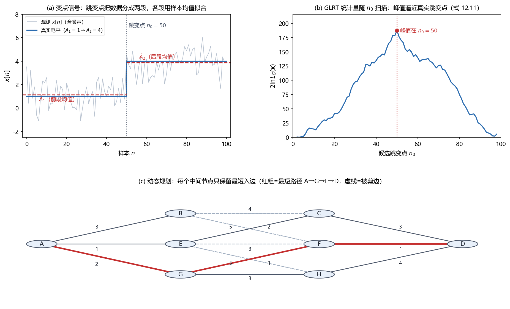

# Vol2 Ch12 模型变化检测：信号在第几个样本变了？——分段似然 + 动态规划

> 对应原书：第二卷《检测理论》第 12 章（书内第 797~823 页，本扫描 PDF 第 812~838 页；页码映射"书内 = PDF − 15"，PDF 813 顶栏"798"、PDF 838 顶栏"823"）。
> 前置阅读：本系列 `Vol2_Ch03_统计判决理论I.md`（NP 定理、UMP）、`Vol2_Ch06_统计判决理论II.md`（GLRT、Rao）、`Vol2_Ch07_具有未知参数的确定性信号.md`（未知到达时间的 GLRT）；回调 `Vol1_Ch08_最小二乘估计.md`（序贯最小二乘）与 `Vol1_Ch13_卡尔曼滤波器.md`（机动目标跟踪）。本文自包含，涉及的前置概念就地插播。

## 写在前头

这是讲解系列**第二卷的第 12 篇**，对应原书第二卷《模型变化检测》。它在第二卷里的角色是**一个进阶专题**：前 11 章（连同第一卷）都默认"数据出自**同一个**模型"——信号要么一直有、要么一直无，参数要么一直是这个值、要么一直是那个值。本章第一次问一个不同的问题：**"信号（或它的模型）在第几个样本变了？"**

这个问题在工程里到处是：语音分段要回答"声道在第几毫秒从 /a/ 滑到了 /e/"；地震波到时检测要回答"P 波在第几毫秒到达"；机器故障监测要回答"油压从第几秒开始往下掉"；EEG 分析要回答"脑电的统计特性在第几毫秒突变"。原书 §12.1 把它们并排：声道"平稳或突然"地变化以适应发声，平稳运行的机器"突然运行困难"，声速在空气/水交界面突变、温度随海拔渐变——**我们要讨论的是"突然变化"的检测**（渐变变化超出本章范围，读者可参考 Basseville & Nikiforov 1993）。

**本章一句话设计目标：把"变化发生在哪个样本"翻译成统计问题——先看最简单情形（变化时刻、跳变前后的电平都已知 → NP 检测器），再逐步放宽到"电平未知"（GLRT）、"时刻也未知"（扫描取最大），最后到"多个变化时刻"（动态规划 DP），并在机动目标与功率谱变化两个例子里落地。**

**实测声明**：本文所有内容与数字均经 OCR 核对原书扫描件（PDF 第 812~838 页，OCR 文本存于 `Temp/chapters_ocr/v2ch12/`），不是凭印象转述。公式编号（12.1）~（12.22）沿用原书编号；图 Fig033 为本系列自建示意图（脚本 `Temp/scripts/make_fig033.py`，随机种子 20260821，自建数据与边权为示意值，非原书图 12.4/12.5 的逐点复刻）。§12.6.2 的（12.17）~（12.22）OCR 多处残缺，据 Kay 原书英文版 §12.6.2 校订并注明。

---

## 1. 问题的描述：已知时刻、已知跳变——最简单情形反而是"基本功"

### 1.1 问题驱动：为什么从"什么都已知"讲起？

变点检测最朴素的问题是：**数据里有一个 DC 电平，在某个已知时刻 $n_0$ 从已知值 $A_0$ 跳到已知值 $A_0+\Delta A$，怎么设计检测器？** 这听起来不"进阶"——什么都知道，直接用第 3 章的 NP 定理不就行了？**但原书正是要拿这个最简单情形立一块"基准"**：先看清"检测一个跳变"的检测器长什么样、性能由什么决定，后面每放宽一个假设（电平未知、时刻未知、多变点），都对照这块基准看"丢了什么、多花了什么"。

### 1.2 例 12.1：已知时刻已知 DC 电平的跳变——NP 检测器

场景（原书例 12.1）：方差 $\sigma^2$ 已知的 WGN 中观测 DC 电平，在已知时刻 $n=n_0$ 从 $A_0$ 跳到 $A_0+\Delta A$（$\Delta A>0$ 已知）。假设检验为

$$
H_0:\ x[n]=A_0+w[n],\ n=0,1,\ldots,N-1
$$

$$
H_1:\ x[n]=A_0+w[n]\ (n=0,\ldots,n_0-1),\qquad x[n]=A_0+\Delta A+w[n]\ (n=n_0,\ldots,N-1) \tag{12.1}
$$

其中 $w[n]$ 为方差 $\sigma^2$ 的 WGN，$A_0$、$\Delta A>0$、$n_0$ 均已知。**翻译成人话：$H_1$ 说"前 $n_0$ 个样本还是 $A_0$，从第 $n_0$ 个起抬高了 $\Delta A$"；$H_0$ 说"从头到尾都是 $A_0$"。** 等价地写成参数检验（12.2）：$H_0$ 下 $A=A_0$（全程），$H_1$ 下跳变前 $A=A_0$、跳变后 $A=A_0+\Delta A$。

令 $A_1$、$A_2$ 分别表示跳变前、后的 DC 电平，数据的 PDF 为

$$
p(\mathbf{x};A_1,A_2)=\frac{1}{(2\pi\sigma^2)^{N/2}}\exp\!\left[-\frac{1}{2\sigma^2}\left(\sum_{n=0}^{n_0-1}(x[n]-A_1)^2+\sum_{n=n_0}^{N-1}(x[n]-A_2)^2\right)\right] \tag{12.3}
$$

其中 $\mathbf{x}$ 为 $N$ 点数据矢量，求和项为"各段数据偏离本段电平"的平方和。**这个式子的结构就是本章一切方法的种子：数据被跳变点切成两段，每段各配一个自己的参数。** NP 检测器是似然比 $L(\mathbf{x})=p(\mathbf{x};H_1)/p(\mathbf{x};H_0)$，代入（12.3）取对数并化简（推导见原书 §12.3）：

$$
\ln L(\mathbf{x})=\frac{1}{2\sigma^2}\sum_{n=n_0}^{N-1}\Bigl[-2\Delta A\bigl(x[n]-A_0\bigr)+\Delta A^2\Bigr] \tag{12.4}
$$

因为 $\Delta A>0$、$\sigma^2>0$，判 $H_1$ 的判决式（把与数据无关的项并入门限）等价于（式 12.5）：

$$
T(\mathbf{x})=\frac{1}{N-n_0}\sum_{n=n_0}^{N-1}\bigl(x[n]-A_0\bigr)>\gamma'' \tag{12.5}
$$

其中 $\gamma''$ 为门限。**翻译成人话：检测器 = 把跳变之后的样本相对 $A_0$ 的偏差取平均，再和门限比。** 原书点破它"不奇怪"的原因：噪声样本独立，所以跳变前的数据与问题**无关**（第 3 章 §3.5 的无关数据结论）——**跳变前的数据一个字都不用看，检测信息全在跳变之后。**

### 1.3 性能：均值偏移高斯-高斯问题，偏移系数只有一项

检验统计量 $T(\mathbf{x})$ 是高斯样本的线性组合，所以（原书直接给出）：

$$
T(\mathbf{x})\sim\mathcal{N}\bigl(0,\ \sigma^2/(N-n_0)\bigr)\ \text{（}H_0\text{ 下）},\qquad T(\mathbf{x})\sim\mathcal{N}\bigl(\Delta A,\ \sigma^2/(N-n_0)\bigr)\ \text{（}H_1\text{ 下）}
$$

这是第 3 章的标准"均值偏移高斯-高斯"模板，于是检测率（式 12.6）与偏移系数（式 12.7）：

$$
P_D=Q\bigl(Q^{-1}(P_{FA})-\sqrt{d^2}\bigr) \tag{12.6}
$$

$$
d^2=\frac{\Delta A^2}{\sigma^2/(N-n_0)}=\frac{(N-n_0)\Delta A^2}{\sigma^2} \tag{12.7}
$$

其中 $Q$、$Q^{-1}$ 为标准正态右尾及其逆，$P_{FA}$ 为虚警率。**这个式子说明什么：检测性能只由 $d^2=(N-n_0)\Delta A^2/\sigma^2$ 一个量决定——跳变后的样本数 $N-n_0$ 越多、跳变幅度 $\Delta A$ 越大、噪声 $\sigma^2$ 越小，检测越容易。** 原书把 $N-n_0$ 读作"检测跳变所需的**延迟时间**"：跳变后观察得越久，$P_D$ 越高。

原书给了一个定量例子：若跳变功率噪声比 $\Delta A^2/\sigma^2=1$（跳变幅度等于噪声标准差），要求 $P_{FA}=0.001$、$P_D=0.99$，则最小延迟 $N-n_0=30$ 个样本（此数为由 (12.6)(12.7) 反解的派生值：$d^2\approx29.3$）。**翻译成人话：要在千分之一的虚警下拿到 99% 的检测率，得在跳变后等约 30 个样本——"想更快检测，就得容忍更高虚警"。** 门限随记录长度增加而下降（$P_{FA}=Q\bigl(\gamma'/\sqrt{\sigma^2/(N-n_0)}\bigr)$ 反解），原书图 12.2(b) 的一个现实里：$A_0=1$、$\Delta A=1$、$n_0=50$、$\sigma^2=1$，**$P_{FA}=10^{-6}$ 时约 18 个样本延迟，$P_{FA}=10^{-3}$ 时仅约 4 个样本延迟。**

### 1.4 例 12.2：方差（功率）的跳变——能量检测器

例 12.2 把跳变对象换成**方差**：WGN 的方差在已知时刻 $n_0$ 从 $\sigma^2$ 跳到 $\sigma^2+\Delta\sigma^2$（$\Delta\sigma^2>0$）。NP 检测器化简后是（原书 §12.3）：

$$
T(\mathbf{x})=\sum_{n=n_0}^{N-1}x^2[n]>\gamma' \ \Rightarrow\ 判 H_1
$$

其中 $\gamma'$ 为门限。**翻译成人话：判方差跳变 = 把跳变之后的样本平方求和（能量）再比门限——这正是能量检测器（第 5 章例 5.1 里检测白高斯随机信号的 NP 检测器）。** 原书的解释很漂亮：方差跳变可以看成"在 $n_0$ 时刻加入了一个白高斯信号"，所以"检测功率跳变"和"检测随机信号出现"是同一件事。性能随 $\Delta\sigma^2/\sigma^2$ 增大而改善。

原书随后点出一条重要备注（§12.3 末尾）：例 12.1、12.2 里，**实现 NP 检测器其实不需要知道 $\Delta A$、$\Delta\sigma^2$ 的具体值，只要知道它们是正的就行**——这时 NP 检验是 **UMP（一致最大势）**（第 3 章，习题 12.4）。**翻译成人话：只要确认"跳变方向是正的"，检测器就与跳变幅度无关，对所有幅度都是最优的——这是变点检测里难得的"免费最优"。**

**一句话总结：已知时刻 + 已知跳变时，检测器退化成熟知的 NP 结构——均值跳变 → 跳变后均值偏差，方差跳变 → 能量检测器；性能都由"跳变强度 × 跳变后样本数 / 噪声"这个偏移系数一锤定音。**

---

## 2. 基本问题的扩展：电平未知、时刻未知，NP 退成 GLRT

### 2.1 问题驱动：例 12.1 的"什么都已知"太奢侈了

实际中几乎不会"电平、跳变幅度、跳变时刻全部已知"。§12.4 开始放宽假设，顺序是：先放宽"电平未知"（时刻仍已知），再放宽"时刻也未知"。**每放宽一步，问题就从"简单假设"变成"复合假设"，NP 定理失效，GLRT 接管——这正是第 6 章武器库的实战。**

### 2.2 例 12.3：未知 DC 电平、已知跳变时间——GLRT 是"两段均值差"

跳变时刻 $n_0$ 已知，但跳变前后的 DC 电平 $A_1$、$A_2$ 未知。假设检验变成

$$
H_0:\ A_1=A_2, \qquad H_1:\ A_1\neq A_2
$$

即跳变幅度 $\Delta A=A_2-A_1$ 未知。因为是复合假设，用 GLRT。$H_0$ 下 $A$ 的 MLE 是全程样本均值 $\hat{A}=\frac1N\sum_{n=0}^{N-1}x[n]$，$H_1$ 下的 MLE 是两段各自的样本均值：

$$
\hat{A}_1=\frac{1}{n_0}\sum_{n=0}^{n_0-1}x[n],\qquad \hat{A}_2=\frac{1}{N-n_0}\sum_{n=n_0}^{N-1}x[n]
$$

代入似然比并化简（推导见原书 §12.4），GLRT 的判决式为（式 12.8）：

$$
2\ln L_G(\mathbf{x})=\frac{(\hat{A}_1-\hat{A}_2)^2}{\sigma^2\left(\frac{1}{n_0}+\frac{1}{N-n_0}\right)}>\gamma' \tag{12.8}
$$

其中 $\gamma'$ 为门限。**翻译成人话：GLRT = 把两段各自的样本均值差 $\hat{A}_1-\hat{A}_2$ 取平方、用它的标准差（$\sigma^2(1/n_0+1/(N-n_0))$）归一化，再和门限比。** 它一眼就能看懂：**跳变前后估计的电平差越大（相对噪声）、越显著，就越判有跳变。**

性能可以直接算（$\hat{A}_1,\hat{A}_2$ 是独立高斯，$\hat{A}_1-\hat{A}_2$ 在 $H_0$ 下零均值、$H_1$ 下均值 $A_1-A_2$，方差同为 $\sigma^2(1/n_0+1/(N-n_0))$），所以（式 12.9）

$$
2\ln L_G(\mathbf{x})\sim \chi_1^2\ \text{（}H_0\text{ 下）},\qquad \chi_1^{\prime2}(\lambda)\ \text{（}H_1\text{ 下）} \tag{12.9}
$$

其中 $\chi_1^2$ 为自由度 1 的卡方分布、$\chi_1^{\prime2}(\lambda)$ 为非中心卡方，非中心参量（式 12.10）：

$$
\lambda=\frac{(A_1-A_2)^2}{\sigma^2\left(\frac{1}{n_0}+\frac{1}{N-n_0}\right)} \tag{12.10}
$$

**这个式子说明什么：性能随 $\lambda$ 单调提高，而 $\lambda$ 随"跳变幅度平方"与"两段数据长度的调和项"增大——最好的性能出现在跳变恰好落在数据记录正中间（$n_0=N/2$，此时 $1/n_0+1/(N-n_0)$ 最小，习题 12.9）。** 直觉：跳变点太靠边时，其中一段的样本太少，那段均值估得很差，检测力就弱。

### 2.3 例 12.4：已知 DC 电平、未知跳变时间——"扫描取最大"

现在把"跳变时刻未知"加进来：$A_0$、$\Delta A>0$ 已知，$n_0$ 未知，但限定 $n_{0_L}\le n_0\le n_{0_U}$（不靠近观测区间两端）。GLRT 等价于在 $n_0$ 上取最大（第 6 章结论）：

$$
2\ln L_G(\mathbf{x})=\max_{n_0}\ 2\ln L(\mathbf{x};n_0)
$$

其中 $L(\mathbf{x};n_0)$ 就是例 12.1 的似然比。代入（12.4），判决式为

$$
T(\mathbf{x})=\max_{n_0}\left[\sum_{n=n_0}^{N-1}\bigl(x[n]-A_0\bigr)-\frac{\Delta A}{2}(N-n_0)\right]>\gamma''
$$

（略去了正的常数因子 $\Delta A/\sigma^2$。）**翻译成人话：对每个可能的跳变点 $n_0$ 都算一遍例 12.1 的统计量，取最大的那个——"扫描所有 $n_0$，谁像跳变点就信谁"。** 原书点破与第 7 章的呼应：**这和"未知到达时间的信号检测"是同一个动作**（第 7 章对每个可能时延都放一个匹配滤波、取最大），这里要检测的信号就是跳变量 $s[n]=\Delta A$（两假设的均值差）。

原书特别提醒一条**失效边界**：**"通常的渐近 GLRT 统计量在这里并不成立"**——因为 $n_0$ 是离散整数参数（不是连续参数），第 6 章的渐近卡方结论不适用于"在离散格点上取最大"的情形，性能要另算。

### 2.4 两种未知叠加：电平与时刻都未知（式 12.11）

最后把例 12.3 与 12.4 合并：DC 电平与跳变时间**都未知**。可以证明（习题 12.10），GLRT 判 $H_1$ 当且仅当（式 12.11）：

$$
\max_{n_0}\ \frac{(\hat{A}_1-\hat{A}_2)^2}{\sigma^2\left(\frac{1}{n_0}+\frac{1}{N-n_0}\right)}>\gamma \tag{12.11}
$$

其中 $\hat{A}_1=\frac1{n_0}\sum_{n=0}^{n_0-1}x[n]$、$\hat{A}_2=\frac1{N-n_0}\sum_{n=n_0}^{N-1}x[n]$ 分别是候选跳变点 $n_0$ 两侧的样本均值。**翻译成人话：把例 12.3 的"两段均值差归一化"统计量，在例 12.4 的"扫描所有 $n_0$"上取最大——这就是"电平与时刻都未知"的完整 GLRT。** 图 Fig033(a)(b) 用自建数据把这个过程可视化。

*图 Fig033：模型变化检测的三个核心机制（自建示意，随机种子 20260821，N=100，WGN σ²=1，边权为示意值，非原书图 12.4/12.5 的逐点复刻）。(a) 单变点信号：DC 电平在 $n_0=50$ 从 $A_1=1$ 跳到 $A_2=4$，数据被跳变点分成两段，各段用样本均值 $\hat{A}_1$、$\hat{A}_2$ 拟合（分段似然的最小二乘口径）；(b) GLRT 统计量 $2\ln L_G = (\hat{A}_1-\hat{A}_2)^2/(\sigma^2(1/n_0+1/(N-n_0)))$ 随候选跳变点扫描，峰值对准真实跳点——"扫描所有 $n_0$ 取最大"就是未知跳变时间的 GLRT；(c) 动态规划：多跳点问题化成有向图最短路径，每个中间节点只保留最短入边（虚线为被剪边），红粗线为最短路径 A→G→F→D，马尔可夫性质使各段代价可独立相加、逐级递推。结论：单变点是"扫描取最大"，多变点是"动态规划"，两者的核心部件都是分段似然。*

**一句话总结：放宽"电平未知"→ GLRT 是"两段均值差的平方归一化"；再放宽"时刻未知"→ 再对 $n_0$ 取最大。两步合起来就是式（12.11），它是单变点检测的完整答案。**

---

## 3. 多个变化时刻：组合爆炸，动态规划把 $O(N^M)$ 压成线性

### 3.1 问题驱动：三个跳变点就够呛了

§12.5 面对的是更现实的问题：数据里有**多个**跳变点。原书图 12.4 的例子：WGN 中 DC 电平在 $n_0=20$、$n_1=50$、$n_2=65$ 三次跳变，电平依次为 $A=1,4,2,6$，$\sigma^2=1$。要估计出这三个跳变时刻。

**为什么难？** 原书算了笔组合账：如果把所有可能的跳变时刻都列出来，对 $M$ 个跳变，计算量约为 $N^3/6$，一般情况是 $O(N^M)$——**随跳变数指数爆炸**。图 12.4 里 3 个跳变点都这么贵，语音分段动辄几十段，根本列不动。于是引入**动态规划（dynamic programming，DP）**：计算量随 $M$ 线性增加，且在数字计算机上容易实现。

### 3.2 例 12.5：未知 DC 电平 + 未知跳变时间——分段最小二乘

信号（例 12.5）是方差 $\sigma^2$ 的 WGN 中的分段常数：

$$
A_0\ (n=0,\ldots,n_0-1),\quad A_1\ (n=n_0,\ldots,n_1-1),\quad A_2\ (n=n_1,\ldots,n_2-1),\quad A_3\ (n=n_2,\ldots,N-1)
$$

电平 $\mathbf{A}=[A_0,A_1,A_2,A_3]^T$ 与跳变时刻 $\mathbf{n}=[n_0,n_1,n_2]$ 都未知。**若跳变时刻已知，每段电平的 MLE 就是该段样本均值**（第一卷 Ch04 线性模型），所以联合 MLE 通过最小化下面的分段误差平方和得到（式 12.12）：

$$
J(\mathbf{A},\mathbf{n})=\sum_{n=0}^{n_0-1}\bigl(x[n]-A_0\bigr)^2+\sum_{n=n_0}^{n_1-1}\bigl(x[n]-A_1\bigr)^2+\sum_{n=n_1}^{n_2-1}\bigl(x[n]-A_2\bigr)^2+\sum_{n=n_2}^{N-1}\bigl(x[n]-A_3\bigr)^2 \tag{12.12}
$$

**翻译成人话：把数据切成四段，每段用本段均值拟合，四段拟合误差平方和最小的一组（电平、跳变时刻）就是 MLE。** 这正是"分段似然"在最小二乘口径下的形式。

### 3.3 引入理论：DP 的最短路径直觉（图 12.5/12.6）

原书用"求最短路径"给 DP 讲直觉（图 12.5/12.6）：一个人要从 A 到 D，各段距离标在边上，穷举所有路径发现 A-G-F-D 最短。但 DP 不用穷举：**先到第二级（C/F/H），在每个节点上只保留"到达该节点的最短入边"**——若最佳路径经过 C，则到 C 的路径必是较短的 A-E-C（省掉 A-B-C）；经过 F，则必是 A-G-F（省掉 A-B-F、A-E-F）；经过 H 则必是 A-G-H（省掉 A-E-H）。**由于每一级只保留固定数目的路径，计算量与级数（跳变数）成线性关系。**

原书随后给了 DP 的**适用前提**（很重要，不是所有问题都能用）：**极小化的误差必须满足"马尔可夫性质"——从 C 到 D 的距离与"如何到达 C"无关**，这才能把各段代价独立相加、逐级递推。图 Fig033(c) 把这个最短路径原理画了出来。

### 3.4 引入理论：DP 递推式（式 12.13~12.15）

对给定的跳变时刻，每段均值 $\hat{A}_i=\frac{1}{n_i-n_{i-1}}\sum_{n=n_{i-1}}^{n_i-1}x[n]$（$i=0,1,2,3$，约定 $n_{-1}=0$、$n_3=N$）。定义第 $i$ 段的最小二乘误差（式 12.13）：

$$
\Delta_i[n_{i-1}, n_i-1]=\sum_{n=n_{i-1}}^{n_i-1}\bigl(x[n]-\hat{A}_i\bigr)^2 \tag{12.13}
$$

于是 $J(\mathbf{A},\mathbf{n})=\sum_{i=0}^{3}\Delta_i[n_{i-1},n_i-1]$。DP 的核心是把"前 $k$ 段的最优"递推出来。定义 $I_k[L]$ 为"用 $k+1$ 段（$k$ 个跳变）拟合数据记录 $[0,L]$ 的最小误差"，则递推式（式 12.14）：

$$
I_k[L]=\min_{n_{k-1}}\Bigl(I_{k-1}[n_{k-1}-1]+\Delta_k[n_{k-1}, L]\Bigr) \tag{12.14}
$$

**翻译成人话：拟合 $[0,L]$ 的 $k+1$ 段最小误差 = 前 $k$ 段拟合 $[0,n_{k-1}-1]$ 的最小误差 + 最后一段拟合 $[n_{k-1},L]$ 的误差，再对最后一段的起点 $n_{k-1}$ 取最小。** 问题的解答是 $k=3$、$L=N-1$ 的 $I_3[N-1]$。

原书给出了完整计算步骤（每段至少 1 个样本）：先算 $k=0$（一段，$I_0[L]=\sum_{n=0}^L(x[n]-\hat{A}_0)^2$，$L=0,\ldots,N-4$），再逐级算 $k=1,2$（并记录每步最优的 $n_{k-1}$），最后 $k=3$ 算出 $I_3[N-1]$，再用**后向递归**回溯出跳变时刻 $\hat{n}_2,\hat{n}_1,\hat{n}_0$。**主要计算量在于求（式 12.15）的段误差**

$$
\Delta_k[n_{k-1},L]=\sum_{n=n_{k-1}}^{L}\bigl(x[n]-\hat{A}_k\bigr)^2 \tag{12.15}
$$

即"用数据记录 $[n_{k-1},L]$ 估计均值时的最小二乘误差"，可用**序贯最小二乘**递归更新（第一卷 199~200 页）：记 $\hat{A}[m,n]$ 为区间 $[m,n]$ 的样本均值、$J_{\min}[m,n]$ 为该区间的最小二乘误差，则

$$
\hat{A}[m,n]=\hat{A}[m,n-1]+\frac{x[n]-\hat{A}[m,n-1]}{n-m+1},\qquad
J_{\min}[m,n]=J_{\min}[m,n-1]+\frac{n-m}{n-m+1}\bigl(x[n]-\hat{A}[m,n-1]\bigr)^2
$$

初始 $\hat{A}[0,0]=x[0]$、$J_{\min}[0,0]=0$。**这组递推把每个区间误差的重复求和降成常数时间，是 DP 落地时真正的算力来源。**

原书给了一个可手算校核的数值例子：$A=1,4,2,6$、$n_0=20,n_1=50,n_2=65$，DP 结果为 $\hat{n}_0=20,\hat{n}_1=49,\hat{n}_2=65$——**三个跳变时刻里两个精确命中、一个偏了 1 个样本（$49$ vs 真值 $50$），这正是"分段常数 + 噪声"模型下估计的固有抖动。** 附录 12B 给出 MATLAB 程序 dp.m（种子 `randn('seed',0)`）。

### 3.5 通用化：附录 12A 的分段 DP

附录 12A 把 DP 推广到**任意分段模型**（不只 DC 电平）：把时间序列切成 $N_s$ 段，第 $i$ 段（$i=0,\ldots,N_s-1$）的 PDF 为 $p_i(x[n_{i-1}],\ldots,x[n_i-1];\boldsymbol{\theta}_i)$，各段统计独立，则全数据的 PDF 是乘积（式 12A.1）。MLE 分段最大化 $\sum_i\ln p_i(\cdot;\boldsymbol{\theta}_i)$，等价于最小化

$$
\Delta_i[n_{i-1},n_i-1]=-\ln p_i\bigl(x[n_{i-1}],\ldots,x[n_i-1];\hat{\boldsymbol{\theta}}_i\bigr)
$$

其中 $\hat{\boldsymbol{\theta}}_i$ 是该段数据的 MLE。**只要每段的负对数似然 $\Delta_i$ 可算，12.5 节的递推式原样照搬。** 原书点名两个应用：**用 AR 模型的语音分段**（Svendsen & Soong 1987），和"参数逐段变化的线性模型"；**若段数本身也未知，则用第 6 章的 MDL 准则**来选段数。

**一句话总结：多变点检测 = 分段最小二乘（或分段最大似然）的联合最小化；穷举是 $O(N^M)$，DP 靠"每级只留一条最短入边"的马尔可夫结构把它压成随 $M$ 线性。**

---

## 4. 信号处理例子：机动检测与时变 PSD 检测

### 4.1 机动检测：加速度 = 一个"可以套线性模型 GLRT"的变点

§12.6.1 的问题是：**一个直线运动目标，什么时候偏离了它的标称直线航线？** 目标在平面内运动，标称位置（$t=n\Delta$，$\Delta$ 为采样间隔）：

$$
r_x[n]=r_x[0]+v_x n\Delta,\qquad r_y[n]=r_y[0]+v_y n\Delta
$$

其中初始位置 $(r_x[0],r_y[0])$ 已知、速度 $(v_x,v_y)$ 已知常量。若在 $n=n_0$ 起出现加速度 $(a_x,a_y)$，则 $n\ge n_0$ 时位置含加速度项 $\tfrac12 a_x(n-n_0)^2\Delta^2$（$x$ 分量同理）。传感器误差建模为 WGN，于是 $n\ge n_0$ 的观测可写成线性模型（扣除标称直线后）：

$$
\boldsymbol{\varepsilon}=\mathbf{H}\boldsymbol{\theta}+\mathbf{w},\qquad \boldsymbol{\theta}=[a_x,\ a_y]^T
$$

其中 $\boldsymbol{\varepsilon}$ 是"观测位置扣除标称直线"后的 $2(N-n_0)\times1$ 残差矢量（两坐标叠放），$\mathbf{H}$ 的列是加速度基函数 $\bigl[0,\ \Delta^2/2,\ \ldots,\ (N-1-n_0)^2\Delta^2/2\bigr]^T$（每坐标一列），$\mathbf{w}\sim\mathcal{N}(\mathbf{0},\sigma^2\mathbf{I})$。要检验 $H_0:\boldsymbol{\theta}=\mathbf{0}$ 对 $H_1:\boldsymbol{\theta}\neq\mathbf{0}$——**这正是第 7 章定理 7.1（经典线性模型 GLRT）的标准场景**（令 $\mathbf{A}=\mathbf{I}$、$\mathbf{b}=\mathbf{0}$）。判决式（式 12.16）：

$$
T(\mathbf{x})=\frac{\hat{\boldsymbol{\theta}}^T\mathbf{H}^T\mathbf{H}\hat{\boldsymbol{\theta}}}{\sigma^2}>\gamma' \tag{12.16}
$$

其中 $\hat{\boldsymbol{\theta}}=(\mathbf{H}^T\mathbf{H})^{-1}\mathbf{H}^T\boldsymbol{\varepsilon}$ 是加速度的 MVU 估计。利用 $\mathbf{H}^T\mathbf{H}=\mathrm{diag}(\mathbf{h}^T\mathbf{h},\mathbf{h}^T\mathbf{h})=\mathbf{h}^T\mathbf{h}\,\mathbf{I}$（两坐标的基函数相同），最终判 $H_1$ 当且仅当

$$
T(\mathbf{x})=\frac{\bigl[\sum_{n=n_0}^{N-1}(n-n_0)^2\Delta^2\,\varepsilon_x[n]\bigr]^2+\bigl[\sum_{n=n_0}^{N-1}(n-n_0)^2\Delta^2\,\varepsilon_y[n]\bigr]^2}{\sigma^2\sum_{n=n_0}^{N-1}(n-n_0)^4\Delta^4}>\gamma'
$$

（据 Kay 原书英文版 §12.6.1 校订，OCR 该式多处残缺。）**翻译成人话：检测加速度 = 把残差数据与"加速度基函数 $(n-n_0)^2$"做加权相关（一个加速度匹配滤波），两坐标的平方和再归一化。** $H_0$ 下 $T(\mathbf{x})\sim\chi_2^2$（定理 7.1），所以虚警率特别简单：$P_{FA}=\exp(-\gamma'/2)$。

**关键工程点：$n_0$ 未知 + 要快速检测。** 原书给出的做法是：对每个可能的 $n_0$ 都算 $T(\mathbf{x})$，并改用**固定长度 $M$ 的滑动窗 $[n_0,n_0+M-1]$**（$M\ll N$）来算统计量——**$M$ 取小能快速检测，取大可防过多虚警，这是经典的快/准折衷。** 原书的例子：初始位置 $(0,0)$、速度 $(1,1)$、$\Delta=1$、$n_0=50$、加速度 $(a_x,a_y)=(0.03,0.05)$、噪声 $\sigma^2=1$；窗口 $M=20$ 时，**加速度约在延迟 30 个样本后被检测到**；若门限设为 100，则首次检测到变化的时刻为 $n=65$（窗口 $[65,84]$，延迟 35 个样本）。

### 4.2 时变 PSD 检测：白噪声 → 有色噪声，GLRT 分两笔账

§12.6.2 的问题更贴近"模型变化"的本义：**检测一个高斯随机过程的功率谱（PSD）从白色变成有色。** 用 AR(1) 建模有色过程（式 12.17）：

$$
P_{xx}(f)=\frac{\sigma_u^2}{\bigl|1+a[1]\,e^{-j2\pi f}\bigr|^2} \tag{12.17}
$$

其中 $a[1]$ 为 AR(1) 系数（$|a[1]|<1$），$\sigma_u^2$ 为驱动白噪声方差。变化前 $a[1]=0$（白噪声），变化后 $a[1]\neq0$（有色）。允许变化前后的功率 $\sigma^2$ 不同。假设检验为：$H_0$ 下全程 $a[1]=0$、功率 $\sigma_0^2$；$H_1$ 下 $n<n_0$ 段 $a[1]=0$、功率 $\sigma_1^2$，$n\ge n_0$ 段 $a[1]\neq0$、参数 $\sigma_2^2$。**变化前的数据必须保留，用来估功率——这是它比例 12.3 更"信息饥渴"的地方。**

GLRT 需要的 MLE 依次是（$H_0$ 下）$\hat\sigma_0^2=\frac1N\sum x^2[n]$；（$H_1$ 下）$\hat\sigma_1^2=\frac1{n_0}\sum_{n=0}^{n_0-1}x^2[n]$；对 $n\ge n_0$ 段的 AR(1) 参数，用大数据记录的近似 PDF（Kay 1988），得到（式 12.19、12.20，据 Kay 原书英文版校订）：

$$
\hat{a}[1]=-\frac{\sum_{n=n_0+1}^{N-1}x[n]x[n-1]}{\sum_{n=n_0+1}^{N-1}x^2[n-1]} \tag{12.19}
$$

$$
\hat\sigma_2^2=\frac{1}{N-n_0}\sum_{n=n_0+1}^{N-1}\bigl(x[n]+\hat{a}[1]x[n-1]\bigr)^2 \tag{12.20}
$$

其中 $\hat{a}[1]$ 是 AR(1) 系数 $a[1]$ 的 MLE（正是"负的一阶相关系数"——把 $x[n]$ 对它的一步延迟 $x[n-1]$ 做回归）。应用（12.19）还可把 $\hat\sigma_2^2$ 写成（式 12.21）：

$$
\hat\sigma_2^2=\frac{1}{N-n_0}\sum_{n=n_0+1}^{N-1}x^2[n]\cdot\bigl(1-\hat{a}^2[1]\bigr)
$$

代入 GLRT 并化简，最终判决式（式 12.22，据 Kay 原书英文版校订）：

$$
L_G(\mathbf{x})=\frac{\bigl(\hat{r}_0[0]\bigr)^N}{\bigl(\hat{r}_1[0]\bigr)^{n_0}\bigl(\hat{r}_2[0]\bigr)^{N-n_0}}\cdot\frac{1}{\bigl(1-\hat{a}^2[1]\bigr)^{(N-n_0)/2}}>\gamma \tag{12.22}
$$

其中 $\hat{r}_0[0]=\frac1N\sum x^2[n]$ 是"假设没有变化"时的功率估计（零延迟自相关），$\hat{r}_1[0]=\frac1{n_0}\sum_{n=0}^{n_0-1}x^2[n]$ 与 $\hat{r}_2[0]=\frac1{N-n_0}\sum_{n=n_0}^{N-1}x^2[n]$ 分别是变化前、后的功率估计。**翻译成人话：$L_G$ 拆成两笔账——第一项 $\bigl(\hat{r}_0[0]\bigr)^N/\bigl(\hat{r}_1[0]^{n_0}\hat{r}_2[0]^{N-n_0}\bigr)$ 度量"功率是否变了"（由算术-几何平均不等式，$\hat{r}_1[0]\neq\hat{r}_2[0]$ 时它大于 1，习题 12.16）；第二项 $1/(1-\hat{a}^2[1])^{(N-n_0)/2}$ 度量"PSD 形状是否变了"（$|\hat{a}[1]|<1$ 时大于 1）。两者任一显著偏离 1，都会把 $L_G$ 顶过门限。**

原书例子：随机过程在 $n_0=50$ 从方差 $\sigma^2=5$ 的白噪声变为 $a[1]=-0.9$、$\sigma_u^2=1$ 的 AR(1) 过程（变化后功率变为 $\sigma_u^2/(1-a^2[1])=1/0.19\approx5.3$）。图 12.9 的现实里，变化后样本间相关性增强、起伏变缓。图 12.10 对 $10\le n_0\le90$、$N=100$ 画出 $2\ln L_G(\mathbf{x})$，**峰值在 $\hat{n}_0=51$（真值 50）**；图 12.11 显示一旦 $n_0$ 越过真值，$\hat{a}[1]$ 就稳定在其真值附近（**约 $-0.8$，真值 $-0.9$**）。**原书的结论：不仅能检测到变化，还能顺带估计出变化后的新参数——检测与估计在这一章合流。**

**一句话总结：机动检测把"加速度"写进线性模型套定理 7.1 的 GLRT，再用滑动窗平衡快/准；PSD 检测把 GLRT 拆成"功率变化 + 谱形变化"两笔账，检测变化的同时还给出了新参数。**

---

## 5. 关键设计决策回顾

把散在正文里的"为什么"收拢。每个决策都是一个真实岔路口：

| # | 决策 | 为什么这么选 | 换一个选择会怎样 |
|---|------|------------|----------------|
| 1 | 从"已知时刻已知跳变"讲起（§1） | 最简单情形能用 NP 定理直接解，立一块性能基准（偏移系数 $d^2$） | 一上来就多变点，读者看不到"放宽假设的每一步代价" |
| 2 | 跳变信息只在跳变后（§1.3） | 噪声样本独立，跳变前数据与问题无关（第 3 章无关数据） | 把跳变前数据也纳入统计量，只会白加噪声、无收益 |
| 3 | 电平未知用 **GLRT** 而非贝叶斯（§2.2） | 电平是确定未知量，无先验；GLRT 只要求会算分段均值 | 用贝叶斯要给电平配先验、做积分，工程上不必要 |
| 4 | 时刻未知用**扫描取最大**（§2.3） | 与第 7 章"未知到达时间"同一招，$n_0$ 是离散格点 | 把 $n_0$ 当连续参数套渐近卡方，会得出不成立的结论（§2.3 已点破） |
| 5 | 多变点用 **DP**（§3） | 穷举 $O(N^M)$ 爆炸，DP 靠马尔可夫性质压成线性 | 硬穷举，3 个跳变点都要 $N^3/6$，语音分段根本算不动 |
| 6 | 段误差用**序贯最小二乘**递归（§3.4） | 区间误差重复求和太贵，递推把它降成常数时间 | 每次重算 $\Delta_k$，DP 的线性复杂度优势就丢了 |
| 7 | 机动检测用**固定窗 $M$**（§4.1） | $n_0$ 未知，窗小检测快、窗大虚警少，只能折衷 | 用整段数据，检测延迟大，失去"快速告警"的意义 |
| 8 | PSD 检测**保留变化前数据**（§4.2） | 变化前后的功率都未知，必须用变化前数据估功率 | 丢掉变化前数据，功率变化这笔账就算不了 |

## 6. 实现备忘（复现与移植时的坑）

1. **$2\ln L_G$ 与原始 $L_G$ 的口径**：例 12.3 的（12.8）是 **$2\ln L_G(\mathbf{x})$**（乘 2 取对数），它才是 $\chi_1^2$（第 6 章 §8 备忘第 1 条的同一规矩）；写代码时门限查表要用 $2\ln$ 版本，别拿原始 $L_G$ 直接查卡方。
2. **延迟例子的口径**：§1.3 的"$N-n_0=30$ 个样本延迟"对应 $P_{FA}=0.001$、$P_D=0.99$、**且 $\Delta A^2/\sigma^2=1$**（此条件 OCR 未显式写出，但只有取 1 才反解出 30，见正文派生注）。引用时务必带上 $\Delta A^2/\sigma^2$ 的取值。
3. **图 12.2(b) 的延迟是"现实依赖"的**：18 样本（$P_{FA}=10^{-6}$）与 4 样本（$P_{FA}=10^{-3}$）是**那一组现实**（$A_0=1,\Delta A=1,n_0=50,\sigma^2=1$）里统计量首次过门限的样本数，不是期望值；别当成通用公式。
4. **离散参数不能套渐近卡方**：例 12.4 里 $n_0$ 是整数格点，"$2\ln L_G\sim\chi^2$"不成立（§2.3 原书明说）。**凡是"扫描取最大"的检测器，渐近卡方结论都要单独检查。**
5. **DP 的马尔可夫前提**：递推式（12.14）成立的前提是"各段误差可加、与路径历史无关"（§3.3 的 A→D 例子）。**分段模型必须是"各段独立 + 段内误差可加"的结构，否则 DP 不能直接套**（附录 12A 的 PDF 乘积假设就是这一前提的正式形式）。
6. **DP 的索引口径**：附录 12B 的 MATLAB 程序里，因为 MATLAB 索引从 1 起，代码里 $L,k,n$ 都加了 1，最后又用 `n0est=n0est-1` 等三条语句把跳变时刻映射回 $[0,N-1]$。**移植到 0 基语言（Python/C）时，这层 ±1 最易错。**
7. **序贯最小二乘的初值**：$\hat{A}[0,0]=x[0]$、$J_{\min}[0,0]=0$（§3.4）。初值错（如 $\hat{A}[0,0]=0$），整条递推链全错。
8. **（12.19）的负号与一步延迟**：$\hat{a}[1]=-\sum x[n]x[n-1]/\sum x^2[n-1]$，分子是"数据与自身一步延迟的互相关"，分母是"延迟数据的能量"，前面有**负号**（AR(1) 中 $x[n]=-a[1]x[n-1]+u[n]$）。漏负号，估计的 AR 系数符号反了，PSD 形状判错方向。
9. **页码映射**：本章书内 797~823 对应 PDF 812~838（**书内 = PDF − 15**）。例 12.1/12.2 在 PDF 812~817，例 12.3/12.4 与式（12.8）~（12.11）在 PDF 817~820，多变点与 DP（式 12.12~12.15）在 PDF 820~824，机动检测在 PDF 825~827，PSD 检测在 PDF 827~831，附录 12A/12B 在 PDF 835~838。

## 7. 局限（坦率交代，并预告后续）

1. **只做"突变"，不做"渐变"**：本章（§12.1 明说）只讨论突然变化；温度随海拔、机器缓慢磨损这类**渐变漂移**不在框架内，要查 Basseville & Nikiforov 1993。**渐变变化的检测是另一套方法（CUSUM、序贯似然比等），本书未展开。**
2. **多变点的"段数"是给定或要用 MDL**：例 12.5 假定了"恰好 3 个跳变"；段数未知时用 MDL（§3.5 引第 6 章），但**MDL 本身只在 $N\to\infty$ 一致，有限样本不是最优**（第 6 章 §6 已坦白）。
3. **"扫描取最大"没有通用性能公式**：例 12.4 的离散 $n_0$ 情形，渐近卡方失效，性能只能蒙特卡洛或个案推导——**这不是疏漏，而是"离散格点取最大"这一类问题的固有难点。**
4. **PSD 检测依赖大数据近似**：（12.18）的 AR(1) PDF 是"大数据记录（$K$ 大）"的近似（Kay 1988），小样本下 $\hat{a}[1]$、$\hat\sigma_2^2$ 的 MLE 不精确，GLRT 也随之失准。**小样本的精确 AR 似然（含边界项）本章未用。**
5. **DP 是"估计跳变时刻"，不是严格意义上的"检测器"**：例 12.5 主要做的是电平与跳变时刻的联合 MLE（估计问题）；把它变成"两次还是三次跳变"的**假设检验**，原书留给读者（习题 12.13），本章未给出完整的检验流程与 $P_{FA}/P_D$。**变点检测的"检测"与"估计"两面，本章只完整做了估计这一面。**
6. **机动检测的模型无控制噪声**：§12.6.1 的直线航线模型没有 plant noise（控制噪声），与第一卷 Ch13 卡尔曼跟踪模型不同；扩展到含控制噪声"非常麻烦"（原书原话）。**实时机动检测的完整答案是卡尔曼滤波 + 新息序列检验，超出本章范围。**

---

## 8. 建议自测的问题

1. 用你自己的话解释：为什么例 12.1 的检测器只用到跳变之后的数据？（提示：§1.2，噪声样本独立 → 无关数据）
2. 例 12.1 里，若把噪声方差减半（$\sigma^2\to\sigma^2/2$），保持 $P_{FA}$ 不变，检测延迟 $N-n_0$ 会怎么变？用偏移系数（12.7）回答。（提示：$d^2$ 反比于 $\sigma^2$）
3. 例 12.3 的最佳跳变点为什么在数据记录正中间？当 $n_0$ 靠近端点时，哪一项变差？（提示：§2.2，$1/n_0+1/(N-n_0)$）
4. 原书习题 12.10：证明"未知 DC 电平 + 未知跳变时间"的 GLRT 是（12.11）式。（提示：例 12.3 的结果 + 在 $n_0$ 上取最大）
5. 用你自己的话解释 DP 为什么能把 $O(N^M)$ 压成线性，以及它的"马尔可夫前提"是什么意思？（提示：§3.3 的 A→D 最短路径，每个中间节点只留一条最短入边）

---

**一句话收尾：前 11 章判"信号在不在"，这一章判"信号什么时候变"——答案是把数据切成段、每段各配一个模型，再用 GLRT 和动态规划在"分段方式"里找最优；代价是它从"检测"滑向了"检测 + 估计"的联合问题。**

*实测核对声明：本章事实性内容核对自原书扫描件 OCR 文本 `Document/统计信号处理/Temp/chapters_ocr/v2ch12/ocr_page_812~838.txt`（PDF 第 812~838 页，书内 797~823 页）；公式编号（12.1）~（12.22）沿用原书编号；例 12.1 的 $A_0=1,\Delta A=1,n_0=50,\sigma^2=1$、延迟 18/4 样本、例 12.2 方差 $1\to4$、例 12.5 的 $A=1,4,2,6$ 与 $\hat{n}_0=20,\hat{n}_1=49,\hat{n}_2=65$、机动检测的 $n_0=50,(a_x,a_y)=(0.03,0.05),M=20,门限100\to n=65$、PSD 检测的 $\sigma^2=5\to a[1]=-0.9,\sigma_u^2=1$ 与峰值 $\hat{n}_0=51$、$\hat{a}[1]\approx-0.8$ 均与 OCR 一致；§4.1 加速度统计量、§4.2 的（12.17）~（12.22）OCR 多处残缺，据 Kay 原书英文版 §12.6.1/§12.6.2 校订并已在正文标注。Fig033 由 `Temp/scripts/make_fig033.py` 生成（随机种子 20260821，边权为示意值），经 `plotutil.check_figure` 程序化碰撞检测通过。*
