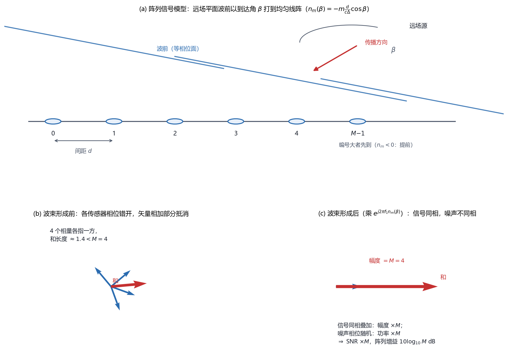

# Vol2 Ch13 复矢量扩展及阵列处理：为什么一排传感器比一根强 M 倍——复矢量检测与波束形成

> 对应原书：第二卷《检测理论》第 13 章（书内第 824~864 页，本扫描 PDF 第 839~879 页；页码映射"书内 = PDF − 15"，PDF 840 顶栏"825"、PDF 879 后接附录）。
> 前置阅读：本系列 `Vol2_Ch03_统计判决理论I.md`（NP 定理）、`Vol2_Ch04_确定信号.md`（匹配滤波器、$d^2$）、`Vol2_Ch05_随机信号.md`（估计器-相关器）、`Vol2_Ch06_统计判决理论II.md`（GLRT、$\chi^2$）、`Vol2_Ch07_具有未知参数的确定性信号.md`（经典线性模型定理 7.1）；回调第一卷第 15 章（复数据与复参数）与 `Vol1_Ch07_最大似然估计.md` 例 7.17（声纳方位/波束形成）。本文自包含，涉及的前置概念就地插播。

## 写在前头

这是讲解系列**第二卷的第 13 篇，也是全书的收官章**。前 12 章的检测器有一个共同的隐含假设：**观测数据是标量序列 $x[n]$**——一根传感器、一条时间轴，检测器在这条轴上做文章（匹配滤波、能量检测、估计器-相关器、GLRT……）。本章把两件装备同时加上，于是整个检测器的样貌都变了：

1. **"复"**：雷达、声纳、通信系统处理的是**带通信号**，而带通信号的复包络是天然的复数。于是前面的检测器要全部"复化"——复 NP、复匹配滤波、复 GLRT。
2. **"矢量"**：阵列里有 $M$ 个传感器，每个采样时刻 $n$ 输出一个 $M\times1$ 的**快拍**矢量。于是 $MN$ 个数据要先决定"怎么摆成一个矢量"，再套检测器。

两件装备一加，本章的落点是阵列处理的两个经典结构：**波束形成**（beamforming）与**多通道估计器-相关器**。而本章最值钱的一句结论是：**波束形成就是空域里的匹配滤波器，它把输出信噪比提升了 $M$ 倍（$10\log_{10}M$ dB，$M$ 为传感器数）——这就是"一排传感器比一根强 $M$ 倍"的数学出处。**

用一句话概括本章的设计目标：**把前 12 章的检测器从"标量实数"搬到"复矢量"上，得到波束形成与多通道估计器-相关器这两个阵列检测的基本结构，并用"阵列增益 $M$"这笔账说清多传感器为什么值钱。** 作为收官章，本章还要做一件事：把两卷里"检测"与"估计"的合流（估计器-相关器、GLRT、波束形成）收拢成一张回望地图（见 §8）。

**实测声明**：本文所有内容与数字均经 OCR 核对原书扫描件（PDF 第 839~879 页，OCR 文本存于 `Temp/chapters_ocr/v2ch13/`），不是凭印象转述。公式编号（13.1）~（13.60）沿用原书编号；图 13.1~13.11 为原书图。本扫描件 OCR 中数学公式残缺严重，凡据 Steven M. Kay《Fundamentals of Statistical Signal Processing, Vol. II, Prentice Hall》英文原版校订补全之处，均在下文或文末核对清单中注明。Fig034 为本系列自建示意图（脚本 `Temp/scripts/make_fig034.py`），对应原书图 13.8/13.10 的几何与图 13.9 的空域处理。

---

## 1. 问题：为什么数据突然变成"复矢量"了

### 1.1 问题驱动：多传感器输出一大堆数，检测器从哪下手？

§13.1 一开头就点破本章的来由："在很多感兴趣的实际问题中，接收数据样本实际为矢量。应用多传感器的实际场合有雷达、声纳、通信、红外成像及生物医学信号处理等。" 翻译成人话：**一根天线变成了 $M$ 根天线，第 $n$ 个采样时刻拿到的不再是一个数，而是一个 $M$ 维列矢量**（原书 §13.5 称其为**快拍**，snapshot）：

$$
\tilde{\mathbf{x}}[n] = \begin{bmatrix} \tilde{x}_0[n] \\ \tilde{x}_1[n] \\ \vdots \\ \tilde{x}_{M-1}[n] \end{bmatrix}
$$

其中 $\tilde{x}_m[n]$ 为第 $m$ 个传感器在时刻 $n$ 的样本（$m=0,1,\ldots,M-1$）。**翻译成人话：一次快拍 = 一排传感器在同一个瞬间的"合影"。** 若在 $n=0,1,\ldots,N-1$ 上连续观测，积累的数据集合是 $M\times N$ 的二维阵列（原书图 13.4(a)）——**一行一个传感器、一列一个时刻**。

### 1.2 为什么又是"复"的：带通信号的复包络

光有 $M$ 个传感器还不够。§13.1 接着给第二个理由："由于这些应用大多涉及带通信号，因此考虑信号的复包络是比较方便的。" 一个实带通信号可以写成（原书 §13.8 开头、第一卷 §15 的约定）：

$$
s(t) = 2\,\mathrm{Re}\!\left(\tilde{s}(t)\, e^{j2\pi F_0 t}\right)
$$

其中 $\tilde{s}(t)$ 为**复包络**（一个复低通信号），$F_0$ 为带通中心频率（Hz）。**翻译成人话：把一个高频正弦波"剥掉载波"，剩下一个低频的复数信号，它的实部虚部各自携带一半信息。** 这一剥，好处立现：载波频率 $F_0$ 从信号里消失，采样率只需覆盖复包络的带宽而非 $2F_0$。于是整个阵列处理的记号都是复的——本章沿用第一卷 §15 的约定，**在复数上加代字符"$\tilde{\ }$"（如 $\tilde{x}[n]$）以区别对应的实数**（如 $x[n]$）。

> **前置概念①：圆对称复高斯 $\tilde{x}\sim\mathcal{CN}(\mu,\sigma^2)$。** 它是"复数版高斯"：实部、虚部是独立同方差的实高斯，总方差为 $\sigma^2$（实部虚部各摊 $\sigma^2/2$）；PDF 写成 $p(\tilde{x})=\frac{1}{\pi\sigma^2}\exp\!\big(-|\tilde{x}-\mu|^2/\sigma^2\big)$。**翻译成人话：它在复平面上画出来的等概率线是一圈一圈的同心圆——"圆对称"（circularly symmetric）就是"看不出方向"。** 这一条性质是本章好几个结论的根（见 §2.1 例 13.1 与 §7）。第一卷 §15 已完整建立，这里只取用。

### 1.3 前 12 章 → 本章的迁移地图

本章的逻辑其实就是"复化 + 矢量化"两条腿走路，把前 12 章的成果逐个搬过来：

| 前 12 章的实数/标量成果 | 本章的复/矢量对应 | 关键变化 |
|---|---|---|
| 匹配滤波器 $T=\sum x[n]s[n]$（第 4 章） | 复仿形-相关器 $T=\mathrm{Re}\sum\tilde{x}[n]\tilde{s}^*[n]$（§2.1） | 加 $\mathrm{Re}$；$d^2$ 翻倍 |
| 广义匹配滤波器（第 4 章） | 复广义匹配滤波器 $T=\mathrm{Re}(\tilde{\mathbf{s}}^H\mathbf{C}^{-1}\tilde{\mathbf{x}})$（§2.2） | 共轭转置 $H$ |
| 估计器-相关器（第 5 章） | 复估计器-相关器 $T=\tilde{\mathbf{x}}^H\hat{\tilde{\mathbf{s}}}$（§2.3） | 复 MMSE 估计 |
| GLRT + 经典线性模型定理 7.1（第 6、7 章） | 复线性模型 GLRT（§3） | 自由度 $p\to2p$ |
| 标量观测的各类检测器 | 矢量观测的六种检测器（§5） | 多通道合路 |
| 频域估计器-相关器（第 5 章 §5.5） | 多通道频域估计器-相关器（§6） | 互谱矩阵 $P(f)$ |

**一句话总结：本章不是新发明检测器，而是给旧检测器换"复"和"矢量"两件装备——换完之后，波束形成这个新结构自己浮了出来。**

---

## 2. 已知 PDF 的复检测器：把实数检测器"复化"

### 2.1 复匹配滤波器：为什么判决统计量要取实部、$d^2$ 又为什么翻倍？

§13.3 开门见山：**这一节的三种检测器（匹配滤波器、广义匹配滤波器、估计器-相关器）都在"约束 $P_{FA}$ 下最大化 $P_D$"这个 NP 准则下最优**。先看最简单的：复白高斯噪声（CWGN）中检测已知复确定性信号（式 13.1）：

$$
H_0:\ \tilde{x}[n]=\tilde{w}[n], \qquad H_1:\ \tilde{x}[n]=\tilde{s}[n]+\tilde{w}[n], \quad n=0,1,\ldots,N-1
$$

其中 $\tilde{s}[n]$ 为已知复信号，$\tilde{w}[n]\sim\mathcal{CN}(0,\sigma^2)$ 为复白高斯噪声（各样本独立）。把复高斯 PDF 代入似然比、取对数、整理（推导见原书 §13.3.1），NP 检测器为（式 13.3）：

$$
T(\tilde{\mathbf{x}}) = \mathrm{Re}\!\left(\sum_{n=0}^{N-1} \tilde{s}^*[n]\,\tilde{x}[n]\right) = \mathrm{Re}\!\left(\tilde{\mathbf{s}}^H \tilde{\mathbf{x}}\right) > \gamma'
$$

其中 $\tilde{\mathbf{s}}=[\tilde{s}[0]\ \cdots\ \tilde{s}[N-1]]^T$、$\tilde{\mathbf{x}}=[\tilde{x}[0]\ \cdots\ \tilde{x}[N-1]]^T$ 为 $N\times1$ 复矢量，上标 $H$ 表示共轭转置，$\gamma'$ 为门限。**翻译成人话：把数据与已知信号的复共轭做内积、取实部、比门限——这就是图 13.1 的"仿形-相关器"的复数形式**（也可以写成匹配滤波器形式，见习题 13.2）。

**为什么要取 $\mathrm{Re}$？** 因为判决统计量必须是个实数（"大于"这个比较只在实数上有意义）。复数内积 $\tilde{\mathbf{s}}^H\tilde{\mathbf{x}}$ 本身是复数，它的实部才是能拿去比门限的量。这一取实部，带出一个反直觉的后果，见下面的性能。

性能怎么算？令 $\tilde{z}=\sum_n\tilde{x}[n]\tilde{s}^*[n]$（复高斯的线性组合仍为复高斯），算它的矩（式 13.4）：

$$
E(\tilde{z};H_0)=0,\quad E(\tilde{z};H_1)=\sum_n|\tilde{s}[n]|^2=\mathcal{E},\qquad \mathrm{var}(\tilde{z})=\sigma^2\mathcal{E}\ \text{（两种假设下同）}
$$

其中 $\mathcal{E}=\sum_{n=0}^{N-1}|\tilde{s}[n]|^2$ 为**信号能量**。于是 $\tilde{z}\sim\mathcal{CN}(0,\sigma^2\mathcal{E})$（$H_0$）或 $\mathcal{CN}(\mathcal{E},\sigma^2\mathcal{E})$（$H_1$）。复高斯随机变量的实部、虚部独立且各占总方差的一半，所以（式 13.5）：

$$
T(\tilde{\mathbf{x}})=\mathrm{Re}(\tilde{z})\sim \mathcal{N}\!\left(0,\ \frac{\sigma^2\mathcal{E}}{2}\right)\ (H_0),\qquad \mathcal{N}\!\left(\mathcal{E},\ \frac{\sigma^2\mathcal{E}}{2}\right)\ (H_1)
$$

这是标准"均值偏移高斯—高斯"问题，虚警率与检测率立得（式 13.6、13.7）：

$$
P_{FA}=Q\!\left(\frac{\gamma'}{\sqrt{\sigma^2\mathcal{E}/2}}\right), \qquad
P_D=Q\!\left(\frac{\gamma'-\mathcal{E}}{\sqrt{\sigma^2\mathcal{E}/2}}\right)
$$

消去门限后（式 13.8）：

$$
P_D = Q\!\left(Q^{-1}(P_{FA}) - \sqrt{d^2}\right), \qquad d^2 = \frac{2\mathcal{E}}{\sigma^2} \tag{13.9}
$$

**这个式子的关键词是"两倍"**：原书明确点出"（$d^2$）为实数情形时获得值的两倍"（实数匹配滤波器的偏移系数是 $d^2=\mathcal{E}/\sigma^2$，见第 4 章）。为什么？**因为 $H_1$ 下的均值 $\mathcal{E}$ 是实数**——信号的能量全压在实轴上，检验统计量只取实部，就把虚部那一半方差（$\sigma^2\mathcal{E}/2$）"扔"了，等价于方差减半、$d^2$ 翻倍。**翻译成人话：复匹配滤波器不用比实数版多花任何算力，偏移系数就白赚了一倍——这是"复包络"这个建模选择白送的。** 代价要照实说：这个"白赚"的前提是噪声圆对称、信号相位已知；相位一未知（例 13.2、§3），这倍增益立刻收回（见 §2.3）。

> **前置概念②：偏移系数 $d^2$。** 检测性能由 $P_D=Q(Q^{-1}(P_{FA})-\sqrt{d^2})$ 唯一决定，$d^2$ 越大、同虚警下检测率越高。**翻译成人话：$d^2$ 是"这个检测器把信号从噪声里拔出来多少"的一个标尺。** 匹配滤波器的 $d^2=\mathcal{E}/\sigma^2$（能量噪声比 ENR）；随机信号的能量检测器 $d^2$ 要小得多（见第 7 章 §2.2）。

### 2.2 例 13.1 复 DC 电平：性能只认幅度、不认相位

原书例 13.1 用 $\tilde{s}[n]=A$（$A$ 为已知复常数）演示复检测器"并不总是模仿实数情形"。代入（13.3），把 $\tilde{x}[n]=\tilde{u}[n]+j\tilde{v}[n]$、$A=A_R+jA_I$ 展开，检测统计量化简为

$$
T(\tilde{\mathbf{x}}) = \mathrm{Re}(A^*\bar{\tilde{x}}) = A_R\,\bar{u} + A_I\,\bar{v}
$$

其中 $\bar{u}$、$\bar{v}$ 分别为实部、虚部的样本均值。**除非 $A$ 已知为实数（此时 $T=A_R\bar{u}$，只认实部），否则无法进一步化简。** 检测性能由（13.8）（13.9）给出，其中

$$
d^2 = \frac{2N|A|^2}{\sigma^2}
$$

**这个式子说明什么性质：性能只与 $A$ 的幅度 $|A|$ 有关，与相位完全无关。** 原书给出的原因是本质性的："因为 $\mathcal{CN}(0,\sigma^2)$ 随机变量具有圆对称 PDF，也就是无法从角度进行鉴别"（习题 13.4 让读者画出 $A=1$ 时 $\phi=0$ 与 $\phi=\pi/2$ 的 PDF 轮廓并解释之）。**翻译成人话：圆对称噪声没有"方向感"，信号的相位角是信息里白送不出的那一维——所以检测器对相位睁一只眼闭一只眼。** 这也再次印证 §1.2 的伏笔：复数情形更接近 $2\times1$ 实矢量的情形（复数与 $2\times1$ 矢量同构，第一卷习题 15.5）。

### 2.3 复广义匹配滤波器：噪声有色时"预白化"照搬

若噪声相关（$\tilde{\mathbf{w}}\sim\mathcal{CN}(\mathbf{0},\mathbf{C})$，$\mathbf{C}\neq\sigma^2\mathbf{I}$），把两个 PDF 代入似然比、化简，判决表达式为（式 13.10）：

$$
T(\tilde{\mathbf{x}}) = \mathrm{Re}\!\left(\tilde{\mathbf{s}}^H \mathbf{C}^{-1} \tilde{\mathbf{x}}\right) > \gamma'
$$

**翻译成人话：先拿噪声协方差的逆 $\mathbf{C}^{-1}$ 把数据"预白化"，再和信号做复内积取实部——这正是第 4 章"预白化 + 匹配滤波"在复数上的翻版**（图 13.2）。性能同样照搬：令 $\tilde{z}=\tilde{\mathbf{s}}^H\mathbf{C}^{-1}\tilde{\mathbf{x}}$，它的矩为 $E(\tilde{z};H_0)=0$、$E(\tilde{z};H_1)=\tilde{\mathbf{s}}^H\mathbf{C}^{-1}\tilde{\mathbf{s}}$、$\mathrm{var}(\tilde{z})=\tilde{\mathbf{s}}^H\mathbf{C}^{-1}\tilde{\mathbf{s}}$（两种假设下同，习题 13.5 要求验证），于是（式 13.11、13.12）：

$$
P_{FA}=Q\!\left(\frac{\gamma'}{\sqrt{\tilde{\mathbf{s}}^H\mathbf{C}^{-1}\tilde{\mathbf{s}}/2}}\right), \qquad
d^2 = 2\,\tilde{\mathbf{s}}^H \mathbf{C}^{-1} \tilde{\mathbf{s}}
$$

其中 $\tilde{\mathbf{s}}^H\mathbf{C}^{-1}\tilde{\mathbf{s}}$ 为实数（$\mathbf{C}$ 是 Hermitian 矩阵，见习题 13.7）。原书还点了一句回退关系：若 $\mathbf{C}=\sigma^2\mathbf{I}$，把 $\mathbf{C}^{-1}$ 分解为 $\mathbf{D}^H\mathbf{D}$ 白化，检测器即退化为（13.3）式。

### 2.4 复估计器-相关器：检测器里长出的那个估计器，也是复的

信号变成随机过程时（$\tilde{s}[n]$ 为零均值、协方差 $\mathbf{C}_s$ 的复高斯过程），似然比经矩阵求逆引理整理（式 13.13 的推导），得到（式 13.14、13.15）：

$$
T(\tilde{\mathbf{x}}) = \tilde{\mathbf{x}}^H \hat{\tilde{\mathbf{s}}} > \gamma', \qquad
\hat{\tilde{\mathbf{s}}} = \mathbf{C}_s\bigl(\mathbf{C}_s+\sigma^2\mathbf{I}\bigr)^{-1}\tilde{\mathbf{x}}
$$

其中 $\hat{\tilde{\mathbf{s}}}$ 是信号 $\tilde{\mathbf{s}}$ 的**复 MMSE 估计量**（对应第一卷 §15 第 428~430 页的复贝叶斯线性模型）。原书特意强调 $T(\tilde{\mathbf{x}})$ 是实数：它满足 Hermitian 二次型 $\tilde{\mathbf{x}}^H\mathbf{A}\tilde{\mathbf{x}}$ 的形式，而 $\mathbf{A}^H=\mathbf{A}$ 保证了 $(\tilde{\mathbf{x}}^H\mathbf{A}\tilde{\mathbf{x}})^*=\tilde{\mathbf{x}}^H\mathbf{A}\tilde{\mathbf{x}}$ 即结果为实数（习题 13.7 逐条验证 $\mathbf{C}_s(\mathbf{C}_s+\sigma^2\mathbf{I})^{-1}$ 的 Hermitian 性）。

**这一节是本卷第 5 章估计器-相关器的复版本**，也是检测-估计合流的第一处（§8 回望）：**检测器 = 先对信号做复 MMSE 估计、再与数据求内积。** 它的检测性能是独立 $\chi^2$ 随机变量的加权和（习题 13.8 把第 5 章 §5.3 的正则形推广到复数，特征值成对出现时才有闭式）。**代价照实说：性能一般要特征分解 + 数值积分，而且要求 $\mathbf{C}_s$ 完全已知。**

**例 13.2 秩 1 信号协方差（瑞利衰落）**——这是本章最重要的例之一，值得展开。主动声纳/雷达的非起伏点目标回波的复包络标准模型是 $\tilde{s}[n]=A\tilde{h}[n]$（Van Trees 1971），其中 $\tilde{h}[n]$ 为已知复确定性信号（发射波形），$A\sim\mathcal{CN}(0,\sigma_A^2)$ 为复高斯随机变量（**发射信号被目标反射后，增益和相位发生未知改变**）。于是信号协方差为秩 1 矩阵：

$$
\mathbf{C}_s = \sigma_A^2\,\tilde{\mathbf{h}}\,\tilde{\mathbf{h}}^H
$$

用 Woodbury 恒等式（对复矩阵也成立，式 13.16）求逆、化简（过程见原书 §13.3.3），最终检测器为（式 13.17）：

$$
T(\tilde{\mathbf{x}}) \propto \left|\sum_{n=0}^{N-1} \tilde{x}[n]\,\tilde{h}^*[n]\right|^2 > \gamma'
$$

**翻译成人话：数据与已知波形做复内积、取模平方——这是"非相干匹配滤波器"（二次型），是习题 5.14 里实数秩 1 检测器的复扩展。** 若 $\tilde{h}[n]=\exp(j2\pi f_0 n)$，它就是对瑞利衰落正弦的 NP 检测器，而且"检验统计量 $T(\tilde{x})/N$ 正好是周期图，没有做任何像例 5.5 所要求的近似"（本卷第 5 章 §4.2 的实数版需要 $N$ 大时 $\mathbf{H}^T\mathbf{H}\approx(N/2)\mathbf{I}$ 的近似，复数版居然**精确成立**——这是复数据的又一个小红利）。

检测性能（式 13.18，推导见原书；关键一步是 $\tilde{z}=\sum\tilde{x}[n]\tilde{h}^*[n]$ 为零均值复高斯，$|z|^2$ 为指数分布）：

$$
P_D = P_{FA}^{\ 1/(1+\mathcal{E}/\sigma^2)}, \qquad \mathcal{E} = \sigma_A^2\sum_{n=0}^{N-1}|\tilde{h}[n]|^2
$$

其中 $\mathcal{E}$ 为**平均信号能量**（对随机 $A$ 取期望），$\mathcal{E}/\sigma^2$ 为**平均 ENR**。**这个式子与本卷第 5 章式（5.23）$P_D=P_{FA}^{1/(1+\bar\eta)}$ 完全同形**——衰落让检测率随 ENR 慢速增长，这是信号本身"经常很弱"的结构性代价，不是检测器的错（详见 Vol2_Ch05 §4.3）。**回调兑现**：Vol2_Ch05 §3.5 预告的"复数据下 $\mathbf{C}_s$ 块对角、性能可从成对特征值结果求出（习题 13.8）"在本章落地。

**一句话总结：已知 PDF 的复检测器 = 实数检测器换"复共轭 + 取实部"，偏移系数白赚一倍；但信号相位一未知（例 13.2），"取实部"就换成"取模平方"，那一倍立刻收回。**

---

## 3. 参数未知的复 GLRT：复线性模型，自由度翻倍

### 3.1 问题驱动：复正弦的幅度相位都未知时，GLRT 长什么样？

§13.4 把范围限制在"已知方差 $\sigma^2$ 的 CWGN 中，检测含未知参数的确定信号或随机信号"，并且**信号服从线性模型**（这是第 7 章 §7.7 的复推广）。先说确定性信号（§13.4.1）。观测 $\tilde{\mathbf{x}}=\mathbf{H}\boldsymbol{\theta}+\tilde{\mathbf{w}}$，其中 $\mathbf{H}$ 为已知 $N\times p$ 复观测矩阵（$N>p$、满秩），$\boldsymbol{\theta}$ 为未知 $p\times1$ 复参数矢量，$\tilde{\mathbf{w}}\sim\mathcal{CN}(\mathbf{0},\sigma^2\mathbf{I})$。等价的参数检验是 $H_0:\boldsymbol{\theta}=\mathbf{0}$ 对 $H_1:\boldsymbol{\theta}\neq\mathbf{0}$。

GLRT 照搬第 6 章：求 $H_1$ 下的 MLE $\hat{\boldsymbol{\theta}}_1=(\mathbf{H}^H\mathbf{H})^{-1}\mathbf{H}^H\tilde{\mathbf{x}}$（第一卷 §15 例 15.9 的复线性模型 MLE），代入似然比。原书给出结论（式 13.19）：

$$
T(\tilde{\mathbf{x}}) = \frac{\hat{\boldsymbol{\theta}}_1^H \mathbf{H}^H\mathbf{H}\,\hat{\boldsymbol{\theta}}_1}{\sigma^2/2} > \gamma'
$$

其中 $\hat{\boldsymbol{\theta}}_1^H\mathbf{H}^H\mathbf{H}\hat{\boldsymbol{\theta}}_1=\tilde{\mathbf{x}}^H\mathbf{H}(\mathbf{H}^H\mathbf{H})^{-1}\mathbf{H}^H\tilde{\mathbf{x}}$ 是 $\tilde{\mathbf{x}}$ 在 $\mathbf{H}$ 列空间上的投影能量（$T$ 为实数）。附录 13A 证明它的 PDF：

$$
T(\tilde{\mathbf{x}}) \sim \chi^2_{2p}\ (H_0), \qquad \chi^{\prime 2}_{2p}(\lambda)\ (H_1), \qquad \lambda = \frac{2\,\boldsymbol{\theta}_1^H\mathbf{H}^H\mathbf{H}\,\boldsymbol{\theta}_1}{\sigma^2}
$$

其中 $\chi^2_{2p}$ 为自由度 $2p$ 的（中心）卡方分布，$\chi^{\prime2}_{2p}(\lambda)$ 为非中心卡方，$\boldsymbol{\theta}_1$ 为 $H_1$ 下的真值。于是性能为（式 13.20）：

$$
P_{FA}=Q_{\chi^2_{2p}}(\gamma'), \qquad P_D=Q_{\chi^{\prime2}_{2p}(\lambda)}(\gamma')
$$

**这个结果与实数版（第 7 章定理 7.1）的两处差别，原书一句话点破："除了在 $\lambda$ 中有一个因子 2、以及由于要检验 $2p$ 个实参数而使自由度加倍外，这些结论与实数情形相似。"** 翻译成人话：**一个复参数 = 实部 + 虚部 = 两个实参数**，所以 $p$ 个复未知参数的自由度是 $2p$（而不是 $p$），$\lambda$ 里的"能量"$\boldsymbol{\theta}_1^H\mathbf{H}^H\mathbf{H}\boldsymbol{\theta}_1$ 也相应地带着那个因子 2 的口径。**这是"复"在检测器上留下的最清晰的指纹：自由度数直接翻倍。** 它说明的性质：$H_0$ 下的分布与未知参数无关（门限 $\gamma'$ 可预先定，与噪声方差、参数取值都无关），是"CFAR 式"的；何时失效：与实数版一样，要求 $\mathbf{H}$ 已知、$\sigma^2$ 已知、线性模型成立——$\sigma^2$ 未知是第 9 章（未知噪声参数）的活。

### 3.2 复贝叶斯线性模型：随机参数直接退化成估计器-相关器

若对未知参数指定先验 $\boldsymbol{\theta}\sim\mathcal{CN}(\mathbf{0},\mathbf{C}_\theta)$（§13.4.2），这就是**复贝叶斯线性模型**（第一卷 §15.8），信号 $\tilde{\mathbf{s}}=\mathbf{H}\boldsymbol{\theta}\sim\mathcal{CN}(\mathbf{0},\mathbf{H}\mathbf{C}_\theta\mathbf{H}^H)$ 已知 PDF——问题**退化**成 §2.4 的估计器-相关器，NP 检测器为

$$
T(\tilde{\mathbf{x}}) = \tilde{\mathbf{x}}^H\hat{\tilde{\mathbf{s}}}, \qquad
\hat{\tilde{\mathbf{s}}} = \mathbf{H}\mathbf{C}_\theta\mathbf{H}^H\bigl(\mathbf{H}\mathbf{C}_\theta\mathbf{H}^H+\sigma^2\mathbf{I}\bigr)^{-1}\tilde{\mathbf{x}}
$$

**翻译成人话：参数未知但"给了分布"（贝叶斯），检测器就是"先估信号再相关"；参数未知且"当常数"（经典），检测器就是"投影能量比门限"（§3.1）。** 例 13.2 正是前者在 $\mathbf{H}=\tilde{\mathbf{h}}$（$p=1$）时的特例。这条"经典 → GLRT，贝叶斯 → 估计器-相关器"的分岔，与第 7 章 §7.4（未知幅度）的结构完全同源。

**一句话总结：复线性模型的 GLRT 与实数版只差"自由度翻倍 + $\lambda$ 口径"，这条规则如此简单，以至于整个第 7 章定理 7.1 可以原封不动搬过来。**

---

## 4. 矢量观测与 PDF：$MN$ 个数据怎么摆成一个矢量

### 4.1 问题驱动：一堆快拍，先按时间排还是先按传感器排？

到 §13.5，数据的二维性正式登场。把所有样本摆成一个 $MN\times1$ 大矢量有两种摆法（原书图 13.4）：

- **时域排列（列转出，column rollout）**：按快拍顺序摞，$\tilde{\mathbf{x}}=[\tilde{\mathbf{x}}^T[0]\ \tilde{\mathbf{x}}^T[1]\ \cdots\ \tilde{\mathbf{x}}^T[N-1]]^T$（式 13.21）。**翻译成人话：先按时刻把每个快拍当成一块砖，再按时间把砖垒起来。**
- **空域排列（行转出，row rollout）**：按传感器顺序摞，$\underline{\tilde{\mathbf{x}}}=[\tilde{\mathbf{x}}_0^T\ \tilde{\mathbf{x}}_1^T\ \cdots\ \tilde{\mathbf{x}}_{M-1}^T]^T$，其中 $\tilde{\mathbf{x}}_m=[\tilde{x}_m[0]\ \cdots\ \tilde{x}_m[N-1]]^T$ 是第 $m$ 个传感器的 $N$ 点数据（下划线以示区别）。

**为什么要有两种排列？** 因为协方差矩阵的结构在两种排列下"谁对角"不同：**时域样本不相关时，时域排列给出块对角协方差；传感器之间不相关时，空域排列给出块对角协方差。** 块对角 = 逆矩阵也块对角 = 检测器可拆成逐块独立处理，这正是后面 §5、§6 各种化简的总开关。原书 §13.5 把协方差 $\mathbf{C}=E(\tilde{\mathbf{x}}\tilde{\mathbf{x}}^H)$ 的 $M\times M$ 子块记为 $\mathbf{C}[i,j]=E(\tilde{\mathbf{x}}[i]\tilde{\mathbf{x}}^H[j])$（式 13.22、13.23，第 $i$ 与第 $j$ 个快拍之间的 $M\times M$ 子协方差），并列出四种感兴趣的情形：

| 情形 | 协方差结构 | 谁不相关 | 排列选择 |
|---|---|---|---|
| ① 一般 | $\mathbf{C}$ 任意 $MN\times MN$ | 无 | 任意 |
| ② 比例单位 | $\mathbf{C}=\sigma^2\mathbf{I}$ | 全不相关（矢量 CWGN） | 任意 |
| ③ 时域不相关 | $\mathbf{C}[i,j]=0\ (i\neq j)$，块对角 | 快拍之间 | 时域排列 |
| ④ 空域不相关 | 传感器间 $\mathbf{C}_{mm}$ 块对角 | 传感器之间 | 空域排列 |

其中情形③的物理含义：**每个传感器内部的噪声是 CWGN，且同一时刻不同传感器之间可能相关**（如阵元间耦合、共模干扰）；情形④反过来：**每个传感器内部时间相关，但传感器之间独立**。原书用 $M=2,N=3$ 的 $6\times6$ 矩阵把两种块对角结构都写了出来。

### 4.2 四种情形下的 PDF

有了协方差结构，PDF 就按"高斯 PDF = 二次型 + 行列式"写出来（均值为零、协方差给定，式 13.24 为一般式）：

$$
p(\tilde{\mathbf{x}}) = \frac{1}{\pi^{MN}\det(\mathbf{C})}\exp\!\left[-(\tilde{\mathbf{x}}-\boldsymbol{\mu})^H\mathbf{C}^{-1}(\tilde{\mathbf{x}}-\boldsymbol{\mu})\right] \tag{13.24}
$$

其中 $\boldsymbol{\mu}$ 为 $MN\times1$ 复均值矢量。情形② $\mathbf{C}=\sigma^2\mathbf{I}$ 时（式 13.25）：

$$
p(\tilde{\mathbf{x}}) = \frac{1}{\pi^{MN}\sigma^{2MN}}\exp\!\left[-\frac{1}{\sigma^2}\sum_{n=0}^{N-1}\bigl(\tilde{\mathbf{x}}[n]-\boldsymbol{\mu}[n]\bigr)^H\bigl(\tilde{\mathbf{x}}[n]-\boldsymbol{\mu}[n]\bigr)\right]
$$

其中 $\boldsymbol{\mu}[n]=E(\tilde{\mathbf{x}}[n])$。**翻译成人话：情形②下每个快拍独立，PDF 是 $N$ 个快拍 PDF 的乘积，二次型退化成逐快拍的 $\|\,{\cdot}\,\|^2$ 求和。** 情形③④则把二次型拆成逐快拍（或逐传感器）的加权 $\|\,{\cdot}\,\|^2$，权重是各自子块的逆 $\mathbf{C}^{-1}[n,n]$（或 $\mathbf{C}_{mm}^{-1}$）——原书 §13.5.3、§13.5.4 给出对应公式。**这些 PDF 的存在不是为了秀形式，而是下一节 §13.6 每个检测器的"原料"。**

**一句话总结：$MN$ 个数据有"按时间垒"和"按传感器垒"两种摆法；摆法选对了，协方差矩阵就块对角，检测器就能拆开——这是本章所有化简技巧的地基。**

---

## 5. 矢量观测量检测器：六种情形的多通道合路

§13.6 把 §2、§3 的检测器逐个套进矢量观测。读法：每个检测器都是"标量版的复化 + 多通道合路"，合路方式由 §4 的协方差结构决定。

### 5.1 CWGN 中已知确定性信号：各传感器相关器之和

假设检验 $H_0:\tilde{\mathbf{x}}[n]=\tilde{\mathbf{w}}[n]$ 对 $H_1:\tilde{\mathbf{x}}[n]=\tilde{\mathbf{s}}[n]+\tilde{\mathbf{w}}[n]$，其中 $\tilde{\mathbf{w}}[n]\sim\mathcal{CN}(\mathbf{0},\sigma^2\mathbf{I}_M)$ 为矢量 CWGN（快拍间不相关）。代入（13.25）式、化简，NP 检测器为（式 13.26）：

$$
T(\tilde{\mathbf{x}}) = \mathrm{Re}\!\left(\sum_{n=0}^{N-1} \tilde{\mathbf{s}}^H[n]\,\tilde{\mathbf{x}}[n]\right) = \sum_{m=0}^{M-1} T_m(\tilde{\mathbf{x}}_m) > \gamma'
$$

其中 $T_m(\tilde{\mathbf{x}}_m)=\mathrm{Re}\sum_n \tilde{s}_m^*[n]\tilde{x}_m[n]$ 是**第 $m$ 个传感器的标量仿形-相关器输出**。**翻译成人话：每个传感器各自和自己的已知信号相关，再把 $M$ 个相关器输出相加**（图 13.5）。**为什么能拆成求和？** 因为各传感器输出在矢量 CWGN 下相互独立——"因为数据集合为 2D 阵列，可以先对列进行相关后对行相关，也可以反过来进行"（习题 13.15 用矩阵内积的两种展开证明这个交换性）。

性能从标量情形直接推出（式 13.5 的独立求和）：$\sum_{m=0}^{M-1}s_m^H s_m = \mathcal{E}$ 为总信号能量，于是

$$
P_D = Q\!\left(Q^{-1}(P_{FA})-\sqrt{d^2}\right), \qquad d^2 = \frac{2\mathcal{E}}{\sigma^2}
$$

**这个式子说明什么：检测性能随"各传感器信号能量之和"与传感器数目的增加而改善**——原书原话"检测性能随着各传感器信号能量的增加及传感器数目的增而改善"。**多传感器不是白摆的：$M$ 个传感器把总能量 $\mathcal{E}$ 堆高，$d^2$ 随之放大。**

### 5.2 一般噪声协方差 / 时域不相关 / 空域不相关

噪声不再白时，三种情形各出一个版本（都从式 13.27 这个总式退化而来）：

$$
T(\tilde{\mathbf{x}}) = \mathrm{Re}\!\left(\tilde{\mathbf{s}}^H\mathbf{C}^{-1}\tilde{\mathbf{x}}\right) > \gamma' \tag{13.27}
$$

其中 $\tilde{\mathbf{s}}$、$\tilde{\mathbf{x}}$ 现在是 $MN\times1$ 大矢量，$\mathbf{C}$ 是 $MN\times MN$ 协方差。性能仍由 $d^2=2\tilde{\mathbf{s}}^H\mathbf{C}^{-1}\tilde{\mathbf{s}}$ 给出（式 13.28）。

- **时域不相关**（快拍间独立，$\mathbf{C}[i,j]=0$）：$\mathbf{C}^{-1}$ 块对角，检测器拆成逐快拍加权（式 13.29）：
$$
T(\tilde{\mathbf{x}}) = \mathrm{Re}\!\left(\sum_{n=0}^{N-1}\tilde{\mathbf{s}}^H[n]\,\mathbf{C}^{-1}[n,n]\,\tilde{\mathbf{x}}[n]\right), \qquad d^2 = 2\sum_{n=0}^{N-1}\tilde{\mathbf{s}}^H[n]\mathbf{C}^{-1}[n,n]\tilde{\mathbf{s}}[n]
$$
**翻译成人话：每个快拍内部先按该快拍的噪声协方差预白化，再与信号相关，最后沿时间求和。**

- **空域不相关**（传感器间独立，各传感器时间相关）：改用空域排列，检测器拆成逐传感器（式 13.30）：
$$
T(\underline{\tilde{\mathbf{x}}}) = \mathrm{Re}\!\left(\sum_{m=0}^{M-1}\tilde{\mathbf{s}}_m^H\mathbf{C}_{mm}^{-1}\tilde{\mathbf{x}}_m\right) = \sum_{m=0}^{M-1}T_m(\tilde{\mathbf{x}}_m)
$$
其中 $T_m(\tilde{\mathbf{x}}_m)=\mathrm{Re}(\tilde{\mathbf{s}}_m^H\mathbf{C}_{mm}^{-1}\tilde{\mathbf{x}}_m)$ 是**第 $m$ 个传感器的广义匹配滤波器输出**。**翻译成人话：每个传感器各自做一遍广义匹配滤波，再求和。**

### 5.3 CWGN 中的随机信号：矢量估计器-相关器

信号随机时（$\tilde{\mathbf{s}}[n]$ 零均值、协方差 $\mathbf{C}_s$，与矢量 CWGN 独立），直接套 §2.4，NP 检测器为（式 13.31）：

$$
T(\tilde{\mathbf{x}}) = \tilde{\mathbf{x}}^H\hat{\tilde{\mathbf{s}}}, \qquad \hat{\tilde{\mathbf{s}}} = \mathbf{C}_s\bigl(\mathbf{C}_s+\sigma^2\mathbf{I}\bigr)^{-1}\tilde{\mathbf{x}}
$$

两个特例值得记：**若信号空域时域都白**（$\mathbf{C}_s=\sigma_s^2\mathbf{I}$），它退化成**各传感器能量检测器之和** $T=\sum_m\sum_n|\tilde{x}_m[n]|^2$（即第 5 章例 5.1 能量检测器的矢量版）；**若信号只时域不相关**（$\mathbf{C}_s$ 块对角），则 $\hat{\tilde{\mathbf{s}}}[n]=\mathbf{C}_s[n,n](\mathbf{C}_s[n,n]+\sigma^2\mathbf{I})^{-1}\tilde{\mathbf{x}}[n]$，检测器逐快拍做维纳滤波再求和（图 13.6(a)）；**若信号只空域不相关**，则逐传感器做维纳滤波再求和（图 13.6(b)）。**翻译成人话：合路方式跟着协方差的块对角结构走——哪里独立，就在哪里把大检测器拆成小检测器求和。**

### 5.4 CWGN 中未知参数的确定性信号：矢量版复线性模型 GLRT

最后回到经典线性模型（§13.6.6）：$H_1$ 下 $\tilde{\mathbf{s}}[n]=\sum_{i=1}^{p}\tilde{\mathbf{h}}_i[n]\theta_i$（式 13.32），其中 $\tilde{\mathbf{h}}_i[n]$ 为已知 $M\times1$ 复观测矢量，$\theta_i$ 为未知复参数。原书给了一个两正弦、$M$ 传感器的建模实例：第 $m$ 个传感器上两个正弦的样本为

$$
\tilde{s}_m[n] = A\exp\!\big[j(2\pi f_1(n-n_m(\beta_1))+\phi)\big] + B\exp\!\big[j(2\pi f_2(n-n_m(\beta_2))+\psi)\big]
$$

其中 $\beta_1,\beta_2$ 为两个正弦的**到达角**，$n_m(\beta)$ 为传播延迟引起的第 $m$ 个传感器的样本延迟——**这个模型在 §7.8.2 会再次登场**。把信号按时域排列写成 $\tilde{\mathbf{s}}=\mathbf{H}\boldsymbol{\theta}$（$\mathbf{H}$ 为 $MN\times p$，$p$ 个未知参数），套 §3.1 的复线性模型 GLRT，判 $H_1$ 当且仅当（式 13.34 或等价地 13.35）：

$$
T(\tilde{\mathbf{x}}) = \frac{\tilde{\mathbf{x}}^H\mathbf{H}(\mathbf{H}^H\mathbf{H})^{-1}\mathbf{H}^H\tilde{\mathbf{x}}}{\sigma^2/2} > \gamma'
$$

性能仍由（13.36）（13.37）给出：$P_{FA}=Q_{\chi^2_{2p}}(\gamma')$、$P_D=Q_{\chi^{\prime2}_{2p}(\lambda)}(\gamma')$，$\lambda=2\boldsymbol{\theta}_1^H\mathbf{H}^H\mathbf{H}\boldsymbol{\theta}_1/\sigma^2$。

把 §13.6 的六种情形收进一张表：

| 信号类型 | 噪声假定 | 检测器 | 关键式 |
|---|---|---|---|
| 已知确定 | 矢量 CWGN | 各传感器仿形相关器之和 | (13.26) |
| 已知确定 | 一般 $\mathbf{C}$ | 预白化 + 复广义匹配滤波 | (13.27) |
| 已知确定 | 时域不相关 | 逐快拍预白化相关求和 | (13.29) |
| 已知确定 | 空域不相关 | 逐传感器广义匹配滤波求和 | (13.30) |
| 随机（协方差已知） | 矢量 CWGN | 矢量估计器-相关器 | (13.31) |
| 未知参数确定（线性模型） | 矢量 CWGN | 复线性模型 GLRT | (13.34)(13.35) |

**一句话总结：矢量观测的检测器 = 标量检测器复化 + 按"谁不相关"决定合路方式；合路的收益，就是 $M$ 路能量堆进同一个 $d^2$ 或 $\lambda$。**

---

## 6. 大数据记录的估计器-相关器：复频域多通道

### 6.1 问题驱动：$MN\times MN$ 的矩阵求逆算不起，怎么办？

§13.7 面对的是老问题：估计器-相关器要算 $\mathbf{C}_s(\mathbf{C}_s+\sigma^2\mathbf{I})^{-1}$，一个 $MN\times MN$ 矩阵的逆，代价 $O((MN)^3)$。第 5 章 §5.5 已经用"频域渐近似然"把标量情形搬进频域（本系列 Vol2_Ch05 §5、Vol1_Ch07 §6.5 已讲），本章把同一招推广到多通道：**信号是多通道 WSS 高斯过程时，大数据记录下协方差矩阵可近似块对角化，检测器就拆成逐频率单元的多通道维纳滤波。** 这正是 Vol2_Ch05 §5.3 末尾埋的"第 13 章会把（5.27）的复矢量版再讲一遍"的兑现。

### 6.2 引入理论：多通道 ACF 与互谱矩阵

多通道 WSS 随机过程的自相关函数是一个 $M\times M$ 矩阵（式 13.38 前，Kay 1988）：

$$
\mathbf{R}[k] = E\bigl(\tilde{\mathbf{x}}^*[n]\,\tilde{\mathbf{x}}^T[n+k]\bigr)
$$

其中 $[\mathbf{R}[k]]_{ij}=r_{ij}[k]$ 为传感器 $i$ 与 $j$ 之间延迟 $k$ 的互相关函数。协方差矩阵变成 **block-Toeplitz** 结构（$M\times M$ 块沿西北—东南对角线相同，式 13.38）。它的傅里叶变换（逐元素取傅里叶变换）定义为**互谱矩阵**（cross-spectral matrix，CSM，式 13.39 前）：

$$
\mathbf{P}(f) = \sum_{k=-\infty}^{\infty}\mathbf{R}[k]\,e^{-j2\pi f k}
$$

其中对角线元素 $P_{ii}(f)$ 是第 $i$ 个传感器的自 PSD，非对角 $P_{ij}(f)$ 是互 PSD。**翻译成人话：CSM 是多通道的"功率谱密度矩阵"——主对角是各传感器自己的谱，副对角是传感器之间的互谱。** 它可证是 Hermitian 且半正定的（习题 13.19）。

### 6.3 能解决什么：近似块对角化 → 频域多通道维纳滤波

定义多通道 DFT 矩阵 $\mathbf{V}$（每个 DFT 单元乘以 $M\times M$ 单位阵 $\mathbf{I}_M$，式 13.39 前），可以验证（式 13.40）：

$$
\mathbf{V}^H\mathbf{C}\,\mathbf{V} \approx \mathbf{P}_T
$$

其中 $\mathbf{P}_T=\mathrm{diag}(\mathbf{P}(f_0),\mathbf{P}(f_1),\ldots,\mathbf{P}(f_{N-1}))$ 是**块对角**矩阵（$f_i=i/N$，$i=0,1,\ldots,N-1$），$\mathbf{V}$ 是酉矩阵（$\mathbf{V}^H\mathbf{V}=\mathbf{I}$）。**翻译成人话：用多通道 DFT 把协方差矩阵"拍扁"成逐频率的块对角形式——不同频率单元之间解耦了。** 于是信号的 MMSE 估计器化为（式 13.41）：

$$
\hat{\tilde{\mathbf{S}}}(f_i) = \mathbf{P}_s(f_i)\bigl(\mathbf{P}_s(f_i)+\sigma^2\mathbf{I}\bigr)^{-1}\tilde{\mathbf{X}}(f_i)
$$

其中 $\tilde{\mathbf{X}}(f_i)=\sum_{n=0}^{N-1}\tilde{\mathbf{x}}[n]e^{-j2\pi f_i n}$ 是数据矢量的傅里叶变换（$M\times1$），$\hat{\tilde{\mathbf{S}}}(f_i)$ 是信号傅里叶变换的估计。**翻译成人话：在频率 $f_i$ 处，对 $M$ 个传感器的数据做一次"多通道维纳滤波"——这就是（5.28）式标量频域维纳滤波的矢量版。** 检测器随之化为（式 13.43）：

$$
T(\tilde{\mathbf{x}}) = \sum_{i=0}^{N-1} \tilde{\mathbf{X}}^H(f_i)\,\mathbf{P}_s(f_i)\bigl(\mathbf{P}_s(f_i)+\sigma^2\mathbf{I}\bigr)^{-1}\tilde{\mathbf{X}}(f_i) > \gamma'
$$

**这个式子说明什么：估计器-相关器对单一频率单元操作，然后各频率单元的输出平均——"频率解耦"把一个大矩阵求逆拆成了 $N$ 个 $M\times M$ 的小矩阵运算**（图 13.7）。

### 6.4 性质与限制：完全解耦是例外，强相关才是常态

**这里有一个必须照实说的限制**：由（13.41）式，$\hat{\tilde{\mathbf{S}}}(f_i)$ 通常**依赖所有传感器的数据**（因为 $\mathbf{P}_s(f_i)$ 非对角），所以达不到完全解耦；**只有当各传感器输出过程互不相关（$\mathbf{P}_s$ 对角）时，才彻底解耦**，此时（式 13.45）：

$$
T(\tilde{\mathbf{x}}) = \sum_{m=0}^{M-1}\sum_{i=0}^{N-1}\frac{P_{mm}(f_i)}{P_{mm}(f_i)+\sigma^2}\,\bigl|\tilde{X}_m(f_i)\bigr|^2
$$

其中 $P_{mm}(f_i)$ 为第 $m$ 个传感器的自 PSD，$\tilde{X}_m(f_i)$ 为其傅里叶变换。**翻译成人话：传感器互不相关时，多通道检测器退化成"每个传感器各自做一遍频域估计器-相关器、再求和"（对比第 5 章式 5.27）。** 但原书立刻补了最重要的一句：

> "本质上，通过应用傅里叶变换我们实现了时域去相关，但只有当各传感器输出也不相关时，才能实现空域去相关。**典型的阵列处理问题中信号在空域是强相关的：实际上，这也是采用多传感器的主要原因——利用这种相关性。**"

**这句话是整章的点睛之笔**：阵列里传感器之间的**互相关**（同一个信号以不同延迟到达）不是麻烦，而是**信息**——波束形成正是靠这种空域相关把信号对齐叠加的。若传感器输出互不相关，那阵列和"多摆几根独立天线"没区别，白花钱。**回调兑现**：这个"空域相关是阵列存在的理由"的观点，§7 的波束形成把它做成了 $M$ 倍的阵列增益。另一个重要的特殊情形是**均匀线阵**：相邻传感器等距时数据在空域 WSS，$\mathbf{P}(f)$ 是 Toeplitz，可用空域傅里叶变换进一步近似对角化（习题 13.21、13.22 的双块 Toeplitz 结构）——§7 的 2D FFT 检测器由此而来。

**一句话总结：大数据记录下，多通道估计器-相关器 = 多通道 DFT 解耦时间 + 逐频率多通道维纳滤波 + 频率平均；代价是"空间解耦"只在不相关时成立，而阵列恰恰靠空间相关吃饭。**

---

## 7. 信号处理例子：波束形成 = 空域匹配滤波，阵列增益 $M$

### 7.1 阵列信号模型：延迟 + 相位，两个口径

§13.8 进入落地。基本设定（原书图 13.8）：**信号源是空间某点的远场点源**，除传播时间差外各传感器收到的信号相同，波前是平面。源发实带通信号 $s(t)$，第 $m$ 个传感器收到 $s_m(t)=s(t-\tau_m)$，复包络为（式 13.46）：

$$
\tilde{s}_m(t) = \tilde{s}(t-\tau_m)\,\exp(-j2\pi F_0\tau_m)
$$

其中 $F_0$ 为中心频率。令 $\tau_m=\tau_0+\Delta\tau_m$（$\Delta\tau_m$ 为第 0 个到第 $m$ 个传感器的附加传播时间），$\Delta\tau_m$ 正比于传播方向上的位移差除以波速 $c$。设第 $m$ 个传感器位置为 $\mathbf{r}_m=[x_m\ y_m]^T$、$\mathbf{u}=[\cos\beta\ \sin\beta]^T$ 为指向源的（与传播方向相反的）单位矢量，则（式 13.47）：

$$
\tilde{s}_m(t) = \tilde{s}\!\left(t-\tau_0+\frac{\mathbf{r}_m^T\mathbf{u}}{c}\right)\exp\!\left[-j2\pi F_0\!\left(\tau_0-\frac{\mathbf{r}_m^T\mathbf{u}}{c}\right)\right]
$$

**翻译成人话：延迟既与传感器位置有关、又与源的方位 $\beta$ 有关——所以估计 $\beta$ 成了可能。** （符号口径的坑见文末"实现备忘"第 6 条。）

### 7.2 主动声纳/雷达：GLRT = 波束形成 + 时域匹配滤波

**问题**（§13.8.1）：发射频率 $F_0$ 的正弦，因目标多普勒频移，反射信号频率为 $F_0+F_D$；反射处复包络 $\tilde{s}(t)=(B/2)\exp[j(2\pi F_D t+\phi)]$。经采样（$\Delta$ 为采样间隔），第 $m$ 个传感器的信号为（式 13.48，令 $f_D=F_D\Delta$、$f_1=f_0+f_D$、$A=B/2$）：

$$
\tilde{s}_m[n] = A\exp\!\big[j(2\pi f_D n+\phi)\big]\exp\!\big[-j2\pi f_1 n_m(\beta)\big]
$$

其中 $n_m(\beta)=\mathbf{r}_m^T\mathbf{u}/(c\Delta)$（附加延迟的样本数，假定为整数）。**翻译成人话：每个传感器收到的都是"同频率、同幅度、同相位 $\phi$"的正弦，只差一个随传感器号变化的相位 $-2\pi f_1 n_m(\beta)$——这个相位差正是到达角 $\beta$ 的载体。** 把 $MN$ 个样本按时域排列成 $\tilde{\mathbf{s}}=\mathbf{H}\theta$（$\mathbf{H}$ 为 $MN\times1$，$\theta=A\exp(j\phi)$），由于 $\mathbf{H}^H\mathbf{H}=MN$，套 §3.1 的复线性模型 GLRT（$p=1$），判 $H_1$ 当且仅当（式 13.50）：

$$
T(\tilde{\mathbf{x}}) = \frac{\left|\sum_{m=0}^{M-1}\sum_{n=0}^{N-1}\tilde{x}_m[n]\exp\!\big[-j2\pi(f_D n - f_1 n_m(\beta))\big]\right|^2}{MN\sigma^2/2} > \gamma'
$$

为了看清结构，定义**波束形成器输出**（式 13.51）：

$$
\tilde{B}[n] = \sum_{m=0}^{M-1}\tilde{x}_m[n]\,\exp\!\big[j2\pi f_1 n_m(\beta)\big]
$$

则检测统计量改写为（式 13.52）：$T(\tilde{\mathbf{x}})$ 正比于 $\big|\sum_n\tilde{B}[n]e^{-j2\pi f_D n}\big|^2$——**即波束形成器输出 $\tilde{B}[n]$ 在频率 $f_D$ 处的比例周期图**。

**这一步就是"波束形成"的全部秘密**，原书用（13.53）把它摊开：把 $\tilde{x}_m[n]=\tilde{s}_m[n]+\tilde{w}_m[n]$ 代入，

$$
\tilde{B}[n] = \sum_{m=0}^{M-1}\tilde{s}_m[n]e^{j2\pi f_1 n_m(\beta)} + \sum_{m=0}^{M-1}\tilde{w}_m[n]e^{j2\pi f_1 n_m(\beta)}
= M\,A\,e^{j(2\pi f_D n+\phi)} + \text{（噪声项）}
$$

**翻译成人话：波束形成先给每个传感器乘一个"反相移" $\exp[j2\pi f_1 n_m(\beta)]$，把传播引起的相位差调成零，再相加——信号分量同相叠加，幅度乘以 $M$；噪声分量相位随机、非同相，相加后功率只乘以 $M$（而不是 $M^2$）。** 原书点破它的身份："这种处理步骤称为波束形成。可以证明，这是一种空域滤波运算或等效于对空域数据的匹配滤波器 [Knight, Pridham, and Kay 1981]"。

**阵列增益的账**（原书 §13.8.1）：输入 SNR 为 $\eta_{\mathrm{in}}=A^2/\sigma^2$（每传感器），波束形成器输出端信号幅度 $MA$、噪声功率 $M\sigma^2$（空间 CWGN 独立相加），故输出 SNR 为 $\eta_{\mathrm{out}}=(MA)^2/(M\sigma^2)=M A^2/\sigma^2$。定义**阵列增益** $AG=10\log_{10}(\eta_{\mathrm{out}}/\eta_{\mathrm{in}})$，得

$$
AG = 10\log_{10} M \ \text{dB}
$$

**翻译成人话：$M$ 个传感器把 SNR 提升 $M$ 倍（$10\log_{10}M$ dB）——这就是"一排传感器比一根强 $M$ 倍"的精确含义，波束形成的效用就是"信号同相相加，而噪声则不是"。** 类比：这像时域匹配滤波的处理增益（第 4 章）在空间上的孪生兄弟——**时域匹配滤波让 $N$ 个样本同相叠加（增益 $10\log_{10}N$ dB），波束形成让 $M$ 个传感器的信号同相叠加（增益 $10\log_{10}M$ dB）**。

检测性能由 §3.1 令 $p=1$ 得到（式 13.36、13.37）：$P_{FA}=Q_{\chi^2_2}(\gamma')=\exp(-\gamma'/2)$（$\chi^2_2$ 即指数分布）、$P_D=Q_{\chi^{\prime2}_2(\lambda)}(\gamma')$，非中心参量

$$
\lambda = \frac{2MN A^2}{\sigma^2}
$$

原书点破这个 $\lambda$ 的构成："相对于单样本情况而言，非中心参量增加了 $MN$ 倍，即 $10\log_{10}M+10\log_{10}N$ dB。第一项为阵列增益，第二项为处理增益。" **翻译成人话：检测性能的增益 = 阵列增益（空间，$M$ 倍）+ 处理增益（时间，$N$ 倍），两维各自相干叠加。** 整个检测器（图 13.9）就是"空域处理（波束形成）+ 时域处理（周期图/正交匹配滤波）"的串联。

**均匀线阵**（图 13.10）：相邻传感器等距 $d$ 时，延迟有精确形式 $n_m(\beta)=-m(d/(c\Delta))\cos\beta$，接收信号化为

$$
\tilde{s}_m[n] = A\exp\!\big[j\big(2\pi(f_D n + f_s m)+\phi\big)\big], \qquad f_s = \frac{f_1 d}{c\Delta}\cos\beta
$$

其中 $f_s$ 为**空域频率**。**翻译成人话：均匀线阵上，接收信号是"时域频率 $f_D$ + 空域频率 $f_s$"的 2D 正弦。** 检测器（式 13.54）退化为在已知 $(f_s,f_D)$ 处计算的**比例 2D 周期图/2D 正交匹配滤波**：

$$
T(\tilde{\mathbf{x}}) \propto \left|\sum_{m=0}^{M-1}\sum_{n=0}^{N-1}\tilde{x}_m[n]\,\exp\!\big[-j2\pi(f_s m+f_D n)\big]\right|^2
$$

**实际中 $f_D$、$\beta$、到达时刻都未知**，GLRT 要在这几个参数上最大化——"将归一化 2D 周期图的峰值视为检测统计量，此时可以应用 2D FFT 来有效地计算周期图"，且整个检测器按重叠数据块顺序滑动。**代价照实说**：未知参数每多一维，虚警率就随搜索单元数线性抬升（本卷第 7 章 §7.2 的搜索单元账在 2D 上重演），门限必须相应抬高；更多实用考虑见 [Knight, Pridham, and Kay 1981]。

### 7.3 宽带被动声纳：频域波束形成 + 维纳滤波

**问题**（§13.8.2）：发射信号是中心频率 $F_0$ 的**宽带**复 WSS 高斯随机过程（典型宽带被动声纳），PSD $P_{ss}(f)$ 已知，噪声仍是 CWGN。这是 §6 的多通道估计器-相关器的直接应用，只需确定信号的 CSM。由（13.47）式的互相关算出（式 13.55 前）：

$$
\mathbf{P}_s(f) = P_{ss}(f)\,\tilde{\mathbf{e}}(\beta)\,\tilde{\mathbf{e}}^H(\beta)
$$

其中 $\tilde{\mathbf{e}}(\beta)=[1\ \exp(-j2\pi(f+F_0\Delta)n_1(\beta))\ \cdots\ \exp(-j2\pi(f+F_0\Delta)n_{M-1}(\beta))]^T$ 是**阵列导向矢量**（steering vector）。**注意 CSM 的秩为 1**——这是"点源 + 平面波前"模型的直接后果，也让 Woodbury 恒等式求逆变得一行到账。代入（13.41）得信号的 MMSE 估计（式 13.55、13.56）：

$$
\hat{\tilde{S}}_m(f_i) = \frac{P_{ss}(f_i)}{P_{ss}(f_i)+\sigma^2/M}\, \exp\!\big[-j2\pi(F_0\Delta+f_i)n_m(\beta)\big]\,\frac{1}{M}\sum_{l=0}^{M-1}\tilde{X}_l(f_i)\exp\!\big[j2\pi(F_0\Delta+f_i)n_l(\beta)\big]
$$

**这个式子把三个结构排成了流水线**（原书逐项解释）：① $\frac1M\sum_l\tilde{X}_l(f_i)\exp[j2\pi(\cdot)n_l(\beta)]$ 是**窄带频域波束形成器**——先对每个传感器乘相位因子补偿 $n_m(\beta)$ 的时延，再在 $f=f_i$ 上对所有传感器求平均，得到 $\tilde{S}_b(f_i)$；② $\exp[-j2\pi(\cdot)n_m(\beta)]$ 是相位调整因子（把波束形成器输出的公共相位补回去）；③ $H(f_i)=\frac{P_{ss}(f_i)}{P_{ss}(f_i)+\sigma^2/M}$ 是**时域维纳滤波器**——"对于尽可能多地滤除 CWGN 是必需的"。**注意维纳滤波里的 $\sigma^2/M$：波束形成后噪声功率因阵列增益降了 $M$ 倍**——这是阵列增益在被动声纳里的第二次现身。整个检测器（式 13.57、13.59）为

$$
T(\tilde{\mathbf{x}}) = \sum_{i=0}^{N-1}H(f_i)\left|\frac{1}{M}\sum_{m=0}^{M-1}\tilde{X}_m(f_i)\exp\!\big[j2\pi(F_0\Delta+f_i)n_m(\beta)\big]\right|^2
$$

原书总结它"由频域波束形成器、平方器、维纳滤波器及频率平均器组成"（Van Trees 1966，图 13.11）。**翻译成人话：先按频率把数据切成窄带，每根频线做一次波束形成对准 $\beta$、取模平方，再乘维纳权重、沿频率平均。** 均匀线阵下，波束形成就是 2D DFT（式 13.60，空域频率 $f_s=(F_0\Delta+f)d/(c\Delta)\cos\beta$）。**实际中 $F_D$（此处为 $\beta$ 与 $F_0$ 等）未知**，GLRT 同样要在这些参数上最大化。

**回调兑现**：这一节正是本卷第 5 章式（5.27）频域估计器-相关器的复矢量版，也是第一卷例 7.17"声纳方位 → 波束形成"的**检测**侧对应物——第一卷用波束形成**估** $\beta$，本章用波束形成**判**信号在不在，同一个结构、两个问题（§8 回望）。

### 7.4 图：阵列模型与波束示意

*图 Fig034：阵列信号模型与波束形成的自建示意（对应原书图 13.8/13.10 的几何与图 13.9 的空域处理）。(a) 远场平面波前以到达角 $\beta$（自阵轴量起，$\beta=90^\circ$ 为宽边/侧面到达）打到 $M=6$ 元均匀线阵，第 $m$ 个传感器附加延迟 $n_m(\beta)=-m\tfrac{d}{c\Delta}\cos\beta$，编号大者（源在右侧时）先到；(b) 波束形成前，$M=4$ 个传感器信号相量相位错开，矢量相加部分抵消（和长度 $\approx1.4<4$）；(c) 波束形成后（乘 $\exp[j2\pi f_1 n_m(\beta)]$ 反相移）信号同相，相加幅度 $=M=4$，而噪声相位随机、相加后功率只 $\times M$——于是 SNR $\times M$，即阵列增益 $10\log_{10}M$ dB。看三件事：① 波前几何把"到达角 $\beta$"编码进各传感器的相位差；② 波束形成先反相移、再求和，把相位差清零；③ 信号相干叠加（$\times M$）而噪声非相干叠加（$\times\sqrt{M}$ 幅度、$\times M$ 功率）——这就是阵列增益 $M$ 的几何来源。*

**一句话总结：波束形成 = 空域匹配滤波——给每个传感器反相移、再求和，信号相干叠加、噪声非相干叠加，SNR 白赚 $M$ 倍；它在主动声纳里配时域匹配滤波、在被动声纳里配频域维纳滤波。**

---

## 8. 收官回望：检测与估计，两卷在这里合流

作为全书的最后一章，§13 的每个结构都在回收前面两卷埋下的线。值得停下来做一次两卷合流回望。

**合流处之一：估计器-相关器——检测器里长着一台估计器。** 本卷第 5 章（标量实数）、§13.3.3（标量复数）、§13.6.5（矢量）一路把同一件事讲了三遍：**NP 检测器 $T=\tilde{\mathbf{x}}^H\hat{\tilde{\mathbf{s}}}$ 里的 $\hat{\tilde{\mathbf{s}}}$，正是第一卷维纳滤波/复 MMSE 估计的输出。** 判"信号在不在"，被拆成了"先估信号、再相关"。第一卷辛辛苦苦建立的估计理论，在这里被检测器整台征用。

**合流处之二：GLRT——检测器里住着一台 MLE。** 参数未知时（§3、§5.4、§7.2），GLRT 的做法是"用 MLE $\hat{\boldsymbol{\theta}}_1$ 代入似然比"——这正是本卷第 6 章的机器在复线性模型上的运转，而 MLE 的渐近最优性（第一卷定理 7.1）保证了这台机器在大数据下的品性。

**合流处之三：波束形成——同一个结构，先估后检。** 第一卷例 7.17 用"空间周期图 + 不变性"**估计**声纳方位 $\beta$（$\hat\beta=\arccos(c\hat f_s/(F_0 d))$）；本章 §7 用同一把"反相移 + 求和"**检测**信号在不在（顺带把 $\beta$ 当多余参数在 GLRT 里扫掉）。**翻译成人话：第一卷问"目标在哪个方向"，第二卷问"那个方向有没有目标"，用的是同一台波束形成器——先估方向、再判有无，合起来就是雷达/声纳的完整工作流。**

**全书地图的收束**：从第 1 章"估计量是随机变量、好坏用偏差方差衡量"起步，到第 15 章（第一卷）把估计搬进复数，到第二卷第 4 章"信号已知 → 匹配滤波"、第 5 章"信号随机 → 估计器-相关器"、第 6/7 章"参数未知 → GLRT"，最后在本章把所有检测器搬上"复 + 矢量"的阵列——**检测理论的终点，恰恰回到了估计理论的工具（MLE、MMSE）里。** 这正是 Kay 把两卷写成上下册的意义：**检测与估计不是两门课，是一个问题的两个问法。**

---

## 9. 关键设计决策回顾

把散在正文里的"为什么"收拢。每个决策都是一个真实岔路口：

| # | 决策 | 为什么这么选 | 换一个选择会怎样 |
|---|------|------------|----------------|
| 1 | 阵列数据用**复包络**建模（§1.2） | 带通信号剥掉载波后采样率只需覆盖带宽；噪声圆对称让公式干净、$d^2$ 白赚一倍（§2.1） | 直接在实带通域处理，采样率要高到 $2F_0$，且丢了"取实部白赚 $d^2$"这个红利 |
| 2 | 判决统计量**取实部** $\mathrm{Re}(\cdot)$（§2.1） | 比较只能在实数上进行；$H_1$ 均值是实数，取实部后方差减半、$d^2$ 翻倍 | 用复数模或复数本身比门限，语义不成立，性能也拿不到那倍增益 |
| 3 | 未知参数检测走 **GLRT（经典）/ 估计器-相关器（贝叶斯）** 两条路线（§3） | 参数当常数→MLE 代入似然比；参数给先验→退化为已知 PDF 的估计器-相关器 | 只留一条路线，就丢了"经典 vs 贝叶斯"这个全书反复出现的岔路口 |
| 4 | 数据排列分**时域/空域**两种，按"谁不相关"选（§4） | 选对排列，协方差块对角、检测器可拆成逐块独立处理（§5、§6 的总开关） | 一律按时域排列，空域不相关时协方差不块对角，白白多算一个满阵求逆 |
| 5 | 大数据记录用**多通道 DFT 近似块对角化**（§6） | 把 $O((MN)^3)$ 的矩阵求逆拆成 $N$ 个 $M\times M$ 小矩阵 + FFT | 精确求逆在长数据下算不起（第一卷 §7.9、第二卷 §5.5 都踩过同一个坑） |
| 6 | 主动声纳检测器写成**波束形成 + 时域匹配滤波**（§7.2） | 复线性模型 GLRT 自然分解成"空域反相移求和 × 时域周期图"，结构可 2D FFT 实现 | 直接算 $MN\times MN$ 的二次型，看不到"空域=匹配滤波"这个身份，也拿不到 $M$ 倍增益的直觉 |
| 7 | 被动声纳用**秩 1 CSM + Woodbury**（§7.3） | 点源 + 平面波前使 $\mathbf{P}_s=P_{ss}\tilde{\mathbf{e}}\tilde{\mathbf{e}}^H$ 秩 1，求逆一行到账 | 对满秩 CSM 硬求逆，丢掉秩 1 结构，检测器算不起、结构也读不出"波束形成 + 维纳" |

## 10. 实现备忘（复现与移植时的坑）

1. **共轭转置 $H$ vs 转置 $T$ 别混**：复数版所有"内积"都是 $\tilde{\mathbf{s}}^H\tilde{\mathbf{x}}=\sum\tilde{s}^*[n]\tilde{x}[n]$（先共轭再乘），不是 $\tilde{\mathbf{s}}^T\tilde{\mathbf{x}}$。写代码时矩阵乘法用 `conj().T` 或现成的 Hermitian 转置，丢掉共轭就是错的门限口径。
2. **取实部 $\mathrm{Re}$ 不能省**：（13.3）（13.10）等统计量都要取实部；丢了 $\mathrm{Re}$，统计量变成复数，"$>\gamma'$"无定义。**但例 13.2 的秩 1 检测器取的是 $|\cdot|^2$ 不是 $\mathrm{Re}$**——因为那里信号相位未知，必须用模平方把相位抹掉（§2.4），两种口径别混。
3. **复情形的 $d^2$ 是实数的两倍**：（13.9）$d^2=2\mathcal{E}/\sigma^2$ 对比实数匹配滤波的 $\mathcal{E}/\sigma^2$。**引用检测性能时务必写对口径**：这是"取实部白赚一倍"的结果，不是笔误。但相位未知（例 13.2）时这个"两倍"不成立，性能回到 $P_D=P_{FA}^{1/(1+\mathcal{E}/\sigma^2)}$ 的衰落口径。
4. **复线性模型 GLRT 的自由度是 $2p$ 不是 $p$**：（13.19）下的分布是 $\chi^2_{2p}$，$\lambda=2\boldsymbol{\theta}_1^H\mathbf{H}^H\mathbf{H}\boldsymbol{\theta}_1/\sigma^2$。**$p$ 个复参数 = $2p$ 个实参数**。按实数版的 $p$ 查卡方表，门限会定错。
5. **排列与块对角结构的对应**：时域不相关 → 时域排列块对角；空域不相关 → 空域排列块对角。**代码里若把排列和协方差结构配错，检测器会去求一个本不该是块对角矩阵的逆**，既慢又错。习题 13.14 让读者对 $M=2,N=3$ 亲手把两种排列写一遍，值得照做。
6. **延迟/相位的符号口径**：本扫描件 OCR 中（13.47）与 §13.8.1 的延迟符号有残缺，本文据 Kay 原书英文版按自洽约定校订为 $\tau_m=\tau_0-\mathbf{r}_m^T\mathbf{u}/c$、均匀线阵 $n_m(\beta)=-m(d/(c\Delta))\cos\beta$、空域频率 $f_s=f_1(d/(c\Delta))\cos\beta$（$\beta$ 自阵轴量起，$\beta=\pi/2$ 为宽边/侧面到达，见习题 13.23）。**实现波束形成时，反相移因子的符号必须与信号模型的相位项严格相反**（(13.49) 的 $-2\pi f_1 n_m(\beta)$ 对应 (13.51) 的 $+2\pi f_1 n_m(\beta)$），符号一错，波束指向就反了。
7. **阵列增益 $M$ 是"SNR 增益"，不是"信号能量增益"**：波束形成后信号幅度 $\times M$（功率 $\times M^2$）、噪声功率 $\times M$，两者相除才得 SNR $\times M$。**别把"信号功率乘 $M^2$"当成增益**——真正的账是 SNR 乘 $M$，即 $10\log_{10}M$ dB。
8. **页码映射**：本章书内 824~864 对应 PDF 839~879（**书内 = PDF − 15**）。式（13.3）在 PDF 840、式（13.9）在 PDF 841、式（13.10）在 PDF 842、式（13.17）（13.18）在 PDF 845~846、式（13.19）（13.20）在 PDF 847~848、式（13.26）在 PDF 853、式（13.34）在 PDF 859、式（13.43）在 PDF 863、式（13.50）在 PDF 868、阵列增益 $10\log_{10}M$ 在 PDF 869、式（13.54）在 PDF 870、式（13.56）~（13.59）在 PDF 872~873。

## 11. 局限（坦率交代，并标注边界）

1. **波束形成要求 $\beta$（到达角）已知**：§7.2、§7.3 的检测器都要先知道（或扫描）$\beta$ 才能反相移。**实际中 $\beta$、$f_D$、到达时刻都未知，GLRT 必须在这些参数上最大化**——于是检测器从"一个门限"膨胀成"2D/3D 搜索 + 峰值检测"，虚警率随搜索单元数抬升。这是本章检测器与"已知一切"理想情形的差距所在（本卷第 7 章 §7.2 的搜索单元账在空间维重演）。
2. **模型假设照单全收，一样不能少**：本章全部检测器仍默认 $\sigma^2$ 已知（CWGN）、$\mathbf{C}_s$ 或 $\mathbf{H}$ 已知、信号线性模型成立。**噪声方差未知 → 第 9 章（CFAR）；信号协方差不完全已知 → 第 8 章；非高斯噪声 → 第 10 章**——本章没有重新解决这些问题，只是把它们"复化、矢量化"后原样搬运。
3. **频域形式是渐近的、且要求数据记录长度远大于信号相关时间**：§6 的块对角化在 $N\to\infty$ 才精确（§13.7 原文"数据记录长度远大于信号相关时间时这个假设成立"）。有限长数据下它是近似，检测性能会有偏差。**非因果性**：频域维纳滤波 $H(f)$ 是无限长非因果滤波器（第一卷 §12.7 的经典代价在检测语境下第三次出现，前两次见 Vol2_Ch05 §5.3）。
4. **窄带假设**：§7.2 的主动声纳/雷达检测器建立在"信号是单频正弦（复包络频率 $f_D$）"上，§7.3 才处理宽带。**中间带宽（既非窄带也非"远大于相关时间"的宽带）没有专门处理**，是本章与阵列处理文献（Van Trees 1971、Knight/Pridham/Kay 1981）之间的空白地带。
5. **"复"的收益是假设换来的**：$d^2$ 翻倍、周期图精确成立等红利，都建立在"噪声圆对称（$\mathcal{CN}$）+ 复包络模型"上。若真实噪声不圆对称（实虚部不等方差或相关），本章结论要回到第一卷 §15 的更一般复高斯，公式会复杂化。**这是"复"这门语言自带的门票钱。**

## 12. 建议自测的问题

1. 用你自己的话解释：为什么复匹配滤波器的偏移系数 $d^2=2\mathcal{E}/\sigma^2$ 是实数情形的两倍？这个"两倍"在什么情况下不成立？（提示：§2.1 取实部、§2.4 例 13.2）
2. 例 13.2 的检测性能 $P_D=P_{FA}^{1/(1+\mathcal{E}/\sigma^2)}$ 与本卷第 5 章式（5.23）有什么关系？为什么衰落让检测率增长得慢？（提示：§2.4，平均 ENR）
3. 复经典线性模型 GLRT 的统计量在 $H_0$ 下服从什么分布？自由度为什么是 $2p$？非中心参量 $\lambda$ 的"能量"项是什么？（提示：§3.1，式 13.19）
4. 为什么 §4 要分"时域排列"和"空域排列"两种？它们分别让什么样的协方差矩阵变成块对角？（提示：§4.1 表）
5. 用你自己的话解释"波束形成 = 空域匹配滤波"：为什么反相移求和能让信号相干叠加、噪声非相干叠加？阵列增益 $10\log_{10}M$ 是怎么算出来的？（提示：§7.2，式 13.53）
6. 原书习题 13.11：已知方差 $\sigma^2$ 的 CWGN 中检测未知复 DC 电平 $A$，求 GLRT（包括门限）。这对应 §3.1 复线性模型的哪种特例？（提示：$\mathbf{H}=\mathbf{1}$，$p=1$）

---

**一句话收尾：前 12 章在"一根传感器、一条时间轴"上把检测器从匹配滤波修到 GLRT，这一章给它换上"复"和"矢量"两件装备——于是检测器里长出了波束形成这台空域匹配滤波器，把 SNR 白赚了 $M$ 倍；而回望两卷，检测的终点，恰好站回了估计（MLE、MMSE）的土地上。**

*实测核对声明：本章事实性内容核对自原书扫描件 OCR 文本 `Document/统计信号处理/Temp/chapters_ocr/v2ch13/ocr_page_839~879.txt`（PDF 第 839~879 页，书内 824~864 页）；公式编号（13.1）~（13.60）沿用原书编号；式（13.3）复仿形-相关器、式（13.9）$d^2=2\mathcal{E}/\sigma^2$ 及"实数情形的两倍"、式（13.10）（13.12）、式（13.17）（13.18）$P_D=P_{FA}^{1/(1+\mathcal{E}/\sigma^2)}$、式（13.19）（13.20）及"自由度 $2p$、$\lambda$ 因子 2"、式（13.26）（13.27）（13.29）~（13.31）、式（13.34）（13.35）、式（13.41）（13.43）、式（13.46）~（13.54）、阵列增益 $AG=10\log_{10}M$、"非中心参量增加 $MN$ 倍 = $10\log_{10}M+10\log_{10}N$"、式（13.55）~（13.59）宽带被动声纳、§13.8.2 的"强空域相关是采用多传感器的主要原因"均与 OCR 一致。本扫描件 OCR 数学公式残缺严重，式（13.11）（13.12）的 $P_D$ 式、例 13.2 的 Woodbury 化简、式（13.52）的比例周期图归一化、式（13.47）的延迟符号等据 Steven M. Kay《Fundamentals of Statistical Signal Processing, Vol. II, Prentice Hall》英文原版校订补全，已就地与文末"实现备忘"第 6 条标注。Fig034 由 `Temp/scripts/make_fig034.py` 生成（自建示意，对应原书图 13.8/13.10/13.9），经 `plotutil.check_figure` 程序化碰撞检测通过。*
