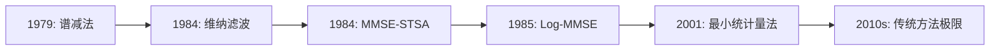

# 第二章：传统降噪算法 - 总结与整合

## 📖 本章学习路线图

```
理解问题本质（第一章）
    ↓
学习传统方法演进（本章）
    ├─ 2.1 谱减法：直观的起点
    ├─ 2.2 维纳滤波：统计优化
    ├─ 2.3 统计模型方法：精细建模
    └─ 2.4 共同困境：传统方法的极限
    ↓
期待深度学习破局（第三章）
```

---

## 🎯 本章核心目标达成情况

### 目标1：掌握传统算法的演进逻辑 ✅
我们学习了从简单到复杂的演进路径：
1. **谱减法**（1979）：直观的减法思想
2. **维纳滤波**（1984）：统计最优框架
3. **MMSE-STSA**（1984）：精细概率建模
4. **Log-MMSE**（1985）：感知优化

### 目标2：理解每个方法的设计动机 ✅
- **谱减法**：最直接的想法，但问题多
- **维纳滤波**：用统计理论改进谱减法
- **统计方法**：用更精确的模型提升性能
- **困境分析**：理解传统方法的根本局限

### 目标3：培养工程权衡思维 ✅
- 性能 vs. 复杂度
- 抑制噪声 vs. 保留语音
- 理论最优 vs. 工程可行
- 参数调优 vs. 自适应能力

---

## 📊 方法对比总览

### 演进时间线


### 性能对比表
| 指标 | 谱减法 | 维纳滤波 | MMSE-STSA | Log-MMSE |
|------|--------|----------|-----------|----------|
| **SNR改善** | 5-10dB | 8-12dB | 10-15dB | 10-15dB |
| **PESQ分数** | 2.0-2.5 | 2.3-2.8 | 2.5-3.0 | 2.6-3.1 |
| **音乐噪声** | 严重 | 轻微 | 很少 | 很少 |
| **计算复杂度** | 很低 | 低 | 中等 | 中等 |
| **参数敏感性** | 高 | 中 | 中 | 中 |
| **实时性** | 优秀 | 优秀 | 良好 | 良好 |

### 适用场景建议
| 方法 | 推荐场景 | 避免场景 |
|------|----------|----------|
| **谱减法** | 快速原型、教学演示、轻度噪声 | 高质量要求、非平稳噪声 |
| **维纳滤波** | 实时系统、平稳噪声、资源受限 | 低SNR、复杂噪声混合 |
| **MMSE-STSA** | 离线处理、高质量要求、理论验证 | 实时性要求高、计算受限 |
| **Log-MMSE** | 感知质量重要、中等复杂度允许 | 嵌入式设备、低功耗 |

---

## 🔑 核心概念精要

### 1. 增益函数框架
所有传统方法都可以统一为**增益函数**：
$$\hat{S}(m,k) = G(m,k) \cdot Y(m,k)$$

不同方法设计不同的 $G(m,k)$：
- **谱减法**：$G = \sqrt{\max(1 - \frac{\sigma_n^2}{|Y|^2}, 0)}$
- **维纳滤波**：$G = \frac{\xi}{\xi + 1}$
- **MMSE-STSA**：复杂函数，依赖于先验SNR $\xi$ 和后验SNR $\gamma$

### 2. SNR的双重角色
- **后验SNR**：$\gamma = \frac{|Y|^2}{\sigma_n^2}$，可直接计算
- **先验SNR**：$\xi = \frac{\sigma_s^2}{\sigma_n^2}$，需要估计

**决策导向法**：$\hat{\xi}_t = α \frac{|\hat{S}_{t-1}|^2}{\sigma_n^2} + (1-α) \max(\gamma_t - 1, 0)$

### 3. 噪声功率谱估计
- **静音段平均**：最简单，假设噪声平稳
- **最小值追踪**：在滑动窗口内取最小值
- **递归平滑**：结合历史信息

### 4. 不适定问题的解决方案
传统方法通过**先验假设**解决不适定性：
1. 噪声平稳性假设
2. 语音-噪声不相关假设
3. 高斯分布假设
4. 短时平稳性假设

---

## ⚠️ 共同困境深度分析

### 困境的本质：假设与现实的矛盾
```python
# 理想假设 vs. 现实情况对比
ideal_assumptions = {
    "noise_stationary": True,      # 现实：非平稳
    "speech_noise_uncorrelated": True,  # 现实：可能相关  
    "gaussian_distribution": True,      # 现实：非高斯
    "short_term_stationary": True,      # 现实：边界不平稳
}

real_world = {
    "noise_types": ["stationary", "non-stationary", "impulsive"],
    "correlation": ["uncorrelated", "convolutional", "multiplicative"],
    "distributions": ["super-gaussian", "laplacian", "mixture"],
    "transitions": ["fast", "slow", "abrupt"]
}
```

### 性能天花板的原因
1. **模型容量有限**：线性或简单非线性模型
2. **特征表示有限**：手工设计的特征
3. **优化目标单一**：通常只优化MSE
4. **闭式解约束**：需要简化假设才能得到解析解

### 工程实现挑战
1. **参数调优**：需要专家知识和大量实验
2. **场景适应**：换场景需重新调参
3. **实时性平衡**：复杂方法难以实时
4. **鲁棒性设计**：处理异常情况的复杂性

---

## 🧠 思维框架建立

### 1. 问题分析框架
遇到降噪问题，思考：
1. **信号模型**：加性？卷积？非线性？
2. **噪声特性**：平稳？有色？脉冲？
3. **性能要求**：质量？可懂度？实时性？
4. **资源约束**：计算量？内存？功耗？

### 2. 方法选择框架
根据场景选择方法：
```
if 实时性要求高 and 资源受限:
    考虑谱减法或维纳滤波
elif 质量要求高 and 计算资源充足:
    考虑统计模型方法
elif 噪声复杂多变:
    可能需要深度学习方法
```

### 3. 参数调优框架
1. **理解参数物理意义**
2. **确定调优范围**
3. **设计评估指标**
4. **自动化搜索（如网格搜索）**
5. **验证泛化能力**

### 4. 性能评估框架
多维度评估：
- **客观指标**：SNR改善、PESQ、STOI
- **主观听感**：自然度、可懂度、舒适度
- **工程指标**：RTF、内存占用、功耗
- **鲁棒性**：不同场景、不同SNR

---

## 💻 实践指南

### 代码实现建议
1. **从简单开始**：先实现谱减法
2. **逐步复杂化**：添加维纳滤波、统计方法
3. **模块化设计**：分离噪声估计、增益计算、重建
4. **参数可配置**：便于实验比较

### 实验设计建议
```python
# 实验框架示例
experiments = {
    "noise_types": ["white", "pink", "babble", "street"],
    "snr_levels": [-10, -5, 0, 5, 10],
    "methods": ["spectral_subtraction", "wiener", "mmse_stsa"],
    "metrics": ["snr_improvement", "pesq", "stoi", "rtf"]
}
```

### 调试技巧
1. **可视化中间结果**：频谱图、增益图、时域波形
2. **参数敏感性分析**：观察参数变化对性能的影响
3. **异常情况测试**：静音、冲击、削波等
4. **对比基准**：与原始信号、理想方法对比

---

## 🔗 与后续章节的联系

### 传统方法为深度学习奠定基础
1. **问题定义**：明确了降噪的目标和挑战
2. **评估体系**：建立了科学的评价标准
3. **表示学习**：STFT作为标准输入表示
4. **增益函数思想**：所有方法的核心框架

### 深度学习的突破点
传统方法的困境正是深度学习的机遇：
1. **假设过强** → 数据驱动，无需显式假设
2. **泛化能力差** → 端到端学习，自动适应
3. **非线性能力弱** → 神经网络，强大非线性建模
4. **性能天花板** → 大规模数据，超越传统极限

### 学习路径的连续性
```
传统方法（理解局限）
    ↓
深度学习（学习破局）
    ↓
轻量化设计（工程实现）
    ↓
GTCRN（综合应用）
```

---

## 📚 关键参考文献回顾

### 必读经典论文
1. **Boll (1979)** - 谱减法的开创工作
2. **Ephraim & Malah (1984)** - 维纳滤波和MMSE-STSA
3. **Ephraim & Malah (1985)** - Log-MMSE
4. **Martin (2001)** - 最小统计量法

### 推荐教材章节
- Loizou *Speech Enhancement*: Chapters 5-8
- Benesty *Noise Reduction*: Chapters 3-5

### 开源资源
- **Python**: `librosa`、`pysepm`
- **MATLAB**: Voicebox工具箱
- **C++**: SpeexDSP、WebRTC

---

## 🎓 学习成果自测

### 概念理解检查
- [ ] 能解释谱减法产生音乐噪声的原因
- [ ] 能推导维纳滤波器的闭式解
- [ ] 理解先验SNR和后验SNR的区别
- [ ] 能说明决策导向法的递归机制
- [ ] 理解传统方法的四大共同困境

### 实践能力检查
- [ ] 能实现基本的谱减法
- [ ] 能实现维纳滤波（含决策导向）
- [ ] 能进行参数调优实验
- [ ] 能评估不同方法的性能
- [ ] 能分析传统方法的局限性

### 思维框架检查
- [ ] 形成了方法选择的判断框架
- [ ] 理解了性能-复杂度的权衡思维
- [ ] 掌握了多维度评估的方法
- [ ] 能够批判性分析方法的假设

---

## 🏆 本章核心收获

### 1. 历史视角的建立
理解了语音降噪40年的发展脉络：
- 从直觉方法到统计方法
- 从简单模型到精细模型
- 从独立研究到系统理论

### 2. 工程思维的培养
学会了在约束条件下做决策：
- 理论最优 vs. 工程可行
- 性能提升 vs. 复杂度增加
- 通用性 vs. 专用性

### 3. 问题意识的深化
认识到降噪的根本挑战：
- 不适定问题的本质
- 假设与现实的矛盾
- 人类先验知识的局限

### 4. 未来方向的明确
看到了传统方法的极限和深度学习的必然：
- 传统方法接近性能天花板
- 深度学习提供突破可能
- 需要新的范式和方法

---

## 🚀 下一章预告：深度学习破局

### 从传统到深度学习的跨越
在下一章，我们将学习：
1. **为什么深度学习能成功**：数据驱动 vs. 手工设计
2. **早期尝试**：DNN作为映射函数
3. **架构演进**：CNN → RNN → Encoder-Decoder
4. **核心突破**：端到端学习、自动特征提取

### 学习重点转变
从本章的**数学推导**和**参数调优**，转向：
- **网络架构设计**
- **损失函数选择**
- **训练策略优化**
- **数据驱动思维**

### 思维模式升级
从**基于假设的建模**转向**基于数据的建模**：
```
传统：假设 → 模型 → 优化 → 验证
深度学习：数据 → 网络 → 训练 → 评估
```

---

## 💎 最终寄语

**传统降噪算法**不仅是一系列技术方法，更是一部**工程思维的发展史**：

1. **谱减法**教会我们：最直接的想法往往问题最多
2. **维纳滤波**教会我们：统计理论可以指导工程实践
3. **统计方法**教会我们：精细建模带来性能提升
4. **困境分析**教会我们：认识局限才能寻求突破

记住这些方法的**核心思想**，而不仅仅是数学公式。当你学习深度学习方法时，你会看到：
- 谱减法的**增益函数思想**在神经网络中延续
- 维纳滤波的**统计优化框架**被端到端学习取代
- 传统方法的**先验假设**被大规模数据学习

**传统不是过去，而是未来的基石。**

---

*恭喜完成第二章学习！现在，带着对传统方法局限性的深刻理解，准备进入深度学习的精彩世界。*

